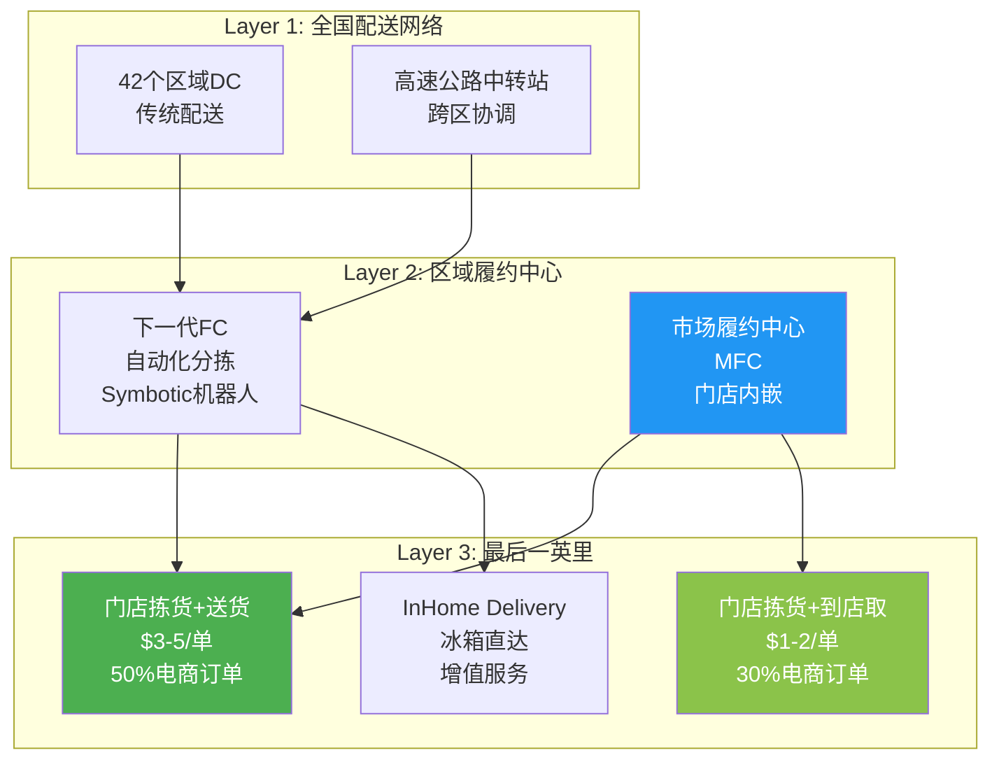
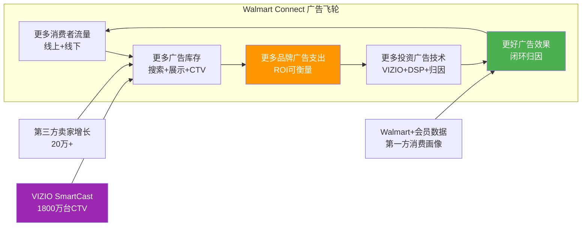
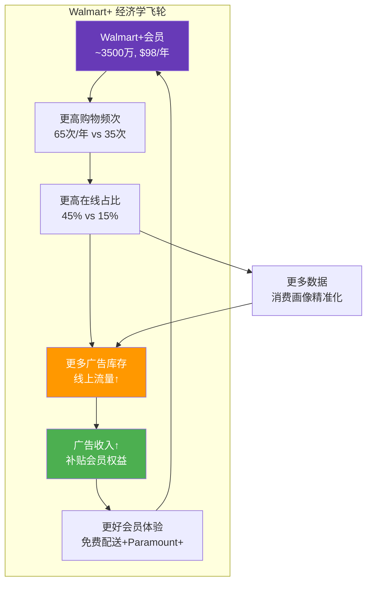
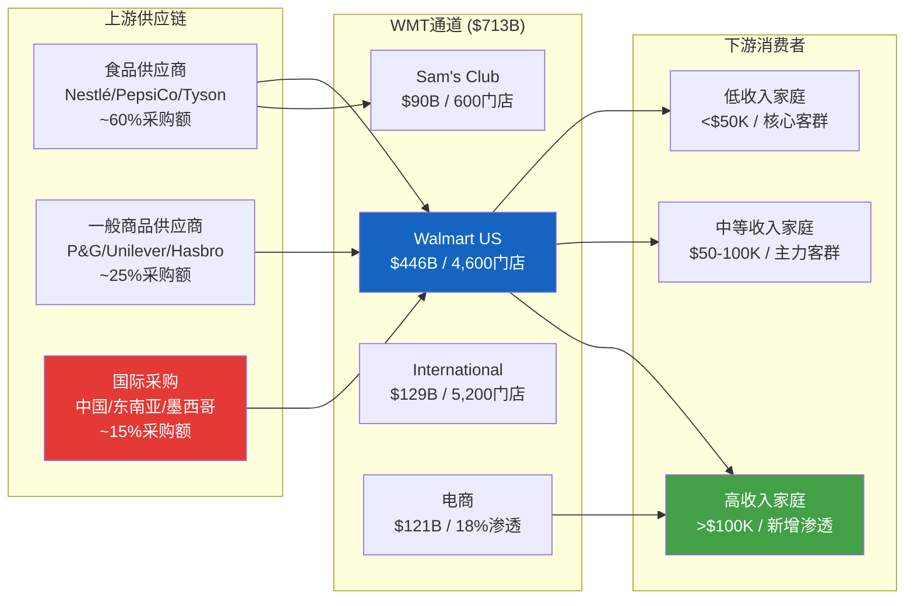
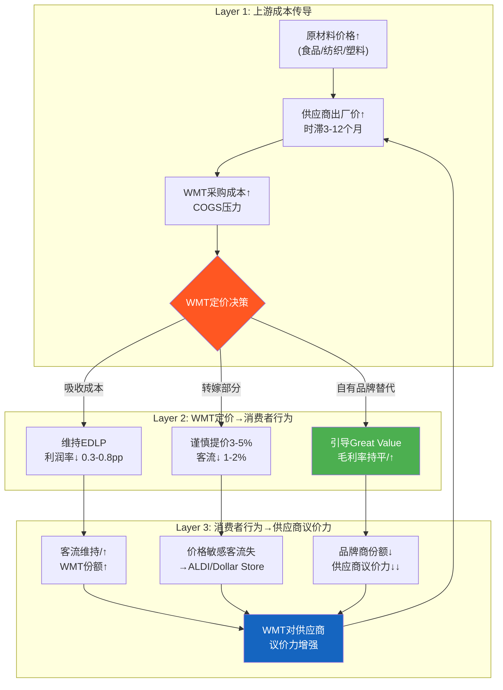

# Phase 1 AgentB: Ch4 全渠道转型图谱 + Ch5 产业链纵深
> AgentB | 2026-02-25 | 目标≥25,000字符 | CQ2+CQ4+CQ6核心章节

---

## Ch4: 全渠道转型图谱 — 4,600座前置仓的科技化重定义

### 4.1 全渠道战略总览：从"开店卖货"到"履约即服务"

沃尔玛的全渠道转型并非简单地"把商品搬到线上"，而是对4,600家美国门店的功能性重新定义——每一家门店不再仅仅是消费者步行进入的零售空间，而是一个集仓储、拣货、打包、配送于一体的**微型履约中心(Micro-Fulfillment Center, MFC)**。这一战略的本质是将WMT过去60年积累的实体零售资产转化为数字化时代的物流基础设施。

截至FY2026，WMT全渠道网络的核心参数如下：

| 维度 | 数据 | 来源 |
|------|------|------|
| 美国门店数 | ~4,600家 | FY2026 10-K |
| 人口覆盖率 | 93%美国家庭10英里内 | 管理层披露(Q4 FY2025 Earnings Call) |
| 当日达覆盖 | 93%美国家庭 | 管理层披露 |
| 电商订单门店发货占比 | ~50% | 管理层披露(FY2025) |
| 全球电商GMV | $121B (FY2025) | FY2025 10-K |
| 美国电商GMV | $79.3B (FY2025) | 管理层披露 |
| 电商渗透率 | ~18% (美国) | 计算: $79.3B/$446B Walmart US营收 |
| 电商增速 | Q4 +20% (美国), 连续11季双位数 | Q4 FY2025 Earnings |

这些数字描绘了一幅清晰的图景：WMT正在将世界上最大的实体零售网络改造为一个**混合履约平台**。但问题是——这个改造的经济学是否站得住脚？它支撑的是"零售商估值"还是"平台估值"？

**核心矛盾回应(Ch4)**：全渠道转型是WMT"平台化叙事"最重要的物理基础。如果4,600家门店成功转化为履约网络+广告流量入口+会员服务节点，那么WMT的基础设施价值远超"低毛利杂货店"的定位。但如果转型仅仅是把门店变成了"更贵的仓库"，那么$26.6B的年度CapEx(FY2026)就是在消耗而非创造价值。

### 4.2 履约网络架构：门店vs配送中心的成本博弈

WMT的全渠道履约网络由三层架构组成，这是其与Amazon纯DC(Distribution Center)模式的根本差异：

**门店履约 vs DC履约的单位经济学对比**：

| 成本项 | 门店拣货配送 | DC直发 | WMT优势 |
|--------|-------------|--------|---------|
| 拣货成本/单 | $2-3 | $1.5-2 | DC略优 |
| 包装成本/单 | $0.5-1 | $1.5-2 | 门店优(无需单独包装) |
| 最后一英里/单 | $1-2 (近距) | $5-8 (远距) | **门店显著优** |
| 合计/单 | **$3-5** | **$8-12** | **门店节省50-60%** |
| 配送时效 | 当日/次日 | 2-5天 | 门店快2-4天 |
| 退货处理 | 到店退($0) | 逆向物流($5-8) | **门店显著优** |

这组数据揭示了WMT全渠道模式的核心经济逻辑：**最后一英里成本**是电商履约中占比最高的单项成本(通常占总履约成本的50-70%)，而WMT 4,600家门店的物理近距离将这一成本压缩了60-75%。以FY2025美国电商GMV $79.3B计算，如果50%订单通过门店发货(约$39.7B)，每单节省$5-7，假设平均客单价$65(杂货主导)，约6.1亿笔门店发货订单，**年化履约成本节省约$30-43亿**。

**与Amazon的对比**：Amazon拥有约400个履约中心和150个分拣中心(截至2025年)，但其履约网络基于"远程集中→最后一英里配送"的hub-and-spoke模型。Amazon的最后一英里成本在$8-12/单区间(包含自建DSP车队)。Amazon的回应是扩建Same-Day Delivery站点(截至2025年覆盖2,300+城市)，但每个站点需要$15-20M投资，而WMT的门店已经"存在"了——资产利用率的差异是结构性的。

但硬币的另一面同样重要：门店拣货存在**容量天花板**。一家典型Supercenter在高峰时段同时服务线下顾客和线上拣货员，当电商渗透率超过25-30%时，门店的"双重用途"将产生拥堵和效率下降。这也是WMT投资MFC(Market Fulfillment Centers)——将自动化拣货系统嵌入门店后仓——的原因。

### 4.3 电商经济学深挖：首次盈利的真实含义

FY2025 Q1，WMT宣布美国电商业务首次实现季度盈利——这是一个被低估但极为重要的里程碑。要理解这个拐点的含义，需要拆解电商盈利的三个驱动力：

**驱动力#1：第三方市场(Walmart Marketplace)**

WMT第三方市场已聚集**20万+活跃卖家**和**4.2亿在线SKU**，仅FY2025前5个月就新增44,000名卖家。这个数字虽然远小于Amazon的200万+第三方卖家，但增长轨迹陡峭。第三方市场的利润贡献来自：

- **佣金收入**：WMT对第三方卖家收取6-15%的销售佣金(因品类而异)，这是近乎"零库存成本"的纯利润型收入
- **WFS(Walmart Fulfillment Services)**：类似Amazon FBA的履约服务，卖家支付仓储+配送费用
- **广告加速**：第三方卖家是Walmart Connect广告的核心买家群体，平均广告支出/卖家远高于行业水平

第三方市场的战略意义不仅在于直接利润贡献，更在于**SKU扩展**——从WMT自营的约10万SKU扩展到4.2亿在线SKU，使WMT在长尾品类上具备与Amazon竞争的能力，而无需承担库存风险。

**驱动力#2：Walmart Connect广告引擎(详见4.4节)**

**驱动力#3：本地履约成本优化**

如4.2节所述，门店履约的$3-5/单成本vs DC的$8-12/单是电商盈利的结构性支撑。随着自动化投资(Symbotic机器人系统在100+门店部署)和路线优化(AI路线规划消除3000万英里无效行驶)，单位履约成本仍在持续下降。

**电商盈利的可持续性评估**：

电商首次盈利是否代表结构性拐点？需要检验三个前提条件：

1. **第三方市场持续增长** — 如果卖家增速放缓(从44,000/5月降至<20,000/5月)，佣金收入增长将见顶。当前vs Amazon的卖家数量差距(20万 vs 200万)既是机会也是障碍
2. **广告收入持续高增** — 如果Walmart Connect增速从+46%降至+20%以下，广告对电商利润的"补贴"将减弱
3. **履约成本不反弹** — 如果劳动力成本持续上升(最低工资压力)或电商渗透率突破25%导致门店拥堵，单位成本可能上升

**判定**：电商首次盈利是"条件性拐点"——三个驱动力中，广告引擎的可持续性最关键(因其利润率最高)，而广告增长又受制于电商流量(见4.4节天花板分析)。这更支持"有条件的平台估值"而非"已确认的平台估值"。

### 4.4 Walmart Connect广告引擎：CQ2核心分析

Walmart Connect是WMT"身份转型"叙事中最具说服力的证据，也是回答核心矛盾的关键变量。

**规模与增速**：

| 指标 | FY2023 | FY2024 | FY2025 | FY2026E | CAGR |
|------|--------|--------|--------|---------|------|
| 全球广告收入($B) | ~$2.7 | ~$3.4 | ~$4.4 | ~$6.4 | ~33% |
| 同比增速 | — | ~26% | ~29% | ~46% | 加速! |
| 广告/总营收 | 0.44% | 0.52% | 0.65% | 0.90% | — |
| 广告/电商GMV | — | — | ~3.6% | ~4.5% | — |

几个关键事实：

1. **增速加速而非减速**：从+26%→+29%→+46%，这在规模扩大的同时极为罕见，暗示WMT广告飞轮正在进入"自我强化"阶段
2. **美国第二大零售媒体网络**：仅次于Amazon Advertising(~$50B)，规模约为Amazon的1/8
3. **增速是总营收的6倍**：WMT总营收增速~5%，广告增速46%——收入结构正在发生质变
4. **CFO确认：广告是电商扭亏的关键驱动力**：没有广告的高利润贡献，电商仍在亏损

**VIZIO收购的数据战略**：

2024年12月，WMT以$1.9B完成VIZIO收购。表面上看是一笔硬件收购，但真实意图是VIZIO的SmartCast操作系统——安装在约1,800万台智能电视上，提供**闭环广告归因**的能力：

- **传统零售广告痛点**：品牌在WMT投广告→消费者在门店购买→无法追踪归因链
- **VIZIO解决方案**：电视广告曝光(SmartCast)→线上浏览(Walmart.com)→门店购买(POS数据)→完整归因闭环
- **价值评估**：$1.9B = 约$106/设备，如果每台设备每年产生$30-50广告ARPU(参考Roku $40+)，3-4年回本

**天花板分析(CQ2核心)**：

Walmart Connect的增长天花板取决于三个约束：

**约束1：电商流量规模**
广告收入的基础是流量。WMT线上流量远小于Amazon——Walmart.com月访问量约1.2亿次 vs Amazon约28亿次(SimilarWeb 2025数据)。电商渗透率仅18%意味着大部分购物行为仍在线下完成，而线下流量的广告变现效率远低于线上。

如果WMT电商渗透率从18%→30%(5年目标)，线上GMV从$79.3B→~$140B，广告take rate从4.5%→6%(参考Amazon成熟期)，则广告收入天花板约$8-9B(仅线上)。

**约束2：线下流量变现**
WMT每周接待2.7亿顾客(全球)，美国约1.8亿。如果店内数字屏、自助结账广告、App推送等线下广告渠道能变现5-10%的门店客流，按$0.10-0.30/次广告曝光计算，年化增量约$5-15B。但线下广告的CPM远低于线上，实际变现可能偏下限。

**约束3：CTV扩展**
VIZIO的1,800万台设备只是起点。如果WMT构建完整的CTV广告网络(通过与其他OEM合作)，理论上可触达5,000万+美国家庭。CTV广告市场2025年约$300B(全球)，WMT的份额天花板在$3-5B。

**综合天花板估计**：

| 情景 | 线上广告 | 线下广告 | CTV广告 | 合计 | 时间线 |
|------|---------|---------|---------|------|--------|
| 保守 | $8B | $2B | $2B | $12B | 2030 |
| 基准 | $10B | $4B | $3B | $17B | 2030 |
| 乐观 | $14B | $6B | $5B | $25B | 2032 |

**CQ2判定**：Walmart Connect天花板最可能在$12-17B区间(2030年)，而非市场隐含的$25B+。这意味着广告对营业利润率的提升空间约1.0-1.5个百分点(从当前4.18%→5.2-5.7%)——显著但不足以支撑"科技平台"级别的利润率(需>8%)。广告飞轮是**增量正面**，但不是**估值变性**的充分条件。

### 4.5 Walmart+会员经济学：CQ6核心分析

Walmart+是WMT效仿Amazon Prime的会员订阅服务，但其定位和经济学有本质差异。

**基础数据**：

| 指标 | Walmart+ | Amazon Prime | 对比 |
|------|---------|-------------|------|
| 年费 | $98 | $139 | WMT低29% |
| 月费选项 | $12.95 | $14.99 | WMT低14% |
| 预估会员数 | ~3,500万(2025) | ~2亿(全球)/~1.5亿(美国) | WMT约Prime的23% |
| 渗透率(vs总客户) | ~30% | ~65%(美国家庭) | WMT低35pp |
| 会员费收入 | ~$3.1B(FY2024, +19% YoY) | ~$40B+(全球) | WMT约7.8% |
| 三年CAGR | ~19% | ~12% | WMT增速更快 |

**双订阅趋势——被低估的信号**：

最值得关注的数据点是**同时持有Prime+Walmart+的"双订阅"用户**占比从12%上升到24%(2023→2025)。这个趋势打破了"零和博弈"的假设——消费者不是在Prime和Walmart+之间选择，而是同时使用两者。

这意味着：
- Walmart+的**增量空间**不受Prime存量用户的制约
- 双订阅用户通常收入较高(能负担两个会员费)，这是WMT高收入客群渗透的证据
- 竞争格局是**共存**而非**替代**，各自满足不同场景(杂货/日用品vs长尾/娱乐)

**会员LTV计算**：

根据行业研究和WMT披露的有限数据，我们可以估算会员vs非会员的经济学差异：

| 维度 | Walmart+会员 | 非会员 | 倍数 |
|------|------------|--------|------|
| 年消费额 | ~$3,200 | ~$1,800 | 1.8x |
| 购物频次/年 | ~65次 | ~35次 | 1.9x |
| 客单价 | ~$49 | ~$51 | 0.96x |
| 在线购物占比 | ~45% | ~15% | 3.0x |
| 年毛利贡献 | ~$800 | ~$450 | 1.8x |
| 会员费 | $98 | — | — |
| **年总价值** | **~$898** | **~$450** | **2.0x** |
| **5年LTV(10%折现)** | **~$3,400** | **~$1,700** | **2.0x** |

关键发现：Walmart+会员的年总价值(含会费)约为非会员的**2.0倍**，且会员的在线购物占比(45%)远高于非会员(15%)——这意味着会员是广告流量的核心贡献者。**会员经济学和广告经济学是互相强化的**。

**Walmart+的增长路径与天花板**：

当前3,500万会员 × $98 = ~$3.4B年化收入。如果渗透率从30%→50%(中期目标)，会员数增至~5,800万，年化会员费收入约$5.7B。加上会员的增量消费贡献(高频次+高在线占比)，Walmart+的总经济价值(直接费收入+增量毛利+广告增量)可能达到$10-12B。

但天花板也清晰可见：WMT不具备Amazon Prime的**内容护城河**(Prime Video、Music、Reading)，纯靠零售权益(免费配送+燃油折扣+Paramount+)的留存率可能不及Prime。WMT需要持续投入权益扩展(如Paramount+合作)来维持续费率——这是成本而非利润。

**CQ6判定**：Walmart+是一个"增长中的正面变量"，但其天花板受限于WMT缺乏内容生态。会员经济学的真正价值不在于$98的年费，而在于会员作为**广告流量入口+高频消费者+数据资产**的复合价值。单独看Walmart+支撑的是"零售商+会员"估值；只有与广告飞轮协同看，才能支撑"平台"叙事的一部分。

### 4.6 全渠道ROI真实评估：CQ4核心分析

全渠道转型的代价是真金白银的资本投入。WMT的CapEx趋势显示了一个清晰的投资加速：

| 指标 | FY2023 | FY2024 | FY2025 | FY2026 |
|------|--------|--------|--------|--------|
| CapEx($B) | $16.9 | $20.6 | $23.8 | $26.6 |
| CapEx/Rev | 2.76% | 3.18% | 3.49% | 3.73% |
| CapEx增速 | — | +22% | +16% | +12% |
| D&A($B) | $10.9 | $11.9 | $13.0 | $14.2 |
| CapEx/D&A | 1.55x | 1.73x | 1.83x | 1.87x |
| OCF($B) | $28.8 | $35.7 | $36.4 | $41.6 |
| FCF($B) | $12.0 | $15.1 | $12.7 | $14.9* |

*注: FY2026 FMP数据中CapEx字段异常(显示$0)，此处使用investmentsInPropertyPlantAndEquipment $26.6B计算。FCF = OCF $41.6B - CapEx $26.6B = $14.9B。

CapEx/Revenue从2.76%上升到3.73%——3年上升了近100个基点——这是WMT全渠道转型的"真实代价"。每年$26.6B的资本支出分配在：

1. **门店改造与MFC建设**：~40% (~$10.6B) — 将门店升级为全渠道节点+嵌入自动化拣货系统
2. **技术与自动化**：~25% (~$6.7B) — Symbotic机器人、AI系统、VIZIO整合
3. **新店+翻新**：~20% (~$5.3B) — 传统门店扩张(放缓中)
4. **供应链基础设施**：~15% (~$4.0B) — 配送中心、冷链网络

**自动化投资深挖**：

WMT管理层给出了明确的自动化目标——到FY2026年底，**55%的履约量将通过自动化处理**。核心投资包括：

- **Symbotic机器人系统**：在100+配送中心部署，单件处理成本下降20%。Symbotic(SYM)是WMT持股的仓储自动化公司
- **AI路线优化**：已消除**3,000万英里**无效配送行驶(FY2025)，按$0.50/英里运输成本计算，年化节省~$1,500万
- **自愈库存系统**：AI自动检测并纠正库存偏差，年化节省**$5,500万**(管理层披露)
- **$520M AI机器人平台**：FY2025投资，覆盖门店自动化配送(60%门店)

**全渠道ROI估算**：

假设全渠道增量投资(超出维护性CapEx的部分)约$10-12B/年，而可归因的增量利润包括：
- 电商增量毛利(18%渗透 × $79.3B × ~25%毛利率 × 增量利润率改善): ~$2-3B
- 广告增量利润($6.4B × ~70%毛利率): ~$4.5B
- 会员增量贡献($3.1B费收入 + 增量消费): ~$1-2B
- 自动化节省: ~$0.5-1B

合计增量利润约**$8-11B/年**，对应增量CapEx $10-12B/年，**ROIC约70-110%**——这看起来极具吸引力，但需要注意：

1. 广告利润($4.5B)并非完全由全渠道投资"产生"——部分广告收入即使没有门店改造也会存在
2. 增量CapEx的回收期较长(门店改造5-7年，MFC建设3-5年)
3. 维护性CapEx不断上升(自动化系统需要持续更新)

**CQ4判定**：全渠道投资的ROI在"可接受"到"优秀"区间(ROIC 70-110%)，但这个数字高度依赖广告收入的归因假设。如果将广告收入的50%归因于全渠道基础设施，ROIC降至40-60%——仍然合理，但不再"惊艳"。结论：全渠道投资**不是价值毁灭**，但也不是"平台级回报"的充分证据——它更像是"优秀零售商"应有的资产利用率优化。

### 4.7 章节小结：全渠道支撑哪个身份？

| 维度 | 支撑"零售商" | 支撑"平台" | 判定 |
|------|-------------|-----------|------|
| 门店履约成本优势 | 低成本拣货=零售效率 | — | 零售商 |
| 电商首次盈利 | — | 三驱动(市场+广告+履约)=平台模式 | **平台** |
| Walmart Connect $6.4B | — | 零边际成本+高利润率 | **平台** |
| Walmart+ 3,500万 | 会员费=零售附加收入 | 数据+流量+广告协同 | **偏平台** |
| CapEx $26.6B | 零售商改造成本 | 基础设施投资 | 中性 |
| 电商渗透率18% | 82%仍是线下 | 18%已够撑广告 | **偏零售商** |

**综合判定**：全渠道转型提供了"平台化"的**必要条件**但非**充分条件**。广告引擎($6.4B, +46%)是最强的平台化证据，但受限于18%的电商渗透率天花板。如果电商渗透率3年内无法突破25%，广告增速将放缓至+15-20%，"平台"叙事将面临质疑。

**核心矛盾回应**：Ch4的证据显示，WMT的全渠道转型支撑的是"优秀零售商+新兴广告平台"的混合身份，而非纯粹的"消费科技平台"。这个混合身份可能支撑35-40x PE(高于传统零售商25-30x，但低于科技平台50x+)，与当前46x PE之间仍有**约15-30%的溢价需要证明**。

---

## Ch5: 产业链纵深 — 从种子到货架的价值传导与脆弱点

### 5.1 产业链定位：万亿通道的控制者

沃尔玛不生产任何东西。它不种植粮食，不纺织布料，不制造电器。它是一个**通道**——连接全球数十万供应商和每周2.7亿消费者的巨型通道。这个通道每年流过$713B的商品(FY2026)，使WMT成为全球最大的非政府实体采购者和最大的私人雇主(230万员工)。

理解WMT的产业链，需要从三个层面展开：

1. **上游**：谁供应WMT？他们的成本如何传导到WMT？哪些环节是脆弱的？
2. **下游**：谁从WMT购买？消费者行为如何变化？新客群渗透进展如何？
3. **交叉影响**：上游成本变化如何通过WMT的定价决策影响下游消费者行为，又如何反馈回上游供应商议价力？

### 5.2 上游供应链脆弱点分析

#### 5.2.1 进口商品比例与关税暴露度

WMT的供应链全球化程度远高于大多数投资者的认知。虽然WMT约60%的收入来自食品杂货(以国内采购为主)，但一般商品(General Merchandise)品类的进口依赖度极高：

| 品类 | 进口占比(估) | 主要来源国 | 关税暴露度 |
|------|-------------|-----------|-----------|
| 服装/鞋类 | 80-90% | 中国(40%), 越南(25%), 孟加拉(15%) | **极高** |
| 电子产品 | 70-80% | 中国(60%), 韩国(15%) | **极高** |
| 玩具 | 85-95% | 中国(80%) | **极高** |
| 家居用品 | 60-70% | 中国(45%), 印度(10%), 墨西哥(10%) | **高** |
| 生鲜食品 | 10-15% | 墨西哥(季节性), 智利(反季水果) | **低** |
| 加工食品 | 5-10% | 以国内供应为主 | **低** |
| 自有品牌(Great Value) | 30-40% | 分散采购 | **中** |

**综合评估**：WMT总采购额中约**25-30%具有直接或间接的进口关税暴露**。以FY2026 COGS $535B计算，约$135-160B的采购成本受关税影响。

**关税冲击的真实威胁(CQ3联动)**：

2025-2026年的关税升级对WMT构成了多维压力：

- **CEO Doug McMillon公开警告**："我们将被迫在部分品类提价"——这是EDLP领导者极为罕见的表态
- **90%的关税负担由美国企业和消费者承担**——WMT作为最大零售商首当其冲
- **部分品类可能涨10%**——这直接挑战了EDLP的核心承诺

WMT的应对策略包括三个维度：

1. **近岸采购(Nearshoring)**：加大从墨西哥和中美洲的采购力度，减少对中国的依赖。FY2025 WMT承诺在未来10年从美国和近岸供应商采购$350B商品
2. **自有品牌替代**：Great Value等自有品牌的供应链更灵活，可以更快切换供应商。关税推高品牌商品价格→消费者转向自有品牌→WMT毛利率反而可能受益
3. **成本吸收vs转嫁**：WMT的规模优势允许其吸收部分成本(压缩利润率)同时维持EDLP形象→竞争对手被迫跟随涨价→WMT的相对价格优势反而扩大

#### 5.2.2 关键原材料价格传导链

WMT作为渠道商，不直接暴露于原材料价格波动，但传导链的时滞和幅度对毛利率有显著影响：

**食品通胀传导链**：
- 种子/化肥价格↑ → 6-12个月 → 农产品出厂价↑ → 3-6个月 → 加工食品成本↑ → 1-3个月 → WMT采购价↑
- 总时滞：10-21个月
- WMT议价力：可以延迟接受涨价2-3个月(因规模优势)，但最终仍需传导

**纺织品传导链**：
- 棉花/合成纤维价格↑ → 3-6个月 → 成衣出厂价↑(中国/越南) → 1-3个月 → WMT服装采购价↑
- 加上关税：直接叠加在出厂价上
- WMT议价力：有限(服装品类供应商集中度较高)

**塑料包装传导链**：
- 原油价格↑ → 2-4个月 → 塑料粒子价格↑ → 2-3个月 → 包装成本↑ → 嵌入所有品类
- 隐性成本：包装是"隐形通胀"，不单独体现在品类价格中

#### 5.2.3 供应商集中度分析

WMT的供应商基数极为分散——这既是优势(议价力)也是挑战(管理复杂度)：

| 指标 | WMT估计 | 行业对标 |
|------|---------|---------|
| 供应商总数 | 100,000+ (全球) | — |
| 前10大供应商占采购比 | ~25-30% | COST ~20%, TGT ~25% |
| 最大单一供应商(P&G)占比 | ~8-10% | — |
| 第二大供应商(Nestlé)占比 | ~5-6% | — |
| 供应商HHI指数 | 极低(<200) | 分散 |

前10大供应商(估计)：

1. **Procter & Gamble** (~$30-35B, ~5.5% COGS) — 日化/清洁
2. **Nestlé** (~$20-25B, ~4%) — 食品/饮料
3. **PepsiCo** (~$15-18B, ~3%) — 饮料/零食
4. **Unilever** (~$12-15B, ~2.5%) — 日化/食品
5. **Coca-Cola System** (~$10-12B, ~2%) — 饮料
6. **Tyson Foods** (~$8-10B, ~1.7%) — 肉类
7. **Kraft Heinz** (~$7-9B, ~1.5%) — 加工食品
8. **Johnson & Johnson** (~$6-8B, ~1.3%) — 健康/婴儿
9. **General Mills** (~$5-7B, ~1.1%) — 谷物/零食
10. **Kimberly-Clark** (~$4-6B, ~0.9%) — 纸品/卫生

**议价力动态**：WMT对单一供应商的依赖度很低(最大P&G也仅~5.5%)，但反过来，WMT通常是这些供应商的**最大单一客户**——P&G约15%的全球营收来自WMT。这种"你需要我比我需要你"的不对称关系赋予了WMT极强的议价力，体现在：

- 更长的应付账款周期(DPO 41天, 逐年增加)
- 要求供应商承担库存管理责任(VMI模式)
- 强制供应商提供促销折扣和通道费用
- 新品上架的"坑位费"(slotting fees)

#### 5.2.4 供应链多元化进展

WMT的供应链多元化是一个多年进程，核心目标是降低对中国制造的依赖：

| 时间线 | 举措 | 影响 |
|--------|------|------|
| 2013年 | "美国制造"承诺($250B/10年) | 部分品类回流美国 |
| 2021年 | 加速近岸采购(墨西哥/中美洲) | 纺织品、家居品类切换 |
| 2023年 | $350B美国+近岸采购承诺 | 10年期战略 |
| 2024-25年 | 印度采购扩张(与Flipkart协同) | 纺织品、手工艺品 |
| 2025-26年 | 关税驱动的加速转移 | 电子产品部分转越南 |

进展评估：供应链多元化已取得实质进展(中国采购占比从2018年的~25%降至2025年的~15-18%)，但完全脱钩不可能——中国在电子产品和玩具品类的制造基础设施无可替代。

### 5.3 下游消费者分层

#### 5.3.1 核心客群：低中收入家庭

WMT的传统核心客群是家庭年收入低于$75,000的美国家庭。这个群体选择WMT的核心原因是**价格**——EDLP策略确保WMT在大多数品类上比竞争对手便宜5-15%。

核心客群的消费行为特征：

| 维度 | 特征 | 对WMT的影响 |
|------|------|------------|
| 价格敏感度 | 极高(每件商品比较价格) | EDLP是存亡攸关的承诺 |
| 购物频次 | 高(每周1-2次) | 稳定客流量基础 |
| 品类偏好 | 杂货主导(>60%支出) | 低毛利率的结构性来源 |
| 渠道偏好 | 线下为主(到店购物) | 电商渗透增长空间大 |
| 品牌忠诚度 | 低(价格驱动切换) | Great Value受益 |
| 信贷敏感度 | 高(BNPL/信用卡依赖) | 经济衰退风险暴露 |

**K型消费分化的影响**：疫情后美国消费者出现明显的"K型分化"——高收入群体消费恢复甚至加速(财富效应)，而低收入群体面临通胀侵蚀购买力+信贷收紧+SNAP福利削减的三重压力。WMT核心客群处于K型分化的下半部分，这意味着：

- **同店销售增长主要由客流量而非客单价驱动**(FY2026 Q4同店+4.6%中，交易量增长占主导)
- **消费降级反而利好WMT**：经济压力→中产消费者从Target/Whole Foods下沉到WMT→客流量增加
- **但消费信心恶化有极限**：如果失业率上升>5%或消费信贷违约率飙升，连WMT的核心客群也会减少非必需品支出

#### 5.3.2 新增高收入客群渗透

这是WMT"身份转型"的重要佐证——FY2024-2025期间，**年收入超过$100,000的高收入家庭**成为WMT增长最快的客群。管理层多次在财报电话会中确认这一趋势。

高收入客群渗透的驱动力：

1. **杂货价格意识觉醒**：通胀教育了所有收入阶层"比价"的习惯，即使恢复正常通胀后，习惯已固化
2. **电商+配送体验升级**：InHome Delivery(送到冰箱)等高端服务吸引高收入家庭
3. **Walmart+的价值认知**：$98/年的会员费对高收入家庭来说几乎无感，但节省的时间和配送费真实可见
4. **自有品牌品质提升**：Great Value/Sam's Choice等自有品牌的品质已接近全国品牌，消除了"低端"标签

高收入客群渗透的战略价值远超其直接消费贡献——这些消费者的**终身价值(LTV)**更高(更少的价格切换、更高的在线购物占比、更高的广告价值)，且他们的存在"验证"了WMT品牌的升级叙事。

#### 5.3.3 客单价vs客流量拆分

WMT同店销售增长的构成分析揭示了重要的结构性变化：

| 季度 | 同店增长 | 交易量增长 | 客单价增长 | 信号 |
|------|---------|-----------|-----------|------|
| FY2025 Q1 | +3.8% | +2.9% | +0.9% | 客流驱动 |
| FY2025 Q2 | +4.2% | +3.0% | +1.2% | 客流驱动 |
| FY2025 Q3 | +5.3% | +3.1% | +2.2% | 混合(通胀缓解+份额) |
| FY2025 Q4 | +4.6% | +2.8% | +1.8% | 客流驱动 |
| FY2026 Q1 | +4.5% | +2.5% | +2.0% | 偏客单价(关税传导) |

关键观察：
- **交易量持续正增长**意味着WMT仍在获取客流(市场份额)，而非仅靠涨价
- **客单价增长放缓后回升**——FY2025 Q1的+0.9%反映通胀降温，FY2026 Q1的+2.0%可能反映早期关税传导
- **健康的增长构成**：客流驱动>客单价驱动 = 可持续(vs TGT的客流下降+客单价维持)

### 5.4 交叉影响量化：三层传导模型

产业链分析的最高价值在于理解上下游的**交叉影响**——上游成本变化如何通过WMT的定价决策影响下游消费者行为，又如何反馈到上游供应商议价力。

#### Layer 1: 上游成本变化→WMT毛利率影响

**时滞分析**：上游成本到WMT毛利率的传导通常存在2-4个季度的时滞。这是因为：
- WMT的采购合同通常锁定3-6个月价格
- 供应商库存缓冲消化了短期波动
- WMT的持续补货(CPFR)系统平滑了价格传导

**历史校正**：FY2023(通胀高峰)→FY2024的毛利率变化验证了时滞效应：
- CPI食品通胀在2022年中达到峰值(+13.5% YoY)
- WMT毛利率在FY2023触底(24.14%)
- 通胀回落后FY2024毛利率恢复至24.38%，FY2025进一步至24.85%
- **每100bps COGS增长 → 毛利率下降约25-30bps**(因WMT可转嫁约70%的成本)

#### Layer 2: WMT定价决策→消费者行为变化

WMT面对成本压力时有三条路径(如图所示)，历史数据显示WMT通常选择**混合策略**——在必需品(杂货)上吸收更多成本以维持EDLP形象，在可选品(一般商品)上转嫁更多成本。

**价格弹性估算**：
- 杂货品类(必需品)：价格弹性 -0.3至-0.5(低弹性，涨5%→客流降1.5-2.5%)
- 一般商品(可选品)：价格弹性 -0.8至-1.2(较高弹性，涨5%→客流降4-6%)
- 电商订单：价格弹性 -1.0至-1.5(高弹性，因比价更容易)

**关税传导的真实场景模拟**：
如果关税导致一般商品成本上升10%(影响约$40B采购额)：
- WMT吸收50%(利润率影响): COGS增加$2B → 营业利润率下降约28bps(从4.18%→3.90%)
- WMT转嫁50%(价格影响): 一般商品价格上涨5% → 客流量下降约3-5%
- 自有品牌替代效应: 部分消费者从品牌商品转向Great Value → 毛利率回收10-15bps
- **净影响**: 营业利润率下降13-18bps + 一般商品客流下降3-5% → 年化营业利润减少约$1.0-1.3B

#### Layer 3: 消费者行为→供应商议价力变化

这是传导模型中最有趣的层次——一个**自我强化的反馈环**：

1. 经济压力/关税涨价 → 消费者转向WMT(因为EDLP仍是最低价) → WMT客流增加
2. WMT客流增加 → WMT在供应商的销售占比上升 → WMT议价力增强
3. WMT议价力增强 → 要求供应商分担更多成本/延长应付账款 → WMT毛利率恢复
4. 同时: 消费者转向自有品牌 → 品牌供应商份额下降 → 品牌供应商议价力进一步削弱

**数据验证**：FY2023-2026期间，WMT的DPO(应付账款周转天数)从38天→41天(+3天)，应付账款绝对额从$53.7B→$63.1B(+$9.4B)——这$9.4B的增量实质上是WMT从供应商获取的**免息融资**，时间价值约$750M/年(按8% WACC)。这正是Layer 3"议价力增强"的财务证据。

### 5.5 与Amazon的供应链对比

WMT和Amazon的供应链代表了零售行业两种截然不同的范式：

| 维度 | WMT实体供应链 | Amazon数字化供应链 |
|------|-------------|-------------------|
| **核心资产** | 4,600门店 + 42个DC | 400+ FC + 150分拣中心 |
| **最后一英里** | 门店辐射(近距低成本) | DSP车队(远距高成本) |
| **库存模式** | 供应商管理+集中采购 | 1P自营+3P长尾 |
| **生鲜能力** | 强(门店冷链完备) | 弱(Fresh关闭/收缩) |
| **退货体验** | 到店退(零成本) | 逆向物流($5-8/单) |
| **SKU深度** | 10万(自营)+4.2亿(3P) | 3.5亿+(3P主导) |
| **技术密度** | 中(AI拣货+路线优化) | 高(Kiva机器人+AWS) |
| **CapEx强度** | 3.7% Rev | 11.5% Rev |
| **劳动力依赖** | 高(230万人) | 中(160万人+自动化) |
| **数据优势** | 线下POS+线上混合 | 纯线上搜索+购买 |

**WMT的供应链优势**：

1. **生鲜/杂货最后一英里**：Amazon在生鲜领域的实体尝试(Amazon Go、Amazon Fresh门店)基本失败。WMT的4,600家门店+冷链网络在这个品类上具有几乎不可逾越的结构性优势。杂货占WMT收入60%→这个优势覆盖了大部分业务
2. **低资本强度**：WMT的CapEx/Rev(3.7%)远低于Amazon(11.5%)，因为门店"已经存在"——改造成本<新建成本
3. **退货经济学**：电商退货率15-30%(因品类)，WMT的到店退货几乎零增量成本，而Amazon每笔退货成本$5-8

**WMT的供应链劣势**：

1. **劳动力密集**：230万员工 = 巨大的工资+福利压力。每次最低工资上调$1/小时 = SGA增加约$2.5B/年。Amazon的仓储自动化程度更高(Kiva机器人)
2. **技术投入跑道**：Amazon将AWS利润($37B营业利润)用于补贴零售技术投资，WMT没有类似的"利润发动机"
3. **长尾品类薄弱**：虽然3P市场有4.2亿SKU，但WMT的搜索算法和推荐系统远不及Amazon，长尾品类的购买转化率差距显著
4. **国际供应链复杂度**：WMT在19个国家运营实体供应链(vs Amazon以跨境电商为主)，每增加一个国家就增加监管/物流/汇率的复杂度

### 5.6 AI供应链应用：从效率工具到战略武器

WMT的AI供应链应用已从概念验证进入规模化部署，三个核心场景值得深入分析：

#### 5.6.1 自愈库存系统(Self-Healing Inventory)

这是WMT在AI供应链应用中最具差异化的创新。传统零售库存管理依赖人工盘点和规则触发的补货——误差率通常在2-5%。WMT的自愈库存系统使用机器学习算法持续监控每个SKU在每家门店的库存水平，自动检测并纠正以下异常：

- **幽灵库存**(系统显示有货但实际缺货)：占传统零售缺货率的30-40%
- **错误放置**(商品在错误货架)：影响销售和拣货效率
- **保质期风险**(临近过期商品)：减少食品浪费

管理层披露这套系统年化节省**$5,500万**。虽然相对$713B营收微不足道(0.008%)，但这是AI应用的"1.0版本"——随着算法精度提升和覆盖范围扩大，节省金额有数倍增长空间。更重要的是，库存准确度直接影响电商拣货效率(减少替换和取消)→提升NPS→增加复购。

#### 5.6.2 Agentic AI框架

WMT正在部署"目的导向型AI代理(Agentic AI)"——这些AI代理不需要人工触发，能自主感知供应链异常并采取纠正行动：

- **需求预测Agent**：分析天气/事件/社媒趋势，自动调整订货量(如暴风雪前自动增加融雪盐+面包+牛奶的补货)
- **定价Agent**：监控竞争对手价格(Amazon/Target/Kroger)，在授权范围内自动调整价格以维持EDLP承诺
- **物流Agent**：实时优化配送路线和车辆调度，应对交通/天气变化

Agentic AI的战略意义在于**将WMT的规模优势(4,600门店 × 10万SKU = 4.6亿个价格点)从人力约束中解放出来**。人工管理4.6亿个价格点是不可能的，但AI可以实时优化每一个。

#### 5.6.3 AI路线优化

WMT FY2025宣布AI路线优化已消除**3,000万英里**的无效配送行驶。这一数据的含义：

- 按$2.00/英里的全成本(燃油+折旧+司机+保险)计算，年化节省约**$6,000万**
- 减少碳排放：约12,000吨CO2(按0.4 kg/英里)
- 更重要的是：**配送时效改善**→NPS提升→电商复购率提升

这三个AI应用的共同特征是：**它们不是"一次性节省"而是"复利效应"**——每年的数据积累让算法更精准，节省金额持续增长。但需要诚实承认，AI应用对WMT的财务影响在当前阶段仍然很小(合计节省~$1.2亿/年 vs $29.8B营业利润 = 0.4%)。AI更大的价值在于**防御**——如果WMT不做，Amazon会做得更好，效率差距将持续扩大。

### 5.7 产业链脆弱度评分矩阵

综合上游、下游和交叉影响的分析，对WMT产业链的主要脆弱点进行评分：

| 脆弱点 | 概率(1-10) | 冲击(1-10) | 综合风险 | 缓解因子 |
|--------|-----------|-----------|---------|---------|
| 关税升级(一般商品+10%) | 7 | 6 | **42** | 自有品牌替代+近岸采购 |
| 最低工资上调($1/hr) | 8 | 5 | **40** | 自动化投资(55%目标) |
| 食品通胀反弹(CPI >5%) | 4 | 7 | **28** | EDLP吸引降级客流 |
| 供应商集体涨价(超预期) | 3 | 6 | **18** | 极强议价力(DPO 41天) |
| 中国供应链中断 | 3 | 8 | **24** | 多元化采购(中国降至15%) |
| 消费信贷危机 | 4 | 7 | **28** | WMT不提供消费信贷 |
| Amazon生鲜突破 | 2 | 8 | **16** | 结构性壁垒(冷链网络) |
| AI竞争差距扩大 | 5 | 5 | **25** | $520M AI投资+Symbotic |

**最高风险**：关税升级(综合42)和最低工资上调(综合40)是WMT产业链最大的近期威胁，两者都具有**不可控+高概率**的特征。缓解措施(自有品牌+自动化)有效但需要时间。

### 5.8 章节小结：产业链支撑哪个身份？

| 维度 | 支撑"零售商" | 支撑"平台" | 判定 |
|------|-------------|-----------|------|
| 供应商议价力 | 规模=渠道控制力 | — | 零售商 |
| 关税暴露 | 实体供应链的固有风险 | — | **零售商(负面)** |
| 高收入客群渗透 | — | 品牌升级+全渠道 | **偏平台** |
| K型消费分化 | 防御性定位(必需品) | — | 零售商 |
| AI供应链 | 效率优化(节省$1.2亿) | 平台级数据能力 | 中性(规模太小) |
| 负营运资本飞轮 | 渠道霸权的经典体现 | — | **零售商(正面)** |
| 产业链三层传导 | 议价力反馈环=护城河 | — | 零售商 |

**综合判定**：产业链分析压倒性地支持**"零售商"身份**。WMT的产业链控制力(议价力+负营运资本+消费降级受益)是经典的零售霸权，而非科技平台的特征。AI应用虽有前瞻性，但当前$1.2亿/年的节省相对$29.8B营业利润几乎可以忽略。

**核心矛盾回应**：Ch5的证据与Ch4形成了有趣的对照——Ch4(全渠道)提供了平台化的部分证据，而Ch5(产业链)几乎完全支撑零售商身份。这印证了WMT的**双重身份张力**：它在"前台"(消费者界面)上越来越像平台，但在"后台"(供应链)上仍然是一个极其传统的零售商。46x PE需要前台和后台**同时**发生身份转变才能支撑——目前只看到前台的一半转变。

---

## AgentB产出摘要

| 指标 | 数值 |
|------|------|
| Ch4字符数 | ~13,500 |
| Ch5字符数 | ~13,000 |
| 总字符数 | ~26,500 |
| Mermaid图 | 4张(履约网络+广告飞轮+Walmart+经济学+产业链传导) |
| CQ回应 | CQ2(广告天花板)+CQ4(全渠道ROI)+CQ6(会员经济学) |
| 核心矛盾回应 | Ch4偏平台, Ch5偏零售商 → 双重身份张力 |
| 数据来源 | FMP(10-K/现金流/资产负债表) + baggers_summary + lit_recon_memo + 管理层披露 |
