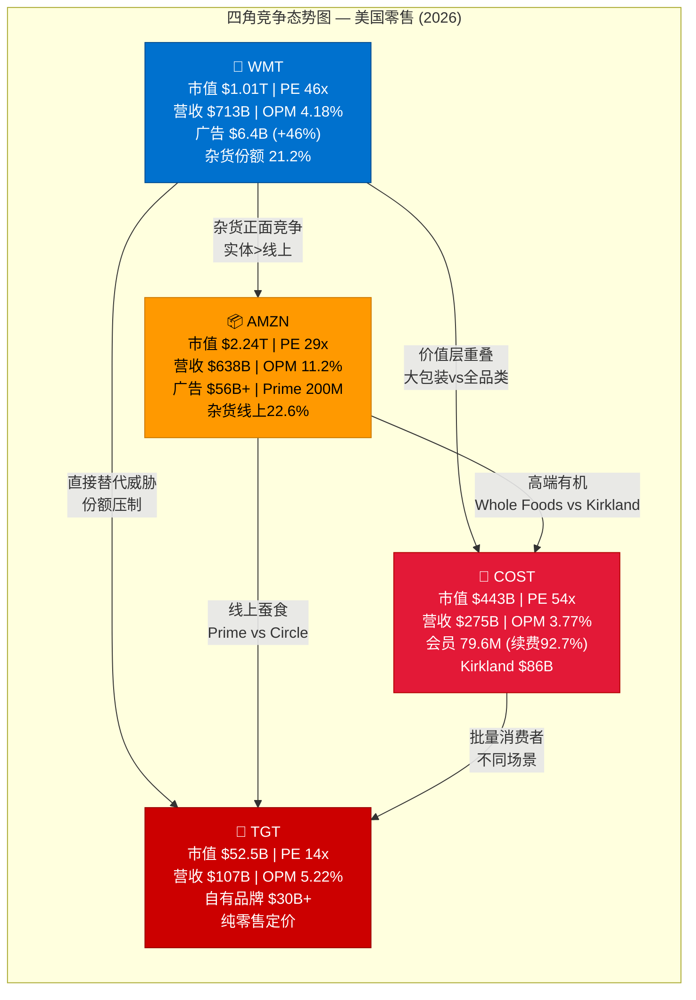
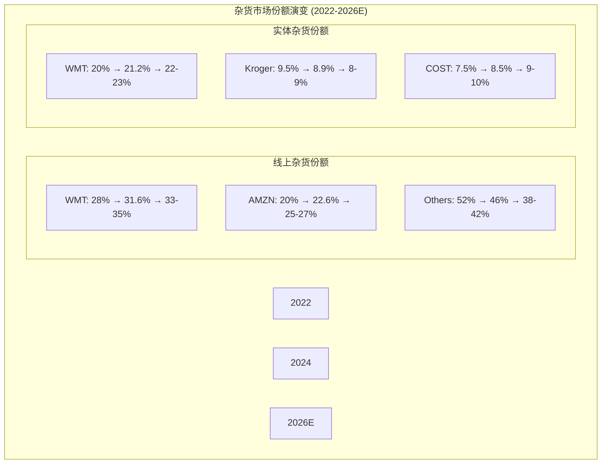
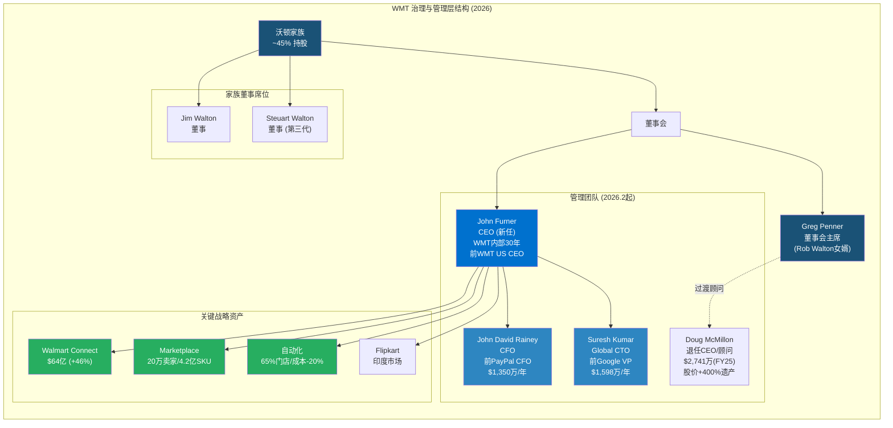

# Phase 1 — Ch6 竞争生态 + Ch7 管理层与治理

> AgentC产出 | 2026-02-25 | 数据截至2026-02-25
> 核心矛盾检验：WMT市值$1.01万亿 / PE ~46x / 营业利润率4.18% — 零售商还是消费科技平台？

---

## Ch6: 竞争生态 — 四角博弈与杂货战争

### 6.1 四角竞争矩阵：WMT vs COST vs AMZN vs TGT

在探讨WMT的估值逻辑之前，必须将其置于竞争生态的坐标系中审视。四大零售/电商巨头的财务画像差异巨大，折射出市场对不同商业模式的截然不同定价。

**核心财务对比（截至2026年2月）：**

| 指标 | WMT | COST | AMZN | TGT |
|------|-----|------|------|-----|
| **市值** | $1.01万亿 | $4,432亿 | $2.24万亿 | $525亿 |
| **年营收** | $7,132亿(FY26) | $2,752亿(FY25) | $6,380亿(2024) | $1,066亿(FY24) |
| **PE (TTM)** | ~46x | ~54x | ~29x | ~14x |
| **P/B** | 9.5x | 14.4x | N/A | 4.3x |
| **毛利率** | 24.9% | 12.8% | 49.8% | 28.2% |
| **营业利润率** | 4.18% | 3.77% | 11.2% | 5.22% |
| **净利润率** | 3.07% | 2.94% | 10.8% | 3.84% |
| **门店数(美国)** | ~4,605 | ~629 | ~600(Whole Foods) | ~1,956 |
| **电商占比** | ~18%(FY25) | ~10% | ~60%+(零售) | ~22% |
| **广告收入** | $64亿(FY26) | 极少 | $560亿+(2024) | ~$20亿 |
| **会员数** | Walmart+ ~25M | 79.6M付费 | Prime ~200M | Circle 360 ~10M |

*数据来源：FMP财务数据(income statement FY26/FY25), 各公司最新季报, eMarketer, Marketplace Pulse*

**PE定价逻辑的深层差异：**

这张表格揭示了一个关键的估值悖论。WMT以46x PE交易，而营业利润率仅4.18%；COST以54x PE交易，营业利润率更低至3.77%；TGT营业利润率5.22%反而最高，PE却只有14x。AMZN营业利润率11.2%，PE 29x。

这意味着市场对这四家公司的定价逻辑完全不同：

- **AMZN (29x PE)**：市场已经认可其科技平台属性。AWS+广告+Prime构成高利润率飞轮，29x对一家利润率11%的科技公司而言是"合理"的。市场定价的是已证明的利润能力。

- **COST (54x PE)**：会员制零售的"信仰溢价"。COST的核心利润来自会员费（$53亿/年，92.7%续费率），而不是商品销售。54x PE本质上是对"最稳定现金流模型"的永续定价。Kirkland品牌年销售额$860亿，坪效全行业第一（单店年均$2.99亿）。市场赌的是这个模型永远不会被颠覆。

- **WMT (46x PE)**：这是真正的"身份转型溢价"。WMT从2020年的~20x PE攀升至46x，**不是因为利润率大幅改善（3.3%→4.18%），而是因为市场开始给WMT定价为"下一个消费科技平台"**。$64亿广告收入增长46%、Walmart+增长、Marketplace扩张——市场用科技公司的倍数给一个利润率4%的零售商定价。

- **TGT (14x PE)**：纯传统零售商定价。没有广告平台、没有规模化会员体系、没有科技转型叙事。14x是市场对"门店为核心+中等增长"零售商的标准定价。

**核心矛盾检验**：WMT的46x PE对标科技公司（AMZN 29x），而不是传统零售商（TGT 14x）。但WMT 4.18%的利润率更接近TGT，而不是AMZN。市场在预期WMT利润率将持续扩张——这个赌注是否合理，取决于广告+Marketplace+自动化三大飞轮能否兑现。

### 6.2 杂货战争态势图：美国零售的核心战场

杂货（Grocery）是美国零售市场规模最大、频次最高的品类，年市场规模超$1.5万亿。WMT在这个领域的统治地位，是其整个生态系统的基石。

**实体杂货市场份额（2025年）：**

| 零售商 | 市场份额 | 特征 |
|--------|----------|------|
| **Walmart** | **~21.2%** | 全品类覆盖+EDLP定价 |
| Kroger | ~8.9% | 传统超市龙头 |
| Costco | ~8.5% | 仓储批发+Kirkland |
| Albertsons | ~5.5% | 区域超市 |
| Amazon/Whole Foods | ~2-3% | 高端有机定位 |
| Target | ~3-4% | 城市便利+设计感 |

*数据来源：Progressive Grocer, CSIMarket Q3 2025*

WMT以21.2%的杂货市场份额遥遥领先，是第二名Kroger的2.4倍。这个份额优势有深层结构性原因：WMT的门店和配送中心覆盖了美国90%人口10英里以内的范围，形成了难以复制的物理基础设施网络。

**线上杂货市场份额（2025年）：**

| 零售商 | 线上杂货份额 | 增长态势 |
|--------|-------------|---------|
| **Walmart** | **31.6%** | 持续扩大份额 |
| Amazon | 22.6% | 加速追赶 |
| Kroger | 8.6% | 稳定 |
| Instacart | ~7% | 平台聚合模式 |
| 其他 | ~30% | 碎片化 |

*数据来源：eMarketer, Brick Meets Click*

线上杂货市场的竞争格局更为关键，因为这是增长最快的渠道，也是WMT"平台化"叙事的核心依据之一。WMT以31.6%的线上杂货份额领先Amazon的22.6%，差距9个百分点。2024年Q2，WMT曾创下37%的单季度线上杂货份额纪录。

**Amazon的杂货反击战：**

Amazon在杂货领域的策略经历了戏剧性转折。2025年，Amazon做出了一个关键战略决策：**关闭全部Amazon Fresh和Amazon Go实体门店，将资源集中于Whole Foods和线上配送**。

这个决策的深层含义值得深入分析：

1. **实体零售的"Amazon失败论"**：Amazon在实体杂货零售上的多次尝试（Amazon Go无人店、Amazon Fresh）均以失败告终。这证明了实体零售的运营复杂度远超纯技术问题，WMT/COST数十年积累的供应链和门店运营能力构成了真正的护城河。

2. **线上当日达的激进扩张**：Amazon将杂货战略完全转向线上。其Same-Day Delivery已覆盖2,300个城市/市镇，生鲜杂货销售增长40倍（自2025年1月起）。Fresh groceries现在占Same-Day Delivery最受欢迎商品的9/10。Amazon还在试点30分钟杂货配送。

3. **Whole Foods的100+新店计划**：Amazon计划在未来几年开设100+家新Whole Foods门店，包括小型Daily Shop格式。这是Amazon在实体杂货领域的"重新聚焦"策略——放弃大众市场，深耕高端有机。

**WMT vs Amazon杂货战争的关键不对称性：**

```
WMT优势：
- 4,605家门店 = 93%美国人口10英里覆盖
- 线上杂货31.6%份额 vs Amazon 22.6%
- 全价位覆盖（从杂货到一般商品）
- 65%门店已自动化，配送成本降低20%

Amazon优势：
- 2,300城市当日达 + 30分钟试点
- 生鲜销量增长40倍的爆发势头
- Prime 200M会员的流量入口
- 技术+数据能力的降维打击潜力
```

**核心矛盾检验**：WMT在杂货战争中的统治地位（21.2%实体+31.6%线上）是"零售商估值"的核心支撑。但这个份额优势能否转化为利润率扩张（从4.18%→6%+），才是"平台估值"能否成立的关键。Amazon放弃实体零售是WMT的利好信号——说明物理基础设施护城河有效。但Amazon线上杂货40倍增长和30分钟配送试点也意味着线上渠道的竞争将持续加剧。

### 6.3 护城河对比：消费品框架下的四维分析

运用消费品行业的护城河分析框架，对四大竞争者进行系统性评估：

**WMT护城河组合：规模+EDLP+门店网络+供应链**

| 护城河维度 | 强度 | 评估 |
|-----------|------|------|
| **规模经济** | ★★★★★ | 年营收$7,132亿，采购议价力无与伦比。每增加1%的销售额杠杆=数十亿美元的成本优势 |
| **EDLP心智定价** | ★★★★☆ | "Everyday Low Price"已成为消费者心智认知。通胀环境下吸引力增强 |
| **物理网络** | ★★★★★ | 4,605家门店+覆盖93%人口=无法复制的"最后一英里"基础设施 |
| **供应链效率** | ★★★★☆ | 65%门店自动化，配送成本降20%。但距Amazon的技术领先仍有差距 |
| **数据+平台化** | ★★★☆☆ | Walmart Connect $64亿增速46%。初步证明但规模远逊Amazon |

**COST护城河组合：会员+Kirkland+坪效+员工忠诚**

| 护城河维度 | 强度 | 评估 |
|-----------|------|------|
| **会员粘性** | ★★★★★ | 92.7%续费率=近乎完美的锁定。79.6M付费会员=每年$53亿确定性收入 |
| **Kirkland品牌** | ★★★★★ | 年销售$860亿，占收入~23%。质量对标品牌+价格低30-40%的不可替代自有品牌 |
| **坪效领先** | ★★★★★ | 单店年均$2.99亿，是WMT超级中心的3-4倍。仓储模式的极致效率 |
| **员工满意度** | ★★★★☆ | 行业最高薪资+福利=低离职率=更好的服务 |
| **限量SKU策略** | ★★★★☆ | 约4,000 SKU vs WMT ~120,000 = 每个SKU的采购量极大=更低成本 |

**AMZN护城河组合：技术+数据+Prime+物流**

| 护城河维度 | 强度 | 评估 |
|-----------|------|------|
| **技术平台** | ★★★★★ | AWS+AI+推荐算法构成其他零售商无法匹敌的技术基底 |
| **数据飞轮** | ★★★★★ | 2亿Prime会员的消费行为数据=最精准的消费者画像 |
| **Prime生态** | ★★★★★ | 视频+音乐+阅读+购物+医疗=全方位锁定。年费$139仍有90%+续费率 |
| **物流网络** | ★★★★☆ | 全球最大的电商物流体系，但实体杂货证明"线下最后一英里"仍是短板 |
| **广告平台** | ★★★★★ | $560亿+广告收入，增速30%+。第三大数字广告平台（仅次于Google/Meta） |

**TGT护城河组合：设计+自有品牌+城市定位**

| 护城河维度 | 强度 | 评估 |
|-----------|------|------|
| **设计差异化** | ★★★☆☆ | "Tar-zhay"品牌定位在中产消费者中有认知度。但溢价正在被侵蚀 |
| **自有品牌矩阵** | ★★★★☆ | $300亿+自有品牌年销售。Dealworthy(极致性价比)+Good & Gather(食品)多层布局 |
| **城市门店** | ★★★☆☆ | 小型城市门店格式有差异化。但城市零售竞争激烈 |
| **全渠道体验** | ★★★☆☆ | 有Shipt配送和Drive Up。但电商份额和技术投入均落后 |
| **品类curation** | ★★★☆☆ | 独家设计师合作+选品能力。但在通胀环境下"品质感"让位于"性价比" |

### 6.4 竞争动态预测：未来2-3年最可能的格局变化

**趋势一：广告变现加速分化零售商——平台化是"新贫富分水岭"**

零售媒体网络（Retail Media Network）正在重塑零售行业的利润结构。WMT Walmart Connect以$64亿收入、46%增速领先传统零售商，但仍远落后于AMZN的$560亿+。关键数据点：**广告+会员收入已贡献WMT约三分之一的利润**，这意味着WMT的利润结构正在发生质变——从"卖货赚差价"向"卖流量赚广告"转型。

VIZIO收购（$23亿）是这一战略的关键棋子。Walmart现在可以在消费者家中的电视屏幕上直接投放可购物广告，形成"观看→购买"的闭环。这一能力是纯线上竞争者（包括AMZN）不具备的。

**预测**：到2028年，WMT广告收入有望突破$100-120亿（假设保持25-30%的年均增速），而TGT的广告收入可能停滞在$30亿以下。广告能力将成为零售商之间的"新贫富分水岭"。

**趋势二：第三方Marketplace成为增长主引擎**

WMT的Marketplace平台在2025年经历了爆发式增长：

- 活跃卖家突破200,000家（2024年为160,000家，增长25%+）
- 2025年前5个月净增44,000新卖家
- 产品目录扩展至4.2亿件SKU，其中95%来自第三方卖家
- 值得注意的是，近60%的新卖家来自中国

这一趋势对竞争格局的影响是双面的：
- **正面**：WMT正在复制AMZN Marketplace的飞轮（更多卖家→更多选择→更多买家→更多卖家），且WMT有4,605家门店作为提货/退货节点的独特优势
- **风险**：中国卖家占比过高（34%）可能带来质量控制和关税风险。2026年的关税政策变化可能对Marketplace产品的价格竞争力造成显著影响

**预测**：到2027年，WMT Marketplace卖家数有望突破50万家，产品目录可能超过7亿件SKU。但AMZN仍将保持约200万+活跃卖家的绝对领先。

**趋势三：自动化和AI重塑成本结构**

WMT已将65%的门店实现自动化履约，将到家配送的单位成本降低了近20%。这一进展的战略意义在于：WMT过去最大的利润率拖累——到家配送的高成本——正在被系统性地解决。

COST的自动化投入相对保守，仍依赖仓储模式的天然高效。TGT的自动化进展则明显落后，且Shipt配送业务的经济模型尚未走通。

**预测**：自动化投资将在2025-2028年间为WMT贡献50-100个基点的利润率改善。如果配合广告收入的高速增长，WMT的营业利润率有望从4.18%提升至5-5.5%——虽然距离AMZN的11.2%仍有巨大差距，但已足以部分验证"平台化"叙事。

**趋势四：杂货战争走向"双寡头"格局**

在线上杂货领域，WMT（31.6%）和Amazon（22.6%）合计占据54%+的市场份额，且二者都在加速增长。中小杂货零售商面临被挤压的命运——Kroger/Albertsons合并失败后，区域超市的竞争力进一步下降。

Amazon关闭Fresh/Go实体店、聚焦线上配送的策略意味着：实体杂货的竞争压力将减轻（WMT vs Kroger/Albertsons），而线上杂货的竞争压力将加剧（WMT vs Amazon当日达/30分钟配送）。

### 6.5 竞争态势图





### 6.6 本章小结：竞争生态对核心矛盾的回答

将竞争分析的发现映射回核心矛盾——"零售商估值"还是"平台估值"：

**支持"平台估值"的竞争证据：**
1. WMT广告收入$64亿、增速46%，且已贡献~1/3利润——这是平台化的硬数据
2. Marketplace卖家突破20万、产品4.2亿SKU——飞轮已启动
3. Amazon实体杂货失败，验证了WMT物理网络的护城河深度
4. WMT在线上杂货、广告、Marketplace三条赛道同时推进——COST和TGT没有类似叙事

**支持"零售商估值"的竞争证据：**
1. WMT 4.18%营业利润率 vs AMZN 11.2%——利润率差距巨大，"平台化"远未完成
2. Walmart+ 25M会员 vs Prime 200M——会员锁定能力差8倍
3. WMT广告$64亿 vs AMZN $560亿+——广告规模差9倍
4. 46x PE的"平台溢价"建立在利润率扩张的预期上，一旦增速放缓就面临重估风险

**竞争结论**：WMT正处于"零售商→平台"转型的早中期阶段。竞争证据显示平台化趋势是真实的，但46x PE已经把未来3-5年的转型成功部分计价。关键风险是：Amazon在线上杂货的40倍增长表明"技术巨头做杂货"的叙事远未结束。

---

## Ch7: 管理层与治理 — 家族帝国的权力交接

### 7.1 管理层画像：从McMillon时代到Furner时代

WMT正在经历自Sam Walton去世以来最重要的领导层变革。2026年2月1日，Doug McMillon正式退休，John Furner接任CEO。这一交接的背景、人选和可能的战略影响，对WMT能否完成"零售商→平台"转型至关重要。

**Doug McMillon — 即将退任CEO（2014-2026）**

| 维度 | 详情 |
|------|------|
| 任期 | 2014年2月至2026年1月31日（近12年） |
| 背景 | 16岁在WMT仓库做暑期工，内部培养超40年 |
| 职业路径 | Sam's Club买手→Sam's Club CEO→WMT International CEO→WMT CEO |
| 薪酬(FY25) | $2,741万（基本工资$151万+股票奖励$2,038万+其他$38万） |
| 核心成就 | 股价上涨400%+（$576亿市值增量）；电商营收从几乎为零到占比18%；Flipkart收购；VIZIO收购；Walmart Connect从0到$64亿 |
| 战略遗产 | 将WMT从"纯实体零售商"推向"全渠道消费科技平台"的战略愿景 |

McMillon的最大贡献在于**战略方向的根本性转向**。他在2014年接任时，WMT被视为一家增长停滞的传统零售巨头。到他2026年离任时，WMT成为第一家市值突破$1万亿的零售公司。这一转变的核心是他推动的电商和广告业务投资——即使这些投资在短期内拖累了利润率。

McMillon将继续留任董事会至2026年6月的年度股东大会，并作为顾问协助过渡至FY2027。

**John Furner — 新任CEO（2026年2月1日起）**

| 维度 | 详情 |
|------|------|
| 年龄 | 51岁 |
| 背景 | 1993年加入WMT，从时薪员工起步，WMT内部培养超30年 |
| 职业路径 | 时薪员工→采购→运营→Sam's Club CEO→WMT US CEO(2019-2026)→WMT CEO |
| 关键经历 | 多国工作经验；主管采购、运营和全球sourcing；2019年起领导WMT最大业务单元（4,600+门店） |
| 战略特长 | 门店运营+供应链优化+AI和自动化部署 |

Furner的任命传递了一个重要信号：**WMT选择了"运营执行力"而非"外部变革者"**。与Rainey（PayPal背景）或Kumar（Google背景）这样的外部人才相比，Furner代表的是WMT内部DNA的延续。Greg Penner（董事会主席）评价Furner"理解我们业务的每一个维度——从销售楼层到全球战略"。

对"平台化"叙事的影响：Furner的核心能力在于门店运营和供应链，而不是技术或广告。这可能意味着WMT的平台化转型将更偏向"用技术增强零售"（内部效率提升）而非"变成一家科技公司"（商业模式根本性转变）。市场需要观察Furner是否会在广告、Marketplace和AI上保持McMillon时代的激进投入节奏。

**其他关键高管：**

| 高管 | 职位 | 背景 | 薪酬(FY25) | 战略角色 |
|------|------|------|-----------|---------|
| **John David Rainey** | CFO | 前PayPal CFO，2022年加入 | $1,350万 | 数字化转型的财务架构师。从支付科技公司带来的利润率优化思维 |
| **Suresh Kumar** | Global CTO | 前Google VP，2019年加入 | $1,598万 | 技术基础设施+AI+自动化的总设计师。CTO薪酬高于CFO，反映技术在WMT战略中的权重 |
| **John Furner** | 前WMT US CEO | WMT内部30年 | — | 现已升任集团CEO |

一个值得关注的细节：**CTO Suresh Kumar的薪酬（$1,598万）高于CFO John David Rainey（$1,350万）**。在传统零售公司中，CFO薪酬通常高于CTO。WMT的这种薪酬倒挂反映了董事会对技术转型的战略优先级设定——至少在激励结构层面，WMT把自己当作一家"技术驱动"的公司。

**高管团队总薪酬**：前6名高管2024年合计$9,995万（同比+3.3%）。其中股票奖励占比超过60%，这意味着管理层的薪酬与股价表现高度挂钩——在当前$1万亿市值水平上，管理层有强烈动机维持"增长叙事"以支撑股价。这是一把双刃剑：既对齐了股东利益，也可能导致短期行为倾向。

### 7.2 沃顿家族治理：45%控股下的长期主义与外部监督

沃顿家族（Walton Family）是WMT治理结构中最重要的变量。家族通过Walton Family Holdings Trust等实体持有WMT约45%的流通股，使其成为全球最大的家族控制上市公司之一。

**家族核心成员及董事会角色：**

| 成员 | 角色 | 持股/影响力 |
|------|------|-----------|
| **Rob Walton** | Chairman Emeritus | Sam Walton长子，2015年前任董事会主席 |
| **Jim Walton** | 董事会成员 | 持股数量约36.4亿股（按2026年数据），家族核心代表 |
| **Greg Penner** | 董事会主席 | Rob Walton女婿，Madrone Capital创始人，2015年起任主席 |
| **Steuart Walton** | 董事会成员 | Rob Walton之子，代表家族第三代 |

Greg Penner作为家族代理人和董事会主席，是理解WMT治理的关键。他不是Walton家族的直系血亲（而是女婿），但通过婚姻和Madrone Capital（管理Walton家族投资的基金）深度绑定。Penner拥有风险投资背景（曾在Scott McNealy领导的Sun Microsystems工作），这可能解释了WMT在过去十年为何比传统零售商更积极地拥抱技术投资。

**家族治理的双刃剑：**

**正面——长期主义导向：**
- 45%的控股权意味着家族不受短期激进投资者的压力。McMillon能够在电商上进行长达数年的"利润率牺牲式"投入（2016-2020年电商业务年亏损数十亿美元），正是因为Walton家族的长期支持
- 家族的财富与WMT股价深度绑定（Jim Walton持股价值约$4,618亿），确保了家族利益与公司利益的高度一致
- CEO更替平滑：McMillon→Furner的交接延续了WMT "内部培养CEO"的传统（过去5任CEO均从内部提拔），避免了外部CEO带来的文化冲突风险

**负面——外部监督不足：**
- 45%控股使得外部股东在重大决策上几乎没有否决权。如果Walton家族做出战略失误，外部纠错机制薄弱
- 董事会独立性存疑：Greg Penner（主席）和Steuart Walton均为家族成员，形成家族对董事会的直接控制
- 继承风险：随着第二代Walton成员（Rob/Jim/Alice）年龄增长，第三代（Steuart等）和代理人（Penner）的能力和意愿是否能延续Sam Walton的零售基因，是长期不确定性

### 7.3 内部人交易分析：Walton家族的减持节奏

内部人交易（Insider Trading）数据为评估管理层/大股东对公司前景的信心提供了重要参考。以下是WMT过去12个月的内部人交易汇总（基于SEC Form 4数据）：

**近4个季度内部人交易概览：**

| 季度 | 获取交易数 | 处置交易数 | 总获取(股) | 总处置(股) | 净卖出笔数 |
|------|-----------|-----------|-----------|-----------|-----------|
| 2026 Q1 | 8 | 38 | 146,816 | 1,131,734 | 12 |
| 2025 Q4 | 11 | 49 | 242,091 | 9,726,539 | 33 |
| 2025 Q3 | 12 | 43 | 230,171 | 17,351,524 | 29 |
| 2025 Q2 | 22 | 47 | 75,069 | 29,888,083 | 36 |

*数据来源：FMP insider-trading数据, SEC Form 4 filings*

**关键观察：**

1. **持续净卖出**：过去4个季度，处置交易数量远超获取交易数量（177次处置 vs 53次获取），且处置股数量级远大于获取量。2025年Q2处置量最大（近3,000万股），对应WMT股价创历史新高的时间窗口。

2. **Walton家族减持规模**：具体Form 4记录显示：
   - 2025年6月：Walton Family Holdings Trust出售3,356,619股（约$3.3亿）
   - 2025年8月：Trust出售1,571,500股+分配1,600,000股+分配394,000股
   - 2025年11-12月：Trust分配860,000+514,000+239,000股
   - 合计估算：2025年全年Walton Trust通过公开市场出售约$7-10亿+的WMT股票

3. **减持的性质判断**：需要区分两类处置行为：
   - **公开市场出售（Sales）**：这是主动减持，反映卖出意愿。2025年每个季度都有20-36笔销售
   - **家族内部分配（Distributions）**：Trust将股票分配给受益人，不涉及公开市场卖出。这是遗产/税务规划的常规操作

4. **零买入信号**：过去4个季度，WMT内部人的公开市场**买入为零**（totalPurchases=0）。虽然这在大型公司中并不罕见（高管通常通过股票期权/奖励获取股份），但"零买入+持续卖出"的组合仍然值得关注。

**与COST的对比：**

COST曾在连续5个季度出现内部人零买入，这被部分分析师视为Bear信号。WMT的情况类似——内部人在股价创历史新高期间持续减持，且无一笔公开市场买入。

**核心矛盾检验**：Walton家族的年度减持$7-10亿看似巨大，但相对于其约$3,000亿+的总持股价值，减持比例不到0.3%。这更像是常规的财富管理/多元化操作，而非对公司前景的看空信号。但"零买入"仍然传递了一个信号：在46x PE的水平上，即便是最了解公司的内部人，也不认为WMT股票被低估。

### 7.4 管理层激励结构：与股东利益的一致性

WMT管理层的薪酬结构对理解其行为动机至关重要：

**薪酬构成分析（FY2025, 前6名高管）：**

| 组成部分 | 占比 | 评估 |
|---------|------|------|
| 基本工资 | ~15% | 相对于同行适中。McMillon $151万 vs Costco CEO $145万 |
| 业绩奖金 | ~15-20% | 与年度运营指标（营收增长、运营利润率、ROI）挂钩 |
| 股票奖励（RSU/PSU） | ~60-65% | 这是大头。McMillon $2,038万股票奖励，基于3年业绩目标 |
| 其他 | ~3-5% | 退休计划+福利+安保 |

**股票奖励的业绩条件解析：**

WMT的Performance Share Units（PSU）通常基于以下指标：
- 营收增长（Revenue Growth）
- 投资回报率（Return on Investment）
- 相对TSR（Total Shareholder Return vs 同业）

这意味着管理层的主要财富与WMT的长期股价表现直接挂钩——但也意味着他们有动机维持"增长叙事"来支撑高估值。在46x PE的水平上，任何增长放缓的信号都可能导致股价大幅回调，直接影响管理层数千万美元的未兑现股票奖励。

**利益一致性评估：★★★★☆**

优势：60%+的股票薪酬确保了管理层与长期股东的利益对齐。Walton家族45%持股更是最终的利益绑定。

风险：在高估值下，管理层可能倾向于短期维持增长率（如通过促销拉动营收、延迟必要的投资削减），而非做出可能导致短期股价下跌但长期健康的决策。

### 7.5 关键战略决策评估

**决策一：VIZIO收购（$23亿，2024年完成）**

| 维度 | 评估 |
|------|------|
| **战略逻辑** | 获取VIZIO的SmartCast操作系统（1,800万活跃用户）+CTV广告能力，加速Walmart Connect |
| **执行进展** | 整合第一年，广告收入增长46%（含VIZIO贡献）。"可购物电视广告"已上线 |
| **风险** | $23亿对WMT体量不大（年营收的0.3%），但CTV市场竞争激烈（Roku/AMZN Fire TV/Google TV） |
| **评分** | ★★★★☆ — 清晰的战略逻辑+可接受的价格+初期执行良好 |

**决策二：Flipkart投入（2018年$160亿控股收购）**

| 维度 | 评估 |
|------|------|
| **战略逻辑** | 进入印度市场——全球增长最快的电商市场之一 |
| **执行进展** | Flipkart保持竞争力，Big Billion Days表现强劲。但尚未IPO，投资回报难以量化 |
| **风险** | 印度监管环境不确定+亏损持续+竞争对手JioMart/Amazon India |
| **评分** | ★★★☆☆ — 战略合理但$160亿的投资回报周期漫长，至今未见清晰的退出/变现路径 |

**决策三：自动化投资（多年数十亿美元）**

| 维度 | 评估 |
|------|------|
| **战略逻辑** | 解决WMT最大的结构性问题——人力密集导致的低利润率 |
| **执行进展** | 65%门店已自动化，到家配送单位成本降低20%，劳动生产率持续改善 |
| **风险** | 自动化资本支出巨大，短期内压缩自由现金流 |
| **评分** | ★★★★★ — 这可能是McMillon时代最重要的长期战略决策。直接攻克利润率瓶颈 |

### 7.6 治理结构图



### 7.7 本章小结：管理层对核心矛盾的影响

**支持"平台估值"的管理层证据：**
1. CTO薪酬高于CFO——激励结构传递"技术优先"信号
2. McMillon时代成功推动了电商+广告+自动化三大转型
3. Walton家族的长期主义允许多年"利润率牺牲式"投入
4. VIZIO收购+自动化投资直接服务于"利润率扩张"目标

**支持"零售商估值"的管理层证据：**
1. 新CEO Furner的核心能力是门店运营，而非技术/广告——可能降低平台化转型的激进度
2. 内部人零买入+持续减持——在46x PE水平上，内部人不认为股票被低估
3. 家族治理的外部监督不足——如果平台化转型遇阻，纠错机制可能反应迟缓
4. $160亿Flipkart投入至今未见清晰回报——战略资本配置能力存疑

**管理层结论**：WMT的管理团队在McMillon时代证明了其战略转型能力。但Furner时代的关键问题是：新CEO能否在McMillon建立的平台化方向上继续加速，还是会回归WMT的零售基因、优先优化门店运营效率？Furner的选择将直接决定WMT是维持46x PE的"平台溢价"，还是逐步回归25-30x PE的"优质零售商"定价。
