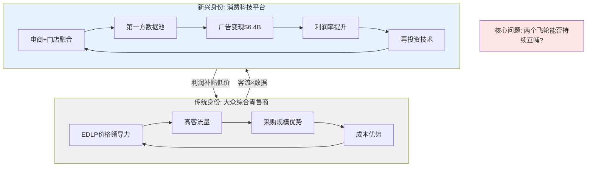

# Chapter 1: 公司身份诊断

## 1.1 核心身份定位

Walmart Inc.（WMT）是全球最大的零售企业，FY2026（截至2026年1月31日）营收$713.2B，全球拥有约10,750家门店覆盖19个国家，雇员约210万人。公司通过三大经营分部运营：**Walmart U.S.**（约占营收69%）、**Walmart International**（约占营收18%）和**Sam's Club**（约占营收13%）。

从传统分类看，WMT属于**消费防御型（Consumer Defensive）大众综合零售商**，核心商业模式建立在"Every Day Low Price（EDLP）"这一价格承诺之上。然而，2024-2026年间WMT正在经历一场深刻的身份转型——从纯粹的"价格领导者"向"利润领导者"和"消费科技平台"演进。这一身份变迁是理解WMT当前估值（PE 46x vs 10年均值30x）的核心钥匙。

### 身份转型的三个证据层

**证据层1：收入结构质变**
传统零售收入（杂货+一般商品）仍占绝对多数（>90%），但新兴高利润业务正在快速崛起：
- **广告业务（Walmart Connect）**：FY2025 $6.4B，同比+46%，毛利率约70%
- **会员费收入（Walmart+/Sam's Club）**：FY2024 $3.1B，CAGR 19%
- **第三方市场佣金**：20万+活跃卖家，4.2亿SKU在线
- **数据服务（Walmart Luminate）**：向供应商出售消费者洞察

这些业务合计贡献约**1/3的营业利润**，但仅占总营收的不到2%。收入占比极小但利润贡献极大——这正是"平台化"的典型特征。

**证据层2：基础设施重新定义**
WMT将4,600家超级中心从"零售场所"重新定义为"全渠道履约节点"：
- 93%美国家庭可享当日达
- 50%电商订单从门店发货（门店拣货成本$3-5/单 vs DC $8-12/单）
- 55%履约量2026年将实现自动化

这种"存量资产再利用"策略使WMT以远低于Amazon的边际投资获得了可比的配送覆盖率。

**证据层3：人才结构变化**
关键高管来源反映战略方向：CTO Suresh Kumar来自Google，CFO John David Rainey来自PayPal，数字化转型的人才密度在传统零售商中独一无二。

### 身份转型的反证

尽管上述证据看似支持"平台"叙事，但关键反证同样有力：

- **营业利润率仅4.18%**：真正的科技平台（AMZN AWS 30%+、Meta 35%+）利润率数量级更高。即使加入广告全部贡献，WMT利润率仍<5%，距离"平台级"利润率有结构性鸿沟
- **60%收入来自杂货**：杂货毛利率~25%是物理天花板，除非收入结构发生根本变化（广告占比从0.9%升至5%+），利润率无法质变
- **EPS增速放缓**：34.5%→26.2%→13.3%，增长引擎减速明显
- **负营运资本依赖**：WMT的部分利润来自供应商融资飞轮（应付$63B vs 存货$59B），这是零售商特征而非平台特征

---

## 1.2 SGI速判与分析路由

### A-Score v2.0 Step 10: Specialist-Generalist Index

| 维度 | 权重 | 评分(0-10) | 加权 | 依据 |
|------|------|-----------|------|------|
| HHI_rev（收入集中度） | 0.30 | 2 | 0.60 | 杂货/一般商品/国际/Sam's极度分散，100万+SKU |
| R&D_conc（研发集中度） | 0.25 | 1 | 0.25 | 零独立R&D支出，技术投入归入CapEx/SGA |
| MarketPos（市场地位） | 0.20 | 9 | 1.80 | 美国零售#1（$569B），网络杂货#1（31.6%） |
| SwitchCost（转换成本） | 0.15 | 3 | 0.45 | 消费者随时可切COST/TGT/AMZN，Walmart+有限粘性 |
| BrandClarity（品牌清晰度） | 0.10 | 5 | 0.50 | "低价"认知清晰但非情感品牌，功能性定位 |
| **SGI总分** | **1.00** | — | **3.60** | — |

**路由决策：SGI 3.6 → 通才模式**

通才模式分析重心：
1. **资源分配效率**：$713B收入分散在数百个品类，是否在任何单一领域都缺乏纵深？
2. **全渠道协同**：线上+线下+广告+会员的协同效应是否真实？还是各业务独立运营？
3. **通才陷阱检测**：WMT是否因为"什么都做"而在每个领域都输给专才竞争对手？

### SGI与估值的严重不匹配

这是WMT分析的**核心异常**：

| 对比维度 | SGI预期 | WMT实际 | 偏差 |
|---------|---------|---------|------|
| PE相对行业 | 折价0-25% | 溢价53%（46x vs 30x均值） | **>75pp** |
| PE相对SPY | ≤1.0x | 1.68x | **+68%** |
| PE相对TGT（同行） | 接近 | 3.3x TGT的PE | **+230%** |
| 隐含身份 | 大众零售商 | 消费科技平台 | **身份跳跃** |

**解释这个不匹配是全报告的核心任务。**



---

## 1.3 B×M品牌双轴评估

### WMT母品牌评分

**B轴（品牌强度）**：

| 维度 | 评分 | 依据 |
|------|------|------|
| B1 认知度 | 4.5/5 | 全球零售品牌认知度Top 3，美国几乎100%消费者认知 |
| B2 偏好度 | 3.5/5 | 功能性偏好（低价+便利），非情感驱动；部分消费者有品牌形象顾虑 |
| B3 忠诚度 | 3.5/5 | 高频购买但非排他，消费者同时在COST/TGT/AMZN购物是常态 |
| B4 差异化 | 3.0/5 | EDLP定位清晰但易被模仿，门店体验同质化 |
| B5 情感度 | 2.5/5 | 缺乏情感连接，"省钱"是理性动机而非情感动机 |
| **B平均** | **3.40** | 中等偏上，功能性品牌典型特征 |

**M轴（货币化能力）**：

| 维度 | 评分 | 依据 |
|------|------|------|
| M1 定价权 | 3.0/5 | EDLP模式自我限制了提价能力，关税环境下尤其受压 |
| M2 渗透率 | 4.5/5 | 美国杂货25-26%份额，电商18%仍有上升空间 |
| M3 延展性 | 4.0/5 | 健康服务、金融服务、广告平台——品牌延展面广 |
| M4 效率化 | 4.5/5 | SGA/Rev 20.7%，CCC 2.8天，负营运资本$22.6B |
| M5 平台化 | 3.5/5 | Walmart Connect+Marketplace+Walmart+初具平台形态，但渗透率远低于AMZN |
| **M平均** | **3.90** | 高于品牌力，反映WMT运营效率和规模优势 |

### 品牌溢价系数计算

```
WMT母品牌: B(3.40) × M(3.90) / 25 = 0.530
  → 强势品牌区间 (B≥3 且 M≥3)
  → 1.15 + 0.530 × 0.30 = 1.309
  → 品牌溢价: +30.9%

Great Value: B(3.00) × M(4.30) / 25 = 0.516
  → 强势品牌区间
  → 1.15 + 0.516 × 0.30 = 1.305
  → 品牌溢价: +30.5%
```

**品牌支撑PE计算**：
- 行业基准PE（Consumer Defensive中位）: ~22x
- WMT品牌溢价+30.9% → 品牌支撑PE ≈ 22 × 1.309 = **28.8x**
- 当前实际PE: **46.4x**
- **溢价缺口: 17.6x PE ≈ 每股$48 的"叙事溢价"**

这意味着在$126.75的股价中，约**$48（38%）是市场为"身份转型叙事"支付的溢价**，而非品牌基本面支撑的估值。


---

## 1.4 可能性宽度（PW）评估

| 评估维度 | 评分(0-10) | 依据 |
|---------|-----------|------|
| 商业模式确定性 | 2 | 零售业务高度确定，杂货需求刚性 |
| 竞争格局稳定性 | 3 | 四巨头格局短期稳定，但电商长期不确定 |
| 技术颠覆风险 | 4 | Agentic Commerce/AI零售尚在早期 |
| 监管/政策敏感度 | 5 | 关税政策高度不确定，反垄断风险 |
| 估值争议度 | 6 | PE 46x vs 历史30x，市场分歧中等 |
| **PW平均** | **4.0** | **混合模式偏传统** |

**PW路由决策**：PW=4 → 传统框架为主 + 身份溢价附录
- 核心方法：DCF + Reverse DCF + 可比估值
- 增量方法：身份溢价量化（ETN方法）+ 广告业务独立估值
- **不使用发现系统**（PW<7），但保留条件评级

---

## 1.5 Phase 1分析框架总览

基于Ch1的诊断，后续Phase 1-5将围绕以下框架展开：

| 层级 | 分析问题 | 对应章节 |
|------|---------|---------|
| **L1: 身份** | WMT是零售商还是平台？PE 46x隐含哪个身份？ | Ch1, Ch16, Ch17 |
| **L2: 飞轮** | EDLP飞轮健康度？广告飞轮可持续性？两者能否互哺？ | Ch2, Ch4, Ch10 |
| **L3: 护城河** | 规模+EDLP+门店网络+供应链的复合护城河有多宽？ | Ch3, Ch5, Ch14 |
| **L4: 竞争** | AMZN杂货攻势+COST会员模式+TGT差异化的三面夹击 | Ch6, Ch15 |
| **L5: 估值** | 品牌支撑28.8x vs 实际46.4x的17.6x缺口如何弥合？ | Ch11, Ch16, Ch21 |

**核心矛盾最终形态**：如果广告+会员复合体在5年内达到$20B+收入（当前~$10B），WMT营业利润率可突破6%，支撑35-40x PE → 身份溢价部分兑现但仍有缺口。如果广告增速放缓至<25%，EDLP信任在关税下动摇，PE可能回归至28-32x → 意味着股价下行20-30%。

---

## 1.6 本章小结

| 维度 | 结论 | 支持哪个身份？ |
|------|------|--------------|
| SGI 3.6 | 通才模式，不具备专才溢价 | 零售商 |
| B×M品牌支撑PE | 28.8x，远低于实际46.4x | 零售商 |
| 收入结构 | 广告+会员仅2%收入但贡献1/3利润 | 过渡期 |
| 基础设施转型 | 4,600门店→前置仓+数据池 | 偏平台 |
| 利润率 | 4.18%，距离平台级利润率有数量级差距 | 零售商 |
| **综合判断** | WMT处于"零售商→平台"的过渡期，身份转型约完成30% | **过渡期** |

**$48/股的叙事溢价 = 市场在赌剩余70%的身份转型能在3-5年内完成。本报告的核心任务就是评估这个赌注的胜率。**
