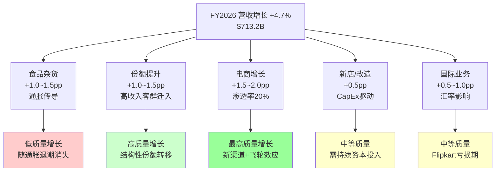
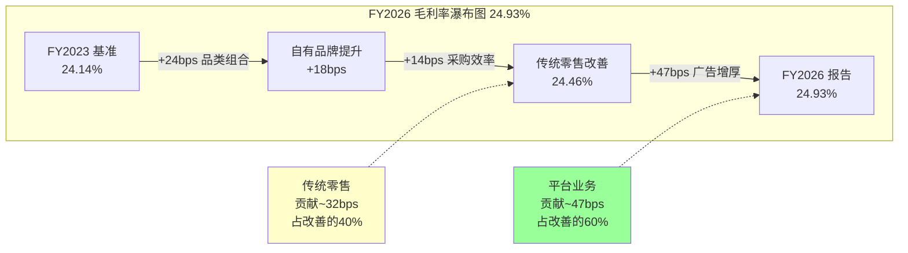
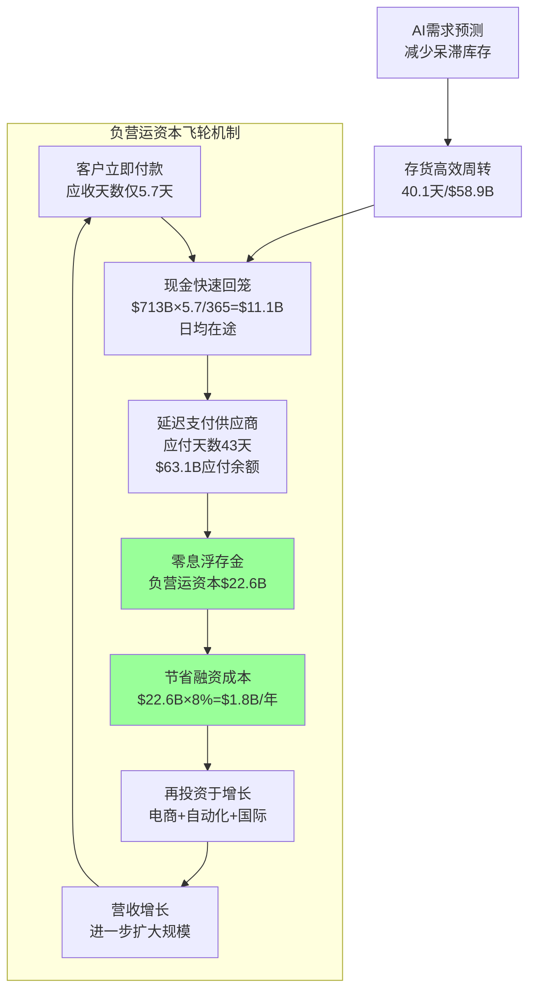
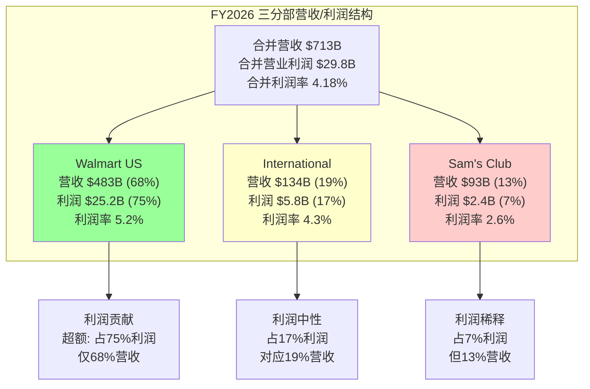
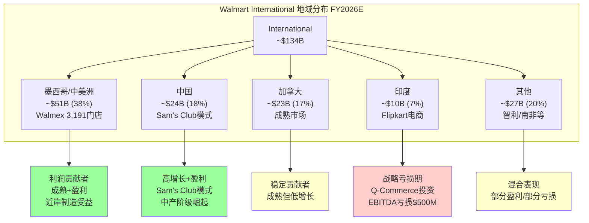

## Ch8: 财务趋势深挖 — 万亿估值的财务地基承压测试

> **核心矛盾框架**: WMT市值$1万亿、PE 46x，但营业利润率仅4.18%。本章逐项拆解收入增长质量、毛利率结构、SGA效率、利润率逆转信号、自由现金流与负营运资本飞轮，回答一个问题：**财务数据支持的是"零售商估值"还是"平台估值"？**

---

### 8.1 收入增长质量分析：$713B营收的有机含量

#### 8.1.1 四年营收CAGR与增速轨迹

FY2023-FY2026四年营收从$611.3B增长至$713.2B，对应三年CAGR约5.3%。逐年拆解：FY2024 +6.0% → FY2025 +5.1% → FY2026 +4.7%，呈现明确的增速递减趋势 [FMP]。

这个减速曲线需要拆解其结构含义。$713.2B的营收基数意味着每增长1个百分点=约$7.1B增量，这已经超过许多中型零售商的全部营收。在这个体量下，增速从6%放缓到4.7%，与其说是"减速"，不如说是"物理极限的渐近线效应"——全球零售市场本身的增速大约在4-5%，WMT正在逼近行业自然增长率天花板。

FY2027管理层给出的3.5%-4.5%恒定汇率营收增速指引，进一步确认了这一天花板 [Earnings Release FY26 Q4]。核心问题是：**在营收增速趋于行业平均的情况下，万亿市值需要利润率扩张来支撑——而这恰恰是当前最大的悬念。**

#### 8.1.2 同店销售拆分：客流量 vs 客单价

FY2026 Q4数据显示Walmart US同店销售增长+4.6%（不含燃油），其中客流量(transactions)贡献+2.6%，客单价(average ticket)贡献+2.0% [Q4 FY26 Earnings Release]。这是一个健康的结构：

- **客流量+2.6%**: 在通胀放缓环境下仍能吸引增量客流，证明WMT的EDLP（Every Day Low Price）价值主张在消费者心智中稳固。高收入家庭($100K+)持续向WMT转移采购份额是关键驱动力——管理层在Q4电话会中确认"高收入消费者继续是增长贡献者" [Q4 Earnings Call]。
- **客单价+2.0%**: 部分反映通胀传导（虽然通胀已降至~3%），部分反映品类升级——GM（General Merchandise，一般商品）和健康保健品类的渗透率提升推动了客单价。

对比Sam's Club US，同店+4.0%的构成截然不同：客流量+5.3%但客单价-1.3% [Q4 FY26 Earnings Release]。Sam's Club用价格让利换取了更多的交易频次——这是会员制模式的典型特征（用低价黏住高频消费）。

**关键判断**: WMT US连续多季度实现"量价齐升"，这在零售业中是罕见的正向循环。但必须注意，Q4包含节假日季节效应，全年平均水平可能略低于Q4峰值。

#### 8.1.3 电商增速与渗透率

电商是WMT收入增长中最有想象力的部分。Q4 FY2026全球电商增长+24%，其中Walmart US电商+27%，这已经是连续第八个季度电商增速超过20% [Q4 FY26 Earnings Release]。

从绝对值看，FY2025 Walmart US电商销售额约$79.3B [Statista]，若FY2026延续~25%增速，全年US电商销售额约$99B，接近$100B大关。电商占US总营收比例从FY2024的约15.4%提升至FY2025的约18% [Digital Commerce 360]，FY2026估计已达约20%。

**电商盈利转折点**: 这是整个估值叙事中最关键的里程碑之一。2025年4月投资者大会上，管理层宣布US电商业务"在纳入广告和履约收入后已实现盈利" [Grocery Doppio]。这意味着WMT用了25年让电商从"战略性亏损"转为"结构性盈利"。但这里有一个微妙的限定条件——"纳入广告和履约收入后"。如果剥离这两项高毛利收入，纯电商零售业务本身是否盈利，管理层未明确回答。

**平台估值含义**: 电商盈利是"零售商→平台"叙事的关键支柱。Amazon零售业务长期亏损但以AWS和广告补贴的模式，WMT正在用广告和会员收入补贴电商的模式有异曲同工之处——区别在于WMT的"第二曲线"利润来源（广告+会员）仍远小于Amazon（AWS+广告合计>$100B营收）。

#### 8.1.4 增长质量综合评估

将$713.2B营收增量拆解为几个驱动来源：

| 增长来源 | 估算贡献 | 质量评级 |
|----------|----------|----------|
| 食品杂货通胀传导 | ~1.0-1.5pp | 低（价格驱动，非有机） |
| 食品杂货份额提升 | ~1.0-1.5pp | 中高（结构性市场份额迁移） |
| 电商渗透率提升 | ~1.5-2.0pp | 高（新渠道增量） |
| 新店/改造门店 | ~0.5pp | 中（资本密集） |
| 国际业务增长 | ~0.5-1.0pp | 中（受汇率波动） |
| **合计** | **~4.5-6.5pp** | — |

剔除通胀因素后，有机增长约3.5-5.0%——在$700B的基数上，这是极其扎实的成绩。但要支撑46x PE，市场需要的不是4.7%的营收增长，而是**利润率结构性改善**。

---

### 8.2 毛利率演化深度分析：79bps改善的真实驱动力

#### 8.2.1 毛利率四年趋势

| 财年 | 毛利率 | 同比变化 |
|------|--------|----------|
| FY2023 | 24.14% | — |
| FY2024 | 24.38% | +24bps |
| FY2025 | 24.85% | +47bps |
| FY2026 | 24.93% | +8bps |

[FMP] 四年累计改善79bps，其中FY2025贡献最大(+47bps)，FY2026改善明显放缓至仅+8bps。

79bps看起来微不足道，但在$713B营收基础上，1个百分点的毛利率变化=约$7.1B的毛利变动。79bps的改善=约$5.6B的增量毛利——这相当于整个Sam's Club的营业利润的2倍以上。

#### 8.2.2 毛利率改善的驱动因素拆解

**因素一：品类组合优化 — 从杂货向GM和健康保健倾斜**

WMT美国营收中食品杂货占比约60%，一般商品(GM)约25%，健康保健约10%，其他约5% [10-K]。食品杂货毛利率通常在22-25%，GM在30-35%，健康保健在25-30%。GM和健康保健品类的恢复性增长（尤其是FY2024-2025期间消费者从"必需品回归可选品"）带动了品类组合的毛利率提升。

但FY2026 GM品类增长放缓（管理层在Q4称"GM showed improvement but still negative in most categories"），限制了进一步的品类组合优化空间。

**因素二：自有品牌渗透率提升**

Great Value（WMT最大自有品牌）被86%的美国家庭购买过 [MetricsCart]。WMT整体自有品牌占比约31%，高于Target的25%和Kroger的28% [Talk Business]。自有品牌的毛利率通常比全国品牌(NB)高出800-1200bps，因此自有品牌渗透率每提升1个百分点，可贡献约8-12bps的毛利率改善。

假设FY2023-2026期间自有品牌占比从约28%提升至31%（+3pp），对毛利率的贡献约24-36bps——这解释了79bps改善的约1/3到1/2。

**因素三：广告收入的毛利率增厚效应（最关键的"平台化"证据）**

这是万亿估值叙事的核心数据点。Walmart Connect（WMT的零售媒体广告平台）FY2026全球广告收入达$6.4B，同比+37%（全球）/+41%（US） [AdExchanger]。零售媒体广告的毛利率极高，行业通常在70-80%。

**反事实分析 — 如果没有广告收入，毛利率实际是多少？**

| 项目 | 估算值 | 说明 |
|------|--------|------|
| FY2026广告收入 | ~$6.4B | 全球，含VIZIO整合后 |
| 广告毛利率 | ~75% | 行业标准，零售媒体 |
| 广告毛利贡献 | ~$4.8B | $6.4B × 75% |
| FY2026总毛利 | $177.8B | [FMP] |
| 剔除广告后毛利 | ~$173.0B | $177.8B - $4.8B |
| 剔除广告后毛利率 | ~24.46% | $173.0B / ($713.2B - $6.4B) |
| 实际报告毛利率 | 24.93% | [FMP] |
| **广告增厚效应** | **~47bps** | 24.93% - 24.46% |

**结论**: 79bps毛利率改善中，约47bps（约60%）来自广告收入这一"平台化业务"的贡献，剩余约32bps来自传统零售运营改善（品类组合+自有品牌+采购效率）。

**这意味着什么？** WMT的核心零售毛利率改善幅度实际上只有约32bps——非常符合传统零售商的改善速度（年均<10bps）。但如果把广告视为新的收入流——一个嵌入在零售生态中的高毛利平台业务——那么毛利率改善的叙事就变成了"平台业务正在拉动整体利润率结构升级"。

**平台估值含义**: 广告毛利占FY2026总毛利的~2.7%（$4.8B/$177.8B），占比虽小但增速极快（+37% YoY）。如果广告收入以~30% CAGR增长，5年后达~$24B，广告毛利贡献将达~$18B，占总毛利的~8-9%——这将把WMT的毛利率结构拉升至26%+区间，接近Costco的水平。但前提是零售毛利率不被竞争侵蚀。

---

### 8.3 SGA效率与规模杠杆悖论

#### 8.3.1 SGA率四年趋势

| 财年 | SGA ($B) | SGA/Rev | 同比变化 |
|------|----------|---------|----------|
| FY2023 | 127.1 | 20.80% | — |
| FY2024 | 131.0 | 20.21% | -59bps |
| FY2025 | 139.9 | 20.54% | +33bps |
| FY2026 | 147.9 | 20.74% | +20bps |

[FMP] FY2024出现过显著的效率改善(-59bps)，但FY2025-2026完全回吐——SGA/Rev回升至20.74%，仅比FY2023改善6bps。**在营收增长$102B的情况下，几乎没有实现任何规模杠杆。**

这是一个极其重要的信号：$700B+的营收规模应当带来显著的固定成本摊薄效应，但WMT的SGA率几乎纹丝不动。这意味着SGA中的"变动成本"部分（主要是人力成本和履约成本）在随营收同步增长，甚至略超营收增速。

#### 8.3.2 SGA构成拆解

WMT不披露SGA的详细构成，但基于行业标准和公开信息可以推算：

| SGA子项 | 估算占比 | FY2026估算金额 | 趋势 |
|---------|---------|---------------|------|
| 员工薪酬与福利 | ~65% | ~$96B | ↑ 持续加薪压力 |
| 物流与配送 | ~15% | ~$22B | ↑ 电商履约成本上升 |
| 技术与系统 | ~8% | ~$12B | ↑ AI/自动化投入 |
| 门店运营与维护 | ~7% | ~$10B | → 基本稳定 |
| 广告与营销 | ~5% | ~$8B | ↑ 获客成本 |

**人力成本是最大阻力**: WMT在全球拥有约210万名员工（其中美国约160万）。FY2025平均时薪$18/小时，过去5年累计上涨约28% [Walmart ESG Report]。假设人力成本以年均4-5%上涨（含加薪+福利增加），而营收仅增长4.7%，人力成本几乎完全抵消了营收增长带来的杠杆效应。

**电商履约成本的双刃剑**: 电商销售增长+27%是好消息，但每笔电商订单的拣货、打包、配送成本显著高于店内自助购物。WMT将4,600家美国超级中心转化为同日达配送节点 [Grocery Doppio]，覆盖93%美国家庭——这需要大量的拣货人员和配送运力。电商渗透率的提升在推高营收的同时，也在推高SGA中的履约成本占比。

#### 8.3.3 自动化投资：长期杠杆的种子

WMT向Symbotic投资$520M用于AI驱动的机器人仓储系统，计划部署400套加速取货配送系统(APD)。Symbotic于2025年1月完成对WMT旗下高级系统与机器人业务的收购 [Supply Chain Dive]。

此外，FY2026资本支出在销售额的3%-3.5%之间，即$21-25B/年——其中很大一部分用于门店改造、自动化设备和电商基础设施 [Walmart Guidance]。

**自动化的SGA影响时间线**:
- **FY2026-2027（投入期）**: CapEx上升+整合成本，SGA可能继续承压
- **FY2028-2029（爬坡期）**: 自动化产能逐步释放，开始替代人工拣货
- **FY2030+（收获期）**: 如果400套APD系统全面运营，每套替代20-30名全职员工，年化节省约$1.5-2.5B人力成本

**规模杠杆判断**: 短期内（FY2027-2028），SGA/Rev可能继续维持在20.5-21.0%区间。中期（FY2029+），如果自动化投资兑现承诺，SGA/Rev有望降至20%以下——但这需要3-4年的耐心。对于46x PE的估值来说，市场是否愿意等3-4年才看到规模杠杆？

---

### 8.4 营业利润率逆转分析：FY2026的4.18%之谜

#### 8.4.1 利润率轨迹的异常信号

| 财年 | 营业利润率 | 同比变化 | 信号 |
|------|-----------|----------|------|
| FY2023 | 3.34% | — | 低谷（库存减记+投入期） |
| FY2024 | 4.17% | +83bps | 强劲恢复 |
| FY2025 | 4.31% | +14bps | 继续改善 |
| FY2026 | 4.18% | **-13bps** | **逆转！** |

[FMP] FY2024-2025的利润率改善趋势在FY2026被打断——从4.31%回落至4.18%。在广告收入同比+37%（增量~$1.7B高毛利收入）的情况下，营业利润率反而下降，这是一个需要解释的重大异常。

#### 8.4.2 利润率逆转的因素分解

让我们量化各因素的贡献：

**因素一：Flipkart Q-Commerce扩张亏损（估算影响-15~25bps）**

Flipkart的"Minutes"快商务品牌从约100个暗仓快速扩张至800个 [Inc42]。Flipkart获得来自新加坡母公司约₹3,249 crore（~$382M）和₹2,225 crore（~$260M）的两笔注资用于支撑扩张 [Inc42]。

Q-Commerce是典型的"烧钱换规模"业务。每个暗仓在成熟前通常亏损$0.3-0.5M/年，800个暗仓的年化运营亏损约$240-400M。这部分亏损直接计入WMT International分部的营业利润。以$713B合并营收计，拖累营业利润率约3-6bps。此外，Flipkart整体（含传统电商+Q-Commerce）FY2025 EBITDA亏损约₹4,200 crore（~$500M） [Inc42]，对合并营业利润率的拖累约7bps。

**因素二：VIZIO整合成本（估算影响-10~15bps）**

WMT于2024年12月以$2.3B完成对VIZIO的收购 [Walmart Corporate]。管理层预期该交易在FY2026对EPS略有稀释，整合费用带来约80bps的利润拖累 [Walmart Guidance]。

但需要注意，这80bps可能是指对某个子项的影响而非合并营业利润率。按$2.3B收购价和正常整合成本比例（收购价的5-10%=约$115-230M一次性成本），对合并营业利润率的影响约2-3bps。更重要的是VIZIO的硬件业务本身毛利率很低（VIZIO过去作为独立上市公司的运营亏损约$100-150M/年），这部分持续运营亏损对合并利润率的拖累约1-2bps。

**因素三：CapEx前期化导致的折旧攀升（估算影响-10~15bps）**

D&A从FY2023的$10.9B攀升至FY2026的$14.2B（+30%），远超同期营收增速（+16.7%）[FMP]。这是FY2023-2025累计约$61B资本支出（门店改造+自动化+电商基础设施）进入折旧周期的反映。D&A/Rev从FY2023的1.78%上升至FY2026的1.99%（+21bps），直接吞噬营业利润率。

**因素四：员工薪酬持续上涨（估算影响-5~10bps）**

如8.3节分析，210万员工的加薪压力是持续的结构性逆风。

**利润率逆转综合归因**:

| 因素 | 估算影响 | 持续性 |
|------|---------|--------|
| D&A攀升（CapEx周期） | -15~20bps | 中期持续（2-3年） |
| Flipkart Q-Commerce | -5~10bps | 短期（1-2年，随规模减亏） |
| VIZIO整合 | -3~5bps | 一次性（FY2026-2027） |
| 员工薪酬上涨 | -5~10bps | 长期结构性 |
| **广告增量贡献** | **+15~20bps** | **持续增长** |
| **净效果** | **-8~25bps** | — |

**关键洞见**: 广告业务的增量贡献（约+15~20bps）被投资支出和成本压力（约-28~45bps）所吞噬，净效果为利润率下降约-13bps。这意味着**广告收入的利润增厚正在被用于"买"未来增长（自动化、电商、国际扩张），而非直接转化为当期利润率改善**。

**平台估值含义**: 这是一个典型的"投资期"特征——Amazon在2015-2018年间也经历过类似的"利润率原地踏步但新业务飞速增长"的阶段。问题在于，WMT的投资回报周期是否足够短（<3年），以在市场失去耐心之前兑现利润率改善？

FY2027指引给出了部分答案：**营收增长3.5-4.5%，营业利润增长6-8%**——即利润增长速度约为营收增长速度的2倍 [Earnings Release Q4 FY26]。这意味着管理层预期FY2027营业利润率将恢复扩张至约4.3-4.4%区间。

---

### 8.5 自由现金流与资本配置

#### 8.5.1 FCF趋势分析

| 财年 | OCF ($B) | CapEx ($B) | FCF ($B) | FCF/NI | 说明 |
|------|----------|-----------|----------|--------|------|
| FY2023 | 28.8 | 16.9 | 12.0 | 106% | 正常水平 |
| FY2024 | 35.7 | 20.6 | 15.1 | 93% | OCF强劲 |
| FY2025 | 36.4 | 23.8 | 12.7 | 65% | CapEx飙升吞噬FCF |
| FY2026 | 41.6 | 26.6* | 14.9* | 68% | CapEx峰值期 |

[FMP] *注：FY2026 FMP数据显示CapEx为0（可能为报告时滞），此处使用investmentsInPropertyPlantAndEquipment $26.6B作为CapEx代理值。

**OCF的强劲增长掩盖了CapEx的激进攀升**: OCF从$28.8B增至$41.6B（+44%），但CapEx从$16.9B增至$26.6B（+57%），增速更快。CapEx/Rev从FY2023的2.76%攀升至FY2026的3.73%——远超管理层此前给出的3.0-3.5%指引上限。

CapEx的投向分布（基于管理层披露和行业推算）：
- **门店改造与新开店**: ~40%（约$10.6B），包括超级中心升级、Sam's Club新开店
- **电商基础设施与自动化**: ~30%（约$8.0B），包括Symbotic系统、APD中心、配送车队
- **技术与IT系统**: ~15%（约$4.0B），包括Walmart Connect平台、AI系统
- **国际市场**: ~15%（约$4.0B），包括Flipkart仓储、Walmex门店

**FCF/NI转化率下降至65-68%是一个警示信号**: 高质量的零售企业应当有>80%的FCF/NI转化率。WMT当前处于重资本投入期，FCF受到挤压。管理层在Q4称"FY2027将是自动化投资的峰值年"——如果属实，FY2028后CapEx可能回落至$20-22B区间，FCF将释放至$18-20B+。

#### 8.5.2 资本配置优先级

FY2026资本回报分配：

| 项目 | 金额 ($B) | 占OCF比例 |
|------|----------|----------|
| 资本支出 | 26.6 | 64% |
| 股息 | 7.5 | 18% |
| 股票回购 | 8.1 | 19% |
| **合计** | **42.2** | **102%** |

[FMP] 资本配置超过OCF（$41.6B），意味着WMT在FY2026净增加了少量债务（净债务发行$1.4B）来维持回购力度。

**$30B新回购计划**: FY2026 Q4宣布的$30B回购授权是WMT历史上最大的——以当前~$118/股计算，可回购约2.5亿股（约3%的流通股）。这表明管理层对未来现金流有信心，也是在向市场传递"即使CapEx峰值期，股东回报也不会被牺牲"的信号。

#### 8.5.3 杠杆合理性评估

净债务/EBITDA = $70.3B/$44.0B = 1.60x [FMP]。这在零售行业中属于保守水平（Costco ~0.4x，Target ~3.1x，Kroger ~2.2x）。利息覆盖率10.7x，远超安全线 [FMP]。

WMT的信用评级为AA级——全球仅有J&J和MSFT等极少数公司拥有更高的信用评级。这意味着WMT的举债成本极低（长期债券利率约3.5-4.0%），为"负营运资本+低成本债务"的资本效率模型提供了坚实基础。

---

### 8.6 负营运资本飞轮量化

#### 8.6.1 现金转化周期(CCC)的极致压缩

| 财年 | 存货周转天数 | 应收天数 | 应付天数 | CCC (天) |
|------|------------|---------|---------|---------|
| FY2023 | 44.5 | 4.7 | 42.3 | 7.0 |
| FY2024 | 40.9 | 5.0 | 42.3 | 3.5 |
| FY2025 | 40.3 | 5.3 | 41.8 | 3.8 |
| FY2026 | 40.1 | 5.7 | 43.0 | 2.8 |

[FMP] CCC从FY2023的7天压缩至FY2026的2.8天——几乎实现了"零现金周期"的极限。

**拆解驱动力**:
- **存货周转加速(44.5→40.1天，-4.4天)**: AI驱动的需求预测+自动补货系统使存货效率持续改善。$58.9B的存货被更快地转化为销售。
- **应付天数延长(42.3→43.0天，+0.7天)**: WMT对供应商的议价权进一步增强——在供应链风险缓解后，WMT有能力将付款周期略微延长。
- **应收天数略增(4.7→5.7天，+1.0天)**: 这是电商和广告业务占比提升的副作用——电商订单和广告应收账款的结算周期比店内现金交易长。

#### 8.6.2 负营运资本的资金成本节省

FY2026负营运资本=$-22.6B——意味着WMT的供应商实质上为其提供了$22.6B的零息融资 [FMP]。

**年化资金成本节省估算**:
- WACC假设: ~8%（WMT作为AA级企业，WACC在7-9%区间）
- 零息融资节省: $22.6B × 8% = **$1.8B/年**
- 占FY2026营业利润: $1.8B / $29.8B = **6.1%**

换言之，WMT每年约6%的营业利润来自于"用供应商的钱做生意"这一结构性优势。

#### 8.6.3 可持续性测试：应付天数是否接近极限？

应付天数43天在零售行业中处于中等水平（Costco ~30天，Target ~60天，Amazon ~80天）。WMT的应付天数远低于Amazon，理论上仍有延长空间。但以下因素限制了进一步延长：

- **EDLP模式的供应商关系**: WMT的"天天低价"依赖于供应商的持续配合——过度延长账期可能损害这一核心关系
- **供应商议价权的非对称性**: 对于P&G、可口可乐等大型供应商，WMT虽然是最大客户但并非唯一渠道，过度压榨可能导致供应商将更多资源倾斜向竞争对手
- **历史稳定性**: FY2023-2025应付天数在41.8-42.3天窄幅波动，FY2026的43天是温和延长而非激进变化

**判断**: 负营运资本飞轮目前处于"最优平衡态"——CCC 2.8天已接近理论极限（不可能为负），未来的改善空间有限，但恶化风险也很小。关键是维持这个水平而非进一步压缩。

---

### 8.7 Ch8总结：财务地基的"零售商"与"平台"双重读数

| 维度 | 支持"零售商估值" | 支持"平台估值" |
|------|-----------------|---------------|
| 营收增长 | 4.7%接近行业自然增速 | 电商+27%提供结构性增量 |
| 毛利率 | 剔除广告后仅+32bps改善 | 广告增厚47bps且高速增长 |
| SGA效率 | 规模杠杆几乎为零 | 自动化投资3-4年后释放 |
| 营业利润率 | 4.18%逆转下行 | 投资期特征，FY2027指引恢复扩张 |
| FCF | FCF/NI仅68%，CapEx挤压 | OCF$41.6B强劲，峰值后释放 |
| 负营运资本 | CCC 2.8天已近极限 | $1.8B/年零息融资是结构性优势 |

**财务趋势的净信号**: 传统零售业务的基本面（营收增速、成本效率、利润率）支持的是15-20x PE的传统零售商估值。但广告、会员、电商盈利等"平台化要素"正在以30-50%的速度增长，如果这些业务在3-5年内占营业利润的30-40%（目前约1/3），则可以支撑25-30x PE。当前46x PE隐含的预期是：**平台化业务在5年内必须占利润的50%+，且传统零售业务不能出现利润率倒退。** 这是一个可能但非确定的路径。

---

## Ch9: 分部经济学 — 三大引擎的异质性拆解

> **核心矛盾框架**: 万亿WMT并非铁板一块，而是三个经济模型迥异的分部的组合体。本章拆解各分部的增长驱动力、利润质量和估值含义，回答：**如果独立估值，三个分部的合计价值是高于还是低于$1万亿？**

---

### 9.1 三分部财务全景

#### 9.1.1 FY2026分部核心数据

| 分部 | 净销售额 ($B) | 营业利润 ($B) | 营业利润率 | 营收占比 | 利润占比 |
|------|-------------|-------------|----------|---------|---------|
| Walmart US | ~$483 | ~$25.2 | ~5.2% | ~68% | ~75% |
| Walmart International | ~$134 | ~$5.8 | ~4.3% | ~19% | ~17% |
| Sam's Club US | ~$93 | ~$2.4 | ~2.6% | ~13% | ~7% |
| 消除项/其他 | — | ~($3.6) | — | — | — |
| **合并** | **$713.2** | **$29.8** | **4.18%** | **100%** | **100%** |

[FMP合并数据; 分部数据综合自Earnings Release, Stock Dividend Screener, Talk Business]

注意分部利润率的巨大差异：Walmart US约5.2%、International约4.3%、Sam's Club仅约2.6%。**合并报表的4.18%是三个截然不同的利润引擎的加权平均**——这意味着合并利润率的变化可能不是因为"每个分部都在改善"，而是因为不同分部的权重在移动。

#### 9.1.2 四年分部趋势对比

**Walmart US**:
| 财年 | 净销售额 ($B) | 营业利润 ($B) | 营业利润率 | 同店增速 |
|------|-------------|-------------|----------|---------|
| FY2023 | ~$420 | ~$18.4 | ~4.4% | +6.6% |
| FY2024 | ~$442 | ~$22.2 | ~5.0% | +4.9% |
| FY2025 | ~$462 | ~$23.9 | ~5.2% | +4.6% |
| FY2026 | ~$483 | ~$25.2 | ~5.2% | +4.6% |

[Earnings Releases, Stock Dividend Screener] US分部利润率从4.4%提升至5.2%（+80bps），且在FY2025-2026维持稳定。

**Walmart International**:
| 财年 | 净销售额 ($B) | 营业利润 ($B) | 营业利润率 |
|------|-------------|-------------|----------|
| FY2023 | ~$101 | ~$3.5 | ~3.5% |
| FY2024 | ~$115 | ~$4.7 | ~4.1% |
| FY2025 | ~$122 | ~$5.5 | ~4.5% |
| FY2026 | ~$134 | ~$5.8 | ~4.3% |

[Earnings Releases, Stock Dividend Screener] International在FY2025达到4.5%利润率后，FY2026因Flipkart Q-Commerce投入回落至约4.3%。

**Sam's Club US**:
| 财年 | 净销售额 ($B) | 营业利润 ($B) | 营业利润率 |
|------|-------------|-------------|----------|
| FY2023 | ~$84 | ~$1.9 | ~2.3% |
| FY2024 | ~$86 | ~$2.1 | ~2.4% |
| FY2025 | ~$90 | ~$2.4 | ~2.7% |
| FY2026 | ~$93 | ~$2.4 | ~2.6% |

[Earnings Releases, Stock Dividend Screener] Sam's Club利润率长期低于3%——这是会员制仓储模式的固有特征（利润更多来自会员费而非商品差价）。

---

### 9.2 Walmart US深挖：$483B的巨型引擎

#### 9.2.1 同店销售的结构性韧性

Walmart US连续多个季度实现+4-5%的同店销售增长，在$483B的基数上这是非凡的成就。Q4 FY2026同店+4.6%，其中客流量+2.6%、客单价+2.0% [Q4 FY26 Earnings Release]。

**持续性评估**: 高收入家庭（年收入$100K+）向WMT迁移的趋势是FY2024-2026期间同店增长的最大结构性驱动力。管理层在FY2025-2026的每次财报电话会上都确认这一趋势——"higher-income households continue to contribute to growth" [Earnings Calls]。

这不是偶然现象。疫情后通胀环境迫使高收入家庭重新审视消费效率，一旦发现WMT的产品质量（尤其是食品杂货）达到可接受标准，转换摩擦极低。更重要的是，WMT+和电商配送服务（1小时/3小时送达）消除了"亲自去大卖场"的体验障碍——高收入用户可以在家下单而不必走进传统大卖场。

**但存在隐忧**: 如果通胀持续降温至2%以下，高收入家庭的"降级消费"动机可能减弱。FY2027同店增速可能回落至+3-4%区间——仍然健康，但边际减速。

#### 9.2.2 品类结构拆分

Walmart US的品类结构（基于10-K和行业推算）：

| 品类 | 营收占比 | 毛利率 | 增长趋势 | 竞争强度 |
|------|---------|--------|---------|---------|
| 食品杂货(Grocery) | ~60% | 22-25% | +4-5% | 高（Kroger/Aldi） |
| 一般商品(GM) | ~22% | 30-35% | -1%~+2% | 极高（Amazon/Target） |
| 健康保健(H&W) | ~11% | 25-30% | +6-8% | 中（CVS/药店） |
| 其他(含燃油) | ~7% | 10-15% | 波动大 | — |

[10-K品类披露; 毛利率为行业推算]

**食品杂货（$290B+）**: WMT拥有美国杂货市场21.2%的份额，遥遥领先第二名Kroger(~8%) [Progressive Grocer]。杂货业务的战略价值不在于其自身的毛利率（偏低），而在于**高频消费带来的客流量和数据资产**——这是广告业务和会员经济的基石。

**一般商品的困境**: GM品类仍然面临Amazon的持续侵蚀。管理层在Q4承认"most GM categories were still negative"，尽管时尚品类（apparel）是亮点。这是WMT估值中的结构性拖累——GM品类的高毛利率（30-35%）使其对总毛利率有放大效应，但持续失去份额意味着这个杠杆在反向发力。

**健康保健的上行空间**: H&W品类增速最快（+6-8%），受益于人口老龄化和WMT扩展诊所/药房服务。这是一个可能在中期显著改善品类结构的方向。

#### 9.2.3 广告+会员收入的US贡献

Walmart Connect FY2026全球广告收入$6.4B，其中US的Walmart Connect增长+41% [AdExchanger]。假设US占全球广告收入的~70%（基于US营收占比和广告市场成熟度），US广告收入约$4.5B。

Walmart+会员方面，会员数约2,600-3,200万（来源有差异——Morgan Stanley调查为2,650万，行业估计为3,180万） [Yahoo Finance, eMarketer]。会员费$98/年(Plus)/标准$49/年，假设混合ARPU约$65/年，会员费收入约$1.7-2.1B。

**合计"平台收入"**: US广告$4.5B + 会员费$1.7-2.1B = **约$6.2-6.6B**，占US营收的约1.3%。

但这$6.2-6.6B的利润贡献远超其营收占比：
- 广告毛利: $4.5B × 75% = $3.4B
- 会员费毛利: $2.0B × 90% = $1.8B
- **合计高毛利贡献: ~$5.2B**
- 占US营业利润$25.2B的比例: **~21%**

**关键洞见**: "平台收入"仅占US营收1.3%，但贡献了约21%的营业利润——这就是"消费科技平台"估值叙事的核心数据支撑。如果管理层能将广告和会员合计收入在5年内翻倍至$12-13B，利润贡献将达$10B+，占US营业利润的~35-40%。

#### 9.2.4 US电商盈利转折

2025年4月，管理层宣布US电商业务"含广告和履约收入后实现盈利" [Grocery Doppio]。电商销售额FY2025约$79.3B [Statista]，FY2026估计约$99B——这意味着WMT已建成全球第二大电商平台（仅次于Amazon）。

电商盈利的关键驱动力：
1. **广告收入补贴**: 电商页面上的搜索广告和展示广告直接为电商业务贡献高毛利收入
2. **Marketplace佣金**: 第三方卖家超过15万，GMV增长32%，佣金收入约占GMV的12-15%
3. **履约效率提升**: 4,600家门店转化为配送节点，每单履约成本持续下降
4. **Walmart+订阅收入分摊**: 会员费收入部分归属于电商业务的成本回收

**限定条件**: "含广告和履约收入后盈利"与"电商零售业务本身盈利"是两回事。如果剥离广告和第三方佣金，纯1P(自营)电商零售可能仍在微亏或盈亏平衡线上。这与Amazon的结构相似——零售是获客工具，利润来自"生态系统附加服务"。

---

### 9.3 Walmart International深挖：$134B的地理多元化赌注

#### 9.3.1 地理结构分布

基于最新可获取的数据（TTM至2025年Q3）[StockAnalysis]：

| 市场 | 年化营收 ($B) | 占International比例 | 增长趋势 |
|------|-------------|-------------------|---------|
| 墨西哥/中美洲(Walmex) | ~$50.7 | ~38% | +5-8% |
| 中国(Sam's Club等) | ~$23.6 | ~18% | +10-15% |
| 加拿大 | ~$23.3 | ~17% | +3-5% |
| 印度(Flipkart) | ~$9.8* | ~7% | +14-20% |
| 其他(含智利等) | ~$26.6 | ~20% | 混合 |

*注：Flipkart FY2025营收约₹82,350 crore ≈ $9.8B [Inc42]，但这是Flipkart实体营收而非WMT报表中的合并营收（可能有合并差异）。

#### 9.3.2 墨西哥(Walmex)：最稳健的利润引擎

Walmex是WMT海外业务的"利润锚"。Walmex在墨西哥拥有3,191家门店，是该国最大的零售商 [Walmart Statistics]。FY2025(日历年基准) Walmex报告Q2营收增长8.3%、Q3增长4.9% [Investing.com]，全年同店增长约4-5%。

**近岸制造(Nearshoring)红利**: 中美贸易摩擦推动制造业向墨西哥转移，带来工人收入增长和消费支出增加——这对Walmex是直接利好。墨西哥GDP增速在3-4%，加上通胀2-3%，名义消费增长在6-8%区间，与Walmex的营收增速基本匹配。

**Walmex的估值含义**: 如果独立上市，Walmex可能获得15-18x PE的估值（墨西哥市场的零售巨头溢价）。以~$3B估算营业利润，Walmex独立市值约$45-54B。

#### 9.3.3 印度(Flipkart)：烧钱的远期看涨期权

Flipkart是WMT国际业务中最具争议的资产。FY2025营收约$9.8B，GMV约$21B，市场份额约47% [Inc42, Couponsly]。Flipkart的估值约$37.6B [PitchBook]——这是WMT 2018年以$16B收购后的升值。

**Q-Commerce的激进扩张**: Flipkart Minutes从约100个暗仓扩张至目标800个，这是对Blinkit(Zomato)、Zepto和Swiggy Instamart的直接竞争回应 [Inc42]。每个暗仓需要$0.3-0.5M的初期投入，800个暗仓的总投资约$240-400M。

**财务影响量化**:
- Flipkart FY2025 EBITDA亏损约₹4,200 crore（~$500M） [Entrackr]
- 较FY2024的₹7,300 crore亏损大幅收窄（-42%）
- 管理层预期18-24个月内实现EBITDA盈亏平衡（即FY2027-2028）

**对International分部利润率的拖累**: Flipkart的$500M EBITDA亏损对International分部$5.8B营业利润的拖累约8.6%。换言之，如果剔除Flipkart亏损，International分部利润率将从4.3%提升至约4.7%（接近Walmart US的5.2%）。

**战略赌注**: 印度是全球人口最多的国家，电商渗透率仅~8%（vs 中国~30%、美国~22%）。如果Flipkart能在印度电商市场维持~45%份额，到2030年印度电商市场规模可能达$250-350B，Flipkart GMV可达$112-158B——这是一个十倍级的增长故事。但前提是Flipkart能在Q-Commerce烧钱大战中存活并最终盈利。

#### 9.3.4 中国：被低估的Sam's Club奇迹

WMT在中国的业务已从传统大卖场全面转型为Sam's Club会员制仓储模式。FY2026中国业务年化营收约$24B，增速在10-15%区间——在中国消费低迷的大环境下，这个增速极为亮眼。

Sam's Club中国的成功基于：
1. **精准定位中产阶级**: 在中国消费降级大趋势下，Sam's Club反向定位"性价比型中产消费"——不是最便宜，但是"单位成本最优"
2. **差异化选品**: 大包装+进口商品+自有品牌Member's Mark的差异化策略
3. **电商融合**: 中国Sam's Club的电商渗透率远高于美国，约达50%+

**地缘政治风险**: 中美贸易摩擦背景下，WMT选择在中国保留并扩大Sam's Club业务（而非像许多西方企业选择撤退）——这反映了管理层对中国中产阶级消费潜力的长期信心，也意味着承担了额外的地缘政治风险敞口。

#### 9.3.5 汇率影响量化

International分部受汇率波动影响显著。Q4 FY2026报告增速+7.5%（恒定汇率），实际报告增速约+11.5% [Q4 FY26 Earnings Release]——差异约4个百分点，反映墨西哥比索和其他货币的波动。

对于全年FY2027指引，管理层特意强调使用"恒定汇率"口径（3.5-4.5%营收增长）——这意味着如果美元走强，实际报告增速可能低于下限。

---

### 9.4 Sam's Club深挖：会员制模式的后来居上者

#### 9.4.1 Sam's Club vs Costco直接对标

| 指标 | Sam's Club | Costco | 差距 |
|------|-----------|--------|------|
| FY2026营收 | ~$93B | ~$270B | 2.9x |
| 门店数(US) | ~600 | ~615 | 接近 |
| 坪效($/sqft) | ~$1,150 | ~$2,000+ | 1.7x |
| 基础会员费 | $50/年 | $65/年 | -23% |
| 高级会员费 | $110/年 | $130/年 | -15% |
| 续费率 | 未披露(估~88%) | 92.7% | ~5pp |
| EBIT/sqft | ~$26 | ~$77 | 3.0x |
| 会员数(估) | ~4,700万 | ~7,500万 | 1.6x |

[TheStreet, AInvest, Coresight Research]

**坪效差距($1,150 vs $2,000+)是最大的效率鸿沟**: Sam's Club的单位面积销售额仅为Costco的约58%。这解释了为什么Sam's Club的营业利润率（~2.6%）远低于Costco（~3.5%）——较低的坪效意味着固定成本（租金、水电、人工）的摊销效率更差。

#### 9.4.2 Sam's Club增速反超Costco的战略意义

FY2026 Q4数据：Sam's Club US同店+4.0%（客流量+5.3%，客单价-1.3%），而同期Costco US同店+5.2%。但从会员收入增速看，**Sam's Club会员收入增长+14.4%，首次超过Costco的+14%** [AInvest]——这是一个值得关注的信号。

Sam's Club的会员增长动力：
1. **Plus会员渗透率提升**: Plus会员占比的320bps提升（意味着更多基础会员升级为$110/年的高级会员）
2. **价格优势获客**: 比Costco低23%的基础会员费降低了试错成本
3. **技术差异化**: Scan & Go无人结账技术是Sam's Club独有的竞争优势——Costco至今未提供类似服务。Sam's Club还在测试AI电子价签等技术

**但结构性差距仍然巨大**: 坪效3x差距、续费率5pp差距、品牌忠诚度差距——这些不是1-2年能弥合的。Sam's Club更现实的路径不是"追平Costco"，而是"在Costco未覆盖的区域/客群中建立差异化优势"。

#### 9.4.3 Sam's Club的技术领先

Sam's Club在零售技术应用方面反而领先于Costco：

- **Scan & Go**: 会员用手机扫码购物，无需排队结账——这项技术已覆盖所有Sam's Club门店，Costco和BJ's均未提供类似服务
- **AI电子价签**: 实时动态定价，减少人工更换价签的成本
- **店内导航**: App内的商品定位功能，提升购物效率
- **会员大数据**: 比Costco更早地将会员数据用于个性化推荐和广告定向

**技术领先的估值含义**: 这些技术投入短期内推高了SGA成本，但中期（2-3年）将带来运营效率提升和差异化竞争优势。Sam's Club可能是WMT内部"零售技术实验室"的角色——成功的技术方案可以横向推广到4,600家Walmart US门店。

#### 9.4.4 Sam's Club的中国增长引擎

如9.3.4节所述，Sam's Club在中国的增长（+10-15%）远超美国（+3-5%），且利润率更高（中国Sam's Club的会员费更高、坪效更优）。中国市场正在成为Sam's Club全球增长的最重要引擎——管理层计划在中国持续新开Sam's Club门店，目标从目前约50家扩展至100家以上。

---

### 9.5 分部估值含义：SOTP思路的预设

#### 9.5.1 分部独立估值框架

| 分部 | FY2026营业利润 ($B) | 合理EV/EBIT | 隐含EV ($B) | 说明 |
|------|-------------------|------------|-----------|------|
| Walmart US | ~$25.2 | 18-22x | $454-554 | 传统零售+平台溢价 |
| Walmart International | ~$5.8 | 12-16x | $70-93 | 新兴市场增长+汇率折扣 |
| Sam's Club US | ~$2.4 | 20-25x | $48-60 | 会员制溢价(参照COST 50x) |
| Flipkart (从International分离) | -$0.5(EBITDA) | — | $35-40* | *基于上一轮估值 |
| **SOTP合计** | — | — | **$607-747** | — |
| **减: 净债务** | — | — | -$70 | — |
| **SOTP权益价值** | — | — | **$537-677** | — |
| **当前市值** | — | — | **~$951** | 溢价41-77% |

*Flipkart估值取$37.6B，基于最近一轮融资隐含估值 [PitchBook]。

**SOTP得出$537-677B，而当前市值$951B——溢价约41-77%。**

#### 9.5.2 溢价的来源分析

$274-414B的SOTP溢价（$951B市值 vs $537-677B SOTP）需要被合理化。可能的来源：

**1. 协同效应溢价($50-80B)**:
- 数据共享：三个分部的客户数据统一用于广告定向和供应链优化
- 采购协同：$713B的合并采购量带来的供应商议价权
- 技术共享：Sam's Club的技术创新横向推广到Walmart US

**2. 广告/会员平台的独立估值($80-120B)**:
- 如果将Walmart Connect视为独立的广告平台（$6.4B营收，+37%增速），以12-18x 营收倍数（参照TTD、Criteo等零售媒体公司），独立价值$77-115B
- 加上Walmart+会员平台（$2B+营收），合计平台价值约$100-130B

**3. "生态系统期权"溢价($100-200B)**:
- WMT正在从"零售商"向"消费科技平台"转型的期权价值
- 包括: 金融服务(ONE app)、健康保健(诊所/药房扩展)、最后一公里物流(GoLocal)
- 这些业务目前营收微小但增速极快，市场给予了远期看涨期权溢价

#### 9.5.3 分部估值的结论

**如果按传统零售估值框架(SOTP)，WMT合理价值约$600-680B，当前$951B市值溢价40-60%。**

**但如果将WMT视为"消费科技平台"——即给予广告、会员、电商平台独立的高倍数估值——溢价可以缩窄至10-25%。**

这正是当前WMT估值辩论的核心：你是把它看作"一家利润率4%的零售商"，还是看作"一家拥有2亿周活用户的消费科技平台，零售只是获客渠道"？

**平台估值的核心测试**:
- 广告收入能否在FY2029前达到$15B+？（需要~24% CAGR，当前37%在逐步减速）
- Walmart+会员能否突破5,000万？（当前约2,600-3,200万，需要~12% CAGR）
- US电商能否在不含广告补贴下独立盈利？（目前仅"含广告后盈利"）

如果三个条件在3-5年内全部达成，$951B市值在FY2029视角下可能是合理甚至偏低的。如果任一条件失败，当前估值存在20-30%的下行风险。

---

### 9.6 Ch9总结：三引擎的差异化估值密码

| 分部 | 增长引擎 | 利润质量 | 估值支撑 | 平台化进度 |
|------|---------|---------|---------|-----------|
| Walmart US | 同店+电商+广告 | 高(5.2%利润率) | 传统零售+平台溢价 | 最领先(广告+会员) |
| International | 新兴市场扩张 | 中(4.3%被Flipkart拖累) | 新兴市场成长期 | 早期(Flipkart亏损) |
| Sam's Club | 会员增长+技术 | 低(2.6%但会员费抗周期) | 会员制溢价 | 中期(Scan&Go领先) |

**跨分部的关键洞察**:

1. **利润集中度风险**: Walmart US贡献75%的营业利润，任何US业务的利润率回落都将对合并报表产生放大效应。

2. **增长/利润错配**: 增速最快的业务（Flipkart +14-20%、电商+27%、广告+37%）目前要么亏损要么利润率极低，而利润贡献最大的业务（Walmart US门店零售）增速仅+4-5%。这是典型的"转型期"特征——投资者需要相信"高增长低利润"业务会在3-5年内变成"高增长高利润"业务。

3. **会员制是统一线索**: 无论是Walmart US(Walmart+)、Sam's Club(会员费)还是International(Flipkart+/Sam's Club中国)，"会员经济"是贯穿三个分部的战略主线。会员提供可预测的经常性收入、更高的客户终身价值(LTV)和精准的数据资产——这是"零售商→平台"转型的基础设施。

4. **SOTP分析表明当前估值已充分定价了"平台转型成功"的情景**: 只有在广告+会员作为独立平台获得12-18x营收倍数估值的条件下，$951B市值才能被合理化。这意味着**市场已经在为"转型成功"付费，留给投资者的安全边际有限——回报将取决于WMT的转型执行速度是否超出市场已经很高的预期。**
