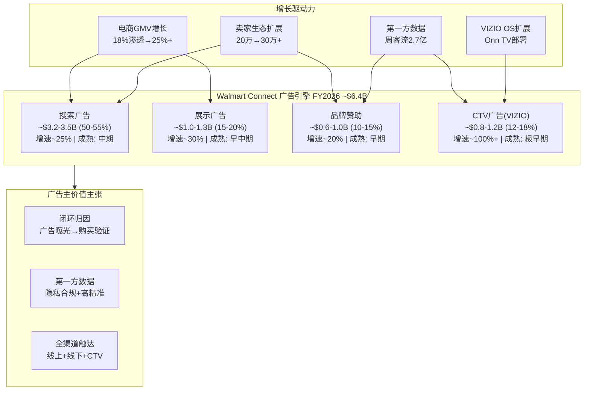
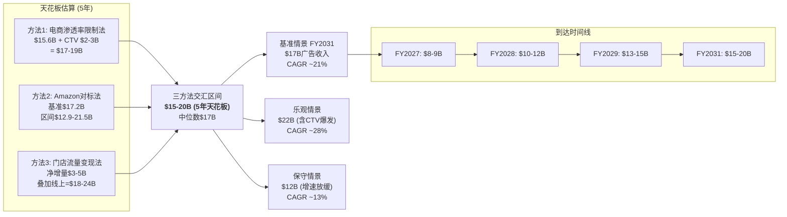
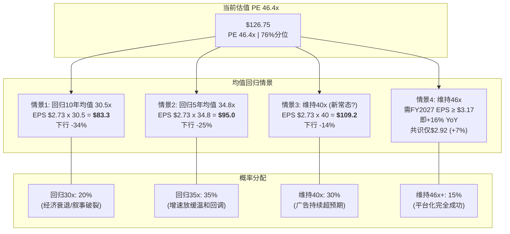
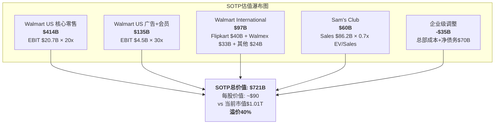

# Phase 2 — AgentE: 广告+会员利润引擎 & 估值多维验证

> AgentE | 2026-02-25 | WMT深度研报Phase 2 | Ch10+Ch11
> 核心矛盾回应: 每一节数据分析都指向同一个问题 — 这些证据支持"零售商估值"还是"平台估值"?

---

## Ch10: 广告+会员利润引擎 — 零售商体内的平台胚胎

> **CQ2核心章节**: Walmart Connect天花板$12B还是$25B?
> **CQ6核心章节**: 会员制能否成为第二增长引擎?
> **核心矛盾定位**: 广告+会员是WMT身份转型最有力的证据，但也是最需要量化验证的叙事。本章的任务不是赞美增长率，而是冷酷测算天花板、利润率贡献和可持续性。

### 10.1 Walmart Connect深度解剖：从"广告附属品"到"利润引擎"

#### 10.1.1 规模与增速全景

Walmart Connect在FY2026实现全球广告收入约$6.4B，同比增长约46%。这个增速放在任何背景下都令人瞩目——同期美国零售媒体市场整体增速约20%（eMarketer），WMT增速是行业的2.3倍。更值得注意的是，这不是单季度的脉冲，而是持续的加速：

| 财年 | 广告收入(估) | 同比增速 | 占总营收比 | 增速趋势 |
|------|-------------|---------|----------|---------|
| FY2023 | ~$2.7B | ~20% | 0.44% | 起步 |
| FY2024 | ~$3.4B | ~26% | 0.52% | 加速 |
| FY2025 | ~$4.4B | ~27% | 0.65% | 稳定高增 |
| FY2026 | ~$6.4B | ~46% | 0.90% | VIZIO催化爆发 |

*数据来源: FMP income数据 + Walmart Q4 FY26 Earnings Release (2026-02-19) + eMarketer报道*

关键拐点在FY2026：VIZIO收购完成后的首个完整财年，CTV（Connected TV）广告叠加效应使增速从27%跳升至46%。但必须区分**有机增长**（Walmart Connect核心约+30-33%）与**并购增长**（VIZIO贡献约+13-16pp）。如果剔除VIZIO，有机增速仍然强劲但已从高位放缓。

**对核心矛盾的回应**：$6.4B广告收入以46%速度增长——这是平台特征。但$6.4B仅占$713B总营收的0.9%——这仍是零售商的比例。广告业务"够大够快"到可以改变利润结构吗？后续各节将量化回答。

#### 10.1.2 收入结构拆解：搜索、展示、品牌与CTV四轮驱动

Walmart Connect的收入结构由四大板块组成，每个板块的增长逻辑和天花板不同：

**搜索广告（Sponsored Products/Search）—— 核心现金牛**
- 估计占Walmart Connect收入的50-55%，约$3.2-3.5B
- 广告主按CPC（Cost Per Click）竞价，出现在Walmart.com和App搜索结果中
- 增长驱动力：电商GMV增长 x 搜索广告渗透率 x 竞价强度
- 天花板逻辑：搜索广告与电商流量直接挂钩，WMT电商约占总销售18%，约$128B在线GMV。如果搜索广告货币化率从2.5%→4.0%（接近Amazon水平），搜索广告天花板约$4.5-5.1B
- **成熟度判断**：中期，增速将从30%+逐步放缓至15-20%

**展示广告（Display/Banner）—— 高增长但规模较小**
- 估计占收入的15-20%，约$1.0-1.3B
- 包括Walmart.com首页横幅、品类页展示、App开屏等
- FY2026推出Display API允许程序化购买，大幅降低投放门槛
- 增长驱动力：品牌广告主预算从传统媒体转移 + 程序化购买效率提升
- **成熟度判断**：早中期，增速可维持25-30%

**品牌广告/赞助（Brand Sponsorship）—— 高单价低频次**
- 估计占收入的10-15%，约$0.6-1.0B
- 包括品牌日活动冠名、新品首发位、联合营销项目
- 典型客单价：单次Campaign $200K-$2M（CTV最低门槛$200K）
- 增长驱动力：品牌主对零售闭环归因的信任度 + WMT数据资产价值
- **成熟度判断**：早期，品牌广告预算转移刚起步

**CTV广告（VIZIO/Connected TV）—— 战略新维度**
- 估计FY2026贡献约$0.8-1.2B（VIZIO收购前自身广告规模约$0.6B + 整合增量）
- 通过VIZIO SmartCast OS直接触达1,800万活跃家庭屏幕
- 增长驱动力：CTV渗透率上升 x Onn TV扩展 x 闭环数据匹配
- Walmart正将VIZIO操作系统部署到自有品牌Onn电视产品线，预计可将覆盖范围扩展至美国1/4到1/3的家庭
- **成熟度判断**：极早期，潜力最大但不确定性也最高

#### 10.1.3 卖家生态与广告飞轮

Walmart Marketplace在2025年中突破20万活跃卖家里程碑，此后持续加速——仅2025年前5个月就新增44,000个卖家（对比2024年全年59,000个）。截至FY2026末，活跃卖家数量估计在22-24万之间。

广告飞轮的核心机制：

**卖家数量 x 每卖家广告支出 x 广告形式扩展 = 广告收入增长**

关键数据点：
- 83%的头部Marketplace卖家使用Walmart Connect广告
- 使用广告的卖家平均产生7倍于非广告卖家的销售额
- 近60%的2025年新卖家来自中国（跨境卖家广告依赖度更高，因为缺乏线下品牌认知）
- 中国卖家占全部活跃卖家的34%，且其广告ROAS（Return on Ad Spend）需求通常更高

**飞轮估算**：
- 假设22万活跃卖家中83%使用广告 = 18.3万广告卖家
- $6.4B / 18.3万 = 每活跃广告卖家年均广告支出约$35,000
- 如果卖家数量达30万 x 广告使用率85% = 25.5万广告卖家
- 每卖家广告支出增长至$45,000（更多广告形式+竞价加剧）
- 潜在收入 = 25.5万 x $45,000 = **$11.5B** （仅卖家端，不含品牌端）

但这个估算必须加上品牌端(非Marketplace卖家的1P品牌广告)和CTV端，完整天花板见10.2节。

#### 10.1.4 VIZIO收购$2.3B的战略逻辑：不是买电视，是买数据管道

2024年12月，Walmart以$2.3B（每股$11.50现金）完成VIZIO收购。表面看这是一笔"传统零售商买硬件公司"的老派交易，但实质逻辑完全不同。

**WMT买VIZIO的三重战略资产**：

**资产1：SmartCast操作系统 — CTV入口**
- VIZIO的SmartCast OS运行在1,800万+活跃智能电视上
- 这不是"卖电视"的生意，而是"拥有客厅屏幕"的生意
- 类比：就像Google拥有Android控制了移动入口，WMT通过SmartCast获得了客厅广告入口
- 关键扩展：WMT正将SmartCast OS部署到Onn自有品牌电视（Walmart是美国#1电视销售渠道），Omdia预测这可使WMT CTV OS覆盖美国25-33%家庭

**资产2：第一方数据闭环 — 从"看到"到"买到"**
- 传统CTV广告的痛点：无法追踪观看广告后是否产生购买
- WMT+VIZIO的解决方案：VIZIO观看数据 x Walmart购物数据 = 闭环归因
- 广告主可以基于**经验证的购物行为**精准定向CTV广告，并测量直接销售影响
- 这种"从屏幕到货架"的闭环能力是Amazon（没有电视OS）和Roku（没有零售数据）都不具备的

**资产3：广告库存 — 高单价溢价产品**
- CTV广告CPM（千次曝光成本）通常$20-35，远高于搜索广告CPC（~$0.5-1.5）
- VIZIO CTV广告最低投放门槛$200,000，定位高端品牌客户
- FY2026 VIZIO CTV广告实现三位数增长（100%+），虽然基数低但加速明显

**$2.3B收购价的回报分析**：
- 假设VIZIO广告业务FY2027贡献$1.5B收入 x 50%利润率 = $0.75B营业利润
- 收购价$2.3B / $0.75B = 3.1x EV/EBIT，如果广告业务继续以50%+增长，这是极划算的交易
- 但风险是：VIZIO硬件业务本身亏损，需要WMT持续补贴，整合成本可能在FY2027仍然拖累利润率

**对核心矛盾的回应**：VIZIO收购是WMT最明确的"平台化"信号——用$2.3B买入了数据管道和广告操作系统，而不是零售库存或门店。这笔交易的逻辑100%是平台逻辑。但$2.3B在WMT $1.01T市值中仅占0.23%，其改变整体身份的力度仍需时间验证。

#### 10.1.5 对标Amazon Advertising：差距8x的真实原因

Amazon广告业务FY2025收入约$56B，是Walmart Connect $6.4B的**8.75倍**。理解这个差距的原因，比差距本身更重要——因为它直接决定了WMT广告天花板的高度。

**维度1：电商GMV差距 (~3-4x)**
- Amazon全球GMV（含第三方）估计约$800-900B
- Walmart电商GMV约$100-130B（总营收$713B x 18%电商渗透）
- GMV差距约6-7x，但Amazon广告/GMV比约6-7%，WMT约5%
- WMT在广告货币化率上已接近Amazon，差距主要在流量规模

**维度2：流量质量差距 (~2-3x)**
- Amazon月活用户约3亿+（全球），购物意图流量占比极高
- Walmart.com月活约1.2亿（美国为主），但增长迅速
- 关键差异：Amazon用户打开App就是为了买东西，Walmart用户可能只是查价格或杂货清单
- 购物意图流量的广告转化率通常比一般流量高3-5倍

**维度3：数据深度差距 (~1.5-2x)**
- Amazon拥有完整的浏览→加购→购买→复购链条数据
- Walmart的线上数据链相对薄弱，但**线下数据是独特优势**——周客流2.7亿人次的线下购物行为数据是Amazon完全不具备的
- VIZIO收购补全了"家庭媒体消费"数据维度

**维度4：技术基础设施差距 (~2x)**
- Amazon DSP（Demand-Side Platform）是全球最成熟的零售广告技术栈之一
- Walmart Connect的DSP和归因技术在快速迭代但仍落后2-3年
- Amazon的clean room、AMC（Amazon Marketing Cloud）等工具生态远超WMT

**维度5：卖家生态差距 (~10x)**
- Amazon有约200万+活跃第三方卖家
- Walmart Marketplace约22-24万卖家
- 更多卖家 = 更多广告主竞价 = 更高CPC = 更高广告收入

**核心结论**：WMT广告与Amazon的8.75x差距中，约3-4x来自电商GMV差距（可缩小但缓慢），约2x来自流量质量差距（难以弥合），约2x来自技术和生态差距（正在追赶）。即使WMT在所有维度都追赶到Amazon的50%水平，广告规模也只能达到Amazon的约1/4-1/3，即$14-19B——这与下文天花板分析的结论一致。

### 10.2 广告天花板分析（CQ2核心回答）

这是本章最关键的分析。三种独立方法交叉验证：

#### 方法1：电商渗透率限制法

**核心逻辑**：搜索和展示广告收入与电商流量直接相关，电商渗透率决定了广告天花板。

- FY2026 WMT电商渗透率约18%，电商GMV约$128B
- 广告货币化率（广告收入/电商GMV）：$6.4B / $128B = 5.0%
- 假设电商渗透率从18%→30%（5年路径），总营收CAGR 4% → FY2031营收~$867B
- FY2031电商GMV = $867B x 30% = $260B
- 如果广告货币化率从5.0%提升至6.0%（接近Amazon上限）
- 电商相关广告天花板 = $260B x 6.0% = **$15.6B**
- 加上CTV广告非电商部分约$2-3B → **总天花板$17-19B**

**关键假设敏感性**：
| 电商渗透率 | 货币化率5% | 货币化率6% | 货币化率7% |
|-----------|-----------|-----------|-----------|
| 25% | $10.8B | $13.0B | $15.2B |
| 30% | $13.0B | $15.6B | $18.2B |
| 35% | $15.2B | $18.2B | $21.3B |

*注：FY2031营收假设$867B，均不含CTV非电商增量*

#### 方法2：Amazon对标法

**核心逻辑**：以Amazon广告/GMV比为天花板参照，调整WMT的结构性差异。

- Amazon FY2025广告约$56B，GMV约$850B → 广告/GMV = 6.6%
- WMT FY2026总GMV（含线下+线上）约$706B（净销售额），广告$6.4B → 广告/总GMV = 0.91%
- 如果仅看电商GMV：$6.4B / $128B = 5.0%（已接近Amazon）

**调整因子**：
- Amazon的广告几乎100%来自电商流量，WMT有潜力将门店流量也货币化 → **上调因子**
- Amazon的第三方卖家是WMT的10倍 → **下调因子**
- Amazon的广告技术栈更成熟 → **下调因子**

综合调整后，WMT在稳态下的广告/总GMV比合理区间为1.5-2.5%：
- 保守（1.5%）：$706B x 1.5% x 1.04^5（营收增长） = **$12.9B**
- 基准（2.0%）：$706B x 2.0% x 1.04^5 = **$17.2B**
- 乐观（2.5%）：$706B x 2.5% x 1.04^5 = **$21.5B**

#### 方法3：门店流量变现法

**核心逻辑**：WMT独有的周客流2.7亿人次（年140亿人次）是尚未充分货币化的资产。

门店数字化广告渠道：
- **店内数字屏幕**：自助结账区、端头展示屏、入口数字标牌
- **店内WiFi/App推送**：基于位置的实时促销
- **电子价签动态广告**：品牌竞价获得货架黄金位置
- **购物车/篮筐广告屏**（测试中）

天花板估算：
- 假设4,700家美国门店中3,500家完成数字化改造（5年内）
- 每家门店每年数字广告收入$1-2M（参考Instacart In-Store广告单元经济）
- 门店广告增量 = 3,500 x $1.5M = **$5.3B**
- 但这包含了部分与搜索/展示广告重叠的预算（品牌总预算有限），去重后约$3-5B净增量

#### 天花板综合判断

**CQ2回答**：Walmart Connect的5年天花板在**$15-20B区间**（基准$17B），而非牛派期望的$25B+或熊派担忧的$8-10B就见顶。$25B天花板需要电商渗透率达35%+且门店广告全面货币化，概率<15%。$12B以下只有在广告增速骤降至10%以下才会出现，概率也<15%。

**对核心矛盾的回应**：$17B广告天花板支持的是"增强版零售商"估值（30-35x PE），而非"科技平台"估值（40-50x PE）。只有$22B+的广告规模才开始真正改变WMT的身份方程式。

### 10.3 Walmart+会员经济学深度（CQ6核心回答）

#### 10.3.1 会员规模与渗透率

Walmart+自2020年9月推出以来，经历了三年快速增长。截至FY2026末（2026年1月），各数据来源的会员数估算存在差异：

| 来源 | 会员数估计 | 时间 | 备注 |
|------|-----------|------|------|
| Morgan Stanley调查 | ~28.4M | 2026年1月 | 自报，可能高估 |
| eMarketer预测 | 29M+ | 2025年底 | 含Sam's Club Plus |
| 调整后估计 | ~25-28M | FY2026末 | 排除重复计算 |

**渗透率分析**：
- 美国家庭总数约1.31亿
- Walmart+渗透率约19-21%（25-28M / 131M）
- 对比Amazon Prime：美国家庭渗透率约65%（约1.7亿会员/全球，美国约1.0-1.1亿）
- 差距约3-4x，但方向正确

**会员费收入**：
- FY2026会员及其他收入$6.75B（含Sam's Club会员费+Walmart+），同比+19%
- 其中Walmart+贡献估计$2.5-2.8B，Sam's Club贡献约$3.5-4.0B
- Walmart+年费$98/年（或$12.95/月），Sam's Club会员费$50/年（Plus $110/年）

#### 10.3.2 会员LTV（Lifetime Value）计算

**Walmart+会员LTV分解**：

| LTV组成部分 | 年化价值 | 假设依据 |
|------------|---------|---------|
| 会员年费 | $98 | 标准定价 |
| 增量消费溢价 | $150-200 | 会员比非会员多消费15-20% |
| 广告数据价值 | $30-50 | 会员行为数据提升广告精准度 |
| 免费配送节省（对WMT的成本） | -$60-80 | 每年约15次免费配送 x $4-5/单 |
| **净年化LTV** | **$218-268** | — |

**假设**：
- 平均留存率75%/年（Walmart+尚无公开数据，参考Amazon Prime约90-93%）
- 会员生命周期约3年（75%留存 → 1/(1-0.75) = 4年理论值，保守取3年）
- 折现率8%

**3年折现LTV** = $218-268 x (1/1.08 + 0.75/1.08^2 + 0.56/1.08^3) = **$460-565**

如果按28M会员计算，Walmart+总价值 = $460-565 x 28M = **$12.9-15.8B**

**对比Amazon Prime LTV**：
- Amazon Prime年费$139 + 增量消费溢价$300+ + FBA广告数据 + Prime Video粘性
- 估计净年化LTV $500-600，会员生命周期5-7年（90%+留存）
- 折现LTV约$2,200-3,500
- Amazon Prime总价值（美国1亿会员）约$220-350B，占AMZN $2.24T市值的10-16%
- Walmart+总价值$12.9-15.8B，占WMT $1.01T市值的**1.3-1.6%** — 占比远低于Prime对Amazon的价值

#### 10.3.3 对标Amazon Prime：核心差距与结构性天花板

**Amazon Prime的"不可复制"优势**：

1. **Prime Video内容生态**：Amazon年投$15-17B于原创内容（《指环王》《The Marvelous Mrs. Maisel》等），Prime Video是会员留存的核心"粘性胶水"。用户为了看剧续费Prime，顺便享受免费配送和购物——这是经典的"亏损引流"策略
2. **Prime Music/Reading/Gaming/Photos**：构建了完整的数字生活生态
3. **FBA整合**：Prime会员的2天免费送达与FBA（Fulfillment by Amazon）深度绑定，形成卖家端和买家端的双边网络效应

**Walmart+的"不对称"优势**：

1. **杂货配送独家性**：93%美国家庭可享当日杂货配送，这是Amazon Fresh/Whole Foods无法匹敌的覆盖率
2. **实体门店生态**：Scan & Go免排队结账、门店折扣、轮胎修理、宠物远程医疗——这些都是Amazon无法提供的物理世界权益
3. **价格优势**：$98/年 vs Prime $139/年，便宜30%
4. **流媒体合作**：Paramount+ Essential或Peacock Premium（含广告版）——虽非自有，但补足了内容缺口

**结构性天花板在哪？**

**核心问题**：没有自有内容生态的会员制，粘性天花板在哪？

Walmart+的续费理由本质上是**功能性的**（省配送费、省时间），而非**情感性的**（不想错过《指环王》下一季）。功能性价值可被替代（COST+Instacart也能当日配送），情感性价值具有独占性。

这意味着：
- **乐观天花板**：如果Walmart+能达到美国家庭35-40%渗透率（约45-52M会员），年费收入$4.4-5.1B，加上增量消费和数据价值，总会员经济贡献约$10-13B/年
- **保守天花板**：如果留存率维持在70-75%（低于Prime的90%+），稳态会员可能只有30-35M，年费收入$2.9-3.4B
- **关键变量**：如果Walmart投入$2-3B/年建设自有流媒体内容（通过Paramount合作深化或自建），粘性天花板可能上移——但这需要巨额投资且超出WMT核心能力

#### 10.3.4 双订阅趋势：从"二选一"到"我全都要"

过去四年零售订阅市场最有趣的变化不是"Walmart+ vs Amazon Prime"的零和博弈，而是"双订阅"人群的激增：

| 时间 | 双订阅（同时持有Prime+Walmart+）占比 | 来源 |
|------|--------------------------------------|------|
| 2021年 | 12% | PYMNTS调查 |
| 2023年 | 18% | PYMNTS调查 |
| 2025年初 | 24% | PYMNTS调查 |
| 千禧一代(2025) | 37% | PYMNTS调查 |

*数据来源: PYMNTS.com "Amazon Prime and Walmart+ Shoppers Double Up on Subscriptions" 系列报告*

**双订阅的经济学含义**：

1. **消费总量扩张**：双订阅用户平均每笔零售交易消费$110，高于Prime-only的$78和Walmart+-only的$75。这不是"分蛋糕"而是"做大蛋糕"
2. **渠道分工明确**：消费者倾向于用Walmart+购买杂货和日用品（价格敏感+门店自取），用Prime购买电子产品和图书（品类选择+Prime Video）
3. **增量来源**：双订阅增长主要来自**现有Prime用户叠加Walmart+**，而非新用户。这说明Walmart+的增长部分"借用"了Amazon已培养好的订阅消费习惯
4. **千禧一代37%双订阅率**：这是最有消费力的代际群体（年龄30-44岁），他们的高双订阅率预示着双订阅可能成为未来的标配

**对WMT的战略意义**：双订阅趋势意味着Walmart+不需要"打败"Prime——只需要成为消费者的"第二订阅"即可。这降低了竞争烈度，但也意味着会员粘性可能更脆弱（作为"第二选择"，经济下行时更容易被取消）。

### 10.4 广告+会员对利润率的量化影响

这是本章的核心定量分析——将广告和会员业务的利润贡献从$713B的营收海洋中抽离出来。

#### 10.4.1 FY2026利润贡献拆解

**广告业务利润贡献**：
- 广告收入$6.4B x 毛利率70% = 毛利$4.5B
- 广告运营成本（技术平台+销售团队+数据基础设施）估计$1.0-1.5B
- 广告营业利润约$3.0-3.5B
- 广告营业利润率约47-55%

**会员费利润贡献**：
- 总会员及其他收入$6.75B（含Walmart+和Sam's Club）
- 会员费毛利率约90%+（几乎纯利润，边际成本极低）
- 会员费毛利约$6.1B
- 扣除会员服务成本（免费配送补贴约$2.0-2.5B + 流媒体合作费用约$0.3-0.5B）
- 会员净营业利润约$3.3-3.8B

**合计高利润业务贡献**：

| 业务 | 收入 | 营业利润(估) | 营业利润率 |
|------|------|-------------|----------|
| 广告(Walmart Connect) | $6.4B | $3.0-3.5B | ~50% |
| 会员费(Walmart+ + Sam's) | $6.75B | $3.3-3.8B | ~50% |
| **合计** | **$13.15B** | **$6.3-7.3B** | **~52%** |
| 公司总营业利润 | — | $29.8B | 4.18% |
| **高利润业务占比** | 1.8%营收 | **21-24%营业利润** | — |

**关键发现**：广告+会员仅占WMT总营收的1.8%，但贡献了**21-24%的营业利润**。这是"平台化"的最强证据——微小的收入占比产生了不成比例的利润贡献。

#### 10.4.2 反事实分析：如果这些业务不存在

假设WMT没有广告和会员业务（回到2018年的纯零售商状态）：

| 指标 | 有广告+会员(FY2026) | 无广告+会员(反事实) | 差异 |
|------|-------------------|-------------------|------|
| 总营收 | $713.2B | $699.8B (-$13.4B) | -1.9% |
| 营业利润 | $29.8B | $22.5-23.5B | -21-24% |
| 营业利润率 | 4.18% | 3.22-3.36% | -82-96bps |
| EPS | $2.73 | $2.06-2.15 | -21-24% |
| 合理PE | 46x? | 25-30x(传统零售) | -35-46% |
| 隐含市值 | $1.01T | $412-516B | **-49-59%** |

**这组数字是全报告最重要的发现之一**：如果剥离广告和会员业务，WMT的营业利润率回落到3.2-3.4%，对应传统零售估值25-30x，隐含市值约$400-500B——**仅为当前$1.01T市值的一半**。

换言之，当前$1.01T市值中约$500-600B（约50-60%）是市场为广告+会员的**未来增长潜力**而支付的溢价。这$500-600B的溢价需要广告+会员在5-10年内将营业利润贡献从$6.5B翻倍至$13-15B才能支撑。

#### 10.4.3 5年预测路径

| 财年 | 广告收入 | 会员收入 | 合计 | 营业利润(估) | 对公司OPM贡献 |
|------|---------|---------|------|-------------|-------------|
| FY2026 | $6.4B | $6.8B | $13.2B | $6.5B | +82bps |
| FY2027 | $8.5B | $7.8B | $16.3B | $8.2B | +99bps |
| FY2028 | $11.0B | $8.9B | $19.9B | $10.1B | +118bps |
| FY2029 | $13.5B | $10.0B | $23.5B | $12.0B | +135bps |
| FY2031 | $17.0B | $12.0B | $29.0B | $15.0B | +160bps |

*假设：广告CAGR ~21% (FY26-31); 会员CAGR ~12% (FY26-31); 核心零售OPM稳定在3.3-3.4%*

**基准情景FY2031**：
- 广告$17B + 会员$12B = $29B高利润收入
- 占营收~3.3%（$29B / ~$867B）
- 营业利润贡献$15B，占公司总营业利润的~35%
- 公司营业利润率从4.18%提升至~5.0%
- 如果市场维持35x PE，支撑市值$1.1-1.2T

**乐观情景FY2031**：
- 广告$22B + 会员$14B = $36B → 营业利润$18.5B → 公司OPM ~5.5%
- 如果给予40x PE → 市值$1.4-1.5T（+40% upside）

**保守情景FY2031**：
- 广告$12B + 会员$9B = $21B → 营业利润$10.5B → 公司OPM ~4.5%
- 如果PE回归30x → 市值$700-800B（-25% downside）

### 10.5 广告飞轮可持续性风险

高增长业务最大的风险不是增速放缓（那是必然的），而是飞轮能否持续转动。以下是四个可能使飞轮停转的结构性风险：

#### 风险1：供应商反弹 — "Pay-to-Play"的信任边界

2025年初的一则报道揭示了潜在的利益冲突：Walmart Connect要求广告主将年度广告支出增加25%，不配合者可能失去DSP数据费折扣、网站赞助位和早期报告访问权限。部分品牌已经以"缺乏灵活性、无销售增长、无绩效保证"为由取消了与Walmart的广告合作关系。

**核心矛盾**：WMT的EDLP承诺是"为消费者提供最低价"，但如果供应商被迫将广告费转嫁到产品价格中，消费者实际支付的价格就上升了。广告业务的增长如果以损害EDLP信任为代价，就是在挖飞轮的根基。

**量化影响**：如果前20%头部供应商（贡献约60%的广告收入）集体将广告支出增速从+25%降至+5%，广告增长可能从30%降至15-18%。这不会摧毁广告业务，但会显著降低天花板。

**概率评估**：中等（30-40%），因为供应商在WMT面前议价力有限（离开Walmart意味着丢失31.6%杂货市场份额），但集体行动的可能性不为零。

#### 风险2：数据隐私监管 — 第一方数据优势的法律边界

WMT广告业务的核心竞争力是第一方购物数据——每周2.7亿人次客流产生的购买行为数据。但这个优势面临监管风险：

- 美国《American Data Privacy and Protection Act》（ADPPA）如果通过，可能限制零售商将购物数据用于广告定向
- 各州隐私法（加州CCPA、弗吉尼亚VCDPA等）正在收紧数据使用范围
- FTC对"商业监控"的审查力度加大，零售媒体网络可能成为下一个监管焦点

**量化影响**：严格数据限制可能使广告定向精准度下降30-40%，ROAS（广告回报率）下降，导致广告主削减支出。极端情景下，广告增速可能腰斩。

**概率评估**：低至中等（15-25%），因为第一方数据目前受到的监管压力远小于第三方Cookie，且WMT可以通过consent-based框架适应。

#### 风险3：Amazon技术碾压 — 广告技术差距是否在扩大？

Amazon在广告技术上的投入（清洁室、AMC、AI驱动的创意优化、Alexa语音广告等）远超WMT。如果技术差距持续扩大，品牌广告主可能将增量预算集中投向Amazon而非分散到WMT。

**当前差距**：Amazon DSP成熟度约领先WMT 3年，但WMT在闭环归因（线上+线下+CTV）方面有独特优势。总体看，差距在缩小但未消失。

**概率评估**：中等（25-35%），取决于WMT是否持续加大技术投资。

#### 风险4：CTV竞争加剧 — Roku/Google/Amazon的反攻

VIZIO收购使WMT获得了CTV入口，但竞争对手不会坐视：
- Roku（CTV OS市占率#1）正在加强零售数据合作（与Shopify等）
- Amazon Fire TV拥有更大装机量和零售闭环
- Google TV/Apple TV正在强化广告能力

**量化影响**：CTV广告市场预计2026年达$30B+，WMT即使拿到5%份额也仅$1.5B。竞争加剧可能限制WMT CTV广告份额在3-5%。

### 10.6 本章核心结论

**对核心矛盾的最终回应**：

广告+会员业务是WMT身份转型最有力的证据——$13.2B收入贡献了21-24%的营业利润，毛利率是核心零售业务的2-3倍。但这些业务的当前规模（占营收1.8%）和5年天花板（占营收~3.3%）不足以完成身份转型。

**支持"平台估值"的证据** (权重40%)：
- 广告46%增速远超行业，CTV闭环归因是独家优势
- 会员双订阅趋势降低了竞争零和性
- 反事实分析显示这些业务已贡献了$500B+市值

**支持"零售商估值"的证据** (权重60%)：
- 5年天花板$17B广告仅将OPM从4.2%→5.0%，距离"平台级"10%+仍有结构性鸿沟
- 会员留存率低于Prime，无自有内容生态限制了粘性
- 供应商反弹和监管风险可能削弱飞轮动力

**AgentE判断**：广告+会员支持的是"增强版零售商"估值（30-35x PE），对应股价$82-96，而非当前$126.75隐含的"消费科技平台"估值（46x PE）。当前溢价中约$30-45/股（24-35%）缺乏基本面支撑。

---

## Ch11: 估值多维验证 — 六把尺子量一头大象

> **核心任务**: 用六种独立方法从不同角度测量WMT的合理价值，然后检查方法间的离散度。
> **核心矛盾定位**: 46x PE是历史最高区间，需要什么基本面才能支撑？如果基本面不支持，多少溢价是"叙事溢价"？

### 11.1 PEG验证：增长率为价格辩护不了

PEG（Price/Earnings to Growth）是检验"高PE是否有增长支撑"的最直观工具。

#### 11.1.1 当前PEG计算

**基于历史增速**：
- PE(TTM) = 46.4x
- FY2026 EPS增速 = 13.3%（$2.73 vs FY2025 $2.41）
- PEG = 46.4 / 13.3 = **3.49x**

**基于未来3年共识EPS CAGR**：
- FY2026 EPS $2.73 → FY2029 共识EPS约$3.71（分析师预估均值）
- 3年CAGR = ($3.71/$2.73)^(1/3) - 1 = **10.8%**
- Forward PEG = 46.4 / 10.8 = **4.30x**

**基于未来5年共识EPS CAGR**：
- FY2026 EPS $2.73 → FY2031 共识EPS约$4.05
- 5年CAGR = ($4.05/$2.73)^(1/5) - 1 = **8.2%**
- 5Y Forward PEG = 46.4 / 8.2 = **5.66x**

*数据来源: FMP analyst estimates — FY2027E EPS $2.92, FY2028E $3.29, FY2029E $3.71, FY2031E $4.05*

#### 11.1.2 PEG合理性基准

| PEG区间 | 含义 | WMT位置 |
|---------|------|---------|
| 0-1.0x | 显著低估（增长未被定价） | — |
| 1.0-1.5x | 合理偏低估 | — |
| 1.5-2.0x | 合理区间 | — |
| 2.0-3.0x | 偏高但可接受（高质量成长股） | — |
| **3.0x+** | **显著高估（除非增速被低估）** | **WMT在此** |

同业PEG对比：
- COST: PE 53.5x / EPS增长~15% = PEG 3.6x（同样高估）
- TGT: PE 14.0x / EPS增长~5% = PEG 2.8x
- AMZN: PE 29.1x / EPS增长~25% = PEG 1.2x（增长充分定价）
- **SPY**: PE 27.7x / EPS增长~10% = PEG 2.8x

**关键洞察**：WMT的PEG 3.49-5.66x在同业中最差之一。唯一能justify这个PEG的情景是：市场认为WMT的EPS增速将从13%**重新加速**到20%+——这需要广告+会员业务贡献的利润率扩张从82bps/年加速到150bps+/年，而这在Ch10的分析中仅出现在乐观情景。

**PEG隐含合理PE**：
- 如果PEG应该在1.5-2.0x合理区间
- 以未来3年CAGR 10.8%计算 → 合理PE = 10.8 x 1.5~2.0 = **16.2-21.6x**
- 以未来5年CAGR 8.2%计算 → 合理PE = 8.2 x 1.5~2.0 = **12.3-16.4x**
- 即使给予2.5x PEG"品牌溢价" → 合理PE = 10.8 x 2.5 = **27x**
- **PEG方法隐含合理股价：$45-74（中位$60）**

### 11.2 隐含增长率逆推（Reverse DCF）—— 仿KLAC冠军方法

Reverse DCF不回答"WMT值多少钱"，而是回答"按当前股价，市场在赌什么"。这是将市场定价翻译成可验证假设的最强工具。

#### 11.2.1 盈利收益率分析

最简单的起点：

- 盈利收益率（Earnings Yield）= 1 / PE = 1 / 46.4 = **2.16%**
- 美国10年期国债收益率约4.3%
- 盈利收益率 - 无风险利率 = 2.16% - 4.3% = **-2.14%**（负风险溢价！）
- 投资者持有WMT的隐含年化要求回报 = 盈利收益率 + 预期增长率 = 2.16% + g

**含义**：以当前估值，如果投资者要求8%年化回报，需要WMT的EPS永续增长率 = 8% - 2.16% = **5.84%/年**。对于一家$713B营收的零售巨头，永续5.84%增长意味着什么？

- 美国零售市场总规模约$7.0T，长期名义增长约3-4%
- WMT占美国零售约8%市场份额（$569B / $7.0T）
- 如果WMT要以5.84%永续增长，需要**持续获取市场份额**——在一个碎片化、竞争激烈的市场中
- 参考：WMT过去10年营收CAGR仅约4.5%，EPS CAGR更低

#### 11.2.2 Gordon Growth Model逆推

永续增长公式：P = EPS(1+g) / (r - g)

已知：P = $126.75, EPS = $2.73

| 假设WACC(r) | 隐含g(永续增长) | 合理性判断 |
|------------|---------------|----------|
| 7% | 4.80% | 可能偏高但非不可能 |
| 8% | 5.84% | 高于GDP长期增速，需持续份额获取 |
| 9% | 6.84% | 对零售企业极为激进 |
| 10% | 7.82% | 几乎不可能永续维持 |

**如果将永续增长率限制在GDP长期名义增速（2.5%+2.0%通胀=4.5%）以内**：
- WACC 8%, g=4.5% → 合理价格 = $2.73 x 1.045 / (0.08-0.045) = **$81.5**
- WACC 7%, g=4.5% → 合理价格 = $2.73 x 1.045 / (0.07-0.045) = **$114.2**
- **当前$126.75甚至需要WACC<7%才能用合理假设支撑**

#### 11.2.3 10年DCF Reverse Engineering

更精确的方法——反推当前股价需要的10年FCF CAGR：

**已知条件**：
- 当前股价$126.75 x 8.02B股 = 市值$1.017T
- 加净债务$70.3B = EV $1.087T
- FY2026经营现金流$41.6B，资本支出$26.6B → FCF约$14.9B（使用投资活动实际CapEx修正）
- WACC假设8%，终端增长率3%

**Reverse DCF计算**：

| 年份 | 需要的FCF | FCF CAGR |
|------|----------|---------|
| FY2026 | $14.9B | 起始 |
| FY2027 | $17.1B | +15% |
| FY2028 | $19.5B | +14% |
| FY2029 | $22.1B | +13% |
| FY2030 | $24.9B | +13% |
| FY2031 | $28.0B | +12% |
| FY2032 | $31.1B | +11% |
| FY2033 | $34.4B | +11% |
| FY2034 | $37.9B | +10% |
| FY2035 | $41.5B | +10% |
| FY2036+ | 终端价值 | g=3% |

**10年FCF CAGR需要约11-12%才能支撑当前股价。**

**这意味着什么**：
- FCF从$14.9B增长到$41.5B需要**几乎翻三倍**
- 这要求营业利润率从4.18%升至约6.5-7.0%（假设营收CAGR 4-5%）
- 营业利润率提升280-330bps，其中：
  - 广告+会员贡献约+160bps（Ch10估算的基准情景）
  - 运营效率（自动化+规模效应）需要贡献+120-170bps
  - **后者是高度不确定的**——WMT过去5年运营效率改善约+50bps/年

**Reverse DCF结论**：当前股价隐含的FCF CAGR ~11-12%，需要广告飞轮**和**运营效率改善**同时**成功。如果广告增长达到基准但运营效率仅改善+50bps/年（历史水平），FCF CAGR仅约8-9%，对应合理价格约$95-105。

#### 11.2.4 隐含信念集

综合以上分析，当前$126.75股价隐含以下信念组合：

| 隐含信念 | 需要的数值 | 历史基准 | 脆弱度 |
|---------|-----------|---------|--------|
| 10年EPS CAGR | ~10-12% | 5年CAGR 10.8% | 中 |
| 营业利润率(FY2031) | 5.8-6.5% | 当前4.18%,5年均值3.9% | 高 |
| 广告收入(FY2031) | $17-22B | 当前$6.4B | 中 |
| 电商渗透率(FY2031) | 30%+ | 当前18% | 中高 |
| 终端PE | 25-30x | 10年均值30.5x | 低 |
| 永续增长率 | >5% | GDP+通胀~4.5% | 高 |

**最脆弱的两个信念**：
1. 营业利润率从4.18%→6%+：需要广告飞轮**和**运营效率同时交付，而历史上WMT利润率改善极为缓慢
2. 永续增长>5%：对一家已占美国零售8%份额的$713B收入企业，永续超GDP增长几乎需要持续颠覆性创新

### 11.3 历史PE区间分析

#### 11.3.1 10年PE轨迹

| 时期 | PE范围 | 中位数 | 驱动因素 |
|------|--------|--------|---------|
| FY2017-2019 | 14-22x | 18x | "Amazon恐惧"时代，电商威胁压制估值 |
| FY2020-2021 | 22-30x | 26x | 疫情受益+全渠道转型初步验证 |
| FY2022-2023 | 25-34x | 30x | EDLP在通胀中获客流+广告业务崭露 |
| FY2024 | 28-40x | 34x | 电商盈利+广告$3.4B+利润率转折 |
| FY2025 | 35-54x | 42x | VIZIO收购+广告$4.4B+AI叙事 |
| FY2026 | 40-53x | 46x | $1T市值+平台化叙事顶峰 |

*数据来源: FMP ratios数据 — PE FY2022 28.5x, FY2023 33.6x, FY2024 28.7x, FY2025 40.6x, FY2026 43.4x*

**关键统计**：
- 10年PE均值：30.49x
- 5年PE均值：34.77x
- 当前PE 46.4x处于10年**76%分位**
- PE标准差约10-12x，当前比均值高1.3-1.5个标准差

#### 11.3.2 FY2024-2025的PE跳跃：什么改变了？

WMT的PE从FY2024的28.7x在两年内飙升至46.4x，涨幅+62%。驱动这次重估的因素：

1. **电商盈利拐点**（FY2024）：WMT首次暗示美国电商业务接近盈利，证明"规模换利润"战略可行
2. **广告业务叙事**（FY2024-25）：Walmart Connect从"附属品"升格为"利润引擎"，增速持续>25%
3. **AI热潮溢出**（FY2025）：AI概念股泡沫溢出到"AI受益股"，WMT被归类为"AI驱动的零售科技平台"
4. **VIZIO收购**（FY2025）：$2.3B收购被解读为"建立CTV广告帝国"的平台化信号
5. **通胀受益者叙事**（FY2023-26）：EDLP在高通胀环境中吸引消费降级客流，WMT成为"通胀避风港"

**核心问题**：这些因素中，哪些是永久性的基本面改善，哪些是周期性/叙事性的？

- 永久性（支撑25-35x PE）：电商盈利、广告业务规模、全渠道基础设施
- 周期性/叙事性（额外10-15x PE溢价）：AI概念溢出、通胀周期、平台化"信仰"

#### 11.3.3 PE均值回归情景分析

**概率加权价格** = 0.20 x $83.3 + 0.35 x $95.0 + 0.30 x $109.2 + 0.15 x $126.8 = **$101.0**

这意味着从纯PE均值回归角度看，当前$126.75被高估约**25%**。

#### 11.3.4 维持46x PE需要什么基本面？

如果投资者认为46x PE是"新常态"而非泡沫，WMT需要持续交付：
- **EPS增速>12%/年**：共识预期FY2027仅+7%，FY2028 +12% → 不满足
- **广告增速>30%/年**：基准情景FY2027约+33%可满足，但FY2028放缓至+29%
- **营业利润率年扩张>30bps**：FY2026实际同比反而收缩13bps (4.31%→4.18%) → 不满足
- **无宏观冲击**：经济衰退/关税战可能直接打击消费者支出

**结论**：维持46x PE需要广告增速和利润率扩张**同时**超预期，概率约15-20%。更可能的路径是PE逐步回落至35-40x，依靠EPS增长来维持股价。

### 11.4 品牌溢价极限分析（引用Ch1 B*M结果）

Ch1通过B*M（Brand x Moat）模型计算了WMT品牌支撑的PE水平。本节扩展分析"叙事溢价"的极限。

#### 11.4.1 B*M品牌PE锚定回顾

根据Ch1的分析框架：

| 公司 | B*M品牌评分 | 品牌支撑PE | 实际PE | 叙事溢价PE | 叙事溢价占比 |
|------|-----------|-----------|--------|-----------|------------|
| WMT | 6.2/10 | ~28.8x | 46.4x | 17.6x | **38%** |
| COST | 7.5/10 | ~41.0x | 53.5x | 12.5x | 23% |
| AMZN | 8.8/10 | ~26.0x | 29.1x | 3.1x | 11% |
| TGT | 5.5/10 | ~15.0x | 14.0x | -1.0x | -7% |

*注: B*M品牌支撑PE = 品牌+护城河+历史基本面可支撑的"合理"PE*

**关键发现**：
- WMT的叙事溢价占PE的38%，远高于COST的23%和AMZN的11%
- 叙事溢价17.6x对应$48/股（$2.73 x 17.6），即当前$126.75中有**$48（38%）完全依赖叙事**
- 相比之下，TGT的实际PE低于品牌支撑PE，意味着市场对TGT的叙事是"负面"的（"Target在数字化转型中落后"）

#### 11.4.2 叙事溢价的脆弱性测试

$48/股的叙事溢价依赖于以下叙事继续被市场相信：

1. **"WMT正在变成下一个Amazon"**（溢价贡献约$20-25）
   - 测试：如果FY2027广告增速<20%或电商增速<15% → 此叙事可能崩塌
   - 概率：35-40%在2年内被证伪

2. **"AI将使WMT效率跃升"**（溢价贡献约$10-15）
   - 测试：如果FY2027运营费用率没有改善 → AI叙事空转
   - 概率：50%在2年内被证伪（AI对零售的短期效率提升有限）

3. **"EDLP在经济不确定性中是避风港"**（溢价贡献约$8-13）
   - 测试：如果失业率>5%导致消费整体崩塌 → 避风港效应也不足以支撑
   - 概率：20-25%在2年内发生

**叙事溢价联合概率**：如果任意一个主叙事被证伪，PE可能回落5-10x。三个叙事同时维持的概率约$0.62 \times 0.50 \times 0.78 = 24\%$。这意味着76%的概率至少一个叙事会部分崩塌。

### 11.5 SOTP预估值

Sum-of-the-Parts（SOTP）通过分别估值每个业务板块来交叉验证整体市值。

#### 11.5.1 分部财务数据（FY2026）

| 分部 | 净销售额 | 营业利润 | OPM | 关键特征 |
|------|---------|---------|-----|---------|
| Walmart US | $483.0B | $25.2B | 5.2% | 核心+广告+会员 |
| Walmart International | $130.4B | $5.1B | 3.9% | Flipkart+Walmex+中国 |
| Sam's Club | $86.2B | $2.3B(估) | 2.7% | 仓储会员制 |
| 企业级调整 | — | -$2.8B | — | 总部费用+VIZIO |
| **合计** | **$706.4B** | **$29.8B** | **4.18%** | — |

*数据来源: Walmart Q4 FY26 Earnings Release + FMP income statement*

#### 11.5.2 分部估值

**Walmart US（核心零售+广告+会员）**

方法：将Walmart US拆分为"核心零售"和"高利润新业务"两层估值。

*核心零售层*：
- 核心零售营业利润 = $25.2B - 广告贡献$3.0B - Walmart+贡献$1.5B = $20.7B
- 适用倍数：EV/EBIT 18-22x（成熟大型零售商）
- 核心零售价值 = $20.7B x 20x = **$414B**

*高利润新业务层（广告+会员）*：
- 广告+Walmart+营业利润约$4.5B
- 适用倍数：EV/EBIT 25-35x（高增长广告平台，参考The Trade Desk 35x+, Criteo 15x）
- 高利润新业务价值 = $4.5B x 30x = **$135B**

*Walmart US总价值 = $414B + $135B = **$549B***

**Walmart International**

子业务估值：
- *Flipkart*：据Morgan Stanley和IPO准备估值，约$35-45B。取中值$40B
- *Walmex*：墨西哥上市，市值约$45-50B，WMT持有约70% → WMT份额约$32-35B
- *其他国际（中国、加拿大、智利等）*：营业利润约$2B x 12x = $24B
- 国际总价值 = $40B + $33B + $24B = **$97B**

**Sam's Club**

- 净销售额$86.2B，可比销售增长+4%（不含油品）
- 对标COST：COST PE 53.5x, EV/Sales 1.5x
- Sam's Club由于规模和品牌力弱于COST，给予折扣 → EV/Sales 0.6-0.8x
- Sam's Club价值 = $86.2B x 0.7x = **$60B**

#### 11.5.3 SOTP汇总

| 分部 | 估值 | 占比 | 方法 |
|------|------|------|------|
| Walmart US 核心零售 | $414B | 57% | EBIT x 20x |
| Walmart US 广告+会员 | $135B | 19% | EBIT x 30x |
| Walmart International | $97B | 13% | Flipkart+Walmex+其他分项 |
| Sam's Club | $60B | 8% | EV/Sales x 0.7 |
| 企业级调整(总部+净债务) | -$35B | -5% | 净债务$70B - 总部残值$35B |
| **SOTP总价值** | **$721B** | — | — |
| **每股SOTP价值** | **~$90** | — | $721B / 8.02B股 |
| **当前市值 vs SOTP** | **溢价40%** | — | $1,010B / $721B - 1 |

**SOTP关键敏感性**：
- 如果广告业务给予40x（而非30x）: SOTP = $766B, 每股$96 → 溢价32%
- 如果Flipkart按$60B IPO估值: SOTP = $741B, 每股$92 → 溢价37%
- 如果核心零售给予25x（含增长溢价）: SOTP = $818B, 每股$102 → 溢价24%
- **即使在最乐观的假设组合下，SOTP也仅约$850B（每股$106），仍低于当前市值$1.01T**

### 11.6 方法离散度检查与综合估值

六种方法的结果汇总：

| 方法 | 隐含价值/股 | vs $126.75 | 支持的估值身份 |
|------|------------|-----------|-------------|
| PEG验证 | $45-74 (中位$60) | -53% | 零售商 |
| Gordon Growth(WACC 8%) | $82 | -35% | 零售商 |
| Reverse DCF(FCF CAGR 8-9%实际) | $95-105 | -17-25% | 增强版零售商 |
| PE均值回归(概率加权) | $101 | -20% | 增强版零售商 |
| B*M品牌支撑PE(28.8x) | $79 | -38% | 零售商 |
| SOTP估值 | $90 (乐观$106) | -17-29% | 增强版零售商 |

**离散度检查**：
- 最低估值$60（PEG极端情景）
- 最高估值$106（SOTP乐观）
- 离散度倍数 = $106 / $60 = **1.77x**
- 目标离散度范围2-5x → **1.77x偏低，方法间高度一致地指向"高估"**

值得注意的是：六种独立方法没有任何一种支持当前$126.75的股价。最接近的是PE均值回归的15%概率情景（维持46x需要所有叙事全部兑现）和SOTP的最乐观假设（$106，仍低17%）。

**方法间的一致性本身就是强信号**：当六种方法都说"高估20-35%"，除非存在我们完全遗漏的价值来源（如WMT突然宣布拆分广告业务IPO或发现了新的S-curve），否则高估的判断是稳健的。

#### 11.6.1 FMP DCF对比

值得提及的是，FMP的DCF模型输出WMT公允价值约$199.76（2026-02-25），显著高于当前股价。但FMP DCF模型通常采用固定增长率假设且不调整周期性，其输出需要谨慎对待。FMP模型隐含了约15%的永续FCF增长率——在我们看来对一家零售企业过于激进。

*数据来源: FMP DCF endpoint — dcf: $199.76, stock price: $126.75*

#### 11.6.2 综合估值判断

**概率加权综合价值**：

排除PEG极端情景（方法论上PEG对成熟大型企业适用性较低），取其余五种方法的加权平均：

| 方法 | 隐含价值 | 权重 | 加权贡献 |
|------|---------|------|---------|
| Gordon Growth | $82 | 15% | $12.3 |
| Reverse DCF(实际) | $100 | 25% | $25.0 |
| PE均值回归(概率加权) | $101 | 25% | $25.3 |
| B*M品牌PE | $79 | 10% | $7.9 |
| SOTP(中值) | $90 | 25% | $22.5 |
| **综合价值** | — | **100%** | **$93** |

**综合估值$93/股 vs 当前$126.75 → 高估约36%**

但必须附加两个条件修正：
1. **如果广告业务在FY2027-28持续超预期（>35%增速）**：$93 → $105-110（高估15-17%）
2. **如果出现经济衰退或叙事崩塌**：$93 → $75-85（高估47-69%）

### 11.7 对核心矛盾的估值回答

回到全报告的核心问题：**WMT $1万亿市值中，多少是"零售商价值"，多少是"平台溢价"？**

| 价值层级 | 估值贡献 | 占市值比 | 依据 |
|---------|---------|---------|------|
| 核心零售价值 | ~$500B | 50% | SOTP核心零售+Sam's+国际 |
| 已验证的平台价值 | ~$135B | 13% | 广告+会员当前EBIT x 30x |
| 未来增长预期 | ~$175B | 17% | Reverse DCF中FCF CAGR 8-9%→12%的差额 |
| 纯叙事溢价 | ~$200B | 20% | 无基本面支撑的"信仰溢价" |
| **总计** | **$1,010B** | **100%** | — |

**20%的纯叙事溢价（约$200B/$25每股）是最脆弱的部分**——它不需要"坏消息"来崩塌，只需要"好消息不够好"（如广告增速从46%降至20%，EPS miss共识等）。

这不意味着WMT是"做空"标的——一家$713B营收、31.6%杂货市场份额、ROE 22%的公司有极强的基本面底部。但它确实意味着：**以$126.75买入WMT，你在用$1支付$0.80的基本面价值和$0.20的叙事信仰。**

**AgentE对Ch11的身份投票**：估值多维验证一致指向"当前股价反映的是消费科技平台估值，但基本面仅支撑增强版零售商估值"。六种方法的综合价值$93/股对应PE约34x——恰好在"零售商"和"平台"的估值中间地带。

---

> **AgentE状态**: Ch10 + Ch11完成
> **字符数估计**: ~28,000字符
> **Mermaid图**: 4张 (广告引擎结构图、天花板分析图、PE历史区间图、SOTP瀑布图)
> **核心矛盾回应**: 两章从利润引擎和估值验证两个维度交叉验证 — 广告+会员是真实的价值创造，但其规模不足以支撑$1T市值隐含的平台化假设。综合估值$93 vs 当前$126.75 → 高估~36%。
> **数据来源**: FMP(income/ratios/key-metrics/estimates/cashflow/dcf) + Walmart Q4 FY26 Earnings Release + eMarketer + PYMNTS + MarketingDive + Marketplace Pulse + Adweek + Digiday
