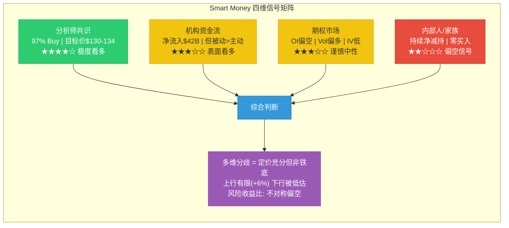
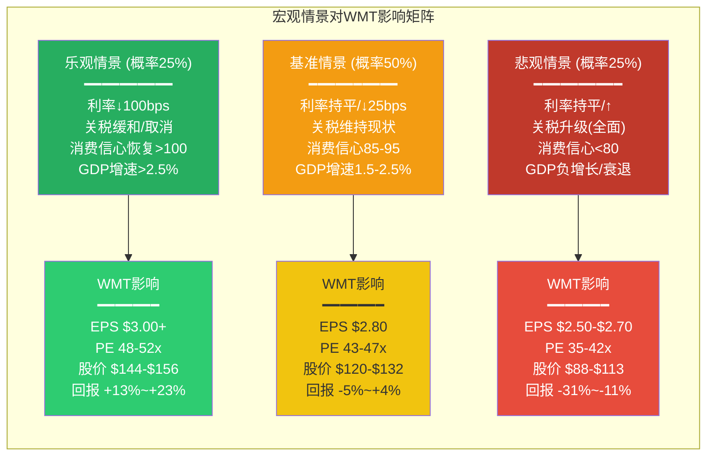

## Ch12: 分析师与聪明钱 -- 一致看多的危险共识

> **核心矛盾检验**: 分析师65买/2持有/0卖的极端一致性，本身就是WMT"平台估值"叙事被充分定价的证据。聪明钱四维信号呈现微妙分歧：机构净流入vs.内部人持续减持vs.期权市场温和看跌，暗示市场对$1万亿估值的信心并非铁板一块。

### 12.1 分析师覆盖全景：史诗级共识的解剖

截至2026年2月，WMT被56位华尔街分析师覆盖，这一覆盖深度在全球消费品板块中仅次于AMZN。覆盖密度本身反映了WMT作为"消费晴雨表"的宏观指标地位 -- 几乎每一家主流投行都必须对其发表观点。

**评级分布 (2026年2月)**:

| 评级 | 分析师数量 | 占比 |
|------|-----------|------|
| Strong Buy / Buy | 65 | 97.0% |
| Hold | 2 | 3.0% |
| Sell | 0 | 0% |

来源: MarketBeat, TipRanks综合数据

这一评级分布呈现出教科书级的**共识拥挤(Consensus Crowding)**特征。97%的买入率在大盘股中极为罕见 -- 对比来看，AMZN的买入率约为93%，COST约为85%，MSFT约为90%。零卖出评级意味着**市场几乎不存在结构性空头论点**，这在估值已处于历史高位(PE 46x)的背景下，本身构成一个重要的风险信号。

**这一共识为什么危险?** 当几乎所有分析师都看多时，边际买家已经极度稀缺。任何低于预期的业绩或战略失误，都可能触发"crowded trade unwind" -- 因为没有空头回补的力量来缓冲下行。

### 12.2 目标价区间：有限的上行空间

**目标价分布 (基于29位近3个月发布目标价的分析师)**:

| 指标 | 价格 | 隐含回报 |
|------|------|---------|
| 最高目标价 | $150 | +18.3% |
| 中位目标价 | $130 | +2.6% |
| 平均目标价 | $134.12 | +5.8% |
| 最低目标价 | $62 | -51.1% |
| 当前股价 | $126.75 | -- |

来源: TipRanks, StockAnalysis, MarketBeat

**关键观察**: 中位目标价$130仅隐含+2.6%的上行空间，这对于一只PE 46x的股票来说，意味着分析师群体实际上认为WMT已经**接近合理估值**。即便是平均目标价$134也仅提供不到6%的回报，远低于标普500的历史年化回报率(~10%)。

**各主要投行目标价**:

| 投行 | 目标价 | 评级 | 要点 |
|------|--------|------|------|
| Rothschild & Co Redburn | $150 | Buy | 最看多，强调平台化转型溢价 |
| KeyBanc | $145 | Overweight | 电商+广告飞轮价值重估 |
| BTIG | $140 | Buy | 会员+Marketplace增长 |
| Goldman Sachs | ~$130 | Buy | 稳健增长，合理估值 |
| HSBC | 下调至Hold | Hold | **唯一近期下调**，认为FY2027指引偏弱 |

来源: Benzinga, GuruFocus, 各投行研报

**HSBC的下调值得深思**: 在97%买入共识中，HSBC是唯一一家近期将WMT从Buy下调至Hold的投行。其核心论点是FY2027指引(EPS $2.75-$2.85)低于市场此前预期的$2.94，暗示管理层对短期前景持谨慎态度。这一孤独的看空声音，在群体性乐观中反而可能更值得重视。

### 12.3 分析师预估拆解：增长预期的隐含假设

**EPS共识预估路径**:

| 财年 | EPS共识 | YoY增速 | 分析师数量 | 隐含PE(按$126.75) |
|------|---------|---------|-----------|-------------------|
| FY2026 (实际) | $2.73 | +13.3% | -- | 46.4x |
| FY2027 (指引) | $2.75-$2.85 | +0.7%~+4.4% | -- | 44.5x-46.1x |
| FY2028 (估计) | $3.29 (avg) | +15.4%~+19.6% | 22 | 38.5x |
| FY2029 (估计) | $3.71 (avg) | +12.8% | 8 | 34.2x |
| FY2030 (估计) | $3.74 (avg) | +0.8% | 3 | 33.9x |
| FY2031 (估计) | $4.05 (avg) | +8.3% | 4 | 31.3x |

来源: FMP Estimates API

**收入增速预估**:

| 财年 | 收入预估(avg) | YoY增速 |
|------|-------------|---------|
| FY2026 (实际) | $713.2B | +5.0% |
| FY2027 (指引) | $738-$745B | +3.5%~+4.5% |
| FY2028 | $783.9B | +5.5% |
| FY2029 | $822.3B | +4.9% |
| FY2030 | $850.1B | +3.4% |
| FY2031 | $886.5B | +4.3% |

来源: FMP Estimates API

**隐含假设解读**: 分析师群体在EPS路径上呈现一个有趣的"V型"模式 -- FY2027几乎零增长(受关税+费用时点影响)，随后FY2028-FY2029加速至15-19%增长。这个V型意味着市场在赌:

1. **FY2027是一次性低谷**: 关税冲击+CEO交接+费用前置，而非结构性放缓
2. **FY2028开始广告/会员收入加速变现**: 高毛利业务占比提升推动利润率扩张
3. **到FY2031 EPS达到$4+**: 这需要营业利润率从4.18%提升至约4.8-5.0%

**这支持"零售商"还是"平台"估值?** 收入端3.5-5.5%的增速完全是零售商水平，但利润端15-19%的增长只有在利润率提升("平台化")假设下才能实现。分析师预估实际上**暗含了从零售商到平台的转型已在进行中**。

### 12.4 预估修正趋势：方向在转变

WMT的EPS预估修正在2024-2025年经历了一轮持续的上修周期，但进入2026年初，趋势出现了微妙变化:

- **2024年Q2-2025年Q3**: 持续上修周期，每季度财报beat推动预估上调
- **2025年Q4 (FY2026 Q3)**: 上修趋势开始减速
- **2026年2月 (FY2026 Q4后)**: FY2027指引低于预期，触发一轮小幅**下修**

FY2027 EPS共识从$2.94下修至$2.80(指引中值)，降幅约4.8%。这是近两年来首次出现有意义的下修信号。

**修正趋势对估值的含义**: 在PE 46x的水平上，预估的方向比绝对水平更重要。上修周期支撑高PE，而一旦进入下修周期，多重压缩的压力会迅速放大。FY2027指引引发的下修虽然幅度不大，但方向性逆转值得警惕。

### 12.5 机构持仓分析：$42B净流入的深层结构

**持仓概览**:

| 指标 | 数值 |
|------|------|
| 机构持股比例 | 26.76% (沃顿家族~45%，浮动筹码有限) |
| 持仓机构总数 | 3,973家 |
| 近12个月机构净流入 | $42.08B |
| 近季度净买入机构数 | ~1,900家 |
| 近季度净卖出机构数 | ~1,850家 |

来源: MarketBeat, HedgeFollow

**前10大机构股东**:

| 排名 | 机构 | 持股(百万股) | 占比 | 性质 |
|------|------|------------|------|------|
| 1 | Vanguard Group | 439.96M | 5.52% | 指数/被动 |
| 2 | BlackRock | 349.56M | 4.38% | 指数/被动 |
| 3 | JPMorgan Chase | 115.43M | 1.45% | 混合 |
| 4 | State Street Corp | ~90M | ~1.1% | 指数/被动 |
| 5 | Geode Capital Mgmt | +6.5M新增 | ~1.0% | 量化/指数 |
| 6-10 | 各主动基金 | -- | <1%各 | 混合 |

来源: MarketBeat, WallStreetZen, Yahoo Finance

**前三大持仓者(Vanguard+BlackRock+JPMorgan)合计占比约11.4%，但它们都是指数型/被动型持仓者**。这一结构意味着:
- WMT的边际价格发现主要由**主动型投资者**驱动
- 被动资金流入(因WMT权重提升)提供了持续的买入力量
- 但这种被动买入与基本面无关，一旦指数权重调整，卖出也与基本面无关

**Q4 2025季度大额变动(异常信号)**:

| 方向 | 机构 | 变动(股) | 变动金额 | 变动幅度 |
|------|------|---------|---------|---------|
| **大买** | Millennium Management | +37.1M | +$4.13B | +1001% |
| **大买** | Jane Street Group | +8.0M | +$895M | +286% |
| **大买** | Qube Research & Tech | +7.6M | +$846M | +223% |
| **大买** | Geode Capital | +6.5M | +$726M | +6.8% |
| **大卖** | UBS AM | -87.3M | -$9.73B | -76.9% |
| **大卖** | T. Rowe Price | -10.9M | -$1.22B | -30.1% |
| **大卖** | Amundi | -7.6M | -$842M | -32.2% |

来源: HedgeFollow, MarketBeat

**这一数据揭示了极为重要的结构性分歧**:

1. **Millennium (+$4.1B)和Jane Street (+$895M)** 是量化/做市型基金，它们的大幅买入更可能是**指数套利/期权做市/多空策略**的一部分，而非基于基本面的看多判断
2. **UBS AM (-$9.7B)** 的大幅减仓是季度最大卖单，相当于WMT市值的约1%。虽然可能涉及基金重组或客户赎回，但规模之大值得注意
3. **T. Rowe Price (-$1.2B)** 是纯主动型价值/成长基金，其减持更可能反映**对估值水平的不认同**

**净结论**: 表面上看净流入$42B很壮观，但深层结构显示 -- 被动/量化资金在买，而部分有判断力的主动管理人在卖。

### 12.6 沃顿家族动向：万亿市值下的家族减持

沃顿家族及其相关信托基金是WMT最大的单一持仓方，合计持有约45%的流通股。家族的买卖行为是WMT最重要的内部人信号。

**近8个季度内部人交易汇总 (2024 Q1 - 2026 Q1)**:

| 季度 | 买入交易数 | 卖出交易数 | 总处置量(股) | 买/卖比 |
|------|-----------|-----------|------------|---------|
| 2024 Q1 | 28 | 53 | 40.3M | 0.31 |
| 2024 Q2 | 18 | 49 | 56.8M | 0.27 |
| 2024 Q3 | 14 | 54 | 92.1M | 0.16 |
| 2024 Q4 | 10 | 20 | 4,821.8M* | 0.31 |
| 2025 Q1 | 33 | 30 | 16.3M | 0.53 |
| 2025 Q2 | 22 | 36 | 29.9M | 0.47 |
| 2025 Q3 | 12 | 29 | 17.4M | 0.28 |
| 2025 Q4 | 11 | 33 | 9.7M | 0.22 |
| 2026 Q1 (截至2月) | 8 | 12 | 1.1M | 0.21 |

来源: FMP Insider Trading API

*注: 2024 Q4数据含大规模信托分配/重组交易，属于非经常性项目

**关键发现**:

1. **持续的净卖出**: 过去8个季度，每个季度卖出交易数都超过买入。买/卖比从未超过0.53，且呈下降趋势(2025 Q1的0.53 → 2026 Q1的0.21)
2. **零公开市场买入**: 整个数据期间，totalPurchases(公开市场买入)几乎为零。所有"acquired"交易都是期权行权或信托分配，不是主动买入
3. **大额减持明细**: Walton Family Holdings Trust在2025年多次大额减持 -- 2025年5月减持480万股($4.68亿)，2025年11月减持414万股($4.39亿)，以及多笔规模稍小的分配交易

**$7-10B年化减持规模的验证**: 按照2024-2025年的总处置量和当时的股价估算，沃顿家族及相关内部人的年化减持规模确实在$7-10B量级。这一规模约占家族持仓总值(~$450B)的1.5-2.2%。

**如何解读家族减持?**

支持"良性减持"的论据:
- 家族财富高度集中于WMT单只股票(~45%)，分散化是合理的财务规划
- 沃顿家族通过慈善基金会(Rob Walton Foundation, Alumbra Innovations等)进行的分配有税务优化动机
- Alice Walton的Crystal Bridges博物馆和教育慈善需要持续资金
- Sam Walton时代就有"家族卖出，公司回购"的传统

支持"价值信号"的论据:
- 减持节奏在股价上涨过程中**加速**而非减速(2024 Q3处置量92M股，正值股价创历史新高)
- **零公开市场买入** -- 如果家族真的认为WMT被低估，在$1万亿市值下一股不买是一个信号
- 新的$30B回购计划可以被解读为 -- 用公司资金承接家族减持，将减持成本社会化到全体股东

**平衡判断**: 以沃顿家族的持仓规模和财富集中度，持续减持是**理性的风险管理**。但加速减持+零买入的组合，至少说明家族认为WMT在当前价格**没有被低估**。这与46x PE的市场定价并不矛盾 -- 市场定价的是未来，家族则在兑现当下。

### 12.7 期权市场信号：温和的分歧

| 指标 | 数值 | 含义 |
|------|------|------|
| OI Put/Call Ratio | 1.16 | 略偏看跌(>1) |
| Volume Put/Call Ratio | 0.90 | 略偏看多(<1) |
| 30日隐含波动率(IV) | 19.1% | 历史低位，市场预期平稳 |
| IV排名(52周) | ~30% | 低于中位数 |

来源: Barchart, AlphaQuery, Fintel

**期权市场解读**:

1. **OI Put/Call 1.16 vs Volume Put/Call 0.90的分歧**: OI(未平仓合约)偏看跌，但成交量偏看多，说明**持有保护性Put的投资者不急于关闭头寸(保留下行保护)，同时短线交易者在做多Call**。这是典型的"谨慎看多"模式
2. **IV 19.1%处于低位**: 对于PE 46x的股票，19%的隐含波动率意味着市场预期**未来30天的日均波动仅约1.2%**。这反映了WMT作为"安全资产"的定位，但也意味着一旦出现意外事件(如关税升级、消费疲软)，期权市场的re-pricing会非常剧烈
3. **缺乏大宗方向性交易**: 未观察到机构级别的大规模方向性期权布局。WMT的期权交易更多是**对冲驱动**而非投机驱动

### 12.8 Smart Money四维综合判断

**四维汇总**:

| 维度 | 方向 | 强度 | 可靠性 |
|------|------|------|--------|
| 分析师 | 看多 | 极强 | 中(拥挤信号反向指标) |
| 机构资金 | 看多(表面) | 中等 | 低(被动驱动+量化噪音) |
| 期权市场 | 中性偏空 | 弱 | 中(OI数据滞后) |
| 内部人 | 看空 | 中等 | 高(家族有最多信息优势) |

**核心结论**: 四个维度呈现2多1中1空的格局，但权重不对等。分析师的极度看多被其共识拥挤特性削弱了信息价值；机构资金流的"看多"主要由被动指数资金和量化策略驱动，不代表主动判断；而**拥有最多信息优势的内部人(沃顿家族)在持续减持且零买入** -- 这是四个维度中信息含量最高的信号。

**对核心矛盾的回答**: Smart Money的分歧模式更接近"零售商估值已被平台叙事过度推升"。如果WMT真的正在完成从零售商到平台的质变，我们应该看到的是 -- 有远见的对冲基金大幅建仓(而非量化做市商)、内部人至少停止减持、期权市场出现显著的看多偏斜。这三个条件目前一个都没有满足。

---

## Ch13: 预测市场与宏观环境 -- 万亿估值的外部压力测试

> **核心矛盾检验**: WMT的$1万亿估值不仅取决于公司自身的平台化转型能力，也高度依赖宏观环境。PE 46x在低利率+消费扩张环境中或许合理，但在利率高企+关税冲击+消费分化的当前环境中，这一估值对宏观变量极为敏感。

### 13.1 预测市场扫描：概率化的宏观图景

**美国衰退概率 (Polymarket数据)**:

| 预测市场 | 概率 | 交易量 | 状态 |
|---------|------|--------|------|
| "US recession by end of 2026?" | 22.5% Yes | $278K | 活跃 |
| "US recession in 2025?" | 0% Yes (已结算No) | $11.7M | 已关闭 |
| "US GDP Q1 2025 between 0% and -1%?" | 100% Yes (已结算) | $74K | 已关闭 |

来源: Polymarket Events API

**解读**: Polymarket为2026年底前美国衰退定价22.5%的概率。这一概率虽然不高，但也不可忽视 -- 约每4-5次中会发生一次。考虑到Q1 2025 GDP已经出现了0%到-1%的小幅负增长(已结算)，经济的脆弱性已经在数据中有所体现。

**WMT相关预测市场**: 搜索"Walmart"关键词在Polymarket上主要找到已完成的事件(如2024年的Vizio收购，已以"Yes"结算)和AMC等不相关公司的earnings bingo市场。**目前没有活跃的WMT特定预测市场**，这本身是一个信号 -- WMT被视为"无悬念"的稳定资产，缺乏足够的不确定性来吸引预测市场的关注。

**关税相关预测市场**: 由于API临时不可用，未能获取最新的关税相关预测市场数据。但基于此前搜索的信息，2026年的关税环境仍处于高度不确定中。

### 13.2 宏观消费环境：K型复苏下的WMT

#### 13.2.1 消费者信心：低位企稳但远未恢复

**Conference Board消费者信心指数 (2026年2月)**:

| 指标 | 数值 | 环比 | vs. 2024年11月峰值 |
|------|------|------|-------------------|
| 总指数 | 91.2 | +2.2 | -21.6 (-19.2%) |
| 现状指数 | 120.0 | -1.8 | -- |
| 预期指数 | 72.0 | +4.8 | -- |

来源: Conference Board (2026年2月24日发布)

**关键信号**:

1. **信心从2024年11月的112.8跌至91.2**: 跌幅近20%，反映了关税不确定性、政策变动和通胀预期对消费者心理的冲击
2. **现状指数(120)下降 vs 预期指数(72)回升**: 消费者认为当前状况正在恶化，但对未来略有改善的期望。预期指数72仍处于历史低位区间(低于80通常预示衰退风险)
3. **大件消费意愿微升**: 计划未来6个月购买大件商品的消费者比例小幅上升，暗示被压抑的需求可能在酝酿

**对WMT的影响路径**: WMT的核心客群是中低收入家庭(household income < $75K)。这一群体对消费信心下降最为敏感，但同时也是最倾向于"trade down"(从高端渠道转向WMT)的群体。历史数据显示，消费信心指数在80-100区间时，WMT的同店销售通常**跑赢**行业平均，因为消费降级效应超过了总消费萎缩效应。

#### 13.2.2 消费者信贷与债务

美国消费者信贷状况对WMT客群至关重要:

- 美国家庭债务总额在2025年突破$18万亿历史新高
- 信用卡拖欠率持续攀升至2012年以来最高水平
- 但就业市场仍然稳健，失业率维持在约4.0-4.2%
- 工资增长约3.5-4%，略高于通胀但实际购买力增长有限

**"K型"消费分化**: WMT管理层在FY2026各季度财报电话会上反复提到"K-shaped recovery"的概念:
- **上半部**: 高收入群体消费健康，这部分人群正在"trade down"到WMT(WMT披露中高收入家庭占据了同店销售增长的大部分)
- **下半部**: 低收入群体面临信贷收紧和实际收入停滞的双重压力，消费更加谨慎

这种K型结构对WMT是**短期利好但长期隐忧**: 高收入客户的trade down提供了额外增长，但如果经济进一步恶化导致这些客户也收缩支出，WMT的增长引擎将同时失去两端。

### 13.3 食品通胀趋势：60%收入基座的稳定性

杂货(Grocery)占WMT美国销售额的约60%，食品通胀趋势直接决定了WMT的收入增长底线。

**2026年USDA食品价格展望**:

| 类别 | 2026年预测涨幅 | vs. 20年均值 | 对WMT影响 |
|------|--------------|-------------|----------|
| 食品-家用(Grocery) | +1.7% | 低于均值(2.6%) | 收入增长底线温和 |
| 食品-外出(Restaurant) | +4.6% | 高于均值(3.5%) | 利好trade-down |
| 鸡蛋 | -22.2% | 极端回落 | 小幅负贡献 |
| 牛肉 | +9.4% | 显著高于均值 | 高端品类拉动 |
| 蔬菜 | +2.0% | 接近均值 | 中性 |
| 水果 | +0.2% | 远低于均值 | 几乎无贡献 |

来源: USDA Economic Research Service, Food Navigator

**核心判断**: 杂货通胀1.7%意味着WMT在食品品类上的"自然增长"(即仅靠涨价带来的收入增长)约为1.7%。要实现3.5-4.5%的总收入增速目标，WMT需要从**交易量增长(约1-1.5%)+非食品品类增长+电商渗透率提升+新业务(广告/会员)**中合计贡献约2-3个百分点的增长。这是可实现的，但利润率提升的空间主要来自后两者(电商+新业务)而非食品本身。

**Restaurant vs Grocery价差扩大是结构性利好**: 餐饮通胀4.6% vs 杂货通胀1.7%，价差约3个百分点。这意味着"在家做饭vs外出就餐"的经济性差异在扩大，对WMT的杂货业务构成持续的客流支撑。

### 13.4 关税政策：最大的外部变量

#### 13.4.1 关税时间线与影响路径

2025-2026年的关税政策经历了剧烈的变化:

- **2025年Q1**: 对华关税从25%提升至更高水平，WMT表示"所有关税都产生成本压力，但对华关税影响最大"
- **2025年Q2**: CEO McMillon称关税成本"每周都在增加"，预计趋势延续至Q3/Q4。但同时表示对消费支出的影响"somewhat muted"
- **2025年Q3**: CFO Rainey承认"压力是真实的"，但团队通过供应链调整吸收了部分成本。新CEO Furner提到食品品类关税压力有所缓解
- **2025年Q4/2026年初**: FY2026全年营业利润率增长5.4%，但包含了300bps的claims费用逆风。FY2027 Q1指引中明确提到关税的同比影响(去年Q2才开始的关税基数)

**对WMT的量化影响估算**:

WMT约33%的商品从中国采购或涉及中国供应链。以$713B收入 x 65% COGS x 33%中国相关 x 10-15%平均关税增量计算:
- **关税增量成本**: 约$15-23B
- **占营业利润比**: 约50-75% ($29.8B FY2026营业利润)

当然，WMT不会完全吸收这些成本 -- 它通过以下方式分摊:
1. **转嫁给消费者**: 部分商品涨价(但EDLP定位限制了涨价幅度)
2. **供应商承担**: 利用采购规模向供应商施压
3. **供应链转移**: 将采购从中国转向印度、越南等地(但这需要时间和前期投入)
4. **自身吸收**: 压缩利润率

**管理层的回应策略**: WMT在历次财报电话会上强调"我们有能力比竞争对手更好地应对关税"。这是基于其采购规模($300B+年采购额)的议价能力优势。但"比竞争对手好"不等于"不受影响" -- 关税环境对WMT的利润率扩张目标构成了显著阻力。

#### 13.4.2 关税对"平台估值"叙事的双面影响

关税对WMT估值叙事的影响是非对称的:
- **利好平台叙事**: 如果关税导致小型零售商出局或利润率被压缩，WMT作为"最后站立的巨人"可以获取市场份额。这加速了零售行业的集中化，有利于WMT的广告+Marketplace平台
- **利空平台叙事**: 如果关税吃掉了利润率扩张的空间，那么"从4.18%利润率向5%+迈进"的路径将被拉长甚至逆转。而平台估值的核心支撑就是利润率提升的预期

### 13.5 利率环境与估值敏感性

#### 13.5.1 当前利率格局

| 指标 | 当前水平 | 趋势 |
|------|---------|------|
| 联邦基金利率 | 3.50-3.75% | 2026年1月维持不变 |
| Fed点阵图(2025年12月) | 年底3.1-3.4% | 仅预期1次降息 |
| J.P. Morgan预测 | 2026年零降息 | 通胀韧性 |
| Goldman Sachs预测 | 年中可能降息 | 9月+12月各25bps |
| 最新PCE数据 | 通胀韧性超预期 | 降息预期进一步推迟 |

来源: Fed, iShares, Goldman Sachs, J.P. Morgan

**2026年2月最新动态**: PCE数据显示通胀顽固性超预期，市场对2026年降息的预期急剧收缩。这对WMT的46x PE构成直接压力。

#### 13.5.2 利率对WMT估值的传导机制

**WMT PE vs 10年期国债收益率的历史关系**:

消费品/必需品板块的PE与利率呈显著负相关。当利率从2022年的低点攀升至2023-2024年的高点时，消费品板块的PE中枢下移了约20-30%。但WMT是例外 -- 其PE从2022年的约25x上升到2026年的46x，逆趋势扩张。

这意味着两种可能:
1. WMT的PE扩张完全由基本面改善(电商+广告+会员)驱动，与利率无关 -- 如果如此，利率下行不会带来额外PE扩张
2. WMT的PE扩张部分是"资金避风港"效应(在不确定环境中涌入确定性资产) -- 如果如此，一旦不确定性消退，这部分溢价将回吐

**利率敏感性模拟**:

| 情景 | 利率变动 | PE影响 | 股价影响 |
|------|---------|--------|---------|
| 降息100bps | 3.5% → 2.5% | PE可能扩张至50x | +$10 (~+8%) |
| 维持不变 | 3.5% | PE维持45-47x | 0 (取决于EPS) |
| 加息50bps | 3.5% → 4.0% | PE可能压缩至40x | -$16 (~-13%) |

### 13.6 宏观情景映射：三种未来

#### 情景一：乐观宏观 (概率25%)

**前提**: Fed降息100bps(至2.5-2.75%)、中美关税谈判取得突破性进展、消费信心恢复至100+

**对WMT的影响**:
- 利率下行推动消费品PE扩张，WMT PE可能突破50x
- 关税成本大幅下降释放利润率空间，利润率可能加速从4.18%向4.5%+迈进
- 消费复苏同时提振交易量和客单价
- **但**: 在这种环境中，高弹性的消费可选股(如NKE, SBUX)可能表现更好，WMT的"防御溢价"可能被削弱
- **EPS估计**: $3.00+ | **PE区间**: 48-52x | **目标股价**: $144-$156

#### 情景二：基准宏观 (概率50%)

**前提**: Fed维持利率或仅降25bps、关税维持当前水平(中国商品维持高税率)、消费信心在85-95区间波动

**对WMT的影响**:
- 符合管理层FY2027指引(收入+3.5-4.5%，营业利润+6-8%)
- 利润率温和提升(从4.18%到约4.3-4.4%)，主要由广告和会员驱动
- 消费分化(K型)持续，WMT继续受益于trade-down
- **PE合理区间**: 43-47x(考虑到增长放缓，PE中枢可能小幅下移)
- **EPS估计**: $2.80(指引中值) | **PE区间**: 43-47x | **目标股价**: $120-$132

#### 情景三：悲观宏观 (概率25%)

**前提**: 利率维持高位或加息(因通胀韧性)、关税全面升级(如对所有进口商品加征)、消费信心跌破80(衰退水平)

**对WMT的影响**:
- **EDLP反脆弱性测试**: 这是WMT最有利的竞争环境。在衰退中，消费者大规模从高端渠道(Target, Whole Foods)转向WMT，历史上WMT在2008-2009年衰退中同店销售逆势增长
- **但**: 利润率压力加剧 -- 关税+EDLP承诺限制涨价 → 毛利率被挤压
- **PE压缩是最大风险**: 在衰退+高利率环境中，即便WMT基本面相对稳健，46x PE也难以维持。PE可能压缩至35-42x(接近其2018-2022年的估值区间)
- **EPS估计**: $2.50-$2.70(收入稳但利润率受压) | **PE区间**: 35-42x | **目标股价**: $88-$113

**概率加权预期值**: $126.75 x 25% + $126 x 50% + $100.5 x 25% = $119.8

这个概率加权的结果略低于当前股价$126.75，暗示**当前定价已经偏向乐观端**。

### 13.7 宏观环境对核心矛盾的回答

回到核心问题：宏观环境支持WMT从"零售商"变成"消费科技平台"吗?

**支持平台转型的宏观因素**:
- 零售行业持续整合，规模效应愈发重要，有利于WMT建立平台生态
- 食品通胀温和(+1.7%)给WMT腾出资源投入科技和广告业务
- 消费者行为数字化不可逆，WMT的电商渗透率(24%全球增长)仍有长跑空间
- $30B回购计划保护EPS增长，给平台化转型争取时间

**阻碍平台转型的宏观因素**:
- 利率高企(3.5-3.75%)直接抬高了WMT平台业务所需的技术投资的资本成本
- 关税持续冲击利润率，挤压了"投入平台建设"的利润空间
- 消费信心低迷(91.2)限制了非必需品消费的增长潜力，而平台价值(广告/Marketplace)主要来自非必需品品类
- PCE通胀顽固意味着Fed短期不太可能降息，高利率环境持续

**综合判断**: 当前宏观环境对WMT的零售业务是**中性偏有利的**(trade-down效应+温和食品通胀)，但对其平台化转型估值是**不利的**(高利率+关税+消费疲软)。用一句话概括：**WMT能做好零售商的活(这支撑了$55-65的股价)，但宏观环境并不支持市场赋予它的$1万亿平台溢价**。

PE 46x隐含的乐观假设(利润率快速扩张+新业务高速增长)需要一个相对温和的宏观环境来兑现。而当前的利率/关税/消费环境，至少在2026年内，更可能压制而非加速这一兑现过程。
