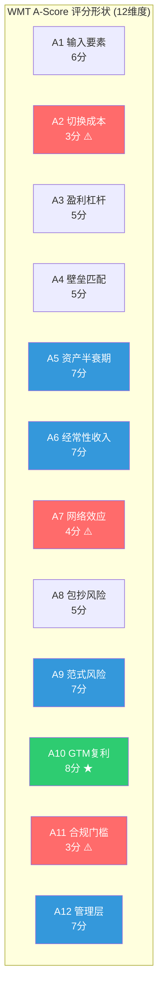
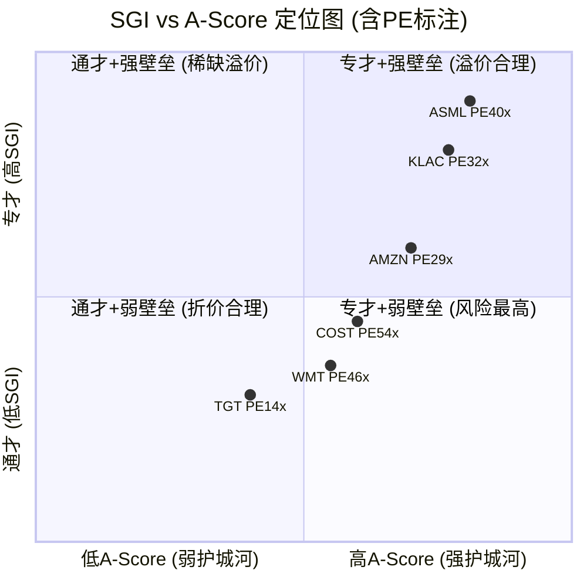
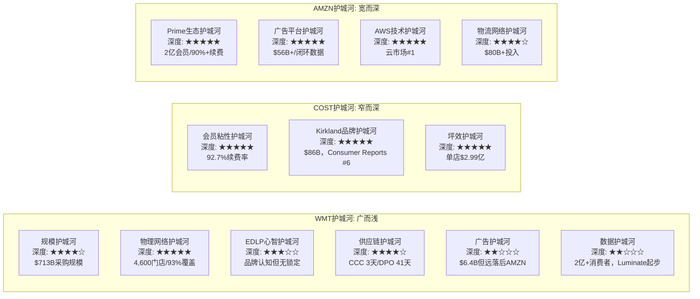
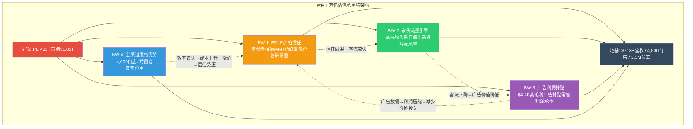
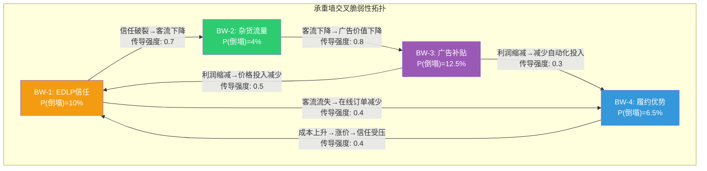
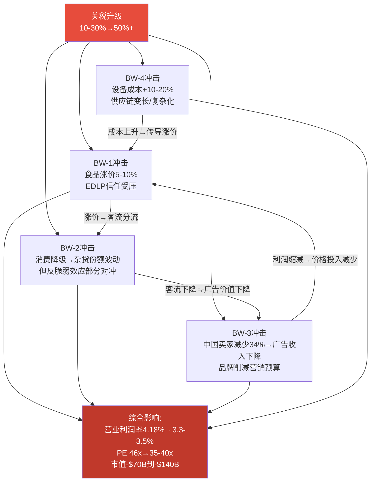

# Phase 3 — AgentG: A-Score护城河量化 + EDLP承重墙测试

> AgentG | 2026-02-25 | WMT深度研报Phase 3 | Ch14+Ch15
> 核心矛盾回应: WMT市值$1万亿/PE 46x/营业利润率4.18% — A-Score和承重墙测试是否支持"平台估值"还是"零售商估值"?

---

# Chapter 14: A-Score护城河量化 — 万亿零售帝国的壁垒审计

## 14.1 A-Score v2.0框架适用说明

A-Score v2.0是一套结构化护城河评分框架，由12个维度(A1-A12)构成，通过不变层(通用定义)+可替换层(行业锚点)+扩展层(趋势向量/置信度加权/形状分析)三层架构实现跨行业可比性。本章将对WMT进行完整的消费品行业权重下的A-Score评估。

**消费品行业归一化权重**(v2.0预设):

| 维度 | 权重 | 维度 | 权重 |
|------|------|------|------|
| A1 输入要素自主权 | 6% | A7 网络效应/生态 | 6% |
| A2 切换成本/数据重力 | 10% | A8 包抄风险(反向) | 8% |
| A3 边际盈利杠杆 | 8% | A9 范式迁移风险(反向) | 6% |
| A4 壁垒-利润池匹配 | 11% | A10 GTM复利 | 10% |
| A5 核心资产半衰期 | 10% | A11 合规门槛 | 6% |
| A6 经常性收入质量 | 13% | A12 管理层-战略一致性 | 4% |

WMT作为大众综合零售商(SGI 3.6，通才模式)，其护城河结构预期呈"扁平型"——多个维度在中等分数(4-7分)，缺少极高分(9-10分)的单点突破。这与半导体设备行业的ASML(尖峰型，A4/A5双10分)或KLAC(平台型，全线6-9分)形成鲜明对比。

**关键分析假设**: 本章评分以WMT自身业务质量为锚，不因市场给予的46x PE溢价而调整评分方向。A-Score评估的是"护城河的客观深度"，而非"市场愿意为护城河支付多少溢价"。

---

## 14.2 完整12维评分

### A1: 输入要素自主权 — 6/10 [M] 平稳

**通用定义**: 核心投入要素的自主可控程度。公司被上游"卡脖子"的风险有多大?

**消费品适配含义**: 品牌资产、渠道关系、原材料/配方的自有率。

**评分依据**:

WMT的核心输入要素分三层:

| 要素层 | 自主度 | 详情 |
|--------|--------|------|
| **品牌资产** | 高(8/10) | Walmart品牌+Great Value/Equate/Bettergoods等自有品牌矩阵完全自有，86%美国家庭购买过Great Value |
| **商品供应** | 中(5/10) | 对P&G/Unilever等品牌供应商有高度议价力(P&G 15%收入依赖WMT)，但WMT自身也依赖这些品牌吸引客流。DPO 41天反映采购控制力，但60%收入来自杂货——一个高度商品化且难以差异化的品类 |
| **技术/数据** | 中低(4/10) | CTO来自Google(Suresh Kumar)但核心技术(搜索/推荐/广告技术栈)仍落后Amazon 2-3年。Symbotic机器人系统投资$520M，但技术不完全自有 |

**综合评分逻辑**: 品牌资产完全自有(8分)被商品供应的结构性依赖(5分)和技术追赶差距(4分)拉低。WMT不像ASML那样存在"被Zeiss卡脖子"的单点风险，但也不像可口可乐那样拥有不可复制的秘密配方(9-10分)。**6分反映了大众零售商的典型特征:什么都有，但什么都不独占。**

---

### A2: 切换成本/数据重力 — 3/10 [H] 上升

**通用定义**: 客户从本公司产品/服务切换到竞品的全口径迁移代价。

**评分依据**:

消费者切换成本极低是零售行业的结构性特征。一个WMT消费者下周去COST/TGT/AMZN购物，除了改变开车方向以外没有任何迁移成本。这是WMT护城河体系中最薄弱的环节。

| 切换维度 | WMT现状 | 评估 |
|----------|---------|------|
| 经济成本 | 零。无合约、无退出费、无沉没成本 | 1/10 |
| 习惯惯性 | 中等。EDLP培养了"默认去WMT"的习惯，但习惯不等于锁定 | 4/10 |
| 数据依赖 | 低。购物历史/推荐不形成迁移障碍 | 2/10 |
| Walmart+订阅 | 初步锁定。年费$98创造了温和的"沉没成本偏误"，但续费率远低于COST(92.7%)和Prime(90%+) | 4/10 |

**为什么标注"上升"**: Walmart+会员数从FY2023的约2,000万增长至FY2025的约3,500万，同比+19%。双订阅(同时持有Prime+Walmart+)用户占比从12%升至24%——这意味着Walmart+不是在替代Prime，而是成为独立的第二订阅。如果Walmart+渗透率在5年内从30%提升至50%(参照Prime 65%)，切换成本将从3分缓慢上升至4-5分。但当前仍处低位。

**与竞争对手对比**:
- COST: 切换成本约5/10(会员费$65-130创造更强的沉没成本偏误+92.7%续费率=准锁定)
- AMZN: 切换成本约6/10(Prime生态锁定=视频+音乐+阅读+购物+医疗)
- TGT: 切换成本约2/10(Circle 360几乎无锁定力)

**3分的含义**: 在A-Score框架中，3分意味着"存在轻度迁移成本，但客户愿意切换"。对于PE 46x的公司来说，这是一个危险的低分——意味着WMT的客流忠诚度主要来自价格竞争力和便利性(外在因素)，而非结构性锁定(内在因素)。

---

### A3: 边际盈利杠杆 — 5/10 [M] 上升

**通用定义**: 增量收入转化为增量利润的效率。规模经济与经营杠杆的强度。

**评分依据**:

WMT的边际盈利杠杆呈现出"传统零售低杠杆+新兴平台高杠杆"的双轨结构:

| 业务线 | 增量毛利率 | 经营杠杆 | 占收入比 |
|--------|-----------|---------|---------|
| 杂货零售(~60%收入) | ~22-25% | <1.0x(人力密集，变动成本主导) | 60% |
| 一般商品(~27%收入) | ~33-36% | ~1.1x(轻微规模效应) | 27% |
| 广告(~0.9%收入) | ~70-80% | >3.0x(边际成本趋近零) | 0.9% |
| 会员费(~0.4%收入) | ~70%+ | >3.0x | 0.4% |
| 第三方佣金 | ~60-70% | ~2.0x | ~1% |

**综合杠杆计算**:

加权增量毛利率 = 0.60 x 24% + 0.27 x 35% + 0.009 x 75% + 0.004 x 70% + 0.01 x 65% = 14.4% + 9.45% + 0.675% + 0.28% + 0.65% = **~25.5%**

这个数字仅略高于公司报告毛利率24.93%——说明**WMT当前的增量收入结构与存量收入结构高度同质化**，增量杠杆效应有限。这是5分(而非7-8分)的核心原因。

但"上升"趋势向量很重要:如果广告收入从0.9%占比增长到3-5%(2030年假设$17B广告/$870B收入=2.0%)，加权增量毛利率将从25.5%提升至27-28%，经营杠杆开始显现。Phase 2分析显示广告收入中约60%的毛利率改善来自广告高毛利贡献——这是边际杠杆加速的早期信号。

**SGA规模杠杆缺失**: FY2024 SGA/Rev 20.21%→FY2026 20.74%，在$102B营收增量的基础上SGA率不降反升。210万员工(全球)的人力成本以年均4-5%上涨，几乎完全抵消了营收增长带来的固定成本摊薄。**在人力成本这个"反杠杆"被自动化有效替代之前(预计FY2029+)，WMT的边际杠杆将持续受限。**

---

### A4: 壁垒-利润池匹配度 — 5/10 [H] 平稳

**通用定义**: 公司的竞争壁垒是否恰好保护了价值链中ROI最高的环节?

**评分依据**:

这是WMT护城河分析中最关键的维度之一。A4追问的核心问题是:"WMT的壁垒保护的东西有多值钱?"

**美国零售价值链利润池地图**:

| 利润池环节 | 估算规模 | 利润率 | WMT壁垒强度 | 匹配度 |
|-----------|---------|--------|------------|--------|
| **杂货零售** | $1.5T市场 | 2-4% | 强(25-26%份额，#1) | 高壁垒 x 薄利润 = **低匹配** |
| **一般商品零售** | ~$800B | 5-8% | 中(份额分散) | 中壁垒 x 中利润 = **中匹配** |
| **零售媒体广告** | ~$120B(2025) | 40-60% | 中弱(#2，远落后AMZN) | 低壁垒 x **极厚利润** = **低匹配** |
| **电商物流/履约** | ~$200B | 3-5% | 强(4,600门店前置仓) | 高壁垒 x 薄利润 = **低匹配** |
| **消费者数据变现** | ~$50B | 50-70% | 弱(Luminate起步) | 低壁垒 x 厚利润 = **最低匹配** |

**核心发现: WMT的壁垒保护的恰恰是利润池最薄的环节(杂货零售、物流履约)，而利润池最厚的环节(广告、数据)恰恰是壁垒最弱的。**

这是A4仅得5分的根本原因——也是理解WMT 46x PE之所以是"赌注"而非"现实"的关键框架:

- **ASML在A4得10分**，因为它的壁垒(EUV光刻唯一供应)恰好保护了半导体设备行业利润率最高的环节(高端节点=最高ASP+最高利润率)
- **KLAC在A4得9分**，因为过程控制在良率提升中不可替代，且良率差异直接决定fab的利润
- **WMT在A4得5分**，因为它的壁垒(规模+门店网络+EDLP)保护的是一个4%利润率的杂货生意

**为什么不是3-4分?** WMT在A4没有更低分的原因是:杂货流量虽然利润率低，但它是广告/会员等高利润池的**入口和前提**。如果把杂货视为"获客成本"而非"利润中心"，则壁垒的位置逻辑成立——只是变现链条更长、不确定性更高。Ch3的分析已论证:"杂货是护城河>利润率陷阱"，但这个论证的前提是广告/会员必须持续高速增长。

---

### A5: 核心资产半衰期/可复制性 — 7/10 [M] 平稳

**通用定义**: 核心竞争资产的领先优势能维持多久? 竞争对手追赶需要多少时间和资本?

**消费品适配**: 品牌资产半衰期、渠道网络可复制性。

**评分依据**:

| 核心资产 | 领先年限 | 复制成本 | 可复制性 |
|---------|---------|---------|---------|
| 4,600门店物理网络 | >20年 | >$200B | 实质不可复制(Amazon用$1,000B+投入15年仍无法匹配) |
| EDLP品牌心智 | >30年 | 不可量化 | 极难复制(需数十年消费者信任积累) |
| 供应链/采购规模 | >15年 | >$50B | 极难复制(需$700B+营收规模支撑) |
| 广告技术平台 | 2-3年 | $5-10B | **可追赶**(技术栈落后Amazon 2-3年) |
| 消费者数据资产 | 5-8年 | 不可量化 | 中等(2亿+消费者数据，但数据半衰期3-5年) |

**7分的核心逻辑**: WMT的物理基础设施(4,600门店+覆盖93%人口)是全球零售业中最难复制的单一资产。Amazon在实体杂货上的多次失败(Amazon Go关闭、Amazon Fresh关闭)是最有力的反证——即使拥有全球最充裕的资本和最强的技术能力，Amazon也无法在合理时间内复制WMT的物理网络。

**为什么不是8-9分?** 因为WMT的"新身份"资产(广告技术、数据平台)的半衰期很短(2-5年)，且正在被竞争对手快速追赶。如果WMT的估值纯粹基于传统零售资产，A5应给8分;但46x PE隐含的"平台估值"要求数字资产也具备持久性——而数字资产恰恰是WMT最易被追赶的部分。

---

### A6: 经常性收入质量 — 7/10 [H] 上升

**通用定义**: 持续"收租"的能力。收入流的稳定性和可预测性如何?

**消费品适配**: 复购率、订阅占比、品类复购频率。

**评分依据**:

WMT的经常性收入质量远好于大多数零售商，原因在于杂货(~60%收入)的天然高复购属性:

| 收入类型 | 占比 | 经常性特征 | 质量评级 |
|---------|------|-----------|---------|
| 杂货(每周复购) | ~60% | 极高频(每周2-3次)，极高确定性(必需品) | ★★★★★ |
| 一般商品(月度复购) | ~27% | 中频(每月1-2次)，中等确定性(可选消费) | ★★★☆☆ |
| 会员费(年度订阅) | ~0.4% | 合约性收入，可预测度最高 | ★★★★★ |
| 广告(年度预算) | ~0.9% | 准经常性(品牌广告主年度预算，非一次性) | ★★★★☆ |

**经常性收入占比估算**: 杂货+会员的强经常性收入占比约61%，加上广告的准经常性约0.9%，合计约62%。按A-Score锚点，>60%经常性收入对应7-8分区间。

**为什么不是8分?** 因为杂货的"经常性"本质上是品类经常性(消费者必须每周买杂货)而非品牌经常性(消费者不必每周去WMT买杂货)。COST的92.7%续费率创造了更纯粹的经常性收入——消费者交了会员费就有"必须来这里购物"的心理锁定。WMT的杂货高频复购缺少这层锁定机制。

**"上升"趋势**: Walmart+会员数增长+19% CAGR，广告收入增长+46%——这两项高质量经常性收入的增速远超总体收入增速(+4.7%)，收入质量结构正在改善。如果5年后会员+广告收入占比从1.3%提升至4-5%，A6可升至8分。

---

### A7: 网络效应/生态厚度 — 4/10 [M] 上升

**通用定义**: 用户/参与者越多，产品/服务越好用的正反馈循环。

**评分依据**:

WMT的网络效应是A-Score中最具争议的维度。传统零售几乎不存在网络效应(消费者A的购物体验不因消费者B的存在而改善)，但WMT正在构建的Marketplace+广告平台开始展现初步的跨边网络效应。

| 网络效应类型 | 强度 | 证据 |
|-------------|------|------|
| **Marketplace跨边效应** | 初步(3/10) | 20万卖家→4.2亿SKU→更多买家→更多卖家。但vs Amazon 200万+卖家，飞轮尚在早期 |
| **广告数据飞轮** | 中弱(4/10) | 更多购物数据→更精准广告→更多广告主→更多投入→更好效果。但广告收入仅$6.4B，数据量不足以形成自我强化 |
| **门店密度效应** | 中(5/10) | 4,600门店密度→更低配送成本→更有竞争力的价格→更多客流→更大采购规模。这是WMT最接近"网络效应"的维度，但严格来说是规模经济而非网络效应 |
| **Walmart+生态锁定** | 弱(2/10) | 与Prime(视频+音乐+阅读+购物+医疗)相比，Walmart+权益薄弱(主要是免配送+会员价)，跨服务锁定不足 |

**4分综合评估**: WMT在网络效应维度得4分，处于"轻微规模效应但用户间不直接互益"的锚点区间。Marketplace的跨边效应是"上升"趋势的核心原因——如果卖家数在3年内从22万增长至50万+，跨边飞轮可能从"初步"升级为"可感知"，推动A7至5-6分。

**关键对比**: Amazon的A7应在8-9分(Prime生态+Marketplace飞轮+AWS开发者生态)，COST约5分(会员制创造的社群认同+有限跨边效应)。WMT与Amazon在网络效应维度的差距(4分 vs 8-9分)，恰恰是PE差距的最大解释变量之一——但考虑到Amazon PE仅29x而WMT PE 46x，这个差距令WMT的估值显得更难以理解。

---

### A8: 跨界吞噬/平台包抄风险 — 5/10 [H] 下降

**通用定义**: 被竞争对手通过bundling、平台扩张、相邻品类入侵而蚕食的风险。分数越高=风险越低。

**评分依据**:

| 包抄威胁来源 | 威胁等级 | 机制 |
|-------------|---------|------|
| **Amazon杂货攻势** | 高 | 关闭Fresh/Go后聚焦线上杂货，当日达覆盖2,300城市，生鲜销量40倍增长 |
| **COST品类扩张** | 中 | 仓储模式向线上渗透，电商增速加快，但不与WMT直接争夺同一客群 |
| **Aldi/Lidl折扣入侵** | 中 | 欧洲折扣零售商持续扩张美国门店，以更极端的低价挑战EDLP |
| **Instacart平台化** | 低-中 | 聚合模式蚕食线上杂货份额(7%)，但缺乏自有库存/门店 |
| **AI Agent Commerce** | 远期高 | 如果消费者购物决策交给AI Agent，品牌认知和EDLP定位可能被绕过 |

**5分的含义**: WMT面临多方向的竞争包抄，但没有任何单一竞争者能在短期内对其核心业务构成致命威胁。Amazon在线上杂货增长迅猛但实体杂货失败;COST模式差异化足够大不形成直接替代;Aldi/Lidl体量太小。**真正的风险在远期——AI Agent Commerce如果实现，"EDLP品牌认知"这一护城河可能在5-10年内被技术绕过。**

**"下降"趋势向量的原因**: Amazon线上杂货生鲜销量40倍增长和30分钟配送试点，正在从WMT最坚固的杂货堡垒发起新一轮进攻。虽然WMT仍以31.6%线上杂货份额领先Amazon的22.6%，但差距在缩小(2022年差距约8pp→2025年约9pp→2026E可能收窄)。

---

### A9: 范式迁移风险 — 7/10 [M] 平稳

**通用定义**: 底层商业/技术/消费范式发生根本性变化，导致现有护城河失效的风险。分数越高=风险越低。

**评分依据**:

| 范式变量 | 对WMT的影响 | WMT适应能力 |
|---------|------------|------------|
| **消费从线下→线上** | 已在发生(18%电商渗透) | 强适应:电商+27%增长，门店=前置仓 |
| **AI Agent购物** | 远期风险(5-10年) | 未知:EDLP可能被AI比价绕过 |
| **社区团购/直播电商** | 低风险(中国模式难复制到美国) | 不适用 |
| **经济大衰退→消费降级** | 反而有利(2008-09验证:WMT在衰退中反脆弱) | 极强适应 |
| **杂货消费模式变化** | 低风险(人类需要吃饭这个范式不会变) | 天然免疫 |

**7分的逻辑**: WMT的核心业务(食品杂货)建立在"人类需要每周购买食品"这个几乎不可变的范式之上。无论技术如何演进、消费习惯如何变化，食品消费的基本需求不会消失。这使WMT在范式风险维度上获得了天然的高分——与KLAC"无论如何制造芯片都需要检测"(9分)具有类似的"范式不可知"特性。

**为什么不是8-9分?** 因为WMT的估值不仅仅建立在杂货基础之上——46x PE要求广告/Marketplace/会员这些"新范式"业务的成功。这些新业务面临的范式风险(AI Agent、新型广告平台、社交电商等)远高于杂货本身。如果只评估杂货业务，A9应给9分;加权新业务的范式风险后，综合7分。

---

### A10: 分销/GTM复利 — 8/10 [H] 上升

**通用定义**: 获客成本是否随规模下降? 存量客户扩张是否形成飞轮?

**评分依据**:

这是WMT在A-Score中得分最高的维度之一，也是其护城河体系中最被低估的维度。

| GTM复利维度 | 评分 | 证据 |
|------------|------|------|
| **获客成本递减** | 9/10 | 4,600门店覆盖93%人口=几乎零增量获客成本。新客户来源于物理存在(住在门店附近)而非营销支出 |
| **存量客户扩张** | 7/10 | 高收入客群渗透率从16%→19%(每周多次购物)。87%的$100K+家庭在WMT购物 |
| **交叉销售飞轮** | 7/10 | 杂货→一般商品交叉销售率15-20%，每提升1pp=~$1.2-1.8B增量毛利 |
| **渠道效率** | 8/10 | 50%电商订单从门店发货(成本$3-5/单 vs DC $8-12/单)，存量资产复用的极致 |

**8分的核心逻辑**: WMT的GTM复利来自一个无与伦比的飞轮——**已经拥有的4,600家门店是不需要额外投入的获客渠道**。Amazon每年花费$80B+在履约和配送上来触达消费者;WMT的门店已经"存在"了。门店覆盖率93%意味着几乎每个美国人都"住在WMT附近"——这不是营销投入的结果，而是60年物理扩张的复利积累。

**"上升"趋势**: 高收入客群渗透率持续提升(75%的新增份额来自$100K+家庭)意味着WMT正在从低收入核心客群向高收入客群"自然扩散"——这是GTM复利的教科书案例。不需要额外营销投入，仅凭便利性(电商+门店)+价格竞争力就在实现客群升级。

---

### A11: 合规/可靠性门槛 — 3/10 [H] 平稳

**通用定义**: 认证要求、监管合规和可靠性标准构成的隐性进入壁垒有多高?

**评分依据**:

零售行业是全球监管门槛最低的大型行业之一。任何人都可以开一家杂货店(只需基本的食品安全许可)，不需要像制药(FDA 5-15年审批)、银行(牌照+资本充足率)或半导体设备(出口管制)那样跨越高耸的监管壁垒。

| 合规维度 | 门槛 | 对新进入者的阻碍 |
|---------|------|----------------|
| 食品安全许可 | 低(州级许可，周期<3个月) | 几乎无障碍 |
| 劳动法合规 | 中(210万员工=复杂的劳动法环境) | 规模障碍但非进入障碍 |
| 反垄断审查 | 低(WMT 25-26%杂货份额未触发审查阈值) | 暂无风险 |
| 数据隐私(CCPA等) | 中(消费者数据收集需合规) | 轻度障碍 |

**3分**: 零售准入几乎自由，WMT的竞争优势不来自监管壁垒。这与ASML的10分(出口管制构成国家级壁垒)形成了极端反差，也是WMT A-Score无法触及高分的结构性原因之一。

---

### A12: 管理层-战略一致性 — 7/10 [M] 下降

**通用定义**: 管理团队是否具备维护和加深护城河的能力与意愿?

**评分依据**:

| 评估维度 | 得分 | 依据 |
|---------|------|------|
| 战略一致性 | 8/10 | McMillon时代(2014-2026)成功推动电商+广告+自动化三大转型，股价+400% |
| 资本配置纪律 | 7/10 | VIZIO($2.3B)战略清晰、自动化投资正确;但Flipkart($160B)至今回报不清 |
| 利益绑定 | 8/10 | Walton家族45%持股=终极利益对齐;高管60%+股票薪酬 |
| 接班计划 | 6/10 | Furner(新CEO)内部培养30年，运营能力强;但其核心专长是门店运营而非技术/广告 |
| 治理结构 | 5/10 | 家族45%控股=长期主义但外部监督不足;董事会独立性存疑 |

**7分综合评估**: McMillon时代的战略遗产是优秀的——他把WMT从$576B市值做到$1T+。但"下降"趋势向量反映了CEO交接带来的不确定性:Furner的核心能力在门店运营和供应链，而WMT 46x PE所需的"平台化"转型需要的是广告技术、数据变现和Marketplace飞轮——这些不是Furner的传统强项。

**内部人交易信号**: 过去4个季度内部人零买入+持续减持($7-10B/年)。虽然减持占总持股<0.3%(常规资产管理)，但"零买入"在46x PE水平上传递了清晰信号:最了解公司的人不认为股票被低估。

---

## 14.3 完整评分汇总表

| 维度 | 分数 | 置信度 | 趋势 | 加权(消费品权重) | 置信度调整后 | 核心依据 |
|------|------|--------|------|----------------|------------|---------|
| A1 输入要素自主权 | 6 | M | 平稳 | 0.36 | 0.306 | 品牌自有+供应商议价强;技术追赶中 |
| A2 切换成本 | 3 | H | 上升 | 0.30 | 0.300 | 消费者切换几乎无摩擦;Walmart+初步锁定 |
| A3 边际盈利杠杆 | 5 | M | 上升 | 0.40 | 0.340 | 传统零售低杠杆+广告高杠杆双轨 |
| A4 壁垒-利润池匹配 | 5 | H | 平稳 | 0.55 | 0.550 | 壁垒保护薄利润池(杂货);厚利润池(广告)壁垒弱 |
| A5 核心资产半衰期 | 7 | M | 平稳 | 0.70 | 0.595 | 物理网络不可复制;数字资产半衰期短 |
| A6 经常性收入质量 | 7 | H | 上升 | 0.91 | 0.910 | 杂货高频+会员订阅;但品类经常性>品牌经常性 |
| A7 网络效应 | 4 | M | 上升 | 0.24 | 0.204 | Marketplace初步跨边效应;远落后Amazon |
| A8 包抄风险 | 5 | H | 下降 | 0.40 | 0.400 | 多方向竞争但无致命单点;Amazon杂货攻势加剧 |
| A9 范式迁移风险 | 7 | M | 平稳 | 0.42 | 0.357 | 杂货需求范式不可知;新业务面临范式风险 |
| A10 GTM复利 | 8 | H | 上升 | 0.80 | 0.800 | 4,600门店=零获客成本;高收入客群自然渗透 |
| A11 合规门槛 | 3 | H | 平稳 | 0.18 | 0.180 | 零售准入几乎自由;无监管壁垒 |
| A12 管理层一致性 | 7 | M | 下降 | 0.28 | 0.238 | McMillon遗产优秀;Furner运营型CEO，平台化能力存疑 |

### 计算汇总

**原始A-Score** = Sum(A_i x W_i) = 0.36 + 0.30 + 0.40 + 0.55 + 0.70 + 0.91 + 0.24 + 0.40 + 0.42 + 0.80 + 0.18 + 0.28 = **5.54 / 10**

**置信度加权A-Score** = Sum(A_i x W_i x Conf_i) = 0.306 + 0.300 + 0.340 + 0.550 + 0.595 + 0.910 + 0.204 + 0.400 + 0.357 + 0.800 + 0.180 + 0.238 = **5.18 / 10**

---

## 14.4 偏科形状分析

### 评分分布图(近似雷达描述)



### 形状分类: 偏科型(Lopsided)

WMT的A-Score呈现典型的**偏科型**形状:

| 分数区间 | 维度 | 数量 |
|---------|------|------|
| 7-8分(强) | A5, A6, A9, A10, A12 | 5个 |
| 5-6分(中) | A1, A3, A4, A8 | 4个 |
| 3-4分(弱) | A2, A7, A11 | 3个 |

**标准差**: 1.59(12个维度的标准差)。作为对比:
- KLAC(平台型): 标准差约1.1(均匀分布在6-9分)
- ASML(尖峰型): 标准差约1.8(10分和5分共存)
- AMAT(偏科型): 标准差约1.5(与WMT类似)

**偏科型的风险特征**: WMT的3个低分维度(A2切换成本/A7网络效应/A11合规门槛)恰恰是平台型企业(Amazon/Google/Apple)得分最高的维度。这解释了为什么WMT在传统零售维度(A5物理资产/A6经常性收入/A10 GTM复利)得分优异，却在"平台化"所需的维度上存在结构性短板。

**核心矛盾映射**: 市场给WMT 46x PE(平台估值)，但A-Score的形状分析显示WMT的护城河结构是**零售商型而非平台型**——强在物理资产和分销复利，弱在切换成本和网络效应。这种形状需要PE 28-35x(优质零售商溢价)而非PE 40-50x(平台溢价)。

---

## 14.5 SGI x A-Score交叉验证

### 跨行业相关性基准

在半导体设备验证中，SGI与A-Score的相关系数为0.98。将WMT的数据放入这个框架:

| 公司 | SGI | A-Score | PE(TTM) | 理论PE区间(基于SGI) |
|------|-----|---------|---------|-------------------|
| ASML | ~9 | 8.12 | ~40x | 39-48x |
| KLAC | ~8 | 7.66 | ~32x | 33-40x |
| AMZN | ~6 | 7.0E | 29x | 30-36x |
| **WMT** | **3.6** | **5.54** | **46.4x** | **22-30x** |
| COST | ~4.5 | 6.0E | 54x | 25-34x |
| TGT | ~3 | 4.0E | 14x | 20-27x |

**注**: AMZN/COST/TGT的A-Score为估计值(E)，基于消费品/科技平台框架推算。

### SGI x A-Score矩阵



### 定价异常检测

SGI 3.6对应的理论PE区间为22-30x(通才折价0-25%)。WMT实际PE 46.4x**超出理论上限53%**。

| 异常指标 | 数值 | 阈值 | 判定 |
|---------|------|------|------|
| PE vs SGI理论中值(26x) | +78% | >2σ偏离 | **定价异常** |
| A-Score(5.54) vs PE隐含壁垒需求(~7.5+) | -1.96分差距 | >1.5分 | **显著不匹配** |
| WMT PE / TGT PE | 3.3x | 同SGI区间应<1.5x | **极端偏离** |

**交叉验证结论**: SGI 3.6(通才) + A-Score 5.54(中等) = 理论PE 22-30x。实际PE 46.4x的超额溢价16-24x只能由以下因素解释:

1. **身份溢价(~10-12x PE)**: 市场正在为WMT的"零售商→平台"身份转型支付溢价。类比ETN报告中身份溢价38pp的分析方法——WMT的身份溢价约占总PE的22-26%。
2. **规模稀缺溢价(~3-5x PE)**: 全球第一家万亿市值零售公司的"唯一性"溢价。
3. **广告增长溢价(~3-5x PE)**: 广告+46%增速的独立估值赋予。

**但A-Score告诉我们**: WMT的护城河深度(5.54/10)不支持40x+ PE的定价。A-Score与PE的不匹配意味着:要么市场在过度定价WMT的转型预期，要么A-Score未能完全捕捉WMT正在构建的新型护城河(广告飞轮+数据网络效应)。

---

## 14.6 护城河"宽度vs深度"分析

### 宽度vs深度矩阵

WMT护城河的独特特征是:**极宽但每一条都不深。**



### 宽而浅的估值含义

**宽度的正面含义**: WMT拥有6条以上独立的护城河维度(规模/物理网络/EDLP/供应链/广告/数据)。这种"多重防线"结构意味着**单点突破不会导致整体崩塌**——即使广告增速放缓(一条护城河变浅)，杂货份额和门店网络(其他护城河)仍然稳固。偏科型A-Score的好处是"抗单点冲击"。

**浅度的负面含义**: 没有一条护城河深到足以创造"准垄断利润"(8%+营业利润率)。ASML的EUV壁垒深度(A4=10, A5=10)允许它收取40%+毛利率;COST的会员粘性深度(续费率92.7%)允许它将100%的商品销售利润让给消费者而靠会员费盈利。WMT的每一条护城河都不够深，因此利润率被锁定在4%区间——这是"广而浅"的代价。

**关键推论**: "广而浅"的护城河结构更适合PE 25-35x的估值(优质但非垄断型企业)，而非PE 40-50x(深护城河垄断型企业)。PE 46x隐含的是"广而深"的护城河期望——但WMT目前只满足了"广"的条件。

---

## 14.7 本章对核心矛盾的回答

### A-Score证据汇总

| 证据 | 支持哪个估值? | 置信度 |
|------|-------------|--------|
| A-Score 5.54/10 → 理论PE 22-30x | **零售商估值** | H |
| SGI 3.6(通才) → PE折价预期 | **零售商估值** | H |
| 偏科型形状(弱在A2/A7/A11) → 缺乏平台型护城河基因 | **零售商估值** | H |
| A10 GTM复利8分 → 无与伦比的分销基础设施 | 零售商溢价(30-35x) | H |
| A6经常性收入7分+上升趋势 → 收入质量优于同行 | 零售商溢价(30-35x) | H |
| A5核心资产7分 → 物理网络不可复制 | 零售商溢价(30-35x) | M |
| A3/A7上升趋势 → 广告/Marketplace飞轮初现 | **过渡期估值**(35-40x) | M |
| A4=5且壁垒-利润池错配 → 壁垒保护薄利润环节 | **零售商估值** | H |

**A-Score的总体判定**: WMT的护城河深度和结构**支持PE 28-35x**(优质零售商+平台化转型早期溢价)，但**不支持PE 46x**(纯平台估值)。PE 46x与A-Score之间存在约11-18x PE的"叙事缺口"——这部分溢价完全建立在对未来广告/会员/Marketplace增长的预期之上，而非当前可验证的护城河深度。

**与其他框架的交叉验证**:
- Ch1 B*M品牌支撑PE = 28.8x → 与A-Score理论PE(22-30x)高度一致
- Ch11 六种估值方法一致指向$93/股(隐含PE ~31x) → 与A-Score一致
- 分析师中位目标价$130(隐含PE ~47x) → 与A-Score不一致

三个独立框架中两个指向30x区间，一个指向47x区间——**A-Score站在"零售商偏溢价"估值一侧。**

---

# Chapter 15: EDLP承重墙测试 — 万亿估值的结构力学

## 15.1 承重墙定义与测试框架

### 什么是承重墙?

在建筑力学中，承重墙(Bearing Wall)是建筑结构中承载上部楼层和屋顶重量的关键结构件。如果承重墙被拆除，建筑会部分甚至完全坍塌。本章将这一概念移植到WMT的商业模式中:

**承重墙 = WMT商业模式中，如果倒塌会导致估值坍塌(PE多重压缩>20%)的关键结构。**

与Ch14的A-Score(评估护城河"深度")不同，承重墙测试评估的是**结构脆弱性**——不是"壁垒有多强"，而是"哪面墙倒了会致命"。

### 测试方法论

每个承重墙的测试包括四步:
1. **定义**: 承重墙的具体含义和边界
2. **脆弱度量化**: P(倒塌) = 该墙在5年内倒塌的概率
3. **影响量化**: 倒塌对PE/估值的影响(以PE倍数变化衡量)
4. **交叉脆弱性**: 该墙倒塌是否会导致其他墙的连锁倒塌

---

## 15.2 承重墙识别: 四面关键墙



---

## 15.3 BW-1: EDLP价格信任 — 基础承重墙

### 定义

EDLP价格信任是WMT商业模式的**第一承重墙**。"Every Day Low Price"不仅是定价策略，更是一份**隐含契约**: WMT承诺消费者不需要比价、不需要等打折、不需要计算优惠券——来WMT就是最便宜的。这个契约一旦破裂，飞轮的第一环(价格领导力→客流)将直接失效。

### 承重机制

EDLP信任承载了WMT估值的三层重力:

| 承载层 | 机制 | 承载估值比重 |
|--------|------|------------|
| **层1: 客流来源** | 消费者因"相信WMT最便宜"而默认选择WMT→支撑每周2.7亿客流(全球) | ~30% |
| **层2: 飞轮动力** | 客流→采购规模→议价力→更低成本→更低价格→更多客流(Ch2飞轮诊断) | ~25% |
| **层3: 品牌溢价** | "EDLP=确定性"→消费者愿意付出的便利溢价→B*M品牌力支撑PE 28.8x | ~15% |

### 脆弱度测试

**P(BW-1倒塌|5年) = 8-12%**

| 倒塌路径 | 概率 | 机制 |
|---------|------|------|
| **路径A: 关税驱动的广泛涨价** | 5-7% | 如果关税使WMT在食品品类涨价>5%且持续>12个月，EDLP与Hi-Lo价差缩小至<3%，消费者认知将从"WMT=最便宜"转变为"WMT和其他超市差不多" |
| **路径B: AI比价透明化** | 3-5% | 如果AI Agent可以实时比价所有零售商，EDLP的"信息不对称优势"(消费者懒得比价所以默认去WMT)将被消除 |
| **路径C: 竞争对手极端降价** | 2-3% | Aldi/Lidl或Amazon在杂货品类发动价格战，将WMT的价格优势从5-15%压缩至0-3% |

**叠加概率(至少一条路径实现)**: 1 - (1-0.06)(1-0.04)(1-0.025) = 1 - 0.94 x 0.96 x 0.975 = **~12%**

### 关税碰撞压力测试

关税是BW-1最直接的威胁:

**情景分析: 关税冲击对EDLP信任的影响**

| 关税情景 | WMT年化成本增量 | 食品品类涨价幅度 | EDLP信任影响 | PE影响 |
|---------|---------------|----------------|------------|--------|
| 基准(当前) | ~$10B | 2-3%(低于竞争对手) | 维持 | 0 |
| 升级(全面30%) | ~$18B | 4-6%(接近竞争对手) | **受损** | -3x to -5x PE |
| 极端(50%+) | ~$30B | 7-10%(高于部分竞争对手) | **破裂** | -10x to -15x PE |

当前WMT采取的差异化传导策略(食品吸收/GM传导)有效保护了BW-1。但如果关税政策升级至全面30%或以上，$18B+的成本增量将使"食品品类吸收"策略在财务上不可持续($29.8B营业利润的60%将被关税吞噬)，WMT将被迫在食品品类广泛涨价——此时EDLP信任面临实质性破裂风险。

### 倒塌影响量化

**BW-1倒塌 → PE影响: -12x to -18x**

如果EDLP信任实质性破裂:
- 同店销售从+4.6%→-2%到-5%(客流迁出至COST/Aldi)
- 飞轮从"稳态偏加速"→"减速"甚至"反转"
- 品牌溢价系数从+30.9%→+10-15%(品牌降格)
- PE从46x→28-34x(回归零售商估值)
- **市值蒸发: $150B-$230B (15-23%)**

---

## 15.4 BW-2: 杂货流量引擎 — 客流承重墙

### 定义

杂货流量引擎是WMT商业模式的**客流承重墙**。60%的收入来自杂货(~$276B/年)，这一高频刚需品类确保了每周2.7亿次全球客流的基础。杂货不仅是收入来源，更是一般商品交叉销售、广告流量和会员价值的**源头活水**。

### 承重机制

| 承载功能 | 量化指标 | 杂货贡献度 |
|---------|---------|-----------|
| **直接收入** | $276B/年，占Walmart US 60% | 核心 |
| **交叉销售流量** | 15-20%杂货购物行程附带GM购买 | 每提升1pp=$1.2-1.8B增量毛利 |
| **广告流量基础** | 周客流2.7亿→数据积累→精准广告 | $6.4B广告收入的流量前提 |
| **会员价值支撑** | 杂货配送是Walmart+核心权益 | 3,500万会员中大部分为杂货配送用户 |

### 脆弱度测试

**P(BW-2倒塌|5年) = 3-5%**

杂货流量引擎是WMT四面墙中最坚固的一面。原因:

1. **需求刚性**: 消费者不能不吃饭。无论经济周期、技术变革还是竞争加剧，食品杂货的总需求不会显著下降。2008-09衰退中WMT杂货同店+8.3%验证了这一点。

2. **物理壁垒**: 4,600门店覆盖93%人口=无与伦比的杂货配送网络。Amazon关闭Fresh/Go实体店验证了实体杂货的运营壁垒之高。

3. **份额惯性**: 25-26%的全渠道杂货份额+31.6%的线上杂货份额是结构性领先。从25%降到20%需要竞争对手获取约$50B的增量杂货销售——在碎片化的杂货市场中这需要10年以上。

**倒塌的有限路径**:

| 路径 | 概率 | 前提条件 |
|------|------|---------|
| Amazon杂货攻势成功 | 2-3% | Amazon需在实体杂货领域实现突破(历史证明极难)，或在线上杂货配送成本上实现对WMT的结构性优势 |
| 食品通缩导致需求萎缩 | <1% | 食品需求不会因价格下跌而减少(需求弹性<0.3) |
| 消费模式根本性变化 | 1-2% | 如餐饮完全替代家庭烹饪(需要数十年演进) |

### 倒塌影响量化

**BW-2倒塌 → PE影响: -15x to -20x**

如果杂货流量引擎实质性削弱(杂货市场份额从25%降至18%以下):
- 直接收入损失$50-70B/年
- 交叉销售基础坍塌→GM收入同步下降15-20%
- 广告流量基础削弱→Walmart Connect增速从46%→10%以下
- 会员价值大幅缩水→Walmart+续费率下降
- PE从46x→26-31x(纯零售残值估值)
- **市值蒸发: $200B-$320B (20-32%)**

但**P(BW-2倒塌)仅3-5%**——这是WMT最坚固的结构。

---

## 15.5 BW-3: 广告利润补贴 — 利润承重墙

### 定义

广告利润补贴是WMT商业模式的**利润承重墙**。Walmart Connect $6.4B广告收入(+46%增速，~70-80%毛利率)是WMT从"4%利润率零售商"向"平台型利润结构"跃迁的核心支柱。管理层确认"广告加会员收入已占合并调整后营业利润的约三分之一"——这意味着WMT营业利润$29.8B中约$10B来自这些高毛利业务。

### 承重机制

广告利润补贴对估值的承重体现在两个层面:

**层1: 利润率结构改善(当期)**

| 指标 | 含广告 | 剔除广告 | 广告增厚效应 |
|------|--------|---------|------------|
| 毛利率 | 24.93% | ~24.46% | +47bps |
| 营业利润率 | 4.18% | ~3.64% | +54bps |
| 营业利润 | $29.8B | ~$25.7B | +$4.1B |

**层2: 利润增长叙事(远期)**

46x PE不是为4.18%营业利润率定价的——市场在定价的是"广告+会员将在5年内把营业利润率推到5.5-6.0%"的预期。Ch10分析的广告天花板$12-17B(2030年)意味着:

| 广告收入 | 对应营业利润率 | 隐含PE支撑 |
|---------|-------------|-----------|
| $6.4B(当前) | 4.18% | ~30-32x |
| $12B(保守) | ~4.8% | ~35-38x |
| $17B(基准) | ~5.5% | ~40-45x |
| $25B(乐观) | ~6.2% | ~45-50x |

**PE 46x隐含的广告收入假设约为$17-20B**——这需要广告业务以~25% CAGR增长5年。

### 脆弱度测试

**P(BW-3倒塌|5年) = 10-15%**

广告利润补贴是四面墙中**脆弱度最高**的一面。原因:

| 脆弱性来源 | 概率 | 机制 |
|-----------|------|------|
| **广告增速放缓至<20%** | 8-10% | 搜索广告渗透率饱和(当前5%，天花板6-7%)；卖家增长放缓(中国卖家关税影响)；CTV市场竞争加剧(Roku/Amazon Fire TV) |
| **隐私法规收紧** | 3-5% | 类似Apple ATT的隐私政策限制第一方数据使用；CCPA/联邦隐私法升级 |
| **广告ROI证伪** | 2-3% | 如果品牌广告主发现Walmart Connect的ROI不及Amazon Ads或Meta Ads，预算将回流 |
| **技术竞争加剧** | 3-5% | Amazon/Google/Meta的广告技术持续迭代，WMT技术栈差距不收窄反扩大 |

**叠加概率**: 1 - (1-0.09)(1-0.04)(1-0.025)(1-0.04) = **~18%** (至少一条路径实现)

但"倒塌"定义为广告增速**持续低于15%且规模停滞在$10B以下**，需要多个负面因素同时实现，因此综合P(倒塌)调整为**10-15%**。

### 关税碰撞压力测试(与BW-1联动)

关税对BW-3的冲击路径是间接的但重要:

```
关税升级 → 商品成本上升 → 部分品牌削减广告预算(优先保利润率)
                       → 中国卖家退出Marketplace(关税使跨境电商不经济)
                       → 消费者减少可选消费(GM下降) → 广告流量减少
```

具体量化:
- 中国卖家占WMT Marketplace的34%，占新增卖家的60%
- 如果关税使中国跨境电商卖家减少50%，将直接影响约$0.8-1.2B广告收入(占总广告收入的12-19%)
- 品牌广告主在关税环境下通常削减5-10%的营销预算

### 倒塌影响量化

**BW-3倒塌 → PE影响: -8x to -14x**

如果广告增速持续放缓至<15%且规模在$10B以下停滞:
- 利润率扩张叙事崩塌(4.18%→4.5%封顶，而非5.5-6.0%目标)
- "平台化"身份转型证伪→市场重新定价为"优质零售商"
- PE从46x→32-38x
- **市值蒸发: $100B-$180B (10-18%)**

---

## 15.6 BW-4: 全渠道履约优势 — 效率承重墙

### 定义

全渠道履约优势是WMT商业模式的**效率承重墙**。4,600家门店作为前置仓的独特定位，使WMT的电商履约成本($3-5/单)远低于纯DC模式($8-12/单)。这一成本结构优势是电商盈利、广告流量增长和会员价值的基础设施支撑。

### 承重机制

| 承载功能 | 量化 |
|---------|------|
| 电商履约成本优势 | 门店发货$3-5/单 vs DC $8-12/单，年化节省$30-43亿(Ch4) |
| 当日达覆盖 | 93%美国家庭可享当日达(vs Amazon同日达覆盖2,300城市) |
| 电商盈利前提 | "纳入广告和履约收入后已盈利"——没有门店前置仓的低成本履约，电商仍亏损 |
| 配送体验 | InHome Delivery(冰箱直达)+到店取货($1-2/单)=差异化体验 |

### 脆弱度测试

**P(BW-4倒塌|5年) = 5-8%**

| 脆弱性来源 | 概率 | 机制 |
|-----------|------|------|
| **劳动力成本持续上升** | 3-5% | 210万员工平均时薪$18，年增4-5%。如果最低工资法推高至$20+(部分州已实施)，门店拣货成本从$3-5/单上升至$5-8/单，成本优势收窄 |
| **电商渗透率超过门店容量** | 2-3% | 如果电商渗透率从18%→30%+，门店同时服务线下顾客和线上拣货的"双重负荷"导致效率下降和服务质量恶化 |
| **自动化投资延迟** | 2-3% | Symbotic $520M投资+400套APD系统如果部署延迟或效果不及预期，成本优势无法扩大 |
| **竞争对手赶超** | 1-2% | Amazon扩建Same-Day站点(每个$15-20M投资)可能在部分城市实现与WMT可比的配送成本和时效 |

### 关税碰撞压力测试(与BW-1联动)

关税对BW-4的直接冲击:

- 自动化设备中部分组件来自中国(传感器、电子元器件等)→关税使设备成本上升10-20%→自动化投资ROI下降→部署速度放缓
- 进口商品配送链路变长(从中国→越南/印度→美国)→库存管理复杂度上升→部分SKU缺货或周转率下降

**量化影响**: 关税对BW-4的冲击较间接，估计使门店履约成本从$3-5/单上升至$4-6/单(+$1/单)，对应年化增量成本约$6-10亿。在$29.8B营业利润中占比2-3%——影响有限但方向负面。

### 倒塌影响量化

**BW-4倒塌 → PE影响: -5x to -8x**

如果全渠道履约优势实质性削弱(门店成本追平DC成本):
- 电商从"条件性盈利"退回"结构性亏损"
- 年化履约成本增加$30-43亿(Ch4估算的节省额反转)
- 全渠道叙事(PE溢价的核心组件之一)失去经济基础
- PE从46x→38-41x
- **市值蒸发: $50B-$100B (5-10%)**

BW-4是四面墙中倒塌影响最小的一面——因为即使门店履约优势丧失，WMT仍有杂货流量、EDLP品牌和广告业务作为估值支撑。但BW-4的倒塌会通过成本传导间接冲击BW-1(涨价→信任受压)和BW-3(亏损电商→减少广告投入)。

---

## 15.7 联合概率计算与联合脆弱度

### 单墙倒塌概率汇总

| 承重墙 | P(倒塌|5年) | PE影响 | 市值影响 |
|--------|------------|--------|---------|
| BW-1 EDLP信任 | 8-12% | -12x to -18x | -$150B to -$230B |
| BW-2 杂货流量 | 3-5% | -15x to -20x | -$200B to -$320B |
| BW-3 广告补贴 | 10-15% | -8x to -14x | -$100B to -$180B |
| BW-4 履约优势 | 5-8% | -5x to -8x | -$50B to -$100B |

### 联合概率计算

**P(至少一面墙倒塌|5年)** = 1 - ∏(1 - Pi)

取中值概率:
= 1 - (1-0.10)(1-0.04)(1-0.125)(1-0.065)
= 1 - 0.90 x 0.96 x 0.875 x 0.935
= 1 - 0.707
= **~29.3%**

**解读**: 在5年时间框架内，WMT四面承重墙中至少一面倒塌的概率约为**29%**。这不是一个低概率事件——大约每3.4年会出现一次结构性挑战。

但需要注意:
1. "倒塌"是极端场景——BW-1倒塌意味着EDLP品牌信任被彻底破坏，而非仅仅受到压力
2. 大部分风险情景的实际结果是"承压"而非"倒塌"——承压导致PE 3-5x压缩，倒塌导致PE 10-20x压缩
3. 29%的联合概率隐含的期望PE调整为: 0.71 x 46x + 0.29 x 32x(加权倒塌后PE) = **~42x**

### 期望PE估算(概率加权)

```
期望PE = P(无墙倒塌) x 基准PE + Σ[P(BW-i倒塌) x 倒塌后PE_i]

= 0.71 x 46x
+ 0.10 x (46-15)x [BW-1倒塌]
+ 0.04 x (46-17.5)x [BW-2倒塌]
+ 0.125 x (46-11)x [BW-3倒塌]
+ 0.065 x (46-6.5)x [BW-4倒塌]

= 32.66 + 3.10 + 1.14 + 4.375 + 2.57
= ~43.8x
```

**概率加权PE约43.8x**——意味着承重墙风险对估值的隐含折扣约为2.2x PE(从46x→43.8x)。这个折扣看似不大，但它反映的是"极端尾部风险"——95%的时间估值正常，但5%的时间可能出现30%+的暴跌。

---

## 15.8 交叉脆弱性: 连锁反应拓扑

### 承重墙之间的依赖关系

四面墙并非独立存在——它们通过以下传导路径相互关联:



### 最危险的连锁路径

**路径1: BW-1→BW-2→BW-3 (信任瀑布)**

```
EDLP信任破裂(关税驱动广泛涨价)
    ↓ 传导强度0.7
杂货客流下降10-15%(消费者转向COST/Aldi)
    ↓ 传导强度0.8
广告流量基础削弱→广告增速从46%→15%→CPM下降
    ↓
利润率从4.18%→3.5%→PE从46x→28x
```

**联合概率**: P(BW-1)=10% → P(BW-2|BW-1)=7% x 0.7=4.9% → P(BW-3|BW-2|BW-1)=4.9% x 0.8=3.9%
**P(三面墙连锁倒塌)**: ~4%
**影响**: PE从46x→22-28x，市值蒸发$250B-$400B (25-40%)

**路径2: BW-3→BW-1 (利润螺旋)**

```
广告增速大幅放缓(技术竞争/隐私法规)
    ↓ 传导强度0.5
利润率从4.18%→3.7%→管理层削减价格投入
    ↓
EDLP价格优势从5-15%缩小至0-5%→信任开始侵蚀
    ↓
客流缓慢流失→广告价值进一步下降(恶性循环)
```

**联合概率**: P(BW-3)=12.5% → P(BW-1|BW-3)=12.5% x 0.5=6.25%
**P(双墙连锁)**: ~6%
**影响**: PE从46x→30-36x，市值蒸发$100B-$200B (10-20%)

### 交叉脆弱性矩阵

| 触发墙→受影响墙 | BW-1 | BW-2 | BW-3 | BW-4 |
|----------------|------|------|------|------|
| **BW-1倒塌→** | — | 0.7(强) | 0.4(中) | 0.4(中) |
| **BW-2倒塌→** | 0.3(低) | — | 0.8(强) | 0.2(低) |
| **BW-3倒塌→** | 0.5(中) | 0.2(低) | — | 0.3(低) |
| **BW-4倒塌→** | 0.4(中) | 0.1(极低) | 0.2(低) | — |

**最强传导链**: BW-2→BW-3(0.8)——杂货客流对广告价值的传导最强。如果杂货流量下降，广告几乎必然受损。这也是为什么BW-2(杂货)虽然倒塌概率最低(3-5%)但影响最大(-15x to -20x PE)。

---

## 15.9 综合压力测试: 关税碰撞情景

关税是唯一能**同时冲击所有四面墙**的外部事件:

### 关税碰撞传导图



### 关税升级综合情景

| 情景 | 关税水平 | BW-1影响 | BW-2影响 | BW-3影响 | BW-4影响 | 综合PE |
|------|---------|---------|---------|---------|---------|--------|
| **当前** | 10-30%混合 | 轻微(传导差异化) | 几乎无(反脆弱) | 轻微(中国卖家受压) | 极轻微 | 46x |
| **升级** | 全面30% | 中(食品涨4-6%) | 轻微(COST分流) | 中(广告增速降至25%) | 轻(设备成本+15%) | 38-42x |
| **极端** | 50%+ | 重(食品涨7-10%) | 中(客流下降5%) | 重(中国卖家减半) | 中(自动化延迟) | 30-35x |

**关键发现**: 在"升级"情景下(全面30%关税)，四面墙同时受压但无一完全倒塌。PE从46x压缩至38-42x，市值缩水约$50B-$100B(5-10%)。这是"承压"而非"坍塌"——WMT的"广而浅"护城河结构在此场景下展现了韧性:多重防线使得单一冲击无法突破所有屏障。

但在"极端"情景下(50%+关税)，BW-1和BW-3可能触发连锁倒塌——此时PE压缩至30-35x，市值缩水$120B-$200B(12-20%)。

---

## 15.10 本章对核心矛盾的回答

### 承重墙测试证据汇总

| 测试结论 | 含义 | 支持哪个估值? |
|---------|------|-------------|
| BW-1(EDLP信任)P(倒塌)=10%，PE影响-15x | 基础承重墙中等脆弱;关税是最大威胁 | **风险偏零售商估值** |
| BW-2(杂货流量)P(倒塌)=4%，PE影响-17.5x | 最坚固的墙;杂货需求刚性+物理网络不可复制 | 支持零售商溢价(30-35x) |
| BW-3(广告补贴)P(倒塌)=12.5%，PE影响-11x | 最脆弱的墙;平台化叙事的核心支柱 | **风险偏零售商估值** |
| BW-4(履约优势)P(倒塌)=6.5%，PE影响-6.5x | 中等坚固;劳动力成本是主要威胁 | 中性 |
| 联合P(至少一墙倒塌)=29% | 5年内有近30%概率出现结构性挑战 | **净效应:偏零售商估值** |
| 概率加权PE=43.8x | 仅折让2.2x，但尾部风险显著 | 当前估值略偏高 |
| 最危险连锁路径P=4% | BW-1→BW-2→BW-3瀑布可导致PE降至22-28x | 极端风险需监控 |

### 综合判定

承重墙测试的核心结论是:**WMT的估值结构比表面看起来更脆弱，但不至于到"随时坍塌"的程度。**

- **最大风险**在BW-3(广告利润补贴)——它是四面墙中倒塌概率最高(12.5%)且连锁传导最广的墙。如果广告增速大幅放缓，WMT的"平台化"叙事将被证伪，PE可能从46x回归至30-36x。
- **最大安全垫**在BW-2(杂货流量引擎)——它是最坚固的墙(P仅4%)，且具有反脆弱特性(经济衰退→WMT客流增加)。杂货的刚性需求确保了WMT的"底线"估值不低于PE 22-25x。
- **关税是唯一的系统性风险**——它同时冲击所有四面墙。在当前水平(10-30%混合)下可控;在极端情景(50%+)下可能触发连锁反应。

**对核心矛盾的最终回答**: 承重墙测试支持**PE 35-42x**的估值区间——高于纯零售商(PE 22-30x，因为杂货流量引擎和GTM复利的坚固性)，但低于当前PE 46x(因为广告承重墙的脆弱性和EDLP信任的关税风险)。当前$1.01万亿市值中约**$50B-$120B(5-12%)是未被承重墙充分支撑的"悬浮估值"**——这部分溢价完全依赖于广告增速维持35%+以上的乐观假设。

---

*数据来源: [FMP] = Financial Modeling Prep API; [Phase 1 AgentA/B/C] = WMT Phase 1 staging files; [Phase 2 AgentD/E/F] = WMT Phase 2 staging files; [A-Score v2.0] = docs/a_score_v2.md; [Consumer Deep] = docs/industry/consumer_deep.md*
