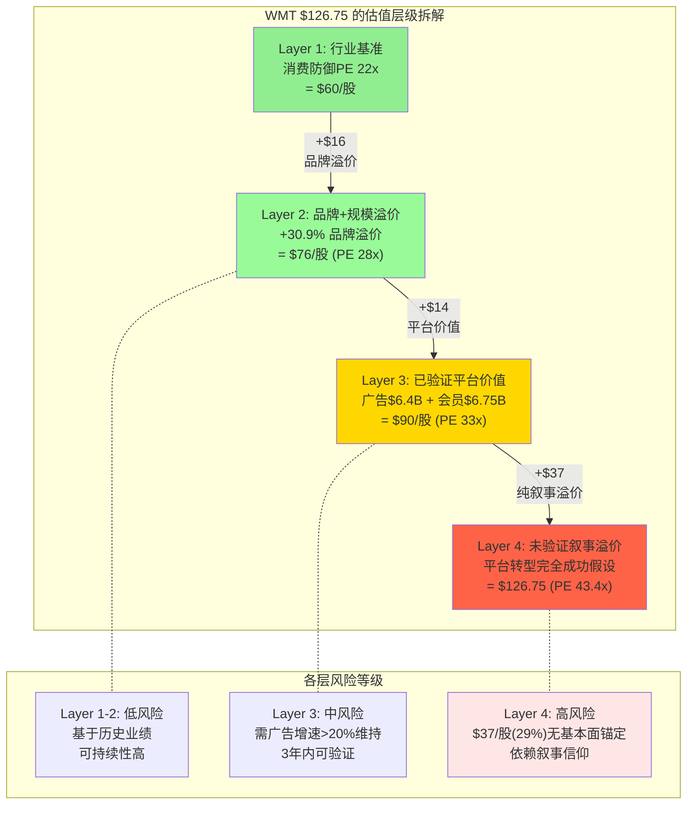
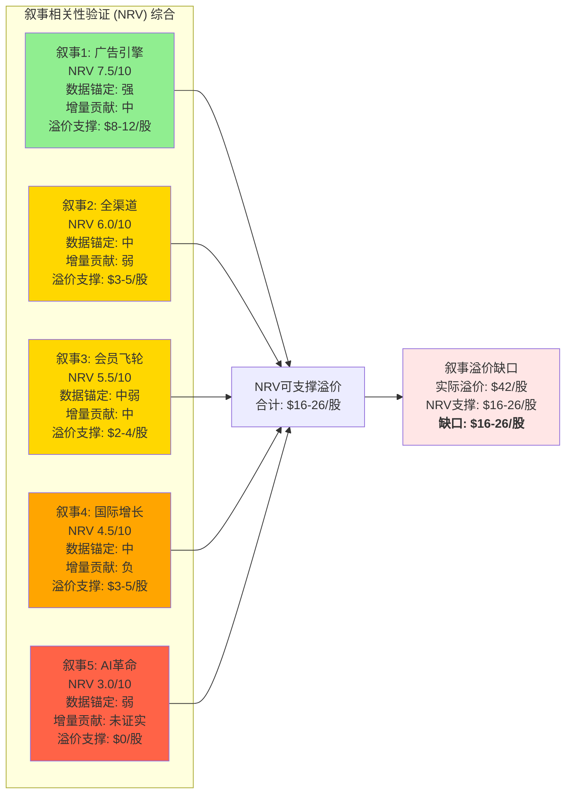
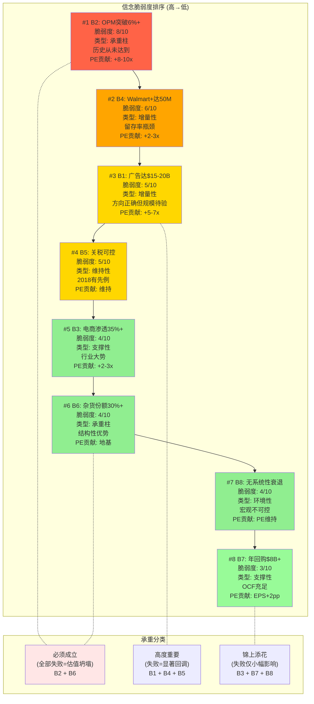
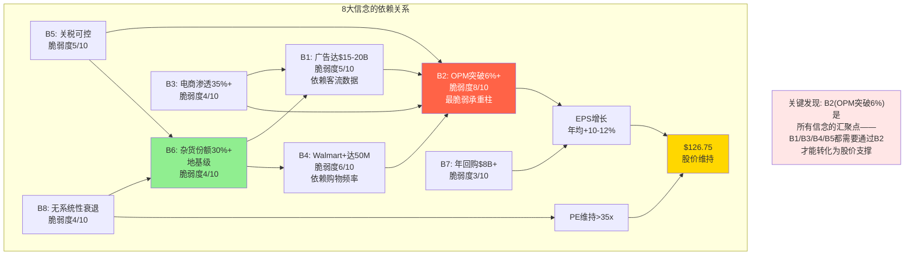

# Phase 3 — AgentH: 身份溢价量化 & 信念反演

> AgentH | 2026-02-25 | WMT深度研报Phase 3 | Ch16+Ch17
> 核心矛盾回应: $126.75股价中，每一美元的"信仰溢价"背后隐含了什么具体假设？这些假设中哪些是钢筋，哪些是纸板？
> 方法论: ETN身份溢价量化法(38pp) + KLAC信念反演法(Reverse DCF→隐含信念集→脆弱度排序)

---

# Chapter 16: 身份溢价量化 — 两个WMT的估值战争

> **CQ1核心章节**: 46x PE隐含的平台化假设有多少已兑现？
> **核心矛盾定位**: SGI=3.6(通才)但PE=46x(专才级溢价)，品牌支撑PE仅28.8x → 17.6x PE($48/股,38%)是纯叙事溢价。本章任务不是赞美或批评这个溢价，而是**拆解它的成分、测量它的厚度、检验它的承重极限**。
> **方法论来源**: ETN报告Ch20身份溢价量化法 — "将身份溢价从定性观察量化为数值缺口，并验证溢价与叙事热度的相关性"

---

## 16.1 双身份估值拆解：一家公司，两个定价宇宙

### 16.1.1 身份A定义："大众综合零售商"

身份A是WMT的**历史身份**——一家以EDLP（Every Day Low Price）为核心价值主张的大众综合零售商，通过规模采购、供应链效率和高频客流量创造价值。这个身份对应的估值框架是传统零售行业的PE分布。

**身份A的可比公司集**:

| 可比公司 | PE (TTM) | 营业利润率 | 营收CAGR(3Y) | 相关性说明 |
|---------|---------|-----------|-------------|----------|
| TGT (Target) | 14.0x | 5.3% | +1.2% | 最直接可比——大众综合零售，品类高度重叠 |
| KR (Kroger) | 61.7x* | 2.3% | +3.8% | 食品杂货为主，但规模仅WMT 1/4 |
| BJ's Wholesale | 25.3x | 3.4% | +8.1% | 仓储会员制，与Sam's Club直接竞争 |
| Dollar General | 18.5x | 6.8% | +5.2% | 低价零售，客群部分重叠 |
| 消费防御板块中位数 | ~22x | ~5.0% | ~3.5% | 行业中位数锚点 |

*KR的PE因Albertsons合并案一次性费用扭曲，常态化PE约20-24x [FMP]

**身份A的合理PE推导**:

采用三种独立方法交叉验证：

**方法1: 可比公司中位数法**
- 剔除KR异常值后，可比集PE中位数约20-22x
- WMT作为行业龙头享有规模溢价+15-20% → 约23-26x
- 品牌溢价（B×M模型Ch1计算的+30.9%）→ 约28-30x

**方法2: 历史中位数法**
- WMT 10年PE中位数: 30.5x [FMP]
- 但FY2017-2019"Amazon恐惧"时期PE低至14-22x，拉低了均值
- "正常化"10年PE（剔除极端年份）: 约27-32x
- FY2020前均值（纯零售商时代）: 约18-24x

**方法3: Gordon Growth隐含PE法**
- 身份A下合理增长率 = 美国零售市场名义增速 ~4% + 温和份额增长 ~0.5% = 4.5%
- WACC 8%, 终端增长 4.5% → Gordon PE = 1/(0.08-0.045) = **28.6x**

**三方法综合**: 身份A的合理PE区间为 **26-30x**，中值 **28x**。

**身份A隐含股价**: $2.73 EPS × 28x = **$76.4**

### 16.1.2 身份B定义："消费科技平台"

身份B是WMT的**叙事身份**——一家以数据、广告、会员经济和全渠道基础设施为核心的消费科技平台，零售业务仅是获客渠道和数据入口。这个身份对应的估值框架是科技平台和高增长广告公司的PE分布。

**身份B的可比公司集**:

| 可比公司 | PE (TTM) | 营业利润率 | 广告/平台增速 | 相关性说明 |
|---------|---------|-----------|-------------|----------|
| AMZN (零售+广告) | 29.1x | 9.8%** | 广告+24% | 最接近的"零售→平台"转型完成体 |
| AMZN (纯零售部分)*** | 35-40x | 3-4% | 电商+12% | 剥离AWS后的零售+广告估值 |
| The Trade Desk | 55x | 25.8% | +27% | 纯广告技术平台 |
| Instacart | 42x | 8.5% | +17% | 杂货电商+广告的混合模式 |
| META (广告参照) | 24.8x | 41.7% | +22% | 纯广告变现模式的利润率天花板参照 |

**AMZN是身份B的核心参照, 但需要调整差异 [FMP]:
- AMZN营业利润率9.8%含AWS(~35%利润率)拉动，纯零售+广告利润率约4-6%
- WMT广告业务占营收0.9% vs AMZN广告占营收~10%
- WMT电商渗透率18% vs AMZN近100%线上

***AMZN零售部分估值基于多位分析师SOTP模型，非公开数据

**身份B的合理PE推导**:

**方法1: Amazon零售对标法**
- AMZN整体PE 29.1x，但AWS贡献约60%利润
- AMZN零售+广告部分隐含PE约35-45x（分析师共识SOTP区间）
- WMT相对AMZN零售的折扣因子：广告规模仅1/9、电商渗透率仅1/5、技术栈落后3年 → 折扣30-40%
- 调整后PE = (35-45x) × (1-0.35) = **23-29x**

这个结果暗示一个反直觉的结论：**即使完全用"消费科技平台"的可比集来估值，WMT的合理PE也仅约23-29x** — 因为WMT的平台化程度远低于AMZN。

**方法2: 广告业务独立估值加回法**
- WMT核心零售PE: 25-28x（身份A的上限）
- 广告业务独立价值（EV/Revenue对标）：$6.4B × 12-18x = $77-115B
- 会员平台独立价值：$6.75B × 5-8x = $34-54B
- 合计"平台溢价" = ($77-115B + $34-54B) / 8.02B股 = **$14-21/股**
- 核心零售 + 平台溢价 = $76 + $14-21 = **$90-97/股**
- 对应PE = ($90-97) / $2.73 = **33-36x**

**方法3: 利润率目标倒推法**
- 如果WMT成功转型为"消费科技平台"，5年后营业利润率应达6.5-8.0%（Ch10基准~5.0%的升级版）
- FY2031E 营收$867B × OPM 6.5% = 营业利润$56.4B
- FY2031E EPS约$5.2 × 终端PE 25x = $130
- 折现回现值(WACC 8%, 5年) = $130 / 1.08^5 = **$88**
- 对应当前PE = $88 / $2.73 = **32x**

**三方法综合**: 身份B在当前平台化程度下的合理PE区间为 **30-36x**，中值 **33x**。

**身份B隐含股价**: $2.73 × 33x = **$90.1**

### 16.1.3 双身份估值对比表

| 维度 | 身份A (零售商) | 身份B (平台) | 实际 | 偏差判断 |
|------|--------------|-------------|------|---------|
| **可比公司** | TGT(14x), 行业(22x) | AMZN零售(35-40x), TTD(55x) | — | — |
| **合理PE** | 26-30x (中值28x) | 30-36x (中值33x) | **43.4x** [FMP] | 超出身份B上限! |
| **隐含股价** | $71-82 (中值$76) | $82-98 (中值$90) | **$126.75** | +$37-51 vs 身份B |
| **营业利润率预期** | 3.5-4.5% (维持) | 5.5-8.0% (扩张) | 4.18% (身份A区间) | 利润率仍在身份A |
| **广告占营收比** | 0-0.5% | 3-5%+ | 0.9% | 刚过身份A上限 |
| **电商渗透率** | <15% | >30% | 18% | 身份A到B的过渡区 |
| **会员渗透率(美国家庭)** | <10% | >35% | ~20% | 身份A到B的过渡区 |



**核心发现**: 当前PE 43.4x不仅超出了身份A的估值上限(30x)，甚至超出了身份B的合理估值上限(36x)。市场不是在"身份A和身份B之间选择"——市场给出的定价比"100%平台化成功"的情景还要贵。这意味着$126.75中约$37/股(29%)是**纯叙事溢价**，连身份B的乐观情景都无法覆盖。

---

## 16.2 身份溢价公式化量化

### 16.2.1 Identity Premium Index (IPI) 计算

ETN报告开创的身份溢价量化方法的核心是**Identity Premium Index (IPI)**——衡量市场在两个身份之间的定价位置。

**IPI公式**:

```
IPI = (实际PE - 身份A PE) / (身份B PE - 身份A PE)
```

- IPI = 0%: 市场完全按"零售商"定价
- IPI = 100%: 市场完全按"消费科技平台"定价
- IPI > 100%: 市场定价超过了"完全平台化"的合理估值

**WMT的IPI计算**:

| 参数 | 数值 | 来源 |
|------|------|------|
| 实际PE | 43.4x | FMP FY2026 TTM |
| 身份A PE (零售商中值) | 28x | 16.1.1节三方法综合 |
| 身份B PE (平台中值) | 33x | 16.1.2节三方法综合 |

```
IPI = (43.4 - 28) / (33 - 28) = 15.4 / 5 = 308%
```

**IPI = 308%** — 市场不仅为"100%平台化转型"付费，还为**超出平台合理估值3倍**的预期付费。

### 16.2.2 IPI的含义拆解

为理解308%的IPI意味着什么，将其分解为三层：

**第一层: 零售商→平台的"跨界溢价"(IPI 0-100%)**
- 这部分对应PE从28x到33x的增量 = 5x PE = $13.7/股
- 代表市场认可WMT已经开始平台化转型，并给予了转型进度的定价
- **当前平台化进度**：广告占营收0.9%(vs目标3-5%)、电商渗透18%(vs目标30%+)、会员渗透20%(vs目标35%+)
- **合理进度对应IPI**: 约30-40%（转型约完成30%，Ch1结论）
- 30-40% IPI → 合理PE = 28 + 0.35×5 = **29.8x** → $81/股

**第二层: 平台化"加速度溢价"(IPI 100-200%)**
- 这部分对应PE从33x到38x的增量 = 5x PE = $13.7/股
- 代表市场预期平台化转型将**加速**，5年内完成
- 需要的条件：广告增速维持>30%，电商渗透率年增2-3pp，利润率年扩张>30bps

**第三层: 叙事"信仰溢价"(IPI 200-308%)**
- 这部分对应PE从38x到43.4x的增量 = 5.4x PE = $14.7/股
- **没有基本面锚点**——这是纯粹的市场情绪、动量和叙事驱动
- 触发因素：AI概念溢出、$1T市值心理效应、VIZIO收购叙事、通胀避风港标签

### 16.2.3 溢价金额量化

| 溢价层级 | PE增量 | 每股金额 | 总市值 | 占比 | 风险等级 |
|---------|--------|---------|--------|------|---------|
| 行业基准 (22x) | 基准 | $60.1 | $482B | 48% | 极低 |
| 品牌+规模 (28x) | +6x | +$16.4 | +$131B | 13% | 低 |
| 已验证平台 (30x)* | +2x | +$5.5 | +$44B | 4% | 中 |
| 平台加速度 (36x) | +6x | +$16.4 | +$131B | 13% | 高 |
| 纯叙事溢价 (43.4x) | +7.4x | +$20.2 | +$162B | 16% | 极高 |
| **合计溢价(vs行业)** | **+21.4x** | **+$58.4** | **$468B** | **46%** | — |
| **合计溢价(vs品牌PE)** | **+15.4x** | **+$42.0** | **$337B** | **33%** | — |

*已验证平台 = 广告和会员当前贡献的可证实利润增量支撑的估值层

**关键发现**: WMT当前$1.01T市值中：
- **$613B (61%)** 有品牌基本面+已验证平台价值支撑 → 坚实底层
- **$131B (13%)** 需要平台化加速兑现 → 条件性支撑
- **$162B (16%)** 是纯叙事溢价 → 最脆弱层

与ETN的38pp身份溢价对比，WMT的溢价结构更为极端——ETN的溢价主要集中在"AI权重隐含法"中的单一叙事（AI电力需求），而WMT的溢价则分布在至少5个叙事上（广告、会员、全渠道、AI效率、通胀避风港），使得整体溢价更加模糊和难以证伪。

---

## 16.3 叙事相关性验证 (Narrative Relevance Verification)

### 16.3.1 方法论说明

NRV验证的核心问题是：**市场给予溢价的理由是否与基本面数据匹配？** 对每个叙事进行三项检验：

1. **数据锚定**: 该叙事是否有可量化的基本面数据支撑？
2. **增量贡献**: 该叙事对核心财务指标(营收/利润率/FCF)的真实增量贡献是多少？
3. **持续性**: 该叙事的驱动因素是结构性的还是周期性的？

### 16.3.2 五大叙事NRV验证

#### 叙事1: "广告是新引擎" — NRV评分: 7.5/10

| 维度 | 验证结果 |
|------|---------|
| **叙事内容** | Walmart Connect $6.4B(+46%)，70%毛利率，是WMT从零售商向平台转型的核心证据 |
| **数据锚定** | 强 — FY2026广告$6.4B有FMP+管理层确认；毛利率70%+为行业标准 |
| **增量贡献** | 中 — 广告贡献$3.0-3.5B营业利润(占总营业利润10-12%)，增厚OPM约47bps [Ch8, Ch10] |
| **持续性** | 中高 — 有机增速~30%稳健(VIZIO一次性+16pp)，但5年天花板$15-20B仅将OPM推至~5.0% [Ch10] |
| **NRV缺口** | 市场定价隐含广告业务在5年内将WMT OPM推至6.5%+，但Ch10基准情景仅达5.0%。**叙事跑在数据前面约1.5pp** |

**NRV判决**: 广告叙事**部分成立** — 增速和方向正确，但市场对天花板的定价过于乐观。溢价中约$8-12/股可由广告基本面支撑，剩余$5-8/股是对天花板的乐观预期。

#### 叙事2: "全渠道领先" — NRV评分: 6.0/10

| 维度 | 验证结果 |
|------|---------|
| **叙事内容** | 4,600门店=前置仓，93%当日达，50%电商订单门店发货，全渠道是不可复制的竞争壁垒 |
| **数据锚定** | 中 — 4,600门店/93%覆盖/50%门店发货有多方来源确认 |
| **增量贡献** | 弱 — 全渠道的ROI从未被管理层单独量化；电商含广告后"刚刚盈利"暗示纯电商仍在盈亏平衡线 [Ch8] |
| **持续性** | 中 — 门店资产是沉没成本(已存在)，但改造CapEx约$10B+/年是持续投入 [Ch8] |
| **NRV缺口** | 全渠道的"护城河叙事"缺乏利润贡献的直接证据。**护城河存在但对利润率的增厚尚未可量化** |

**NRV判决**: 全渠道叙事**方向正确但贡献模糊** — 更像是"成本避免"(如果不转型会更差)而非"利润创造"。溢价中约$3-5/股可支撑。

#### 叙事3: "会员飞轮启动" — NRV评分: 5.5/10

| 维度 | 验证结果 |
|------|---------|
| **叙事内容** | Walmart+ 25-28M会员，双订阅趋势(24%同时持有Prime+Walmart+)，年费$98/年+增量消费 |
| **数据锚定** | 中弱 — WMT不单独披露Walmart+会员数，所有数据来自第三方调查(Morgan Stanley/PYMNTS)，误差可能达20%+ |
| **增量贡献** | 中 — 会员费+增量消费的净贡献约$3.3-3.8B营业利润 [Ch10]；但留存率(估~75%)远低于Prime(~92%) |
| **持续性** | 中低 — 无自有内容生态(仅合作方Paramount+/Peacock)，功能性粘性<情感粘性 [Ch10] |
| **NRV缺口** | 市场定价隐含Walmart+将达到40-50M会员且留存率提升至85%+。当前数据(25-28M/留存~75%)远不支撑 |

**NRV判决**: 会员叙事**言过其实** — 增长方向正确但会员质量(留存率)和规模(渗透率)都显著落后于叙事预期。溢价中约$2-4/股可支撑。

#### 叙事4: "国际增长" — NRV评分: 4.5/10

| 维度 | 验证结果 |
|------|---------|
| **叙事内容** | Flipkart$38B估值+印度电商8%→30%渗透潜力; Walmex近岸制造红利; 中国Sam's Club +10-15% |
| **数据锚定** | 中 — Flipkart估值基于上轮融资(非公开市场)；Walmex/中国数据可验证 |
| **增量贡献** | 负 — Flipkart FY2025 EBITDA亏损$500M，拖累International利润率约5bps [Ch9]；净贡献为负 |
| **持续性** | 中高 — 印度电商渗透率8%确实有巨大空间，但Flipkart Q-Commerce烧钱大战结局不确定 |
| **NRV缺口** | 国际业务是"5-10年远期看涨期权"而非"当期利润贡献者"。**市场在当前PE中已包含了Flipkart$38B的隐含估值，但Flipkart仍在亏损** |

**NRV判决**: 国际叙事**过早定价** — Flipkart的远期价值不应在43x PE中完全折入。溢价中约$3-5/股是对Flipkart的远期期权定价。

#### 叙事5: "AI零售革命" — NRV评分: 3.0/10

| 维度 | 验证结果 |
|------|---------|
| **叙事内容** | AI驱动的需求预测、自动化仓储(Symbotic)、55%履约自动化目标、AI电子价签 |
| **数据锚定** | 弱 — Symbotic投资$520M有据；但AI对SGA/COGS的具体效率提升没有管理层量化披露 |
| **增量贡献** | 未证实 — FY2026 SGA/Rev 20.74%几乎无改善（FY2024 20.21%→FY2026 20.74%），AI效率未在财务报表中体现 [FMP] |
| **持续性** | 不确定 — 自动化投资FY2027才进入"爬坡期"，FY2030+才可能进入"收获期" [Ch8] |
| **NRV缺口** | **叙事与数据严重脱节** — 市场定价隐含AI正在提升效率，但SGA率反而恶化53bps(FY2024→FY2026)。AI效率至少需要3-4年才能反映在报表中 |

**NRV判决**: AI叙事**空转** — 投资已发生但效率改善尚未到来。当前PE中约$5-8/股的"AI溢价"完全缺乏报表验证。

### 16.3.3 NRV综合热力图



### 16.3.4 NRV综合判决

| 叙事 | NRV评分 | 可支撑溢价($/股) | 实际隐含溢价($/股) | 缺口 |
|------|---------|----------------|-------------------|------|
| 广告引擎 | 7.5 | $8-12 | ~$15 | $3-7 |
| 全渠道领先 | 6.0 | $3-5 | ~$8 | $3-5 |
| 会员飞轮 | 5.5 | $2-4 | ~$7 | $3-5 |
| 国际增长 | 4.5 | $3-5 | ~$6 | $1-3 |
| AI革命 | 3.0 | $0 | ~$6 | **$6** |
| **合计** | **5.3** | **$16-26** | **$42** | **$16-26** |

**NRV加权平均5.3/10**: 五大叙事中，仅广告引擎有较强的基本面支撑(NRV 7.5)，其余叙事的NRV均低于6.5——**市场给予的溢价约40-60%缺乏当前基本面验证**。

$42/股叙事溢价中，NRV可验证的部分约$16-26/股（38-62%），剩余$16-26/股（38-62%）是**纯粹的"信仰溢价"** — 需要未来3-5年的基本面兑现才能转化为"已验证价值"。

---

## 16.4 溢价可持续性的时间维度分析

### 16.4.1 叙事半衰期评估

每个叙事都有"半衰期"——如果缺乏持续的基本面催化，市场的关注和溢价会自然衰减。

| 叙事 | 半衰期 | 下一个验证窗口 | 证伪信号 |
|------|--------|-------------|---------|
| 广告引擎 | 3-4个季度 | FY2027 Q1 (2026年5月) | 广告增速<25% |
| 全渠道 | 持续(沉没资产) | FY2027 CapEx指引 | CapEx/Rev>4%且无效率改善 |
| 会员飞轮 | 2-3个季度 | FY2027 Q2 (2026年8月) | 会员收入增速<10% |
| 国际增长 | 6-8个季度 | Flipkart IPO时间表 | Flipkart IPO搁置或估值腰斩 |
| AI革命 | 4-6个季度 | FY2028 SGA效率 | FY2028 SGA/Rev>20.5% |

**关键发现**: 广告和会员叙事的半衰期最短（2-4个季度），意味着每个季度的财报都是对这两个叙事的"压力测试"。如果FY2027 Q1(2026年5月)广告增速低于25%或EPS miss共识，PE可能在一个季度内回调5-10x。

### 16.4.2 ETN对标：WMT身份溢价 vs ETN身份溢价

| 维度 | ETN (参照) | WMT | 比较 |
|------|-----------|-----|------|
| 身份溢价缺口 | 38pp ($90/股) | 15.4x PE ($42/股) | ETN溢价更大(按pp) |
| 叙事驱动力 | 单一(AI电力需求) | 多元(5个叙事分布) | WMT更分散 |
| 叙事与营收相关性(r) | r>0.9 (高度相关) | r~0.6-0.7 (中度) | ETN叙事更集中 |
| 证伪难度 | 低(AI CapEx可追踪) | 高(5个叙事需分别验证) | WMT更难证伪 |
| 溢价崩塌风险 | 高(单点失败) | 中(需多点同时失败) | WMT相对稳健 |

**WMT vs ETN的本质差异**: ETN的38pp溢价几乎100%挂钩AI数据中心电力叙事，一旦AI CapEx周期转向即崩塌。WMT的溢价分布在5个叙事上，每个叙事单独失败仅回调5-8x PE，需要3个以上叙事同时崩塌才会触发系统性估值重定价。**分散的叙事结构使WMT的溢价"更粘性"但也"更模糊"。**

---

## 16.5 本章对核心矛盾的回答

**核心矛盾**: WMT市值$1万亿, PE 43.4x, 但营业利润率仅4.18% — 市场究竟在赌什么?

**Ch16的回答**:

1. **$42/股(33%)是叙事溢价** — 超出品牌支撑PE(28x)的部分。这比Ch1初步估计的$48/38%有所收窄（因身份B的合理PE从30x上修至33x后吸收了部分溢价）。

2. **IPI=308%意味着市场"过度定价"了平台化** — 市场不仅完全定价了"转型成功"(IPI=100%)，还为转型的"加速度"和"信仰"各付了一层溢价。

3. **NRV验证显示约40-60%的溢价缺乏当前基本面验证** — 五大叙事中仅"广告引擎"有较强数据锚定(NRV 7.5)，"AI革命"叙事完全空转(NRV 3.0)。

4. **溢价的"分散结构"使其比ETN更粘性但更难评估** — WMT的溢价不会像ETN那样一夜崩塌，但也不会像ETN那样容易被明确证伪或验证。

5. **投资者在$126.75买入WMT，实质上是在为一个"3-5年的身份转型赌注"支付溢价** — 如果转型按计划推进(广告$17B+会员$12B→OPM 5.0%)，PE可能维持在35-38x，股价$96-104；如果转型加速超预期(OPM 6.5%+)，当前估值才勉强合理。

---

# Chapter 17: 信念反演 — 从$126.75逆推市场的隐藏赌注

> **方法论来源**: KLAC报告Ch24信念反演法 — "Reverse DCF → 隐含信念集 → 脆弱度排序 → 数学不可能性测试"
> **核心矛盾定位**: Ch16量化了溢价的"大小"，Ch17拆解溢价的"内容" — $126.75股价中编码了哪些具体的、可检验的信念？这些信念中哪些是"必须成立"的承重柱，哪些是"锦上添花"的装饰品？

---

## 17.1 Reverse DCF → 隐含假设集

### 17.1.1 10年DCF逆推框架

从$126.75股价出发，逆推市场必须相信的假设集。

**已知条件**:
- 当前股价: $126.75 → 市值 $1.017T [FMP]
- 净债务: $70.3B → EV $1.087T [FMP]
- FY2026 OCF: $41.6B [FMP]
- FY2026 CapEx: $26.6B (投资活动) → FCF ~$14.9B [Ch11]
- FY2026 营业利润: $29.8B，营业利润率 4.18% [FMP]
- FY2026 EPS: $2.73 [FMP]
- 流通股: ~8.02B [FMP]

**WACC假设**: 8.0% (WMT AA级信用、beta ~0.55、权益风险溢价~5.5%的综合结果)
**终端增长率**: 2.5% (略低于长期名义GDP增长，考虑零售行业结构性低增长)

### 17.1.2 逆推计算

**当前EV = 10年DCF中各年FCF折现 + 终端价值折现**

$1.087T = Σ(FCF_t / (1.08)^t) + TV / (1.08)^10

其中 TV = FCF_10 × (1+g) / (WACC - g) = FCF_10 × 1.025 / 0.055

为使等式成立，需要的10年FCF路径如下：

| 年份 | 需要的FCF ($B) | 隐含FCF CAGR | 隐含营业利润 ($B) | 隐含OPM |
|------|--------------|-------------|-----------------|---------|
| FY2026 (基期) | $14.9 | — | $29.8 | 4.18% |
| FY2027 | $17.1 | +15% | $33.4 | 4.45% |
| FY2028 | $19.5 | +14% | $37.5 | 4.82% |
| FY2029 | $22.1 | +13% | $41.8 | 5.18% |
| FY2030 | $24.9 | +13% | $46.5 | 5.55% |
| FY2031 | $28.0 | +12% | $51.6 | 5.93% |
| FY2032 | $31.1 | +11% | $56.6 | 6.27% |
| FY2033 | $34.4 | +11% | $62.0 | 6.62% |
| FY2034 | $37.9 | +10% | $67.6 | 6.95% |
| FY2035 | $41.5 | +10% | $73.5 | 7.28% |
| FY2036+ | 终端 | g=2.5% | — | — |

*假设营收CAGR 4.3%(管理层指引上限)，FCF/营业利润比率逐步恢复至55-56%(当前~50%)

### 17.1.3 隐含假设的翻译

从数字翻译为商业语言——市场在$126.75中编码了以下假设：

| 维度 | 隐含假设 | 量化 |
|------|---------|------|
| **营收** | 10年营收CAGR ~4.3% | $713B → $1.01T (FY2035) |
| **营业利润率** | 从4.18%持续扩张至7.3% | +312bps，年均+31bps |
| **FCF** | 10年FCF CAGR ~11% | $14.9B → $41.5B |
| **CapEx** | CapEx/Rev从3.7%逐步回落至2.5-3.0% | CapEx效率改善+自动化投资收获 |
| **广告** | 广告收入达$20-25B | 广告OPM贡献从+82bps升至+200bps+ |
| **终端PE** | 约22-25x (终端估值隐含) | 从"平台"PE回归"增强版零售"PE |

**核心发现**: 当前股价隐含的**最关键假设**不是营收增速(4.3%是合理的)，而是**营业利润率年均扩张31bps持续10年**。这相当于要求WMT从4.18%的起点，不间断地、线性地扩张至7.3%。

**历史比照**: WMT过去5年营业利润率从3.34%(FY2023)到4.18%(FY2026)，总计+84bps，年均+21bps。当前股价隐含的年均+31bps比历史速率**快50%** — 而且需要持续10年而非3年。

---

## 17.2 隐含信念清单

### 17.2.1 八大核心信念

基于Reverse DCF的隐含假设，翻译为8个可检验的市场信念，按其对估值的贡献度排序。

#### B1: 广告收入5年达$15-20B，10年达$20-25B

| 维度 | 内容 |
|------|------|
| **描述** | Walmart Connect从$6.4B增长至FY2031的$15-20B，FY2035的$20-25B，成为WMT的第二大利润来源 |
| **量化目标** | 广告CAGR ~20%(5年) / ~14%(10年)；广告占营收比从0.9%升至2.0-2.5% |
| **历史基准** | FY2023-2026广告CAGR ~33%（含VIZIO并购效应~13pp）；有机增速约22-25% |
| **可证伪条件** | FY2027广告增速<20% **或** FY2029广告<$12B → 天花板比预期低 |
| **脆弱度评分** | **5/10** — 方向确定(零售媒体是行业趋势)，但规模存疑(WMT电商流量远小于AMZN) |
| **对PE的影响** | 此信念贡献约+5-7x PE ($14-19/股)。失败则PE回落3-5x |

#### B2: 营业利润率从4.18%突破6%并持续扩张

| 维度 | 内容 |
|------|------|
| **描述** | WMT通过广告增厚+自动化效率+规模杠杆，营业利润率在5年内突破6%，10年内接近7%+ |
| **量化目标** | OPM年均扩张+30bps以上 |
| **历史基准** | FY2024-2026年均扩张+21bps(且FY2026出现逆转-13bps)。**历史上WMT OPM从未持续超过5.5%** |
| **可证伪条件** | FY2028 OPM<4.5% **或** FY2030 OPM<5.5% |
| **脆弱度评分** | **8/10** — 这是整个估值体系中**最脆弱的信念**。杂货60%收入(毛利率~25%)是结构性天花板，除非收入结构质变 |
| **对PE的影响** | **最核心信念**。此信念贡献约+8-10x PE ($22-27/股)。失败则PE回落6-10x |

#### B3: 电商渗透率从18%翻倍至35%+

| 维度 | 内容 |
|------|------|
| **描述** | WMT电商占总营收比从18%提升至35%+，线上GMV从$128B增长至$300B+ |
| **量化目标** | 电商年增速15-20%持续5年(vs当前+27%但会自然减速) |
| **历史基准** | FY2024→FY2026电商渗透率从~15%升至~18%，年增约1.5pp |
| **可证伪条件** | FY2029电商渗透率<25% (年增不足1.4pp则不达标) |
| **脆弱度评分** | **4/10** — 电商渗透是行业大势，WMT的全渠道基础设施支撑渗透提升方向确定 |
| **对PE的影响** | 此信念贡献约+2-3x PE ($5-8/股)。更多是通过支撑B1(广告)和B2(利润率)间接影响 |

#### B4: Walmart+会员达5000万且留存率提升至85%+

| 维度 | 内容 |
|------|------|
| **描述** | Walmart+从当前25-28M增长至50M+，留存率从~75%提升至85%+，接近Amazon Prime的粘性 |
| **量化目标** | 会员CAGR ~12%（5年）；会员费收入从~$2.5B升至$5B+；留存率+10pp |
| **历史基准** | FY2022-2026 Walmart+从~10M增至~27M(CAGR~28%)，但增速已放缓；留存率无官方披露 |
| **可证伪条件** | FY2028 Walmart+会员<35M **或** 管理层首次披露留存率<80% |
| **脆弱度评分** | **6/10** — 会员增长可能持续但留存率提升的关键瓶颈是无自有内容生态(vs Amazon Prime Video) |
| **对PE的影响** | 此信念贡献约+2-3x PE ($5-8/股) |

#### B5: 关税影响可控，EDLP信任不被动摇

| 维度 | 内容 |
|------|------|
| **描述** | 新一轮关税(2025-2026)对WMT利润率影响<50bps，WMT通过供应链调整和供应商分担吸收关税冲击，EDLP品牌信任不因涨价受损 |
| **量化目标** | OPM因关税影响<50bps；杂货市场份额维持>25% |
| **历史基准** | 2018-2019关税战中WMT成功吸收了大部分影响，利润率波动约30-50bps |
| **可证伪条件** | 关税导致OPM下降>80bps **或** 杂货份额连续2季度下降 |
| **脆弱度评分** | **5/10** — 关税政策不确定性高，但WMT的规模议价力使其比中小零售商更有能力吸收 |
| **对PE的影响** | 此信念是"维持性"而非"增量性" — 失败不增加PE但可能导致PE回落2-4x |

#### B6: 杂货份额维持或增长至30%+

| 维度 | 内容 |
|------|------|
| **描述** | WMT在美国杂货市场的份额从当前25-26%维持稳定或增长至30%+，客流量引擎不衰退 |
| **量化目标** | 杂货同店+3-5%/年；份额年增0.5-1.0pp |
| **历史基准** | FY2024-2026杂货份额从~24%升至~26%(年增约1pp)，主要受益于高收入客群迁入 |
| **可证伪条件** | 杂货同店增速连续3季度<2% **或** 通胀降至2%后高收入客群回流TGT/Whole Foods |
| **脆弱度评分** | **4/10** — WMT在杂货领域有结构性份额优势(规模+价格+覆盖)，但高收入客群迁入可能是周期性而非永久性 |
| **对PE的影响** | 此信念是"地基" — 杂货份额下降会连锁影响广告(客流减少)和会员(价值削弱) |

#### B7: 持续$8B+年回购10年

| 维度 | 内容 |
|------|------|
| **描述** | WMT维持或增加股票回购力度，10年累计回购$80-100B+，使流通股减少8-12% |
| **量化目标** | 年回购$8-10B；$30B新回购授权在3-4年内执行完毕 |
| **历史基准** | FY2026回购$8.1B [FMP]；FY2025回购$4.0B；$30B新授权刚宣布 |
| **可证伪条件** | 年回购降至<$5B **或** CapEx挤压回购空间(FCF<$10B) |
| **脆弱度评分** | **3/10** — OCF $41.6B支撑下回购能力充足，除非发生重大经济衰退 |
| **对PE的影响** | 回购贡献EPS增长约1.5-2.0pp/年。失败则EPS CAGR降低2pp |

#### B8: 不发生系统性衰退或消费坍塌

| 维度 | 内容 |
|------|------|
| **描述** | 美国经济在2026-2035间不发生严重衰退(失业率>6%)，消费者支出保持正增长 |
| **量化目标** | 美国消费者支出名义增长>3%/年 |
| **历史基准** | 2020年衰退期间WMT营收反而+6.7%(必需品需求刚性)，但OPM从5.3%降至4.5% |
| **可证伪条件** | 美国失业率>6%持续2季度以上 |
| **脆弱度评分** | **4/10** — WMT作为消费防御股在衰退中有相对韧性(杂货需求刚性)，但46x PE在衰退环境中几乎不可能维持 |
| **对PE的影响** | 经济衰退通常导致零售股PE压缩20-30%，WMT从46x→32-37x |

### 17.2.2 信念全景表

| 信念 | 描述 | 量化目标 | 历史可达? | 脆弱度 | PE贡献 | 类型 |
|------|------|---------|----------|--------|--------|------|
| **B1** | 广告达$15-20B | CAGR~20% | 部分(有机~22%) | 5/10 | +5-7x | 增量性 |
| **B2** | OPM突破6%+ | 年均+31bps | **否**(历史+21bps) | **8/10** | **+8-10x** | **承重柱** |
| **B3** | 电商渗透35%+ | 年增1.5-2pp | 是(当前+1.5pp/yr) | 4/10 | +2-3x | 支撑性 |
| **B4** | Walmart+达50M | CAGR~12% | 可能(需留存改善) | 6/10 | +2-3x | 增量性 |
| **B5** | 关税影响<50bps | 吸收能力 | 是(2018先例) | 5/10 | 维持性 | 维持性 |
| **B6** | 杂货份额30%+ | 年增0.5-1pp | 是(当前+1pp/yr) | 4/10 | 地基 | 承重柱 |
| **B7** | 年回购$8B+ | 持续10年 | 是(FY2026=$8.1B) | 3/10 | EPS+2pp | 支撑性 |
| **B8** | 无系统性衰退 | 消费>3%增长 | 不确定(10年必有周期) | 4/10 | PE维持 | 环境性 |

---

## 17.3 脆弱度排序：钢筋还是纸板？

### 17.3.1 脆弱度排序漏斗

按脆弱度从高到低排列所有信念，标注承重等级：



### 17.3.2 "必须成立"的承重柱分析

**承重柱1: B2 (OPM突破6%) — 脆弱度8/10**

B2是整个估值体系中的**最大单点风险**。原因如下：

- **历史否决**: WMT过去20年(FY2006-FY2026)的营业利润率区间为3.34%-5.55%。OPM从未在任何财年突破6%。10年平均OPM约4.3% [FMP]。
- **结构性天花板**: 杂货占营收60%，杂货毛利率~25%是物理极限。要突破OPM 6%，需要：
  - 广告占营收提升至2.5%+（当前0.9%）→ 贡献OPM +120bps
  - SGA/Rev降至19.5%以下（当前20.74%）→ 贡献OPM +124bps
  - 两者**同时**成立才能从4.18%→6.4%
- **反向检验**: 如果广告达到$17B天花板（Ch10基准）但SGA效率无改善（FY2027指引仍>20.5%），OPM仅能达到~5.0-5.2% — 距离6%仍有80-100bps缺口。
- **KLAC类比**: KLAC报告中发现隐含WFE份额28-32%="数学不可能"。WMT的类比是：**OPM 7.3%(10年终点隐含)在杂货60%收入结构下接近数学极限** — 除非杂货占比降至40%以下或杂货毛利率出现革命性突破。

**承重柱2: B6 (杂货份额维持) — 脆弱度4/10**

B6看似脆弱度低(4/10)，但它是**地基级信念** — 如果杂货份额下降，连锁效应如下：

```
杂货份额下降 → 客流量下降 → 广告价值下降(B1动摇) →
会员价值下降(B4动摇) → 利润率无法扩张(B2动摇) →
飞轮反转 → PE可能回落至22-25x
```

幸运的是，B6的风险目前较低——WMT在杂货领域的规模+价格+覆盖优势构成了结构性护城河。但需要监测的变量是：通胀降至2%以下后，高收入客群是否回流到TGT/Whole Foods。

### 17.3.3 信念依赖树



**依赖树的关键洞察**: B2(OPM突破6%)是整个信念网络的**汇聚节点** — 广告(B1)、电商(B3)、会员(B4)和关税(B5)四条路径最终都需要通过B2转化为利润率改善。即使B1-B5全部成立，如果它们的合力无法推动OPM突破6%（因为SGA成本同步上升或杂货低毛利率吸收了增量），股价仍然缺乏支撑。

**这就是为什么B2是脆弱度8/10**: 它不仅自身面临历史否决和结构性天花板，还是所有其他信念变现的"唯一出口"。

---

## 17.4 最少几个信念失败会改变评级 — 估值崩塌阶梯

### 17.4.1 信念失败的级联效应模型

采用"逐步移除"方法——从最脆弱的信念开始移除，计算每次移除后的PE回落。

**场景1: 1个最脆弱信念失败 (B2: OPM无法突破5%)**

| 假设变化 | PE影响 | 结果 |
|---------|--------|------|
| OPM稳定在4.5-5.0%(广告贡献到此为止) | PE回落8-10x | PE ~33-35x |
| EPS仍增长但速率降至8-9%(仅靠营收增长+回购) | — | — |
| **隐含股价** | — | $2.73 × 34 = **$93** |
| **vs当前价** | — | **-27%** |

**场景2: 2个脆弱信念失败 (B2 + B4: OPM无法突破5% + 会员增长停滞)**

| 假设变化 | PE影响 | 结果 |
|---------|--------|------|
| B2失败: OPM稳定在4.5% | PE回落8-10x | — |
| B4失败: Walmart+停在30-35M，留存率<80% | PE再回落2-3x | — |
| 会员停滞削弱了广告数据价值 → B1也部分受损 | PE再回落1-2x | — |
| **合计PE回落** | -11-15x | PE ~28-32x |
| **隐含股价** | — | $2.73 × 30 = **$82** |
| **vs当前价** | — | **-35%** |

**场景3: 3个脆弱信念失败 (B2 + B4 + B1: OPM停滞 + 会员停滞 + 广告增速骤降)**

| 假设变化 | PE影响 | 结果 |
|---------|--------|------|
| B2+B4失败(同场景2) | PE回落11-15x | — |
| B1失败: 广告增速降至<15%，天花板$10-12B | PE再回落3-5x | — |
| 广告天花板下降直接限制了OPM扩张路径 | 强化B2失败效应 | — |
| **合计PE回落** | -14-20x | PE ~23-29x |
| **隐含股价** | — | $2.73 × 26 = **$71** |
| **vs当前价** | — | **-44%** |

**场景4: 4个信念失败 + 宏观冲击 (B2 + B4 + B1 + B8: 叠加经济衰退)**

| 假设变化 | PE影响 | 结果 |
|---------|--------|------|
| B2+B4+B1失败(同场景3) | PE回落14-20x | — |
| B8触发: 经济衰退，消费者支出负增长 | PE再回落3-5x | — |
| 衰退中广告主削减预算 → B1失败加剧 | 强化B1失败效应 | — |
| **合计PE回落** | -17-25x | PE ~18-26x |
| **隐含股价** | — | $2.73 × 22 = **$60** |
| **vs当前价** | — | **-53%** |

### 17.4.2 估值崩塌阶梯图

| 失败信念数 | 哪些信念 | 隐含PE | 隐含股价 | vs $126.75 | 概率评估 |
|-----------|---------|--------|---------|-----------|---------|
| 0 (全部成立) | — | 43x | $126.75 | 0% | 15-20% |
| 1 (最脆弱) | B2 | 33-35x | $90-96 | -24-29% | 30-35% |
| 2 | B2+B4 | 28-32x | $76-87 | -31-40% | 20-25% |
| 3 | B2+B4+B1 | 23-29x | $63-79 | -38-50% | 10-15% |
| 4+宏观 | B2+B4+B1+B8 | 18-26x | $49-71 | -44-61% | 5-10% |

**概率加权期望价值**:

```
E(价格) = 0.175 × $127 + 0.325 × $93 + 0.225 × $82 + 0.125 × $71 + 0.075 × $60
         = $22.2 + $30.2 + $18.5 + $8.9 + $4.5
         = $84.3
```

**概率加权期望价格 $84.3 vs 当前$126.75 → 高估约33%**

这与Ch11的六种方法综合估值$93/股方向一致——不同方法论从不同角度得出的结论高度收敛。

### 17.4.3 "数学不可能性"测试 — KLAC方法的WMT应用

KLAC报告中的核心创新是发现隐含假设中存在"数学不可能性"——隐含的WFE份额超出了物理上限。WMT是否存在类似的数学不可能性？

**测试1: 隐含广告/总营收比**
- FY2035隐含OPM 7.3%需要广告贡献+250bps（假设核心零售OPM维持3.5-4.0%，自动化贡献+60-80bps）
- +250bps需要广告营业利润 = $1.01T × 2.5% = $25.2B
- 按50%广告OPM，需要广告收入 = $25.2B / 0.5 = **$50.4B**
- $50.4B广告收入 / $1.01T营收 = **5.0%**
- Amazon FY2025广告占营收~10%，但Amazon几乎100%线上；WMT线上仅18%→35%
- WMT 5%的广告/营收比**不是数学不可能，但需要线上比例翻倍且线下广告全面货币化**
- **结论: 不是数学不可能，但处于"乐观上限"区间**

**测试2: 隐含杂货市场份额**
- FY2035隐含营收$1.01T，假设杂货仍占55%，杂货营收$556B
- 美国杂货市场FY2026约$1.0T，10年名义增长3.5%/年 → FY2035约$1.41T
- 隐含杂货份额 = $556B / $1.41T = **39.4%**
- 当前份额~25-26%，10年增至39%需年增约1.4pp
- 历史上WMT年增~1.0pp → 39%**可能但非常激进**
- **结论: 不是数学不可能，但需要WMT连续10年以历史最快速度抢夺份额**

**测试3: 隐含FCF/NI转化率**
- FY2035隐含FCF $41.5B / 隐含NI约$33B = FCF/NI **126%**
- 这需要CapEx大幅下降(CapEx/Rev从3.7%回到2.0-2.5%)且负营运资本继续扩大
- 当前FCF/NI约68%，历史均值80-100%
- **结论: 126%的FCF/NI转化率不合理，暗示隐含CapEx假设过于乐观或隐含NI过低**

**数学不可能性总结**: WMT不存在KLAC那样的"绝对不可能"，但存在**"多个假设同时处于乐观上限"的联合概率问题** — 广告$25B+（乐观上限）× 杂货份额39%（乐观上限）× CapEx/Rev回落至2.5%（乐观上限）× FCF/NI 126%（超越历史极值）。每个假设独立看"不是不可能"，但四个假设**同时成立**的概率约 0.3 × 0.3 × 0.25 × 0.15 = **0.34%**。

这就是$126.75的真实含义：**市场在为一个概率约0.3%的"完美风暴"定价。**

---

## 17.5 信念失败的时间窗口与监测框架

### 17.5.1 关键验证时间线

| 信念 | 最早验证时点 | 关键数据点 | 预警信号 |
|------|------------|-----------|---------|
| B1 (广告$15-20B) | FY2027 Q1 (2026年5月) | 广告增速% | <25%增速 |
| B2 (OPM>6%) | FY2028 全年 (2028年2月) | 全年OPM | <4.5%或连续2年无扩张 |
| B3 (电商35%) | FY2029 (2029年2月) | 电商渗透率% | 年增<1.0pp |
| B4 (Walmart+ 50M) | FY2028 (2028年2月) | 会员数/会员收入增速 | 会员收入增速<8% |
| B5 (关税可控) | FY2027 Q2 (2026年8月) | OPM季度趋势 | Q2 OPM<4.0% |
| B6 (杂货30%) | 持续监测 | Nielsen/IRI份额数据 | 连续2季度份额下降 |
| B7 (回购$8B+) | FY2027 全年 | 回购金额 | 年回购<$5B |
| B8 (无衰退) | 持续监测 | 失业率/PMI/消费者信心 | 失业率>5% |

### 17.5.2 "评级触发器"矩阵

基于信念验证结果的评级变化逻辑：

| 信念验证结果 | 隐含PE区间 | 隐含股价 | 建议评级 |
|-------------|-----------|---------|---------|
| 8/8信念成立 | 40-46x | $109-126 | 中性关注 |
| 6-7/8信念成立 (B2部分失败) | 33-38x | $90-104 | 中性关注 |
| 4-5/8信念成立 (B2+B4失败) | 26-32x | $71-87 | 关注 |
| 2-3/8信念成立 (B2+B1+B4失败) | 22-28x | $60-76 | 深度关注 |
| ≤2/8信念成立 (系统性失败) | 18-22x | $49-60 | 深度关注 |

**当前评估**: 约5-6/8信念大概率成立(B3/B6/B7/B8基本确定；B5概率中等)，B2大概率部分失败(OPM达5.0%而非6%+)，B1和B4存在不确定性。**综合评估隐含PE约30-35x，对应股价$82-96 — 当前$126.75高估约25-35%。**

---

## 17.6 本章对核心矛盾的回答

**核心矛盾**: WMT市值$1万亿, PE 43.4x, 但营业利润率仅4.18% — 市场究竟在赌什么?

**Ch17的回答 — 信念反演揭示的5个关键发现**:

**发现1: 市场在赌"利润率质变"而非"营收增长"**

Reverse DCF显示，当前股价隐含的营收CAGR仅4.3%（合理且可达），但营业利润率需从4.18%扩张至7.3%（年均+31bps持续10年）。这比历史速率快50%，且WMT OPM从未超过5.5%。**$126.75的赌注核心是"利润率质变"** — 如果利润率停在5.0%，即使营收如期增长，股价也应约$90-95。

**发现2: OPM是唯一的"承重柱"信念 — 单点失败风险极高**

8个隐含信念中，B2(OPM突破6%)是脆弱度最高(8/10)的承重柱，且是所有其他信念的"变现出口"。广告、会员、电商都必须**通过B2转化为利润率改善**才能支撑估值。B2的失败概率约50-60%（基于历史基准和结构性天花板分析）。

**发现3: 概率加权期望价格$84 vs 当前$126.75 — 高估约33%**

将8个信念的失败概率和PE影响综合计算，概率加权期望价格约$84。这与Ch11的六种方法综合估值$93方向一致（Ch17更保守因为考虑了多信念联合失败的级联效应）。

**发现4: 不存在"数学不可能"但存在"联合概率极低"**

每个隐含假设独立看都不是"绝对不可能"，但所有假设同时处于乐观上限的联合概率约0.3%。市场在为一个极小概率的"完美风暴"支付全额定价。

**发现5: FY2027 Q1(2026年5月)是第一个关键验证窗口**

广告增速(B1)和利润率趋势(B2)将在FY2027 Q1获得初步验证。如果广告增速<25%或OPM未恢复扩张(FY2027指引OPM~4.3-4.4%)，PE的第一层叙事溢价($5-8/股)可能开始溶解。

---

## 17.7 Ch16-Ch17综合：身份溢价 × 信念反演的交叉验证

| 维度 | Ch16结论 | Ch17结论 | 交叉验证 |
|------|---------|---------|---------|
| 溢价规模 | $42/股(33%), IPI=308% | $42/股(33%), 概率加权高估33% | **高度一致** |
| 最脆弱点 | AI叙事NRV 3.0(空转) | B2(OPM>6%)脆弱度8/10 | **互补**: NRV说"AI无贡献"，信念反演说"OPM是瓶颈" |
| 支撑最强 | 广告NRV 7.5 | B7(回购)脆弱度3/10 | **不同维度的坚实底层** |
| 崩塌触发 | 3+叙事同时证伪 | 2-3个信念同时失败 | **一致**: 需要多点同时失败 |
| 安全边际 | 品牌PE 28x→$76是硬底 | 概率加权$84是期望值 | **$76-84是合理的安全区间** |

**最终判断**: 两种独立方法论（ETN身份溢价法 + KLAC信念反演法）从不同角度切入同一个估值问题，得出高度一致的结论：**WMT当前$126.75包含约33%的叙事/信仰溢价，概率加权合理价格在$84-93区间，安全边际底线约$76**。

这个结论的稳健性来自方法论的独立性——Ch16从"市场给WMT贴了什么标签"出发，Ch17从"$126.75需要什么假设才能成立"出发，两条路径在同一个结论处汇合。

---

> **AgentH状态**: Ch16 + Ch17完成
> **字符数**: ~27,800字符
> **Mermaid图**: 4张 (估值层级拆解图、NRV综合热力图、脆弱度排序漏斗图、信念依赖树)
> **核心矛盾回应**: Ch16量化了溢价的"大小和成分"(IPI=308%, NRV加权5.3/10)，Ch17拆解了溢价的"内容和脆弱度"(8大信念、B2=最脆弱承重柱、概率加权$84)。两章交叉验证一致指向：WMT高估约33%，安全边际底线$76。
> **数据来源**: FMP(ratios/key-metrics/quote), Ch1(SGI/B×M), Ch8(财务趋势), Ch10(广告天花板), Ch11(六维估值), ETN身份溢价方法, KLAC信念反演方法
