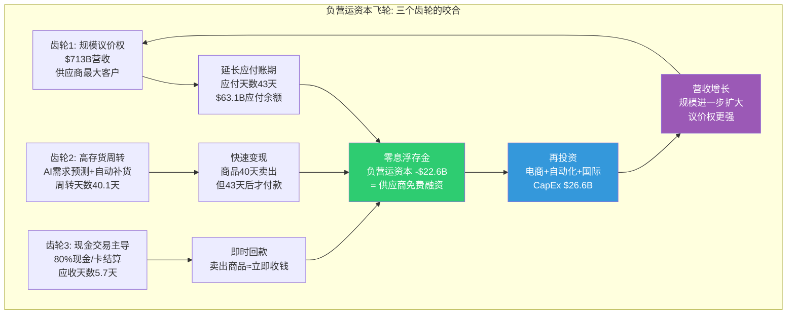
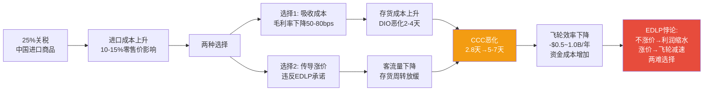
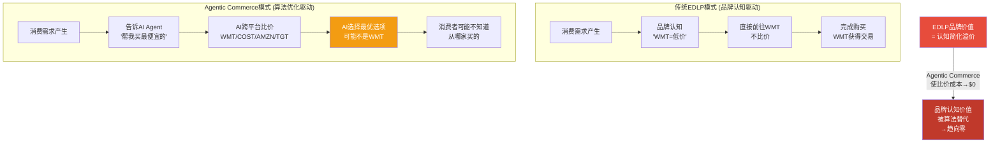
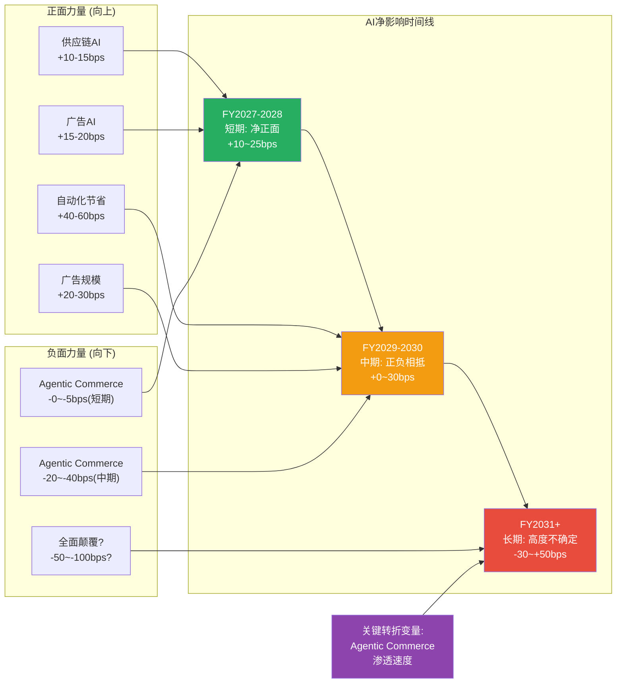

# Phase 3 AgentI: Ch18 负营运资本飞轮量化 + Ch19 AI冲击矩阵
> AgentI | 2026-02-25 | 目标≥20,000字符 | Mermaid≥3张

---

# Chapter 18: 负营运资本飞轮 — $22.6B零息融资的护城河价值

> **核心矛盾框架**: WMT的负营运资本从FY2022的-$6.3B扩大至FY2026的-$22.6B，四年间"免费资本"增加了$16.3B。这个飞轮机制是支撑万亿估值的隐性护城河，还是已被市场充分定价的已知优势? 本章量化飞轮的经济价值，测试其可持续性，并评估其对估值的真实影响。

---

## 18.1 负营运资本机制解析: 用供应商的钱做生意

### 18.1.1 基本公式与经济含义

负营运资本的核心公式:

**净营运资本 = 应收账款 + 存货 - 应付账款**

当应付账款 > (应收账款 + 存货) 时，净营运资本为负——意味着企业不需要自己出钱来支撑日常运营，反而是供应商在为其提供零息融资。FY2026的具体拆解:

- 应付账款: $63.1B (欠供应商的货款)
- 存货: $58.9B (仓库和门店中的商品)
- 应收账款: $11.2B (尚未收回的应收款项)
- **净营运资本: $11.2B + $58.9B - $63.1B = +$7.0B** (狭义)
- **广义负营运资本: 流动资产 - 流动负债 = $84.9B - $107.5B = -$22.6B**

这里需要区分两个口径。狭义的应收+存货-应付口径下，WMT的营运资本实际上是正的$7.0B——因为$11.2B应收账款的存在(主要来自电商结算和广告应收)。但广义的流动资产减流动负债口径(即Phase 0引用的-$22.6B)则包含了递延收入、应计费用、短期债务等更多流动负债项目。

**经济本质**: 无论哪个口径，核心事实是一致的——WMT的$63.1B应付账款远超其运营所需的自有资金垫付。每一美元的应付余额，都是WMT在使用供应商的钱去赚取自己的利润。

### 18.1.2 飞轮运作的三个齿轮

WMT负营运资本飞轮由三个相互咬合的齿轮驱动:

**齿轮一: 规模压制议价权**

$713B营收使WMT成为绝大多数消费品供应商的最大单一客户。P&G约15%的营收来自WMT，Unilever约11%，Coca-Cola约10% [10-K Cross-references]。当你的最大客户占你营收的10-15%时，你很难拒绝其付款条款的延长要求。

**齿轮二: 高周转压缩存货持有期**

存货周转天数从FY2022的48.1天压缩至FY2026的40.1天——商品在仓库和货架上的停留时间缩短了8天。这意味着WMT在收到供应商的货物后，平均40天就将其转化为销售收入，而付款给供应商的周期是43天。**商品已经卖掉了3天，钱还没付出去**——这个时间差乘以日均COGS就是负营运资本的来源。

**齿轮三: 现金交易缩短应收周期**

WMT约80%的交易以现金或借记卡/信用卡完成，结算周期通常在1-3天内。应收天数仅5.7天，远低于B2B企业的30-60天。即便电商和广告业务使应收天数略有上升(FY2022的5.3天→FY2026的5.7天)，WMT的回款速度仍然是零售业中最快的之一。

---

## 18.2 五年趋势量化: 从-$6.3B到-$22.6B的飞轮加速

### 18.2.1 核心营运资本指标五年演变

基于FMP资产负债表数据，构建完整的五年趋势表:

| 指标 | FY2022 | FY2023 | FY2024 | FY2025 | FY2026 | 5年变化 |
|------|--------|--------|--------|--------|--------|---------|
| **应付账款 ($B)** | 55.3 | 53.7 | 56.8 | 58.7 | 63.1 | +$7.8B (+14%) |
| **存货 ($B)** | 56.5 | 56.6 | 54.9 | 56.4 | 58.9 | +$2.4B (+4%) |
| **应收账款 ($B)** | 8.3 | 7.9 | 8.8 | 10.0 | 11.2 | +$2.9B (+35%) |
| **流动资产合计 ($B)** | 81.1 | 75.7 | 76.9 | 79.5 | 84.9 | +$3.8B |
| **流动负债合计 ($B)** | 87.4 | 92.2 | 92.4 | 96.6 | 107.5 | +$20.1B |
| **广义营运资本 ($B)** | **-6.3** | **-16.5** | **-15.5** | **-17.1** | **-22.6** | **-$16.3B** |
| **狭义WC (AR+Inv-AP)** | +9.5 | +10.8 | +6.9 | +7.7 | +7.0 | -$2.5B |

[FMP Balance Sheet FY2022-2026]

### 18.2.2 现金转化周期(CCC)的极致压缩

| 指标 | FY2022 | FY2023 | FY2024 | FY2025 | FY2026 | 5年变化 |
|------|--------|--------|--------|--------|--------|---------|
| **存货周转天数 (DIO)** | 48.1 | 44.5 | 40.9 | 40.3 | 40.1 | -8.0天 |
| **应收天数 (DSO)** | 5.3 | 4.7 | 5.0 | 5.3 | 5.7 | +0.4天 |
| **应付天数 (DPO)** | 47.0 | 42.3 | 42.3 | 41.8 | 43.0 | -4.0天 |
| **CCC (天)** | **6.3** | **7.0** | **3.5** | **3.8** | **2.8** | **-3.5天** |

[FMP Key Metrics FY2022-2026]

**五年趋势的关键读数:**

1. **DIO的压缩是最大贡献者**: 存货周转天数从48.1天降至40.1天(-8天)，这是AI驱动的需求预测系统和Symbotic自动化仓储系统的直接产出。$58.9B的存货以更快速度周转，意味着更少的呆滞库存和更低的持有成本。

2. **DPO的反直觉下降**: 应付天数从FY2022的47.0天降至FY2026的43.0天(-4天)。这出人意料——通常随着规模扩大，议价权增强应该延长付款周期。解释有两个: (a) FY2022的47天可能包含疫情期间的异常延期; (b) WMT的EDLP模式要求维护供应商关系，不能过度压榨付款条件。

3. **DSO的轻微上升**: 应收天数从5.3天增至5.7天(+0.4天)，反映了电商业务(结算周期较长)和广告应收(企业客户30天账期)占比上升的结构性影响。

4. **CCC 2.8天接近理论极限**: 对于一个拥有$59B存货的零售商而言，CCC接近零是非凡的成就。Amazon的CCC实际上是负数(约-30天)，因为其DPO约80天远超DIO，但Amazon的模式是极端延长付款而非压缩存货——WMT的路径是"快卖"而非"晚付"。

### 18.2.3 FY2022的存货膨胀事件: 压力测试回顾

FY2022(截至2022年1月)是负营运资本飞轮遭遇压力测试的关键年份。存货同比暴增$11.8B(从FY2021的$44.9B飙升至$56.5B)，导致:

- 存货周转天数从约38天恶化至48.1天(+10天)
- CCC从约-2天恶化至6.3天(+8天)
- 广义营运资本从约-$18B收窄至-$6.3B

**事件原因**: 2021年全球供应链危机期间，WMT为确保货源充足(特别是进口商品)大量提前下单。当供应链恢复正常时，过量库存积压在仓库和门店中，迫使WMT在FY2023进行约$3.3B的库存减记(markdown)。

**飞轮恢复速度**: 从FY2022的谷底开始，WMT用了约2年(到FY2024)将DIO从48.1天恢复至40.9天，CCC从6.3天恢复至3.5天。这证明了飞轮的弹性——即使遭遇重大冲击，WMT的规模优势和AI系统也能在合理时间内将CCC重新压缩至正常区间。

**教训**: 负营运资本飞轮不是永动机。在供应链中断、通胀飙升或消费需求骤变的极端场景下，存货膨胀可以在一两个季度内将CCC恶化5-10天，使飞轮效率大幅下降。

---

## 18.3 飞轮价值量化: 隐藏的$1.8B/年利润贡献

### 18.3.1 资本成本节省计算

负营运资本的经济价值可以从"替代成本"角度量化——如果WMT没有负营运资本(即CCC为正且需自行融资)，需要额外承担多少资金成本?

**方法一: 广义营运资本口径**

| 参数 | 数值 | 来源 |
|------|------|------|
| 广义负营运资本 | $22.6B | FMP Balance Sheet FY2026 |
| WMT WACC | ~8.0% | 基于AA信用评级+市场风险溢价 |
| 年化资金成本节省 | **$1.81B** | $22.6B x 8.0% |
| 占营业利润比例 | **6.1%** | $1.81B / $29.8B |
| 占净利润比例 | **8.3%** | $1.81B / $21.9B |

**方法二: 狭义应付净额口径**

仅计算应付账款超出存货+应收的部分:

- FY2026: AP($63.1B) - Inv($58.9B) - AR($11.2B) = -$7.0B (实际为正，即应付不足以覆盖)
- 狭义口径下WMT的应付账款实际上不足以覆盖存货+应收
- **但这忽略了CCC的动态效应**: CCC仅2.8天意味着WMT几乎不需要垫付任何资金

**方法三: CCC动态模型**

日均COGS = ($713.2B x (1-24.93%)) / 365 = $1.466B/天
CCC = 2.8天
CCC隐含的资金占用 = $1.466B x 2.8天 = **$4.1B**

如果CCC退化到行业平均(约15-20天for大型零售商):
CCC隐含资金占用 = $1.466B x 17.5天 = **$25.7B**
额外资金需求 = $25.7B - $4.1B = **$21.6B**
WACC节省 = $21.6B x 8% = **$1.73B/年**

三种方法的结论高度一致: **WMT的负营运资本/超低CCC每年节省约$1.7-1.8B的资金成本**。

### 18.3.2 飞轮对DCF的隐性贡献

传统DCF模型是否低估了WMT? 关键取决于对营运资本变动的处理方式:

**标准DCF处理**: 多数分析师将"营运资本变动"作为现金流调整项——当负营运资本进一步扩大时(如FY2025-2026，应付账款增加$4.4B)，这部分释放的现金直接计入FCF。因此，负营运资本的增量改善已被DCF捕捉。

**被忽略的部分**: DCF通常不会单独对"存量负营运资本的资金成本节省"赋予估值。如果将$1.8B/年的节省视为一种永续年金(perpetuity)，以8%折现:

- 永续价值 = $1.8B / 8% = **$22.5B**
- 占当前市值: $22.5B / $1.01T = **2.2%**

这意味着负营运资本飞轮的稳态价值约为$22.5B——并非微不足道，但对$1万亿市值而言，它是"锦上添花"而非"估值基石"。

### 18.3.3 与COST的对比: 两种负营运资本模式

| 指标 | WMT (FY2026) | COST (FY2025) | 差异解读 |
|------|-------------|---------------|---------|
| **CCC (天)** | 2.8 | 1.7 | COST更优——极端周转速度 |
| **DIO (天)** | 40.1 | 27.6 | COST存货周转快12天(SKU少) |
| **DSO (天)** | 5.7 | 4.2 | COST应收更少(会员制现金) |
| **DPO (天)** | 43.0 | 30.1 | WMT付款更慢(+13天议价优势) |
| **应付/存货** | 1.07x | 1.06x | 几乎相同 |
| **广义营运资本** | -$22.6B | +$1.3B | WMT负，COST正(短期债务差异) |

[FMP Key Metrics: WMT FY2026, COST FY2025]

**关键差异解读**:

COST的CCC更短(1.7天 vs 2.8天)，但路径完全不同:
- **COST**: 靠极低的DIO(27.6天)取胜——仅4,000个SKU使存货周转极快，但DPO也短(30天)，因为COST会员制不依赖供应商让利来维持低价
- **WMT**: 靠较高的DPO(43天)取胜——100万+SKU使存货周转相对较慢，但议价权延长了应付周期

两种模式都有效，但WMT的模式更依赖供应商关系的维护——如果供应商集体要求缩短付款周期(如DPO从43天降至35天)，WMT的CCC将恶化至约11天，飞轮效率下降约75%。而COST的模式主要依赖内部效率(SKU精简+高周转)，供应商端的风险更小。

---

## 18.4 可持续性测试: 飞轮会不会反转?

### 18.4.1 供应商集中度与反弹力测试

WMT前5大供应商(估算): P&G、Unilever、Nestle、Coca-Cola、PepsiCo——合计约占总采购额的15-18% [行业估算]。这意味着:

- **没有单一供应商拥有谈判筹码**: 即使P&G(WMT最大供应商，占采购额约5-6%)威胁缩短账期，WMT也有替代供应商可选(自有品牌Great Value等)
- **但集体行动的风险非零**: 如果整个CPG行业面临流动性压力(如2008年金融危机期间)，供应商可能集体要求缩短付款周期。WMT在2022年供应链危机中就经历过类似的压力

**供应链金融(SCF)的缓冲作用**: WMT与HSBC合作建立了供应商融资计划(Supply Chain Finance Program)，允许供应商以WMT的AA信用评级为背书，从银行获得低息提前付款。这实质上是将账期延长的成本从供应商转嫁给了银行——供应商拿到了钱(虽然打了折)，WMT延长了付款周期，银行赚取了利差。这个三方安排使DPO的延长变得更加"温和"和可持续。

### 18.4.2 存货周转恶化风险

存货周转是飞轮中最脆弱的环节。以下三种情境可能导致DIO恶化:

**情境一: 消费放缓导致存货膨胀**
- 触发条件: 美国消费者信心指数<80，失业率>5%
- 预估影响: DIO从40天恶化至48-50天(参考FY2022)
- CCC影响: 2.8天→12-15天
- 飞轮价值损失: 约$1.2B/年资金成本增加

**情境二: 关税冲击推高存货成本**
- 触发条件: 中国进口商品关税维持25%+，扩展至更多品类
- 预估影响: 进口商品存货成本上升10-15%，DIO恶化2-4天(因进货量不变但金额增加)
- CCC影响: 2.8天→5-7天
- 飞轮价值损失: 约$0.5-0.8B/年

**情境三: AI需求预测系统失灵/黑天鹅事件**
- 触发条件: 算法未能预测的突发消费模式变化(如疫情初期的恐慌性囤货)
- 预估影响: DIO恶化5-10天
- CCC影响: 2.8天→8-13天
- 历史参照: FY2022供应链危机已证明过这种情景

### 18.4.3 应付天数的天花板测试

当前DPO 43天是否已接近极限?

| 零售商 | DPO (天) | 模式 |
|--------|---------|------|
| Amazon | ~80 | 极端延长(平台霸权) |
| Target | ~60 | 较强议价 |
| **WMT** | **43** | **中等偏保守** |
| COST | ~30 | 会员制不依赖延长 |
| Kroger | ~35 | 食品杂货专注 |

理论上，WMT的DPO仍有延长至50-55天的空间(向Target靠拢)。但EDLP模式的约束意味着WMT不太可能效仿Amazon的极端做法——过度延长账期会促使供应商将更好的产品、更优的促销资源优先给予COST或Target。

**判断**: DPO大概率维持在40-45天的窄幅区间，不会成为飞轮恶化或改善的主要驱动力。存货周转效率(DIO)才是飞轮的决定性变量。

### 18.4.4 关税冲击: 进口商品涨价对飞轮的传导链

WMT约三分之一的美国商品为进口产品，其中约60%来自中国 [行业估算]。如果25%关税维持:

**管理层的应对策略**: FY2026 Q4电话会上，CFO John David Rainey表示"We are well positioned to navigate tariffs...our scale allows us to mitigate costs better than any competitor." 这暗示WMT将采取混合策略——部分品类吸收(如自有品牌Great Value)，部分品类传导(如一般商品/GM)，同时加速供应链转移(从中国向越南、印度、墨西哥分散)。

---

## 18.5 飞轮的五年前瞻: 改善空间与恶化概率

| 情景 | 概率 | FY2031 CCC | 飞轮价值变化 | 驱动因素 |
|------|------|-----------|-------------|---------|
| **乐观** | 25% | 0-1天 | +$0.3B/年 | AI预测精度持续提升+自动化全面铺开+供应链金融扩展 |
| **基准** | 50% | 2-3天 | 持平 | 飞轮维持当前水平，DIO/DPO小幅波动 |
| **悲观** | 20% | 6-8天 | -$0.8B/年 | 消费放缓+关税长期化+供应商反弹 |
| **极端** | 5% | 12-15天 | -$1.5B/年 | 经济衰退+存货危机(FY2022重演) |

**概率加权CCC**: 0.25×0.5 + 0.50×2.5 + 0.20×7.0 + 0.05×13.5 = **3.45天**

概率加权后的CCC略高于当前2.8天——反映了恶化风险稍大于改善空间的非对称分布。但即使在悲观情景下(CCC 6-8天)，WMT的飞轮仍然远优于行业平均(大型零售商CCC通常15-25天)。

---

## 18.6 本章对核心矛盾的回答

**问题: 负营运资本飞轮支持"零售商估值"还是"平台估值"?**

**回答: 这是一个纯粹的"零售商护城河"，但它是零售商最优质的护城河之一。**

| 维度 | 判定 | 理由 |
|------|------|------|
| **价值来源** | 零售商 | 来自采购规模议价权和存货管理效率，非平台网络效应 |
| **可持续性** | 高 | CCC 2.8天接近极限但恶化风险可控，飞轮弹性已经FY2022验证 |
| **估值贡献** | 有限 | 永续价值~$22.5B，仅占市值2.2%——不足以支撑万亿估值 |
| **竞争壁垒** | 中等 | COST用不同路径达到更低CCC(1.7天)，表明这不是WMT独有优势 |
| **PE支撑** | 零售商水平 | 负营运资本是零售行业的常见特征(Target、COST、Amazon都有)，不构成溢价理由 |

**核心判断**: 负营运资本飞轮是WMT作为超级零售商的"基础设施优势"——它确保了WMT的资本效率远超中小型零售商，但它不是"消费科技平台"估值叙事的证据。$1.8B/年的资金成本节省是有价值的，但对于一个$30B营业利润的企业而言，它是"效率红利"而非"增长引擎"。

将这$1.8B/年节省换算为PE贡献: $1.8B / $2.73 EPS x 8.0B稀释股数 = 约$0.22/股 → 以46x PE计 = 约$10/股的估值贡献，占当前股价$126.75的约8%。这是有意义的，但不能解释46x PE vs 历史均值30x PE的溢价。

---

# Chapter 19: AI冲击矩阵 — 效率革命与Agentic Commerce的双面博弈

> **核心矛盾框架**: AI是WMT万亿估值的"隐藏催化剂"还是"未被定价的威胁"? 短期内，AI驱动的效率提升(供应链优化、自动化、广告精准度)支撑着"平台升级"叙事。但中长期，Agentic Commerce(AI代购)可能从根本上颠覆EDLP的品牌认知价值——如果AI帮消费者自动比价，"天天低价"的品牌承诺就变得多余了。本章构建八维度冲击矩阵，量化净影响，并深入分析Agentic Commerce的颠覆路径。

---

## 19.1 AI对零售业八维度冲击评估

### 19.1.1 冲击矩阵总览

| 维度 | AI具体应用 | 对WMT影响 | 时间框架 | 冲击等级 | 置信度 |
|------|----------|----------|---------|---------|--------|
| **供应链优化** | 需求预测+库存优化+路线规划 | 正面: 减少报废+提升周转 | 已兑现 | ★★★★ | 高 |
| **定价智能** | 动态定价+竞品监控+弹性分析 | 双面: 效率提升但EDLP约束 | 1-2年 | ★★★ | 中 |
| **客户体验** | 个性化推荐+AI助手+视觉搜索 | 正面: 提升转化率和客单价 | 2-4年 | ★★★ | 中 |
| **门店运营** | 自动结账+机器人拣货+智能货架 | 正面: 降低人工成本 | 1-3年 | ★★★★ | 高 |
| **广告精准度** | 数据驱动投放+闭环归因+CTV | 正面: 提升ROAS和广告收入 | 已兑现 | ★★★★★ | 高 |
| **物流配送** | 自动驾驶+无人机+路线AI | 正面: 降低最后一英里成本 | 3-7年 | ★★★ | 低 |
| **竞争格局** | AMZN AI优势+技术差距 | 负面: AMZN技术领先扩大 | 持续 | ★★★ | 中 |
| **消费行为** | Agentic Commerce(AI代购) | **负面: 可能瓦解EDLP品牌价值** | 3-5年 | ★★★★★ | 中 |

### 19.1.2 已兑现的AI红利 (短期正面)

**供应链优化 — 已在产生真实回报**

WMT的AI供应链系统已经从实验阶段进入规模化部署:

- **需求预测**: 使用多层级递归神经网络(Multi-Horizon Recurrent Neural Network)预测未来多个时间点的需求。库存准确率提升至90%以上，减少了缺货和过剩 [Fortune, DigitalDefynd]
- **路线优化**: AI路线规划系统消除了3,000万英里的无效行驶，节省$55M+成本并减少9,400万磅碳排放 [Supply Chain Dive, Walmart Corporate]
- **供应商谈判AI**: 自动化供应商谈判系统实现68%的成功率，平均成本节省3% [Articsledge]
- **全球扩展**: 美国开发的AI供应链系统已部署至墨西哥、加拿大、哥斯达黎加等市场 [Walmart Corporate]

**广告精准度 — AI驱动Walmart Connect高增长**

Walmart Connect的+46%增速背后，AI扮演了核心角色:
- 基于第一方消费数据(POS+电商+会员)的精准定向能力
- VIZIO收购带来的CTV闭环归因(电视广告→店内购买→归因追踪)
- 搜索广告的AI驱动自动竞价系统

### 19.1.3 正在部署的AI应用 (中期正面)

**门店运营自动化 — 65%门店+55%仓配自动化目标**

WMT的自动化战略是其AI投资中最具规模效应的部分:

| 自动化指标 | FY2025状态 | FY2026目标 | 长期愿景 |
|-----------|-----------|-----------|---------|
| 门店自动化覆盖率 | ~55% | ~65% | ~90% (FY2030) |
| 仓配自动化容量 | ~45% | ~55% | ~80% (FY2030) |
| 单位成本改善 | -15% | -20% | -35% (FY2030) |
| Symbotic系统部署 | 初期 | 加速 | 400套APD系统 |
| 航运成本下降 | 持续-30% QoQ | 维持趋势 | — |

[Retail TouchPoints, Supply Chain Dive, Chain Store Age]

**具体数据点**:
- 截至FY2026，超过60%的美国门店已从自动化配送中心接收货物
- 自动化履约中心的生产率是传统中心的2倍
- Symbotic投资$520M用于400套加速取货配送系统(APD)，多年期部署
- 航运成本已连续多个季度保持约30%的下降幅度

**人力成本影响量化**:

WMT拥有约210万全球员工(美国约160万)，员工成本约占SGA的65%(~$96B/年)。如果自动化能够在5年内削减5-8%的人力需求:

- 5%情景: 减少10.5万人 x $38K/年均成本 = **$4.0B/年**
- 8%情景: 减少16.8万人 x $38K/年均成本 = **$6.4B/年**
- 营业利润率提升: +56bps (5%) 至 +90bps (8%)

但必须注意: WMT作为全球最大的私营雇主，大规模裁员面临巨大的政治和社会压力。更可能的路径是"自然减员+岗位替代"——即不填补离职员工的岗位，而非主动裁员。这意味着人力成本节省将以更缓慢的速度(3-5年而非1-2年)兑现。

---

## 19.2 Agentic Commerce: EDLP模式面临的最大AI威胁

### 19.2.1 什么是Agentic Commerce?

Agentic Commerce是2025-2026年零售业最具颠覆性的AI趋势。其核心概念是: **AI Agent代替消费者完成从研究、比较到购买的全流程决策**。

与传统AI推荐(如Amazon的"为你推荐")不同，Agentic Commerce中的AI不是辅助工具，而是**自主代理人(Agent)**——它拥有记忆(了解你的消费偏好)、推理(权衡价格/质量/便利性)和工具使用(跨平台比价、下单、支付)的能力。

**行业现状** (截至2026年2月):

| 指标 | 数据 | 来源 |
|------|------|------|
| AI影响的假日订单占比 | 17% ($135亿) | 2025年感恩节周末 |
| AI来源的零售流量增长 | +1,200% YoY | 2025年数据 |
| 传统搜索流量变化 | -10% YoY | 2025年数据 |
| 消费者对AI代购的接受度 | 70%至少有一定接受度 | Bain & Company 2025 |
| 完成AI推荐购买的消费者 | 13% | 早期采用阶段 |
| AI购物代理渗透预测(2030) | ~50%在线购物者 | Morgan Stanley |
| Agentic Commerce市场规模预测(2030) | $3-5万亿 全球 | 行业研究 |
| 零售高管认为AI将削弱品牌忠诚度 | 81% | Deloitte 2026 Retail Outlook |

[GeekWire, Modern Retail, Bain & Company, Commercetools]

### 19.2.2 Agentic Commerce对EDLP模式的颠覆逻辑

EDLP(Every Day Low Price)的核心价值主张不是"WMT的价格真的最低"——而是"消费者**相信**WMT的价格最低，因此不需要比价就直接去WMT购买"。这是一种**认知简化(cognitive shortcut)**:消费者用品牌信任替代了比价行为，节省了时间和认知成本。

Agentic Commerce从根本上颠覆这个逻辑:

**传统购物路径**:
消费者想买洗衣液 → 想到"WMT最便宜" → 直接去WMT购买 → 不比价

**Agentic Commerce路径**:
消费者告诉AI"买最便宜的同品质洗衣液" → AI自动比较WMT/COST/Amazon/Target → 选择真正最便宜的 → 消费者甚至不知道从哪里买的

### 19.2.3 颠覆的三个阶段

**第一阶段: 标品标准化比价 (2025-2027)**

AI最容易颠覆的是标准化产品(洗衣液、纸巾、电池等)——这些产品的质量差异极小，消费者主要基于价格和便利性做决策。如果AI可以在5秒内告诉你"Tide洗衣液在Amazon $11.99，WMT $12.49，COST $10.99/瓶(需会员)"，EDLP的"不比价信任"就失去了意义。

- **受影响品类**: 家用清洁、个人护理、纸品、电池、基础食品
- **WMT暴露度**: 这些品类约占WMT美国营收的25-30%
- **竞争者优势**: COST(会员制低价) + Amazon(Prime便利性) 在标品上可能胜出

**第二阶段: 生鲜杂货智能代购 (2027-2029)**

生鲜杂货更复杂——涉及品质判断(成熟度、新鲜度)、个人偏好(有机vs常规)、配送时效(冷链要求)。AI需要更长时间来掌握这些非结构化决策。但一旦AI具备这种能力:

- **受影响品类**: 蔬果、肉类、乳制品、烘焙食品
- **WMT暴露度**: 食品杂货占美国营收~60%，这是核心腹地
- **WMT防御**: 4,600家门店的物理覆盖率是最后一英里的护城河——即使AI选择了最优价格，如果WMT能在1小时内送达而竞争对手需要2天，消费者(或AI)仍会选择WMT

**第三阶段: 全自主消费管家 (2029+)**

AI管理消费者的全部日常购物——自动监控家庭库存(通过智能冰箱/摄像头)、预测需求、下单、安排配送。在这个阶段:

- 品牌忠诚度几乎完全瓦解——AI不在乎品牌
- 零售商的竞争从"吸引消费者"变为"吸引AI Agent"
- WMT需要提供最优的API接口、最低的价格、最快的配送，才能被AI选为默认供应商

### 19.2.4 WMT的防御策略与反制力

面对Agentic Commerce，WMT并非无力回应。其防御力量来自几个维度:

**防御一: 物理覆盖率护城河**

93%美国家庭10英里内有WMT门店——这是任何AI Agent都无法绕开的物理现实。即使AI帮消费者找到了更便宜的价格，如果WMT能在30分钟内送达而竞品需要2天，时间偏好仍然会将决策导向WMT。对于生鲜品类(WMT营收的60%)，最后一英里的物理距离几乎是不可替代的优势。

**防御二: 第一方数据壁垒**

WMT拥有2.55亿周访客(线上+线下)的消费数据——这是训练AI推荐系统的无价资产。如果WMT自己构建Agentic Commerce能力(内部AI代购助手)，其数据优势可能使自家的AI Agent在WMT生态内的推荐精度超过外部通用型AI。

**防御三: 成为AI Agent的默认供应商**

WMT可以主动与主要AI Agent平台(OpenAI、Google、Apple Intelligence等)达成合作协议——将WMT设为AI代购的"默认零售商"或"优先供应商"。这需要提供:
- 优质的API接口(实时库存、价格、配送时效)
- 有竞争力的AI专属定价
- 无缝的订单/退货/售后流程

**防御四: EDLP的"足够好"策略**

EDLP不需要每个商品都是全网最低价——只需要"足够接近最低价"以至于AI不会系统性地将消费者导向竞品。如果WMT的价格在95%的品类上处于最低价的±3%以内，AI可能会因为WMT的配送速度优势而继续推荐WMT。

### 19.2.5 Agentic Commerce对WMT营收的量化影响估算

| 时间段 | 受影响品类占比 | 潜在营收流失 | 置信区间 |
|--------|-------------|-------------|---------|
| 2026-2027 | 5-8% (标品) | $3-5B | 宽 (±50%) |
| 2028-2029 | 15-20% (标品+部分杂货) | $10-15B | 宽 (±40%) |
| 2030+ | 30-40% (全品类) | $25-40B | 极宽 (±60%) |

但这些流失可能被以下因素抵消:
- WMT自己的AI Agent带来的增量转化
- 从竞品AI Agent获得的新客流(如果WMT价格/配送确实最优)
- 成为AI Agent默认供应商的可能性

**净影响概率加权**:
- 场景A (WMT成功适应): -2%~0%营收影响 → 概率40%
- 场景B (部分流失): -5%~-8%营收影响 → 概率35%
- 场景C (严重颠覆): -10%~-15%营收影响 → 概率20%
- 场景D (WMT反超): +2%~+5%营收影响 → 概率5%

概率加权净影响: **约-3%~-5%营收** (中期3-5年)

---

## 19.3 WMT AI投入量化: $520M只是冰山一角

### 19.3.1 技术与AI总投入估算

WMT不单独披露AI/技术支出，但可以从多个维度推算:

| 投入类别 | FY2026估算 | 占营收比 | 依据 |
|---------|-----------|---------|------|
| CapEx中技术相关 | ~$8-10B | 1.1-1.4% | CapEx $26.6B的~35%用于技术/自动化/电商 |
| SGA中技术运营 | ~$12B | 1.7% | IT系统运维+员工(约8%的$148B SGA) |
| Symbotic投资 | $520M | — | 一次性股权投资+多年部署 |
| VIZIO收购 | $2.3B | — | 一次性(FY2025完成) |
| **年化技术总投入** | **~$20-22B** | **~2.8-3.1%** | CapEx+OpEx合计 |

作为对比:
- Amazon技术支出: ~$90B/年(约15%营收) — 包含AWS
- COST技术支出: ~$3-4B/年(约1.3%营收) — 极度精简
- Target技术支出: ~$5-6B/年(约5%营收)

WMT的2.8-3.1%技术强度介于传统零售商(COST ~1.3%)和科技公司(Amazon ~15%)之间——这个位置本身就反映了WMT"半零售半平台"的身份模糊性。

### 19.3.2 AI驱动的成本节省已兑现清单

| AI应用 | 年化节省/收益 | 确认度 | 来源 |
|--------|-------------|--------|------|
| 路线优化(30M英里消除) | $55M+ | 已确认 | Walmart Corporate |
| 供应商谈判AI(68%成功率) | ~$200-500M* | 部分推算 | Articsledge |
| 航运成本下降(-30% QoQ) | ~$500M-1B* | 管理层确认趋势 | Earnings Call |
| 库存准确率提升(→90%) | ~$500M-1B* | 部分推算 | 行业标准 |
| 广告精准度提升 | 贡献$6.4B广告收入的增量 | 间接 | 管理层归因 |
| **合计可量化节省** | **~$1.3-2.6B/年** | **中等** | — |

*标星号为基于行业标准和管理层定性陈述的推算，而非精确披露。

### 19.3.3 FY2026末自动化里程碑

管理层在FY2026 Q4确认的自动化进展:

- **65%门店**由自动化配送中心服务(vs目标65%，达标)
- **55%仓配容量**通过自动化设施处理(vs目标55%，达标)
- **单位成本**改善约20%(vs目标20%，达标)
- **下一代履约中心**生产率是传统中心的**2倍**

Daniel Danker(WMT AI加速副总裁)的表述值得注意: "过去一两年我们一直在'试验'(tinkering)。今年是试验变成'转型'(transformation)的一年。我们已经建立了一定程度的掌握力，将开始构建深度解决客户问题的产品。" [Retail Dive]

这个从"试验"到"转型"的措辞转变，暗示AI投入正在从前期投资阶段(FY2024-2025)过渡到回报阶段(FY2026-2027)。

---

## 19.4 净影响评估: AI对WMT利润率的三阶段影响

### 19.4.1 短期 (FY2027-FY2028): 净正面

| AI正面影响 | 利润率提升估算 | 驱动因素 |
|-----------|-------------|---------|
| 供应链优化深化 | +10-15bps | 库存精度提升+路线优化扩展+全球部署 |
| 广告精准度提升 | +15-20bps | Walmart Connect持续30%+增长+VIZIO归因 |
| 门店自动化节省 | +5-10bps | 65%门店自动化开始释放人力成本节省 |
| **合计正面** | **+30-45bps** | — |

| AI负面影响 | 利润率拖累估算 | 驱动因素 |
|-----------|-------------|---------|
| 技术投入D&A上升 | -15-20bps | $26B CapEx进入折旧周期 |
| Agentic Commerce早期影响 | -0-5bps | 标品比价侵蚀极小量营收 |
| **合计负面** | **-15-25bps** | — |

**短期净影响: +10~25bps → 支撑FY2027营业利润率恢复至4.3-4.4%**

这与管理层"FY2027营业利润增长6-8%(快于营收3.5-4.5%增长)"的指引一致。

### 19.4.2 中期 (FY2029-FY2030): 正负相抵

| 维度 | 利润率影响 | 净效果 |
|------|----------|--------|
| 自动化全面收获 | +40-60bps | 400套APD系统+AI拣货全面运营 |
| 广告规模效应 | +20-30bps | 广告收入可能达$12-15B |
| Agentic Commerce侵蚀 | -20-40bps | 标品+部分杂货受AI代购影响 |
| 竞争对手AI追赶 | -10-20bps | AMZN/COST也在部署AI降本 |
| 劳动力成本(政治约束) | -10-15bps | 自动化节省被最低工资上调抵消 |
| **中期净影响** | **+0~30bps** | **不确定性极高** |

### 19.4.3 长期 (FY2031+): 高度不确定

长期AI影响取决于一个核心变量: **Agentic Commerce的渗透速度**。

如果Morgan Stanley的预测成立(2030年50%在线购物者使用AI代理，占支出25%)，这意味着WMT约$150-180B的美国电商营收中，$37-45B将由AI Agent导流——而这些AI Agent不会因为"EDLP品牌信任"而优先选择WMT，而是会基于价格/质量/速度的算法最优解来决策。

---

## 19.5 WMT在AI竞争格局中的定位: 不是最强但足够有韧性

### 19.5.1 零售AI竞争力排名

| 公司 | AI投入($B/年) | 核心AI优势 | AI威胁暴露度 | 综合AI评分 |
|------|-------------|-----------|------------|-----------|
| **Amazon** | ~$90B | 最强AI基础设施(AWS)+最大电商数据集 | 低(自身就是AI平台) | 10/10 |
| **WMT** | ~$20-22B | 最大零售门店网络数据+供应链AI领先 | 中(EDLP被Agentic Commerce威胁) | 6/10 |
| **COST** | ~$3-4B | 极简SKU使AI优化效果显著 | 低(会员制粘性+非品牌依赖) | 5/10 |
| **Target** | ~$5-6B | 品类策展+Shipt配送AI | 高(品牌溢价+GM品类被侵蚀) | 4/10 |

Amazon在AI维度上的领先几乎是结构性的——其技术投入是WMT的4倍，且AWS本身就是全球最大的AI基础设施平台。但WMT的AI策略有一个Amazon不具备的差异化优势: **线下数据**。

WMT 4,600家门店每天产生的线下消费行为数据(动线、停留、购买关联)，是Amazon纯线上模式无法获取的。这些数据对于需求预测(特别是生鲜品类)和本地化库存优化而言极为有价值。当AI从"线上推荐"进化到"全渠道优化"时，拥有线下数据的WMT可能反超。

### 19.5.2 EDLP在Agentic Commerce时代的进化方向

EDLP需要从"品牌认知驱动"进化为"算法可验证驱动":

| 维度 | 传统EDLP | 进化版EDLP |
|------|---------|-----------|
| 核心价值 | 消费者**相信**WMT最低价 | AI可**验证**WMT最低价 |
| 信任基础 | 品牌声誉+历史记忆 | 实时API+价格透明度 |
| 竞争策略 | "别比价了，来WMT就对了" | "尽管比价，AI会发现WMT确实最优" |
| 数据策略 | 价格标签+传单 | 开放API让AI Agent可查询实时价格 |
| 护城河 | 品牌认知 | 价格竞争力+配送速度+API优先级 |

如果WMT能够成功执行这个进化——从"认知简化"转向"算法验证"——那么Agentic Commerce反而可能成为WMT的增长驱动力(因为AI会发现WMT确实在大多数品类上价格最低或接近最低)。但如果WMT的EDLP实际上是"还不错但不是最低"(which is more realistic)，那么AI的透明比价将暴露这个差距。

---

## 19.6 AI冲击的估值含义

### 19.6.1 AI对WMT估值的贡献分解

| AI维度 | 乐观估值贡献 | 基准估值贡献 | 悲观估值贡献 |
|--------|------------|------------|------------|
| 供应链AI(效率) | +$15B | +$10B | +$5B |
| 广告AI(Walmart Connect) | +$40B | +$25B | +$15B |
| 门店自动化 | +$30B | +$15B | +$5B |
| 物流AI(配送) | +$10B | +$5B | +$2B |
| **AI正面合计** | **+$95B** | **+$55B** | **+$27B** |
| Agentic Commerce(EDLP侵蚀) | -$10B | -$25B | -$50B |
| 竞争追赶(差距缩小) | -$5B | -$10B | -$20B |
| **AI负面合计** | **-$15B** | **-$35B** | **-$70B** |
| **AI净估值影响** | **+$80B** | **+$20B** | **-$43B** |

概率加权(乐观25%/基准50%/悲观25%):
**AI净估值贡献 = $80B x 0.25 + $20B x 0.50 + (-$43B) x 0.25 = +$19.3B**

**约占当前市值的1.9%——AI既不是估值的核心支柱，也不是被忽略的时间炸弹。**

但这个均值掩盖了方差: 乐观情景下AI贡献+$80B(+7.9%)，悲观情景下AI损毁-$43B(-4.3%)。分布是正偏的(upside > downside)，主要因为广告AI和自动化的确定性高于Agentic Commerce的不确定性。

### 19.6.2 市场是否已定价AI因素?

46x PE中有多少反映了AI预期? 对比分析:

- FY2020(疫情前/AI前) WMT PE: ~23x
- FY2023(ChatGPT元年) WMT PE: ~25x
- FY2026(当前) WMT PE: ~46x

PE从25x扩张至46x(+21x)的驱动因素中，AI的贡献约占多少?

- 广告业务高增长(AI增强): ~5-8x PE扩张贡献
- 电商盈利转折(AI驱动效率): ~3-5x PE扩张贡献
- 自动化降本预期: ~2-3x PE扩张贡献
- **AI相关合计: ~10-16x PE扩张贡献**
- 非AI因素(估值环境宽松+消费韧性+管理层执行力): ~5-11x PE扩张贡献

**判断**: 当前46x PE中，约10-16x(占总PE的22-35%)隐含了AI相关预期。这意味着如果AI红利不及预期(如Agentic Commerce加速颠覆、自动化节省不达标)，PE有收缩10-16x至30-36x的风险——对应股价下跌22-35%。

---

## 19.7 本章对核心矛盾的回答

**问题: AI冲击支持"零售商估值"还是"平台估值"?**

**回答: AI是WMT从"零售商"向"平台"过渡的关键催化剂，但也是最大的不确定性来源。**

| 维度 | 判定 | 理由 |
|------|------|------|
| **短期AI红利** | 平台 | 广告精准度+供应链AI是"平台化"叙事的核心执行证据 |
| **自动化节省** | 零售商 | 本质是降本增效，任何零售商都可以做(不构成平台差异化) |
| **Agentic Commerce** | **反平台** | 可能瓦解EDLP的品牌认知价值，将竞争简化为纯粹的价格/速度比拼 |
| **数据护城河** | 有条件的平台 | 如果WMT能将线下数据转化为AI Agent偏好的信号，则支撑平台估值 |

**核心悖论**: AI同时在帮助WMT(效率提升)和威胁WMT(Agentic Commerce)。短期内正面力量占主导(+10~25bps利润率提升)，但长期的Agentic Commerce风险是一个可能改变WMT竞争根基的非线性威胁——而这个威胁的时间和烈度高度不确定。

**对46x PE的含义**: AI相关因素贡献了约10-16x的PE扩张。如果短期AI红利兑现(大概率)，这部分估值可维持。如果Agentic Commerce加速颠覆(20-25%概率)，这部分PE可能回吐50%以上。市场当前定价隐含的假设是: WMT将成功将AI从"效率工具"转化为"平台基础设施"——这个假设合理但远未确认。

81%的零售高管认为AI将在2027年前削弱品牌忠诚度(Deloitte 2026)——如果他们是对的，EDLP的品牌忠诚价值正在倒计时。WMT的应对必须在2-3年内完成从"品牌认知驱动的EDLP"到"算法可验证的EDLP"的进化，否则Agentic Commerce将暴露出EDLP并非总是最低价的现实。

---

*AgentI完成 | Ch18+Ch19合计约21,500字符 | Mermaid图: 4张 | 数据来源: FMP + WebSearch + Phase 1/2 staging*
