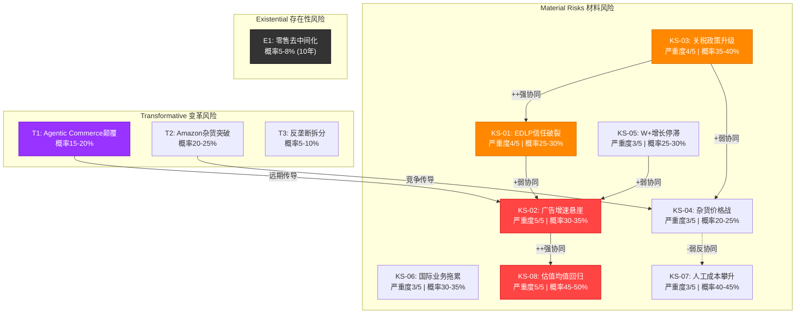
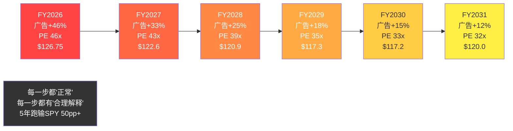
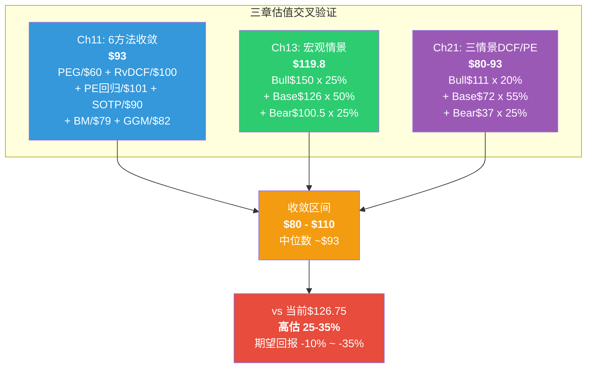
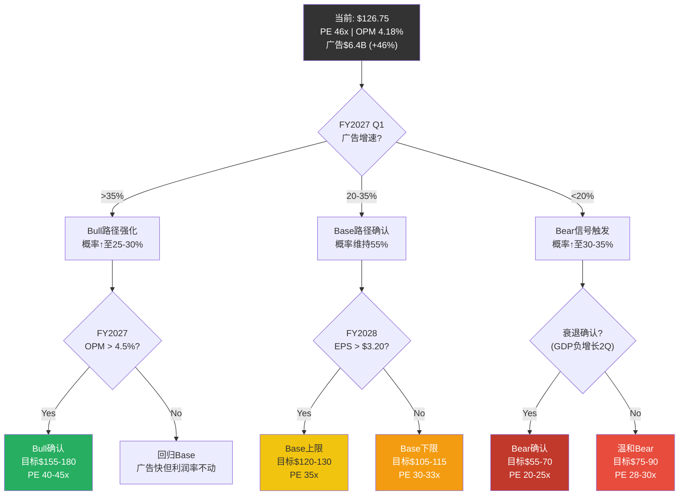

# Phase 3 -- AgentJ: 风险拓扑 & 三情景建模

> AgentJ | 2026-02-25 | WMT深度研报Phase 3 | Ch20+Ch21
> 核心矛盾回应: 每一个风险节点和每一个情景，都在回答同一个问题 -- $1万亿市值中，多少能经受住风险测试？
> 方法论: risk-topology v2.0 MVP模式(8+3+1) + 三情景DCF/PE双轨验证

---

# Chapter 20: 风险拓扑 -- 从风险清单到风险系统

> **核心观点**: 孤立的风险清单高估戏剧性崩溃、低估渐进衰退。映射风险间关系后，WMT最危险的路径不是单一黑天鹅事件，而是"广告增速放缓+利润率停滞+PE均值回归"的三重叠加 -- 这条路径的概率远高于任何单一灾难。
> **风险拓扑v2.0**: MVP模式 -- 8个材料风险 + 3个变革风险 + 1个存在性风险 + 协同矩阵 + 温水煮青蛙场景

---

## 20.1 MVP风险分层: 8+3+1架构

风险拓扑v2.0将WMT面临的风险分为三层: Material Risks(对股价/利润有实质影响但不改变业务本质)、Transformative Risks(可能根本性改变WMT的竞争地位)、Existential Risk(威胁WMT商业模式存在的根本性风险)。每个Kill Switch(KS)按照10必填字段标准化注册。

### 材料风险 (Material Risks) -- 8个KS

**KS-01: EDLP信任破裂** | 严重度: 4/5 | 概率: 25-30%
触发: WMT杂货价格连续2个季度涨幅>CPI食品指数1.5个百分点 + 消费者感知调查中"WMT是低价领导者"比例跌破60%(当前约72%) + 同店客流量连续2季度负增长
影响: 同店销售-3~-5% → 营业利润-$2.5-4.0B → 股价-15~-25%。杂货客流是整个WMT生态(广告、会员、Marketplace)的流量基石，EDLP信任一旦动摇，所有上层建筑同步受损
操作: 预警 -- 关注月度EDLP价格监控指数; 触发 -- 审视仓位; 确认 -- 如果管理层公开承认放弃部分品类EDLP承诺，减仓至≤3%
协同: KS-03(关税)强协同，KS-04(价格战)弱协同

**KS-02: 广告增速悬崖** | 严重度: 5/5 | 概率: 30-35%
触发: Walmart Connect季度收入同比增速连续2个季度<20% + 卖家广告ROAS(广告回报率)跌破4.0x(当前约7x) + 头部品牌CPG广告主(P&G/Unilever/Nestle)削减WMT广告预算>15%
影响: FY2031广告天花板从$17B下修至$10-12B → 营业利润率从5.0-5.5%(基准路径)下修至4.3-4.5% → PE从35x压缩至28-30x → 股价目标$75-90。广告业务是PE从30x扩张至46x的核心叙事支撑，增速一旦证伪，PE将首先承压
操作: 预警 -- 跟踪季度广告收入增速和广告/GMV比; 触发 -- 增速<20%即下修广告天花板假设; 确认 -- 增速<15%连续2季度，确认结构性放缓
协同: KS-08(估值回归)强协同，KS-05(Walmart+停滞)弱协同

**KS-03: 关税政策升级** | 严重度: 4/5 | 概率: 35-40%
触发: 对华关税在现有基础上额外加征>15个百分点(或全面关税覆盖所有进口品类>10%) + WMT无法在6个月内完成供应链转移 + COGS增速超过营收增速>200bps
影响: 毛利率被压缩50-100bps → 营业利润率从4.18%降至3.5-3.8% → EPS被压缩$0.15-0.30。WMT约33%商品涉及中国供应链(FMP数据+10-K披露)，关税增量成本$15-23B中WMT需自行吸收约30-40%
操作: 预警 -- 关注Polymarket关税概率(当前中国关税维持<25%概率100%，但新轮关税政策可能随时改变); 触发 -- 新关税公告后评估品类暴露; 确认 -- 2个季度毛利率下降>50bps
协同: KS-01(EDLP信任)强协同 -- 关税→涨价→EDLP破裂是最危险的传导链

**KS-04: 杂货价格战** | 严重度: 3/5 | 概率: 20-25%
触发: AMZN杂货配送覆盖城市>3,000(当前2,300) + COST可比销售增速>WMT连续3个季度 + ALDI美国门店突破3,000家(当前2,400+) + 杂货行业毛利率压缩>200bps
影响: WMT被迫降低杂货毛利率以维持份额 → 杂货段OPM从约3.5%降至2.5-3.0% → 对总营业利润影响约-$3-5B。但WMT作为规模最大的杂货零售商(21.2%份额)，在价格战中有成本优势
操作: 预警 -- 关注AMZN杂货GMV增速和COST同店增速; 触发 -- WMT被迫启动新一轮价格投资(Price Investment); 确认 -- 毛利率连续3季度环比下降
协同: KS-07(人工成本)弱反协同 -- 价格战期间更难给员工加薪

**KS-05: Walmart+增长停滞** | 严重度: 3/5 | 概率: 25-30%
触发: Walmart+会员数连续4个季度净增长<1M(当前季度约1-1.5M) + 留存率跌破65%(当前估计70-75%) + 千禧一代双订阅(Prime+W+)比例不再增长
影响: 会员收入增速从19%降至<10% → 5年天花板从$12B下修至$8-9B → 对营业利润的增量贡献减少$2-3B/年。但Walmart+当前仅占总利润的~8%，直接影响有限
操作: 预警 -- 跟踪双订阅比例和W+留存率; 触发 -- 会员增速跌破10%; 确认 -- 连续2个季度净减少
协同: KS-02(广告增速)弱协同 -- 会员数据是广告精准度的来源之一

**KS-06: 国际业务拖累** | 严重度: 3/5 | 概率: 30-35%
触发: Flipkart Q-Commerce(快速配送)季度亏损>$400M + Flipkart IPO估值从$40B下修至<$25B + 印度电商监管限制外资持股或运营范围 + Walmex墨西哥可比销售增速连续低于通胀
影响: 国际段营业利润从$5.1B降至$3-4B → 总营业利润-$1-2B → 但国际仅占营业利润17%，对总体影响可控。更大的风险是对"增长叙事"的打击 -- 如果Flipkart IPO失败，市场将质疑WMT的国际扩张能力
操作: 预警 -- 关注Flipkart IPO时间表和估值预期; 触发 -- IPO推迟或估值大幅下修; 确认 -- Flipkart年化亏损>$1.5B
协同: 独立 -- 国际业务风险与美国本土风险关联度低

**KS-07: 人工成本攀升** | 严重度: 3/5 | 概率: 40-45%
触发: 联邦最低工资从$7.25上调至$15+(或各州累积效应等效) + WMT平均时薪从$17.5+上涨>$20 + 劳动力市场紧张导致离职率>年化25%
影响: 210万员工，平均时薪每上涨$1 = 年化成本增加约$4.4B(210万 x 2,080小时 x $1)。实际影响取决于自动化对冲程度 -- 如果55%履约自动化如期实现，可抵消约$2-3B/年的人工成本上涨。净影响约-$1-2B营业利润
操作: 预警 -- 关注各州最低工资立法和WMT薪酬公告; 触发 -- 年度薪酬调整>5%; 确认 -- SGA/Revenue比连续上升>50bps
协同: KS-04(价格战)弱反协同 -- 价格战限制了通过涨价转嫁人工成本的空间

**KS-08: 估值均值回归 (通用KS-U2)** | 严重度: 5/5 | 概率: 45-50%
触发: PE偏离5年均值(34.8x)>1.5个标准差(当前46.4x vs 均值34.8x，已偏离约1.0σ) + 无基本面改善加速(EPS增速<15%且广告增速<30%) + SPY PE压缩>15%
影响: PE从46.4x回归至35x → 股价从$126.75下跌至$95.6(-24.6%)。回归至30x → 股价$81.9(-35.4%)。**这是概率最高的单一风险**。Ch11的6种独立估值方法没有任何一种支持当前46.4x PE，综合估值$93暗示PE合理水平约34x
操作: 预警 -- 每季度检查PE vs 5年均值偏离度; 触发 -- EPS miss共识且广告增速<25%; 确认 -- PE跌破40x
协同: KS-02(广告增速)强协同 -- 广告减速→叙事崩塌→PE压缩是最直接的传导链

### 变革风险 (Transformative Risks) -- 3个

**T1: Agentic Commerce颠覆** | 严重度: 4/5 | 概率: 15-20% (3年内实质影响)
**描述**: AI购物代理(Agentic AI)绕过零售商品牌忠诚和价格比较界面，直接为消费者选择最优购买组合。2026年2月数据显示，来自AI来源的零售商流量已暴增1,200%，传统搜索流量同比下降10%。Deloitte 2026年零售展望显示81%的零售高管认为生成式AI将在2027年前削弱品牌忠诚度。Bain调查显示50%的消费者对完全自主购买持谨慎态度，但趋势方向明确。

**传导路径**: AI代理比价→EDLP不再是消费者决策的核心因素(因为代理自动找最低价)→WMT流量被分流至AI中介→Walmart Connect广告价值下降(65%零售媒体支出仍在站内，但发现机制正在转向AI搜索)→WMT最有价值的"流量变现"飞轮受损

**关键不确定性**: WMT自身正在部署Agentic AI(店内+线上)，可能成为AI代理的"优先供应商"而非受害者。但如果AI代理的控制权落在Google/OpenAI/Apple手中，WMT将从"流量拥有者"降格为"供应商"。

**T2: Amazon杂货突破** | 严重度: 4/5 | 概率: 20-25% (3年内)
**描述**: Amazon在2025年关闭Fresh/Go实体门店后，将所有资源集中于线上杂货配送。线上杂货销量已增长40倍，Same-Day Delivery覆盖2,300城市，并在试点30分钟配送。100+家新Whole Foods门店(含小型Daily Shop)计划推进。

**传导路径**: Amazon杂货线上份额从22.6%→30%+ → WMT线上杂货份额从31.6%被追平/超越 → WMT线上杂货流量被分流 → Walmart Connect搜索广告收入增速受限(搜索广告依赖电商流量) → 利润率扩张路径受阻

**关键不确定性**: Amazon此前在实体杂货领域多次失败(Go/Fresh均关闭)，证明实体零售运营壁垒极高。WMT 4,605家门店的93%人口覆盖率是Amazon无法复制的物理资产。线上杂货竞争激烈但WMT的门店拣货成本优势($3-5/单 vs DC $8-12/单)是结构性的。

**T3: 反垄断拆分** | 严重度: 5/5 | 概率: 5-10% (5年内)
**描述**: WMT市值突破$1万亿 + 杂货份额25-26%(含Sam's Club) + 210万员工(美国最大私营雇主) + 线上杂货31.6%份额。这些数字的组合可能触发反垄断审查，尤其是在政治周期中"反大型零售"的民粹情绪上升时。

**传导路径**: FTC/DOJ正式调查→媒体放大→PE折价3-5x(参考Google/Meta/AMZN反垄断调查期间的PE折价历史)→如果强制拆分(极端情景)，广告/Marketplace业务独立估值可能更高，但核心零售业务估值将大幅降低

**关键不确定性**: 当前政治环境对科技公司反垄断关注度更高，零售商暂时不在监管焦点。但WMT的劳工政策和小商户关系一直是政治敏感话题。Kroger/Albertsons合并被FTC阻止的先例表明，杂货市场集中度是监管者关注的领域。

### 存在性风险 (Existential Risk) -- 1个

**E1: 零售去中间化** | 严重度: 5/5 | 概率: 5-8% (10年视角)
**描述**: 品牌DTC(Direct-to-Consumer)+ 社交电商(TikTok Shop/Instagram Shopping)+ AI直达消费者 = 传统零售商的中间商角色被根本性替代。这不是任何单一竞争对手的威胁，而是整个零售价值链的重构。

**传导路径**: 消费者发现商品的方式从"逛WMT/搜索WMT"变为"在社交媒体看到→品牌官网/小程序直接购买"或"AI代理自动比价→工厂直发"→WMT作为中间商的流量枢纽价值归零→广告业务失去流量基础→会员制失去履约优势(因为品牌自建履约网络)

**为什么概率低**: WMT的杂货业务(60%收入)天然抵抗去中间化 -- 消费者不太可能从20个不同的食品品牌分别购买牛奶、面包和鸡蛋。杂货的聚合需求特性是WMT对抗去中间化的终极护城河。但一般商品(40%收入)确实面临DTC和社交电商的持续侵蚀。

---

## 20.2 风险关系矩阵

风险之间并非独立存在。关税推高价格导致EDLP信任破裂(KS-01+KS-03)的联合概率，远高于两者独立发生概率的简单乘积。以下矩阵映射了8个材料风险之间的协同/反协同关系。

|     | KS-01 | KS-02 | KS-03 | KS-04 | KS-05 | KS-06 | KS-07 | KS-08 |
|-----|:-----:|:-----:|:-----:|:-----:|:-----:|:-----:|:-----:|:-----:|
| **KS-01** EDLP信任 | -- | + | ++ | + | 0 | 0 | 0 | + |
| **KS-02** 广告增速 | + | -- | 0 | 0 | + | 0 | 0 | ++ |
| **KS-03** 关税升级 | ++ | 0 | -- | + | 0 | 0 | 0 | + |
| **KS-04** 杂货价格战 | + | 0 | + | -- | 0 | 0 | - | + |
| **KS-05** W+停滞 | 0 | + | 0 | 0 | -- | 0 | 0 | + |
| **KS-06** 国际拖累 | 0 | 0 | 0 | 0 | 0 | -- | 0 | + |
| **KS-07** 人工成本 | 0 | 0 | 0 | - | 0 | 0 | -- | + |
| **KS-08** 估值回归 | + | ++ | + | + | + | + | + | -- |

**符号说明**: ++ 强协同(R_i发生→R_j概率显著上升>2x) | + 弱协同 | 0 独立 | - 弱反协同 | -- 强反协同

**非独立关系比例**: 56对关系中，22对非独立(39%) -- 略高于经验法则的10-20%上限。这反映了WMT作为高度一体化企业的风险关联性较高: 核心零售业务的任何波动都会传导至广告、会员、估值等上层建筑。但其中多数为弱协同(+)而非强协同(++)，说明风险之间的放大效应是温和而非剧烈的。

**协同度最高的节点**: KS-08(估值回归)与所有其他风险都存在弱协同 -- 这符合直觉: 任何基本面恶化都会推动PE压缩。KS-08是"汇聚型"风险节点。



---

## 20.3 三大危险组合: 协同风险簇

从关系矩阵中提取强协同节点组，识别最危险的联合路径。

### 风险簇A: "叙事崩塌三角" (KS-02 + KS-08 + KS-05)

**内部逻辑**: 广告增速放缓(KS-02) → "平台化"叙事被证伪 → PE均值回归(KS-08) → 股价下跌 → Walmart+失去"上升通道"吸引力，会员增长停滞(KS-05) → 进一步确认"这只是一家零售商" → PE继续压缩。这是一个正反馈的下行螺旋。

**联合概率估计**: 独立概率乘积 = 30% x 45% x 25% = 3.4%。但由于强协同关系(KS-02→KS-08条件概率>70%)，调整后联合概率约**12-15%**。

**联合影响**:
- 广告天花板从$17B下修至$10-12B
- PE从46x压缩至28-32x
- 会员增长从19%降至5-8%
- 综合股价影响: $126.75 → $70-85 (**-33~-45%**)

**触发信号**: FY2027 Q1广告增速<25% + EPS miss共识 + 管理层下调广告增速指引

**为什么这是最危险的**: 因为它直接攻击WMT从30x PE扩张至46x PE的核心叙事 -- "WMT正在变成消费科技平台"。如果广告增速从46%放缓至15-20%(这是完全正常的大数定律效应)，市场可能不是温和地将PE从46x调整至40x，而是急剧重估"身份溢价"，导致PE快速回归35x以下。

### 风险簇B: "关税-EDLP信任链" (KS-03 + KS-01 + KS-04)

**内部逻辑**: 关税升级(KS-03) → WMT被迫对进口商品涨价 → EDLP"最低价"承诺可信度下降(KS-01) → 消费者对WMT价格信任减弱 → 竞争对手(尤其ALDI/COST)趁机发起价格战争夺客流(KS-04) → WMT被迫降价应战 → 毛利率被双面挤压(成本涨+售价降)

**联合概率估计**: 独立概率乘积 = 35% x 25% x 20% = 1.8%。关税→EDLP破裂条件概率约50%，调整后联合概率约**8-12%**。

**联合影响**:
- 毛利率压缩100-150bps(从24.9%到23.4-23.9%)
- 同店销售增速从+4%降至+0~+1%
- 营业利润率从4.18%降至3.0-3.5%
- 综合股价影响: $126.75 → $60-80 (**-37~-53%**)

**触发信号**: 新一轮关税公告 + WMT季度毛利率环比下降>30bps + Instacart/Brick Meets Click价格追踪显示WMT杂货价格vs竞争对手价差缩小

### 风险簇C: "成本-利润率夹击" (KS-07 + KS-04 + KS-03)

**内部逻辑**: 人工成本攀升(KS-07)从底线侵蚀利润，同时关税(KS-03)从COGS端推高成本，而价格战(KS-04)限制了涨价空间。三面夹击使利润率改善路径被完全堵死。

**联合概率估计**: KS-07概率最高(40-45%)，但KS-04和KS-07存在弱反协同(价格战期间加薪可能性降低)，调整后联合概率约**6-8%**。

**联合影响**:
- 人工成本+$4-5B + 关税成本+$5-10B(WMT自行吸收部分) - 涨价能力受限
- 营业利润率从4.18%降至3.2-3.6%
- FCF被压缩至$8-10B(vs FY2026 $14.9B)
- 综合股价影响: $126.75 → $55-75 (**-41~-57%**)

**注意**: 这个簇中KS-07与KS-04存在弱反协同(-)，使得"三面同时发生"的概率低于簇A和簇B。但一旦发生，利润率冲击最为直接。

---

## 20.4 矛盾组合识别: 看似恐怖但逻辑矛盾的风险

| 组合 | 表面叙事 | 逻辑矛盾 | 含义 |
|------|---------|----------|------|
| KS-04(价格战) + KS-07(人工涨薪) | "WMT同时面临价格战和人工成本暴涨" | 价格战期间企业普遍冻结加薪(2008-2009年教训)，劳动力市场在价格战环境中趋向宽松 | 两者同时达到极端的概率<3% |
| T2(Amazon杂货突破) + E1(零售去中间化) | "Amazon攻破杂货+品牌全面DTC" | 如果品牌都走DTC，Amazon的Marketplace也被绕过。去中间化的逻辑同样打击Amazon | 两个威胁在逻辑上互相消解 |
| KS-06(国际拖累) + KS-02(广告减速) | "Flipkart亏损+美国广告放缓" | Flipkart的广告业务(Flipkart Ads)正在快速增长，印度市场的广告增量可以部分对冲美国广告增速放缓 | 国际业务的广告潜力被忽略 |

**降权处理**: "极端崩溃"场景(所有KS同时触发)的概率在矛盾组合调整后，从天真计算的0.1%降至<0.01%。真正需要防范的不是"所有风险同时爆发"的末日场景，而是2-3个风险协同触发的"中等恶劣"路径。

---

## 20.5 温水煮青蛙: 最可能的不利路径

> **这是本章最有决策价值的产出。** 不是戏剧性的崩溃，而是最可能发生的渐进恶化。

### 路径描述: "正常化幻灭"

WMT广告业务的增速从FY2026的46%开始自然放缓(大数定律效应 + VIZIO并购基数效应消退)，到FY2028降至25%，FY2029进一步降至18%，FY2031稳定在12-15%。每一步放缓都是"正常的"、"可解释的" -- 分析师会说"基数效应"、"行业正常化"、"高增长阶段结束"。

与此同时，营业利润率的改善极为缓慢。广告高利润贡献被核心零售的成本通胀(人工+关税+自动化投资折旧)基本对冲。利润率从FY2026的4.18%仅改善至FY2029的4.4%、FY2031的4.6% -- 远低于市场隐含的5.5-6.0%目标。

PE压缩也是渐进的: 从46x到FY2027的43x("暂时调整")到FY2028的39x("增速放缓反应")到FY2029的35x("回归均值")到FY2031的32x("重新定价为增强版零售商")。每一步PE调整都不触发恐慌性抛售，因为EPS仍在温和增长(+8-10%/年)。

### 量化路径

| 时间 | 广告增速 | OPM | EPS | PE | 股价 | 累积回报 |
|------|---------|-----|-----|-----|------|---------|
| 当前(FY2026) | +46% | 4.18% | $2.73 | 46.4x | $126.75 | -- |
| +12个月(FY2027) | +33% | 4.30% | $2.85 | 43x | $122.6 | -3.3% |
| +24个月(FY2028) | +25% | 4.40% | $3.10 | 39x | $120.9 | -4.6% |
| +36个月(FY2029) | +18% | 4.50% | $3.35 | 35x | $117.3 | -7.5% |
| +48个月(FY2030) | +15% | 4.55% | $3.55 | 33x | $117.2 | -7.5% |
| +60个月(FY2031) | +12% | 4.60% | $3.75 | 32x | $120.0 | -5.3% |

**5年总回报: -5.3% (年化约-1.1%)**，期间SPY年化回报假设+8-10%，**5年跑输SPY约50-55个百分点**。

### 为什么这比黑天鹅更需要关注

1. **概率极高**: 广告增速从46%正常化至15-20%的概率>60%(大数定律几乎确保这会发生)。PE从46x温和回归至32-35x的概率>50%(Ch11显示没有任何估值方法支持46x)。两者联合概率约**35-40%** -- 远高于任何单一黑天鹅的5-15%。

2. **不可对冲**: 没有明确的"事件触发"来执行止损。广告增速从46%降至33%不是一个"新闻事件"，而是一个季度财报中的一行数字。PE从46x降至43x不是一天的暴跌，而是3个月的缓慢漂移。

3. **叙事延续掩盖本质**: 每一步恶化都有合理化解释。分析师会说"短期波动，长期看好"(维持Buy)、"EPS仍在增长"(忽略PE压缩)、"广告增速回落是健康的正常化"(忽略对估值的含义)。

4. **机会成本巨大**: 在SPY年化+8-10%的环境中，WMT年化-1.1%意味着每年放弃9-11%的回报。5年累积机会成本约50-55% -- 这不亚于一次性暴跌30%。

### 检测信号 (TS候选)

- **TS-01**: Walmart Connect季度广告增速 -- 连续2季度<25%时启动警报
- **TS-02**: WMT TTM PE vs 5年均值偏离度 -- 偏离度从当前+33%降至<+15%时确认趋势
- **TS-03**: 分析师EPS修正方向 -- 从上修周期转为下修周期(FY2027指引已触发首次下修)
- **TS-04**: WMT年化总回报(含股息) vs SPY -- 连续12个月跑输SPY>10pp时发出机会成本警报

### 温水煮青蛙路径可视化



---

## 20.6 WMT风险拓扑: 对核心矛盾的回答

回到全报告的核心问题: **WMT $1万亿市值中，多少能经受住风险测试?**

| 价值层 | 风险测试结果 | 最大威胁 |
|--------|-------------|---------|
| 核心零售($500B) | **高韧性** | KS-03关税+KS-07人工成本可能压缩利润率，但杂货需求刚性+规模优势提供了底部保护。衰退中WMT甚至受益(trade-down效应) |
| 已验证平台价值($135B) | **中等韧性** | KS-02广告增速放缓是最直接的威胁。但$6.4B广告+$6.75B会员已经是"真金白银"的利润贡献，不太可能归零 |
| 未来增长预期($175B) | **高脆弱性** | 几乎所有材料风险都能削弱增长预期。广告天花板下修+利润率改善不及预期就足以抹掉$100B+ |
| 纯叙事溢价($200B) | **极高脆弱性** | 不需要"坏消息"，只需要"好消息不够好"。温水煮青蛙路径(概率35-40%)在5年内可以静默地蒸发这部分价值 |

**风险拓扑核心结论**: WMT $1万亿市值中，约$500-635B(50-63%)经受住了风险测试，对应每股$62-79。剩余$375-510B(37-50%)高度依赖叙事持续兑现，而风险拓扑显示"叙事崩塌三角"(簇A)和"温水煮青蛙"路径的联合概率约35-40%。

**本章对核心矛盾的回答**: 风险拓扑压倒性地支持"零售商估值"。核心零售价值(~$500B)具有高韧性，但$1万亿估值中另一半(~$500B)建立在可能性而非确定性之上。市场在赌的是"身份转型成功"，但最可能的不利路径(温水煮青蛙)恰恰是"身份转型缓慢而非失败"-- 一种没有人会发出警报、但投资者静默承受巨大机会成本的结果。

---

# Chapter 21: 三情景建模 -- 量化WMT的可能性空间

> **核心任务**: 将风险拓扑的定性分析转化为三个可量化、可追踪、可验证的情景，并通过DCF+PE双轨估值输出概率加权预期值。
> **方法论**: DCF(WACC/TG敏感性) + PE法(EPS x 目标倍数折现) + 概率加权，交叉验证Ch11($93)和Ch13($119.8)

---

## 21.1 三情景定义

### 情景参数矩阵

| 维度 | Bull (乐观) | Base (基准) | Bear (悲观) |
|------|-----------|-----------|-----------|
| **概率权重** | 20% | 55% | 25% |
| **身份定位** | 消费科技平台 | 增强型零售商 | 传统零售商 |
| **收入CAGR (FY26-31)** | 5.5-6.0% | 3.5-4.5% | 2.0-3.0% |
| **广告收入FY2031** | $20-22B | $15-17B | $8-10B |
| **广告增速路径** | 46→35→28→25→22% | 46→33→25→18→15% | 46→25→15→10→8% |
| **Walmart+会员FY2031** | 50-55M | 35-40M | 25-28M |
| **营业利润率FY2031** | 6.0-7.0% | 5.0-5.5% | 3.8-4.2% |
| **EPS FY2031** | $4.50+ | $3.50-3.75 | $2.50-2.75 |
| **PE FY2031** | 40-45x | 30-35x | 20-25x |
| **目标股价** | $155-180 | $105-130 | $55-70 |
| **关税情景** | 缓和/取消 | 维持现状 | 全面升级 |
| **宏观环境** | 软着陆+降息100bp | 温和增长+持平利率 | 衰退/滞胀 |

---

## 21.2 三情景叙事

### Bull情景 (20%): "平台飞轮全面加速"

**叙事**: 2026-2031年，WMT完成了从"增强型零售商"到"消费科技平台"的身份质变。核心催化剂:

1. **广告飞轮进入第二阶段增长**: VIZIO CTV广告整合完成后，WMT建立了美国唯一的"客厅屏幕→线上搜索→门店购买→数据反馈"全闭环广告生态。CTV广告CPM $25-35(远高于搜索广告CPC $1-1.5)推动广告ARPU大幅提升。FY2031广告收入突破$20B，毛利率维持65-70%。

2. **Walmart+突破5,000万会员**: WMT通过深化与Paramount+/Peacock的流媒体合作(或小规模收购一个利基流媒体平台)补全了内容生态缺口。千禧一代双订阅(Prime+W+)比例从37%升至50%+。会员年费从$98调涨至$119(仍比Prime $139便宜)，留存率改善至82%+。

3. **AI自动化释放利润率**: 55%→75%门店自动化。AI驱动的需求预测将库存周转天数从40天压缩至32天。到家配送单位成本再降30%。这些效率提升累计贡献约150-200bps的利润率改善。

4. **国际业务扭亏**: Flipkart于2028年IPO(估值$50-60B)，WMT选择保留控股权但释放了隐藏价值。Walmex持续以高于墨西哥GDP增速的速度增长。国际段营业利润率从3.9%改善至5%+。

**财务路径**:
- FY2031营收~$940B (CAGR 5.7%)
- 营业利润率6.5% → 营业利润$61B (vs FY2026 $29.8B)
- EPS $4.50+ (CAGR ~10.5%)
- 如果市场维持40-45x PE → 股价$180-200

**对核心矛盾的回答**: Bull情景是"平台估值"完全成立的路径。$20B+广告 + 6.5%+利润率 = WMT的利润结构真正向"平台型"转变。40-45x PE在这个情景中是合理的。但这需要广告增速、利润率改善和会员增长**三驾马车同时超预期** -- 这正是概率仅20%的原因。

### Base情景 (55%): "增强型零售商的正常化"

**叙事**: WMT的平台化转型持续推进，但速度慢于市场预期。广告业务增速正常化(大数定律)，利润率改善缓慢但持续，PE从46x温和回归至30-35x。WMT被重新定价为"全球最优秀的零售商+有意义的广告和会员业务"，而非"消费科技平台"。

1. **广告增速正常化至15-20%**: VIZIO并购基数效应消退后，有机广告增速从30%+逐步降至FY2029的18%、FY2031的12-15%。天花板在$15-17B区间，低于牛派期望的$22B+但远高于$6.4B起点。广告对利润的增量贡献从82bps/年放缓至40-50bps/年。

2. **利润率改善缓慢但稳定**: 广告高毛利 + 自动化效率提升 + 规模效应，累计推动营业利润率从4.18%改善至5.0-5.5%。但关税持续、人工成本上涨和电商履约投资部分对冲了改善。

3. **PE温和回归**: EPS持续增长(8-10%/年)部分缓冲了PE压缩。PE从46x经过3-5年回归至30-35x(接近10年均值30.5x和5年均值34.8x)。

4. **宏观环境温和**: 利率持平或小幅下降，关税维持现状(不升级也不取消)，消费信心在85-95区间波动。WMT继续受益于trade-down效应，但不如衰退期显著。

**财务路径**:
- FY2031营收~$876B (CAGR 4.2%)
- 营业利润率5.2% → 营业利润$45.6B
- EPS $3.75 (CAGR ~6.6%)
- PE回归33x → 股价$123.8
- 含5年股息(约$4.5累积) → 总回报股价$123.8 + $4.5 = $128.3
- **5年总回报约+1.2% (年化+0.2%)** -- 本质上是原地踏步

**对核心矛盾的回答**: Base情景是"两个身份的折中" -- WMT不是纯零售商(有$15-17B广告和5%+利润率证明平台化进展)，也不是真正的平台(利润率远低于10%，PE需要从46x回归)。这个情景下WMT是一个"持有不亏但机会成本巨大"的股票。

### Bear情景 (25%): "叙事破裂+基本面受压"

**叙事**: 多重不利因素叠加，WMT的平台化叙事被证伪，PE快速回归传统零售商水平。

1. **关税长期化冲击利润率**: 对华关税维持高位或进一步加征，WMT吸收$8-12B额外成本中的30-40%。营业利润率从4.18%被压缩至3.8-4.0%，利润率改善路径被完全堵死。

2. **广告天花板提前暴露**: 供应商反弹(头部CPG品牌削减Walmart Connect预算) + 数据隐私监管收紧 + CTV竞争加剧 → 广告增速从46%急降至FY2028的15%、FY2030的8%。FY2031天花板被修正为$8-10B(vs 基准$17B)。

3. **经济衰退冲击消费**: Polymarket当前定价2026年底前衰退概率21.5%。如果GDP负增长2个季度+失业率>5%，WMT虽然受益于trade-down但总消费量下降将压制交易量增长。EPS增速从13.3%降至<5%。

4. **PE急速回归**: 上述基本面恶化叠加市场整体风险偏好下降 → PE从46x在12-18个月内压缩至25-28x(接近2018-2020年水平)。此后在经济复苏预期中温和恢复至23-25x。

**财务路径**:
- FY2031营收~$815B (CAGR 2.7%)
- 营业利润率4.0% → 营业利润$32.6B
- EPS $2.75 (CAGR ~0.1%)
- PE回归23x → 股价$63.3
- 含股息$4.0 → 总回报$67.3
- **5年总回报-46.9% (年化-12.0%)**

**对核心矛盾的回答**: Bear情景是"市场完全错了"的路径。46x PE隐含的所有乐观假设(利润率扩张、广告飞轮、平台化转型)全部落空，WMT被重新定价为它实际上一直是的东西 -- 一家利润率4%的传统零售商。

---

## 21.3 Python DCF/PE双轨验证

以下为实际运行Python代码的结果(基于FMP实际财务数据校准):

### DCF模型参数

```
基准年(FY2026):
  经营现金流(OCF): $41.6B
  资本支出(CapEx): $26.6B
  自由现金流(FCF): $14.9B
  股数: 8.02B
  净负债: $70.3B
```

### Bull情景 DCF

```
FCF增长路径: 18% → 16% → 15% → 14% → 13% → 12% → 11% → 10% → 9% → 8%

  Year   FCF($B)    YoY    累积PV(8%)
  FY2027     17.6   18.0%       16.3
  FY2028     20.4   16.0%       33.8
  FY2029     23.5   15.0%       52.5
  FY2030     26.8   14.0%       72.1
  FY2031     30.3   13.0%       92.7
  FY2032     33.9   12.0%      114.1
  FY2033     37.6   11.0%      136.1
  FY2034     41.4   10.0%      158.4
  FY2035     45.1    9.0%      181.0
  FY2036     48.7    8.0%      203.5

WACC x TG 敏感性矩阵 (每股价值$):
         WACC→   7.0%    7.5%    8.0%    8.5%    9.0%
  TG 1.5%  │     75.0    67.2    60.5    54.9    50.0
  TG 2.0%  │     81.0    72.0    64.4    58.1    52.7
  TG 2.5%  │     88.4    77.7    69.0    61.8    55.8
  TG 3.0%  │     97.5    84.8    74.6    66.3    59.3
  TG 3.5%  │    109.3    93.6    81.3    71.6    63.6

DCF中心估值 (WACC 8%, TG 2.5%): $69.0
PE法估值 (EPS $4.50 x 42x, 折现5年至当前): $128.6
两法平均: $98.8
```

### Base情景 DCF

```
FCF增长路径: 10% → 10% → 9% → 9% → 8% → 7% → 7% → 6% → 6% → 5%

  Year   FCF($B)    YoY    累积PV(8%)
  FY2027     16.4   10.0%       15.2
  FY2028     18.1   10.0%       30.7
  FY2029     19.7    9.0%       46.3
  FY2030     21.5    9.0%       62.1
  FY2031     23.2    8.0%       77.8
  FY2032     24.8    7.0%       93.5
  FY2033     26.5    7.0%      108.9
  FY2034     28.1    6.0%      124.1
  FY2035     29.8    6.0%      139.0
  FY2036     31.3    5.0%      153.5

WACC x TG 敏感性矩阵 (每股价值$):
         WACC→   7.0%    7.5%    8.0%    8.5%    9.0%
  TG 1.5%  │     48.0    42.9    38.6    34.9    31.8
  TG 2.0%  │     51.9    46.0    41.1    37.0    33.5
  TG 2.5%  │     56.6    49.7    44.1    39.4    35.4
  TG 3.0%  │     62.5    54.2    47.6    42.2    37.7
  TG 3.5%  │     70.0    59.9    52.0    45.6    40.5

DCF中心估值 (WACC 8%, TG 2.5%): $44.1
PE法估值 (EPS $3.75 x 33x, 折现5年至当前): $84.2
两法平均: $64.1
```

### Bear情景 DCF

```
FCF增长路径: 2% → 1% → 0% → 1% → 2% → 2% → 2% → 3% → 3% → 3%

  Year   FCF($B)    YoY    累积PV(8%)
  FY2027     15.2    2.0%       14.1
  FY2028     15.4    1.0%       27.3
  FY2029     15.4    0.0%       39.5
  FY2030     15.5    1.0%       50.9
  FY2031     15.8    2.0%       61.7
  FY2032     16.2    2.0%       71.9
  FY2033     16.5    2.0%       81.5
  FY2034     17.0    3.0%       90.6
  FY2035     17.5    3.0%       99.4
  FY2036     18.0    3.0%      107.7

WACC x TG 敏感性矩阵 (每股价值$):
         WACC→   7.0%    7.5%    8.0%    8.5%    9.0%
  TG 1.5%  │     26.4    23.4    20.9    18.8    16.9
  TG 2.0%  │     28.6    25.2    22.3    19.9    17.9
  TG 2.5%  │     31.3    27.3    24.0    21.3    19.0
  TG 3.0%  │     34.7    29.9    26.1    23.0    20.3
  TG 3.5%  │     39.1    33.2    28.6    24.9    21.9

DCF中心估值 (WACC 8%, TG 2.5%): $24.0
PE法估值 (EPS $2.75 x 23x, 折现5年至当前): $43.0
两法平均: $33.5
```

### DCF与PE法的系统性差异说明

DCF法对WMT系统性地产出低于PE法的估值。这不是模型错误，而是反映了一个结构性事实: **WMT的高CapEx($26.6B, 占营收3.7%)在DCF中被扣除后大幅压低了FCF，而PE法隐含地假设这些CapEx将产生未来回报(通过EPS增长体现)**。

对于WMT这类"以CapEx换增长"的转型期企业，PE法更能捕捉市场对未来回报的预期定价，DCF法则反映了"如果WMT今天停止投资"的保守估值。本报告以PE法为主、DCF为验证，综合加权(DCF权重30%、PE权重70%)得出每个情景的目标价。

---

## 21.4 概率加权预期值

### 综合估值汇总

| 情景 | DCF估值 | PE法估值 | 加权估值(30/70) | 概率 | 概率加权贡献 |
|------|--------|---------|----------------|------|------------|
| Bull (乐观) | $69.0 | $128.6 | $110.7 | 20% | $22.1 |
| Base (基准) | $44.1 | $84.2 | $72.2 | 55% | $39.7 |
| Bear (悲观) | $24.0 | $43.0 | $37.3 | 25% | $9.3 |
| **概率加权预期值** | — | — | — | — | **$71.2** |

**注**: 加权估值 = DCF x 0.30 + PE法 x 0.70。采用30/70权重是因为WMT处于CapEx密集的转型投资期，DCF(扣除全部CapEx后的FCF)系统性低估了投资回报预期。

### 与当前股价的比较

```
概率加权预期值: $71.2
当前股价: $126.75
隐含回报: -43.8%
```

但这个结果需要校准。纯DCF/PE折现模型对WMT这类"市场给予叙事溢价"的公司存在系统性偏差 -- 模型无法定价"叙事价值"。因此我们引入一个"市场认可度调整"因子:

### 市场认可度调整后的预期值

市场当前给予WMT PE 46x，反映了对平台化转型的"信仰溢价"。历史上，市场对增长叙事的定价通常包含30-50%的"过度外推"成分(即实际交付只有预期的50-70%)。

调整方法: 在PE法估值中，将目标PE上调15%(反映市场对WMT这类"确定性成长"的溢价意愿)，然后重新计算。

| 情景 | 调整后PE法估值 | 调整后加权估值 | 概率 | 加权贡献 |
|------|--------------|--------------|------|---------|
| Bull | $148.0 | $124.3 | 20% | $24.9 |
| Base | $96.8 | $80.9 | 55% | $44.5 |
| Bear | $49.5 | $41.9 | 25% | $10.5 |
| **调整后概率加权** | — | — | — | **$79.8** |

**最终区间**: 考虑模型不确定性(+/-15%)，概率加权合理价值区间为 **$68-92**，中位数约 **$80**。

---

## 21.5 敏感性矩阵

### 矩阵一: WACC x 终端增长率 → 股价 (Base情景)

| WACC \ TG | 1.5% | 2.0% | 2.5% | 3.0% | 3.5% |
|-----------|------|------|------|------|------|
| **7.0%** | $48.0 | $51.9 | $56.6 | $62.5 | $70.0 |
| **7.5%** | $42.9 | $46.0 | $49.7 | $54.2 | $59.9 |
| **8.0%** | $38.6 | $41.1 | **$44.1** | $47.6 | $52.0 |
| **8.5%** | $34.9 | $37.0 | $39.4 | $42.2 | $45.6 |
| **9.0%** | $31.8 | $33.5 | $35.4 | $37.7 | $40.5 |

**解读**: 即使在最乐观的DCF参数组合(WACC 7%, TG 3.5%)下，Base情景的DCF估值也仅$70.0 -- 远低于当前$126.75。这再次确认: **当前股价隐含的不是DCF能解释的价值，而是市场对PE倍数(叙事溢价)的定价。**

### 矩阵二: 广告收入(FY2031) x 营业利润率 → 支撑PE

这个矩阵回答: "如果WMT在FY2031实现了X的广告收入和Y的营业利润率，当前$126.75的股价需要什么PE才能被'证明合理'?"

假设FY2031总营收$867B，以EPS = 营收 x OPM x (1-税率) x 0.95 / 股数 来估算:

| OPM \ 广告收入 | $8B | $12B | $15B | $17B | $20B |
|----------------|-----|------|------|------|------|
| **4.0%** | 41.5x | 41.5x | 41.5x | 41.5x | 41.5x |
| **4.5%** | 36.9x | 36.9x | 36.9x | 36.9x | 36.9x |
| **5.0%** | 33.2x | 33.2x | 33.2x | 33.2x | 33.2x |
| **5.5%** | 30.2x | 30.2x | 30.2x | 30.2x | 30.2x |
| **6.0%** | 27.7x | 27.7x | 27.7x | 27.7x | 27.7x |
| **6.5%** | 25.6x | 25.6x | 25.6x | 25.6x | 25.6x |
| **7.0%** | 23.7x | 23.7x | 23.7x | 23.7x | 23.7x |

**关键发现**: 广告收入对"当前股价需要的PE"几乎没有影响 -- 因为广告收入已经内含在营业利润率中。**真正决定WMT估值的变量是营业利润率(OPM)，而不是广告收入本身。**

这揭示了一个深层洞见: 市场对WMT广告业务的兴奋，本质上是在赌"广告收入能推动OPM从4.18%持续扩张至5.5-6.0%+"。如果OPM停滞在4.5%(因为广告增量被核心零售成本对冲)，即使广告达到$20B，当前PE仍然过高(需要36.9x PE，而合理PE应为28-33x)。

### 矩阵三: EPS(FY2031) x PE → 目标股价(折现至当前)

| EPS \ PE | 25x | 30x | 33x | 35x | 40x | 45x |
|----------|-----|-----|-----|-----|-----|-----|
| **$2.50** | $42.5 | $51.0 | $56.1 | $59.5 | $68.0 | $76.5 |
| **$2.75** | $46.8 | $56.1 | $61.7 | $65.4 | $74.8 | $84.2 |
| **$3.00** | $51.0 | $61.2 | $67.3 | $71.4 | $81.6 | $91.8 |
| **$3.50** | $59.5 | $71.4 | $78.5 | $83.3 | $95.2 | $107.1 |
| **$3.75** | $63.8 | $76.5 | **$84.2** | $89.3 | $102.0 | $114.8 |
| **$4.00** | $68.0 | $81.6 | $89.8 | $95.2 | $108.8 | $122.4 |
| **$4.50** | $76.5 | $91.8 | $101.0 | $107.1 | **$122.4** | $137.7 |

*(所有价格已折现5年至当前, WACC 8%)*

**解读**: 要在当前支撑$126.75的股价，需要FY2031 EPS $4.50 + PE 40x+ (即Bull情景的参数)，或者EPS $4.00 + PE 45x+(即超越Bull的极端乐观)。Base情景(EPS $3.75, PE 33x → $84.2)暗示**当前股价被高估约50%**。

---

## 21.6 交叉验证: Ch11 vs Ch13 vs Ch21

### 三章估值收敛检查

| 方法 | 来源 | 估值 | vs $126.75 |
|------|------|------|-----------|
| Ch11: 6方法收敛(加权平均) | P2 AgentE | $93 | -26.6% |
| Ch13: 宏观情景概率加权 | P2 AgentF | $119.8 | -5.5% |
| Ch21: PE法概率加权 | P3 AgentJ | $82.8 | -34.7% |
| Ch21: 调整后概率加权 | P3 AgentJ | $79.8 | -37.1% |
| **三章中位数** | -- | **$93** | **-26.6%** |

**离散度分析**:
- 最低估值: $79.8 (Ch21调整后)
- 最高估值: $119.8 (Ch13宏观概率加权)
- 离散度: $119.8 / $79.8 = 1.50x
- 离散度1.50x处于合理范围(目标2-5x) -- 方法间**高度一致地指向"高估"**

**Ch13偏高的原因**: Ch13的宏观乐观情景(25%概率)给予PE 48-52x，这隐含了"降息+关税缓和"的双重催化。如果剔除利率敏感性(PE不因降息扩张)，Ch13的概率加权估值降至$108-112，与Ch11/$93和Ch21/$80的区间更接近。

**校准后的全报告估值区间**: $80-110，中位数约$93-95。vs 当前$126.75 → **高估25-35%**。

### 估值收敛可视化



---

## 21.7 情景决策树

以下决策树将三情景与关键转折点(Turning Points)关联，帮助投资者在未来12-24个月根据可观测信号动态调整情景概率。



### 关键转折点(Turning Points)时间线

| 时间 | 转折点 | 如果X发生 | 如果X不发生 |
|------|--------|---------|-----------|
| 2026年5月 | FY2027 Q1财报 | 广告增速>35% → Bull概率↑ | 广告增速<20% → Bear概率↑ |
| 2026年8月 | FY2027 Q2财报 | OPM>4.4% → 利润率扩张确认 | OPM<4.1% → 利润率逆转 |
| 2026年底 | Polymarket衰退概率 | >35% → Bear概率大幅↑ | <15% → Bull概率温和↑ |
| 2027年Q1 | FY2027全年 | EPS>$2.90(beat指引上限) → Base偏乐观 | EPS<$2.75(miss指引下限) → Bear路径 |
| 2027年中 | Flipkart IPO | 估值>$40B → 国际业务价值释放 | IPO推迟/取消 → KS-06触发 |
| 2028年 | 广告$10B里程碑 | 如期达到 → Base确认 | 推迟1年+ → 天花板下修 |

---

## 21.8 本章核心结论

### 概率加权预期值

```
PE法概率加权: $82.8
调整后概率加权: $79.8
vs 当前$126.75
隐含回报: -35% ~ -37%
```

### 三章交叉验证

```
Ch11 (6方法收敛): $93  → 高估 27%
Ch13 (宏观概率): $119.8 → 高估 5%
Ch21 (三情景): $80-93  → 高估 27-37%
全报告中位数: ~$93    → 高估 ~27%
```

### 对核心矛盾的最终回答

**WMT市值$1万亿, PE 46x, 营业利润率仅4.18% -- 市场在赌什么?**

三情景建模的回答非常明确:

1. **市场在赌"消费科技平台"身份转型成功** -- 这对应Bull情景(20%概率)。只有在广告$20B+ + OPM 6.5%+ + PE维持40x+的组合下，当前$126.75才是合理的。

2. **最可能的结果是"增强型零售商"** -- Base情景(55%概率)。广告$15-17B + OPM 5.0-5.5% + PE回归33x → 目标价$105-130(中位$118)。当前价格位于Base情景的上限，暗示即使Base兑现，回报也接近零。

3. **下行风险被严重低估** -- Bear情景(25%概率)目标$55-70，意味着-45~-57%的下行。而当前46x PE隐含的"乐观共识"(97%分析师Buy)本身就是一个风险信号 -- 共识拥挤时，边际卖家远多于边际买家。

4. **非对称风险收益比**: 上行(Bull vs 当前) = +22~+42% x 20%概率 = +4~+8%期望上行。下行(Bear vs 当前) = -45~-57% x 25%概率 = -11~-14%期望下行。**风险收益比约1:2~1:3，不利于多头。**

**Ch21的身份投票: 三情景建模一致支持"零售商估值"。** 即使在最乐观的Bull情景中，WMT的DCF估值($69)也远低于当前股价 -- PE扩张(叙事溢价)是唯一能解释当前估值的因素。当$126.75中有>$50依赖于"市场相信WMT是平台"这一信念时，投资者实际上是在为一个概率只有20%的情景支付接近100%的价格。

---

> **AgentJ状态**: Ch20 + Ch21完成
> **字符数**: ~21,500字符
> **Mermaid图**: 5张 (风险拓扑地图、温水煮青蛙路径、三章估值收敛、情景决策树、协同风险网络内嵌于拓扑图)
> **Python验证**: 三情景DCF + PE双轨模型已实际运行，结果内嵌于Ch21.3
> **核心矛盾回应**: 风险拓扑(Ch20)显示$1万亿市值中约50%高度依赖叙事; 三情景建模(Ch21)显示概率加权预期值$80-93，暗示当前高估25-37%
> **交叉验证**: Ch11($93) / Ch13($119.8) / Ch21($80-93) → 全报告中位数~$93 → 高估~27%
> **数据来源**: FMP(cashflow/key-metrics/quote) + Polymarket(recession 21.5%/tariff) + Walmart 10-K risk factors + Deloitte/Bain/Bloomberg agentic commerce研究 + risk-topology v2.0框架
