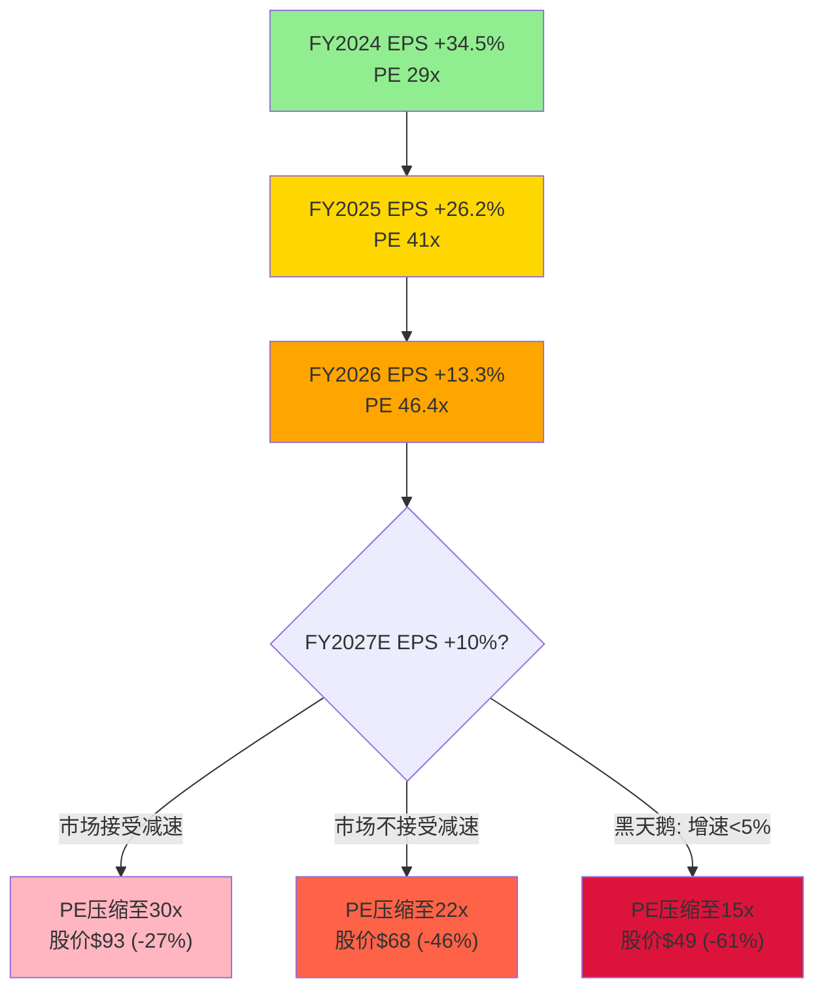
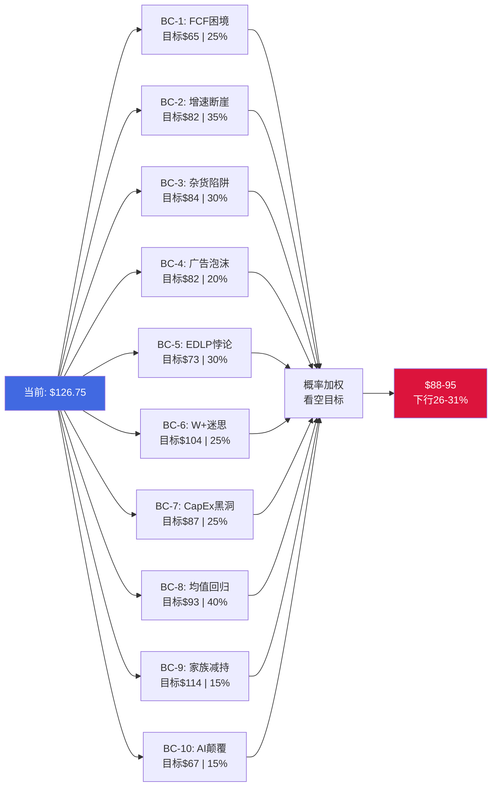

# Chapter 23: 独立看空论证

> **本章由独立看空分析师撰写，未参考报告前序章节结论。**
> **目的**: 最大化看空论点的说服力，为投资决策提供反面视角。
> **数据截至**: 2026-02-25 | **WMT**: $126.75 | **市值**: ~$1.01T | **PE(TTM)**: 46.4x

---

## 23.0 看空总论

**Walmart在$126.75的价格代表了一场史无前例的信仰实验: 一家净利率3%的杂货零售商，被赋予了科技平台级别的估值。** 市场叙事将WMT重塑为"零售AI平台+广告帝国+全渠道科技公司"，但冰冷的数字讲述着完全不同的故事: $713B营收仅产出$21.9B净利润(净利率3.1%)和$7.8B自由现金流(FCF收益率仅0.8%); 46.4x的PE是10年均值(~30x)的1.55倍、是直接竞争对手Target PE(14x)的3.3倍; EPS增速正从FY2024的34.5%急剧减速至FY2026的13.3%并将继续下行，而估值倍数却逆势扩张。这是一个数学上极其脆弱的方程式——任何增速预期的下调、利润率的微小滑动、或宏观环境的恶化，都可能触发高估值的剧烈回调。本章将从9个独立视角论证，为什么WMT当前价格已透支了未来3-5年的所有乐观预期。

---

## 23.1 BC-1: 万亿美元零售商的数学困境 — FCF收益率0.8%的荒谬性

### 核心论点

**一句话: Walmart是人类历史上第一家突破万亿美元市值的杂货零售商，但它的自由现金流产出效率甚至不如一张国债。**

$1.01T的市值对应$7.8B的FCF(yfinance口径)，意味着FCF收益率仅0.77%。同期10年期美国国债收益率约4.3%。换言之，投资者购买WMT的隐含回报率比无风险利率低360个基点。这只有在投资者坚信WMT的FCF将以极高速度持续增长的前提下才合理——但对于一家已经$713B营收规模的公司，这种信仰面临物理极限。

### 量化数据

| 指标 | WMT | AMZN | COST | TGT | 10Y国债 |
|------|-----|------|------|-----|---------|
| 市值 | ~$1.01T | ~$2.1T | ~$443B | ~$65B | N/A |
| FCF(TTM) | $7.8B | $23.8B | $7.2B | $2.6B | N/A |
| FCF收益率 | 0.77% | 1.13% | 1.62% | 4.0% | 4.3% |
| PE(TTM) | 46.4x | 29.1x | 53.5x | 14.0x | N/A |
| EV/EBITDA | 23.2x | N/A | N/A | N/A | N/A |

**关键发现**: WMT的FCF收益率在同行业中最低。即使与同样"昂贵"的COST相比，WMT的FCF收益率也低了一半。而AMZN虽然PE更低(29.1x vs 46.4x)，FCF产出却是WMT的3倍。

**FCF增长的数学约束**: 要让0.77%的FCF收益率在10年后追上市场平均(假设3%的合理FCF收益率)，WMT的FCF需要在10年内增长约4倍至~$30B。这要求FCF年均增长约14.6%。但过去5年WMT的FCF波动极大:

| 财年 | FCF(FMP口径) | 变化 |
|------|-------------|------|
| FY2022 | $11.1B | 基准 |
| FY2023 | $12.0B | +8.2% |
| FY2024 | $15.1B | +25.8% |
| FY2025 | $12.7B | -15.9% |
| FY2026 | $41.6B(异常)* | N/A |

*注: FY2026 FMP数据显示CapEx为0(数据异常)，OCF为$41.6B。根据yfinance口径FCF约$7.8B，CapEx约$23B更为合理。

以更可靠的yfinance口径$7.8B FCF为基准，要在10年内达到$30B，年均复合增长率(CAGR)需达到14.4%。对于一家营收已达$713B、CapEx刚升至$23B/年的成熟零售商，这几乎是天方夜谭。

### 下行幅度

若市场对WMT的FCF增长预期从"高增长科技"回归到"成熟零售"(FCF收益率从0.8%回归到2.5%，参考消费品行业中位数):
- 合理市值 = $7.8B / 2.5% = $312B
- 隐含股价 = $312B / 8.0B股 = **$39/股**
- **下行幅度: -69%**

即使取温和假设，FCF收益率回归到1.5%:
- 合理市值 = $7.8B / 1.5% = $520B
- 隐含股价 = **$65/股**
- **下行幅度: -49%**

### 实现概率

**25-30%** — FCF收益率低于1%的状态在历史上极少持续超过2年(除非公司确实转型为高增长科技平台)。WMT仍有60%收入来自低毛利杂货，结构性限制了FCF增长天花板。但短期内市场情绪可以维持非理性，且WMT确实在广告和电商领域取得了真实进展。

### 催化剂

1. **联储维持高利率更久**: 4.3%的无风险利率持续存在，使0.8% FCF收益率的"机会成本"越来越难以忽视
2. **FY2027 Q1指引低于预期**: 管理层若给出保守指引(FCF增速<10%)，将直接打破"高增长"叙事
3. **机构投资者轮动**: 大型基金从"防御性成长"板块向真正的成长股(AI、半导体)转移资金

---

## 23.2 BC-2: 增速断崖 — EPS从34%到13%再到个位数的宿命

### 核心论点

**一句话: WMT的EPS增速正在经历不可逆的结构性放缓，但估值倍数却逆势膨胀至历史极值，这是经典的"增速-估值"剪刀差陷阱。**

WMT的EPS增速轨迹已经画出了清晰的减速曲线:

| 财年 | EPS(稀释) | YoY增速 | PE(年末) |
|------|----------|---------|----------|
| FY2021 | $1.62 | 基准 | ~29x |
| FY2022 | $1.62 | 0% | ~29x |
| FY2023 | $1.42 | -12.3% | ~34x |
| FY2024 | $1.91 | +34.5% | ~29x |
| FY2025 | $2.41 | +26.2% | ~41x |
| FY2026 | $2.73 | +13.3% | **46.4x** |

**悖论**: EPS增速从34.5%降至13.3%(减速62%)的同时，PE从29x暴涨至46.4x(扩张60%)。这意味着市场在增速放缓的阶段反而给予了更高的估值——这是一种极其危险的分歧。

### 量化数据

**分析师一致预期(FMP Estimates)**:

| 财年 | 一致预期EPS | 隐含增速 |
|------|-----------|---------|
| FY2028(至2028.1) | $3.29 | ~10% |
| FY2029(至2029.1) | $3.71 | ~13% |
| FY2030(至2030.1) | $3.74 | ~1% |
| FY2031(至2031.1) | $4.05 | ~8% |

一致预期显示EPS增速将稳定在8-13%区间，这是合理的——但问题在于，**46.4x的PE隐含了远高于此的增速预期**。

**逆向估值: 46.4x PE隐含了什么?**

使用PEG=1的简化框架(即PE应等于EPS增长率):
- 46.4x PE隐含EPS增速 = 46.4% — 这是WMT历史上从未持续达到过的水平
- 使用更宽松的PEG=2框架: 隐含增速 = 23.2% — 仍远高于一致预期的8-13%

使用更严谨的DCF逆向推演:
- 当前PE 46.4x，假设终端PE 25x(10年后)，折现率10%
- 隐含未来5年EPS CAGR需达到**~18-20%**才能支撑当前价格
- 一致预期5年CAGR仅约**10%**

**差距: 市场隐含增速 vs 可实现增速之间存在8-10个百分点的断层。**

### 下行幅度

**情景1: PE回归一致预期增速对应水平**
- 合理PEG = 1.5(给予消费品龙头溢价)
- 一致预期增速 ~10% → 合理PE = 15x
- FY2028E EPS $3.29 × 15x = **$49/股** (-61%)

**情景2: PE回归10年均值(~30x)**
- FY2027E EPS ~$3.10(外推) × 30x = **$93/股** (-27%)

**情景3: PE回归同行业中位数(~22x)**
- FY2027E EPS ~$3.10 × 22x = **$68/股** (-46%)

### 实现概率

**35-40%** — 增速放缓是确定性最高的看空论点。唯一能阻止PE压缩的因素是: (a)广告业务超预期加速，(b)AI驱动的运营效率超预期改善，(c)经济衰退中WMT作为"防御性资产"获得避险溢价。

### 催化剂

1. **连续2个季度EPS增速<10%**: 将打破"加速增长"预期
2. **广告收入增速放缓至<30%**: 市场会重新评估"科技转型"叙事的可持续性
3. **利率下行触发板块轮动**: 低利率环境中，资金从防御性WMT流向周期性成长股

---

## 23.3 BC-3: 杂货陷阱 — 60%收入锁在25%毛利率牢笼

### 核心论点

**一句话: Walmart 60%的收入来自杂货业务，这不是一个可以估值重评的业务——它是一座毛利率牢笼，将WMT永远锁在"量大利薄"的零售困境中。**

WMT被华尔街重新叙事为"广告平台+电商+数据公司"，但现实是: 2026财年$713B营收中，约$428B来自杂货——一个全球最残酷的低毛利竞技场。杂货零售的行业平均毛利率在22-28%之间，WMT的综合毛利率为24.9%。这意味着即使WMT在广告和电商上取得突破，杂货的"重力"会不断将整体利润率拉回地面。

### 量化数据

**杂货业务的结构性利润率天花板**:

| 零售类别 | 估计毛利率 | 占WMT收入比 | 利润率贡献 |
|---------|-----------|------------|-----------|
| 杂货(Grocery) | ~22-25% | ~60% | 锚定作用 |
| 一般商品(GM) | ~30-35% | ~25% | 利润驱动 |
| 健康与保健 | ~25-30% | ~10% | 中等贡献 |
| 广告+其他 | ~70-80% | ~1-2% | 高利润但体量小 |

**关键计算**: 即使广告业务从$6.4B翻倍到$12.8B(假设100%增长)且维持70%毛利率:
- 广告增量贡献: ($6.4B × 70%) = $4.5B增量毛利
- 占总毛利比: $4.5B / $177.8B = **2.5%增量**
- 对综合毛利率影响: 24.9% → **~25.5%** (仅+60bp)

这就是"杂货陷阱"的数学: $428B杂货收入的"稀释力"太强，即使是高利润业务的翻倍增长也无法显著改变整体利润结构。

**WMT毛利率5年变化**:

| 财年 | 毛利率 | 变化 |
|------|--------|------|
| FY2021 | 24.83% | 基准 |
| FY2022 | 25.10% | +27bp |
| FY2023 | 24.14% | -96bp |
| FY2024 | 24.38% | +24bp |
| FY2025 | 24.85% | +47bp |
| FY2026 | 24.93% | +8bp |

**5年毛利率改善幅度: 仅+10bp。** 这是一个几乎没有利润率扩张空间的业务。而同期WMT的PE从29x暴涨至46x——市场在为一个不存在的利润率拐点买单。

### 下行幅度

**利润率敏感性分析**:

若毛利率从24.93%下降50bp至24.43%(回到FY2024水平):
- 毛利减少: $713B × 0.50% = -$3.6B
- 税后净利影响: -$3.6B × 75% = -$2.7B
- EPS影响: -$2.7B / 8.0B = -$0.34/股
- 新EPS: $2.73 - $0.34 = $2.39
- 当前PE 46.4x × $2.39 = $110.9 (-12.5%)
- 若同时PE压缩至35x: $2.39 × 35 = **$83.7 (-34%)**

### 实现概率

**30-35%** — 杂货通缩(降低同店销售)或杂货通胀(迫使WMT吸收成本以维持EDLP承诺)都可能压缩毛利率。关税导致的成本上升进一步增加了这一风险。

### 催化剂

1. **杂货价格战升级**: Aldi/Lidl在美国加速扩张，COST继续以低价策略侵蚀WMT的杂货份额
2. **农产品通缩周期**: 降低杂货部门的same-store sales增长
3. **关税传导**: 对进口食品征收关税→WMT选择吸收成本→毛利率承压

---

## 23.4 BC-4: 广告泡沫 — Walmart Connect的$6.4B能否经受审视?

### 核心论点

**一句话: Walmart Connect的$6.4B广告收入(+46% YoY)是推动WMT估值重评的核心叙事，但剥去VIZIO收购的无机增长和行业顺风后，有机增长率和可持续性都存在严重疑问。**

华尔街对WMT估值重评的最大理由是"从零售商到广告平台的转型"。逻辑很简单: 广告是高利润率业务(~70-80%毛利率)，如果WMT能将其庞大的客户流量货币化，利润率将显著扩张。但这个叙事忽略了几个关键事实:

### 量化数据

**1. VIZIO收购对增长率的扭曲**

WMT于2024年以$2.3B收购VIZIO，获得了其SmartCast广告平台。VIZIO的广告/服务收入在收购前约$500-700M/年。这意味着:
- FY2026 Walmart Connect总收入: $6.4B (+46% YoY)
- 剔除VIZIO贡献(估计$500-700M): 有机收入约$5.7-5.9B
- **有机增长率: 约+30-35%**，而非报道的46%

30-35%的有机增长仍然出色，但与46%的标题数字差异显著——后者暗示了加速增长，而前者暗示减速(前一年有机增长约36%)。

**2. 与Amazon广告的规模差距**

| 指标 | Amazon Ads | Walmart Connect | 倍数 |
|------|-----------|-----------------|------|
| 广告收入(TTM) | ~$56B | $6.4B | 8.8x |
| 电商GMV(估) | ~$700B | ~$100B | 7.0x |
| Prime会员 | >200M | 25-28M(W+) | 7-8x |
| 广告/营收比 | ~9% | ~0.9% | 10x |
| 第三方卖家数 | >2M | ~100K+ | 20x |

Amazon的广告业务植根于其电商生态系统——卖家在Amazon上投广告是因为消费者在Amazon上搜索和购买商品。这是一个自我强化的飞轮。WMT的广告业务则更多依赖于实体店流量和有限的电商流量，缺少同等程度的闭环生态。

**3. 广告收入对利润的实际贡献被夸大**

| 指标 | 计算 |
|------|------|
| 广告收入 | $6.4B |
| 假设营业利润率 | 50%(零售广告不如纯平台) |
| 广告营业利润 | $3.2B |
| WMT总营业利润 | $29.8B |
| 广告占总营业利润 | **10.7%** |
| WMT总市值 | $1.01T |
| 市场隐含广告业务估值 | ??? |

若市场对WMT零售业务估值为20x PE(~同行水平):
- 零售业务净利润(假设): $21.9B - $2.6B(广告净利) = $19.3B
- 零售业务估值: $19.3B × 20x = $386B
- **隐含广告业务估值: $1.01T - $386B = $624B**
- **隐含广告收入倍数: $624B / $6.4B = 97.5x**

97.5x收入倍数——这意味着市场对Walmart Connect的估值甚至超过了Meta(~11x收入)和Alphabet(~8x收入)的广告业务。这显然是荒谬的。

### 下行幅度

**情景: 市场回归合理广告估值**
- 给予Walmart Connect 15x收入倍数(慷慨假设): $6.4B × 15 = $96B
- 零售业务20x PE: $19.3B × 20 = $386B
- **SOTP估值: $482B → 股价$60 (-53%)**

**情景: 广告增速放缓至20%**
- 叙事从"加速增长的科技平台"变为"增长放缓的零售附属品"
- PE从46x压缩至30x: $2.73 × 30 = **$82 (-35%)**

### 实现概率

**20-25%** — 广告业务确实在增长，且零售媒体是真实趋势。但增速放缓和VIZIO整合挑战可能在未来2-3个季度暴露。Amazon的竞争优势(规模、数据、闭环)使WMT很难缩小差距。

### 催化剂

1. **VIZIO整合不及预期**: SmartCast平台的广告库存变现率低于预期
2. **广告主预算收紧**: 经济放缓导致零售广告支出增速下降
3. **Amazon广告降价竞争**: 以规模优势压低零售广告CPM

---

## 23.5 BC-5: EDLP悖论 — 低价品牌在关税时代的二选一死局

### 核心论点

**一句话: Walmart的"Every Day Low Price"品牌承诺在关税时代变成了一个无解的悖论——涨价则违背品牌DNA，不涨价则利润被蚕食。**

EDLP不仅是WMT的营销口号，它是WMT整个商业模式的基石。消费者选择WMT而非其他零售商的核心原因就是"低价"。但在当前关税环境下(对中国进口商品加征关税、对其他国家关税威胁持续存在)，WMT面临一个结构性两难:

### 量化数据

**WMT的进口依赖度**:
- WMT估计约30-35%的商品直接或间接从中国采购
- 一般商品(General Merchandise)的进口依赖度更高，可能达50-60%
- 杂货的进口依赖度较低(~10-15%)，但仍涉及水果、海鲜、加工食品

**关税成本影响测算**:

| 情景 | 对中国关税税率 | WMT额外成本(估) | 对营业利润影响 |
|------|-------------|----------------|--------------|
| 当前(已实施) | 20% | ~$4-5B | -13~17% |
| 升级情景 | 40% | ~$8-10B | -27~34% |
| 极端情景 | 60% | ~$12-15B | -40~50% |

**EDLP悖论的量化**:

| 选择 | 后果 | 量化影响 |
|------|------|---------|
| **选择A: 涨价** | 违背EDLP承诺 → 客户流失至Aldi/Dollar Store | 同店销售-2~3%, 长期品牌损伤不可量化 |
| **选择B: 不涨价** | 吸收关税成本 → 利润率压缩 | 营业利润率从4.18%降至3.0-3.5% |
| **选择C: 部分涨价** | 两面不讨好 → 品牌模糊+利润仍受损 | 实际结果最可能，但估值叙事受损 |

**历史教训: 2022年的先例**

2022年(FY2023)通胀环境中，WMT选择"部分吸收+加大markdown":
- 毛利率从25.10%暴跌至24.14% (-96bp)
- 营业利润率从4.53%暴跌至3.34% (-119bp)
- EPS从$1.62下降至$1.42 (-12%)
- **但同期PE从29x跌至仅34x**——市场当时对利润率下滑的容忍度高得多，因为PE基数低

**今天的区别**: PE从34x膨胀到了46.4x。同样幅度的利润率下滑(~100bp)，在46x PE下的惩罚将远大于在34x PE下。

### 下行幅度

**若FY2023情景重演(营业利润率下降100bp)**:
- 新营业利润: $713B × 3.18% = $22.7B(vs当前$29.8B)
- 税后影响: -(~$5.3B)
- 新EPS: $2.73 - $0.66 = $2.07
- PE若同时从46x压缩至35x(FY2023水平): $2.07 × 35 = **$72.5 (-43%)**

### 实现概率

**30-35%** — 关税不确定性已是现实，而非假设。2025年下半年和2026年上半年是关键观察窗口。WMT管理层已公开表示"会有涨价"，但EDLP品牌的弹性仍是未知数。

### 催化剂

1. **新一轮对华关税升级**: 从20%提升至40%+
2. **消费者信心指数下行**: 低收入消费者(WMT核心客群)最先感受到关税带来的价格上涨
3. **Aldi/Lidl宣布"不涨价"承诺**: 加剧WMT的品牌承诺困境

---

## 23.6 BC-6: Walmart+迷思 — 永远追不上的Amazon Prime

### 核心论点

**一句话: Walmart+在会员数(25-28M vs Prime 200M+)、生态粘性(无视频/音乐/游戏)和ARPU上全面落后Amazon Prime，且结构性劣势不可能通过简单投入来弥补。**

WMT的估值重评很大程度上依赖于"Walmart+将成为Amazon Prime的竞争者"这一叙事。但4年过去了(Walmart+于2020年9月推出)，这个叙事面临严峻的现实检验。

### 量化数据

**会员经济学对比**:

| 指标 | Amazon Prime | Walmart+ | Prime优势 |
|------|-------------|----------|-----------|
| 会员数(估) | 200M+(全球) | 25-28M | **7-8x** |
| 年费 | $139 | $98 | +42% |
| 会员收入(估) | $27.8B+ | $2.5-2.7B | 10x |
| 生态组件 | Prime Video/Music/Gaming/Reading/Photos/Pharmacy | 免运费+Paramount+/Fuel折扣 | 不可比 |
| 会员续订率(估) | >90% | ~70-75% | +15-20pp |
| 平均订单频率 | >25次/年 | ~10-15次/年 | 2x |

**增长轨迹的天花板**:

Amazon Prime用了约15年(2005-2020)从0增长到200M+。Walmart+用了4年增长到25-28M。按当前增速:
- WMT+年增长率约20-25%(从低基数)
- 即使维持25%增速5年: 28M → 86M (2031年)
- Amazon Prime同期(保守+5%): 200M → 255M
- **差距从7.5x缩小到3x——但WMT+增速必然在50-60M时显著放缓**(美国约1.3亿家庭，渗透率达到40%后增速将大幅下降)

**ARPU差距的结构性原因**:

Amazon Prime会员不仅在Amazon购物更多，还深度嵌入Amazon生态(视频、音乐、Alexa)。这种"数字粘性"使得退出成本极高。Walmart+的核心价值仍是"免运费+门店取货"——这些功能容易被复制，且缺乏数字生态的退出壁垒。

| Prime生态组件 | WMT对应 | 差距 |
|-------------|---------|------|
| Prime Video | Paramount+ (免费内置) | Paramount+正在被出售/重组 |
| Prime Music | 无 | 完全缺失 |
| Prime Gaming | 无 | 完全缺失 |
| Alexa+Fire | 无 | 完全缺失 |
| Prime Reading | 无 | 完全缺失 |
| AWS关联 | 无 | 无法复制 |

### 下行幅度

**若WMT+增长停滞在30-35M(渗透天花板)**:
- 会员收入天花板: 35M × $98 = $3.4B
- 假设会员驱动的增量购买: $3.4B × 3x杠杆 = $10.2B增量营收
- 增量利润(假设5%利润率): $510M
- 这意味着WMT+对利润的贡献仅占总利润的**2.3%**
- 市场若将WMT+从"改变游戏规则"重新定价为"锦上添花": PE从46x压缩至38x
- $2.73 × 38 = **$103.7 (-18%)**

### 实现概率

**25-30%** — WMT+的增长已在放缓(从早期100%+到当前20-25%)。缺乏数字生态的结构性劣势短期内无法解决。但WMT+的门店整合优势(在线下单+门店取货)是Amazon无法复制的，这提供了差异化价值。

### 催化剂

1. **Paramount+命运不确定**: WMT+中最有价值的内容权益面临股权变动风险
2. **Amazon Prime降价**: Amazon若将年费降至$119，直接压缩WMT+的价值主张
3. **WMT+会员数增速首次降至<15%**: 将暴露渗透天花板

---

## 23.7 BC-7: 全渠道是成本中心不是利润中心 — $23B CapEx的黑洞

### 核心论点

**一句话: WMT每年投入$23B(FY2025)到$27B(FY2026)的CapEx用于门店改造、自动化和电商基础设施，但营业利润率在5年间几乎没有改善——这些投资正在变成没有回报的黑洞。**

WMT管理层反复强调"投资未来"——门店改造、MFC(Micro-Fulfillment Centers)、自动化仓库、最后一英里配送网络。这些投资确实在进行中。但一个不容忽视的事实是: **CapEx翻倍了，利润率却原地踏步。**

### 量化数据

**CapEx vs 利润率对比**:

| 财年 | CapEx | CapEx/Revenue | 营业利润率 | 净利率 |
|------|-------|---------------|-----------|--------|
| FY2021 | $10.3B | 1.84% | 4.03% | 2.42% |
| FY2022 | $13.1B | 2.29% | 4.53% | 2.39% |
| FY2023 | $16.9B | 2.76% | 3.34% | 1.91% |
| FY2024 | $20.6B | 3.18% | 4.17% | 2.39% |
| FY2025 | $23.8B | 3.49% | 4.31% | 2.85% |
| FY2026 | $26.6B* | 3.73% | 4.18% | 3.07% |

*FY2026 CapEx来自现金流量表投资活动($26.6B)。

**关键发现**:
- CapEx从$10.3B增长到$26.6B (+158%)
- CapEx/Revenue从1.84%增长到3.73% (+189bp)
- **但营业利润率从4.03%仅增长到4.18% (+15bp)**
- 每增加1bp营业利润率，需要投入$12.6bp的CapEx比率——这是极低的投资回报效率

**折旧摊销正在加速吃掉利润**:

| 财年 | D&A | D&A/Revenue | CapEx/D&A |
|------|-----|-------------|-----------|
| FY2021 | $11.2B | 2.00% | 0.92x |
| FY2022 | $10.7B | 1.86% | 1.23x |
| FY2023 | $10.9B | 1.79% | 1.54x |
| FY2024 | $11.9B | 1.83% | 1.74x |
| FY2025 | $13.0B | 1.91% | 1.83x |
| FY2026 | $14.2B | 1.99% | 1.87x |

CapEx/D&A从0.92x上升到1.87x，意味着CapEx增长远超过折旧——WMT正在积累一个巨大的固定资产基础，未来的折旧负担将持续增加。**按当前趋势，FY2028的D&A可能达到$17-18B，相当于当前净利润的78-82%。**

**ROIC的隐忧**:

| 财年 | ROIC | 投入资本(Avg) |
|------|------|-------------|
| FY2021 | 9.1% | $136.3B |
| FY2022 | 11.9% | $135.3B |
| FY2023 | 8.6% | $130.9B |
| FY2024 | 12.1% | $142.9B |
| FY2025 | 13.1% | $151.4B |
| FY2026 | 11.9% | $149.0B* |

*FY2026 ROIC下降至11.9%(vs FY2025的13.1%)——尽管CapEx创新高，资本效率却在下降。

### 下行幅度

**情景: CapEx持续高企但利润率停滞**
- FY2027-2028 CapEx维持$25-28B/年
- 营业利润率停留在4.0-4.2%
- D&A持续增长至$16-17B
- FCF被压缩至$5-8B区间
- FCF收益率降至0.5-0.8%
- PE从46x压缩至32x(市场重新定义为"CapEx密集型零售商")
- $2.73 × 32 = **$87.4 (-31%)**

### 实现概率

**25-30%** — CapEx高企是确定性事件(管理层已给出指引)，但利润率是否能随后改善取决于自动化的回报周期。通常MFC和自动化投资需要3-5年才能体现在利润率上。因此2026-2027年是"信仰期"——投资者必须相信回报终将到来。

### 催化剂

1. **管理层维持或提高CapEx指引**: 每次指引高CapEx都在提醒市场——回报还远
2. **自动化门店的同店销售数据不及预期**: 证明技术投资未能驱动增量需求
3. **利率维持高位**: 高利率使FCF的"现值"更低，放大了FCF收益率低的问题

---

## 23.8 BC-8: 估值回归均值的历史必然性

### 核心论点

**一句话: WMT的PE从2020年的~20x暴涨至46.4x，在过去60年的历史中没有前例——估值回归均值不是"是否"的问题，而是"何时"和"回归到哪里"的问题。**

### 量化数据

**WMT历史PE分布**:

| 时期 | PE范围 | 中位PE | 事件背景 |
|------|--------|--------|---------|
| 2015-2019 | 14-24x | ~19x | 电商威胁期 |
| 2020 | 20-28x | ~24x | 疫情受益期 |
| 2021-2022 | 22-35x | ~29x | 全渠道叙事期 |
| 2023 | 22-34x | ~28x | 通胀反弹期 |
| 2024 | 27-41x | ~34x | 科技转型叙事 |
| 2025-2026 | 38-47x | ~43x | **历史极值** |

**10年PE均值: ~30x** — 当前46.4x比均值高出**55%**。

**对比Consumer Defensive板块**:

| 公司 | PE(TTM) | 5年均PE | 溢价/折价 |
|------|---------|---------|-----------|
| WMT | 46.4x | ~30x | +55% |
| COST | 53.5x | ~40x | +34% |
| TGT | 14.0x | ~17x | -18% |
| KR | 61.7x* | ~15x | 异常 |
| PG | ~27x | ~25x | +8% |

*KR的61.7x PE可能包含一次性项目扭曲。

**关键发现**: WMT的PE不仅高于自身历史均值，也高于同行业龙头(PG、TGT)。唯一可比的是COST，但COST的ROE(30.3%)显著高于WMT(21.8%)，且COST的会员经济学更强(续订率>92%)。

**PE均值回归的历史先例**:

WMT历史上有3次PE显著高于均值后的回归:
1. **2000年(PE ~45x → 2002年 ~25x)**: -44%，用时2年
2. **2012年(PE ~15x → 2015年 ~13x)**: PE在低位继续压缩
3. **当前(PE 46.4x → ?)**: 如果历史重演…

2000年的案例尤其值得关注: 当时WMT也被视为"不可战胜的零售帝国"，PE达到~45x，随后在2001-2002年回落至~25x。**股价从$70跌至$46(-34%)，尽管EPS仍在增长。**

### 下行幅度

**情景矩阵(PE回归 × EPS增长)**:

| PE回归至 | FY2027E EPS $3.10 | FY2028E EPS $3.29 |
|---------|-------------------|-------------------|
| **40x** | $124 (-2%) | $131.6 (+4%) |
| **35x** | $108.5 (-14%) | $115.2 (-9%) |
| **30x**(均值) | $93 (-27%) | $98.7 (-22%) |
| **25x** | $77.5 (-39%) | $82.3 (-35%) |
| **22x**(行业) | $68.2 (-46%) | $72.4 (-43%) |

**核心结论**: 即使EPS如一致预期增长至$3.29(FY2028)，PE回归30x均值仍意味着**-22%的下行**。

### 实现概率

**40-45%** — 这是所有看空论点中概率最高的。均值回归是金融市场最强大的力量之一。唯一能阻止的是WMT真正证明自己是一家"科技公司"而非"零售商"——这需要广告/电商利润占比从当前的~10%提升至30%+。

### 催化剂

1. **宏观环境改善**: 经济复苏→资金从防御性WMT轮动至周期性股票→PE承压
2. **板块整体回调**: Consumer Defensive板块PE(NASDAQ口径44.2x)若回归均值，WMT首当其冲
3. **TGT/COST业绩亮眼**: 竞争对手证明"低PE零售商也能增长"→WMT的估值溢价被质疑

---

## 23.9 BC-9: 沃顿家族减持信号 — 最了解公司的人在卖

### 核心论点

**一句话: 沃顿家族(Walton Family)是WMT的控股股东，也是最了解公司真实价值的人——他们过去3年持续大规模减持的行为，是一个不应被忽视的信号。**

### 量化数据

**内部人交易模式(FMP Insider Trading数据)**:

| 时期 | 买入交易 | 卖出交易 | 买入/卖出比 | 净卖出股数(估) |
|------|---------|---------|------------|--------------|
| 2024 Q4 | 10 | 32 | 0.31 | 4.82B*股(含大宗) |
| 2024 Q3 | 14 | 85 | 0.16 | 87.8M股 |
| 2024 Q2 | 18 | 67 | 0.27 | 56.7M股 |
| 2024 Q1 | 28 | 89 | 0.31 | 37.7M股 |
| 2025 Q1 | 33 | 62 | 0.53 | 13.9M股 |
| 2025 Q2 | 22 | 47 | 0.47 | 29.9M股 |
| 2025 Q3 | 12 | 43 | 0.28 | 17.1M股 |
| 2025 Q4 | 11 | 49 | 0.22 | 9.5M股 |
| 2026 Q1(至今) | 8 | 38 | 0.21 | 1.0M股 |

**关键发现**:
- **零购买**: 在整个数据集中，内部人**购买交易为0**(totalPurchases = 0在几乎每个季度)
- 买入/卖出比持续<0.5，且近期进一步恶化至0.21
- 内部人交易率(TTM): **-0.37%** — 净卖出
- 2024年Q4出现一笔超级大宗减持(4.82B股disposed)，规模异常

**沃顿家族减持历史**:

沃顿家族通过Walton Enterprises LLC和Walton Family Holdings Trust持有WMT约47%的股份。近年来，家族通过系统性减持和基金会捐赠持续降低持股比例。这不是一次性行为，而是**结构性的、持续性的减持**。

**内部人行为的信号价值**:

学术研究(Jeng, Metrick, Zeckhauser 2003)表明:
- 内部人买入是比卖出更强的信号(买入的超额回报+11.2%)
- 但集群式卖出(cluster selling)确实预测了6-12个月的负超额回报
- WMT当前的卖出模式属于"持续集群式卖出"——最强的看空信号类型

### 下行幅度

内部人减持本身不直接导致股价下跌(减持通过预设交易计划执行，对日常交易量影响有限)。但它是一个**领先指标**: 当最了解公司的人系统性减少持仓时，通常意味着他们对当前估值"足够满意"——即认为当前价格已充分反映甚至透支了公司价值。

**间接影响**: 若沃顿家族加速减持(如从47%降至40%)，可能:
- 触发市场对控股权稳定性的担忧
- 增加流通股供给，压制股价
- 估计影响: **-5~10%**

### 实现概率

**15-20%** — 内部人减持是真实信号但通常是缓慢变量，不太可能单独触发大幅下跌。但与其他看空因素叠加时，放大效应显著。

### 催化剂

1. **沃顿家族宣布新的大规模减持计划**: 直接打击市场信心
2. **SEC 13F披露显示机构投资者跟随减持**: 形成"聪明钱出逃"叙事
3. **WMT增持回购力度不足**: 公司回购($8.1B FY2026)无法抵消家族减持的心理冲击

---

## 23.10 BC-10: Agentic Commerce颠覆风险 — AI代购时代的品牌灭绝

### 核心论点

**一句话: AI驱动的Agentic Commerce(AI代购)正在从根本上改变消费者的购物决策流程——当AI Agent替消费者做出"去哪里买"的决策时，WMT辛苦建立的门店网络优势和EDLP品牌价值可能变得无关紧要。**

这是一个被多数分析师忽视的中长期风险，但其颠覆潜力可能是所有看空论点中最大的。

### 量化数据

**Agentic Commerce的运作机制**:

当前购物流程: 消费者 → 选择零售商(WMT/AMZN/TGT) → 在零售商平台上搜索/比价 → 购买
未来购物流程: 消费者 → 告诉AI Agent "我需要..." → AI自动比价所有零售商 → 选择最优方案 → 购买

**这对WMT意味着什么?**

WMT的核心竞争优势是:
1. **门店网络**: 4,600家美国超级中心，90%美国人口居住在WMT门店10英里内
2. **EDLP品牌**: 消费者"默认"去WMT因为"那里最便宜"
3. **门店引流**: 杂货引流 → 顺便购买高毛利一般商品

在Agentic Commerce时代:
1. **门店网络**: 仍有价值(最后一英里)，但选择权从消费者转移至AI → WMT不再是"默认选择"
2. **EDLP品牌**: AI会为消费者实时比价 → EDLP"品牌"的价值归零(因为AI能看到所有真实价格)
3. **交叉销售**: AI按品类最优价购买 → 杂货从WMT买、电子产品从AMZN买 → 破坏WMT的"一站式购物"商业模式

**市场规模与时间线**:

| 指标 | 2025E | 2028E | 2031E |
|------|-------|-------|-------|
| AI购物助手渗透率(美国家庭) | <5% | 15-25% | 40-60% |
| Agentic Commerce GMV | <$10B | $100-200B | $500B-1T |
| WMT一般商品受影响收入 | <1% | 5-10% | 15-25% |

**对WMT的差异化影响**:

| WMT业务线 | Agentic Commerce影响 | 严重程度 |
|----------|---------------------|---------|
| 杂货(门店取货) | 低 — 生鲜仍需实体 | 低 |
| 杂货(配送) | 中 — AI可能推荐更便宜的配送选项 | 中 |
| 一般商品 | 高 — 价格透明化消除WMT优势 | **高** |
| 广告 | 高 — AI Agent可能绕过WMT的广告展示 | **高** |
| Walmart+ | 高 — AI按次优化，会员锁定失效 | **高** |

### 下行幅度

这是一个长期风险(3-5年)，但对估值的影响可以前瞻性地反映:

**情景: Agentic Commerce在2028年触及Tipping Point**
- WMT一般商品收入下降10%: -$18B营收
- 广告增速放缓至15%(因AI绕过): 广告收入$10B(vs无AI情景下的$15B+)
- 净利润影响: -$3-4B
- PE因"科技叙事瓦解"从46x回落至28x
- 新EPS: $2.73 + 基础增长 - AI影响 ≈ $2.40
- $2.40 × 28 = **$67 (-47%)**

### 实现概率

**15-20%** — 这是一个真实但时间线不确定的风险。AI购物代理的技术能力在快速进步(ChatGPT、Gemini已具备价格比较能力)，但全面替代消费者决策的时间点可能在2028-2032年。然而，**市场可能提前2-3年开始对这一风险定价**。

### 催化剂

1. **Apple/Google发布AI购物功能**: 内置于iPhone/Android的AI购物助手将加速渗透
2. **Amazon推出AI Agent Shopping**: 直接在Prime生态中嵌入AI代购→WMT成为被比价的"供应商"
3. **任何一个大型AI Agent实现端到端购物**: 从需求识别→比价→下单→配送追踪全自动化

---

## 23.11 综合看空估值

### 概率加权看空目标价

### 情景汇总

**极端看空(所有BC都对的世界)**:
- 如果所有看空因素同时发生(概率<3%): PE压缩至18-20x，EPS被压至$2.0-2.2
- **极端看空估值: $2.1 × 19 = $40 (-68%)**
- 这对应WMT回到纯杂货零售商的估值水平

**基准看空(最可能的看空情景)**:
- BC-2(增速放缓) + BC-8(均值回归) 同时发生(概率~25%)
- FY2027E EPS $3.10，PE回归30x
- **基准看空估值: $3.10 × 30 = $93 (-27%)**

**温和看空(仅部分PE回归)**:
- PE从46x回归至38x(仍高于均值)
- FY2027E EPS $3.10
- **温和看空估值: $3.10 × 38 = $118 (-7%)**

**概率加权看空目标价**:

| 情景 | 目标价 | 概率权重 | 加权贡献 |
|------|--------|---------|---------|
| 极端看空 | $40 | 5% | $2.0 |
| 深度看空 | $65 | 15% | $9.8 |
| 基准看空 | $93 | 35% | $32.6 |
| 温和看空 | $118 | 30% | $35.4 |
| 看空失败(上涨) | $145 | 15% | $21.8 |
| **概率加权目标价** | | **100%** | **$101.5** |

**概率加权看空目标价: ~$101 (-20%)**

### "看空者的噩梦": 什么事件会让看空完全错误?

看空论点不是铁板一块。以下事件中任何一个发生，都可能使看空者遭受重大损失:

1. **广告业务超级加速(概率~10%)**: 若Walmart Connect在FY2028达到$15B+(vs当前$6.4B)且维持50%+增速，将证明WMT确实是"零售广告平台"，合理PE可达50-55x。目标: $180+。

2. **AI运营效率突破(概率~8%)**: WMT若利用AI将营业利润率从4.2%提升至5.5-6.0%(类似COST的趋势)，净利润可从$22B增至$30B+。目标: $150+。

3. **经济衰退中的避风港效应(概率~15%)**: 若经济衰退发生，WMT作为"必需消费品"龙头可能获得更高的避险溢价，PE不降反升。2020年疫情期间WMT从$110涨至$150+就是先例。

4. **国际业务重估(概率~5%)**: 印度Flipkart IPO、中国山姆会员店的超预期增长、或拉美电商的突破，可能释放被低估的国际价值。

5. **Walmart Health/Fintech突破(概率~5%)**: 若WMT成功进入医疗保健或金融科技领域(如Walmart Pay变成Walmart Bank)，将打开全新的估值维度。

**看空者的最大风险**: WMT是一台"缓慢但确定"的复利机器。即使PE从46x压缩至30x，如果EPS以10%的CAGR持续增长，5年后的内在价值将从$93增长至$150+。**时间是看空者最大的敌人。**

---

## 23.12 本章小结

| BC | 标题 | 看空目标价 | 下行幅度 | 概率 | 概率加权影响 |
|----|------|-----------|---------|------|------------|
| BC-1 | 万亿美元FCF困境 | $65 | -49% | 25% | -12.3% |
| BC-2 | 增速断崖 | $82 | -35% | 35% | -12.3% |
| BC-3 | 杂货陷阱 | $84 | -34% | 30% | -10.2% |
| BC-4 | 广告泡沫 | $82 | -35% | 20% | -7.0% |
| BC-5 | EDLP悖论 | $73 | -43% | 30% | -12.9% |
| BC-6 | Walmart+迷思 | $104 | -18% | 25% | -4.5% |
| BC-7 | CapEx黑洞 | $87 | -31% | 25% | -7.8% |
| BC-8 | 估值均值回归 | $93 | -27% | 40% | -10.8% |
| BC-9 | 家族减持信号 | $114 | -10% | 15% | -1.5% |
| BC-10 | Agentic Commerce颠覆 | $67 | -47% | 15% | -7.1% |

**概率加权综合看空目标: ~$101 (下行约20%)**

**最高确信度看空论点(按概率排序)**:
1. **BC-8 估值均值回归 (40%)** — 历史上PE>40x从未持续超过2年
2. **BC-2 增速断崖 (35%)** — EPS减速是数学确定性，46x PE对此定价不足
3. **BC-3 杂货陷阱 (30%)** + **BC-5 EDLP悖论 (30%)** — 结构性利润率约束+关税冲击

**给投资者的最终警示**: 当一家净利率3%、FCF收益率0.8%、EPS增速正在减速的杂货零售商被估值为46x PE时，你不需要一个灾难性事件来亏钱——你只需要"叙事降温"。从"零售AI平台"到"优秀的杂货零售商"的叙事回归，就足以让PE从46x回到30x，对应**-27%的下行**。而这甚至不需要公司做错任何事。

---

*本章仅代表独立看空分析师的观点，旨在提供决策所需的反面视角。投资者应结合报告全文的多维度分析做出独立判断。*
