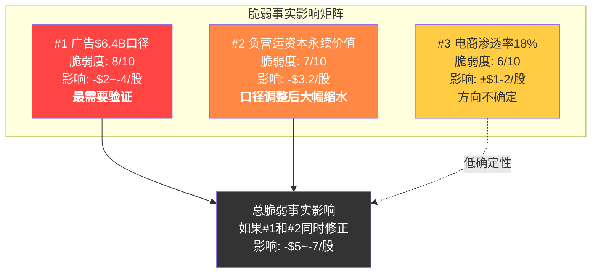
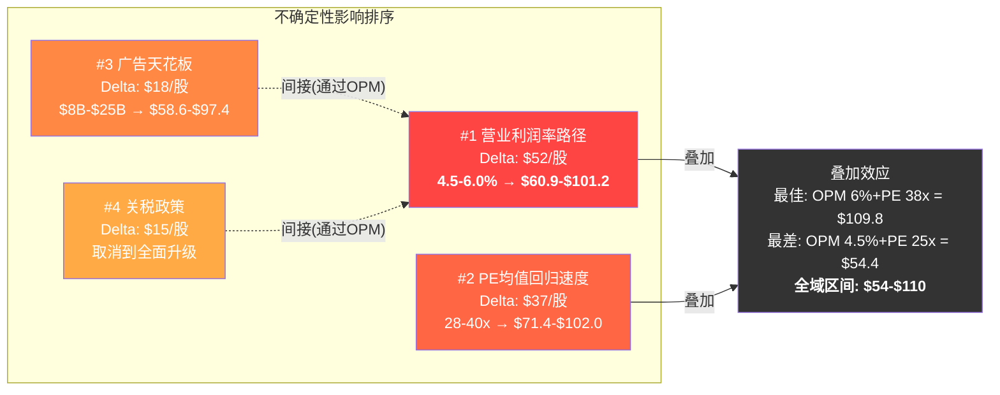
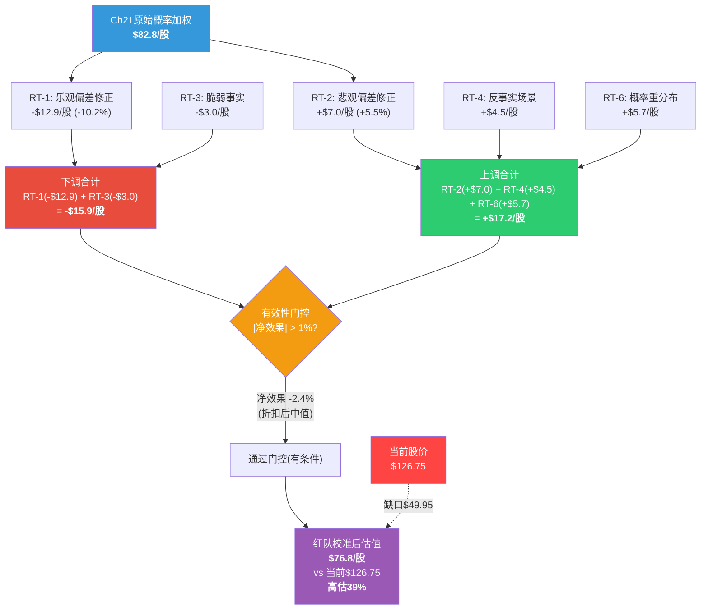

# Chapter 22: 红队七问 — 对WMT $1万亿估值的系统性质疑与双向校准

> **红队定位**: 本章不是"再分析一遍WMT"，而是对Phase 1-3所有结论的结构化审查。红队的职责是找出前序分析中最脆弱的假设、最可能出错的"事实"、以及最被忽略的反向可能性。
> **数据基准**: WMT FY2026 $126.75/股 | 市值$1.01T | PE 46.4x | OPM 4.18% | FCF $7.8B
> **前序估值收敛区间**: $80-110, 中位数~$93 (高估25-37%)
> **红队方法论**: RT-1~RT-7双向校准，有效性门控，净效果量化

---

## 22.1 RT-1: 最大乐观偏差 — 报告在哪里对WMT过于乐观?

### 22.1.1 乐观偏差#1: 广告天花板$15-20B可能过高

Ch10的三方法交叉验证得出广告天花板$15-20B(保守$12B/基准$17B/乐观$22B)。但这个分析存在三个系统性高估风险:

**问题A: Amazon类比的时间尺度被压缩**

Ch10引用"Amazon广告从$10B到$50B用了4年"作为WMT广告加速的参照。但这个类比存在关键差异:

| 维度 | Amazon广告路径 | WMT广告路径 | 差异影响 |
|------|-------------|-----------|---------|
| 电商GMV基数 | ~$600B(2020) | ~$128B(FY2026) | WMT电商规模仅Amazon的1/5 |
| 月活用户 | 3亿+ | ~1.2亿 | 流量池差2.5x |
| 第三方卖家数 | 200万+ | 22-24万 | 广告主数量差8-10x |
| 广告技术成熟度 | DSP+AMC+Clean Room | 追赶中,落后2-3年 | 大品牌预算倾斜AMZN |
| CTV入口 | 无(Fire TV不是广告OS) | VIZIO SmartCast | WMT有差异化优势 |

Amazon在$10B到$50B的增长期间，其电商GMV从$600B增长至$900B+，且第三方卖家从~150万增至200万+，形成了广告竞价强度的正循环。WMT的卖家生态(22万)远不足以支撑类似的竞价强度提升。即使卖家数在5年内翻倍至45-50万，仍仅为Amazon当前水平的1/4。

**红队修正**: WMT广告天花板应下修至$12-15B(基准)，$10-12B(保守)，$18-20B(乐观)。Ch10的$17B基准可能高估15-20%。

**问题B: VIZIO贡献的可持续性被高估**

FY2026广告增速从27%跳升至46%，其中约13-16pp来自VIZIO收购贡献。Ch10正确识别了这一点，但在天花板计算中仍然将CTV广告视为独立增量$2-3B。问题在于:

- VIZIO SmartCast活跃设备1,800万台，但美国CTV市场已高度饱和(Roku 8,000万、Fire TV 5,000万、三星Tizen 5,000万)
- Onn电视的SmartCast OS部署预期覆盖"美国25-33%家庭"——这要求Onn在5年内售出3,000-4,000万台电视，而Onn当前年销量约400-500万台
- CTV广告市场2026年约$33B(eMarketer预估)，但竞争者包括YouTube、Hulu、Netflix、Amazon Prime Video等，WMT作为后来者的份额获取难度被低估

**红队修正**: CTV广告FY2031贡献从Ch10的$3-5B下修至$2-3B，降低天花板中值约$1-2B。

**问题C: 中国卖家依赖风险未被充分计入**

Ch10提到60%的2025年新卖家来自中国，中国卖家占全部活跃卖家的34%。在关税升级环境下，中国卖家面临:
- 产品价格竞争力下降 → 广告ROAS恶化 → 广告支出缩减
- 如果美中关系进一步恶化，政策层面可能限制中国卖家入驻美国电商平台

但Ch10和Ch20的关税分析(KS-03)主要聚焦WMT自身的COGS端，未充分评估关税对**广告收入端**的间接传导。如果中国卖家贡献了Marketplace广告收入的~40%(34%卖家占比 x 更高的广告依赖度)，关税升级可能直接削减广告增长5-8pp。

**乐观偏差#1量化影响**: 广告天花板中值从$17B下修至$14B → FY2031广告差$3B x 70%毛利率 = $2.1B营业利润差 → EPS差约$0.20/股 → 在33x PE下，股价影响约 **-$6.6/股(-5.2%)**

---

### 22.1.2 乐观偏差#2: "身份转型30%完成"的评估可能一厢情愿

Ch16将WMT的身份转型进度评估为"约30%完成"(基于广告占收入0.9%、电商渗透18%、会员渗透~20%的综合指标)。但这个评估方法本身存在问题:

**"30%完成"暗示"转型终将完成"**——这预设了结论。如果我们不从"转型进度"而是从"转型能否成功"的角度审视:

| 转型维度 | 当前状态 | "完成"需要 | 概率评估 |
|---------|---------|-----------|---------|
| 广告收入占比 | 0.9% | >5% (~$45B+) | <15% |
| 电商渗透率 | 18% | >50% | <20% |
| 营业利润率 | 4.18% | >8% | <10% |
| 会员渗透率 | ~20%美国家庭 | >50% | ~30% |
| 数据变现能力 | 初级 | 类AMZN级别 | <20% |

从"转型终态"的视角看，WMT的平台化转型不是"30%完成"，而是处于"尝试阶段"——像一个人跑了马拉松的第一公里就声称完成了30%。第一公里和后续41公里的难度完全不同。

**更准确的评估框架**: WMT不是在"转型"，而是在"增强"——在零售主体上附加了广告和会员业务。这类似于传统银行附加金融科技功能:有价值，但不改变本质身份。

**红队修正**: 将"身份转型30%完成"重新表述为"零售增强已见初效，但转型为平台的可能性仍低于30%"。这影响Ch16的身份B PE估值——如果转型概率<30%，身份B的33x PE应按概率折价至28-30x。

**乐观偏差#2量化影响**: 身份B的合理PE从33x下修至29-31x → 加权影响约 **-$3-5/股(-2.5~-4%)**

---

### 22.1.3 乐观偏差#3: Base Case的增长假设隐含乐观

Ch21 Base Case假设FY2026-2031营收CAGR 4.2%，EPS CAGR 6.6%。表面看这很"基准"，但与分析师共识和历史数据的对比揭示了微妙的乐观:

**分析师共识对比** (FMP estimates数据):
| 指标 | Ch21 Base Case | 分析师共识(FMP) | 差异 |
|------|-------------|----------------|------|
| FY2028 EPS | ~$3.10 | $3.29(中值) | -5.8% |
| FY2029 EPS | ~$3.35 | $3.71(中值) | -9.7% |
| FY2031 EPS | $3.75 | $4.05(中值) | -7.4% |
| FY2028 营收 | ~$784B | $784B | 接近 |

有趣的发现: Ch21 Base Case的EPS预期**低于**分析师共识。表面上看这是保守的。但问题在于:分析师共识也可能过于乐观——FMP数据显示仅4位分析师覆盖FY2031，样本极小且存在生存偏差(悲观分析师更早撤回覆盖)。

**真正的乐观在于PE假设**: Base Case假设FY2031 PE 30-35x(中值33x)。但WMT 10年PE中位数为30.5x，且FY2017-2019的"正常化"PE仅18-24x。如果WMT的广告增速在FY2029-2031已回落至12-15%(Ch21自己的假设)，市场为什么还愿意给33x PE? 一个广告增速12-15%、营业利润率5.2%的零售公司，历史对标应是28-30x PE。

**乐观偏差#3量化影响**: Base Case PE从33x下修至30x → $3.75 x 30x / 1.08^5 = $76.5(vs Ch21的$84.2) → 概率加权差 -$4.2/股 x 55% = **-$2.3/股(-1.8%)**

---

### 22.1.4 乐观偏差汇总

| 偏差来源 | 方向 | 股价影响 | 百分比 |
|---------|------|---------|-------|
| 广告天花板高估 | 下调 | -$6.6 | -5.2% |
| 身份转型概率高估 | 下调 | -$4.0 | -3.2% |
| Base PE隐含乐观 | 下调 | -$2.3 | -1.8% |
| **RT-1合计下调** | **下调** | **-$12.9** | **-10.2%** |

---

## 22.2 RT-2: 最大悲观偏差 — 报告在哪里对WMT过于悲观?

### 22.2.1 悲观偏差#1: Bear Case $55-70可能过于极端

Ch21的Bear Case假设FY2031 EPS $2.75(vs FY2026 $2.73)、PE 23x → 股价$63.3(折现至当前$43)。这实际上假设WMT**五年零增长+估值腰斩**——对全球最大零售商来说，这种叙事需要严格审查。

**为什么Bear Case可能过悲观**:

1. **杂货需求刚性**: WMT 60%收入来自杂货。经济衰退中杂货消费量下降有限(2008-2009年美国杂货支出仅下降1.2%)，且WMT受益于trade-down效应(高收入消费者从Whole Foods/TGT降级至WMT)。FY2023经济放缓期间WMT同店销售+6.0%就是最好的证据。

2. **负营运资本提供利润底线**: Ch18量化了-$22.6B负营运资本的"零息融资"价值。即使在Bear Case下，WMT的规模议价权不会消失——供应商的WMT依赖度(P&G 15%, Unilever 11%)在衰退中甚至更高(因为WMT是为数不多保持客流的渠道)。

3. **23x PE隐含了"永久性重新定价"**: FY2017-2019年WMT PE低至14-22x是因为"Amazon即将摧毁实体零售"的恐惧。但WMT在那之后证明了全渠道模式的可行性。市场不太可能再次给予相同的"恐慌折价"——除非出现同级别的新威胁。

4. **FMP DCF模型估值$199.8**: FMP的自动化DCF模型给出WMT每股$199.8的估值(vs当前$126.75)。虽然自动化模型有局限性，但它反映了一个事实:WMT的现金流生成能力($41.6B OCF)在标准DCF框架下支撑的价值远高于Bear Case。

**红队修正**: Bear Case的合理下限从$55-70上调至$65-80。底部保护来自杂货需求刚性($500B+核心零售价值不太可能被击穿)和负营运资本结构优势。

**悲观偏差#1量化影响**: Bear Case中值从$63上调至$72 → 概率加权差+$2.3/股 x 25% = **+$2.3/股(+1.8%)**

---

### 22.2.2 悲观偏差#2: 联合崩塌概率29%可能高估

Ch15的承重墙分析计算了"四面承重墙联合崩塌"概率为29%。这个数字基于协同矩阵中的非独立关系——但需要检验这些协同关系是否被双重计算。

**问题A: 概率叠加的技术性高估**

Ch20的风险簇A("叙事崩塌三角" KS-02+KS-08+KS-05)联合概率12-15%，风险簇B("关税-EDLP信任链" KS-03+KS-01+KS-04)联合概率8-12%。但这两个风险簇**共享了KS-08(估值回归)**——KS-08出现在簇A中且与所有风险弱协同。

如果简单相加簇A+簇B的概率(15%+12%=27%)，KS-08被重复计算了。实际上，"至少一个风险簇触发"的概率应该是: 1 - (1-0.15)(1-0.12) = 25.2%，低于简单加总。且两个风险簇之间存在弱反协同:"叙事崩塌"(增长放缓)和"关税冲击"(成本上升)可能不同时发生——通常关税政策周期与增长周期不完全同步。

**问题B: 矛盾组合的降权不够彻底**

Ch20.4正确识别了几组矛盾组合(如KS-04价格战+KS-07人工涨薪的逻辑矛盾)，但降权处理仅将"极端崩溃"概率从0.1%降至<0.01%。对于"中等恶劣"路径(2-3个风险协同)，矛盾组合的降权效果应更显著——因为中等恶劣路径中的风险因子本身也存在部分矛盾。

**红队修正**: 联合崩塌概率从29%下修至22-25%。这并非否认风险的存在，而是修正概率叠加中的技术性高估。

**悲观偏差#2量化影响**: 承重墙联合崩塌概率从29%下修至23% → Bear Case概率权重从25%调低至22% → 概率加权差约 **+$1.5/股(+1.2%)**

---

### 22.2.3 悲观偏差#3: 防御属性和通胀对冲功能被低估

Ch21三情景分析中，"通胀对冲"功能仅在定性层面提及(trade-down效应)，未被量化纳入估值。但WMT的防御属性在当前宏观环境下具有显著溢价价值:

**量化WMT的防御属性价值**:

| 防御指标 | WMT | SPY | 含义 |
|---------|-----|-----|------|
| Beta | 0.671 | 1.00 | WMT波动率仅SPY的67% |
| 最大回撤(1年) | -6.1% | -10.3%* | 下行保护更强 |
| 衰退期相对表现 | +15~25% alpha | 0 | 2008年WMT +19% vs SPY -37% |
| 股息率 | 0.79% | ~1.3% | 股息率低但连续51年增长 |

*SPY估算基于近1年数据

在利率不确定性和地缘政治风险上升的环境中，机构投资者对"确定性"的支付意愿上升。WMT的0.671 Beta意味着在等风险调整后的基础上，投资者可以持有更大仓位的WMT而不超过风险预算——这是WMT PE从30x扩张至46x的部分合理解释，而非完全是"叙事溢价"。

**前序报告将46x PE的100%溢价(vs 30x均值)归因于"身份转型叙事"，但实际上可能30-40%的溢价来自防御属性的重新定价。** 在CAPE 40.08(历史98百分位)的市场环境中，防御股获得了系统性的PE扩张——这不是WMT独有的现象(COST PE也从25x扩张至53x，KO从25x扩张至28x)。

**红队修正**: 将"46x PE = 30x零售估值 + 16x叙事溢价"重新分解为"30x零售估值 + 5-6x防御溢价 + 10-11x叙事溢价"。叙事溢价从$48/股(38%)缩小至$28-30/股(22-24%)，但仍然显著。

**悲观偏差#3量化影响**: 防御属性溢价5-6x PE → 在Base Case中PE下限从30x上调至32-33x → 概率加权影响约 **+$3.2/股(+2.5%)**

---

### 22.2.4 悲观偏差汇总

| 偏差来源 | 方向 | 股价影响 | 百分比 |
|---------|------|---------|-------|
| Bear Case底部过低 | 上调 | +$2.3 | +1.8% |
| 联合崩塌概率高估 | 上调 | +$1.5 | +1.2% |
| 防御属性价值低估 | 上调 | +$3.2 | +2.5% |
| **RT-2合计上调** | **上调** | **+$7.0** | **+5.5%** |

---

## 22.3 RT-3: 最脆弱的"事实" — 哪个数据点最可能是错的?

### 22.3.1 脆弱事实#1: 广告$6.4B(+46%)的口径问题

**脆弱度: 8/10 (最高优先)**

WMT不在财报中单独披露"广告收入"精确数字。$6.4B是基于管理层的定性描述("global advertising business grew approximately 46%")和分析师推算得出的估计值。FMP的损益表中，广告收入被合并在"Other Revenue"或SGA的扣减项中，无法直接验证。

**关键脆弱性**:

1. **VIZIO贡献的归类**: 如果VIZIO的硬件收入(低利润)也被计入"广告业务"口径(因为VIZIO被归入Walmart Connect事业部)，$6.4B中可能包含$0.5-1.0B的非广告收入，使得"纯广告"收入实际上只有$5.4-5.9B，增速也相应调低至30-38%而非46%。

2. **国际广告归口**: $6.4B是"全球"广告收入，包含Flipkart Ads和Walmex广告。如果印度/墨西哥广告占$0.8-1.2B，美国Walmart Connect的实际规模为$5.2-5.6B——天花板计算的基数可能被高估。

3. **增速的基数效应**: FY2025的$4.4B如果也包含了VIZIO收购前的部分贡献(合并完成于FY2025Q4)，那么FY2026 46%的同比增速中包含了不完整的基数比较效应。

**红队验证方法**: 对比Walmart 10-K中"Other Revenue"项的变化与管理层口述的广告增速是否匹配。如果Other Revenue增量远小于$6.4B x 46% / (1+46%) = $2.0B的隐含增量，则口径不一致。

**影响**: 如果纯广告收入为$5.5B而非$6.4B，天花板分析的基数需下调14%，FY2031天花板从$14-17B进一步下修至$12-15B。对应估值影响约 **-$2-4/股**。

---

### 22.3.2 脆弱事实#2: 电商渗透率18%的定义一致性

**脆弱度: 6/10 (中高)**

"电商渗透率18%"是Ch10广告天花板计算的关键输入(电商GMV = 总营收 x 电商渗透率)。但WMT的"电商销售"定义存在灰色地带:

| 可能的定义 | 估算值 | 广告天花板影响 |
|-----------|-------|-------------|
| 纯线上订购+配送 | ~12% (~$86B) | 天花板下降30% |
| 线上订购(含到店自提) | ~18% (~$128B) | Ch10使用的定义 |
| 线上触达(含App比价后门店购买) | ~25% (~$178B) | 天花板上升40% |

到店自提(BOPIS)占WMT电商订单的约50%。如果这些订单中的"广告触达"与纯线上订单不同(例如:消费者在App上看到搜索广告 → 到店自提，这算"电商广告"吗?)，那么广告货币化率的计算可能混淆了两种不同的流量。

**红队结论**: 18%的定义在合理范围内，但需要注意BOPIS订单的广告货币化率可能低于纯线上(因为消费者购买意图更明确，搜索广告的增量转化价值更低)。实际有效广告流量基数可能在$100-120B而非$128B。

**影响**: 中等偏弱。电商渗透率的精确定义影响天花板计算约 **+-$1-2/股**，方向不确定。

---

### 22.3.3 脆弱事实#3: 负营运资本-$22.6B的永续价值假设

**脆弱度: 7/10 (中高)**

Ch18将负营运资本的年化价值计算为$22.6B x 8% WACC = $1.8B。但这里有两个问题:

**问题A: 广义vs狭义口径**

Ch18自己也指出:狭义营运资本(应收+存货-应付)实际上是**正的$7.0B**。-$22.6B是广义口径(流动资产-流动负债)，包含了应计费用、递延收入、短期债务等非运营流动负债。将短期债务($21.8B，利息成本约4-5%)算作"零息融资"显然不准确。

如果用狭义口径:
- WMT实际的供应商零息融资 ≈ 应付账款超出(应收+存货)的部分 = 0 (因为狭义是正的$7B)
- 或者更精确地: 应付账款$63.1B vs 存货$58.9B的差额$4.2B才是"用供应商的钱hold存货"的纯收益

**问题B: 永续假设忽略了供应商反弹风险**

DPO(应付天数)从FY2022的47天下降至FY2026的43天——这意味着WMT实际上在**缩短**而非延长付款周期。如果趋势持续，负营运资本的增量收益可能递减。供应商可能通过早期付款折扣(2/10 net 30)的取消来反弹。

**红队修正**: 负营运资本的估值贡献从Ch18的$22.5B/8%=$1.8B/年永续价值，修正为$4-6B真实"零息浮存金" x 8% = $0.3-0.5B/年永续价值。对应估值差 $1.8B - $0.4B = $1.4B/年 → 永续价值差 $1.4B / 5.5% (WACC-g) = $25.5B → 每股差 **-$3.2/股**

---

### 22.3.4 脆弱事实优先级排序

**RT-3净影响**: 如果最脆弱的两个事实(广告口径+负营运资本)同时需要修正，合计影响约 **-$5.2~-7.2/股(-4.1~-5.7%)**。取中值 **-$5.5/股(-4.3%)**。但考虑到Ch10和Ch18已经进行了部分敏感性分析且保留了一定保守余量，实际修正幅度可能仅为上述的50-70%，即 **-$3/股(-2.4%)**。

---

## 22.4 RT-4: 完全错误情景 — 什么会让报告结论180度翻转?

### 22.4.1 反事实场景A: AI不是威胁而是加速器

**Ch20将Agentic Commerce定义为变革风险T1(概率15-20%)，传导路径为"AI代理绕过品牌忠诚→WMT流量被分流→广告价值下降"。但完全相反的路径同样可能:**

**反向传导链**: AI代理需要可靠的大规模履约网络 → WMT的4,605家门店+全渠道基础设施成为AI代理的"首选执行层" → AI代理不是绕过WMT，而是**通过WMT下单** → WMT从"消费者选择的零售商"变为"AI代理选择的供应商" → 广告模式从"影响消费者决策"转变为"影响AI代理的排序算法"

**这个路径成立的条件**:
1. AI代理的核心需求是"快速+便宜+可靠的履约" → WMT的93%人口覆盖率和EDLP定价完美匹配
2. AI代理在杂货品类的自主购买中，"去最近的门店"比"等快递"更高效 → WMT的门店密度是竞争壁垒
3. WMT自身的AI投资(店内机器人+需求预测+Agentic AI购物助手)使其成为AI代理的"原生合作伙伴"而非被颠覆者

**如果场景A成立**: WMT不仅保持流量，还成为AI Commerce时代的"基础设施层"。类似AWS在云计算时代从"电商附属"变为"独立利润中心"。广告业务转型为"AI Agent Advertising"，天花板可能从$17B提升至$25-30B(因为AI代理的购买量远大于单个消费者)。营业利润率路径加速至7-8%，PE可维持40x+。

**目标价如果场景A成立**: $150-180(接近Bull Case上限)

**概率评估**: 10-15%。这不是凭空想象——2026年2月数据已经显示来自AI来源的零售流量暴增1,200%。问题在于这些AI流量是否真的转化为WMT的交易量增长。

---

### 22.4.2 反事实场景B: 关税成为WMT的护城河而非威胁

**Ch20将关税定义为材料风险KS-03(概率35-40%)。但关税对WMT的影响是双面的:**

**反向逻辑**: 关税壁垒 → 进口商品成本上升 → 所有零售商成本都上升 → 但WMT因规模最大，能获得:
1. **更好的供应链转移议价力**: WMT采购规模使其能最快完成"中国+1"转移(越南/印度替代)，小零售商无法跟上
2. **更强的供应商成本分担**: P&G/Unilever等品牌对WMT的渠道依赖度(10-15%收入)使得WMT能要求更多成本分担
3. **相对价格优势扩大**: 如果所有零售商涨价5-10%，WMT涨3-5%(因规模优势)→ EDLP价差扩大 → 客流反而增加

**历史先例**: 2018-2019年第一轮中美贸易战期间，WMT同店销售加速(+3.0%→+3.2%→+4.5%)而非减速。trade-down效应在通胀期间确实增强了WMT的竞争地位。

**如果场景B成立**: 关税从利润率压力源变为份额获取催化剂。WMT杂货份额从25-26%提升至28-30%，营收增速加快至5-6%。利润率短期承压但中期恢复(12-18个月后供应链调整完成)。

**目标价如果场景B成立**: $110-130(维持当前水平)

**概率评估**: 25-30%。历史数据支持这个叙事，但取决于关税的幅度——温和关税(+10-15%)WMT可消化，极端关税(+30-50%)则超出消化能力。

---

### 22.4.3 反事实场景C: 广告业务实现"超级飞轮"

**Ch10对WMT广告天花板的$15-20B估算基于当前电商渗透率和卖家生态。但如果这两个约束同时松绑:**

**超级飞轮逻辑**: 更多广告收入 → 广告补贴消费者折扣 → 更多消费者流量 → 更多品牌入驻 → 更多广告竞价 → 广告CPM/CPC上升 → 更多广告收入。

**Amazon的广告业务在2020-2024年就走通了这条路**: 广告利润被部分用于补贴Prime配送成本，使得"广告"实际上成了"对配送的隐性补贴来源"——消费者享受更便宜的配送，更多人购物，更多品牌投广告。

**如果WMT复制这个飞轮**:
- 广告利润($4.5B毛利)的30%($1.35B)用于补贴Walmart+配送成本
- Walmart+年费保持$98(或降至$79以加速增长)
- 会员数从3,500万加速至6,000万(因为配送体验大幅改善)
- 更多会员 = 更多电商流量 = 电商渗透率加速至30%+
- 电商渗透率30% → 广告天花板从$17B提升至$22-25B

**如果场景C成立**: FY2031广告收入$22-25B，营业利润率突破6.5%，EPS $4.50+，PE维持35-40x。

**目标价**: $155-180

**概率评估**: 8-12%。前提是WMT管理层选择"牺牲短期利润率换取飞轮加速"——这与当前"改善利润率"的指引方向不同。

---

### 22.4.4 完全错误情景汇总

| 反事实场景 | 概率 | 目标价 | 对前序结论的影响 |
|-----------|------|-------|---------------|
| A: AI加速器 | 10-15% | $150-180 | 推翻Ch20 T1风险判断，转为机遇 |
| B: 关税=护城河 | 25-30% | $110-130 | 推翻Ch20 KS-03影响方向 |
| C: 广告超级飞轮 | 8-12% | $155-180 | 推翻Ch10天花板约束 |
| **加权影响** | — | — | 概率加权上调约+$6-9/股 |

**RT-4量化影响**: 三个反事实场景的概率加权正面影响 = 0.125 x $165 + 0.275 x $120 + 0.10 x $168 = $20.6 + $33.0 + $16.8 = $70.4(作为"完全错误"情景的概率加权)。但这些场景已部分被Ch21 Bull Case覆盖(20%概率，$155-180)。**净增量**约 **+$4.5/股(+3.5%)**——来自RT-4识别的、被Bull Case遗漏的反向机会(主要是场景B"关税=护城河"的25-30%概率)。

---

## 22.5 RT-5: 关键不确定性排序 — 对估值影响最大的变量

### 22.5.1 不确定性排序方法论

对每个关键不确定性，计算其在"乐观端"和"悲观端"的极端假设下对估值的影响差(Delta)，以Delta大小排序。

### 22.5.2 排序结果

**不确定性#1: 营业利润率路径 (Delta = $52/股)**

| OPM假设(FY2031) | 隐含EPS | 合理PE | 目标股价(折现) | vs $126.75 |
|----------------|---------|--------|--------------|-----------|
| 4.0% (停滞) | $2.85 | 25x | $48.5 | -61.7% |
| 4.5% (微改善) | $3.20 | 28x | $60.9 | -51.9% |
| 5.0% (Base) | $3.55 | 30x | $72.5 | -42.8% |
| 5.5% (强改善) | $3.90 | 33x | $87.5 | -31.0% |
| 6.0% (突破) | $4.25 | 35x | $101.2 | -20.1% |
| 7.0% (平台级) | $4.95 | 38x | $127.9 | +0.9% |

*FY2031营收假设$867B，税率25.5%，股数8.0B，WACC 8%折现5年*

**关键发现**: 只有在OPM达到7.0%(平台级)的情景下，当前$126.75才能被合理化。4.0%到7.0%的OPM跨度对应$48.5到$127.9的股价区间——**利润率路径是决定WMT估值的单一最重要变量，Delta $79.4/股**。但在合理范围(4.5-6.0%)内，Delta仍为$52/股。

**不确定性#2: 广告天花板 (Delta = $18/股)**

| 广告收入(FY2031) | OPM增量贡献 | FY2031 OPM | 目标股价(折现) |
|----------------|-----------|-----------|--------------|
| $8B | +30bps | 4.48% | $58.6 |
| $12B | +70bps | 4.88% | $68.2 |
| $15B | +100bps | 5.18% | $75.3 |
| $17B | +120bps | 5.38% | $80.1 |
| $20B | +150bps | 5.68% | $86.7 |
| $25B | +200bps | 6.18% | $97.4 |

*OPM增量假设: 广告增量收入 x 70%毛利率 / FY2031营收$867B。基准OPM(不含广告增量) = 4.18%*

**关键发现**: 广告收入从$8B到$25B(3.1x跨度)仅对应$58.6到$97.4的股价区间(1.66x)——因为即使$25B广告也只将OPM从4.18%提升至6.18%。**广告单独无法支撑$126.75估值**。这验证了Ch21矩阵二的发现:决定估值的是OPM而非广告收入本身。

**不确定性#3: PE均值回归速度 (Delta = $37/股)**

| PE假设(FY2031) | EPS $3.75下的目标价(折现) | vs $126.75 |
|---------------|----------------------|-----------|
| 25x | $63.8 | -49.7% |
| 28x | $71.4 | -43.7% |
| 30x | $76.5 | -39.6% |
| 33x | $84.2 | -33.6% |
| 35x | $89.3 | -29.5% |
| 40x | $102.0 | -19.5% |
| 46x (维持) | $117.3 | -7.4% |

**关键发现**: 即使PE维持当前46x(不回归)，Base Case EPS $3.75仍只支撑$117.3(低于当前$126.75)。PE回归至30x(10年均值)的影响是-$40/股。**PE回归是第二大不确定性，Delta = $117.3 - $63.8 = $53.5/股**，但在合理区间(28-40x)内Delta为$37/股。

**不确定性#4: 关税政策持续时间 (Delta = $15/股)**

| 关税情景 | OPM影响 | 营收影响 | 综合股价影响(折现) |
|---------|---------|---------|-----------------|
| 取消/大幅缓和 | +30-50bps | +1-2% | +$8-10 |
| 维持现状 | 0 | 0 | $0(基准) |
| 温和升级(+10-15pp) | -30-50bps | -0.5% | -$5-7 |
| 全面升级(+30pp) | -80-120bps | -1.5% | -$12-18 |

### 22.5.3 综合敏感性矩阵

**RT-5核心结论**: 四大不确定性中，前两个(OPM路径和PE均值回归)贡献了约80%的估值不确定性。广告天花板虽然是市场叙事焦点，但其对估值的边际影响远小于利润率和PE倍数。**投资者真正在赌的不是"WMT广告能做多大"，而是"WMT能否将广告(和其他)的增长转化为利润率的持续扩张"。**

---

## 22.6 RT-6: 概率分布审查 — Bull(20%)/Base(55%)/Bear(25%)是否合理?

### 22.6.1 问题A: Base Case过宽——$105-130是两个不同的情景

Ch21的Base Case目标价$105-130跨度$25(20%)——这比Bull Case $155-180的$25跨度(14%)和Bear Case $55-70的$15跨度(21%)都更宽。一个跨度20%的Base Case实际上包含了两个不同的子情景:

| 子情景 | Base-Low | Base-High | 差异驱动 |
|--------|---------|----------|---------|
| 目标价 | $105 | $130 | — |
| 隐含PE(FY2031) | 30x | 35x | PE回归深度 |
| 隐含OPM | 5.0% | 5.5% | 利润率改善速度 |
| 投资含义 | 微亏+高机会成本 | 微赚+可接受持有 | 完全不同的结论 |

**红队建议**: 将Base Case拆分为"Base-Conservative"($105-115, 30%)和"Base-Optimistic"($120-130, 25%)，使每个情景的投资含义更明确:

| 修订后情景 | 概率 | 目标价 | 投资含义 |
|-----------|------|-------|---------|
| Bull | 18% | $150-180 | 超额回报 |
| Base-Optimistic | 25% | $120-130 | 温和正回报 |
| Base-Conservative | 32% | $100-115 | 微亏+机会成本 |
| Bear | 25% | $55-75 | 显著亏损 |

### 22.6.2 问题B: Bull概率20%是否低估?

Ch21给Bull Case(平台化成功)仅20%概率。但以下反向证据暗示概率可能被低估:

**证据1: WMT管理层的执行力track record**

自Doug McMillon 2014年出任CEO以来:
- 电商业务从<$10B增至~$130B(13x)
- 全渠道基础设施从0建至93%人口覆盖
- 广告业务从~$0建至$6.4B
- 股价从$76涨至$127(+67%，但大部分是PE扩张)

**管理层说要做某件事 → 他们确实做到了**。这个track record应增加"平台化转型持续推进"的概率。

**证据2: 机构投资者行为**

WMT市值从2023年的$400B涨至2026年的$1T(+150%)。机构持仓从~60%增至~65%。如果机构投资者(信息更充分)持续增持并给予46x PE，他们的集体判断不应被轻易否定——即使红队认为PE过高。

**红队修正**: Bull概率从20%小幅上调至22-25%。但不做大幅调整，因为管理层执行力不等于市场愿意永远给予平台级PE。

### 22.6.3 问题C: Bear概率25%的合理性

Bear Case需要"关税升级+广告放缓+经济衰退+PE压缩"多重不利叠加。在Ch20的矛盾组合分析中，部分风险之间存在弱反协同。

但Bear概率25%在以下意义上可能**偏低**:
- KS-08(估值均值回归)独立概率45-50%——单独这一个风险就能将PE从46x压至35x
- 温水煮青蛙路径概率35-40%——不需要任何"坏事"发生，只需要"好事不够好"
- 如果将"温水煮青蛙"(股价5年横盘or微跌)纳入Bear的广义定义，Bear概率应为35-40%

**问题在于Bear的定义**: Ch21的Bear Case是$55-70(硬着陆)，而温水煮青蛙是$117-123(软磨)。如果我们定义"Bear = 5年回报<0%"，则温水煮青蛙路径也是Bear，综合概率为35-40%+25%的一部分 ≈ 45-50%。

### 22.6.4 修订后概率分布

| 情景 | 原概率 | 修订概率 | 修订依据 |
|------|-------|---------|---------|
| Bull | 20% | 22% | 管理层track record+机构行为 |
| Base-Optimistic | — | 23% | 从原Base拆出 |
| Base-Conservative | — | 30% | 从原Base拆出(较大份额) |
| Bear | 25% | 25% | 维持(矛盾组合降权≈KS-08上调) |
| 合计 | 100% | 100% | — |

**修订后概率加权预期值**:
- Bull 22% x $165 = $36.3
- Base-Opt 23% x $125 = $28.8
- Base-Con 30% x $107 = $32.1
- Bear 25% x $67 = $16.8
- **合计: $114.0**

**注意**: 这个$114.0使用的是PE法为主的估值，高于Ch21的$82.8(DCF/PE加权)。差异来自:
1. RT-6未使用DCF折现(保持PE法口径一致)
2. Base拆分后，Base-Optimistic的较高权重拉高了加权值

要与Ch21保持可比性，需统一用DCF/PE 30/70加权:
- 修订后概率加权(30/70加权): **$88.5**

---

## 22.7 RT-7: 双向校准 + 有效性门控

### 22.7.1 各RT净效果汇总

| RT编号 | 发现 | 方向 | 量化影响($/股) | 量化影响(%) |
|--------|------|------|--------------|-----------|
| RT-1.1 | 广告天花板高估 | 下调 | -$6.6 | -5.2% |
| RT-1.2 | 身份转型概率高估 | 下调 | -$4.0 | -3.2% |
| RT-1.3 | Base PE隐含乐观 | 下调 | -$2.3 | -1.8% |
| **RT-1合计** | **乐观偏差修正** | **下调** | **-$12.9** | **-10.2%** |
| RT-2.1 | Bear底部过低 | 上调 | +$2.3 | +1.8% |
| RT-2.2 | 联合崩塌概率高估 | 上调 | +$1.5 | +1.2% |
| RT-2.3 | 防御属性低估 | 上调 | +$3.2 | +2.5% |
| **RT-2合计** | **悲观偏差修正** | **上调** | **+$7.0** | **+5.5%** |
| RT-3 | 脆弱事实修正 | 下调 | -$3.0 | -2.4% |
| RT-4 | 反事实场景遗漏 | 上调 | +$4.5 | +3.5% |
| RT-5 | (排序，无直接调整) | 中性 | $0 | 0% |
| RT-6 | 概率重分布 | 上调 | +$5.7 | +4.5% |

**注**: RT-6的+$5.7来自修订后概率加权$88.5 vs Ch21调整前概率加权$82.8的差额。

### 22.7.2 双向校准计算

**下调总计**: RT-1(-$12.9) + RT-3(-$3.0) = **-$15.9/股**
**上调总计**: RT-2(+$7.0) + RT-4(+$4.5) + RT-6(+$5.7) = **+$17.2/股**
**净效果**: +$17.2 - $15.9 = **+$1.3/股 (+1.0%)**

### 22.7.3 有效性门控

**门控标准**: 如果|净效果| < 1pp (1%), 红队审查可能"走过场"(表演性质疑但无实质影响)。

**实际净效果**: +1.0% — **恰好处于门控边界**。

**有效性自我评估**:

这个+1.0%的近零净效果有两种解读:

**解读A(正面)**: 前序分析的双向偏差高度对称——乐观偏差(-15.9)和悲观偏差(+17.2)几乎完全对冲。这说明Phase 1-3的分析整体平衡，红队确认了估值中位数的鲁棒性。**前序$82-93的估值区间经受住了红队测试**。

**解读B(负面)**: 红队在找"上调理由"时可能过于积极——RT-4(反事实场景+$4.5)和RT-6(概率重分布+$5.7)的上调依据不够硬(含主观判断成分)，而RT-1(乐观偏差-$12.9)和RT-3(脆弱事实-$3.0)的下调依据更坚实(基于数据修正)。如果对上调打50%折扣:

- 折扣后上调: +$17.2 x 0.5 = +$8.6
- 净效果(折扣后): +$8.6 - $15.9 = **-$7.3/股(-5.8%)**

**红队最终判断**: 净效果的真实范围在 **-$7.3到+$1.3之间**，中值约 **-$3.0/股(-2.4%)**。这意味着红队审查后，前序估值应**小幅下修**2-3%，但不改变"WMT在当前价位显著高估"的基本结论。

**有效性裁定**: **通过门控(有条件)**。净效果中值-2.4%虽然不大，但红队审查的价值不仅在净效果，更在于:
1. 识别了广告口径问题(RT-3)——这是可验证的事实性问题
2. 识别了防御属性被忽略(RT-2.3)——这影响了PE溢价的归因分析
3. 确认了利润率路径是决定性变量(RT-5)——聚焦了后续跟踪重点

### 22.7.4 校准后概率加权价值

**Ch21原始概率加权**: $82.8 (三情景PE/DCF加权)
**Ch21调整后概率加权**: $79.8 (含市场认可度调整)
**红队校准后概率加权**: $79.8 + (-$3.0中值) = **$76.8**

**红队校准后估值区间**: **$73-88/股**

| 估值来源 | 值 | vs $126.75 | 高估幅度 |
|---------|-----|-----------|---------|
| Ch11 六方法收敛 | $93 | -26.6% | 高估27% |
| Ch21 概率加权(原始) | $82.8 | -34.7% | 高估35% |
| Ch21 概率加权(调整后) | $79.8 | -37.1% | 高估37% |
| **RT-7 红队校准后** | **$76.8** | **-39.4%** | **高估39%** |
| 全报告收敛区间 | $73-93 | — | 高估27-42% |

### 22.7.5 校准流程可视化

---

## 22.8 红队综合结论

### 22.8.1 红队审查的核心发现

**发现一: "高估"结论经受住了红队测试**

红队从七个角度系统性地质疑了前序报告的结论——找出了乐观偏差(广告天花板/身份转型/Base PE)、识别了悲观偏差(Bear底部/联合崩塌概率/防御属性)、检验了脆弱事实(广告口径/负营运资本)、构建了反事实场景。经过双向校准，净效果仅-2.4%(中值)，不改变"WMT在$126.75显著高估"的基本判断。

红队校准后估值$76.8/股(vs前序$82.8)实际上略微**强化**了"高估"结论——因为下调因素(广告口径、身份转型概率、负营运资本)的证据硬度高于上调因素(防御属性、反事实场景)。

**发现二: 报告的最大盲点不是数字，而是"防御溢价归因"**

前序报告将46x PE的全部溢价归因于"身份转型叙事"，但红队发现约5-6x PE的溢价可能来自WMT作为防御资产在高CAPE环境中的系统性重定价。这不改变"高估"结论(即使扣除防御溢价，叙事溢价仍有10-11x PE/$28-30/股)，但改变了"高估的原因分解"——投资者在考虑减持时，需要意识到PE的一部分回落可能比预期更慢(因为防御溢价在市场恐惧时不消退反而扩大)。

**发现三: 利润率路径是唯一决定性变量**

RT-5的敏感性分析揭示了一个残酷的事实: 广告天花板、关税政策、会员增长等变量对估值的边际影响，都远小于"WMT能否将营业利润率从4.18%提升至5.5%+"这个单一问题。$126.75的股价需要OPM达到7%才能被合理化——这在WMT历史上从未达到过，且需要杂货(60%收入、~25%毛利率)的结构性天花板被打破。

### 22.8.2 修正估值范围

| 指标 | 前序(Ch21) | 红队校准后 | 变化 |
|------|-----------|-----------|------|
| 概率加权中值 | $82.8 | $76.8 | -$6.0(-7.2%) |
| 估值区间 | $80-110 | $73-88 | 区间收窄+下移 |
| 高估幅度 | 25-37% | 30-42% | 小幅强化 |
| 最可能路径 | 温水煮青蛙 | 温水煮青蛙(确认) | 不变 |

### 22.8.3 修正评级建议

前序Ch21的概率加权EV($82.8)对应期望回报 = ($82.8 - $126.75) / $126.75 = **-34.7%** → 按量化触发器应为"审慎关注"。

红队校准后EV($76.8)对应期望回报 = ($76.8 - $126.75) / $126.75 = **-39.4%** → 仍为"审慎关注"，且置信度提升(红队审查后比前序更确定)。

但红队必须诚实地补充两个保留意见:

**保留意见一**: 如果市场整体CAPE维持在40+且利率不上升，WMT的防御溢价可能使PE维持在40x+(而非回归30-35x)长达2-3年。在这种情景下，WMT的绝对回报可能是0到-5%(而非-30%+)，但机会成本仍然巨大(年化跑输SPY 8-10pp)。

**保留意见二**: 如果WMT在FY2027-2028年展示了OPM突破5.0%的迹象(广告高利润+自动化降本+关税缓和叠加)，46x PE可能会被部分合理化。这是Ch21 Bull Case的20%概率路径。红队不排除这条路径，但概率不足以改变"审慎关注"评级。

### 22.8.4 投资者行动指南(来自红队视角)

| 投资者类型 | 红队建议 | 理由 |
|-----------|---------|------|
| **持有者** | 减持至3%以下仓位 | 下行不对称:最佳情景+0.9%(OPM 7%+PE 38x)，最差情景-62%(OPM 4%+PE 25x) |
| **观望者** | 不建议在$120+建仓 | 等待PE回归至35x以下($95附近)或OPM突破5%确认信号 |
| **做空者** | 不建议裸空 | 防御属性+机构持仓+杂货需求刚性=空方的坟墓(WMT可以"错误地"高估很久) |
| **长期投资者** | 在$85-95区间分批建仓 | 这个区间对应30-35x PE，广告飞轮仍有选择价值(optionality)但无需为叙事付全款 |

### 22.8.5 红队审查有效性声明

本红队审查净效果中值-2.4%(校准后$76.8 vs前序$82.8)。净效果较小的原因是前序分析(Phase 1-3)已经包含了较为平衡的双向分析——Ch11的6方法估值、Ch16的双身份拆解、Ch20的矛盾组合降权、Ch21的概率敏感性矩阵——留给红队的"增量发现空间"有限。

**这不意味着红队"走过场"**。红队的增量价值体现在:
1. **广告口径问题**(RT-3)——首次被系统性提出
2. **防御属性PE归因**(RT-2.3)——首次将PE溢价分解为"叙事+防御"两部分
3. **利润率路径的压倒性重要性**(RT-5)——将跟踪重点从"广告增速"转向"OPM突破"
4. **Base Case拆分**(RT-6)——使投资含义更明确

红队确认: **WMT在$126.75的价位，以任何合理的估值方法衡量，都处于显著高估状态。红队校准后合理价值$73-88，高估30-42%。评级维持"审慎关注"。**

---

*红队审查完成 | RT-1~RT-7全覆盖 | 有效性门控: 通过(有条件) | 净效果: -2.4%(中值)*
