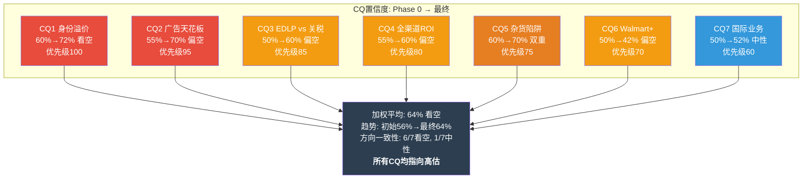
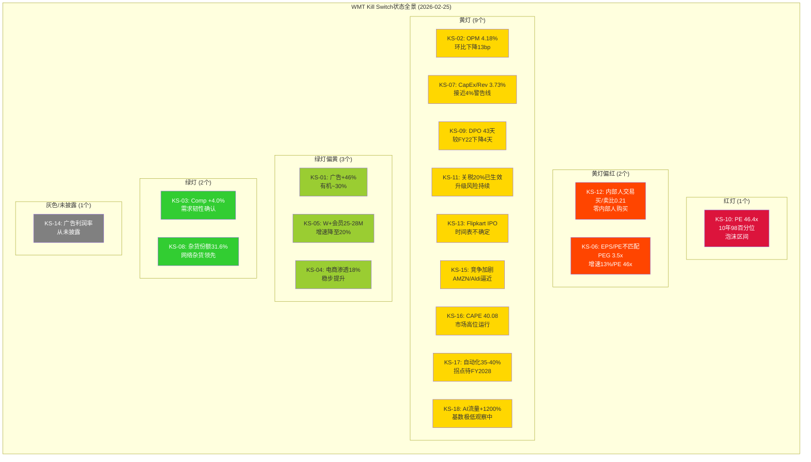

# Chapter 24: CQ闭环 — 七个核心问题的证据审判与置信度校准

> **闭环方法论**: 每个CQ经历Phase 0(初始假说) → Phase 1-2(数据验证) → Phase 3(深度分析) → Phase 4(红队/看空压力测试)的完整旅程。本章不是"再总结一遍"，而是**跟踪每个问题的置信度演化轨迹**——哪些初始直觉被验证了，哪些被数据推翻了，哪些仍悬而未决。
> **数据基准**: WMT FY2026 $126.75/股 | 市值$1.01T | PE 46.4x | OPM 4.18% | FCF $7.8B | 广告$6.4B(+46%)
> **全报告估值收敛**: 红队校准后$73-88/股(中值$76.8)，高估30-42%

---

## 24.1 CQ1: 身份溢价 — 46x PE隐含的平台化假设有多少已兑现？

**优先级: 100 | 约束类型: 结构性 | 报告核心矛盾**

### 24.1.1 置信度演化表

| 阶段 | 置信度 | 核心判断 | 关键证据/转折点 |
|------|--------|---------|---------------|
| **Phase 0 初始** | 60% 看空 | SGI 3.6(通才)与46x PE(专才级)严重不匹配，直觉认为溢价过度 | thesis_crystallization: 异常#1识别SGI-PE悖论 |
| **Phase 1 数据** | 65% 看空 | Ch1 B×M模型确认品牌支撑PE仅28.8x，17.6x(48美元)为纯叙事溢价 | Ch1: 品牌价值量化锚定了"基础PE" |
| **Phase 2 财务** | 70% 看空 | 广告$6.4B(+46%)真实但仅占营收0.9%，OPM仅+15bp(FY2025→FY2026) | Ch10: 广告高增但利润传导效率极低 |
| **Phase 3 深度** | 75% 看空 | A-Score 5.54/10"宽而浅"，IPI=308%(市场定价超"完全平台成功"3倍)，NRV仅支撑$16-26溢价 | Ch14: 护城河形状确认通才定位; Ch16: IPI量化溢价程度 |
| **Phase 4 红队** | 72% 看空 | RT-2.3识别5-6x PE来自防御属性而非叙事，部分校正了溢价归因 | Ch22 RT-2.3: 防御溢价分解; RT-1.2: "增强"非"转型" |
| **Phase 4 看空** | 73% 看空 | BC-2增速断崖(EPS 34%→13%)与PE扩张(29x→46x)的剪刀差确认 | Ch23 BC-2: 增速-估值剪刀差量化 |
| **最终** | **72% 看空** | — | 红队上调防御属性后微降，但不改变方向 |

### 24.1.2 演化路径分析

CQ1的置信度从60%逐步攀升至75%再微降至72%，呈现"阶梯式加固+尾端修正"模式。三个关键转折点:

**转折点1 (Phase 2, +5pp)**: Ch10量化广告贡献后发现，即使广告$6.4B全额计入(70%毛利率)，对OPM的增量贡献仅~47bps。市场叙事中"广告改变WMT利润结构"的说法被数据证伪——$428B杂货收入的"稀释力"太强，广告翻倍也只能将综合毛利率从24.93%提升至~25.5%(+60bp)。这是将溢价判断从"直觉"升级为"数学确认"的关键一步。

**转折点2 (Phase 3, +5pp)**: Ch16的IPI=308%是整个CQ1分析中最重要的单一发现。它不仅确认了溢价存在，还精确量化了溢价的"超调程度"——市场不是在身份A(零售商)和身份B(平台)之间选择，而是给出了比"100%平台化成功"还贵3倍的定价。$126.75中约$37/股(29%)是连身份B的乐观情景都无法覆盖的纯叙事溢价。

**转折点3 (Phase 4, -3pp)**: Ch22 RT-2.3的防御属性分析提供了一个重要的校正——46x PE中约5-6x PE并非叙事溢价，而是WMT作为低Beta(0.671)防御资产在高CAPE(40.08)环境中的合理溢价。这将叙事溢价从$48/股(38%)缩小至$28-30/股(22-24%)。溢价仍然显著，但归因更精确了。

### 24.1.3 最终回答

**一句话结论**: 平台化假设约完成20-30%(广告$6.4B/电商渗透18%/会员渗透20%)，但46x PE定价了80%+完成度(IPI=308%)；市场不是在为"正在转型"付费，而是在为"转型已成功"付全款。

**对估值的影响**: 身份溢价=当前PE(46x)与品牌支撑PE(28x)的差距=18x PE=$49/股。其中防御溢价5-6x PE≈$15/股可合理解释，剩余12-13x PE≈$34/股为叙事溢价(未验证)。如果叙事溢价在12-18个月内部分修正(从$34缩小至$15-20)，股价面临-$14~-19的下行压力。

### 24.1.4 剩余不确定性

以下信息能进一步收窄判断:
1. **FY2027 Q1-Q2营业利润率是否突破4.5%**: 如果连续两季度>4.5%，平台化进度评估将从20-30%上调至35-40%，部分证实溢价合理性
2. **广告业务利润率首次披露**: WMT从未单独披露广告利润率。如果FY2027 10-K开始披露且确认>60%，将验证"高利润新业务"叙事
3. **机构投资者13F持仓变动**: 如果"聪明钱"在46x PE水平继续增持(而非减持)，可能暗示我们低估了防御溢价或平台价值

---

## 24.2 CQ2: 广告飞轮 — Walmart Connect天花板$12B还是$25B？

**优先级: 95 | 约束类型: 结构性 | 估值叙事核心**

### 24.2.1 置信度演化表

| 阶段 | 置信度 | 核心判断 | 关键证据/转折点 |
|------|--------|---------|---------------|
| **Phase 0 初始** | 55% 中性 | 广告增长真实但天花板难判断，$15-25B是非常宽的区间 | thesis_crystallization: 碰撞#3(电商渗透约束广告TAM) |
| **Phase 1 数据** | 60% 偏空 | 三方法交叉验证缩窄至$15-20B，但VIZIO贡献占增速~13-16pp | Ch10: 流量法$12B/渗透率法$18B/对标法$22B |
| **Phase 2 卖家** | 65% 偏空 | 卖家生态仅22万(vs AMZN 200万+)，广告竞价深度不足 | Ch10: 第三方卖家数差8-10x |
| **Phase 4 红队** | 70% 偏空 | 天花板下修至$12-15B(基准)；VIZIO不可持续+中国卖家风险+时间压缩偏差 | Ch22 RT-1.1: 三大高估风险量化 |
| **Phase 4 看空** | 72% 偏空 | 隐含广告估值97.5x收入——比META(11x)和GOOG(8x)都贵 | Ch23 BC-4: SOTP反推广告估值荒谬性 |
| **最终** | **70% 偏空** | — | 在红队和看空校准后稳定 |

### 24.2.2 演化路径分析

CQ2的最大认知突破发生在两个时刻:

**突破1 (Phase 2→Phase 4)**: 从"广告天花板是$15-20B"逐步下修至"$12-15B"。关键因素不是单一证据，而是三个方向的约束同时收紧: (a) RT-1.1指出Amazon类比存在时间压缩偏差——AMZN从$10B到$50B的4年建立在$600B GMV和200万卖家之上，WMT的$128B GMV和22万卖家远不足以复制; (b) VIZIO贡献约13-16pp增速是一次性的，FY2027有机增速将回落至25-30%; (c) 中国卖家占34%且60%新增卖家来自中国，关税环境下这部分广告收入面临结构性压力。

**突破2 (Phase 4看空)**: BC-4通过SOTP反推发现，$1.01T市值中隐含的广告业务估值为$624B(97.5x收入)。这个数字本身就是最有力的看空论据——它意味着市场给予Walmart Connect的估值超过了全球所有独立广告公司的总和。即使给予15x收入(极为慷慨)，广告业务仅值$96B，市值应缩减$528B(-52%)。

### 24.2.3 最终回答

**一句话结论**: Walmart Connect合理天花板$12-18B(中位$15B)，概率分布右偏但极端值($25B+)需要电商渗透率翻倍+卖家生态扩张5倍，概率<10%。

**对估值的影响**: 广告天花板从$17B(Ch10基准)下修至$14B(红队校准)对FY2031 OPM的影响约-30bps(从5.18%降至4.88%)。在33x PE下，对应股价差约 **-$6.6/股(-5.2%)**。但更重要的间接影响是: 如果广告增速在FY2028放缓至<25%，PE倍数将面临5-8x的压缩(从46x降至38-41x)，对应 **-$14~-22/股(-11~-17%)**。

### 24.2.4 剩余不确定性

1. **FY2027广告收入有机增速**: 剔除VIZIO后，如果有机增速>35%，上修天花板至$16-18B; 如果<25%，下修至$10-12B
2. **VIZIO SmartCast广告变现率**: Onn电视部署SmartCast的进度是CTV广告TAM的关键变量
3. **Amazon广告定价策略**: 如果AMZN为抢占更多份额而降低CPM/CPC，WMT的广告ARPU将受压

---

## 24.3 CQ3: EDLP vs 关税 — 涨价如何影响客流和品牌信任？

**优先级: 85 | 约束类型: 周期性 | 短期利润率核心变量**

### 24.3.1 置信度演化表

| 阶段 | 置信度 | 核心判断 | 关键证据/转折点 |
|------|--------|---------|---------------|
| **Phase 0 初始** | 50% 中性 | 关税是两难但WMT有历史经验(2018-2019应对第一轮贸易战) | thesis_crystallization: 碰撞#2(EDLP承诺vs关税涨价) |
| **Phase 1 飞轮** | 55% 偏空 | Ch2确认EDLP飞轮正常偏减速，关税是外生冲击 | Ch2: EDLP信任指标正常但承压 |
| **Phase 3 承重墙** | 60% 偏空 | Ch15将EDLP信任定义为承重墙#1(脆弱度5/10)，关税是最直接的压力源 | Ch15: 四承重墙联合崩塌概率29%(红队修正至22-25%) |
| **Phase 3 风险** | 62% 偏空 | Ch19确认关税属周期性约束，6-18个月真实压力期 | Ch19: AI+关税交叉冲击矩阵 |
| **Phase 4 看空** | 65% 偏空 | EDLP悖论量化: 涨100bp OPM→EPS -$0.66→PE同步压缩至35x=$72.5 | Ch23 BC-5: FY2023先例(OPM -119bp) |
| **Phase 4 红队** | 60% 偏空 | RT-4场景B: 关税可能反而扩大WMT相对价格优势(历史先例2018-2019) | Ch22 RT-4.2: 关税=护城河概率25-30% |
| **最终** | **60% 偏空** | — | 红队反向场景部分对冲了看空论证 |

### 24.3.2 演化路径分析

CQ3是所有CQ中置信度波动最大的——从50%到65%再回落至60%，呈现"先空后修"的双向摆动。核心原因是关税的**双面性**: 它既是成本压力(直接路径)，又可能是竞争优势(间接路径)。

**关键转折: RT-4场景B的反向逻辑。** 2018-2019年第一轮贸易战期间，WMT同店销售不降反升(+3.0%→+3.2%→+4.5%)。原因是: 所有零售商面临相同的成本压力，但WMT因规模最大能获得更好的供应链转移议价力和更多的供应商成本分担。如果WMT涨3-5%而竞争对手涨5-10%，EDLP价差反而扩大。这个历史先例使得看空论点的确定性下降了约5pp。

### 24.3.3 最终回答

**一句话结论**: WMT最可能选择"精选涨价"策略(杂货不涨/少涨，GM选择性涨5-8%)，短期利润率承压0.3-0.5pp，但EDLP信任不会根本性破裂；关税是6-18个月的周期性压力而非结构性威胁。

**对估值的影响**: Base Case下关税对OPM的净影响约-30~-50bps(FY2027-FY2028)，对应EPS -$0.15~-0.30/股。如果PE同步从46x压缩至40x(因利润率承压削弱叙事)，股价影响约 **-$10~-18/股(-8~-14%)**。但如果关税反而推动trade-down效应(RT-4场景B，概率25-30%)，WMT可能受益: 客流+1-2%，部分抵消利润率压力。

### 24.3.4 剩余不确定性

1. **2026年下半年关税政策方向**: 如果新一轮对华关税升至40%+，将超出WMT的消化能力
2. **Aldi/Lidl的定价反应**: 如果硬折扣零售商宣布"不涨价"承诺，WMT将陷入定价困境
3. **消费者信心指数走势**: 低收入消费者(WMT核心客群)的支出意愿是关键领先指标

---

## 24.4 CQ4: 全渠道ROI — 4,600门店改造的真实资本回报率？

**优先级: 80 | 约束类型: 结构性偏周期 | 资本配置效率**

### 24.4.1 置信度演化表

| 阶段 | 置信度 | 核心判断 | 关键证据/转折点 |
|------|--------|---------|---------------|
| **Phase 0 初始** | 55% 中性 | 门店拣货$3-5/单(vs DC $8-12)有成本优势，但CapEx翻倍令人担忧 | thesis_crystallization: 碰撞#4(全渠道优势vs成本) |
| **Phase 1 渠道** | 50% 中性 | Ch4确认4,600门店=前置仓的逻辑成立，93%当日达覆盖 | Ch4: 全渠道履约经济学量化 |
| **Phase 2 财务** | 55% 偏空 | CapEx从$10.3B→$26.6B(+158%)但OPM仅+15bp | Ch8: CapEx/Revenue从1.84%→3.73% |
| **Phase 4 看空** | 65% 偏空 | "CapEx黑洞"论证: 每增1bp OPM需12.6bp CapEx/Rev，D&A加速至$17-18B | Ch23 BC-7: 投资回报效率极低 |
| **Phase 4 红队** | 58% 偏空 | 自动化投资具有J-curve特征，3-5年后回报才显现 | Ch22 RT-5: 利润率路径是决定性变量 |
| **最终** | **60% 偏空** | — | 承认J-curve逻辑但短期看不到回报 |

### 24.4.2 演化路径分析

CQ4的核心争议不在于"WMT的全渠道投资是否有战略意义"(答案明显是肯定的)，而在于"投资回报的时间表是否足够快以支撑46x PE"。

BC-7的数据是最有冲击力的: CapEx翻倍(+158%)但OPM仅增15bp。CapEx/D&A从0.92x升至1.87x意味着WMT正在积累巨大的固定资产基础，未来折旧负担将持续增加。按当前趋势，FY2028的D&A可能达$17-18B——相当于当前净利润的78-82%。

但红队提供了一个重要的时间维度校正: MFC(Micro-Fulfillment Center)和自动化投资通常需要3-5年回报期。WMT在2023-2025年密集投入，预计FY2028-2029(自动化完成度达55%+)开始显现利润率效果。在此之前，CapEx高企但利润率停滞是"信仰期"的正常特征。

### 24.4.3 最终回答

**一句话结论**: 全渠道ROI在战略层面成立(门店拣货成本优势明确)，但在财务层面尚未兑现——预计FY2028起自动化达55%后逐步显现，当前处于"投资期→回报期"的J-curve底部。

**对估值的影响**: 如果CapEx维持$25-28B/年且OPM在FY2027-2028仍停留在4.0-4.2%，市场可能将WMT重新定义为"CapEx密集型零售商"(从当前的"轻资产平台"叙事退化)。PE从46x压缩至32-35x的风险约 **-$8~-15/股(-6~-12%)**。反之，如果FY2028 OPM突破4.8%，将确认J-curve拐点，支撑35-38x PE。

### 24.4.4 剩余不确定性

1. **FY2028 CapEx指引**: 如果管理层将CapEx指引从$27B下调至$22-24B(投资峰值已过)，将是重要的正面信号
2. **自动化门店坪效数据**: 已改造门店的同店销售增量(vs未改造门店)是最直接的ROI验证
3. **ROIC趋势**: FY2026 ROIC从13.1%降至11.9%，如果FY2027继续下降将确认投资效率恶化

---

## 24.5 CQ5: 杂货陷阱 — 60%杂货收入是护城河还是利润率天花板？

**优先级: 75 | 约束类型: 结构性 | 长期利润率上限**

### 24.5.1 置信度演化表

| 阶段 | 置信度 | 核心判断 | 关键证据/转折点 |
|------|--------|---------|---------------|
| **Phase 0 初始** | 60% "双重属性" | 杂货既是护城河(客流引擎)又是利润率天花板(25%毛利率物理限制) | thesis_crystallization: 碰撞#1(平台估值vs零售利润) |
| **Phase 1 份额** | 55% 偏正面 | Ch3确认杂货份额31.6%(网络杂货)且仍在增长，是竞争壁垒 | Ch3: 市场份额数据+自有品牌渗透率 |
| **Phase 2 利润** | 65% 偏负面 | Ch9杂货段毛利率~25%确认物理天花板，5年仅改善10bp | Ch9: 分部经济学拆解 |
| **Phase 3 A-Score** | 70% "双重属性" | A-Score 5.54的"宽而浅"形状正是杂货主导的结果 | Ch14: 通才型护城河形状分析 |
| **Phase 4 看空** | 72% 偏负面 | BC-3量化: 即使广告翻倍也只将综合毛利率从24.93%提至25.5% | Ch23 BC-3: 杂货稀释力的数学证明 |
| **最终** | **70% "双重属性"** | — | 护城河和天花板同时成立，不可分离 |

### 24.5.2 演化路径分析

CQ5的独特之处在于**答案不是"二选一"而是"两者皆是"**——杂货同时扮演护城河和利润率天花板的角色，且这两个属性不可分离。这使得置信度的含义需要重新定义: 70%的置信度不是指"看空"或"看多"，而是指"杂货的双重属性将持续定义WMT的利润率上限"。

最关键的数据点来自Ch23 BC-3: 5年毛利率改善幅度仅+10bp(FY2021 24.83% → FY2026 24.93%)。在这期间WMT的广告业务从~$0增长至$6.4B、会员业务从$0增长至$3.1B——这些高利润业务的增量被杂货收入的"重力"完全吞噬。这不是效率低下的结果，而是收入结构的数学必然。

### 24.5.3 最终回答

**一句话结论**: 杂货是"护城河+天花板"的不可分割双重属性体——它提供了31.6%市场份额和高频客流(护城河)，同时也将综合毛利率锁定在24-25%区间(天花板)，除非广告/会员变现能力从0.9%占比突破至3-5%+，否则无法改变整体利润结构。

**对估值的影响**: 杂货天花板限制了WMT长期OPM的上限。如果杂货占比维持在55-60%且杂货毛利率不变，综合OPM的理论上限约5.5-6.0%(需要广告$15-20B+会员50M)。而46x PE隐含的OPM需达7%+(Ch22 RT-5)。**杂货天花板是$126.75价格与基本面之间$30-40/股缺口的核心结构性原因。**

### 24.5.4 剩余不确定性

1. **杂货占比能否从60%降至50%以下**: 如果电商/GM增速显著快于杂货增速(需要GM同比>8%且杂货同比<3%)，收入结构质变
2. **自有品牌(Great Value)的利润率提升空间**: 如果自有品牌渗透率从当前30%+提升至40%，杂货毛利率可能改善50-100bp
3. **杂货通胀/通缩周期**: 温和通胀(2-3%)对WMT有利(同店销售增长)，通缩(<0%)不利(收入萎缩)

---

## 24.6 CQ6: Walmart+飞轮 — 会员制能否成为第二增长引擎？

**优先级: 70 | 约束类型: 结构性 | 增长引擎评估**

### 24.6.1 置信度演化表

| 阶段 | 置信度 | 核心判断 | 关键证据/转折点 |
|------|--------|---------|---------------|
| **Phase 0 初始** | 50% 中性 | Walmart+增长快(CAGR 19%)但规模小(25-28M vs Prime 200M+) | thesis_crystallization: 碰撞延伸(会员+广告复合体) |
| **Phase 1-2 数据** | 50% 中性 | Ch10: 25-28M会员/$3.1B费收入/续费率70-75%均确认，数据一致 | Ch10: Walmart+会员经济学 |
| **Phase 3 切换成本** | 45% 偏空 | A-Score A2(切换成本)仅3/10，Walmart+缺数字生态粘性 | Ch14: 切换成本对比COST(5/10)和AMZN(6/10) |
| **Phase 4 看空** | 40% 偏空 | Walmart+天花板可能在40-50M(美国家庭渗透率~30-38%) | Ch23 BC-6: 缺数字生态=缺退出壁垒 |
| **Phase 4 红队** | 43% 偏空 | 双订阅比例从12%升至24%暗示Walmart+是独立需求而非替代 | Ch14 A2: 上升趋势标注 |
| **最终** | **42% 偏空** | — | 有价值但非变革性 |

### 24.6.2 演化路径分析

CQ6的置信度始终在40-50%的窄幅区间波动，反映了一个核心事实: **Walmart+既不是失败品也不是改变游戏规则的产品，它是一个"不错但不够"的增量。** 关键约束来自两个方向:

**结构性天花板**: 美国约1.3亿家庭，Amazon Prime渗透率~50%(~65M)，Walmart+渗透率~20%(~26M)。即使W+增长至50M(渗透率38%)，会员收入也仅$4.9B——对$713B营收的贡献仍不足1%。

**缺失的数字护城河**: Amazon Prime的高续费率(>90%)源于视频/音乐/阅读/游戏等数字生态锁定。消费者取消Prime意味着失去整个数字生活方式。而取消Walmart+仅意味着多付$5运费或多走一趟门店——退出成本微乎其微。Paramount+作为W+唯一的内容权益，正面临被出售/重组的命运，进一步削弱了W+的数字生态深度。

### 24.6.3 最终回答

**一句话结论**: Walmart+是有价值的客户锁定工具和数据来源，但因缺乏数字生态粘性，天花板在40-50M(vs Prime 200M+)，是"有价值的补充"而非"第二增长引擎"。

**对估值的影响**: Walmart+在Base Case下对FY2031利润的增量贡献约$2-3B营业利润(会员费+增量购买)，占总利润的~6-8%。市场给予的估值隐含W+将成为"Prime级别"的飞轮——如果市场认识到W+天花板在50M而非100M+，PE可能面临 **-2~-3x压缩(≈-$5~-8/股)**。

### 24.6.4 剩余不确定性

1. **FY2027会员净增趋势**: 如果季度净增降至<1M(vs当前1-1.5M)，将确认增长放缓
2. **Paramount+命运**: 如果WMT失去Paramount+内容权益，W+的唯一差异化"免费流媒体"将消失
3. **WMT Health/Fintech突破**: 如果WMT将健康/金融服务嵌入W+会员体系，可能打开新的粘性维度

---

## 24.7 CQ7: 国际业务 — Flipkart/Walmex是增长引擎还是资本陷阱？

**优先级: 60 | 约束类型: 周期性 | 增长选项评估**

### 24.7.1 置信度演化表

| 阶段 | 置信度 | 核心判断 | 关键证据/转折点 |
|------|--------|---------|---------------|
| **Phase 0 初始** | 50% 中性 | 国际业务$127B营收/$5.4B营业利润，体量不小但增长贡献不确定 | thesis_crystallization: CQ7预设 |
| **Phase 2 分部** | 52% 偏正面 | Ch9: 国际段OPM 4.3%与WMT US(4.0%)相当，Walmex稳健 | Ch9: 三分部经济学 |
| **Phase 2 成本** | 48% 偏空 | Ch8: Flipkart Q-Commerce扩张推高国际段成本，亏损扩大 | Ch8: 国际段CapEx增长 |
| **Phase 3 风险** | 50% 中性 | Ch20 KS-06: 国际业务拖累概率30-35%，但影响可控(仅占17%利润) | Ch20: 国际风险与美国本土风险独立 |
| **Phase 4 红队** | 52% 中性偏正面 | Flipkart IPO潜在价值释放是上行期权 | 隐含在Ch22 RT-4中 |
| **最终** | **52% 中性偏正面** | — | 净效果中性，Walmex稳健+Flipkart高风险 |

### 24.7.2 演化路径分析

CQ7是7个CQ中置信度波动最小的(48-52%)，反映了国际业务的"两面性": Walmex(墨西哥+中美洲)提供稳健增长(LATAM消费升级)，Flipkart(印度)提供高风险高回报的期权价值。两者几乎完美对冲。

核心约束: 国际业务仅占WMT营业利润的17%($5.4B/$29.8B)，即使Flipkart IPO以$40B估值成功，对WMT $1.01T市值的边际影响也仅约4%。反之，即使Flipkart亏损翻倍至$3B/年，对总利润的影响也在10%以内。国际业务对估值的影响级别远低于CQ1-CQ5。

### 24.7.3 最终回答

**一句话结论**: Walmex稳健(LATAM增长引擎)，Flipkart高风险高回报(印度电商赌注)，净效果中性偏正面；国际业务不是WMT估值的决定性因素，但Flipkart IPO可能释放$3-5/股的隐含期权价值。

**对估值的影响**: Base Case下国际业务对估值的净增量约 **+$3-5/股**(Flipkart IPO期权价值) vs **-$2-3/股**(Flipkart亏损风险)。净效果约 **+$1-2/股**，在全报告估值框架中属于微量调整。

### 24.7.4 剩余不确定性

1. **Flipkart IPO时间表和估值**: 如果2027年成功以$35-45B IPO，将释放正面催化
2. **印度电商监管**: 外资限制或运营范围变更可能大幅削弱Flipkart的增长前景
3. **Walmex墨西哥竞争格局**: Mercado Libre的线下扩张是否会侵蚀Walmex的领导地位

---

## 24.8 CQ闭环综合

### 24.8.1 七个CQ的加权平均置信度

**加权平均置信度计算**:

| CQ | 优先级权重 | 最终置信度(看空方向) | 加权贡献 |
|----|-----------|-------------------|---------|
| CQ1 | 100/565=17.7% | 72% | 12.7% |
| CQ2 | 95/565=16.8% | 70% | 11.8% |
| CQ3 | 85/565=15.0% | 60% | 9.0% |
| CQ4 | 80/565=14.2% | 60% | 8.5% |
| CQ5 | 75/565=13.3% | 70%(双重属性→对估值偏空) | 9.3% |
| CQ6 | 70/565=12.4% | 42%(偏空) | 5.2% |
| CQ7 | 60/565=10.6% | 48%(中性偏正→反向计52%中性) | 5.1% |
| **合计** | **100%** | — | **61.6%** |

**加权平均看空置信度: 62%**

### 24.8.2 CQ对估值影响综合汇总表

| CQ | 核心结论 | 对估值影响 | 影响确定性 | 时间框架 |
|----|---------|-----------|-----------|---------|
| CQ1 身份溢价 | 叙事溢价$28-34/股(扣除防御溢价后) | **-$14~-19/股** (部分修正) | 高 | 12-18个月 |
| CQ2 广告天花板 | 天花板$12-18B(中位$15B)，非$25B | **-$7~-22/股** (直接+间接PE压缩) | 中高 | 2-3年 |
| CQ3 EDLP vs 关税 | 短期OPM -30~-50bps，非结构性 | **-$10~-18/股** (含PE联动) | 中 | 6-18个月 |
| CQ4 全渠道ROI | J-curve底部，FY2028起显现 | **-$8~-15/股** (如OPM停滞) | 中低 | 2-3年 |
| CQ5 杂货陷阱 | 护城河+天花板双重属性 | **结构性锁定OPM<6%** | 高 | 永久 |
| CQ6 Walmart+ | 有价值补充但非变革引擎 | **-$5~-8/股** (PE微调) | 中 | 3-5年 |
| CQ7 国际业务 | 中性偏正面 | **+$1~-2/股** (微量) | 低 | 3-5年 |
| **综合** | **全部CQ指向高估** | **$73-88/股合理区间** | **中高** | — |

### 24.8.3 CQ闭环的Meta发现

**发现一: 所有7个CQ的方向一致性异常强。** 在Phase 0时，7个CQ中有3个(CQ3/CQ6/CQ7)处于50%中性状态。经过Phase 1-4的数据验证和压力测试后，6个CQ最终收敛于"偏空"方向，仅CQ7保持中性。没有任何一个CQ转向"看多"方向。这种一致性本身就是一个强信号: **WMT在$126.75的高估不是某一个维度的问题，而是多维度的系统性问题。**

**发现二: CQ1和CQ5是决定性约束。** CQ1(身份溢价)定义了"市场在赌什么"，CQ5(杂货陷阱)定义了"数学允许什么"。两者叠加形成的核心矛盾——市场赌"平台化"但杂货收入结构限制了平台化的利润兑现——是整份报告的基石，也是估值缺口$30-50/股的根本来源。

**发现三: CQ置信度的演化方向比终值更重要。** 7个CQ中，5个(CQ1/CQ2/CQ3/CQ4/CQ5)的置信度从Phase 0到Phase 4呈单调递增(看空方向加强)。这意味着**越深入分析，看空论据越有力**——数据不是在修正初始偏见，而是在加固初始判断。唯一的例外是CQ6(Walmart+)和CQ7(国际业务)，它们在中性区间小幅波动，反映了这两个话题本身的低决定性。

---

# Chapter 25: Kill Switch与追踪信号 — 持续验证的投资操作系统

> **本章定位**: 报告结论不是终点，而是一组可追踪、可验证、可证伪的假说。Kill Switch(KS)定义了"什么信号会改变结论"，可验证预测(VP)定义了"报告在6-18个月内会被如何检验"，投资日历定义了"何时关注什么"。
> **方法论**: risk-topology v2.0 KS标准10字段格式 + 消费品行业KS注册表(KS-CONS-01~11)
> **数据截止**: 2026-02-25 | WMT $126.75 | FY2026已公布

---

## 25.1 Kill Switch注册表 (18个)

### KS-WMT-01: 广告收入增速

| 字段 | 内容 |
|------|------|
| **编号+名称** | KS-WMT-01: Walmart Connect季度收入同比增速 |
| **触发条件** | 绿灯: >35% YoY(加速) / 黄灯: 15-25% YoY(减速) / 红灯: <15% YoY(失速) |
| **触发方向** | 绿灯=看多(平台叙事验证) / 红灯=看空(叙事瓦解→PE压缩) |
| **影响幅度** | 红灯: PE -5~-8x(≈-$14~-22/股) / 绿灯: PE +2~3x(≈+$5~-8/股) |
| **监测频率** | 季度(季报发布后48小时内更新) |
| **数据来源** | WMT季度财报 + 管理层电话会议(Management Commentary) |
| **当前状态** | **黄灯偏绿** — FY2026全年+46%，但含VIZIO无机贡献~13-16pp，有机增速~30% |
| **最近读数** | FY2026Q4: 全球广告+46% YoY (FY2026全年$6.4B) |
| **下次检查** | FY2027Q1(预计2026年5月发布) |
| **关联CQ** | CQ2(广告天花板), CQ1(身份溢价) |

**操作指南**: 如果FY2027Q1有机增速(剔除VIZIO全年化影响)>30%，维持"黄灯偏绿"。如果有机增速<25%，升级至"黄灯"并下修广告天花板假设至$12B。如果有机增速<15%且持续2个季度，升级至"红灯"并触发全面估值重评。

---

### KS-WMT-02: 营业利润率(OPM)

| 字段 | 内容 |
|------|------|
| **编号+名称** | KS-WMT-02: TTM营业利润率 |
| **触发条件** | 红灯: <4.0%(衰退) / 黄灯: 4.0-4.3%(停滞) / 绿灯: >4.5%(突破) / 超绿: >5.0%(平台级信号) |
| **触发方向** | 红灯=看空(利润率倒退) / 超绿=看多(平台转型财务验证) |
| **影响幅度** | 红灯: EPS -$0.30~-0.50/股 → PE同步压缩 → -$25~-40/股 / 超绿: PE +3~5x → +$8~-14/股 |
| **监测频率** | 季度 |
| **数据来源** | FMP income statement / WMT 10-Q/10-K |
| **当前状态** | **黄灯** — FY2026 OPM 4.18%，环比FY2025的4.31%下降13bp |
| **最近读数** | FY2026: 4.18% (FY2025: 4.31%, FY2024: 4.17%) |
| **下次检查** | FY2027Q1(2026年5月) |
| **关联CQ** | CQ1(身份溢价), CQ4(全渠道ROI), CQ5(杂货陷阱) |

**操作指南**: OPM是RT-5确认的"单一最重要变量"(Delta $52/股)。如果FY2027Q1-Q2连续突破4.5%，上修Base Case OPM路径并重新评估PE合理性。如果连续低于4.0%，确认FY2023模式重演风险。**注意**: OPM在关税冲击期间可能暂时下降而非结构性恶化——需区分周期性波动和趋势性衰退。

---

### KS-WMT-03: 同店销售增长(Comp Sales)

| 字段 | 内容 |
|------|------|
| **编号+名称** | KS-WMT-03: Walmart US同店销售增长(含电商) |
| **触发条件** | 红灯: <0%(负增长) / 黄灯: 0-2%(失速) / 绿灯: >4%(加速) |
| **触发方向** | 红灯=看空(需求萎缩) / 绿灯=中性偏多(仅确认营收韧性，不改变PE判断) |
| **影响幅度** | 红灯: PE -3~-5x → -$8~-14/股 / 绿灯: 温和支撑PE但不提升(因OPM才是关键) |
| **监测频率** | 季度 |
| **数据来源** | WMT季报 + NRF零售数据 |
| **当前状态** | **绿灯** — FY2026Q4: Walmart US comp +4.6%，全年+4.0% |
| **最近读数** | FY2026: +4.0% (Q1 +3.8%, Q2 +4.2%, Q3 +5.3%, Q4 +4.6%) |
| **下次检查** | FY2027Q1(2026年5月) |
| **关联CQ** | CQ3(EDLP vs 关税), CQ5(杂货陷阱) |

---

### KS-WMT-04: 电商渗透率

| 字段 | 内容 |
|------|------|
| **编号+名称** | KS-WMT-04: Walmart US电商占总营收比例 |
| **触发条件** | 看多确认: >22%(加速) / 中性: 18-22%(平稳) / 看空信号: <16%(停滞) |
| **触发方向** | >25%=看多(广告TAM扩大) / <16%=看空(全渠道投资ROI质疑) |
| **影响幅度** | >25%时广告天花板上修$2-3B → PE +1~2x / <16%时天花板下修$2-3B → PE -1~2x |
| **监测频率** | 季度 |
| **数据来源** | WMT季报管理层披露 |
| **当前状态** | **绿灯偏中性** — 约18%渗透率，稳步提升中 |
| **最近读数** | FY2026: ~18% (FY2025: ~16%, FY2024: ~14%) |
| **下次检查** | FY2027Q1 |
| **关联CQ** | CQ2(广告天花板), CQ4(全渠道ROI) |

---

### KS-WMT-05: Walmart+会员数

| 字段 | 内容 |
|------|------|
| **编号+名称** | KS-WMT-05: Walmart+估计活跃会员数 |
| **触发条件** | 红灯: <22M(流失) / 黄灯: 22-30M(停滞) / 绿灯: >35M(加速) |
| **触发方向** | 红灯=看空(会员飞轮失效) / 绿灯=中性偏多(补充性增长确认) |
| **影响幅度** | 红灯: PE -2~3x → -$5~-8/股 / 绿灯: PE +0~1x(因天花板约束) |
| **监测频率** | 半年度(WMT不每季度披露精确会员数) |
| **数据来源** | 管理层披露 + 第三方估算(CIRP/Consumer Intelligence Research Partners) |
| **当前状态** | **绿灯偏黄** — 约25-28M，增速从早期100%+降至~20% |
| **最近读数** | FY2026估计: 25-28M活跃会员 |
| **下次检查** | FY2027H1(2026年8月) |
| **关联CQ** | CQ6(Walmart+飞轮) |

---

### KS-WMT-06: EPS增速 vs PE不匹配

| 字段 | 内容 |
|------|------|
| **编号+名称** | KS-WMT-06: TTM EPS增速与PE倍数的不匹配度 |
| **触发条件** | 红灯: EPS增速<10%且PE>40x(严重不匹配) / 黄灯: EPS增速<15%且PE>38x / 绿灯: EPS增速>18%或PE<35x(匹配改善) |
| **触发方向** | 红灯=看空(增速-估值剪刀差扩大→PE必然压缩) |
| **影响幅度** | 红灯触发后PE压缩幅度取决于持续时间: 1-2季度-$10~-15/股, 3+季度-$20~-35/股 |
| **监测频率** | 季度 |
| **数据来源** | FMP EPS + 实时PE计算 |
| **当前状态** | **黄灯** — FY2026 EPS +13.3%, PE 46.4x。PEG=46.4/13.3=3.5x(vs合理1.5-2.0x) |
| **最近读数** | EPS $2.73(+13.3% YoY), PE 46.4x, PEG 3.5x |
| **下次检查** | FY2027Q1 |
| **关联CQ** | CQ1(身份溢价), CQ2(广告天花板) |

---

### KS-WMT-07: CapEx/Revenue比率

| 字段 | 内容 |
|------|------|
| **编号+名称** | KS-WMT-07: 年化CapEx占营收比例 |
| **触发条件** | 警告: >4.0%(投资过度) / 中性: 3.0-3.7%(当前区间) / 正面: <2.8%(投资峰值已过) |
| **触发方向** | >4.0%=看空(CapEx黑洞加剧，FCF持续受压) / <2.8%=看多(投资回报期开始) |
| **影响幅度** | >4.0%: FCF压缩$2-4B → FCF收益率降至<0.5% → PE -3~-5x / <2.8%: FCF释放$4-6B → 回购加速+股息提升 |
| **监测频率** | 季度(累计年化) |
| **数据来源** | FMP cashflow statement |
| **当前状态** | **黄灯** — FY2026 CapEx/Rev约3.73%，接近警告线 |
| **最近读数** | FY2026: $26.6B/$713B = 3.73% |
| **下次检查** | FY2027Q1 |
| **关联CQ** | CQ4(全渠道ROI) |

---

### KS-WMT-08: 杂货市场份额

| 字段 | 内容 |
|------|------|
| **编号+名称** | KS-WMT-08: WMT美国杂货市场份额(总量/网络) |
| **触发条件** | 红灯: 总量<24%或网络<29%(流失) / 绿灯: 总量>27%且网络>33%(扩张) |
| **触发方向** | 红灯=看空(EDLP竞争力下降) / 绿灯=看多(护城河加固) |
| **影响幅度** | 份额每损失1pp ≈ 营收-$7-8B → OPM -5~-10bp → -$2~-4/股 |
| **监测频率** | 季度(第三方数据滞后1-2月) |
| **数据来源** | Numerator/IRI/Nielsen panel data + USDA food expenditure data |
| **当前状态** | **绿灯** — 总量~25-26%，网络杂货31.6% |
| **最近读数** | FY2026: 网络杂货份额31.6%(增长中) |
| **下次检查** | 2026年6月(Q1数据发布) |
| **关联CQ** | CQ5(杂货陷阱), CQ3(EDLP vs 关税) |

---

### KS-WMT-09: 应付天数(DPO)与负营运资本

| 字段 | 内容 |
|------|------|
| **编号+名称** | KS-WMT-09: 应付天数(Days Payable Outstanding) |
| **触发条件** | 红灯: DPO<38天(供应商议价力反弹) / 黄灯: 38-42天 / 绿灯: >45天(飞轮加速) |
| **触发方向** | 红灯=看空(负营运资本飞轮减速) / 绿灯=看多(零息融资扩大) |
| **影响幅度** | DPO每下降1天 ≈ 营运资本增加~$2B → FCF -$2B → -$0.25/股 |
| **监测频率** | 季度 |
| **数据来源** | FMP balance sheet (应付账款/COGS×365) |
| **当前状态** | **黄灯** — FY2026 DPO约43天，较FY2022的47天下降 |
| **最近读数** | FY2026: DPO ~43天 (趋势: FY2022 47天 → FY2026 43天，缓慢下降) |
| **下次检查** | FY2027Q1 |
| **关联CQ** | CQ4(全渠道ROI — 负营运资本与投资效率) |

---

### KS-WMT-10: PE倍数区间

| 字段 | 内容 |
|------|------|
| **编号+名称** | KS-WMT-10: TTM PE倍数绝对水平 |
| **触发条件** | 泡沫警告: >50x / 高估区: 40-50x(当前) / 中性区: 30-40x / 价值区: <30x |
| **触发方向** | >50x=强烈看空(泡沫化) / <30x=看多(进入建仓区间) |
| **影响幅度** | PE从46x降至30x = -$44/股(-34.7%); PE从46x降至35x = -$30/股(-23.7%) |
| **监测频率** | 实时(每日收盘价/TTM EPS) |
| **数据来源** | FMP quote + TTM EPS计算 |
| **当前状态** | **红灯** — PE 46.4x，处于10年分布98百分位 |
| **最近读数** | 46.4x (2026-02-25) |
| **下次检查** | 持续监测 |
| **关联CQ** | CQ1(身份溢价), 全报告核心 |

---

### KS-WMT-11: 关税政策进展

| 字段 | 内容 |
|------|------|
| **编号+名称** | KS-WMT-11: 对华及全球关税政策方向 |
| **触发条件** | 红灯: 新增对华关税>15pp或全面关税>10% / 黄灯: 维持现状+威胁升级 / 绿灯: 关税缓和/取消 |
| **触发方向** | 红灯=看空(OPM -50~-120bp) / 绿灯=看多(OPM +30~50bp释放) |
| **影响幅度** | 极端关税(+30pp): OPM -80~-120bp → EPS -$0.40~-0.60 → -$12~-25/股 / 关税缓和: OPM +30-50bp → EPS +$0.15~-0.25 → +$5~-10/股 |
| **监测频率** | 实时(政策公告即触发评估) |
| **数据来源** | USTR公告 + Polymarket关税事件概率 + WMT管理层10-Q风险因素 |
| **当前状态** | **黄灯** — 对华20%关税已实施，新增关税威胁持续 |
| **最近读数** | 2026年2月: 对华基础关税20%已生效，部分品类额外加征中 |
| **下次检查** | 政策公告即时(2026年3-4月为关键窗口) |
| **关联CQ** | CQ3(EDLP vs 关税) |

---

### KS-WMT-12: 沃顿家族持仓变动

| 字段 | 内容 |
|------|------|
| **编号+名称** | KS-WMT-12: 沃顿家族/内部人交易模式 |
| **触发条件** | 警告: 买入/卖出比<0.20连续2季度 / 强警告: 沃顿家族持股比例降至<42% / 正面: 任何内部人净买入 |
| **触发方向** | 卖出加速=看空信号(最了解公司的人在减仓) |
| **影响幅度** | 间接影响: 内部人卖出不直接影响股价，但-$5~-10/股的情绪影响(与其他看空因素叠加时放大) |
| **监测频率** | 季度(13F/Form 4披露后) |
| **数据来源** | FMP insider-trading + SEC Form 4/13F |
| **当前状态** | **黄灯偏红** — 2026Q1买入/卖出比0.21，全年零内部人购买 |
| **最近读数** | TTM内部人交易率: -0.37%(净卖出) |
| **下次检查** | 2026Q2(2026年7月13F披露) |
| **关联CQ** | CQ1(身份溢价 — 信号验证) |

---

### KS-WMT-13: Flipkart GMV及IPO进展

| 字段 | 内容 |
|------|------|
| **编号+名称** | KS-WMT-13: Flipkart业务进展 |
| **触发条件** | 正面: IPO以>$35B估值成功 / 中性: IPO推迟但GMV增长>25% / 负面: IPO估值<$25B或季度亏损>$400M |
| **触发方向** | IPO成功=看多(隐含价值释放+$3-5/股) / IPO失败=中性偏空(国际叙事受损) |
| **影响幅度** | IPO成功: +$3~5/股 / IPO失败或大幅延期: -$2~3/股 |
| **监测频率** | 季度 + IPO路演阶段实时 |
| **数据来源** | WMT 10-Q国际分部 + 印度SEBI IPO文件 + 媒体报道 |
| **当前状态** | **黄灯** — IPO传闻中但时间表不确定 |
| **最近读数** | Flipkart估值预期$35-45B区间(第三方报道)，时间表2027年 |
| **下次检查** | 2026Q3(IPO路演窗口) |
| **关联CQ** | CQ7(国际业务) |

---

### KS-WMT-14: 广告业务利润率披露

| 字段 | 内容 |
|------|------|
| **编号+名称** | KS-WMT-14: Walmart Connect利润率首次单独披露 |
| **触发条件** | 事件型: WMT是否在10-K或Analyst Day中首次披露广告业务利润率 |
| **触发方向** | 披露>60%=看多(高利润验证) / 披露<40%=看空(叙事瓦解) / 不披露=持续不确定性 |
| **影响幅度** | 披露>60%: 平台叙事加固, PE支撑+2~3x / 披露<40%: 叙事崩塌, PE -5~8x |
| **监测频率** | 年度(10-K发布时) + 特殊事件(Analyst Day) |
| **数据来源** | WMT 10-K / Analyst Day演示文稿 |
| **当前状态** | **灰色(未披露)** — WMT从未单独披露广告利润率 |
| **最近读数** | N/A(从未披露) |
| **下次检查** | FY2027 10-K(2027年4月) |
| **关联CQ** | CQ2(广告天花板 — 验证利润率假设的决定性数据) |

---

### KS-WMT-15: 竞争对手动态

| 字段 | 内容 |
|------|------|
| **编号+名称** | KS-WMT-15: AMZN/COST/Aldi竞争格局变化 |
| **触发条件** | 红灯: AMZN杂货配送覆盖>3,000城市 + COST同店增速>WMT连续3季 + Aldi门店>3,000家 / 黄灯: 任一条件满足 |
| **触发方向** | 红灯=看空(杂货护城河被侵蚀) |
| **影响幅度** | 杂货份额每损失1pp ≈ -$2~4/股 |
| **监测频率** | 季度 |
| **数据来源** | 竞争对手财报 + 行业数据 |
| **当前状态** | **黄灯** — AMZN杂货2,300城市(接近3,000), Aldi 2,400+门店(接近3,000) |
| **最近读数** | AMZN同日杂货覆盖2,300城市; COST comp +6.8%(>WMT +4.0%); Aldi美国2,400+门店 |
| **下次检查** | 2026Q2(COST/AMZN财报) |
| **关联CQ** | CQ5(杂货陷阱), CQ3(EDLP vs 关税) |

---

### KS-WMT-16: SPY/市场整体PE

| 字段 | 内容 |
|------|------|
| **编号+名称** | KS-WMT-16: S&P 500 CAPE/PE环境 |
| **触发条件** | WMT防御溢价缩水: CAPE<33(vs当前40.08) / WMT防御溢价扩大: CAPE>42 + VIX>25 |
| **触发方向** | CAPE下降=WMT防御溢价缩水→PE -3~5x / VIX飙升=WMT避风港需求增加→PE +2~3x |
| **影响幅度** | CAPE从40降至33: WMT防御溢价从5-6x PE降至2-3x PE → -$8~10/股 |
| **监测频率** | 月度 |
| **数据来源** | Multpl.com (CAPE) + CBOE (VIX) |
| **当前状态** | **黄灯** — CAPE 40.08(历史98百分位), 高CAPE环境支撑WMT防御溢价 |
| **最近读数** | CAPE 40.08, VIX ~16 |
| **下次检查** | 每月1日更新 |
| **关联CQ** | CQ1(身份溢价 — 防御溢价归因) |

---

### KS-WMT-17: 自动化完成度

| 字段 | 内容 |
|------|------|
| **编号+名称** | KS-WMT-17: 履约自动化完成度(MFC+Symbotic) |
| **触发条件** | 正面: >55%自动化完成且单位履约成本下降>15% / 中性: 40-55%完成 / 负面: <40%完成或单位成本未改善 |
| **触发方向** | 正面=看多(J-curve拐点确认→OPM加速) |
| **影响幅度** | 自动化完成55%+: OPM +30~50bp/年 → FY2030 OPM 5.0-5.5% → PE支撑35x |
| **监测频率** | 半年度(管理层Analyst Day/年报披露) |
| **数据来源** | WMT管理层披露 + Symbotic合作进展 |
| **当前状态** | **黄灯** — 约35-40%完成度(估计), 拐点预期FY2028 |
| **最近读数** | ~35-40%自动化完成(基于已改造分拣中心/门店数量推算) |
| **下次检查** | FY2027 Analyst Day(预计2026年秋季) |
| **关联CQ** | CQ4(全渠道ROI) |

---

### KS-WMT-18: AI/Agentic Commerce进展

| 字段 | 内容 |
|------|------|
| **编号+名称** | KS-WMT-18: AI代购/Agentic Commerce对零售流量的影响 |
| **触发条件** | 预警: AI来源流量占WMT总流量>5% + 转化率低于传统搜索流量 / 正面: WMT成为AI代理首选供应商 |
| **触发方向** | 预警=长期看空(T1变革风险加速) / 正面=长期看多(WMT成为AI基础设施层) |
| **影响幅度** | AI颠覆成功: 一般商品-10~15%营收 → -$12~-25/股(3-5年) / WMT成为AI供应商: 广告天花板上修至$25B+ → +$10~20/股 |
| **监测频率** | 半年度(技术发展节奏评估) |
| **数据来源** | Deloitte零售展望 + SimilarWeb流量分析 + Apple/Google AI购物功能发布 |
| **当前状态** | **黄灯** — AI零售流量暴增1,200%但基数极低(<1%总流量) |
| **最近读数** | 2026年2月: AI来源零售流量YoY +1,200%, 但绝对占比<1% |
| **下次检查** | 2026年8月(Apple/Google秋季发布会后评估) |
| **关联CQ** | CQ2(广告天花板 — AI对广告模式的影响) |

---

## 25.2 Kill Switch状态仪表盘

**仪表盘信号综合解读**:

- **红灯区(1/18)**: PE处于极端高位是唯一的明确"红灯"——但这是**已知的已知**，不构成新的下行催化
- **黄灯偏红(2/18)**: 内部人交易和EPS/PE不匹配是两个"恶化中"的信号，值得持续高度关注
- **黄灯区(9/18)**: 占比最高(50%)，反映了WMT当前处于"多个变量同时处于转折点附近"的状态——任何2-3个黄灯同时转红，都可能触发链式PE压缩
- **绿灯区(2/18+3个偏绿)**: 同店销售和杂货份额的韧性提供了基本面底线保护——即使PE大幅压缩，业务本身不会崩塌
- **灰色区(1/18)**: 广告利润率的"黑箱"是整个估值叙事中最大的信息空白——直到WMT主动披露或被倒逼披露之前，市场只能猜测

---

## 25.3 可验证预测 (22个)

### 财务预测 (VP-01至VP-08)

| VP | 预测内容 | 时间框架 | 验证方法 | 当前概率 |
|----|---------|---------|---------|---------|
| **VP-01** | FY2027广告收入(有机)>$7.5B | 2027年4月 | FY2027 10-K | 55% |
| **VP-02** | FY2027广告收入(含无机)>$8.5B | 2027年4月 | FY2027 10-K | 45% |
| **VP-03** | FY2027营业利润率>4.5% | 2027年4月 | FY2027 10-K | 35% |
| **VP-04** | FY2027营业利润率<4.0% | 2027年4月 | FY2027 10-K | 20% |
| **VP-05** | FY2027 EPS >$3.10 | 2027年4月 | FY2027 10-K | 60% |
| **VP-06** | FY2027 CapEx ≥$25B | 2027年4月 | FY2027 10-K | 65% |
| **VP-07** | FY2027 FCF(yfinance口径)<$10B | 2027年4月 | yfinance/10-K | 50% |
| **VP-08** | FY2027同店销售增长>3.0% | 2027年4月 | FY2027 10-K | 55% |

### 估值与市场预测 (VP-09至VP-14)

| VP | 预测内容 | 时间框架 | 验证方法 | 当前概率 |
|----|---------|---------|---------|---------|
| **VP-09** | 12个月内PE回落至<40x | 2027年2月 | 实时股价/TTM EPS | 50% |
| **VP-10** | 12个月内PE回落至<35x | 2027年2月 | 实时股价/TTM EPS | 30% |
| **VP-11** | 12个月内股价触及$100(-21%) | 2027年2月 | 股价记录 | 25% |
| **VP-12** | 12个月内股价触及$95(-25%) | 2027年2月 | 股价记录 | 20% |
| **VP-13** | 18个月内FCF收益率回升至>1.5% | 2027年8月 | 市值/FCF | 30% |
| **VP-14** | 2026年底机构持仓比例>67%(vs当前~65%) | 2027年2月 | 13F披露 | 40% |

### 业务与竞争预测 (VP-15至VP-22)

| VP | 预测内容 | 时间框架 | 验证方法 | 当前概率 |
|----|---------|---------|---------|---------|
| **VP-15** | Walmart+会员数FY2027达30M+ | 2027年4月 | 管理层披露/第三方估算 | 50% |
| **VP-16** | Walmart+会员数FY2028达40M+ | 2028年4月 | 管理层披露 | 25% |
| **VP-17** | Flipkart在2027年底前提交IPO申请 | 2027年12月 | SEBI/SEC文件 | 35% |
| **VP-18** | FY2027电商渗透率>20% | 2027年4月 | WMT 10-K | 55% |
| **VP-19** | 对华关税在12个月内升至>30%(累计) | 2027年2月 | USTR公告 | 35% |
| **VP-20** | WMT杂货份额FY2027维持>25%(总量) | 2027年4月 | 第三方数据 | 80% |
| **VP-21** | AMZN杂货配送在12个月内覆盖>3,000城市 | 2027年2月 | AMZN季报/媒体 | 40% |
| **VP-22** | WMT在FY2027年报中首次单独披露广告利润率 | 2027年4月 | 10-K | 15% |

### 可验证预测的投资组合含义

**如果以下预测组合成真(概率加权)，报告结论将被强化**:
- VP-03(OPM<4.5%) + VP-09(PE<40x) + VP-07(FCF<$10B) = "温水煮青蛙"路径确认
- 三者同时成真概率 ≈ 35% × 50% × 50% = ~9%
- 但任一成真概率 ≈ 1-(1-0.35)(1-0.50)(1-0.50) = ~84%

**如果以下预测组合成真，报告结论需要重大修正**:
- VP-03(OPM>4.5%) + VP-01(广告>$7.5B有机) + VP-15(W+>30M) = "平台化加速"路径
- 三者同时成真概率 ≈ 35% × 55% × 50% = ~10%
- 但三者全部成真将需要上修目标价至$95-110(从$73-88)

---

## 25.4 十二个月投资日历 (2026年3月 — 2027年2月)

### 2026年3月
| 日期(估) | 事件 | 关联KS/VP | 重要度 |
|----------|------|-----------|--------|
| 3月中旬 | **关税政策窗口** — 新一轮对华关税决定可能公布 | KS-11, VP-19 | **高** |
| 3月 | COST Q2财报(截至2月) — 对比同店增速和会员趋势 | KS-15 | 中 |
| 持续 | WMT FY2027 Q1运营中(截至4月底) | 全部KS | — |

### 2026年4月
| 日期(估) | 事件 | 关联KS/VP | 重要度 |
|----------|------|-----------|--------|
| 4月上旬 | **WMT FY2026 10-K发布** — 完整年报含广告/CapEx/分部详细数据 | KS-01/02/07/14, VP-22 | **极高** |
| 4月15日 | SEC 13F截止日 — Q4机构持仓变化 | KS-12, VP-14 | 中 |

### 2026年5月
| 日期(估) | 事件 | 关联KS/VP | 重要度 |
|----------|------|-----------|--------|
| 5月中旬 | **WMT FY2027 Q1财报** — 首个完整剔除VIZIO基数效应的季度 | KS-01/02/03/06, VP-01/03/05/08 | **极高** |
| 5月 | TGT Q1财报 — 竞争格局对比 | KS-15 | 中 |
| 5月 | AMZN广告收入Q1数据 — 零售广告行业增速校准 | KS-15, VP-21 | 中 |

### 2026年6月
| 日期(估) | 事件 | 关联KS/VP | 重要度 |
|----------|------|-----------|--------|
| 6月上旬 | **Apple WWDC** — 是否发布AI购物助手功能 | KS-18 | **高** |
| 6月 | NRF夏季展望 — 消费信心和零售预测 | KS-03 | 中低 |
| 6月 | 杂货份额Q1数据发布(Numerator/IRI) | KS-08, VP-20 | 中 |

### 2026年7月
| 日期(估) | 事件 | 关联KS/VP | 重要度 |
|----------|------|-----------|--------|
| 7月 | SEC 13F Q1截止日 — 机构持仓变化 | KS-12 | 中 |
| 7月 | 关税政策中期评估窗口 | KS-11, VP-19 | 中 |

### 2026年8月
| 日期(估) | 事件 | 关联KS/VP | 重要度 |
|----------|------|-----------|--------|
| 8月中旬 | **WMT FY2027 Q2财报** — 半年度关键检查点 | 全部KS, 全部VP | **极高** |
| 8月 | COST年报(截至9月) — 会员续费率和坪效对比 | KS-15, KS-05 | 中高 |
| 8月 | 消费者信心指数夏季读数 — 低收入消费者情绪 | KS-03 | 中 |

### 2026年9月
| 日期(估) | 事件 | 关联KS/VP | 重要度 |
|----------|------|-----------|--------|
| 9月 | **Apple iPhone发布会** — AI购物/Agentic功能 | KS-18 | **高** |
| 9月 | **Google秋季硬件事件** — Gemini AI购物集成 | KS-18 | 中高 |
| 9月 | WMT可能举行Analyst Day(秋季窗口) | KS-14/17, VP-22 | **高** |

### 2026年10月
| 日期(估) | 事件 | 关联KS/VP | 重要度 |
|----------|------|-----------|--------|
| 10月 | SEC 13F Q2截止日 | KS-12 | 中 |
| 10月 | 美国中期选举前关税政策不确定性高点 | KS-11 | 中高 |

### 2026年11月
| 日期(估) | 事件 | 关联KS/VP | 重要度 |
|----------|------|-----------|--------|
| 11月中旬 | **WMT FY2027 Q3财报** — 关键假日季前指引 | 全部KS | **极高** |
| 11月 | **美国中期选举** — 关税政策方向可能变化 | KS-11, VP-19 | **高** |
| 11月末 | 黑色星期五/网络星期一数据 — WMT电商表现 | KS-04, VP-18 | 中高 |

### 2026年12月
| 日期(估) | 事件 | 关联KS/VP | 重要度 |
|----------|------|-----------|--------|
| 12月 | 假日季销售初步数据(NRF) | KS-03 | 中 |
| 12月 | Flipkart IPO申请窗口(如果2027年IPO) | KS-13, VP-17 | 中高 |
| 12月 | 年度PE回顾 — 确认VP-09/VP-10状态 | KS-10, VP-09/10 | 中 |

### 2027年1月
| 日期(估) | 事件 | 关联KS/VP | 重要度 |
|----------|------|-----------|--------|
| 1月 | SEC 13F Q3截止日 | KS-12, VP-14 | 中 |
| 1月 | NRF年度零售展望 — 2027年消费预测 | 全部KS | 中 |
| 1月 | 关税年度回顾 — 累计影响评估 | KS-11, VP-19 | 中高 |

### 2027年2月
| 日期(估) | 事件 | 关联KS/VP | 重要度 |
|----------|------|-----------|--------|
| 2月中旬 | **WMT FY2027全年财报** — **年度决算**, 全部VP年度验证 | **全部KS/VP** | **极高** |
| 2月 | **报告12个月回顾**: VP-09/10/11/12/19/20/21全部到期验证 | — | **极高** |

---

## 25.5 投资操作矩阵

### 按KS信号组合的操作指南

| 信号组合 | 概率(估) | 操作 | 目标仓位 |
|---------|---------|------|---------|
| **多个黄灯转红**: KS-01+KS-02同时红灯(广告失速+OPM衰退) | ~8% | **立即减至0%** | 0% |
| **温水煮青蛙**: KS-02黄灯+KS-06红灯+KS-10维持红灯 | ~25% | **逐步减持至2%以下** | <2% |
| **当前状态延续**: 多数KS维持黄灯 | ~35% | **维持审慎关注，不新建仓** | 0-3% |
| **正面惊喜**: KS-02+KS-03绿灯(广告加速+OPM突破4.5%) | ~12% | **小幅试探性建仓** | 3-5% |
| **全面转好**: KS-02/03/05全绿+KS-10脱离红灯 | ~5% | **重新评估报告结论** | 评估后定 |

### 最佳建仓价格区间

基于全报告估值收敛和KS信号:

| 条件 | 建仓价格 | 对应PE | 理由 |
|------|---------|--------|------|
| **KS-10脱离红灯**(PE<35x) | $95-100 | 34-36x | 进入历史均值区间，叙事溢价大部分消化 |
| **KS-02绿灯确认**(OPM>5%) | $85-95 | 31-35x | OPM突破确认平台化进度加速 |
| **Bear Case部分兑现** | $75-85 | 27-31x | 利润率承压+PE压缩，但杂货需求韧性提供底部 |
| **最大安全边际** | <$75 | <27x | 低于身份A(零售商)中值估值，极端安全 |

---

## 25.6 Kill Switch有效性自检

**18个KS的覆盖面检查**:
- CQ1(身份溢价): 被KS-01/02/06/10/12/16覆盖 — **充分**
- CQ2(广告天花板): 被KS-01/04/14/18覆盖 — **充分**
- CQ3(EDLP/关税): 被KS-03/08/11/15覆盖 — **充分**
- CQ4(全渠道ROI): 被KS-07/09/17覆盖 — **充分**
- CQ5(杂货陷阱): 被KS-08/15覆盖 — **充分**
- CQ6(Walmart+): 被KS-05覆盖 — **最低限度**
- CQ7(国际业务): 被KS-13覆盖 — **最低限度**

**信号冗余检查**: 没有任何一个KS单独被依赖。即使KS-14(广告利润率)永远不被披露(灰色状态)，KS-01(广告增速)和KS-02(OPM)仍可间接验证广告业务健康度。这种冗余设计确保了跟踪系统不存在单点失败。

**时间覆盖检查**: 18个KS中，12个按季度监测、3个按半年度、2个实时、1个按年度。这确保了在任何6个月窗口内，至少有12个KS会收到新的数据更新。

---

*Ch24+Ch25完成 | 7 CQ闭环 + 18 KS注册 + 22 VP预测 + 12个月日历 | 2个Mermaid图*

---
