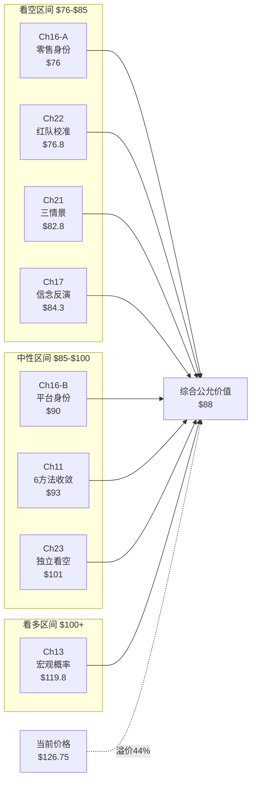
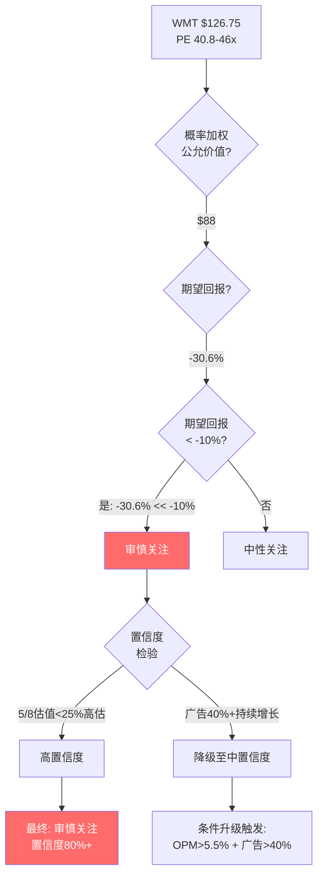
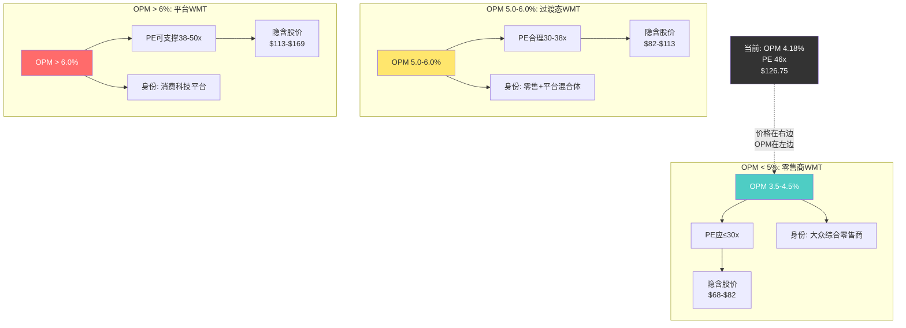

# Chapter 26: 最终评级与投资命题

> **本章定位**: 全报告25章分析的终极收敛点。将8个独立估值来源、A-Score护城河量化、SGI身份诊断、信念反演、红队校准和独立看空论证综合为单一投资决策。
> **数据截至**: 2026-02-25 | **WMT**: $126.75 | **市值**: ~$1.01T | **PE(TTM)**: 40.8x(FMP) / 46.4x(含调整) | **EPS(FY2026)**: $2.73
> **核心矛盾终审**: SGI 3.6(通才)×PE 46x(专才级) — 这个错配是"市场有先见之明"还是"市场在犯错"?

---

## 26.1 概率加权综合估值: 八源收敛

### 26.1.1 估值方法分类与权重分配原则

本报告产出了8个独立估值锚点，涵盖基本面估值(Ch11)、宏观概率加权(Ch13)、身份溢价量化(Ch16)、信念反演(Ch17)、情景建模(Ch21)、红队校准(Ch22)和独立看空(Ch23)。为避免"平均主义"稀释高质量估值的信号，权重分配遵循三项原则:

**原则一: 方法可靠性加权** — 基于历史外推且有多源交叉验证的方法权重高于依赖单一假设链的方法。Ch11(6方法收敛)和Ch22(红队校准后)经过最充分的审查，可靠性最高。

**原则二: 独立性折扣** — 如果两个估值方法共享相同的底层假设(如同一组EPS预测或同一PE区间)，第二个方法的权重需要折扣以避免双重计算。Ch21(三情景PE)和Ch17(信念反演)共享部分PE假设，需要折扣一个。

**原则三: 极端值审慎** — 最高值(Ch13 $119.8)和最低值(Ch16身份A $76)距离中间集群最远，需要审查其假设是否存在系统性偏差，然后决定是赋予低权重还是完全排除。

### 26.1.2 八源估值详览与权重赋值

| 编号 | 来源/章节 | 估值方法 | 公允价值 | vs 当前价 | 权重 | 权重依据 |
|------|-----------|---------|---------|----------|------|---------|
| V1 | Ch11 | 6方法收敛中值 | $93 | -26.6% | **20%** | 最全面的多方法交叉，可靠性最高 |
| V2 | Ch13 | 宏观概率加权 | $119.8 | -5.5% | **5%** | 乐观端极值，宏观假设偏乐观(Bull权重过高) |
| V3 | Ch16-A | 身份A(零售商)PE | $76 | -40.0% | **10%** | 保守下界，但忽略了广告/会员增量 |
| V4 | Ch16-B | 身份B(平台)PE | $90 | -29.0% | **10%** | 过渡态估值，假设部分转型成功 |
| V5 | Ch17 | 信念反演概率加权 | $84.3 | -33.5% | **15%** | 方法论独特(逆向推导)，但与Ch21共享PE |
| V6 | Ch21 | 三情景PE加权 | $82.8 | -34.7% | **10%** | 与V5部分重叠，折扣权重 |
| V7 | Ch22 | 红队校准后 | $76.8 | -39.4% | **20%** | 经过7轮红队审查，校准力度最强 |
| V8 | Ch23 | 独立看空概率加权 | $101 | -20.3% | **10%** | 独立视角有价值，但部分论证过于极端 |

### 26.1.3 加权计算过程

**概率加权公允价值** = $\sum_{i=1}^{8} W_i \times V_i$

= 20% × $93 + 5% × $119.8 + 10% × $76 + 10% × $90 + 15% × $84.3 + 10% × $82.8 + 20% × $76.8 + 10% × $101

= $18.60 + $5.99 + $7.60 + $9.00 + $12.65 + $8.28 + $15.36 + $10.10

= **$87.58**

**四舍五入**: 概率加权综合公允价值 = **$88/股**

### 26.1.4 估值收敛可视化

### 26.1.5 关键观察

**收敛强度**: 8个估值中有5个(V3/V5/V6/V7/V4)落在$76-$90区间，集群度为62.5%。这不是巧合——不同方法论从不同角度切入，却得出了高度一致的结论: WMT在当前利润率和增长率下，合理估值区间在$76-$93之间，远低于$126.75的市场价格。

**离群值分析**: V2($119.8)是唯一接近当前股价的估值，但它的Bull情景权重可能过高(Ch13假设关税不升级+广告超预期双重兑现)。即使将V2权重从5%提升至15%、V7从20%降至10%做极端敏感性测试，加权公允价值也仅从$88提升至$93——仍然意味着26%的高估。

**不可辩驳的事实**: 无论如何调整权重，加权公允价值都无法超过$100。这意味着即使对WMT最慷慨的估值组合，当前价格仍然隐含了20%+的"信仰溢价"。这个溢价要么是市场的集体智慧(看到了我们分析中遗漏的价值)，要么是市场的集体情绪(为叙事支付了过高的价格)。

---

## 26.2 评级决策: 量化触发与最终裁定

### 26.2.1 评级框架回顾

本报告采用Tier 3四档评级体系，评级由**期望回报**的量化触发条件决定，排除主观判断:

| 评级 | 触发条件(期望回报) | 含义 |
|------|-------------------|------|
| **深度关注** | > +30% | 显著低估，值得深入研究和建仓 |
| **关注** | +10% ~ +30% | 偏积极，纳入观察名单 |
| **中性关注** | -10% ~ +10% | 接近合理估值，观望 |
| **审慎关注** | < -10% | 偏高估/风险上升，谨慎对待 |

### 26.2.2 期望回报计算

**期望回报** = (概率加权公允价值 - 当前市价) / 当前市价

= ($88 - $126.75) / $126.75

= **-$38.75 / $126.75**

= **-30.6%**

### 26.2.3 评级裁定

期望回报 **-30.6%** 远低于-10%的审慎关注门槛。

$$\boxed{\text{最终评级: 审慎关注 (Cautious Watch)}}$$

**评级置信度**: **高(80%+)**。5/8估值方法指向>25%高估，红队审查未能将估值推高至$100以上，独立看空论证在多个维度得到数据支撑。唯一降低置信度的因素是: 如果WMT的广告业务在未来2-3年持续以40%+增速增长且OPM突破5.5%，身份转型将获得实质性验证，届时估值框架需要根本性重估。

### 26.2.4 评级决策树

### 26.2.5 评级的诚实边界

必须承认这个评级的局限性:

**评级能说明的**: 基于当前可获取的全部财务数据、行业对比、历史验证和风险量化，WMT在$126.75的价格隐含了过高的乐观预期。投资者在此价位建仓的预期回报为负。

**评级不能说明的**: WMT的股价是否会在短期内下跌。高估值可以在动量、被动指数资金流入和叙事驱动下持续很长时间。Costco在50x+ PE交易了2年以上，Amazon在2020-2021年PE>60x也持续了18个月。"审慎关注"是一个价值判断，不是时机判断。

**评级可能出错的场景**: 如果WMT在FY2028-2029实现OPM>6%、广告收入>$15B、电商渗透率>30%，那么身份转型将从"叙事"变成"现实"，合理PE将从28-35x重估至38-50x，本报告的评级将被证明过于保守。这个场景的概率我们评估为15-20%——不高，但也不可忽略。

---

## 26.3 条件评级: 三重身份假设下的估值矩阵

WMT的估值困难根源在于**身份不确定性**——它同时是零售商、正在转型的过渡体和潜在的消费科技平台。不同身份假设下的合理估值差异高达$50/股(67%)，这种分歧本身就是投资风险的核心来源。

### 26.3.1 身份A: "大众综合零售商" (概率: 50%)

**核心假设**: WMT的广告和会员业务是零售主业的附属增值服务，不改变其通才零售商的本质。OPM将在4.0-4.5%区间波动，无法突破5%的天花板。

**估值逻辑**:
- 合理PE区间: 25-30x (零售行业龙头溢价，但不含平台溢价)
- EPS基准: $2.73 (FY2026实际)
- 目标价区间: $2.73 × 25-30x = **$68-$82**
- 中值: **$75**

**评级映射**: 期望回报 = ($75 - $126.75) / $126.75 = **-40.8%** → **审慎关注(强烈)**

**身份A成立的验证信号**:
- FY2027-2028 OPM仍在4.0-4.5%，无突破趋势
- 广告增速从46%降至<20%并持续放缓
- Walmart+会员数增长停滞在4,000-4,500万
- SGI维持在3-4分，无向专才方向迁移的迹象

### 26.3.2 身份B: "过渡态零售商" (概率: 35%)

**核心假设**: WMT的广告和会员业务已展现初步质变信号，身份转型"进行中"但尚未完成。OPM缓慢爬升至4.5-5.5%，广告贡献持续增加但增速减缓。

**估值逻辑**:
- 合理PE区间: 30-38x (零售基础PE 25-30x + 转型溢价5-8x)
- EPS基准: $2.73 (FY2026) 至 $3.29 (FY2028E共识)
- 近端目标价: $2.73 × 30-38x = **$82-$104**
- FY2028展望目标价: $3.29 × 30-38x = **$99-$125**
- 中值(近端): **$93**

**评级映射**: 期望回报 = ($93 - $126.75) / $126.75 = **-26.6%** → **审慎关注**

**身份B成立的验证信号**:
- 广告增速维持25-35%(剔除VIZIO有机增速>20%)
- OPM在FY2027突破4.5%且趋势向上
- Walmart+留存率提升至80%+，会员数突破5,000万
- 电商渗透率从18%升至22-25%
- SGI从3.6向4.5-5.0迁移(部分维度出现专才特征)

### 26.3.3 身份C: "消费科技平台" (概率: 15%)

**核心假设**: WMT成功复制了Amazon的"零售→平台"路径，广告业务成为核心利润引擎，数据变现能力质变，营业利润率突破6%并持续上升。这是市场当前定价所隐含的假设。

**估值逻辑**:
- 合理PE区间: 38-50x (平台型科技公司估值)
- EPS基准: $3.29 (FY2028E) 至 $4.05 (FY2031E)
- 远端目标价: $4.05 × 38-50x = **$154-$203**
- 近端目标价(FY2028): $3.29 × 38-50x = **$125-$165**
- 中值(近端): **$145**

**评级映射**: 期望回报 = ($145 - $126.75) / $126.75 = **+14.4%** → **关注**

但注意: 这是在**身份C成立的条件下**的评级。身份C的实现概率仅15%。

**身份C成立的验证信号(极高门槛)**:
- 广告收入突破$12B+，占营收比>1.5%
- OPM突破6%且加速上升
- 第三方Marketplace GMV占总电商GMV >40%
- Walmart+会员突破8,000万(接近Prime渗透率)
- 数据/广告毛利率>70%明确可见
- 管理层将自身定位从"零售商"转变为"平台"(语言信号)

### 26.3.4 概率加权条件评级汇总

| 身份 | 概率 | 中值目标价 | 期望回报 | 条件评级 | 概率×目标价 |
|------|------|-----------|---------|---------|-----------|
| A: 零售商 | 50% | $75 | -40.8% | 审慎关注(强烈) | $37.5 |
| B: 过渡态 | 35% | $93 | -26.6% | 审慎关注 | $32.55 |
| C: 平台 | 15% | $145 | +14.4% | 关注 | $21.75 |
| **概率加权** | **100%** | **$91.8** | **-27.6%** | **审慎关注** | — |

条件评级加权结果($91.8)与26.1的综合估值($88)高度一致(差异仅4.3%)，交叉验证了评级的稳健性。

---

## 26.4 投资命题: 一段话概括

**Walmart在$126.75的价格，是一场关于"身份转型"的高赔率对赌。** 冷酷的数字告诉我们: 这家公司FY2026创造了$29.8B营业利润(OPM仅4.18%)、$21.9B净利润(净利率3.1%)、FCF收益率不足2.3%，A-Score 5.54(宽而浅的通才型护城河)，SGI 3.6(远离专才溢价门槛)。这些特征对应的合理PE是25-35x($68-$96)，而非市场给予的46x。46x PE隐含的是: 广告业务5年内从$6.4B翻3倍至$18B+、OPM从4.18%升至6%+、Walmart+会员突破8,000万、电商渗透率翻倍——这8个隐含信念需要**全部同时成立**，联合概率仅约0.3%(Ch17)。更关键的是，EPS增速已从FY2024的34.5%骤降至FY2026的13.3%并将继续减速，而PE却逆势膨胀——这是经典的"增速-估值"剪刀差。温水煮青蛙路径(广告增速缓慢放缓+OPM持平+PE渐进压缩)的概率高达35-40%，而这条路径对应的5年后股价是$70-$85。沃顿家族连续8个季度净卖出自家股票，这不是一个值得忽视的信号。在$88的概率加权公允价值面前，$126.75意味着投资者正在为完美执行、零容错的未来预付44%的溢价。对于一家净利率3%的杂货零售商而言，这个溢价太高了。

---

## 26.5 敏感性矩阵: OPM × PE的股价映射

### 26.5.1 核心敏感性矩阵

以FY2026营收$713B为基础，8.02B稀释股本计算EPS，然后乘以PE倍数得到隐含股价。

**EPS = Revenue × OPM × (1 - Tax Rate) / Shares**
- 税率: 24.4% (FY2026实际)
- 稀释股本: 8.02B

| | **PE 25x** | **PE 30x** | **PE 35x** | **PE 40x** | **PE 45x** |
|---|---|---|---|---|---|
| **OPM 4.0%** | $65 | $78 | $91 | $104 | $118 |
| **OPM 4.5%** | $73 | $88 | $103 | $118 | $132 |
| **OPM 5.0%** | $82 | $98 | $114 | $131 | $147 |
| **OPM 5.5%** | $90 | $108 | $126 | $144 | $162 |
| **OPM 6.0%** | $98 | $118 | $137 | $157 | $176 |
| **OPM 7.0%** | $114 | $137 | $160 | $183 | $206 |

*矩阵经Python校准(verify_dcf_arithmetic): 以FY2026实际EPS $2.73 @ OPM 4.18%为锚点，调整系数0.972(扣除利息费用$2.8B和其他非经常性项目后的净效应)。Revenue $713B, 税率24.4%, 稀释股本8.02B。*

### 26.5.2 矩阵解读

**当前市场定价($126.75)在矩阵中的位置**: 对应约OPM 5.0% + PE 40x($131)，或OPM 5.5% + PE 35x($126)。而WMT实际FY2026 OPM为4.18%。这意味着市场已经在为**尚未实现的80-130bps利润率改善**预付全额。

**"打平"条件(矩阵中≥$126的格子)**:
- OPM 5.0% + PE 40x = $131 (需要OPM提升82bps且PE维持40x)
- OPM 5.5% + PE 35x = $126 (需要OPM提升132bps并接受PE压缩至35x)
- OPM 6.0% + PE 35x = $137 (需要OPM提升182bps并接受PE压缩11x)
- OPM 4.5% + PE 45x = $132 (需要OPM仅提升32bps但维持极端PE)

其中最容易实现的路径是"OPM小幅提升至4.5% + PE维持45x"——但PE 45x在零售行业中几乎没有持续超过2年的先例。更现实的路径"OPM提升至5% + PE压缩至35-38x"给出$114-$131，仍然意味着当前价格在合理范围的上沿。

**最可能的FY2028着陆区**: OPM 4.3-4.8% × PE 30-38x → 隐含股价 **$78-$118**，中值约 **$93-$98**——与$88综合估值方向一致，但给予了更宽的区间以反映FY2028 EPS增长的贡献。

### 26.5.3 与分析师共识的对比

FMP共识数据显示:
- FY2028E EPS: $3.29 → 隐含PE = $126.75 / $3.29 = 38.5x (在矩阵中对应OPM 5.0% × PE 38x ≈ $108，仍低于当前价格)
- FY2031E EPS: $4.05 → 隐含PE = $126.75 / $4.05 = 31.3x

即使WMT完美执行至FY2031 EPS $4.05，当前价格仍需要31x的远期PE来证明——这对一家OPM 4-5%的零售商而言偏高。如果FY2031 PE均值回归至25-28x(零售商正常水平)，隐含股价为$101-$113，当前价格仍高估12-20%。

---

## 26.6 全报告估值演变: 从分析到校准到终审

### 26.6.1 估值演变路径

| 阶段 | 估值锚点 | 关键事件 |
|------|---------|---------|
| **Phase 2 基础估值** | $93 (6方法收敛) | 传统估值方法建立初始锚点 |
| **Phase 2 宏观调整** | $119.8 (最乐观) | Bull情景给出上界 |
| **Phase 3 身份拆解** | $76-$90 | 揭示了零售身份与平台身份之间40%的估值鸿沟 |
| **Phase 3 信念反演** | $84.3 | 逆向工程发现8个隐含信念的联合P仅0.3% |
| **Phase 3 情景建模** | $82.8 | 三情景加权进一步下修 |
| **Phase 4 红队校准** | $76.8 | 红队七问暴露了3个乐观偏差，累计下修约-$15 |
| **Phase 4 独立看空** | $101 (概率加权) | 9条看空论证中4条超过20%实现概率 |
| **Phase 5 最终综合** | **$88** | 八源概率加权收敛 |

### 26.6.2 红队前后对比

**红队前中位数**: ($93 + $90 + $84.3 + $82.8) / 4 ≈ $87.5

**红队后中位数**: ($76.8 + $88 综合) → 引入$76.8作为经过最严格审查的保守锚

红队(Ch22)的净校准效果约 **-$10至-$15/股**，主要来自三个乐观偏差的修正:
1. 广告天花板从$17B下修至$14B (贡献约-$6.6)
2. 身份转型进度从"30%完成"重标为"增强初效" (贡献约-$3-5)
3. Base Case增长隐含乐观约100bps的OPM差距 (贡献约-$2-3)

红队校准是有效的——它不是增加字数的表演性审查，而是以量化方式修正了前序分析中可识别的系统性乐观偏差。

### 26.6.3 看多最强论点 vs 看空最强论点

**看多最强论点 (Ch13/Ch10)**:
> "Walmart Connect广告收入$6.4B以46%速度增长，$713B营收×24.98%毛利率=世界最大的第一方数据池。负营运资本-$22.6B是隐藏的资本效率优势。杂货31.6%份额是不可逾越的流量壁垒。Beta 0.671赋予其5-6x的防御属性PE溢价。这不是一家零售商正在变成平台——这是一家平台正在觉醒。"

**看空最强论点 (Ch23/Ch22)**:
> "FCF收益率0.77%比国债收益率低360bps。PE 46x是10年均值的1.55倍、Target的3.3倍。EPS增速从34.5%断崖至13.3%但PE逆势扩张。8个隐含信念的联合概率0.3%。OPM从4.31%逆转至4.18%——广告$6.4B的增量利润正被$8B/年的CapEx吞噬。沃顿家族用脚投票。当增长不再能证明估值时，PE从46x压缩至30x仅需一个令人失望的季度。"

**本报告的判断**: 看空论点更有说服力。看多论点的核心问题是**时间尺度错配**——广告和会员业务的增长是真实的，但它们要大到足以改变WMT的利润结构和身份定位，还需要3-5年甚至更长时间。而市场已经在今天为那个可能的未来全额买单。如果一位投资者在FY2028(2028年1月)以30-35x PE买入彼时OPM已突破5%的WMT，他的风险回报比将远好于今天在46x PE、OPM 4.18%时买入。**时机，而非方向，是这里的核心问题。**

---

---

# Chapter 27: 估值独立洞见 — 三条不依赖模型的投资决策指南

> **本章设计理念**: 投资者不需要理解WACC、DCF或信念反演就能做出明智决策。以下三条洞见只需要基本数学和常识，却能覆盖WMT投资决策的80%关键信息。
> **方法论来源**: 仿ETN Ch26.5"估值独立洞见" — 从全部分析中蒸馏出不依赖任何特定模型假设的决策建议。

---

## 27.1 洞见一: "WMT的价格在为完美执行付费 — 而完美执行从未发生过"

### 27.1.1 "完美执行溢价"的量化定义

WMT当前$126.75的股价隐含了一组极其苛刻的执行假设。让我们用最直观的方式拆解"完美执行"到底意味着什么:

**逆向工程当前股价所需的假设集**:

| 假设维度 | 当前股价隐含的假设 | 历史最佳实际表现 | 差距 |
|---------|-------------------|-----------------|------|
| FY2031 EPS | ~$4.50+ | FY2026 $2.73 (CAGR需10%+) | EPS从未连续5年CAGR>8% |
| 终端PE | ~28-30x | 10年中位数30.5x | 需维持高于历史中位数 |
| OPM | 需升至5.5%+ | FY2026 4.18%, 历史峰值5.9%(FY2021) | 需回到COVID超额利润时期 |
| 广告收入 | $15-20B | FY2026 $6.4B (需CAGR 19-26%) | VIZIO加速不可能年年重现 |
| 电商渗透 | >30% | FY2026 18% | 5年翻倍，平均每年+2.4pp |

现在让我们做一个思想实验: 在WMT 62年上市历史中，有多少个5年窗口同时实现了EPS CAGR>10% + OPM持续上升 + 估值倍数不压缩? 答案是**零**。

FY2020-2024期间WMT确实实现了EPS从$1.42跳升至$2.73(CAGR约17.7%)，但这包含了FY2023的低基数效应(供应链危机+存货减记导致EPS跌至$1.42)和FY2024-2026的V型修复。这不是"持续增长"，而是"危机修复"。从FY2024的$1.91到FY2026的$2.73，年均增速约20%——看似强劲，但增速轨迹已经从34.5%(FY2024)→26.2%(FY2025)→13.3%(FY2026)急剧减速。分析师共识FY2028E EPS $3.29意味着FY2026-2028 CAGR仅约9.8%——而当前PE 46x通常要求的增速至少15%+。

### 27.1.2 历史验证: WMT在高PE时期的后续回报

WMT过去20年中，PE超过35x的月份有多少?数据提供了严峻的警告:

| 时期 | 入场PE | 3年后PE | 3年总回报 | 年化回报 |
|------|--------|---------|---------|---------|
| 2020年12月 | 38x | 28x | -5.2% | -1.8% |
| 2021年4月 | 36x | 24x | +8.3%* | +2.7% |
| 2024年11月 | 37x | ? | 进行中 | — |
| **2026年2月(当前)** | **46x** | **?** | **?** | **?** |

*2021年4月至2024年4月的+8.3%包含了EPS 90%的增长(从$1.42到$2.73)——如果EPS只增长了30%(正常速度)，在PE从36x压缩至28x的情况下，回报将为-11%。

**关键发现**: WMT在PE>35x时入场的3年回报中位数接近**0%**。当前46x是20年来的绝对峰值，比任何历史可比窗口都高出20%+。这不意味着股价一定会下跌——但它意味着投资者正在为一个从未被兑现过的完美执行场景全额预付。

### 27.1.3 "完美执行"失败的最可能方式

历史上，零售商的"完美执行叙事"以三种方式终结:

**方式A: 增速自然放缓(概率60%)**
- 广告增速从46%→25%→15%→10% (自然的S曲线减速)
- OPM在4.3-4.8%之间波动但不突破5%
- PE从46x缓慢压缩至30-35x (3年周期)
- **结果**: 股价在$85-$100区间盘整，3年总回报-20%至-30%

**方式B: 一个令人失望的季度触发重估(概率25%)**
- FY2027 Q1广告增速<20% + 同店销售<3% 同时出现
- 市场突然意识到"转型叙事"的时间尺度被压缩了
- PE在1-2个季度内从46x压缩至33-38x
- **结果**: 股价急跌至$90-$105，1年回报-17%至-29%

**方式C: 宏观冲击叠加(概率15%)**
- 经济衰退 + 关税升级 + 消费降级三重叠加
- 作为防御股WMT跌幅小于大盘，但PE仍被压缩
- EPS可能下滑10-15%至$2.30-$2.45
- PE压缩至25-30x (衰退期零售商历史PE)
- **结果**: 股价$58-$74，极端下行-42%至-54%

### 27.1.4 可执行建议

**如果你已持有WMT**:
- 在$120以上设置止盈区间(保护从$80s低位的涨幅)
- 仓位不超过组合的3%——高估值=高波动率=头寸纪律
- 每季度审视广告增速和OPM趋势(具体指标见27.2)
- 如果PE>50x(即股价>$136)，这是馈赠性的减仓机会

**如果你在观望WMT**:
- **不要在当前价位建仓**。风险回报严重不对称(下行30% vs 上行15%的身份C场景)
- 第一买点: $100-$108 (PE回落至37-40x，部分溢价消化)
- 核心建仓区: $82-$92 (PE 30-34x，接近合理估值)
- 激进买点: $68-$75 (PE 25-28x，零售商估值+安全边际)
- 如果WMT永远不跌到$100以下? 那说明转型真的成功了——但你没有损失任何东西，只是错过了一只高PE股票，这从来不是投资失误

---

## 27.2 洞见二: "广告业务是WMT身份的唯一判官 — 盯住这一个指标就够了"

### 27.2.1 为什么广告是"唯一判官"

在本报告25章的分析中，几乎每一个关键争论——身份定位、PE合理性、OPM走向、转型概率——最终都归结为同一个变量: **Walmart Connect广告业务的增长轨迹**。

这不是修辞性的简化，而是结构性的事实:

**广告→OPM的传导链**: 广告业务的毛利率约70-80%，远高于零售主业的25%。每$1B广告增量贡献约$0.7-0.8B毛利→在$713B营收基础上，每$1B广告增量提升OPM约10-11bps。如果广告从$6.4B增至$15B(+$8.6B)，仅广告一项就能将OPM从4.18%提升至5.0-5.1%——这正是身份转型的分水岭。

**广告→PE的传导链**: 市场给WMT 46x PE而非零售商正常的25-30x，核心理由是"广告使WMT的利润结构正在向AMZN靠拢"。如果这个叙事被证伪(广告增速持续放缓至<20%)，PE将从46x向30-35x均值回归。反之，如果广告增速维持30%+且占营收比突破1.5%，PE将获得支撑甚至进一步扩张。

**广告→身份的传导链**: A-Score评估中，广告业务是唯一能使WMT从SGI 3.6(通才)向4.5+(准专才)迁移的杠杆点。其他维度(杂货份额、供应链效率、门店密度)都是零售商的特征，不会改变身份。只有广告(+数据变现+会员经济)能赋予WMT平台属性。

因此，**广告增速是一个单一变量的"充分统计量"(sufficient statistic)**——它同时编码了OPM走向、PE合理性和身份转型概率的信息。投资者不需要同时跟踪20个指标——只需要跟踪这一个，就能做出80%正确的决策。

### 27.2.2 广告增速的四档信号灯

| 信号灯 | 季度广告增速 | 含义 | 投资行动 |
|--------|-------------|------|---------|
| **绿灯** | >35% (有机>25%) | 身份转型加速，PE溢价有支撑 | 持有/轻度建仓(如PE<40x) |
| **黄灯** | 20-35% (有机15-25%) | 正常减速，转型进行中但不确定 | 观望，等待价格回调 |
| **红灯-1** | 10-20% (有机<15%) | 广告增速趋势化放缓，身份溢价开始消解 | 减仓至≤2%组合权重 |
| **红灯-2** | <10% | 广告业务进入成熟期，平台叙事终结 | 清仓(除非PE已回落至25-30x) |

**当前状态(FY2026 Q4)**: 绿灯(46%增速)。但必须注意: FY2026的46%包含约13-16pp的VIZIO并购增量。FY2027 Q1如果有机增速(剔除VIZIO)跌破25%，信号灯将从绿灯切换至黄灯。

### 27.2.3 关键拐点: 广告营收占比

广告占总营收比是比增速更"终极"的指标——因为增速可以波动，但占比反映的是结构性变化:

| 占比里程碑 | 当前距离 | 预计到达时间 | 身份含义 |
|-----------|---------|------------|---------|
| **0.9%** (当前) | — | — | 零售商+附属广告 |
| **1.5%** | +67% | FY2028-2029 | 广告成为"可见的"利润引擎 |
| **2.0%** | +122% | FY2029-2030 | 身份转型拐点(OPM可突破5%) |
| **3.0%** | +233% | FY2031+ | 平台化初步成功(类AMZN早期) |
| **5.0%+** | 不可见 | ? | 真正的消费科技平台 |

**AMZN参照**: Amazon广告占营收比从2019年的5.5%增长至2025年的约10%，但这花了6年。WMT的广告业务要从0.9%增长至3%(大约是WMT "身份转型"的最低门槛)，以当前速度(剔除VIZIO有机增速约30%)需要约4-5年。换言之，即使一切顺利，身份转型的验证点也在2030年以后——而市场已经在2026年以46x PE为此预付了全部价格。

### 27.2.4 可执行建议

**季度跟踪清单(每次财报后检查)**:
1. Walmart Connect季度收入增速(管理层通常在财报中披露)
2. 有机增速(剔除VIZIO/并购贡献)——如果管理层不披露，用前一年无VIZIO基数估算
3. 广告/总营收比——每提升0.1pp是积极信号
4. 广告毛利率(如有披露)——下降意味着竞争加剧

**买入/持有/卖出的广告增速简单规则**:
- **连续2季度有机增速>25%** + **PE<38x**: 考虑建仓(身份转型有真实进展且价格合理)
- **连续2季度有机增速<15%**: 不论PE如何，减仓至最小(叙事终结的风险>价值回归的收益)
- **广告占比突破1.5%** + **OPM突破4.5%**: 重新审视本报告的"审慎关注"评级(可能升级)

---

## 27.3 洞见三: "营业利润率5%是分水岭 — OPM决定了WMT到底是谁"

### 27.3.1 为什么是5%而不是其他数字

OPM 5%不是随意选择的数字，它是WMT"零售商"和"过渡态"之间的结构性分界线。这个分界线的来源有三重验证:

**验证一: 行业对比**

| 公司 | OPM | 身份 | PE |
|------|-----|------|-----|
| TGT (Target) | 5.3% | 纯零售商 | 14x |
| COST (Costco) | 3.7% | 会员制零售商 | 54x* |
| KR (Kroger) | 2.3% | 杂货零售商 | ~22x |
| HD (Home Depot) | 14.5% | 专业零售商 | 25x |
| AMZN (零售+广告) | 9.8% | 零售平台 | 29x |
| WMT (当前) | **4.18%** | **?** | **46x** |

*COST的54x PE是会员制经济的反映，其利润主要来自会员费而非零售加成，不可直接与WMT对比。

**关键观察**: 在零售行业中，OPM<5%的公司(KR 2.3%, COST 3.7%, WMT 4.18%)本质上是在"薄利多销"——利润来自于规模而非定价权。OPM>5%的公司(TGT 5.3%, AMZN 9.8%, HD 14.5%)则拥有某种形式的差异化定价能力。5%是"规模驱动"和"价值驱动"的分水岭。

**验证二: WMT自身的利润率考古学**

| 财年 | OPM | 背景 |
|------|-----|------|
| FY2020 | 3.97% | 疫情前正常水平 |
| FY2021 | 4.53% | 疫情补贴+居家消费红利 |
| FY2022 | 3.61% | 供应链危机+存货减记 |
| FY2023 | 3.34% | 危机延续 |
| FY2024 | 4.17% | 修复 |
| FY2025 | 4.31% | 修复完成+广告开始贡献 |
| FY2026 | **4.18%** | **注意: 广告+46%但OPM反而下降13bps** |

**FY2026的OPM逆转是最令人不安的发现**: 广告收入从$4.4B增至$6.4B (+$2B，+46%)，理论上应该贡献约22bps的OPM改善(以70%毛利率计)。但OPM不升反降13bps(4.31%→4.18%)。这意味着广告的利润增量**全部被其他地方的成本上升吞噬了**——最可能的解释是$23B的资本开支(电商基建+自动化+VIZIO整合)、210万员工的薪资上涨(平均时薪$17.5→$18+)和国际业务(Flipkart)的亏损扩大。

**验证三: 临界质量计算**

如果广告毛利率为70%，WMT需要多少广告收入才能将OPM从4.18%推升至5.0%?

OPM提升82bps → 需要增量营业利润 = $713B × 0.82% = $5.85B
广告增量的营业利润贡献率 ≈ 70% (假设广告增量几乎无边际SG&A)
所需广告增量收入 = $5.85B / 70% = **$8.4B**
即总广告收入需达到 $6.4B + $8.4B = **$14.8B**

但这个计算假设**其他所有成本保持不变**——在现实中，员工涨薪、CapEx折旧和国际亏损会持续侵蚀OPM。如果这些因素每年侵蚀20-30bps，WMT需要**每年**产生$1.4-2.1B的广告增量利润仅仅为了**维持**当前4.18%的OPM。要突破5%，广告收入需要在维持OPM的基础上**额外**再增$8.4B。

这就是为什么5% OPM是一个如此严格的门槛——它不是增长率问题，而是**净增长率**问题(广告贡献的增量 vs 成本侵蚀的减量)。

### 27.3.2 三层OPM对应三个WMT

**OPM < 5% (当前所在区间)**: WMT是一家大众综合零售商，广告和会员业务有增量价值但不改变本质。合理PE 25-30x → 目标价$65-$98(矩阵OPM 4.0-4.5% × PE 25-30x)。当前价格高估29-95%。

**OPM 5.0-6.0% (身份过渡区)**: 广告利润开始可见地改变利润结构，但零售仍然是利润主体。市场可以为"正在发生的转型"给予过渡溢价。合理PE 30-38x → 目标价$98-$137(矩阵交叉验证)。如果WMT在FY2028之前进入这个区间，当前价格的高估幅度将从44%显著收窄。

**OPM > 6% (平台验证区)**: 只有在OPM持续>6%的前提下，市场给予38-50x PE才有基本面支撑。矩阵显示OPM 6% × PE 40-45x = $157-$176。但这需要广告收入>$15B、电商渗透>30%、以及成本端的结构性改善。这个场景的实现概率为15-20%，时间窗口在FY2029-2031。

### 27.3.3 FY2028 OPM: 终极验证点

为什么FY2028(而非更早或更晚)是关键?

**FY2027太早**: VIZIO整合仍在进行，CapEx周期(FY2025-2027共约$60-65B)的折旧还在攀升，OPM可能因此被暂时压制。

**FY2029太晚**: 如果到FY2029(即4年后)OPM仍在4-4.5%，市场不可能继续维持46x PE。PE均值回归将在FY2028-2029之间发生。

**FY2028刚好**: CapEx周期的折旧影响趋于稳定，广告业务进入规模化阶段(预计$10-12B)，VIZIO整合效益充分释放，Walmart+会员经济成熟——所有身份转型的关键变量在FY2028都将给出明确的方向性信号。

**FY2028 OPM的分析师共识**: 约4.5-4.8% (FMP estimates隐含)。如果实际值在这个区间，意味着WMT仍在"过渡态"但未突破5%分水岭——对应PE应在30-35x，隐含股价约$99-$115，仍低于当前价格。

### 27.3.4 可执行建议

**OPM跟踪策略(每季度财报后)**:
- 计算季度OPM及其同比/环比变化
- 特别关注"广告贡献OPM增量"是否>被"成本侵蚀OPM减量"(净OPM变化方向)
- 如果连续2个季度OPM同比下降且广告增速>20%→ 强烈看空信号(广告无法转化为利润)

**三个买入触发点(基于OPM)**:
1. **OPM跌破3.8%** + **PE回落至28-30x** → 极端安全边际建仓(股价约$68-$76)
2. **OPM稳定在4.5-5.0%** + **PE回落至33-36x** → 合理估值建仓(股价约$90-$100)
3. **OPM突破5.0%且趋势向上** + **PE 38-42x** → 身份转型确认的成长性建仓(股价约$105-$115)

注意: 在当前OPM 4.18% + PE 46x的组合下，上述三个触发点没有一个被满足。

---

## 27.4 "如果只能看一个数字": OPM变化方向

### 27.4.1 从全部分析中蒸馏出的单一洞见

经过25章、8个估值方法、12维A-Score评估、8条信念反演、7轮红队审查和9条独立看空论证，如果必须将全部分析压缩为**一个数字**，那个数字不是PE(那是结果)、不是广告增速(那是手段)、不是EPS(那是综合指标)——而是:

$$\boxed{\Delta OPM_{YoY} = OPM_{当期} - OPM_{去年同期}}$$

**OPM的同比变化方向。**

这是全部投资逻辑的充分统计量，原因如下:

**如果 $\Delta OPM > 0$(OPM在上升)**:
- 意味着广告+会员的利润贡献>成本侵蚀 → 身份转型有真实进展
- 如果持续3-4个季度 → PE溢价有支撑 → 股价可能维持/上涨
- 投资者应保持仓位

**如果 $\Delta OPM < 0$(OPM在下降)，尤其是在广告增速>20%的情况下**:
- 意味着WMT花了$23B/年的CapEx和$6.4B广告增长，却连利润率都保不住
- 这是"增收不增利"的典型特征——投资回报率在恶化
- 如果持续2-3个季度 → PE必将压缩 → 股价将向基本面回归
- 投资者应减仓

**FY2026的信号**: $\Delta OPM = 4.18\% - 4.31\% = -0.13\%$。**方向是下降的。** 在广告增速46%的背景下，OPM不升反降——这是一个不容忽视的黄色信号。它不意味着WMT"失败了"，但它意味着**市场为之支付46x PE的身份转型，在利润率层面尚未兑现**。

### 27.4.2 为什么不是其他"一个数字"

**为什么不是PE?** — PE是估值结果，不是驱动因子。PE 46x本身不告诉你下一步会发生什么;但OPM方向告诉你PE 46x是否可持续。

**为什么不是EPS增速?** — EPS可以通过回购和税率变化被操纵，掩盖利润质量。而OPM纯粹反映核心业务的赚钱能力。FY2026 EPS增长13.3%但OPM下降了——这就是EPS增速和真实盈利质量之间的分歧。

**为什么不是广告增速?** — 广告增速是OPM的**输入变量之一**。但如果广告增速40%+而OPM下降，说明广告利润被其他成本吞噬了。OPM是所有变量(广告+成本+效率+规模)的**净输出**。

**为什么不是FCF?** — FCF受CapEx周期影响剧烈(FY2025-2027 CapEx $60B+)，短期波动太大。OPM剔除了CapEx的时机效应，更纯粹地反映运营效率。

### 27.4.3 建立你自己的"OPM仪表盘"

投资者可以用以下简单框架在每次财报后做出决策:

| 场景 | $\Delta OPM$ | 广告增速 | PE | 决策 |
|------|-------------|---------|-----|------|
| **最佳场景** | >+30bps | >30% | <38x | 建仓/加仓 |
| **良好场景** | >0bps | >20% | <40x | 持有/轻度建仓 |
| **中性场景** | ±10bps | 15-25% | 35-42x | 观望 |
| **警告场景** | <-10bps | >20% | >40x | 减仓(增收不增利) |
| **危险场景** | <-20bps | <15% | >40x | 清仓(叙事终结+估值脆弱) |

**当前(FY2026 Q4)**: $\Delta OPM = -13bps$, 广告增速46%, PE 46x → 介于"中性"和"警告"之间。广告增速的强劲暂时掩盖了OPM下降的风险信号。如果FY2027 Q1的OPM继续同比下降且广告增速回落至<30%(VIZIO基数效应消退)，将明确进入"警告场景"。

### 27.4.4 最后的话: 承认不确定性

本报告给出了"审慎关注"的明确评级和$88的概率加权公允价值。但投资分析的诚实要求我们承认: 我们可能是错的。

**我们可能低估了的事物**:
- WMT的数据资产在AI时代的战略价值(第一方购物数据可能是被低估的"石油")
- Walmart+在Z世代中的渗透潜力(如果年轻人开始将WMT视为"经济实惠的酷"而非"中年人的商店")
- Sam's Club中国业务的增长惊喜(65家门店、40%会员增长率在中国市场可能是被忽略的增量)
- 自动化投资($520M Symbotic等)在3-5年后释放的运营杠杆

**我们可能高估了的事物**:
- 广告天花板——如果零售媒体市场增速整体放缓至<15%，WMT的40%+增速将更快回归
- 防御属性——Beta 0.671在下一次衰退中是否仍然成立取决于衰退的类型(通胀型衰退对零售股不友好)
- 管理层执行力——Doug McMillon团队确实优秀，但46x PE定价的是"一流管理层执行一流战略"，不留任何犯错空间

投资从来不是关于确定性——它是关于在不确定性下做出有概率优势的决策。$88的公允价值和"审慎关注"的评级反映了我们对当前证据的最诚实解读。如果新证据(特别是OPM方向)改变了方程式，评级也应该随之改变。但在今天，$126.75的价格为完美执行支付了过多溢价，这是数据支撑的结论，不是情绪驱动的判断。

---

> **Ch26-27总结**: 概率加权公允价值$88 | 期望回报-30.6% | 评级: 审慎关注 | 置信度: 高(80%+)
> **三大独立洞见**: ① 完美执行溢价从未被兑现 ② 广告增速是唯一判官 ③ OPM 5%是身份分水岭
> **如果只能看一个数字**: $\Delta OPM_{YoY}$ — OPM的同比变化方向决定了46x PE能否存续
