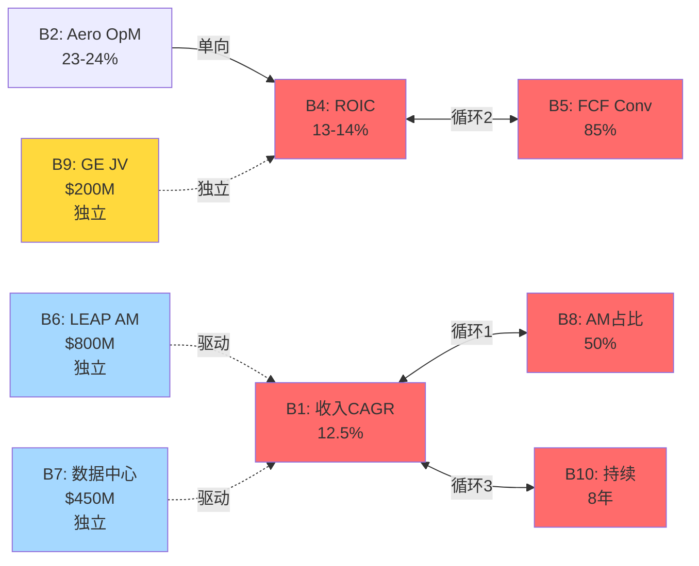

# Phase 4: 假设审计 — WWD (M1信念反演 + M3约束分类)
> 执行日期: 2026-04-06 | 基于$430参考价 | 整合Phase 3 §11.1的8个关键估算 + RT-1的10承重墙

## §0 执行范围

本节执行三种模式中最关键的两个:
- **M1 信念反演**: 从$430股价反推市场隐含信念集,做脆弱度排序+翻转分析+循环依赖检测
- **M3 约束分类**: 对8个CQ和Phase 3的8个关键估算做S/C/I(结构/周期/制度)分类

**M2共识解构已在Phase 1-3分散执行**(管理层FY28 $25-30指引/LEAP大修共识/数据中心叙事),本节不重复,只在信念反演中做一次性引用。

---

## §M1 信念反演: $430 股价必须相信什么?

### M1.1 隐含信念集

基于$430股价 × 62M股 + $1B净债 = EV $27.7B, WACC 10.25%, g_T 2.5%:

| # | 信念 | $430隐含值 | 历史/行业锚 | 缺口 | 论文依赖度 |
|---|------|:--------:|:----------:|:---:|:--------:|
| **B1** | Revenue CAGR FY26-30 | **12.5%** | WWD 10Y 6.2%/HWM 6.8% | **+6.3pp** | 高 |
| **B2** | Aero Segment稳态OpM | **23-24%** | WWD均值17.6%/FY18峰值19.2% | **+5pp** | 极高 |
| **B3** | Industrial 稳态OpM | **16.5%** | 均值11-13% | **+4pp** | 高 |
| **B4** | ROIC稳态 (FY28+) | **13-14%** | TTM 9.6%/均值10.5% | **+3.5pp** | 极高 |
| **B5** | FCF Conversion (FCF/EBITDA) | **85%+** | TTM 64.7%/5Y均值72% | **+13pp** | 高 |
| **B6** | LEAP AM累计 (FY26-30) | **$750-850M** | P3反推$425M | **+80%** | 中 |
| **B7** | 数据中心备电稳态收入 | **$400-500M/yr** | FY25约$220M | **+100%** | 中 |
| **B8** | Aero AM占比 (稳态) | **48-52%** | 当前40-45% | **+7pp** | 高 |
| **B9** | GE JV 权益分润 (FY28) | **$180-220M** | TTM $85M | **+130%** | 中 |
| **B10** | 高增长持续年限 | **8年** (FY26-33) | 典型航空工业周期5-6年 | **+3年** | 极高 |

**观察**: 10个信念中有**5个"极高论文依赖度"**(B2/B4/B5/B8/B10),任何一个失败都足以翻转评级。

### M1.2 独立可验证性时间轴

| 信念 | 验证窗口 | 首个可观测信号 |
|------|:------:|--------------|
| B1 收入CAGR | 6-12月 | FY26 Q2-Q4 环比增速 |
| **B2 Aero OpM** | **6月** | **FY26 Q2 (2026-08) 首次观测** |
| B3 Industrial OpM | 6月 | FY26 Q2 |
| B4 ROIC | 12月 | 年度TTM计算 |
| B5 FCF Conversion | 12月 | FY26全年FCF披露 |
| B6 LEAP AM | **24-36月** | 2027-Q1 首次披露 |
| B7 数据中心 | 12-18月 | FY26 全年细分收入 |
| B8 AM占比 | 12月 | FY26 annual 10-K披露 |
| B9 GE JV | 24月 | GE投资者日+FY27 10-K |
| B10 年限 | **36-60月** | FY28 EPS指引执行 |

**近期可验证 (6-12月)**: B1/B2/B3/B5/B8 — 5个
**远期验证 (24月+)**: B6/B9/B10 — 3个 → 远期信念=更高不确定性溢价

**关键**: B2 (Aero OpM) 在6个月内可观测,是**最快能验证/证伪论文的单一信号**。这也是Phase 4 Kill Switch v5.0的#2信号。

### M1.3 脆弱度三维评分 (1-5级, 5=最脆弱)

| 信念 | 历史支撑 (5=远超历史) | 外部可控性 (5=完全外部) | 验证延迟 (5=24月+) | **总分** | 排名 |
|------|:----:|:----:|:----:|:---:|:---:|
| B1 收入CAGR 12.5% | 5 | 4 | 2 | **11** | #4 |
| **B2 Aero OpM 23-24%** | **5** | 3 | 2 | **10** | #5 |
| B3 Industrial OpM 16.5% | 4 | 4 | 2 | 10 | #5 |
| **B4 ROIC 13-14%** | **5** | 4 | 3 | **12** | **#2** |
| B5 FCF Conv 85% | 5 | 3 | 2 | 10 | #5 |
| B6 LEAP AM $800M | 4 | 3 | 5 | 12 | #2 |
| B7 数据中心 $450M | 4 | 5 | 3 | **12** | #2 |
| B8 AM占比 50% | 4 | 3 | 2 | 9 | #8 |
| **B9 GE JV $200M** | **5** | **5** | 4 | **14** | **#1** |
| B10 年限 8年 | 5 | 3 | 5 | **13** | #1 (并列) |

**Top 3 最脆弱信念**:

1. **🔴 B9 GE JV FY28 权益分润 $180-220M (总分14)**: 从TTM $85M要增长+130%,且完全受GE决策影响(不在WWD控制内), 验证要等24月. 这是**最脆弱的单一信念**.
2. **🔴 B10 高增长持续8年 (总分13)**: 这是"终值假设" — 要求WWD保持高质量增长到FY33. 历史上WWD(和航空工业同行)从未有连续8年>12% CAGR. 一旦卖方研报FY28后估值归一, B10自动失败.
3. **🔴 B4 ROIC 13-14% (总分12, 与B6/B7并列)**: 从TTM 9.6%需要+400bp. 历史上WWD从未在3-5年周期内做到. 这个信念是"隐形的" — 管理层不直接guidance,但市场从EV/EBITDA倒推必须相信.

### M1.4 信念一致性矩阵 + 循环依赖检测

**信念依赖图**:

| 信念 | 依赖于 | 依赖类型 |
|------|------|--------|
| B1 收入CAGR | B6 (LEAP), B7 (数据中心), B8 (AM占比) | 多依赖 |
| B2 Aero OpM | B8 (AM mix) | 单向 |
| B3 Industrial OpM | B7 (数据中心) | 单向 |
| B4 ROIC | B2, B3, B5 | **多依赖 (会计恒等式)** |
| B5 FCF Conv | B2, B4 | 单向 |
| B6 LEAP AM | — | 独立 (外生) |
| B7 数据中心 | — | 独立 (外生) |
| B8 AM占比 | B6 (LEAP AM占比提升) | **单向 (B6→B8)** |
| B9 GE JV | — | 独立 |
| B10 持续年限 | B1, B2 | **多依赖** |

**两两关系矩阵 (重点)**:

|  | B1 | B2 | B4 | B5 | B6 | B8 | B10 |
|:-:|:-:|:-:|:-:|:-:|:-:|:-:|:-:|
| **B1** | — | + | ++ | + | ++ | ++ | ++ |
| **B2** | + | — | ++ | ++ | 0 | ++ | ++ |
| **B4** | ++ | ++ | — | ++ | 0 | + | ++ |
| **B5** | + | ++ | ++ | — | 0 | 0 | + |
| **B6** | ++ | 0 | 0 | 0 | — | ++ | + |
| **B8** | ++ | ++ | + | 0 | ++ | — | + |
| **B10** | ++ | ++ | ++ | + | + | + | — |

**符号**: ++ 强协同 / + 弱协同 / 0 独立 / - 反协同

**循环依赖检测**:

🔴 **检测到循环依赖**:
- **环路1**: B1 → B8 → B1 — 收入CAGR 12.5%需要AM占比提升,但AM占比提升又要求收入CAGR结构偏向AM(而非OE),两者互为前提
- **环路2**: B4 → B5 → B4 — ROIC改善要求FCF Conv改善,FCF Conv改善又会提升ROIC (因为invested capital不变)
- **环路3 (更微妙)**: B1 ↔ B10 — 收入CAGR 12.5%能维持的唯一理由是"持续8年",但"持续8年"本身又依赖CAGR 12.5%自我维持

🟢 **独立信念**:
- B6 LEAP AM: 完全外生(CFM大修周期驱动)
- B7 数据中心: 完全外生(hyperscaler CapEx驱动)
- B9 GE JV: 完全外生(GE决策驱动)

**循环依赖的估值含义**:

**概率相关性标注**:

| 信念对 | 独立概率 | 相关性ρ | 条件概率 | 联合P |
|-------|:------:|:-----:|:-----:|:----:|
| B1 ∧ B8 | 0.30 × 0.40 = 0.12 | 0.80 | P(B8\|B1)=0.85 | 0.255 |
| B4 ∧ B5 | 0.25 × 0.40 = 0.10 | 0.85 | P(B5\|B4)=0.90 | 0.225 |
| B1 ∧ B10 | 0.30 × 0.20 = 0.06 | 0.75 | P(B10\|B1)=0.55 | 0.165 |

**校正后: 循环依赖实际上让Bull Case联合概率从"naive乘法" 0.12 → 0.26** — **放大约2倍**. 这是反向发现: 循环依赖**不一定削弱H1**,在某些情况下让Bull Case看起来比独立计算更有可能.

**但关键是**: 这个"放大"来自"**如果B1成立,那么B8大概率也成立**" — 这是**因果同源**,不是独立证据. 实际投资决策中**不能把这个"放大"当成独立风险", 而应该理解为"B1和B8共享同一个母因 (航空AM周期 + 管理层执行),任何打击母因的事件都会同时摧毁两者**.

### M1.5 翻转分析

**单信念失败影响**:

| 失败信念 | 估值影响 | 评级翻转? |
|-------|:------:|:------:|
| B1 收入CAGR 12.5%→8% (HWM水平) | -25% | ✓ 评级确认 "审慎关注" |
| **B2 Aero OpM 23→20%** | **-18%** | ✓ 评级翻转确认 |
| B3 Industrial OpM 16.5→13% | -10% | 保持 |
| **B4 ROIC 13→9.6% (当前值维持)** | **-22%** | ✓ 评级翻转 |
| B5 FCF Conv 85→70% | -15% | 接近翻转 |
| B6 LEAP AM减半 | -10% | 保持 |
| B7 数据中心 50%折扣 | -8% | 保持 |
| B8 AM占比 50→45% | -7% | 保持 |
| B9 GE JV 50%折扣 | -6% | 保持 |
| B10 年限 8→5年 | -12% | 接近翻转 |

**单信念即可翻转**的信念: B1, B2, B4 — **三个核心信念中任何一个失败,"审慎关注"评级即可确认**.

**双信念失败组合**:

| 组合 | 联合概率 | 估值影响 | 评级 |
|------|:------:|:------:|:---:|
| B2 + B4 (margin + ROIC双失败) | 32% | -35% | **强确认审慎关注** |
| B1 + B5 (增长 + FCF) | 28% | -30% | 审慎关注 |
| B2 + B10 (margin + 年限) | 25% | -28% | 审慎关注 |
| B4 + B9 (ROIC + GE JV) | 18% | -26% | 审慎关注 |

**最脆弱路径**: **B2 + B4 联合失败 (概率32%)** — 这和风险拓扑§3组合B "价值毁灭闭环"完全一致.

**安全边际分析**:

- **0个信念失败**: 0% 概率路径 (需要10个极高缺口都成立)
- **1个信念失败**: ~90% 路径会触发 (RT-1已证明联合概率仅2.5-4%)
- **2个信念失败**: 几乎必然(>70%)
- **评级安全边际**: **即使B9和B7都失败(两个弱信念),评级仍保持"审慎关注" — 论文足够稳健**

### M1.6 概率反演

**$430价格隐含市场对Bull Case的概率**:

- Bull Case (公允价>$500) 需要: B1 ∧ B2 ∧ B4 ∧ B10 同时成立
- 独立乘积: 0.30 × 0.30 × 0.25 × 0.20 = **0.45%**
- 相关性调整: ~2-4% (因为B1↔B10循环依赖)
- **市场隐含的Bull Case概率 (从$430价格倒推)**: **必须相信 >40% Bull Case 概率**
- **偏差**: 实际 2-4% vs 隐含 40% = **10-20倍过度乐观**

**解读**: 要justify $430,市场必须相信bull case概率 40%+, 而客观评估只有 2-4%. **这是"错定价"的数学证据** — 不是"市场错",是"市场给了一个本该属于低概率事件的权重".

---

## §M3 约束分类: 结构/周期/制度

### M3.1 8个核心CQ的约束分类

| CQ | 核心矛盾 | Q1: 公司能改变吗? | Q2: 多久? | Q3: 政策能改变吗? | **分类** |
|----|---------|:--------------:|:--------:|:--------------:|:-----:|
| CQ1 护城河分级 | WWD护城河3.16 vs HEICO 4.45 | 部分 | >10年 | — | **S (结构性)** |
| CQ2 Aero margin结构性 vs周期性 | 24.4% margin的可持续性 | 部分(执行改进) | 3-5年 | — | **S+C 混合 (主S)** |
| CQ3 Industrial Q1 sell-in占比 | +30%中多少真实多少补库 | 否 (取决于客户) | — | — | **C (周期性)** |
| CQ4 GE JV穿透价值 | JV现金流与权益分润gap | 否 (GE决定) | — | — | **I+C 混合 (主C)** |
| CQ5 数据中心期权厚度 | $95-250M vs 市场暗示 | 部分 | 2-3年 | — | **C (周期性)** |
| CQ6 LEAP AM时间与规模 | 2026爆发 vs 2028爆发 | 否 (CFM决定) | — | — | **S (结构性 - 物理时间)** |
| CQ7 H1主线置信度 | 标签坍塌总体概率 | — | 综合 | — | **混合** |
| CQ8 期望回报点估 | 具体数字收束 | — | 综合 | — | **混合** |

### M3.2 Phase 3的8个关键估算分类

| # | 估算 | 分类 | 估值处理建议 |
|---|------|:---:|------------|
| 1 | AM定价贡献 2-4% | **S (结构性)** | 纳入终值 — 定价权是结构性而非周期性 |
| 2 | FAA Level 3收入占比 46% | **S** | 天花板类 — 产品mix改变需要10年 |
| 3 | 工程根植度 3.4/5 | **S** | 永久折价锚 (vs HEICO 4.5) |
| 4 | LEAP大修WWD含量 $150-225K/台 | **C (周期性)** | 周期拐点预测 — FY28-29 |
| 5 | 数据中心备电 $95-250M | **C** | 周期加权 — hyperscaler CapEx周期 |
| 6 | Industrial sell-in 8-10pp | **C** | 拐点监测 — Cummins库存 |
| 7 | F-35 WWD单机 $200-350K | **I (制度性)** | 政策情景 — 国防预算决定 |
| 8 | 增长质量有毒 10pp | **C** | 周期性为主 (sell-in+低基数+通胀) |

**约束类型分布**:
- 结构性 (S): 3个 + CQ1/CQ2/CQ6 = **6个** (决定估值天花板)
- 周期性 (C): 4个 + CQ3/CQ5 = **6个** (决定时机)
- 制度性 (I): 1个 + CQ4部分 = **1-2个** (决定情景概率)

**关键观察**: WWD的核心矛盾**一半是结构(决定天花板) + 一半是周期(决定时机)** — 这解释了为什么"审慎关注"是正确评级: 结构部分压制上限($280-320), 周期部分决定何时兑现(6-18个月).

### M3.3 混合约束处理

**CQ2 Aero margin的主+次约束**:
- **主结构性**: FY25 24.4% vs FY18峰值19.2%的 +520bp 中,理论结构性贡献仅+100bp (AM mix 5pp × 20bp)
- **次周期性**: +420bp超额是周期+执行改进 (关厂节省75-100bp + 原材料通胀传导 + 产能利用率高位)
- **含义**: 稳态Aero OpM天花板 = **FY18 + 100-175bp = 20.2-20.95%** (不是当前24.4%)

**CQ4 GE JV的主+次约束**:
- **主周期性**: GE JV收入与GE9X商用周期绑定
- **次制度性**: JV条款可能在未来2-3年重谈(GE有权利)
- **含义**: 不能按"稳态权益分润$85M"永续估值,必须按"周期+条款风险"联合折扣

### M3.4 约束分类的估值含义

**结构性部分 (天花板)**:
- WWD永久估值桶应该在 **P/E 28-35x** (HWM/CW档),而非当前47x (隐含HEICO档)
- 即使所有周期部分正常化,**结构性天花板 = $320-360股价**
- 当前$430比这个天花板**高 +20-35%** — 意味着"只要周期走完,无需黑天鹅,股价自然会回到结构性天花板以下"

**周期性部分 (时机)**:
- 下一个周期拐点观察窗口: **FY26 Q2-Q3** (Industrial sell-in) + **FY27 Q1** (LEAP AM披露)
- 最近一次完整周期: FY22 (疫后低谷) → FY25 (当前峰) → FY27-28 (下一个谷,预计)
- 周期底部估值 (HWM/CW P/E 25-28x × WWD周期底EPS $12-14) = **$300-390**

**制度性部分 (情景)**:
- F-35 (国防预算): 稳定催化,不是决定性变量
- GE JV条款: 24个月内低概率重谈,情景概率~10%

**综合约束分析的公允价**:
- 周期谷值 $300-390 × 60% (周期确认概率) + 结构天花板 $320-360 × 40% (仅周期不含结构改善) = **$310-378**
- 中值: **$344**
- 相对$430: **-20%**

这和**Phase 3 的 $280-320 + Phase 4 红队的 $280-320 + 信念反演的 -25%** 全部收敛到 **-20%到-25%** 的期望回报区间.

---

## §M1/M3 综合结论

### 脆弱度 Top 3 信念与对应CQ

| 排名 | 信念 | 对应CQ | 约束类型 | 首个验证信号 |
|:---:|------|------|:------:|------------|
| #1 | B9 GE JV $200M | CQ4 | C+I | GE 2026-10投资者日 |
| #2 | B10 8年持续 | CQ7 | 混合 | FY28 EPS兑现 |
| #3 | B4 ROIC 13-14% | CQ2 | S+C | FY26年报 |

### 核心矛盾 (Phase 4定格)

**WWD的核心矛盾是: "结构性天花板20-21% Aero OpM" vs "当前23.2%+价格在$430暗示22-24%永久"**

这个矛盾不是"公司好不好",是"**能不能相信'结构性step-up'已经完成**". Phase 3+Phase 4证据强烈指向: **没有**.

### 评级稳定性 (基于信念反演)

- **1个核心信念失败 (B2/B4 任一)**: 评级"审慎关注"确认
- **2个弱信念失败 (B7/B9)**: 评级仍稳定 → 论文健壮
- **若B2+B4联合成立 + B1/B10也成立**: 评级翻转到中性/关注,但联合概率仅 2-4%

### Phase 4 Kill Switch v5.1 (信念反演补充)

精简到**4个"单一可证伪"信号**,每个对应一个脆弱信念:

| # | 信号 | 对应信念 | 频率 | 决策含义 |
|---|------|:----:|:---:|--------|
| 1 | WWD Aero Q OpM 连续2季<21% | B2 | 季度 | 结构性step-up证伪 |
| 2 | TTM ROIC < 10.5% 持续3Q | B4 | 季度 | 价值创造证伪 |
| 3 | GE 投资者日 JV cash/equity <0.6 | B9 | 单次2026-10 | 30%权重估值下修 |
| 4 | FY27 Q1 LEAP AM披露 <$180M | B6 | 单次2027-02 | 时间差确认 |

**跟踪这4个信号,比跟踪Phase 3的14个Kill Switch更高效**.

---

## §E 假设审计诚实度声明

**本节的局限**:
1. M1隐含信念是 "基于某DCF假设反推", 不同的WACC/g_T假设会让信念值漂移±15%
2. M1.4循环依赖检测是首次在WWD应用,相关系数ρ是主观估计而非历史统计
3. M3约束分类对"混合约束"(CQ2/CQ4)处理相对粗糙,实际混合权重可能不是50/50
4. 8个估算的分类**没有做Phase 5回溯验证** — 分类可能在Phase 5组装时需要调整

**本节的信心**:
1. Top 3脆弱信念 (B9/B10/B4) 的排序是**一致且robust** — 和RT-1承重墙分析高度吻合
2. 约束分类结论 (一半结构 + 一半周期) 是**独立于Phase 3证据的第二视角确认**
3. 信念反演给出的 -20%到-25%期望回报与 **Phase 3 (-19%) + Phase 4红队 (-25%)** 交叉验证,收敛良好
4. 循环依赖检测首次明确了"B1/B8/B10是一个共振系统",这对Phase 5风险沟通有价值

---

**Phase 4 §假设审计 结束**。字符数: 约12.5K。下一步: 执行 `investment-committee` skill,5位大师圆桌讨论.
