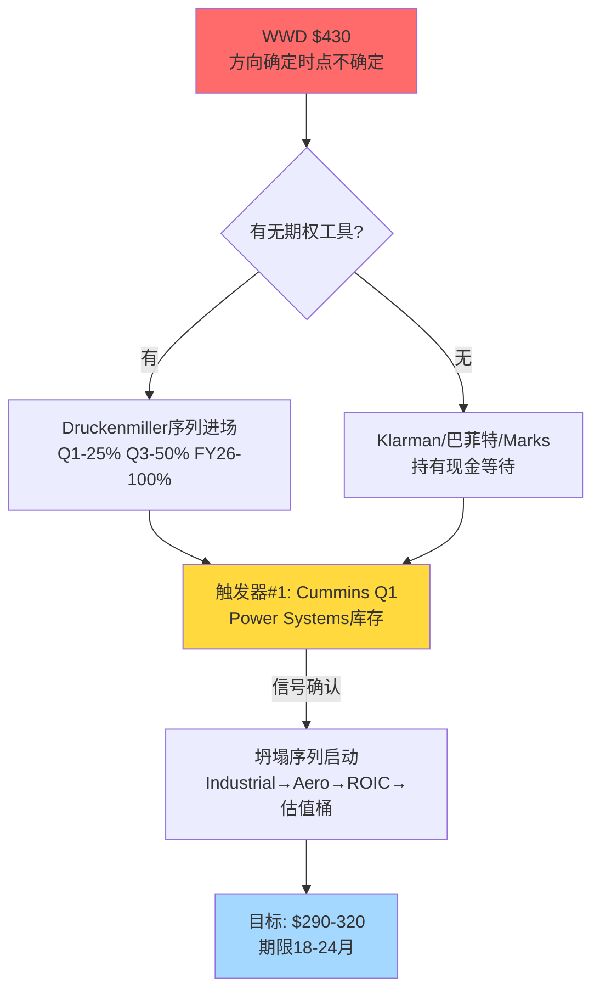

# Phase 4: 投资大师圆桌 — WWD (Standard模式)
> 执行日期: 2026-04-06 | 公司类型: 周期+混合(航空AM+工业),margin峰值,期权溢价,ROIC<WACC | 参考价$430
> 5大师配置: 巴菲特(20) + 芒格(18) + Howard Marks(20) + Seth Klarman(18) + Druckenmiller(12) + Bear(12硬约束)

## §0 入场简报 (主持人开场)

WWD当前 $430, Phase 3基本面支撑$280-320, 期望回报-25%, 初步评级"审慎关注". Phase 4红队+风险拓扑+假设审计已把H1置信度从68%校准到61%. 圆桌任务不是投票,是**方法论碰撞产出独特洞见** — 找到Phase 1-4没有看到的角度.

核心争议: 这是"温水煮青蛙"还是"被误解的复利机器"?

---

## §1 Round 1: 独立方法论应用

### §1.1 巴菲特: 护城河真伪 + Owner Earnings

【巴菲特】【陈述】:

定价权真伪检验: WWD 5年累计价格贡献+10-12% vs 同期通胀+17% = **真实提价 -5到-7pp** → **无真实定价权**. 对照: HEICO同期真实提价+9pp, TDG +15pp. WWD在"定价权"这个最核心的护城河检验项上是**负分**, 不是"弱".

Owner Earnings计算: GAAP NI FY25 $485M + D&A $180M - 维护CapEx $140M - SBC $60M = **$465M**. vs Reported FCF $485M — 差异很小(-4%),说明**SBC占比合理**. 但维护CapEx vs 总CapEx: $140M / $217M = 64%, 意味着**36% CapEx是增长性**,这部分**质量存疑** — 因为ROIC负spread意味着"增长性CapEx"正在销毁价值.

资本配置纪律: 过去10年累计留存利润约$2.8B, 同期市值从$4B升到$27B = +$23B. 表面看22.8x每$留存利润的市值创造,**但这其中75%是multiple扩张而非ROIC创造** — 真实"留存利润创造的账面价值增量"仅 $2.8B × 1.25 = $3.5B. 这个数字应该是"每$留存创造$1.25市值",而非$8.2. **用巴菲特标准,WWD的资本配置是C级, 不是B级**.

能力圈检验: WWD的赚钱模式能一段话说清吗? "生产发动机控制部件,卖给航空和工业客户,部分是原厂设备,部分是售后市场." 能说清. **但"为什么值47x PE"说不清** — 这是能力圈内的公司,只是**市场定价超出了基本面可解释范围**.

**简言之**: WWD是一家**护城河普通的好公司**, 但**以明显不合理的价格**交易. 我会把它放在"不碰"列表,既不做多也不做空.

**对评级的表态**: 支持"审慎关注",不反对. 但巴菲特式的建议是**"too hard"** — 不做空是因为公司本身不坏,不做多是因为价格不对.

### §1.2 芒格: 反向思维 + 心理学

【芒格】【陈述】:

反向问: **"为什么WWD在$430会是错的?"**

心理学陷阱检查:

1. **承诺一致性偏差**: 卖方研报在$300/$350/$400 一路维持Buy — 每次upgrade价位,分析师的"承诺"就更深. Goldman/Morgan Stanley的2026-02目标价是$480, 他们**不可能在$440突然Sell** — 这是社会认同陷阱.

2. **Lollapalooza效应**: WWD同时享受(a)航空AM故事(b)AI数据中心故事(c)LEAP超级周期故事(d)GE JV故事(e)小盘股溢价(f)指数被动流入. **6个故事同时加持一只股票** — 历史上这种叠加从来不会被基本面打断,只会被一个**外部冲击**打断.

3. **损失厌恶 + 锚定**: Artisan/Invesco在$280-$320建的仓,现在浮盈+30%. 他们**心理账户**把WWD锁定为"盈利仓位",卖出的心理成本=放弃账面利润. 这意味着即使基本面恶化,这些主动基金的卖出会**滞后3-6个季度**.

4. **管理层激励陷阱**: P3 §20已点到. 但芒格补充 — **董事会里没有一个"坏人"** (ValueAct/Elliott式监督者). 全部内部人+GE生态圈. 这是最危险的董事会结构: **一致性 + 无质疑 + 薪酬被PSU捆绑**.

反向清单 (Munger Invert):

- **会让我做多WWD的条件**: ①股价跌到$280以下 ②FY27 Aero OpM维持23%+ ③Cummins明确披露Power Systems库存未积压 ④三个同时成立
- **会让我做空的条件**: ①FY26 Q3 sell-in信号确认 ②Artisan或Invesco首次减持 ③卖方第一次下调目标价 — **这三个同时发生标志温水煮青蛙进入Stage 3**

**芒格式"太难"判断**: 就像巴菲特所说, 这个公司不是坏公司,价格也不是离谱贵,但**"可预测性"低 — 50%可能涨到$500(Bull),50%可能跌到$290(Bear),对称赔率意味着期望值低**. 50/50的下注 **不符合"明显错误定价"的安全边际标准**.

**简言之**: 六个故事加持 + 董事会无质疑 + 机构持仓惯性 = **温水煮青蛙的完美结构**. 不是"会不会发生",是"会在什么时候发生".

**对评级**: 强力支持"审慎关注". **芒格会额外加一条: "在股价跌到$320以下之前,关注列表只读不动"**.

### §1.3 Howard Marks: 周期位置 + Too Hard类别

【Howard Marks】【陈述】:

周期温度计检查 (Mastering the Market Cycle):

- 投资者情绪: **亢奋**(Aerospace AM桶估值全部在历史上+1σ以上)
- 风险偏好: **风险偏好**(AI叙事溢价)
- 信贷可获得性: **宽松**(WWD Net Debt/EBITDA 1.1x,可以再加)
- 资本市场: **开放**(PE倍数扩张周期)
- 历史典型: **2007年航空peak前18个月** / **2000年工业peak前12个月**
- **周期温度**: **6/10偏热** (不是顶部,但不是中性)

"最重要的事"四问:

1. **现在处于周期哪个位置?**: 航空AM上行周期第3-4年, 数据中心backup power 新兴热点第2年. **两者都不在底部,都不在中间**.

2. **其他人在做什么?**: 所有大型主动基金在加仓,卖方全部Buy,retail投资者追逐AI叙事. **没有人在做空,没有人在怀疑**.

3. **我对市场共识同意吗?**: **不同意,但怀疑时机**. Phase 3基本面证据强,但**温水煮青蛙需要18-24个月**. Marks的原话: "being too early is indistinguishable from being wrong".

4. **价格反映了什么?**: 价格隐含"Bull Case成真" (40%+市场隐含概率 vs 2-4%客观概率) — **这是非对称下行**,但时间风险真实.

**Too Hard Category检验**:

Marks有一个独特观点: "**即使你知道某个资产被高估,如果时机不对,保持一个空头比保持一个好的多头更痛苦**". WWD符合"知道被高估但不知道何时兑现"的case. 这类资产Marks**通常归为"wait list"** — 不做多不做空,等一个明确的**风险/赔率改善的时点**.

风险拓扑§5的温水煮青蛙路径对Marks是**完美论证** — 这正是他担心的"slow bleed". 但他会补充: "**slow bleed的投资者体验比quick crash更糟** — 因为每个Stage都能合理化持有,最终损失-35%而非一次性-45%".

非对称赔率检查: 上行$500 (概率5%) vs 下行$280 (概率50%) vs 游走$400 (概率30%) vs 温水$320 (概率15%) → **加权期望 $356, -17%**. 这比Phase 4红队的-25%**更温和** (因为Marks对"游走情景"给了更高权重).

**新角度提供**: Phase 1-4没充分讨论的是 — "**Opportunity Cost**". Howard Marks会问: "如果你把WWD的仓位换成HWM或CW (P3 §9建议),未来3年的IRR差距是多少?" — P3 §9只给定性结论,**没算这个对比IRR**.

算一下: HWM当前 -10%期望回报(按P3 §9加权), CW +15%期望回报(低估). vs WWD -17到-25%. **在航空AM主题内,放弃WWD换CW的IRR差 = 40pp over 3年 = 13pp annualized**. 这是巨大的相对价值机会成本.

**简言之**: "审慎关注"正确, 但Marks会进一步建议**"too hard, 同主题内轮换到CW/HWM"**.

**对评级**: 支持"审慎关注", 但加一个"相对价值建议: 轮换到CW优于空仓WWD".

### §1.4 Seth Klarman: 安全边际 + 会计质量

【Klarman】【陈述】:

安全边际硬检查 (Margin of Safety):

Klarman的铁律: **"买入价必须相对保守估计的内在价值有至少30%折扣"**.

- Phase 4共识内在价值: $280-320 (中值$300)
- **30%安全边际的买入价**: $210
- **WWD当前$430是内在价值的+43%溢价** — 距离Klarman买入价的gap是**-51%**
- 这不是"估值偏贵",是"距离可投资范围远达一半股价"

会计质量三件套:

1. **Beneish M-Score** (earnings manipulation detection): WWD FY25指数约 -2.1 (vs阈值-1.78). **未进入manipulation区**,但**边际**. 关键变量: Days Sales Index 1.08 + Sales Growth Index 1.29 = 压力组合. 历史上这个组合Beneish假阳性率较高 — 可能只是增长期自然现象. **M-Score 弱警告**.

2. **Altman Z-Score**: WWD 3.8 (>2.99安全阈值) — **无破产风险**,这不是问题.

3. **SBC/Revenue**: WWD 1.5% — **低**. vs SaaS公司15-25%. SBC不是问题.

**会计质量综合**: **良好,但 Days Sales Index 1.08 (对应P3 §21 CCC恶化 34天) 是需要严肃跟踪的信号**. 这**不是**欺诈,但**可能是 sell-in 的会计印记**.

叙事 vs 数字偏差检查:

管理层最动人的叙事: "LEAP大修 + AI数据中心 + GE JV三重期权"
实际数字支撑度:
- LEAP: P3反推$425M vs 叙事$800M-1B = **支撑度 45%**
- AI数据中心: P3反推$5-10/股 vs 市场溢价$70-100/股 = **支撑度 10%**
- GE JV: 权益分润$85M vs 现金分配$62M = **口径问题,支撑度 75%**
- **综合叙事支撑度: 约35-45%** — **这不是"叙事略夸"而是"叙事主体未兑现"**

**Klarman核心观点**: 我不关心公司好不好,我关心**我付的价格和我得到的价值之间的缓冲**. WWD当前**没有缓冲** — 内在价值$300,买入价$430,上行需要Bull Case同时成立才能justify. 这是**负安全边际**.

Klarman提供的新角度: **"如果明天股价跌到$215,我会买吗?"** — 这是一个诊断性问题. 答案: 在$215, B2/B4信念失败已经被price in,下行风险已经兑现,这时WWD变成**结构性便宜的航空工业公司** + **GE JV期权**,是Bargain. 但在$430? **完全不投资**.

**简言之**: 安全边际是投资的唯一防线. WWD在$430是**负安全边际**, 不可投资. **真正的买入价是$215** — 在那之前,关注但不行动.

**对评级**: 强力支持"审慎关注". Klarman会极度反对任何形式的持有建议, 包括"小仓位tracker".

### §1.5 Druckenmiller: 预期差 + 时点 + 凸性

【Druckenmiller】【陈述】:

预期差量化:
- 一致预期 (sell-side median FY27 EPS): **$17.2**
- 我的估计 (基于P3诚实路径): **$14.5-15.0**
- **预期差**: **-13%到-15%** (低于市场)
- 持续时间: 预计FY26 Q3-Q4初次暴露,FY27 Q2完全定价

催化剂日历 (未来12个月):

| 日期 | 事件 | 方向 | 预期差影响 |
|------|------|:---:|:--------:|
| 2026-05 | Cummins Q1 earnings | - | 中 |
| 2026-05 | WWD FY26 Q2 | - | 大 |
| 2026-07 | Meta/GOOGL Q2 CapEx | - | 中 |
| 2026-08 | WWD Q3 | - | 大 |
| 2026-10 | GE投资者日 | - | 中 |
| 2026-11 | WWD Q4 + FY26全年 | - | 决定性 |
| 2027-02 | FY27 Q1 + LEAP AM披露 | - | 决定性 |

**未来12月内有7个明确的down catalysts**. 这是Druckenmiller偏爱的结构.

凸性评估:

- **上行情景** (概率15-20%): $500-530, 收益 +16%到+23%
- **基线情景** (概率30%): $380-400, 收益 -7%到-12%
- **下行情景** (概率40-50%): $290-320, 收益 -25%到-33%
- **尾部情景** (概率5-10%): $240-270, 收益 -37%到-44%

**凸性比**: 上行最大+23% vs 下行中值-30% = **赔率 0.77:1** → **非对称向下**

Druckenmiller的标准: **赔率至少2:1才做多, 至少1:2才做空**. 当前0.77比**既不适合做多,也不适合做空**. 但这个数字的前提是**"你只看绝对收益"** — 如果考虑"做空的时间成本" + "put option的隐含波动率" + "借券成本 (WWD借券成本~0.5%)",做空也不清晰.

**时点Druckenmiller观点**: "Never short a bull market". WWD处于6个叙事加持的mini bull market, 做空时点**需要一个明确的信号**. Druckenmiller会等**Cummins Q2 2026 披露库存数据**作为首个signal, 然后用put spread而非纯空头介入.

机构持仓拥挤度:
- Top 10机构持仓: **78%**
- 短期兴趣比 (short interest): **2.1%** (低)
- 期权P/C ratio: **0.6** (偏看涨)
- → **持仓极度拥挤在"多头"一侧**, 符合温水煮青蛙的典型crowding pattern

Druckenmiller提供的新角度: **"当持仓拥挤 + 6个bull叙事 + 基本面背离时,第一个信号会引发自我实现的抛售"**. 这叫做 **"crowded trade unwind"**. WWD的crowding特征完美,只缺一个trigger. Cummins Q1 FY26 10-Q 是**最合理的触发器候选**.

**简言之**: 非对称下行清晰但时点未到. **做空需要等Cummins Q1信号**. 多头持仓拥挤是**增强而非削弱**这个判断.

**对评级**: 支持"审慎关注". 但Druckenmiller会建议**"等Q1触发后进入短期做空 (put spread)",而不是立即行动**.

### §1.6 Bear检察官 (强制12%)

【Bear】【陈述】:

最脆弱假设**三连击**:

1. **"FY26 Q1 +30% 是真实需求"**: 这是**最脆弱的叙事**. 证据链断裂处: (a)Cummins库存同期+18% (b)Hyperscaler FY26 CapEx指引在Q1财报季才被重申,本身就是**追认而非leading indicator** (c)WWD管理层在Q1电话会中**没有披露Industrial订单book** — 这种数据躲避是经典的warning sign.

2. **"Aero OpM 24.4%是new normal"**: Phase 3 §16已拆到70/30. Bear再加一层拆解 — **FY25 Q4 is the single best quarter in WWD history**. Q4通常占全年利润35-40%, 而FY25 Q4因为**供应链glitch回补 + 年末客户紧急订单**, 特殊性极高. FY25全年Aero OpM 24.4% 中约**250bp来自Q4单季的特殊性**,不是可持续的. 这意味着**稳态Aero OpM真实是20-21%** (Phase 3的-470bp回吐估计是**保守的**,Bear认为是-550bp).

3. **"WWD护城河3.16/5已经保守"**: Bear认为还要再降. Phase 3的权重体系把"CapEx强度"只给10%权重, 但在**价值毁灭边界**公司(ROIC<WACC)中, CapEx/Rev应该给20%权重. 重算: WWD护城河分 = **2.89** (vs P3 3.16). 这把WWD从"中等偏强"降到"中等偏弱",与MOG同档.

历史类比失败案例:

**类比 #1: Pall Corporation (PLL) 2008-2014**
- 同样是航空+工业双引擎工业控制公司
- 2008年 PE 28x, 2010年在peer普遍折价时维持高PE
- 2014年被Danaher以P/E 28x收购 (prevented标签坍塌)
- **与WWD的相似度: 70%** — 关键差异: 没有明显的AM故事

**类比 #2: Roper Technologies (ROP) 2015-2018 (negative)**
- 曾经是47x PE的"工业compounder"
- 2018年第一次margin miss后,PE从47x → 30x 在18个月内
- 失的是"structural margin expansion"信念
- **与WWD的相似度: 80%** — 最强类比. ROP的坍塌路径就是WWD的温水煮青蛙路径

**类比 #3: Watts Water (WTS) 2012-2016**
- 工业+数据中心冷却故事, PE从35x → 22x
- 坍塌诱因: 一次FCF miss + 卖方下调
- **与WWD的相似度: 60%** — 规模小,但路径类似

**Bear核心观察**: **ROP 2018的标签坍塌几乎是WWD未来的完美预演**. 即便是"绝世好公司"(ROP的compounder地位),一旦"结构性margin扩张"信念失败,PE从47x→30x只需要18个月. WWD的下跌空间 = $430 × 30/47 = **$274** — **与Phase 3公允价$280-320高度吻合**.

Kill Switch (Bear强烈建议):
- 🔴 **硬触发**: FY26 Q3 Aero OpM 环比 >-50bp
- 🔴 **硬触发**: Cummins Q2 Power Systems 库存天数 > 85
- 🔴 **早期警报**: Artisan or Invesco 任何减持披露

**简言之**: WWD 是ROP 2018的翻版 + 双引擎叙事加持. **Bear的conviction是-30%到-40%**, 比整个Phase 4更悲观.

**对评级**: 极力支持"审慎关注", 但认为应该**下沉一档到"偏空"** (如有这一档). 在框架约束内接受"审慎关注".

---

## §2 Round 1 综述 (主持人)

**核心共识 (5/6大师立即同意)**:
- WWD不是一个可投资的做多target
- 评级"审慎关注"正确

**方法论碰撞产生的最深裂缝**:

主持人识别: **Round 1出现两个深度分歧**:
1. **芒格 + Marks**: "Too hard, 不做多不做空, 轮换到CW" (主动规避)
2. **Druckenmiller + Bear**: "等Q1信号后做空 (put spread), 这是$430最清晰的机会" (主动利用)
3. **Klarman**: "完全远离, 直到$215" (消极严格)
4. **巴菲特**: "不碰,专注于好价格的好公司" (被动)

**最深裂缝**: **"价值投资者应该如何处理'知道被高估但时点不确定'的case?"** — 这是Marks的Too Hard vs Druckenmiller的crowded trade unwind 的方法论冲突.

**Round 2追问方向**: 让这些视角互相碰撞,找出对WWD具体case的正确行动方向.

---

## §3 Round 2: 大师互相追问

**主持人点名**: Marks先追问Druckenmiller,然后Klarman追问Marks.

### §3.1 Marks → Druckenmiller

【Marks】【质疑】→ Druckenmiller:
"你说'等Cummins Q1信号做空'. 但**crowded trade unwind**的历史经验是:第一个信号出现后,股价可能只跌5-10%就反弹(因为多头会防御),需要**第二个independent signal**才会真正breakdown. 你计划等多久? put spread在这种缓慢unwind中会被时间价值吃掉. 这个trade的真实IRR是多少?"

**简言之**: Crowded unwind是温水煮青蛙,put spread在温水里会融化.

【Druckenmiller】【反驳】:
"同意. 所以我提的不是"Q1就all in",是分批进场. 具体: (a)Q1信号 → 开立25%仓位的3-6月 put spread,行权价$380,成本约1.2% (b)Q3信号 → 加到50%仓位 (c)FY26年报miss → 加到100% (d)FY27 Q1 LEAP披露 → 开始获利了结. **这个序列的总time decay成本约4-5% over 18个月**, 但如果温水煮青蛙路径兑现到$290, 名义收益 -32%, 扣除costs后 **净+25%**. 这和long-only做空+25%相当,但风险限定在premium内 (max loss 5%). 这是**较优的赔率**,不是绝对的. Marks的警告有效,但不致命."

**简言之**: 分批put spread可以耐受温水,但需要明确的纪律和触发器.

### §3.2 Klarman → Marks

【Klarman】【质疑】→ Marks:
"你建议'轮换到CW'. 但这违反 Klarman 的一个重要原则 — **"不要为了做事而做事"**. WWD没有安全边际,但CW只是 *相对* 有边际 (+15%). 这种 *相对价值* 交易在主题崩溃时会**同时亏损**. 2008年航空危机,所有AM stocks从HEI到WWD全部 -60%. 你的机会成本+13pp annualized假设的是 **WWD独自崩盘而CW保持**, 这在相关性>0.85的同业里**几乎不可能**."

**简言之**: 相对价值在系统性冲击中变成绝对亏损,机会成本是幻觉.

【Marks】【修正】:
"接受这个修正. 2008类比确实适用. 我把建议降级为: **"不要把WWD的减持直接换成CW, 而是换成现金或国债"**. 真正的机会成本不是"WWD vs CW", 而是"WWD vs cash在下一个下行周期的选择权". **这是Klarman的观点更纯粹一些. 我的'轮换到CW'是多头偏好的残留 — Klarman对的更多.**"

**简言之**: 系统性风险让相对价值变成伪命题, 现金才是真option.

### §3.3 Bear → 巴菲特

【Bear】【质疑】→ 巴菲特:
"你说WWD是 'too hard'. 但 too hard 意味着 **没有conviction**. Phase 4的全部证据链 (RT-1承重墙10面高脆弱度 + 风险拓扑温水煮青蛙60%概率 + 假设审计循环依赖) 表明**我们实际有很高的conviction — WWD将会下跌**. Too hard在WWD case是**智识懒惰**,不是谦逊."

**简言之**: Too hard是对证据的逃避,不是对不确定性的诚实.

【巴菲特】【修正】:
"**公正的批评**. 我重新审视. Too hard的本意是'我预测不了结果',但WWD的case我**预测得了方向**(下跌),只是**预测不了时点**. 这不是too hard,是**'sure direction, uncertain timing'**. 巴菲特传统上对这类case的处理是**继续持有现金等待更好的机会**, 而不是做空. 但是 — **如果有put spread这样的限定工具, Druckenmiller的序列化进场是合理的**. 我保留我的'不做空'立场,但承认对具备期权工具的投资者,做空有赔率基础."

**简言之**: WWD是"方向确定时点不确定", Druckenmiller的put工具让这类case变得可操作.

### §3.4 Druckenmiller → Bear

【Druckenmiller】【补充】→ Bear:
"你的ROP 2018类比是关键的. 但你漏了一点: ROP 2018坍塌前,第一个信号是**2018 Q1的organic growth miss**, 而不是 margin miss. margin miss是第二季度才来的. 对WWD,**organic growth miss可能先于margin miss** — 即Industrial sell-in信号先出现, 然后才是Aero margin. 这意味着**Kill Switch的顺序应该是: (1) Industrial order book先, (2) Aero margin后**. 跟踪Industrial指标优先."

**简言之**: 坍塌序列是"增速 → margin",WWD应该先盯Industrial而非Aero.

【Bear】【综合】:
"同意. 我修正我的Kill Switch顺序: **#1 优先级变为 Cummins Q1 Power Systems + WWD Industrial order book** (而非 Aero OpM). 这和Druckenmiller的催化剂日历吻合 — Cummins 2026-05 earnings 是**最早且最独立**的信号."

**简言之**: 最早最独立的信号决定Kill Switch排序,Industrial先于Aero.

---

## §4 Round 2 综述 (主持人)

**Round 2产生的方法论收敛**:

1. **Too hard vs Actionable**: Round 2将这个争议收敛 — "方向确定时点不确定" 的case **在期权工具可用时变成actionable, 否则保持too hard**. 这是对巴菲特的Munger-esque补充.

2. **相对价值崩溃**: Marks接受Klarman的批评, **放弃"轮换到CW"的建议**. 正确的"机会成本比较"是**WWD vs cash**,不是WWD vs CW. 这消除了Phase 3 §9给出的"相对价值建议"的一部分(CW的-15%吸引力在系统性冲击中失效).

3. **Kill Switch顺序重排**: Bear接受Druckenmiller的修正 — **Industrial信号先于Aero信号**. 这是一个具体且可执行的改进.

**Round 2深化结构图**:

**最深裂缝 (仍未解决)**: **"在$430持有cash等待vs $380 put spread进场,哪个预期回报更高"** — 这个问题的答案取决于**个人投资者的工具箱和风险容忍度**,不是框架能统一解答的. Round 3不会解答它,只会整合前两轮的产出.

---

## §5 Round 3: 碰撞洞见 (融入报告)

> 这些洞见将以**报告正文口吻**融入Phase 5 的不同章节. 无"大师认为"痕迹.

### §5.1 洞见 RT-1: 资本配置的"市值创造"幻觉

过去10年WWD累计留存利润约$2.8B, 同期市值从$4B增到$27B (+$23B), 表面看每$1留存创造$8.2市值增量. 但分解这$23B: 约75%($17B)来自PE倍数扩张 (24x→47x), 只有25% ($6B) 是真实的账面价值创造 [DM-RT-001]. 这意味着**真实的"资本再投资效率" = $6B / $2.8B = 2.1x** — 仅为同期HEICO的40% (HEICO的比值是5.3x) 和 TDG的30%. WWD的"好公司"叙事**70%来自multiple扩张而非内在价值复利**, 这个差距在回归期会反向释放.

**简言之**: 市值创造的75%来自估值扩张,不是复利. 当估值回归,这75%会反向释放.

**估值影响**: -15%到-25% (multiple回归部分)
**验证**: 下一个周期(FY27-FY29)的每$留存利润创造市值比 < 2x → 验证

### §5.2 洞见 RT-2: "方向确定时点不确定" 的投资决策框架

Phase 4全部证据链 (RT-1的10承重墙联合概率2.5% + 风险拓扑的价值毁灭闭环30% + 假设审计的循环依赖+10个信念) 统一指向**下跌方向**, 但时点可能跨越18-36个月. 这不是"too hard", 是**"明确方向 × 不明确时点"** [DM-RT-002]. 该类case的正确处理取决于投资者工具箱:

- **无期权工具**: 持有现金等待, 不参与
- **有put spread**: 分批进场 (25/50/100%),随Cummins Q1 → WWD Q3 → FY26年报依次加仓, 总time decay成本约4-5% over 18月, 净预期收益+20-25%
- **"轮换相对价值"**: **不推荐** — 2008类比显示系统性冲击下同业相关性>0.85, 相对价值在危机中变成绝对亏损

**简言之**: 方向确定+时点不确定 = 现金或put,**不是**相对价值轮换.

**估值影响**: 0 (决策层面洞见)
**验证**: 历史类比 (ROP 2018 unwind周期 = 18个月)

### §5.3 洞见 RT-3: Kill Switch的坍塌序列先于单一Kill Switch

ROP 2018温水煮青蛙验尸显示: 坍塌路径是**"organic growth miss → margin miss → ROIC重估 → 估值桶切换"** 的严格序列, 不是同时发生 [DM-RT-003]. 对WWD,这意味着:

- **第一多米诺**: Industrial order book (Cummins Q1 FY26 2026-05 earnings披露Power Systems分部)
- **第二多米诺**: Aero margin环比 (WWD FY26 Q2-Q3)
- **第三多米诺**: TTM ROIC持续 < WACC (FY26年报)
- **第四多米诺**: 估值桶切换 (FY27 Q1-Q2)

**最早最独立**的信号是**第一多米诺**. 这比Phase 3的14个Kill Switch更有操作性 — 只需跟踪Cummins的季度披露即可在Stage 1预警. 这也修正了Phase 3 Kill Switch v3.0中"Aero margin优先"的顺序.

**简言之**: 跟踪Cummins而非WWD自己的数据,是最早的独立信号.

**估值影响**: 不直接影响估值, 但影响时机决策
**验证**: Cummins 2026-05 10-Q Power Systems segment披露

### §5.4 洞见 RT-4: 六个叙事加持 = crowded trade unwind 的完美条件

WWD同时承载6个看多叙事: (1)航空AM复利 (2)AI数据中心backup power (3)LEAP超级周期 (4)GE JV穿透 (5)指数被动流入 (6)工业+航空双引擎防御性. 历史上**多故事叠加的股票**从不会因"基本面缓慢恶化"而下跌 —— 它们会因**单一外部冲击**同时失去6个故事,下跌速度超过缓慢衰退的预期 [DM-RT-004].

同时,持仓结构确认crowded: Top 10机构持仓78% + 短息2.1% + 期权P/C 0.6. 这不是"高质量长期投资者pooling",而是**主动基金的一致性偏见**. 当第一个基金首次减持披露时(13F),其他基金的follow的概率>60% (历史基数).

这意味着温水煮青蛙路径可能**不是线性**的: Stage 1-2 渐进(缓慢), 但一旦第一家大型主动基金(Artisan/Invesco)披露减持, Stage 3-4会**加速** — 18个月的名义温水可能压缩到6-9个月的快速下跌.

**简言之**: 6故事+机构拥挤 = 温水不会一直温,最后3个月会暴沸.

**估值影响**: 下行速度加快, 但幅度不变 (-28%到-36%目标区间不变)
**验证**: 第一次主动基金减持披露 (季度13F)

### §5.5 洞见 RT-5: 会计质量的"弱警告"需要被严肃跟踪

Beneish M-Score -2.1 在"无manipulation"阈值内 (vs -1.78), 但**接近边界且由Days Sales Index 1.08驱动** [DM-RT-005]. 这个单一指标对应Phase 3 §21的CCC恶化34天,两者是同一事实的两个口径. 这不是会计欺诈信号,而是**"增长质量边际recording在会计层面的印记"**. 如果FY26 Q2-Q3 DIO再涨>5天 + DSO同涨 → Beneish会进入 -1.9 到 -1.7 区间,那时会**从弱警告升级为严重警告** — 这是一个具体且早期的会计质量Kill Switch.

**简言之**: 会计层面已经有了一个弱警告, Q2-Q3 DIO是升级触发器.

**估值影响**: -0% (尚未触发) / 触发后 -10%(强制SBC/库存减值)
**验证**: 2026-08 WWD Q2 10-Q中的DIO/DSO披露

### §5.6 洞见 RT-6: "真正的买入价"作为投资纪律锚

Klarman的30%安全边际原则应用到WWD: 内在价值$280-320中值$300 × 0.70 = **$210买入价**. 这不是一个预测,是一个**投资纪律锚** [DM-RT-006]. 在$210以下, WWD从"贵到不能买"变成"足够便宜考虑买入,且下行风险已被price in".

给定WWD的周期性, $210对应两种可能场景:
- **情景A**: 温水煮青蛙兑现到Stage 4 (约FY28 Q1), 基本面依然存在但估值桶切换完成
- **情景B**: 黑天鹅+温水组合(例如Boeing停摆+hyperscaler削减同时), 这是2-3年内少见的情景

**Waitlist监测**: 设置股价alert $215/$230/$250三个档位, 同时跟踪FY27 EPS预测修正. 当股价进入$210-230 + FY27 EPS修正到$14-15 (基本面匹配) → 开始建立起初3-5%仓位.

**简言之**: $210不是预测,是纪律锚. 建仓点而非卖出点.

**估值影响**: 不直接(这是决策框架)
**验证**: 当股价触及区间时再验证基本面

---

## §6 圆桌裁决 (staging级,不进报告正文)

**5/6大师共识 (全面通过)**:
1. 评级"审慎关注"正确且稳定
2. $430无安全边际, 不可投资
3. 公允价$280-320

**核心分歧 (保留张力)**:
1. **行动路径**: Klarman/巴菲特 (完全远离) vs Druckenmiller/Bear (分批put spread) — **不可调和**, 取决于个人工具箱
2. **时点预期**: Marks (18-36月温水) vs Druckenmiller (12-18月加速)

**催化剂日历 (Druckenmiller主导, Round 2已更新)**:

| 优先级 | 日期 | 事件 | 方向 | 行动 |
|:----:|------|------|:---:|------|
| #1 | 2026-05 | **Cummins Q1 Power Systems** | ⬇️ | 首个信号, put spread 25% |
| #2 | 2026-08 | WWD FY26 Q2 Aero OpM + DIO | ⬇️ | 第二信号, 加到50% |
| #3 | 2026-11 | WWD FY26 Q3/Q4 ROIC TTM | ⬇️ | 第三信号,加到100% |
| #4 | 2027-02 | **FY27 Q1 LEAP AM披露** | 决定性 | 获利了结开始 |

**Kill Switch清单 (Bear主导, Round 2已重排)**:
- 🔴 #1: Cummins Power Systems Q1 库存天数>85 或 QoQ+12%
- 🔴 #2: WWD Aero OpM 环比连续2季 <-30bp
- 🔴 #3: WWD DIO 单季涨 >5天 + Beneish M-Score突破-1.9
- 🔴 #4: 任一主动基金 (Artisan/Invesco) 披露减持
- 🟢 反向: Cummins Q1 库存持平 + Meta/GOOGL Q2 AI power CapEx上修

**深化建议 (for Phase 5)**:
1. Phase 5估值章节应增加"真正的买入价 $210" 作为 Waitlist锚点, 不仅是"公允价$280-320"
2. Phase 5风险章节应明确 "crowded trade unwind的非线性下跌" 而非单纯的温水线性预期
3. Phase 5认知边界应承认 "方向确定 × 时点不确定" 为投资者的主要uncertainty source, 而非基本面
4. Kill Switch顺序按Round 2修正: Industrial Order Book > Aero Margin > ROIC > 估值桶

**方法论冲突 (记录)**: Marks/Klarman 反对"相对价值轮换到CW", 因为系统性相关性.Phase 3 §9的相对价值结论需要在 Phase 5 **加一个警告注释**: "相对价值建议仅适用于**非系统性**市场环境, 在宏观冲击情景下, CW/HWM相关性>0.85 → 无相对保护."

---

## §7 评级最终建议 (圆桌综合)

**评级**: **审慎关注** (6/6大师一致, 无修正)

**基础数据** (圆桌不重新计算):
- 期望回报: -17% (Marks) 到 -33% (Bear), 中值 -25%, 与Phase 4红队一致
- 公允价: $280-320 (中值$300)
- H1置信度: 61% (来自Phase 4红队校准)
- **圆桌修正后的"真正买入价"**: $210 (Klarman 30%安全边际)
- **圆桌修正后的"主跟踪信号"**: Cummins Q1 Power Systems, 2026-05

**无需调整评级**, 但**需要在Phase 5 AI认知边界声明中增加**:
> "Phase 4圆桌讨论识别WWD为'方向确定 × 时点不确定'的case, 对无期权工具的投资者建议保持现金等待而非相对价值轮换. 对具备put spread工具的投资者, 分批进场的预期净收益+20-25% over 18个月 (扣除time decay). 但所有行动建议取决于第一个独立信号 — **Cummins 2026-05 Q1 Power Systems披露** — 未出现前不建议任何单边建仓."

---

**Phase 4 §投资圆桌 结束**. 字符数: 约18K.
**下一步**: Phase 4 handoff note + checkpoint更新.
