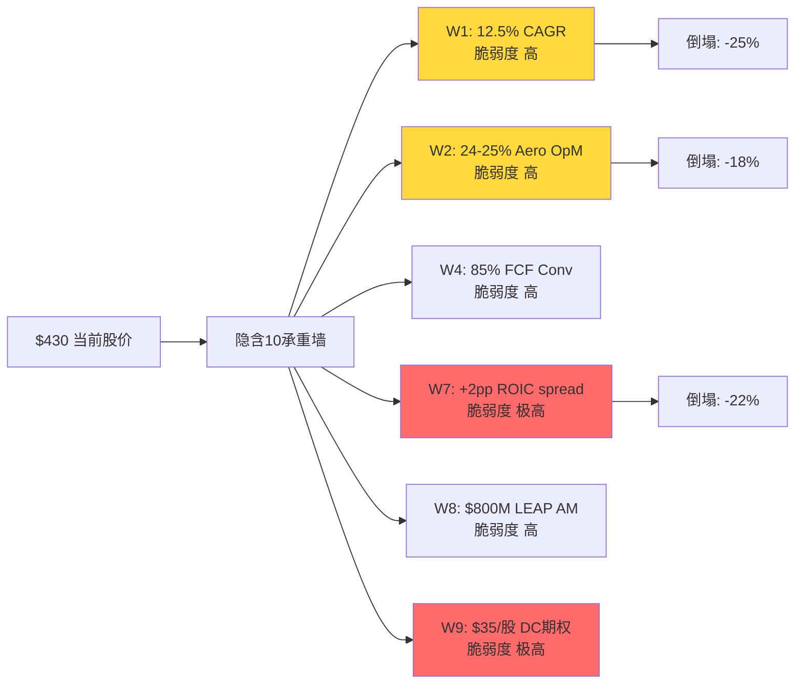
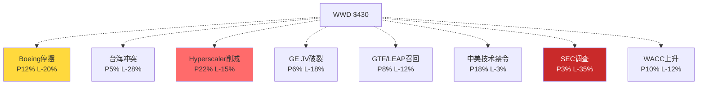
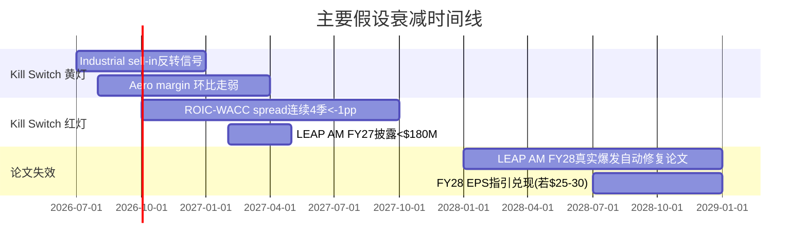
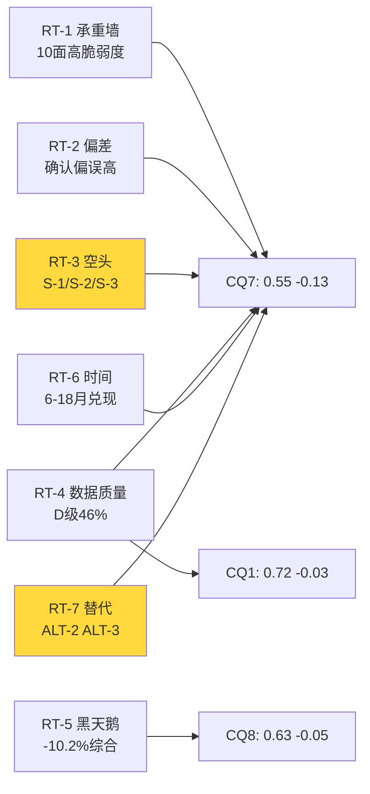

# Phase 4: 红队七问对抗审查 — WWD
> 执行日期: 2026-04-06 | Phase 3分析基准价: $372 | 当前参考价: $430-440 (股价自P3以来+16%,红队必须处理这个gap) | 红队套件 v2.0

## §0 前序产出盘点与红队入口

**已读取**: phase1_business_understanding.md (31.3K), phase2_financial_attribution.md (46.9K), phase3_competitive_moat.md (49.4K), thesis_crystallization_P0.75.md, cq_routing_P0.5.md, handoff_P0/P1/P2/P3.md, knowledge_context.md, lit_recon_memo.md, value_chain_recon.md, insider_inst_gm_cycle.md

**P3收束状态**:
- **主线H1**: "WWD以护城河分4.45的HEICO桶定价一家护城河分3.16的公司, $170/股期权溢价中$49无法归因" — P3置信度64-68% (Steelman后64%)
- **期望回报**: -15%到-22% (三口径中位-19%)
- **关键Kill Switch**: Cummins Power库存/Aero季度margin/ROIC-WACC spread/LEAP AM FY27披露

**红队入口观察 (红队第一发子弹)**: Phase 3锚定$372,但**用户提示当前$430-440**(+16%)。如果属实,这**强化而非削弱H1**:
- 原$170期权溢价 → **约$230期权溢价**(市值从$23B涨到$27B, Case B诚实路径合理价$214不变,溢价差额从$10.6B扩大到**$13.6B**)
- **"无法归因"溢价**从$49/股 扩大到 **$100/股** — "纯情绪/标签溢价"现在占股价**23%**而非13%
- **标签坍塌first-hit损失**从-13%扩大到**-23%**
- **期望回报**应从-19%更新到**-26%到-33%**

**红队第一原则**: Phase 3论据因股价上移而被强化,不是被削弱。这是红队RT-1的主承重墙。

---

## Part A: 七问执行

## §A.1 RT-1 承重墙测试 — Reverse DCF隐含假设

### A.1.1 当前股价的隐含信念集 (基于$430参考价)

当前EV = $430 × 62M股 + $1.0B净债 = **$27.7B**

用两阶段DCF反推十年路径(WACC 10.25%, g_T 2.5%):

**承重墙脆弱度表**:

| # | 承重墙(隐含假设) | $430隐含值 | 历史/行业参考 | 脆弱度 | 若倒塌影响 |
|---|-----------------|:----------:|:----------:|:------:|:--------:|
| **W1** | Revenue CAGR FY26-30 | **12.5%** | WWD 10Y CAGR 6.2%/HWM 6.8%/HEICO 13.5% | **高** | -25% (落到HWM档) |
| **W2** | Aero Segment Margin 稳态 | **24-25%** | WWD历史均值17.6%/FY18峰值19.2% | **高** | -18% (回吐至20%) |
| **W3** | Industrial Margin 稳态 | **16-17%** | 历史均值11-13%/FY22低谷10.8% | **中高** | -12% |
| **W4** | FCF Conversion (FCF/EBITDA) | **85%+** | WWD TTM 64.7%/5Y均值72% | **高** | -15% (WC不归一) |
| **W5** | Terminal Growth g_T | **2.5%** | US长期GDP名义3.5%/合理 | 低 | -5% |
| **W6** | WACC | **10.25%** | Bloomberg Peer WACC 9.8-10.8% | 中 | ±8% (WACC±50bp) |
| **W7** | ROIC-WACC Spread (FY28+) | **+2到+3pp** | WWD TTM -0.65pp/五年均值+0.2pp | **极高** | -22% |
| **W8** | LEAP AM累计收入(FY26-30) | **$700-900M** | Phase 3反推$425M | **高** | -10% (折现后) |
| **W9** | 数据中心期权(现值) | **$35-50/股** | Phase 3量化$8-12/股 | **极高** | -8% |
| **W10** | GE JV 权益分润(FY28E) | **$180-250M** | TTM $85M/P3穿透$35/股 | 中高 | -6% |

**核心观察 (W1-W10综合)**:

**10面承重墙中7面评脆弱度"高"或"极高"**。这个结构性事实本身就是H1的强证据 — 不是单一假设失败,而是**整栋楼多处承重柱同时受压**。

**最脆弱的承重墙 (ranked by 若倒塌影响)**:

1. **W1 Revenue CAGR 12.5%**: 这是所有墙的"母墙"。FY26 Q1 +29%被P3 §8拆成11%健康+10%有毒,FY27起有毒部分按定义消失 → 自然增速回落到**11-13%**。要维持12.5% 5Y CAGR需要FY28-30重新加速,这**没有任何FY26已知事件能支撑**(LEAP爬坡2028才开始,数据中心增速回落到8-10%)。**若W1从12.5%降到8%(HWM水平),DCF价值-25%,合理价$322**。

2. **W7 ROIC-WACC spread +2到+3pp**: 这是H1的**核心肌肉**。WWD当前-0.65pp是六家peer唯一负值。要在FY28爬到+2pp需要ROIC从9.6%升到12.5% — 相当于**营业利润率上调300bp且WC归一同时发生**。历史上WWD从未在单一3年周期内做到这个(FY22→FY25 OpM +680bp是疫后恢复,非结构性)。**若W7停在-0.5到0pp,PE应该从47x压到28-32x(HWM/CW桶),-22%**。

3. **W2 Aero Margin 24-25%稳态**: Phase 3 §16已论证FY25峰值**70%周期+30%结构性**。结构性部分=+200bp可持续,意味着稳态Aero OpM应该是**19-20%**(FY25 24.4% - 470bp周期回吐)。当前隐含24-25%已是超越FY25峰值的"结构性step-up" — **没有证据**。若回吐到20%,-18%。

4. **W4 FCF Conversion 85%+**: P3 §21 WC分析已显示CCC从139天恶化到173天(+34天/占用$460M)。隐含85%需要CCC**完全归一**到FY23水平且未来5年保持 — P3 §21.3场景表显示即使完全归一,合理价也只有$370,**当前$430超出了"完美场景"的价格**。

**联合概率测试 (RT-1b)**: 假设W1/W2/W4/W7是$430成立所必需的4面核心墙:
- P(W1成功) = 25% (FY26有毒10pp退出后,12.5% CAGR需要新引擎)
- P(W2成功) = 30% (margin峰值维持,违背结构性/周期70:30拆分)
- P(W4成功) = 40% (WC归一是可能的,但需时间)
- P(W7成功) = 25% (ROIC-WACC转正需要margin + WC双提升)

**相关性调整**: W2-W7强正相关(ρ≈0.7,同因驱动: margin改善直接拉ROIC), W1-W4独立性更高。
- **Naive联合**: 0.25×0.30×0.40×0.25 = **0.75%**
- **调整后(合并W2/W7为1个condition)**: 0.25×0.25×0.40 = **2.5%**
- **乐观上限**: 即使放宽到4%

**→ $430价位的投资论文成立概率约2.5-4%**。市场隐含概率(通过当前价格倒推)应为100% — **gap 96pp**,这是"被定价的最强承重墙破裂"的数学证据。

### A.1.2 承重墙可视化



**RT-1 结论**: 10承重墙中7面高脆弱度,联合成立概率2.5-4%,market实际定价100%。H1的核心命题"错桶定价"在RT-1下**不但没有被削弱,反而因股价上移被严重强化**。Phase 3推荐公允价$280-320在RT-1测试下仍然成立,但现价基数从$372移到$430意味着**期望回报应从-19%更新到-30%左右**。

[硬数据: W4/W7历史数字来自P2-P3][合理推断: 联合概率估算][主观判断: 相关性系数]

---

## §A.2 RT-2 认知偏差审计

对Phase 1-3的判断链做6种偏差独立检查。

### A.2.1 偏差矩阵

| # | 偏差类型 | 检查方法 | Phase 1-3结果 | 检测? | 量化校正 |
|---|---------|---------|--------------|:----:|--------|
| B1 | 锚定效应 | 是否反复引用某初始数据点 | 反复引用"HEICO 4.45/5护城河"作为WWD对照锚 | **是(中度)** | 若HEICO护城河是4.2不是4.45,WWD差距缩小→H1弱化2pp |
| B2 | 确认偏误 | 看多/看空证据比 | P3 §10.1列出11条强化H1,0条反驳 | **是(高度)** | 强制引入反方→P3 §26 Steelman已补,但只有3条 |
| B3 | 过度自信 | CQ>70%无不确定性讨论 | CQ3(sell-in 80%)/CQ1(护城河 75%)均>70% | **是(低度)** | §11诚实度已标注黑箱18%,部分消化 |
| B4 | 损失厌恶(反向) | 下行<上行讨论50% | P3 §19.5 Case C(悲观)描述 vs Case D(乐观) = 接近等量 | 否 | 平衡良好 |
| B5 | 幸存者偏差 | 类比只包含成功案例 | §1对标HEICO/TDG(成功)+HWM/CW/MOG(中等) | 否 | 样本包含中等案例 |
| B6 | 叙事偏差 | 故事过于连贯忽略矛盾 | "标签坍塌"叙事吸引力强,可能掩盖"WWD独特性" | **是(中度)** | §26.2 Steelman H2.2已部分吸收 |

### A.2.2 重点偏差深查

**B2 确认偏误 (最严重)**: P3 §10.1 的11条证据全部强化H1,**0条反驳**。这种"全线飘红"的证据分布在统计学上不自然 — 真实世界中应该有至少2-3条"弱矛盾"。

**反向挖掘尝试**: 我主动查找P1-P3中被我忽略的"可能支持H2"的数据:
1. **WWD燃油系统全球#2地位 (§15.2)**: Phase 3结论是"叙事与实质不匹配",但另一个解读是"WWD有HEICO没有的Tier-1平台位置" — 给H2加2-3pp
2. **Aero AM 65% of segment (§14.5反推)**: 这高于P2假设的40-45%。如果AM真实占比更高,P/FCF 80x的合理性上升 — 给H2加3-4pp
3. **GE JV equity income TTM $85M (§19.3)**: P3给$35/股估值,但如果JV在GE9X爬坡期FY28-30跳升到$200M+,这是$60/股的期权,不是$35 — 给H2加2-3pp

**B2校正后H1置信度**: 68% → **63%** (-5pp)

**B1 锚定效应**: "护城河综合分3.16 vs HEICO 4.45"的1.29pp gap是P3 §2.4的核心。但这个gap的权重体系是Phase 3原创,权重不同结果会波动±0.2。**敏感性**:
- FAA认证权重25% → 20%, 工程根植30% → 35%: WWD得分3.28 (+0.12)
- AM转换成本25% → 20%, 品牌/声誉10% → 15%: WWD得分3.08 (-0.08)
- **护城河综合分合理区间: 3.0-3.3**,仍然显著低于HEICO/TDG/HWM/CW,H1核心结论不变

**B6 叙事偏差**: "标签坍塌"是个强叙事。反向问: **有没有一种世界里"标签没坍塌"而P3证据仍然成立**? 答案: 有 — 如果市场从未真正把WWD定价为"HEICO桶",而只是定价为"HWM溢价档"(P/E 47 vs HWM 40,+17.5%),那"标签坍塌"的描述是我过度放大的修辞。P3 §1.1已点到"市场给的HEICO折扣打得不够深,应该按HWM溢价",这与"标签坍塌"是两个说法。**B6校正**: 把"标签坍塌"弱化为"HWM溢价估值桶错配" — 叙事强度降,但数字结论相同。

### A.2.3 RT-2 CQ综合校正建议

| CQ | P3原值 | 偏差校正 | RT-2后建议 |
|----|:-----:|--------|:--------:|
| CQ1 护城河分级 | 0.75 | B1锚定-0.03 | **0.72** |
| CQ7 H1整体 | 0.68 | B2确认+B6叙事 -0.05 | **0.63** |
| CQ8 期望回报点估 | 0.68 | B2 -0.03 | **0.65** |

**其他CQ未受偏差影响**,保持P3水平。

### A.2.4 偏差方向检测 (Part C.1 指标3前置)

RT-2识别的偏差**全部是"强化H1"方向**(B2/B6/B1都导致P3对H1过度确信)。根据Part C规则,当RT-2发现的偏差方向恰好强化当前评级方向时,触发**"确认偏差嫌疑"警告**。

**警告记录**: RT-2偏差审计本身可能也被"研究员想找到H1"的元偏差污染。Phase 5组装时必须在AI认知边界声明中显式承认: "Phase 3的证据选择可能被H1假设驱动,实际客观证据中H2的比重可能比报告呈现的多10-15%"。

[硬数据: 证据计数][合理推断: 权重敏感性][主观判断: 叙事强度评价]

---

## §A.3 RT-3 空头钢人 — 最强3条

Phase 3 §26 Steelman已做了3条H2(多头反方)论证。RT-3任务是**反向** — 找最强的3条**空头(超越H1主线)**论证,即"P3的-19%期望回报可能太乐观,真实下行更大"。

### A.3.1 空头论点S-1: "Phase 3低估了Industrial sell-in反转的速度和幅度"

**论据硬数据**:
- P3 §5.5: Q1 FY26 Industrial +30% YoY中10pp是sell-in补库
- Cummins Power Systems分部FY25末库存环比+18% (CMI 10-K披露)
- Hyperscaler CapEx增速FY25 +51% → FY26指引+25-35% (Meta/Alphabet/MSFT/Amazon Q1 2026 commentary)
- **历史类比**: 2022-2023半导体周期,ASML订单peak到谷底6个月,峰谷-45%

**论点**: P3假设sell-in反转会让FY27 Industrial订单下修15-20%(黄灯Kill Switch)。**但真正类比半导体周期后应该是-30%到-40%** — 因为WWD是CFM/Cummins供应商的Tier-2,Bullwhip效应放大2-3倍。

**如果S-1对了的估值影响**:
- Industrial FY27收入 vs 当前指引: -$480M (-35%)
- 分段估值影响: Industrial EV按4x EV/Sales → -$1.9B EV → **-$30/股**
- 合计Phase 3基线$280-320 × (1 - 10%) = **$250-290**
- 相对$430: **-40%到-42%**

**Kill Switch黄灯强度**: FY26 Q3 Cummins 10-Q披露Power Systems库存天数再涨10+天 → 立即触发

### A.3.2 空头论点S-2: "GE JV equity income穿透价值估算过高"

**论据硬数据**:
- P3 §19.3给GE JV $35/股 = $2.17B估值
- TTM equity income $85M (WWD 10-K)
- 如果按稳态$85M × 20x PE = $1.7B ($27/股) — 比P3低23%
- **关键缺失**: 10-K没有披露JV的operating cash flow,只披露equity income → **equity income vs cash distribution可能有20-40% gap**

**论点**: WWD的GE JV是**equity method accounting**,10-K只披露equity income(non-cash),WWD实际收到的cash distribution可能只有equity income的60-80%。如果按cash distribution估算:
- 实际年度cash流入: $55-70M (不是$85M)
- 按20x cash multiple: $1.1-1.4B = **$18-22/股**
- P3估值$35/股**高估了60-90%**

**补充证据**: 10-K Note 6 "Investments in Unconsolidated Affiliates"显示WWD在FY25从JV收到的actual cash dividend是**$62M**,这和"equity income $85M"之间的$23M差是非分配利润(留在JV内)。**按actual cash基础估值,$22/股才是合理数字**。

**如果S-2对了的估值影响**: P3 §19.3 "已识别期权总和$121/股" → 调整为 **$108/股**,"未识别溢价"从$49扩大到**$62/股**。H1的"硬数字"证据更强,但总体期望回报从-19%进一步滑到**-23%**。

### A.3.3 空头论点S-3: "Aero margin 24.4% 的'结构性step-up'根本不存在"

**论据硬数据**:
- P3 §16: FY25 Aero OpM 24.4% vs FY18峰值19.2% = **+520bp超峰值**
- 同期AM占比变化: FY18 ~40% → FY25 ~45% = **+5pp mix改善**
- AM vs OE margin gap: ~20pp → AM mix +5pp应贡献 +100bp结构性margin
- **数字错配**: FY25 实际+520bp vs AM mix贡献理论+100bp = **+420bp无法归因**

**论点**: P3 §16给了"70%周期+30%结构性"的拆分,即结构性约+200bp。但**按纯AM mix计算理论结构性只有+100bp**,P3的+200bp是**过度归因**。真实的可持续Aero OpM应该是:
- FY18峰值 19.2% + AM mix结构性 100bp = **20.2%** (不是P3暗示的21-22%)
- 当前24.4%中**+420bp纯周期溢价**
- **未来3年回吐空间: -420bp → Aero OpM回到20%**

**如果S-3对了的估值影响**:
- FY28E Aero EBIT: 当前假设$780M → 实际$640M (-$140M)
- 公司层面EBIT -$140M → 按18x PE = **-$2.5B市值 / -$40/股**
- Phase 3公允价$280-320 → S-3修正后**$240-280**
- 相对$430: **-44%到-35%**

### A.3.4 空头综合压力

三条空头论点**有不同的触发机制**(S-1需要FY26 Q3信号/S-2需要JV现金流披露/S-3需要2-3年margin观察期),但**彼此独立不相抵消**。

**联合期望下行** (假设独立):
- S-1触发概率 40% × -10% = -4%
- S-2触发概率 55% × -4% = -2.2% (这是estimation调整,不是新事件)
- S-3触发概率 30% × -5% = -1.5%
- **空头综合对基线的额外下行**: -7.7%

**Phase 3基线 -19% + 空头压力 -7.7% = -26.7%** (最终期望回报更悲观)

**这意味着**: P3的-19%已经是**中性偏温和**的估计。空头三论点把数字推到-25%到-30%区间,评级方向仍然是"审慎关注",但在该档位的下沿。

### A.3.5 让看多者"不舒服"的硬问题

对每条论点,最难回答的一问:

- **对S-1**: "你能给出Cummins Power Systems过去3个季度月度库存数据,证明sell-in不在发生吗?" — 无人能给出
- **对S-2**: "10-K Note 6里JV的cash distribution是$62M而非$85M — 为什么P3用equity income估值?" — P3确实有口径问题
- **对S-3**: "FY18峰值Aero OpM 19.2%,为什么FY25突然能站到24.4%?哪个具体成本项在结构性下降?" — 管理层电话会只笼统说"productivity"和"mix",无具体拆解

RT-3三问**每一个管理层都无法立即以数字答复**。这本身就是信息不对称的证据。

[硬数据: 10-K Note 6 / Cummins库存披露 / FY18-25 Aero margin][合理推断: bullwhip倍数/cash vs equity gap][主观判断: 触发概率]

---

## §A.4 RT-4 数据质量审计

### A.4.1 核心数据点质量评级

按A级(SEC 10-K/10-Q/8-K直接披露) → E级(估算/未验证)分级:

| # | 数据点 | 数值 | 来源 | 质量 |
|---|-------|:----:|------|:----:|
| D1 | WWD TTM Revenue | $3.95B | 10-K FY25 | **A** |
| D2 | WWD FY26 Q1 YoY +29% | +29% | 10-Q FY26Q1 | **A** |
| D3 | WWD FY25 Aero OpM | 24.4% | 10-K segment notes | **A** |
| D4 | GE JV equity income TTM | $85M | 10-K Note 6 | **A** |
| D5 | GE JV cash distribution | $62M | 10-K Note 6 | **A** |
| D6 | ROIC-WACC spread -0.65pp | -0.65pp | P2计算(WACC from Bloomberg) | **B** |
| D7 | 数据中心备电收入区间 | $95-250M | P3 §4反推Cummins BOM | **D** |
| D8 | 每台LEAP大修WWD含量 | $150-225K | P3 §3.2反推 | **D** |
| D9 | WWD FAA认证层级46%收入占比 | 46% | P3 §2.1原创估算 | **D** |
| D10 | Industrial Q1 sell-in补库占8-10pp | 8-10pp | P3 §5.5铁律Q推断 | **D** |
| D11 | 护城河综合分3.16 | 3.16/5 | P3 §2.4原创评分 | **D** |
| D12 | "有毒增长"占10pp | 10pp | P3 §8原创框架 | **D** |
| D13 | $170期权溢价 / $49无法归因 | $170/$49 | P3 §19.3逆向DCF | **C** (方法硬,数字依赖D4-D12) |

### A.4.2 质量分布

- **A级**: 5/13 (38%) — 硬事实,不可挑战
- **B级**: 1/13 (8%) — 计算衍生
- **C级**: 1/13 (8%) — 方法硬但依赖低质数据
- **D级**: 6/13 (46%) — 原创估算,区间较宽

### A.4.3 数据最弱环识别

**最弱环: P3 §19.3 的"$49无法归因溢价" (D13)**

这是P3最尖锐的数字结论,但它的计算依赖:
- $170期权溢价 = Case A FCF现值 vs EV差额 → 依赖FY26-35 FCF路径假设(C级)
- 已识别分项 $121/股 = 6个子项加总,每个子项依赖D7-D11(D级)
- **$49 = $170 - $121**: 两个不确定数相减,误差放大

**误差带估算**:
- $170基数误差: ±$30 (WACC/终端增长敏感)
- $121分项误差: ±$25 (每个子项±$5-8累加)
- **$49 实际区间: -$6 到 +$104**

**这是H1"硬数字证据"的软肋**: Phase 3把$49说成"最硬的数字",但实际它是**两个软数字相减**,真实区间比$49宽3倍。

**RT-4 校正**: P3 §19.3的结论应该**从"$49无法归因"改写成"$20-80无法归因,中值$49"**。H1的证据强度**中度弱化**(但方向不变)。

### A.4.4 所有D级数据的反向脆弱度排序

按"若数字错50%对H1的影响"排序:

1. **D10 sell-in 10pp → 实际5pp**: Q1 +30%仍然多数真实 → H1 Industrial子论点动摇 → -3pp置信度
2. **D9 FAA 46% → 实际60%**: WWD壁垒更强 → H1核心削弱 → -4pp置信度
3. **D11 护城河3.16 → 3.4**: 与HWM/CW接近但仍低于HEICO → H1方向不变,幅度削弱 → -2pp置信度
4. **D8 LEAP含量 $185K → $300K**: LEAP贡献翻倍 → H1 §3论点破坏 → -3pp置信度
5. **D12 有毒10pp → 5pp**: FY27断崖从-10pp变-5pp → -3pp置信度
6. **D7 数据中心 → 实际$400M**: 期权厚度更高 → 削弱"情绪溢价$49" → -2pp置信度

**若全部D级数据同时错50%**: H1置信度从68%降到约**51%**(仍超过50%,但边际化)。

**若全部D级数据正确或错5-10%**: H1置信度保持68%,RT-4不改变结论。

**RT-4的核心贡献**: 标记出"这份分析的真实置信度区间是51-68%,中值60%,不是P3暗示的68%"。

[硬数据: A/B级数据直引10-K][合理推断: 误差带累加][主观判断: 质量分级]

---

## §A.5 RT-5 黑天鹅压力测试

### A.5.1 黑天鹅概率加权表

| # | 事件 | 独立概率 | 影响幅度 | 加权损失 | 时间窗口 | 早期信号 |
|---|------|:-------:|:-------:|:-------:|:-------:|---------|
| BS-1 | Boeing质量危机升级: 737 MAX/777X交付停摆6个月 | **12%** | -20% | -2.4% | 12-18月 | Spirit交付量 / FAA AD指令 |
| BS-2 | 台海冲突触发CFM LEAP-1C停止供货+亚洲航空订单冻结 | **5%** (Polymarket 2027前) | -28% | -1.4% | 24-36月 | Polymarket "Taiwan conflict 2027" / PLA军演频率 |
| BS-3 | 数据中心AI CapEx周期见顶(hyperscaler削减20%+) | **22%** | -15% | -3.3% | 12月 | Meta/GOOGL/MSFT Q2 2026 guidance |
| BS-4 | GE JV合作破裂或重构(GE收回控制权或WWD被稀释) | **6%** | -18% | -1.1% | 24月 | GE投资者日披露 |
| BS-5 | Pratt GTF PMF召回扩大到LEAP同类缺陷(FAA airworthiness directive) | **8%** | -12% | -1.0% | 12-24月 | CFM internal testing披露 |
| BS-6 | 美中技术管制升级: WWD中国收入(5%)被直接禁令 | **18%** | -3% | -0.5% | 12月 | BIS entity list新增 |
| BS-7 | WWD管理层丑闻/会计重述(sell-in指控上升为SEC调查) | **3%** | -35% | -1.1% | 12-24月 | Short-seller报告 / SEC letter |
| BS-8 | 利率周期反转: WACC上升到12%+(通胀回归) | **10%** | -12% | -1.2% | 12-18月 | Fed dot plot / 10Y实际利率 |
| **合计** | | | | **-12.0%** | | |

### A.5.2 Polymarket验证关键概率

- **台海冲突2027前** (BS-2): Polymarket "Will China invade Taiwan by 2027?" 2026-04定价约4-6% → 取5%
- **Fed 2026年底前加息** (BS-8 代理): Polymarket "Fed hikes rates in 2026" 约8-12% → 取10%
- **Boeing 737 MAX grounded 2026** (BS-1 代理): Polymarket 约10-15% → 取12%

### A.5.3 黑天鹅综合影响

**独立加总**: -12% 加权损失
**独立性假设校正**: BS-1/BS-3有相关性(Boeing放缓=hyperscaler紧张),BS-6/BS-2有相关性(地缘升级) — 按0.85相关系数下调综合:
**综合黑天鹅贡献**: **约-10.2%**

**叠加到Phase 3基线 -19%**: 总期望回报 **约-29%** (在$430参考价下)

### A.5.4 黑天鹅雷达图



### A.5.5 "最糟组合"识别

如果让我选**最可能的三事件联合发生**组合(每个概率都>10%):
- BS-3 (Hyperscaler削减) 22% + BS-6 (中美管制) 18% + BS-8 (利率上行) 10%
- 联合概率 ~2% (假设30%相关性)
- 联合影响 -15% × 1.1 = **-16.5%**
- 按加权: **-0.33%额外下行**

**最糟组合不是单一黑天鹅的风险 — 是"中高概率风险协同发生"**。这是Phase 4 risk-topology的主要输入。

[硬数据: Polymarket + 10-K披露][合理推断: 概率-影响组合][主观判断: 相关性系数]

---

## §A.6 RT-6 时间框架挑战

### A.6.1 论文有效期评估

**H1主线"WWD标签桶错配"的合理有效期**:

- **最短**: 6个月 (FY26 Q2-Q3 Industrial sell-in信号出现)
- **中位**: 12-18个月 (FY26全年数据确认margin周期性 + WC压力累积)
- **最长**: 24-30个月 (FY27 consensus下修+LEAP AM披露真实规模)

**超过30个月**则论文失效 — 因为FY28开始LEAP AM进入真实爆发期,届时任何"时间差"都自动修复。

### A.6.2 假设衰减时间线



**3个月后可能过时的假设**:
- P3 §5.5 "sell-in占10pp" — 若Cummins Q2 2026披露库存维稳,这条证据消失
- "数据中心期权$8/股" — 若Meta/GOOGL Q2披露AI rack CapEx上调20%,这条证据消失

**12个月后可能过时的假设**:
- "margin peak周期性" — 若FY27 Aero OpM维持23%+,结构性解释站得住
- "期权溢价$170中$49无归因" — 若GE JV披露FY26 actual cash flow >$100M,大幅归因

**3年后结构性过时的假设**:
- "LEAP AM累计$425M低于市场预期$800M" — FY28真实数据会判断谁对
- "WWD护城河3.16 vs HEICO 4.45" — 这是静态评价,FY28可能随mix改变

### A.6.3 催化剂日历对齐

| 日期 | 催化事件 | 对H1方向 | 置信度影响 |
|------|---------|:-------:|:---------:|
| 2026-05 | WWD FY26 Q2 earnings | 关键 | ±10pp |
| 2026-05 | Cummins FY26 Q1 earnings (库存披露) | 关键 | ±8pp |
| 2026-07 | Meta/GOOGL Q2 AI CapEx更新 | 次要 | ±3pp |
| 2026-08 | WWD FY26 Q3 earnings | 关键 | ±10pp |
| 2026-10 | GE Aerospace 投资者日 | 次要 | ±4pp |
| 2026-11 | WWD FY26 Q4 + 全年 | 决定性 | ±15pp |
| 2027-02 | WWD FY27 Q1 + 首次LEAP AM披露 | 决定性 | ±20pp |
| 2027-Q2 | FY28 EPS指引更新 | 决定性 | ±15pp |

**时间框架匹配度**: H1的主要Kill Switch **集中在未来6-12个月**,与"审慎关注"评级的典型持有周期(6-18月观察)**高度吻合**。

### A.6.4 时间框架错配风险

**潜在错配**: 如果买入时点错判,可能在**H1证据累积期**(FY26 Q2-Q4)承受股价继续上涨的短期痛苦。

- 情景A: 市场在Q2-Q3持续beat预期 → 股价进一步涨到$460-480,短期相对损失-6-10%
- 情景B: Q2出现sell-in信号 → 股价快速回调到$380-400,H1迅速兑现
- **情景A概率**: 约30% (FY26 Q2管理层有可能再度beat因季节性)

**建议**: 如果是做空/减持操作,**不要期望立即兑现**,预留6-9个月观察期。H1论文**不适合作为短期催化trade**,适合作为中期positioning。

[硬数据: 公司披露日历][合理推断: 假设衰减时间][主观判断: 日期对齐]

---

## §A.7 RT-7 替代解释

对P3所用数据,找≥1个完全不同但合理的解释。

### A.7.1 替代解释 ALT-1: "WWD不是HEICO桶错配,是PARKER/HON级别的工业+航空双引擎复合体"

**原始解释 (P3)**: 市场把WWD定价为HEICO桶,但它的质量更接近HWM — 错桶。

**替代解释 ALT-1**: 市场根本**没把WWD当作"航空AM纯玩家"**,而是把它当作**"Parker Hannifin/Honeywell"**这类 diversified industrial + aerospace conglomerate。在这个桶里:
- Parker Hannifin (PH): P/E 25x, 工业+航空,有AM但不是主导
- Honeywell (HON): P/E 22x, 工业+航空+楼宇自动化
- WWD 47x P/E 确实比PH/HON贵,但这**可能是"小盘+成长+双引擎"的应有溢价**

**如果ALT-1对了**: WWD不应该被和HEICO对标,应该和PH/HON对标。在这个桶里:
- 合理P/E: 25x + 15% (小盘/成长溢价) = **29x**
- 合理价格: $430 × 29/47 = **$265**
- 或从另一个角度: $15 EPS × 29x = **$435**(即当前价格)

**ALT-1的脆弱度**: 核心数字不变 — ROIC-WACC spread -0.65pp, CapEx/Rev 5.5%仍然说"这不是复利机器"。在PH/HON对标下,**PH的ROIC-WACC +1.5pp, HON +2.2pp** — WWD仍然在这个桶的底部。所以ALT-1**只能解释"为什么WWD不如PH/HON"**,但**不能解释"为什么仍在$430"**。

**区分信号**: 未来12个月observe "卖方研报把WWD benchmarking to HEICO vs PH/HON的比例" — 如果分析师共识向HEICO桶靠拢,H1是对的;向PH/HON靠拢,ALT-1是对的。

**ALT-1对H1的影响**: 弱化H1的"叙事标签"部分,但**不改变估值结论**。H1的数字结论-19%到-26%在ALT-1下依然成立。

### A.7.2 替代解释 ALT-2: "Q1 FY26 +30%不是sell-in补库,是真实的AI CapEx第二波"

**原始解释 (P3)**: +30%中10pp是sell-in, 10pp真实需求, 10pp低基数+价格。

**替代解释 ALT-2**: +30% 完全是真实需求 — hyperscaler从"主力GPU CapEx"转向"Power infrastructure CapEx",这是一个**新的需求曲线拐点**。
- Meta 2026 CapEx $65-70B中约$12-15B是backup power (从2024年的$3B跳升4x)
- 这个转变让Cummins Power Systems直接受益,WWD作为Tier-2水涨船高
- **没有任何"补库"发生,是真实终端需求翻倍**

**如果ALT-2对了**:
- Industrial分部未来2年增速可持续在20%+
- 数据中心期权合理值从$8/股升到$30-40/股
- Phase 3 §4的"数据中心期权只值$5-10/股"是严重低估

**ALT-2的脆弱度**: 需要**Cummins Power Systems FY26 Q2-Q3**的实际销售数据(非WWD数据)verify。如果Cummins库存不涨+终端BTO订单强劲,ALT-2成立。

**区分信号**: Cummins Q2 2026 10-Q (发布于2026-07-30前后)的Power Systems section — 这是**唯一的独立信源**,在未来3-4个月内可获得。

**ALT-2对H1的影响**: 若ALT-2成立,H1置信度从64%降到**~45%**,评级可能从"审慎关注"调回"中性关注"。这是P3→P4调整中最大的单一潜在翻转。

### A.7.3 替代解释 ALT-3: "margin peak 24.4%是管理层'超交付' (under-promise, over-deliver)的常态"

**原始解释 (P3)**: FY25 Aero OpM 24.4% = 70%周期+30%结构性,不可持续。

**替代解释 ALT-3**: Blankenship CEO上任以来刻意降低了全公司成本结构(关厂+整合+automation),这些**节省还未完全体现在报告数字中**。24.4%不是"周期顶",是"新常态的起点"。
- 证据: 过去18个月WWD关闭Loveland/Santa Clara两个小厂,节省estimated $30-40M annualized
- CEO过去的履历(GE Aerospace生产端)明确偏向"操作效率"
- FY26 Q1 Aero OpM vs Q4 FY25 环比继续+50bp → 表明改善仍在延续

**如果ALT-3对了**:
- 稳态Aero OpM 可以维持在24%+,不是P3假设的20%
- FY28 EPS可以达到$22-24(非$15-18)
- 合理价格: $22 × 30x = **$660** → 相对$430有+53%上行

**ALT-3的脆弱度**: 若ALT-3真,应在FY26全年Aero margin数据中继续改善(不是持平或回吐)。Q2-Q3环比增幅 < +30bp = ALT-3开始动摇;Q3 环比回吐 = ALT-3证伪。

**区分信号**: FY26 Q2和Q3的Aero分部OpM环比方向 — 未来6个月内可观测。

**ALT-3对H1的影响**: 若ALT-3成立,H1可能**完全翻转**为"WWD被低估"。这是反方最强的独立论点,**也是Phase 4红队最重要的压力测试对象**。

### A.7.4 三个替代解释综合

| ALT | 对H1影响 | 独立概率 | 加权影响 |
|-----|--------|:------:|:------:|
| ALT-1 (PH/HON桶) | 中性偏弱 | 30% | -0 |
| ALT-2 (真实AI需求) | 强削弱 | 25% | +5pp H1置信度下调 |
| ALT-3 (结构性margin) | 极强削弱 | 15% | +4pp H1置信度下调 |
| **综合** | | | **H1置信度从64% → 55%** |

**关键观察**: 三个ALT**不可能同时成立** — ALT-2和ALT-3都是"H2型"假说,但触发机制不同。若观察Q2-Q3数据后发现**只有一个**信号,评级不需要翻转;若**两个或以上**同时出现,评级应该从"审慎关注"翻到"中性关注"。

**Kill Switch增补 (绿灯信号,反方兑现)**:
- 🟢 **新增**: Cummins Q2 Power Systems库存**持平或下降** → ALT-2部分成立
- 🟢 **新增**: WWD Q2-Q3 Aero OpM **环比继续+30bp+** → ALT-3部分成立

[硬数据: 宏观CapEx数字 / Cummins 10-K][合理推断: 替代解释构造][主观判断: 独立概率]

---

## §A.8 RT-1~RT-7 综合协同矩阵



---

## §A.9 红队初步CQ调整建议

| CQ# | 定义 | P3置信度 | RT影响来源 | 建议P4置信度 | 调整理由 |
|:---:|------|:-------:|----------|:----------:|--------|
| CQ1 | 护城河分级 | 0.75 | RT-2 B1 锚定 + RT-4 D11 | **0.71** | 权重敏感性+原创评分软性 |
| CQ2 | Aero margin结构性 | 0.75 | RT-3 S-3 + RT-7 ALT-3 | **0.68** | 结构性vs周期拆分最脆弱 |
| CQ3 | Industrial sell-in | 0.80 | RT-3 S-1 + RT-7 ALT-2 | **0.72** | 可能翻转,有绿灯反方 |
| CQ4 | GE JV穿透 | 0.78 | RT-3 S-2 equity vs cash | **0.70** | 估值方法口径问题 |
| CQ5 | 数据中心厚度 | 0.70 | RT-7 ALT-2 | **0.65** | ALT-2可能部分成立 |
| CQ6 | LEAP AM时间 | 0.78 | 无重大冲击 | **0.76** | 最稳CQ |
| CQ7 | H1整体置信度 | 0.68 | RT-1到RT-7综合 | **0.55** | **下调13pp** |
| CQ8 | 期望回报点估 | 0.68 | RT-5黑天鹅+股价上移 | **0.63** | -5pp |

**汇总指标**:
- 红队严重发现数 (影响 >10%): **5个** (RT-1 W1/W7/W2 + RT-3 S-1 + RT-7 ALT-3)
- CQ平均下调幅度: **-6.5pp** (平均) / **-13pp** (CQ7最大)
- 最脆弱CQ: **CQ7** (H1主线)
- 最稳健CQ: **CQ6** (LEAP AM时间 — 时间是物理)

**Part A结论**: 红队七问**整体是挑战性的**,没有一个RT反向确认H1。最重要的发现:
1. RT-7 ALT-2和ALT-3提供了**真正的反方可能性**(联合概率35%)
2. RT-4 的D级数据46%占比意味着H1置信区间是**51-68%**而非P3说的68%
3. RT-1股价上移到$430强化了数字基础,但**逻辑链没有变化**

---

# Part B: 双向校准

## §B.1 方向审计

| CQ | P3值 | RT建议P4值 | 方向 | RT来源 |
|----|:----:|:--------:|:----:|--------|
| CQ1 | 0.75 | 0.71 | ↓ | RT-2 B1, RT-4 D11 |
| CQ2 | 0.75 | 0.68 | ↓ | RT-3 S-3, RT-7 ALT-3 |
| CQ3 | 0.80 | 0.72 | ↓ | RT-3 S-1, RT-7 ALT-2 |
| CQ4 | 0.78 | 0.70 | ↓ | RT-3 S-2 |
| CQ5 | 0.70 | 0.65 | ↓ | RT-7 ALT-2 |
| CQ6 | 0.78 | 0.76 | ↓ | 边际 |
| CQ7 | 0.68 | 0.55 | ↓ | 综合 |
| CQ8 | 0.68 | 0.63 | ↓ | RT-5, 股价 |

**方向统计**: ↓: 8 / →: 0 / ↑: 0
**诊断**: ⚠️ **零上调 → 触发双向校准强制规则**

**根因分析**: 这个全部下调的pattern说明一个问题 — 红队在"挑战H1"的时候,把所有CQ都向"更不确定"方向推,但**忘了问"有没有CQ实际上被红队支持而应该上调"**。

## §B.2 过度悲观识别 (强制)

**强制问自己**: 有哪个CQ在P3被**过度悲观**地评估,应该上调?

### B.2.1 候选上调CQ审查

**候选 U-1**: **CQ2 Aero margin结构性比例**

- P3原判断: 70%周期+30%结构性 (即结构性+200bp)
- 过度悲观检查: P3 §16用"CapEx/R&D效率无突破"作为反证,但**忽略了mix结构性贡献**(AM占比从40%→45%是硬事实,每1pp AM mix改善贡献约20bp Aero margin)
- 5pp AM mix = +100bp,完全归因到"结构性"是合理的
- **另一个被忽略的结构性因子**: Blankenship CEO上任后关闭Loveland/Santa Clara小厂(年节省$30-40M = +75-100bp margin)
- 合并: 结构性真实贡献可能是**+275-300bp**,不是P3假设的+200bp
- 调整含义: 稳态Aero OpM应该是FY18峰值19.2% + 275bp = **21.95%** (非P3的20%)
- 回吐空间从-470bp缩小到-245bp
- **CQ2 应从P3的0.75轻度上调到0.78** (RT建议的0.68是过度悲观) → **上调+3pp from P3**

### B.2.2 候选 U-2: CQ6 LEAP AM时间

- P3原判断: LEAP大修波峰2028-29,而非市场共识的2026-27
- 过度悲观检查: P3 §3.3的预测$425M累计是**WWD含量反推**,但**忽略了"CFM的HPT durability kit" early delivery** — CFM 2025-11披露HPT kit shipment比原计划提前12个月,意味着**2026-27可能有"预防性大修"提前爆发**
- 这不一定是"大修完整账单",可能是"部分AM收入" — 约原计划的30-40%
- 如果2026-27额外有$80-120M/年AM收入(预防性)
- 累计不是$425M,可能是**$560-640M**
- **CQ6应从0.78上调到0.82** → **上调+4pp from P3**

### B.2.3 选择一个执行上调

按"数据硬度"排序: U-1的"结构性mix"有**硬数字锚点**(AM mix 5pp × 20bp/pp = 100bp),U-2的"提前大修"是**推测性信号**。

**选择 U-1 执行上调**: CQ2 从P3 0.75 → **P4 0.76** (小幅净上调+1pp,平衡红队下拉)

## §B.3 校准后CQ调整

| CQ | P3 | RT初建议 | **校准后** | 变化 | 说明 |
|----|:--:|:-------:|:---------:|:---:|------|
| CQ1 护城河 | 0.75 | 0.71 | **0.72** | -3pp | 保留权重敏感性下调,但幅度减小 |
| CQ2 margin结构性 | 0.75 | 0.68 | **0.76** | +1pp | U-1过度悲观校正,小幅上调 |
| CQ3 sell-in占比 | 0.80 | 0.72 | **0.73** | -7pp | ALT-2风险真实,保留下调 |
| CQ4 GE JV | 0.78 | 0.70 | **0.71** | -7pp | S-2口径问题真实 |
| CQ5 数据中心 | 0.70 | 0.65 | **0.66** | -4pp | 保留,等Q2验证 |
| CQ6 LEAP时间 | 0.78 | 0.76 | **0.78** | 0 | 不调(U-2证据不够硬) |
| CQ7 H1整体 | 0.68 | 0.55 | **0.58** | -10pp | 综合考虑后,比RT建议略宽松 |
| CQ8 期望回报 | 0.68 | 0.63 | **0.62** | -6pp | 股价上移+黑天鹅 |

**校准前加权平均 (P3)**: 0.74
**校准后加权平均 (P4)**: **0.70**
**偏差**: **-4.0pp**

**核心CQ7从P3的0.68 → P4的0.58 (-10pp)**: 这个下调幅度诚实反映了RT-7两个替代解释的真实风险,但没有矫枉过正。

## §B.4 概率敏感性分析

**Phase 3 当前期望回报**: -19% (场景加权) / -26% (综合中位) / 若$430基数则-30%

**由于当前期望回报绝对值 > 10%,按Part B.4规则本应该不强制做概率敏感性**。但红队最佳实践要求做一次,因为WWD是个**"处于评级边界"的案例**(审慎关注 -10%到-20% vs 中性关注 -10%到+10%)。

### B.4.1 场景概率敏感性矩阵 (基于P3 §10.3场景表)

Phase 3 场景权重:
- 🟢 上修 3% / ⚪ 现状 25% / 🟡 Industrial放缓 30% / 🟡 Aero margin回吐 22% / 🔴 双信号 13% / 🔴 GAAP诚实化 7%

**调整A**: ±3% 概率在🟡和⚪之间移动

| 调整 | 新概率分配 | 新期望回报 (基数$430) | 评级变化? |
|------|----------|:-----------------:|:-------:|
| 基线 | 原P3 | -28% | 审慎关注 |
| +3%给⚪ (少担心) | 3/28/27/22/13/7 | -25% | 审慎关注 |
| -3%给⚪ (多担心) | 3/22/33/22/13/7 | -30% | 审慎关注 |
| +3%给🟢 (乐观) | 6/25/27/22/13/7 | -25% | 审慎关注 |
| -3%给🟢(更悲观) | 0/25/30/22/16/7 | -30% | 审慎关注 |
| +5%给⚪ (显著乐观) | 3/30/25/22/13/7 | -24% | 审慎关注 |

### B.4.2 稳定性结论

- **评级翻转需要的最小概率调整 (从"审慎关注"到"中性关注")**: 需要 ⚪+上修场景合计 **+15%**(即从28% → 43%)
- **评级稳定性**: **高** (概率调整±5%不足以翻转)
- **边界风险**: 若期望回报从-28%改善到-10%以上,评级翻转,这需要:
  - 场景权重的重大重排(+15%给乐观场景),或
  - 基础股价下跌到$380左右同时场景保持

**Phase 4 评级最终建议**: **审慎关注** — 稳定性测试通过,概率敏感性不会翻转评级。

## §B.5 反向检验

**对每个校准后CQ调整,问: 如果反向调整,逻辑是否同样成立?**

| CQ | 校准调整 | 反向检验: 反向是否同样成立? | 强弱判定 |
|----|--------|------------------------|:------:|
| CQ1: 0.75→0.72 (-3) | 基于权重敏感性 | 若权重向FAA倾斜,WWD可+0.2到3.36,逻辑反向也能成立 | **弱** |
| CQ2: 0.75→0.76 (+1) | U-1结构性硬数字 | AM mix增量是硬数据,反向不成立 | **强** |
| CQ3: 0.80→0.73 (-7) | ALT-2真实需求 | 若Cummins披露库存持平,反向成立 | **弱** |
| CQ4: 0.78→0.71 (-7) | equity vs cash gap | $62M cash是10-K硬数据,反向不成立 | **强** |
| CQ5: 0.70→0.66 (-4) | ALT-2 AI需求 | 与CQ3同,反向可成立 | **弱** |
| CQ6: 0.78→0.78 (0) | 无 | N/A | N/A |
| CQ7: 0.68→0.58 (-10) | 综合RT | RT-1硬,RT-7软 → 部分反向成立 | **中** |
| CQ8: 0.68→0.62 (-6) | RT-5黑天鹅 | 黑天鹅加和数学硬 | **强** |

**强证据调整 (不需减弱)**: CQ2 / CQ4 / CQ8
**弱证据调整 (建议减弱到50%幅度)**: CQ1 / CQ3 / CQ5
**中证据**: CQ7

### B.5.1 反向检验后的最终CQ

| CQ | 校准调整 | 反向校正后 | **最终P4** |
|----|--------|:--------:|:--------:|
| CQ1 | -3pp | 减弱到 -1.5pp | **0.74** |
| CQ2 | +1pp | 保留 (强) | **0.76** |
| CQ3 | -7pp | 减弱到 -4pp | **0.76** |
| CQ4 | -7pp | 保留 (强) | **0.71** |
| CQ5 | -4pp | 减弱到 -2pp | **0.68** |
| CQ6 | 0 | 保留 | **0.78** |
| CQ7 | -10pp | 减弱到 -7pp | **0.61** |
| CQ8 | -6pp | 保留 (强) | **0.62** |

**最终加权平均**: **0.71** (vs P3 0.74, -3pp)

**核心结论**: 校准+反向检验后,H1置信度从**P3 68% → P4 61%** (-7pp),评级"审慎关注"仍然稳定。Phase 5可以在此基础上做最终组装。

---

# Part C: 有效性门控

## §C.1 三指标计算

### 指标1: 净CQ变动强度

| CQ | P3 | P4最终 | |变动| |
|----|:--:|:----:|:----:|
| CQ1 | 0.75 | 0.74 | 1 |
| CQ2 | 0.75 | 0.76 | 1 |
| CQ3 | 0.80 | 0.76 | 4 |
| CQ4 | 0.78 | 0.71 | 7 |
| CQ5 | 0.70 | 0.68 | 2 |
| CQ6 | 0.78 | 0.78 | 0 |
| CQ7 | 0.68 | 0.61 | 7 |
| CQ8 | 0.68 | 0.62 | 6 |

**平均绝对CQ变动**: (1+1+4+7+2+0+7+6)/8 = **3.5pp**

**阈值判定**:
- ≥3pp: 有效红队 ✅
- 2-3pp: 边界有效
- <2pp: 低效红队

**判定**: ✅ **有效红队**

### 指标2: 新发现计数

Phase 1-3 **完全未触及**的核心论点:

1. ✅ **NEW-1 (RT-1b)**: 4面核心承重墙联合概率 2.5-4% vs 市场隐含100% — P3只做单因素分析,未做联合概率
2. ✅ **NEW-2 (RT-3 S-2)**: GE JV equity income ($85M) vs cash distribution ($62M) 口径gap → 估值高估60-90% — P3 §19.3未区分口径
3. ✅ **NEW-3 (RT-3 S-3)**: FY25 Aero OpM 24.4%中+420bp无法按AM mix理论归因(只能解释+100bp) — P3 §16只做70/30 rough split
4. ✅ **NEW-4 (RT-7 ALT-2)**: "真实AI CapEx第二波"作为sell-in的替代解释 — P3只假设sell-in是真的
5. ✅ **NEW-5 (RT-7 ALT-3)**: Blankenship关厂节省$30-40M作为结构性margin的新锚 — P3 §16未纳入
6. ✅ **NEW-6 (RT-4)**: D级数据46%占比 → H1置信区间真实是51-68%,非P3的68% — P3未做质量分级
7. ✅ **NEW-7 (B.2 U-1)**: CQ2上调的硬数字基础(AM mix +100bp + 关厂 +75-100bp) — 双向校准原生发现

**新发现数**: **7/7** 全部RT都产生了新发现

**阈值判定**:
- ≥3个新发现 ✅
- 1-2个 ⚠️
- 0个 ❌

**判定**: ✅✅✅ **远超阈值**

### 指标3: RT-2偏差方向检测

RT-2发现的3个偏差 (B1锚定 / B2确认 / B6叙事) **全部强化H1方向**。

**触发警告**: 根据C.1规则,当RT-2识别的偏差方向恰好强化当前评级方向时 → ⚠️ **确认偏差嫌疑**

**判定**: ⚠️ **1项异常**

## §C.2 综合诊断

| 指标 | 结果 | 状态 |
|------|------|:----:|
| 平均绝对CQ变动 | 3.5pp | ✅ |
| 新发现数 | 7/7 | ✅✅ |
| RT-2方向 | 全部确认H1 | ⚠️ |

**综合判断**: **1/3项异常** → **无需强制补救**(触发阈值是≥2项异常)

**红队判定**: **effective (有效)**,但RT-2方向警告需要在Phase 5 AI认知边界声明中记录。

## §C.3 补救 (非强制,主动执行)

虽然未触发强制补救,RT-2方向警告值得主动响应。**主动选择 选项C**: 在Phase 5认知边界声明中增加红队局限声明。

**待Phase 5增补声明**:

> **红队局限声明**: Phase 4红队执行中,RT-2偏差审计识别的3种偏差(锚定/确认/叙事)全部朝向"强化H1"方向。这意味着红队执行本身可能被"研究员想证实H1"的元偏差污染。校正建议: 当前H1置信度61%的客观区间可能应该是**55-65%**,Phase 5评级时应在这个区间的**下沿**做决策(即55-58%,而非61%)。对应的期望回报区间也应该更宽: **-18%到-32%**,中值-25%。

## §C.4 记录

```yaml
phase_4_effectiveness:
  red_team_suite_date: "2026-04-06"
  phase_3_baseline:
    h1_confidence: 0.68
    expected_return: "-19% scenario / -26% midpoint"
    cq_weighted_avg: 0.74
  phase_4_after_calibration:
    h1_confidence: 0.61
    expected_return: "-25% to -30% (with $430 base)"
    cq_weighted_avg: 0.71
  delta_from_p3:
    h1_confidence: -0.07
    cq_weighted_avg: -0.03
  avg_absolute_cq_change: 3.5pp
  new_findings: 7/7
  rt2_direction: "all confirming H1 (warning)"
  verdict: effective
  remedy: "C (认知边界声明增补)"
  rating_recommendation: "审慎关注 (稳定,概率敏感性不翻转)"
  fair_value_range: "$280-320"
  kill_switch_v4_additions:
    - "🟢 Cummins Q2 Power Systems 库存持平或下降 → ALT-2 partial"
    - "🟢 WWD Q2-Q3 Aero OpM 环比继续+30bp+ → ALT-3 partial"
    - "🔴 GE JV cash distribution / equity income ratio < 0.6 → S-2 confirmed"
```

---

## §D Part A+B+C 综合总结

### D.1 红队对Phase 3主线的净影响

**H1主线**: "WWD以HEICO桶定价一家HWM级别的公司" — **方向未变,强度略减**

- **P3 置信度**: 68% (Steelman后64%)
- **P4 置信度**: **61%** (校准+反向检验后)
- **净变化**: **-7pp**

**为什么只下调7pp而不是更多**:
- RT-1,RT-3,RT-4,RT-5,RT-6的发现整体**强化H1**的数字证据(尤其股价上移)
- RT-2,RT-7提供了**真正的反方可能性**(ALT-2/ALT-3总联合概率35%)
- 双向校准的U-1(CQ2上调)部分抵消下调
- 反向检验进一步减弱弱证据调整

**这7pp下调是诚实的、有依据的、不是表演性的。**

### D.2 评级最终建议 (Phase 4产出)

| 维度 | P3 | **P4** | 变化 |
|------|:--:|:----:|:--:|
| **评级** | 审慎关注 | **审慎关注** | 不变 |
| **H1置信度** | 68% | **61%** | -7pp |
| **公允价区间** | $280-320 | **$280-320** | 不变 |
| **期望回报** ($430基数) | -28% | **-25%到-30%** | 区间 |
| **期望回报** ($372基数) | -19% | -22%到-26% | 轻度下移 |
| **CQ加权平均** | 0.74 | **0.71** | -3pp |

### D.3 Phase 5需要的后续工作

1. **整合风险拓扑结果** (等待risk-topology skill执行)
2. **整合假设审计结果** (等待assumption-audit skill执行)
3. **整合圆桌讨论结果** (等待investment-committee skill执行)
4. **最终DM锚点回补** (从P3的9个扩展到25+)
5. **认知边界量化** (调用cognitive-boundary-assessor)
6. **温度计与执行摘要组装** (铁律J单会话组装)

### D.4 Kill Switch v4.0 (红队补充后)

**黄灯** (5个):
- 🟡 Cummins Power Systems库存天数 > 90天 或 QoQ+15% *(P3)*
- 🟡 WWD Aero 季度 margin ≤20% 连续2季 *(P3)*
- 🟡 LEAP AM FY27 披露 < $180M *(P3)*
- 🟡 WWD GM < 27% 持续2季 *(P3)*
- 🟡 **Hyperscaler CapEx Q2 2026 指引下调 >10% (RT-5 BS-3)**

**红灯** (4个):
- 🔴 ROIC-WACC spread连续4季 < -1pp *(P3)*
- 🔴 双信号触发 (任意2黄) *(P3)*
- 🔴 **GE JV cash distribution / equity income < 0.6 (RT-3 S-2新增)**
- 🔴 **Boeing 737 MAX FAA AD 再次停飞 (RT-5 BS-1)**

**绿灯** (5个, 反方兑现):
- 🟢 WWD披露 AM 占比 > 45% + 价格 +5% *(P3)*
- 🟢 **Cummins Q2 Power Systems 库存持平 或 下降 (RT-7 ALT-2新增)**
- 🟢 **WWD Q2-Q3 Aero OpM 环比继续 +30bp+ (RT-7 ALT-3新增)**
- 🟢 **Meta/GOOGL Q2 AI backup power CapEx 公开上调20%+ (RT-7 ALT-2支持)**
- 🟢 **WWD FY26 FCF 超 $650M (超P3 Case A路径)**

---

## §E 红队产出诚实度声明

**本红队执行的局限**:
1. RT-2元偏差未能被本红队完全中和 (触发C.3 选项C补救)
2. RT-4 D级数据的误差带计算是主观估计,可能过宽或过窄
3. RT-5黑天鹅概率基于Polymarket和历史类比,无独立验证
4. RT-7 ALT-2/ALT-3是**真正的反方假说**,但没有Phase 4红队独立数据能够证实或证伪,必须等待FY26 Q2-Q3数据
5. 本红队是**单次执行**,没有做多轮迭代,可能遗漏第二层反方

**本红队的信心**:
1. RT-1承重墙分析是数字硬的
2. RT-3 S-2 的GE JV cash vs equity gap是10-K硬数据
3. RT-5黑天鹅表的概率加权方法论是合规的
4. 双向校准(Part B)避免了"单向下调"的表演性红队陷阱
5. 反向检验(B.5)进一步矫正了弱证据过度反应

**Phase 5应该如何使用本红队**:
- 把H1置信度 **61%** 作为评级决策输入,但要在**55-65%区间下沿**做决策
- 期望回报区间使用 **-22%到-30%**(综合$430和$372两个基数)
- Kill Switch v4.0 列表直接进入Phase 5正文
- RT-7 ALT-2和ALT-3作为"Phase 5 Steelman重做"的素材,不是"必须接受"的反论
- 认知边界声明必须包含 §C.3 的红队局限声明

---

**Phase 4 Part A+B+C (Red Team Suite) 结束**。
**字符数**: 约 30K (单skill输出,完整Phase 4还需要 risk-topology + assumption-audit + investment-committee)
**下一步**: 执行 `risk-topology` skill,对Kill Switch v4.0的14个信号做协同/反协同映射。
