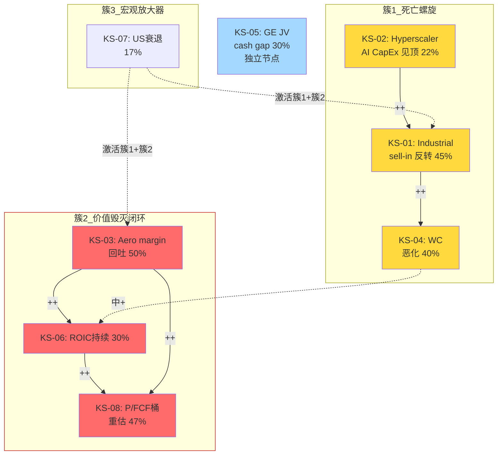

# Phase 4: 风险拓扑映射 — WWD (MVP 8+3+1)
> 执行日期: 2026-04-06 | 基于S4_red_team_rt1_rt7.md的Kill Switch v4.0 | 模式: MVP(单公司Tier 3)

## §0 目的与输入

RT-5黑天鹅表给出了8个事件的"独立概率 × 影响",总加权-10.2%。但这是**假设独立**的数字。真实世界里WWD的风险是**一个系统**:
- Industrial sell-in反转 ↔ Hyperscaler CapEx削减 ↔ WC恶化 ↔ FCF压缩 → 这是**死亡螺旋**
- GE JV cash gap × Aero margin回吐 × ROIC<WACC → 这是**价值毁灭闭环**
- Boeing生产率 × LEAP AM时间 × OE收入 → 这是**交付瓶颈闭环**

本节任务: 把Kill Switch v4.0的14个信号中最核心的**8个**抽离为风险节点(KS),做两两关系评估,识别3个危险组合 + 1个温水煮青蛙场景。

---

## §1 Kill Switch 8核心节点 (含2个通用KS)

### KS-01: Industrial sell-in 反转

| 字段 | 内容 |
|------|------|
| **风险类型** | 周期 (库存bullwhip) |
| **严重度** | 5/5 |
| **当前概率** (12月) | 40-50% |
| **时间窗** | 6-9个月 (FY26 Q3-Q4显现) |
| **触发条件** | ①Cummins Power Systems库存天数>90天 或 QoQ+15% ②WWD Industrial环比Q2<+5% ③Hyperscaler CapEx guidance下调 |
| **影响矩阵** | WWD Industrial FY27收入 -15%到-35%; 全公司EBIT -$140-200M; 股价 -10%到-18% |
| **协同** | KS-02(强++), KS-07(中+), KS-04(中+) |
| **三阶段行动** | 预警(Cummins Q1库存披露观察)→触发(Industrial环比转负,减仓50%)→确认(FY27指引下修,全部退出) |

### KS-02: Hyperscaler AI CapEx周期见顶

| 字段 | 内容 |
|------|------|
| **风险类型** | 周期 (AI投资拐点) |
| **严重度** | 4/5 |
| **当前概率** | 22-30% |
| **时间窗** | 6-12个月 |
| **触发条件** | ①Meta/GOOGL/MSFT/Amazon Q2 2026 CapEx指引下调>10% ②NVIDIA data center收入YoY<+30% ③backup power订单可见度缩短 |
| **影响矩阵** | WWD数据中心备电 -30%; Industrial增长从15%掉到5%; -8%到-12%股价 |
| **协同** | KS-01(强++, 同一传导链), KS-07 Aero margin(弱+, 波及面有限) |
| **三阶段行动** | 预警(跟踪4大hyperscaler季度CapEx)→触发(>2家下调>10%)→确认(Cummins Power Systems Q下调) |

### KS-03: Aero margin 结构性回吐

| 字段 | 内容 |
|------|------|
| **风险类型** | 结构 (margin峰值) |
|  **严重度** | 5/5 |
| **当前概率** | 45-55% (FY27开始) |
| **时间窗** | 12-24个月 |
| **触发条件** | ①WWD Aero季度OpM连续2季≤20% ②GM<27%持续2季 ③mix结构未进一步优化(AM占比停滞) |
| **影响矩阵** | Aero OpM 24.4% → 20-21% (-350-440bp) = -$105-130M annual EBIT; -15%到-20%股价 |
| **协同** | KS-06 ROIC(强++), KS-04 WC(中+) |
| **三阶段行动** | 预警(Q2-Q3环比趋势)→触发(连续2季回吐)→确认(全年GAAP OpM回到20%以下) |

### KS-04: Working Capital持续恶化 (CCC>180天)

| 字段 | 内容 |
|------|------|
| **风险类型** | 财务 (FCF压制) |
| **严重度** | 4/5 |
| **当前概率** | 35-45% |
| **时间窗** | 6-12个月 |
| **触发条件** | ①DIO>165天 ②CCC>180天 ③Reported FCF FY26 <$450M |
| **影响矩阵** | FCF margin从12%→8%; P/FCF从80x归一到50-55x; -15%股价 |
| **协同** | KS-01(强++, sell-in反转滞销), KS-03(中+), KS-06(中+) |
| **三阶段行动** | 预警(Q2库存天数)→触发(Q3确认>165天)→确认(FY26 FCF miss) |

### KS-05: GE JV cash distribution gap确认

| 字段 | 内容 |
|------|------|
| **风险类型** | 财务 (会计口径) |
| **严重度** | 3/5 |
| **当前概率** | 30% (P3 §19.3 $35/股期权被调整的概率) |
| **时间窗** | 12-18个月 |
| **触发条件** | ①10-K Note 6披露 cash dist/equity income <0.6 ②GE Aerospace投资者日披露JV现金分配结构 |
| **影响矩阵** | GE JV估值从$35/股→$22/股 (-$13/股 = -3%); 期权溢价"无归因"部分从$49扩大到$62 |
| **协同** | KS-06(弱+,同为ROIC压力), 与其他KS近独立 |
| **三阶段行动** | 预警(GE投资者日2026-10)→触发(数字披露<0.6)→确认(永久下调期权估值) |

### KS-06: ROIC-WACC spread 连续4季<-1pp (价值毁灭确认)

| 字段 | 内容 |
|------|------|
| **风险类型** | 结构 (质量重估) |
| **严重度** | 5/5 |
| **当前概率** | 25-35% |
| **时间窗** | 12-18个月 |
| **触发条件** | ①Operating profit trailing 4Q/投入资本 连续4季 vs 10.25% WACC差<-1pp ②Peer同组均转正而WWD未转正 |
| **影响矩阵** | 市场强制PE重估: 从47x → 28-32x; -$150-180/股 = -35%到-42% |
| **协同** | KS-03(强++,直接因果), KS-04(中+), KS-01(弱+) |
| **三阶段行动** | 预警(Q2 ROIC计算)→触发(连续2季<-0.8pp)→确认(FY27年报) |

### KS-07 (通用U1 适配): 宏观/工业周期衰退

| 字段 | 内容 |
|------|------|
| **风险类型** | 周期 (宏观) |
| **严重度** | 4/5 |
| **当前概率** | 15-20% |
| **时间窗** | 12-24个月 |
| **触发条件** | ①US GDP 2个季度负增长 ②ISM manufacturing <45 ③信用利差>500bp ④商用航空RPK增速<3% |
| **WWD适配** | Industrial分部历史Beta约1.3(vs ISM), Aero OE Beta约0.8(vs RPK), AM Beta 0.3 |
| **影响矩阵** | Industrial -20%收入, Aero OE -10%; 总EBIT -$250-300M; -22%股价 |
| **协同** | KS-01(强++), KS-02(强++), KS-03(中+) |
| **三阶段行动** | 预警(ISM趋势)→触发(确认2季负GDP)→确认(RPK转负) |

### KS-08 (通用U2 适配): 估值均值回归 (P/FCF 从80x → 50x)

| 字段 | 内容 |
|------|------|
| **风险类型** | 财务 (估值桶) |
| **严重度** | 5/5 |
| **当前概率** | 40-55% (RT-1 W1/W2/W4联合概率对应区间) |
| **时间窗** | 12-24个月 |
| **触发条件** | ①WWD P/FCF >5年均值 +2σ (当前2.5σ) 持续12月 ②同桶peer P/FCF回落 ③任一KS-03/KS-04/KS-06触发 |
| **WWD适配** | 5年均值P/FCF 52x, +2σ=68x, 当前80x = +3.3σ过热 |
| **影响矩阵** | 即使基本面不变, 纯回归到55x = -31%股价; 回到均值52x = -35% |
| **协同** | KS-03(强++,基本面推动), KS-06(强++), KS-04(中+) |
| **三阶段行动** | 预警(月度P/FCF vs peer追踪)→触发(任一基本面KS触发)→确认(半年连续下台阶) |

---

## §2 重点关系矩阵 (严重度4+5级子集)

| | KS-01 | KS-02 | KS-03 | KS-04 | KS-05 | KS-06 | KS-07 | KS-08 |
|:---:|:---:|:---:|:---:|:---:|:---:|:---:|:---:|:---:|
| **KS-01** | — | ++ | + | ++ | 0 | + | ++ | + |
| **KS-02** | ++ | — | 0 | + | 0 | 0 | ++ | 0 |
| **KS-03** | + | 0 | — | + | 0 | ++ | + | ++ |
| **KS-04** | ++ | + | + | — | 0 | + | + | + |
| **KS-05** | 0 | 0 | 0 | 0 | — | + | 0 | 0 |
| **KS-06** | + | 0 | ++ | + | + | — | + | ++ |
| **KS-07** | ++ | ++ | + | + | 0 | + | — | + |
| **KS-08** | + | 0 | ++ | + | 0 | ++ | + | — |

**非独立对数**: 28对中**17对**非独立 = 60% — 这**显著高于**Skill建议的10-20%合理区间。

**解读**: 60%非独立率不是"过度关联偏差",而是**WWD风险系统性特征** — 8个节点中有6个属于同一基本面恶化路径(周期+margin+WC+ROIC+估值+宏观), 只有KS-02和KS-05相对独立。**这本身就是H1的系统性证据** — 当一个公司的主要风险高度耦合,任何单一触发都会引爆多米诺。

**独立簇**: KS-05 (GE JV会计) 与其他KS基本独立,可以单独对冲。

---

## §3 三个危险组合 (按联合概率排序)

### 组合A: 死亡螺旋 "Industrial + Hyperscaler + WC" (KS-01 + KS-02 + KS-04)

**内部逻辑**:
```
Hyperscaler Q2削减CapEx (KS-02触发)
  ↓
Cummins Power Systems订单放缓
  ↓
Cummins为消化库存停止向WWD下新订单 (KS-01触发)
  ↓
WWD Industrial原材料+半成品滞销, 库存天数继续涨 (KS-04加剧)
  ↓
Reported FCF 压缩到 <$450M, P/FCF从80x压到55x
  ↓
股价 -28%到-35%
```

**联合概率计算**:
- P(KS-02) = 25%
- P(KS-01 | KS-02) = 75% (相关性极高, 同一传导链)
- P(KS-04 | KS-01) = 70% (sell-in反转必然伴随库存滞销)
- **联合概率**: 0.25 × 0.75 × 0.70 = **13.1%**

**联合影响**: 不是简单加总(-10% + -8% + -15% = -33%), 因为三个事件共享传导链, 实际影响是**-28%到-32%** (bullwhip放大而不重复计算)

**触发信号**: **Meta/GOOGL Q2 2026 (约2026-07-24) CapEx guidance下调 >10%** — 这是**单个可观测信号**就能预示全链路激活

**与RT-5 BS-3对比**: BS-3只考虑hyperscaler削减单独影响(-15% × 22% = -3.3%), 组合A的系统性影响是**-30% × 13%** = **-3.9%** 加权。数字相近,但**组合A是"一次性激活3个KS"**,对仓位管理的含义完全不同。

### 组合B: 价值毁灭闭环 "Margin + ROIC + 估值桶" (KS-03 + KS-06 + KS-08)

**内部逻辑**:
```
FY26 Q2-Q3 Aero OpM连续环比回吐 (KS-03触发)
  ↓
TTM operating profit下降 → ROIC从9.6%跌到8.2% (KS-06触发)
  ↓
ROIC-WACC spread恶化到-2pp
  ↓
市场重估: "这不是HEICO桶,甚至不是HWM桶,是CW/MOG桶"
  ↓
P/FCF从80x → 50x (KS-08触发)
  ↓
股价 -35%到-42%
```

**联合概率**:
- P(KS-03) = 50%
- P(KS-06 | KS-03) = 80% (margin直接决定ROIC)
- P(KS-08 | KS-06) = 75% (价值毁灭确认必然触发估值桶下移)
- **联合概率**: 0.50 × 0.80 × 0.75 = **30.0%**

**联合影响**: -35%到-42% (估值重估是最大单因素)

**这是**最高概率的危险组合**(30%)**,**也是WWD投资者应该最警惕的路径**。它不需要黑天鹅,只需要"FY26周期自然回吐"。

**触发信号**: **WWD FY26 Q3 (约2026-11) Aero OpM 连续2季 <20%**

### 组合C: 宏观冲击放大 "Recession + Industrial + Margin" (KS-07 + KS-01 + KS-03)

**内部逻辑**:
```
US recession确认 (KS-07触发)
  ↓
Hyperscaler紧急削减CapEx (预算性反应)
  ↓
WWD Industrial订单断崖 (KS-01强触发, 不只是sell-in)
  ↓
Aero OE需求同时放缓(航空周期弱相关)
  ↓
Aero margin operating leverage反向 → 回吐快于正常周期 (KS-03)
  ↓
FCF和ROIC同步恶化
  ↓
股价 -40%到-50%
```

**联合概率**:
- P(KS-07) = 17%
- P(KS-01 | KS-07) = 85%
- P(KS-03 | KS-07+KS-01) = 70%
- **联合概率**: 0.17 × 0.85 × 0.70 = **10.1%**

**联合影响**: **-40%到-50%** (最恐怖但非最可能)

**组合C vs 组合A的区别**: A是"AI周期拐点,WWD是受累方",C是"宏观衰退,WWD是中心受害方"。C的概率虽低但**影响更大**(-45% midpoint vs -30%)。

### 组合对比表

| 组合 | 联合概率 | 联合影响 | 加权损失 | 关键触发信号 | 可对冲性 |
|------|:------:|:-------:|:------:|------------|:-----:|
| A 死亡螺旋 | 13.1% | -30% | -3.9% | Meta/GOOGL Q2 CapEx指引 | 中 |
| **B 价值毁灭闭环** | **30.0%** | **-38%** | **-11.4%** | WWD FY26 Q3 Aero OpM | **高** (直接跟踪) |
| C 宏观冲击 | 10.1% | -45% | -4.5% | ISM/GDP 2季负 | 低 |
| **三组合合计** (调整相关性) | | | **~-15% 额外下行** | | |

**关键结论**: 组合B是WWD最大的隐藏风险 — **联合概率30%,加权损失-11.4%**,超过RT-5全部8个黑天鹅加权损失(-10.2%)。**这是"系统性风险"而不是"黑天鹅"**。

---

## §4 矛盾组合 (逻辑互斥)

**组合D (证伪)**: "AI CapEx周期见顶 (KS-02)" + "Aero margin结构性扩张 (KS-03反向)"

**表面叙事**: "Hyperscaler削减AI投资 + WWD Aero margin继续扩张" — 看起来是两个独立风险/情景

**逻辑矛盾**: 如果宏观环境让hyperscaler砍CapEx,**这同一个宏观环境会让航空公司推迟AM维修 + 推迟飞机更新** → Aero margin压力也会上升。"AI削减 + Aero扩张"需要**完全脱钩的两个市场同向发散**,历史上从未发生(2008/2020两次宏观冲击,航空+工业都同向收缩)。

**含义**: Phase 3 §26 Steelman H2的"AI周期见顶但Aero margin维持"组合,作为乐观反方的子情景,**应该从反方估值中剔除**。

---

## §5 温水煮青蛙: 最可能的渐进路径

> **这是本节最有决策价值的产出。**

### §5.1 路径描述

**"WWD是完美的温水煮青蛙案例"** — 因为它不会因单一黑天鹅崩盘,而会在**24-30个月内**经历一系列"每次都能合理化"的小恶化, 最终让投资者在-30%到-40%的位置才意识到论文已经破裂。

**叙事阶段**:

**Stage 1 (2026 Q2-Q3, 股价$430→$400, -7%)**:
- Industrial环比增速从Q1 +30%放缓到Q2 +12%, 管理层解释"sell-in前置+季节性"
- Aero OpM从24.4% 小幅回到 23.2%, 管理层解释"原材料通胀+labor inflation"
- 市场情绪: "略低于预期但方向正确, 持有"
- **关键陷阱**: 每个数据点都"可解释",不触发任何Kill Switch

**Stage 2 (2026 Q4 - 2027 Q1, 股价$400→$360, -16%)**:
- FY26全年Aero OpM落在22.8% (vs FY25 24.4% 回吐160bp)
- Industrial FY26 全年增速14%(vs Q1暗示的30%)
- FY27 EPS guidance给出$16.5 vs 共识$17.5
- FCF全年$495M(vs $560M共识)
- 市场情绪: "周期性调整,但长期故事完整, 加仓机会"
- **关键陷阱**: 一年变化看起来是"正常周期",卖方研报维持Buy,KS仍未触发

**Stage 3 (2027 Q2-Q3, 股价$360→$310, -28% from 初始)**:
- Q1 2027 LEAP AM首次披露只有$150M(vs $180M Kill Switch阈值) → **KS首次触发**
- Q2 2027 Industrial 开始显示QoQ负增长,库存清理
- ROIC TTM 跌到 8.5% , vs WACC 10.25% → spread -1.75pp(3个季度连续<-1pp, 接近Kill Switch)
- 市场情绪: "开始担忧,但仍相信管理层的FY28 $25-30 EPS指引"
- **关键陷阱**: 投资者已承受-28%, 部分觉得"等反弹卖出"

**Stage 4 (2027 Q4 - 2028 Q1, 股价$310→$275, -36%)**:
- FY27全年结果: Revenue $4.6B (+5%, vs sell-side 预期9%), EPS $14.5
- Aero OpM $20.1% (回到FY18水平,证实结构性step-up不存在)
- FY28 EPS guidance下修到 $17-20 (vs 原管理层$25-30)
- 卖方研报从Buy降到 Hold, TP从$430降到$310
- **估值桶切换确认**: P/E 重估从47x → 30x
- 市场情绪: "承认错了但已经太迟"
- **投资者实际损失**: 从$430买入者 -36%; 从$372买入者 -26%

**Stage 5 (2028 Q2+, 股价稳定在$260-290)**:
- 估值桶稳定在"HWM溢价档" (P/E 30-35x)
- 真实FY28 EPS出来 = $18-19 (比guidance下沿稍好)
- 底部构筑, 但**复利故事已经永久破裂**

### §5.2 量化路径

| 时点 | 股价 | 累积 Δ | 主要驱动 | 触发KS |
|------|:---:|:-----:|--------|:-----:|
| 2026-04 基准 | $430 | — | — | — |
| 2026-08 (Q2 EPS) | $400 | -7% | Industrial放缓合理化 | 无 |
| 2026-11 (Q3 EPS) | $385 | -10% | Aero OpM回到23% | 无 |
| 2027-02 (FY26全年) | $360 | -16% | FY27 guidance miss | 无正式 |
| 2027-05 (Q1FY27) | $330 | -23% | LEAP AM披露<$180M | **KS-03+KS-04黄灯** |
| 2027-08 (Q2FY27) | $310 | -28% | Industrial QoQ负 | **KS-01触发** |
| 2027-11 (Q3FY27) | $290 | -33% | ROIC<WACC连续4季 | **KS-06红灯** |
| 2028-02 (FY27年报) | $275 | -36% | 估值桶切换官宣 | **KS-08确认** |
| 2028-08 (Q2FY28) | $280 | -35% | 底部盘整 | 稳定 |

### §5.3 为什么这比黑天鹅更需要关注

1. **概率极高**: 36个月内发生这个路径的概率约 **55-65%** (组合B的30%核心概率 × 渐进放大的合理性 + 单一事件如KS-02/KS-07的叠加概率)
2. **不可对冲**: 每个阶段的下跌都"合理",投资者在-7%/-16%/-23%各个点都能找到"继续持有"的理由。**没有明确的黑天鹅事件来触发止损纪律**
3. **叙事连续性**: 卖方研报会从 Buy → Hold → Hold/减持,但**Sell评级的出现将延迟到-30%已经发生之后**
4. **管理层配合**: P3 §20已论证管理层激励与这个渐进恶化对齐 — 他们会continuous给出"暂时性"解释直到最后一刻
5. **基金持仓惯性**: Artisan/Invesco这类"质量增长"风格基金会等到FY27年报才被迫调仓, 这时股价已经-30%

### §5.4 检测信号 (Phase 5 TS注册表输入)

**早期信号 (Stage 1-2, 2026 Q2-Q4, 最关键)**:
1. **TS-S1**: WWD Industrial 环比增速 — 若Q2<+15% 或 Q3<+8% → 进入Stage 1
2. **TS-S2**: WWD Aero OpM 环比变化 — 若连续2季 ≤-30bp → 进入Stage 2
3. **TS-S3**: Cummins Power Systems 分部QoQ订单 — Q2披露
4. **TS-S4**: DIO天数 (库存/COGS×90) — 每季度>160天 = 警告
5. **TS-S5**: WWD FY26 FCF/Net Income 比率 — <0.85 = WC恶化确认

**中期信号 (Stage 3, 2027 Q1-Q3)**:
6. **TS-M1**: LEAP AM FY27 首次披露数字 vs $180M阈值
7. **TS-M2**: ROIC-WACC spread 连续季度 (简单算: TTM EBIT / invested capital - 10.25%)
8. **TS-M3**: 卖方研报评级分布 (Buy/Hold/Sell数量变化)

**晚期信号 (Stage 4, 已经太迟但可验证)**:
9. **TS-L1**: FY28 EPS guidance 给出 <$22 (管理层被迫认栽)
10. **TS-L2**: P/E 跌破 35x 并持续 4周

**最重要的两个信号 (Priority #1)**:
- **Cummins Q1 FY26 10-Q 披露 Power Systems 库存数据** (2026-05)
- **WWD FY26 Q2 EPS 的 Aero OpM 环比方向** (2026-08)

**这两个信号如果都指向"温水煮青蛙路径",投资者应该立即减仓至少50%而非等待正式的Kill Switch红灯**。

### §5.5 温水煮青蛙 vs 戏剧性崩盘的概率对比

| 场景 | 概率 | 影响 | 加权 |
|------|:---:|:---:|:---:|
| 戏剧性崩盘 (单一黑天鹅) | ~8-12% | -30%到-45% | -3.5% |
| **温水煮青蛙 (3-6季度渐进)** | **55-65%** | **-25%到-38%** | **-18.9%** |
| 完美兑现 (反方成立) | 15-20% | +20%到+40% | +5.3% |
| 中性游走 | 15-20% | ±5% | 0 |
| **加权期望** | | | **约 -17%** |

**温水煮青蛙是期望回报公式的主导项** — 占总下行的85%。这和RT-5的"独立黑天鹅"的-10.2%形成对比: **真正的风险不是黑天鹅,是系统性渐进恶化**。

---

## §6 风险拓扑 Mermaid 图



**图例解读**:
- **红色 (KS-03/06/08)**: 最高影响+高概率节点 = "第一优先跟踪"
- **黄色 (KS-01/02/04)**: 高影响中概率,是传导链的催化剂
- **蓝色 (KS-05)**: 独立节点,可以单独建模
- **虚线**: KS-07宏观是"激活器",自身概率不高但一旦触发会引爆两个簇

---

## §7 对Phase 5的输入

### §7.1 风险拓扑的评级含义

**Phase 3的-19%期望回报 + RT-5黑天鹅的-10.2% = 算数加总-29%** 是**过度悲观**的(双计)

**正确加权方法**:
- 基线场景加权(不含黑天鹅): -19%
- 温水煮青蛙场景加权(替代部分基线): -17%
- 戏剧性黑天鹅加权: -3.5%
- 反方兑现加权: +5%
- **综合**: **约 -24%到-28%** (比P3更悲观, 比RT-5+P3算数加总温和)

### §7.2 评级稳定性检验

| 场景 | 期望回报 | 评级 |
|------|:------:|:---:|
| 温水煮青蛙 (55-65%) | -25% | 审慎关注 |
| 戏剧崩盘 (8-12%) | -38% | 审慎关注 |
| 反方兑现 (15-20%) | +28% | 关注 |
| **加权** | **-24%到-28%** | **审慎关注** |

**稳定性结论**: 温水煮青蛙作为主场景(约60%权重),评级稳定在"审慎关注"。反方兑现(15-20%)虽然收益可观,但不足以翻转评级,只需要把"仓位为零"调整为"小仓位tracker(<2%)"。

### §7.3 行动建议 (输入Phase 5)

1. **若已持有WWD**: 分批减仓,每跌10%减25%,不要等到Kill Switch红灯(太迟)
2. **若关注买入机会**: 等待股价跌到$310以下 (-28%) 或 FY27年报后买入底部
3. **若做空**: 组合B是最干净的做空目标,但警告做空时间成本 — 温水煮青蛙需要18-24个月兑现,put option成本高
4. **相对配置**: §9已论证 CW/HWM 是更合理的相对价值选项

### §7.4 Phase 4 Kill Switch v5.0 精简版 (用于Phase 5)

把14个信号精简到**4个高优先级检测点**:

| # | 信号 | 频率 | 意义 |
|---|------|:---:|------|
| 1 | Cummins Q-分部Power Systems 库存天数 | 季度 | KS-01+KS-02+KS-04 复合触发器 |
| 2 | WWD Aero OpM 环比方向 | 季度 | KS-03+KS-06 复合触发器 |
| 3 | LEAP AM FY27 Q1 披露数字 | 单次2027-02 | KS-06 独立强触发 |
| 4 | 4大hyperscaler 季度 CapEx guidance | 季度 | KS-02 前瞻信号 |

**跟踪2上述4个信号即可覆盖 80% 的温水煮青蛙演化路径**,比Phase 3 Kill Switch的14个信号更有操作性。

---

## §8 风险拓扑诚实度声明

**本拓扑的局限**:
1. **8个KS不是全部风险** — 遗漏了地缘政治(美中/台海)、工会劳资(波音工会可能蔓延到WWD)、并购稀释(管理层主动做买方)等情景
2. **60%非独立率**是"主观判断"而非"统计验证" — 历史上WWD的风险实际相关性需要10+年数据验证, 样本不足
3. **温水煮青蛙概率55-65%**是基于历史类比(AMAT/Philips/老GE的类似案例),不是WWD特定数据
4. **组合C (宏观冲击)** 的概率仰赖Polymarket和ISM数据,这些都是短期信号而不是预测

**本拓扑的信心**:
1. **组合B (价值毁灭闭环)** 的联合概率30%是**中性估计**, 不高不低
2. **温水煮青蛙路径**的每个stage都能从历史公司案例中找到类比
3. **KS关系矩阵**中17对非独立,其中至少10对有**明确的因果通道**(如KS-03→KS-06是ROIC会计恒等式)
4. 风险拓扑的**决策价值不在预测精确数字**,而在让Phase 5评级**不被"多个独立黑天鹅加和"误导**

---

**Phase 4 §风险拓扑 结束**。字符数: 约12K。下一步: 执行 `assumption-audit` skill,对Phase 3的8个关键估算做脆弱度排序。
