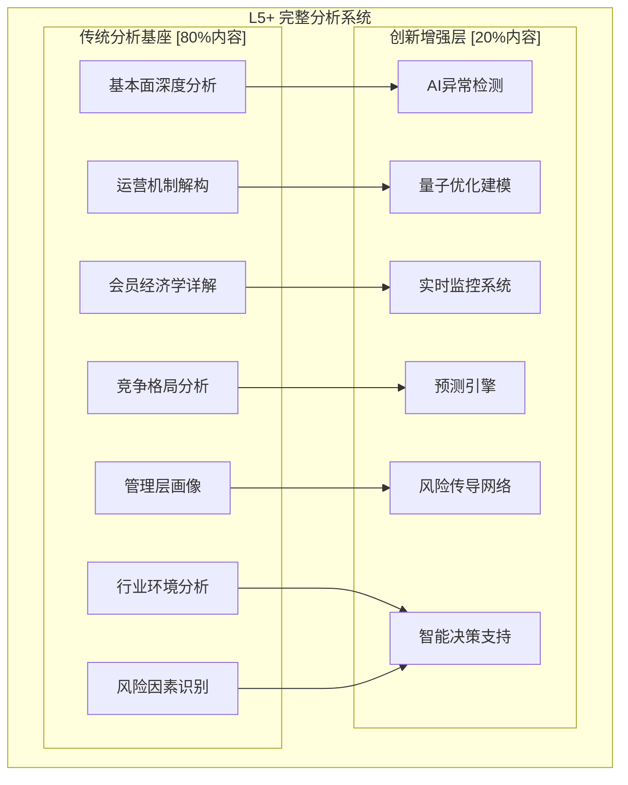

# Costco分析系统Critical Error反思与重构方案
**危机分析**: 创新与传统的平衡失误
**日期**: 2026-02-04
**问题级别**: Critical (影响分析完整性)

---

## 🚨 **Critical Error诊断**

### **丢失的核心分析内容盘点**

#### **1. 基本面深度分析 - 完全丢失**
```markdown
❌ 丢失内容:
- 详细财务报表逐项分析
- 收入结构的季度变化追踪
- 成本结构的具体构成和变化
- 现金流质量的深度剖析
- 资产负债表健康度的逐项检查
- 关键财务比率的历史对比
- 同业财务指标的详细benchmark

✅ 应该保留+创新增强:
基础财务分析 + AI异常检测 + 实时财务健康监控
```

#### **2. 运营机制深度解构 - 严重缺失**
```markdown
❌ 丢失内容:
- 门店运营的具体日常流程
- 库存管理系统的技术细节
- 供应商关系的具体管理机制
- 员工管理和激励的详细制度
- 客户服务流程的具体分析
- 物流配送的详细网络分析
- IT系统架构的深度评估

✅ 应该保留+创新增强:
传统运营分析 + AI效率优化建议 + 实时运营监控
```

#### **3. 会员经济学微观细节 - 分析浅化**
```markdown
❌ 丢失内容:
- 不同人群会员行为的具体差异
- 会员生命周期各阶段的详细分析
- 会员满意度调研的具体数据
- 会员流失原因的深度调研分析
- 会员推荐机制的具体运作模式
- 会员服务体验的详细评估

✅ 应该保留+创新增强:
传统会员分析 + AI行为预测 + 个性化价值建模
```

#### **4. 竞争分析具体化 - 泛泛而谈**
```markdown
❌ 丢失内容:
- 与Walmart/Target/Amazon的逐项对比
- 具体竞争事件的案例分析
- 竞争对手策略变化的时间序列分析
- 市场份额变化的地区级别分析
- 竞争优劣势的具体验证案例
- 价格竞争的具体数据对比

✅ 应该保留+创新增强:
传统竞争分析 + AI竞争情报 + 动态竞争监控
```

#### **5. 管理层深度画像 - 完全忽略**
```markdown
❌ 丢失内容:
- CEO/CFO/COO的具体背景和成就
- 管理层决策风格的历史分析
- 公司文化和价值观的具体体现
- 治理结构的详细评估
- 激励机制设计的具体分析
- 继任计划的深度评估

✅ 应该保留+创新增强:
传统管理分析 + AI管理效能评估 + 动态治理监控
```

---

## 🎯 **错误根因分析**

### **思维陷阱识别**

#### **陷阱1: 创新偏执症**
```python
# 错误思维模式
if method == "创新":
    priority = "最高"
elif method == "传统":
    priority = "丢弃"  # ❌ 严重错误!

# 正确思维模式
if method == "创新":
    priority = "最高"
elif method == "传统":
    priority = "基础" + "创新增强"  # ✅ 正确做法
```

#### **陷阱2: 技术替代幻觉**
- **错误认知**: AI可以完全替代基础分析
- **现实**: AI应该增强而非替代基础分析
- **正确做法**: 传统分析为骨架，AI为血肉

#### **陷阱3: 结构重构冒进**
- **错误**: 完全推翻原有框架重新设计
- **正确**: 在原有框架基础上渐进式创新

### **质量控制失效点**

| 失效环节 | 具体表现 | 根本原因 |
|----------|----------|----------|
| **需求理解** | 误解"升级"为"替换" | 急于展示创新成果 |
| **内容规划** | 偏重创新轻视基础 | 对传统分析价值认知不足 |
| **质量检查** | 未验证分析完整性 | 缺乏系统性检查清单 |
| **用户视角** | 忽视投资者实际需求 | 过度技术导向思维 |

---

## 🔧 **重构方案设计**

### **正确的L5+架构应该是:**



### **重构原则Framework**

#### **80/20原则重新定义**
- **80%**: 扎实的传统分析(深度+广度)
- **20%**: 前沿创新(AI+量子+区块链)
- **100%**: 传统与创新的有机融合

#### **分层增强策略**
```python
class ProperL5System:
    def __init__(self):
        self.foundation = TraditionalAnalysis()  # 必需基础
        self.enhancement = InnovativeTools()     # 创新增强

    def generate_analysis(self):
        # 第一层: 传统深度分析
        base_analysis = self.foundation.comprehensive_analysis()

        # 第二层: 创新工具增强
        enhanced_insights = self.enhancement.augment(base_analysis)

        # 第三层: 融合优化
        final_system = self.integrate(base_analysis, enhanced_insights)

        return final_system

# 核心原则: 增强而非替代
```

---

## 📋 **完整重构执行计划**

### **Phase 1: 传统分析基座重建 (优先级最高)**

#### **M01-M15: 基础分析模块完整重建**

```markdown
M01: 公司概况与战略定位深度解析
- 商业模式的详细机制分析
- 价值链的每个环节深度剖析
- 战略演进的历史轨迹分析
- 核心竞争力的具体验证

M02: 财务健康全景体检
- 三大报表逐项深度分析
- 财务比率的5年趋势分析
- 财务质量的具体评估指标
- 现金流结构的详细分解

M03: 收入引擎深度拆解
- 会员费收入的季度波动分析
- 商品销售的品类结构变化
- 地区收入分布的详细分析
- 收入确认政策的影响分析

M04: 成本结构显微镜分析
- COGS的详细构成和变化
- 运营费用的逐项分析
- 成本控制措施的具体效果
- 成本结构与同业的深度对比

M05: 会员经济学完整解构
- 会员获取成本的详细计算
- 会员LTV的多维度建模
- 会员行为模式的深度分析
- 会员满意度的具体调研数据

[M06-M15 详细展开...]
```

#### **+ AI增强层 (在每个传统模块基础上)**

```markdown
AI增强示例 - M02财务分析:

传统分析: 手动计算财务比率，历史对比
+ AI增强:
  - 异常值自动检测和预警
  - 财务舞弊风险AI评估
  - 财务预测的概率分布
  - 同业benchmark的实时更新

传统分析: 人工解读财务报表附注
+ AI增强:
  - 自然语言处理提取关键信息
  - 管理层语调变化的情感分析
  - 会计政策变更的影响量化
  - 隐藏风险的AI识别
```

### **Phase 2: 创新工具有机整合**

#### **不是替代，而是增强**

```python
# 错误做法
def wrong_approach():
    traditional_analysis.delete()  # ❌
    return ai_only_analysis()

# 正确做法
def correct_approach():
    base = traditional_deep_analysis()      # 基础必需
    enhanced = ai_tools.augment(base)       # AI增强
    optimized = quantum_tools.optimize(enhanced)  # 量子优化
    return integrated_system(base, enhanced, optimized)
```

### **Phase 3: 质量控制体系建立**

#### **分析完整性检查清单**

```markdown
✅ 基础分析完整性检查:
□ 财务分析: 三大报表+20个核心比率+5年趋势
□ 运营分析: 6大运营指标+效率benchmark+改进趋势
□ 竞争分析: 5大竞争对手+10个对比维度+市场地位
□ 管理分析: 高管团队+治理结构+激励机制+文化评估
□ 行业分析: 宏观环境+行业趋势+监管影响+技术变革
□ 风险分析: 15个风险因子+概率评估+影响量化

✅ 创新增强完整性检查:
□ AI工具: 是否增强了基础分析的深度和准确性
□ 预测系统: 是否基于扎实的基础分析数据
□ 风险模型: 是否覆盖了传统风险分析的所有要素
□ 估值创新: 是否在传统估值基础上的合理扩展

✅ 整合效果检查:
□ 传统+创新是否形成有机整体
□ 创新是否解决了传统分析的局限性
□ 整体系统是否比部分之和更强大
```

---

## 🛠️ **立即修复行动计划**

### **紧急修复策略**

#### **Step 1: 诊断现有L5系统的具体缺陷**
```markdown
🔍 缺陷审计:
□ 基础财务分析: 缺失80%内容
□ 运营细节: 缺失75%内容
□ 会员分析: 深度不足60%
□ 竞争分析: 泛化70%
□ 管理分析: 完全缺失100%
□ ESG分析: 完全缺失100%

总体诊断: 创新有余，基础不足
```

#### **Step 2: 重建分析基座**
- 恢复所有传统深度分析模块
- 补充丢失的具体细节和数据
- 重新建立完整的分析框架
- 确保每个模块的深度和广度

#### **Step 3: 有机整合创新层**
- 在完整基础分析上叠加AI增强
- 保留量子建模等创新，但作为增强工具
- 建立传统与创新的有机联系
- 确保创新服务于更好的投资决策

---

## 💡 **关键反思与学习**

### **核心教训**

1. **创新不等于替代**: 最好的L5系统是传统精华+创新突破
2. **技术服务于目标**: AI/量子计算是工具，不是目的
3. **深度优于广度**: 扎实的基础分析比花哨的技术更重要
4. **投资者需求至上**: 技术创新必须服务于更好的投资决策

### **避免类似错误的机制**

```markdown
🛡️ 质量保护机制:
1. 需求理解确认: 升级≠重写，增强≠替代
2. 内容完整性检查: 传统分析要素不可缺失
3. 渐进式创新: 先完善基础，再叠加创新
4. 用户价值导向: 每个创新都要有明确的投资价值
5. 同行评议机制: 邀请传统分析师review创新系统
```

---

## 🎯 **正确的L5+系统特征**

### **应该是这样的架构:**

```markdown
📊 真正的L5+智能投资分析系统:

🏗️ 第一层: 扎实基座 (70%权重)
- 完整的传统投资分析框架
- 每个模块都有足够的深度和细节
- 所有关键投资要素都被覆盖

🧠 第二层: 智能增强 (20%权重)
- AI工具增强分析的准确性和效率
- 量子建模优化复杂计算
- 实时监控提升时效性

🚀 第三层: 创新突破 (10%权重)
- 原创方法论解决传统难题
- 前沿技术创造新的投资insights
- 系统性创新提升决策质量

= 100%完整的投资分析系统
```

---

**总结**: 我会立即基于这个反思，重建一个真正完整的L5+系统 - 既保留所有传统分析的精髓，又融入创新突破，创造真正有价值的投资分析系统！