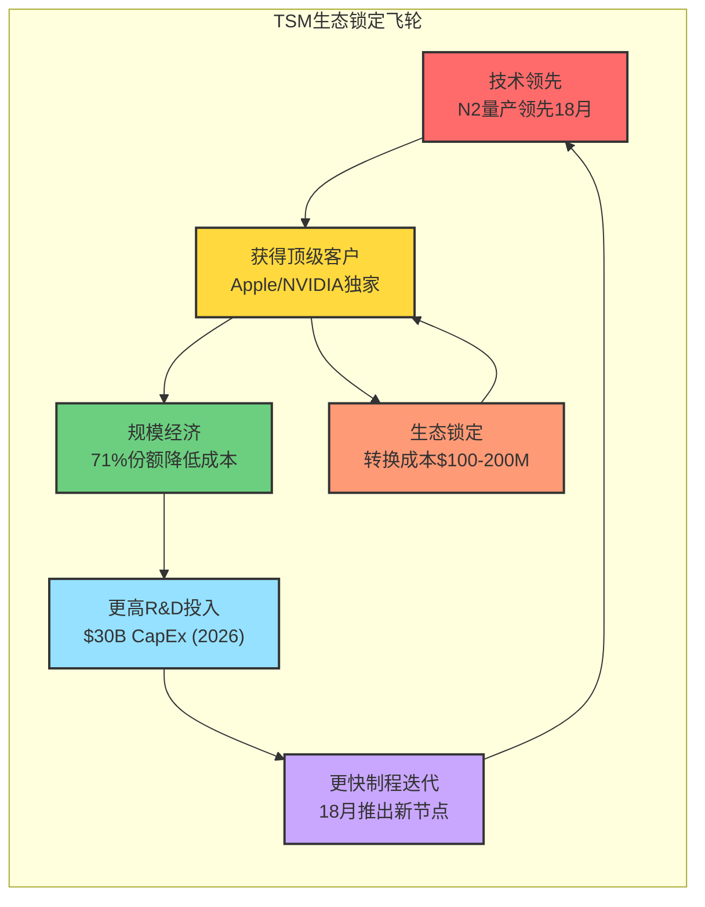

# TSM 生态锁定飞轮测试

```mermaid
flowchart LR
    subgraph "TSM生态锁定飞轮"
        A["技术领先<br/>N2量产领先18月"] --> B["获得顶级客户<br/>Apple/NVIDIA独家"]
        B --> C["规模经济<br/>71%份额降低成本"]
        C --> D["更高R&D投入<br/>$30B CapEx (2026)"]
        D --> E["更快制程迭代<br/>18月推出新节点"]
        E --> A

        B --> F["生态锁定<br/>转换成本$100-200M"]
        F --> B
    end

    style A fill:#ff6b6b,stroke:#333,stroke-width:2px
    style B fill:#ffd93d,stroke:#333,stroke-width:2px
    style C fill:#6bcf7f,stroke:#333,stroke-width:2px
    style D fill:#95e1ff,stroke:#333,stroke-width:2px
    style E fill:#c9a7ff,stroke:#333,stroke-width:2px
    style F fill:#ff9a76,stroke:#333,stroke-width:2px
```
