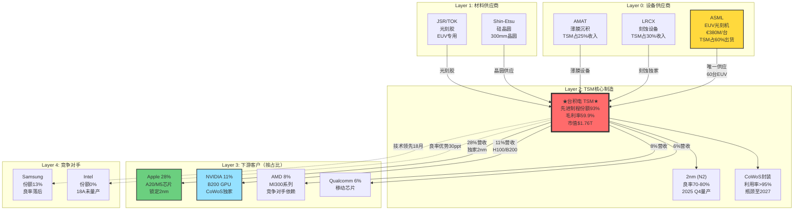

# TSM 供应链生态图

```mermaid
flowchart TB
    subgraph "Layer 0: 设备供应商"
        ASML["ASML<br/>EUV光刻机<br/>€380M/台<br/>TSM占60%出货"]
        LRCX["LRCX<br/>刻蚀设备<br/>TSM占30%收入"]
        AMAT["AMAT<br/>薄膜沉积<br/>TSM占25%收入"]
    end

    subgraph "Layer 1: 材料供应商"
        SE["Shin-Etsu<br/>硅晶圆<br/>300mm晶圆"]
        JSR["JSR/TOK<br/>光刻胶<br/>EUV专用"]
    end

    subgraph "Layer 2: TSM核心制造"
        TSM["★台积电 TSM★<br/>先进制程份额93%<br/>毛利率59.9%<br/>市值$1.76T"]
        N2["2nm (N2)<br/>良率70-80%<br/>2025 Q4量产"]
        COWOS["CoWoS封装<br/>利用率>95%<br/>瓶颈至2027"]
    end

    subgraph "Layer 3: 下游客户（按占比）"
        AAPL["Apple 28%<br/>A20/M5芯片<br/>锁定2nm"]
        NVDA["NVIDIA 11%<br/>B200 GPU<br/>CoWoS独家"]
        AMD["AMD 8%<br/>MI300系列<br/>竞争对手依赖"]
        QCOM["Qualcomm 6%<br/>移动芯片<br/>"]
    end

    subgraph "Layer 4: 竞争对手"
        SSNLF["Samsung<br/>份额13%<br/>良率落后"]
        INTC["Intel<br/>份额0%<br/>18A未量产"]
    end

    %% 供应关系
    ASML -->|"唯一供应<br/>60台EUV"| TSM
    LRCX -->|"刻蚀独家"| TSM
    AMAT -->|"薄膜设备"| TSM
    SE -->|"晶圆供应"| TSM
    JSR -->|"光刻胶"| TSM

    TSM --> N2
    TSM --> COWOS

    %% 客户关系
    TSM -->|"28%营收<br/>独家2nm"| AAPL
    TSM -->|"11%营收<br/>H100/B200"| NVDA
    TSM -->|"8%营收"| AMD
    TSM -->|"6%营收"| QCOM

    %% 竞争关系
    TSM -.->|"技术领先18月"| SSNLF
    TSM -.->|"良率优势30ppt"| INTC

    style TSM fill:#ff6b6b,stroke:#333,stroke-width:4px
    style ASML fill:#ffd93d,stroke:#333,stroke-width:2px
    style AAPL fill:#6bcf7f,stroke:#333,stroke-width:2px
    style NVDA fill:#95e1ff,stroke:#333,stroke-width:2px
```
