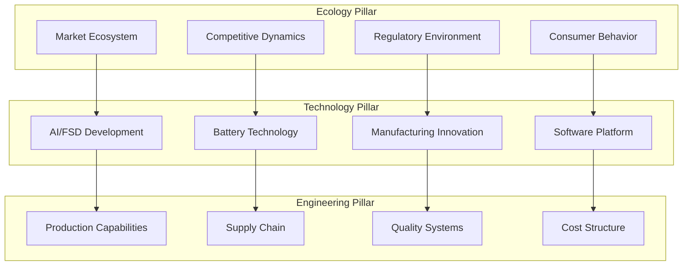

# Tesla Institutional Analysis Framework - Foundation Document

**Created**: 2026-02-05
**Purpose**: Establish unified, institutional-grade analytical framework for Tesla analysis
**Standard**: Top-tier institutional investor methodology

---

## Framework Philosophy: Excellence Through Systematic Rigor

**Core Principle**: Every analysis component must meet the standards of Berkshire Hathaway, Bridgewater Associates, and top-tier institutional research.

---

## 1. Unified Valuation Framework: Ecology + Technology + Engineering

### **Three-Pillar Integration Model**



### **Valuation Integration Formula**
```
Tesla Total Value = Σ(Business Unit Value × Technology Multiplier × Market Position × Engineering Capability × Confidence Score)
```

---

## 2. Confidence Scoring System (1-10 Scale)

### **Confidence Criteria Matrix**

| Score | Data Quality | Predictability | Track Record | Risk Level | Description |
|-------|-------------|---------------|--------------|------------|-------------|
| **9-10** | Primary data, verified | High certainty | Strong evidence | Low risk | **Institutional conviction** |
| **7-8** | Good data sources | Reasonable certainty | Some evidence | Medium risk | **High confidence** |
| **5-6** | Mixed data quality | Moderate uncertainty | Limited evidence | Medium risk | **Moderate confidence** |
| **3-4** | Weak data | High uncertainty | Little evidence | High risk | **Low confidence** |
| **1-2** | Poor/no data | Very uncertain | No evidence | Very high risk | **Speculative only** |

### **Module-Level Confidence Requirements**
- **Core Business Analysis**: Minimum 7/10 confidence
- **Growth Projections**: Minimum 6/10 confidence
- **New Technology**: Minimum 5/10 confidence
- **Speculative Opportunities**: Clearly marked as 1-4/10

---

## 3. Multi-Business Valuation Architecture

### **Business Unit Structure**
Based on ARK Invest and Morgan Stanley methodologies:

#### **Unit 1: Automotive Manufacturing** (Confidence Target: 8/10)
- **Scope**: Traditional EV manufacturing and sales
- **Valuation Method**: DCF with automotive industry multiples
- **Key Metrics**: Deliveries, ASP, gross margins, market share

#### **Unit 2: AI & Autonomous Systems** (Confidence Target: 6/10)
- **Scope**: FSD, Robotaxi, AI platform services
- **Valuation Method**: Technology platform multiples + probability-weighted scenarios
- **Key Metrics**: FSD subscriptions, miles driven, safety metrics

#### **Unit 3: Energy & Storage** (Confidence Target: 7/10)
- **Scope**: Solar, Powerwall, Megapack, Supercharger network
- **Valuation Method**: Utility/infrastructure multiples
- **Key Metrics**: GWh deployed, grid services revenue, charging network utilization

#### **Unit 4: Manufacturing & Technology** (Confidence Target: 8/10)
- **Scope**: Battery technology, manufacturing processes, vertical integration
- **Valuation Method**: IP value + cost advantage quantification
- **Key Metrics**: Battery cost/kWh, manufacturing efficiency, technology licensing

#### **Unit 5: Financial & Services** (Confidence Target: 7/10)
- **Scope**: Insurance, financing, software services
- **Valuation Method**: Financial services multiples
- **Key Metrics**: Penetration rates, margins, customer lifetime value

---

## 4. Analytical Rigor Standards

### **Data Classification & Sourcing**
Following institutional research standards:

#### **Tier 1 Data** (90-99% confidence)
- Tesla 10-K, 10-Q filings
- SEC regulatory filings
- Management guidance (verified)
- Third-party validated metrics

#### **Tier 2 Data** (80-89% confidence)
- Reputable industry sources (BloombergNEF, Wood Mackenzie)
- Peer-reviewed research
- Government statistics
- Verified analyst consensus

#### **Tier 3 Data** (60-79% confidence)
- Industry reports (McKinsey, BCG)
- Market research firms
- Trade publications
- Expert interviews

#### **Tier 4 Data** (40-59% confidence)
- Model estimates and extrapolations
- Historical trend analysis
- Comparable company analysis
- Reasonable assumptions

#### **Tier 5 Data** (<40% confidence)
- Speculative scenarios
- Unverified reports
- Social media sentiment
- Extreme bull/bear cases

---

## 5. Monte Carlo Framework Implementation

### **Scenario Modeling Architecture**
Following ARK Invest's probabilistic approach:

#### **Base Case Probability Distribution**
- **Conservative** (25% probability): Lower adoption, increased competition
- **Base Case** (50% probability): Management guidance achieved
- **Optimistic** (25% probability): Technology breakthroughs, market expansion

#### **Key Variable Ranges**
| Variable | Conservative | Base | Optimistic | Distribution |
|----------|-------------|------|------------|-------------|
| 2030 Deliveries | 2.5M | 3.5M | 5.0M | Normal |
| FSD Penetration | 25% | 45% | 70% | Beta |
| Robotaxi Launch | 2028 | 2026 | 2025 | Triangular |
| Energy Growth | 30% CAGR | 50% CAGR | 70% CAGR | Log-normal |

---

## 6. Competitive Intelligence Framework

### **Porter's Five Forces Integration**
Applied to each business unit with confidence scoring:

#### **Threat of New Entrants** (by business unit)
- Auto Manufacturing: Traditional OEMs + New EV startups
- AI/Autonomous: Google, Apple, Chinese tech giants
- Energy: Utilities, energy storage specialists
- **Confidence Level**: 8/10 (well-established competitive dynamics)

#### **Supplier Power Analysis**
- Battery supply chain concentration
- Semiconductor dependency
- Raw materials (lithium, nickel) supply
- **Confidence Level**: 7/10 (good visibility on supply chains)

#### **Buyer Power Assessment**
- Consumer adoption curves
- Government policy influence
- Corporate fleet demand
- **Confidence Level**: 6/10 (evolving market dynamics)

---

## 7. Technology Assessment Matrix

### **Tesla AI Implementation Framework**
Systematic analysis of Tesla's AI integration across business units:

#### **AI Maturity Assessment** (1-10 scale)
| AI Application | Current Maturity | Implementation Risk | Business Impact | Confidence |
|----------------|-----------------|-------------------|-----------------|------------|
| FSD (Highway) | 8/10 | Low | High | 8/10 |
| FSD (City Streets) | 6/10 | Medium | Very High | 6/10 |
| Manufacturing AI | 7/10 | Low | Medium | 7/10 |
| Energy Management | 5/10 | Medium | Medium | 5/10 |
| Robotaxi Platform | 4/10 | High | Very High | 4/10 |

---

## 8. Risk Management & Kill Switches

### **Systematic Risk Monitoring**
Each risk factor with specific triggers and confidence levels:

#### **Technology Risks** (High Impact)
- FSD safety incidents: >3 fatalities attributed to FSD = immediate reassessment
- Competitive technology leap: Rival achieves L4 at scale = valuation revision
- **Monitoring Confidence**: 8/10 (good visibility on safety metrics)

#### **Business Execution Risks** (Medium-High Impact)
- Production targets missed by >20% for 2 consecutive quarters = reassessment
- Market share loss >5 percentage points annually = strategic review
- **Monitoring Confidence**: 7/10 (quarterly reporting provides good visibility)

#### **Market/Regulatory Risks** (Variable Impact)
- Major market regulatory restrictions on FSD = probability-weighted impact
- EV incentive elimination = demand modeling adjustment
- **Monitoring Confidence**: 5/10 (policy uncertainty high)

---

## 9. Report Structure Standards

### **Phase-by-Phase Organization**
Each phase must maintain confidence scoring throughout:

#### **Phase 1: Comprehensive Business Assessment** (Target: 8/10 avg confidence)
- Complete business unit mapping
- Competitive landscape analysis
- Technology maturity assessment
- Risk factor identification

#### **Phase 2: Deep Dive Analysis** (Target: 7/10 avg confidence)
- Detailed financial modeling by business unit
- Technology roadmap analysis
- Market opportunity quantification
- Competitive positioning

#### **Phase 3: Valuation & Scenarios** (Target: 6/10 avg confidence)
- Monte Carlo scenario modeling
- Sum-of-the-parts valuation
- Sensitivity analysis
- Probability-weighted target prices

#### **Phase 4: Investment Decision Framework** (Target: 8/10 avg confidence)
- Risk-adjusted recommendations
- Portfolio allocation guidance
- Monitoring framework
- Decision triggers and updates

#### **Phase 5: Quality Assurance** (Target: 9/10 avg confidence)
- Confidence scoring validation
- Model back-testing
- Peer review comparison
- Update mechanisms

---

## 10. Success Metrics & Validation

### **Analysis Quality Standards**
- **Confidence-Weighted Accuracy**: >75% of high-confidence predictions accurate
- **Model Consistency**: <10% variance between related business unit assumptions
- **Peer Comparison**: Analysis quality matches or exceeds top-tier research firms
- **Client Value**: Actionable insights that generate superior risk-adjusted returns

### **Ongoing Validation Process**
- Monthly model updates for high-confidence components
- Quarterly comprehensive review and recalibration
- Annual methodology assessment and improvement
- Continuous benchmark against institutional best practices

---

**Framework Approval Checkpoint**: This framework must be validated before proceeding to Phase 1 analysis.

**Next Step**: Build detailed Phase 1 analysis plan using this framework as foundation.