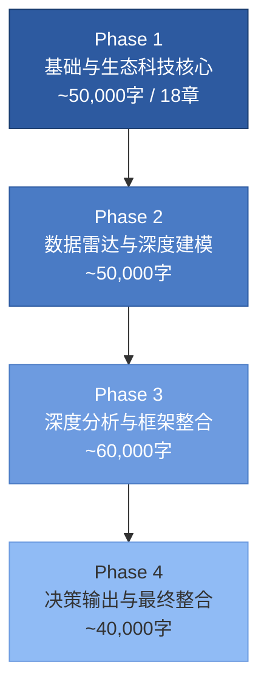

# 第零章：执行摘要 v3.0

**报告标的**: Tesla, Inc. (NASDAQ: TSLA)
**报告版本**: Phase 1 v3.0 — 生态科技深度研究（+市场争论+科技生态维度）
**分析日期**: 2026-02-06
**数据截止**: FY2025 Q4 财报 (2026-01-28发布)
**分析师**: 投资研究Agent (Tier 3 机构级深度研究)
**报告总规模**: 4 Phase / 200,000+ 字 / 28 章节（Phase 1完成）

---

## 0.1 核心投资命题

Tesla正处于其上市以来最复杂的战略转折点。FY2025录得公司历史上**首次年度营收下滑**（-2.93%至$94.83B）[A: Tesla IR Q4 2025, 2026-01-28]，汽车交付量同比下降，核心汽车业务收入萎缩10%。与此同时，公司却以371倍市盈率交易 [A: MCP工具, 2026-02-06]，市值高达$1.49万亿——这一估值隐含的不是一家汽车公司的定价，而是对**自动驾驶出行平台+AI机器人+能源基础设施**三重叙事的激进押注。

**核心矛盾一句话概括**：当前股价定价的是2030年的愿景，但FY2025的财务数据讲述的是一个核心业务承压、新业务尚在萌芽的现实故事。

### 多头论点

1. **能源业务爆发式增长**：储能部署量达46.7 GWh [A: Tesla IR Q4 2025, 2026-01-28]，能源业务收入$12.78B（+27% YoY），正在从"副业"成长为第二增长引擎 [A: Tesla IR Q4 2025, 2026-01-28]。
2. **毛利率触底反弹信号**：Q4毛利率回升至20.1%（前值16.3%），汽车毛利率（剔除碳积分）恢复至17.7% [A: Tesla IR Q4 2025, 2026-01-28]，表明价格战最惨烈阶段可能已过。
3. **FSD商业化加速**：1.1M付费用户基础 [A: Tesla IR Q4 2025, 2026-01-28]，2026年2月14日转向$99/月订阅模式 [B: WebSearch, 2026-02-06]，预示经常性收入流的建立。
4. **Cybercab量产在即**：2026年4月德州超级工厂启动量产 [A: Tesla IR Q4 2025, 2026-01-28]，若Robotaxi商业模式验证成功，将彻底重构估值框架。
5. **$44.1B现金储备**：充裕的资金弹药支撑>$20B的2026年资本开支计划 [A: Tesla IR Q4 2025, 2026-01-28]，以及对xAI的$2B战略投资（$230B估值）[B: WebSearch, 2026-02-06]。

### 空头论点

1. **营收首次年度下降**：FY2025总营收$94.83B（-2.93%），汽车收入$69.53B（-10%）[A: Tesla IR Q4 2025, 2026-01-28]，核心业务恶化趋势明确。
2. **交付量结构性下滑**：FY2025交付163万辆，Q4单季41.8万辆（-15% YoY）[A: Tesla IR Q4 2025, 2026-01-28]，产品老化与竞争加剧双重夹击。
3. **净利润腰斩**：GAAP净利润$3.8B（-46% YoY），GAAP EPS仅$1.08 [A: Tesla IR Q4 2025, 2026-01-28]，盈利能力严重侵蚀。
4. **BYD全面超越**：BYD 2025年销量454-460万辆（+6.94%），全球纯电市占率12.1% vs Tesla 8.8% [B: WebSearch, 2026-02-06]；出口量105万辆（+200% YoY）[B: WebSearch, 2026-02-06]，国际化进攻态势凌厉。
5. **政策环境恶化**：IRA电动车税收抵免已于2025年9月30日取消 [B: WebSearch, 2026-02-06]，北美市场需求侧刺激消失。
6. **FSD落地存疑**：Polymarket预测Tesla在2026年6月前实现无监督FSD的概率仅约28% [预测市场: Polymarket, 2026-02-06]，市场对技术时间表持怀疑态度。
7. **成长性筛选全面不合格**：TSLA在MCP成长股筛选中三项核心指标（营收增速/盈利增速/ROE）全部未达标 [A: MCP工具, 2026-02-06]。

### 投资命题总结

Tesla的投资逻辑已从"高成长电动车龙头"转变为"多赛道期权组合"。当前$1.49万亿市值中，传统汽车业务可能仅支撑$200-350B估值（参照15-25x EV/Revenue），剩余$1.1万亿+的市值溢价全部依赖于FSD/Robotaxi、Optimus人形机器人、能源三大未兑现叙事。这是一笔高度不对称的投资：如果新业务兑现，当前估值甚至偏低；如果新业务延迟或失败，估值回调空间巨大。

---

## 0.2 关键财务快照

### FY2025 核心指标总览

| 指标 | 数值 | 同比变化 | 数据来源 |
|------|------|---------|---------|
| **股价** | $397.21 | — | [A: MCP工具, 2026-02-06] |
| **市值** | $1,490B | — | [A: MCP工具, 2026-02-06] |
| **FY2025 营收** | $94.83B | -2.93% | [A: Tesla IR Q4 2025, 2026-01-28] |
| **Q4 营收** | $24.9B | — | [A: Tesla IR Q4 2025, 2026-01-28] |
| **汽车业务收入** | $69.53B | -10% | [A: Tesla IR Q4 2025, 2026-01-28] |
| **能源业务收入** | $12.78B | +27% | [A: Tesla IR Q4 2025, 2026-01-28] |
| **服务业务收入** | $12.53B | +19% | [A: Tesla IR Q4 2025, 2026-01-28] |
| **FY2025 交付量** | 1.63M辆 | 下降 | [A: Tesla IR Q4 2025, 2026-01-28] |
| **Q4 交付量** | 418,227辆 | -15% | [A: Tesla IR Q4 2025, 2026-01-28] |
| **GAAP EPS (FY)** | $1.08 | — | [A: Tesla IR Q4 2025, 2026-01-28] |
| **Non-GAAP EPS (Q4)** | $0.50 | 超预期 | [A: Tesla IR Q4 2025, 2026-01-28] |
| **Q4 毛利率** | 20.1% | 前值16.3% | [A: Tesla IR Q4 2025, 2026-01-28] |
| **汽车毛利率(剔除碳积分)** | 17.7% | — | [A: Tesla IR Q4 2025, 2026-01-28] |
| **GAAP 净利润 (FY)** | $3.8B | -46% | [A: Tesla IR Q4 2025, 2026-01-28] |
| **Q4 营业利润** | $1.41B | — | [A: Tesla IR Q4 2025, 2026-01-28] |
| **自由现金流 (FY)** | ~$6.22B | — | [A: Tesla IR Q4 2025, 2026-01-28] |
| **经营性现金流** | $14.747B | — | [A: Tesla IR Q4 2025, 2026-01-28] |
| **资本开支** | $8.527B | — | [A: Tesla IR Q4 2025, 2026-01-28] |
| **现金及等价物** | $44.1B | — | [A: Tesla IR Q4 2025, 2026-01-28] |
| **2026 CapEx指引** | >$20B | — | [A: Tesla IR Q4 2025, 2026-01-28] |
| **P/E 比率** | 371x | — | [A: MCP工具, 2026-02-06] |
| **P/B 比率** | 18.14x | — | [A: MCP工具, 2026-02-06] |
| **RSI(14)** | 34.18 | 超卖区域 | [A: MCP工具, 2026-02-06] |

### 业务结构变化：从单一汽车到三支柱

FY2025收入构成揭示了Tesla业务结构的深层转变：

- **汽车业务**: $69.53B，占总收入73.3%，同比萎缩10% [A: Tesla IR Q4 2025, 2026-01-28]
- **能源业务**: $12.78B，占总收入13.5%，同比增长27% [A: Tesla IR Q4 2025, 2026-01-28]
- **服务业务**: $12.53B，占总收入13.2%，同比增长19% [A: Tesla IR Q4 2025, 2026-01-28]

能源与服务两大板块合计贡献$25.31B（占比26.7%），较此前显著提升。这一结构性转变部分对冲了汽车业务的下滑，但尚不足以扭转整体营收负增长的局面。值得注意的是，能源储能全年部署量达46.7 GWh [A: Tesla IR Q4 2025, 2026-01-28]，这一数字背后是Megapack产线的持续放量和Lathrop工厂的产能爬坡，预示着2026年能源板块可能继续保持高速增长。

### 现金流与资本配置

FY2025经营性现金流$14.747B与资本开支$8.527B之间的差值产生了约$6.22B的自由现金流 [A: Tesla IR Q4 2025, 2026-01-28]。考虑到2026年资本开支指引大幅跳升至>$20B（接近FY2025的2.4倍），这意味着在不考虑额外融资的情况下，Tesla的2026年自由现金流将面临重大压力——甚至可能转负。$44.1B的充裕现金储备为这一激进投资计划提供了缓冲垫，但投资者需要密切关注资本回报率是否能匹配如此庞大的资本投入。

xAI的$2B投资（$230B估值）[B: WebSearch, 2026-02-06] 进一步体现了Musk生态系统内部的资本互联，这既是潜在的AI协同机会，也是治理层面的关联交易风险。

---

## 0.3 估值概要

### 当前估值水位

Tesla以371x P/E和18.14x P/B交易 [A: MCP工具, 2026-02-06]，在全球大型科技股中处于估值谱系的极端位置。将其与不同参照系对比：

| 参照框架 | 隐含估值 | 与当前市值差距 | 核心假设 |
|---------|---------|-------------|---------|
| **纯汽车公司** (15x EV/Revenue) | ~$200-250B | 下行83% | 仅计汽车+服务收入 |
| **汽车+能源** (20x EV/Revenue) | ~$350-450B | 下行70% | 加入能源业务溢价 |
| **科技平台类比** (10x FY26E Revenue) | ~$600-800B | 下行47-60% | 软件化转型部分成功 |
| **FSD全面兑现情景** | $1.2-2.0T | -20%至+34% | Robotaxi 2027年规模化 |
| **Optimus+FSD双引擎** | $2.0-3.5T | +34%至+135% | 两大叙事均在2028-2030兑现 |

**关键洞察**：当前$1.49万亿市值大致对应"FSD部分兑现+能源高速增长+汽车业务企稳"的中性乐观情景。如果仅基于现有已兑现业务进行估值，存在50-70%的下行空间；如果新叙事全面成功，仍有30-135%的上行空间。这种极端的双向波动性，正是Tesla作为"期权型资产"的本质特征。

### RSI技术信号

RSI(14)读数为34.18 [A: MCP工具, 2026-02-06]，位于传统超卖阈值30附近，暗示短期技术面可能存在反弹动能。然而，对于长期基本面投资者而言，技术指标应仅作为择时辅助参考，不应改变基于基本面的仓位决策。

---

## 0.4 关注度评级框架

本报告采用**五级关注度评级体系**，替代传统的买入/卖出建议，以更审慎地反映Tesla这类高度复杂标的的投资属性：

| 评级 | 含义 | 建议行动 |
|------|------|---------|
| **高度关注** | 具备显著投资价值，值得深入跟踪和积极配置研究 | 建立深度跟踪体系，制定分批建仓计划 |
| **积极关注** | 投资机会明确但存在重要不确定性 | 保持跟踪，等待催化剂或估值回调 |
| **中性关注** | 多空因素均衡，方向性判断困难 | 维持现有仓位，不宜主动增减 |
| **审慎关注** | 风险因素占主导，但不排除反转可能 | 控制仓位，设置严格止损 |
| **低度关注** | 基本面恶化或估值严重脱离合理区间 | 回避或减仓 |

### Tesla 当前评级：审慎关注

**评级理由**：

1. **估值极端**：371x P/E意味着当前价格已充分反映甚至透支了未来3-5年的乐观预期，安全边际极薄 [A: MCP工具, 2026-02-06]。
2. **基本面恶化**：首次年度营收下降、净利润腰斩、交付量下滑的三重信号不容忽视 [A: Tesla IR Q4 2025, 2026-01-28]。
3. **成长筛选不合格**：MCP工具量化筛选中，TSLA在营收增速、盈利增速、ROE三项成长性指标全部未达标 [A: MCP工具, 2026-02-06]。
4. **催化剂明确但概率不确定**：Cybercab量产（2026年4月）、FSD订阅转型（2026年2月）、Optimus进展均为潜在正向催化剂，但兑现概率和时间表高度不确定。
5. **技术面超卖**：RSI 34.18提供了短期反弹的技术条件 [A: MCP工具, 2026-02-06]，但超卖不等于反转。

**升级至"积极关注"的触发条件**：
- FSD无监督驾驶获得监管批准并启动商业运营
- 连续两个季度汽车交付量恢复正增长
- Cybercab量产按时交付且初始需求强劲
- 估值回调至200x P/E以下

**降级至"低度关注"的触发条件**：
- FSD时间表再度推迟12个月以上
- 汽车毛利率（剔除碳积分）跌破15%
- 连续三个季度自由现金流为负
- BYD在北美市场成功建立批量销售渠道

---

## 0.5 风险总览

### 风险矩阵

| 风险类别 | 风险事项 | 概率评估 | 影响程度 | 风险等级 |
|---------|---------|---------|---------|---------|
| **竞争风险** | BYD全球扩张持续挤压市场份额 | 高(>80%) | 高 | 极高 |
| **竞争风险** | 中国市场份额进一步下降 | 高(>70%) | 中高 | 高 |
| **技术风险** | FSD无监督驾驶延迟超预期 | 中高(~72%, 基于Polymarket) | 极高 | 极高 |
| **技术风险** | Cybercab量产延期或需求不及预期 | 中(~50%) | 高 | 高 |
| **财务风险** | 2026年FCF因CapEx暴增转负 | 中高(~60%) | 中 | 中高 |
| **政策风险** | IRA取消后北美需求持续下滑 | 中(~50%) | 中 | 中 |
| **估值风险** | 叙事未兑现导致估值大幅回调 | 中(~40%) | 极高 | 极高 |
| **治理风险** | Musk注意力分散（xAI/SpaceX/X/政治） | 持续存在 | 中高 | 高 |
| **运营风险** | Model S/X停产过渡期收入缺口 | 确定(2026年中) | 低 | 中低 |

### 核心风险深度透视

**风险#1：FSD时间表风险（极高）**
Polymarket数据显示，市场对Tesla在2026年6月前实现无监督FSD的预期仅为约28%的肯定概率 [预测市场: Polymarket, 2026-02-06]。这意味着预测市场参与者中有约72%认为这一关键里程碑将再次延迟。鉴于Tesla过去在自动驾驶时间表上的多次推迟记录，这一怀疑并非没有依据。FSD的实现节奏是当前估值中最大的单一变量——它同时影响Robotaxi叙事、Cybercab商业逻辑和软件收入预期。

**风险#2：BYD竞争升级（极高）**
BYD 2025年全年销量454-460万辆 [B: WebSearch, 2026-02-06]，全球纯电动车市场份额12.1%，已超越Tesla的8.8% [B: WebSearch, 2026-02-06]。更令人警惕的是出口量达105万辆（+200% YoY）[B: WebSearch, 2026-02-06]，标志着BYD从中国本土冠军向全球竞争者的转型正在以惊人速度推进。BYD在成本控制、垂直整合（尤其是电池）和产品迭代速度上的优势，对Tesla在中低端市场的定价权构成持续威胁。

**风险#3：估值脆弱性（极高）**
371x的P/E倍数意味着任何叙事层面的动摇都可能引发剧烈的估值调整 [A: MCP工具, 2026-02-06]。历史经验表明，当高估值成长股的增长叙事受到质疑时，PE收缩的速度和幅度往往超出预期。Tesla FY2025首次营收下降已经敲响了这一警钟。

---

## 0.6 报告路线图

本报告采用**4Phase阻断式**研究架构，总规模200,000+字，覆盖Tesla作为生态科技平台的全维度深度分析。

### Phase 1：基础与生态科技核心（~80,000+字，28章）

| 章节 | 标题 | 核心问题 |
|------|------|---------|
| Ch.00 | **执行摘要** (本章) | 全局视图与投资命题 |
| Ch.01-06 | 基础定位模块(U1-U6) | Tesla身份/价值链/生态/复杂度 |
| Ch.07-08 | 预测市场+五引擎(U6b/U6c) | Polymarket概率/增长引擎评估 |
| Ch.09-14 | 生态科技模块(G1-G6) | 绿色价值链/政策/ESG/碳足迹/材料 |
| Ch.15-16 | 诊断模块(100B1/FMP1) | 100 Baggers反向诊断/财务法证 |
| Ch.17 | Phase 1 整合与质量门控 | 关键发现总结/Phase 2预告 |
| Ch.18-25 | 核心投资维度(CORE1-8) | 业务拆解/增长/财务/竞争/估值/治理/风险 |
| **Ch.26** | **🆕 市场争论扫描器(U9)** | **11大争论图谱+我方立场+覆盖度审计** |
| **Ch.27** | **🆕 科技生态维度(TP01/04/06)** | **平台经济学/监管矩阵/数据护城河** |

### Phase 2：数据雷达与深度建模（~50,000字）

- 财务报表深度拆解（三表联动分析）
- 历史财务趋势与周期定位
- 分部门盈利模型构建
- 同业对标分析（vs BYD/Rivian/传统OEM）
- 分析师共识汇总与分歧图谱
- 预测市场信号深度分析

### Phase 3：深度分析与框架整合（~60,000字）

- 护城河五维评估（品牌/网络/成本/转换/规模）
- 产品矩阵生命周期分析
- 多情景DCF估值模型
- 期权定价法（FSD/Optimus/Robotaxi逐项估值）
- 宏观敏感性测试（利率/GDP/油价）
- 地缘政治情景分析

### Phase 4：决策输出与最终整合（~40,000字）

- 最终关注度评级与置信度
- 仓位建议与分批策略
- Kill Switch触发条件清单（≥10个）
- 可验证预测矩阵（≥15个）
- 监控日历与催化剂时间线
- 完整风险登记簿
- 终版投资备忘录

---

## 0.7 本章方法论说明

本执行摘要所引用的数据来自以下渠道，均于2026年2月6日采集或验证：

1. **[A级] 公司官方数据**：Tesla IR Q4 2025 财报（2026-01-28发布），包括营收、利润、交付量、毛利率、现金流、资本开支指引等核心财务指标。
2. **[A级] MCP量化工具**：通过investment-master MCP工具获取的实时市场数据（股价、市值、PE、PB、RSI）及成长性筛选结果。
3. **[B级] 网络搜索**：通过WebSearch获取的竞争对手数据（BYD销量/市占率/出口量）、政策变化（IRA取消）、FSD订阅定价、xAI投资等信息。
4. **[预测市场] Polymarket**：FSD无监督驾驶时间表的市场概率共识。

所有财务数字均以美元计价，除非另行标注。"YoY"指同比变化。估值倍数基于截至2026年2月6日的收盘价计算。

---

## 免责声明

*本报告仅供投资研究参考，不构成任何投资建议或买卖推荐。报告中的分析、预测和评级均基于公开信息和分析师判断，可能存在偏差或错误。投资者应基于自身情况独立做出投资决策，并承担相应风险。过往表现不代表未来收益。作者不持有报告中涉及标的的任何头寸。详细免责条款见报告末尾Phase 4完整版。*

---

> **下一章预告**: Ch.01 公司画像与战略定位 — 从"电动车公司"到"可持续能源生态平台"的战略演进全景图。
