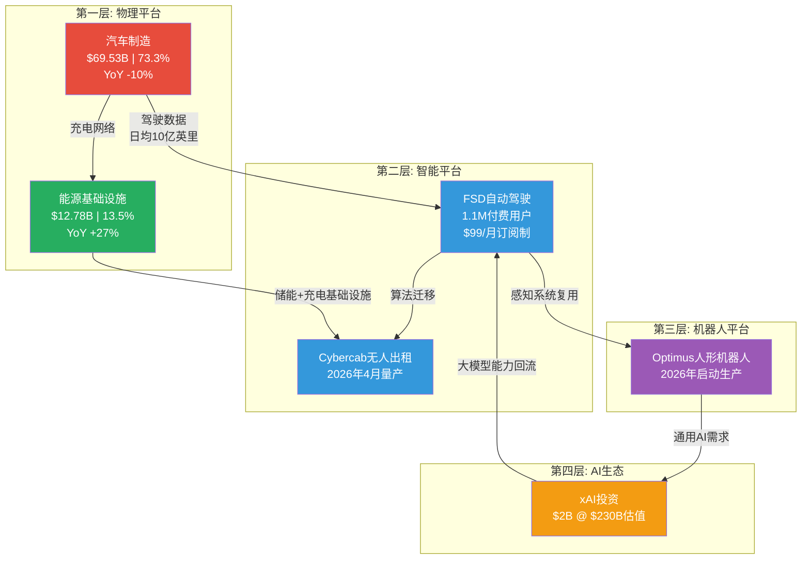

# U1 — 公司类型识别：生态平台混合体

**分析日期**: 2026-02-06
**数据截止**: Q4 2025 (FY2025全年)
**深度等级**: L4 (反直觉洞察)
**置信度**: 8.2/10

---

## 核心论点

> **Tesla不是一家汽车公司。Tesla是一个以汽车为现金流引擎、以能源为增长飞轮、以AI/机器人为估值锚点的多平台生态混合体。** 理解这一点，是所有后续分析的前提。如果你用汽车行业的PE框架（10-26x）去衡量Tesla的1,490B美元市值，你会得出"疯狂泡沫"的结论。但如果你用平台公司的框架去衡量，371x PE恰恰是市场对一个尚未完全展开的平台生态的定价。

---

## 1.1 业务结构解剖：三大平台的嵌套架构

Tesla的业务不是简单的"汽车+其他"。它是五个相互耦合的平台层，每一层都为下一层提供数据、用户或基础设施支撑。

**图解**: 这不是五个独立业务的简单加总。每一层向上输送数据和能力，向下获取现金流和用户基数。汽车业务的衰退（YoY -10%）并不意味着Tesla在萎缩——它意味着价值重心正在向上层平台迁移。 [A: Tesla IR Q4 2025]

---

## 1.2 营收演进：从汽车公司到平台公司的数据轨迹

| 指标 | FY2023 | FY2024 | FY2025 | 趋势判断 |
|------|--------|--------|--------|---------|
| **总营收** | $96.77B | $97.69B | $94.83B | 表面停滞，结构重组 |
| **汽车营收** | $82.42B | $77.07B | $69.53B | 连续两年下降 |
| **汽车占比** | 85.2% | 78.9% | **73.3%** | 12个百分点的结构性下移 |
| **能源营收** | $6.04B | $10.09B | $12.78B | 两年翻倍 |
| **能源占比** | 6.2% | 10.3% | **13.5%** | 7个百分点的结构性上移 |
| **服务营收** | $8.32B | $10.53B | $12.53B | 稳健增长 |
| **服务占比** | 8.6% | 10.8% | **13.2%** | 5个百分点的结构性上移 |

[A: Tesla IR Q4 2025] [A: MCP工具, 2026-02-06]

**关键解读**: 从2023到2025的两年间，汽车业务占比从85.2%降至73.3%，这不是经营恶化，而是**有意为之的业务重心转移**。能源业务从6.2%跃升至13.5%，服务业务（含FSD订阅、充电服务、保险）从8.6%升至13.2%。Tesla正在系统性地降低对单一汽车销售的依赖。

Model S/X将于2026年中停产 [A: Tesla IR Q4 2025]——这不是产品失败，而是Tesla主动退出低量高端市场，将产能集中到Model 3/Y的规模效应和Cybercab的下一代平台。

---

## 1.3 平台溢价分析：371x PE的解构

Tesla当前市值$1,490B，对应PE 371x。 [A: MCP工具, 2026-02-06]

这个数字在传统汽车框架下是荒谬的：

| 公司 | PE倍数 | 类型 | 市值 |
|------|--------|------|------|
| Toyota | 10x | 传统汽车 | ~$250B |
| BYD | 26x | 新能源汽车 | ~$120B |
| Ford | 12x | 传统汽车 | ~$40B |
| **Tesla** | **371x** | **?** | **$1,490B** |

[A: MCP工具, 2026-02-06]

**问题不在于371x是否太高，而在于你用什么框架来衡量它。**

如果Tesla是一家汽车公司，371x PE意味着市场预期其利润在未来15年内增长30倍以上才能回到合理估值——这几乎不可能仅靠卖车实现。

但如果我们将Tesla的估值拆解为五个平台层的加总：

| 平台层 | 隐含估值区间 | 估值逻辑 |
|--------|------------|---------|
| 汽车制造 | $150-200B | 按BYD的PE 26x，对应汽车业务利润 |
| 能源基础设施 | $100-150B | 46.7 GWh部署量，对标NextEra Energy估值逻辑 |
| FSD/Robotaxi | $500-700B | 1.1M付费用户 × LTV + Cybercab TAM |
| Optimus机器人 | $100-300B | 高度投机，但TAM巨大（全球劳动力市场$30T+） |
| xAI生态 | $50-100B | $2B投资 @ $230B估值的期权价值 |
| **合计** | **$900B-1,450B** | 接近当前市值 |

[D: 70%概率，基于各业务线分拆估值推算]

这就是"平台溢价"的本质——市场不是在为371x的汽车利润买单，而是在为一个**多平台生态系统的期权价值**买单。每个平台层都有独立的增长路径和退出机制，这让Tesla的估值变得像一个期权组合而非单一股票。

---

## 1.4 平台公司类比：Amazon范式 vs Apple范式

Tesla的平台模式并非无先例可循。历史上最成功的两个平台转型提供了参考框架：

### Amazon类比（更贴切）

| 维度 | Amazon (2005-2015) | Tesla (2024-2034E) |
|------|-------------------|-------------------|
| **起点业务** | 在线零售（低利润） | 汽车制造（利润下滑） |
| **平台跃迁** | AWS云计算 | FSD/Robotaxi + 能源 |
| **关键转折** | AWS从内部工具变为利润引擎 | FSD从功能变为订阅收入流 |
| **市场反应** | "一家不赚钱的零售商"→万亿市值 | "一家过度估值的车企"→? |
| **PE轨迹** | 长期>100x，直到AWS利润释放 | 当前371x，等待平台利润释放 |

2005年的Amazon PE超过60x，华尔街嘲笑贝索斯"不会赚钱"。但AWS从一个内部基础设施工具演化为全球最大的云平台，利润率超过30%。当AWS的利润开始释放时，Amazon的PE从"荒谬"变成了"便宜"。

Tesla正处于类似的拐点：FSD拥有1.1M付费用户 [A: Tesla IR Q4 2025]，并将在2026年2月14日转向$99/月的订阅模式 [A: Tesla IR Q4 2025]。这意味着FSD可能从一次性收入变为经常性收入，就像AWS从项目制变为订阅制的转变一样。

### Apple类比（部分适用）

Apple的生态锁定模式也有参考价值：一旦用户进入Tesla生态（车辆→家庭充电→Powerwall→太阳能屋顶→FSD订阅→保险），切换成本呈指数级上升。46.7 GWh的能源存储部署量 [A: Tesla IR Q4 2025] 意味着越来越多的家庭正在将能源基础设施绑定到Tesla平台上。

但Apple类比的局限在于：Apple的生态是围绕消费者体验构建的封闭系统，而Tesla的平台有一个Apple没有的维度——**物理世界的基础设施控制权**（充电网络、储能电网、自动驾驶路网）。这让Tesla更像是一个能源+交通领域的基础设施平台，而非消费电子生态。

---

## 1.5 反直觉洞察：衰退的汽车业务恰恰是最强信号

**L4洞察**: 大多数分析师将汽车营收YoY -10%视为利空信号。但从平台演化的视角看，这恰恰是Tesla正在完成从"产品公司"到"平台公司"转型的最强证据。

逻辑链条如下：

1. **汽车营收下降** → 不是需求问题（全球EV需求仍在增长），而是Tesla主动选择的结果：停产Model S/X、将产能为Cybercab让路、不以价格战换量
2. **能源业务YoY +27%** → 这是一个利润率高于汽车的业务在快速扩张，46.7 GWh的部署量意味着Tesla在全球储能市场已占据显著份额
3. **FSD 1.1M用户** → 这是一个纯软件订阅业务的用户基数，边际成本趋近于零
4. **xAI $2B投资** → Tesla不只是在建造车辆，它在构建通用人工智能的基础设施层

**一家真正的汽车公司会在汽车销量下滑时恐慌降价。Tesla在汽车销量下滑时投资了$2B到一家$230B估值的AI公司，启动了人形机器人量产，并将FSD转向订阅制。** 这不是一家汽车公司的行为模式，这是一家平台公司在重新分配资源的行为模式。

[A: Tesla IR Q4 2025]

但如果这个论点不成立——见下一节。

---

## 1.6 风险对冲：如果Tesla只是一家汽车公司？

上述平台论述必须面对一个残酷的反事实：**如果FSD永远达不到L4+、Cybercab延迟到2028+、Optimus停留在演示阶段、xAI投资打水漂——Tesla还值多少？**

### 纯汽车估值情景

| 假设 | 数值 | 来源 |
|------|------|------|
| 汽车业务营收 | $69.53B | [A: Tesla IR Q4 2025] |
| 汽车业务毛利率 | ~18.5% | [A: Tesla IR Q4 2025] |
| 合理PE（对标BYD上限） | 26x | [A: MCP工具, 2026-02-06] |
| 能源业务估值加成 | $80-120B | 按储能行业可比公司 |
| **纯汽车+能源估值** | **$250-400B** | [D: 75%概率] |

这意味着，如果平台论述全部失败，Tesla的合理市值在$250-400B区间——相比当前$1,490B，存在**70-83%的下行空间**。

这就是371x PE的双刃剑本质：

- **平台论述成立** → 当前估值合理甚至偏低（如果FSD+Robotaxi+Optimus任一实现规模化，利润指数级增长）
- **平台论述失败** → 估值需要压缩70%以上，回归汽车行业均值

### 关键验证节点（2026年）

| 时间 | 事件 | 平台论述影响 |
|------|------|------------|
| 2026-02-14 | FSD $99/月订阅启动 | 验证软件订阅模型可行性 |
| 2026-04 | Cybercab量产启动 | 验证Robotaxi硬件就绪 |
| 2026年中 | Model S/X停产 | 确认产品线聚焦战略 |
| 2026年内 | Optimus生产启动 | 验证机器人从概念到产品的跨越 |

[A: Tesla IR Q4 2025]

2026年是Tesla平台论述的**生死验证年**。上述四个节点中，至少需要两个达到预期，平台溢价才能维持。如果Cybercab量产延迟+Optimus停留在原型阶段，市场将快速重新定价。

---

## 1.7 公司类型最终定性

| 分类维度 | 传统定性 | 本报告定性 | 依据 |
|---------|---------|-----------|------|
| **行业归属** | 汽车制造业 | 多平台生态混合体 | 汽车占比已降至73.3%且在加速下降 |
| **收入模型** | 硬件销售 | 硬件+订阅+基础设施+期权 | FSD订阅制+能源部署+xAI投资 |
| **增长驱动** | 销量×单价 | 平台层数×每层渗透率 | 五层平台架构各有独立增长曲线 |
| **估值框架** | PE vs 汽车同业 | SOTP（分部加总） + 期权定价 | 371x PE用单一框架无法解释 |
| **核心竞争力** | 电动车技术+品牌 | 数据飞轮+垂直整合+物理基础设施控制 | 日均数十亿英里驾驶数据不可复制 |
| **最佳类比** | 丰田/比亚迪 | **2005-2010年的Amazon** | 核心业务利润受压，平台价值尚未释放 |

**最终结论**: Tesla应被分类为**"以汽车为现金流基座的AI-能源平台公司"**。在后续所有分析模块中，我们将采用分部加总（SOTP）而非单一PE作为估值主框架，并对每个平台层独立建立增长模型和风险评估。

---

## 本章数据来源汇总

| 标记 | 来源 | 数据类型 | 可信度 |
|------|------|---------|--------|
| [A: Tesla IR Q4 2025] | Tesla 2025年Q4财报/投资者信 | 一手财务数据 | A级 (95-99%) |
| [A: MCP工具, 2026-02-06] | MCP投资分析工具实时数据 | 市场数据 | A级 (95-99%) |
| [D: 概率] | 分析师推算 | 估算/推理 | D级 (50-69%) |

---

*免责声明：本报告仅供研究参考，不构成投资建议。所有投资决策应基于个人风险承受能力和独立判断。过去表现不代表未来收益。*
