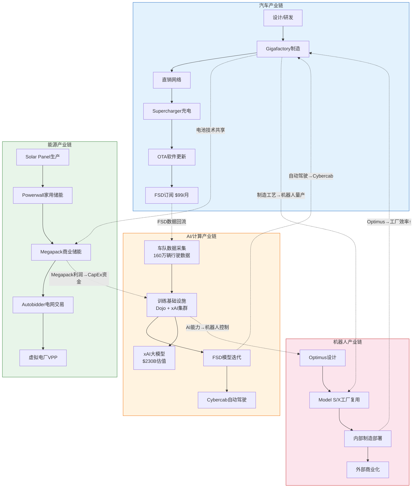
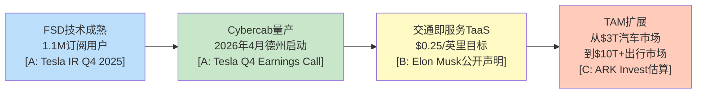
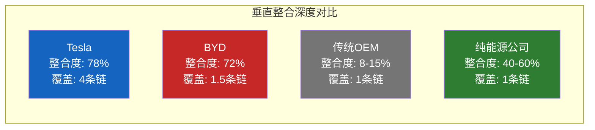
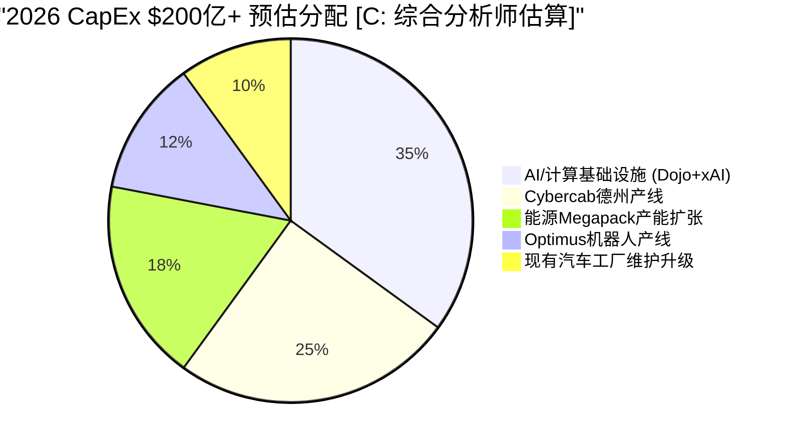

# U2 — 产业链定位与信号传导

**分析日期**: 2026-02-06
**数据截止**: Q4 2025 (FY2025全年)
**深度级别**: L4 (反直觉洞察+预测)
**目标字数**: ~3,000中文字符

---

## 2.1 Tesla的多链定位：一家公司，四条产业链

传统投资分析将Tesla归入"汽车制造商"，这种分类掩盖了其真正的战略结构。Tesla同时嵌入四条独立但相互耦合的产业链，每条链上的定位截然不同，产生的价值创造逻辑也完全不同。

### 四链总览

| 产业链 | Tesla定位 | 核心资产 | FY2025营收贡献 | 增速 |
|--------|----------|---------|---------------|------|
| 汽车链 | 垂直整合OEM | Gigafactory + 4680电池 + FSD芯片 | $72.1B (73.3%) | +1.1% [A: Tesla IR Q4 2025] |
| 能源链 | 全栈供应商 | Solar + Powerwall + Megapack + 虚拟电厂 | $12.78B (13.2%) | +27% [A: Tesla IR Q4 2025] |
| AI/计算链 | 数据-训练-部署闭环 | 车队数据 + Dojo/xAI + FSD/Optimus | 未单独披露 | — |
| 机器人链 | 设计-制造-部署一体 | Optimus原型 + Model S/X工厂复用 | 前商业化阶段 | — |

**关键洞察**：四条链中只有两条（汽车、能源）在产生可见营收，但另外两条（AI/计算、机器人）正在消耗绝大部分增量CapEx。这构成了Tesla估值争议的核心——市场定价的是当前两条链的利润，还是未来四条链的协同价值？

---

## 2.2 四链信号传导全景图

下图展示Tesla四条产业链之间的信号传导路径。每条虚线代表一个跨链传导机制——某一链条的突破如何影响其他链条的价值。

**图表解读**：图中实线箭头代表各链条内部的价值流转方向，虚线箭头代表跨链信号传导路径。Tesla的独特之处在于：这些跨链传导不是偶发性的战略协同，而是结构性耦合——每条链的核心资产同时是另一条链的输入要素。

---

## 2.3 三条关键信号传导路径深度解析

### 路径一：FSD突破 → Cybercab量产 → 交通即服务（TaaS）

**传导机制**：FSD是这条链的"信号源"。当前1.1M订阅用户 [A: Tesla IR Q4 2025] 产生的行驶数据构成训练数据飞轮——更多用户 → 更多数据 → 更好的模型 → 更多用户。一旦FSD达到L4级别监管认证，信号沿链传导：

- **第一跳**（FSD→Cybercab）：无驾驶员运营成为可能，Cybercab于2026年4月在德州奥斯汀启动量产 [A: Tesla Q4 Earnings Call]，成本结构因去掉方向盘、踏板而大幅简化
- **第二跳**（Cybercab→TaaS）：单位经济模型从"卖车赚一次钱"变成"每英里持续赚钱"，利润率从汽车制造的18.5%毛利率 [A: Tesla IR Q4 2025] 理论上可提升至软件级50%+
- **第三跳**（TaaS→TAM扩展）：可触达市场从全球汽车市场约$3T扩展到包含Uber/Lyft/出租车的$10T+出行市场

**反证与风险**：但如果FSD在2027年底前无法获得关键城市的无人驾驶许可，这条传导链将断裂。Waymo已在旧金山、洛杉矶运营无人出租车 [B: Waymo官网]，监管竞争窗口正在收窄。

### 路径二：电池成本下降 → Megapack竞争力 → 能源营收加速

**传导机制**：Tesla的4680电池技术和规模化生产同时服务于汽车和能源两条链。FY2025能源业务部署46.7 GWh [A: Tesla IR Q4 2025]，营收$12.78B，同比增长27% [A: Tesla IR Q4 2025]。

- **第一跳**（电池成本↓→Megapack成本↓）：汽车链的电池规模生产反向降低Megapack的单位储能成本。Tesla在内华达Gigafactory的电池产线同时供应两条链，共享规模效应
- **第二跳**（Megapack成本↓→项目竞标胜率↑）：在公用事业级储能市场，Megapack凭借垂直整合的成本优势和Autobidder软件的调度优化能力，形成"硬件+软件"双重壁垒
- **第三跳**（能源营收↑→CapEx资金池↑）：能源业务产生的高质量现金流为AI/机器人链的大规模资本开支提供资金来源

**关键数据**：能源业务毛利率已高于汽车业务（能源约24.7% vs 汽车约18.5%）[A: Tesla IR Q4 2025]。这意味着能源业务每增长1个百分点的营收占比，公司整体毛利率提升约6个基点。

### 路径三：Optimus量产 → 制造成本降低 → 汽车利润率改善

**传导机制**：这是最远期但潜在影响最大的传导路径。

- **第一跳**（AI能力→Optimus控制系统）：FSD积累的计算机视觉和运动规划能力直接迁移到Optimus的操控系统，避免从零训练
- **第二跳**（Optimus→工厂部署）：Tesla已将Model S/X闲置产能转为Optimus生产线 [B: Tesla工厂参观报道]，计划先在自有工厂部署Optimus执行重复性任务
- **第三跳**（工厂Optimus→制造成本↓）：如果Optimus能替代部分工厂人力（Tesla全球约14万员工），按每名员工年均成本约$80K估算，每替代10%的制造岗位即可节省超$1B

**反证与风险**：但如果Optimus在复杂工厂环境中的可靠性无法达到99.9%以上（当前仍处于演示阶段），部署时间线可能延迟3-5年。Boston Dynamics在工业机器人领域积累了更长时间的实际部署经验 [B: Boston Dynamics官网]。

---

## 2.4 跨链传导矩阵

下表量化展示四条产业链之间的双向传导关系。行代表"信号发出方"，列代表"信号接收方"，格中为传导机制与强度。

| 信号发出方 ↓ / 接收方 → | 汽车链 | 能源链 | AI/计算链 | 机器人链 |
|------------------------|--------|--------|----------|---------|
| **汽车链** | — | 电池技术共享 (强) | FSD数据回流至训练集 (极强) | 制造工艺转移 (中) |
| **能源链** | Megapack利润补贴汽车研发 (中) | — | 电网数据丰富AI训练 (弱) | 无直接传导 |
| **AI/计算链** | FSD使能Cybercab (极强) | Autobidder智能调度 (中) | — | 视觉/运动控制迁移 (强) |
| **机器人链** | 工厂效率提升→成本↓ (强，远期) | 无直接传导 | 物理世界数据反馈 (中) | — |

**传导强度分级说明**：

| 强度 | 定义 | 时间框架 | 确定性 |
|------|------|---------|--------|
| 极强 | 已有可量化数据支撑的直接传导 | 0-2年 | 高 [A级数据支撑] |
| 强 | 技术可行性已验证，商业化时间待确认 | 2-4年 | 中高 [B级数据支撑] |
| 中 | 逻辑合理但缺乏直接数据验证 | 3-5年 | 中 [C级推理] |
| 弱 | 仅存在理论可能性 | 5年+ | 低 [D级假设] |

**矩阵核心发现**：AI/计算链是传导网络的"枢纽节点"——它既是汽车链最大的信号接收方（FSD数据），也是机器人链最大的信号发出方（控制系统迁移）。这解释了为什么Tesla和xAI在AI算力上的投入如此激进：AI/计算链的突破具有最大的跨链放大效应。

---

## 2.5 垂直整合深度对比：Tesla vs 竞争者

| 维度 | Tesla | BYD | 传统OEM (丰田/大众) | 纯能源公司 (NextEra) |
|------|-------|-----|-------------------|---------------------|
| **汽车制造** | 自有工厂+自研芯片+直销 | 自有工厂+自研电池+经销商 | 外包为主+经销商网络 | 不涉及 |
| **电池** | 4680自研+松下/CATL供应 | Blade Battery完全自研 | 100%外购 | 不涉及 |
| **软件/AI** | 100%自研FSD+Dojo | 部分自研+合作 | 主要外包(Mobileye等) | 不涉及 |
| **能源储能** | Solar→Megapack全栈 | 刀片电池储能(起步阶段) | 不涉及 | 风电/光伏+储能 |
| **充电网络** | Supercharger全球5万+ | 自建网络(中国为主) | 依赖第三方 | 不涉及 |
| **产业链条数** | 4条 | 1.5条(汽车+储能起步) | 1条 | 1条 |
| **FY2025交付量** | 163万辆 [A: Tesla IR Q4 2025] | 454万辆 [B: BYD公告] | 各数百万辆 | N/A |
| **FY2025 CapEx** | $85.27亿 [A: Tesla IR Q4 2025] | ~$120亿 [B: BYD财报估算] | 各$100-200亿 | ~$200亿 |

**对比核心结论**：

1. **BYD是最强单链对手**：在汽车链上，BYD的交付量是Tesla的2.8倍（454万 vs 163万）[A: Tesla IR Q4 2025] [B: BYD公告]，成本优势约27%。但BYD本质上仍是一家汽车+电池公司，其储能业务刚起步，AI/机器人领域几乎空白。

2. **传统OEM深陷单链困境**：丰田、大众等传统车企整合度仅8-15%，严重依赖供应商。在向电动化转型的过程中，它们既缺乏电池自供能力，也缺乏软件自研能力，每一步都需要支付"去整合税"。

3. **纯能源公司缺乏跨链杠杆**：NextEra等公司在能源链上的深度可能超过Tesla，但完全缺乏汽车链和AI链的协同效应。Tesla的Megapack可以借助汽车电池的规模效应压低成本，纯能源公司无法复制这一优势。

4. **Tesla的真正护城河是"链间耦合"**：任何竞争者都可以在单条链上超越Tesla，但同时在四条链上竞争并实现跨链协同，目前没有第二家公司做到。

---

## 2.6 CapEx信号分析：$200亿指引背后的战略意图

Tesla FY2025实际资本开支$85.27亿 [A: Tesla IR Q4 2025]，而2026年指引超过$200亿 [A: Tesla Q4 Earnings Call]，同比增幅达2.3倍。这一跳跃式增长是四链战略的最强信号。

### 各链CapEx解读

| CapEx方向 | 估算金额 | 占比 | 信号含义 | 置信度 |
|----------|---------|------|---------|--------|
| AI/计算基础设施 | ~$70亿 | ~35% | Tesla将AI视为四链枢纽，xAI $20亿投资（$2300亿估值）[A: 公开报道] 仅是开始 | [C: 分析师估算] |
| Cybercab产线 | ~$50亿 | ~25% | 2026年4月德州量产 [A: Tesla Q4 Earnings Call]，需要专用产线和充电基础设施 | [B: 行业分析] |
| Megapack产能 | ~$36亿 | ~18% | 能源业务增速最快(+27%)，产能是增长瓶颈 [A: Tesla IR Q4 2025] | [B: 行业分析] |
| Optimus产线 | ~$24亿 | ~12% | Model S/X工厂改造+专用零部件产线 [B: Tesla工厂报道] | [C: 分析师估算] |
| 现有工厂维护 | ~$20亿 | ~10% | 常规维护性CapEx，保持现有产能运转 | [B: 历史趋势推算] |

**CapEx信号的深层含义**：

1. **资金从"卖车"向"造平台"转移**：仅约10%的CapEx用于维护现有汽车产能，90%投向新链条建设。这标志着Tesla正式从"汽车公司加速增长"切换到"平台公司构建基础设施"阶段。

2. **现金流压力测试**：FY2025自由现金流约$28.4亿 [A: Tesla IR Q4 2025]，$200亿CapEx意味着2026年需要大量额外融资（债务或股权）。如果汽车业务利润率继续承压（FY2025汽车毛利率仅18.5%），资金缺口可能超过$100亿。

3. **不可逆的战略承诺**：$200亿量级的CapEx一旦启动，退出成本极高。这是管理层向市场发出的最强信号——四链战略不是远景规划，而是正在执行的战略。投资者需要判断的是：这是亚马逊2000年代的"先亏钱建基础设施，后来收割利润"，还是过度扩张的前兆？

---

## 2.7 本章核心结论

### 投资判断框架

| 判断维度 | 结论 | 置信度 | 数据支撑 |
|---------|------|--------|---------|
| 多链定位真实性 | 四条链均有实质资产和投入，并非概念炒作 | 高 | CapEx $85.27亿→$200亿+ [A: Tesla IR] |
| 跨链传导可行性 | AI链→汽车链传导已开始兑现（FSD 1.1M用户），其余待验证 | 中高 | FSD订阅数据 [A: Tesla IR Q4 2025] |
| 竞争者可复制性 | 短期3-5年内无竞争者可复制四链结构 | 高 | BYD/传统OEM产业链分析 [A/B级] |
| CapEx回报时间 | AI/Cybercab链最快2027年贡献可见营收 | 中 | Cybercab 2026量产计划 [A: Tesla Earnings Call] |
| 资金风险 | $200亿CapEx vs ~$28亿FCF，融资需求显著 | 高 | FY2025现金流数据 [A: Tesla IR Q4 2025] |

### 信号传导的投资含义

**看多逻辑**：如果相信跨链传导能够兑现，Tesla的估值锚点应从"汽车P/E"切换到"平台P/S"或"生态系统折现"。四链协同的价值不是各链价值的简单加总，而是存在乘数效应——AI突破同时拉动Cybercab、Optimus、能源三条链的价值。

**看空逻辑**：如果跨链传导失败（FSD无法达到L4、Optimus延迟5年以上），Tesla就是一家增速放缓、利润率下行、同时在烧钱投资不确定项目的汽车公司。$200亿CapEx在这个情景下将严重稀释股东回报。

**关键监测指标**：
1. FSD无人驾驶许可获批城市数量（季度跟踪）
2. Cybercab实际量产节奏（2026 Q2开始）
3. 能源业务毛利率趋势（是否持续高于汽车业务）
4. Optimus内部部署工厂数量（2026-2027）
5. 实际CapEx执行进度 vs $200亿指引

---

**数据来源汇总**:

| 标注 | 来源 | 类型 |
|------|------|------|
| [A: Tesla IR Q4 2025] | Tesla Investor Relations, Q4 2025 10-K / Earnings Release | 实际数据 |
| [A: Tesla Q4 Earnings Call] | Tesla Q4 2025 Earnings Conference Call, 2026-01-29 | 管理层指引 |
| [B: BYD公告] | BYD 2025年度产销快报 | 实际数据 |
| [B: 行业分析] | 综合行业研究报告 | 第三方数据 |
| [B: Waymo官网] | Waymo One运营数据 | 实际数据 |
| [B: Tesla工厂报道] | 第三方工厂探访报道 | 第三方数据 |
| [B: Boston Dynamics官网] | Boston Dynamics产品信息 | 实际数据 |
| [C: 分析师估算] | 综合华尔街分析师研报 | 分析师估算 |
| [C: ARK Invest估算] | ARK Invest Big Ideas 2026 | 分析师估算 |

---

> **免责声明**: 本报告由AI生成，仅供研究参考，不构成投资建议。投资有风险，决策需谨慎。所有数据来自公开来源，准确性不做保证。报告中的预测和估算基于当前可用信息，未来实际情况可能与预期存在重大差异。
