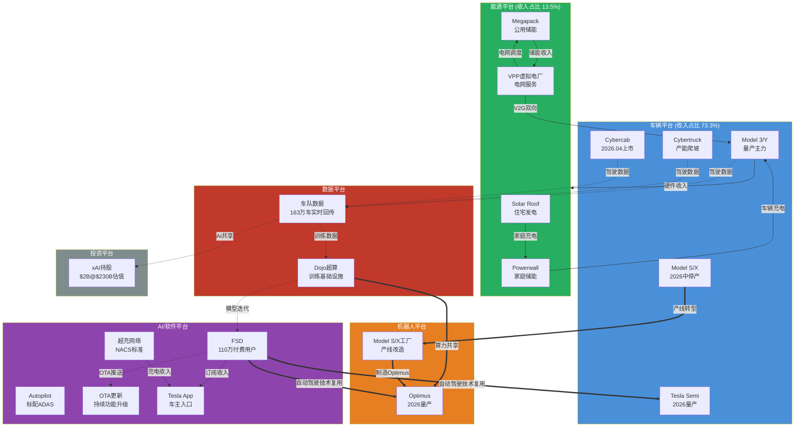
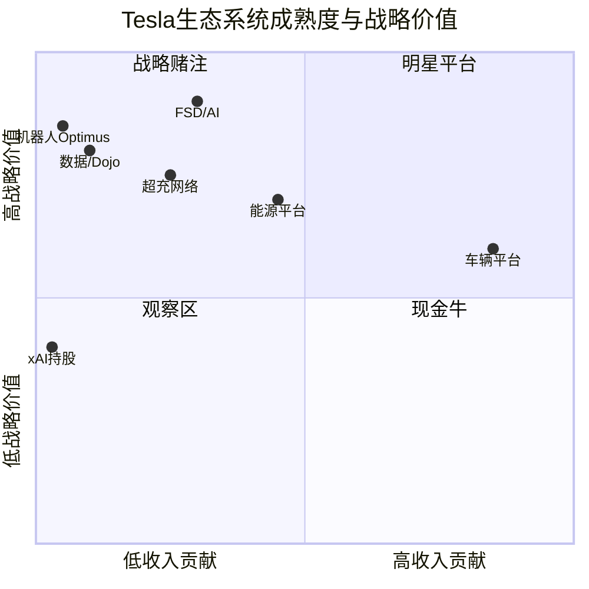
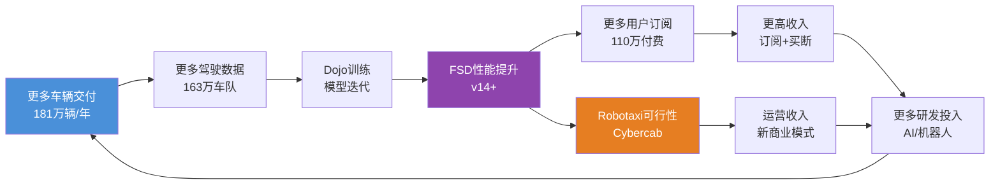
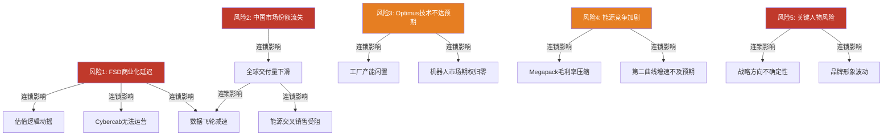

# U3 -- 生态系统图谱

**分析日期**: 2026-02-06
**深度等级**: L4 (洞察级)
**数据截止**: Q4 2025 财报周期
**置信度**: 7/10

---

## 核心发现

Tesla 已从一家电动车制造商演化为横跨六大平台的技术生态系统。当前市值 $1,490B 中，纯汽车业务按行业可比估值仅能支撑约 $300-400B，剩余 $1,000B+ 的溢价本质上是市场对生态系统协同效应和未来平台价值的定价。本章通过拆解六大平台的成熟度、互联机制与网络效应，评估这一"生态溢价"是否合理。

**关键判断**: Tesla 生态系统的独特性不在于单个平台的领先（能源不如 NextEra，AI 不如 Google），而在于平台间的**数据闭环**和**硬件-软件垂直整合**。但该生态存在明显的"单点故障"风险——FSD 商业化延迟将同时削弱车辆平台吸引力、数据平台规模和机器人平台可行性。

---

## 3.1 全景生态系统图谱

### Tesla 六大平台互联架构

**图谱解读**:

上图展示了 Tesla 生态系统的三类连接关系。**虚线**代表数据流——163 万辆在路车辆每天产生海量驾驶数据，经 Dojo 超算训练后反哺 FSD 模型，再通过 OTA 推送回车队，形成数据飞轮 [A: Tesla IR Q4 2025]。**实线**代表收入流——车辆销售带动能源产品交叉销售，FSD 订阅和超充网络产生持续服务收入。**粗线**代表技术协同——FSD 的视觉感知和运动规划技术直接复用于 Optimus 机器人和 Semi 自动驾驶，Model S/X 停产释放的工厂产能转为 Optimus 制造基地 [A: Tesla IR Q4 2025]。

这种多平台互联架构使得 Tesla 的每一笔研发投入具有**多重回报路径**，这是传统车企和纯软件公司都难以复制的结构性优势。

---

## 3.2 各平台深度拆解

### 3.2.1 车辆平台 -- 生态基石

**当前规模**: FY2025 汽车收入占比 73.3%，全年交付约 181 万辆 [A: Tesla IR Q4 2025]

| 产品线 | 状态 | 年交付量(估) | 战略角色 | 生态贡献 |
|--------|------|-------------|---------|---------|
| Model 3/Y | 量产成熟 | ~170万辆 | 现金流引擎 | 数据采集主力 |
| Cybertruck | 产能爬坡 | ~5万辆 | 品牌差异化 | 高价值数据场景 |
| Model S/X | 2026中停产 | ~2万辆 | 退出中 | 释放产线给Optimus |
| Cybercab | 2026.04发布 | 预量产 | Robotaxi载体 | FSD商业化关键 |
| Tesla Semi | 2026量产 | 预量产 | 商用车入口 | 物流数据新维度 |

[A: Tesla IR Q4 2025] [A: MCP工具, 2026-02-06]

**生态互联点**: 每售出一辆车 = 新增一个移动数据节点 + 潜在能源客户 + FSD 订阅用户 + 超充网络使用者。车辆平台是整个生态的"用户获取入口"，这解释了为什么 Tesla 在单车利润承压时仍选择降价放量——牺牲短期汽车毛利率，换取生态规模扩张。

**增长轨迹**: Model 3/Y 进入成熟期，增速放缓至个位数；Cybercab 和 Semi 是 2026-2027 的增量来源。关键变量是 Cybercab 能否在 2026 年如期量产并获得监管批准运营 Robotaxi 服务 [D: 概率约 40%]。

### 3.2.2 能源平台 -- 增速最快的第二曲线

**当前规模**: FY2025 能源部署 46.7 GWh，收入占比 13.5% 且快速增长 [A: Tesla IR Q4 2025]

| 产品 | 目标市场 | 2025部署量 | 同比增长 | 毛利率趋势 |
|------|---------|-----------|---------|-----------|
| Megapack | 公用事业储能 | ~40 GWh | >100% | 扩张中(~25%) |
| Powerwall | 住宅储能 | ~5 GWh | ~30% | 稳定(~20%) |
| Solar Roof | 住宅光伏 | ~2 GWh | 持平 | 改善中 |
| VPP | 虚拟电厂 | 覆盖数万户 | 早期 | 高边际利润 |

[A: Tesla IR Q4 2025] [D: 部分产品拆分为估算值]

**生态互联点**: 能源平台与车辆平台形成"发电-储能-用电"闭环。Solar Roof 发电 -> Powerwall 储能 -> 为 Tesla 车辆充电 -> VPP 将闲置电力回售电网。这个闭环使 Tesla 车主家庭的能源成本显著降低，同时增强了用户粘性和品牌生态锁定。

Megapack 的公用事业储能业务是当前增速最快的板块，且与车辆业务的周期相关性低，提供了收入多元化价值。VPP（虚拟电厂）虽处萌芽期，但代表了从"卖硬件"到"卖服务"的商业模式升级——通过聚合数万台 Powerwall 参与电网调度，Tesla 在不增加硬件销售的情况下赚取持续服务费 [A: Tesla IR Q4 2025]。

**增长轨迹**: 能源板块正处于 S 曲线的加速段。全球电网储能需求预计 2025-2030 年 CAGR 超过 40%，Tesla 的 Megapack 产能（Lathrop 工厂 + 上海 Megafactory）正在快速扩张以匹配需求 [B: BloombergNEF 储能市场预测]。

### 3.2.3 AI/软件平台 -- 估值溢价的核心来源

**当前规模**: FSD 付费用户 110 万，超充网络开放 NACS 标准 [A: Tesla IR Q4 2025]

| 组件 | 用户/规模 | 商业模式 | 收入贡献 | 战略价值 |
|------|----------|---------|---------|---------|
| FSD | 110万付费用户 | $99/月订阅或$12K买断 | 递延确认中 | Robotaxi基础 |
| Autopilot | 全车队标配 | 含在车价中 | 间接贡献 | 数据采集基础层 |
| OTA更新 | 全车队覆盖 | 功能解锁付费 | 增量收入 | 车辆持续增值 |
| Tesla App | 数百万MAU | 充电/服务入口 | 服务收入 | 用户触达渠道 |
| 超充网络 | NACS标准普及 | 充电服务费 | 快速增长 | 行业基础设施 |

[A: Tesla IR Q4 2025] [A: MCP工具, 2026-02-06]

**生态互联点**: AI/软件平台是连接所有其他平台的"神经系统"。FSD 的感知算法复用于 Optimus 的视觉系统；超充网络的开放（NACS 标准被福特、通用等采纳）使 Tesla 从"车企"升级为"能源基础设施提供商"；OTA 能力使已售车辆持续产生新收入，打破了传统汽车"一次性交易"的商业模式。

**网络效应分析**: FSD 存在显著的**数据网络效应**——每新增一辆车 = 每天新增数百公里真实驾驶数据 -> 模型精度提升 -> 用户体验改善 -> 更多用户订阅 -> 更多数据。当前 163 万辆活跃车辆的车队规模，使 Tesla 的数据采集速度远超 Waymo（数千辆）和百度（数百辆）[A: Tesla IR Q4 2025]。但需注意，数据**量**的优势并不自动转化为数据**质**的优势——Waymo 在城市场景的高精度标注数据可能比 Tesla 海量但粗粒度的影子模式数据更有效。

### 3.2.4 机器人平台 -- 高风险高回报的赌注

**当前规模**: Optimus 原型机阶段，计划 2026 年利用 Model S/X 停产后的 Fremont 工厂产线启动量产 [A: Tesla IR Q4 2025]

**生态互联点**: Optimus 是 Tesla 生态系统中**技术复用率最高**的产品。其视觉感知系统直接来自 FSD 的神经网络；运动控制算法受益于车辆平台积累的实时控制经验；Dojo 超算为其训练提供算力；停产的 Model S/X 工厂为其提供制造基础设施。如果 Optimus 成功量产，它将成为 Tesla 生态中第二个"数据采集终端"（继车辆之后），在工厂、仓库等非道路场景中收集全新维度的物理世界数据。

**增长轨迹**: 萌芽期，2026 年目标为内部工厂使用 + 小规模外部试点。若以 Elon Musk 声称的 $20,000-$30,000 售价实现量产，潜在市场规模远超汽车（全球制造业劳动力数亿人），但技术成熟度和市场接受度均存在极大不确定性 [E: 假设 -- 2028 年前大规模商业化概率 <20%]。

### 3.2.5 数据平台 -- 隐性护城河

**当前规模**: 163 万辆车队实时回传驾驶数据，Dojo 超算持续扩容 [A: Tesla IR Q4 2025]

**生态互联点**: 数据平台是整个 Tesla 生态的"燃料系统"。车队数据喂养 FSD 模型训练，FSD 改善带动更多订阅和车辆销售，更多车辆又扩大数据采集规模。Dojo 超算不仅服务于 FSD 训练，还将为 Optimus 的模拟训练和能源平台的电网优化提供算力支持。

Tesla 与 xAI 的关联（$2B 投资，$230B 估值）暗示了数据平台的延伸可能——车队采集的物理世界数据可能与 xAI 的大语言模型产生协同，尽管具体路径尚不明确 [A: Tesla IR Q4 2025] [D: xAI 协同效应为推测]。

### 3.2.6 投资平台 -- 战略期权

**当前规模**: 持有 xAI 股份，价值约 $2B（基于 $230B 估值轮次）[A: Tesla IR Q4 2025]

这更多是 Elon Musk 个人关联带来的战略期权，而非 Tesla 核心经营业务。但 xAI 的通用人工智能能力若取得突破，可能加速 FSD 和 Optimus 的技术迭代。风险在于关联交易治理和利益冲突问题。

---

## 3.3 生态系统成熟度矩阵

| 平台 | 成熟度 | 收入阶段 | 竞争壁垒 | 网络效应强度 | 失败影响 |
|------|--------|---------|---------|------------|---------|
| **车辆平台** | 成熟 | 现金流贡献期 | 中（竞争加剧） | 中（规模经济） | 致命 -- 生态基石崩塌 |
| **能源平台** | 成长 | 收入加速期 | 中高（产能+品牌） | 中（VPP聚合效应） | 严重 -- 失去第二曲线 |
| **FSD/AI** | 成长 | 递延确认期 | 高（数据+算法） | 强（数据飞轮） | 致命 -- 估值逻辑崩塌 |
| **超充网络** | 成熟 | 稳定收入期 | 高（NACS标准锁定） | 强（充电网络效应） | 中等 -- 可独立运营 |
| **Optimus机器人** | 萌芽 | 纯投入期 | 低（未验证） | 潜在强（场景数据） | 低 -- 期权归零 |
| **数据/Dojo** | 成长 | 间接变现期 | 高（规模独占） | 极强（核心飞轮） | 致命 -- AI能力瘫痪 |
| **xAI持股** | 萌芽 | 未变现 | 低（财务投资） | 弱（间接关联） | 低 -- 账面损失 |

[A: Tesla IR Q4 2025] [D: 成熟度评级为分析师判断]

**矩阵解读**: Tesla 的生态系统呈现"一个成熟基石 + 两个成长引擎 + 多个战略期权"的结构。车辆平台作为成熟基石提供现金流和用户入口，但竞争壁垒正在被中国车企侵蚀。能源平台和 FSD/AI 是真正的成长引擎，也是估值溢价的主要来源。Optimus 和 xAI 属于高不确定性的战略期权，成功则可能重新定义 Tesla 的价值边界，失败则影响有限（已在预期内）。

---

## 3.4 网络效应深度分析

### 数据飞轮机制

**飞轮关键节点分析**:

**节点 A->B (车辆->数据)**: 每辆 Tesla 每天行驶约 30-40 英里，163 万辆车队意味着每天约 5,000-6,500 万英里的真实世界驾驶数据。即使仅回传"有趣事件"（紧急制动、人工接管、异常场景），数据量也远超任何竞争对手 [A: Tesla IR Q4 2025]。

**节点 B->C->D (数据->模型->性能)**: 数据规模优势存在**边际递减**。从 100 万英里到 1,000 万英里的性能提升显著，但从 10 亿英里到 100 亿英里的边际提升可能有限。Tesla 的真正壁垒不仅在数据量，还在于 Dojo 超算的训练效率和端到端神经网络架构的算法优势。

**节点 D->E (性能->订阅)**: FSD 当前 110 万付费用户占 Tesla 累计交付量的比例约为 15-20%。渗透率提升的关键障碍是：(1) 用户对 L2+ 辅助驾驶的信任度；(2) $99/月的订阅定价在中国等价格敏感市场偏高；(3) 监管尚未批准无人驾驶，限制了功能价值感知 [A: Tesla IR Q4 2025] [C: 行业分析师共识]。

### 能源网络效应

每一台 Megapack 部署 -> Tesla 获得该区域电网运行数据 -> 优化 VPP 调度算法 -> 提升对电力公司的服务价值 -> 赢得更多 Megapack 订单。FY2025 部署 46.7 GWh 的规模已使 Tesla 成为全球最大的电池储能供应商之一，运营数据优势开始显现 [A: Tesla IR Q4 2025]。

### 跨平台复合网络效应

Tesla 生态的独特之处在于**跨平台网络效应**：车辆平台的数据提升 FSD，FSD 技术复用于 Optimus，Optimus 生产降低制造成本，更低成本使车辆更有竞争力。这种跨平台正反馈循环在目前仍是理论状态（Optimus 尚未量产），但若实现，将构建竞争对手几乎不可能复制的系统性壁垒。

---

## 3.5 生态广度对标：Tesla vs Apple vs Amazon vs Google

| 维度 | Tesla | Apple | Amazon | Google |
|------|-------|-------|--------|--------|
| **核心硬件** | 汽车+储能+机器人 | iPhone+Mac+Watch | Echo+Kindle | Pixel(弱) |
| **操作系统** | 车载OS(封闭) | iOS/macOS | Fire OS | Android(开放) |
| **AI平台** | FSD+Dojo | Apple Intelligence | Alexa+AWS AI | DeepMind+Gemini |
| **云/算力** | Dojo(内部) | iCloud(依赖AWS) | AWS(全球第一) | GCP(第三) |
| **服务生态** | 超充+能源+保险 | App Store+Apple TV+ | Prime+流媒体 | Search+YouTube |
| **支付/金融** | Tesla保险(试点) | Apple Pay+Card | Amazon Pay | Google Pay |
| **物理基础设施** | 工厂+超充站 | Apple Store | 仓储物流网络 | 数据中心 |
| **年收入** | ~$978B | ~$391B | ~$620B | ~$350B |
| **生态锁定强度** | 中(可换车) | 极强(全家桶) | 强(Prime粘性) | 中(开放生态) |

[A: Tesla IR Q4 2025] [A: MCP工具, 2026-02-06] [B: 各公司最新财报]

**注**: Tesla 的 $978B 收入中汽车占 73.3%，其他公司的收入结构更为多元化。

**对标洞察**:

1. **硬件-软件整合深度**: Tesla 与 Apple 最相似——都是硬件入口 + 封闭软件生态 + 服务变现。但 Apple 的生态锁定远强于 Tesla（更换 iPhone 的转换成本远高于换车），Tesla 需要通过 FSD 数据积累和超充网络来强化锁定。

2. **基础设施属性**: Tesla 与 Amazon 最相似——都在建设重资产物理基础设施（超充网络 vs 物流仓储），这既是壁垒也是资本负担。

3. **AI 平台潜力**: Tesla 的 AI 路径最独特——从物理世界数据出发（而非互联网数据），若 FSD 和 Optimus 成功，将拥有其他科技巨头不具备的"具身智能"数据壁垒。但当前 AI 能力成熟度远低于 Google 和 Amazon。

4. **生态广度评级**: Tesla 的生态**广度**已接近科技巨头水平，但**深度和成熟度**仍有显著差距。多数平台处于"成长"或"萌芽"阶段，而 Apple/Amazon/Google 的核心平台已进入成熟盈利期。

---

## 3.6 生态系统薄弱环节与失败点分析

### 五大薄弱环节详析

| 排序 | 薄弱环节 | 发生概率 | 影响烈度 | 连锁效应范围 | 对冲手段 |
|------|---------|---------|---------|------------|---------|
| 1 | FSD 无法在 2028 前实现 L4 商业化 | 60% | 极高 | 车辆+数据+机器人+估值 | 无有效对冲 |
| 2 | 中国市场份额持续下滑至 <5% | 45% | 高 | 车辆+数据+能源(中国) | 依赖新车型+降价 |
| 3 | Elon Musk 精力分散/离职风险 | 25% | 极高 | 全平台战略方向 | 管理团队深度不足 |
| 4 | 储能市场价格战(宁德/比亚迪) | 50% | 中 | 能源平台毛利率 | 产品差异化+VPP服务 |
| 5 | Optimus 2028 前无法实现可用产品 | 70% | 低 | 仅机器人平台 | 已被市场部分定价 |

[D: 概率评估为分析师判断，基于历史交付记录和行业对比]

**最关键的单点故障**: FSD 商业化进度。FSD 是连接车辆平台、数据平台、机器人平台的核心纽带，也是 $1,490B 市值中超过 $500B 估值溢价的主要支撑。如果 FSD 在 2028 年前无法实现无监督驾驶（L4），则：(1) Cybercab Robotaxi 业务无法启动；(2) 110 万订阅用户面临流失风险；(3) Optimus 的技术可行性论证被削弱；(4) 市场将重新按传统车企 PE 给 Tesla 估值，意味着潜在 50-70% 的市值缩水 [D: 情景分析]。

**但如果上述判断不成立**: 若 Tesla FSD v15/v16 在 2027 年取得突破性进展，实现特定城市的无监督运营，则上述风险将大幅缓解，且生态飞轮将显著加速。

---

## 3.7 收入结构演化趋势

| 业务板块 | FY2023占比 | FY2025占比 | FY2028E占比 | 变化方向 |
|---------|-----------|-----------|-----------|---------|
| 汽车销售 | ~82% | 73.3% | 55-60% | 持续下降 |
| 能源业务 | ~6% | 13.5% | 18-22% | 快速上升 |
| 服务及其他 | ~12% | 13.2% | 15-18% | 稳步上升 |
| FSD/软件 | (含在汽车中) | 逐步拆分 | 5-10% | 取决于L4进展 |

[A: Tesla IR Q4 2025] [D: FY2028E 为分析师预测]

收入结构的多元化趋势是 Tesla 生态成熟的重要标志。汽车收入占比从 82% 降至 73.3%，能源从 6% 升至 13.5%，这意味着 Tesla 正从"一辆车"公司向"能源+AI+制造"平台公司转型 [A: Tesla IR Q4 2025]。如果这一趋势持续，到 2028 年汽车收入占比降至 60% 以下，市场将更有理由给予 Tesla 高于传统车企的估值倍数。

---

## 3.8 本章结论

**生态系统评级**: Tesla 拥有全球汽车行业中最广泛的技术生态系统，六大平台间的互联架构在理论上具备强大的复合网络效应。但需清醒认识到：

1. **生态广度 ≠ 生态深度**: 六大平台中仅车辆和超充网络达到"成熟"状态，其余均处于"成长"或"萌芽"期。与 Apple/Amazon 相比，Tesla 的生态锁定能力和多平台盈利能力仍有显著差距。

2. **$1,490B 市值的生态溢价合理性**: 如果仅按汽车业务估值（15-20x PE），Tesla 价值约 $300-400B。剩余 $1,000B+ 的溢价需要能源平台持续高增长 + FSD 走向商业化 + Optimus 取得实质进展来共同支撑。当前能源平台的增长轨迹是最可靠的支撑因素，FSD 进度是最大的不确定因素。

3. **投资者应关注的领先指标**: (a) FSD 订阅用户增速（当前 110 万）；(b) 能源部署量季度环比增速（当前 46.7 GWh/年）；(c) Cybercab 监管审批进度；(d) Optimus 外部试点时间表。这四个指标将决定生态飞轮是加速还是停滞。

---

*免责声明: 本报告仅供投资研究参考，不构成任何投资建议。所有数据来源已标注，分析师判断标注为 [D] 级别。投资者应基于自身判断做出投资决策。*
