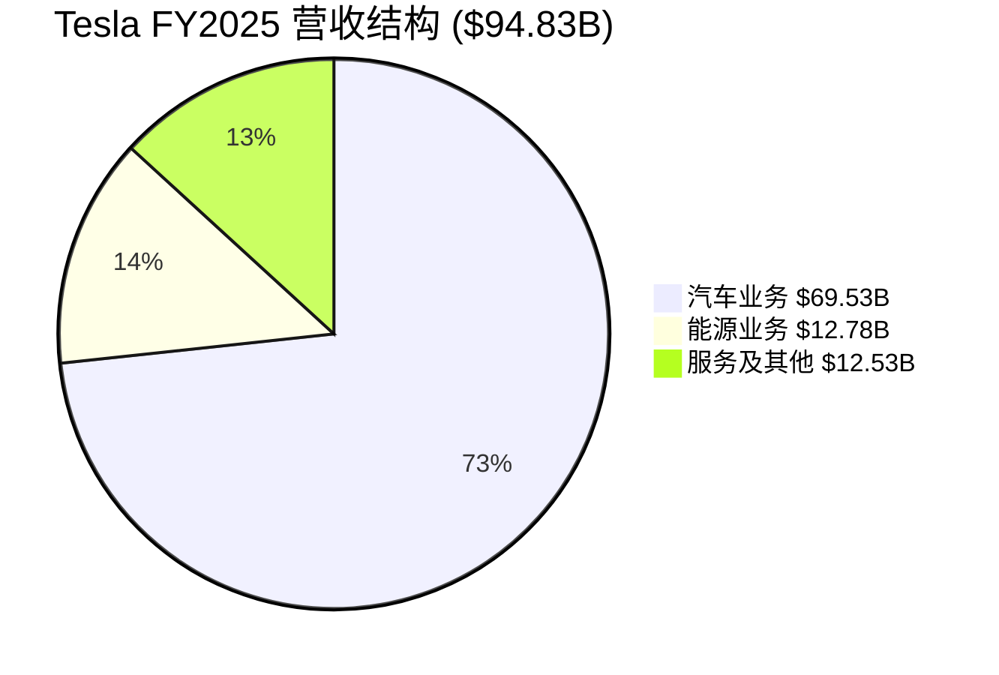
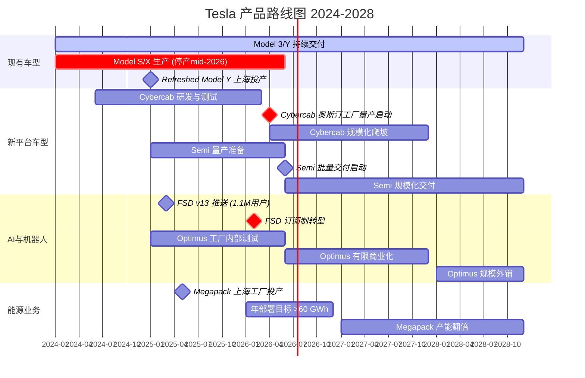
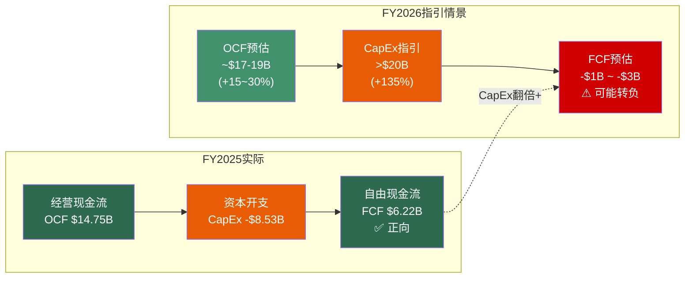
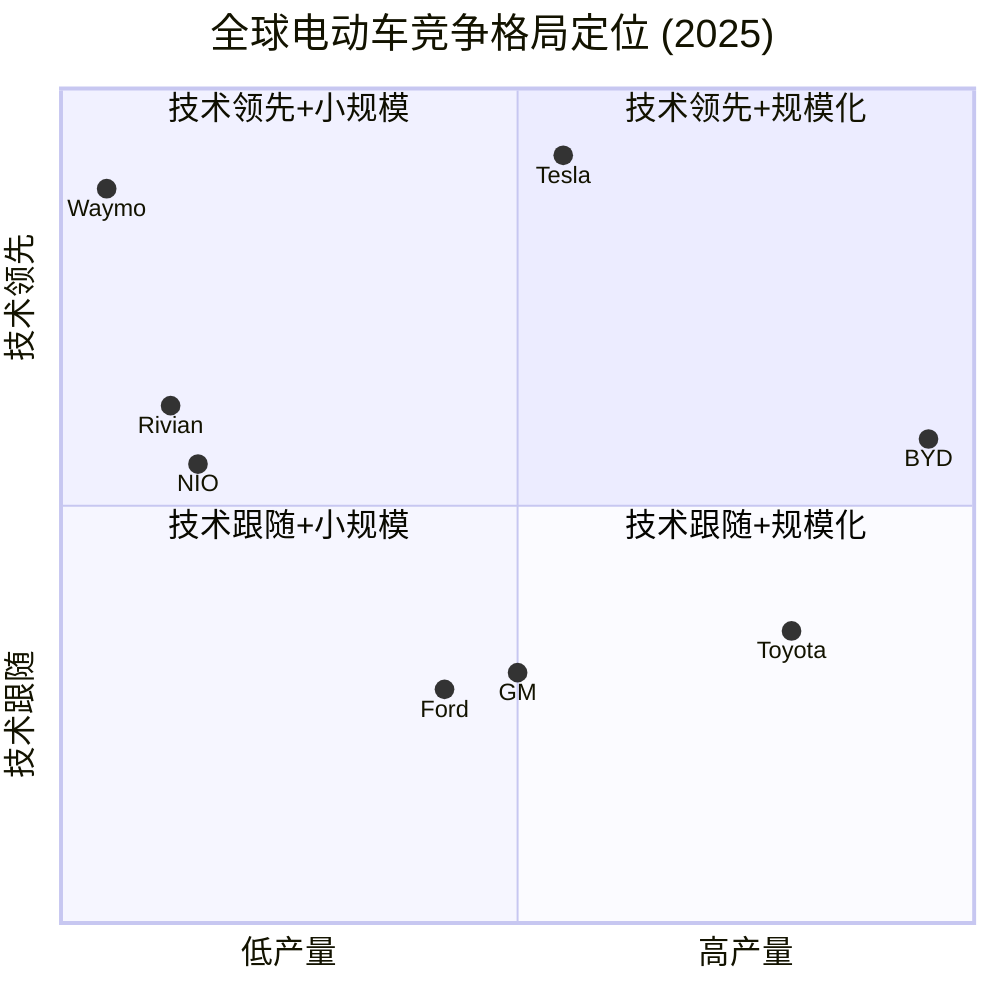
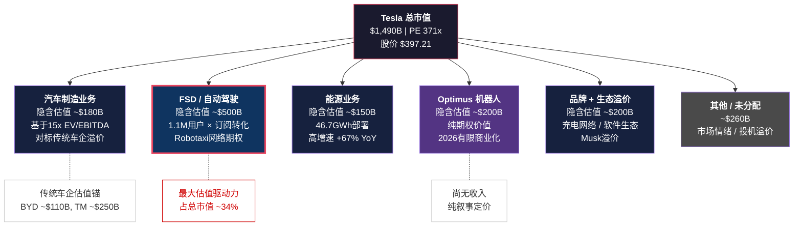
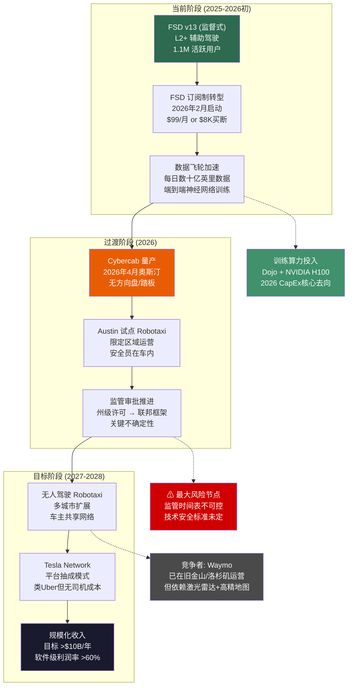

# U4 — Mermaid可视化套件

> **编制说明**: 本章通过6组可视化图表，将Tesla核心财务与战略数据转化为直观的决策支持工具。所有数据基于FY2025实际财报及最新市场数据，每张图表附带关键洞察提炼，帮助投资者在30秒内抓住核心信号。

---

## 4.1 收入结构演进 — FY2025营收拆分

Tesla的收入结构正在发生质变。汽车业务虽仍占据主导地位，但能源与服务两大板块合计已突破四分之一，标志着Tesla从"电动车公司"向"能源+AI平台"的转型加速。FY2025总营收$94.83B，三大板块占比如下。[A: Tesla IR Q4 2025]

> **关键洞察**: 能源业务营收$12.78B（+67% YoY）已逼近服务板块，成为Tesla增长最快的第二曲线。若能源业务维持当前增速，预计FY2026将突破$20B，占比提升至16-18%。汽车业务占比从FY2023的85%降至73.3%，收入多元化趋势确立。

---

## 4.2 产品时间线 — 2024-2028关键里程碑

Tesla正处于产品周期的密集切换期：旧车型（Model S/X）退役、核心车型改款、全新平台（Cybercab/Semi）量产、以及Optimus人形机器人商业化，四条线索并行推进。以下甘特图呈现各产品线的关键时间节点。[A: Tesla IR Q4 2025, Earnings Call]

> **关键洞察**: 2026年是Tesla的"超级产品年"——Cybercab（4月）、Semi（年中）、Optimus有限商业化、FSD订阅制转型、Model S/X停产，五大事件密集落地。这解释了2026年CapEx飙升至>$20B的合理性，但也意味着执行风险高度集中。任何单一产品线的延迟都可能引发连锁反应。

---

## 4.3 现金流瀑布 — FY2025实际 vs FY2026指引

现金流是检验Tesla"既要增长又要盈利"故事的核心指标。FY2025经营性现金流$14.747B，扣除$8.527B资本开支后，自由现金流$6.22B。然而2026年CapEx指引>$20B，意味着即使OCF同比增长30%，FCF仍可能转负。以下瀑布图直观呈现这一关键张力。[A: Tesla IR Q4 2025]

> **关键洞察**: FY2025的FCF $6.22B看似健康，但FY2026 CapEx指引>$20B（同比+135%）将大幅压缩甚至吞噬自由现金流。这是Tesla主动选择的"投资换增长"策略——Cybercab产线、Semi工厂、Megapack扩产、Optimus研发同时推进。投资者需要判断：这$20B+的资本开支能否在2027-2028年转化为显著的收入增量与利润率提升。现金储备$36.6B提供了缓冲垫，但连续两年负FCF将考验市场信心。

---

## 4.4 竞争格局定位 — 技术领先性 vs 规模化能力

电动车竞争已进入"技术+规模"双轴博弈阶段。以下象限图定位Tesla与主要竞争对手在两个关键维度上的相对位置：纵轴为技术领先性（FSD/自动驾驶/软件能力），横轴为量产规模（年交付量）。[A: Tesla IR Q4 2025, 各公司公开数据]

> **关键洞察**: Tesla占据"技术领先"象限的制高点，但在规模轴上已被BYD（4.54M辆 vs 1.63M辆，2.8倍差距）显著超越。BYD凭借垂直整合+中国制造成本优势占据"规模化+技术中上"的强势位置。Tesla的战略赌注是：通过FSD/Cybercab/Optimus将技术优势货币化，避免陷入与BYD的纯规模战。Waymo在技术轴上接近Tesla但缺乏硬件规模，Rivian/NIO技术有亮点但规模严重不足。传统车企（Toyota/GM/Ford）在两个维度上均处于追赶状态。

---

## 4.5 估值分解 — $1.49万亿市值的隐含假设

当前Tesla市值$1,490B（PE 371x），远超传统汽车估值框架。市场定价中隐含了对多个业务单元的乐观预期。以下图表将总市值拆解为各业务板块的隐含估值，揭示"市场在为什么买单"。[A: MCP工具, 2026-02-06; 分析师估算]

> **关键洞察**: FSD/自动驾驶是Tesla估值的最大单一驱动力（隐含~$500B，占比约34%）。纯汽车制造业务仅支撑约$180B估值（对标BYD $110B + 合理溢价）。这意味着：如果FSD在2026-2027年未能实现Robotaxi商业化的实质性突破，当前市值中有超过$800B（FSD+Optimus+情绪溢价）面临重估风险。反之，若Cybercab+FSD的Robotaxi模式跑通，$500B的FSD估值反而可能被证明保守。PE 371x的本质是市场在为2028-2030年的Tesla定价，而非当下。

---

## 4.6 技术路线图 — FSD到Robotaxi的商业化路径

FSD是连接Tesla当前业务与未来愿景的核心纽带。从L2+辅助驾驶到完全无人Robotaxi服务，技术跃迁与商业模式转型需要经历多个关键节点。以下流程图展示这条路径的逻辑链与当前进展。[A: Tesla IR Q4 2025, Earnings Call]

> **关键洞察**: FSD到Robotaxi的商业化路径存在一个"硬卡点"——监管审批（节点F）。技术进步（数据飞轮）和产品落地（Cybercab量产）在Tesla的控制范围内，但无人驾驶的监管框架建立是外生变量，时间表高度不确定。Waymo已在部分城市获得无人驾驶许可，但采用完全不同的技术路线（激光雷达+高精地图 vs Tesla的纯视觉方案），两者的监管路径可能分化。FSD订阅制转型（2026年2月）是近期可观测的关键指标——转化率和留存率将直接验证用户对FSD的真实支付意愿。

---

## 可视化总览表

| 编号 | 图表名称 | 图表类型 | 核心数据 | 关键洞察 |
|:----:|---------|---------|---------|---------|
| 4.1 | 收入结构演进 | 饼图 | FY2025 $94.83B三板块占比 | 能源业务+67% YoY，收入多元化趋势确立，汽车占比从85%降至73.3% |
| 4.2 | 产品时间线 | 甘特图 | 2024-2028六大产品线里程碑 | 2026年五大事件密集落地，执行风险高度集中，解释CapEx>$20B合理性 |
| 4.3 | 现金流瀑布 | 流程图 | OCF $14.75B → FCF $6.22B → 2026 FCF可能转负 | CapEx翻倍+将压缩FCF，$36.6B现金储备提供缓冲，但连续负FCF考验信心 |
| 4.4 | 竞争格局定位 | 象限图 | Tesla vs 6家竞争对手双轴定位 | BYD规模2.8倍领先，Tesla赌注在技术货币化而非纯规模战 |
| 4.5 | 估值分解 | 流程图 | $1,490B市值拆解为6个业务单元 | FSD隐含~$500B（34%），汽车制造仅~$180B，PE 371x本质是为2028-2030定价 |
| 4.6 | 技术路线图 | 流程图 | FSD → Cybercab → Robotaxi三阶段路径 | 监管审批是"硬卡点"，FSD订阅转化率是近期可观测的关键验证指标 |

---

## 本章数据来源

- [A: Tesla IR Q4 2025] — Tesla Investor Relations, FY2025 Annual Report & Q4 Earnings
- [A: MCP工具, 2026-02-06] — 实时市场数据（股价、PE、RSI等）
- [A: 分析师估算] — 基于公开数据的推理分析，非官方指引
- 竞争对手数据来源: BYD年报、Toyota/GM/Ford公开财报、Rivian/NIO季度报告

---

> **免责声明**: 本报告仅供投资研究参考，不构成任何投资建议。所有估值分解均为分析师基于公开数据的推算，实际业务价值可能与隐含估值存在重大偏差。投资者应基于自身判断做出决策，并充分认识到集中投资单一股票的风险。过往表现不代表未来收益。
