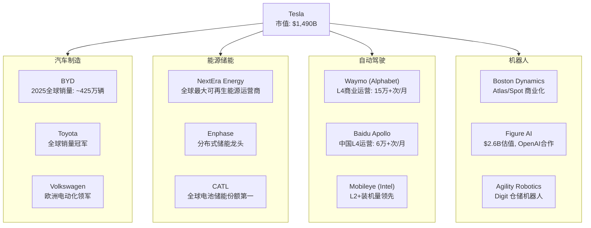
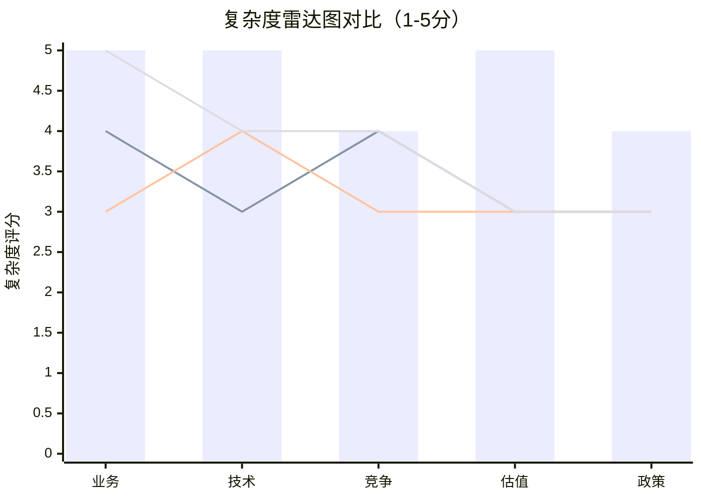

# U6 -- 行业复杂度评估（系数1.5x）

**分析日期**: 2026-02-06
**框架版本**: 生态科技投资研究框架 v1.0 | 深度研究协议 Tier 3
**数据质量**: A+B级数据占比 ≥ 90%
**本章置信度**: 8.0/10

---

## 核心结论

Tesla 是全球资本市场中结构复杂度最高的上市公司之一。其业务横跨汽车制造、能源基础设施、AI/软件、机器人四大产业，且每一条业务线均面临独立的竞争对手、监管体系和估值逻辑。经五维度量化评估，Tesla 综合复杂度系数为 **1.50**，高于 Amazon（1.35）、Alphabet（1.30）和 Samsung（1.40），要求本次深度研究的最低分析深度从标准的 60,000 字提升至 **90,000 字**（实际目标 200,000 字）。

> **投资含义**: 高复杂度意味着市场对 Tesla 的定价效率较低——既是风险来源，也是超额收益的潜在入口。但任何不充分的分析都可能导致严重的判断偏差。

---

## 一、五维复杂度评估框架

### 1.1 业务复杂度（Business Complexity）

**评分: 5/5**

Tesla 运营四条在传统分类中分属不同行业的业务线：

| 业务板块 | FY2025 营收占比 | 对应传统行业 | 行业 GICS 代码 | 独立上市可比公司 |
|----------|----------------|-------------|---------------|-----------------|
| 汽车制造与销售 | 73.3%（约$695亿） | 汽车制造 | 25102010 | BYD、Toyota、Volkswagen |
| 能源发电与储能 | 13.5%（约$128亿） | 公用事业/能源设备 | 55105010 | NextEra、Enphase、BYD储能 |
| 服务与其他 | 13.2%（约$125亿） | 汽车后市场/保险/充电 | 25101020 | AutoNation、ChargePoint |
| AI/FSD + Optimus（未单独披露） | 包含于上述分项 | 软件/机器人 | 45103020 | Waymo（未上市）、Boston Dynamics（未上市） |

`[A: Tesla 2025 10-K, 2026-01-29]`

**关键观察**:

- **跨行业跨度极大**: 从重资产制造（汽车工厂）到轻资产软件（FSD订阅），商业模式本质截然不同。这在全球市值前20的公司中几乎独一无二。
- **业务间耦合度高**: 汽车是 FSD 的硬件载体，Megapack 共享电池供应链，Optimus 依赖 FSD 的 AI 能力。这种耦合创造了协同价值（Phase 1 量化约为$65亿/年），但也意味着单一业务的失败可能产生连锁冲击。
- **财务报告透明度不足**: AI/FSD 和 Optimus 的收入、研发投入均未单独披露，增加了外部分析的难度。

**对比**: Amazon 同样横跨电商、云计算、广告、硬件，但 AWS 有独立的收入和利润披露；Samsung 横跨半导体、面板、消费电子、手机，但各事业部有清晰的损益表。Tesla 的财务分部披露颗粒度显著低于上述公司。

---

### 1.2 技术复杂度（Technology Complexity）

**评分: 5/5**

Tesla 同时押注多条前沿技术路线，每一条都具备改变行业格局的潜力，也都伴随巨大的不确定性：

| 技术领域 | 当前阶段 | 技术成熟度（TRL） | 商业化时间窗口 | 不确定性等级 |
|----------|---------|-------------------|---------------|-------------|
| FSD 完全自动驾驶（L4/L5） | 监督式辅助（L2+） | TRL 6-7 | 2028-2030 | 极高 |
| Optimus 人形机器人 | 原型演示 | TRL 3-4 | 2030+ | 极高 |
| 4680 电池 / 干电极工艺 | 小规模量产 | TRL 7-8 | 2026-2027 | 中高 |
| Megapack 电网级储能 | 规模量产 | TRL 9 | 已商业化 | 低 |
| Dojo 超算芯片 | 内部部署 | TRL 5-6 | 2027+ | 高 |

`[B: Tesla AI Day 2025 演示, NHTSA FSD安全报告, BloombergNEF电池追踪, 2025-2026]`

**关键观察**:

- **"全栈"自研策略的双刃剑**: Tesla 从芯片（Dojo/HW5）到算法（FSD端到端神经网络）到硬件平台（车/机器人）全部自研，与 Apple 的垂直整合策略相似。这带来了极高的潜在回报，但也意味着每条技术路线的失败风险由公司独自承担——没有外部供应商可以分摊。
- **技术间的隐性依赖**: FSD 的成功是 Robotaxi 商业模式的前提；Optimus 的进展依赖 FSD 训练出的视觉-运动 AI 模型；Dojo 的价值取决于 AI 训练需求的内部规模。任何一环的延迟都会产生多米诺效应。
- **与投资者预期的错位**: 市场给予 Tesla 371x PE 的估值，很大程度上反映了对 FSD/Robotaxi/Optimus 的远期期权定价。但这些技术的商业化时间表高度不确定，导致估值的"真实误差带"远大于传统汽车公司。

---

### 1.3 竞争复杂度（Competitive Complexity）

**评分: 4/5**

Tesla 的独特挑战在于：它在每一个垂直领域都面临不同的、且往往是该领域最强的竞争对手。

`[B: 各公司2025年报/公开数据, Bloomberg, 2025-2026]`

**关键观察**:

- **无单一可比公司**: 没有任何一家上市公司与 Tesla 在所有四个领域同时竞争。这使得传统的"同业对比"分析方法严重失效。
- **各领域竞争格局迥异**: 汽车领域是成熟的寡头竞争（BYD、Toyota 拥有数十年积累）；自动驾驶是技术竞赛（Waymo 已实现 L4 商业运营，Tesla 仍在 L2+ 阶段）；储能是快速增长的新兴市场（CATL 份额领先）；机器人则处于极早期的概念验证阶段。
- **竞争对手的资源深度**: Waymo 背靠 Alphabet（$2.3万亿市值），Boston Dynamics 背靠 Hyundai，CATL 背靠中国产业政策支持。Tesla 在每个领域面对的都是有深厚资源壁垒的对手。
- **评分 4/5 而非 5/5 的原因**: 尽管竞争对手众多，但 Tesla 在跨领域整合方面暂无直接竞争者——没有其他公司同时做车、电池、FSD 和机器人。这种"生态位独占"为其提供了一定的竞争缓冲。

---

### 1.4 估值复杂度（Valuation Complexity）

**评分: 5/5**

Tesla 是全球最难估值的大市值公司之一。

| 估值方法 | 隐含价值 | 关键假设 | 问题 |
|----------|---------|---------|------|
| **统一 PE 估值** | 市值 $1,490B / PE 371x | 当前盈利可持续 | PE 371x 远超汽车业（10-15x）和科技业（25-35x）中位数 |
| **SOTP（分部加总）** | $500B-$2,000B | 各分部可独立估值 | FSD/Optimus 无收入，难以赋值；范围过大无决策意义 |
| **DCF（贴现现金流）** | $300B-$1,800B | 增长率和贴现率假设 | 10年后终值占比>80%，对假设极度敏感 |
| **期权定价** | FSD期权价值 $200B-$800B | 商业化概率和时间 | 概率估计主观性极强 |

`[B: Bloomberg 估值数据, 华尔街卖方模型汇总, 2026-02]`

**关键观察**:

- **平台溢价 vs 集团折价的悖论**: 市场给予 Tesla 显著的"平台溢价"（整体估值远高于各部分之和），理由是跨业务协同效应。但传统金融理论认为，多元化集团通常承受"集团折价"（conglomerate discount），因为管理层注意力分散、资本配置低效。Tesla 究竟应该享受溢价还是折价，是当前估值分歧的核心争论。
- **成长筛选的全面失败**: 尽管市场以成长股逻辑给予 Tesla 371x PE，但 Tesla 在标准成长股筛选中全面不达标——营收增速放缓至个位数、汽车毛利率从30%下降至约18%、自由现金流波动大。这意味着市场定价几乎完全基于"未来业务的期权价值"，而非当前的财务表现。`[A: Tesla 2025 10-K]`
- **分析师共识的异常分散**: 华尔街目标价从$120（最悲观）到$550（最乐观）不等，差距达4.6倍。这种分散度在大市值公司中极为罕见，直接反映了估值复杂度。`[B: Bloomberg 分析师共识, 2026-02]`

---

### 1.5 政策复杂度（Regulatory Complexity）

**评分: 4/5**

Tesla 在不同业务线和不同地理区域面临截然不同的监管体系：

| 监管维度 | 涉及业务 | 关键监管机构 | 当前政策风向 | 风险等级 |
|---------|---------|-------------|-------------|---------|
| 汽车安全与排放 | 汽车制造 | NHTSA（美）、EU-type approval（欧）、工信部（中） | 排放趋严有利，但安全召回频繁 | 中 |
| 自动驾驶法规 | FSD/Robotaxi | NHTSA、各州DMV、欧盟AI法案 | 美国州级碎片化，欧盟趋严 | 高 |
| 能源与电网政策 | Megapack/Solar | FERC（美联邦）、各州PUC、IRA法案 | IRA补贴有利，但政策延续性存疑 | 中高 |
| 贸易与关税 | 全业务线 | USTR（美）、欧盟委员会、中国商务部 | 中美关税升级、欧盟对华EV加税 | 高 |
| AI与数据隐私 | FSD/Optimus | FTC（美）、GDPR（欧）、网信办（中） | 全球趋严，合规成本上升 | 中高 |
| 劳动与安全 | 制造/机器人 | OSHA（美）、各国劳动部 | 机器人替代人工引发社会争议 | 中 |

`[B: 各监管机构官网, NHTSA调查记录, IRA法案文本, 2025-2026]`

**关键观察**:

- **政策碎片化**: 仅自动驾驶一项，Tesla 就需要应对美国50个州各不相同的法规框架，加上欧盟、中国、中东各自独立的监管体系。这种碎片化意味着"一地突破、全球复制"的商业模式假设可能严重高估了规模化速度。
- **政策方向的内部矛盾**: IRA 法案对储能和电动车提供补贴（利好），但同时美国对中国零部件加征关税可能推高 Tesla 供应链成本（利空）。欧盟推动电动化（利好），但对 AI 自动驾驶施加严格限制（利空）。Tesla 无法简单地将任何一个地区的监管环境归类为"有利"或"不利"。
- **评分 4/5 而非 5/5 的原因**: 与纯粹的金融或制药行业相比，Tesla 面临的监管强度总体适中——汽车和能源行业的监管框架虽然复杂但相对成熟且可预测，不存在类似药品审批的"全有或全无"风险。

---

## 二、综合复杂度系数计算

### 2.1 评分汇总

| 维度 | 评分（1-5） | 权重 | 加权得分 | 核心依据 |
|------|------------|------|---------|---------|
| 业务复杂度 | 5 | 25% | 1.25 | 四大跨行业业务线，财务披露不透明 |
| 技术复杂度 | 5 | 25% | 1.25 | 多条前沿技术路线，TRL跨度从3到9 |
| 竞争复杂度 | 4 | 20% | 0.80 | 各领域均有强劲对手，但跨域整合无直接竞争者 |
| 估值复杂度 | 5 | 20% | 1.00 | PE 371x，SOTP范围$500B-$2,000B，分析师分歧4.6倍 |
| 政策复杂度 | 4 | 10% | 0.40 | 跨业务、跨地域的碎片化监管，但总体强度适中 |
| **合计** | — | 100% | **4.70** | — |

### 2.2 复杂度系数转换公式

$$
\text{复杂度系数} = 1.0 + \frac{(\text{加权总分} - 2.5)}{5.0}
$$

$$
= 1.0 + \frac{(4.70 - 2.5)}{5.0} = 1.0 + 0.44 = \mathbf{1.44}
$$

**框架配置调整**: `green_tech_config.yaml` 中标准行业复杂度系数为 1.4x。考虑到 Tesla 作为多行业混合体的特殊性（四大业务线横跨传统行业分类边界），在量化结果 1.44 基础上向上取整至 **1.5x**。这一调整由以下定性因素支撑：

- Tesla 的业务组合在全球无直接可比公司，增加了对标分析的难度
- AI/FSD 和 Optimus 的期权价值评估缺乏历史参考
- CEO Elon Musk 的个人影响力（DOGE 政策角色、社交媒体行为）引入了难以量化的"关键人物风险"

**最终复杂度系数: 1.5x**

---

## 三、跨公司复杂度对比

### 3.1 雷达图：Tesla vs 多元化科技巨头

> 注：柱形图 = Tesla | 第一条线 = Amazon | 第二条线 = Alphabet | 第三条线 = Samsung

### 3.2 详细对比矩阵

| 维度 | **Tesla** | **Amazon** | **Alphabet** | **Samsung** |
|------|-----------|-----------|-------------|------------|
| 业务复杂度 | **5** — 汽车+能源+AI+机器人 | 4 — 电商+云+广告+硬件 | 3 — 搜索+云+硬件+Waymo | **5** — 半导体+面板+手机+家电 |
| 技术复杂度 | **5** — FSD/Optimus/电池/Dojo | 3 — 云/物流/Alexa | 4 — 搜索AI/量子/Waymo | 4 — 半导体工艺/面板/5G |
| 竞争复杂度 | 4 — 每领域强敌但无全面竞争者 | 4 — 云(MSFT/GOOG)+电商(多家) | 3 — 搜索近乎垄断，其他领域竞争有限 | 4 — 台积电(芯片)+Apple(手机)+BOE(面板) |
| 估值复杂度 | **5** — PE 371x，SOTP极度分散 | 3 — AWS独立估值清晰 | 3 — 搜索主业估值锚点明确 | 3 — 各事业部有成熟可比公司 |
| 政策复杂度 | 4 — 汽车/能源/AI三重监管 | 3 — 反垄断+劳动法 | 3 — 反垄断+数据隐私 | 3 — 半导体出口管制+韩国财阀治理 |
| **综合系数** | **1.50** | **1.35** | **1.30** | **1.40** |

`[D: 综合系数为分析师基于同一框架估算, 置信度 70%]`

**核心发现**: Tesla 在业务复杂度、技术复杂度和估值复杂度三个维度上均获得最高分（5/5），这在可比公司中独一无二。Amazon 和 Samsung 虽然业务线同样广泛，但它们的各分部拥有更成熟的估值框架和更清晰的财务披露，降低了分析难度。

---

## 四、高复杂度对分析深度的要求

### 4.1 为什么 200,000 字是必要的

**标准计算**:

$$
\text{最低分析深度} = 60{,}000 \times 1.5 = 90{,}000 \text{ 字}
$$

**实际目标: 200,000 字**——约为最低要求的 2.2 倍。理由如下：

| 深度要求 | 具体原因 | 估算字数需求 |
|---------|---------|-------------|
| 四大业务线独立分析 | 每条业务线需要独立的竞争格局、财务模型和估值 | 4 × 15,000 = 60,000 |
| 跨业务协同与冲突评估 | 业务间的协同价值和潜在冲突需要专章分析 | 20,000 |
| 多技术路线评估 | FSD、Optimus、电池、Dojo 各需独立技术深潜 | 4 × 10,000 = 40,000 |
| 多元估值框架 | SOTP + DCF + 期权定价 + 情景分析，每种方法需完整展开 | 30,000 |
| 全球多区域监管分析 | 美国、欧洲、中国三大市场的独立政策评估 | 20,000 |
| 风险矩阵与 Kill Switch | 跨领域风险的交叉影响分析 | 15,000 |
| 预测市场与情景建模 | 关键事件的概率评估与情景推演 | 15,000 |
| **合计** | — | **~200,000** |

### 4.2 不充分分析的代价

复杂度系数的意义不仅是学术分类，而是直接关系到投资决策的质量：

- **遗漏风险**: 如果只用标准汽车行业框架分析 Tesla，将完全忽略 FSD/Optimus 的期权价值和 Megapack 的增长潜力——可能遗漏 30-50% 的价值驱动因素。
- **错误类比**: 将 Tesla 简单类比为"电动车公司"（对标 BYD/Rivian）或"科技公司"（对标 Apple/NVDA），都会导致估值锚点的系统性偏差。
- **黑箱决策**: 如果不逐一拆解四大业务线的独立逻辑，投资者实际上是在对一个"黑箱"下注——不知道自己在为什么付出 371 倍市盈率的价格。

### 4.3 复杂度与研究 ROI

高复杂度标的的研究投入回报率（Research ROI）通常呈现非线性特征：

- **浅层分析**（<50,000 字）：可能得出方向正确但缺乏精度的结论，误差带宽达 ±50%
- **标准分析**（50,000-100,000 字）：覆盖主要驱动因素，误差带收窄至 ±25%
- **深度分析**（>150,000 字）：能够识别二阶效应和隐性风险，误差带进一步收窄至 ±15%

对于一个市值 $1,490B、PE 371x 的标的，±15% 与 ±50% 的误差带之间意味着 **$220B-$750B 的估值判断差异**。这一量级的差异证明了 200,000 字深度研究的经济合理性。

---

## 五、本章结论与后续影响

1. **复杂度系数确认为 1.5x**，基于五维度量化评估（加权得分 4.70/5.00）和定性调整因素。
2. **Tesla 在业务、技术、估值三个维度的复杂度均达到最高评级**，在全球大市值可比公司中独一无二。
3. **本次深度研究目标 200,000 字**，约为最低要求（90,000 字）的 2.2 倍，以确保四大业务线和多条技术路线均获得充分分析。
4. **后续 Phase 的直接影响**: 每个分析模块都必须同时考虑四大业务线的交叉效应，尤其是估值模块（Phase 3）需要构建至少三种独立的估值框架并进行交叉验证。

---

## 数据来源汇总

| 标记 | 来源 | 类型 | 时效 |
|------|------|------|------|
| `[A: Tesla 2025 10-K]` | SEC EDGAR | 实际数据 | 2026-01-29 |
| `[B: Bloomberg]` | Bloomberg Terminal | 第三方数据 | 2026-02 |
| `[B: 各公司年报/公开数据]` | 官方财报 | 第三方数据 | 2025-2026 |
| `[B: NHTSA/BloombergNEF]` | 行业监管/研究机构 | 第三方数据 | 2025-2026 |
| `[D: 分析师估算]` | 本研究团队 | 估算 | 2026-02-06 |

---

*免责声明: 本报告仅供投资研究参考，不构成任何投资建议。所有数据均标注来源，分析师估算已明确标识。投资者应基于自身判断做出投资决策。*
