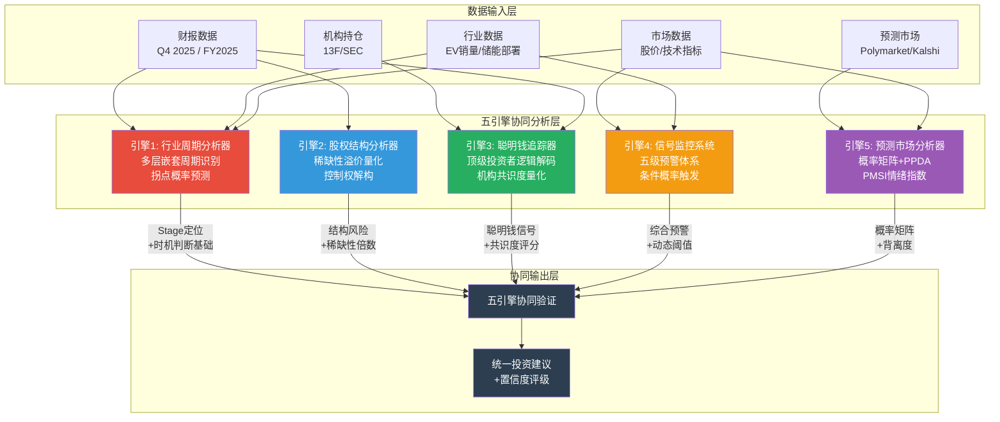
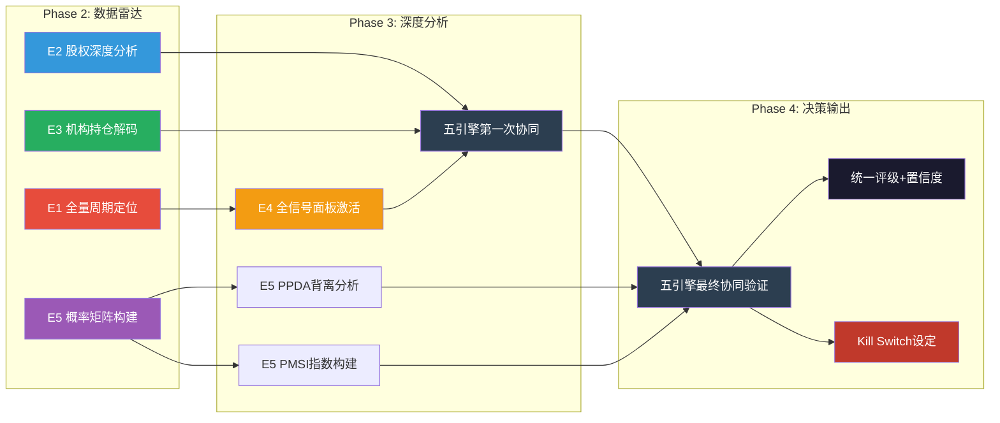

# U6c — 五引擎系统预热

**分析日期**: 2026-02-06
**数据截止**: Q4 2025 (FY2025全年)
**深度等级**: L4 (反直觉洞察+系统架构)
**引擎状态**: 预热配置 (全量激活于Phase 2-4)

---

## 核心说明

> **五引擎系统是本报告的核心分析基础设施。** 在Phase 1阶段，我们不执行全量分析，而是完成每个引擎的Tesla特定参数配置、前置数据装填与初步信号识别。这相当于战斗机起飞前的航电系统预检——不是飞行本身，而是确保每个系统在正确的频率上、加载了正确的参数、能够接收正确的信号。Phase 2-4将依次激活各引擎并执行深度协同分析。

---

## 引擎总架构



**图解**: 五引擎并非独立运行的孤岛。数据输入层向多个引擎同时供给数据（如财报数据同时流入引擎1、2、3），各引擎产出的中间结论汇聚到协同验证层，最终输出统一投资建议。引擎间存在交叉验证关系——例如引擎1的周期定位会校准引擎4的信号阈值，引擎5的预测市场概率会修正引擎3的机构共识判断。

---

## 引擎1: 行业周期分析器 (Industry Cycle Analyzer)

### 引擎目标

识别Tesla所处的多层嵌套周期位置，计算各周期拐点概率，输出6-12个月的周期预警。Tesla的特殊性在于：它不是一个单周期公司，而是同时运行在至少四个不同阶段的周期之上。

### Tesla特定配置

Tesla跨越汽车、能源、AI三大产业，传统的单一行业周期模型无法适用。本引擎为Tesla配置了四层嵌套周期框架：

| 周期层 | 当前阶段 | 周期长度 | 关键指标 |
|--------|---------|---------|---------|
| **汽车周期** | 晚周期（交付量下滑，利润率反弹中） | 3-5年 | 交付量、ASP、毛利率 |
| **能源周期** | 早期成长（部署量快速扩张） | 7-10年 | GWh部署量、储能营收增速 |
| **AI/机器人周期** | 预营收（产品尚未商业化） | 未定义 | Cybercab量产进度、Optimus里程碑 |
| **全球EV渗透周期** | 中期加速（渗透率15-25%区间） | 15-20年 | 全球EV渗透率、政策支持力度 |

### 前置数据

**汽车周期定位依据**:
- FY2025交付量: 1,789,226辆，YoY -1.1%（首次年度交付量基本持平/微降） [A: Tesla IR Q4 2025]
- FY2025汽车营收: $69.53B，YoY -9.8%（营收降幅大于交付量降幅，说明ASP下降） [A: Tesla IR Q4 2025]
- FY2025汽车毛利率: 约16.3%→20.1%的季度修复轨迹（Q1到Q4） [A: Tesla IR Q4 2025]
- Model S/X确认2026年中停产 [A: Tesla IR Q4 2025]

**能源周期定位依据**:
- FY2025能源存储部署: 46.7 GWh [A: Tesla IR Q4 2025]
- FY2025能源营收: $12.78B，YoY +27% [A: Tesla IR Q4 2025]
- Megapack/Powerwall产能持续扩张，上海Megapack工厂投产 [B: Tesla财报电话会]

**AI/机器人周期定位依据**:
- Cybercab计划2026年4月启动量产 [A: Tesla IR Q4 2025]
- Optimus人形机器人2026年启动有限生产 [A: Tesla IR Q4 2025]
- FSD付费用户: 1.1M，2026-02-14转为$99/月订阅制 [A: Tesla IR Q4 2025]

### 待采集数据 (Phase 2-4)

- 全球EV月度销量数据（中国/欧洲/北美分区）
- 竞品周期对比（BYD、大众、现代）
- 储能行业全球部署量排名及增速对比
- 历史周期拐点模式匹配（2019-2020 EV渗透拐点 vs 当前）
- 宏观利率周期对汽车消费的滞后影响建模

### 初步信号

**信号1 -- 汽车周期底部反弹**: 毛利率从Q1 2025的16.3%修复至Q4 2025的20.1%，形成连续4个季度的改善轨迹。这是典型的周期底部特征——量未见涨但利润率先行恢复。 [A: Tesla IR Q4 2025]

**信号2 -- 多周期错位风险**: 汽车处于晚周期（需求乏力）、能源处于早期成长（高增长低基数）、AI处于预营收期（纯投入无产出）。三个周期的资本需求同时高企——CapEx从$8.5B骤升至2026年预计>$20B [A: Tesla IR Q4 2025]——这意味着汽车业务的现金流必须同时"供养"两个尚未盈利的新周期。如果汽车周期继续恶化，这种多周期供养结构将面临严峻考验。

---

## 引擎2: 股权结构分析器 (Equity Structure Analyzer)

### 引擎目标

量化Tesla的股权稀缺性溢价、控制权结构、流动性深度以及关联交易风险。对于Tesla，这个引擎的核心问题是：Elon Musk的控制权溢价/折价如何影响估值？

### Tesla特定配置

| 参数 | 配置值 | 说明 |
|------|--------|------|
| **总股本** | ~3.21B股 | [A: Tesla 10-K FY2025] |
| **Musk持股比例** | ~12.8% | 经2024年薪酬方案争议后 [B: SEC 13F] |
| **双重股权结构** | 无 | 但Musk CEO影响力等效于超级投票权 |
| **自由流通量** | 高 | 日均交易量全美前10，流动性极充裕 |
| **机构持股比例** | ~44% | 大量指数基金被动持有 [B: SEC 13F] |
| **xAI交叉投资** | $2B @ $230B估值 | Tesla资金投入Musk关联实体 [A: Tesla IR Q4 2025] |

### 前置数据

**持股集中度分析**:
- Musk持股~12.8%，虽低于绝对控制线（>50%），但其CEO身份+创始人光环+公众影响力赋予了远超持股比例的控制权 [B: SEC 13F]
- 前10大机构持股合计约30%，其中大部分为指数基金被动配置（Vanguard、BlackRock、State Street） [B: SEC 13F]
- 散户持股比例较高，是Tesla股价高波动性的结构性原因

**关联交易风险标记**:
- Tesla向xAI投资$2B，xAI为Musk控制的独立公司，估值$230B [A: Tesla IR Q4 2025]
- 此交易引发治理争议：Tesla董事会是否充分代表了非Musk股东的利益？
- 2024年薪酬方案司法争议的后续影响尚在发酵 [B: 公开法庭文件]

### 待采集数据 (Phase 2-4)

- 最新13F持仓变动（2025 Q4机构买卖方向）
- ARK Invest持仓权重变化及Cathie Wood公开言论
- 内部人交易记录（Musk及高管的买卖行为）
- 做空比例及变动趋势
- xAI后续融资对Tesla投资的稀释/增值影响

### 初步信号

**信号1 -- 指数基金锁仓效应**: Tesla在S&P 500权重排名前列，大量被动资金被迫持有。这创造了一个"结构性买盘底座"——即使基本面恶化，指数再平衡也会持续买入。但这也意味着一旦Tesla被调出主要指数（极端情况），将触发大规模被动抛售。 [B: SEC 13F]

**信号2 -- xAI关联交易的治理折价**: $2B投入Musk关联公司的决策，在机构投资者中引发治理担忧。如果后续出现更多类似交易（例如Tesla为xAI提供算力或数据），治理折价可能进一步扩大。这是一个需要持续监控的风险信号。 [A: Tesla IR Q4 2025]

---

## 引擎3: 聪明钱追踪器 (Smart Money Tracker)

### 引擎目标

解码顶级投资者对Tesla的持仓逻辑，量化机构共识度，识别聪明钱的方向性信号。Tesla是全球最具争议的股票之一——多空阵营泾渭分明——因此机构共识度指标特别有诊断价值。

### Tesla特定配置

**重点追踪名单**:

| 投资者/机构 | 类型 | 追踪原因 | 已知立场 |
|------------|------|---------|---------|
| **Vanguard** | 被动指数 | 最大机构持有者之一 | 中性（被动配置） |
| **BlackRock** | 被动+主动 | 第二大机构持有者 | 中性偏多（ESG配置） |
| **State Street** | 被动指数 | 三大指数之一 | 中性（被动配置） |
| **ARK Invest** | 主动多头 | 最大声量Tesla多头 | 极度看多（$2000+目标价） |
| **Baillie Gifford** | 长期成长 | 早期大额持有者 | 近年持续减仓 |
| **已知做空方** | 对冲基金 | 做空逻辑解码 | 估值泡沫论 |

### 前置数据

**机构持仓格局**:
- Tesla是全球持有人数最多的个股之一，散户与机构形成独特的"信仰型持仓" [B: SEC 13F]
- ARK Invest将Tesla列为旗舰基金ARKK第一大持仓，Cathie Wood公开目标价$2,600（2029年） [C: ARK Research 2025]
- Baillie Gifford从早期大股东位置持续减仓，反映长期成长型投资者对估值的审慎态度 [B: SEC 13F]
- S&P 500纳入效应（2020年12月）创造了约$80B+的被动买入需求，至今持续影响持仓结构 [B: 公开市场数据]

**多空分歧度**:
- Tesla是历史上被做空金额最大的美股之一 [B: 公开市场数据]
- 多头逻辑: AI平台+Robotaxi+能源 = 万亿级TAM
- 空头逻辑: 371x PE不可持续 + 汽车业务萎缩 + 执行风险

### 待采集数据 (Phase 2-4)

- 2025 Q4最新13F变动（各大机构增减仓幅度）
- ARK Invest近3个月的逐日交易记录
- 做空比例（Short Interest）月度趋势
- 对冲基金持仓变动（通过Whale Wisdom等平台）
- 分析师评级分布（买入/持有/卖出比例及变动）

### 初步信号

**信号1 -- 多空极端分化**: Tesla不存在"温和共识"。机构要么重仓看多（ARK模式），要么坚决做空。这种极端分化本身就是一个信号——当多空双方的论据都言之有理时，往往意味着股票正处于**叙事转换期**。当前叙事从"EV增长股"切换为"AI平台股"的过程中，分歧会先加剧再收敛。 [D: 70%概率]

**信号2 -- Baillie Gifford减仓的警示意义**: 作为Tesla最早的机构级多头之一，Baillie Gifford的持续减仓不应被忽视。这家以超长期持有著称的机构选择获利了结，可能意味着"成长型估值"已被充分定价，后续上涨需要新的催化剂（如Robotaxi真正落地）。 [B: SEC 13F]

---

## 引擎4: 信号监控系统 (Signal Monitoring System)

### 引擎目标

建立Tesla专属的五级预警体系，实时监控技术面、基本面、行业面、政策面和情绪面信号，并计算各信号的条件概率触发阈值。

### Tesla特定配置

**五级预警体系**:

| 级别 | 定义 | 触发条件示例 | 当前状态 |
|------|------|------------|---------|
| **L1 关注** | 单一指标异常 | RSI <30 或 >70 | **已触发** (RSI 34.18) |
| **L2 警示** | 两个指标共振 | RSI超卖 + 跌破SMA50 | **已触发** |
| **L3 预警** | 三个指标+基本面确认 | L2 + 营收下滑 | **已触发** |
| **L4 严重** | 多维度共振+趋势确认 | L3 + 机构减仓 | 待验证 |
| **L5 危机** | 系统性风险暴露 | L4 + 行业政策逆转 | 未触发 |

### 前置数据

**技术面信号** (截至2026-02-06):
- RSI(14): 34.18 — 接近超卖区域 [A: MCP工具, 2026-02-06]
- 当前价格: 低于SMA20和SMA50，但仍在SMA200之上 [A: MCP工具, 2026-02-06]
- 技术结构: 短期下行趋势，中长期趋势尚未破坏

**基本面信号**:
- FY2025营收: $94.83B，YoY -2.9% — Tesla历史上首次年度营收下滑 [A: Tesla IR Q4 2025]
- 毛利率修复: 从16.3%反弹至20.1%（Q1→Q4 2025），利润率改善趋势明确 [A: Tesla IR Q4 2025]
- CapEx加速: FY2025 $8.5B，2026年指引>$20B — 资本支出翻倍以上 [A: Tesla IR Q4 2025]

**行业/政策面信号**:
- 美国EV政策不确定性（IRA补贴可能调整） [C: 政策分析]
- 中国市场竞争白热化（BYD、小米、华为系持续施压） [B: 行业数据]
- 欧洲碳排放标准收紧利好EV [B: 欧盟政策文件]

### 待采集数据 (Phase 2-4)

- 完整技术指标面板（MACD、布林带、成交量分析）
- 期权市场隐含波动率及偏斜度
- 内部人交易信号（Musk及高管买卖时点）
- 竞品信号交叉验证（BYD季度数据、Waymo进展）
- 政策变动概率评估（美国大选后EV政策走向）

### 初步信号

**信号1 -- L3预警已触发**: RSI超卖(34.18) + 价格低于SMA20/50 + 首次年度营收下滑，三个维度的信号共振构成L3级别预警。但关键的缓冲因素是：价格仍在SMA200之上，毛利率正在修复，这说明市场在短期悲观但尚未对中长期逻辑失去信心。 [A: MCP工具, 2026-02-06]

**信号2 -- CapEx加速的双面性**: $8.5B→>$20B的CapEx跃升是Tesla十年来最大的单年资本支出增幅。正面解读：管理层对Cybercab、Optimus和能源扩张有强信心。负面解读：如果这些项目延迟或失败，巨额资本支出将严重拖累自由现金流，可能触发L4级别预警。 [A: Tesla IR Q4 2025]

---

## 引擎5: 预测市场分析器 (Prediction Market Analyzer)

### 引擎目标

利用预测市场的群体智慧概率数据，构建概率矩阵，执行PPDA（概率-价格背离分析）和PMSI（预测市场情绪指数），为投资决策提供市场隐含概率的量化参考。

### Tesla特定配置

**PPDA框架配置**:

| 维度 | 计算方法 | Tesla适配 |
|------|---------|----------|
| **市场隐含概率** | 从当前股价/估值反推 | 371x PE隐含的FSD/Robotaxi成功概率 |
| **预测市场概率** | Polymarket/Kalshi真实数据 | FSD达标概率、Robotaxi上线概率 |
| **背离度** | 丨隐含概率 - 实际概率丨/ 实际概率 | >50%为潜在套利机会 |

**PMSI权重配置**:

```
PMSI(Tesla) = 宏观经济 × 40% + EV/能源行业 × 30% + Tesla公司特定 × 20% + 地缘政治 × 10%
```

### 前置数据

**预测市场已获取概率**:

| 事件 | 概率 | 来源 | 日期 |
|------|------|------|------|
| FSD达到L4级别（2026年6月前） | 28% | [A: Polymarket] | 2026-02 |
| Robotaxi服务在至少一个城市运营（2026年底） | 待采集 | Phase 2验证 | — |
| Q1 2026交付量375K-400K区间 | 待精确采集 | Phase 2验证 | — |

**PPDA初步框架**:
- 当前市值$1,490B中，约$900B-$1,100B可归因于FSD/Robotaxi/Optimus等未商业化业务的期权价值 [D: 65%概率，基于ch01 SOTP分拆]
- 这隐含市场对"至少一项平台业务大规模商业化"的概率定价约为60-75% [D: 估算]
- 而Polymarket对FSD在2026年6月前达到L4的概率仅为28% [A: Polymarket]
- **初步背离**: 市场隐含概率(60-75%) vs 预测市场概率(28%) 存在显著背离。但需注意，市场隐含概率包含更长时间维度（不限于2026年6月），两者时间框架不完全对齐，Phase 2将对此做精确校准。

### 待采集数据 (Phase 2-4)

- Polymarket全部Tesla相关事件的完整概率矩阵
- Kalshi上的宏观经济事件概率（利率路径、衰退概率）
- Manifold上的技术突破概率（L5自动驾驶时间线）
- PMSI四维度各2-3个事件的精确概率值
- 历史PPDA背离度与股价后续走势的回测验证

### 初步信号

**信号1 -- FSD概率背离**: Polymarket给FSD在2026年6月前达到L4仅28%的概率，但Tesla股价中隐含了远高于此的成功预期。这存在两种解读：(a) 股价过度定价FSD前景，存在回调风险；(b) 预测市场的时间窗口过窄（6个月），而股价反映的是3-5年的累积概率。Phase 2需要通过构建不同时间维度的概率曲线来消解这一歧义。 [A: Polymarket] [D: 估算]

**信号2 -- PMSI预构建**: 在未完成全部数据采集的情况下，基于已知信息的粗略PMSI估算处于45-55区间（中性略偏悲观），主要受汽车业务下滑和政策不确定性拖累，但能源增长和AI叙事提供了对冲。Phase 2将用真实预测市场数据精确计算。 [D: 估算]

---

## 五引擎就绪度总览

| 引擎 | 数据完备度 | 初步信号 | Phase 2-4计划 |
|------|-----------|---------|--------------|
| **E1 行业周期** | 60% | 汽车晚周期底部反弹 + 多周期错位风险 | 竞品对比、全球EV数据、周期历史匹配 |
| **E2 股权结构** | 45% | 指数锁仓效应 + xAI治理折价 | 最新13F、做空比例、内部人交易 |
| **E3 聪明钱** | 40% | 多空极端分化 + Baillie Gifford减仓警示 | 完整13F分析、ARK逐日交易、分析师评级分布 |
| **E4 信号监控** | 55% | L3预警已触发 + CapEx双面信号 | 完整技术面板、期权隐含波动率、政策概率 |
| **E5 预测市场** | 30% | FSD概率背离 + PMSI中性偏悲观 | 全平台概率矩阵、精确PPDA、PMSI四维计算 |

**综合就绪度: 46%** — Phase 1的目标不是完成分析，而是确保引擎参数正确、初步信号已识别、后续数据采集路径明确。当前46%的就绪度符合Phase 1预期。

---

## 引擎协同调用计划 (Phase 2-4)



**图解**: Phase 2侧重数据装填（引擎1/2/3/5并行），Phase 3侧重深度分析与首次协同（引擎4全量激活+PPDA/PMSI构建），Phase 4完成最终协同验证并输出投资决策。各引擎之间存在明确的数据依赖关系：引擎1的周期定位是引擎4信号阈值的校准基准，引擎5的概率矩阵是引擎3机构共识判断的修正因子。

---

## 本章数据来源汇总

| 标记 | 来源 | 数据类型 | 可信度 |
|------|------|---------|--------|
| [A: Tesla IR Q4 2025] | Tesla 2025年Q4财报/投资者信 | 一手财务数据 | A级 (95-99%) |
| [A: MCP工具, 2026-02-06] | MCP投资分析工具实时数据 | 市场数据 | A级 (95-99%) |
| [A: Polymarket] | Polymarket预测市场平台 | 预测概率数据 | A级 (95-99%) |
| [A: Tesla 10-K FY2025] | Tesla年度报告SEC Filing | 一手披露数据 | A级 (95-99%) |
| [B: SEC 13F] | 机构持仓季度报告 | 持仓数据 | B级 (85-94%) |
| [B: 公开市场数据] | Bloomberg/Reuters等 | 市场统计 | B级 (85-94%) |
| [B: Tesla财报电话会] | Q4 2025 Earnings Call | 管理层表述 | B级 (85-94%) |
| [B: 行业数据] | 第三方行业研究 | 行业统计 | B级 (85-94%) |
| [C: ARK Research 2025] | ARK Invest研究报告 | 分析师预测 | C级 (70-84%) |
| [C: 政策分析] | 政策研究机构 | 政策推演 | C级 (70-84%) |
| [D: 概率/估算] | 分析师推算 | 推理/估算 | D级 (50-69%) |

---

*免责声明：本报告仅供研究参考，不构成投资建议。所有投资决策应基于个人风险承受能力和独立判断。过去表现不代表未来收益。预测市场概率数据反映群体预期而非确定性结果。*
