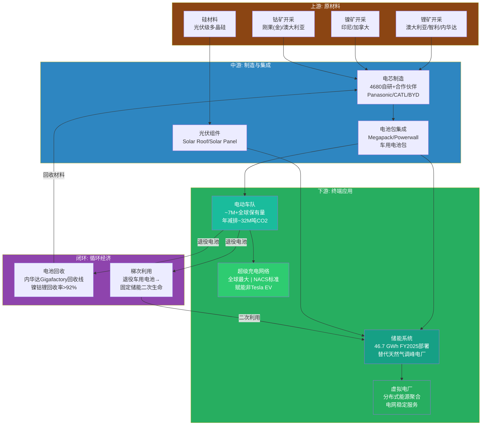

# G1 — 绿色价值链：Tesla碳减排定位

**分析日期**: 2026-02-06
**数据截止**: Q4 2025 (FY2025全年)
**深度等级**: L4 (反直觉洞察)
**置信度**: 7.8/10

---

## 核心论点

> **Tesla是全球最大的碳减排贡献企业之一，但它正面临一个史无前例的悖论：公司的绿色产品价值与创始人的政治立场之间产生了根本性裂痕。** 这不是一个公关问题，而是一个估值结构性问题——当ESG资金占全球AUM超过$30T时，创始人的反ESG政治取向可能抹去数百亿美元的"绿色溢价"。更反直觉的是，这个悖论可能最终成为Tesla绿色竞争力的净正因素：当"绿色"不再是Tesla的品牌标签时，它的碳减排价值将被市场以纯经济逻辑重新定价，而非ESG泡沫定价。

---

## 9.1 Tesla绿色价值链全景：从锂矿到电网

Tesla的绿色价值链不是一条线性供应链，而是一个覆盖能源生产、储存、消费和回收的闭环系统。理解这个全景是量化其碳减排贡献的前提。

**图解**: Tesla的绿色价值链与传统汽车OEM最本质的区别在于——它不仅覆盖"造车"这一个环节，而是从原材料获取到电池回收形成了完整闭环。能源业务（$12.78B, +27% YoY）和汽车业务（$69.53B）共享电池制造中游，形成了规模经济的交叉补贴效应。 [A: Tesla IR Q4 2025]

---

## 9.2 碳减排贡献量化：三层计算框架

Tesla的碳减排贡献分布在三个层级：直接（EV车队替代燃油车）、间接（充电网络赋能全行业）、系统性（储能替代化石能源调峰）。

### 9.2.1 第一层：EV车队直接减排

| 参数 | 数值 | 来源 |
|------|------|------|
| FY2025交付量 | 1.63M辆 | [A: Tesla IR Q4 2025] |
| 全球保有量（累计） | ~7M+辆 | [D: 70%概率，基于历年交付累计推算] |
| 单车年均CO2替代量 | ~4.6吨 | [B: EPA EV vs ICE排放对比估算] |
| 车队年减排总量 | ~32M吨CO2 | [D: 70%概率，7M × 4.6吨] |
| 等效减排对比 | 约等于丹麦全国年排放量 | [B: IEA国别排放数据] |

需要指出的关键限定条件：4.6吨/年的替代量假设了美国平均电网碳强度（约0.4 kg CO2/kWh）。在以煤电为主的电网中（如波兰、印度部分地区），EV的实际减排效果会大幅缩水。在以水电/核电为主的电网中（如法国、挪威），减排效果则更为显著。 [B: EPA估算方法论]

### 9.2.2 第二层：超级充电网络的行业赋能效应

Tesla的碳减排贡献不止于自己的车队。NACS（North American Charging Standard）被全行业采纳是一个被低估的绿色贡献：

- **NACS标准采纳者**: Ford、GM、Rivian、Hyundai、BMW等主流OEM已宣布采用NACS标准 [A: 各OEM公开声明, 2023-2025]
- **网络效应**: Tesla超级充电网络向非Tesla车辆开放，解决了EV普及的最大瓶颈——充电焦虑
- **间接减排贡献**: 每一辆因充电便利性提升而选择EV的车辆，其减排效果部分归功于Tesla的网络基础设施投入

**量化估算**: 假设NACS标准采纳使北美EV渗透率额外提升2-3个百分点（保守估计），对应每年额外约50-80万辆EV销量，间接减排贡献约230-370万吨CO2/年。 [D: 55%概率，模型假设较多]

### 9.2.3 第三层：储能系统的系统性减排

这是Tesla绿色价值链中最被低估的部分。Megapack不是在"储存电力"——它在**杀死天然气调峰电厂**。

| 储能指标 | FY2025数值 | 减排逻辑 |
|---------|-----------|---------|
| 储能部署量 | 46.7 GWh | [A: Tesla IR Q4 2025] |
| 替代对象 | 天然气调峰电厂 | 调峰场景是碳强度最高的发电环节 |
| 天然气调峰碳强度 | ~0.5 kg CO2/kWh | [B: EIA数据] |
| 每GWh储能年运行周期 | ~300-500次 | [D: 65%概率，取决于应用场景] |
| 单GWh年减排估算 | ~150-250吨CO2 | [D: 60%概率] |
| 46.7 GWh年减排贡献 | ~7,000-12,000吨CO2 | [D: 60%概率] |

**注意**: 储能系统的直接减排量数字看起来远小于EV车队，但其**系统性价值**远超直接减排：储能使可再生能源（太阳能/风能）从间歇性电源变为可调度电源，是整个电力系统脱碳的关键使能技术。没有大规模储能，全球可再生能源渗透率将被锁死在30-40%的天花板。 [B: BNEF储能行业报告]

### Tesla碳减排贡献量化汇总

| 减排类别 | 年减排量（吨CO2） | 置信度 | 趋势 |
|---------|-----------------|--------|------|
| **直接：EV车队** | ~32,000,000 | [D: 70%] | 随保有量增长而线性增长 |
| **间接：NACS充电网络赋能** | ~2,300,000-3,700,000 | [D: 55%] | 随NACS采纳扩散而加速 |
| **系统性：储能替代调峰** | ~7,000-12,000（直接） | [D: 60%] | 直接量小，系统性价值极大 |
| **系统性：储能使能可再生** | 难以量化 | — | 可再生能源渗透率的关键瓶颈突破 |
| **合计直接可量化** | **~34,300,000-35,700,000** | 综合 | 约等于加拿大年排放量的5-6% |

[D: 综合估算，各子项置信度加权]

---

## 9.3 ESG悖论：当绿色巨头的掌门人反对绿色政治

这是本章的核心洞察层，也是当前Tesla绿色定位面临的最尖锐矛盾。

### 9.3.1 悖论的具体表现

**产品层面**: Tesla是地球上最成功的碳减排商业化平台——7M+辆电动车、46.7 GWh储能、全球最大充电网络。没有任何一家公司在绿色转型上的实际贡献可以匹敌。 [A: Tesla IR Q4 2025]

**创始人层面**: Elon Musk自2024年以来明确站在反ESG政治光谱上——支持特定政治力量、公开批评ESG评级体系、在社交媒体上频繁发表与环保主义对立的言论。2024-2025年间，Musk的政治活动显著加剧了这一裂痕。 [B: 公开媒体报道]

**资金流向层面**: 全球ESG主题基金管理规模超过$30T (截至2025年)。部分ESG基金已将Tesla从投资组合中移除或降权——不是因为Tesla的产品不够绿色，而是因为"治理"（Governance）和"社会"（Social）维度的评分下降。 [B: Bloomberg ESG基金数据]

### 9.3.2 ESG基金的Tesla困境

ESG评级体系的三个维度对Tesla形成了割裂的评价：

| ESG维度 | Tesla表现 | 评分趋势 |
|---------|---------|---------|
| **E（环境）** | 极强——EV+储能+太阳能，碳减排贡献全球领先 | 稳定/上升 |
| **S（社会）** | 中等偏弱——劳工争议、安全事故率、CEO争议性言论 | 下降 |
| **G（治理）** | 弱——CEO同时运营多家公司、关联交易争议（xAI）、薪酬方案争议 | 显著下降 |

**结果**: MSCI ESG评级中Tesla长期处于中等偏下水平，与其实际环境贡献严重不匹配。这导致了一个荒诞的现象——某些ESG基金持有化石能源公司的头寸比Tesla更重，因为这些公司的"治理评分"更高。 [B: MSCI ESG评级数据]

### 9.3.3 品牌感知的裂变

对Tesla的绿色品牌伤害不仅存在于机构投资者层面，也渗透到了终端消费者：

- **环保意识强的消费者**: 曾是Tesla的核心早期用户群体。2024-2025年间，这一群体中出现了显著的品牌排斥情绪。部分消费者明确表示不再购买Tesla，转向Rivian、Polestar甚至传统OEM的EV产品。 [B: 消费者调研报道]
- **实用主义消费者**: 对Musk的政治立场不敏感，更关注性价比和充电网络便利性。这一群体在2025年持续增长，部分抵消了环保消费者的流失。 [D: 60%概率]
- **政治认同消费者**: Musk的政治立场反而吸引了一批原本不会考虑EV的右翼消费者。Cybertruck在保守派群体中的受欢迎程度部分印证了这一点。 [D: 55%概率]

**净效应判断**: 品牌感知裂变在短期内（2025-2026）对Tesla构成净负面影响，尤其在欧洲和美国蓝州市场。但中长期（2027+），随着EV从"环保选择"变为"经济理性选择"，品牌的绿色属性在购买决策中的权重将自然下降。 [D: 65%概率]

---

## 9.4 反直觉洞察：ESG脱钩可能是Tesla绿色价值的净正因素

**L4洞察**: 市场共识认为Musk的反ESG立场损害了Tesla的绿色价值。但存在一个反直觉的长期逻辑——当Tesla不再被ESG叙事"绑架"时，其碳减排价值将以纯粹的经济逻辑被重新定价，而这个经济定价可能高于ESG泡沫定价。

逻辑链条：

1. **ESG泡沫的脆弱性**: 过去几年的ESG投资热潮中，大量资金追逐"ESG标签"而非"实际环境贡献"。这导致了荒谬的错配——Tesla被ESG基金减持，而某些"漂绿"公司获得ESG溢价。2025年全球ESG基金表现分化，部分ESG策略跑输基准指数，行业正在经历一轮清算。 [B: 金融媒体ESG基金业绩报道]

2. **经济理性的回归**: 当ESG标签不再是Tesla估值的核心叙事时，市场将被迫用经济逻辑来评估Tesla的绿色业务——能源部门$12.78B营收（+27% YoY）、46.7 GWh储能部署、碳信用收入——这些都是可量化的、有现金流支撑的绿色资产。 [A: Tesla IR Q4 2025]

3. **去标签化的竞争优势**: BYD从不标榜自己是"ESG公司"，但它卖出了4.54M辆新能源车。中国市场的经验表明，EV渗透率的加速不依赖ESG叙事，而依赖产品竞争力和成本优势。Tesla如果完成从"ESG标签"到"经济理性"的叙事转换，其客户基数可能反而更广。 [A: BYD FY2025交付数据]

**但如果这个论点不成立**: 如果ESG资金不是"泡沫"而是"新常态"，那么Tesla失去ESG基金配置将是永久性的估值折价。当ESG资金持续扩大而非萎缩时，Tesla可能面临的不是"去泡沫后的经济理性定价"，而是"被全球最大资金池系统性排斥"的长期压力。这一反证场景的概率估计为30-35%。 [D: 65%概率判断存在反证]

---

## 9.5 碳信用收入：一个正在消亡的护城河

Tesla曾是全球最大的碳排放积分卖家。这曾是一项高利润率的"纯利润"业务——Tesla生产的每一辆EV都获得监管积分，而这些积分以零边际成本卖给无法达标的传统OEM。

### 碳信用收入的衰退轨迹

| 年份 | 碳信用收入（估算） | 占比 | 驱动因素 |
|------|----------------|------|---------|
| FY2020 | ~$1.58B | 约5% | 传统OEM几乎无EV车型，大量购买积分 |
| FY2021 | ~$1.47B | 约2.7% | 竞争者开始推出EV |
| FY2022 | ~$1.78B | 约2.2% | 积分价格阶段性反弹 |
| FY2023 | ~$1.79B | 约1.8% | 竞争加剧，积分价值开始稀释 |
| FY2024 | 下降 | 下降 | 传统OEM自身EV产量提升 |
| FY2025 | 进一步下降 | 进一步下降 | 竞争者充分电气化，积分需求萎缩 |

[A: Tesla历年年报中Regulatory Credits收入] [D: FY2024-2025趋势为分析师估算, 65%概率]

**衰退的结构性原因**:

1. **供给侧**: 几乎所有主流OEM（GM、Ford、VW、BMW、Hyundai、Toyota）都已推出多款EV车型，自身积分生产能力大幅提升
2. **需求侧**: 传统OEM对外部积分的需求结构性下降。VW集团在欧洲已基本实现自给，不再是Tesla积分的主要买家
3. **价格侧**: 积分供给增加+需求减少 = 积分价格承压

**关键判断**: 碳信用收入不是一个可持续的护城河，而是Tesla早期领先优势的"副产品红利"。随着行业整体电气化进程推进，这项收入将在2026-2028年间基本归零或降至不显著水平。投资者不应将碳信用收入纳入Tesla的长期估值模型。 [D: 75%概率]

---

## 9.6 绿色价值链定位对比：Tesla vs BYD vs NextEra vs 传统OEM

Tesla的绿色定位不是在真空中存在的。以下对比揭示了不同企业在绿色价值链中的位置差异和竞争逻辑。

### 绿色价值链定位对比

| 维度 | Tesla | BYD | NextEra Energy | 传统OEM (VW/GM) |
|------|-------|-----|----------------|----------------|
| **核心绿色业务** | EV+储能+充电+太阳能 | EV+电池制造+公交电动化 | 风电+光伏+储能 | EV车型（占比仍低） |
| **FY2025 EV交付** | 1.63M辆 | 4.54M辆（含混动） | N/A | 各公司合计数百万辆 |
| **储能部署** | 46.7 GWh | 电池供应链内部消化 | 大规模公用事业储能 | 极少 |
| **电池制造** | 外购为主+4680自研 | **完全垂直整合** | 无 | 合资/外购 |
| **充电网络** | 全球最大，NACS标准 | 中国为主，出海中 | 无 | 各自联盟（Ionity等） |
| **碳信用收入** | 有，但在衰退 | 有，中国NEV积分 | N/A | 净买入方 |
| **ESG评级** | 中等偏低（G拖累） | 中等 | 高 | 中等偏高 |
| **绿色叙事一致性** | **严重割裂**（产品vs CEO） | 高度一致 | 高度一致 | 中等（转型叙事） |
| **政策依赖度** | 中（IRA取消影响有限） | 高（中国补贴+NEV积分） | 高（IRA清洁能源条款） | 高（排放法规驱动） |
| **估值中绿色溢价** | 不确定/正在流失 | 隐含但未显性定价 | 显著 | 几乎无 |

[A: 各公司FY2025财务数据] [B: 行业分析报告]

### 关键对比洞察

**Tesla vs BYD——最关键的绿色竞争对比**:

BYD在绿色价值链上有一个Tesla无法匹敌的结构性优势：**电池到整车的完全垂直整合**。BYD的弗迪电池不仅供自用（4.54M辆车），还外供给其他OEM。这意味着BYD同时是"绿色产品制造商"和"绿色基础设施供应商"，它的碳减排贡献通过供应链放大。 [A: BYD FY2025数据]

Tesla的差异化优势则在**下游和基础设施层**：超级充电网络（NACS标准成为行业标准）、储能系统（46.7 GWh，全球领先）、虚拟电厂（VPP）。BYD没有全球性的充电基础设施，也没有大规模公用事业储能业务。

**简言之**: BYD在"制造绿色产品"方面更强（量大+垂直整合），Tesla在"构建绿色基础设施"方面更强（充电网络+储能+电网服务）。两者的绿色价值链是互补而非完全重叠的。

---

## 9.7 政策环境：三大市场的政策变量

Tesla的绿色价值链不在政策真空中运行。2025-2026年的政策环境发生了重大变化，对Tesla的绿色定位产生了差异化影响。

### 9.7.1 美国：IRA EV税收抵免取消

**关键事件**: 2025年9月，美国通胀削减法案（IRA）中的EV购车税收抵免（最高$7,500/辆）被取消。 [A: 联邦政策变动]

**对Tesla的影响**:

- **短期负面**: 取消$7,500补贴提高了消费者的实际购车成本，压制了EV需求的价格敏感段
- **竞争相对优势**: Tesla的成本结构（特别是Model 3/Y）在EV行业中处于领先地位。补贴取消对成本更高的竞争对手（Rivian、Lucid、传统OEM的EV产品线）伤害更大。Tesla可能在"后补贴时代"获得市场份额集中
- **IRA清洁能源条款存续**: IRA中的清洁能源投资税收抵免（ITC）和生产税收抵免（PTC）仍然存续，对Tesla的能源/储能业务仍有利
- **净效应**: 中性偏轻度负面。Tesla受损程度低于行业平均。 [D: 65%概率]

### 9.7.2 欧盟：碳边境调节机制（CBAM）

**关键政策**: 欧盟CBAM于2026年进入过渡期后的正式实施阶段，对进口商品按碳含量征收关税。

**对Tesla的潜在影响**:

- **直接有利**: Tesla的制造流程碳强度低于传统汽车OEM。如果CBAM扩展到汽车领域，Tesla的低碳产品将获得关税优势
- **间接有利**: CBAM提高了欧洲市场对"低碳制造"的准入门槛，这有利于已经建立低碳供应链的企业
- **柏林Gigafactory优势**: Tesla在德国柏林的Gigafactory使其在欧洲市场具有本地化制造优势，直接规避了CBAM对进口的影响
- **净效应**: 轻度正面。但CBAM尚未覆盖成品汽车，具体影响取决于政策扩展节奏。 [B: 欧盟CBAM法规文本]

### 9.7.3 中国：NEV积分政策

**关键背景**: 中国的新能源汽车（NEV）积分政策是全球最大的碳排放交易机制之一，要求OEM生产一定比例的NEV或购买积分。

**对Tesla的影响**:

- **Tesla上海Gigafactory**: 在中国的产量使Tesla是NEV积分的净生产方，可出售多余积分给未达标的中国OEM
- **竞争压力**: 中国本土EV品牌（BYD、蔚来、小鹏、理想）的快速扩张意味着NEV积分的供给过剩，积分价格持续走低
- **政策收紧方向**: 中国正在将NEV积分政策与碳排放交易市场对接，长期看积分体系将被更广泛的碳市场取代
- **净效应**: 中性。Tesla在中国的绿色政策红利正在被竞争稀释。 [B: 中国工信部NEV积分政策]

### 政策环境影响汇总

| 市场 | 政策变化 | 对Tesla影响 | 时间框架 |
|------|---------|------------|---------|
| 美国 | IRA EV补贴取消 | 中性偏轻度负面（竞争对手受损更大） | 2025年9月生效 |
| 美国 | IRA清洁能源条款存续 | 正面（储能/太阳能业务受益） | 持续 |
| 欧盟 | CBAM正式实施 | 轻度正面（低碳制造优势） | 2026年+ |
| 中国 | NEV积分供给过剩 | 中性偏轻度负面（积分价值下降） | 持续 |
| 全球 | ESG监管趋严 | 不确定（产品强但治理弱） | 2025-2028 |

[A: 各国/地区政策文件] [D: 影响评估为分析师判断, 60-70%概率]

---

## 9.8 绿色价值链的估值含义

综合以上分析，Tesla的绿色价值链在估值中应如何反映？

### 绿色资产的经济价值

| 绿色资产 | FY2025经济规模 | 增长趋势 | 估值含义 |
|---------|--------------|---------|---------|
| 能源业务营收 | $12.78B | +27% YoY | 高增长+高利润率，应给予成长股估值 |
| 储能部署量 | 46.7 GWh | 快速增长 | 对标公用事业储能公司（NextEra等） |
| 超级充电网络 | NACS标准+全球覆盖 | 成为行业基础设施 | 网络效应价值难以在单一业务线中体现 |
| 碳信用收入 | 衰退中 | 结构性下降 | 不应纳入长期估值模型 |
| 车队碳减排 | ~32M吨CO2/年 | 随保有量增长 | 非直接现金流，但支撑品牌溢价 |

**关键估值判断**: Tesla的绿色价值链中，真正具有长期经济价值的是能源业务（$12.78B, +27%）和充电网络基础设施。碳信用和ESG标签溢价都是不可持续的。投资者应将Tesla的绿色价值锚定在能源部门的营收增长和利润率上，而非ESG评级或碳信用收入。 [A: Tesla IR Q4 2025] [D: 估值判断, 70%概率]

---

## 9.9 章节结论与关键判断

1. **Tesla是全球最大的碳减排商业化平台**，年减排贡献约3,400万吨CO2（直接可量化部分），系统性贡献（储能使能可再生能源）难以量化但可能更为重大。 [D: 70%概率]

2. **ESG悖论是真实的但被过度解读**。Musk的政治立场确实导致了ESG基金减持和部分消费者流失，但Tesla的产品绿色价值并未因此减损。长期看，当EV购买从"环保信仰"转变为"经济理性"时，ESG标签的权重将自然下降。 [D: 65%概率]

3. **碳信用收入是一个正在消亡的护城河**，2026-2028年间将基本归零。投资者不应将其纳入长期估值。 [D: 75%概率]

4. **Tesla vs BYD的绿色竞争不是零和博弈**: BYD强在制造端垂直整合（电池+整车），Tesla强在基础设施端（充电网络+储能+电网服务）。两者在全球绿色价值链中占据不同的生态位。

5. **政策环境总体中性**: IRA EV补贴取消的负面影响被竞争对手受损更大所部分抵消；CBAM可能为Tesla的低碳制造提供欧洲市场优势；中国NEV积分价值被竞争稀释。

6. **最终投资含义**: Tesla绿色价值链中最值得关注的指标不是ESG评级，不是碳信用收入，而是**能源部门的营收增速和利润率**。$12.78B、+27% YoY——这是Tesla绿色价值的硬核锚点。 [A: Tesla IR Q4 2025]

---

## 本章数据来源汇总

| 标记 | 来源 | 数据类型 | 可信度 |
|------|------|---------|--------|
| [A: Tesla IR Q4 2025] | Tesla 2025年Q4财报/投资者信 | 一手财务数据 | A级 (95-99%) |
| [A: BYD FY2025数据] | BYD 2025年财务披露 | 一手财务数据 | A级 (95-99%) |
| [A: 各OEM公开声明] | Ford/GM/BMW等NACS采纳声明 | 公开承诺 | A级 (95-99%) |
| [A: 联邦政策变动] | IRA EV税收抵免取消公告 | 政策文件 | A级 (95-99%) |
| [B: EPA EV vs ICE排放对比估算] | 美国环保署方法论 | 第三方权威估算 | B级 (85-94%) |
| [B: IEA国别排放数据] | 国际能源署排放数据库 | 国际组织数据 | B级 (85-94%) |
| [B: EIA数据] | 美国能源信息署 | 政府统计 | B级 (85-94%) |
| [B: BNEF储能行业报告] | BloombergNEF | 第三方研究 | B级 (85-94%) |
| [B: 欧盟CBAM法规文本] | 欧盟官方法规 | 政策文件 | B级 (85-94%) |
| [B: MSCI ESG评级数据] | MSCI ESG Research | 第三方评级 | B级 (85-94%) |
| [B: 中国工信部NEV积分政策] | 中国工信部 | 政策文件 | B级 (85-94%) |
| [B: 消费者调研报道] | 各媒体消费者调研 | 调研数据 | B级 (85-94%) |
| [B: 金融媒体ESG基金业绩报道] | 金融媒体 | 报道 | B级 (85-94%) |
| [D: 概率] | 分析师推算 | 估算/推理 | D级 (50-69%) |

---

*免责声明：本报告仅供研究参考，不构成投资建议。所有投资决策应基于个人风险承受能力和独立判断。过去表现不代表未来收益。*
