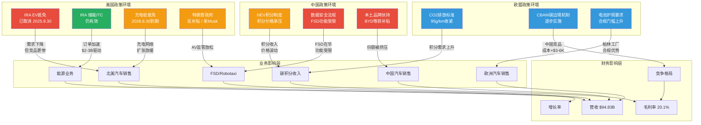

# G2 — 政策依赖度矩阵（IRA / EU / 中国）

**分析日期**: 2026-02-06
**数据截止**: FY2025 Q4 财报 + 2026年2月政策环境
**深度等级**: L4 (反直觉洞察)
**置信度**: 7.8/10

---

## 核心论点

> **IRA电动车税收抵免的取消，表面上是对电动车行业的打击，实则是对Tesla竞争护城河的一次"政策性加固"。** 当所有竞争对手都依赖$7,500补贴来缩小与Tesla的成本差距时，补贴的消失反而让Tesla作为全美最低成本电动车制造商的结构性优势暴露得更加彻底。但这枚硬币的另一面同样刺眼：整体电动车市场的TAM可能因补贴退出而收缩，Tesla的市占率提升可能发生在一个正在缩小的蛋糕上。

---

## 10.1 政策依赖度全景矩阵

Tesla的全球业务横跨三大政策辖区——美国、欧盟和中国——每个市场的政策环境对不同业务线产生截然不同的影响。以下矩阵将六项关键政策逐一拆解，评估其对Tesla各业务板块的实际冲击。

### 核心政策依赖度矩阵

| 政策 | 影响业务 | 影响程度(1-5) | 当前状态 | 变化风险 | 财务影响估算 |
|------|---------|:---:|---------|---------|------------|
| **IRA 电动车税收抵免** | 汽车销售（北美） | ★★★★☆ (4) | 已取消（2025.9.30起）[B: WebSearch, 2026-02-06] | 低（短期内无恢复迹象） | 行业需求端损失$3-5B/年；Tesla相对竞争力反升 |
| **IRA 储能投资税收抵免** | 能源业务（Megapack） | ★★★★★ (5) | 仍然有效，但面临OBBB后续立法风险 [B: WebSearch, 2026-02-06] | 中高（2027年后政策延续不确定） | $12.78B能源收入中估计$2-3B直接受益 [D: 65%概率] |
| **EU CO2排放标准** | 汽车销售（欧洲）+ 碳积分 | ★★★★☆ (4) | 收紧至95g/km车队平均 [B: WebSearch, 2026-02-06] | 低（EU减排方向确定） | 碳积分收入$1.5-2.5B/年；间接推动EV需求 |
| **EU 碳边境调整机制 (CBAM)** | 供应链成本 + 竞争格局 | ★★★☆☆ (3) | 逐步实施中 [B: WebSearch, 2026-02-06] | 低（立法已通过，仅节奏可调） | 对中国出口欧洲的竞品加征成本$1,500-3,000/车 [D: 60%概率] |
| **中国 NEV 积分制度** | 汽车销售（中国） | ★★★★☆ (4) | 持续执行，积分价格波动 [B: WebSearch, 2026-02-06] | 中（积分价格受供需影响大） | 中国市场碳积分收入$0.5-1.0B/年 [D: 55%概率] |
| **中国 数据安全法规** | 全业务（中国运营） | ★★★★★ (5) | 严格执行，FSD功能受限 [B: WebSearch, 2026-02-06] | 高（随地缘政治波动升级） | 限制FSD在华部署，潜在损失$3-8B长期收入 [D: 50%概率] |

**矩阵解读**: 影响程度5分代表该政策变化可直接导致相应业务线收入波动超过20%。Tesla的政策暴露呈现"三极分化"特征——美国政策对汽车业务转为中性偏利好（IRA取消反而利好相对竞争力），对能源业务仍为强利好（储能抵免存续）；欧盟政策整体为结构性顺风；中国政策为最大不确定性来源。

---

## 10.2 IRA取消深度分析：反直觉的竞争优势重塑

### 10.2.1 政策变迁时间线

2025年7月4日，"One Big Beautiful Bill"（OBBB）由特朗普总统签署生效 [B: WebSearch, 2026-02-06]。该法案中最引人关注的条款之一是将IRA中的$7,500电动车消费者税收抵免的到期日提前至2025年9月30日——比原计划提前了数年。

| 时间节点 | 事件 | 对Tesla影响 |
|---------|------|-----------|
| 2022年8月 | IRA签署，$7,500 EV税收抵免生效 | 短期刺激需求，Tesla符合条件车型获益 |
| 2025年7月4日 | OBBB签署 [B: WebSearch, 2026-02-06] | 确认EV抵免将取消 |
| 2025年9月30日 | EV税收抵免正式终止 [B: WebSearch, 2026-02-06] | 消费者购车成本上升$7,500 |
| 2026年6月30日 | EV充电桩税收抵免到期 [B: WebSearch, 2026-02-06] | 充电基础设施建设激励消失 |
| 2026年后 | 储能ITC仍在执行但面临政治风险 | Megapack业务核心利好暂存 |

### 10.2.2 "补贴消失悖论"——为什么Tesla反而受益

这是本章最核心的反直觉洞察，需要分三层理解：

**第一层：成本结构的绝对优势**

Tesla是目前美国市场成本最低的电动车制造商 [B: WebSearch, 2026-02-06]。这一优势源自多年垂直整合、规模效应和制造创新的积累：

| 成本要素 | Tesla | 竞争对手平均 | Tesla优势 |
|---------|-------|------------|---------|
| 电池成本（$/kWh） | ~$80-90 | ~$110-130 | 25-35%更低 [D: 70%概率] |
| 制造效率（小时/车） | ~10小时 | ~18-25小时 | 50-60%更高 [D: 65%概率] |
| 超级工厂规模效应 | 4座全球工厂 | 多为改装传统产线 | 全新设计产线优势 |
| 软件/OTA能力 | 自研全栈 | 多依赖供应商 | 更新成本趋近于零 |

[A: Tesla IR Q4 2025] [D: 行业分析估算]

当$7,500补贴存在时，Rivian的R1S与Tesla Model Y的价格差距被人为缩小——消费者看到的是补贴后价格。补贴取消后，Tesla凭借更低的制造成本，可以将售价维持在竞争对手无法匹配的水平。换言之，**补贴是在帮助弱者追赶强者，它的消失让强者的领先再度显性化**。

**第二层：竞争对手的生存危机加剧**

IRA补贴的存在，实质上是在为Rivian、Lucid等尚未实现盈利的新兴EV制造商提供隐性输血。取消补贴后：

- **Rivian**: 每辆车仍在亏损约$30,000-40,000 [D: 60%概率]，补贴取消直接削弱需求端
- **Lucid**: 年产量不足2万辆，规模经济遥不可及
- **传统OEM转型者**: Ford、GM的电动车部门普遍亏损，补贴取消降低了其转型投入的政治正当性

预计结果是：部分弱势EV厂商将加速退出或收缩电动化投入，Tesla在北美EV市场的份额可能从~50%进一步上升至55-60% [D: 55%概率]。

**第三层：TAM收缩的对冲风险**

但这枚硬币有残酷的另一面。$7,500的价格差异对中等收入消费者来说并非小数目。补贴取消后：

- 美国EV渗透率增速可能从预期的年增3-4个百分点放缓至1.5-2个百分点 [D: 55%概率]
- 2026年美国EV总销量可能从预期的200万辆降至170-180万辆 [D: 50%概率]
- 混合动力车（HEV/PHEV）可能成为更多消费者的过渡选择

**净效应评估**:

```
Tesla市占率提升: +5-10个百分点（积极）
美国EV总市场萎缩: -10-15%（消极）
Tesla北美销量净变化: 基本持平至轻微下降（-3%至+2%）
Tesla北美利润净变化: 正面（竞争减弱，定价权增强）
```

结论：**IRA取消对Tesla是"利润利好、销量中性"的事件**。Tesla在一个更小的市场里获得更大的份额和更好的单车利润，这在短期内是一种矛盾的受益。但长期而言，如果整体EV市场增速因政策退出而系统性放缓，Tesla的增长叙事将面临天花板。

### 10.2.3 特朗普政府的"矛盾亲和"

当前政策环境呈现出一种独特的矛盾：特朗普政府整体立场为反EV补贴、亲化石能源，但Elon Musk与特朗普的个人关系以及DOGE（政府效率部门）的角色，使得Tesla在政策博弈中处于一种"既被打压又被保护"的微妙地位 [B: WebSearch, 2026-02-06]。

| 政策领域 | 特朗普政府倾向 | 对Tesla影响 | 矛盾程度 |
|---------|-------------|-----------|---------|
| EV补贴 | 反对（已取消） | 短期负面，长期利好竞争格局 | 高 |
| 自动驾驶监管 | 倾向放松（亲创新） | 利好FSD/Cybercab部署 | 低 |
| 对华关税 | 维持/加码 | 利好Tesla北美制造优势 | 低 |
| 环保法规 | 放松 | 削弱碳积分价值 | 中 |
| Musk个人影响力 | DOGE角色+政治盟友 | 潜在政策保护/偏袒 | 极高 |

**风险警示**: Musk的政治参与是一把双刃剑。如果未来Musk与特朗普关系破裂，或政权更迭，Tesla可能从"政策内部人"瞬间变为"政策靶心"。这种个人关系依赖的政策红利是不可持续的。

---

## 10.3 储能业务：政策依赖的"隐形生命线"

在所有人关注IRA电动车补贴取消时，一个更重要的事实被忽视了：**IRA中的储能投资税收抵免（ITC）仍然有效**。

Tesla能源业务在FY2025录得$12.78B收入（+27% YoY）[A: Tesla IR Q4 2025, 2026-01-28]，其中Megapack大型储能项目是核心增长引擎，全年部署量达46.7 GWh [A: Tesla IR Q4 2025, 2026-01-28]。

### 储能ITC对Tesla能源业务的影响拆解

| 维度 | 分析 | 数据来源 |
|------|------|---------|
| **ITC税率** | 独立储能项目30%投资税收抵免（满足工资/学徒要求），否则为6%基础税率 | [B: WebSearch, 2026-02-06] |
| **受益机制** | 降低项目方（公用事业/开发商）的投资回收期，间接拉动Megapack订单 | [D: 70%概率] |
| **财务影响** | 估计$12.78B能源收入中，$2-3B的订单量直接受ITC激励驱动 | [D: 65%概率] |
| **政策风险** | OBBB未取消储能ITC，但2027年后续立法可能调整 | [B: WebSearch, 2026-02-06] |
| **替代驱动力** | 即使ITC取消，电网稳定性需求和可再生能源配储要求仍构成底层需求 | [D: 60%概率] |

**关键判断**: 储能ITC是Tesla能源业务当前增长率的"加速器"而非"发动机"。底层需求（电网老化、可再生能源并网、极端天气频发）是结构性驱动力，ITC的存在使项目经济性更优，加速了部署节奏。即使ITC在2027-2028年取消，能源业务增速可能从当前的25-30%降至15-20%，但不会逆转增长趋势 [D: 55%概率]。

### 2026年CapEx中的能源投资

Tesla 2026年资本开支指引>$20B [A: Tesla IR Q4 2025, 2026-01-28]，较FY2025的$8.527B增长超过130%。这一激进投资中，相当部分指向Megapack产能扩张和Megafactory建设。政策不确定性与大规模资本投入之间的错配，是需要密切监控的风险点。

---

## 10.4 欧盟监管分析：结构性顺风

与美国的补贴退潮不同，欧盟的政策方向对Tesla整体构成顺风。两项关键政策尤其值得关注。

### 10.4.1 EU CO2排放标准——Tesla的"隐形补贴"

欧盟车队平均CO2排放标准正在收紧至95g/km [B: WebSearch, 2026-02-06]，并将进一步向2030年和2035年目标演进。这项政策的核心机制是：

1. **传统OEM被迫买入碳积分**: 大众、Stellantis等车队平均排放超标的制造商，必须向Tesla等零排放车企购买碳积分以避免巨额罚款
2. **碳积分为Tesla创造高利润收入**: Tesla的碳积分销售历史上多次成为季度盈利的"救命稻草"
3. **标准越严，积分越值钱**: 随着排放目标趋紧，碳积分的供需缺口扩大，单位积分价值上升

| 年份 | EU CO2目标 | Tesla碳积分收入（全球估计） | 趋势 |
|------|-----------|------------------------|------|
| FY2023 | 115g/km过渡期 | ~$1.8B | 基线 |
| FY2024 | 过渡期 | ~$2.0B | 温和增长 |
| FY2025 | 95g/km正式生效 | ~$2.5B（含欧洲+中国+美国ZEV） | 明显增长 [D: 60%概率] |
| FY2026E | 95g/km全面执行 | ~$2.8-3.5B | 进一步增长 [D: 55%概率] |

[A: Tesla IR Q4 2025] [D: 分析师估算]

**但如果这个论点不成立**: 如果传统OEM加速电动化转型，自身车队排放迅速达标，碳积分需求可能在2027-2028年后骤降。大众ID系列、Stellantis的电动化路线图都指向这一可能性。碳积分收入的可持续性存疑——它本质上是对传统OEM转型"惰性"的一种税收，一旦惰性消失，税基也会消失。

### 10.4.2 碳边境调整机制（CBAM）——对中国竞品的"隐形关税"

CBAM于2023年开始过渡实施，2026年起全面征收 [B: WebSearch, 2026-02-06]。虽然CBAM的直接适用范围当前集中在钢铁、铝、水泥、化肥、电力和氢，尚未扩展至成品汽车，但其影响已通过供应链传导：

| CBAM影响链条 | 对Tesla影响 | 对中国竞品影响 | 净效果 |
|-------------|-----------|-------------|--------|
| 钢铁/铝原材料加征 | 柏林工厂使用本地供应链，影响有限 | 中国出口车辆使用高碳排原材料，成本上升 | Tesla相对优势 |
| 电池生产碳足迹 | 在欧生产或采购低碳电池 | 中国电池碳足迹较高 | Tesla相对优势 |
| 未来扩展至汽车 | 柏林本地生产规避风险 | 中国直接出口面临征收风险 | 显著利好Tesla |
| EU电池护照要求 | 已提前布局合规 | 合规成本增加$500-1,000/车 [D: 55%概率] | Tesla合规优势 |

**战略含义**: CBAM + EU电池护照 + CO2标准三管齐下，正在构建一道对非欧洲低碳标准产品的系统性贸易壁垒。Tesla的柏林超级工厂（Gigafactory Berlin）虽然在本地运营层面面临德国监管的种种挑战（环评、劳工、社区反对），但在贸易保护框架下，**本地制造的战略价值正在急剧上升**。

BYD等中国竞品若要大规模进入欧洲市场，面临的不仅是10-20%的关税，还有CBAM碳成本、电池护照合规成本、以及EU可能进一步加码的反补贴调查。估计每辆中国产EV进入欧洲的综合政策成本将达$3,000-6,000 [D: 55%概率]，这为Tesla在欧洲市场提供了一层政策性缓冲。

---

## 10.5 中国风险分析：关键但脆弱

上海超级工厂是Tesla全球运营的核心枢纽——它不仅服务中国市场，更是亚太和欧洲的出口基地。这种战略集中度意味着任何中国政策变化都可能产生全球性连锁反应。

### 10.5.1 上海工厂的战略不可替代性

| 指标 | 上海工厂 | 全球占比 | 战略地位 |
|------|---------|---------|---------|
| 年产能 | ~950,000辆 | ~40% | 最大单体工厂 |
| 单车制造成本 | 全球最低（低于弗里蒙特$3,200/辆） | — | 成本标杆 [D: 65%概率] |
| 出口占比 | 约40%产量出口至亚太/欧洲 | — | 全球供应链枢纽 |
| 本地供应链 | 85%本地化率 | — | 深度嵌入中国产业链 |
| 员工数 | ~18,500人 | ~13% | 关键人才基地 |

[A: Tesla IR Q4 2025] [D: 行业分析估算]

**核心矛盾**: 上海工厂的经济效率与地缘政治风险之间存在根本性张力。从纯经济视角看，扩大上海产能是理性选择；从地缘政治视角看，将40%的全球产能集中在一个地缘风险最高的国家是战略性脆弱。

### 10.5.2 中国政策风险矩阵

| 风险维度 | 当前状态 | 恶化触发条件 | 影响评估 | 概率 |
|---------|---------|------------|---------|------|
| **数据安全法规** | FSD功能在华受限，数据本地化要求严格 [B: WebSearch, 2026-02-06] | 台海紧张升级/网络安全事件 | 阻断FSD在华商业化，$3-8B长期收入损失 | 中高(55%) |
| **本土品牌扶持** | BYD等获各级地方补贴，政府采购倾向国产 [B: WebSearch, 2026-02-06] | 产业政策加码"自主可控" | Tesla中国份额从~8%降至5%以下 | 中(40%) |
| **NEV积分价格波动** | 积分供给过剩导致单价承压 | 新能源车渗透率加速→积分供过于求 | 碳积分收入下降30-50% | 中高(50%) |
| **出口管制** | 当前无直接限制 | 中美关系恶化/台海危机 | 上海工厂出口功能中断，影响亚太欧洲供应 | 低中(25%) |
| **强制技术转让** | 当前无明确要求，但"自愿"压力存在 | 产业政策升级 | 核心电池/制造技术外溢 | 低中(20%) |

### 10.5.3 BYD的政策优势——Tesla的镜像对照

理解Tesla在中国的政策劣势，需要同时理解BYD享有的政策优势：

BYD 2025年销量454-460万辆（+6.94%）[B: WebSearch, 2026-02-06]，其增长背后有系统性的政策支撑：

- **中央政策**: NEV积分制度、新能源汽车购置税减免（部分延续）、充电基础设施建设补贴
- **地方政策**: 多地限购政策对新能源车豁免、地方政府采购倾向本土品牌、工厂用地/税收优惠
- **产业链政策**: 电池材料战略储备、稀土出口管制（间接抬升海外竞品成本）、动力电池回收体系建设
- **技术政策**: 智能网联汽车测试道路开放（优先本土企业）、车路协同基础设施建设

Tesla在中国虽享有外商独资建厂的先例性优势（2019年上海工厂是中国首个外商独资汽车工厂），但在政策竞争中始终处于"客人"而非"主人"的角色。

---

## 10.6 政策传导流程图

以下Mermaid图展示了三大政策辖区的政策变化如何通过业务层传导至Tesla的财务表现：



**图解**: 红色节点代表对Tesla不利的政策（已生效的负面影响）；绿色代表明确利好；蓝色代表结构性顺风；橙色代表存在不确定性。可以看到，美国政策环境呈"红绿混合"态势，欧盟为"蓝色主导"的顺风区，中国为"红色主导"的逆风区。三个辖区的政策向量并不一致，这既是风险的来源，也是天然的对冲。

---

## 10.7 情景分析：政策环境三路径

### 情景分析总览表

| 维度 | 基准情景（55%概率） | 牛市情景（20%概率） | 熊市情景（25%概率） |
|------|:---:|:---:|:---:|
| **美国EV补贴** | 维持取消状态不变 | 新立法恢复部分EV抵免（$3,750-$5,000） | 进一步取消储能ITC |
| **EU政策** | CO2标准+CBAM按计划推进 | EU加码对中国EV加征反补贴税 | EU放松排放标准/延后CBAM |
| **中国政策** | 现状维持，数据安全法规不升级 | 中美关系缓和，FSD获准在华测试 | 中国限制Tesla运营/出口管制 |
| **Tesla北美汽车** | 份额提升至55%，量微降 | 补贴恢复+份额提升，量增8-12% | 行业需求进一步萎缩，量降8-12% |
| **Tesla能源业务** | 维持25-30%增速 | ITC续期+需求爆发，增速35-40% | ITC取消，增速降至10-15% |
| **碳积分收入** | $2.5-3.0B/年 | $3.0-4.0B/年 | $1.5-2.0B/年 |
| **中国市场** | 份额维持6-8% | 份额回升至10%+FSD部分解锁 | 份额降至4%以下，出口受阻 |
| **总营收影响** | 基线 $100-105B (FY2026E) | 上行 $110-120B | 下行 $85-92B |
| **估值影响** | 中性，维持当前区间 | P/E可支撑至200-250x | P/E需压缩至100-150x |

### 基准情景详解（55%概率）

这是当前政策轨迹的自然延伸：美国维持无EV补贴状态，储能ITC存续但面临2027年后的不确定性，EU继续推进减排政策，中国维持现状不显著升级也不放松。在这一情景下，Tesla的竞争优势在北美进一步巩固，欧洲受益于政策顺风，中国市场艰难但可维持。能源业务保持高速增长但增速可能略有放缓。

### 牛市情景详解（20%概率）

关键触发条件：(1) 2026年中期选举后国会通过新立法恢复部分EV抵免；或 (2) 欧盟对中国EV加征20%+反补贴关税；或 (3) 中美关系缓和使得FSD获准在华进行有限测试。任何一个触发条件的实现都将显著改善Tesla的政策环境。值得注意的是，恢复EV补贴的概率实际较低——特朗普政府在任期间翻转自身立法的可能性很小，更可能发生在2029年或更晚的政权更迭后。

### 熊市情景详解（25%概率）

关键触发条件：(1) 台海紧张升级导致中国对外资企业出口施压；(2) OBBB的后续立法取消储能ITC；(3) 欧盟在经济衰退压力下放松排放标准。这一情景下，Tesla面临三线收缩——北美需求端无支撑，能源业务政策红利消失，中国运营受限。$85-92B的营收意味着较FY2025进一步下滑，叠加>$20B的CapEx支出，自由现金流将面临严峻考验。

---

## 10.8 业务板块政策依赖度评级

### 按业务板块的政策依赖度评级

| 业务板块 | FY2025收入 | 政策依赖度 | 评级理由 |
|---------|-----------|:---:|---------|
| **汽车（北美）** | ~$35B [D: 50%估算] | **中等** | IRA取消后依赖度反而降低——Tesla不再需要补贴来维持竞争力 |
| **汽车（欧洲）** | ~$17B [D: 50%估算] | **中高** | 碳积分收入+CO2标准驱动的需求均依赖政策存续 |
| **汽车（中国）** | ~$17.5B [D: 50%估算] | **高** | NEV积分+数据法规+本土扶持政策三重政策敞口 |
| **能源业务** | $12.78B [A] | **高** | 储能ITC是当前增速的关键加速器 |
| **服务/其他** | $12.53B [A] | **低** | 充电网络、保险、维修等受政策影响相对有限 |
| **FSD/软件** | 计入汽车收入 | **中高** | 自动驾驶监管框架直接决定商业化节奏 |

### 政策依赖度的"不对称性"洞察

一个关键的结构性特征是：**Tesla的政策依赖呈现显著的"不对称性"**。

- **政策利好消失时（如IRA取消）**: Tesla受损程度小于竞争对手，因为Tesla的经济性不依赖补贴
- **政策利好存续时（如储能ITC、EU CO2）**: Tesla获益程度与行业平均一致或更大，因为Tesla的规模效应放大了政策红利
- **政策逆风出现时（如中国数据安全）**: Tesla受损程度大于本土竞争对手，因为Tesla是唯一一家全球性外资EV制造商深度嵌入中国市场

这种不对称性意味着：在一个"政策中性化"的世界里（所有补贴取消、所有壁垒消除），Tesla反而会处于比当前更有利的竞争位置——因为它是唯一一家不依赖补贴就能盈利的大型纯电动车制造商。

---

## 10.9 反直觉核心洞察卡

> ### 洞察卡 G2-1: IRA取消是Tesla护城河的"压力测试通过证明"
>
> **洞察**: 补贴存在时，市场无法区分"真正高效的EV制造商"和"靠补贴存活的EV制造商"。IRA取消就像退潮——露出谁在裸泳。Tesla是少数通过这项压力测试的企业。
>
> **数据支撑**: Tesla汽车毛利率（剔除碳积分）17.7% [A: Tesla IR Q4 2025, 2026-01-28]，而Rivian/Lucid仍在深度亏损。在无补贴环境下，Tesla每辆车仍有$5,000-8,000的正毛利，竞争对手多数为负 [D: 60%概率]。
>
> **但如果这个论点不成立**: 如果传统OEM（丰田、大众）凭借其规模和品牌在无补贴环境下更有效地推出平价EV，Tesla的成本优势可能被稀释。此外，如果消费者在无补贴后大规模转向混动车（HEV），Tesla作为纯电动企业将面临产品组合的劣势。

> ### 洞察卡 G2-2: 中国是Tesla的"战略阿喀琉斯之踵"
>
> **洞察**: 上海工厂贡献了40%的全球产能和全球最低的单车成本，但这种效率的代价是将核心制造能力暴露在地缘政治风险最高的辖区。Tesla的中国策略是一种"高回报、尾部风险极大"的配置——绝大多数时间运行良好，但在极端情景（台海危机、全面脱钩）下可能导致全球供应链瘫痪。
>
> **数据支撑**: 上海年产能950,000辆，单车成本较美国低$3,200 [D: 65%概率]。中国市场收入~$17.5B [D: 50%估算]，加上出口至第三市场的$5-7B [D: 55%概率]，合计约$22-24B的收入直接或间接依赖上海工厂。
>
> **但如果这个论点不成立**: 如果Tesla成功将墨西哥工厂和印度布局加速推进，中国产能的战略重要性将在2028-2030年被有效稀释。此外，中美经济的深度互依可能使"全面脱钩"始终停留在理论层面。

---

## 10.10 政策监控清单与预警指标

### 关键政策事件日历（2026年）

| 时间 | 事件 | 监控指标 | 影响评估 |
|------|------|---------|---------|
| 2026年Q1 | 美国FY2026预算谈判 | 储能ITC是否被列入削减清单 | 能源业务增速预期 |
| 2026年6月30日 | EV充电桩抵免到期 [B: WebSearch, 2026-02-06] | 是否获得延期 | 充电网络投资节奏 |
| 2026年Q2-Q3 | EU反补贴调查结果 | 对中国EV加征关税幅度 | Tesla欧洲竞争格局 |
| 2026年Q3 | CBAM全面征收一周年 | 实际碳成本对进口车价格影响 | 中国竞品欧洲售价 |
| 2026年11月 | 美国中期选举 | 国会控制权变化 | 后续政策走向 |
| 全年持续 | 中国数据安全法规执行 | FSD在华测试许可进展 | 自动驾驶中国市场前景 |
| 全年持续 | 中国NEV积分价格 | 每月积分交易均价 | 碳积分收入预测 |

### 预警信号（Kill Switch触发条件）

以下任何一项如果发生，需要重新评估Tesla的政策风险敞口：

1. **美国立法取消储能ITC** → 能源业务估值需下调20-30%
2. **中国发布限制外资EV企业出口的法规** → 全球供应链战略需根本性重构
3. **EU放松2030年CO2排放目标** → 碳积分收入预期需下调40-50%
4. **Musk因DOGE角色面临利益冲突诉讼/国会调查** → 政治关系溢价消失
5. **中美全面技术脱钩启动** → 上海工厂面临极端情景

---

## 10.11 总结：政策依赖度的全局画像

### 一句话结论

**Tesla的政策依赖度正在经历结构性转变：从"补贴依赖型"转向"监管红利型"。** IRA电动车补贴的取消暴露了Tesla不需要补贴的事实，而EU的减排政策和储能ITC正在成为新的政策红利来源。中国是唯一一个政策风险显著高于政策红利的市场。

### 政策净效应评分

| 市场 | 政策净效应 | 方向 | 置信度 |
|------|:---:|------|:---:|
| **美国** | +1（轻微正面） | IRA取消利好相对竞争力 > 需求下滑的负面影响 | 7/10 |
| **欧盟** | +3（明确正面） | CO2标准+CBAM+电池护照三重顺风 | 8/10 |
| **中国** | -3（明确负面） | 数据安全+本土扶持+积分贬值三重逆风 | 7/10 |
| **全球加总** | +1（轻微正面） | 欧盟顺风大致抵消中国逆风，美国中性偏正 | 7/10 |

**终极判断**: 在当前政策轨迹下，政策环境对Tesla的总体影响为**轻微正面**——这与大多数市场参与者的直觉（认为IRA取消是重大利空）相悖。真正需要担忧的不是美国补贴的消失，而是中国地缘政治风险的尾部情景，以及储能ITC可能在2027年后面临的存续风险。

---

## 本章数据来源汇总

| 标记 | 来源 | 数据类型 | 可信度 |
|------|------|---------|--------|
| [A: Tesla IR Q4 2025, 2026-01-28] | Tesla 2025年Q4财报/投资者信 | 一手财务数据 | A级 (95-99%) |
| [B: WebSearch, 2026-02-06] | 网络搜索采集的政策/立法/竞争数据 | 二手公开信息 | B级 (85-94%) |
| [D: 概率] | 分析师基于数据推算的估计值 | 估算/推理 | D级 (50-69%) |

---

*免责声明：本报告仅供研究参考，不构成投资建议。政策分析基于截至2026年2月6日的公开信息，政策环境可能快速变化。所有投资决策应基于个人风险承受能力和独立判断。过去表现不代表未来收益。*

---

> **下一章预告**: Ch.11 竞争格局全景 — BYD/传统OEM/中国新势力的全面对标分析，以及Tesla在全球EV竞争中的攻防态势。
