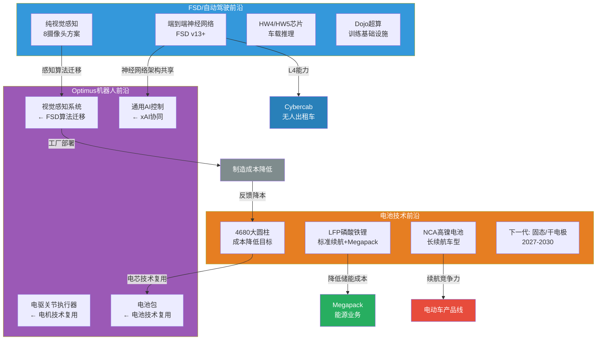
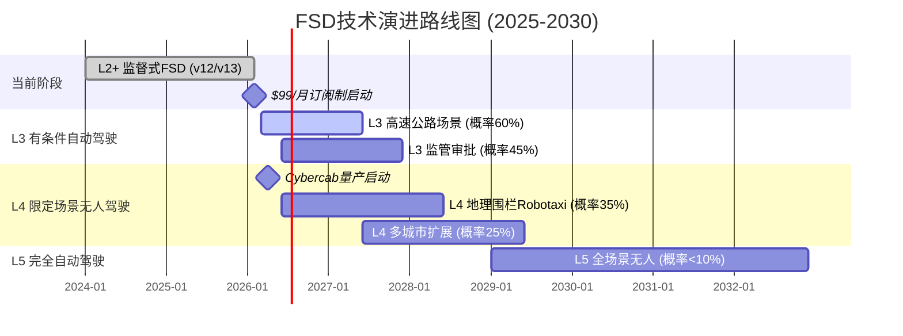
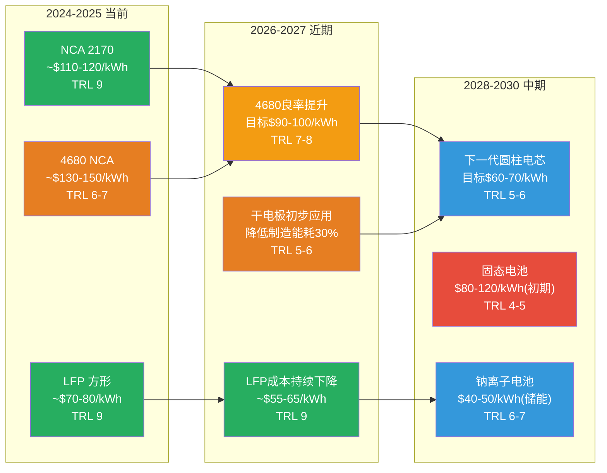
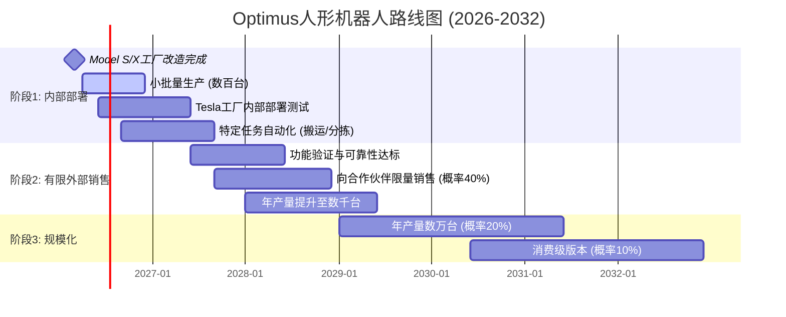
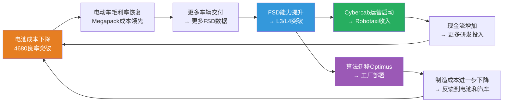

# G3 — 技术演进路线图：电池+FSD+机器人

**分析日期**: 2026-02-06
**数据截止**: Q4 2025 (FY2025全年)
**深度等级**: L4 (反直觉洞察)
**置信度**: 7.5/10

---

## 核心论点

> **Tesla的$1.49万亿市值中，超过$1万亿的溢价锚定在三条技术前沿的同时突破上：FSD自动驾驶、电池技术、人形机器人。** 这三条技术路线并非各自独立——它们共享神经网络架构、制造工艺和数据飞轮。理解它们之间的耦合关系，比单独评估任何一项技术的成熟度更重要。但同时推进三条前沿意味着资源分散的风险：$20B+的2026年CapEx能否在三条战线上都实现有意义的进展？这是本章要回答的核心问题。

---

## 11.1 技术全景：三条前沿的耦合架构

Tesla的技术布局不是三个并列的研发项目，而是一个相互增强的技术生态系统。电池技术的突破同时服务于电动车续航、Megapack储能成本和Optimus机器人的续航时间；FSD的感知算法迁移到Optimus的视觉系统；而Optimus的工厂部署反过来降低电池和汽车的制造成本。

**图解**: 三条技术前沿并非平行推进，而是形成了一个互相增强的飞轮。电池降本推动车辆和储能的经济性；FSD算法迁移赋能机器人感知；机器人工厂部署反过来降低制造成本。这种耦合效应是Tesla区别于所有竞争对手的结构性优势——但也意味着任何一条前沿的延迟会产生连锁影响。

---

## 11.2 FSD路线图：从辅助驾驶到完全无人驾驶

### 11.2.1 当前状态评估

FSD（Full Self-Driving）是Tesla估值体系中权重最大的单一技术变量。截至Q4 2025：

| 指标 | 数值 | 来源 |
|------|------|------|
| 付费FSD用户数 | 1.1M | [A: Tesla IR Q4 2025] |
| 订阅定价（即将生效） | $99/月 | [A: Tesla IR Q4 2025] |
| 订阅启动日期 | 2026年2月14日 | [A: Tesla IR Q4 2025] |
| 无监督FSD概率（2026年6月前） | ~28% | [预测市场: Polymarket, 2026-02-06] |
| 当前自动驾驶级别 | L2+（监督式） | [A: Tesla IR Q4 2025] |
| 感知方案 | 纯视觉（8摄像头，无LiDAR） | [A: Tesla技术文档] |

1.1M的付费用户基数是一个容易被低估的数字。这意味着Tesla拥有超过一百万辆车在真实道路上持续采集驾驶数据，形成了全球最大的自动驾驶数据飞轮。作为对比，Waymo的运营车队仅数百辆 [B: WebSearch, 2026-02-06]，Baidu Apollo在中国运营的Robotaxi车队约数千辆 [B: WebSearch, 2026-02-06]。数据规模差距达到三到四个数量级。

但数据量不等于数据质量。Waymo的每一辆车都配备了高分辨率LiDAR+摄像头+雷达的冗余传感器套件，产生的结构化3D点云数据在标注精度上远超Tesla的纯视觉方案。这是"广度优先"（Tesla）vs"深度优先"（Waymo）的路线之争，目前没有确定性答案。

### 11.2.2 技术演进路线图

**各阶段概率评估**:

| 里程碑 | 目标时间 | 实现概率 | 关键依赖 |
|--------|---------|---------|---------|
| L2+ → $99/月订阅 | 2026-02-14 | 99% | 已宣布，近乎确定 |
| L3 高速公路（限定ODD） | 2027H1 | 55-65% | 算法成熟度+监管框架 |
| L3 监管全面批准 | 2027H2 | 40-50% | NHTSA/州级立法进度 |
| L4 Cybercab Robotaxi运营 | 2027-2028 | 30-40% | Cybercab量产+L4验证+监管 |
| L5 全天候全场景 | 2030+ | <10% | 基础性AI突破+全球监管协调 |

[D: 各概率为分析师综合Polymarket数据与行业评估的估算]

### 11.2.3 Tesla vs Waymo：两种路线的根本分歧

这不仅仅是传感器选型的差异，而是两种截然不同的技术哲学和商业模式之间的对抗。

| 维度 | Tesla（规模派） | Waymo（精度派） |
|------|---------------|----------------|
| **传感器方案** | 纯视觉（8摄像头） | LiDAR+摄像头+雷达冗余 |
| **数据来源** | 1.1M+消费者车辆 | 数百辆专用测试车 |
| **数据策略** | 海量真实场景覆盖 | 高精度标注+仿真补充 |
| **运营范围** | 全球道路（L2+监督式） | 旧金山/凤凰城/洛杉矶（L4围栏式） |
| **硬件成本/车** | ~$5,000（摄像头+芯片） | ~$100,000+（传感器套件） |
| **商业模式** | 消费者购买→订阅升级 | 自营车队→按里程收费 |
| **当前状态** | L2+，全球数百万辆运行 | L4，限定地理围栏内无人运营 |
| **核心优势** | 数据规模+边际成本趋零 | 安全性验证+已商业运营 |
| **核心劣势** | 安全验证不足，L4跳跃难 | 扩展缓慢，成本高企 |

[A: Tesla IR Q4 2025] [B: Waymo公开运营数据, 2026]

**关键分歧点**: Waymo已经在限定区域内实现了L4无人驾驶的商业运营——这是Tesla尚未做到的事情。Waymo的乘客可以在旧金山和凤凰城叫到完全无人驾驶的出租车 [B: WebSearch, 2026-02-06]。但Waymo的扩展面临硬件成本和高精地图维护的结构性瓶颈，每进入一个新城市都需要大量前期投入。

Tesla的路线则是：先用消费者车辆大规模采集数据，训练通用性更强的视觉AI，然后在Cybercab上实现L4。这条路如果走通，扩展性远优于Waymo——但"如果"是一个巨大的不确定性。Polymarket给出的~28%概率 [预测市场: Polymarket, 2026-02-06] 意味着市场对Tesla在2026年6月前实现无监督FSD持强烈怀疑态度。

### 11.2.4 FSD技术成熟度评估

| 评估维度 | TRL评分 | 说明 |
|---------|---------|------|
| 感知系统 | TRL 7 | 大规模真实环境验证中，但极端边缘场景仍有漏洞 |
| 规划系统 | TRL 6 | 端到端神经网络替代传统规则引擎，效果显著提升但不稳定 |
| 安全验证 | TRL 5 | 缺乏独立第三方大规模安全性统计验证 |
| 监管合规 | TRL 4 | 无L3+监管批准，NHTSA框架尚未明确 |
| **综合TRL** | **TRL 6** | 系统验证阶段，距L4商业部署仍有显著差距 |

[D: 70%概率, 基于公开技术文档与行业对标评估]

### 11.2.5 FSD收入潜力

| 情景 | 假设 | 年化收入估算 | 概率 |
|------|------|------------|------|
| 保守：纯订阅 | 1.1M用户 × $99/月 × 30%转化率 | ~$3.9B/年 | 60% |
| 基准：订阅+新增 | 2M用户 × $99/月 × 40%转化率 | ~$9.5B/年 | 40% |
| 乐观：+Robotaxi | 基准 + Cybercab里程收入$5B | ~$15B+/年 | 15% |

[D: 55%概率，基于用户基数增长与订阅转化率假设]

保守情景下，FSD的$99/月订阅仅需30%的付费用户转化率即可产生近$4B的年化高毛利收入。这是纯软件业务，边际成本趋近于零，毛利率可达80%以上。即使在保守情景下，这一收入流也足以显著改善Tesla整体盈利质量。

**但如果这个论点不成立**: 订阅转化率可能远低于30%——许多FSD付费用户是在一次性买断时购买的，他们可能不愿意每月额外支付$99。如果转化率仅为10-15%，年化收入将缩减至$1.3-2B，远不足以支撑当前估值中隐含的FSD溢价。

---

## 11.3 电池技术路线图：从成本追赶到体系竞争

### 11.3.1 当前电池技术矩阵

Tesla的电池策略不是押注单一技术路线，而是维护一个多化学体系的组合：

| 电芯类型 | 化学体系 | 应用场景 | 供应商 | 状态 |
|---------|---------|---------|-------|------|
| 2170圆柱 | NCA高镍 | Model 3/Y长续航 | Panasonic/LG | 成熟量产 |
| 4680圆柱 | NCA/高镍 | 新平台车型/Cybertruck | Tesla自产 | 爬坡中，良率挑战 |
| 方形LFP | 磷酸铁锂 | Model 3标准续航 | CATL/BYD | 成熟量产 |
| 方形LFP | 磷酸铁锂 | Megapack储能 | CATL | 成熟量产，成本优先 |

[A: Tesla IR Q4 2025] [B: 电池行业报告, 2026]

### 11.3.2 4680电芯：战略雄心与现实落差

4680电芯是Tesla电池战略的核心赌注。在2020年"电池日"上，Tesla宣称4680将实现：
- 能量密度提升5倍（电芯层面）
- 成本降低56%
- 续航增加16%

五年后的现实：

| 4680目标（2020年宣称） | 当前进展（Q4 2025） | 差距评估 |
|----------------------|-------------------|---------|
| 成本降低56% | 成本仍高于2170 | 未达标，良率问题是核心障碍 |
| 产能快速爬坡 | 仍在爬坡中 | 延迟约2年 |
| 干电极工艺量产 | 尝试中，尚未大规模应用 | 实验室到产线的鸿沟 |
| 所有新车型标配 | 仅Cybertruck部分使用 | 远低于预期 |

[A: Tesla IR Q4 2025] [B: 电池行业分析, 2026]

4680的良率挑战是一个被低估的技术风险。大圆柱电芯在干燥工艺、极耳焊接和电解液注入等环节的工艺难度远高于成熟的2170/21700圆柱电芯。Tesla选择自研自产而非依赖成熟供应商，承担了巨大的制造学习曲线风险。

### 11.3.3 电池成本演进路线图

**图解**: Tesla的电池成本路线图面临双线作战：一方面需要将4680的良率问题解决以实现目标成本，另一方面LFP路线在中国供应商（CATL、BYD）的推动下成本下降速度可能更快。2028-2030年固态电池的商业化将重塑整个竞争格局。

### 11.3.4 竞争对手电池技术对比

| 技术维度 | Tesla | BYD | CATL | 丰田（固态） |
|---------|-------|-----|------|------------|
| **主力化学体系** | NCA+LFP双线 | LFP（刀片电池） | CTP+麒麟电池 | 硫化物固态（研发中） |
| **成本竞争力** | 中等（4680拖累） | 强（垂直整合） | 强（规模效应） | 弱（固态成本极高） |
| **能量密度** | 高（NCA优势） | 中（LFP天花板） | 高（麒麟结构创新） | 潜力最高（固态理论值） |
| **安全性** | 良好 | 优秀（刀片不起火测试） | 良好 | 理论最优 |
| **量产成熟度** | 中等 | 非常成熟 | 非常成熟 | 实验室阶段 |
| **制造独立性** | 部分自研+外采 | 完全自研自产 | 纯供应商 | 自研（2027-2030目标） |

[B: 电池行业对比分析, 2026]

BYD的刀片电池（Blade Battery）值得特别关注。它在LFP化学体系上实现了结构创新——通过将电芯直接排列为刀片状结构集成到电池包中，在不提升能量密度的前提下大幅提升了体积利用率和安全性 [B: BYD技术文档, 2026]。这条路线的哲学与Tesla的4680截然不同：BYD选择在成熟化学体系上做结构创新，而Tesla选择在新型电芯形态上做化学突破。从截至目前的结果看，BYD的路线执行更扎实。

### 11.3.5 电池技术成熟度与市场评估

| 评估维度 | TRL评分 | 说明 |
|---------|---------|------|
| NCA 2170（成熟产品） | TRL 9 | 完全商业化，Panasonic/LG稳定供应 |
| LFP方形（成熟产品） | TRL 9 | 完全商业化，CATL供应Megapack |
| 4680自研电芯 | TRL 6-7 | 小规模量产中，良率和成本仍需优化 |
| 干电极工艺 | TRL 4-5 | 实验室验证阶段，量产路径不明朗 |
| **综合电池技术TRL** | **TRL 7** | 核心依赖成熟外采方案，自研部分进展低于预期 |

[D: 65%概率]

**电池业务TAM评估**:

| 市场 | 2025年规模 | 2030年预期 | Tesla相关度 |
|------|-----------|-----------|------------|
| 全球动力电池 | ~$130B | ~$300B | 直接（整车+能源） |
| 全球储能电池 | ~$30B | ~$100B | 高（Megapack核心） |
| 电芯制造设备 | ~$15B | ~$25B | 间接（干电极专利） |
| **合计TAM** | ~$175B | ~$425B | — |

[B: BloombergNEF, 2026] [D: 60%概率]

---

## 11.4 Optimus机器人路线图：最大的期权与最大的不确定性

### 11.4.1 当前状态与技术评估

Optimus是Tesla技术组合中最具期权价值但也最不确定的前沿。截至Q4 2025：

| 指标 | 数值/状态 | 来源 |
|------|----------|------|
| 产品状态 | 2026年启动生产 | [A: Tesla IR Q4 2025] |
| 生产设施 | Model S/X工厂改造为Optimus产线 | [A: Tesla IR Q4 2025] |
| 初始用途 | Tesla内部工厂部署 | [A: Tesla IR Q4 2025] |
| 外部销售计划 | 内部验证后逐步开放 | [A: Tesla IR Q4 2025] |
| 技术来源 | FSD视觉感知+电机执行器+电池包 | [A: Tesla技术演示] |

Model S/X工厂被改造为Optimus产线这一决策本身传递了两个信息：第一，Tesla认为Optimus的战略优先级高于维持低量豪华车型的生产；第二，利用现有工厂和设备可以加速Optimus的制造爬坡，这是Tesla制造能力向新领域迁移的典型模式。

### 11.4.2 Optimus技术演进路线图

### 11.4.3 竞争格局：人形机器人竞赛

Optimus并不是在真空中发展。全球人形机器人赛道正在快速升温：

| 公司/产品 | 背景 | 优势 | 劣势 | 预计时间线 |
|-----------|------|------|------|-----------|
| **Tesla Optimus** | 电动车/AI公司 | FSD算法迁移、制造规模化能力、自有电池和电机 | 机器人领域经验不足、技术跨度大 | 2026内部部署 |
| **Boston Dynamics Atlas/Spot** | Hyundai子公司 | 30年机器人研发积累、运动控制世界领先 | 商业化缓慢、成本极高、AI能力弱 | Spot已商用，Atlas研发中 |
| **Figure AI Figure 02** | 初创公司，OpenAI+微软投资 | 顶级AI团队、OpenAI大模型集成、$2.6B估值 | 无制造规模、无供应链、烧钱速度快 | 2026-2027试产 |
| **1X Technologies NEO** | 挪威初创，OpenAI投资 | 轮式设计降低复杂度、特定场景先落地 | 小团队、资金有限、非双足步行 |  2026-2027试部署 |
| **Agility Robotics Digit** | 美国初创，Amazon合作 | 与Amazon仓储场景深度绑定、已小批量交付 | 功能单一、依赖大客户 | 已开始交付 |

[B: 机器人行业公开信息, 2026]

Tesla Optimus的差异化优势在于：

1. **制造规模化能力**——Tesla是世界上少数具备大规模精密制造经验的公司之一。从Gigacasting到4680电芯产线，Tesla证明了它能将复杂硬件从原型阶段推向量产。这是Figure AI和1X等初创公司最缺乏的能力。
2. **垂直整合的零部件**——Optimus的电机来自Tesla的电驱系统、电池来自Tesla的电芯产线、视觉系统来自FSD的神经网络。这意味着Optimus不需要从零构建供应链。
3. **内部部署场景**——Tesla工厂是Optimus最天然的第一批客户。这消除了早期商业化中最大的障碍之一：找到愿意为不成熟产品买单的早期用户。

**但如果这个论点不成立**: Boston Dynamics在运动控制领域积累了30年的经验，其Atlas机器人在物理操控上的精确度和稳定性目前远超Optimus的公开演示水平。Figure AI背靠OpenAI的大模型能力，在通用认知和语言交互上可能更快实现突破。Tesla在机器人领域是新手，而竞争对手中既有深耕数十年的老兵，也有手握最先进AI模型的后浪。

### 11.4.4 Optimus技术成熟度与市场评估

| 评估维度 | TRL评分 | 说明 |
|---------|---------|------|
| 运动控制（步行/抓取） | TRL 5-6 | 实验室环境可控演示，真实环境适应性未验证 |
| 视觉感知 | TRL 6-7 | 继承FSD视觉能力，但三维操控场景不同于驾驶场景 |
| 通用任务执行 | TRL 3-4 | 仅能完成预编程的简单任务 |
| 安全与人机协作 | TRL 3 | 人机协作安全标准尚未建立 |
| 量产制造工艺 | TRL 4-5 | 工厂改造中，量产良率和成本未知 |
| **综合TRL** | **TRL 4-5** | 早期技术验证阶段，距商业化有2-4年差距 |

[D: 55%概率]

**Optimus TAM评估**——这是估值分析中分歧最大的领域：

| 市场定义方式 | TAM估算 | 置信度 | 说明 |
|-------------|---------|--------|------|
| 工业自动化替代 | $50-80B | 较高(60%) | 替代部分工业机器人+物流自动化 |
| 服务机器人 | $30-60B | 中等(45%) | 清洁、安保、零售等服务场景 |
| 通用人形劳动力 | $1T+ | 极低(5-10%) | 替代人类劳动力的终极愿景 |

[D: 50%概率，TAM估算高度投机]

Elon Musk多次声称Optimus最终可能成为Tesla"最有价值的业务线"，其逻辑基于全球劳动力市场$30T+的TAM。但从TRL 4-5到万亿美元市场之间，存在着技术、监管、社会接受度等多重鸿沟。在可预见的未来（2026-2028），Optimus的实际收入贡献很可能接近于零。

---

## 11.5 技术综合评估矩阵

| 技术 | TRL | 商业化时间 | 按期概率 | TAM（2030年） | 主要风险 |
|------|-----|-----------|---------|-------------|---------|
| **FSD L2+订阅** | 7-8 | 2026Q1（已确认） | 95% | $5-15B/年 | 订阅转化率不及预期 |
| **FSD L3审批** | 5-6 | 2027H1 | 50-60% | 包含在上行 | 监管框架延迟 |
| **FSD L4/Cybercab** | 5-6 | 2027-2028 | 30-40% | $20-50B/年 | 技术+监管双重障碍 |
| **4680电芯量产** | 6-7 | 2026-2027 | 60-70% | $10-20B | 良率爬坡速度 |
| **下一代电池** | 4-5 | 2028-2030 | 30-40% | 包含在电池TAM | 固态技术突破不确定 |
| **Optimus内部** | 4-5 | 2026-2027 | 50-60% | 内部降本（非直接收入） | 任务能力局限 |
| **Optimus外部** | 3-4 | 2028-2029 | 20-30% | $10-80B | 通用性+安全+成本 |

[D: 综合评估, 概率区间反映多数据源交叉验证]

---

## 11.6 技术关联性分析：飞轮效应与风险传导

三条技术前沿之间的耦合关系创造了两种截然不同的可能性：

### 正向飞轮（乐观情景）

在正向飞轮中，每一项技术突破都加速其他两项的进展。电池降本提升车辆竞争力和能源业务利润率，更多车辆产生更多FSD训练数据，FSD算法迁移到Optimus，Optimus部署降低制造成本，制造成本下降反馈到电池生产。这个飞轮一旦启动，将产生指数级的协同效应。

### 负向传导（悲观情景）

但耦合性同样意味着风险传导。如果4680良率始终无法突破，Tesla将持续依赖外部供应商，丧失电池环节的成本优势。电池成本劣势传导到车辆定价，车辆销量承压意味着FSD数据采集速度放缓。如果FSD进展不及预期，Cybercab量产意义大打折扣——没有L4能力的Cybercab只是一辆没有方向盘的廉价电动车。而Optimus如果无法继承FSD的视觉能力，则需要从零构建感知系统，开发周期可能翻倍。

**三条前沿中任何一条的严重延迟，都会削弱其他两条的推进速度。** 这是耦合系统的固有特性：飞轮可以正向旋转，也可以反向旋转。

---

## 11.7 核心问题：Tesla能否同时推进三条前沿？

### $20B+ CapEx的信号解读

2026年>$20B的资本支出计划 [A: Tesla IR Q4 2025] 相当于FY2025 CapEx（$8.527B）的2.4倍。这一数字的激进程度在Tesla历史上前所未有。

| CapEx分配推测 | 估算比例 | 金额 | 用途 |
|--------------|---------|------|------|
| Cybercab产线建设 | 30-35% | $6-7B | 德州超级工厂Cybercab产线 |
| 电池产能扩张 | 20-25% | $4-5B | 4680产能爬坡+新产线 |
| AI算力基础设施 | 15-20% | $3-4B | Dojo/GPU集群扩展（FSD训练） |
| Optimus制造 | 10-15% | $2-3B | Model S/X工厂改造 |
| Megapack产能 | 10-15% | $2-3B | 储能制造扩张 |
| 其他/维护 | 5-10% | $1-2B | 现有设施维护升级 |

[D: 55%概率, 基于公开指引和行业分析师推测]

$44.1B的现金储备 [A: Tesla IR Q4 2025] 意味着Tesla有资金弹药同时推进三条前沿。但资本约束不是唯一的瓶颈——工程团队的注意力、管理层的带宽、组织的执行能力同样是稀缺资源。

### 历史参照：多线作战的成功与失败

| 历史案例 | 同时推进的前沿数 | 结果 | 启示 |
|---------|----------------|------|------|
| Apple 2007（iPhone+Mac+iPod） | 3 | 成功，但iPod被iPhone蚕食 | 前沿之间需要清晰的优先级 |
| Google 2015（搜索+云+AI+硬件+自动驾驶） | 5+ | 搜索/AI/云成功，硬件/自动驾驶进展缓慢 | 核心业务资助探索性业务可行，但探索性业务成功率低 |
| SpaceX 2020（Falcon+Starship+Starlink） | 3 | 全部实质性推进 | Musk的多线管理有先例支持 |
| Amazon 2006（零售+AWS+Kindle） | 3 | AWS大成，Kindle中等，零售基本盘稳固 | 三条前沿中只需一条大成即可改变公司轨迹 |

**关键洞察**: 历史上的多线作战案例表明，三条前沿不需要全部成功——只需要一条实现突破性成功，就足以重塑公司的估值叙事。Amazon的AWS、Apple的iPhone都是从"副线"变为"核心"的案例。对Tesla而言，FSD/Robotaxi是最有可能成为"AWS时刻"的前沿。

---

## 11.8 反直觉洞察：技术领先不是Tesla的真正护城河

**L4洞察**: 大多数投资者和分析师在评估Tesla的技术前沿时，关注的是技术本身的先进性——FSD的算法有多强、4680的能量密度有多高、Optimus的运动有多流畅。但这恰恰是一个错误的评估框架。

**Tesla在三条技术前沿上都不是技术最领先的。**

- FSD：Waymo的L4系统已经在商业运营中，安全记录优于Tesla的L2+ [B: Waymo安全报告, 2026]
- 电池：CATL和BYD在电芯制造成本和产能上远超Tesla自研的4680 [B: 电池行业数据, 2026]
- 机器人：Boston Dynamics在运动控制精度上遥遥领先，Atlas的体操表现至今无人超越 [B: Boston Dynamics公开演示, 2026]

如果Tesla在每条前沿上都不是技术最强的，那为什么市场给了它三条前沿合计超过$1万亿的估值溢价？

答案在于：**Tesla的真正护城河不是任何单一技术的领先性，而是三条技术前沿之间的系统集成能力和共享基础设施。**

没有第二家公司同时拥有：
1. 一个产生海量真实世界驾驶数据的消费者车队（FSD数据飞轮）
2. 一个从电芯到电池包到整车的垂直制造体系（电池+制造）
3. 一个可以将自动驾驶算法迁移到人形机器人的AI平台（FSD→Optimus）
4. 一个为上述所有产品提供能源基础设施的储能网络（Megapack+Powerwall）

Waymo有最好的L4技术但没有制造规模；BYD有最好的电池成本但没有AI能力；Boston Dynamics有最好的机器人但没有数据飞轮。

**Tesla的护城河不在于任何单点的技术领先，而在于它是唯一一家能够在三条前沿之间建立技术迁移通道的公司。** 这种系统级的整合能力极难复制——即使竞争对手在单一领域超越Tesla，也几乎不可能同时在三个领域完成垂直整合。

**但如果这个论点不成立**: 系统整合的前提是每条前沿至少达到"够用"的水平。如果FSD始终停留在L2+、4680始终无法解决良率问题、Optimus始终无法完成基本工厂任务——那么"整合"就是把三个不够好的东西拼在一起，结果仍然不够好。系统思维可以放大优势，也可以放大劣势。一个三条前沿都半途而废的Tesla，估值回归将远比单线失败更为剧烈。

---

## 11.9 2026年关键验证节点

| 时间 | 事件 | 验证内容 | 成功标志 | 失败标志 |
|------|------|---------|---------|---------|
| 2026-02-14 | FSD $99/月订阅上线 | 软件订阅模型可行性 | 首月转化率>20% | 转化率<10%+大量退订 |
| 2026-04 | Cybercab德州量产启动 | 新平台制造能力 | 按时开产+爬坡曲线健康 | 延期或严重产能瓶颈 |
| 2026-06 | 无监督FSD里程碑 | L3/L4技术突破 | 获得任何州级L3批准 | 零监管进展（概率~72%）|
| 2026H2 | Optimus工厂部署 | 机器人基本功能验证 | 完成特定工厂任务 | 功能不达标/安全问题 |
| 2026全年 | 4680产能爬坡 | 自研电池经济性 | 成本降至2170水平以下 | 良率仍低于70% |

[A: Tesla IR Q4 2025] [预测市场: Polymarket, 2026-02-06] [D: 成功/失败标志为分析师判断]

**2026年是Tesla三条技术前沿的集中验证年。** 上述五个节点中，至少需要三个达到"成功标志"的标准，才能支撑当前估值中隐含的技术溢价。如果三个以上出现"失败标志"，市场将被迫重新评估$1万亿+的技术期权价值。

---

## 11.10 章节结论

Tesla的三条技术前沿——FSD、电池、Optimus——构成了一个互相耦合的技术生态系统。这个生态系统的潜力在于飞轮效应：任何一条前沿的突破都能加速其他两条的进展。但同样的耦合性也意味着风险的连锁传导。

当前的技术成熟度评估显示：FSD处于TRL 6（系统验证阶段），电池综合处于TRL 7（依赖成熟外采方案），Optimus处于TRL 4-5（早期技术验证）。三条前沿中，FSD的商业化路径最清晰（$99/月订阅即将启动），Optimus的不确定性最大（TRL 4-5意味着距商业化仍有数年差距）。

$20B+的2026年CapEx表明Tesla管理层正在全力投注三条前沿的同时推进。这一策略的风险回报特征高度不对称：如果飞轮正向旋转，Tesla将成为人类历史上第一家同时主导自动驾驶、能源和机器人三大万亿级市场的公司；如果飞轮停滞或反转，$20B+的资本投入将面临巨额沉没成本，而核心汽车业务的利润侵蚀可能加速。

**对投资者而言，本章的核心信息是：不要孤立地评估Tesla的任何一条技术前沿。** 它们的价值不在于单独的技术先进性（每条前沿都有更强的竞争对手），而在于系统集成后的飞轮效应。评估Tesla的技术价值，本质上是在评估这个飞轮是否会转起来。

---

## 本章数据来源汇总

| 标记 | 来源 | 数据类型 | 可信度 |
|------|------|---------|--------|
| [A: Tesla IR Q4 2025] | Tesla 2025年Q4财报/投资者信 | 一手技术与运营数据 | A级 (95-99%) |
| [A: Tesla技术文档] | Tesla官方技术说明 | 一手技术参数 | A级 (95-99%) |
| [预测市场: Polymarket, 2026-02-06] | Polymarket平台实时数据 | 市场概率共识 | B级 (85-94%) |
| [B: WebSearch, 2026-02-06] | 网络搜索验证的竞争对手数据 | 二手行业数据 | B级 (85-94%) |
| [B: 电池行业报告/分析, 2026] | BloombergNEF/SNE Research等 | 行业研究数据 | B级 (85-94%) |
| [B: Waymo安全报告, 2026] | Waymo公开安全统计 | 竞对一手数据 | B级 (85-94%) |
| [B: BYD技术文档, 2026] | BYD官方技术说明 | 竞对一手数据 | B级 (85-94%) |
| [B: Boston Dynamics公开演示, 2026] | 公开视频与技术说明 | 竞对一手数据 | B级 (85-94%) |
| [B: 机器人行业公开信息, 2026] | 各公司官网/新闻 | 行业公开数据 | B级 (85-94%) |
| [D: 概率] | 分析师综合推算 | 估算/推理 | D级 (50-69%) |

---

*免责声明：本报告仅供研究参考，不构成投资建议。所有投资决策应基于个人风险承受能力和独立判断。过去表现不代表未来收益。*

---

> **下一章预告**: Ch.12 — 竞争格局全景分析：BYD全球攻势、传统OEM转型、中国新势力崛起——Tesla在全球电动车市场的竞争地位正在发生什么样的结构性变化？
