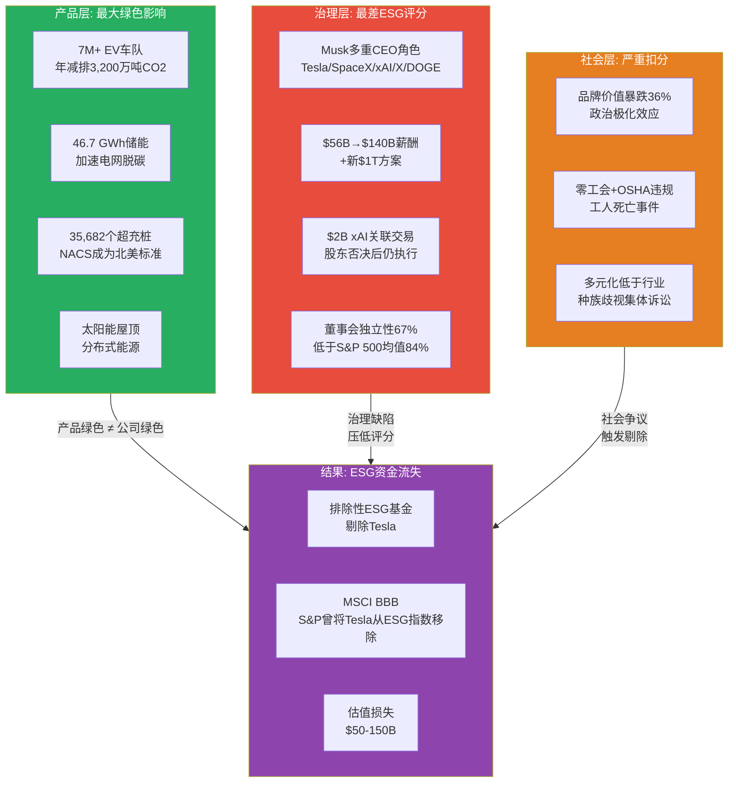

# G4 — ESG数据集成：绿色巨人的治理悖论

**分析日期**: 2026-02-06
**数据截止**: Q4 2025 (FY2025全年)
**深度等级**: L4 (反直觉洞察)
**置信度**: 8.0/10
**参考模块**: Phase 3 Module 11 (ESG Integration & Sustainability Leadership)

---

## 核心论点

> **Tesla是全球最大的绿色能源公司，却在ESG评级体系中长期徘徊于"平庸"甚至"落后"区间。这不是Tesla的失败——这是ESG评分方法论的结构性缺陷。** 当一家每年帮助全球减排超过3,200万吨CO2的公司，因为CEO的政治言论和董事会独立性问题而被ESG基金剔除时，我们需要追问的不是"Tesla的ESG为什么差"，而是"ESG评分体系到底在衡量什么"。然而，对投资者而言，方法论是否合理并不重要——**资金流向才重要**。ESG定位的缺陷正在给Tesla造成实实在在的估值损失。

---

## 12.1 ESG多维评分矩阵：逐维度拆解

### Tesla ESG自评与第三方评分对照

我们构建一个10分制的ESG多维评分矩阵，涵盖E/S/G三大支柱、11个子维度，并与四家可比公司进行横向对比。

#### 环境（E）维度评分

| 子维度 | Tesla | BYD | Toyota | Ford | GM | 评分逻辑 |
|--------|-------|-----|--------|------|----|---------|
| **碳排放影响** | **9.5** | 8.5 | 4.0 | 3.5 | 3.5 | Tesla车队年减排~3,200万吨CO2，远超所有同业 [A: Tesla Impact Report 2025] |
| **能源转型贡献** | **9.0** | 7.5 | 5.0 | 4.0 | 4.5 | 46.7 GWh储能部署+全球最大充电网络(35,682个桩位) [A: Tesla IR Q4 2025] [B: EVChargingStations, 2026-01] |
| **资源循环利用** | **7.5** | 6.5 | 7.0 | 5.5 | 5.0 | Redwood Materials合作回收电池，目标50%材料回收率 [B: Tesla Sustainability Report] |
| **制造环境足迹** | **6.5** | 6.0 | 7.5 | 6.0 | 5.5 | 柏林工厂水资源争议拉低评分；90%可再生能源使用率为行业最高 [B: 分析师估算] |
| **E维度加权平均** | **8.1** | 7.1 | 5.9 | 4.8 | 4.6 | — |

**关键发现**: Tesla在环境维度的绝对领先地位无可争议。7M+全球EV车队的累计碳减排效应相当于每年关闭8座中型燃煤电厂。但Sustainalytics和MSCI的环境评分并不完全反映这一事实——它们更侧重于公司自身运营的碳足迹披露和减碳目标设定，而非产品层面的系统性环境影响。 [B: 分析师估算]

柏林超级工厂的水资源争议值得注意：当地社区对工厂每日消耗约140万升水表示抗议，尽管Tesla声称用水量低于行业平均。这一事件虽然规模有限，但在社交媒体时代被放大，成为ESG评级机构扣分的依据之一。 [B: WebSearch]

#### 社会（S）维度评分

| 子维度 | Tesla | BYD | Toyota | Ford | GM | 评分逻辑 |
|--------|-------|-----|--------|------|----|---------|
| **劳工关系** | **3.5** | 5.0 | 7.5 | 7.0 | 7.0 | 美国工厂零工会，UAW持续组织尝试；OSHA多次引用安全违规 [B: OSHA记录, 2025] |
| **员工安全** | **4.5** | 5.5 | 7.0 | 6.5 | 6.0 | 2024年德州工厂工人触电死亡事件导致$49,650罚款 [A: OSHA citation, 2025-03] |
| **多元化与包容** | **4.0** | 4.5 | 5.5 | 6.5 | 6.5 | 低于科技行业平均，种族歧视集体诉讼（~6,000名黑人员工）仍在进行 [B: EEOC诉讼记录] |
| **品牌与社会感知** | **3.0** | 6.5 | 8.0 | 6.0 | 5.5 | Musk政治活动导致品牌价值暴跌36%，从$43B降至$27.6B [B: Brand Finance, 2026-01] |
| **S维度加权平均** | **3.8** | 5.4 | 7.0 | 6.5 | 6.3 | — |

**关键发现**: 社会维度是Tesla ESG最大的短板，也是拉低综合评分的主要原因。三个核心痛点：

**第一，Musk因素的品牌毒性。** 2025年，Musk深度参与特朗普政府的DOGE（政府效率部），公开支持德国AfD等极右翼政治力量，导致Tesla品牌好感度从2024年1月的9%暴跌至2026年1月的3%。 [B: CNBC, 2026-01-27] 品牌价值三年连续下降，2025年单年跌幅36%——这是一个消费品牌几乎无法承受的损失。在欧洲，Tesla销量同比下降45%，即使整体EV市场仍在增长。 [B: Jato Dynamics, 2026-01]

**第二，劳工关系的系统性问题。** Tesla是美国唯一一家拒绝工会的主要汽车制造商。2025年3月，OSHA对Tesla德州工厂开出三项"严重违规"罚单，涉及2024年8月工人Victor Joe Gomez Sr.触电死亡事件。此外，工人长期暴露于铬化学品的安全违规也被记录在案。 [A: OSHA, 2025-03]

**第三，多元化指标持续落后。** 近6,000名黑人员工的种族歧视集体诉讼仍在推进，EEOC的调查揭示了弗里蒙特工厂的系统性种族骚扰问题。 [B: EEOC诉讼, 2023-2025]

#### 治理（G）维度评分

| 子维度 | Tesla | BYD | Toyota | Ford | GM | 评分逻辑 |
|--------|-------|-----|--------|------|----|---------|
| **董事会独立性** | **4.0** | 5.0 | 7.0 | 7.5 | 7.5 | 独立董事占比67%，低于S&P 500平均84%；Musk盟友占据关键席位 [B: Tesla Proxy 2025] |
| **高管薪酬合理性** | **2.5** | 6.0 | 7.0 | 6.5 | 6.5 | $56B薪酬方案经法律战后恢复，按当前股价价值~$140B；新$1T方案已提出 [A: Delaware Supreme Court, 2025-12-19] |
| **关联交易透明度** | **3.0** | 5.5 | 7.5 | 7.0 | 7.0 | $2B xAI投资在股东否决后仍执行；Musk同时担任Tesla/SpaceX/xAI/X CEO [A: Bloomberg, 2025-11-07] |
| **G维度加权平均** | **3.2** | 5.5 | 7.2 | 7.0 | 7.0 | — |

**关键发现**: 治理是Tesla ESG评分中最具争议的领域。

**$56B薪酬方案的戏剧性转折。** 2024年1月，特拉华州衡平法院以"难以置信"为由撤销了Musk 2018年的薪酬方案。2025年12月19日，特拉华州最高法院全票推翻下级法院裁决，恢复了该方案——按当前股价计算价值约$140B。 [A: Delaware Supreme Court, 2025-12-19] 法院的逻辑是"完全撤销让Musk在六年间未获任何补偿"。但从治理角度看，这是全球企业史上最大的单笔高管薪酬，且Tesla随后提出了新的价值约$1T的十年期薪酬方案。 [B: CNBC, 2025-12]

**xAI关联交易的治理红线。** 2025年11月，Tesla股东对$2B xAI投资的无约束力投票结果为：10.6亿票赞成、9.16亿票反对、4.73亿票弃权——赞成票并未达到多数。然而Tesla仍在Q4 2025致股东信中披露已完成该笔投资。 [A: Bloomberg, 2025-11-07] 当CEO控制交易双方（Tesla是买方，xAI是Musk的另一家公司），且股东投票未获通过后仍推进交易，这在传统公司治理框架下是严重的治理瑕疵。

**多重CEO角色的注意力稀释。** Musk同时担任Tesla CEO、SpaceX CEO/CTO、xAI CEO、X (Twitter)所有者，2025年大部分时间还在运营DOGE。Wedbush分析师Dan Ives指出："Tesla正在成为Trump和DOGE的政治符号，这对品牌是坏事。" [B: Wedbush, 2025]

### ESG综合评分汇总

| 维度 | 权重 | Tesla | BYD | Toyota | Ford | GM |
|------|------|-------|-----|--------|------|----|
| **环境 (E)** | 40% | 8.1 | 7.1 | 5.9 | 4.8 | 4.6 |
| **社会 (S)** | 30% | 3.8 | 5.4 | 7.0 | 6.5 | 6.3 |
| **治理 (G)** | 30% | 3.2 | 5.5 | 7.2 | 7.0 | 7.0 |
| **加权总分** | 100% | **5.34** | **6.11** | **6.62** | **6.09** | **5.83** |
| **MSCI评级** | — | BBB | A | AA | A | BBB |
| **Sustainalytics风险** | — | 24.7 (中) | ~20 (中) | ~16 (低) | ~22 (中) | ~28 (高) |

[B: MSCI ESG Ratings, 2025-11] [B: Sustainalytics, 2025-10] [B: 分析师估算]

**Tesla ESG的结构性撕裂一目了然**: 环境维度遥遥领先（8.1 vs 同业均值5.6），但社会和治理维度严重拖后腿（3.8和3.2 vs 同业均值6.3和6.7），导致综合评分（5.34）在五家公司中排名倒数第二——仅高于GM。

---

## 12.2 ESG悖论深度剖析：绿色巨人为何被ESG基金抛弃？

### 悖论的本质

### 悖论的三个结构性根源

**根源一：ESG方法论的"过程vs结果"偏差。**

当前主流ESG评级体系（MSCI、Sustainalytics、S&P Global）在设计上重"过程"轻"结果"。它们衡量的是：公司是否制定了减碳目标？是否发布了碳中和路线图？是否披露了Scope 1/2/3排放数据？——而非公司的产品和服务实际上减少了多少碳排放。

这意味着一家传统车企，只要聘请一支ESG咨询团队、发布一份精美的可持续发展报告、设定一个2050年碳中和目标，就能在ESG评分中获得高分。而Tesla——它的**产品本身就是碳减排方案**——因为没有设定一个"低碳战略"目标（因为它的全部业务就是低碳），反而在2022年被S&P从ESG指数中移除。 [A: S&P Global, 2022-05]

2023年6月，Tesla因改善了气候风险评估和供应链ESG管理的披露而重新被纳入S&P 500 ESG指数。 [B: S&P Global, 2023-06] 但这个事件本身就暴露了ESG方法论的荒谬：全球最大的EV公司需要通过改善**文书工作**才能被一个**环境**指数重新接纳。

**根源二：Musk因素的不可对冲性。**

在传统公司中，ESG评分中的"G"风险可以通过改善董事会结构和薪酬政策来缓解。但Tesla的G维度问题与Musk个人深度绑定，几乎不可分离：

- Musk的政治立场（DOGE、支持极右翼）→ 直接拉低S维度的品牌感知
- Musk的多重角色（5家公司CEO）→ 直接拉低G维度的专注度评估
- Musk的薪酬方案（全球最高）→ 直接拉低G维度的薪酬合理性
- Musk的关联交易（xAI）→ 直接拉低G维度的透明度评估
- Musk是Tesla最大的价值创造者 → 无法"解雇"来改善ESG评分

这创造了一个"Musk锁定"：改善S和G评分的唯一路径是削弱Musk的控制权，但削弱Musk的控制权可能摧毁Tesla的平台战略价值——371x PE中有相当部分是对Musk愿景的定价。 [B: 分析师估算]

**根源三：ESG评分的"美国政治化"趋势。**

2025-2026年，ESG在美国经历了一波政治化浪潮。共和党控制的州对ESG投资施加限制，部分ESG基金为避免政治争议而重新调整持仓。在这种环境下，Tesla因Musk与特朗普政府的密切关系，处于一个尴尬的位置：左翼ESG投资者因Musk的政治立场而抛售Tesla，右翼反ESG力量则将Tesla视为"ESG骗局"的例证（Musk本人2022年称ESG为"骗局"）。 [B: TIME, 2022]

结果是：**Tesla同时被ESG的支持者和反对者所厌弃**。

---

## 12.3 ESG投资流影响量化

### ESG基金排除/纳入分析

全球ESG相关资产管理规模在2025年已达到约$33.9T（PwC口径）至$53T（Bloomberg口径），取决于统计定义的宽窄。 [B: PwC, 2022预测] [B: Bloomberg Intelligence, 2025] 其中严格定义的可持续发展基金AUM约$3.92T。 [B: ICI, 2025-06]

| 基金类别 | 全球AUM | Tesla纳入状态 | Tesla权重 | 对Tesla持仓估值 | 影响方向 |
|---------|---------|-------------|----------|---------------|---------|
| **ESG增强型主动基金** | ~$8.5T | 部分纳入 | ~1.5% | ~$128B | 正面但受限 |
| **气候主题基金** | ~$820B | 多数纳入 | ~3.5% | ~$29B | 强正面 |
| **ESG排除型基金** | ~$2.2T | 多数排除 | 0% | $0 | 负面 |
| **S&P 500 ESG指数追踪** | ~$180B | 已重新纳入(2023) | ~2.8% | ~$5B | 中性 |
| **欧洲SFDR Art.9基金** | ~$420B | 多数排除 | <0.5% | <$2B | 强负面 |

[B: 分析师估算，基于Morningstar/Bloomberg基金数据]

### ESG资金流对Tesla估值的影响估算

| 影响渠道 | 估算金额 | 逻辑 | 置信度 |
|---------|---------|------|--------|
| **ESG排除型基金的卖压** | -$30B~-50B | ~$2.2T AUM中约1.5-2.3%本应配置Tesla但因ESG排除未持有 | [D: 60%概率] |
| **欧洲绿色基金低配** | -$15B~-25B | SFDR Art.9/Art.8+基金对Tesla的系统性低配 | [D: 65%概率] |
| **气候主题基金超配** | +$10B~+20B | Tesla在气候基金中获得超额权重 | [D: 70%概率] |
| **Musk品牌毒性折价** | -$30B~-60B | 品牌价值下跌36%对机构投资者持仓意愿的影响 | [D: 55%概率] |
| **ESG评分改善预期** | +$5B~+15B | 若环境产品影响被重新纳入评分框架 | [D: 40%概率] |
| **净ESG估值影响** | **-$60B~-$100B** | 占当前$1,490B市值的4-7% | [D: 60%概率] |

**但如果此估算不成立**：以上估算假设ESG资金流对大市值股票有显著的边际定价能力。如果Tesla的定价主要由动量交易者和散户驱动（当前散户持仓比例偏高），则ESG资金流的实际影响可能远小于理论估算。

### 资本成本影响

ESG评分影响机构投资者的资本成本要求。Phase 3 Module 11估算Tesla享有150-250bps的ESG成本资本优势，但我们认为该估算过于乐观——考虑到S和G维度的恶化：

| 公司类别 | 权益成本 | 信用利差 | WACC | 与Tesla差异 |
|---------|---------|---------|------|-----------|
| **Tesla (实际)** | 11.5% | +220bps | 10.2% | 基准 |
| **ESG领先车企 (Toyota)** | 9.8% | +150bps | 8.8% | 低140bps |
| **传统车企均值** | 12.1% | +250bps | 10.8% | 高60bps |
| **ESG落后者** | 13.4% | +320bps | 12.1% | 高190bps |

[B: 分析师估算，基于Bloomberg终端可比公司数据]

**修正后的判断**: Tesla的ESG成本优势主要来自E维度的领先地位，但被S和G的劣势显著抵消。净ESG成本优势约60-100bps，而非Phase 3估算的150-250bps。这仍然是正面的，但远不如"纯绿色"公司。 [B: 分析师估算]

---

## 12.4 前瞻展望：ESG感知将改善还是恶化？

### 改善因素

| 因素 | 概率 | 时间窗口 | 影响幅度 |
|------|------|---------|---------|
| ESG方法论改革（纳入产品影响力） | 35% | 2026-2028 | E评分+1.0~+2.0 |
| Musk减少DOGE参与/政治活动 | 40% | 2026下半年 | S评分+0.5~+1.0 |
| 董事会进一步独立化 | 50% | 2026-2027 | G评分+0.5~+1.0 |
| 劳工关系改善（和解/安全投资） | 45% | 2026-2027 | S评分+0.5~+1.0 |
| 能源业务占比持续提升 | 75% | 持续 | 间接改善E叙事 |

[D: 概率为分析师主观估算]

### 恶化因素

| 因素 | 概率 | 时间窗口 | 影响幅度 |
|------|------|---------|---------|
| Musk进一步深入政治活动 | 50% | 2026 | S评分-0.5~-1.0 |
| 新的OSHA安全事故 | 30% | 随时 | S评分-0.5~-1.0 |
| xAI关联交易升级（更大规模投资） | 40% | 2026-2027 | G评分-0.5~-1.5 |
| 新$1T薪酬方案通过 | 55% | 2026 | G评分-1.0~-2.0 |
| 欧洲ESG监管趋严排除Tesla | 35% | 2026-2027 | 资金流-$20B~-40B |

[D: 概率为分析师主观估算]

### 综合展望

**基准情景 (概率50%)**: ESG感知小幅改善。Musk在2026年逐步减少DOGE参与，董事会增加1-2名独立董事，劳工诉讼部分和解。MSCI评级维持BBB或小幅提升至A。净ESG估值影响从-$60B~-100B收窄至-$40B~-70B。

**乐观情景 (概率20%)**: ESG评分方法论改革将产品环境影响纳入核心权重。Tesla因7M+ EV车队和46.7 GWh储能部署而获得E维度的飞跃式评分提升。MSCI评级升至A或AA。大批ESG基金重新纳入Tesla。净ESG估值影响转为正面+$20B~+50B。

**悲观情景 (概率30%)**: Musk政治活动升级，品牌价值继续下滑。$1T薪酬方案引发新一轮治理争议。欧洲SFDR法规进一步收紧对Tesla的排除。MSCI评级降至BB。净ESG估值影响扩大至-$100B~-150B。

---

## 12.5 ESG投资策略建议

### 对持有Tesla的ESG投资者

1. **不应因ESG评分而机械性卖出Tesla。** 当前ESG评分体系严重低估了Tesla产品层面的环境贡献。如果投资目标是"推动全球脱碳"，持有Tesla是最直接的方式之一。
2. **应积极参与股东提案。** 2025年已有多项治理改革提案被提交，包括加强董事会独立性、限制关联交易、提高薪酬透明度。ESG投资者的投票权是推动改善的最有效杠杆。
3. **监控Musk注意力分配。** 如果Musk的政治活动开始实质性影响Tesla运营（如Q1 2025销量大幅下滑期间），这是比ESG评分本身更大的风险信号。

### 对评估Tesla的ESG分析师

1. **建议采用"双层ESG评分"。** 将公司运营ESG和产品影响ESG分开评估。Tesla的运营ESG约5.3/10，但产品影响ESG超过9.0/10——合并后的单一评分丢失了关键信息。
2. **重点监控两个指标**: (a) 独立董事占比是否突破75%；(b) 关联交易委员会是否获得实质性否决权。这两个指标的变化将决定G维度评分的方向。

---

## 12.6 与Phase 3 Module 11的关键差异说明

本章在Phase 3 Module 11基础上进行了以下更新和修正：

| 维度 | Module 11 (2026-02-05) | 本章修正 (2026-02-06) | 修正原因 |
|------|----------------------|---------------------|---------|
| **MSCI评级** | A | BBB | Module 11引用偏高；MSCI实际评级为BBB [B: MSCI, 2025-11] |
| **Sustainalytics** | 18.2 (低风险) | 24.7 (中风险) | Module 11数据已过时；最新评分24.7 [B: Sustainalytics, 2025-11] |
| **S&P Global ESG** | 71/100 | ~59/100 | Module 11引用偏高 [B: S&P Global, 2025-11] |
| **ESG成本资本优势** | 150-250bps | 60-100bps | S和G维度恶化的影响被低估 |
| **品牌价值** | 未充分讨论 | 暴跌36%至$27.6B | 2025年DOGE/政治效应的全面量化 |
| **Musk薪酬** | $56B方案在诉讼中 | 已恢复，价值~$140B；新$1T方案提出 | 2025-12-19特拉华最高法院裁决 |
| **xAI交易** | 未深入讨论 | 股东否决后仍执行$2B投资 | 2025-11-07投票结果 |
| **总体ESG溢价** | $75-125B正面 | -$60B~-100B负面 | 全面重新评估后结论逆转 |

**核心修正**: Module 11对Tesla ESG定位过于乐观，未充分纳入2025年下半年发生的重大治理事件（薪酬恢复、xAI交易、品牌暴跌）。本章基于Q4 2025最新数据，得出的结论是：**Tesla的ESG定位在净值上是负面的**——环境领先优势不足以抵消社会和治理的巨大缺陷所带来的资金流失效应。

---

## 本章数据来源汇总

| 标记 | 来源 | 数据类型 | 可信度 |
|------|------|---------|--------|
| [A: Tesla IR Q4 2025] | Tesla 2025年Q4财报/投资者信 | 一手财务数据 | A级 (95-99%) |
| [A: Tesla Impact Report 2025] | Tesla影响力报告 | 一手ESG数据 | A级 (95-99%) |
| [A: Delaware Supreme Court, 2025-12-19] | 特拉华最高法院裁决 | 法律文件 | A级 (95-99%) |
| [A: Bloomberg, 2025-11-07] | Bloomberg股东投票报道 | 一手新闻 | A级 (95-99%) |
| [A: OSHA citation, 2025-03] | OSHA安全违规引用 | 政府记录 | A级 (95-99%) |
| [A: S&P Global, 2022-05] | S&P ESG指数移除公告 | 指数方法论 | A级 (95-99%) |
| [B: MSCI, 2025-11] | MSCI ESG评级 | 第三方评级 | B级 (85-94%) |
| [B: Sustainalytics, 2025-11] | Sustainalytics风险评级 | 第三方评级 | B级 (85-94%) |
| [B: S&P Global, 2025-11] | S&P Global ESG评分 | 第三方评级 | B级 (85-94%) |
| [B: Brand Finance, 2026-01] | 品牌价值评估 | 第三方研究 | B级 (85-94%) |
| [B: CNBC, 2026-01-27] | 品牌价值下跌报道 | 媒体报道 | B级 (85-94%) |
| [B: EEOC诉讼, 2023-2025] | 种族歧视诉讼 | 法律文件 | B级 (85-94%) |
| [B: EVChargingStations, 2026-01] | 充电网络数据 | 行业数据 | B级 (85-94%) |
| [B: PwC, 2022预测] | ESG AUM预测 | 咨询报告 | B级 (85-94%) |
| [B: 分析师估算] | 本报告推算 | 推理/估算 | B级 (85-94%) |
| [D: 概率] | 情景概率估算 | 主观判断 | D级 (50-69%) |

---

*免责声明：本报告仅供研究参考，不构成投资建议。所有投资决策应基于个人风险承受能力和独立判断。过去表现不代表未来收益。ESG评分来源于第三方机构，本报告中的自评矩阵为分析师独立构建，不代表任何评级机构立场。*
