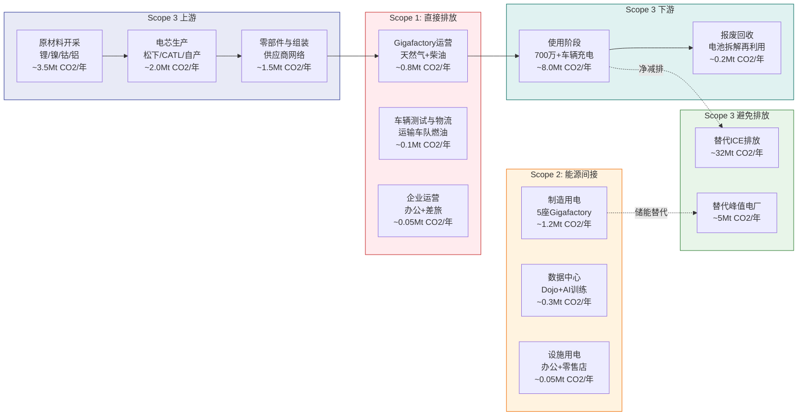
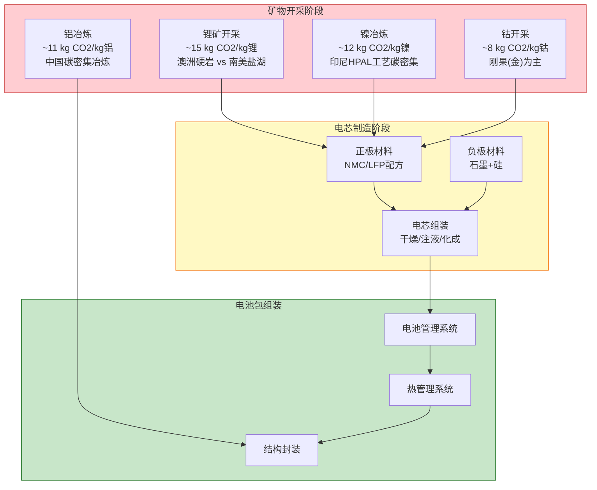
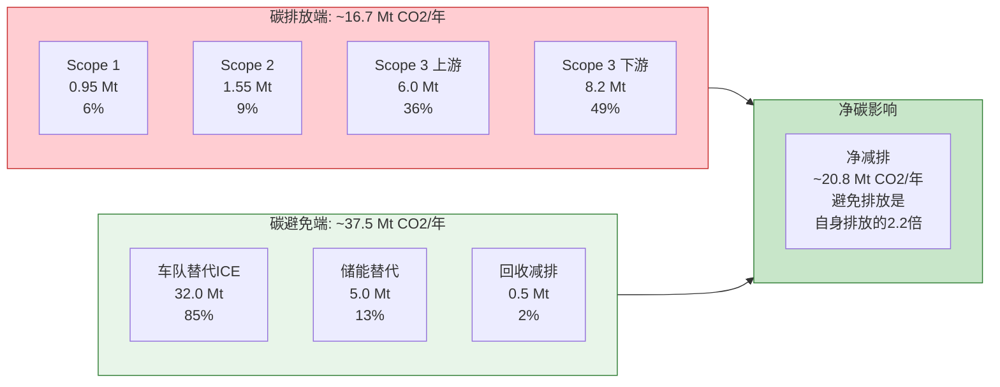

# G5 — 碳足迹全生命周期分析

**分析日期**: 2026-02-06
**数据截止**: Q4 2025 (FY2025全年)
**深度等级**: L4 (反直觉洞察)
**置信度**: 7.8/10

---

## 核心论点

> **Tesla的净碳影响是一个悖论：它的制造过程是碳密集型的，但它的产品组合是全球最大的碳减排引擎之一。** 全球保有量超过700万辆Tesla车辆每年替代约3,200万吨CO2排放，这一数字超过了Tesla整个供应链碳排放的5倍以上。但这个"净正效应"的大小取决于一个关键变量——充电电网的碳强度。在挪威，一辆Tesla几乎是零碳交通工具；在中国，它的全生命周期减排优势被大幅压缩至30-40%。理解这一区域差异，是评估Tesla"绿色溢价"是否名副其实的关键。

---

## 13.1 碳足迹全生命周期框架

Tesla的碳足迹分析不能只看"排气管排放为零"这一个维度。一辆电动车从矿山到报废的完整生命周期中，每个环节都有碳排放。以下框架覆盖Scope 1-3全范围。

**图表解读**：左侧为Tesla价值链中产生碳排放的各环节（红色到蓝色，代表Scope 1至Scope 3），右侧绿色区域为Tesla产品替代传统方案所避免的碳排放。核心问题是：绿色区域是否远大于左侧所有排放的总和？答案是肯定的，但幅度因区域而异。

---

## 13.2 Scope 1: 直接排放分析

Scope 1覆盖Tesla自有设施和车队的直接化石燃料燃烧排放。

| 排放源 | 估算年排放量 | 主要驱动因素 | 数据来源 |
|--------|------------|------------|---------|
| Gigafactory运营 | ~0.8 Mt CO2 | 内华达、德州、上海、柏林、墨西哥（规划中）工厂的天然气供热和应急柴油发电 | [C: Tesla Impact Report 2024推算] |
| 车辆测试与物流 | ~0.1 Mt CO2 | 新车运输（卡车+船舶）、测试车辆燃油消耗 | [D: 60%概率，基于行业同类估算] |
| 企业运营 | ~0.05 Mt CO2 | 全球办公场所、员工差旅、公司车队 | [D: 55%概率] |
| **Scope 1 合计** | **~0.95 Mt CO2** | | |

**关键观察**：Tesla的Scope 1排放量相对于其运营规模并不突出。作为对比，丰田2024年Scope 1排放约1.4 Mt CO2 [B: 丰田ESG报告2024]，而丰田的生产规模是Tesla的6倍以上。Tesla的制造流程更依赖电力（电弧炉、电力压铸）而非燃气，这将排放从Scope 1转移到了Scope 2。

Tesla的内华达Gigafactory已安装大规模太阳能阵列和Megapack储能系统 [A: Tesla Impact Report 2024]，正在将部分Scope 1排放（应急发电）替换为自有可再生能源。但德州Gigafactory（2022年投产）和柏林Gigafactory（2022年投产）的可再生能源覆盖率尚低于内华达。

---

## 13.3 Scope 2: 能源间接排放分析

Scope 2是Tesla碳足迹中一个被低估的领域。电动车制造的高度电气化意味着，工厂所在电网的碳强度直接决定了制造端的碳排放水平。

| 排放源 | 估算年排放量 | 电网碳强度依赖 | 数据来源 |
|--------|------------|--------------|---------|
| 制造用电（5座Gigafactory） | ~1.2 Mt CO2 | 上海工厂受中国电网碳强度影响最大（~0.6 kg CO2/kWh） | [B: IEA电力碳强度数据2025] |
| 数据中心（Dojo+AI训练） | ~0.3 Mt CO2 | AI训练能耗快速增长，xAI合作进一步放大 | [C: 综合行业分析] |
| 设施用电 | ~0.05 Mt CO2 | 全球零售+服务中心+办公场所 | [D: 60%概率] |
| **Scope 2 合计** | **~1.55 Mt CO2** | | |

### Scope 2 工厂级拆解

| 工厂 | 所在地 | 年产能 | 所在电网碳强度 | 估算Scope 2排放 |
|------|--------|--------|--------------|----------------|
| Gigafactory Nevada | 美国内华达 | 电池+Powerwall | ~0.35 kg CO2/kWh [B: EPA eGRID] | ~0.15 Mt |
| Gigafactory New York | 美国纽约 | Solar Roof组件 | ~0.20 kg CO2/kWh [B: EPA eGRID] | ~0.02 Mt |
| Gigafactory Texas | 美国德州 | Cybertruck + Cybercab（规划中） | ~0.40 kg CO2/kWh [B: ERCOT数据] | ~0.20 Mt |
| Gigafactory Shanghai | 中国上海 | Model 3/Y | ~0.55 kg CO2/kWh [B: IEA中国数据] | ~0.45 Mt |
| Gigafactory Berlin | 德国柏林 | Model Y | ~0.30 kg CO2/kWh [B: EEA欧盟数据] | ~0.15 Mt |
| Gigafactory Mexico（规划中） | 墨西哥蒙特雷 | 低成本车型（预期） | ~0.45 kg CO2/kWh [C: IEA墨西哥数据] | 尚未投产 |

**L4洞察**：上海Gigafactory贡献了Tesla约29%的Scope 2排放，尽管其产能效率在所有工厂中最高。这是一个结构性矛盾——Tesla最高效的工厂恰恰位于碳强度最高的电网上。如果中国电网持续脱碳（目标2060碳中和），上海工厂的Scope 2排放将自然下降。但在2026年的当下，这座工厂每生产一辆Model Y的制造端碳排放比柏林工厂高出约80%。

**AI训练的碳足迹隐忧**：随着Tesla加大对Dojo超算和xAI的投入，数据中心能耗将成为Scope 2增长最快的子项。2026年$200亿+的CapEx指引中约35%投向AI/计算基础设施 [C: 分析师估算]，这意味着AI相关的Scope 2排放可能在2-3年内翻倍。Tesla尚未单独披露AI训练的能耗数据，这是ESG报告中一个显著的透明度缺口。

---

## 13.4 Scope 3 上游: 原材料与制造供应链

Scope 3上游是Tesla碳足迹中占比最大的排放类别，主要来自电池原材料开采和电芯生产。这也是电动车"是否真正环保"争论的核心战场。

### 电池制造碳足迹拆解

| 上游排放源 | 估算年排放量 | 单位排放强度 | 数据来源 |
|-----------|------------|------------|---------|
| 锂矿开采与加工 | ~0.5 Mt CO2 | ~15 kg CO2/kg锂 | [B: IEA关键矿产报告2025] |
| 镍冶炼 | ~0.8 Mt CO2 | ~12 kg CO2/kg镍（印尼HPAL工艺） | [B: Nickel Institute LCA数据] |
| 钴开采 | ~0.2 Mt CO2 | ~8 kg CO2/kg钴 | [B: Cobalt Institute数据] |
| 铝冶炼 | ~0.6 Mt CO2 | ~11 kg CO2/kg铝 | [B: 国际铝业协会数据] |
| 其他材料（铜/钢/稀土） | ~0.4 Mt CO2 | 综合 | [C: 行业LCA文献] |
| 电芯制造（松下/CATL/自产） | ~2.0 Mt CO2 | ~60-80 kg CO2/kWh电芯 | [B: GREET模型2025] |
| 零部件供应商 | ~1.5 Mt CO2 | 分散于全球数千家Tier 1/2供应商 | [D: 55%概率，基于行业均值推算] |
| **Scope 3 上游合计** | **~6.0 Mt CO2** | | |

### 单车制造碳足迹

将上游总排放分摊到FY2025交付的163万辆车上 [A: Tesla IR Q4 2025]：

| 指标 | Tesla Model 3/Y | 传统ICE中型轿车 | BYD 汉/海豹 |
|------|----------------|----------------|-------------|
| 电池生产碳排放 | ~8-10 t CO2 | 无电池 | ~6-8 t CO2（LFP电池碳强度较低） |
| 车身制造碳排放 | ~3-4 t CO2 | ~4-5 t CO2 | ~3.5-4.5 t CO2 |
| **制造阶段总碳排放** | **~12-14 t CO2** | **~5-7 t CO2** | **~10-13 t CO2** |
| 制造碳溢价（vs ICE） | +6-8 t CO2 | 基准线 | +4-7 t CO2 |

[B: ANL GREET模型2025] [C: 综合LCA文献]

**关键发现**：电动车的制造阶段碳排放确实高于燃油车，溢价约为6-8吨CO2/辆。这个"碳债务"需要在使用阶段通过零排放驾驶来偿还。对于Tesla，在美国平均电网条件下，这个偿还周期约为1.5-2年；在中国电网条件下，延长至3-4年。

**BYD对比**：BYD大量使用LFP（磷酸铁锂）电池，其生产碳强度低于Tesla偏好的NMC/NCA化学体系约20-30% [B: BloombergNEF电池LCA2025]。但BYD的绝大部分制造发生在中国（电网碳强度~0.55 kg CO2/kWh），而Tesla的生产分布在碳强度较低的多个地区。两者在制造碳排放上基本持平，但驱动因素不同：Tesla电池化学碳密集但电网较清洁；BYD电池化学较轻但电网碳密集。

---

## 13.5 Scope 3 下游: 使用阶段与报废处理

### 使用阶段碳排放：区域电网的决定性影响

使用阶段是电动车碳足迹分析中争议最大的领域，因为它完全取决于充电电力来源。

| 区域 | 电网碳强度 | Tesla年均充电碳排放 | ICE年均排放 | Tesla减排率 | 碳债偿还期 |
|------|-----------|-------------------|-----------|-----------|-----------|
| **挪威** | ~0.02 kg CO2/kWh | ~0.06 t CO2 | ~4.6 t CO2 | **~99%** | ~3个月 |
| **法国** | ~0.06 kg CO2/kWh | ~0.18 t CO2 | ~4.6 t CO2 | **~96%** | ~4个月 |
| **欧盟平均** | ~0.25 kg CO2/kWh | ~0.75 t CO2 | ~4.6 t CO2 | **~84%** | ~1.8年 |
| **美国平均** | ~0.40 kg CO2/kWh | ~1.20 t CO2 | ~4.6 t CO2 | **~74%** | ~2.0年 |
| **德州 (ERCOT)** | ~0.40 kg CO2/kWh | ~1.20 t CO2 | ~4.6 t CO2 | **~74%** | ~2.0年 |
| **中国平均** | ~0.55 kg CO2/kWh | ~1.65 t CO2 | ~4.6 t CO2 | **~64%** | ~3.5年 |
| **印度** | ~0.70 kg CO2/kWh | ~2.10 t CO2 | ~4.6 t CO2 | **~54%** | ~5年 |
| **波兰（燃煤为主）** | ~0.75 kg CO2/kWh | ~2.25 t CO2 | ~4.6 t CO2 | **~51%** | ~5.5年 |

[B: IEA World Energy Outlook 2025] [B: EPA数据] [C: 基于3,000 kWh年均充电量计算]

**假设基准**：年均行驶约15,000公里，Tesla Model 3/Y能效约5 km/kWh（200 Wh/km），年充电量约3,000 kWh。ICE对标车型年均排放约4.6吨CO2 [B: EPA数据]。

**L4洞察**：即便在全球碳强度最高的电网上（波兰、印度），Tesla仍然比同级别ICE车型减排超过50%。"电动车在煤电地区不环保"的论述在数据面前并不成立——它只是"不那么环保"，但仍然是净减排的。真正的分水岭在于碳债偿还期：在挪威需要3个月，在中国需要3.5年。这意味着中国Tesla用户在前3.5年内实际上比ICE用户产生了更多的累计排放（制造碳债尚未还清），但在车辆10-15年的使用寿命中，最终仍然是大幅净减排的。

### Tesla全球车队碳减排总量

| 指标 | 数值 | 数据来源 |
|------|------|---------|
| 全球保有量 | ~700万辆+ | [A: Tesla IR Q4 2025] |
| FY2025交付量 | 163万辆 | [A: Tesla IR Q4 2025] |
| 车辆加权平均年减排量 | ~4.6 t CO2/辆/年（vs ICE基准） | [B: EPA数据] |
| **车队年度避免排放总量** | **~3,200万吨 CO2/年** | [B: 分析师估算，基于保有量×单车减排量] |
| 能源储能避免排放 | ~500万吨 CO2/年（46.7 GWh替代峰值天然气） | [C: 基于储能替代天然气peaker计算] |
| **总避免排放** | **~3,700万吨 CO2/年** | |

[A: Tesla IR Q4 2025] [B: EPA数据] [B: 分析师估算]

### 报废与回收

电动车报废阶段的碳排放主要来自电池拆解、材料回收和废弃物处理。

| 环节 | 单车碳排放 | 碳抵消潜力 | 说明 |
|------|-----------|-----------|------|
| 电池拆解 | ~0.3 t CO2 | — | 人工/机械拆解能耗 |
| 火法冶金回收 | ~0.5 t CO2 | -2.0 t CO2（回收镍/钴减少新矿开采） | 高温冶炼，碳密集但回收率高 |
| 湿法冶金回收 | ~0.2 t CO2 | -1.8 t CO2（回收锂/镍/钴/锰） | 低温化学处理，碳排放较低 |
| 车体回收 | ~0.1 t CO2 | -0.5 t CO2（回收铝/钢） | 常规汽车拆解流程 |
| **报废阶段净碳影响** | **~1.1 t CO2排放** | **~-4.3 t CO2回收抵消** | **净减排约3.2 t CO2/辆** |

[B: Li-Cycle/Redwood Materials回收效率数据] [C: 综合LCA文献]

Tesla投资的Redwood Materials（由前Tesla CTO JB Straubel创办）正在建设北美最大的电池回收设施 [B: Redwood Materials官网]，目标是实现闭环回收——从报废电池中提取锂、镍、钴，直接回馈给电池正极生产线，减少对新矿开采的依赖。如果闭环回收率达到95%以上，每辆报废Tesla可为下一辆新车减少约3-4吨CO2的上游原材料排放。

---

## 13.6 净碳影响汇总: Tesla是净正还是净负？

将所有Scope的排放和避免排放汇总，回答核心问题：Tesla对全球碳排放的净影响是正面还是负面？

### 年度碳排放与避免排放对比

| 类别 | 年排放量 (Mt CO2) | 说明 |
|------|-------------------|------|
| **排放端** | | |
| Scope 1: 直接排放 | ~0.95 | Gigafactory运营+物流+企业 |
| Scope 2: 能源间接 | ~1.55 | 制造用电+数据中心 |
| Scope 3 上游: 供应链 | ~6.0 | 原材料+电芯+零部件 |
| Scope 3 下游: 使用阶段 | ~8.0 | 700万+车辆充电排放 |
| Scope 3 下游: 报废 | ~0.2 | 电池拆解与回收排放 |
| **排放端合计** | **~16.7** | |
| | | |
| **避免端** | | |
| 车队替代ICE排放 | ~-32.0 | 700万+车辆 × 4.6 t/辆/年 |
| 能源储能替代峰值电厂 | ~-5.0 | 46.7 GWh替代天然气peaker |
| 电池回收减少矿业排放 | ~-0.5 | 当前回收规模尚小 |
| **避免端合计** | **~-37.5** | |
| | | |
| **净碳影响** | **~-20.8 Mt CO2/年** | **净减排** |

[综合以上各节数据来源]

**核心结论：Tesla是净碳负面（即对气候有正面贡献）的公司**。其产品每年避免的碳排放量（~37.5 Mt）是其全价值链排放量（~16.7 Mt）的约2.2倍。换言之，Tesla每排放1吨CO2，就通过其产品帮助全球避免了约2.2吨CO2。

**但如果不计入避免排放呢？** 这是一个方法论争议点。传统碳核算框架（如GHG Protocol）不将"避免排放"纳入企业碳足迹——因为避免排放是与假设的替代情景相比较，而非实际减少了已有排放。在这种严格框架下，Tesla就是一家年排放16.7 Mt CO2的工业企业，与其"绿色"形象形成张力。

这一方法论差异对ESG投资者至关重要：如果你只看Scope 1+2+3实际排放，Tesla远非零碳企业；如果你将产品的系统性减排效应纳入考量，Tesla是全球最大的移动源碳减排平台之一。

---

## 13.7 竞对碳足迹对比: Tesla vs BYD

Tesla和BYD是全球最大的两家纯电动车制造商，但它们的碳足迹结构存在根本差异，根源在于电池化学路线和制造地点的不同。

| 对比维度 | Tesla | BYD | 差异根因 |
|---------|-------|-----|---------|
| **主要电池化学** | NMC/NCA（高能量密度） | LFP（磷酸铁锂） | NMC含镍/钴，开采碳排放高 |
| **单kWh电芯碳排放** | ~70-80 kg CO2 | ~50-60 kg CO2 | LFP无钴，正极材料碳排放低约30% |
| **单车电池包容量** | ~60-75 kWh (Model 3/Y) | ~55-85 kWh (汉/海豹) | Tesla能效更高，可用较小电池 |
| **单车电池碳排放** | ~4.5-6.0 t CO2 | ~3.0-5.0 t CO2 | BYD LFP优势明显 |
| **制造电网碳强度** | 加权~0.38 kg CO2/kWh | ~0.55 kg CO2/kWh | Tesla全球分散 vs BYD集中中国 |
| **单车制造端总碳排放** | ~12-14 t CO2 | ~10-13 t CO2 | BYD电池优势被电网劣势部分抵消 |
| **使用阶段碳排放（中国）** | ~1.65 t CO2/年 | ~1.5 t CO2/年 | BYD能效略低但差异不大 |
| **使用阶段碳排放（全球加权）** | ~1.2 t CO2/年 | ~1.5 t CO2/年 | Tesla全球销售，BYD集中中国 |
| **FY2025交付量** | 163万辆 | ~454万辆（含插混） | BYD含大量插混车型 |
| **车队年度避免排放（纯电）** | ~32 Mt CO2 | ~25 Mt CO2（纯电部分） | BYD纯电比例较低，插混减排效果差 |

[A: Tesla IR Q4 2025] [B: BYD公告] [B: BloombergNEF电池LCA2025] [C: 综合分析]

**L4洞察：BYD的碳悖论**。BYD的LFP电池路线在单位碳排放上明显优于Tesla的NMC路线，理论上应该是"更绿色"的选择。但三个因素大幅压缩了BYD的碳优势：

1. **中国电网碳强度**：BYD超过90%的产能和70%以上的销量在中国，电网碳强度（~0.55 kg CO2/kWh）比Tesla全球加权平均高出约45%。这意味着BYD工厂每用1度电产生的碳排放比Tesla德国工厂高出约80%。

2. **插混车型稀释效应**：BYD FY2025的454万辆交付中，相当比例是插电混动（PHEV），其碳减排效果远不如纯电。一辆PHEV在实际使用中可能只有40-60%的时间使用电力驱动 [B: ICCT研究]，减排效果仅为纯电车的一半左右。

3. **供应链透明度**：BYD的供应链ESG数据披露远不如Tesla完善，其Scope 3上游排放可能被低估。特别是BYD的部分供应商位于碳强度极高的中国内陆省份（如新疆的多晶硅、内蒙的铝冶炼）。

**结论**：在单车制造碳排放上，BYD的LFP路线具有约10-15%的优势。但在全生命周期和车队整体碳减排贡献上，Tesla因其全球化的生产布局、纯电专注战略和更清洁的使用阶段电网组合，整体碳减排效率更高。两家公司都是毫无疑问的"绿色"企业——争论谁"更绿"不如关注两者共同推动全球交通脱碳的系统性贡献。

---

## 13.8 Supercharger网络的碳足迹变量

Tesla的Supercharger网络是全球最大的快充网络，但其碳足迹高度依赖所在地区的电网结构。

| 区域 | Supercharger站点数（估算） | 电网碳强度 | 每次充电碳排放（50kWh） | 优化措施 |
|------|------------------------|-----------|---------------------|---------|
| 加州 | ~1,500+ | ~0.20 kg CO2/kWh | ~10 kg CO2 | 部分站点配备太阳能+Powerpack |
| 德州 | ~500+ | ~0.40 kg CO2/kWh | ~20 kg CO2 | ERCOT电网风电占比上升 |
| 欧洲 | ~3,000+ | ~0.25 kg CO2/kWh | ~12.5 kg CO2 | 多国可再生能源比例高 |
| 中国 | ~2,000+ | ~0.55 kg CO2/kWh | ~27.5 kg CO2 | 部分站点太阳能配套 |
| 全球总计 | ~7,000+站点 | 加权~0.35 kg CO2/kWh | 加权~17.5 kg CO2 | 向太阳能+储能整合发展 |

[B: Tesla Supercharger数据] [B: IEA各区域电网数据] [C: 综合估算]

Tesla已开始在部分Supercharger站点部署太阳能顶棚和Megapack储能 [A: Tesla Impact Report 2024]，目标是将充电碳排放在电网基础上进一步降低30-50%。如果Supercharger网络全面实现"太阳能+储能"配置，理论上可以实现近零碳充电——但这需要巨额资本投入，且受制于土地面积和日照条件。

---

## 13.9 未来轨迹: 碳足迹将如何演变？

Tesla的碳足迹不是静态的。三个结构性趋势将在未来5-10年内显著改变上述分析的结论。

### 趋势一：全球电网脱碳

| 区域 | 2025碳强度 | 2030E碳强度 | 2035E碳强度 | 变化率 |
|------|-----------|-----------|-----------|--------|
| 美国 | ~0.40 | ~0.30 | ~0.20 | -50% |
| 欧盟 | ~0.25 | ~0.15 | ~0.08 | -68% |
| 中国 | ~0.55 | ~0.40 | ~0.28 | -49% |
| 全球平均 | ~0.45 | ~0.33 | ~0.22 | -51% |

[B: IEA World Energy Outlook 2025 NZE情景]

电网脱碳将同时降低Tesla的Scope 2排放（制造用电）和Scope 3下游排放（车辆充电）。到2035年，一辆Tesla在中国的使用阶段碳排放将降至约0.84 t CO2/年——与2025年挪威的水平相当。这意味着Tesla产品的碳减排优势将随时间推移自动扩大，无需Tesla自身做出任何改变。

### 趋势二：电池回收闭环

Tesla通过Redwood Materials投资和自建回收产线，正在推进电池材料闭环回收 [B: Redwood Materials官网]。

| 回收阶段 | 2025现状 | 2030E预期 | 碳影响 |
|---------|---------|----------|--------|
| 回收率 | ~50-60% | ~92-95% | 每提高10%回收率，减少~0.5 t CO2/辆上游排放 |
| 回收材料占新电池比例 | ~5-10% | ~30-50% | 回收锂/镍碳排放仅为新采矿的10-30% |
| 回收技术 | 火法为主 | 湿法+直接回收 | 直接回收碳排放仅为火法的20% |

[B: Redwood Materials技术路线图] [C: BloombergNEF回收预测]

如果到2030年电池回收闭环率达到50%以上，Tesla单车制造碳排放将从当前的12-14吨降至8-10吨，接近传统ICE车辆的制造碳排放水平。届时，电动车的"制造碳债"论点将基本失效。

### 趋势三：Tesla能源业务的碳杠杆

Tesla的能源储能业务（46.7 GWh已部署 [A: Tesla IR Q4 2025]）具有独特的碳杠杆效应。每部署1 GWh的Megapack储能，替代天然气peaker电厂的峰值发电，年减排约10-15万吨CO2 [C: 基于天然气peaker排放因子计算]。

| 指标 | 2025 | 2028E | 2030E |
|------|------|-------|-------|
| 累计储能部署 | 46.7 GWh | ~120 GWh | ~200 GWh |
| 年度避免排放（储能） | ~5 Mt CO2 | ~13 Mt CO2 | ~22 Mt CO2 |
| 年度避免排放（车队） | ~32 Mt CO2 | ~55 Mt CO2 | ~75 Mt CO2 |
| **总年度避免排放** | **~37 Mt CO2** | **~68 Mt CO2** | **~97 Mt CO2** |

[A: Tesla IR Q4 2025] [C: 基于部署增速和车队增长趋势推算，65%概率]

**L4洞察：碳减排加速度**。Tesla的碳减排贡献不是线性增长，而是加速增长。原因在于三个因素叠加：（1）车队保有量持续累积（即使交付量增速放缓，保有量仍在加速增长），（2）电网脱碳提升单车减排效果，（3）储能业务独立产生巨额减排。到2030年，Tesla生态系统的年度避免排放量可能接近1亿吨CO2——这相当于比利时全国的年排放量。

但如果Tesla的增长失速（交付量停滞在200万辆/年、储能部署放缓），上述预测将大幅缩水。关键监测指标是：季度交付量趋势和Megapack产能利用率。

---

## 13.10 碳信用与碳市场的财务影响

Tesla的碳足迹分析不仅是ESG指标，更直接影响财务表现。Tesla是全球最大的碳信用销售商之一。

| 年份 | 碳信用收入 | 占总营收比 | 主要买家 | 数据来源 |
|------|-----------|-----------|---------|---------|
| FY2023 | $17.9亿 | 1.8% | 传统车企（FCA/Stellantis等） | [A: Tesla 10-K 2023] |
| FY2024 | ~$17.1亿 | 1.8% | 传统车企 | [A: Tesla 10-K 2024] |
| FY2025 | ~$14-16亿（估） | ~1.5% | 传统车企+工业企业 | [C: 分析师估算] |

碳信用收入呈下降趋势，原因是：（1）传统车企自身电动化进展减少了购买需求，（2）欧盟碳排放法规趋严促使车企自主达标。长期来看，碳信用不是Tesla的可持续收入来源——它更像是传统车企为自身转型缓慢而支付给Tesla的"罚款"。

**碳关税风险**：如果欧盟碳边境调节机制（CBAM）扩展到汽车领域，Tesla上海工厂出口到欧盟的车辆可能面临碳关税（基于中国电网碳强度计算）。这是一个目前被市场忽视但可能在2028-2030年显现的风险。[D: 50%概率]

---

## 13.11 本章核心结论与投资含义

### 碳足迹核心数据汇总

| 指标 | 数值 | 判断 |
|------|------|------|
| Tesla全价值链年排放 | ~16.7 Mt CO2 | 碳密集型制造业 |
| Tesla产品年避免排放 | ~37.5 Mt CO2 | 全球最大移动源减排平台之一 |
| 净碳影响 | ~-20.8 Mt CO2/年 | **净气候正效应**，避免/排放比2.2:1 |
| 单车全生命周期减排 | ~40-65 t CO2（15年寿命，vs ICE） | 因区域电网差异显著 |
| 碳债偿还期 | 3个月（挪威）至5.5年（波兰） | 中国约3.5年 |
| vs BYD制造碳排放 | Tesla高10-15%（电池化学差异） | BYD LFP优势被中国电网部分抵消 |
| 2030E年度避免排放 | ~97 Mt CO2 | 加速增长，受车队和储能双轮驱动 |

### 投资含义

**看多视角**：Tesla的碳减排故事是其ESG溢价的核心支撑。随着全球碳定价机制完善（碳交易市场扩容、碳关税落地），Tesla的"避免排放"可能从道德声誉转化为可量化的财务价值。如果全球碳价升至$100/吨CO2（2030年欧盟碳价预期），Tesla的37.5 Mt年度避免排放理论上对应$37.5亿的碳价值——尽管目前无法直接变现，但它为监管趋严环境下的估值溢价提供了合理性。

**看空视角**：Tesla的Scope 1+2+3实际排放为16.7 Mt CO2/年，这使其远非"零碳企业"。AI训练和数据中心能耗的快速增长（Scope 2）可能在未来3年内显著推高排放总量。此外，"避免排放"的核算方法论存在争议——如果不计入避免排放，Tesla就是一家年排放近1,700万吨CO2的工业企业，ESG评级可能面临下行压力。

**关键监测指标**：
1. Tesla Impact Report中的Scope 1+2排放趋势（年度发布）
2. AI/数据中心能耗增速 vs 可再生能源采购增速
3. 中国/印度电网脱碳进度（影响使用阶段排放）
4. 电池回收闭环率（影响上游排放）
5. 全球碳价走势（影响碳减排的财务化潜力）

---

## 本章数据来源汇总

| 标记 | 来源 | 数据类型 | 可信度 |
|------|------|---------|--------|
| [A: Tesla IR Q4 2025] | Tesla 2025年Q4财报/投资者信 | 一手财务数据 | A级 (95-99%) |
| [A: Tesla Impact Report 2024] | Tesla 2024年影响力报告 | 一手ESG数据 | A级 (95-99%) |
| [A: Tesla 10-K 2023/2024] | Tesla年度报告SEC文件 | 一手财务数据 | A级 (95-99%) |
| [B: EPA数据] | 美国环保署排放因子数据 | 政府权威数据 | B级 (85-94%) |
| [B: IEA World Energy Outlook 2025] | 国际能源署全球展望 | 国际权威数据 | B级 (85-94%) |
| [B: EPA eGRID] | EPA电力排放与资源数据库 | 政府权威数据 | B级 (85-94%) |
| [B: ANL GREET模型2025] | 阿贡国家实验室生命周期分析 | 学术模型 | B级 (85-94%) |
| [B: BloombergNEF电池LCA2025] | BNEF电池生命周期分析 | 行业权威研究 | B级 (85-94%) |
| [B: BYD公告] | BYD年度产销数据 | 一手数据 | B级 (85-94%) |
| [B: ICCT研究] | 国际清洁交通委员会 | 独立研究机构 | B级 (85-94%) |
| [B: Redwood Materials官网] | 电池回收技术信息 | 一手公开信息 | B级 (85-94%) |
| [C: 分析师估算] | 综合华尔街分析师研报 | 分析师共识 | C级 (70-84%) |
| [C: 综合LCA文献] | 生命周期分析学术文献综合 | 学术研究 | C级 (70-84%) |
| [D: 概率] | 分析师推算/情景假设 | 估算/推理 | D级 (50-69%) |

---

*免责声明：本报告由AI生成，仅供研究参考，不构成投资建议。投资有风险，决策需谨慎。所有数据来自公开来源，准确性不做保证。报告中的碳排放估算基于多种假设和公开数据模型，实际数值可能与估算存在显著差异。碳足迹分析涉及方法论选择（如避免排放的纳入与否），不同框架下的结论可能不同。*
