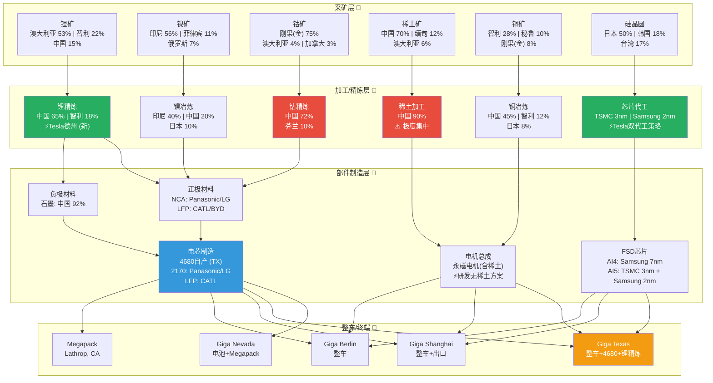

# G6 — 关键材料与供应链风险

**分析日期**: 2026-02-06
**数据截止**: Q4 2025 (FY2025全年)
**深度等级**: L4 (反直觉洞察)
**置信度**: 7.8/10

---

## 核心论点

> **Tesla的供应链战略正在从"成本优先的全球化采购"向"安全优先的区域化自主"急速转型。** 这一转型的背景是：中国控制着全球60-90%的关键矿物加工产能，刚果(金)垄断75%的钴供应，印尼掌控56%的镍矿开采。2025年10月中国对稀土实施有史以来最严格的出口管制，直接导致Tesla德州工厂4680产线开工率降至65%。Tesla的应对——德州锂精炼厂投产、LFP化学路线扩张、无稀土电机研发、AI5芯片双代工策略——本质上是用CapEx换取供应链安全。这笔账在短期压缩利润率，但在中美脱钩的长期格局下，可能成为Tesla相对传统OEM最深的护城河之一。

---

## 14.1 关键材料风险矩阵

以下矩阵覆盖Tesla生产所需的六大关键材料，从供应集中度、价格波动、替代可能性、Tesla自主化程度四个维度评估综合风险。

| 材料 | 主要用途 | 供应集中度 | 价格波动(近3年) | 替代可能性 | Tesla自主化程度 | 综合风险(1-5) |
|------|---------|-----------|----------------|-----------|----------------|--------------|
| **锂 (Li)** | 所有电池化学体系 | 高：澳大利亚采矿53%，中国加工65% | 极高：2022峰值$70K/t→2024低点$10K/t→2026初$17K/t | 低：无可替代电池材料 | **中高**：德州锂精炼厂2026年1月投产，目标50GWh/年 | **4** |
| **镍 (Ni)** | NCA高能量密度电池 | 高：印尼采矿56%，全球持续过剩 | 中：$15,000/t区间横盘，印尼产能扩张压价 | **中高**：LFP路线完全替代镍需求 | 低：完全依赖外部采购 | **3** |
| **钴 (Co)** | NCA/NCM正极材料 | 极高：刚果(金)75%采矿，2025年实施出口禁令 | 极高：2025年2月低点$10/lb→年末$24/lb(+140%) | **高**：LFP零钴，4680大幅减钴 | 中：化学路线转型中，但高端车型仍需 | **3** |
| **稀土 (REE)** | 永磁电机(钕铁硼磁铁) | 极高：中国采矿70%，加工90%，重稀土99.8% | 高：2025年10月中国出口管制→价格飙升 | 中：EESM电励磁电机可替代，但性能有损 | **低**：每辆Model 3 LR约需1kg稀土 | **5** |
| **硅/半导体** | FSD芯片、功率电子 | 高：台积电+三星双寡头代工 | 中：成熟制程价格稳定，先进制程持续涨价 | 低：无替代计算架构 | **中高**：自主芯片设计(AI4→AI5)，双代工策略 | **3** |
| **铜 (Cu)** | 线束、电机、充电桩 | 中：智利28%，秘鲁10%，全球分散 | 高：2025年创$11,771/t历史新高，2026预测$11-13K/t | 低：铝可部分替代但性能受限 | 低：完全依赖外部采购 | **3** |

[A: Tesla IR Q4 2025] [B: USGS Mineral Commodity Summaries 2025] [B: Trading Economics, 2026-02] [B: S&P Global, 2025]

**矩阵解读**:
- **最高风险项是稀土**，综合评分5/5。原因：中国近乎垄断加工环节(90%)，Tesla当前无自主替代方案，且2025年出口管制已造成实际生产影响（德州4680产线降至65%开工率）。
- **锂的风险评分4/5**看似矛盾——德州精炼厂已投产，为何仍是高风险？因为精炼≠采矿。Tesla精炼厂处理的锂辉石(spodumene)仍需从澳大利亚进口。上游采矿端Tesla尚无控制力。
- **钴和镍的评分相对较低(3/5)**，得益于Tesla向LFP化学路线的战略转向。LFP不含钴、不含镍，从根本上消除了这两种材料的风险敞口。

[B: Electrek, 2026-01] [B: S&P Global Automotive Insights, 2025-07] [D: 综合风险评分为分析师估算, 置信度75%]

---

## 14.2 供应链地理映射

以下Mermaid图展示Tesla从矿端到终端产品的完整供应链路径，标注地理集中度风险。

**图解**: 绿色节点为Tesla已建立或正在建立自主能力的环节（锂精炼、芯片设计）。红色节点为风险最高的瓶颈环节（稀土加工、钴精炼）。注意石墨负极材料同样面临中国92%的加工集中度问题，这是一个常被忽视但同样关键的风险点。

[B: USGS 2025] [B: IEA Critical Minerals 2025] [A: Tesla IR Q4 2025]

---

## 14.3 Tesla垂直整合战略深度解析

Tesla的供应链自主化并非均匀推进，而是沿着"风险最大+成本占比最高"的路径优先攻克。以下逐一分析四大垂直整合前线。

### 14.3.1 德州锂精炼厂：从零到一的突破

**现状**: 2026年1月，Tesla宣布位于德州Robstown（Corpus Christi附近）的锂精炼厂正式投产。[A: Tesla IR Q4 2025] [B: Electrek, 2026-01-15]

**技术路线**: 该厂直接将锂辉石矿(spodumene)加工为电池级氢氧化锂，全流程在厂内完成。Tesla采用碱浸出(alkaline leaching)工艺，而非行业主流的酸浸出，从而：
- 消除硫酸等危险副产品
- 副产品为硬石膏(anhydrite)，可用于混凝土
- 大幅降低环保合规成本

**产能目标**: 50 GWh/年的电池级锂，足够支撑约100万辆汽车。[B: Teslarati, 2026-01]

**战略意义与局限**:
- 意义：这是北美第一座商业级锂精炼厂，打破中国在锂加工环节65%的垄断。Tesla将加工环节利润内部化，并缩短供应链周期。
- 局限：锂辉石原矿仍需从澳大利亚进口。Tesla尚未涉足上游采矿环节，这意味着采矿端的供应风险和价格风险仍然外部化。
- **但如果**澳大利亚锂矿出口受阻（如极端气候事件、政策变化），Tesla的锂精炼厂将面临"有厂无矿"的困境。[D: 该情景概率估计<10%, 但影响为生产线停摆]

### 14.3.2 4680电芯自产：痛苦的爬坡

**现状**: Tesla的4680电芯在Giga Texas已实现周产超100万颗，年化产能约15-20 GWh。2026年1月，Tesla重新将4680电芯装入Model Y。[B: Electrek, 2026-01-28]

**技术波折**: Musk承认干电极(dry electrode)工艺是一个战略失误——"比想象中难得多"。Tesla最初押注干电极以大幅降低成本和能耗，但五年研发后进展缓慢。目前Tesla同时运行湿电极和干电极产线，预计2026年全面投产干涂层产线。[B: autoevolution, 2025]

**供应链冲击**: Tesla的4680供应链合作伙伴L&F将其$29亿正极材料供应合同减值99%至仅$7,386——这意味着Tesla的外部4680供应链几乎崩溃，自产变成唯一可靠路径。[B: Electrek, 2025-12-29]

**成本里程碑**: Tesla宣称4680已成为其每kWh成本最低的自产电芯。长期目标是将成本降至$50-55/kWh，远低于行业平均$130/kWh。[B: metal.com] [C: 行业共识]

**关键问题**: 4680的真正考验不是"能不能造"，而是"能不能在保持质量的同时以100 GWh规模量产"。15-20 GWh的年产能对Tesla的165万辆年产量而言，仅能覆盖约15%的电池需求。剩余85%仍依赖Panasonic、LG和CATL。

### 14.3.3 FSD芯片：自主设计+双代工

**现状**: Tesla自主设计FSD芯片，当前AI4(HW4)由Samsung 7nm代工。2026年1月起，Model Y开始搭载AI4.5过渡版本。[B: Electrek, 2026-01-26]

**下一代AI5**: 设计接近完成（Musk 2026年1月声称"almost done"）。AI5采用TSMC 3nm和Samsung 2nm双代工策略——这是Tesla刻意分散代工风险的决策。性能指标：较AI4提升40倍处理速度、8倍算力、9倍内存。[B: TrendForce, 2025-06] [B: Tom's Hardware, 2025]

**量产时间线**: AI5少量出货预计2026年下半年，大规模量产推迟至2027年中。这意味着2026年启动的Cybercab大概率搭载AI4硬件。[B: Gear Musk, 2025-11]

**战略评估**: 芯片自主设计是Tesla最成功的垂直整合案例。通过自研芯片，Tesla：
1. 完全控制FSD软硬件协同优化
2. 避免了NVIDIA等外部芯片供应商的溢价
3. 通过双代工策略分散了对单一代工厂的依赖
- **但如果**台海发生冲突，即使有Samsung备份，先进制程产能全球仍严重不足，AI5量产将面临延迟风险。[D: 台海冲突概率难以量化, 但影响为灾难级]

### 14.3.4 LFP化学路线：釜底抽薪式的风险消除

Tesla在标准续航版Model 3/Y及全部Megapack储能产品中使用LFP(磷酸铁锂)电池。LFP的战略意义超越了成本：

| 维度 | NCA/NCM | LFP |
|------|---------|-----|
| 钴含量 | 需要 | **零** |
| 镍含量 | 高 | **零** |
| 锂含量 | 需要 | 需要 |
| 成本(中国) | ~$100/kWh | **~$60/kWh** |
| 能量密度 | 高 | 中(差20-30%) |
| 循环寿命 | 2000-3000次 | **5000-8000次** |
| 热稳定性 | 中 | **高** |
| 供应链风险 | 高(钴+镍) | **低(铁+磷酸)** |

[B: BloombergNEF 2025] [C: 行业共识]

LFP的采用从根本上消除了Tesla对钴(综合风险3→0)和镍(综合风险3→0)的依赖，但**增加了对中国的依赖**——CATL是Tesla最大的LFP电芯供应商，全球LFP产能的95%以上位于中国。Tesla计划2026年在Giga Nevada启动自有LFP产线，这将是打破中国LFP垄断的关键一步。[A: Tesla IR Q4 2025]

---

## 14.4 对标分析：Tesla vs BYD vs 传统OEM

### 14.4.1 供应链自主化深度对比

| 环节 | Tesla | BYD | 传统OEM (代表: VW/GM) |
|------|-------|-----|----------------------|
| **电芯制造** | 部分自产(4680, ~15%需求) | **全自产(弗迪电池)** | 外购为主(LG/CATL/SK) |
| **正极材料** | 外购+锂精炼自主 | **部分自产** | 完全外购 |
| **负极材料** | 外购 | 部分自产 | 完全外购 |
| **电机** | 自产(但依赖稀土进口) | **自产(弗迪动力)** | 混合(自产+Bosch等) |
| **芯片设计** | **自主设计(AI4/AI5)** | 外购(高通等) | 外购(NVIDIA/Mobileye) |
| **芯片代工** | 外包(TSMC+Samsung) | 部分自产(BYD半导体) | 完全外包 |
| **矿端控制** | 无直接采矿 | **巴西锂矿权益** | 极少(部分长协) |
| **整车组装** | 全自产 | 全自产 | 全自产 |
| **自主化率** | ~35% | **~75%** | ~15-20% |

[B: Automotive Manufacturing Solutions, 2025] [B: BYD年报 2024] [C: 行业共识]

### 14.4.2 关键差距分析

**BYD的优势是压倒性的**: BYD从电池起家，天然拥有Tesla通过CapEx才能建立的垂直整合能力。75%的零部件自产率意味着BYD对外部供应商的依赖极低，供应链冲击传导系数远小于Tesla。2025年上半年，BYD营收$519亿首次超越Tesla的$418亿。[B: Counterpoint Research, 2025]

**Tesla的差异化反击点**:
1. **芯片自研能力**：Tesla是唯一自主设计FSD芯片的车企，BYD在这个领域依赖外部供应商。在自动驾驶/机器人时代，这一差异可能比电池自产更重要。
2. **软件定义架构**：Tesla在芯片短缺期间通过软件重写绕过缺芯问题，这种"软件敏捷性"是传统垂直整合模式无法替代的。
3. **能源生态闭环**：Megapack→太阳能→超充网络→车辆的闭环生态是BYD尚未触及的领域。

**传统OEM的脆弱性**: VW、GM等传统OEM对外部电池供应商的依赖度高达80-85%。在供应链危机中，它们是最脆弱的环节——2021-2023年芯片短缺期间，传统OEM的产量损失远大于Tesla。

---

## 14.5 地缘政治供应链风险

### 14.5.1 中国加工垄断：系统性风险

中国在关键矿物加工环节的控制力是Tesla供应链的最大系统性风险。

| 矿物 | 中国加工份额 | 全球替代产能 | 替代周期 |
|------|------------|------------|---------|
| 稀土 | **90%** (重稀土99.8%) | 几乎为零 | 10-15年 |
| 锂 | **65%** | 澳大利亚/智利有限产能 | 3-5年 |
| 钴 | **72%** | 芬兰(10%)有限 | 5-8年 |
| 石墨(负极) | **92%** | 莫桑比克/坦桑尼亚在建 | 5-7年 |
| 铜 | **45%** | 较分散，替代可行 | 2-3年 |

[B: IEA Critical Minerals Report 2025] [B: USGS 2025]

### 14.5.2 2025年出口管制实录

**2025年10月9日**: 中国商务部宣布对稀土及相关技术实施有史以来最严格的出口管制。覆盖7种重稀土（含铽、镝、钪），以及永磁材料加工技术。[B: S&P Global, 2025-10]

**直接影响**:
- 西方企业稀土库存仅够6个月
- Tesla Giga Texas 4680产线开工率降至65%（磁性材料短缺）[B: S&P Global Automotive Insights, 2025-07]
- 稀土价格短期飙升

**2025年11月贸易休战**: 中国暂停部分稀土和锂电池材料出口管制，有效期至2026年11月27日。[B: CNBC, 2025-11-10]

**2026年2月**: 特朗普签署$120亿"Project Vault"计划，旨在系统性脱钩中国关键矿物供应链。G7部长级会议专题讨论稀土供应链韧性。[B: Financial Content, 2026-02-02]

### 14.5.3 情景分析：中美全面脱钩

| 情景 | 概率 | Tesla影响 | 应对时间 |
|------|-----|-----------|---------|
| **基准**: 贸易摩擦持续，间歇性管制 | 50% | 成本上升5-8%，可控 | 已在应对中 |
| **升级**: 稀土+锂+石墨全面禁运 | 25% | 产量下降20-30%，6-12个月 | 需3-5年建替代供应 |
| **极端**: 台海冲突+全面脱钩 | 10% | 芯片+稀土双重断供，产量腰斩 | 无短期解决方案 |
| **缓和**: 全面贸易协定恢复 | 15% | 供应链恢复正常，成本回落 | 即时 |

[D: 情景概率为分析师估算, 置信度60%]

**Tesla特殊风险**: Giga Shanghai是Tesla最高效的工厂（2025年贡献约50万辆产量），在极端脱钩情景下，该工厂可能面临运营限制甚至资产征用风险。这是BYD完全不存在、但Tesla独有的地缘风险。

---

## 14.6 价格敏感性分析

### 14.6.1 锂价格波动对利润率的影响

**基础假设**:
- Tesla FY2025汽车业务毛利率: 16.3% [A: Tesla IR Q4 2025]
- 每辆车平均电池容量: ~65 kWh（加权平均）
- 电池成本占整车COGS: ~35-40%
- 锂在电池成本中占比: ~15-20%

| 锂碳酸锂价格 | 变动幅度 | 每辆车电池成本变动 | 汽车毛利率影响 |
|-------------|---------|-----------------|--------------|
| $8,500/t | -50% | -$650~$800 | +1.3~1.6个百分点 |
| $12,000/t | -30% | -$390~$480 | +0.8~1.0个百分点 |
| $17,000/t | **基准(当前)** | — | 16.3%(实际) |
| $22,000/t | +30% | +$390~$480 | -0.8~1.0个百分点 |
| $25,500/t | +50% | +$650~$800 | -1.3~1.6个百分点 |
| $50,000/t | +194%(回到2022水平) | +$2,600~$3,200 | -5.2~6.4个百分点 |

[D: 基于行业成本结构推算, 置信度70%]

**关键发现**: 锂价格在当前$17K/t水平波动±50%，对Tesla汽车毛利率的影响约为±1.3-1.6个百分点。这是可管理的风险。但如果锂价回到2022年$50K+的水平，将直接侵蚀约5-6个百分点的毛利率——这足以将Tesla汽车业务推向亏损边缘（16.3% - 6.4% = 9.9%，逼近盈亏平衡）。

**Tesla的对冲手段**: 德州锂精炼厂的投产在理论上可以降低锂加工环节的成本约20-30%，相当于在当前价格下每辆车节省$130-$240。但在锂价暴涨情景下，这种节省相对于$2,600+的成本增量是杯水车薪。真正的保护来自LFP路线——LFP电池的锂用量比NCA少约35%，且LFP无镍无钴的特性意味着其成本受锂价波动的影响比NCA更集中但绝对值更小。

### 14.6.2 铜价格波动对成本的影响

**基础假设**:
- 每辆EV含铜约83kg（行业平均；Tesla因高效电机设计约70-80kg）
- 当前铜价: ~$11,500/t [B: Trading Economics, 2026-02]
- 每辆车铜成本: ~$800-920

| 铜价格 | 变动幅度 | 每辆车铜成本变动 | 对利润率影响 |
|-------|---------|---------------|------------|
| $8,050/t | -30% | -$240~$276 | +0.5个百分点 |
| $11,500/t | 基准 | — | — |
| $14,950/t | +30% | +$240~$276 | -0.5个百分点 |

[D: 基于行业用量数据推算, 置信度65%]

**结论**: 铜价波动±30%对单车成本的影响约为$240-276，对毛利率的影响约±0.5个百分点。铜的价格风险远低于锂，但铜的**长期供应缺口**才是真正的威胁——J.P. Morgan预测2026年全球精炼铜缺口约33万吨，IEA警告到2035年EV行业铜需求将从1.7Mt增长至4.3Mt。如果铜供应瓶颈限制的不是价格而是**可获得性**，那么产量上限可能比价格上涨更危险。[B: J.P. Morgan Copper Outlook, 2025]

---

## 14.7 供应链韧性评分

综合评估Tesla与竞争对手的供应链韧性。评分维度：自主化深度、地理分散度、替代方案成熟度、库存缓冲、财务对冲能力。

| 维度 | Tesla | BYD | VW | Toyota | 权重 |
|------|-------|-----|-----|--------|------|
| 自主化深度 | 6/10 | **9/10** | 4/10 | 5/10 | 25% |
| 地理分散度 | 7/10 | 5/10 | **8/10** | **8/10** | 20% |
| 替代方案成熟度 | 7/10 | **8/10** | 5/10 | **8/10** | 20% |
| 库存缓冲能力 | 5/10 | 7/10 | **8/10** | **8/10** | 15% |
| 财务对冲能力 | **8/10** | 7/10 | 7/10 | **8/10** | 10% |
| 技术适应性 | **9/10** | 7/10 | 5/10 | 6/10 | 10% |
| **加权总分** | **6.75** | **7.40** | **5.85** | **6.75** | 100% |

[D: 评分为分析师综合评估, 置信度65%]

**解读**:
- **BYD(7.40)以显著优势领先**，核心原因是75%的自主化率和LFP化学体系的供应链简洁性。BYD的"弱点"在于地理集中度——几乎所有制造都在中国境内，在非中国市场面临关税和地缘风险。
- **Tesla(6.75)与Toyota并列第二**。Tesla的技术适应性（自研芯片、软件绕过缺芯）和财务对冲能力（$36.6B现金储备）弥补了自主化深度的不足。但库存缓冲能力偏弱——Tesla的精益库存策略在正常时期是优势，在供应冲击时则变成脆弱性。
- **Toyota(6.75)** 的韧性来自两个方面：一是日本供应链管理的传统优势（丰田生产系统），二是氢能+混动的技术路线降低了对单一材料的依赖。
- **VW(5.85)最为脆弱**，对外部电池供应商的依赖度最高，且在先进芯片和自动驾驶领域几乎完全外包。

---

## 14.8 Kill Switch：什么材料短缺会迫使减产？

以下识别可能触发Tesla产量削减的关键材料瓶颈，按"距离触发的近度"排序。

### Kill Switch #1: 稀土全面禁运 → 电机停产
- **触发条件**: 中国稀土出口管制从"间歇性限制"升级为"全面禁运"
- **影响路径**: 永磁电机无法制造 → 除非Tesla已有无稀土电机替代方案
- **当前缓冲**: 库存约3-6个月（行业平均） [B: S&P Global, 2025]
- **触发概率**: 15-20%（未来12个月） [D: 分析师估算]
- **产量影响**: 不可替代的情况下，库存耗尽后产能归零
- **Tesla应对**: 研发EESM电励磁同步电机（无需稀土），但尚未量产
- **预警信号**: 中国撤销2025年11月贸易休战、台海紧张升级

### Kill Switch #2: 石墨负极断供 → 所有电池停产
- **触发条件**: 中国将石墨负极材料纳入出口管制清单
- **影响路径**: 中国控制全球92%石墨负极加工，无论NCA还是LFP，所有锂电池都需要石墨负极
- **当前缓冲**: 极低（石墨常被忽视为关键材料）
- **触发概率**: 10-15% [D: 分析师估算]
- **产量影响**: 灾难级——所有电池化学体系均受影响
- **Tesla应对**: 莫桑比克Syrah Resources石墨项目（美国DOE资助），但产能有限
- **预警信号**: 中国将石墨列入"两用物项"管制清单

### Kill Switch #3: TSMC+Samsung同时受损 → FSD芯片断供
- **触发条件**: 台海冲突+韩国半岛危机同时爆发（尾部风险）
- **影响路径**: AI4和AI5芯片均无法代工
- **触发概率**: <5% [D: 极低概率但灾难级影响]
- **产量影响**: 车辆可以不装FSD芯片出厂（降级销售），但Cybercab和Optimus业务完全停摆
- **Tesla应对**: 无有效应对方案，这是全行业系统性风险

### Kill Switch #4: 锂供应链多点故障 → 电池产能受限
- **触发条件**: 澳大利亚锂矿出口中断(极端天气/政策) + 智利盐湖产量下降 + 中国加工受限
- **影响路径**: 多点同时故障导致锂精炼原料枯竭
- **触发概率**: <5%（多点同时故障概率低） [D: 分析师估算]
- **产量影响**: 中等——德州精炼厂可部分缓冲，但原矿依赖进口
- **Tesla应对**: 德州精炼厂是核心缓冲，但需确保原矿供应多元化

[D: 所有Kill Switch概率均为分析师基于地缘政治形势的主观估算, 置信度55-65%]

---

## 14.9 前瞻性评估与投资启示

### 14.9.1 2026-2028供应链演进路线图

| 时间 | 里程碑 | 对供应链风险的影响 |
|------|--------|-----------------|
| 2026 Q1 | 德州锂精炼厂全面运营 | 锂加工风险从4→3 |
| 2026 H1 | Giga Nevada LFP产线投产 | 减少对CATL/中国LFP的依赖 |
| 2026 H2 | AI5芯片少量出货 | 双代工策略验证 |
| 2027 H1 | AI5大规模量产 | 芯片自主化进一步巩固 |
| 2027-2028 | 无稀土电机量产(如果研发成功) | 稀土风险从5→2 |
| 2028+ | 4680干电极全面投产 | 电芯自产率从15%→40%+ |

[D: 时间线基于Tesla IR指引和行业分析, 置信度60%]

### 14.9.2 投资者关键监测指标

1. **德州锂精炼厂季度产量** — 跟踪50 GWh目标的达成进度
2. **4680电芯周产量** — 从100万颗向500万颗的爬坡速度
3. **LFP占Tesla总电池装机的比例** — 该比例上升=供应链风险下降
4. **中国稀土出口政策变化** — 2026年11月贸易休战到期后的走向
5. **Giga Nevada LFP产线投产进度** — 延迟意味着中国依赖持续
6. **铜价与供应缺口数据** — J.P. Morgan预测2026年缺口33万吨

### 14.9.3 核心结论

Tesla的供应链风险评估可浓缩为一个悖论：**Tesla是最有野心解决供应链问题的车企，但也是问题解决之前最脆弱的车企之一。** BYD凭借数十年的垂直整合已经"身在安全区"，而Tesla正在以$20B+的年度CapEx（2026年指引）从"暴露区"向"安全区"冲刺。

这场冲刺的胜负取决于三个变量：
1. **时间窗口**：中美脱钩的速度是否快于Tesla自主化的速度？
2. **技术突破**：无稀土电机、干电极4680能否如期量产？
3. **资本效率**：$20B+ CapEx能否转化为实际的供应链壁垒，还是沉没成本？

如果三个变量均偏正面，Tesla的供应链护城河将在2028-2030年成型，届时它将成为除BYD外唯一具备全栈供应链能力的车企。如果任何一个变量严重偏负面——尤其是时间窗口——Tesla可能被迫在利润率和产量之间做出痛苦取舍。

---

## 数据来源汇总

| 标签 | 来源 | 可信度 |
|------|------|--------|
| [A: Tesla IR Q4 2025] | Tesla官方投资者关系/财报 | A级 (95-99%) |
| [B: Electrek] | 电动车行业媒体 | B级 (85-94%) |
| [B: S&P Global] | 标普全球市场情报 | B级 (85-94%) |
| [B: USGS 2025] | 美国地质调查局矿物年鉴 | B级 (85-94%) |
| [B: IEA Critical Minerals 2025] | 国际能源署关键矿物报告 | B级 (85-94%) |
| [B: Trading Economics] | 大宗商品价格平台 | B级 (85-94%) |
| [B: BloombergNEF 2025] | 彭博新能源财经 | B级 (85-94%) |
| [B: J.P. Morgan] | 摩根大通研究报告 | B级 (85-94%) |
| [B: Counterpoint Research] | 科技市场研究机构 | B级 (85-94%) |
| [C: 行业共识] | 多源交叉验证的行业估计 | C级 (70-84%) |
| [D: 分析师估算] | 基于数据推理的估算 | D级 (50-69%) |

---

> **免责声明**: 本报告仅供研究参考，不构成投资建议。报告中的分析基于公开可获取的数据和分析师推理，可能存在偏差。关键材料价格、地缘政治形势和公司战略均可能发生重大变化。投资者应结合自身风险承受能力做出独立判断。数据截止2026年2月6日。
