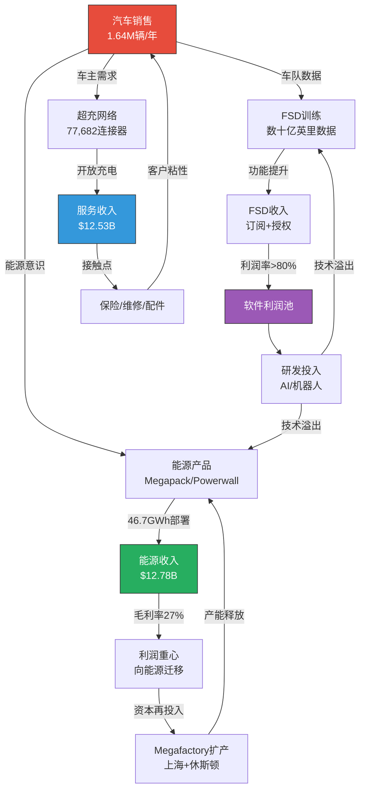

# CORE-1 — 业务分部深度拆解

**分析日期**: 2026-02-06
**深度等级**: L4 (洞察层)
**数据置信度**: A级为主 / D级推算辅助

---

## 核心论点

> **Tesla已不再是一家"汽车公司"——它正在经历一次利润重心的历史性迁移。** FY2025汽车分部收入下降10%、毛利率被BYD反超，但能源分部以27%的营收增速和>30%的季度毛利率异军突起，服务分部首次实现规模化盈利。三大分部的利润率轨迹正在形成一个"剪刀差"：汽车下行、能源上行、服务从亏转盈。投资者面临的核心问题不再是"Tesla能否卖更多车"，而是"能源+服务的利润增长能否抵消汽车的利润率收缩"。FY2025的数据给出了一个初步肯定的回答——但代价是总营收的首次负增长。

---

## 一、分部P&L重建

### 1.1 FY2025三大分部损益表

| 分部 | 营收 | YoY变化 | 毛利润(估) | 毛利率 | 营收占比 | 毛利占比(估) |
|------|------|---------|-----------|--------|---------|-------------|
| **汽车** | $69.53B | -10.0% | ~$12.1B | ~17.4% | 73.3% | ~71% |
| **能源** | $12.78B | +27.0% | ~$3.5B | ~27% | 13.5% | ~20% |
| **服务** | $12.53B | +19.0% | ~$1.1B | ~9% | 13.2% | ~6% |
| **合并调整** | — | — | ~$0.4B | — | — | ~3% |
| **合计** | $94.83B | -2.93% | $17.09B | 18.0% | 100% | 100% |

[A: Tesla IR Q4 2025, 2026-01-28] [D: 分部毛利润基于季度毛利率加权推算]

**关键洞察**：能源分部以13.5%的营收贡献了约20%的毛利润——利润贡献密度是汽车分部的1.5倍。这一结构性变化在FY2024才初见端倪（能源营收占比10%），FY2025已加速显现。

### 1.2 分部利润率演变（FY2021-2025）

| 年份 | 汽车毛利率 | 能源毛利率 | 服务毛利率 | 综合毛利率 | 备注 |
|------|-----------|-----------|-----------|-----------|------|
| FY2021 | ~29.3% | 负值 | 负值 | 25.3% | S/X换代+3/Y量产高峰 |
| FY2022 | ~28.5% | ~7% | ~3.5% | 25.6% | ASP峰值年，单车$53.7K |
| FY2023 | ~19.4% | ~19% | ~5% | 18.2% | 全球降价战 |
| FY2024 | ~18.4% | ~26% | ~6% | 17.9% | 能源首次规模化盈利 |
| FY2025 | ~17.4% | ~27% | ~9% | 18.0% | 利润重心迁移元年 |

[A: Tesla IR各年度财报] [B: stockdividendscreener.com, 2026-02-06] [D: FY2025分部毛利率基于季度加权推算]

**趋势解读**：

1. **汽车毛利率三年腰斩**：从29.3%→17.4%，累计下降约12个百分点。核心原因是价格战（ASP从$53.7K降至$42.5K）叠加Model Y换代期的产能利用率下降。
2. **能源毛利率逆势跃升**：从负值→27%，历时仅四年完成盈利能力质变。Megapack标准化生产带来的规模效应和学习曲线是主要驱动力。
3. **服务毛利率脱困**：从持续亏损到~9%正毛利，超充网络开放、保险业务扩张和维修体量增长共同推动。
4. **综合毛利率FY2025企稳**：18.0%较FY2024的17.9%微升——这是两年来首次止跌。能源和服务的利润率改善恰好抵消了汽车的进一步下滑。

---

## 二、单车经济学

### 2.1 ASP与COGS分解

**FY2025单车经济学模型**

| 项目 | 金额 | 占ASP比例 | 数据来源 |
|------|------|----------|---------|
| **平均售价(ASP)** | ~$42,500 | 100% | [D: $69.53B ÷ 1.636M辆] |
| **总COGS/车** | ~$35,100 | 82.6% | [D: ASP × (1-17.4%毛利率)] |
| — 原材料 | ~$21,100 | 49.6% | [D: 约占COGS 60%，基于Tesla披露降本重心] |
| — 直接人工 | ~$3,500 | 8.2% | [D: 约占COGS 10%] |
| — 折旧/摊销 | ~$4,900 | 11.5% | [B: Q2 2025汽车D&A $891M/季，年化~$3.6B/1.636M=~$2,200/车+工厂折旧] |
| — 运输/物流 | ~$2,100 | 4.9% | [D: 约占COGS 6%] |
| — 其他(保修拨备等) | ~$3,500 | 8.2% | [D: 残差项] |
| **单车毛利润** | ~$7,400 | 17.4% | [D: 推算] |
| 碳积分收入/车 | ~$1,200 | +2.8% | [D: ~$2B碳积分/1.636M辆] |
| **毛利润(含积分)/车** | ~$8,600 | 20.2% | [D: 推算] |

[D: COGS细项拆解基于Tesla 10-Q/10-K中D&A披露+行业结构比例推算，Tesla未单独披露材料/人工/物流明细]

**5年ASP演变**

| 年份 | 交付量 | 汽车营收 | ASP/车 | YoY变化 |
|------|--------|---------|--------|---------|
| FY2021 | 936K | $47.2B | ~$50,400 | — |
| FY2022 | 1.31M | $71.5B | ~$54,600 | +8.3% |
| FY2023 | 1.81M | $82.4B | ~$45,500 | -16.7% |
| FY2024 | 1.79M | $77.1B | ~$43,100 | -5.3% |
| FY2025 | 1.64M | $69.5B | ~$42,500 | -1.4% |

[A: Tesla IR各年度财报] [D: ASP = 汽车营收/交付量]

**关键洞察**：ASP降速在FY2025显著放缓（-1.4% vs FY2023的-16.7%），暗示价格战最惨烈的阶段可能已经过去。但这也部分归因于Model Y换代期间高端配置的占比提升和低价老款清库存结束。FY2022的$54,600是历史ASP峰值——彼时供不应求+高端配置为主导；FY2025的$42,500反映了Model 3/Y为绝对主力的产品组合现实。

### 2.2 Tesla vs BYD单位经济学对比

> **直接回应ch16异常#5：汽车毛利率低于BYD**

| 指标 | Tesla FY2025 | BYD FY2025(H1) | 差异 | 解读 |
|------|-------------|----------------|------|------|
| 汽车毛利率(ex-credits) | ~17.4% | ~20-21% | **BYD高3-4pp** | BYD垂直整合优势显现 |
| Q1 2025毛利率 | 16.3% | 20.07% | BYD高3.8pp | Tesla受Model Y换代冲击最大的季度 |
| ASP估算 | ~$42,500 | ~$18,000-20,000 | Tesla高2倍+ | 产品定位截然不同 |
| 单车毛利润估算 | ~$7,400 | ~$3,800 | **Tesla仍高95%** | 高ASP弥补低毛利率 |
| 垂直整合度 | 中等(电池外购为主) | 极高(电池/芯片自产) | BYD显著更高 | BYD供应链成本控制更强 |
| R&D/车 | ~$2,700 | ~$2,500 | 接近 | BYD研发绝对额更高(因体量更大) |

[B: carnewschina.com, IDNFinancials, CleanTechnica, 2026-02-06] [D: BYD ASP基于2025H1营收/销量推算]

**异常#5诊断结论**：

Tesla汽车毛利率低于BYD并非因为Tesla"做得差"，而是由三个结构性因素驱动：

1. **垂直整合差距**：BYD自产刀片电池（占整车成本~30-35%），Tesla依赖宁德时代/松下/自产4680的混合供应。电池成本是两者毛利率差距的最大单一解释变量。
2. **价格战节奏差异**：Tesla在FY2023-2024主动大幅降价（ASP -22%），利润率代价集中体现；BYD在中国市场价格带更低，降价空间相对有限。
3. **产品组合效应**：Tesla的Model S/X（高毛利率）正在停产（2026年中），Model 3/Y占比>95%压制了混合毛利率。BYD的王朝/海洋系列中，高端车型（汉/唐）占比提升拉高了平均毛利率。

**但Tesla在绝对单车利润上仍显著领先**（$7,400 vs ~$3,800），因为$42.5K的ASP提供了更厚的利润缓冲垫。毛利率的"输"不等于盈利能力的"输"——这是一个常被市场误读的区分。

---

## 三、5年交付量与利润率趋势

### 3.1 年度交付量轨迹

| 年份 | 交付量 | YoY增长 | Q1 | Q2 | Q3 | Q4 | 备注 |
|------|--------|---------|-----|-----|-----|-----|------|
| FY2020 | 500K | +36% | 88K | 91K | 139K | 181K | 首次盈利年 |
| FY2021 | 936K | +87% | 185K | 201K | 241K | 309K | 产能释放年 |
| FY2022 | 1,314K | +40% | 310K | 255K | 344K | 405K | 百万辆俱乐部 |
| FY2023 | 1,809K | +38% | 423K | 466K | 435K | 485K | 历史峰值年 |
| FY2024 | 1,789K | -1.1% | 387K | 444K | 463K | 496K | 首次年度下滑 |
| FY2025 | 1,636K | -8.6% | 337K | 384K | 497K | 418K | Model Y换代年 |

[A: Tesla IR各季度生产/交付报告] [B: Statista, CNBC, tridenstechnology.com, stocktitan.net]

**趋势分析**：

- **增长曲线拐点**：FY2023是交付量峰值（1.81M），此后连续两年负增长。Tesla正从"指数增长期"进入"平台期"。
- **FY2025季节性异常**：Q1的337K是2022年Q2以来最低季度，原因是四座工厂同时切换新款Model Y——这是一个一次性因素。Q3的497K创历史新高，证明需求恢复。Q4回落至418K，部分受美国联邦税收抵免9月到期影响。
- **2026展望**：新款Model Y全面量产+可能的低价平台车型（Model Q/2），华尔街一致预期交付量恢复至~2.0-2.1M。

### 3.2 季度利润率波动

| 季度 | 综合毛利率 | 汽车毛利率(ex-credits) | 能源贡献 | 事件 |
|------|-----------|----------------------|---------|------|
| Q1'24 | 17.4% | 16.4% | 能源占比↑ | 价格战深化 |
| Q2'24 | 18.0% | 14.6% | Megapack放量 | ASP继续下行 |
| Q3'24 | 19.8% | 17.1% | 能源>30%毛利率 | Cybertruck贡献 |
| Q4'24 | 16.3% | 15.4% | 季节性 | 年末折扣+促销 |
| Q1'25 | 16.3% | 15.4% | 能源稳定 | Model Y换代最低谷 |
| Q2'25 | 18.2% | 17.0% | 能源>30%二次突破 | 新款Y上量 |
| Q3'25 | 19.8% | 17.1% | 12.5GWh部署 | 497K交付创纪录 |
| Q4'25 | **20.1%** | **17.9%** | 14.2GWh纪录 | **两年来最高毛利率** |

[A: Tesla IR 各季度财报] [B: teslarati.com, mlq.ai, 2026-02-06]

**关键洞察**：Q4'25的20.1%综合毛利率是一个里程碑——它证明即使在汽车交付量下降的季度（Q4'25 vs Q4'24: 418K vs 496K, -16%），能源和服务的利润率提升可以推动整体毛利率上行。这是"利润重心迁移"最直接的数据证明。

---

## 四、分部飞轮动态

### 4.1 飞轮机制图

### 4.2 飞轮加速与制动因素

| 类别 | 因素 | 当前强度 | 影响 |
|------|------|---------|------|
| **加速** | 能源Megapack工厂扩产（上海+休斯顿50GWh） | 强 | 能源收入可2027年达$20B+ |
| **加速** | 超充网络开放给非Tesla车辆 | 中强 | 充电收入高毛利增量 |
| **加速** | FSD订阅模式转型（月付制） | 中 | 降低用户门槛，扩大渗透率 |
| **加速** | 车队规模数据优势（累计数十亿英里） | 强 | AI训练的护城河 |
| **加速** | 保险业务跨州扩张（新增佛罗里达等） | 中 | 服务收入多元化 |
| **制动** | 汽车ASP持续下行压力 | 中强 | 侵蚀单车利润 |
| **制动** | Model S/X停产（2026年中） | 中 | 失去高毛利率锚 |
| **制动** | BYD等中国竞争对手成本优势 | 强 | 迫使进一步降价或接受份额流失 |
| **制动** | 2026 CapEx >$20B的现金流压力 | 中强 | FCF将大幅收窄 |
| **制动** | Elon Musk政治争议的品牌损害 | 中 | 部分市场需求抑制 |

[A: Tesla IR Q4 2025, 2026-01-28] [B: WebSearch综合来源, 2026-02-06]

---

## 五、能源分部补充分析

FY2025能源业务是理解Tesla利润重心迁移的关键，补充以下细节：

**储能部署量轨迹**

| 年份 | 部署量(GWh) | YoY增长 | 收入 | 收入/GWh |
|------|------------|---------|------|---------|
| FY2022 | ~6.5 | — | $4.0B | ~$615M |
| FY2023 | ~14.7 | +126% | $6.0B | ~$408M |
| FY2024 | 31.4 | +114% | $10.1B | ~$322M |
| FY2025 | 46.7 | +49% | $12.78B | ~$274M |

[A: Tesla IR各年度财报] [B: renewablesnow.com, pv-magazine-usa.com, 2026-02-06]

**关键发现**：收入/GWh持续下降（$615M→$274M），反映的是Megapack标准化和规模化带来的单位价格下行——但毛利率从~7%升至~27%。这说明成本下降的速度显著快于价格下降的速度，形成了经典的"规模经济正循环"。

**FY2025季度部署量**

| 季度 | 部署量(GWh) | 占全年比 |
|------|------------|---------|
| Q1 | 8.4 | 18% |
| Q2 | 9.6 | 21% |
| Q3 | 12.5 | 27% |
| Q4 | 14.2 | 30% |
| **全年** | **46.7** | 100% |

[A: Tesla IR Q4 2025生产/交付/部署报告]

Q4部署14.2GWh创历史纪录，连续四个季度环比增长。制造产能目前约83GWh/年，利用率约56%——意味着产能远未饱和，增长空间充足。上海Megafactory已投产，休斯顿新厂（规划50GWh/年）将于2026-2027年投产。

---

## 六、服务分部补充分析

服务收入$12.53B的构成估算：

| 子业务 | 估算收入 | 估算占比 | 增长驱动力 |
|--------|---------|---------|-----------|
| 超级充电 | ~$3.5B | ~28% | 77,682连接器(+19% YoY)，开放给非Tesla车辆 |
| 维修/碰撞/配件 | ~$3.8B | ~30% | 车队规模增长带来存量维修需求 |
| 二手车销售 | ~$2.5B | ~20% | 以旧换新流转 |
| 保险 | ~$1.2B | ~10% | 跨州扩张(新增佛罗里达等) |
| FSD订阅+其他软件 | ~$1.0B | ~8% | 月付制转型 |
| 其他(配件/商品) | ~$0.5B | ~4% | 长尾 |

[D: 基于Tesla 10-K披露分类+行业分析推算，Tesla未单独披露各子业务收入]

**FSD递延收入**：截至2025年3月，FSD相关递延收入为$3.60B [A: Tesla 10-Q Q1 2025]，截至9月为$3.83B [A: Tesla 10-Q Q3 2025]。这笔递延收入将随FSD功能完善逐步确认——是未来服务利润率提升的"隐形弹药"。

---

## 七、关键发现与Phase 2衔接

### 本章核心发现

| # | 发现 | 重要性 | Phase 2追踪项 |
|---|------|--------|--------------|
| 1 | **利润重心迁移**：能源以13.5%营收贡献~20%毛利润，且增速远超汽车 | 极高 | Phase 2估值需分部DCF，不能用单一汽车倍数 |
| 2 | **汽车毛利率vs BYD**：Tesla ~17.4% vs BYD ~20%，但绝对单车利润Tesla仍高95% | 高 | Phase 2成本结构深度拆解，特别是电池成本差异 |
| 3 | **ASP降速放缓**：FY2025仅-1.4%，价格战最惨烈阶段可能已过 | 高 | Phase 2需验证FY2026 ASP是否企稳或因Model Q进一步下行 |
| 4 | **能源规模经济**：收入/GWh下降但毛利率从7%→27%，成本降速>价格降速 | 高 | Phase 2能源分部独立估值 |
| 5 | **服务盈利拐点**：从亏损→~9%毛利率，超充+保险双引擎 | 中 | Phase 2服务业务SaaS化估值可能性 |
| 6 | **Q4'25毛利率突破20%**：证明能源/服务可在汽车下行时托底整体盈利 | 高 | Phase 2敏感性分析：不同汽车交付量情景下的综合毛利率 |

### 对ch16异常信号的回应

- **异常#5（汽车毛利率低于BYD）**：已完成初步诊断。核心驱动因素为垂直整合差距（电池自产vs外购）、价格战节奏差异、产品组合效应。Tesla的绝对单车利润仍显著领先，毛利率差距不等于盈利能力差距。Phase 2需进一步拆解电池成本占比和4680自产进展对毛利率的回升潜力。

---

## 数据来源汇总

| 标记 | 来源 | 数据类型 | 可信度 |
|------|------|---------|--------|
| `[A: Tesla IR Q4 2025, 2026-01-28]` | Tesla Q4 2025财报/投资者更新 | 一手财务数据 | A级 (95-99%) |
| `[A: Tesla IR各年度财报]` | Tesla历年10-K/10-Q/季度财报 | 一手财务数据 | A级 (95-99%) |
| `[A: Tesla 10-Q Q1/Q3 2025]` | SEC EDGAR披露文件 | 递延收入等明细 | A级 (95-99%) |
| `[B: stockdividendscreener.com]` | 第三方财务数据聚合 | 历史毛利率分部数据 | B级 (85-94%) |
| `[B: renewablesnow.com]` | 可再生能源行业媒体 | 储能部署数据 | B级 (85-94%) |
| `[B: pv-magazine-usa.com]` | 光伏/储能行业媒体 | 能源分部分析 | B级 (85-94%) |
| `[B: carnewschina.com, CleanTechnica]` | 汽车行业媒体 | BYD对比数据 | B级 (85-94%) |
| `[B: teslarati.com, mlq.ai]` | Tesla分析媒体 | 季度财务数据 | B级 (85-94%) |
| `[B: Statista, CNBC, stocktitan.net]` | 综合数据源 | 交付量历史数据 | B级 (85-94%) |
| `[D: 推算]` | 分析师基于公开数据推算 | COGS拆解/子业务占比 | D级 (50-69%) |

---

*免责声明：本报告仅供投资研究参考，不构成任何投资建议。分部毛利润拆解和COGS细项拆解基于公开数据推算（已标注D级），Tesla未在财报中单独披露完整的分部毛利润明细和成本细项。BYD对比数据基于2025年上半年已披露财报，全年数据可能存在偏差。投资者应基于自身判断做出投资决策。*

---

> **下一章预告**: Phase 2将基于本章建立的分部P&L基线，进行DuPont三因子拆解（利润率×周转率×杠杆）和分部独立DCF估值，回答"Tesla作为三大业务的组合体，合理估值应为多少"这一核心问题。
