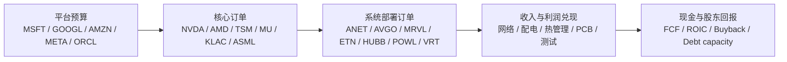

# 2026-04-21 AI 产业地图 v8：四层系统图、模块母表、三张榜与证据卡

副标题：  
一份面向投资者的长版研究稿，覆盖 AI 核心链条、扩散链条、外围链条、模块周期、利润分配、竞争结构、信用脆弱性、回调动作，以及可复用的模块母表底板

---

---

## 动作语言字典（合规统一 / 对齐 LITE · COHR · FORM 等既往报告）

本报告**不提供投资建议**,不含"买入/卖出/加仓/减仓/推荐/建议投资/建仓/重仓/值得买"等语言。全部表达统一为**关注层级语言**,与本研究体系既往报告(如 LITE / COHR / FORM / MA / PLTR)对齐。读者据此进行的任何投资决策均为读者自行判断。

| 动作层级 | 含义 | 对应榜单 / 评级 |
|---|---|---|
| **核心关注** | 最高优先级,回调优先复盘;节点不可绕开 + 财务弹性较强 | 榜一 · 结构性核心池 |
| **优先关注** | 重要性高于当前市场热度,中期优先深挖方向 | 榜二 · 当前研究优先池 |
| **持续关注** | 常态跟踪,等待信号或证据更清晰 | 三榜均可,多见于榜二 |
| **选择性关注** | 条件性跟踪,需要特定财务或执行前置确认 | 榜二 / 榜三之间 |
| **交易观察** | 仅限事件或价格窗口,不纳入结构性核心关注 | 榜三 · 交易回调池 |
| **保留观察** | 暂不优先,等待基本面或执行更明确 | 榜三 · 交易回调池偏后 |

**本字典贯穿全文**——任何表格的"当前动作"列、证据卡的"最优表达"、三分系统的打分反查,都只使用这六类语言之一。与个股报告(LITE/COHR/FORM 等)的"评级 = 深度关注 / 核心关注 / 优先关注 / 持续关注 / 中性关注 / 审慎关注" 语言体系形成**个股评级 × 产业链动作**的双向对齐。

---

## 执行摘要：如果只有三页时间

本报告篇幅较长。但真正驱动决策的只有五件事——如果读者只愿意花三页时间，这五件事足够建立一个可执行的 AI 产业视角，详细论证与证据链在正文与附录中展开。

### 一、现在最该看哪三层

1. **结构性核心层**（高质量利润池 + 不可绕开 + 估值回调主要是估值压缩而非信用收缩）——代表：`TSM / KLAC / ASML / NVDA / ANET`。
2. **长周期持续兑现层**（经营兑现慢于最热层，但订单和 backlog 可见性更高）——代表：`ETN / HUBB / POWL / NVT`。
3. **重要性仍高于注意力的高端配套层**（AI 高速板、先进封装测试所需配套）——代表：`胜宏科技 / 沪电股份 / 深南电路 / TTMI`。

### 二、现在最不该追的三层

1. **高 beta 高拥挤光连接层**——`LITE / COHR` 等光模块，估值、客户集中与代际切换风险同时放大。
2. **执行放大量层**——`SMCI / DELL / HPE` 等系统交付层，毛利薄、营运资本压力大、财务结构不够稳。
3. **高估值纯液冷与纯测试主题股**——方向对，但价格已跑在兑现前。

### 三、Top 10 真正该持续跟踪的名字

跨三张榜单浓缩，依次是：`NVDA` / `TSM` / `KLAC` / `ASML` / `ANET` / `ETN` / `HUBB` / `POWL` / `MU`（带周期纪律）/ `胜宏科技`。这 10 家覆盖主利润池、长周期承接、关键配套三个位置，**拒绝把它们与光模块 / 服务器 / 纯测试名字同尺比较**。

### 四、三条最关键触发器

一旦出现以下任一信号，整张模块母表应被重新排序：

1. **预算源失速**：`MSFT / GOOGL / AMZN / META` 集体下修 AI CapEx 指引（幅度 >10%）——全链重定价。
2. **物理供给约束解除**：`TSM` 先进封装（CoWoS）利用率明显转弱，或 HBM 供给释放明显快于需求——最核心利润池先被压倍数。
3. **部署层约束松动**：`ETN / HUBB / POWL / VRT` 的 backlog 或 lead time 方向首次逆转——长周期承接层的耐心溢价会快速回吐。

### 五、三个最可能打脸的风险

1. **通用 GPU 预算向自研 ASIC 实质性分流** — `NVDA` 的利润池被重新分配，而市场已把"NVDA 永续领先"充分定价。
2. **电力接入周期比 AI 情绪周期更长** — `ETN / HUBB / POWL` 即使基本面对，也可能在一轮题材调整里被一并压估值，形成"正确但耐心不够"的错位。
3. **高端 AI PCB 和先进封装测试同步进入供给补齐期** — `胜宏科技 / 沪电 / TTMI / FORM` 的估值前置部分被压缩，市场先降级，再慢慢确认利润。

### 阅读路径

- **只想要决策**：读完本执行摘要 → 直接跳到"十、结构性核心池 / 当前研究优先池 / 交易回调池"三张榜单。
- **想理解方法**：读"零、阅读指南" → "四、主链全图" → "四点五、模块母表" → "四点六、模块证据卡"。
- **想要复盘工具**：读"四点五点八点一、三分系统" → "三十一、持续关注清单" → "三十二点三、版本变化日志"。

---

## 零、阅读指南：这份报告如何使用

### 0.1 读者能从这份报告里带走什么

这份报告不是再给 AI 产业链加一份"谁沾边"的名单。它要解决的，是读者在 AI 主题下最常卡住的几件事：

- 知道"谁在链上"，但不知道谁真的在拿钱。  
- 知道"哪一层最重要"，但不知道它是不是当前值得进入关注。  
- 知道"下一轮会回调"，但不知道回调里哪些模块先脆、哪些更能扛。  

读完之后，读者应能区分三张完全不同的清单：

1. 谁是主利润池中心。  
2. 谁是下一阶段持续兑现层。  
3. 谁虽然重要，但更适合等待回调或只做交易。  

### 0.2 核心框架：AI 不是一条链，而是一张闭环网络

AI 产业不应再被看成"芯片 → 服务器 → 软件"的横向清单。  
更准确的理解是：**它是一张由预算、制造、部署、回流组成的闭环网络。**

这张网络可以拆成四层：

1. **结构层** — 系统里到底有什么关键事物。  
2. **约束层** — 什么在真正限制扩张、利润和兑现。  
3. **时钟层** — 每个模块按什么节奏兑现，市场又按什么节奏定价。  
4. **定价层** — 哪些适合长期研究，哪些适合回调再看，哪些仅限交易观察。  

四层之间是串联关系，不是并列标签：结构层回答"里面有什么" → 约束层回答"什么卡住它" → 时钟层回答"什么时候兑现" → 定价层回答"现在该拿哪一块"。

### 0.3 这份报告该怎么读

如果你是第一次接触这份地图，阅读顺序建议是：

1. 先看第二到第四部分，建立主链、扩散链、外围链的大边界。  
2. 再看第四点五部分的模块母表，建立"结构、约束、时钟、利润、信用、动作"一体化视角。  
3. 然后看 Top 20、周期钟、订单瀑布、利润分配、竞争结构、信用脆弱性、估值框架、回调动作。  
4. 最后看持续关注清单与触发器，把它变成后续复盘的工作表。  

如果你已经熟悉 AI 产业链，最值得先看的不是 Top 20，而是：

- 模块母表怎么定义  
- 哪些变量一变，就应该触发整张模块母表重新排序  

### 0.4 四层系统图与正文各章如何对应

- **结构层** — 主链全图 / Top 20 / 中国链条 / 全链条节点总表  
- **约束层** — 哪些环节当前更值得持续关注 / 利润分配 / 客户集中度与议价权 / 供给弹性与替代路径  
- **时钟层** — 模块周期钟 / 订单瀑布与传导时滞 / 公司所处周期位置 / Bull / Base / Bear 情景  
- **定价层** — 拥挤度与持有人脆弱性 / 估值框架分层 / 去杠杆与信用压力 / 回调动作手册

### 0.5 这版相对上一版新增了什么

这版 `v8` 不是重新推翻前文，而是针对上一版最明显的五个缺口做结构化修订：

1. **把单一 Top 20 改成三张榜**  
   不再把 `MSFT / NVDA / ETN / FORM` 这种本不该同尺比较的名字强行排成一个总名次。  

2. **新增证据卡结构**  
   固定每个模块都回答：
   - 支持事实
   - 削弱事实
   - 最优表达
   - 最危险错法
   - 失效触发

3. **新增更硬的财务指标底板**  
   除了 `PE / current ratio / debt to equity / net debt to EBITDA`，再补入：
   - gross margin
   - operating margin
   - EBITDA margin
   - FCF margin
   - ROIC / ROCE
   - CapEx / revenue
   - inventory days / DSO / cash conversion
   - book-to-bill / backlog coverage

4. **新增更可审计的来源结构**  
   将附录中的来源说明从“零散列举公司材料”提升为“模块 -> 证据类型 -> 一手文件”的矩阵。  

5. **新增更像地图的可视化页**  
   不是为了好看，而是为了让复盘更快。  

### 0.6 四张核心图

#### 图 1：预算 -> 订单 -> 收入 -> 现金的瀑布图

#### 图 2：利润池深度 × 供给刚性的二维压缩图

| 区域 | 代表模块 | 解释 |
|---|---|---|
| 高利润池 + 低供给弹性 | GPU / HBM / 先进制程 / 关键设备 | 主利润池核心 |
| 中高利润池 + 中供给弹性 | 网络 / 部分平台预算外溢层 | 高质量扩散层 |
| 中利润池 + 中低供给弹性 | 配电 / 电力接入 / 热管理平台层 | 慢兑现但持续时间更长 |
| 低利润池 + 高供给弹性 | 光模块 / 服务器 / 测试纯表达 | 更接近交易层 |

#### 图 3：模块周期钟压缩图

| 时钟位置 | 代表模块 |
|---|---|
| 起点 | 平台预算源 |
| 前中段 | 配电 / 电力接入 / PCB / 部分测试 |
| 中段偏前 | GPU / HBM / 先进封装 / 网络 |
| 中后段偏拥挤 | 光模块 / 纯液冷主题 / 部分测试弹性 |
| 更晚段 | workflow 商业化 / 公用事业与 REIT 映射 |

#### 图 4：拥挤度 × 财务韧性的四象限图

| 象限 | 代表模块 | 当前动作 |
|---|---|---|
| 高拥挤 + 高韧性 | `NVDA / TSM / KLAC / ANET` | 回调优先复盘 |
| 低拥挤 + 高韧性 | `ETN / HUBB / POWL` | 当前优先研究 |
| 高拥挤 + 低韧性 | `LITE / COHR / FORM / 部分纯液冷表达` | 交易观察 |
| 低拥挤 + 低韧性 | 部分执行层与高杠杆扩散层 | 回调保留观察（暂不优先） |

## 一、这份文章回答什么问题

这份文章不假设读者已经熟悉半导体或数据中心的专业框架。

它要回答的，只有几件最重要的事：

1. AI 产业链最核心的环节到底在哪里。
2. 哪些公司是真正处在主链上的，哪些只是相邻受益，哪些只是外部映射。
3. 当前市场最热的环节在哪里，哪些环节的重要性反而高于市场热度。
4. 配电、电力、线路板、测试与封装这些经常被忽视的环节，哪些标的值得单独拉出来看。
5. `FormFactor`、`胜宏科技`、`ETN/HUBB/POWL/NVT` 这类容易被放在边缘的名字，应该如何放回主链或扩散链的正确位置。
6. 如果只保留一份最实用的名单，哪些公司应当进入 AI 核心节点 Top 20。
7. 这些环节分别处在什么周期位置，当前更适合研究哪一层、回避哪一层。
8. AI 资本开支是如何沿着产业链向下传导的，哪些环节先拿订单，哪些环节后拿利润。
9. 一条主题链里，谁拿收入，谁拿毛利，谁最终给股东更高的回报。

---

## 二、先给结论：AI 不是一条线，而是三层结构

把 AI 产业链画成一条横向直线，几乎一定会误导判断。

更准确的做法是分成三层：

### 1. 最核心的“算力和制造主链”

这一层决定：
- 是否有足够的计算能力
- 是否有足够的高带宽内存
- 是否有先进封装和先进制程
- 是否有制造良率和过程控制

这一层的代表是：
- 需求源平台：`MSFT / GOOGL / AMZN / META / ORCL`
- 加速器：`NVDA / AMD`
- HBM / 内存：`SK Hynix / Samsung / MU`
- 先进制程与封装：`TSM`
- 设备与过程控制：`ASML / KLAC / LRCX / AMAT`

### 2. 第一圈扩散链

这一层决定：
- 大规模集群是否能联起来
- 机柜和服务器是否能交付
- 电力和热是否能承载
- 高速互连和板级设计是否能跟上

这一层的代表是：
- 网络：`ANET / AVGO / MRVL`
- 光模块：`LITE / COHR / CIEN / AAOI`
- 服务器和整机：`SMCI / DELL / HPE / 工业富联 / 浪潮信息`
- 配电和供电：`VRT / ETN / HUBB / POWL / NVT`
- 全球电气设备：`Schneider Electric / Siemens / ABB`
- 高频高速 PCB：`胜宏科技 / 沪电股份 / 深南电路 / TTM Technologies`

### 3. 外围商业化层

这一层决定：
- AI 如何变成企业工作流和软件收入
- 数据中心建设如何映射到公用事业、地产和 EPC

这一层的代表是：
- 软件与工作流：`CRM / NOW / PLTR / DDOG`
- 公用事业和 REIT：`CEG / VST / NRG / EQIX / DLR`

这层很重要，但不能和物理主链混成一个池子。  
原因很简单：它们受益于 AI 的方式、兑现节奏和估值方法都不一样。

---

## 三、怎么判断一个环节是不是“核心”

对读者来说，不需要记专业术语，只要记住下面三条：

### 1. 它是不是不可绕开的关键环节

如果没有这个环节，整条链很难往下走，那么它大概率属于核心层。

例如：
- 顶级 GPU
- HBM
- 先进制程与先进封装
- EUV 光刻
- 过程控制与缺陷检测

### 2. 它是不是利润最先兑现的地方

有些环节虽然重要，但利润来得很晚；有些环节虽然不是最显眼，但利润确认很快。

例如：
- `NVDA`、`TSM`、`MU` 已经是强兑现层
- `ETN/HUBB/POWL` 更像慢兑现、长周期受益层
- `CRM/NOW` 则是另一种软件迁移周期

### 3. 它的供给是不是难以快速补上

如果供给很容易扩张，那么它更像高弹性相邻层，而不是长期稀缺环节。

例如：
- 光模块和部分液冷方案，供给扩张速度通常快于 HBM 和先进封装
- 服务器整机和高频高速板是重要执行层，但长期议价能力通常不如主链核心环节

---

## 四、AI 主链全图：哪些环节属于核心、扩散、外围

### 4.1 核心主链

| 模块 | 主要作用 | 代表公司 | 当前判断 |
|---|---|---|---|
| 平台需求源 | 决定 AI 资本开支和推理/训练预算 | `MSFT / GOOGL / AMZN / META / ORCL` | 一切的源头 |
| 商业加速器 | 提供训练与推理算力 | `NVDA / AMD` | 最直接的第一受益层 |
| HBM / 高带宽内存 | 提供高性能数据吞吐 | `SK Hynix / Samsung / MU` | 仍是核心卡点 |
| 先进制程与先进封装 | 把加速器、HBM、chiplet 做出来 | `TSM / ASE / AMKR` | `TSM` 仍是主导者 |
| 设备与过程控制 | 决定先进制造能否稳定量产 | `ASML / KLAC / LRCX / AMAT` | 质量最高的卖铲层 |

### 4.2 第一圈扩散链

| 模块 | 主要作用 | 代表公司 | 当前判断 |
|---|---|---|---|
| 网络与交换 | 让大模型集群扩展 | `ANET / AVGO / MRVL` | 比光模块更稳的扩散层 |
| 光模块与光器件 | 提供高速光连接 | `LITE / COHR / CIEN / AAOI` | 真实受益，但当前最拥挤 |
| 服务器与整机 | 负责 AI 服务器交付和系统集成 | `SMCI / DELL / HPE / 工业富联 / 浪潮信息` | 重要，但利润池偏浅 |
| 配电与供电 | 解决机架功率密度、配电、保护 | `VRT / ETN / HUBB / POWL / NVT` | 长周期受益，常被低估 |
| 液冷与热管理 | 解决高功耗机柜散热 | `VRT / MOD / TT` | adoption 真实，但部分标的过热 |
| 高频高速 PCB / 背板 | 承接 AI 服务器、交换机、加速卡、高速信号完整性 | `胜宏科技 / 沪电股份 / 深南电路 / TTMI` | 重要配套层，但当前不宜简单按低估处理 |
| 探针卡 / 测试设备 / 处理设备 | 保证先进封装、HBM、GPU、AI PCBA 的良率与一致性 | `FORM / TER / COHU / Technoprobe / JEM / Micronics` | 重要，但内部层次需要细分 |

### 4.3 外围层

| 模块 | 代表公司 | 当前判断 |
|---|---|---|
| 公用事业与发电 | `CEG / VST / NRG` | 受益于数据中心负荷，但不是纯 AI 主链 |
| 数据中心 REIT | `EQIX / DLR` | 有受益，但估值和利率敏感性更强 |
| 软件与企业工作流 | `CRM / NOW / PLTR / DDOG` | 重要，但属于另一套商业化逻辑 |

---

## 四点五、模块母表底板：把结构、约束、时钟、利润、信用和动作压进一张工作表

前面四个部分回答的是：

- AI 链条大体分成什么层  
- 哪些公司和模块属于核心、扩散、外围  

但如果要让这份报告能被长期使用，仅靠叙述还不够。  
还必须把每个模块都压进同一张工作底板里，这样以后更新时才不会重新退回“哪个板块最热”的讨论。

这张母表的目的，不是替代正文，而是给正文提供一个稳定的更新骨架。  
以后无论是继续升级 AI 文章，还是切换到航天、军工、航空后市场、电力设备、LNG 或软件自动化，都可以先用同一张底板建模，再往下展开。

### 4.5.1 母表固定字段：8 个核心字段 + 4 个执行字段

模块母表固定成 **12 列**。  
其中前 8 列负责判断结构，后 4 列负责保证可执行性。

| 字段 | 定义 | 填写要求 | 最常见误填 |
|---|---|---|---|
| 模块 | 为了分类而设的阅读标签 | 用行业通用模块名 | 把它当判断本身 |
| 事物节点 | 这个模块真正提供的稀缺事物 | 不写板块名，要写能力、容量、接口、供给 | 把“光模块”“服务器”“PCB”当最终答案 |
| 约束节点 | 当前决定它能否扩、能否赚、能否兑现的主约束 | 只写 1-2 个最硬约束 | 把所有风险全部堆进去 |
| 时钟位置 | 经营兑现和市场定价当前处在哪一段 | 必须同时写经营时钟和定价时钟 | 只写“景气很好” |
| 利润池深度 | 最终能留在公司和股东手里的利润有多深 | 用很深/深/中深/中/中浅/浅 | 把收入弹性误当利润深度 |
| 供给弹性 | 当需求上来时，这个模块的供给多久能补上 | 用低/中低/中/中高/高 | 把重要性误当低供给弹性 |
| 财务弹性 | 这一层公司整体更像高现金低杠杆，还是反之 | 用强/中强/中/中弱/弱 | 只看 PE，不看现金转换 |
| 当前估值状态 | 市场现在是在低估、合理、拥挤还是过热 | 必须写成一句完整判断 | 只写“贵/便宜” |
| 适合动作 | 当前更适合怎么处理 | 用动作语言：核心关注/优先关注/选择性关注/交易观察/回避 | 只写“看好/不看好” |
| 代表公司 | 把模块落到股票池 | 只保留最具代表性的公开上市公司 | 名单无限扩张 |
| 关键跟踪变量 | 这层以后真正要盯什么 | 尽量是可更新的经营或订单变量 | 写成空泛判断 |
| 失效触发 | 哪种变化一出现，应重排这层排序 | 必须写成触发器而非感受 | 写成“如果不好就不行” |

### 4.5.2 母表的填写纪律

这部分不是形式要求，而是防止研究再次退回“题材热度表”。

第一，**先填事物节点，再填其他列**。  
因为后面几乎所有列都依赖第一列。

例如：

- “光模块”不是最终事物节点，更准确的是“高速光连接能力”。  
- “配电与电力”不是最终事物节点，更准确的是“数据中心上电、配电与保护能力”。  
- “服务器”不是最终事物节点，更准确的是“AI 系统交付与集成能力”。  

第二，**约束节点只写最硬的 1-2 个**。  
真正有用的约束，是会改变模块排序的约束，而不是风险清单。

第三，**时钟位置必须写两个时钟**：

- 经营兑现时钟  
- 市场定价时钟  

同一个模块，经营上可能仍在前中段，定价上却已经进入中后段拥挤区。  
这正是很多 AI 名字“基本面没错、但股价已经太前”的根源。

第四，**利润池深度必须和重要性分开写**。  
服务器、PCB、测试链都可能很重要，但不等于它们天然处在最深的利润池里。

第五，**适合动作必须写成仓位或研究动作**。  
母表不是观点表，而是工作表。  
因此“核心关注”“优先关注”“交易观察”“回调优先看”“回避”比“长期看好”更有用。

### 4.5.3 母表空白模板

以后如果切换到别的行业，可以直接复制下面这张空表：

| 模块 | 事物节点 | 约束节点 | 时钟位置 | 利润池深度 | 供给弹性 | 财务弹性 | 当前估值状态 | 适合动作 | 代表公司 | 关键跟踪变量 | 失效触发 |
|---|---|---|---|---|---|---|---|---|---|---|---|
|  |  |  |  |  |  |  |  |  |  |  |  |

### 4.5.4 按当前 AI 产业预填的模块母表

下面这张表不是一次性观点表，而是未来复盘时的工作底板。  
它综合了后文的三层结构、模块周期钟、订单瀑布、利润分配、竞争结构、供给弹性、财务分组、拥挤度判断和回调动作。

| 模块 | 事物节点 | 约束节点 | 时钟位置 | 利润池深度 | 供给弹性 | 财务弹性 | 当前估值状态 | 适合动作 | 代表公司 | 关键跟踪变量 | 失效触发 |
|---|---|---|---|---|---|---|---|---|---|---|---|
| 平台预算源 | AI CapEx 与 ROI 决策权 | 平台 ROI、应用层回流、预算纪律 | 经营起点最早；市场长期化定价 | 很深，但不是直接硬件利润池 | 不适用 | 强 | 核心但不能按纯题材估值 | 核心关注 | `MSFT / GOOGL / AMZN / META / ORCL` | CapEx 指引、云/广告/AI 收入回流 | 平台集体下修 AI CapEx |
| GPU / 加速器 | 训练与推理算力供给 | 平台预算、自研 ASIC 分流、HBM/封装配套 | 经营高景气中段；市场预期已高 | 很深 | 低 | 强 | 高质量核心拥挤，但仍是主利润池中心 | 核心关注，回调优先复盘 | `NVDA / AMD` | 出货、毛利、系统级供给、集群部署 | 平台预算转弱或自研 ASIC 明显分流 |
| 定制 ASIC / 设计协同 | 平台算力预算分流通道 | 大客户项目节奏、导入验证、网络配套 | 经营中段；市场认知仍在扩散 | 中深 | 中 | 中 | 结构性受益，但并非主利润池中心 | 重点研究 | `AVGO / MRVL` | ASIC 项目进度、客户导入、单位内容量 | 大客户 ASIC 推进放缓 |
| HBM / 高带宽内存 | AI 级有效内存带宽供给 | 有效供给、代际验证、memory 周期 | 经营中段偏前；定价带周期折扣 | 深，但需周期折扣 | 低 | 中强 | 结构重要，但不能简单按“低估”处理 | 持续关注（带周期纪律） | `MU / SK Hynix / Samsung` | HBM 供给、代际进展、价格、CapEx | 供给释放快于需求 |
| 先进制程 / 先进封装 | 前沿制造与封装整合能力 | CoWoS/封装利用率、良率、扩产节奏 | 经营中段偏前；定价中高 | 很深 | 低 | 强 | 核心高质量层，估值不低但逻辑最完整 | 核心关注，回调优先复盘 | `TSM / ASE / AMKR` | 封装利用率、产能、CapEx、客户结构 | 先进封装利用率转弱 |
| 关键设备 / 过程控制 | 良率、缺陷检测与复杂工艺控制能力 | 客户 frontier CapEx、复杂度提升斜率 | 经营中段稳态；定价高质量化 | 很深 | 低 | 强 | 高质量卖方市场，不便宜但自洽 | 核心关注 | `ASML / KLAC / LRCX / AMAT` | WFE 订单、客户扩产、过程复杂度 | 前沿 CapEx 显著放缓 |
| 网络与交换 | 大模型集群 scale-out 能力 | 集群扩张节奏、协议路径、交换平台升级 | 经营中段偏前；定价中段偏前 | 中深 | 中 | 强到中强 | 高质量扩散层，结构优于光模块 | 重点研究 | `ANET / AVGO / MRVL / NVDA` | AI 网络订单、交换平台升级、客户结构 | AI 集群扩张不再加速 |
| 光模块 / 光器件 | 高速光连接能力 | ASP、客户压价、代际切换、供给跟上 | 经营中后段；定价偏拥挤 | 中低 | 中高 | 弱到中低 | 高 beta、拥挤、估值前置 | 交易观察，不纳入结构性核心关注 | `LITE / COHR / CIEN / AAOI` | 800G/1.6T 切换、ASP、库存 | ASP 与订单同步转弱 |
| 服务器 / 整机 / ODM / EMS | AI 系统交付与集成能力 | 客户压价、营运资本、库存和应收 | 经营中段执行期；定价不稳定 | 浅到中浅 | 高 | 中到中弱 | 执行放大量，不是主利润池 | 选择性关注，回调先分财务质量 | `SMCI / DELL / HPE / 工业富联 / 浪潮信息 / JBL / SANM` | AI 服务器收入、库存、应收、现金转换 | 收入增长但现金流恶化 |
| 配电 / 保护 / 电力接入 | 数据中心上电、配电与保护能力 | 接入节奏、backlog、lead time、book-to-bill | 经营前中段，兑现慢但持续；市场热度仍低于重要性 | 中深 | 中低 | 中强 | 重要性高于热度，经常被低估成外围映射 | 优先关注（持续关注方向） | `ETN / HUBB / POWL / NVT / Schneider / Siemens / ABB` | backlog、lead time、book-to-bill、FCF | backlog 降速、lead time 逆转 |
| 热管理 / 液冷 | 高功率机柜热交换与散热集成能力 | adoption 节奏、集成能力、纯表达与平台分化 | 经营前中段；定价局部偏热 | 中 | 中 | 中 | 方向对，但估值分化大 | 只看综合平台，纯表达谨慎 | `VRT / MOD / TT / NVT` | adoption、项目落地、毛利变化 | adoption 放缓且估值不修正 |
| PCB / 背板 / CCL | 板级高速互连与信号完整性能力 | 产品结构、低损耗材料、客户议价、良率 | 经营前中段；定价通常慢于 GPU/网络被看见 | 中到中浅 | 中高 | 中 | 重要性高于当前热度，但不应简单当低估 | 持续关注，回调后选择性复盘 | `胜宏科技 / 沪电股份 / 深南电路 / TTMI / 生益科技 / 台光电` | 高端产品占比、毛利、订单、客户结构 | 高端占比不升反降 |
| 探针卡 / 测试 / handler | KGD、先进封装与系统级测试能力 | 竞争结构、技术路线、估值纪律 | 经营前中段；情绪常走在基本面前面 | 中 | 中 | 中到中弱 | 纯度高但竞争更充分、估值更脆 | 保留观察，不纳入核心关注 | `FORM / TER / COHU / Technoprobe / JEM / Micronics` | HBM/先进封装测试需求、系统级测试订单 | 需求未兑现但估值继续上行 |
| 软件 / workflow 外环 | 企业预算入口与 workflow 迁移能力 | 预算入口、工作流粘性、定价权 | 经营早段分化期；定价先于兑现分化 | 分化很大 | 高 | 中 | 必须单独估值，不能混进物理主链 | 单独研究，只看少数预算入口控制者 | `CRM / NOW / PLTR / DDOG` | usage、部署、workflow 迁移、席位与结果计费 | 预算入口弱、兑现跟不上估值 |
| 公用事业 / REIT 外环 | 数据中心负荷承接与地产映射能力 | 电力项目落地、利率、上架率 | 经营更晚段；定价受利率与项目双影响 | 中 | 中低 | 中 | 不是纯 AI 主链，定价受外生变量影响更大 | 单独框架持续关注 | `CEG / VST / NRG / EQIX / DLR` | 负荷预测、项目落地、利率 | 项目推进与负荷预测不及预期 |

### 4.5.5 这张母表最该怎么用

第一，它首先不是股票池，而是**模块排序器**。  
它解决的是：哪些是真核心、哪些是第二阶段受益层、哪些重要但利润浅、哪些更像高 beta 交易层。

第二，每次更新不要 12 列同时改。  
最先检查的通常只有三列：

- 约束节点有没有变  
- 时钟位置有没有变  
- 当前估值状态有没有变  

因为这三列一变，后面的动作建议往往会跟着一起变。

第三，真正触发整表重排的，不是股价波动，而是结构变量变化。  
最典型的触发器包括：

- 平台集体下修 AI CapEx  
- HBM 供给释放快于需求  
- `TSM` 先进封装利用率转弱  
- `ANET` 等网络层确认集群扩张不再加速  
- 光模块 ASP 和订单同时转弱  
- `ETN / HUBB / POWL / VRT` 的 backlog 或 lead time 方向逆转  
- `FORM / TER / COHU` AI 测试需求不再兑现但估值仍高  

### 4.5.6 轻量打分版：让母表能支持排序，但不把研究压扁成打分器

如果后续需要把这张母表进一步转成排序器，可以使用一个**轻量评分版**。  
这里的原则是：

- 打分只用于辅助排序，不替代正文判断。  
- 不给 12 列全部打分，只给最影响排序的 5 列打分。  

建议固定的 5 个评分维度是：

| 评分项 | 1 分 | 3 分 | 5 分 |
|---|---|---|---|
| 结构关键性 | 可替代、非必经 | 重要但非唯一通道 | 不可绕开、系统性必经 |
| 利润池厚度 | 收入有弹性、利润浅 | 利润中等、需挑公司 | 利润很深且能留在股东手里 |
| 供给刚性 | 供给很快补上 | 扩张需要时间 | 供给长期难补 |
| 财务韧性 | 杠杆高、现金弱 | 结构一般 | 高现金、高 FCF、低杠杆 |
| 当前定价性价比 | 过热拥挤 | 大体合理 | 重要性高于热度、研究价值高 |

这 5 项加总为 25 分。  
25 分不是目标本身，它只是帮助你快速区分：

- 哪些模块值得放进核心研究池  
- 哪些模块更适合研究池  
- 哪些模块仅限交易观察观察  

### 4.5.7 当前 AI 模块的轻量评分示意

| 模块 | 结构关键性 | 利润池厚度 | 供给刚性 | 财务韧性 | 当前定价性价比 | 合计 | 当前更接近什么 |
|---|---|---|---|---|---|---|---|
| GPU / 加速器 | 5 | 5 | 5 | 5 | 2 | 22 | 主利润池核心，但估值高 |
| 先进制程 / 先进封装 | 5 | 5 | 5 | 5 | 3 | 23 | 最完整的高质量主链承接层 |
| 关键设备 / 过程控制 | 5 | 5 | 5 | 5 | 3 | 23 | 高质量卖方市场 |
| 网络与交换 | 4 | 4 | 3 | 4 | 3 | 18 | 第一圈高质量扩散层 |
| 配电 / 保护 / 电力接入 | 4 | 4 | 4 | 4 | 4 | 20 | 当前最值得优先关注的持续兑现层 |
| HBM / 高带宽内存 | 5 | 4 | 5 | 4 | 3 | 21 | 结构核心，但需带周期纪律 |
| 热管理 / 液冷 | 3 | 3 | 3 | 3 | 2 | 14 | 方向对，但平台和纯表达要分开 |
| PCB / 背板 / CCL | 3 | 2 | 2 | 3 | 4 | 14 | 重要性高于热度，但不是主利润池 |
| 探针卡 / 测试 / handler | 3 | 2 | 3 | 2 | 2 | 12 | 需要挑节点，不能按整板块交易 |
| 光模块 / 光器件 | 3 | 2 | 2 | 2 | 1 | 10 | 高 beta 交易层 |
| 服务器 / 整机 / EMS | 3 | 1 | 1 | 2 | 3 | 10 | 重要执行层，但利润池浅 |
| 软件 / workflow 外环 | 3 | 3 | 2 | 3 | 2 | 13 | 必须单独估值，不能和主链混排 |

这里最重要的不是分数本身，而是它暴露出两个结构事实：

第一，**高分不等于现在就最该进入关注名单**。  
GPU、HBM、先进封装、关键设备分数高，是因为它们更靠近真正的硬约束和深利润池；  
但当前定价性价比未必也高。

第二，**当前更值得优先关注的，不一定是分数最高的模块**。  
配电、保护和电力接入在结构质量、供给刚性、财务韧性和当前定价性价比之间，形成了更平衡的组合。  
这也是为什么它在这篇报告里一直被放在更靠前的位置。

---

### 4.5.8 固定财务指标底板：以后不要只看 PE

如果想把这张母表真正做成可重复更新的工作底板，财务口径必须固定。  
否则每一轮更新都容易退回“这家公司贵不贵”的松散讨论。

建议把财务指标分成三层：

#### 第一层：所有模块都要看的通用财务指标

| 指标 | 用来回答什么 | 适用范围 |
|---|---|---|
| gross margin | 公司到底有没有技术溢价与产品结构优势 | 全部模块 |
| operating margin | 经营杠杆是否在兑现 | 全部模块 |
| EBITDA margin | 重资产与周期资产的经营质量 | 制造、设备、交付、基础设施 |
| FCF margin | 利润是否能转成真钱 | 全部模块 |
| ROIC / ROCE | 资本投入是否真有高回报 | 芯片、设备、基础设施、软件 |
| CapEx / revenue | 扩产和维持增长到底要花多少钱 | 代工、设备、基础设施、服务器 |
| net debt / EBITDA | 去杠杆风险是否会先于基本面暴露 | 全部模块 |
| current ratio / quick ratio | 短期流动性是否足够 | 交付层、扩散层、小市值弹性股 |

#### 第二层：制造与扩散链更应看的周转类指标

| 指标 | 用来回答什么 | 最适用模块 |
|---|---|---|
| inventory days | 库存有没有堆在需求下滑前 | 光模块、服务器、测试、PCB |
| DSO / 应收周转天数 | 收入是不是变成了应收而不是现金 | 服务器、EMS、系统交付、PCB |
| cash conversion | 订单和利润有没有真的转成现金 | 服务器、测试、配套层 |
| backlog coverage | backlog 能否支撑后续收入 | 配电、基础设施、工程交付 |
| book-to-bill | 新订单是否仍在超前于交付 | 配电、热管理、部分设备层 |

#### 第三层：模块专属财务指标

| 模块 | 额外要盯的指标 | 为什么重要 |
|---|---|---|
| GPU / 加速器 | 数据中心毛利率、系统 ASP、库存天数 | 看高景气是否在放缓前出现边际变化 |
| HBM / 内存 | HBM 占比、传统 DRAM/NAND 价格、CapEx 强度 | 这是周期股，不是纯结构股 |
| 先进制程 / 封装 | 利用率、先进封装收入占比、CapEx / sales | 看瓶颈是否松动 |
| 关键设备 | 服务收入占比、订单质量、installed base pull-through | 看一次性设备周期是否转向长期维护价值 |
| 网络 | AI 相关收入占比、毛利稳定性、客户集中度 | 看扩散层里谁是真质量资产 |
| 光模块 | ASP、库存、净债、客户集中、代际切换 | 看主题拥挤是否先于基本面反转 |
| 配电 / 电力接入 | backlog、book-to-bill、FCF conversion、项目周期 | 看它到底是慢兑现还是失速 |
| 热管理 / 液冷 | adoption、项目毛利、服务占比 | 看平台型和纯表达怎么分化 |
| PCB / 背板 | 高端产品占比、毛利、CapEx / sales、客户结构 | 看“重要配套”能否转成真实利润 |
| 测试 / 探针 | 系统级测试收入占比、毛利、ROIC、订单兑现 | 看题材是否真变成利润 |
| 软件 / workflow | remaining performance obligations、net retention、FCF margin、SBC / revenue | 看增长是不是高质量增长 |

#### 4.5.8.1 三分系统：以后所有排序最好拆成三套分数

为了避免“一个总分包打天下”，这版建议固定三套评分：

| 分数 | 核心问题 | 主要输入 |
|---|---|---|
| 结构质量分 | 这个模块在系统里是不是不可绕开、利润是不是够深 | 结构关键性、利润池深度、供给刚性 |
| 当前定价分 | 市场现在是不是把它定价过头了 | 当前估值状态、拥挤度、市场定价时钟 |
| 财务韧性分 | 如果回调，它能不能扛住 | FCF margin、ROIC、净债务、流动性、现金转换 |

这三套分数对应三种完全不同的榜单：

- **结构性核心池** 看结构质量分  
- **当前研究优先池** 看当前定价分  
- **交易 / 回调池** 看财务韧性分和价格位置  

这比一个总榜更接近真实投资决策。

## 四点六、模块证据卡：让每个判断都能被追溯和被证伪

真正顶级的长报告，不是观点更多，而是**每个模块都能被审计和被推翻**。

因此，这版 `v8` 给每个重要模块都固定一个最小证据卡格式：

| 模块 | 3 个支持事实 | 2 个削弱事实 | 最佳表达 | 最危险错法 | 失效触发 |
|---|---|---|---|---|---|
| 平台预算源 | CapEx 持续上修；云/广告/AI 回流；平台仍愿意先投产能 | ROI 口径变严；自研和外购路径调整 | `MSFT / GOOGL / META` | 把平台支出线性外推到所有链条 | 平台 CapEx 集体下修 |
| GPU / 加速器 | 最直接承接训练/推理预算；生态最强；利润池最深 | 自研 ASIC 分流；高预期使倍数更脆弱 | `NVDA` | 把“高质量”误当“永远不回调” | 平台预算转弱或 ASIC 分流加速 |
| 先进制程 / 封装 | 真正的物理承接层；良率与封装能力稀缺；客户难绕开 | 地缘风险；扩产后利用率可能边际转弱 | `TSM` | 把所有封测公司当成 `TSM` 的同层替代 | 先进封装利用率转弱 |
| 网络与交换 | 集群扩张先受益；产品节奏更稳；毛利质量优于光模块 | 大客户路径变化；平台自研加深 | `ANET` | 把网络和光模块视作同一风险层 | AI 网络订单放缓 |
| 配电 / 电力接入 | 上电是硬约束；backlog 与 lead time 可审计；持续时间长 | 项目周期更长，情绪可能先杀估值；不是最纯主题层 | `ETN / HUBB / POWL` | 把它当成单纯 AI 映射股而忽略其基础设施属性 | backlog、lead time、book-to-bill 方向逆转 |
| 光模块 | 真实受益于高速互连；代际切换带来订单弹性；题材纯度高 | ASP、客户集中和供给扩张更脆弱；最容易拥挤交易 | `LITE` 只适合作交易观察 | 把“纯度高”误当“长期质量最高” | ASP 与订单同步转弱 |
| PCB / 背板 | AI 高速板是真需求；板级复杂度持续提升；中国链条执行力强 | 利润池比主链浅；客户议价与供给扩张更快 | `胜宏科技 / 沪电股份` | 把重要配套误当主利润池 | 高端产品占比不升反降 |
| 测试 / 探针 | HBM、先进封装、系统测试都需要它；技术壁垒真实存在；良率验证重要 | 竞争结构更分散；估值常跑在订单前面 | `FORM` 需与 `TER / COHU` 分开看 | 把整个测试链按一个主题交易 | 测试需求未兑现但估值继续上行 |

### 4.6.1 证据卡如何使用

后续更新时，每个模块不需要重写长文，只需要先更新这 6 个格子：

1. 支持事实有没有新增或被证伪  
2. 削弱事实是不是变强  
3. 最佳表达有没有从一个名字切换到另一个名字  
4. 最危险错法是不是已经被市场犯了  
5. 失效触发有没有逼近  

如果这 5 步不先做，任何新的排序都不够可审计。

---

## 五、哪些环节现在仍然可能被低估

市场最容易犯的错误，是把“最热”误当成“最重要”。

截至 `2026-04-20` 的估值与财务数据显示，如果只保留一个当前更接近"重要性高于热度"的方向，最值得关注的是：

### 1. 配电、保护、电力接入

代表：
- `ETN` trailing PE `38.91`
- `HUBB` trailing PE `32.36`
- `POWL` trailing PE `46.98`
- `NVT` trailing PE `51.80`

全球对照可看：
- `Schneider Electric (SBGSY)` trailing PE `34.66`
- `Siemens (SIEGY)` trailing PE `24.52`

这一层经常被市场当作“AI 的电力映射”，但它更准确的定位是：
- 不是最早上涨的环节
- 却可能是中后段持续时间最长的受益环节之一

这层当前更值得重视，不是因为估值绝对便宜，而是因为：

- 它离真正的电力约束更近  
- 它的订单周期更长  
- 它比光模块、测试纯表达和部分液冷名字更不依赖高 beta 题材仓位  

如果只从“当前更值得优先关注”的角度看，这一层优先级应当明显高于：

- `MU` 所代表的周期型内存逻辑  
- PCB / 背板链的高热度扩散表达  
- 测试与先进封装纯表达  

### 2. 核心设备龙头相对于二级弹性名字更健康

`KLAC / ASML / LRCX / AMAT` 当然都不便宜，但它们比下面这些名字更容易自圆其说：
- `FORM`
- `ONTO`
- `CAMT`
- 部分封装测试弹性股

原因很直接：
- 制造过程中的不可替代性更强
- 现金流更强
- 客户更难绕开它们

需要单独说明的是：

- `MU` 仍然重要，但不再放进“低估”口径  
- `胜宏科技 / 沪电股份 / 深南电路 / TTMI` 仍值得理解其链条位置，但当前不放进“低估优先池”  
- `TTMI` 更应被放在“持续关注（保持纪律）”而不是“关注优先级”里，因为利润池较浅，信用和资本结构也不够轻

---

## 六、哪些环节当前最热、最拥挤、也最容易脆弱

### 1. 光模块

代表：
- `LITE` trailing PE `256.18`
- `COHR` trailing PE `322.45`

这不是说光模块不重要。  
问题在于：
- 需求真实
- 但估值、持仓拥挤度、供给扩张预期都已经很高

所以这类标的更适合交易，不适合默认纳入核心长期池。

### 2. 二级测试和探针弹性层

代表：
- `FORM` trailing PE `198.86`
- `TER` trailing PE `109.94`
- `COHU` forward PE `33.60`（当前利润波动大）

这一层的典型问题是：
- 题材纯度高
- 但商业层次并不完全一致
- 很容易被市场按“一个板块”统一交易

### 3. 部分液冷纯表达

液冷长期方向没错，但当前需要区分：
- 真正同时受益于配电、热管理和服务的综合型公司
- 只靠“液冷渗透率上升”讲故事的纯表达公司

---

### 4. 资金成本、信用和杠杆风险

AI 产业链不能只看增长，还要看谁更依赖外部融资、谁更容易被营运资金拖累、谁的高估值背后叠加了脆弱的资产负债表。

同样是 AI 受益公司，财务弹性差异很大。

#### 财务弹性较强的一组

这类公司通常具备：
- 现金流强
- 流动性高
- 对外部融资依赖低
- 即使回调，先反映的是估值压缩，而不是信用风险

代表：
- `NVDA`
- `ANET`
- `TSM`
- `MU`
- `POWL`
- `MSFT`
- `GOOGL`

#### 财务结构可控、但需要持续盯资本纪律的一组

这类公司基本面不错，但需要留意：
- 股东回报和资本开支是否失衡
- 高景气期是否为了追增长牺牲回报率

代表：
- `KLAC`
- `ASML`
- `LRCX`
- `AMAT`
- `ETN`
- `HUBB`
- `META`

#### 需求强，但杠杆和资本开支更重的一组

这类公司的问题不是“没有需求”，而是：
- 资本开支压力大
- headline 杠杆或财务结构更重
- 一旦增长不及预期，回撤会放大

代表：
- `VRT`
- `AVGO`
- `ORCL`
- `AMZN`

#### 估值高、财务弹性弱、最怕订单和资金双杀的一组

代表：
- `LITE`
- `COHR`
- `FORM`
- `HPE`
- 部分高弹性液冷和测试名字

从最新财务指标看，这类脆弱性在数据上有明显体现：
- `LITE` 的 debt/equity 约 `392.48`，current ratio 约 `0.61`
- `ORCL` 的 debt/equity 约 `415.27`
- `VRT` 的 debt/equity 代理约 `81.90`，但公司官方披露的净杠杆明显更低，因此要区分会计口径和经营口径
- `POWL` 的 debt/equity 约 `0.22`，是电力链里相对干净的结构

因此，AI 产业链里至少要同时看三件事：
- 需求是否在增长
- 利润是否在兑现
- 资产负债表能不能承受波动

如果第三条经不起检验，那么再好的主题也会变成高波动资产。

---

## 七、配电、电力和热管理：可持续关注标的与风险拆分

### 7.1 美股与美股可比标的

#### 核心配电/保护

- `ETN`
- `HUBB`
- `POWL`
- `NVT`

#### 配电柜、机柜、电气外壳、数据中心电气配套

- `NVT`
- `HUBB`
- `ETN`

#### 综合电力与热管理

- `VRT`
- `TT`
- `MOD`

### 7.2 全球重要可比公司

- `Schneider Electric (SBGSY)`
- `Siemens (SIEGY)`
- `ABB`

这些公司不是每家都对 AI 纯度很高，但在全球数据中心电力基础设施里都需要放进可比池。

### 7.3 这一层最容易被误解的地方

误解通常有两个：

#### 误解一：电力链只是外围映射

这是不对的。

因为当机架功率密度持续抬高时，真正限制数据中心扩容的，经常不是“有没有芯片”，而是：
- 有没有电
- 电能不能接入
- 配电和保护设备能不能及时交付

#### 误解二：电力链没有弹性

也不对。

它的弹性不是短期主题弹性，而是：
- 订单持续时间长
- backlog 更有可见性
- 项目一旦确认，持续性通常强于光模块和部分纯液冷标的

### 7.4 液冷不是一个单点主题，而是一条子链

市场常把液冷写成一个词，但如果真要做投资拆分，至少要分成四层：

| 子层 | 主要解决什么问题 | 美股/美股可比代表 | 中国可持续关注代表 |
|---|---|---|---|
| 机房级热管理与综合设施 | 整体制冷、热交换、机房环境 | `VRT / TT / JCI / CARR` | `申菱环境 / 同飞股份` |
| CDU / 液体分配与机柜级液冷 | 冷板、液体循环、机柜级散热 | `VRT / MOD / NVT` | `英维克 / 高澜股份 / 曙光数创` |
| 机柜、外壳、连接与配套 | 机柜、电气外壳、液冷配套部件 | `NVT / HUBB / ETN` | `英维克 / 申菱环境` 等 |
| 冷却方案集成与工程落地 | 把热管理、电力和机柜集成为可交付方案 | `VRT / MOD / TT` | `英维克 / 高澜股份 / 同飞股份` |

这里最需要分清三件事：

1. `VRT` 不是简单的液冷股，它更像供电、热管理、服务一体化的平台。  
2. `MOD` 更接近数据中心热管理和换热设备的公开高纯度表达之一。  
3. 中国链条里，`英维克 / 高澜股份 / 申菱环境 / 曙光数创 / 同飞股份` 都与液冷相关，但所处层级并不相同。  
4. 真正到回调阶段，综合设施平台和纯液冷表达的风险也不同：`VRT / NVT / HUBB / ETN` 更偏项目兑现与估值修正风险，小市值纯液冷表达更容易叠加订单延迟、验收节奏和融资环境变化的压力。  

所以液冷不能简单按“谁最纯”排序，而要看：

- 它卖的是单一部件，还是综合方案  
- 它的客户是一次性项目，还是长期扩容链条  
- 它是不是同时受益于供电、热管理和服务，而不只是单点渗透率故事  

从当前阶段看，液冷方向本身没问题，但最容易被市场高估的通常是：

- 只讲渗透率上升  
- 但没有把服务、配电、热管理和工程交付一起拿下的纯表达公司  

---

## 八、线路板和高速互连：AI 硬件链的关键配套层

### 8.1 为什么线路板进入 AI 主链

AI 服务器、交换机、GPU 模组和高速背板正在同步提高对 PCB 的要求：
- 层数更高
- 材料更低损耗
- 频率更高
- 信号完整性要求更严
- HDI 和高速连接要求提高

这意味着：
- AI 线路板不是普通消费电子线路板
- 真正受益的不是所有 PCB 厂，而是具备高多层、HDI、高速高频和高可靠制造能力的厂商

### 8.2 中国核心供应商

#### `胜宏科技`

公司公开文件显示：
- [胜宏科技 2025 年年报摘要](https://static.cninfo.com.cn/finalpage/2026-03-13/1225007454.PDF) 提到 AI 服务器相关 PCB 市场 2024-2029 年复合增速显著高于行业平均
- [胜宏科技 2025 年定增募集说明书](https://static.cninfo.com.cn/finalpage/2025-02-18/1222570107.PDF) 明确写到公司聚焦 AI 服务器高端产品需求，并已进入 `英伟达、AMD、英特尔、微软` 等供应链

从市场位置看，`胜宏科技` 应该被视为：
- 中国 AI 高频高速板的重要供应商
- 不是最核心利润池，但绝不是外围噪音

当前估值大约：
- trailing PE `65.41`
- forward PE `18.81`

#### `沪电股份`

市场一直把它视为高速板和交换机/服务器板卡的重要受益方。  
它在 AI 高速互连里仍然是最值得长期跟踪的中国板厂之一。

#### `深南电路`

相对更综合，但在高端板、封装基板和高可靠板方面仍然必须纳入跟踪池。

### 8.3 美国和北美供应商

#### `TTM Technologies`

这是美国市场里最直接的 AI 线路板 / 高性能板卡可持续关注标的之一。

官方材料显示：
- [TTM 2025 Factsheet](https://www.ttm.com/sites/default/files/documents/20250530%20-%20TTM_Factsheet_2025.pdf) 直接把 `AI, Data Center, High-Performance Computing` 作为重点终端市场，并强调：
  - 800G / 1.6T
  - 高层板 40+ 层
  - 低损耗材料
  - HDI 与 uHDI
  - 高速信号完整性

这意味着 `TTMI` 不是简单的“泛 PCB 公司”，而是北美 AI 高速板的重要代表。

#### `SANM` 与 `JBL`

这两家公司更偏：
- 板级制造
- 系统集成
- 子系统和机箱背板

它们不是纯 PCB 逻辑，但在 AI 服务器和网络硬件交付里仍有现实位置。

### 8.4 线路板这一层怎么定性

它不是最核心的第一层，也不只是外围。

更准确的位置是：
- 第一圈扩散链里的关键配套层

原因是：
- 没有高质量高速板卡和背板，服务器、交换机和加速卡无法稳定交付
- 但它的议价能力仍然弱于 GPU、HBM、TSM 和过程控制

---

## 九、测试、探针卡、封装测试链：`FORM` 与竞争格局

### 9.1 先分清三类公司

#### 第一类：探针卡和晶圆级测试接口

代表：
- `FormFactor`
- `Technoprobe`
- `Japan Electronic Materials`
- `Micronics Japan`

这类公司解决的是：
- 晶圆级测试怎么接触到微凸点和 TSV
- HBM、逻辑芯片、硅中介层在封装前后如何做已知良品筛选

#### 第二类：测试机、内存测试、系统级测试

代表：
- `Teradyne`
- `Advantest`

这类公司解决的是：
- 内存器件、HBM、系统级芯片如何在量产阶段完成高速测试

#### 第三类：处理器件、测试处理器、Handler、视觉检测

代表：
- `Cohu`

这类公司解决的是：
- 大功率 AI 芯片和数据中心器件如何在封装后高效处理、搬运、检测和量产测试

### 9.2 `FormFactor` 到底在卖什么

不是所有读者都清楚 `FORM` 的位置。

从官方产品信息看：
- [FormFactor Altius](https://www.formfactor.com/product/probe-cards/foundry-logic/altius/) 面向高性能逻辑器件和先进封装测试，支持：
  - HBM known-good-die 或 known-good-stack 测试
  - 45 微米级 pitch
  - 混合微凸点布局
- [FormFactor 关于 3D 封装的技术说明](https://www.formfactor.com/company/sharing-expertise/) 直接写到：
  - HBM 堆叠
  - 硅中介层
  - TSV 连通性
  - 需要用多种探针卡解决 DRAM die、singulated die/stack、silicon interposer 的测试问题

所以 `FormFactor` 的 AI 相关性，并不是一个模糊概念，而是非常具体地体现在：
- HBM
- 2.5D/3D 封装
- 先进逻辑 die
- silicon interposer

### 9.3 `FormFactor` 的直接竞争对手

`FormFactor` 最新公开文件列出的探针卡竞争对手包括：
- `Technoprobe`
- `Japan Electronic Materials`
- `Micronics Japan`

这意味着：
- `FORM` 不是垄断资产
- 它处在一个技术门槛较高、但仍然有多家强竞争者的市场

其中最值得单独注意的是 `Technoprobe`。

原因有两点：

1. `Technoprobe` 本身就是全球重要 probe card 厂商  
2. 它收购 `Harbor Electronics` 后，把 probe card 用 PCB 也部分垂直整合进来，公开材料明确写了这一点

这会带来一个很实用的结论：

**如果只把 `FORM` 当作“AI 测试纯标的”，而不去看 `Technoprobe`、`JEM`、`Micronics` 的竞争压力，结论很容易偏乐观。**

### 9.4 `FORM` 的相邻竞争者：为什么 `TER` 和 `COHU` 也必须一起看

它们不是完全同类，但在产业链位置上互相影响。

#### `Teradyne`

官方信息显示：
- [Teradyne Magnum 7H](https://www.teradyne.com/products/magnum-7h/) 面向 HBM，覆盖：
  - base die wafer test
  - pre-singulated HBM test
  - post-singulated HBM test
  - HBM3 / HBM3E / HBM4 / HBM4E
- [Teradyne Omnyx](https://www.teradyne.com/products/omnyx/) 还直接面向 AI 和数据中心硬件 PCBA 的制造测试

这说明：
- `TER` 是测试平台层的重要名字
- 它不是 probe card，但它控制的是测试流程中更高一层的平台设备

#### `Cohu`

官方信息显示：
- [Cohu Eclipse](https://www.cohu.com/eclipse/) 明确支持 AI 数据中心器件，包括 `GPUs, CPUs, custom AI accelerators and ASIC processors`

这说明：
- `COHU` 更偏封装后处理、handler 和量产测试处理环节
- 它不是 `FORM` 的完全直接替代，但属于同一条“测试与良率保障链”

### 9.5 测试封装链下游到底在测试哪些产品

先进封装与测试链当前最直接对应的下游产品包括：

1. HBM die 和 HBM stack  
2. GPU / CPU / AI ASIC die  
3. 2.5D/3D 封装中的 silicon interposer  
4. chiplet 封装和 embedded bridge  
5. 高性能网络芯片、交换 ASIC、NIC  
6. AI 服务器 PCBA、背板和高速互连子板  
7. 大功率数据中心处理器的封装后 handler / system-level test  

换句话说：

`FORM` 并不是在卖一个模糊的“AI 测试概念”，  
它卖的是 AI 芯片量产前后必须经过的晶圆级接触、已知良品筛选和先进封装配套测试能力。

### 9.6 所以 `FORM` 到底应该怎么放

正确位置是：
- AI 第一圈扩散链和二级链之间

它很重要，但不应该和：
- `KLAC`
- `ASML`
- `TSM`
- `NVDA`

视作同层。

原因是：
- 它的竞争更充分
- 它的议价能力不如主链卡点强
- 它的估值更容易被情绪放大

当前估值大约：
- trailing PE `198.86`

这意味着：
- 方向是对的
- 但需要更高的估值纪律

---

## 十、三张榜：结构性核心池、当前研究优先池、交易 / 回调池

从这版开始，不再使用一个总榜去强行比较所有 AI 名字。  
更合理的做法是：把它们放进三张不同的榜单里。

### 10.1 结构性核心池

这张榜回答的是：**谁最不可绕开，谁最接近真正的深利润池。**  
这张榜主要看：

- 结构质量分  
- 利润池厚度  
- 供给刚性  

| Rank | 公司 | 模块 | 为什么进这张榜 | 结构质量分 | 当前定价分 | 财务韧性分 | 当前动作 |
|---|---|---|---|---|---|---|---|
| 1 | `TSM` | 先进制程 / 先进封装 | 最关键的物理承接层，且封装约束真实存在 | 5 | 3 | 5 | 核心关注，回调优先复盘 |
| 2 | `NVDA` | GPU / 加速器 | 第一受益方，主利润池最深 | 5 | 2 | 5 | 核心关注 |
| 3 | `KLAC` | 过程控制 | 良率与复杂工艺控制最不可绕开 | 5 | 3 | 5 | 核心关注 |
| 4 | `ASML` | 光刻 | 最强设备卡点之一 | 5 | 3 | 5 | 核心关注 |
| 5 | `MU` | HBM / 内存 | HBM 仍是硬约束，但必须带周期纪律 | 5 | 3 | 4 | 持续关注 |
| 6 | `ANET` | 网络与交换 | 第一圈扩散层里最像质量资产的名字 | 4 | 3 | 5 | 重点研究 |
| 7 | `AVGO` | ASIC / 网络桥接 | 同时连接 ASIC 分流与网络扩张两条链 | 4 | 3 | 4 | 重点研究 |
| 8 | `LRCX` | 设备 | AI 抬高工艺复杂度，设备层持续受益 | 4 | 3 | 4 | 跟踪 |
| 9 | `AMAT` | 广谱设备 | 质量高，但弹性不如最尖锐卡点 | 4 | 3 | 4 | 跟踪 |
| 10 | `MSFT` | 平台预算源 | 既是买家也是商业化入口 | 4 | 3 | 5 | 核心关注 |

### 10.2 当前研究优先池

这张榜回答的是：**哪些名字的重要性高于当前热度，值得现在花研究预算。**  
这张榜主要看：

- 当前定价分  
- 经营时钟位置  
- 财务韧性分  

| Rank | 公司 | 模块 | 为什么进这张榜 | 结构质量分 | 当前定价分 | 财务韧性分 | 当前动作 |
|---|---|---|---|---|---|---|---|
| 1 | `ETN` | 配电 / 保护 | 上电是硬约束，且估值没有被完全打成主题拥挤 | 4 | 5 | 4 | 优先关注 |
| 2 | `HUBB` | 电气连接 / 配网 | 长周期基础设施承接，财务结构稳 | 4 | 4 | 4 | 优先研究 |
| 3 | `POWL` | switchgear / 配电柜 | 小盘高质量表达，净现金改善回调韧性 | 4 | 4 | 5 | 持续关注，回调可优先复盘 |
| 4 | `ANET` | 网络与交换 | 比光模块更稳，定价仍有可研究空间 | 4 | 4 | 5 | 重点研究 |
| 5 | `TSM` | 先进制程 / 封装 | 结构最强，但这里主要看其回调研究价值 | 5 | 3 | 5 | 回调优先看 |
| 6 | `AVGO` | ASIC / 网络桥接 | 预算分流逻辑清晰，仍有桥接属性 | 4 | 3 | 4 | 重点研究 |
| 7 | `MU` | HBM / 内存 | 结构重要，但必须靠周期纪律而非低 PE 逻辑 | 5 | 3 | 4 | 持续关注 |
| 8 | `胜宏科技` | PCB / 背板 | 高端 AI 板是真需求，重要性仍高于热度 | 3 | 4 | 3 | 跟踪，等待更好时点 |
| 9 | `沪电股份` | PCB / 背板 | 同属关键配套层，需结合产品结构看 | 3 | 4 | 3 | 跟踪 |
| 10 | `深南电路` | PCB / 背板 | 高端板和封装基板链的重要延伸 | 3 | 4 | 3 | 跟踪 |

### 10.3 交易 / 回调池

这张榜回答的是：**哪些方向逻辑没错，但更适合交易、等回调、或者只在价格修正后再看。**  
这张榜主要看：

- 当前拥挤度  
- 财务韧性  
- 价格位置相对经营兑现的提前量  

| Rank | 公司 | 模块 | 为什么进这张榜 | 结构质量分 | 当前定价分 | 财务韧性分 | 当前动作 |
|---|---|---|---|---|---|---|---|
| 1 | `LITE` | 光模块 | 题材纯度高，但估值、客户集中、供给扩张更脆 | 3 | 1 | 2 | 交易观察 |
| 2 | `COHR` | 光器件 | 逻辑真实，但利润质量和整合后资本结构要打折 | 3 | 1 | 2 | 观察 |
| 3 | `FORM` | 探针卡 / 测试 | 需求真实，但竞争结构更分散，估值常跑前面 | 3 | 2 | 3 | 保留观察，不纳入核心关注 |
| 4 | `VRT` | 配电 + 热管理平台 | 平台型更好，但估值和拥挤度要求更强纪律 | 4 | 2 | 3 | 选择性关注 |
| 5 | `MOD` | 热管理纯表达 | adoption 方向对，但更像高 beta 表达 | 2 | 2 | 2 | 交易观察 |
| 6 | `SMCI` | 系统交付 | 收入弹性强，但利润池浅且营运资本更脆 | 2 | 2 | 2 | 回调先看财务再谈逻辑 |
| 7 | `DELL` | 服务器交付 | 比 `SMCI` 更稳，但仍是执行层 | 2 | 3 | 2 | 选择性关注 |
| 8 | `HPE` | 服务器交付 | 估值低不等于好，资本结构仍是约束 | 2 | 3 | 1 | 回调保留观察（暂不优先） |
| 9 | `COHU` | handler / 测试 | 受益真实，但并不等于测试链最佳表达 | 2 | 2 | 2 | 观察 |
| 10 | `TTMI` | PCB / 背板 | 可持续关注，但要把信用和利润池深度一起看 | 3 | 3 | 2 | 持续关注（保持纪律） |

---

## 十一、哪些重要名字故意没有进三张榜

### 1. 软件层：`CRM / NOW / PLTR / DDOG`

不是因为不重要。  
是因为它们属于：
- 企业工作流重构
- 软件定价模式变化
- agent 和自动化入口争夺

它们更适合单独研究，不宜和物理主链混成一个排名。

一句话判断：
- `CRM`：估值不算贵，但核心问题是能不能把 AI 变成更深的企业流程控制
- `NOW`：企业自动化平台里最值得持续跟踪的名字之一
- `PLTR`：兑现很强，但估值和风格资金敏感度也高
- `DDOG`：仍然重要，但当前估值和兑现不匹配

### 2. 服务器交付层：`SMCI / DELL / HPE`

这层很重要，但更像执行层，不是利润最深处。

一句话判断：
- `SMCI`：弹性大，但不适合当长期核心关注逻辑
- `DELL`：更稳，估值也相对克制
- `HPE`：便宜，但目前回报质量还不够硬

### 3. 中国 AI 板块里最值得单独盯的名字

中国链条中值得持续跟踪的一组包括：

- `胜宏科技`
- `沪电股份`
- `深南电路`
- `中际旭创`
- `新易盛`
- `工业富联`
- `海光信息`

其中需要再分：

#### 更接近真实商业链主线的

- `胜宏科技`
- `沪电股份`
- `深南电路`
- `中际旭创`
- `新易盛`
- `工业富联`

#### 更接近高政策弹性、高波动的

- `海光信息`
- `寒武纪`

---

## 十二、当前最值得持续关注的一条主线

如果只保留一条当前优先级最高的持续关注方向：

### 配电、保护与电力接入

原因不是它最热，而恰恰是因为：

- 真实约束更硬  
- 周期更长  
- 订单与现金流可见性更高  
- 比光模块、测试纯表达、部分液冷和周期型内存逻辑更适合做优先关注  

当前更适合放进优先关注顺序的名字是：

- `ETN`
- `HUBB`
- `POWL`
- `NVT`

其中：

- `ETN` 更接近综合配电、保护和大型电气系统的长期承接方  
- `HUBB` 更接近电气连接和配网基础设施  
- `POWL` 更像高纯度 switchgear / 配电柜表达  
- `NVT` 更偏机柜、电气外壳和数据中心电气配套层  

其他方向不是不重要，而是当前不再放进“优先关注”队列：

- `MU` 代表的 HBM / 内存链：重要，但周期属性太强  
- `胜宏科技 / 沪电股份 / 深南电路 / TTMI` 代表的高速板与背板链：仍需理解，但当前不列为首选持续关注池  
- `FORM / TER / COHU` 代表的测试链：需要分层看，但当前更适合保持观察而非优先倾向关注  

---

## 十三、模块周期钟：现在应把哪一层看作早段、中段和后段

同样是 AI 受益环节，不同模块所处的周期并不相同。

最容易犯的错误，是把所有 AI 相关公司都当成同一轮行情里同时兑现。实际上，AI 链条至少同时存在三种时钟：

- 平台预算与训练/推理集群时钟
- 制造与交付时钟
- 电力、设施和企业工作流时钟

下面这张表，用来判断每个模块现在更接近哪一段：

| 模块 | 当前阶段 | 判断依据 | 更适合的动作 | 代表公司 |
|---|---|---|---|---|
| 云平台与 hyperscaler CapEx | 中段偏前 | 预算仍在扩张，但市场已从“是否投”转向“回报率多高” | 持续关注，不宜只按题材溢价处理 | `MSFT / GOOGL / AMZN / META / ORCL` |
| GPU / AI 加速器 | 高景气中段 | 收入和毛利已经强兑现，但估值与预期也显著抬升 | 核心关注，强调估值纪律 | `NVDA / AMD` |
| HBM / 高带宽内存 | 中段偏前 | 仍受结构性紧张支撑，市场尚未完全用 AI 核心瓶颈逻辑定价 | 持续关注，必须带周期纪律 | `MU / SK Hynix / Samsung` |
| 先进制程与先进封装 | 中段偏前 | 需求真实，扩产在走，但供给和良率约束仍未完全解除 | 核心关注 | `TSM / ASE / AMKR` |
| WFE 与过程控制 | 中段稳态 | 受益于复杂度提升与产线升级，质量最好，但弹性弱于高 beta 名字 | 核心关注 | `KLAC / ASML / LRCX / AMAT` |
| 网络交换与 scale-out | 中段偏前 | 大集群扩张仍在继续，网络投入比光模块更稳 | 重点研究 | `ANET / AVGO / MRVL` |
| 光模块与高速光器件 | 中后段偏拥挤 | 需求真实，但估值、持仓和供给预期都更靠前 | 交易观察，不纳入结构性核心关注 | `LITE / COHR / AAOI / CIEN` |
| 服务器整机与系统集成 | 中段执行期 | 出货和交付重要，但利润池较浅，容易受营运资金拖累 | 选择性关注 | `SMCI / DELL / HPE / 工业富联 / 浪潮信息` |
| 配电、保护与电力接入 | 前中段 | 项目周期更长，市场通常后知后觉，但持续时间往往更长 | 优先关注优先 | `ETN / HUBB / POWL / NVT` |
| 热管理与液冷 | 前中段，但局部过热 | adoption 真实，但纯表达名字走得比兑现快 | 只看综合能力强的公司 | `VRT / MOD / TT` |
| 高频高速 PCB / 背板 | 前中段 | 重要性提升快于市场关注度，但利润兑现晚于 GPU 和网络 | 跟踪，不列入首选持续关注池 | `胜宏科技 / 沪电股份 / 深南电路 / TTMI` |
| 探针卡与先进测试 | 前中段，但情绪波动更大 | HBM 和先进封装带来真实需求，但竞争和估值都更复杂 | 观察为主，谨慎追高 | `FORM / TER / COHU / Technoprobe` |
| 软件与企业工作流 | 早段分化期 | 方向正确，但兑现节奏取决于客户采购和工作流迁移 | 只选少数真正控制预算入口的公司 | `CRM / NOW / PLTR / DDOG` |

这张表对应的结论很直接：

- `GPU / HBM / 封装 / 核心设备` 已经不是“有没有需求”的问题，而是“市场给了多高的预期”。
- `配电 / PCB / 高速板 / 部分测试链` 更像还在前中段，持续时间可能比纯主题最热层更长。
- `光模块 / 部分液冷纯表达 / 高弹性测试名字` 更容易出现在“基本面没错，但价格已经走太远”的区间。

---

## 十四、订单瀑布与传导时滞：预算、订单、利润和现金如何依次落地

AI 产业链不能只看结构，还必须看传导顺序。

因为市场不会等到所有环节同时确认利润才定价。  
真正决定股价排序的，是预算、订单、收入、利润和现金流分别在什么时候出现。

### 14.1 主链传导顺序

最典型的训练和推理集群扩张链，大致按下面顺序传导：

1. 平台公司先决定预算  
2. 加速器和核心网络先拿订单  
3. HBM、先进制程、先进封装同步吃到制造需求  
4. 服务器、机柜、板卡和高速互连随后确认交付  
5. 配电、保护、热管理和接入设施再往下承接  
6. 公用事业、REIT 和外部应用层最后放大

### 14.2 一个更实用的时间表

| 环节 | 一般领先或滞后关系 | 最先出现的信号 | 利润确认通常发生在 |
|---|---|---|---|
| 平台预算 | 起点 | CapEx 指引、技术基础设施预算 | 平台自身应用和云收入兑现更晚 |
| GPU / 加速器 | 领先 | 订单、产能锁定、系统组合发货 | 很早 |
| HBM / Foundry / 先进封装 | 与 GPU 接近同步 | 产能预定、扩产节奏、封装产能利用率 | 早 |
| 核心 WFE / 过程控制 | 稍前于产线放量 | 设备订单、客户扩产计划 | 早到中段 |
| 网络交换 | 在集群规模继续扩张时确认 | AI 网络订单、交换机平台升级 | 中前段 |
| 光模块 | 常在网络扩张后一段时间被集中交易 | 800G / 1.6T 升级、客户拉货 | 中段，但价格常先走 |
| 服务器与板卡执行层 | 受平台出货节奏拉动 | 服务器订单、机柜交付、BOM 变化 | 中段 |
| 配电 / 保护 / 热管理 | 滞后于初期算力预算，但持续更长 | backlog、book-to-bill、lead time | 中后段，现金流更稳 |
| 公用事业 / REIT | 明显滞后 | 负荷预测、电力接入、上架率 | 更晚 |
| 软件与工作流 | 不同于硬件时钟 | 使用量、部署数、预算迁移 | 往往最晚，但持续时间可能最长 |

### 14.3 读这个瀑布图时最关键的三点

1. 最早确认收入的，不一定是最后给股东最高回报的。  
2. 最后确认利润的，不一定最差，配电和电力链经常恰恰相反。  
3. 市场有时会先把中段和后段一起炒起来，这就是为什么光模块、液冷纯表达和部分测试名字容易比真实兑现走得更快。

把这张传导图落到当前判断上：

- `NVDA / MU / TSM / KLAC` 仍然站在更前面。
- `ANET / AVGO` 处于紧接其后的网络放大量化层。
- `LITE / COHR / SMCI / DELL / HPE / TTMI / 胜宏科技` 多数处在“交付与执行放大层”。
- `ETN / HUBB / POWL / NVT / VRT` 更接近“设施约束被真正看见之后”的承接层。

---

## 十五、利润最终流向：谁拿收入，谁拿毛利，谁给股东回报

AI 链条最容易被混淆的地方，是“受益”和“赚钱”不是一回事。

有些公司确实在链上，但主要只是拿收入；有些公司不一定最显眼，却更容易拿走毛利、自由现金流和股东回报。

### 15.1 先看四种不同的承接层

| 层级 | 典型特征 | 代表公司 | 投资上要看什么 |
|---|---|---|---|
| 预算决定层 | 不一定直接卖硬件，但决定整条链的需求规模 | `MSFT / GOOGL / AMZN / META / ORCL` | 看 CapEx 回报率，而不是单看营收增速 |
| 收入承接层 | 订单先落地，收入确认快 | `NVDA / SMCI / DELL / LITE / 胜宏科技` | 看订单真假和收入质量 |
| 毛利与现金流承接层 | 不一定最热，但更容易把收入变成利润和现金 | `KLAC / ASML / TSM / MU / ANET / ETN / HUBB / POWL` | 看毛利率、FCF、ROIC、backlog 质量 |
| 股东回报承接层 | 资本纪律更强，能把景气转换成更稳定回报 | `KLAC / ANET / ETN / HUBB / POWL / TSM` | 看回购、FCF、资本开支与回报平衡 |

### 15.2 分模块看利润最终归谁

| 模块 | 收入主要落在谁 | 毛利主要落在谁 | 股东回报更可能落在谁 | 当前理解 |
|---|---|---|---|---|
| GPU / 加速器 | `NVDA / AMD` | `NVDA` 更强 | `NVDA` | 这是最典型的收入、毛利和回报高度统一的一层 |
| HBM / 内存 | `MU / SK Hynix / Samsung` | `MU / SK Hynix` | `MU` 正在改善 | 市场仍有把它当普通 memory 周期股的倾向 |
| Foundry / 先进封装 | `TSM` | `TSM` | `TSM` | 既拿制造收入，也拿高质量回报 |
| WFE / 过程控制 | `ASML / KLAC / LRCX / AMAT` | `KLAC / ASML` 更强 | `KLAC / ASML` | 这层往往比二级弹性股更适合长期拿 |
| 网络交换 | `ANET / AVGO / MRVL` | `ANET / AVGO` | `ANET` 更干净 | 网络层通常优于光模块层 |
| 光模块 | `LITE / COHR / AAOI` | 受产品代际、客户议价和供给扩张影响大 | 不稳定 | 典型的“收入能涨，股东回报未必同步”的层 |
| 服务器 / 系统集成 | `SMCI / DELL / HPE / 工业富联` | 相对较薄 | 更依赖执行效率 | 这层更像量的放大器，不是利润池中心 |
| 配电 / 保护 | `ETN / HUBB / POWL / NVT` | `ETN / HUBB / POWL` | `ETN / HUBB / POWL` | 收入兑现慢于 GPU，但长期回报质量更稳 |
| 热管理 | `VRT / MOD / TT` | 综合平台型公司更稳 | `VRT` 需要估值纪律 | 纯液冷表达的利润质量不如综合能力平台 |
| PCB / 背板 | `胜宏科技 / TTMI / 沪电股份 / 深南电路` | 取决于产品结构和良率 | 不如主链核心稳定 | 这一层重要，但不是利润池中心 |
| 探针卡 / 测试 | `FORM / TER / COHU / Technoprobe` | `TER` 平台属性更强，`FORM` 更纯 | 要看竞争和估值 | 这层真实受益，但不能当成半垄断层处理 |

### 15.3 一个更实用的落点

如果只从投资结果看，当前 AI 产业链更像分成三类：

- 既拿收入也拿利润：`NVDA / TSM / KLAC / MU / ANET`
- 收入兑现慢一点，但长期股东回报更稳：`ETN / HUBB / POWL`
- 题材纯度高，但利润和回报更容易波动：`LITE / COHR / FORM / 部分服务器和液冷弹性名字`

这也是为什么很多“看起来很纯的 AI 股票”，在真正的利润归属链条里并不一定站在最好的位置。

---

## 十六、重点公司所处周期位置：不是所有“AI 受益股”都在同一时点

把公司放回周期位置，比单看行业标签更重要。

| 公司 | 当前位置 | 当前更像什么 | 投资上应怎么理解 |
|---|---|---|---|
| `NVDA` | 高景气中段 | 最强兑现层 | 核心资产，但不再是“只要景气就能无限扩表”的早段逻辑 |
| `TSM` | 中段偏前 | 制造与封装核心承接方 | 仍在兑现期，地位强于很多高弹性名字 |
| `MU` | 中段偏前 | HBM 重估与 memory 周期重叠层 | 重要，但倾向关注时必须带周期折扣，不宜按低估逻辑处理 |
| `KLAC` | 中段稳态 | 高质量良率与过程控制层 | 弹性不一定最强，但质量和回报更扎实 |
| `ASML` | 中段稳态 | 高门槛设备层 | 更像高质量资产，而不是短线高 beta |
| `ANET` | 中段偏前 | AI 集群扩张的网络承接层 | 仍有兑现空间，结构优于光模块 |
| `AVGO` | 中段 | ASIC 与网络双重受益层 | 逻辑强，但大客户节奏需要持续盯 |
| `LITE` | 中后段偏拥挤 | 高纯度光模块表达 | 更适合交易观察，不适合简单当核心关注名单 |
| `COHR` | 中后段 | 光器件综合表达 | 方向对，但利润质量与估值需要更高折扣率 |
| `SMCI` | 中段执行期 | 系统交付放大量 | 收入重要，利润池位置一般，波动大 |
| `DELL` | 中段执行期 | 企业服务器与 AI 交付承接 | 更像估值与执行博弈，而不是最核心卡点 |
| `VRT` | 中段 | 供电、热管理、服务综合承接层 | 逻辑还在，但估值与拥挤度需要同步看 |
| `ETN` | 前中段 | 配电与保护长周期承接方 | 当前仍更像中期配置线，而不是透支线 |
| `HUBB` | 前中段 | 电气连接和配网基础设施承接方 | AI 热度还未完全覆盖其持续性 |
| `POWL` | 前中段 | 小盘高质量配电表达 | 逻辑好，但估值波动会放大 |
| `TTMI` | 前中段 | 北美高速板与高性能板卡配套层 | 位置重要，但信用与利润质量不足以支持关注优先级，宜持续关注（保持纪律） |
| `胜宏科技` | 前中段 | 中国 AI 高速板受益方 | 更像扩散链重要配套，不是核心利润池中心 |
| `FORM` | 前中段，但情绪更靠前 | 先进测试纯表达层 | 真实受益，但周期位置和估值都更脆弱 |
| `CRM / NOW` | 早段分化期 | 企业工作流迁移层 | 与物理主链不同，不应混到同一周期框架里 |

这张表最重要的含义是：

- 同样是“AI 受益”，`ETN/HUBB/POWL` 和 `LITE/COHR/FORM` 处在完全不同的时点。
- 前者更像持续兑现期的前中段；后者更像价格已经显著前置的中后段。
- `胜宏科技 / PCB` 这层的重要性提升很快，但通常落后于 GPU、HBM 和网络被市场看见；`TTMI` 仍可持续关注，但不放入关注优先级。

---

## 十七、拥挤度与持有人脆弱性：为什么有的贵还能拿，有的贵就要回避

“贵”不是同一个概念。

有些公司贵，是因为利润质量和持有人结构都更强；有些公司贵，是因为主题拥挤、仓位集中，一旦订单不及预期就容易出现双杀。

### 17.1 当前最值得区分的三类拥挤

| 类别 | 代表公司 | 当前判断 | 脆弱性来自哪里 |
|---|---|---|---|
| 高质量核心拥挤 | `NVDA / TSM / KLAC / ASML / ANET` | 可以持续关注 | 主要来自估值压缩，而不是信用或业务断裂 |
| 优先关注型、相对不那么拥挤 | `ETN / HUBB / POWL` | 更适合优先关注 | 市场还没有完全把它们定价成 AI 主链持续受益层 |
| 高弹性高脆弱拥挤 | `LITE / COHR / FORM / 部分液冷纯表达` | 不宜默认纳入核心池 | 估值、预期、客户集中和持仓结构都更脆弱 |

### 17.2 过去一年的价格表现给出的一个信号

过去一年的价格表现对比：

- `FORM` 近一年涨幅代理约 `+746%`
- `COHR` 约 `+519%`
- `VRT` 约 `+449%`
- `POWL` 约 `+352%`
- `ETN` 约 `+343%`
- `KLAC` 约 `+326%`
- `ASML` 约 `+347%`
- `NVDA` 约 `+168%`
- `TSM` 约 `+197%`

这些涨幅本身不构成倾向关注信号，最多只能说明市场已经提前交易了哪些层。  
尤其要单独拆开看两类名字：  

- `MU`：forward PE 很低，不代表它已经自动进入“低估池”，因为市场随时可能重新按 memory 周期给它折价  
- `TTMI`：即使价格没有最夸张，也不能只看 AI 曝光，还要一起看利润池深度、自由现金流质量和资产负债表承压能力  

这些数字的意义，不是简单比较谁涨得多，而是帮助区分两类情况：

1. 高涨幅，但利润质量和持有人质量都较强。  
2. 高涨幅，同时订单、估值、客户集中和财务弹性都更脆弱。  

`NVDA / TSM / KLAC` 更接近第一类。  
`LITE / COHR / FORM` 更接近第二类。  

### 17.3 真正该担心什么

拥挤并不等于一定要降级关注，但拥挤叠加下面这些因素时，风险会迅速放大：

- 客户集中度高
- 新一代产品切换期 ASP 压力大
- 资产负债表不够干净
- 资金大量停留在高 beta 主题仓位
- 一旦 guidance 稍弱，就会从“景气股”迅速变成“去杠杆资产”

从这个角度看：

- `LITE / COHR / FORM` 的脆弱性明显高于 `ETN / HUBB / POWL`
- `VRT` 的业务逻辑强，但仍要同时盯估值、拥挤和资金成本
- `胜宏科技` 这类高端板卡配套层的波动可能不小，但更像“重要性高于注意力”的类型；`TTMI` 则因资本结构和利润质量限制，只适合持续关注（保持纪律）

---

## 十八、三种情景下的链条强弱变化

讨论 AI 产业链，不能只给一套静态排序。

更实用的做法，是把链条放进三个情景里看：

### 18.1 Bull：推理需求继续外溢，平台预算扩张快于供给释放

特征：

- 平台 CapEx 继续抬升
- GPU、HBM、先进封装仍然偏紧
- inference 扩张把网络、配电、PCB 一起拉起来

这个情景下更强的层：

- `NVDA / TSM / MU`
- `ANET / AVGO`
- `ETN / HUBB / POWL / VRT`
- `胜宏科技 / 沪电股份 / 深南电路`

这个情景下仍要警惕的层：

- 光模块和测试纯表达，因为即使景气继续，估值也可能已经过度领先

### 18.2 Base：预算继续增长，但市场从“追主题”转向“挑质量”

特征：

- AI 支出还在，但不再所有环节一起扩张
- 资本开始回到：
  - 利润质量
  - 现金流
  - 回报率

这个情景下更适合持有的层：

- `TSM / KLAC / ASML / MU / ANET`
- `ETN / HUBB / POWL`
- 部分估值还合理的 PCB 和执行层名字

这个情景下最容易掉队的层：

- `LITE / COHR / FORM`
- 只靠渗透率故事、但现金流和估值都不够稳的液冷纯表达

### 18.3 Bear：平台开始消化 CapEx，供给扩张快于短期需求

特征：

- 平台公司更强调回报率和产能利用率
- 光模块、服务器和测试弹性股先受压
- 高 beta 主题股先跌，后段基础设施链未必最先破

这个情景下更抗跌的层：

- `MSFT / GOOGL / META`
- `KLAC / ASML / TSM`
- `ETN / HUBB`

这个情景下最脆的层：

- `LITE / COHR / FORM`
- `SMCI` 这类高执行弹性名字
- 部分估值高、财务弹性弱的液冷和测试标的

### 18.4 组合含义

如果把三种情景合在一起看，当前 AI 链条最稳的中层结论是：

- 核心主链里，`TSM / MU / KLAC` 这类质量资产比高弹性纯题材更容易跨情景成立。
- 扩散链里，`ETN / HUBB / POWL / 部分 PCB` 的赔率和持续性，常常优于已经高度拥挤的光模块和测试纯表达。
- `LITE / COHR / FORM` 不是不能做，而是更适合把它们看成“对时点和仓位要求更高的交易层”。

---

## 十九、核心节点的玩家数量与竞争结构

市场在看 AI 产业链时，最容易把“链上公司名单”当成“真正的竞争结构”。

这会带来两个误判：

1. 把一个明明是寡头市场的环节，当成普通景气行业。  
2. 把一个明明竞争充分、利润分散的环节，当成长期高利润池。  

下面这一部分的目标，不是把所有公司都列一遍，而是把每个关键节点的玩家数量、竞争密度和定价权层级说清楚。

### 19.1 平台预算层：真正的大买家其实没有那么多

如果只看公开上市的大型预算端，真正决定 AI 基础设施资本开支的核心美股大买家，数量并不多。

| 层级 | 主要玩家数量 | 代表公司 | 竞争结构判断 |
|---|---|---|---|
| 美股/美股可比公开大买家 | 5 家为核心 | `MSFT / GOOGL / AMZN / META / ORCL` | 高集中度 |
| 非上市但影响巨大的平台 | 2-4 个重要参与者 | `OpenAI / xAI / Anthropic` 等 | 影响需求方向，但不在公开股票池 |
| 中国与区域平台 | 数量不少，但预算结构不同 | `阿里 / 腾讯 / 字节 / 百度 / 华为` 等 | 对中国链条影响大，但和美股逻辑不完全可比 |

这个节点的关键不在“玩家很多”，而在：

- 真正能持续投入数百亿美元 AI 资本开支的平台，其实高度集中
- 上游多数公司面对的是少数几个超大客户，而不是一个分散市场

这意味着：

- AI 链条上很多看似“下游需求很大”的公司，本质上仍然在服务少数几个超级买家
- 平台预算层是整个产业链里最强的买方权力来源

### 19.2 GPU / 加速器层：公开市场里是双头，实际生态里是“二加多”

从公开股票看，通用 AI 加速器的核心玩家主要是两家：

- `NVDA`
- `AMD`

但如果把自研 ASIC、定制加速器和设计服务算进去，竞争结构就变成“二加多”：

| 子层 | 主要玩家数量 | 代表公司 | 当前结构 |
|---|---|---|---|
| 通用训练/推理 GPU | 2 家最重要 | `NVDA / AMD` | 高集中度，`NVDA` 领先显著 |
| 定制 ASIC / 设计协同 | 2-4 家重要公开承接方 | `AVGO / MRVL` 加上平台自研路径 | 不是直接替代 GPU，但会分流部分增量利润 |
| 平台自研芯片 | 多家，但不是独立股票表达 | `TPU`、自研训练/推理芯片等 | 更像预算内替代路径，而不是独立卖方市场 |

这里要分清三件事：

1. `NVDA` 当前仍然是收入、毛利和生态控制都最强的一层。  
2. `AMD` 是公开市场里最直接的第二玩家，但生态广度仍弱于 `NVDA`。  
3. `AVGO / MRVL` 不是 GPU 公司的简单替代，它们更像“平台把部分算力预算转向自研 ASIC”时的桥梁。

所以 GPU 节点不是一个“很多公司都能分一杯羹”的层，而是：

- 主利润池高度集中
- 但增量预算的边际分流正在出现

### 19.3 HBM / 高带宽内存：真正能做 AI 级供货的玩家非常有限

HBM 这一层从全球看只有三家真正的主流玩家：

- `SK Hynix`
- `Samsung`
- `Micron`

但如果只看对高端 AI 训练与推理最关键的供应能力，实际有效供给通常更接近“二强一追赶”。

| 子层 | 主要玩家数量 | 代表公司 | 当前结构 |
|---|---|---|---|
| HBM 核心供给 | 3 家 | `SK Hynix / Samsung / MU` | 高集中度 |
| 真正 AI 级有效供给 | 更接近 2 强 + 1 追赶 | 以产品代际和验证节奏区分 | 供给并不完全对等 |
| 传统 DRAM / NAND 大盘 | 仍是更广的周期市场 | 三大厂之外还有更弱参与者 | 不应和 HBM 完全等同 |

这层最容易被误判的地方在于：

- 投资者一看到 `MU` 就容易想到 memory 周期  
- 但 HBM 的 AI 相关利润，和普通 DRAM 周期已经不是完全同一回事  

不过，正因为这一层仍然叠加 memory 周期，所以它虽然是高集中度核心节点，却不能像 `ASML` 或 `KLAC` 那样被简单视作“纯结构性卖方市场”。

### 19.4 先进制程与先进封装：真正领先的玩家比市场想象的更少

如果把 AI 芯片、HBM 和 chiplet 封装放到同一视角下看，真正能承接最复杂量产任务的玩家数量比市场直觉少。

| 子层 | 主要玩家数量 | 代表公司 | 当前结构 |
|---|---|---|---|
| 领先制程代工 | 2 家主流 + 1 个追赶者 | `TSM / Samsung / Intel` | 实际有效供给仍以 `TSM` 为中心 |
| 先进封装整合 | 1 家绝对核心 + 2-4 家重要配套 | `TSM` 为核心，`ASE / AMKR / JCET / Tongfu` 等为配套 | 主链与外包链并存 |
| OSAT / 封测承接 | 4-6 家全球重要玩家 | `ASE / AMKR / JCET / Tongfu / Huatian` 等 | 竞争比前道代工更充分 |

这一层的关键不是“有很多封装厂”，而是：

- 真正处在 AI 主链利润中心的，仍然是拥有最先进工艺和最先进封装整合能力的少数龙头
- OSAT 与封测公司重要，但更多承担产能扩散和执行层角色

这也是为什么：

- `TSM` 的链上地位远高于多数封测或 OSAT 名字  
- 中国封测公司值得看，但更多是扩散链与产能承接逻辑，不是主利润池中心

### 19.5 WFE 与过程控制：每一步都不是同样的寡头

半导体设备层经常被笼统地写成一个板块，但其实不同环节的玩家数量完全不同。

| 子层 | 主要玩家数量 | 代表公司 | 当前结构 |
|---|---|---|---|
| EUV 光刻 | 1 家 | `ASML` | 单点最强 |
| 缺陷检测 / 过程控制 | 2-3 家核心，`KLAC` 最强 | `KLAC`，外加少数非美股玩家 | 高质量寡头 |
| 刻蚀 / 沉积 | 3 家全球主导 | `LRCX / AMAT / Tokyo Electron` | 三足鼎立 |
| CMP / 通用设备 | 3-5 家 | `AMAT` 等 | 更广谱但竞争更复杂 |
| 封装后段设备 | 玩家明显更多 | `TER / Advantest / COHU / DISCO` 等 | 不同于前道最核心设备层 |

投资上最重要的区别是：

- `ASML / KLAC` 这类公司处在“高门槛 + 高质量 + 高利润池”的节点  
- `LRCX / AMAT` 处在“主流寡头 + 覆盖面更广”的节点  
- 后段测试和封装设备则通常竞争更充分，利润质量没有前道最关键设备那么稳

### 19.6 网络与交换：不是一个名字，而是两个层次

市场经常把网络层看成一个整体，但这里至少要拆成两层：

1. 系统与交换平台  
2. 交换芯片、NIC、连接协议  

| 子层 | 主要玩家数量 | 代表公司 | 当前结构 |
|---|---|---|---|
| 交换系统与平台 | 3-4 家重要玩家 | `ANET / Cisco / NVDA / Juniper(HPE)` | `ANET` 目前是最清晰的 AI 交换系统表达 |
| 交换芯片 / ASIC / NIC | 3-5 家重要玩家 | `AVGO / MRVL / NVDA / Intel` 等 | 结构比系统层更复杂 |
| 网络协议路径 | 2 条主要主线 | InfiniBand 与 Ethernet | 并不是单一赢家结构 |

这层的关键不是“有多少网络公司”，而是：

- `ANET` 站在更接近平台级系统交付的一层  
- `AVGO / MRVL` 更偏芯片和设计承接  
- `NVDA` 本身又通过互连、交换和系统组合参与了一部分网络利润池

所以网络不是一个单点节点，而是一个“平台层和芯片层叠加”的半寡头市场。

### 19.7 光模块与光器件：表面上玩家不少，实则是分层竞争

光模块这层看起来玩家很多，但如果细拆，就会发现不是一个简单的平面市场。

| 子层 | 主要玩家数量 | 代表公司 | 当前结构 |
|---|---|---|---|
| 北美公开代表 | 4-5 家 | `LITE / COHR / CIEN / AAOI` | 各自定位不同 |
| 中国主要厂商 | 3-5 家 | `中际旭创 / 新易盛 / 光迅科技 / 华工科技` 等 | 在高速模块与光器件上竞争力强 |
| 上游激光器 / EML / 光引擎 | 数量更少 | `LITE / COHR` 等更靠前 | 决定毛利层次 |
| 模块组装与交付 | 玩家更多 | 海内外均有 | 更接近执行层 |

`LITE` 和 `COHR` 的关系不能简单理解成“两个完全等价的同类股”。

更准确的理解是：

- `LITE` 更接近高纯度光通信和光器件表达  
- `COHR` 是更综合的平台，AI 光器件只是其中一部分高弹性逻辑  
- 中国光模块公司在制造和交付层非常重要，但不同公司在上游器件、客户结构和毛利质量上差别很大  

这就是为什么光模块层虽然有真实需求，但利润不会像 GPU 或过程控制那样高度集中。

### 19.8 服务器、ODM、EMS 和系统执行层：玩家不少，但利润不厚

这一层的玩家数量明显比主链核心层更多。

| 子层 | 主要玩家数量 | 代表公司 | 当前结构 |
|---|---|---|---|
| 美股服务器品牌 | 3-4 家 | `SMCI / DELL / HPE` | 竞争明显 |
| ODM / EMS / 组装 | 5-8 家重要承接方 | `工业富联 / 纬创 / 英业达 / 广达 / Jabil / SANM` 等 | 更偏执行层 |
| 机柜与系统集成 | 多家 | 海内外均有 | 议价能力弱于核心芯片链 |

这层的真正特征是：

- 重要，但不稀缺  
- 订单弹性大，但毛利率通常不高  
- 客户压价能力强，容易被营运资金和库存波动放大  

所以服务器与 ODM/EMS 这层更适合被看作“放大量”，不宜简单等同于“利润中心”。

### 19.9 配电、保护、电力接入与热管理：玩家不算少，但真正能做高端数据中心配套的并不分散

电力链如果只按“工业电气”理解，会觉得公司很多；但如果聚焦到 AI 数据中心的高密度供电、保护、配电和热管理，真正有意义的玩家并没有那么分散。

| 子层 | 主要玩家数量 | 代表公司 | 当前结构 |
|---|---|---|---|
| 电力设备综合龙头 | 5-6 家全球主力 | `ETN / HUBB / NVT / Schneider / Siemens / ABB` | 全球寡头式基础设施市场 |
| switchgear / 配电柜更纯表达 | 1-3 家公开高纯度标的 | `POWL` 为代表 | 小而稀缺 |
| UPS / 热管理 / 综合基础设施 | 3-5 家重要玩家 | `VRT / Eaton / Schneider / TT / MOD` | 综合能力决定护城河 |
| 变压器与电力接入 | 多家区域玩家 | `HPS.A` 等区域性公司 | 供应紧张但更区域化 |

这层真正要分清的是：

- `ETN / HUBB` 更像综合电气基础设施龙头  
- `POWL` 更像高纯度 switchgear / 配电表达  
- `VRT` 更像供电 + 热管理 + 服务平台  

它们都受益于 AI 数据中心扩容，但不是同一个利润池。

### 19.10 PCB、背板、CCL 与基板：看起来公司多，真正能做高端 AI 板的公司没那么多

如果只是泛泛看“PCB 公司”，会觉得中国和亚洲厂商特别多。  
但如果把范围缩到：

- AI 服务器主板
- 高速交换机板
- GPU / ASIC 加速卡板
- 高速背板
- 低损耗材料
- 高层数高可靠板

真正值得放进主链视角的玩家数量会明显缩小。

| 子层 | 主要玩家数量 | 代表公司 | 当前结构 |
|---|---|---|---|
| 高端 AI PCB / 背板 | 5-8 家主要厂商 | `胜宏科技 / 沪电股份 / 深南电路 / TTMI / 生益电子` 等 | 重要配套层 |
| EMS / 板级系统集成 | 3-6 家 | `JBL / SANM / 工业富联` 等 | 更偏执行层 |
| CCL / 高频材料 | 3-5 家关键玩家 | `生益科技 / 台光电 / Panasonic` 等 | 上游材料决定性能 |
| ABF / 高端基板 | 全球少数玩家 | `Ibiden / Unimicron / AT&S / 欣兴` 等 | 与普通 PCB 不是同一层 |

这里最常见的误解是：

- 把 PCB 看成边角料  
- 或者把所有 PCB 厂都看成一个板块  

正确理解是：

- 高端 AI PCB 是第一圈扩散链的重要配套层  
- 但利润池仍弱于 GPU、HBM、代工和过程控制  
- 真正值得跟踪的是“能做高端板的人不多”，而不是“所有板厂都会受益”

### 19.11 探针卡、测试机、handler 与系统测试：不是一个板块，而是一条分工链

当前市场对 `FORM` 最大的误读，是把测试链都当成一个概念。

实际上，这里至少有三类玩家：

| 子层 | 主要玩家数量 | 代表公司 | 当前结构 |
|---|---|---|---|
| 探针卡 / 晶圆级接口 | 4-5 家全球关键玩家 | `FORM / Technoprobe / JEM / Micronics` | 技术门槛高，但不是垄断 |
| 测试机 / 内存与系统测试平台 | 2 家最强 + 少数补充 | `Advantest / TER` | 更偏平台层 |
| handler / 封装后处理与视觉检测 | 1-3 家重要玩家 | `COHU` 等 | 更偏量产执行层 |

`FORM` 与 `Technoprobe` 是直接竞争。  
`TER` 与 `COHU` 不完全同类，但会共同分配“先进封装和 AI 器件测试链”的预算。  

所以测试链不是“只有一个纯 AI 测试股”的故事，而是：

- 探针卡
- 测试平台
- 后段处理  

三层共同构成的竞争链。

### 19.12 软件与工作流层：玩家很多，但真正控制预算入口的公司没那么多

软件外环和物理主链最大的区别，在于：

- 参与者多  
- 真正把 AI 变成预算迁移和工作流迁移的公司少  

| 子层 | 主要玩家数量 | 代表公司 | 当前结构 |
|---|---|---|---|
| 企业平台与 workflow 龙头 | 3-5 家 | `CRM / NOW / MSFT / ORCL` | 控预算入口者更少 |
| 数据与分析平台 | 2-4 家 | `PLTR / DDOG / SNOW` 等 | 需求真实，但兑现节奏分化 |
| agent / assist 软件层 | 玩家众多 | 私有与未上市公司更多 | 竞争非常分散 |

这一层最重要的判断不是“有多少 AI 软件公司”，而是：

- 哪些公司控制客户预算入口  
- 哪些公司只是附着在 AI 叙事上的功能扩展  

如果没有预算入口和工作流粘性，软件层的利润池会比物理主链更容易被竞争稀释。

---

## 二十、回调时的去杠杆与信用压力：哪些模块先脆，哪些模块更能扛

很多 AI 文章只谈需求弹性，不谈回调时的信用弹性。  
但市场真正容易出现剧烈再定价的时刻，往往不是“景气消失”，而是：

- 估值高
- 订单放缓
- 财务结构不够干净
- 资金同时撤离  

叠加在一起的时候。

### 20.1 先分清“信用风险”和“去杠杆风险”不是一回事

这里说的风险，不只是破产或违约风险，而是更常见的三种市场去杠杆：

1. `估值去杠杆`  
   高估值环节在景气略降时先压倍数。  
2. `资产负债表去杠杆`  
   负债重、净债高、流动性弱的公司被迫保守。  
3. `仓位去杠杆`  
   高 beta、主题拥挤公司在资金撤退时跌得更快。  

AI 主题里真正脆弱的，通常是三者叠加，而不是其中一项单独很差。

### 20.2 当前最需要盯的几类财务脆弱结构

根据 `2026-04-20` 的最新财务指标，可以先把公司分成四组：

| 组别 | 代表公司 | 当前特征 | 回调时最怕什么 |
|---|---|---|---|
| 低债高现金、估值虽高但自我融资能力强 | `NVDA / ANET / TSM / POWL` | 流动性强、净债轻 | 主要怕估值压缩，不太怕信用问题 |
| 中度杠杆，但经营质量高 | `ETN / HUBB / AVGO / VRT` | 负债可控，现金流较稳 | 更怕订单放缓和估值回归 |
| 高估值叠加较重债务或较弱资本结构 | `LITE / COHR / ORCL / HPE / DELL` | 对资金成本和情绪更敏感 | 一旦指引变弱，容易出现双杀 |
| 净现金或低债，但估值已经极高 | `FORM / 部分高 beta 纯主题股` | 信用不一定差，但仓位脆弱 | 更怕情绪去杠杆 |

### 20.3 重点名字的财务数据

| 公司 | PE 代理 | current ratio | debt to equity / 近似代理 | 净债/EBITDA 代理 | 当前判断 |
|---|---|---|---|---|---|
| `LITE` | `256.18` | `4.37` | `2.30x` | `19.55x` | 不是短期流动性差，而是杠杆与估值叠加过重 |
| `COHR` | `322.45` | `2.19` | `0.48x` | `2.70x` | 经营可持续性强于 `LITE`，但高估值和并购后资本结构仍需折价 |
| `VRT` | `90.13` | `1.55` | `0.86x` | `0.76x` | 业务强，信用不是核心矛盾，估值和拥挤度才是 |
| `ORCL` | `31.43` | `0.75` | `5.09x` | `3.90x` | 需求强，但财务和资本开支纪律必须单独看 |
| `HPE` | `-155.59` | `1.01` | `0.91x` | `6.32x` | 不是纯 AI 标的，但如果当 AI 交付层交易，信用与资本结构拖累明显 |
| `DELL` | `22.67` | `0.91` | 权益口径失真，实质债务偏重 | `1.69x` | 收入承接重要，但资本结构不适合被当成“稳健核心” |
| `TTMI` | `75.14` | `1.93` | `0.63x` | `1.53x` | 板卡链里属于可控，但不是无风险 |
| `ETN` | `38.91` | `1.32` | `0.57x` | `1.77x` | 基础设施链里相对稳健 |
| `HUBB` | `32.36` | `1.72` | `0.68x` | `1.58x` | 比高 beta AI 外围股稳得多 |
| `POWL` | `46.98` | `2.09` | `0.00x` 附近 | 净现金 | 回调更像估值波动，而不是去杠杆问题 |
| `FORM` | `198.86` | `4.50` | `0.04x` | 净现金 | 风险更多来自估值和竞争，不是信用 |
| `NVDA` | `41.16` | `3.91` | `0.07x` | 很低 | 仍是高质量核心层 |
| `TSM` | `31.86` | `2.62` | `0.20x` | 很低 | 高质量重资产，但财务结构健康 |
| `ANET` | `59.72` | `3.05` | 近似 `0` | 净现金式结构 | 高估值但财务弹性强 |

#### 20.3.1 增补一张更硬的质量表：毛利率、经营利润率、FCF margin、ROIC、CapEx 强度

仅看 `PE + current ratio + 杠杆` 还不够。  
真正决定“财务韧性分”的，至少还要加入下面这组指标。

| 公司 | gross margin | operating margin | FCF margin | ROIC/ROCE | CapEx/Revenue | current ratio | net debt/EBITDA |
|---|---|---|---|---|---|---|---|
| `NVDA` | `71.1%` | `60.4%` | `44.8%` | `62.9%` | `2.8%` | `3.91x` | `0.01x` |
| `TSM` | `59.9%` | `50.8%` | `28.5%` | `24.9%` | `33.4%` | `2.62x` | `-0.62x` |
| `KLAC` | `62.3%` | `43.1%` | `30.8%` | `38.1%` | `2.8%` | `2.62x` | `0.75x` |
| `ANET` | `63.7%` | `42.5%` | `47.2%` | `22.5%` | `1.3%` | `3.05x` | `-0.50x` |
| `ETN` | `37.6%` | `19.1%` | `16.3%` | `13.1%` | `0.0%` | `1.32x` | `1.77x` |
| `HUBB` | `35.5%` | `20.8%` | `15.0%` | `NA` | `2.7%` | `1.72x` | `1.58x` |
| `MU` | `39.8%` | `26.4%` | `4.5%` | `12.1%` | `42.4%` | `2.52x` | `0.30x` |
| `LITE` | `28.0%` | `-10.9%` | `-6.4%` | `0.7%` | `14.0%` | `4.37x` | `19.55x` |
| `COHR` | `35.4%` | `9.4%` | `3.3%` | `1.3%` | `7.6%` | `2.19x` | `2.70x` |
| `VRT` | `34.4%` | `18.5%` | `18.5%` | `NA` | `2.2%` | `1.55x` | `0.76x` |

这张表给出两个很直接的结论：

第一，**高质量核心层和高 beta 主题层的财务画像差异非常大**。  
`NVDA / TSM / KLAC / ANET` 同时具备高毛利、高经营利润率、高 FCF margin 和低净债；  
而 `LITE / COHR` 更像“需求真实，但财务质量不支持高估值长期维持”的层。

第二，**配电层虽然毛利率不如主链核心高，但财务结构和现金转换明显好于高 beta 外围层**。  
这也是为什么 `ETN / HUBB / POWL` 更适合放在“当前研究优先池”，而不是和光模块、测试纯表达放在一个篮子里。

### 20.4 模块层的回调排序：谁最容易先被去杠杆

如果 AI 主题出现一轮更明显的回调，通常先后顺序更接近下面这张图：

| 模块 | 去杠杆敏感度 | 原因 |
|---|---|---|
| 光模块 | 很高 | 高估值、高预期、客户集中、部分资本结构更脆 |
| 高弹性测试纯表达 | 很高 | 估值高、市场容易统一卖出 |
| 服务器 / 交付层 | 中高 | 毛利薄、营运资金压力大、客户议价强 |
| 高估值热管理纯表达 | 中高 | 估值和 adoption 预期并行压缩 |
| PCB / 高速板 | 中 | 重要性高，但盈利和现金流兑现较晚 |
| 配电 / 保护 / 电力接入 | 中低 | 订单周期长、backlog 支撑更强 |
| 核心设备 / 过程控制 | 中低 | 财务结构和议价力更稳 |
| GPU / 代工 / HBM | 中 | 会跌，但更偏预期压缩，不一定演变成信用问题 |

### 20.5 一个实用的判断标准

如果一个名字同时满足下面三条，就要把它当成“回调时易被去杠杆”的候选：

1. 估值已经显著领先利润兑现  
2. 客户集中或行业竞争充分  
3. 资本结构、净债或流动性不够强  

按这个标准看：

- `LITE` 是最典型案例之一  
- `COHR` 比 `LITE` 略稳，但仍在高风险区  
- `ORCL` 不是高 beta 主题股，但资本结构与 CapEx 扩张结合后，也必须单独盯  
- `ETN / HUBB / POWL` 更接近“估值回调风险”而非“信用收缩风险”

### 20.6 为什么这会改变选股顺序

同样看好 AI 数据中心扩张，如果不把去杠杆和信用弹性放进来，就会很容易犯一个错误：

- 把 `LITE / COHR / FORM / 部分液冷表达`
- 和 `ETN / HUBB / POWL / TSM / KLAC`

放进一个等权篮子里。

但实际上，前者更像需要严控仓位和时点的交易层，后者更适合做中期或长期研究层。

---

## 二十一、行业利润到底分给谁：上下游、平台、设备商还是股东

AI 链条最核心的问题，不是“谁在链上”，而是“行业利润最后进了谁的报表，谁的自由现金流，谁的股东回报”。

### 21.1 利润分配要分成五层看

| 层级 | 主要问题 | 典型公司 |
|---|---|---|
| 预算决定层 | 谁先决定这笔钱要花出去 | `MSFT / GOOGL / AMZN / META / ORCL` |
| 收入承接层 | 谁最先拿到订单和收入 | `NVDA / SMCI / LITE / 胜宏科技` |
| 毛利承接层 | 谁在定价权和产品壁垒上更强 | `NVDA / TSM / KLAC / ASML / ANET` |
| 现金流承接层 | 谁更容易把景气转换成 FCF | `TSM / KLAC / ETN / HUBB / ANET` |
| 股东回报承接层 | 谁最终把利润变成可持续回报 | `KLAC / TSM / ETN / HUBB / POWL` 等 |

这五层如果不拆开，很多结论会天然偏向“最纯 AI 主题股”，而忽略真正拿走利润和现金的人。

### 21.2 物理主链中，利润最集中的四个地方

当前 AI 物理主链里，最容易形成高质量利润池的地方，大致集中在四类：

1. 顶级加速器  
2. HBM 与先进内存  
3. 先进制程与先进封装  
4. 过程控制与关键设备  

换成公司层面，最明显的是：

- `NVDA`
- `TSM`
- `KLAC`
- `ASML`
- `MU`（但必须打上周期折扣）

这些名字的共同点不是“讲得最热”，而是：

- 产品稀缺
- 客户难绕开
- 景气能较高比例转成毛利和现金流

### 21.3 扩散链里，哪些公司拿收入，哪些公司拿相对更稳的回报

扩散链要拆得更细一些。

| 模块 | 收入承接最直接 | 利润质量相对更好 | 股东回报更可能稳定 |
|---|---|---|---|
| 网络 | `ANET / AVGO / MRVL` | `ANET / AVGO` | `ANET` 更干净 |
| 光模块 | `LITE / COHR / AAOI / 中国模块厂` | 取决于代际和器件能力 | 普遍不如网络层稳定 |
| 服务器 / 交付 | `SMCI / DELL / HPE / 工业富联` | 受执行力影响大 | 普遍弱于上游核心 |
| 配电 / 保护 | `ETN / HUBB / POWL / NVT` | `ETN / HUBB / POWL` | 这一层往往比市场想象中更稳 |
| 热管理 | `VRT / MOD / TT` | 综合平台型更强 | `VRT` 需要估值纪律 |
| PCB / 背板 | `胜宏科技 / TTMI / 沪电 / 深南` | 取决于产品结构 | 重要但利润池有限 |
| 测试 / 探针 | `FORM / TER / COHU / Technoprobe` | `TER` 更偏平台，`FORM` 更纯 | 竞争更充分，回报质量不如最核心设备层 |

结论很简单：

- 光模块、服务器、PCB 这类环节经常“收入看起来很漂亮”，但利润和回报没有那么厚。  
- 配电、保护和部分高质量网络公司，虽然不一定最早被市场追逐，但更容易把景气留在股东层。  

### 21.4 为什么很多上下游都受益，但利润不平均

同一轮 AI 扩张里，上下游当然都能受益，但利润不会平均分配。

利润更容易留在以下几种公司：

- 产品不可替代  
- 客户难以压价  
- 扩产不是谁都能马上做  
- 资本纪律更强  

利润更容易被稀释的公司通常有这些特征：

- 承接的是执行层收入  
- 玩家数量多  
- 产品标准化程度更高  
- 客户议价能力更强  

这就是为什么：

- `NVDA / TSM / KLAC / ANET`
- 和
- `SMCI / DELL / LITE / TTMI`

虽然都在 AI 主链上，但利润质量完全不是一个层级。

### 21.5 如果只问一句：谁最终把 AI 利润留给了股东

更接近答案的，不一定是“最纯 AI 题材股”，而是：

- 顶级加速器和少数内存/代工龙头  
- 关键设备和过程控制龙头  
- 网络中的高质量系统或芯片龙头  
- 基础设施链中资本纪律最强的电力与配电名字  

如果用最简化的组合语言表达：

- `NVDA / TSM / KLAC / ANET / ETN / HUBB / POWL`

比很多只在题材层更纯、但利润分配并不占优的公司，更接近“利润最后留给股东”的那一类。

### 21.6 一个更难但更重要的问题：利润到底是给了公司，还是给了客户

有些环节虽然收入涨得很快，但利润最终部分被客户拿走了。

典型情况包括：

- 服务器组装与系统交付：客户压价强  
- PCB / 板级制造：技术要求提升，但客户仍然有议价能力  
- 光模块：产品升级能带来收入，但代际切换时 ASP 压力也会回吐利润  

也就是说，行业利润不仅会在公司之间分配，还会在“供应商”和“客户”之间重新分配。  
这是为什么同样受益于 AI，真正的利润池中心仍然集中在芯片、代工、关键设备和部分高质量网络层。

---

## 二十二、客户集中度与议价权：谁在卖方市场，谁在买方市场

玩家数量说的是竞争结构，客户集中度说的是议价权。

这两者必须一起看。

### 22.1 平台预算层拥有最强买方权力

整条 AI 链里，真正的超级买家只有少数几个。  
这会带来一个结构性结果：

- 大多数扩散链公司面对的是少数几个超大客户  
- 平台公司天然拥有更强的谈判能力  

但这并不意味着平台永远占优。  
当供应极度稀缺时，卖方也可能短期更强。

### 22.2 当前更接近卖方市场的环节

| 模块 | 议价权方向 | 原因 |
|---|---|---|
| GPU / 顶级加速器 | 卖方更强 | 供给和生态都高度稀缺 |
| HBM | 卖方更强 | 有效供给少，验证门槛高 |
| 先进制程与先进封装 | 卖方更强 | 客户难绕开 |
| EUV / 过程控制关键设备 | 卖方更强 | 供应商极少 |

这些环节的共同点是：

- 玩家少  
- 客户很难切换  
- 供给不是短期就能补齐  

### 22.3 当前更接近买方市场或双边博弈的环节

| 模块 | 议价权方向 | 原因 |
|---|---|---|
| 光模块 | 双边，但客户更能压价 | 玩家较多，产品迭代快 |
| 服务器 / ODM / EMS | 买方更强 | 客户集中、产品更接近执行层 |
| PCB / 背板 | 双边博弈 | 高端能力重要，但客户仍有议价能力 |
| 测试与探针 | 双边博弈 | 技术门槛不低，但并非单点垄断 |

这意味着：

- 这些环节收入可以增长  
- 但毛利和回报更容易受客户结构影响  

### 22.4 电力、配电和热管理为什么是一个特殊层

电力链的议价结构和服务器、光模块不同。

原因在于：

- 项目周期长  
- 交付周期长  
- 认证、可靠性和工程能力很重要  
- 很多产品不是简单的 commodity  

所以 `ETN / HUBB / POWL / VRT` 这层更像：

- 不是短期最强卖方市场  
- 但也不是客户可以随意压价的纯执行层  

这也是为什么这一层经常比市场想象中更能保住利润。

### 22.5 中国链条里议价权要更谨慎看

中国公司在：

- 光模块
- PCB
- 服务器制造
- 封测与部分扩散链

这些环节里都很重要。

但投资上必须额外分清：

1. 它是技术不可替代，还是产能承接。  
2. 它拿到的是结构性高毛利，还是规模放大量。  
3. 它面对的是强卖方位置，还是全球大客户压价位置。  

这也是为什么中国链条不能只按“是否进了英伟达供应链”来排序。

### 22.6 最后落成一个实用判断表

| 模块 | 玩家数 | 客户集中度 | 议价权 | 利润留存能力 |
|---|---|---|---|---|
| GPU | 少 | 高 | 卖方强 | 很强 |
| HBM | 很少 | 高 | 卖方偏强 | 强，但带周期折扣 |
| Foundry / 先进封装 | 很少 | 高 | 卖方强 | 很强 |
| 关键设备 / 过程控制 | 很少 | 中高 | 卖方强 | 很强 |
| 网络 | 中等 | 中高 | 相对较强 | 中强 |
| 光模块 | 较多 | 高 | 双边偏买方 | 中低 |
| 服务器 / ODM | 较多 | 高 | 买方强 | 低 |
| 配电 / 电力 | 中等 | 中高 | 双边偏稳 | 中强 |
| PCB / 背板 | 中等偏多 | 高 | 双边 | 中 |
| 测试 / 探针 | 中等 | 中 | 双边 | 中 |

如果只想记一句话：

玩家越少、客户越难换、供给越慢补、资本纪律越强，利润越容易真正留在公司和股东手里。

---

## 二十三、供给弹性、替代路径与技术旁路：哪些高利润能持续，哪些只是暂时偏紧

不是所有稀缺都会持续。

真正的长期利润池，往往建立在“供给不容易补齐 + 替代路径不容易成立”这两个条件同时满足上。  
如果只满足第一条，不满足第二条，利润持续性就会下降。

### 23.1 供给弹性最低的几层

当前供给弹性最低、最不容易被短期补齐的，主要还是：

- 顶级 GPU 与系统生态  
- HBM 有效供给  
- 先进制程  
- 先进封装  
- EUV 光刻与关键过程控制  

这些环节共同特征是：

- 扩产周期长  
- 资本门槛高  
- 认证与良率门槛高  
- 客户切换成本高  

### 23.2 供给弹性更高的几层

供给弹性明显更高的环节包括：

- 光模块
- 服务器整机
- PCB / 板级制造
- 部分液冷纯表达

这不是说它们不重要，而是说：

- 当 AI 主题非常热时，这些环节往往更容易先被资金推高  
- 但一旦供给跟上、客户压价或代际切换，它们的利润持续性也更容易下降  

### 23.3 主要替代路径到底有哪些

AI 产业链里最值得盯的替代和旁路，不止一条。

| 原路径 | 可能的替代或分流 | 影响最大的上市层 |
|---|---|---|
| 通用 GPU | 自研 ASIC / 定制加速器 | `NVDA / AMD / AVGO / MRVL` |
| 单一路线高速互连 | Ethernet 扩展或协议演变 | `ANET / AVGO / MRVL / NVDA` |
| 风冷 | 液冷 | `VRT / MOD / TT` |
| 某一代光模块 | 800G -> 1.6T -> 更高代际 | `LITE / COHR / AAOI / CIEN` |
| 普通 PCB / 材料 | 更高层数、更低损耗材料、HDI/uHDI | `胜宏科技 / TTMI / 生益科技 / 台光电` |
| 单一路线封装 | 2.5D / 3D / chiplet / bridge 等不同路线 | `TSM / FORM / TER / COHU / 封测链` |

### 23.4 为什么这会影响估值持续性

如果一个环节虽然眼下偏紧，但替代路径正在更快形成，那么估值就很难长期维持在“永久稀缺”的水平。

最典型的几类：

- 光模块：需求真实，但代际切换和供给扩张都更快  
- 部分液冷表达：方向正确，但综合平台与纯表达公司的差距会被放大  
- 测试纯表达：需求真实，但竞争者和替代产品线比前道更丰富  

相反，如果一个环节同时具备：

- 低供给弹性  
- 弱替代性  
- 高切换成本  

那么它更容易维持高质量利润池。

### 23.5 中国链条在替代路径里扮演什么角色

中国公司在不少扩散链环节里，正好站在“供给弹性较高、制造能力较强”的位置。

最典型的是：

- 光模块
- PCB / 背板
- 服务器组装
- 封测承接

这意味着：

- 中国链条里经常会出现“订单很强、收入很快起来”的名字  
- 但如果要看利润持续性和长期议价权，仍然要把它和 GPU / HBM / 关键设备 / 代工这些更低弹性环节区分开

### 23.6 一个更适合投资排序的归纳

| 模块 | 供给弹性 | 替代路径强弱 | 对估值持续性的含义 |
|---|---|---|---|
| GPU | 低 | 中 | 高利润可持续，但要防自研 ASIC 分流 |
| HBM | 低 | 中 | 结构性强，但周期性不能忽略 |
| Foundry / 先进封装 | 低 | 低 | 高质量持续性最强 |
| 关键设备 / 过程控制 | 低 | 低 | 最适合长期高质量估值 |
| 网络 | 中 | 中 | 结构较好，但协议与架构变化要盯 |
| 光模块 | 中高 | 高 | 更容易阶段性过热 |
| 服务器 / ODM | 高 | 中高 | 不宜给过高永久溢价 |
| 配电 / 电力 | 中低 | 中低 | 持续性 often 好于市场预期 |
| PCB / 背板 | 中高 | 中 | 重要，但利润率上限有限 |
| 测试 / 探针 | 中 | 中 | 要看具体子层，不能一刀切 |

---

## 二十四、中国链条按同一套周期、利润和风险逻辑重排

如果只给中国链条一个“补充名单”，其实是不够的。  
更有用的做法，是把中国链条放到和美股主链同一套问题里去看：

- 处在链上哪个位置  
- 拿的是收入还是利润  
- 处在前中后哪个周期位置  
- 对客户有没有定价权  
- 回调时有没有信用或去杠杆风险  

### 24.1 中国链条最值得分开的四类

| 类别 | 代表方向 | 代表公司 | 当前应如何理解 |
|---|---|---|---|
| 光模块与光器件 | 高速光互连 | `中际旭创 / 新易盛 / 光迅科技 / 华工科技` | 重要，但普遍属于高弹性扩散层 |
| PCB / 背板 / CCL | 高速板与材料 | `胜宏科技 / 沪电股份 / 深南电路 / 生益科技 / 生益电子` | 更像重要配套层，部分仍未被完全按 AI 主链理解 |
| 服务器 / 组装 / 电子制造 | 交付执行 | `工业富联 / 浪潮信息 / 广达 / 纬创 / 英业达` 等 | 重要，但利润池通常较薄 |
| 封测 / 封装承接 | 产能扩散 | `长电科技 / 通富微电 / 华天科技` | 地位重要，但与 `TSM` 不是同一利润层级 |

### 24.2 中国光模块：强在制造和交付，不等于长期利润一定最厚

中国光模块公司在全球 AI 高速光互连里很重要，这一点没有问题。  
但投资上必须分清：

- 重要性  
- 利润池中心  

不是一回事。

更准确地说，中国光模块公司多数属于：

- 扩散链重要参与者  
- 收入弹性很强  
- 但估值、客户集中和代际切换会放大波动  

所以这层更适合：

- 高景气跟踪  
- 代际切换判断  
- 而不是天然当作长期最稳的核心资产

### 24.3 中国 PCB / 背板：这是更容易被忽视、但不能简单按低估处理的一层

和光模块相比，中国 PCB / 背板 / CCL 链条更容易在重要性上被市场忽视，但这并不等于当前估值上就一定便宜。

原因在于：

- 讨论 AI 时，市场天然更偏向 GPU、HBM、光模块  
- 但真正把高速信号、板卡集成和系统交付做出来，PCB 与材料层不可绕开  

这一层里更值得重点区分的是：

| 子层 | 代表公司 | 当前理解 |
|---|---|---|
| 高频高速板 | `胜宏科技 / 沪电股份 / 深南电路` | 重要性高于当前热度 |
| CCL / 材料 | `生益科技 / 台光电` 等 | 决定性能，但更偏上游材料层 |
| 板级与系统制造 | `工业富联 / EMS 链` | 更接近交付层 |

其中 `胜宏科技` 的位置尤其要重新看：

- 它不是主利润池中心  
- 但绝不是外围噪音  
- 更适合放在“第一圈扩散链的重要配套层”而不是普通电子制造股的框架里

### 24.4 中国封测与扩散制造：重要，但不要和主链最核心层混层

`长电科技 / 通富微电 / 华天科技` 这类封测公司，和 `TSM` 的位置差别很大。

投资上更合理的理解是：

- 它们处在产能扩散和制造承接层  
- 受益于 AI 封装复杂度提升  
- 但议价力、利润率和回报质量通常弱于最核心的前道和先进封装整合层

同理：

- `工业富联 / 浪潮信息` 等服务器和制造承接层  
- 也不应该因为“AI 交付很强”就被当成核心利润池

### 24.5 中国链条的回调风险要比美股核心层更仔细区分

中国链条中不少名字，会同时叠加：

- 高景气预期  
- 题材交易仓位  
- 客户集中  
- 扩产与供给释放风险  

因此更要区分两类：

1. 重要性高于注意力的配套层  
2. 已经被主题交易高度放大的高 beta 层  

前者更像：

- `胜宏科技`
- 部分高端 PCB / CCL / 配套材料公司

后者更像：

- 高弹性光模块与部分纯计算链情绪标的

### 24.6 用同一把尺子看，中美链条各自更强在哪里

| 维度 | 美股/全球主链更强 | 中国链条更强或更重要 |
|---|---|---|
| 核心预算与平台 | 是 | 否 |
| 顶级 GPU / 生态 | 是 | 否 |
| HBM / 领先制程 | 是 | 否 |
| 关键设备 / 过程控制 | 是 | 否 |
| 光模块制造与交付 | 不一定 | 中国更强或至少非常强 |
| PCB / 高速板 / 部分材料 | 不一定 | 中国与亚洲供应链更关键 |
| 服务器制造 / 组装 / EMS | 不一定 | 中国和亚洲链条更强 |
| 封测承接与扩散产能 | 不一定 | 中国更重要 |

更准确的结论是：

- 美股核心层强在预算、芯片、代工和关键设备  
- 中国链条强在扩散制造、光互连、PCB/背板、组装和部分封测承接  

这也决定了两边最适合的投资方法不同：

- 美股核心层更适合找利润池中心  
- 中国扩散链更适合找重要性高于当前热度、但同时控制好高 beta 风险的配套层

---

## 二十五、市场最常问、但很多 AI 报告没答透的问题

如果把市场真正关心的问题列出来，至少有下面这些。

### 25.1 “为什么有的环节很重要，但股票就是涨不过最热层？”

因为“重要性”和“资金先买谁”不是同一回事。  
资金通常先买：

- 最好讲故事的
- 估值扩张最快的
- 最纯题材的

但中长期利润未必留在这些地方。

### 25.2 “为什么配电更容易被低估，而 PCB 更容易被忽视？”

因为它们通常：

- 兑现更慢
- 不是最炫目的主题
- 需要读订单、backlog、交付和工程能力，而不是只看单季收入爆发

这类模块不是不重要，而是市场不愿意在它们还没完全兑现前给高溢价。

### 25.3 “为什么 `FormFactor` 不能简单当成‘AI 测试纯股’？”

因为探针卡只是测试链的一层。  
同一预算池里还存在：

- `Technoprobe`
- `JEM`
- `Micronics`
- `TER`
- `COHU`

如果不把这些竞争层一起看，就会高估 `FORM` 的独占程度。

### 25.4 “为什么光模块需求这么真，还是不能天然当核心关注名单？”

因为光模块层通常同时具备：

- 需求真实
- 玩家较多
- 客户集中
- 供给扩张较快
- 代际切换快

所以它更容易成为“景气对，但股价更脆”的层。

### 25.5 “为什么 `MU` 重要，但不能简单归到低估清单？”

因为 `MU` 同时处在：

- AI 结构性受益  
- 内存周期性波动  

这意味着：

- 它可以很重要  
- 也可以继续上涨  
- 但不应该因为 forward PE 很低就直接贴上“低估”标签

### 25.6 “为什么服务器和组装层收入很大，却不一定是最好的投资表达？”

因为服务器和组装层更像：

- 订单和收入放大器  
- 而不是利润池中心  

客户压价、营运资金、库存和产品同质化，都会限制其回报质量。

### 25.7 “为什么有些公司对 AI 曝光不低，但仍然不该进 Top 20？”

因为 Top 20 不是“只看是否沾 AI”，而是至少同时看：

- 链条位置
- 利润位置
- 周期位置
- 财务弹性
- 去杠杆脆弱性

很多公司在其中一两项上是对的，但不代表五项都站得住。

### 25.8 “为什么有些高估值公司仍然可以继续研究？”

因为高估值也有两种：

1. 质量型高估值  
2. 题材型高估值  

前者例如：

- `NVDA`
- `TSM`
- `KLAC`
- `ANET`

后者更接近：

- `LITE`
- `COHR`
- `FORM`
- 部分纯液冷和纯题材表达

### 25.9 “为什么有些公司不是最前端，却更适合长期拿？”

典型例子就是：

- `ETN`
- `HUBB`
- `POWL`

它们不是最先确认 AI 收入的，但：

- 项目周期长
- 现金流更稳
- 客户切换成本不低
- 资本纪律更容易看清

所以它们在很多情景下，反而比高 beta 外围股更适合长期研究。

### 25.10 “中国链条最值得重排的到底是哪一层？”

如果只从“重要性高于当前热度”看，最值得重排的中国链条不是最热门的算力情绪股，而更接近：

- 高频高速 PCB
- 部分 CCL / 材料
- 某些高端板级和配套层

因为这些环节真正承接了 AI 板卡和高速信号的物理实现，但往往没有被放到主链视角里理解。

### 25.11 “如果 AI 主题明年没有结束，谁最可能是第二波或第三波赢家？”

更像是：

- 配电 / 保护 / 电力接入
- 板卡 / 高速背板 / PCB / 材料
- 一部分测试与封装配套

而不一定还是最先涨的 GPU 或光模块纯表达。

### 25.12 “如果 AI 主题出现明显调整，先减谁、后看谁？”

更合理的顺序通常是：

先减：

- 光模块
- 测试纯表达
- 高估值纯液冷

后看：

- 配电与保护
- 关键设备
- 代工与封装核心
- 高质量网络层

### 25.13 “什么样的 AI 股票最容易在回调里从成长股变成去杠杆资产？”

最容易中枪的是：

- 估值高
- 客户集中
- 净债偏高或流动性偏弱
- 业务又处在竞争充分层

这类名字一旦预期放缓，股价会从“景气股”直接切换成“风险资产”。

### 25.14 “为什么很多报告讲了产业链，却依然没法指导仓位？”

因为它们只回答了：

- 谁在链上

但没有回答：

- 谁在什么周期位置
- 谁真正拿利润
- 谁更容易被去杠杆
- 谁只是重要，但还没有到最适合进入关注名单的时点

真正可用的产业链研究，必须把这四个问题一并回答。

---

## 二十六、最容易被混读的几组公司：节点相近，不代表投资逻辑相同

如果只看“都受益于 AI”，会把很多本来不该放在一起比较的公司混成一组。  
真正更有用的做法，是把最容易被市场混读的几组公司拆开看。

### 26.1 `NVDA / AMD` 与 `AVGO / MRVL`：不是同一条收益曲线

很多报告会把：

- 通用 GPU
- 定制 ASIC
- 设计协同

放在同一个“AI 芯片股”篮子里。

这在投资上会造成误判。

| 组别 | 代表公司 | 更接近什么 | 为什么不能混看 |
|---|---|---|---|
| 通用 GPU | `NVDA / AMD` | 标准化高性能算力平台 | 直接承接训练和推理预算 |
| 定制 ASIC / 设计协同 | `AVGO / MRVL` | 平台自研芯片的承接与分流层 | 受少数大客户项目节奏影响更大 |

`NVDA` 的强点是：

- 收入直接
- 毛利极强
- 生态壁垒深

`AVGO / MRVL` 的强点则是：

- 平台预算转向自研 ASIC 时有桥接价值  
- 不完全依赖单一路径的 GPU 周期  

但风险也更明显：

- 客户更集中  
- 项目型节奏更强  
- 利润池不一定像通用 GPU 那样统一而深厚  

所以这组里更合理的理解是：

- `NVDA / AMD` 是核心算力平台表达  
- `AVGO / MRVL` 是平台预算分流路径的承接表达  

二者都重要，但不是同一种资产。

### 26.2 `ANET` 与 `LITE / COHR`：同属网络链，但利润层次完全不同

这是 AI 报告里最常见的混读之一。

表面上看，`ANET`、`LITE`、`COHR` 都在 AI 网络链上。  
但实际上：

- `ANET` 更接近网络系统与交换平台层  
- `LITE / COHR` 更接近高速光连接器件与模块层  

| 公司 | 更接近的节点 | 核心差异 |
|---|---|---|
| `ANET` | 网络系统与交换平台 | 议价力更强，利润质量更高 |
| `LITE` | 光器件与高纯度光模块层 | 周期弹性高，但杠杆、竞争和代际切换风险更大 |
| `COHR` | 综合光器件平台 | AI 受益真实，但业务更分散，利润质量要打折看 |

这组里最重要的结论不是“谁更纯”，而是：

- `ANET` 更像高质量网络利润池  
- `LITE / COHR` 更像高弹性、高拥挤、高脆弱度表达  

如果市场进入“挑质量而不是追主题”的阶段，这两类资产的表现通常会迅速分化。

### 26.3 `ETN / HUBB / POWL / VRT`：都在电力链，但不是一个篮子

很多投资者知道 AI 数据中心需要电力，于是把这四个名字一起归到“电力受益股”。

这样分类太粗。

| 公司 | 更接近的层级 | 核心逻辑 |
|---|---|---|
| `ETN` | 综合配电、保护、电能质量和大型电气系统 | 更接近长期基础设施承接方 |
| `HUBB` | 电气连接、配网设备、基础设施连接层 | AI 是增量，但不是唯一逻辑 |
| `POWL` | switchgear / 配电柜纯度更高 | 小盘高纯度配电表达 |
| `VRT` | 供电 + 热管理 + 服务综合平台 | 更偏综合设施平台，不只是电力链 |

其中最容易被误读的是 `VRT`。

`VRT` 不是简单的配电公司，也不是简单的液冷公司。  
它更像：

- 电力基础设施
- 热管理
- 服务与维保

三层叠加的平台。

这会带来两个结果：

1. 业务逻辑更厚  
2. 估值和拥挤度也更容易被一起推高  

所以：

- `ETN / HUBB / POWL` 更接近“持续兑现型”  
- `VRT` 更接近“逻辑很强，但估值纪律要求更高”的平台型表达

### 26.4 `TTMI / SANM / JBL` 与 `胜宏科技 / 沪电股份 / 深南电路`：不要把 PCB 和系统制造混成一层

这一组最容易出现的错误，是把所有“板卡和硬件制造公司”放在一起。

实际上至少要拆成三层：

| 层级 | 代表公司 | 实际含义 |
|---|---|---|
| 高端 PCB / 背板制造 | `TTMI / 胜宏科技 / 沪电股份 / 深南电路` | 更接近板级性能和高速信号实现 |
| EMS / 系统制造 / 板级装配 | `SANM / JBL / 工业富联` | 更接近系统交付和执行层 |
| CCL / 上游材料 | `生益科技 / 台光电` 等 | 决定板材性能的上游层 |

其中：

- `TTMI` 更接近北美高性能 PCB 与板卡层  
- `胜宏科技 / 沪电 / 深南` 更接近中国高端板和高速板层  
- `SANM / JBL` 更接近板级和系统制造层  

如果把这几类都当成“PCB 股”，就会高估有些公司的技术壁垒，也会低估另外一些公司的真正配套价值。

### 26.5 `FORM / Technoprobe / TER / COHU`：同属测试链，但预算池和利润池不是同一层

这一组也必须拆开。

| 公司 | 所在层 | 当前更像什么 |
|---|---|---|
| `FORM` | 探针卡 / 晶圆级接口 | 先进测试纯表达 |
| `Technoprobe` | 探针卡 | `FORM` 的直接竞争者 |
| `TER` | 测试平台 | 更偏平台型测试设备 |
| `COHU` | handler / 后段处理 | 更偏执行层和封装后处理 |

如果只看“都受益于 HBM 和先进封装”，很容易得出错误结论：

- 觉得这些公司可以统一按一个板块估值  

但实际上：

- `FORM` 更依赖探针卡技术与验证节奏  
- `TER` 更依赖测试平台与系统层的地位  
- `COHU` 更依赖封装后量产流程  

预算相关，但利润和壁垒不同。

### 26.6 `TSM / KLAC / ASML` 与二级弹性设备股：前者是质量中心，后者是弹性中心

另一组容易混读的是：

- 最核心设备与制造平台
- 二级设备与后段弹性股

`TSM / KLAC / ASML` 的共同点是：

- 玩家少  
- 客户难绕开  
- 回报质量更稳定  

而二级设备或后段测试股更容易出现：

- 景气时弹性大  
- 回调时倍数压得更快  

所以“更纯 AI”并不自动意味着“更好的长期投资表达”。

### 26.7 一个统一结论

最容易被市场混读的几组公司，真正该分开的，不是题材纯度，而是下面四件事：

1. 它处在哪一层。  
2. 它拿的是收入、毛利还是股东回报。  
3. 它面对的是卖方市场还是买方市场。  
4. 它在回调里更像质量资产还是去杠杆资产。  

如果这四件事不分开，AI 产业链研究最后就会退化成“谁名字更像 AI”。

---

## 二十七、估值框架也要分层：哪些模块不能只看 PE

AI 产业链研究里另一个高频错误，是把所有公司都用同一把估值尺子去看。

最典型的错误有三种：

1. 只看 `PE`  
2. 只看增长  
3. 只看单年利润，不看资本结构和周期位置  

### 27.1 为什么 `MU` 不能只用 forward PE 判断“低估”

`MU` 是这一类错误最典型的例子。

表面上看：

- trailing PE 不高  
- forward PE 更低  

但如果不把以下因素一起看，结论就会偏：

- memory 周期  
- HBM 供给释放  
- 传统 DRAM / NAND 价格变化  
- 周期中高点时利润是否具备可持续性  

所以对 `MU` 更合理的做法不是简单贴“低估”标签，而是：

- 把它当成“AI 结构性受益 + memory 周期风险”的混合资产  
- 用跨周期利润、EV/EBITDA、资本开支和供给曲线一起判断  

### 27.2 核心芯片和关键设备：PE 可以看，但必须连着 FCF 和 ROIC 一起看

对下面这类公司：

- `NVDA`
- `KLAC`
- `ASML`
- `ANET`

`PE` 当然重要，但如果只看 `PE`，仍然不够。

更合理的组合是：

- `PE`
- `FCF 转化`
- `ROIC`
- 毛利率和经营杠杆

原因很简单：

- 高质量公司可以贵  
- 但必须证明利润不是一次性、不是靠会计口径堆出来的  

### 27.3 代工与重资产平台：更要看资本强度

对 `TSM` 这类公司，单看 `PE` 也容易失真。

因为这类公司要同时看：

- 资本开支强度
- 折旧摊销
- 先进封装扩产节奏
- 资本开支是否仍能转成高回报

所以：

- `TSM` 更适合看 `PE + EV/EBIT + FCF + CapEx intensity`  
- 而不是简单拿它和轻资产软件股做横向比较

### 27.4 光模块：不能只看收入增速和 PE

光模块是最需要警惕估值误读的地方。

如果只看：

- 收入增速  
- 主题纯度  
- 当年 `PE`  

很容易高估其持续性。

这层更合理的看法应同时包含：

- `PE` 或 `EV/EBITDA`
- 客户集中度
- 代际切换风险
- 净债与财务弹性
- ASP 和供给释放

例如：

- `LITE` 的问题不只是贵  
- 更是“估值高 + 杠杆重 + 竞争与代际切换风险并存”  

### 27.5 服务器与 EMS：更适合看 EV/EBITDA、营运资本和现金转换

`SMCI / DELL / HPE / JBL / SANM` 这类公司，如果只用 `PE` 排序，通常会得出错误结论。

因为它们的关键不在“单年利润看起来多便宜”，而在：

- 订单是真是假  
- 营运资本压力多大  
- 库存和应收会不会吞掉现金流  
- 资本结构是否放大波动  

所以这层更适合看：

- `EV/EBITDA`
- 营运资本周转
- 现金流转化
- 负债与净债/EBITDA

### 27.6 配电、电力和热管理：更适合看 backlog、book-to-bill 和 FCF 质量

`ETN / HUBB / POWL / VRT` 这层如果只看 `PE`，同样容易看歪。

更关键的是：

- backlog 的可见性  
- book-to-bill  
- lead time  
- FCF 质量  
- 订单是否来自长期数据中心扩容，而不是一次性项目  

这也是为什么：

- `ETN / HUBB / POWL` 即使 `PE` 不算低  
- 也不能简单等同于“高估值高风险”  

它们的估值持续性，很大程度上取决于订单持续性和资金回笼能力。

### 27.7 PCB / 背板 / CCL：PE 必须配合客户结构和产品结构一起看

`胜宏科技 / 沪电股份 / 深南电路 / TTMI` 这层，更合理的估值思路是：

- `PE`
- 毛利率变化
- 高端产品占比
- AI 相关产品收入占比
- 客户结构
- 材料升级是否带来真实利润率提升

因为板级制造和材料升级的利润，不一定会像 GPU 那样线性放大。

### 27.8 探针卡和测试：高 PE 未必错，但需要更高折现率

`FORM / TER / COHU` 这类公司最大的问题，不是“不能贵”，而是：

- 竞争充分  
- 周期性更强  
- 预算位置不如前道关键设备  

因此：

- 高 `PE` 如果对应的是高度确定的垄断利润，还可以接受  
- 但如果对应的是竞争激烈、景气波动大的测试链，就应该给更高折现率  

### 27.9 软件外环：PE 往往最没用

对 `CRM / NOW / PLTR / DDOG` 这类公司，单纯拿 `PE` 比较通常更没有意义。

更重要的是：

- usage 增长
- NRR / 客户扩张
- FCF
- seat 到 usage / outcome 的迁移
- 企业预算是否真的迁移到新工作流

这也是为什么软件外环不应该和物理主链放在同一估值体系里混比。

### 27.10 一个更实用的估值框架总表

| 模块 | 不该只看什么 | 更合理的组合 |
|---|---|---|
| GPU / 核心芯片 | 只看 PE | PE + 毛利 + FCF + ROIC |
| HBM / 内存 | 只看 forward PE | 跨周期利润 + EV/EBITDA + CapEx + 供给曲线 |
| Foundry / 先进封装 | 只看 PE | PE + EV/EBIT + CapEx intensity + FCF |
| WFE / 过程控制 | 只看收入增速 | PE + FCF + ROIC + 订单质量 |
| 网络 | 只看题材纯度 | PE + 毛利 + 客户结构 + FCF |
| 光模块 | 只看收入和 PE | EV/EBITDA + 净债 + 客户集中 + ASP / 供给 |
| 服务器 / EMS | 只看 PE | EV/EBITDA + 营运资本 + 净债 + 现金转换 |
| 配电 / 电力 | 只看 PE | PE + backlog + book-to-bill + FCF |
| PCB / 背板 | 只看 PE | PE + 产品结构 + 毛利 + 客户结构 |
| 测试 / 探针 | 只看题材 | EV/EBITDA + 竞争结构 + 周期位置 |
| 软件外环 | 只看 PE | FCF + usage + workflow 迁移指标 |

### 27.11 这会如何改变当前排序

如果按正确估值尺子重新看，当前更容易被重估的不是所有“便宜”的名字，而是：

- 重要性高，但没有被正确放进对应估值框架里的名字  

最典型的包括：

- `ETN / HUBB / POWL`
- `TTMI / 胜宏科技 / 部分高端 PCB`
- 某些高质量设备龙头相对二级弹性股

而最容易被高估的，不是所有高 `PE` 公司，而是：

- 高 `PE`
- 又处在竞争更充分或代际切换更快的层  

这类更接近：

- `LITE`
- `COHR`
- `FORM`
- 部分高 beta 测试和液冷表达

---

## 二十八、全链条节点总表：把玩家数、利润池、议价权和信用弹性放在一张图里

前面的章节已经分开解释了：

- 玩家数量
- 周期位置
- 利润归属
- 去杠杆风险
- 客户集中与议价权

但从实际使用角度看，很多读者最后还是需要一张“总图”，把这些维度压到同一张表里，快速判断：

- 哪些是真核心  
- 哪些是扩散层  
- 哪些是重要但利润浅  
- 哪些是高 beta 交易层  
- 哪些模块最怕信用收缩  

### 28.1 全链条对照矩阵

| 模块 | 主要玩家数量 | 代表上市公司 | 利润池深度 | 议价权 | 供给弹性 | 信用/去杠杆敏感度 | 当前更像什么 |
|---|---|---|---|---|---|---|---|
| 平台预算 | 5 家核心公开大买家 | `MSFT / GOOGL / AMZN / META / ORCL` | 很深，但不是直接硬件利润池 | 买方最强 | 不适用 | 中 | 预算起点与总闸门 |
| GPU / 加速器 | 2 家主导 + 若干自研路径 | `NVDA / AMD` | 很深 | 卖方强 | 低 | 中 | 主链核心利润中心 |
| 定制 ASIC / 设计协同 | 2-4 家重要公开承接方 | `AVGO / MRVL` | 中深 | 中强 | 中 | 中 | 预算分流与桥接层 |
| HBM / 高带宽内存 | 3 家 | `MU` 为主要美股表达 | 很深，但带周期折扣 | 卖方偏强 | 低 | 中 | 结构性受益 + 周期混合层 |
| 先进制程 / 先进封装 | 2 家主流 + 1 追赶者 | `TSM` | 很深 | 卖方强 | 低 | 低 | 物理主链最重要承接层 |
| EUV / 关键设备 | 1-3 家 | `ASML / KLAC / LRCX / AMAT` | 很深 | 卖方强 | 低 | 低 | 高质量卖方市场 |
| 网络与交换 | 3-5 家 | `ANET / AVGO / MRVL / NVDA` | 中深 | 中强 | 中 | 中低 | 集群扩张的第一圈高质量层 |
| 光模块与光器件 | 4-5 家美股 + 多家中国厂商 | `LITE / COHR / CIEN / AAOI` | 中等 | 双边偏买方 | 中高 | 高 | 高 beta 扩散层 |
| 服务器 / ODM / EMS | 玩家较多 | `SMCI / DELL / HPE / JBL / SANM` | 较浅 | 买方偏强 | 高 | 中高 | 执行放大量 |
| 配电 / 电力 / 保护 | 4-6 家全球主力 | `ETN / HUBB / POWL / NVT / VRT` | 中深 | 双边偏稳 | 中低 | 中低 | 长周期持续兑现层 |
| 热管理 / 液冷 | 3-5 家重要公开玩家 | `VRT / MOD / TT` | 中等 | 双边 | 中 | 中 | adoption 真实但需估值纪律 |
| PCB / 背板 / CCL | 5-8 家关键厂商 | `胜宏科技 / 沪电 / 深南 / TTMI / 生益科技` | 中等偏浅 | 双边 | 中高 | 中 | 重要性高于当前热度的配套层 |
| 探针卡 / 测试 / handler | 4-6 家关键玩家 | `FORM / TER / COHU / Technoprobe` | 中等 | 双边 | 中 | 中高 | 纯度高但竞争更充分的扩散层 |
| 软件 / workflow 外环 | 玩家很多 | `CRM / NOW / PLTR / DDOG` | 分化很大 | 取决于预算入口 | 高 | 中 | 与物理主链不同的商业化层 |

### 28.2 从这张表里先读出三个结论

第一，真正同时满足“利润池深 + 议价权强 + 供给弹性低”的模块并不多。  
最接近这个组合的，仍然是：

- GPU
- HBM
- 先进制程与先进封装
- EUV 和关键过程控制

第二，扩散链里真正值得长期多看一眼的，不是玩家最多的层，而是：

- 网络里的高质量系统层  
- 电力与配电  
- 某些高速板和高端配套材料层  

第三，最容易被资金高频交易、但不一定最适合长期做核心池的，主要还是：

- 光模块  
- 高 beta 测试纯表达  
- 一部分液冷纯表达  
- 高执行弹性的服务器与系统交付层  

### 28.3 哪些模块更适合做“核心池”

如果要从全链条里挑适合做核心研究池或核心配置池的层，更接近下面这几类：

1. `NVDA / TSM / KLAC / ASML / ANET` 这类既拿利润又拿质量的层。  
2. `ETN / HUBB / POWL` 这类兑现慢一点，但持续时间更长、信用弹性更好的层。  
3. 部分 `MU` 这类结构性重要但需要严格区分周期位置的层。  

其中第三类要特别说明：

- 可以很重要  
- 但不能因为估值低就被自动放进“低估池”

### 28.4 哪些模块更适合做“研究池”而不是“核心池”

更适合放进研究池、等待更好时点或更清晰数据的，通常是：

- `VRT` 这类逻辑强但估值纪律要求更高的平台
- `TTMI / 胜宏科技 / 沪电 / 深南` 这类重要性高于注意力的配套层
- `FORM / TER / COHU` 这类纯度高但竞争更充分的测试层

这些环节都很重要，但它们共同的问题是：

- 要么利润池不够深  
- 要么估值已经偏前  
- 要么回调时波动会更大  

### 28.5 哪些模块更接近“交易层”

更接近交易层而不是默认长期核心层的，主要还是：

- `LITE`
- `COHR`
- 部分高 beta 测试名字
- 部分只讲 adoption 的液冷纯表达

原因不是方向错，而是：

- 估值前置
- 供给弹性更高
- 客户集中
- 容易在回调里被主题资金一起卖出

### 28.6 如果只看一个“全链条排序逻辑”

更可靠的排序，不应该先问“谁最像 AI”，而应该先问：

1. 这个节点有几个真正有能力的玩家。  
2. 它拿到的是预算、收入、毛利还是股东回报。  
3. 这个模块的供给弹性和替代路径如何。  
4. 回调时它更像质量资产还是去杠杆资产。  

按这个逻辑排序，AI 产业链更合理的结构会是：

- 第一层：主利润池中心  
- 第二层：长周期持续兑现层  
- 第三层：重要但利润浅的执行与配套层  
- 第四层：高 beta 交易层  

### 28.7 用这张总表重新看最容易犯错的地方

最容易犯错的，不是看错 AI 大方向，而是把不同层的公司混到一个篮子里：

- 把 `ANET` 和 `LITE` 混在一起  
- 把 `ETN / HUBB / POWL` 和 `VRT` 完全当成同一层  
- 把 `TTMI / 胜宏科技` 和 `JBL / SANM` 统一按“硬件制造股”看  
- 把 `FORM / TER / COHU` 当成一个完全同质的测试板块  

一旦这些混层出现，报告就会在最关键的地方失真：

- 周期判断会错  
- 利润归属会错  
- 风险排序会错  

### 28.8 一个最后的简化版本

如果把整篇文章压成一句能真正指导投资的判断，可以先记住下面这个顺序：

1. 预算先看平台。  
2. 利润先看 GPU / HBM / 代工 / 关键设备。  
3. 第二阶段持续性优先看网络和配电。  
4. 重要但常被忽视的配套层看 PCB / 背板 / CCL。  
5. 交易层谨慎看光模块、测试纯表达和高 beta 液冷。  

---

## 二十九、如果出现回调：哪些模块先看，哪些模块先躲，哪些只适合反弹交易

很多 AI 报告只告诉读者“长期看好什么”，却没有回答一个更实际的问题：

- 如果市场真的回调了，第一时间应该看什么？

这个问题之所以重要，是因为回调并不会平均冲击所有模块。  
同样是下跌：

- 有的只是估值压缩，基本面还在  
- 有的是订单、杠杆、仓位和情绪一起去杠杆  

这两类资产在回调中的处理方法完全不同。

### 29.1 先给一个总框架

如果 AI 主题发生更明显调整，可以先把全链条分成四个操作层：

| 层级 | 更适合做什么 | 代表模块 | 代表公司 |
|---|---|---|---|
| 核心回调优先看 | 越跌越值得重新研究 | 代工、关键设备、部分网络、部分配电 | `TSM / KLAC / ASML / ANET / ETN / HUBB / POWL` |
| 回调后选择性看 | 要看订单和估值是否同步修正 | HBM、部分 PCB、部分平台型基础设施 | `MU / 胜宏科技 / VRT` |
| 只适合反弹交易 | 可以做波段，不宜默认当核心池 | 光模块、测试纯表达、部分高 beta 液冷 | `LITE / COHR / FORM` |
| 回调时保留观察（暂不优先） | 即使跌了，也要先确认资本结构和现金流 | 负债重、客户集中、执行层利润薄的名字 | `HPE / DELL / 部分高 beta 扩散层` |

这个框架的核心不是“谁便宜”，而是：

- 回调之后，哪一层的风险主要已经释放  
- 哪一层的风险只是刚开始暴露  

### 29.2 第一层：回调时优先重看的模块

这一层通常具备以下特征：

1. 链条位置更核心。  
2. 财务结构更干净。  
3. 客户难绕开。  
4. 估值回调主要来自预期压缩，而不是信用恶化。  

更符合这四条的名字包括：

- `TSM`
- `KLAC`
- `ASML`
- `ANET`
- `ETN`
- `HUBB`
- `POWL`

这几个名字的共同点在于：

- 即使回调，基本面也未必会同步崩  
- 只要需求源头没有系统性转弱，它们更可能只是从高估值回到合理估值  

这类公司适合的动作是：

- 建观察清单  
- 回调时优先复盘  
- 结合订单、backlog、CapEx 指引决定是否逐步提高关注度  

### 29.3 第二层：回调后可以看，但一定要确认节奏没有变

这一层的问题不是“方向错”，而是：

- 周期更复杂  
- 估值有时会比基本面更早大幅修正  

更典型的包括：

- `MU`
- `VRT`
- `TTMI`
- `胜宏科技`
- `沪电股份`
- `深南电路`

这里最需要分清的是：

#### `MU`

回调后可以看，但不能机械地理解成“跌了就更低估”。  
要看：

- HBM 供需有没有同时恶化  
- 传统内存价格有没有转弱  
- 市场是不是重新按 memory 周期压估值  

#### `VRT`

如果回调只是估值和拥挤度释放，而 backlog、订单和服务逻辑还在，那么会变得更有吸引力。  
如果回调伴随：

- 项目延期
- lead time 缩短
- 订单不及预期

那就不是同一个故事了。

#### PCB / 背板链

这层往往会因为：

- 兑现更慢
- 热度更低
- 情绪更弱

在回调时被一起卖掉。

但只要高端产品占比还在提升、AI 相关订单没有掉，很多时候更应该理解成：

- 市场先降级了耐心  
- 而不是基本面已经被证伪  

### 29.4 第三层：回调里最容易先变成反弹交易，而不是核心配置

这层最典型的特征是：

- 景气真实  
- 纯度很高  
- 估值和情绪都跑在前面  
- 回调后可以弹，但不一定立刻适合长期拿  

代表名字：

- `LITE`
- `COHR`
- `FORM`
- 一部分纯液冷和测试高 beta 名字

更准确的说，这层的问题不是：

- 需求没了  

而是：

- 市场之前给了太多关于需求持续性的溢价  

所以回调里，操作上更合理的是：

1. 先确认估值是否已经回到更可接受区间。  
2. 再确认订单、客户结构、供给释放没有进一步恶化。  
3. 最后才决定它是短线反弹，还是能重新进研究池。  

### 29.5 第四层：回调时优保留观察（暂不优先）的资产长什么样

不是所有跌得多的股票都值得第一时间去接。

回调时更该保留观察（暂不优先）的，往往同时具有以下几个特征：

- 资本结构偏重  
- 营运资金敏感  
- 毛利薄  
- 客户压价强  
- 主题属性强于利润属性  

比较典型的包括：

- `HPE`
- `DELL`
- 某些利润浅、但题材被拔得很高的执行层名字

这些资产在回调里最危险的地方是：

- 看上去已经不贵  
- 但如果市场开始按“信用收缩 + 利润下修”来估值，仍然可能继续压缩  

### 29.6 真正适合抄底的，不是“跌得最多”的，而是“风险类型最清楚”的

很多人一看到回调，就会本能地找跌幅最大的名字。  
但在 AI 这种多层传导主题里，更合理的做法是先问：

1. 它跌的是估值，还是跌的是信用。  
2. 它跌的是情绪，还是跌的是利润。  
3. 它跌完以后，客户、订单、供给和现金流有没有一起坏。  

如果答案是：

- 主要跌的是估值和情绪  
- 基本面没明显坏  

那么这类资产更值得研究。

如果答案是：

- 估值、信用、客户结构和现金流一起转弱  

那就不是简单的“便宜了”，而是风险重定价。

### 29.7 一个更适合执行的回调优先级表

| 优先级 | 应对动作 | 典型模块 | 说明 |
|---|---|---|---|
| A | 回调优先复盘 | 关键设备、代工、网络、配电 | 更可能是高质量资产的估值回调 |
| B | 跌了再研究 | HBM、PCB、平台型基础设施 | 需要确认周期位置和订单节奏 |
| C | 只做交易、不急着当核心关注名单 | 光模块、测试纯表达 | 高 beta，容易先反弹也容易再回落 |
| D | 保留观察（暂不优先）、等更多数据 | 高杠杆执行层、利润薄的交付层 | 便宜不等于安全 |

### 29.8 如果只能保留一句操作结论

回调里更应该优先看的，不是最热的时候涨得最猛的模块，而是：

- 主利润池中心
- 财务结构更稳
- 供给弹性更低
- 回调后更像“估值压缩”而不是“信用收缩”的模块

这也是为什么：

- `TSM / KLAC / ANET / ETN / HUBB / POWL`

在很多回调情景里，比：

- `LITE / COHR / FORM / 部分高 beta 扩散层`

更适合被放回第一优先级观察名单。

---

## 三十、最重要的风险提示

这一部分不是例行公事。  
AI 产业链里最危险的错误，不是看错长期方向，而是：

- 把“重要”错当成“马上能涨”
- 把“景气”错当成“利润一定留在公司里”
- 把“高增长”错当成“不会被去杠杆”

所以风险提示必须按模块写，而不是只写一句“估值有风险”。

### 1. 光模块和部分液冷标的的风险，不是“方向错”，而是“估值太前”

逻辑可能没错，但市场很可能已经走在利润前面。

这层最容易出现的，不是需求瞬间消失，而是下面这种组合：

- 订单仍在增长  
- 但 ASP 和客户议价开始压利润  
- 估值和主题仓位却还是按最高斜率定价  

一旦这种错位出现，股价会先修正，基本面可能过几个季度才跟上。

### 2. 配电层和 PCB 层的风险，不是“没人用”，而是“市场需要更长时间才给足估值”

所以它们更适合优先关注，而不是单纯追涨。

这层最常见的风险不是证伪，而是：

- 兑现慢于市场耐心  
- 订单对股价的映射有时间差  
- 资金在短期更喜欢去追涨高 beta 模块  

这意味着：

- 这类标的不一定最适合强趋势追涨  
- 但更适合在回调、等待或被忽视阶段持续跟踪

### 3. 核心主链的风险，不是“需求突然没了”，而是平台开始更强调回报率

对 `NVDA / TSM / MU / KLAC / ASML` 这类主链核心层，最需要盯的不是短期情绪，而是：

- 平台 CapEx 回报率是否开始被更严格要求  
- 供给释放速度是否开始超过需求爬坡  
- 某些节点是否从极度紧张转为“仍紧，但没那么紧”  

这类变化不一定会破坏长期逻辑，但会改变估值锚。

### 3. 软件层的风险，不是“AI 无价值”，而是“企业工作流迁移没有想象中快”

软件的兑现时钟和物理链不同。

更具体地说，软件外环最容易出现：

 - 产品发布很快  
 - 使用量看起来很热  
 - 但预算迁移、合同扩张和工作流替换没有同步发生  

这时表面上的 AI 热度，并不能自动转成长期利润池。

### 4. 中国本土 AI 计算链的风险，不是“产业不重要”，而是“商业兑现经常慢于预期交易”

中国链条常见的问题不是能力不存在，而是：

- 题材交易先走  
- 商业兑现后到  
- 真正高毛利和高回报的部分没有同步放大  

因此中国链条尤其要防止：

- 看到供应链进入头部客户名单，就直接给核心利润池估值  

### 5. 去杠杆风险是真风险，不是附属风险

只要一个模块同时具备：

- 高估值
- 高客户集中
- 更重负债或更弱流动性

它在回调里就很可能先变成去杠杆资产。

这层最值得重点警惕的仍然是：

- 光模块
- 高 beta 测试纯表达
- 部分高执行弹性但资本结构不够漂亮的交付层

### 6. 玩家数量增加，不一定立刻伤害收入，但会先伤害估值持续性

很多扩散链环节的问题不是收入立刻掉，而是：

- 市场先意识到它不是寡头  
- 然后开始压缩“永久高景气”溢价  

这点在：

- 光模块
- 测试纯表达
- 服务器与系统交付

这些层尤其明显。

### 7. 技术替代和路径旁路，可能先伤害边际利润，而不是总需求

即使总 AI 支出继续增长，下面这些变化也可能伤害部分公司的利润率：

- 自研 ASIC 比重提升  
- 网络协议与架构演变  
- 光器件和代际路线切换  
- 风冷到液冷、或液冷不同方案切换  

这类风险经常不是“行业不再增长”，而是“利润在链条里重新分配”。

### 8. 最需要防的，不是单一错误，而是三种错误叠加

最危险的情形通常不是某一个变量单独恶化，而是下面三件事叠加：

1. 估值已经很高。  
2. 订单或指引开始弱于预期。  
3. 财务和资金结构又不够干净。  

一旦三者叠加，股价会从“高景气资产”迅速切换成“高风险资产”。

### 9. 最终的风险排序

如果按综合风险排序，当前更需要谨慎的仍然是：

- 高估值 + 高弹性 + 客户集中 + 杠杆偏重的扩散层  

相对更稳的则是：

- 主利润池核心层  
- 电力和配电中的高质量基础设施层  
- 某些重要但热度还没完全到顶的配套层

---

## 三十一、后续持续关注清单：按频率、指标和触发条件执行

后续跟踪不能只停留在“看看财报”。  
更可用的做法，是把不同模块拆成不同频率的监控。

### 31.1 每次财报季必须更新的变量

| 模块 | 重点公司 | 必看变量 | 触发重新排序的条件 |
|---|---|---|---|
| 平台预算层 | `MSFT / GOOGL / AMZN / META / ORCL` | AI CapEx、技术基础设施 CapEx、RPO、云增长 | CapEx 指引明显下修，或回报率口径转弱 |
| GPU / 加速器 | `NVDA / AMD` | 数据中心收入、系统级毛利率、库存天数 | 收入增速明显降档、毛利率显著回落 |
| HBM / 内存 | `MU` | HBM 占比、ASP、传统内存价格、CapEx | HBM 供给释放快于需求，或传统内存拖累扩大 |
| Foundry / 封装 | `TSM` | CoWoS / 先进封装产能、利用率、CapEx | 扩产快于订单、先进封装利用率放缓 |
| 网络 | `ANET / AVGO / MRVL` | AI 网络收入、交换平台进度、客户结构 | AI 网络订单增速放缓、竞争路线变化 |
| 光模块 | `LITE / COHR / CIEN / AAOI` | 800G / 1.6T ASP、客户拉货、库存 | ASP 下滑快于出货增长 |
| 服务器 | `SMCI / DELL / HPE` | AI 服务器收入、营运资本、库存和应收 | 收入增长但现金流明显变差 |
| 配电 / 电力 | `ETN / HUBB / POWL / NVT / VRT` | backlog、book-to-bill、lead time、FCF | backlog 降速、book-to-bill 跌破关键阈值 |
| PCB / 背板 | `胜宏科技 / 沪电 / 深南 / TTMI` | AI 相关订单、产品结构、毛利率 | 高端产品占比不升反降 |
| 测试 / 探针 | `FORM / TER / COHU` | HBM、先进封装、系统级测试需求 | AI 测试相关收入未兑现但估值继续上行 |

### 31.2 每月或更高频率应盯的主题变量

| 变量 | 主要影响模块 | 为什么重要 |
|---|---|---|
| 平台 CapEx 指引与新闻流 | 全链条 | 决定预算源头 |
| HBM 供给与代际进展 | GPU / 内存 / 封装 / 测试 | 决定高端训练与推理链的供给紧张度 |
| 800G / 1.6T 代际切换 | 光模块 / 网络 | 决定光器件 ASP 和库存风险 |
| 电力接入与大型数据中心项目落地 | 配电 / 热管理 / 公用事业 | 决定后段基础设施兑现 |
| 中国板卡和光模块订单变化 | PCB / 光模块 / EMS | 决定扩散链情绪与基本面匹配程度 |

### 31.3 哪些指标一旦变化，应触发整篇报告重新排序

以下变化一旦出现，不应只改一句话，而应重排主链优先级：

1. `MSFT / GOOGL / AMZN / META` 集体下修 AI CapEx。  
2. `MU` 或 HBM 主要厂商明确出现供给释放快于需求的证据。  
3. `TSM` 先进封装利用率明显转弱。  
4. `ANET` 等网络层确认 AI 集群扩张不再加速。  
5. 光模块 ASP 和订单同时转弱。  
6. `ETN / HUBB / POWL / VRT` 的 backlog 或 lead time 方向逆转。  
7. `FORM / TER / COHU` AI 测试需求不再兑现，但估值仍高。  

### 31.4 更适合按季度复盘的四条主线

如果只保留四条季度复盘主线，优先级最高的是：

1. 平台预算是否继续外溢到基础设施。  
2. GPU / HBM / 封装链的供给紧张是否仍在。  
3. 配电 / 热管理 / PCB 是否继续承接第二阶段兑现。  
4. 光模块、测试纯表达和高 beta 外围股是否开始先于基本面回落。  

### 31.5 更适合按年度复盘的结构性变量

有些问题不适合按季度判断，否则很容易被短期波动带偏。

更适合按年度复盘的，主要包括：

1. 平台对通用 GPU 和自研 ASIC 的长期预算分配。  
2. HBM 有效供给格局是否从高集中走向更平衡。  
3. 先进封装是否从瓶颈变成相对宽松环节。  
4. 电力接入、变压器、配电和热管理是否形成多年建设周期。  
5. 中国链条在 PCB、光模块、封测和制造承接里的相对份额变化。  
6. 软件外环里，预算是否真的从 seat 迁移到 usage 或 outcome。  

这些变量决定的是：

- 哪些模块只是这一两季的交易主题  
- 哪些模块会在未来两到三年里持续获得更高的利润权重  

也就是说，季度复盘是为了看斜率，年度复盘是为了看结构。

---

## 三十二、数据与来源说明

### 市场估值与财务数据

本文使用的最新数据时间锚点统一为 `2026-04-20`，涵盖美股报价、A 股估值参考以及上市公司最近一期披露的财务数据。

### 一手与公司来源

本文直接参考了以下公开材料：

- [Microsoft 2025 Annual Report](https://www.microsoft.com/investor/reports/ar25/index.html)
- [Alphabet 2025 Q4 Earnings Call](https://abc.xyz/investor/events/event-details/2026/2025-Q4-Earnings-Call-2026-Dr_C033hS6/default.aspx)
- [Oracle FY2026 Q2 Results](https://investor.oracle.com/investor-news/news-details/2025/Oracle-Announces-Fiscal-Year-2026-Second-Quarter-Financial-Results/default.aspx)
- [Arista FY2025 Results](https://investors.arista.com/news/news-details/2026/Arista-Networks-Inc.-Reports-Fourth-Quarter-and-Fiscal-Year-2025-Financial-Results/default.aspx)
- [Vertiv Q3 2025 Results](https://investors.vertiv.com/news/news-details/2025/Vertiv-Reports-Strong-Third-Quarter-Results-including-Organic-Orders-60-Diluted-EPS-122-Adjusted-EPS-63-Raises-2025-Guidance/)
- [TTM 2025 Factsheet](https://www.ttm.com/sites/default/files/documents/20250530%20-%20TTM_Factsheet_2025.pdf)
- [胜宏科技 2025 年年报摘要](https://static.cninfo.com.cn/finalpage/2026-03-13/1225007454.PDF)
- [胜宏科技 2025 年定增募集说明书](https://static.cninfo.com.cn/finalpage/2025-02-18/1222570107.PDF)
- [FormFactor Altius](https://www.formfactor.com/product/probe-cards/foundry-logic/altius/)
- [FormFactor 3D Packaging 技术说明](https://www.formfactor.com/company/sharing-expertise/)
- [FormFactor 2025 年度文件](https://investors.formfactor.com/static-files/f533947f-8aa6-4043-9dde-35c31aac81f0)
- [Teradyne Magnum 7H](https://www.teradyne.com/products/magnum-7h/)
- [Teradyne Omnyx](https://www.teradyne.com/products/omnyx/)
- [Cohu Eclipse](https://www.cohu.com/eclipse/)

### 32.1 模块级证据来源矩阵：以后每句话尽量能追到哪里

相比只列零散公司来源，更可审计的方式是：  
先把“模块判断”对应到“一手文件类型”。

| 模块 | 最优先查验的一手文件 | 典型公司 |
|---|---|---|
| 平台预算源 | Annual Report / 10-K、季度业绩说明会、CapEx 指引 | `MSFT / GOOGL / AMZN / META / ORCL` |
| GPU / 加速器 | 季度业绩说明会、数据中心分部披露、产品发布材料 | `NVDA / AMD` |
| HBM / 内存 | 季报、产品路线图、资本开支说明 | `MU / SK Hynix / Samsung` |
| 先进制程 / 先进封装 | 法说会、年度报告、产能与利用率说明 | `TSM / ASE / AMKR` |
| 关键设备 / 过程控制 | 年报、订单 / backlog 说明、installed base 资料 | `ASML / KLAC / LRCX / AMAT` |
| 网络与交换 | 季报、AI 网络收入披露、客户结构说明 | `ANET / AVGO / MRVL` |
| 光模块 / 光器件 | 季报、产品代际发布、ASP / 库存说明 | `LITE / COHR / CIEN / AAOI` |
| 服务器 / 系统交付 | 季报、营运资本指标、AI 服务器收入说明 | `SMCI / DELL / HPE` |
| 配电 / 电力接入 | 季报、backlog、book-to-bill、lead time、投资者演示文稿 | `ETN / HUBB / POWL / NVT / VRT` |
| 热管理 / 液冷 | 季报、订单披露、项目落地案例、毛利变化 | `VRT / MOD / TT` |
| PCB / 背板 | 年报、定增说明书、投资者交流纪要、产品结构披露 | `胜宏科技 / 沪电股份 / 深南电路 / TTMI` |
| 测试 / 探针 | 年报、产品资料页、系统发布材料、客户应用案例 | `FORM / TER / COHU / Technoprobe` |
| 软件 / workflow | 年报、RPO、NRR、usage 指标、产品发布会 | `CRM / NOW / PLTR / DDOG` |

### 32.2 财务口径升级：以后最好固定记录的指标

为了让“财务韧性分”能被重复计算，建议以后每次更新至少固定记录以下指标：

| 类别 | 指标 |
|---|---|
| 盈利质量 | gross margin、operating margin、EBITDA margin、FCF margin |
| 资本效率 | ROIC、ROCE、CapEx / revenue |
| 资产负债表 | net debt / EBITDA、debt / equity、current ratio、quick ratio |
| 周转质量 | inventory days、DSO、cash conversion |
| 订单质量 | backlog、book-to-bill、订单可见性 |
| 股东回报 | buyback、分红、share count、SBC / revenue（软件） |

如果后续能把这些指标系统化进附表，那么：

- 结构性核心池主要看：`结构质量分`  
- 当前研究优先池主要看：`当前定价分`  
- 交易 / 回调池主要看：`财务韧性分` 与价格位置  

### 32.3 版本变化日志：以后每次更新只记录四件事

从 `v8` 开始，建议每次版本更新只固定记录以下四类变化：

1. **新增证据**  
   哪个模块新增了能强化判断的一手证据。  

2. **删除或削弱的证据**  
   哪个模块原有判断被新数据削弱。  

3. **排序变化**  
   哪些名字从结构性核心池移出，哪些进入当前研究优先池，哪些被下放到交易 / 回调池。  

4. **失效条目**  
   哪个原先判断已经不成立，必须明确撤销。  

这比简单写“本版更新了什么”更适合长期审计。

### 信用、杠杆与财务弹性口径

文中关于财务弹性、杠杆和信用风险的判断，综合了以下常用指标：

- trailing PE / forward PE  
- debt/equity  
- current ratio / quick ratio  
- 企业价值相关倍数  
- 自由现金流与资本开支的相对关系  

这些口径用于帮助判断：

- 哪些公司更依赖外部融资  
- 哪些公司更容易受到营运资金波动影响  
- 哪些高估值背后叠加了资产负债表脆弱性  

需要注意的是：同一公司在会计杠杆和经营净杠杆之间可能存在明显差异，因此在判断 `VRT`、`ORCL`、`AVGO` 这类公司时，文中同时参考了公司披露和经营质量，而不是只依赖单一杠杆指标。

---

## 三十三、一句话总结

真正值得长期盯住的 AI 主链，不是“最会讲 AI 故事的公司”，而是：

- 先决定预算的云和平台公司
- 真正承接算力和内存需求的制造与芯片公司
- 解决网络、配电、热管理和高速板卡问题的扩散链关键公司
- 以及在先进封装和测试里承担良率与质量保障的必要环节

这也是为什么：
- `TSM / KLAC / ANET / ETN / HUBB / POWL / 胜宏科技`
这些名字需要被重新放回主链视角里看，
而不能只被当作外围配套或短期主题映射。

如果把整篇文章压成一套真正可执行的结论，可以再往前走一步：

- 核心研究池优先放：
  - `TSM / KLAC / ASML / ANET / ETN / HUBB / POWL`
- 重要但必须带周期纪律的研究池放：
  - `MU / VRT / 胜宏科技 / 沪电股份 / 深南电路`
- 适合高度区分时点、仓位和节奏的交易池放：
  - `LITE / COHR / FORM / 部分高 beta 测试与液冷名字`

真正成熟的 AI 产业链研究，最后不应该只得到一张“谁在链上”的名单，  
而应该得到三张更有用的清单：

1. 谁是主利润池中心。  
2. 谁是下一阶段持续兑现层。  
3. 谁虽然重要，但更适合等待回调或只做交易表达。  

如果不能把这三张清单分开，产业链研究就还停留在主题说明阶段，而没有进入真正可用于排序、仓位和风险控制的阶段。

真正能落在投资动作上的产业链研究，必须同时拿住六件事：节点、周期、利润、估值、信用、动作，还要配一张明确的触发器清单。任何一层缺失，结论都会在下一轮市场波动中被迫推倒重来。这也是这份地图一开始就以四层系统图和模块母表作为骨架的原因——把节点、周期、利润、估值、信用、动作一起放进来，研究才会从"产业链地图"变成"可执行的投资研究稿"，后续复盘时也只需要更新关键列，而不是从头再写一遍。
