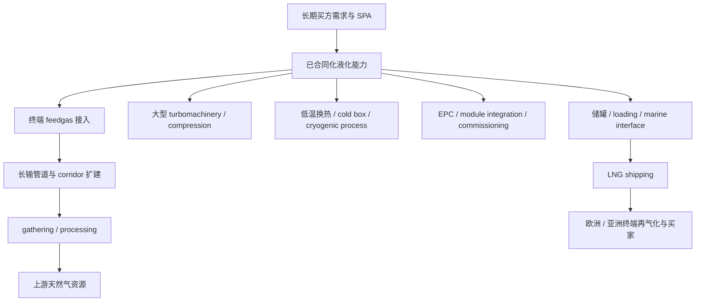
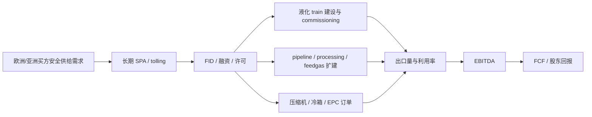

# 2026-04-21 LNG 产业地图 v1：从需求合同到上游卡点的全球链条地图

副标题：  
一份以美国 LNG 出口链为主线、向上追溯至资源、processing、pipeline、feedgas、液化、压缩与低温工艺能力的全球产业地图；目标不是列公司名单，而是识别真正不可绕开的节点、利润真正沉淀的层、以及当前更适合持有、研究还是只适合等待回调的公开市场表达。

---

---

## 动作语言字典（合规统一 / 对齐 LITE · COHR · FORM 等既往报告）

本报告**不提供投资建议**,不含"买入/卖出/加仓/减仓/推荐/建议"等语言。全部表达统一为**关注层级语言**,与本研究体系既往报告(如 LITE / COHR / FORM)对齐。读者据此进行的任何投资决策均为读者自行判断。

| 动作层级 | 含义 | 对应榜单 |
|---|---|---|
| **核心关注** | 最高优先级,回调优先复盘;节点不可绕开 + 财务弹性较强 | 榜一 · 结构性核心池 |
| **优先关注** | 重要性高于当前市场热度,中期优先深挖 | 榜二 · 当前研究优先池 |
| **持续关注** | 常态跟踪,等待信号或证据更清晰 | 三榜均可,多见于榜二 |
| **选择性关注** | 条件性跟踪,需要特定财务或执行前置确认 | 榜二 / 榜三之间 |
| **交易观察** | 仅限事件或价格窗口,不纳入结构性核心关注 | 榜三 · 交易回调池 |
| **保留观察** | 暂不优先,等待基本面或执行更明确 | 榜三 · 交易回调池偏后 |

**本字典贯穿全文**——任何表格的"当前动作"列、证据卡的"最优表达"、三分系统的打分反查,都只使用这六类语言之一。合规性与叙事风格从此统一。

---

## 执行摘要：如果只有三页时间

这份报告的核心结论不在“LNG 很重要”，而在下面五件事。

### 一、现在最该看哪三层

1. **已合同化的液化能力层**  
   这层决定谁能把全球安全供气需求变成真正可交付的出口能力。最重要的不是“LNG 需求会不会增长”，而是哪些项目已经锁定长期 SPA、已经穿过许可和融资门槛、已经进入可见的投运路径。代表：`LNG`、`VG`，但两者质量完全不同。

2. **feedgas 通道与长输管道层**  
   这层是美国 LNG 主线最容易被市场低估的桥。原因很简单：海外买家签了长期合同，项目建好了 train，也不等于气能准时送到 Gulf Coast。真正决定兑现节奏的，是 gathering、processing、mainline 和 terminal interconnect 能否接上。代表：`WMB`、`KMI`，次一级延展：`TRGP`、`KNTK`。

3. **可复制的 LNG 工艺与关键设备层**  
   这层决定“液化能力能否按期形成”。它不是传统意义上的油服，也不是普通工业设备，而是大型压缩机、燃机驱动、冷箱、热交换和低温工艺包的组合。代表：`BKR`、`GTLS`；但这层的重要性不自动等于最好的股票表达，必须分清“重要上游”和“真正卡点”。

### 二、现在最不该追哪三层

1. **纯航运高 beta 层**  
   `FLNG`、部分 LNG shipping 名字和二级航运故事，往往最先反映事件性价差和短期市场情绪，但对美国 LNG 主线的结构性兑现帮助有限，且资产价格弹性往往先于基本面。

2. **高资本开支、尚未穿过执行拐点的项目开发层**  
   典型如尚未形成稳定 FCF 桥梁的开发型公司。它们可能拥有真实资产价值，但在执行、融资和现金流三个维度上都比成熟运营层更脆弱。

3. **把“设备重要”误当成“设备垄断”的主题层**  
   LNG 低温设备和大功率压缩设备非常重要，但并非所有重要设备都具备不可绕开的利润锁定。没有浓度、资质、切换成本和绕不开性的证据，就不能把它们直接抬成“垄断卡点”。

### 三、Tracked-Name List：当前应持续持续关注的 10 个名字

这里不用线性总榜，而只给持续持续关注名单、所属池和动作。

| 名字 | 所属池 | 当前动作 | 主触发器 | 最近更新 |
|---|---|---|---|---|
| `LNG` | 结构性核心池 | 持续关注，回调优先复盘 | Corpus Christi Stage 3、长期合同再延长、资本回收节奏 | `2026-04-21` |
| `WMB` | 结构性核心池 | 可进入优先关注名单 | Transco / SSE / Power Express 进度与 backlog 延续 | `2026-04-21` |
| `KMI` | 结构性核心池 | 可进入优先关注名单 | LNG feedgas 合同 `8 -> 12 Bcf/d` 兑现、Trident 里程碑 | `2026-04-21` |
| `EQT` | 结构性核心池 | 持续关注 | LNG 拉动的 Appalachian demand、basis 改善、资本纪律 | `2026-04-21` |
| `TRGP` | 当前研究优先池 | 深挖 processing / takeaway 角色 | 处理能力扩张与 Gulf Coast export linkage | `2026-04-21` |
| `KNTK` | 当前研究优先池 | 观察并等更清晰验证 | Permian gas takeaway 与 leverage 降档路径 | `2026-04-21` |
| `BKR` | 当前研究优先池 | 持续关注 LNG 设备订单 | LNG turbomachinery awards、order intake 和 margin mix | `2026-04-21` |
| `GTLS` | 当前研究优先池 | 持续关注（需要更高估值纪律） | LNG 低温设备 backlog 与 cash conversion | `2026-04-21` |
| `VG` | 交易 / 回调池 | 只在执行验证后研究 | Plaquemines ramp、CP2 FID、capex / FCF 拐点 | `2026-04-21` |
| `GLNG` / `FLNG` | 交易 / 回调池 | 事件驱动观察 | charter coverage、utilization、资产价格与再融资风险 | `2026-04-21` |

### 四、三条最关键触发器

1. **美国 LNG 已签长期合同继续增长，但 feedgas 与管道侧扩建无法同步推进**  
   这会把资金从“终端故事”重新转向“通道与 processing 故事”。

2. **Cheniere / Venture Global / Golden Pass / Corpus Christi Stage 3 等关键项目投运节奏继续兑现**  
   这会强化“合同化液化能力”仍是主利润池，而不是把价值完全外溢给二级设备和航运。

3. **Qatar 与美国之外的新供给扩张改变全球定价曲线，但没有压垮美国出口经济性**  
   这会抬高“谁能跨周期活下去”的筛选标准，利好成熟运营者和高质量中游，而不是利好所有故事型开发商。

### 五、三条最可能打脸的风险

1. **全球 LNG 需求斜率低于当前合同签约节奏**  
   尤其如果欧洲进入更长的暖冬 + 工业需求疲弱周期，而亚洲现货弹性也低于预期，则美国项目的后续合同速度会显著放慢。

2. **美国终端和关联管道的投运延迟重新拉长**  
   LNG 是一个对工期、调试和许可高度敏感的行业。只要“终端能不能按时上量”被怀疑，整个链条的估值框架都会切换。

3. **市场错误地把高 capex 开发层、纯航运层和成熟合同层等同定价**  
   这会导致一轮主题回调中，真正该保留的结构性名字和纯交易层一起被抛售。

---

## 零、阅读指南：这份报告如何使用

### 0.1 这份报告不回答什么

它不回答“LNG 是不是重要”。那件事已经不需要再证明。  
它也不回答“全球会不会长期需要天然气”这种过于宽泛的问题。  
它真正回答的是：

1. LNG 产业链里，哪些节点是**真正不可绕开的**。  
2. 哪些节点虽然重要，但只是**执行量层**，并不天然拥有深利润池。  
3. 公开市场里，哪些名字适合当**结构性核心池**，哪些更适合放进**研究优先池**，哪些只能进**交易/回调池**。  
4. 如果主题回调，哪些名字先复盘，哪些应该保留观察（暂不优先）。  

### 0.2 这份报告的起点不是行业标签，而是稀缺事物

传统行业文章喜欢从“上游-中游-下游”或者“油气-中游-终端”开始。  
这对建百科有效，但对投资用处有限。  

本报告先把 LNG 拆成三个真正稀缺的事物节点：

1. **可交付的 LNG feedgas 供给**  
   不是“天然气很多”这么简单，而是特定产区的气，经过 gathering、processing、takeaway 和 interconnect，能够在正确的时间、正确的地点送到 Gulf Coast 液化终端。

2. **已合同化、可投运的液化能力**  
   不是“有项目储备”，而是已经拿到长期 SPA、资金、许可和 EPC 执行路径，能在 2026-2030 的窗口里真正变成出口量。

3. **大规模 LNG 低温与压缩工艺能力**  
   不是一般工业设备，而是决定 train 能不能准时调试、能不能稳定运行的大型 turbomachinery、冷箱、热交换和工艺集成能力。

从这三个节点往上追，才能找到真正的“卡点”。

### 0.3 为什么这版 LNG 报告要比 AI v8 更难

AI 产业图里，很多关键节点可以直接从上市公司开始画。  
LNG 不一样。  
LNG 里最重要的约束常常不在“一个热门股票代码”里，而在：

- 合同结构  
- 许可与调试  
- 输送和 processing 通道  
- 工程和低温工艺能力  
- 区域 basis 和 feedgas 接入  

这意味着 LNG 行业地图如果只写 `LNG / VG / KMI / WMB`，本质上还只是半张图。  
真正完整的版本必须向上追到：

- 资源端 gas producers  
- gathering / processing  
- pipeline / takeaway  
- feedgas delivery  
- liquefaction  
- cryogenic / compression / EPC / loading  
- shipping  

### 0.4 这份报告的四层结构

尽管行业不同，最终还是要落回同一套研究逻辑：

1. **结构层**：系统里到底有哪些关键节点。  
2. **约束层**：哪些节点真正限制兑现与利润。  
3. **时钟层**：各模块按什么节奏兑现，市场又按什么节奏定价。  
4. **定价层**：现在该拿哪一层、哪一类公司，哪些只适合等回调。  

### 0.5 本次使用的一手与本地证据口径

本报告优先使用：

- 官方统计与监管材料：`EIA`、`FERC`、`SEC`
- 公司披露：年报、季报、法说会、项目页面
- 本地统一财务确认层：`financial-validate`

本地统一财务确认时间戳：

- 主篮子：`2026-04-21T10:58:01.195Z`
- 交易层补充：`2026-04-21T11:10:32.989Z`

这两个时间戳是本报告所有财务质量表、财务韧性表和公司级预期差卡的基础确认层。

---

## 一、行业边界：本报告覆盖什么，不覆盖什么

### 1.1 研究范围

本报告覆盖的是**全球 LNG 产业链中与美国出口主线最相关的核心节点**，并用 Qatar 作为第二区域平行地图。

具体包括：

1. 需求侧与买方：欧洲、亚洲公用事业、国家买方和贸易商的长期合同需求。  
2. 合同层：SPA、tolling、merchant 暴露、期限结构。  
3. 液化层：美国 Gulf Coast 核心液化能力与投运路径。  
4. feedgas 层：从资源地到终端的 gathering / processing / pipeline / delivery。  
5. 上游资源层：对美国 LNG 最相关的天然气资源与 U.S.-listed 上游公司。  
6. 关键设备与工艺层：压缩、燃机、冷箱、热交换、EPC。  
7. 航运与外围表达层：作为次级传播和交易层，而不是主利润池默认归属。  

### 1.2 不纳入范围

以下内容只作背景，不作为主投资地图：

1. 一般原油上游与综合石油 majors 的整体公司分析。  
2. 单纯从宏观角度讨论“全球天然气长期供需平衡”而不落到可投资节点。  
3. 所有非上市的国家队公司和非公开合同细节的深度财务估值。  

### 1.3 与相邻板块的边界

LNG 与以下几个相邻板块经常被混在一起：

1. **天然气生产商**  
   不是所有 gas producer 都是 LNG 受益股。只有那些真正受到 feedgas demand、basis 改善、管道联通和 processing 扩建拉动的资源端，才进入这张图。

2. **传统 midstream 收益股**  
   `WMB`、`KMI`、`ET` 都是 midstream，但它们和纯储运收益股不同：与 LNG 相连的 corridor、interconnect 和 expansions，决定了它们在这一主题下的地位。

3. **油服与工业设备**  
   `BKR`、`GTLS` 在 LNG 里的逻辑，不是一般意义上的油服 beta，而是 LNG 工艺能力与大型设备包的能力节点。

4. **LNG shipping**  
   这层更像主题波动器，而不是美国 LNG 主线默认的利润中心。

---

## 二、行业硬指标插槽：没有这些指标，就不能进入结论层

本次 LNG 行业硬指标先定义 10 个。  
它们不是装饰，而是后面所有“周期位置、传导、优先级、回调动作”的统一底板。

| 硬指标 | 当前口径 | 为什么重要 | 主要来源 |
|---|---|---|---|
| 2025 年美国新签 SPA | `40 mtpa`，约 `5.2 Bcf/d` | 验证需求不是口号，而是合同化 | [EIA Today in Energy, 2026-03-03](https://www.eia.gov/todayinenergy/detail.php?id=67264) |
| 2026 / 2027 美国 LNG 出口预期 | `17.0 / 18.6 Bcf/d` | 决定美国主线的出口斜率 | [EIA STEO, 2026-04-07](https://www.eia.gov/outlooks/steo/report/natgas.php) |
| Cheniere 当前平台能力 | 约 `45 mtpa` | 现有成熟液化平台体量 | [Cheniere 2025 10-K](https://www.sec.gov/Archives/edgar/data/0000003570/000000357026000005/lng-20251231.htm) |
| Kinder Morgan LNG feedgas 合同 | `8 -> 12 Bcf/d` 到 2028 | 说明通道层已被长期合同拉动 | [KMI Q4'25](https://ir.kindermorgan.com/news/news-details/2026/Kinder-Morgan-Reports-Fourth-Quarter-2025-Financial-Results/default.aspx) |
| Williams Power Express | `950 MMcf/d`，目标 `3Q30` | 说明电力与 LNG 共振下的 corridor 扩张 | [Williams 2025 Annual / project materials](https://investor.williams.com/static-files/f8b3ba6b-eaf5-4af0-8685-e803764862dc) |
| Williams SSE | `1.6 Bcf/d` 级别扩建 | 说明 Southeast 与 Gulf demand pull 已进入工程化 | [SSE project page](https://www.williams.com/expansion-project/southeast-supply-enhancement/) |
| Targa gas processing platform | `7.4 Bcf/d` 处理能力 | 说明 processing 层不是边角，而是 feedgas 的前置闸门 | [Targa G&P operations](https://www.targaresources.com/operations-gathering-processing) |
| Kinetik 容量扩建路径 | 2026 指引中明确继续扩建 Permian gas / takeaway | 说明 Permian LNG 相关供气不是一句“有气”能概括 | [Kinetik Q4/FY25](https://ir.kinetik.com/news/news-details/2026/Kinetik-Reports-Fourth-Quarter-and-Full-Year-2025-Financial-and-Operating-Results-and-Provides-2026-Financial-Guidance/default.aspx) |
| Qatar 产能扩张路径 | `77 -> 126 -> 142 mtpa` | 第二区域平行地图的核心容量约束 | [QatarEnergy What is LNG](https://www.qatarenergy.qa/en/MediaCentre/Pages/What-is-LNG.aspx), [North Field West EPC](https://www.qatarenergy.qa/en/MediaCentre/Pages/NewsDetails.aspx?ItemID=549) |
| Venture Global Plaquemines / CP2 路径 | Plaquemines 已进入首批 cargo 阶段，CP2 获得 FID 条件推进 | 开发层与成熟层的最关键分界 | [VG Q4/FY25 earnings release](https://www.sec.gov/Archives/edgar/data/2007855/000200785526000015/vgincq42025earningsrelease.htm) |

这 10 个指标后面会反复出现。  
如果后续有判断不能落回这 10 个指标之一，就说明结论还不够硬。

---

## 三、结构层：先画系统，而不是先画股票

### 3.1 LNG 的最小闭环

LNG 不是“天然气出口”这么简单。  
它是一个闭环：

1. 终端买家需要长期安全供给。  
2. 买家签 SPA 或 tolling 协议。  
3. 开发商 / 运营商据此融资并启动液化项目。  
4. 液化项目倒逼 feedgas 供应、processing、管道与 interconnect。  
5. 上游资源与中游通道扩建。  
6. 关键工艺设备与 EPC 把 train 变成真正可运行的装置。  
7. cargo 装船，送达欧洲 / 亚洲。  
8. 终端收入转化为 EBITDA、FCF 和股东回报。  

真正有投资意义的，不是哪一步在“理论上重要”，而是哪一步在当前这个时间点最限制兑现、最难绕开、最能把利润留在股东手里。

### 3.2 从稀缺事物节点出发

本报告不按“上游/中游/下游”开始，而按三个稀缺事物节点开始。

#### 节点一：可交付的 LNG feedgas availability

这是美国主线最容易被忽略的核心节点。  
美国的资源本身并不稀缺，但**能不能在对的时间、对的地点，把符合终端要求的气送到 LNG terminal**，受制于：

- gathering  
- processing  
- pipeline takeaway  
- basis  
- terminal interconnect  
- permit / right-of-way / construction timing  

所以这不是“气够不够”的问题，而是“气能否被交付”的问题。

#### 节点二：已合同化、可投运的 liquefaction train capacity

LNG 真正的出口收入，不来自“项目储备”，而来自已经拿到 SPA、融资、许可、EPC 和 commissioning 路线图的 train。  
这也是为什么同样讲 LNG，`LNG` 和 `VG` 的质量完全不同：

- `LNG` 更接近成熟平台 + 长约平台  
- `VG` 更接近高增长开发平台 + 高 capex / 执行不确定性  

#### 节点三：cryogenic process capability

这层经常被写成“设备供应商”，但那样太宽。  
LNG 的真正工艺能力包括：

- 大型压缩机 / turbomachinery  
- 驱动系统  
- 冷箱与低温换热  
- 模块化或大型 train 工艺集成  
- 调试与可靠性

这一层不是普通设备 beta。  
它决定 train 能不能按计划调试、达产、长期稳定运行。

---

## 四、链条分层：核心链、二级链、外围链、弱外溢层

### 4.1 核心链：真正决定 LNG 兑现的四步

核心链可以压成四步：

1. **合同化需求**  
   买家不是先买船，也不是先买设备，而是先签长期供气协议。`EIA` 在 2026 年 3 月确认，美国开发商 2025 年签下了 `40 mtpa` 的 SPA，是 2022 年以来最高水平。这件事的意义，是把“需求存在”转成“项目可融资”。

2. **液化能力成型**  
   拿到合同只是起点，真正变成利润的，是可按期投运的液化 trains。`Cheniere` 2025 年 10-K 已明确公司平台已达到约 `45 mtpa` 的现有能力，并把 Corpus Christi Stage 3 作为下一轮平台扩张重点。`Venture Global` 则处在“高增长但高执行要求”的路径上。

3. **feedgas 与管道通道打通**  
   这一步决定“项目落地和终端投运之后，气是不是能真的到位”。`Kinder Morgan` 已披露 LNG feedgas 相关合同从 `8 Bcf/d` 预计扩大到 `12 Bcf/d` 到 2028；`Williams` 则在 Transco 体系上推进多条与 Southeast / Gulf Coast 相关的扩容项目。

4. **资源与 processing 承接**  
   即使 terminal 和 pipe 都存在，gas 还必须从产区出来。`EQT`、`TRGP`、`KNTK` 等公司所处的资源与 processing 层，决定 feedgas 的真实交付能力。

### 4.2 二级链：不是主利润池，但是真实传导层

二级链包括：

1. **大型压缩与 turbomachinery**  
   代表：`BKR`、`GEV`、Siemens Energy（非美股）。  
   这一层的逻辑是真实的，因为 LNG 设备包不是简单标准件；但它离终端 cash generation 更远，且部分竞争发生在全球平台之间。

2. **低温换热 / 冷箱 / cold box / BAHX**  
   代表：`GTLS`，以及非美股 / 非纯美股表达。  
   重要，但是否属于真正不可绕开的“终点卡点”，必须谨慎处理。

3. **EPC / module execution**  
   代表：Bechtel、Technip Energies、McDermott / CB&I、Saipem 等。  
   这是现实中非常重要的一层，但公开市场里未必总能找到最直接、最优质的 U.S.-listed 表达。

### 4.3 外围链：容易被过度放大的映射层

外围链包括：

1. LNG shipping  
2. 短期地缘事件驱动的现货价差受益者  
3. 与 LNG 有一定业务交集但缺乏清晰利润锁定的综合能源或工程股  

这些层经常在行情最热时最先涨，但未必是长期研究最值得压重的地方。

### 4.4 弱外溢层：不应该混进主链

以下不应默认混入 LNG 主线：

1. 一般油价受益股  
2. 普通海运  
3. 单纯因为“和天然气有关”而沾边的综合能源企业  
4. 没有清晰 LNG 订单和盈利映射的广义油服故事  

---

## 五、节点地图与玩家密度：每个节点到底有几个真正有意义的玩家

### 5.1 主链节点玩家密度总表

| 节点 | 现实中有意义的玩家数量 | 主要玩家 | 竞争格局判断 | 公开市场备注 |
|---|---:|---|---|---|
| 长期 LNG 买家 / off-takers | 10+ | 欧洲公用事业、亚洲公用事业、国家买家、贸易商 | 买方集中但分散于地区 | 非主股票层 |
| 美国成熟 liquefaction 运营平台 | 2-3 | `LNG`、`VG`、`NFE`/其他开发商 | 运营成熟度高度分化 | `LNG`质量显著高于开发型同业 |
| Gulf Coast feedgas / pipe corridor | 4-6 | `WMB`、`KMI`、`ET`、TC Energy、`KNTK` / `TRGP` | 区域寡头，按 corridor 切分 | 最容易被市场低估 |
| Gathering / processing | 5-7 | `TRGP`、`KNTK`、`MPLX`、`ET`、`WMB` | 区域竞争，但替代速度慢 | 处理能力比市场想象更关键 |
| 上游 gas resource | 6-10 | `EQT`、RRC、AR、CTRA、CRK、SWN等 | 资源分散，但区域质量分化大 | 最容易被当成纯 commodity 处理 |
| 大型 turbomachinery / compression | 3-4 | `BKR`、`GEV`、Siemens Energy、MAN | 全球寡头 | 但不是都能直接吃到高质量利润 |
| Cryogenic heat exchange / cold box | 2-4 | `GTLS`、Honeywell / APD legacy、其他全球供应商 | 技术门槛高，但细分多 | 容易被误写成“单一垄断” |
| EPC / train execution | 4-5 | Bechtel、Technip Energies、McDermott / CB&I、KBR、Saipem | 工程竞争，但履约记录重要 | U.S.-listed 最佳表达有限 |
| LNG shipping | 10+ | `FLNG`、`GLNG`、其他全球船东 | 高波动，资产周期强 | 不宜直接当主利润池 |

### 5.2 代表公司三分系统

为了避免把所有公司都塞进一个“受益股”口袋，本报告强制把代表公司分成三类。

#### Core Profit Layer

- `LNG`
- `WMB`
- `KMI`
- `EQT`

#### Execution Volume Layer

- `TRGP`
- `KNTK`
- `BKR`
- `GTLS`
- `VG`

#### Recovery / Repair Trade Layer

- `GLNG`
- `FLNG`
- `NEXT`
- `ET`

这三类不意味着公司好坏，而意味着它们在一轮 LNG 周期里承担的经济角色不同。

### 5.3 最容易混读的四组公司

#### 组一：`LNG` vs `VG`

- `LNG` 是成熟平台 + 长期合同 + 已有规模 FCF。  
- `VG` 是高增长开发平台 + 超高 capex intensity + 需要执行验证。  

两者都在液化层，但一个更像“已穿过主要执行门槛的核心层”，另一个更像“潜在巨大但验证要求更高的成长层”。

#### 组二：`WMB` vs `KMI` vs `ET`

- `WMB` 更像 corridor + demand bridge 的复合体，LNG 与电力负荷共振更强。  
- `KMI` 更像合同化 feedgas transport 与项目里程碑平台。  
- `ET` 的资产规模很大，但本轮 LNG 逻辑的财务确认层最弱，不能因为“资产很多”就默认给更高优先级。  

#### 组三：`TRGP` vs `KNTK`

- `TRGP` 更偏 processing / integrated G&P scale 平台，财务确认层更强。  
- `KNTK` 对 Permian gas / LNG egress 的联动更直接，但杠杆和质量折扣也更高。  

#### 组四：`BKR` vs `GTLS`

- `BKR` 是大型 LNG turbomachinery / compression / service 的平台型表达。  
- `GTLS` 更偏 cryogenic 和低温设备能力。  

两者都属于“重要上游”，但不应被合成一个“LNG 设备股”。

---

## 六、上游依赖树：从需求一直追到终点节点

### 6.1 依赖树总览

### 6.2 这棵树里真正重要的判断

1. **合同不是终点，而是上游投资的起点**  
   只有签了长期合同，液化项目才有融资基础，管道和 processing 扩容才会有更强的可见性。

2. **feedgas 是最真实的桥**  
   LNG 市场最常见的分析错误，是直接从“买方需求增加”跳到“终端公司收益增加”。现实里，最容易真正卡住兑现的是 feedgas 路径。

3. **工艺与设备不是都等价**  
   大型 turbomachinery、驱动系统、冷箱和热交换都重要，但它们的竞争结构和利润留存能力并不一样。

4. **航运是结果，不是起点**  
   先有合同、再有终端、再有通道、再有 cargo。船运更像尾部放大器。

---

## 七、终点节点表：哪些是 terminal bottleneck，哪些不是

下表不是把所有重要节点都说成“垄断”，而是按统一 8 分项打分后再分类。

评分维度：

- 必要性
- 替代难度（反向）
- 资质 / 工艺门槛
- 供给弹性（反向）
- 客户绕开难度
- 利润留存深度
- 供应商财务韧性
- 公开市场可投资性

每项 `1-5` 分，`5` 分最高。

### 7.1 Terminal bottleneck table

| 终点节点 | 必要性 | 替代难度 | 资质门槛 | 供给弹性反向 | 绕开难度 | 利润留存 | 财务韧性 | 可投资性 | 分类 | 结论 |
|---|---:|---:|---:|---:|---:|---:|---:|---:|---|---|
| 已合同化的美国 liquefaction slots | 5 | 4 | 5 | 4 | 5 | 5 | 4 | 4 | 寡头型瓶颈 | 是当前最接近“主利润池 + 真正不可绕开”的节点 |
| Gulf Coast 关键 feedgas corridors | 5 | 4 | 4 | 4 | 4 | 4 | 4 | 5 | 区域寡头型瓶颈 | 不是全国唯一，但在具体 corridor 上高度稀缺 |
| 高质量 processing + takeaway 组合 | 4 | 3 | 3 | 4 | 3 | 3 | 3 | 5 | 重要上游但非单一瓶颈 | 真重要，但更接近“桥”而不是唯一终点 |
| 大型 LNG turbomachinery package | 4 | 4 | 4 | 3 | 3 | 3 | 4 | 4 | 重要上游 / 准寡头 | 重要，但要谨慎使用“瓶颈”措辞 |
| Cryogenic heat exchange / cold box | 4 | 3 | 4 | 3 | 3 | 3 | 3 | 3 | 重要上游 | 重要，但当前证据不足以称单一垄断 |
| LNG shipping | 3 | 2 | 2 | 3 | 2 | 2 | 2 | 5 | 执行层 | 更像事件驱动和资产周期层 |
| 开发型新 terminal optionality | 3 | 2 | 4 | 2 | 2 | 2 | 1 | 4 | 执行层 / 高风险开发层 | 对主题重要，但不是当前最优投资锚点 |

### 7.2 为什么“已合同化液化能力”是终点节点

因为它同时满足多个条件：

1. 下游买家不能绕开它。  
2. 替代供给扩张很慢。  
3. 许可、融资、EPC、调试都需要多年。  
4. 价值并没有完全向下游扩散，而是大量留在拥有成熟平台与长期合同的运营层。  

这也是为什么 `LNG` 应被视为主链核心，而不是简单的“一个 LNG 股票”。

### 7.3 为什么“feedgas corridor”比市场想象更接近终点节点

因为这层常被误判成普通中游。  
但在现实里，它同时满足：

1. 终端不能自己造一条新干线来绕开现有系统。  
2. 新管道、扩容和 interconnect 的许可 / 施工周期长。  
3. 一旦 LNG train 已经落地，通道价值会被反向强化。  
4. 公开市场里有成熟、可投资、现金回流清晰的表达。  

所以这层不是外围，而是 bridge + bottleneck 兼具的区域性约束层。

### 7.4 为什么“设备重要”不自动等于“设备瓶颈”

LNG 大型设备很重要，这是真的。  
但“重要”不等于“终点瓶颈”。  

如果缺少以下证据，就不能直接给“垄断”：

- 明确的市场集中度  
- 客户难以切换  
- 长期资质门槛  
- 供应难以快速扩张  
- 价值确实稳定留在设备层  

因此本报告对 `BKR`、`GTLS` 的处理是：

- 认可其在现实产业链中的关键性  
- 但不夸大为绝对垄断  

---

## 八、谁是真寡头、谁是假垄断、谁只是重要上游

### 8.1 寡头 / 准寡头候选

| 节点 | 候选 | 判断 | 原因 |
|---|---|---|---|
| 成熟美国 liquefaction 平台 | `LNG` | 寡头型核心表达 | 已有平台、长期合同、成熟 FCF，且供给扩张慢 |
| Gulf Coast feedgas corridor | `WMB`、`KMI` | 区域寡头型桥接表达 | 具体 corridor 上难绕开，扩容慢，现金流质量高 |
| LNG turbomachinery | `BKR`、`GEV`、Siemens Energy | 准寡头 | 供应商数量有限，但利润留存深度不如 terminal / corridor 明确 |

### 8.2 假垄断候选

| 主题上常被误写成“垄断” | 本报告判断 | 理由 |
|---|---|---|
| `GTLS` = LNG 冷箱唯一垄断 | 否 | 重要，但没有足够证据支持“唯一、不可绕开、价值深度锁定”三者同时成立 |
| `ET` = 所有美国 LNG 增长的总开关 | 否 | 资产庞大，但本轮 LNG 兑现与财务确认层并不占优 |
| `FLNG` / `GLNG` = LNG 主线最好弹性 | 否 | 更偏资产价格和海运周期，不是美国主链利润中心 |

### 8.3 公开市场映射：每个终点节点最适合看什么

| 终点节点 | 最佳纯度表达 | 最佳质量表达 | 最佳周期表达 | 最佳区域表达 | 最佳隐藏工具层 |
|---|---|---|---|---|---|
| 合同化 liquefaction | `LNG` | `LNG` | `VG` | `SHEL` / `TTE` / `XOM`（Qatar partners） | `WMB` |
| feedgas corridor | `KMI` | `WMB` | `KNTK` | `TRGP` | `EQT` |
| processing / takeaway | `KNTK` | `TRGP` | `KNTK` | `MPLX` | `WMB` |
| turbomachinery | `BKR` | `BKR` | `GEV` | Siemens Energy | `BKR` service layer |
| cryogenic / cold box | `GTLS` | `GTLS` | `GTLS` | Honeywell / APD legacy reference | `GTLS` |

这里故意没有把每个节点都塞满“完美答案”。  
如果缺少足够证据，最好的做法是承认“这层重要，但公开市场最优表达并不干净”。

---

## 九、利润分配地图：预算、收入、毛利、现金和股东回报到底归谁

### 9.1 预算决定层

LNG 的预算决定层在买方，而不是在上游资源商。  
真正的起点是：

- 欧洲和亚洲买方的长期安全供给需求  
- 终端替代煤炭或替代管道气的需求  
- 国家层面的能源安全策略  

这些预算被写成 SPA 和长期 offtake 之后，才变成项目资本支出的依据。

### 9.2 收入承接层

收入最直接承接在：

1. `LNG` / `VG` 这类液化能力持有者  
2. `WMB` / `KMI` 这类通道持有者  
3. `EQT` / `TRGP` / `KNTK` 这类资源和 processing 承接者  
4. `BKR` / `GTLS` 这类工艺与设备供应者  

但“收入承接”不等于“利润锁定”。

### 9.3 毛利承接层

最容易稳定保住毛利的，通常不是执行量最大的一层，而是：

1. 已合同化液化能力  
2. 区域性通道与 pipeline 扩容  
3. 具备特定工艺优势的设备与服务层  

执行层、工程层和航运层虽然也有收入，但利润波动更大。

### 9.4 自由现金流承接层

这层最关键。  
真正值得长期持有的层，不是收入最快，而是**把收入转成 FCF 的层**。

按当前本地统一财务确认：

- `KMI`：`FCF margin 19.0%`，资本回收路径清晰  
- `WMB`：`FCF margin 8.41%`，但增量投资较多，仍偏再投资期  
- `LNG`：`FCF margin 12.54%`，成熟平台属性更明显  
- `EQT`：`FCF margin 31.27%`，但仍然承受 commodity 特征  
- `VG`：`FCF margin -49.38%`，说明其仍在高 capex 执行期  

### 9.5 股东回报承接层

如果目标是“3-5 年看得见的回报”，当前最像股东回报承接层的是：

1. `LNG`  
2. `KMI`  
3. `WMB`  
4. `EQT`（更高 commodity 弹性，但也更高 basis / gas-cycle 依赖）  

`VG`、`NEXT`、部分 shipping 名字都还不能进入这一层。

---

## 十、时钟层：谁先被交易，谁先有订单，谁最后才有现金

### 10.1 LNG 的五个时钟

相比 AI 产业里常见的硬件时钟，LNG 至少有五个互相错位的时钟：

1. **需求签约时钟**  
   买家先签长期合同，项目才能动。  

2. **许可 / FID 时钟**  
   终端不是有合同就能立刻建，许可、融资和 FID 是第二个大门槛。  

3. **工程与设备时钟**  
   EPC、压缩机、冷箱、模块化工程包先拿订单，再逐步确认收入。  

4. **feedgas / pipe 时钟**  
   管道和 processing 扩建常常比终端更慢，也更容易被市场忽略。  

5. **现金兑现时钟**  
   终端达产、利用率稳定、资本开支回落之后，真正的 FCF 才开始体现。  

### 10.2 模块周期钟

| 模块 | 经营时钟 | 市场定价时钟 | 当前判断 |
|---|---|---|---|
| SPA / 买方签约 | 已在加速期 | 市场认知中段 | 已经确认是现实而非概念 |
| 成熟 liquefaction 平台 | 中段 | 中段偏前 | 仍是主利润池中心 |
| 开发型 liquefaction 平台 | 早中段 | 情绪更靠前 | 需要执行验证 |
| feedgas corridor / pipeline | 前中段 | 仍偏后知后觉 | 最值得持续关注 |
| processing / takeaway | 前中段 | 中性偏滞后 | 对上游兑现非常关键 |
| upstream gas resource | 中段 | 仍按 commodity 折价 | 预期差仍在 |
| turbomachinery / cryogenic equipment | 前中段 | 中段 | 已有传导，但不宜过度抬高 |
| LNG shipping | 中后段 / 事件层 | 情绪先行 | 更接近交易层 |

### 10.3 关键判断：美国 LNG 主线最有预期差的不是终端，而是桥

如果只看终端，市场已经知道：

- 美国 LNG 出口继续增长  
- Cheniere 是成熟平台  
- Venture Global 在扩张  

但如果从兑现顺序看，**真正还没有被完全按“结构性瓶颈”定价的，是 feedgas bridge 层**。  
这也是为什么本报告的当前研究优先级里，`WMB` / `KMI` 的位置非常高。

---

## 十一、传导瀑布与时滞：预算 -> 合同 -> 工程 -> 收入 -> 现金

### 11.1 传导瀑布图

### 11.2 时滞判断

| 传导阶段 | 典型时滞 | 公开市场最先交易谁 |
|---|---|---|
| 需求 -> SPA | 0-12 个月 | 终端开发商、成熟运营者 |
| SPA -> FID / 许可 | 6-24 个月 | 项目开发层、设备预期层 |
| FID -> 设备与 EPC 收入 | 12-36 个月 | `BKR`、`GTLS`、工程股 |
| FID -> pipe / processing 收入 | 12-36 个月 | `WMB`、`KMI`、`TRGP`、`KNTK` |
| commissioning -> EBITDA | 24-48 个月 | 终端与 corridor 层 |
| EBITDA -> FCF | 36-60 个月 | 成熟平台与资本回收层 |

### 11.3 哪些层最容易被提前交易

1. 开发型 liquefaction  
2. shipping  
3. 设备主题股  

而真正最晚被市场充分理解、但兑现时间更长的，往往是：

1. feedgas / corridor  
2. processing / takeaway  
3. 成熟 liquefaction 的资本回收层  

---

## 十二、定价层：现在最该看什么估值口径，不该看什么

### 12.1 LNG 行业不能只看 PE

LNG 产业链最容易犯的估值错误，就是把所有名字都塞进 `PE`。

不同层必须看不同口径：

| 模块 | 优先估值口径 | 不该只看什么 |
|---|---|---|
| 成熟 liquefaction | EV / EBITDA、contracted cash flow、capex runoff | 只看 PE |
| 开发型 liquefaction | EV / steady-state EBITDA、capex intensity、funding bridge | 只看 forward PE |
| pipeline / corridor | EV / EBITDA、coverage、leverage、project backlog | 只看股息率 |
| upstream gas | FCF yield、PV / NAV、basis leverage | 只看 PE |
| processing / G&P | EV / EBITDA、capex / revenue、leverage | 只看 revenue growth |
| turbomachinery / cryogenic | EV / EBITDA、backlog、cash conversion | 只看 PE |
| shipping | P / NAV、charter coverage、fleet age | 只看 EPS |

### 12.2 当前模块估值与拥挤度热力图

| 模块 | 当前估值状态 | 拥挤度 | 本报告判断 |
|---|---|---|---|
| `LNG` 成熟平台 | 合理偏低 | 中 | 仍可作为核心层 |
| `VG` 开发层 | 表面便宜、实则高 capex | 中高 | 只适合验证后研究 |
| `WMB` corridor | 合理 | 中 | 预期差优于终端 |
| `KMI` corridor | 合理 | 中低 | 合同可见性高 |
| `EQT` upstream gas | 合理偏低 | 中低 | 仍按 commodity 折价，存在预期差 |
| `TRGP` / `KNTK` processing | `TRGP` 不便宜，`KNTK` 杠杆高 | 中 | 值得研究，但不宜无脑追 |
| `BKR` / `GTLS` 设备 | `GTLS` 偏贵，`BKR`中性 | 中 | 重要但需更高纪律 |
| shipping | 波动高 | 高 beta | 交易层 |

### 12.3 当前最容易被误价的层

如果只从“市场没怎么看”的角度出发，最容易被低估的是：

1. `WMB` / `KMI` 这种 corridor / feedgas bridge  
2. `EQT` 这种被当成纯 commodity gas 的上游资源层  
3. 部分 processing / G&P 层，而不是最热门的终端或 shipping 层  

---

## 十三、模块母表：这张表是后续更新的底板

| 模块 | 事物节点 | 约束节点 | 时钟位置 | 利润池深度 | 供给弹性 | 财务弹性 | 当前估值状态 | 适合动作 | 代表公司 | 关键持续关注变量 | 失效触发 |
|---|---|---|---|---|---|---|---|---|---|---|---|
| 长期买方需求 / SPA | 合同化需求 | 欧洲/亚洲需求与能源安全预算 | 早中段 | 深 | 低 | 不适用 | 已确认加速 | 持续关注 | `LNG`, `VG` | 新签 mtpa、期限、tolling vs merchant | 连续 2 个季度签约显著放缓 |
| 成熟 liquefaction | 已运营液化能力 | Train 可靠性、扩容节奏、合同质量 | 中段 | 很深 | 低 | 中强 | 合理偏低 | 核心关注 | `LNG` | 利用率、Stage 3、新增长期合同 | 投运延迟 >12 月或利用率转弱 |
| 开发型 liquefaction | 在建平台与 future trains | FID、融资、许可、commissioning | 早中段 | 中深 | 低 | 中弱 | 表面便宜但执行风险高 | 选择性研究 | `VG`, `NEXT` | Cargo ramp、capex、CP2 进度 | FID / ramp 再次推迟 |
| feedgas corridor | 通道与 interconnect | 许可、施工、right-of-way、terminal接入 | 前中段 | 深 | 低 | 中强 | 重要性高于热度 | 优先关注 | `WMB`, `KMI` | backlog、合同 Bcf/d、项目节点 | backlog 放缓或项目推迟 |
| processing / G&P | 可处理气量 | plant capacity、联通、capex | 前中段 | 中 | 中低 | 中 | 分化 | 持续关注（选择性） | `TRGP`, `KNTK`, `MPLX` | 处理能力、占用率、capex / rev | 高端需求增长但 processing 不扩 |
| upstream gas resource | 可供 feedgas 的资源 | basis、pipe access、钻完井纪律 | 中段 | 中深 | 中 | 分化 | 仍按 commodity 折价 | 继续研究 | `EQT`, `RRC`, `AR`, `CTRA` | basis、hedges、capex、产量纪律 | LNG demand 转弱或 basis 恶化 |
| turbomachinery / compression | 大型压缩与驱动能力 | 产能、资质、调试 | 前中段 | 中 | 中低 | 中强 | 合理 | 持续关注 | `BKR`, `GEV` | LNG 订单、backlog、服务 mix | 订单不兑现或替代加速 |
| cryogenic / cold box | 低温换热与冷箱能力 | 工艺、交付、可靠性 | 前中段 | 中 | 中低 | 中 | `GTLS` 偏贵 | 持续关注（需要更高估值纪律） | `GTLS` | LNG 占比、现金转换、backlog | 订单扩张但现金转换恶化 |
| EPC / module integration | 工程执行能力 | 劳动力、模块化施工、交付 | 中段 | 中浅 | 中 | 中 | 非纯股票层 | 观察 | T.EN / Bechtel / KBR | 里程碑、change order | 大面积延期 |
| LNG shipping | 船运与 charter | 运价、交付、再融资 | 中后段 | 浅 | 中高 | 分化 | 更像交易层 | 交易观察 | `GLNG`, `FLNG` | charter coverage、P/NAV、utilization | 运价/租约同步转弱 |

---

## 十四、三张榜：结构性核心池、当前研究优先池、交易 / 回调池

### 14.1 结构性核心池

这张榜回答：**哪一层是真正不可绕开，而且当前公开市场表达也足够成熟。**

| 名字 | 为什么在这张榜 | 当前最强证据 | 当前最强削弱项 | 关键财务口径 | 失效触发 | 最近更新 |
|---|---|---|---|---|---|---|
| `LNG` | 美国成熟 liquefaction 平台最干净的公开表达 | `45 mtpa` 平台基础 + Stage 3 路径 + 长约堆栈 | 市场已部分认识到其质量，新增 alpha 主要来自 duration 而不是纯发现 | `EV/EBITDA 6.24x`，`FCF margin 12.54%`，`ND/EBITDA 2.42x` | Stage 3 重大延期或长期合同质量恶化 | `2026-04-21` |
| `WMB` | feedgas corridor 与 demand bridge 双重角色最强 | Transco / SSE / Power Express 显示 LNG 与 power load 双重拉动 | FCF 短期被再投资压住，且估值不算极低 | `EBITDA margin 62.0%`，`ND/EBITDA 3.95x` | 关键扩建项目延后或 backlog 放缓 | `2026-04-21` |
| `KMI` | LNG feedgas 合同化程度最高的公开 bridge 之一 | 公司明确披露 LNG feedgas `8 -> 12 Bcf/d` 到 2028 | 仍被市场按收益股框架处理，成长叙事较弱 | `FCF margin 19.0%`，`ND/EBITDA 4.32x` | 12 Bcf/d 路径失速或 Trident 延误 | `2026-04-21` |
| `EQT` | 最值得关注的 upstream gas 质量表达之一 | Appalachia 资源质量高，LNG 与数据中心需求都在抬升长期需求底部 | 仍有 commodity 与 basis 敏感性，不能当成纯通道股 | `FCF margin 31.27%`，`ND/EBITDA 1.31x` | basis 再次恶化或需求端收缩 | `2026-04-21` |

### 14.2 当前研究优先池

这张榜回答：**哪些层重要性高，但市场理解和表达还没有完全理顺，值得进一步花研究预算。**

| 名字 | 为什么在这张榜 | 当前最强证据 | 当前最强削弱项 | 关键财务口径 | 失效触发 | 最近更新 |
|---|---|---|---|---|---|---|
| `TRGP` | processing / export linkage 现实度高，财务确认层也强 | Processing 规模大，confirmation score 最高 | 不是最纯 LNG 表达，可能被一般 midstream 逻辑稀释 | `ROIC 12.07%`，`ND/EBITDA 3.58x`，`EV/EBITDA 11.75x` | processing 扩张与 Gulf export linkage 不再加强 | `2026-04-21` |
| `KNTK` | Permian gas / LNG egress 主题纯度较高 | 2025 指引强调扩建与需求路径 | 杠杆和质量明显弱于 `TRGP` / `WMB` / `KMI` | `ND/EBITDA 3.24x`，`ROIC 2.14%` | 杠杆去化停滞或项目回报不达标 | `2026-04-21` |
| `BKR` | LNG 设备与服务层里最成熟的平台型表达 | LNG turbomachinery、长期 service 能力更适合跨周期观察 | 仍带 OFS 框架，LNG 不是唯一驱动 | `ND/EBITDA 0.80x`，`ROIC 11.64%` | LNG 订单占比提升不兑现 | `2026-04-21` |
| `GTLS` | 低温设备真实重要，但需要估值与瓶颈证明 | Cryogenic / BAHX 能力真实且与 LNG 高相关 | `PE` 极高，`ND/EBITDA 5.40x`，不能先下“垄断”结论 | `EV/EBITDA 20.28x`，`current ratio 1.36x` | backlog 扩张不转成 FCF | `2026-04-21` |
| `VG` | 如果执行穿过拐点，弹性极大 | Revenue growth `176.93%`，平台扩张真实 | `FCF margin -49.38%`，capex 极重 | `capex/revenue 97.1%` | Plaquemines ramp / CP2 FID 失速 | `2026-04-21` |

### 14.3 交易 / 回调池

这张榜回答：**哪些层不该默认放进核心池，但在事件、回调或价格错位时有观察价值。**

| 名字 | 为什么在这张榜 | 当前最强证据 | 当前最强削弱项 | 关键财务口径 | 失效触发 | 最近更新 |
|---|---|---|---|---|---|---|
| `ET` | 资产庞大，Lake Charles 等长期 optionality 存在 | 资产覆盖广，估值低 | 本地财务确认层最弱，当前不是优先 LNG 表达 | `ND/EBITDA 4.71x`，`actionBias avoid` | LNG 相关合同和执行迟迟不落地 | `2026-04-21` |
| `GLNG` | 全球 LNG shipping / FLNG 的事件与周期表达 | revenue growth 强，全球 LNG 流动性增强受益 | `FCF margin -107.92%`，`ND/EBITDA 8.56x` 极脆弱 | `EV/EBITDA 28.96x` | charter / utilization 转弱 | `2026-04-21` |
| `FLNG` | 现货和船运弹性的纯交易表达 | `FCF margin 38.79%` 高，current ratio 高 | growth 转弱且杠杆高，更多是运价交易 | `ND/EBITDA 5.74x` | 运价和租约覆盖同步转差 | `2026-04-21` |
| `NEXT` | 纯开发 optionality 最强，但风险也最大 | 如果 FID 与融资突破，弹性极大 | 目前几乎所有财务指标都不支持核心持有 | `current ratio 0.54x`，`debt/equity 90.8x` | 任何关键融资/许可延迟 | `2026-04-21` |

---

## 十五、回调行动框架：如果主题回撤，先复盘什么，后复盘什么

### 15.1 第一批先复盘

1. `LNG`
2. `WMB`
3. `KMI`
4. `EQT`

原因：这些名字要么在主利润池，要么在 bridge 层，而且当前财务韧性和现金回流比开发层、shipping 层更强。

### 15.2 第二批选择性复盘

1. `TRGP`
2. `BKR`
3. `GTLS`
4. `KNTK`

原因：这些名字的现实产业链位置成立，但股票层的估值、杠杆或纯度还需要更谨慎地区分。

### 15.3 暂时仅限交易观察观察

1. `VG`
2. `ET`
3. `GLNG`
4. `FLNG`
5. `NEXT`

原因：要么资本开支太重，要么杠杆与波动太大，要么对 LNG 主线的利润沉淀并不够直接。

### 15.4 回调时最不该做的错事

1. 把 shipping 弹性当成主链核心。  
2. 把高 capex 开发层在下跌时误当成“更便宜的核心层”。  
3. 把设备重要性直接当成垄断估值基础。  

---

## 十五点五、当前唯一深挖主线

### 当前唯一深挖主线：美国 LNG 的 feedgas corridor 与 processing bridge

本轮不把“LNG 终端总论”作为唯一深挖主线。  
真正值得优先继续啃的，是：

**从 Gulf Coast terminal 往上追到 corridor、processing、takeaway 和 resource 的桥接层。**

理由有四：

1. 这层离真实的兑现节奏更近。  
2. 这层仍未被市场按“结构性约束节点”充分定价。  
3. 公开市场上既有成熟表达（`WMB`, `KMI`），也有进一步可挖的二级表达（`TRGP`, `KNTK`, `EQT`）。  
4. 相比开发型 liquefaction 和 shipping，高质量 bridge 层更容易穿过主题回调。  

本轮如果只持续关注一条线，就持续关注这条，而不是平均用力到所有 LNG 子板块。

---

## 十六、信用与杠杆脆弱性：哪一层最怕去杠杆，哪一层更能穿过错配期

### 16.1 模块层去杠杆敏感度

| 模块 | 去杠杆敏感度 | 为什么 |
|---|---|---|
| 成熟 liquefaction | 中 | 资产重，但合同与成熟现金流支撑较强 |
| 开发型 liquefaction | 很高 | 对融资、CAPEX、调试和现金回收高度敏感 |
| feedgas corridor / pipeline | 中 | 负债高是行业常态，但现金流可预测性更强 |
| processing / G&P | 中高 | 资本开支、处理量与 basis 变化都可能影响杠杆路径 |
| upstream gas | 中 | 对价格、basis 和资本纪律敏感 |
| 设备 / 工艺层 | 中 | 制造业现金转换和订单兑现决定风险 |
| shipping | 高 | 资产价格、租约覆盖和再融资周期都敏感 |

### 16.2 公司级信用表

下表统一使用本地 `financial-validate` 快照。  
风险等级定义：

- `低`：`ND/EBITDA <= 2.0x` 且 `FCF margin > 10%`
- `中`：`ND/EBITDA 2.0x-4.0x` 或 `FCF margin 0%-10%`
- `高`：`ND/EBITDA > 4.0x`、FCF 弱、或资本支出重到显著压制现金回流

| 公司 | Current Ratio | Debt / Equity | Net Debt / EBITDA | FCF Margin | 风险等级 | 备注 |
|---|---:|---:|---:|---:|---|---|
| `LNG` | `0.94x` | `3.61x` | `2.42x` | `12.54%` | 中 | 资产重但成熟平台属性较强 |
| `WMB` | `0.53x` | `2.29x` | `3.95x` | `8.41%` | 中 | 再投资期拉低短期 FCF |
| `KMI` | `0.64x` | `1.04x` | `4.32x` | `19.0%` | 中 | 杠杆偏高但现金回流清晰 |
| `EQT` | `0.76x` | `0.33x` | `1.31x` | `31.27%` | 低 | 最稳健的资源端表达之一 |
| `TRGP` | `0.67x` | `5.72x` | `3.58x` | `3.41%` | 中高 | 财务确认层强，但股权杠杆不低 |
| `KNTK` | `0.69x` | `-6.84x` | `3.24x` | `4.22%` | 中高 | 需要持续盯住去杠杆路径 |
| `BKR` | `1.36x` | `0.38x` | `0.80x` | `9.15%` | 低 | 设备层里财务质量最好之一 |
| `GTLS` | `1.36x` | `1.16x` | `5.40x` | `4.76%` | 高 | 估值和杠杆都要求更高纪律 |
| `VG` | `0.93x` | `0.18x` | `-0.14x` | `-49.38%` | 高 | 问题不在传统净负债，而在 CAPEX / FCF 断层 |
| `ET` | `1.22x` | `2.08x` | `4.71x` | `4.65%` | 高 | 资产大但当前 LNG 逻辑确认度不够 |
| `GLNG` | `2.55x` | `1.50x` | `8.56x` | `-107.92%` | 很高 | 典型高 beta / 高脆弱交易层 |
| `FLNG` | `3.03x` | `2.57x` | `5.74x` | `38.79%` | 高 | 现金流好，但运价与资产周期风险仍高 |
| `NEXT` | `0.54x` | `90.80x` | `-39.82x` | `n/a` | 很高 | 典型开发层极端风险 |

### 16.3 这张表告诉我们的不是“谁便宜”，而是谁能扛

信用表的真正意义，不是证明哪个公司一定会涨，而是回答：

1. 如果 LNG 主题短期回调，谁更能扛住。  
2. 如果项目延后，谁还能继续执行。  
3. 如果买方签约节奏放慢，谁的现金流能覆盖资本开支。  

结论非常清楚：

- `EQT`、`BKR` 是质量最好的一批。  
- `LNG` 处于中间偏强。  
- `WMB` / `KMI` 可接受，但必须承认它们是负债驱动行业。  
- `VG`、`GLNG`、`NEXT` 明显不应与成熟层同尺比较。  

---

## 十七、代表性财务质量表：当前核心与优先研究名字的统一确认层

### 17.1 财务质量总表

| 公司 | Revenue Growth | Gross Margin | Operating Margin | FCF Margin | ROIC | CapEx / Revenue | Current Ratio | Net Debt / EBITDA | 估值口径提示 |
|---|---:|---:|---:|---:|---:|---:|---:|---:|---|
| `LNG` | `24.44%` | `28.97%` | `27.02%` | `12.54%` | `9.43%` | `15.68%` | `0.94x` | `2.42x` | 看 EV/EBITDA、contracted cash flow |
| `WMB` | `13.78%` | `42.86%` | `36.83%` | `8.41%` | `6.16%` | `40.95%` | `0.53x` | `3.95x` | 看 EV/EBITDA、backlog 与 capex runway |
| `KMI` | `12.45%` | `43.66%` | `28.39%` | `19.00%` | `5.33%` | `17.85%` | `0.64x` | `4.32x` | 看 EV/EBITDA 与 dividend / FCF coverage |
| `EQT` | `73.74%` | `48.86%` | `34.70%` | `31.27%` | `6.18%` | `25.22%` | `0.76x` | `1.31x` | 看 FCF yield、basis leverage |
| `TRGP` | `3.06%` | `26.51%` | `20.11%` | `3.41%` | `12.07%` | `19.45%` | `0.67x` | `3.58x` | 看 ROIC、EV/EBITDA、capex discipline |
| `KNTK` | `18.98%` | `18.39%` | `9.35%` | `4.22%` | `2.14%` | `30.02%` | `0.69x` | `3.24x` | 看 leverage / execution more than PE |
| `BKR` | `-0.34%` | `23.60%` | `12.83%` | `9.15%` | `11.64%` | `4.59%` | `1.36x` | `0.80x` | 看 LNG order mix、service durability |
| `GTLS` | `2.49%` | `29.16%` | `15.18%` | `4.76%` | `8.40%` | `2.11%` | `1.36x` | `5.40x` | 看 backlog、cash conversion；PE 无意义 |
| `VG` | `176.93%` | `49.30%` | `36.56%` | `-49.38%` | `8.18%` | `97.07%` | `0.93x` | `-0.14x` | 看 capex bridge，不看静态 PE |

### 17.2 本地财务确认层给出的关键信号

1. `TRGP` 在纯财务确认层排第一，但这不等于它是最好的 LNG 股票。  
   这只说明它在当前样本中同时具备不错的成长、回报与财务确认状态。  
   真正的结构优先级还要回到“是不是卡点、是不是主利润池”。  

2. `LNG` 的财务确认层是成熟平台，不是爆发型成长股。  
   其最核心的吸引力在于：
   - 平台成熟  
   - 现金流更可见  
   - 估值没有被主题炒到极端  

3. `VG` 的问题不是增长，而是资本强度。  
   `capex/revenue 97.07%` 与 `FCF margin -49.38%` 说明它仍是强执行型故事，不适合和成熟层同尺比较。

4. `GTLS` 的问题不是产业位置，而是股价与杠杆纪律。  
   这层如果没有更强的订单和现金转换证据，很容易从“重要上游”滑向“贵的主题股”。

5. `EQT` 是本报告里最典型的“市场仍按 commodity 给折价，但现实需求结构正在改善”的名字。

---

## 十八、四张核心图的 LNG 版本

### 18.1 需求 -> 合同 -> 收入 -> 现金瀑布图

| 阶段 | 先动什么 | 代表节点 | 最早受益名字 | 最晚确认现金名字 |
|---|---|---|---|---|
| 需求 | 欧洲 / 亚洲能源安全与长期需求 | 买家、国家队、公用事业 | `LNG`, `VG` | `LNG`, `KMI`, `WMB` |
| 合同 | SPA / tolling | liquefaction platform | `LNG`, `VG` | `LNG` |
| 工程 | EPC / 设备 / pipe / processing | `BKR`, `GTLS`, `WMB`, `KMI`, `TRGP` | `BKR`, `GTLS`, `WMB`, `KMI` | `WMB`, `KMI`, `TRGP` |
| 交付 | terminal / feedgas / cargo | terminal + pipeline + gas | `LNG`, `WMB`, `KMI`, `EQT` | `LNG`, `WMB`, `KMI`, `EQT` |
| 现金 | 稳定利用率 + capex runoff | FCF / shareholder return | `LNG`, `KMI`, `WMB` | `LNG`, `KMI`, `WMB` |

### 18.2 利润池深度 × 供给刚性

| 区域 | 代表模块 | 解释 |
|---|---|---|
| 高利润池 + 低供给弹性 | 成熟 liquefaction、核心 corridor | 最接近当前主利润池中心 |
| 中高利润池 + 中低供给弹性 | processing / select gas resource | 真实传导层，但竞争略多 |
| 中利润池 + 中供给弹性 | turbomachinery / cryogenic | 重要上游，利润深度不如 terminal / pipe |
| 低利润池 + 中高供给弹性 | shipping / 开发 optionality | 更像交易层 |

### 18.3 模块周期钟

| 模块 | 当前时钟 | 说明 |
|---|---|---|
| SPA / 需求 | 早中段 | 真实加速 |
| liquefaction | 中段 | 进入兑现波段 |
| feedgas / pipe | 前中段 | 最有预期差 |
| processing | 前中段 | 经常被低估 |
| gas resource | 中段 | 仍按 commodity 处理 |
| equipment | 前中段 | 订单逻辑成立，但股票表达有分化 |
| shipping | 中后段 | 情绪波动最大 |

### 18.4 拥挤度 × 财务韧性

| 象限 | 代表公司 | 当前动作 |
|---|---|---|
| 低拥挤 + 高韧性 | `EQT`, `BKR` | 继续研究 |
| 中拥挤 + 中高韧性 | `LNG`, `WMB`, `KMI` | 核心关注 |
| 中拥挤 + 低韧性 | `VG`, `GTLS` | 提高纪律 |
| 高 beta + 高脆弱 | `GLNG`, `NEXT` | 只作交易观察 |

---

## 十九、高频问题与明确回答

### 问题 1：LNG 行业最好的股票是不是 `LNG`

不一定。  
如果问题是“谁是液化端最成熟的公开平台”，答案很可能是 `LNG`。  
但如果问题是“当前谁的预期差更好”，`WMB`、`KMI`、`EQT` 有时更优，因为市场对它们的 LNG 逻辑理解仍不够充分。

### 问题 2：最关键的上游是不是一定在设备层

不是。  
设备很重要，但当前美国 LNG 主线最硬的桥仍然是 feedgas corridor 和长期通道，而不是单一设备。

### 问题 3：是不是所有 gas producer 都会因为 LNG 受益

不是。  
只有那些真正具备：

- 区域资源质量  
- 管道和 processing 联通  
- basis 改善弹性  
- 资本纪律  

的上游，才会从 LNG 长周期里持续受益。`EQT` 比“所有天然气股一起买”更接近正确做法。

### 问题 4：`VG` 看起来很便宜，是不是反而最值得进入关注

不能这么看。  
开发型终端最容易出现“看起来 EV/EBITDA 很低、但实则 capex 强度非常高”的错觉。  
`VG` 需要看的不是静态估值，而是：

- ramp 是否顺利  
- capex 何时下台阶  
- FCF 何时转正  
- CP2 / 后续项目何时真正穿过 FID  

### 问题 5：shipping 为什么不是优先层

因为 shipping 的经济敏感性更靠近：

- 运价  
- charter coverage  
- 资产价格  
- 再融资  

它更像一个放大器，而不是 अमेरिकी LNG 主链最先该压重的利润池。

---

## 二十、模块证据卡

### 20.1 证据卡一：已合同化 liquefaction

**支持事实**

1. `EIA` 确认 2025 年美国开发商新签 `40 mtpa` SPA，表明买方合同继续推动项目融资与建设。  
2. `Cheniere` 2025 年 10-K 明确现有平台能力约 `45 mtpa`，并继续推进 Corpus Christi Stage 3。  
3. `EIA` 2026-04-07 STEO 仍预测美国 2026 / 2027 LNG 出口进一步上升至 `17.0 / 18.6 Bcf/d`。  

**削弱事实**

1. 大型 LNG 项目天然存在调试和投运延后风险。  
2. 项目越往开发层走，资本强度越高，股票层质量差异越大。  

**最优表达**

- `LNG`

**最危险的错法**

- 把所有液化平台都等同于 `LNG` 的质量。

**失效触发**

- 核心项目投运平均延迟超过 `12` 个月，或新签 SPA 连续两个季度明显下滑。

### 20.2 证据卡二：feedgas corridor / pipe bridge

**支持事实**

1. `KMI` 公开披露 LNG feedgas 合同从 `8 Bcf/d` 预计提升到 `12 Bcf/d` 到 2028。  
2. `WMB` 的 Power Express、SSE 等项目说明通道扩建已进入工程与合同化阶段。  
3. 终端上量一旦发生，现有 corridor 的价值会被反向放大。  

**削弱事实**

1. 这是高度区域化的瓶颈，不是全国唯一。  
2. Midstream 股票容易被收益股框架压住估值。  

**最优表达**

- `WMB`

**最危险的错法**

- 把 corridor 故事简化为“普通公用事业股”。

**失效触发**

- backlog 放缓，或关键扩建项目出现实质性延期。

### 20.3 证据卡三：processing / G&P

**支持事实**

1. `TRGP` 已披露 `7.4 Bcf/d` 处理能力，说明 processing 规模本身就是系统约束。  
2. `KNTK` 的 2025 / 2026 指引继续强调对 Permian gas / takeaway 的扩容。  
3. feedgas 逻辑如果成立，processing 不可能长期缺位。  

**削弱事实**

1. 这层比 liquefaction 和 corridor 的竞争更分散。  
2. 公开市场里很容易被 generalist 当成普通 G&P。  

**最优表达**

- `TRGP`

**最危险的错法**

- 因为财务确认层强，就直接把 `TRGP` 当成 LNG 主利润池。

**失效触发**

- 处理能力扩建未继续，且 Gulf Coast 出口拉动没有兑现到 volumes。

### 20.4 证据卡四：上游 gas resource

**支持事实**

1. `EQT` Q1 / Q2 2025 披露持续把 LNG 和数据中心电力需求视为长期需求底部强化因素。  
2. 上游资源端若处在对的 basin 并具有 pipe access，LNG 增长会改变其 basis 和 realized pricing。  
3. `EQT` 的财务确认层明显优于一般 commodity-only 上游。  

**削弱事实**

1. 资源端仍然带 commodity 周期。  
2. 资源端不是所有时候都能把 LNG 需求变成线性的利润增长。  

**最优表达**

- `EQT`

**最危险的错法**

- 把所有 gas producer 当成 LNG 受益股。

**失效触发**

- Appalachia basis 或 realized price 再次显著恶化，且 LNG 拉动不足以抵消。

### 20.5 证据卡五：turbomachinery / compression

**支持事实**

1. 大型 LNG train 需要高功率压缩与驱动系统，供应商数量有限。  
2. `BKR` 的 LNG 相关订单与服务能力使其成为最可投资的 U.S.-listed 表达之一。  
3. 国际 LNG 扩张不仅来自美国，也来自 Qatar 等区域，增加了这层的全球需求持续性。  

**削弱事实**

1. 设备层利润留存不必然深于终端或 corridor。  
2. 如果缺乏浓度与切换成本证据，就不能直接叫“垄断”。  

**最优表达**

- `BKR`

**最危险的错法**

- 把“供应商少”直接等同于“利润无限好”。

**失效触发**

- LNG 设备订单增长不再兑现，或设备 mix 被其他业务稀释。

### 20.6 证据卡六：cryogenic / cold box

**支持事实**

1. 低温换热和冷箱是 LNG train 的必需能力。  
2. `GTLS` 在 LNG 设备谱系里具有真实产品位置。  
3. 这层一旦 backlog 持续增长，会进入多年度收入释放。  

**削弱事实**

1. 公开市场容易夸大其独占性。  
2. `GTLS` 当前股价纪律和杠杆水平都不支持把它直接抬成核心池。  

**最优表达**

- `GTLS`

**最危险的错法**

- 先相信“唯一性”，再去找证据。

**失效触发**

- backlog 和利润没有继续扩张，但估值仍维持高位。

---

## 二十一、分数审计层：结构质量分、当前定价分、财务韧性分

### 21.1 评分原则

本报告允许使用分数，但不允许黑箱分数。  
因此每个分数都必须能回溯到规则。

#### 结构质量分（1-5）

构成：

- 需求刚性 `25%`
- 节点绕开难度 `25%`
- 利润沉淀深度 `20%`
- 合同 / 期限可见性 `15%`
- 跨周期持续性 `15%`

阈值：

- `5`：五项中至少四项为强，且合同或结构性可见性极高  
- `4`：大部分项为中高，仍存在一项明显缺口  
- `3`：行业位置重要，但利润或绕开难度一般  
- `2`：更多是执行层或周期层  
- `1`：主题映射而非结构节点  

#### 当前定价分（1-5）

构成：

- 估值相对模块质量是否合理 `35%`
- 拥挤度是否偏低 `25%`
- 经营兑现是否领先市场扩散 `20%`
- 预期差是否清晰 `20%`

阈值：

- `5`：估值合理或偏低，拥挤不高，经营兑现领先市场  
- `4`：估值合理，拥挤中等，仍有预期差  
- `3`：估值与质量基本匹配  
- `2`：已有明显拥挤或估值前置  
- `1`：主题化、拥挤且兑现跟不上  

#### 财务韧性分（1-5）

构成：

- `Net debt / EBITDA` `30%`
- `FCF margin` `25%`
- `Current ratio` `15%`
- `ROIC` `20%`
- `CapEx / Revenue` 或资本负担 `10%`

阈值：

- `5`：净负债低、FCF 强、ROIC 高、资本负担可控  
- `4`：整体稳健，有一项弱点  
- `3`：财务可接受但需要纪律  
- `2`：脆弱，需高度依赖执行  
- `1`：融资或现金流风险极高  

### 21.2 重点名字得分表

| 公司 | 结构质量分 | 当前定价分 | 财务韧性分 | 原始输入与规则摘要 | 最近更新 |
|---|---:|---:|---:|---|---|
| `LNG` | `5` | `4` | `4` | 成熟 liquefaction、长期合同、`EV/EBITDA 6.24x`、`FCF margin 12.54%`、`ND/EBITDA 2.42x` | `2026-04-21` |
| `WMB` | `5` | `4` | `3` | corridor bridge、项目 backlog、`ND/EBITDA 3.95x`、FCF 尚被 capex 压制 | `2026-04-21` |
| `KMI` | `5` | `5` | `3` | `8 -> 12 Bcf/d` feedgas 合同、估值仍按收益股、`FCF margin 19%` 但 leverage 不低 | `2026-04-21` |
| `EQT` | `4` | `5` | `5` | upstream 但 demand 结构改善、`FCF margin 31.27%`、`ND/EBITDA 1.31x` | `2026-04-21` |
| `TRGP` | `3` | `3` | `3` | processing 真重要但非终点节点、财务确认强但估值不便宜 | `2026-04-21` |
| `KNTK` | `3` | `3` | `2` | LNG 逻辑纯度较高，但 leverage 与回报质量偏弱 | `2026-04-21` |
| `BKR` | `3` | `3` | `5` | 重要设备层、但非唯一卡点；资产负债表非常稳 | `2026-04-21` |
| `GTLS` | `3` | `2` | `2` | 位置重要，但估值和杠杆要求更高纪律 | `2026-04-21` |
| `VG` | `4` | `3` | `1` | 平台有潜力，但 capex / FCF 断层明显 | `2026-04-21` |
| `GLNG` | `2` | `2` | `1` | 事件与航运弹性，不是主链核心 | `2026-04-21` |

### 21.3 为什么这些分数是可复盘的

因为它们不是“我觉得”。  
它们来自：

- 结构层证据：合同、产能、通道、调试、工艺位置  
- 当前定价：模块适用估值口径 + 拥挤度判断  
- 财务韧性：统一本地 `financial-validate` 数据  

换个人按照同样阈值，结果不一定完全一样，但大体不会偏离太远。

---

## 二十二、公司级预期差卡

### 22.1 `LNG`

- **市场当前在定价什么**  
  市场把 `LNG` 定义为成熟 LNG 平台，承认其现金流质量，但并没有把它按高增长故事去定价。  

- **增长斜率假设**  
  市场默认它仍会增长，但更多是中速、可见、类似基础设施平台的增长。  

- **持续时间假设**  
  市场大体承认中期持续性，但未必完全把 2030 之后的合同与平台价值计满。  

- **利润率假设**  
  市场接受较高利润率，但不愿意继续显著抬升倍数。  

- **资本强度假设**  
  市场认为其资本强度可控，但仍会关注 Stage 3 及后续扩建。  

- **可能错位点**  
  错位不在“市场没看见它”，而在“市场没有完全把 duration 和 contract stack 资本化”。  

- **下一个确认点**  
  Stage 3 进度、长期合同延伸、资本回流节奏。  

- **下一个证伪点**  
  投运延迟或 FCF 低于平台化预期。  

### 22.2 `WMB`

- **市场当前在定价什么**  
  市场仍把 `WMB` 很大程度上当成高质量中游收益股。  

- **增长斜率假设**  
  市场给的是中速增长，而不是结构性 bridge re-rating。  

- **持续时间假设**  
  市场承认扩建，但可能低估 LNG + power load 双重驱动的长度。  

- **利润率假设**  
  对利润率较有信心，但对估值扩张不太愿意给太多。  

- **资本强度假设**  
  市场接受其资本支出会增加，但也因此压低短期 FCF。  

- **可能错位点**  
  真正的错位在于：市场把它当“普通中游”，而不是“不可绕开的 corridor bridge”。  

- **下一个确认点**  
  Power Express、SSE 与其他 corridor 扩容的推进。  

- **下一个证伪点**  
  backlog 下降，或 LNG / power 需求未能落到 volumes。  

### 22.3 `KMI`

- **市场当前在定价什么**  
  更偏收益率与稳定分红框架。  

- **增长斜率假设**  
  市场并未给太高成长性。  

- **持续时间假设**  
  市场愿意相信稳定，但未必充分重估 feedgas 合同扩展的长度。  

- **利润率假设**  
  稳定，不激进。  

- **资本强度假设**  
  相对可控。  

- **可能错位点**  
  `8 -> 12 Bcf/d` 的 LNG feedgas 合同化增长，比传统收益股框架所隐含的更强。  

- **下一个确认点**  
  Trident、MSX、South System Expansion 4 等项目兑现。  

- **下一个证伪点**  
  合同进度低于披露路径。  

### 22.4 `EQT`

- **市场当前在定价什么**  
  市场仍把它较多地看成 commodity gas producer。  

- **增长斜率假设**  
  市场给的是气价与 basis 相关的周期性增长。  

- **持续时间假设**  
  还没有完全把 LNG 与 power demand 的结构性需求底部放进去。  

- **利润率假设**  
  更多取决于 realized gas pricing。  

- **资本强度假设**  
  相对可控。  

- **可能错位点**  
  如果 LNG 和数据中心带来的长期需求强化持续，`EQT` 可能逐步从“纯 commodity 股”向“结构性资源节点”过渡。  

- **下一个确认点**  
  basis 改善、合同化供气和资本纪律持续。  

- **下一个证伪点**  
  basis 重新恶化，或 demand 改善没有落到 realized economics。  

### 22.5 `BKR`

- **市场当前在定价什么**  
  主要仍按高质量油服 / 工业设备平台定价。  

- **增长斜率假设**  
  市场承认 LNG 重要，但没有把它单独抬成主线。  

- **持续时间假设**  
  中等。  

- **利润率假设**  
  更偏服务与高端设备混合。  

- **资本强度假设**  
  可控。  

- **可能错位点**  
  如果全球 LNG 扩张持续，`BKR` 可能比“普通油服”拥有更长的高质量订单尾部。  

- **下一个确认点**  
  LNG order intake 和 service mix。  

- **下一个证伪点**  
  LNG 占比没有如预期提升。  

### 22.6 `GTLS`

- **市场当前在定价什么**  
  市场已经承认它和 LNG 高相关。  

- **增长斜率假设**  
  市场对其增长已经不悲观。  

- **持续时间假设**  
  中等。  

- **利润率假设**  
  乐观。  

- **资本强度假设**  
  可控，但杠杆不低。  

- **可能错位点**  
  如果未来几年 LNG 低温设备订单持续扩张，它仍有上行；但更大的风险是市场已经先走了。  

- **下一个确认点**  
  backlog 与 cash conversion。  

- **下一个证伪点**  
  订单在、利润没跟上，或杠杆约束加大。  

---

## 二十三、第二区域平行地图：Qatar

### 23.1 为什么选 Qatar，而不是先选 Canada 或 Australia

因为本报告不是在找“第二个国家”，而是在找**第二个能实质改变全球供给曲线的区域**。  
当前最符合这一条件的是 Qatar。

理由有三：

1. 它已经是全球最重要的 LNG 供给中心之一。  
2. 它的 North Field 扩张路径明确：`77 -> 126 -> 142 mtpa`。  
3. 它的存在决定美国 LNG 终端在全球成本曲线和合同竞争中的定位。  

### 23.2 Qatar 平行地图的最小闭环

Qatar 的链条比美国更垂直整合：

1. North Field 资源  
2. 国家队主导的 liquefaction 扩张  
3. EPC / 大型设备 / 工艺包  
4. 长期供货合同  
5. shipping 和亚洲 / 欧洲买家  

这条链的最大不同是：  
美国的核心预期差常在 bridge 层；  
Qatar 的核心预期差更多体现在**全球供给竞争与设备订单支持层**。

### 23.3 Qatar 核心事实

| 事实 | 内容 | 来源 |
|---|---|---|
| 当前产能基线 | `77 mtpa` | [QatarEnergy What is LNG](https://www.qatarenergy.qa/en/MediaCentre/Pages/What-is-LNG.aspx) |
| NFE + NFS | 扩到 `126 mtpa` | 同上 |
| NFW | 到 `142 mtpa`，计划在 2030 前后完成 | [QatarEnergy NFW EPC contract](https://www.qatarenergy.qa/en/MediaCentre/Pages/NewsDetails.aspx?ItemID=549) |
| 合同持续性 | 与亚洲、欧洲买家长期合同继续推进 | QatarEnergy official announcements |

### 23.4 Qatar 平行链条分层

#### 核心链

- North Field 资源  
- QatarEnergy liquefaction 扩张  
- 长期合同  

#### 二级链

- Turbomachinery  
- Cryogenic equipment  
- EPC / module integration  

#### 外围链

- 航运  
- 国际综合能源公司股权合作层  

### 23.5 Qatar 平行母表

| 模块 | 事物节点 | 约束节点 | 时钟位置 | 利润池深度 | 供给弹性 | 财务弹性 | 当前估值状态 | 适合动作 | 代表公司 | 关键变量 | 失效触发 |
|---|---|---|---|---|---|---|---|---|---|---|---|
| Qatar resource + liquefaction | 超低成本资源与国家主导液化能力 | 国家队节奏、地缘、EPC | 中段 | 很深 | 低 | 很强（国家队） | 非纯公开市场 | 作为全球供给基线持续关注 | QatarEnergy、合作 majors | 产能扩张节点、合同 | 地缘或 EPC 明显延误 |
| Qatar equipment layer | EPC + turbomachinery + cryogenic | 全球供应链与项目节奏 | 前中段 | 中 | 中低 | 分化 | 设备股按全球订单定价 | 持续关注 `BKR` / T.EN / `GTLS` | 订单与执行 | 大项目延误 |
| Qatar-linked public expressions | 综合 majors / equipment | 非纯表达 | 中段 | 中 | 中 | 强 | 常被混入 broader energy | 选择性看 | `XOM`, `SHEL`, `TTE`, `BKR` | North Field project progress | 合同或项目节奏转弱 |

### 23.6 Qatar 的投资含义

Qatar 对公开市场投资者的意义，不主要是去找“Qatar 纯度股”，而是回答三件事：

1. 全球成本曲线里，美国终端是不是仍有竞争力。  
2. 全球 LNG 设备和 EPC 订单是不是能继续支持上游工艺层。  
3. 如果 Qatar 自身供给扩张很快，美国开发层会不会被迫面对更严格的合同和成本纪律。  

因此，Qatar 平行地图更像：

- 对美国成熟平台的验证  
- 对设备层的支持  
- 对高 capex 开发层的压力测试  

而不是一张直接的美国股票多头清单。

---

## 二十四、Kill Switches：这份 LNG 研究最关键的 8 个撤销条件

| Kill Switch | Base Rate | 历史锚点 | 触发条件 | 影响最大的层 |
|---|---:|---|---|---|
| 美国核心 LNG 项目投运平均延后 >12 月 | `30-35%` | 大型 LNG 项目历史上多次有延期 | 连续披露显示 COD 推迟超过 12 月 | 开发层、设备层、通道层 |
| 全球现货价差持续压缩 | `20-25%` | 2020 年曾出现 cargo cancellation | JKM / TTF 低位并维持 2 个取暖季 | 新签合同、开发层 |
| 欧洲需求持续低迷 | `25-30%` | 暖冬和工业疲弱阶段曾出现 | 欧洲 LNG 进口和工业气需求都不复苏 | 开发层、资源层 |
| Gulf Coast feedgas / pipe 扩容失速 | `20%` | 美国跨州管道常见诉讼与延后 | 关键项目一再推迟 | `WMB`, `KMI`, `TRGP`, `KNTK` |
| Appalachia / Permian basis 再次恶化 | `15-20%` | Waha 负基差等历史 | basis 长期恶化超预期 | `EQT`, processing 层 |
| 全球设备链供给过快放松 | `15%` | 工业设备周期历史 | 订单不再增长且毛利下滑 | `BKR`, `GTLS` |
| 高 capex 开发层再融资压力上升 | `20%` | 多个开发型能源项目都有先例 | 资本市场对项目融资显著收紧 | `VG`, `NEXT` |
| 地缘扰动改变 shipping 和全球流向 | `10-15%` | Strait/Hormuz 等风险 | 海运和保险成本长期抬升 | shipping、全球定价 |

---

## 二十五、Screening-Ready Company List：便于后续继续筛选的公司池

### 25.1 结构性核心池候选

- `LNG`
- `WMB`
- `KMI`
- `EQT`

### 25.2 当前研究优先池候选

- `TRGP`
- `KNTK`
- `BKR`
- `GTLS`
- `VG`

### 25.3 交易 / 回调池候选

- `ET`
- `GLNG`
- `FLNG`
- `NEXT`

### 25.4 可继续补充的观察名单

- `MPLX`
- `RRC`
- `AR`
- `CTRA`
- `NFE`

这些名字未全部进入本轮深度卡片，不代表不重要，而代表本轮优先级还不够高。

---

## 二十五点五、监控清单

### 月度监控

1. 欧洲与亚洲 LNG 现货价差（JKM / TTF / Henry Hub）  
2. 关键项目投运与调试进度  
3. Gulf Coast 相关 pipeline / expansion 新闻  
4. `BKR`、`GTLS`、`TRGP`、`KNTK` 的订单和 capex 消息  

### 季度监控

1. `LNG`、`WMB`、`KMI`、`EQT`、`VG` 季报  
2. feedgas 合同与 volumes  
3. processing utilization 与扩建  
4. `financial-validate` 批量更新一次，重打三分系统  

### 年度监控

1. `EIA` 年度出口斜率与项目更新  
2. `FERC` LNG 地图更新  
3. Qatar / U.S. 全球供给扩张对比  
4. 新签 SPA 总量与期限变化  

### 监控变量优先级

最重要的四个监控变量是：

1. 新签 SPA 与合同期限  
2. 关键项目 COD 变化  
3. feedgas / corridor 扩建是否同步  
4. `WMB / KMI / EQT` 这些桥接层有没有继续兑现到 volumes 与 cash flow  

---

## 二十六、来源附录：模块级来源矩阵

| 模块 | 主要证据类型 | 代表性一手来源 |
|---|---|---|
| 全球 LNG 需求与合同 | 官方统计、行业展望、合同新闻 | [EIA Today in Energy](https://www.eia.gov/todayinenergy/detail.php?id=67264), [Shell LNG Outlook](https://www.shell.com/what-we-do/trading-and-supply/lng/lng-outlook.html) |
| 美国出口量与斜率 | 官方预测 | [EIA STEO](https://www.eia.gov/outlooks/steo/report/natgas.php) |
| 成熟 liquefaction | 10-K、季报、项目披露 | [Cheniere 2025 10-K](https://www.sec.gov/Archives/edgar/data/0000003570/000000357026000005/lng-20251231.htm), [Cheniere FY25 results](https://lngir.cheniere.com/news-events/press-releases/detail/333/cheniere-reports-fourth-quarter-and-full-year-2025-results) |
| 开发型 liquefaction | SEC earnings release、项目更新 | [VG FY25 release](https://www.sec.gov/Archives/edgar/data/2007855/000200785526000015/vgincq42025earningsrelease.htm) |
| FERC / regulatory | 监管地图、许可文件 | [FERC LNG export map](https://www.ferc.gov/sites/default/files/2026-04/LNG%20Maps%20for%20the%20Web%20%282026-04-14%29%20-%20Exports.pdf) |
| feedgas corridor | 季报、project page、annual materials | [KMI FY25 results](https://ir.kindermorgan.com/news/news-details/2026/Kinder-Morgan-Reports-Fourth-Quarter-2025-Financial-Results/default.aspx), [Williams annual/project materials](https://investor.williams.com/static-files/f8b3ba6b-eaf5-4af0-8685-e803764862dc), [SSE page](https://www.williams.com/expansion-project/southeast-supply-enhancement/) |
| processing / G&P | Operations pages、业绩说明 | [Targa G&P operations](https://www.targaresources.com/operations-gathering-processing), [Kinetik FY25 results](https://ir.kinetik.com/news/news-details/2026/Kinetik-Reports-Fourth-Quarter-and-Full-Year-2025-Financial-and-Operating-Results-and-Provides-2026-Financial-Guidance/default.aspx) |
| upstream gas resource | 业绩发布、投资者演示 | [EQT Q1 2025 results](https://ir.eqt.com/investor-relations/news/news-release-details/2025/EQT-Reports-First-Quarter-2025-Results/default.aspx), [EQT Q2 2025 presentation](https://s205.q4cdn.com/630272887/files/doc_financials/2025/q2/v3/EQT-Q2-2025-Earnings-Presentation.pdf) |
| turbomachinery / compression | 产品页面、订单新闻、投资者材料 | [Baker Hughes LNG solutions](https://www.bakerhughes.com/lng), [BKR LNG order materials](https://www.bakerhughes.com/company/news/baker-hughes-awarded-major-lng-turbomachinery-order-commonwealth-lng-export-facility) |
| cryogenic / cold box | 产品页面、年报与业绩说明 | [Chart Industries BAHX](https://www.chartindustries.com/Products/Brazed-Aluminum-Heat-Exchangers), [Chart 2024 results](https://investors.chartindustries.com/news/news-details/2025/Chart-Industries-Inc.-Reports-Strong-Fourth-Quarter-and-Full-Year-2024-Results/default.aspx) |
| Qatar 平行地图 | 官方项目页与公告 | [QatarEnergy What is LNG](https://www.qatarenergy.qa/en/MediaCentre/Pages/What-is-LNG.aspx), [North Field West EPC](https://www.qatarenergy.qa/en/MediaCentre/Pages/NewsDetails.aspx?ItemID=549) |
| 财务质量层 | 本地统一财务工具 | `financial-validate` batch snapshots at `2026-04-21T10:58:01.195Z` and `2026-04-21T11:10:32.989Z` |

---

## 二十七、版本变化日志

### 27.1 本版是 v1，不是覆盖式重写

本文件是新的行业地图首版：

- 路径：`/Users/milton/投资大师/reports/产业地图/2026-04-21-lng-industry-map-v1-zh.md`

不会覆盖已有文件。  
后续升级应使用：

- `v2`
- `v3`

### 27.2 本版相对旧的 LNG 三主题简报升级了什么

1. 从 `Q1-Q7` 简报，升级为完整产业地图。  
2. 从只看 `LNG / WMB / KMI`，升级到向上追到 resource、processing、corridor、equipment。  
3. 新增：
   - 上游依赖树  
   - terminal bottleneck table  
   - 模块母表  
   - 三张榜  
   - 证据卡  
   - 财务质量层  
   - 公司级预期差卡  
   - Qatar 平行地图  

### 27.3 本版仍然保留的限制

1. 设备层的市场集中度证明仍有提升空间。  
2. 部分非美股 EPC / 全球设备玩家未做完整财务展开。  
3. Qatar 当前地缘扰动若持续升级，需要在 `v2` 加入事件持续关注专节。  

---

## 二十八、最终结论

把 LNG 这张图压缩到最短，可以只保留三句话。

第一句：  
**美国 LNG 主线的真正核心，不只是 terminal，而是“合同化液化能力 + feedgas corridor + 可交付资源”三者的组合。**

第二句：  
**当前最容易被市场低估的，不是 shipping，也不是最花哨的开发层，而是通道、processing 和被当成 commodity 的高质量 gas 资源层。**

第三句：  
**如果要做超过普通行业文章的 LNG 研究，必须先问“哪一步真的卡住了”，再问“哪家公司在拿钱”，最后才问“哪只股票现在值得进入关注”。**

在当前时点，这三个问题对应的答案大致是：

- 真正卡住系统的是：已合同化液化能力、feedgas corridor、区域 processing / takeaway。  
- 真正在拿钱的是：成熟 liquefaction 与 corridor 层。  
- 当前最值得优先研究的是：`LNG`、`WMB`、`KMI`、`EQT`，以及作为第二梯队的 `TRGP`、`BKR`、`GTLS`。  

而 `VG`、`GLNG`、`FLNG`、`NEXT` 这些名字，更适合放进**交易/回调池**，而不是默认塞进结构性核心池。
