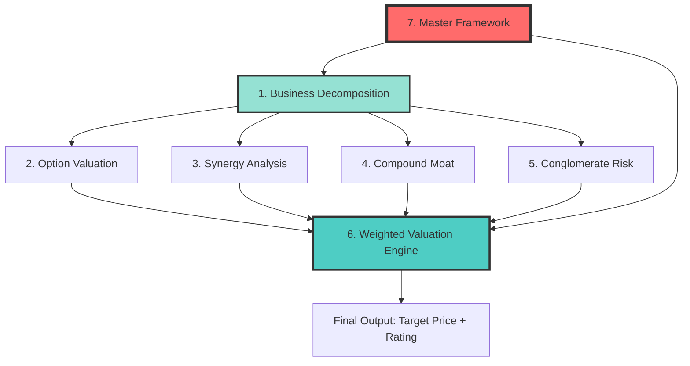

# Universal Framework System for Multi-Business Company Analysis

**Version**: 1.0
**Created**: 2026-02-02
**Author**: Investment Master Agent v19.12

---

## 📋 Table of Contents

- [Overview](#overview)
- [Framework Architecture](#framework-architecture)
- [Quick Start Guide](#quick-start-guide)
- [Framework Descriptions](#framework-descriptions)
- [Complete Example: Tesla](#complete-example-tesla)
- [Framework Selection Guide](#framework-selection-guide)
- [Best Practices](#best-practices)
- [Next Steps](#next-steps)

---

## 🎯 Overview

This framework system provides a **standardized, comprehensive methodology** for analyzing companies with multiple business units. It addresses the unique challenges of valuing complex, multi-business organizations like Tesla, Amazon, Alphabet, and Berkshire Hathaway.

### Why This Framework System?

**Traditional SOTP (Sum-of-the-Parts) analysis is insufficient** because it:
- Ignores synergies (positive and negative) between businesses
- Doesn't account for compound moat effects
- Overlooks conglomerate-specific risks
- Lacks a systematic methodology

**This framework system solves these problems** by providing:
- ✅ Systematic business decomposition
- ✅ Rigorous synergy quantification
- ✅ Compound moat assessment
- ✅ Conglomerate risk analysis
- ✅ Integrated valuation engine

### Key Design Principles

1. **Modular**: 7 specialized frameworks, each handling one aspect
2. **Sequential**: Fixed execution order with quality gates
3. **Generalizable**: 70% universal + 20% parameterizable + 10% industry-specific
4. **Evidence-Based**: Every judgment requires data support (Level A-E tagging)
5. **Conservative**: Synergies conservatively estimated, risks fully acknowledged

---

## 🏗️ Framework Architecture

### The 7 Frameworks

```
┌─────────────────────────────────────────────────────────────────┐
│  Tier 0: Foundation (Business Decomposition)                    │
├─────────────────────────────────────────────────────────────────┤
│  1. business_decomposition_protocol_v1.yaml                     │
│     - Splits company into independent business units            │
│     - 3-tier financial decomposition (directly disclosed/       │
│       calculable/allocated)                                     │
│     - Identifies option-type businesses                         │
│                                                                 │
│  2. option_business_valuation_v1.yaml                          │
│     - Values pre-revenue/high-uncertainty businesses           │
│     - Methods: rNPV, Black-Scholes, Monte Carlo                │
│     - Examples: Robotaxi, Optimus                              │
└─────────────────────────────────────────────────────────────────┘

┌─────────────────────────────────────────────────────────────────┐
│  Tier 1: Adjustments (Synergies & Moats)                       │
├─────────────────────────────────────────────────────────────────┤
│  3. business_synergy_analysis_v1.yaml                          │
│     - Identifies revenue/cost/negative/no synergies            │
│     - Quantifies synergy NPV                                   │
│     - Methods: incremental revenue, cost saving, discount      │
│                                                                 │
│  4. compound_moat_assessment_v1.yaml                           │
│     - Analyzes moat interactions (reinforcing/independent/     │
│       diluting)                                                │
│     - N×N interaction matrix                                   │
│     - Durability assessment (tech/entrant/decay/regulatory)    │
│                                                                 │
│  5. conglomerate_risk_framework_v1.yaml                        │
│     - Identifies 5 risk types (management attention/           │
│       complexity/capital misallocation/opacity/drift)          │
│     - Calculates conglomerate discount (10-40%)               │
│     - Benchmarks against peer conglomerates                    │
└─────────────────────────────────────────────────────────────────┘

┌─────────────────────────────────────────────────────────────────┐
│  Tier 2: Integration (Valuation & Orchestration)               │
├─────────────────────────────────────────────────────────────────┤
│  6. weighted_valuation_engine_v1.yaml                          │
│     - Integrates all framework outputs                         │
│     - Calculates SOTP with all adjustments                     │
│     - Bull/Base/Bear scenarios + probability weighting         │
│     - Valuation bridge (SOTP → target price)                  │
│     - Sensitivity analysis                                     │
│                                                                 │
│  7. hybrid_business_master_framework_v1.yaml ⭐                 │
│     - Master orchestration framework                           │
│     - Coordinates execution of frameworks 1-6                  │
│     - Quality gates between phases                             │
│     - Complete Tesla example                                   │
└─────────────────────────────────────────────────────────────────┘
```

### Dependencies Flow



---

## 🚀 Quick Start Guide

### Step 1: Determine Applicability

**Use this framework system if:**
- ✅ Company has ≥2 independent business units
- ✅ Businesses have different characteristics (mature vs growth, profitable vs option)
- ✅ Potential synergies or negative synergies exist

**Do NOT use if:**
- ❌ Single business with multiple product lines (e.g., Nike with shoes/apparel)
- ❌ High integration with no independent P&L (use master_investment_framework instead)

### Step 2: Choose Entry Point

**For first-time deep analysis:**
→ Use `hybrid_business_master_framework_v1.yaml` (orchestrates all 7 frameworks)

**For quarterly updates:**
→ Skip to Phase 2 (Business Valuation) + Phase 6 (Integrated Valuation)

**For specific analysis:**
→ Use individual frameworks directly:
- Only interested in synergies? → `business_synergy_analysis_v1.yaml`
- Only want conglomerate discount? → `conglomerate_risk_framework_v1.yaml`

### Step 3: Execute

**Time Requirement**: 5-6 hours for complete analysis

**Execution Sequence**:
1. **Phase 1**: Business Decomposition (30-40 min)
2. **Phase 2**: Business Valuation (60-90 min)
3. **Phase 3**: Synergy Analysis (40-60 min)
4. **Phase 4**: Moat Assessment (40-60 min)
5. **Phase 5**: Risk & Discount (30-40 min)
6. **Phase 6**: Integrated Valuation (50-70 min)

**Quality Gates**: Each phase has pass/fail criteria. Cannot proceed to next phase without passing.

---

## 📖 Framework Descriptions

### 1. Business Decomposition Protocol

**Purpose**: Split the company into independent valuation units

**Key Concepts**:
- **5-Criteria Independence Test**: Can it operate standalone with independent P&L?
- **3-Tier Financial Data**:
  - Tier 1: Directly disclosed (Level A)
  - Tier 2: Calculable (unit economics × volume, Level B-C)
  - Tier 3: Allocated (Level E, must state assumptions)
- **Business Attributes**: Industry/maturity/cyclicality/margin profile

**Example (Tesla)**:
- 6 businesses identified: Automotive, Energy, Services, FSD, Robotaxi, Optimus
- 3 mature (Automotive/Energy/Services), 3 option-type (FSD/Robotaxi/Optimus)
- Financial split: 82% Automotive, 11% Energy, 7% Services (Tier 1 data)

**Output**: Business list × attributes × financial data

---

### 2. Option Business Valuation

**Purpose**: Value pre-revenue or highly uncertain businesses using option pricing

**Methods**:

| Method | When to Use | Example |
|--------|-------------|---------|
| **rNPV** | Pre-revenue with clear milestones | Robotaxi (4 milestones, 8.4% cumulative probability) |
| **Black-Scholes** | High uncertainty, option-like payoff | Optimus ($87.7B option value, 85% volatility) |
| **Monte Carlo** | Complex scenarios, multiple variables | TAM penetration modeling |

**Key Parameters**:
- **rNPV**: Milestones, success probabilities, success scenario NPV
- **Black-Scholes**: S (success value), K (CapEx required), T (time), σ (volatility)

**Best Practices**:
- Give ranges, not point estimates
- Label confidence levels
- Avoid "false precision"

---

### 3. Business Synergy Analysis

**Purpose**: Identify and quantify synergies (positive and negative)

**4 Synergy Types**:

**Positive Synergies**:
- **Revenue Synergies**: Cross-sell, brand spillover, network effects, data flywheel
- **Cost Synergies**: Shared infrastructure, shared R&D, purchasing power

**Negative Synergies**:
- **Cannibalization**: Business B's growth at Business A's expense
- **Management Attention**: CEO time diluted across multiple businesses
- **Brand Dilution**: Low-end business hurts high-end brand
- **Operational Complexity**: Management costs grow super-linearly

**No Synergy**:
- Pure conglomerate (e.g., Berkshire's insurance + railroad)

**Quantification Methods**:
- Incremental Revenue Method (for revenue synergies)
- Cost Saving Method (for cost synergies)
- Comparable Discount Method (for negative synergies)
- Option Value Method (for data flywheel, etc.)

**Example (Tesla)**:
- Positive: Cross-sell Auto→Energy (+$16.2B NPV), Brand spillover (+$18B), Shared infra (+$1.74B)
- Negative: Robotaxi cannibalization (-$10B), Management attention (-$200B as 20% discount)

---

### 4. Compound Moat Assessment

**Purpose**: Evaluate how moats interact and reinforce/dilute each other

**Key Concepts**:
- **Moat Interaction**: 1+1 can be >2 (reinforcing) or <2 (diluting)
- **N×N Interaction Matrix**: Score each moat pair (+2/+1/0/-1/-2)
- **Compound Multiplier**: Total score / baseline score (e.g., 1.48x for Tesla)
- **Durability vs Strength**: Strong moat ≠ durable moat

**Durability Assessment (4 Dimensions)**:
1. **Tech Disruption**: Can new tech bypass this moat? (1-10)
2. **New Entrant Threat**: Who can attack this moat? (1-10)
3. **Decay Rate**: How long until moat disappears without maintenance? (1-10)
4. **Regulatory Risk**: Can policy weaken this moat? (1-10)

**Formula**: Durability = 10 - (Tech×0.3 + Entrant×0.3 + Decay×0.2 + Regulatory×0.2)

**Example (Tesla)**:
- 5 core moats: FSD data (9/10 strength, 5/10 durability), Brand (8/10, 7/10), Scale (7/10, 8/10), Vertical integration (7/10, 8/10), Charging network (9/10, 6/10)
- Interaction score: +19 → Compound multiplier 1.48x
- Economic profit: $9.35B/year → Moat value $140B (15× perpetuity)

---

### 5. Conglomerate Risk Framework

**Purpose**: Identify risks specific to multi-business companies and calculate discount

**5 Risk Types**:

| Risk | Description | Typical Discount |
|------|-------------|-----------------|
| **Management Attention** | CEO time diluted across N businesses | 15-25% (high) |
| **Operational Complexity** | SG&A costs grow super-linearly | 5-10% |
| **Capital Misallocation** | Funds wasted on low-ROIC businesses | 5-15% |
| **Information Opacity** | Hard for investors to value → uncertainty premium | 5-10% |
| **Strategy Drift** | Loss of core focus, chasing hot trends | 5-15% |

**Conglomerate Discount Methodology**:

**Method 1 - Comparable Valuation**:
```
SOTP (sum of standalone values) = $503.6B
Market Cap = $227B
Implied discount = ($227B - $503.6B) / $503.6B = -55%
```

**Method 2 - Bottom-Up Risk Summation**:
```
Management attention: 20%
Complexity: 5%
Capital misallocation: 5%
Opacity: 5%
Total: 35%
```

**Reconciliation**: Tesla's 55% discount = 35% conglomerate risks + 20% option business uncertainty

**Benchmarks**:
- Berkshire: 15% (excellent management, minimal complexity)
- Alphabet: 15% (high synergy, good disclosure)
- GE (historical): 40% (poor capital allocation, excessive complexity)

---

### 6. Weighted Valuation Engine

**Purpose**: Integrate all framework outputs into final valuation

**Execution Flow**:

```
Step 1: SOTP Baseline
  = Σ(Business standalone values)
  = $503.6B (Tesla example)

Step 2: + Synergy Adjustments
  = +$13.74B (conservative: 50% weight on uncertain synergies)

Step 3: + Moat Premium
  = $0 (usually already in DCF assumptions, avoid double-counting)

Step 4: - Conglomerate Discount
  = × (1 - 15%) for Base Case
  = $517.3B × 0.85 = $439.7B

Step 5: Three Scenarios
  Bull (20%): $530B (10% discount)
  Base (60%): $440B (15% discount)
  Bear (20%): $334B (25% discount)

  Probability-weighted = $437B

Step 6: Target Price
  SOTP per share = $437B / 3.18B = $137/share
  + Time value (12-month growth) = +15%
  + Catalyst premium = +7%
  = 12-month target $158/share
```

**Valuation Bridge** (Critical):
- Ensures no logical leaps from SOTP to target price
- Every adjustment must be justified
- Delta between SOTP and target must be <20% or have detailed explanation

**Sensitivity Analysis**:
- One-way: 5-7 key assumptions ±20%
- Scenario matrix: 2×2 (e.g., core business × option business)
- Monte Carlo: 10,000 simulations (if time permits)

---

### 7. Hybrid Business Master Framework

**Purpose**: Orchestrate all 6 frameworks in correct sequence

**Key Features**:
- **Applicability Check**: Determines if company qualifies for multi-business analysis
- **6-Phase Execution**: Fixed sequence with quality gates
- **Time Allocation**: 5-6 hours total for deep analysis
- **Complete Example**: Full Tesla walkthrough (end-to-end)

**Quality Gates**:
- Phase 1: Financial decomposition complete? Σ(businesses) = Total?
- Phase 2: Every business valued with clear method?
- Phase 3: Negative synergies not ignored? ≥2 identified?
- Phase 4: Moat interactions explained with mechanisms?
- Phase 5: All 5 risk types assessed?
- Phase 6: SOTP logic consistent? Valuation bridge clear?

---

## 🔍 Complete Example: Tesla

### Overview
- **Company**: Tesla Inc (TSLA)
- **Business Count**: 6 (Automotive, Energy, Services, FSD, Robotaxi, Optimus)
- **Complexity**: Extremely High (spanning auto/energy/AI/robotics)
- **Analysis Time**: 5-6 hours

### Phase 1: Business Decomposition

**Output**:
| Business | Revenue (2025E) | Type | Independence | Valuation Method |
|----------|----------------|------|--------------|-----------------|
| Automotive | $79B (82%) | Mature | 5/5 | DCF |
| Energy Storage | $10.5B (11%) | Growth | 4/5 | 15× P/E |
| Services+Software | $6.7B (7%) | Growth | 3/5 | 5× P/S |
| FSD | $1.5B订阅 | Option | 4/5 | rNPV |
| Robotaxi | $0 (pre-revenue) | Option | 5/5 | rNPV |
| Optimus | $0 (R&D) | Option | 5/5 | Black-Scholes |

### Phase 2: Business Valuation

**Standalone Values**:
- Automotive: **$300B** (DCF, 15% CAGR, 12% EBIT margin → 15%, WACC 8%)
- Energy: **$40B** (15× P/E on $2.7B net income)
- Services: **$25B** (5× P/S on $5B revenue)
- FSD: **$50B** (rNPV, 60% L4 success probability)
- Robotaxi: **$0.87B** (rNPV, 4 milestones, 8.4% cumulative probability)
- Optimus: **$87.7B** (Black-Scholes: S=$100B, K=$22B, T=6y, σ=85%)

**SOTP Baseline**: $503.6B

### Phase 3: Synergy Analysis

**Positive Synergies**:
- Cross-sell Auto→Energy: +$16.2B NPV (40% confidence → 50% weight = +$8B)
- Brand spillover S/X→3/Y: +$18B NPV (35% confidence → 50% weight = +$9B)
- Shared infrastructure (Giga): +$1.74B NPV (60% confidence → 100% = +$1.74B)
- Data flywheel FSD→Optimus: +$50B (20% confidence → 0% in Base Case)

**Negative Synergies**:
- Robotaxi cannibalization: -$10B NPV (15% confidence → 50% weight = -$5B)
- Management attention (Musk across 5 companies): -20% discount on total value

**Net Synergy**: +$13.74B (Base Case conservative)

### Phase 4: Compound Moat Assessment

**5 Core Moats**:
1. FSD Data: Strength 9/10, Durability 5/10 (AI progress may reduce data advantage)
2. Brand: Strength 8/10, Durability 7/10 (depends on continuous innovation)
3. Scale: Strength 7/10, Durability 8/10 (capacity expansion ongoing)
4. Vertical Integration: Strength 7/10, Durability 8/10 (supply chain resilience)
5. Charging Network: Strength 9/10, Durability 6/10 (opening to competitors weakens exclusivity)

**Interaction Matrix**:
- Key interactions: FSD↔Brand (+2 both ways), Brand↔Charging (+2 both ways)
- Interaction score: +19
- Compound multiplier: 1.48× (vs 1.0× for independent moats)

**Financial Contribution**:
- Excess ROIC: 28.7% - 10% WACC = 18.7%
- Economic profit: $50B × 18.7% = $9.35B/year
- Moat value: $9.35B × 15× = $140B (already in DCF, no additional premium)

### Phase 5: Conglomerate Risk & Discount

**5 Risk Types**:
- Management attention: **20%** discount (Musk across Tesla/SpaceX/X/Neuralink/xAI, evidence: FSD delayed 3 years, Semi delayed 4 years)
- Operational complexity: **5%** (5 businesses, wide span)
- Capital misallocation: **5%** (Optimus $3-5B/year, ROI unclear)
- Information opacity: **5%** (option businesses not disclosed)
- Strategy drift: **0%** (sustainable energy theme coherent)

**Total Risk Discount**: 35% (maximum) to 10% (minimum)

**Market Implied**:
- SOTP: $503.6B
- Market cap: $227B
- Implied discount: 55%
- Breakdown: 35% conglomerate risks + 20% option uncertainty

### Phase 6: Integrated Valuation

**Three Scenarios**:

| Scenario | Probability | SOTP | Synergies | Discount | Final Value |
|----------|------------|------|-----------|----------|-------------|
| **Bull** | 20% | $503.6B | +$85.9B | -10% | **$530B** |
| **Base** | 60% | $503.6B | +$13.7B | -15% | **$440B** |
| **Bear** | 20% | $450B | -$5B | -25% | **$334B** |

**Probability-Weighted**: $437B = **$137/share**

**Target Price (12-month)**:
- SOTP: $137/share
- Time value (+15%): +$21
- Catalyst premium (+7%): +$10
- **Target: $158/share**

**vs Current Price $71/share**:
- **Upside: +123%**

**Investment Rating**: **4 Star - Focus**
- High upside (+123%)
- Risks: execution delays, China market share loss, option business failures
- Suitable for: high risk tolerance, 3-5 year horizon, AI/robotics believers

**Kill Switches**:
- FSD L4 regulatory ban (5% probability) → Value -$50B
- China share <3% (30% probability) → Value -$30B
- Musk leaves Tesla (10% probability) → Value -$100B
- Robotaxi tech failure (70% probability) → Value -$10B
- Optimus failure (80% probability) → Value -$88B

---

## 🧭 Framework Selection Guide

### Decision Tree

```
Q1: How many independent businesses?
  → 1 business: Use master_investment_framework ❌ (not this system)
  → 2+ businesses: Continue ✓

Q2: Are businesses truly independent (can operate standalone)?
  → No (just product lines): Use master_investment_framework ❌
  → Yes: Continue ✓

Q3: What's your analysis goal?
  → First-time deep analysis: Use hybrid_business_master_framework ✓
  → Quarterly update: Skip to valuation_engine ✓
  → Only interested in synergies: Use business_synergy_analysis ✓
  → Only need conglomerate discount: Use conglomerate_risk_framework ✓
```

### When to Use Each Framework Individually

| Framework | Use When | Don't Use When |
|-----------|----------|----------------|
| **business_decomposition** | • Need to split financials<br>• Unclear segment reporting | • Single business<br>• Businesses too integrated |
| **option_business_valuation** | • Pre-revenue businesses<br>• High uncertainty futures | • Mature, predictable businesses |
| **business_synergy_analysis** | • Potential synergies exist<br>• M&A evaluation | • Pure conglomerate (BRK)<br>• No interaction |
| **compound_moat_assessment** | • Multiple moats<br>• Moats may interact | • Single moat<br>• Commodity business |
| **conglomerate_risk** | • 3+ businesses<br>• Complex structure | • Related businesses<br>• Tight integration |
| **weighted_valuation_engine** | • Final valuation needed<br>• All inputs ready | • Missing key data<br>• Quick screening only |
| **hybrid_business_master** | • Complete analysis<br>• First-time deep dive | • Quick valuation<br>• Quarterly update |

---

## 💡 Best Practices

### 1. Data Quality

**Always tag data levels**:
- **Level A**: API-direct (FMP, 100baggers) - 95% confidence
- **Level B**: Public filings (10-K, 10-Q) - 90% confidence
- **Level C**: Third-party databases (Glassdoor, Bloomberg) - 70-85% confidence
- **Level D**: Analyst reports (JPM, UBS) - 60-80% confidence
- **Level E**: This report's estimates - 40-70% confidence, **MUST state methodology**

**Never fabricate data**. If data is missing, either:
1. Find proxy data (state assumptions)
2. Use comparable companies
3. Explicitly mark as "Unknown" and explain impact

### 2. Conservative Synergy Estimates

**Default approach**:
- Positive synergies: Apply 50% weight if confidence <50%
- Negative synergies: Apply 100% weight even if low confidence (be conservative)
- Data flywheel/option synergies: Often exclude from Base Case (too uncertain)

**Avoid "synergy illusion"**:
- Management claims synergies but no evidence? Ignore or heavily discount
- Cross-validate with historical M&A synergy realization (typically 60-70% fails)

### 3. Conglomerate Discount Reality

**Don't underestimate**:
- Academic average: 13-15% (Berger & Ofek 1995)
- Real-world range: 10-40% depending on complexity and management quality
- Even "good" conglomerates get 10-15% discount (Berkshire, Alphabet)

**Factors that increase discount**:
- ↑ Number of unrelated businesses
- ↓ Information transparency (poor segment disclosure)
- ↑ Management complexity (CEO spread thin)
- ↓ Historical capital allocation track record

### 4. Valuation Bridge Discipline

**Iron rule**: Target price vs SOTP delta must be <20% or fully explained

**Bad example** (DON'T DO):
```
SOTP: $161/share
Target price: $250/share (+55% jump)
Explanation: "Analyst consensus" ❌
```

**Good example** (DO THIS):
```
SOTP: $437B = $137/share
Adjustments:
  + Time value (15% growth over 12 months): +$21
  + Catalyst premium (FSD V13, Optimus Gen 3): +$10
Target: $158/share (+15% vs SOTP)
Justification: Reasonable given growth trajectory ✓
```

### 5. Sensitivity Analysis is Mandatory

**Don't give point estimates without ranges**:
- ❌ "Optimus worth $87.7B"
- ✓ "Optimus worth $50-150B (P10-P90), base case $87.7B"

**Always test top 5-7 assumptions**:
- Revenue growth ±5pp
- Margin ±2pp
- WACC ±1pp
- Success probability ±20pp
- Conglomerate discount ±10pp

### 6. Reflection Loop

**After completing analysis, ask**:
- Did I ignore negative synergies because they're uncomfortable?
- Are my synergy estimates just repeating management talking points?
- Is my conglomerate discount too optimistic?
- Did I give option businesses too much credit?
- Are my assumptions consistent across businesses?

**If any answer is "yes"**, revise before finalizing.

---

## 🔮 Next Steps

### Stage 3: Amazon Validation (Planned)

**Purpose**: Validate framework generalizability with a different multi-business company

**Amazon Business Structure**:
- North America Retail
- International Retail
- AWS
- Advertising
- Subscription Services (Prime)

**Framework Application**:
1. Decomposition: 5 businesses, excellent segment disclosure
2. Synergies: Prime flywheel (strongest cross-business synergy example)
3. Moats: Network effects + scale + data compound reinforcement
4. Discount: Minimal (15%, high synergy + transparent + strong management)
5. Target: Framework should complete analysis in ≤60% of Tesla time

**Success Criteria**:
- Framework reuse rate: ≥80%
- Quality: ≥Tesla's 90%
- Time: ≤60% of Tesla's time
- Identify framework improvements needed

### Framework Evolution

**v1.0 → v1.1 Improvements (Based on Amazon validation)**:
- Parameter adjustments for different industries
- Additional synergy types discovered
- Refined conglomerate discount factors
- Streamlined execution (reduce time by 20%)

---

## 📚 Reference

### File Locations

```
skills/universal/
├── README.md (this file)
├── business_decomposition_protocol_v1.yaml
├── option_business_valuation_v1.yaml
├── business_synergy_analysis_v1.yaml
├── compound_moat_assessment_v1.yaml
├── conglomerate_risk_framework_v1.yaml
├── weighted_valuation_engine_v1.yaml
└── hybrid_business_master_framework_v1.yaml
```

### External Dependencies

- `skills/_common/master_investment_framework_v1.yaml` - General investment framework
- `skills/core/moat_deep_analysis_v1.yaml` - Single-business moat analysis
- `skills/core/valuation_engine_agent_v1.yaml` - Basic valuation methods

### Academic References

- **Conglomerate Discount**: Berger & Ofek (1995), "The Diversification Discount"
- **Synergy Realization**: Moeller et al. (2004), "Takeover Synergies"
- **Option Pricing**: Black-Scholes (1973), Cox-Ross-Rubinstein (1979)
- **Economic Profit**: Stern Stewart EVA methodology

---

## 🙋 FAQ

**Q: Can I use this for non-public companies?**
A: Yes, but data quality will be lower (mostly Level D-E). Framework logic remains valid.

**Q: What if segment disclosure is poor?**
A: Use Tier 3 allocation methods (revenue-based, asset-based). Clearly mark as Level E data. Estimated components will increase, but analysis is still valuable.

**Q: Should I always use all 7 frameworks?**
A: For first-time analysis, yes. For updates, you can skip unchanged parts (e.g., moat assessment if no structural change).

**Q: How to handle spin-offs/M&A?**
A: Re-run decomposition after structure changes. Compare pre/post SOTP to assess value creation.

**Q: Can I apply this to non-US companies?**
A: Yes, but adjust for:
- Data availability (emerging markets: lower quality)
- Regulatory environment (China: different discount factors)
- Currency risk (add to conglomerate risk section)

**Q: What if I disagree with a framework's methodology?**
A: Frameworks are templates. You can modify, but:
1. Document your changes
2. Maintain internal consistency
3. Explain why standard approach doesn't fit

---

## 📧 Contact & Contribution

**Version**: 1.0
**Last Updated**: 2026-02-02
**Maintainer**: Investment Master Agent v19.12

**Improvements welcome**:
- Found a bug? Report it
- Have a better method? Share it
- Tested on a company? Contribute the example

**Planned updates**:
- v1.1: Based on Amazon validation feedback
- v1.2: Additional industry examples (financial services, healthcare)
- v2.0: Machine learning integration for parameter estimation

---

**END OF README**

*"The goal is not to be perfect, but to be systematically rigorous. These frameworks provide that system."*
