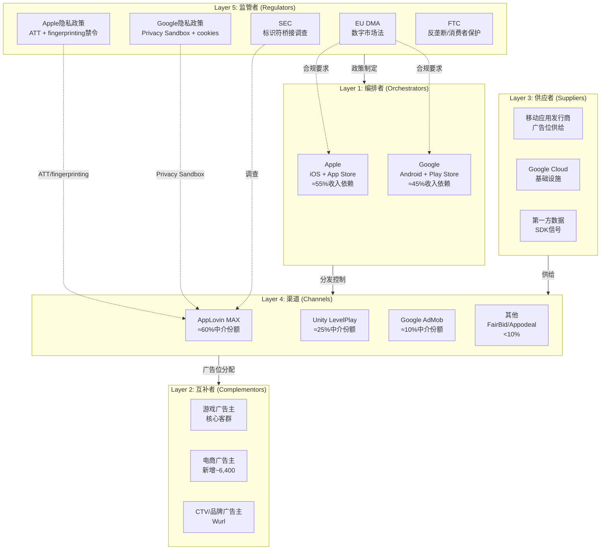
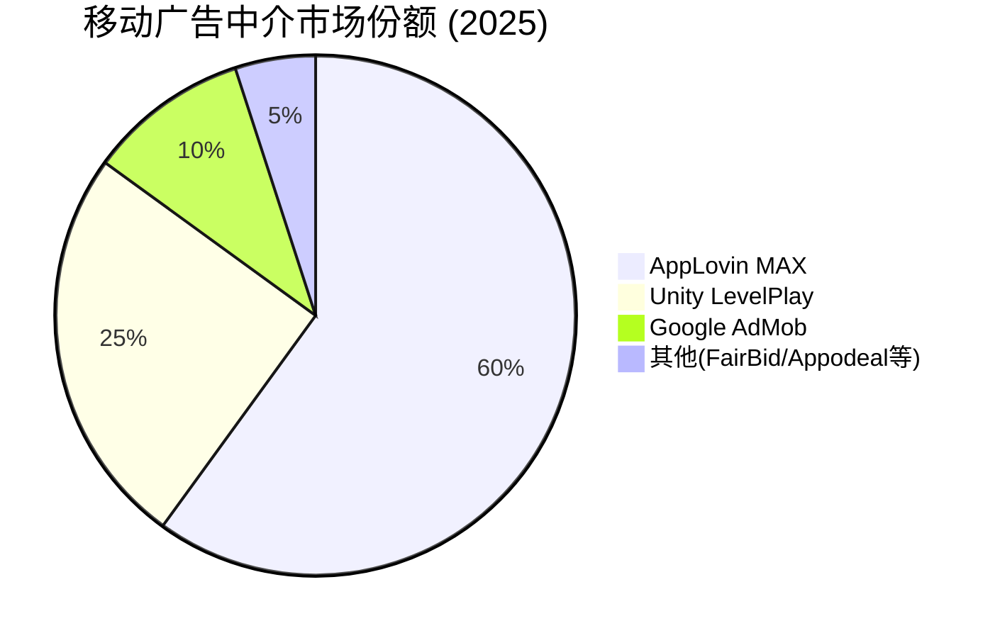
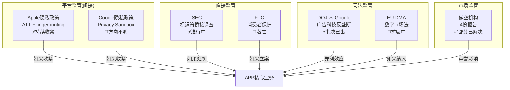
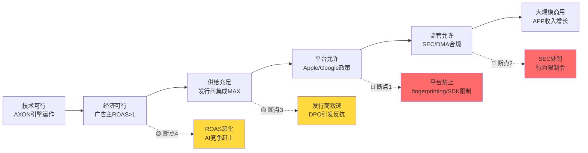
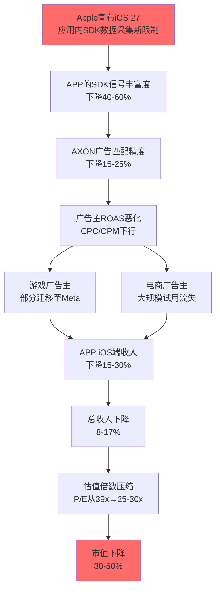
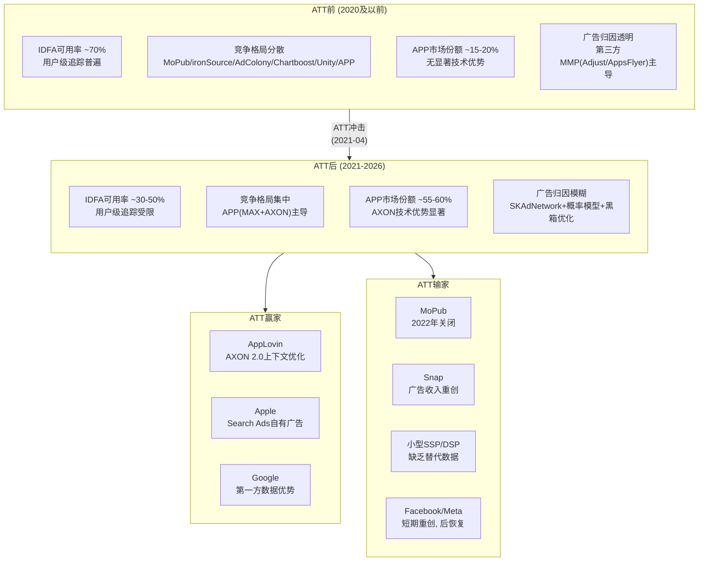
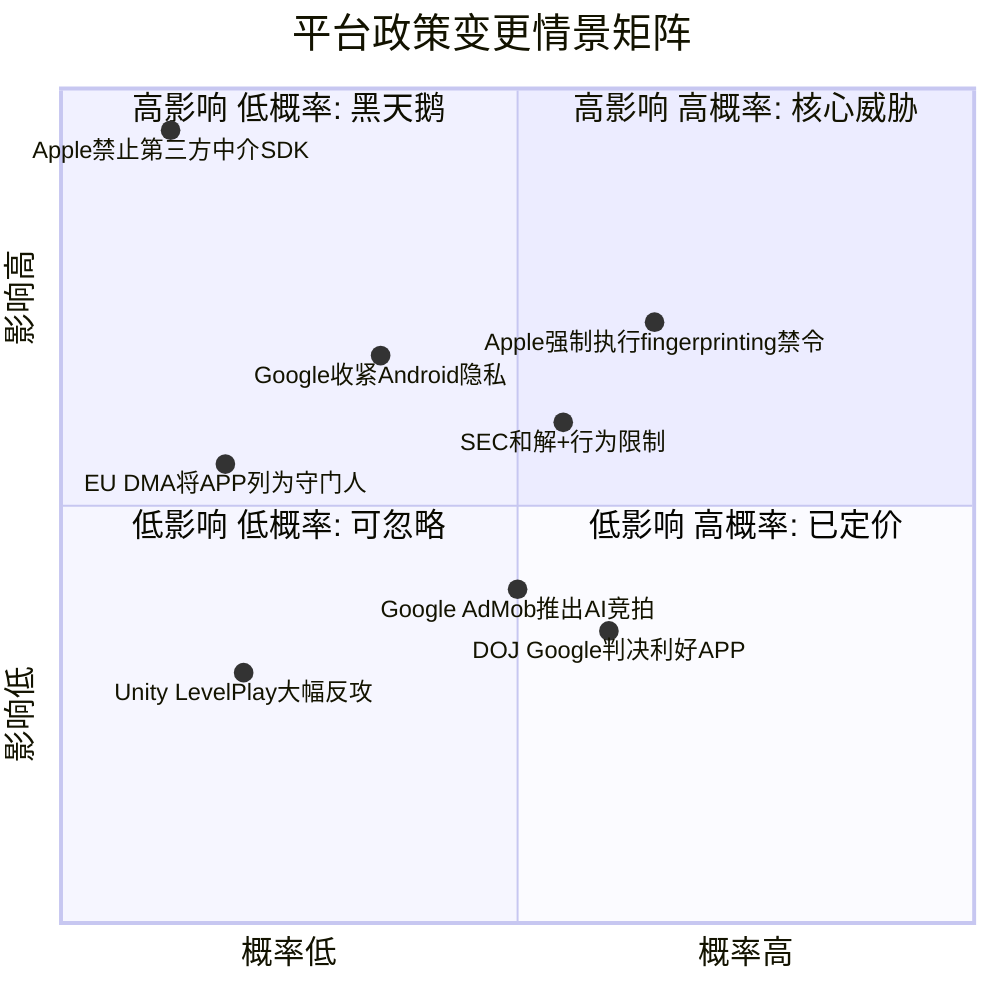

# Chapter 6: ERM生态风险映射 — AppLovin五层依赖分析

> **Agent B 独立风险审计员产出** | Phase 1 | 关联CQ: CQ5(隐私政策系统性影响), CQ6(DPO定时炸弹)
> **核心发现**: APP的生态依赖度远超表面认知 — 编排者层(Apple+Google)控制100%的分发渠道和隐私规则, 任何一方的政策变更都可能在6-12个月内重塑APP的竞争格局。ATT是APP崛起的最大外生催化剂, 但同一力量(平台隐私收紧)也是其最大的存亡威胁。

---

## 6.1 ERM触发评估: 为什么APP必须做生态风险映射

AppLovin满足ERM框架全部5项强制触发条件中的4项:

| 触发条件 | APP适用性 | 依据 |
|----------|:---------:|------|
| 生态依赖度>20% | **100%** | 收入完全依赖Apple App Store + Google Play的移动应用生态, 无独立分发渠道 |
| 平台模式 | **是** | 三边市场: 广告主(买方) - APP(中介/优化) - 开发者/发行商(卖方) |
| AI基础设施 | **是** | AXON引擎为广告主提供AI驱动的竞价优化服务 |
| 监管密集 | **是** | SEC调查进行中 + 4份做空报告 + EU DMA + Apple/Google隐私政策 |
| 网络效应 | **部分** | MAX中介层存在供给侧网络效应(更多发行商=更多广告位=更好优化), 但非指数级 |

**结论**: APP是典型的"寄生于双寡头生态"的中间层公司 — 其价值创造完全发生在Apple和Google控制的操作系统之上, 这一结构性特征使得ERM分析不是"可选"而是"必要"。

---

## 6.2 ERM五层生态全景图

---

## 6.3 Layer 1: 编排者层 — Apple与Google的双寡头控制

### 6.3.1 依赖度量化

APP对编排者层的依赖是**绝对的、不可替代的、且不对称的**:

| 维度 | Apple (iOS) | Google (Android) | 合计 |
|------|:-----------:|:----------------:|:----:|
| **收入贡献估计** | ~55% | ~45% | 100% |
| **利润贡献估计** | ~65% | ~35% | 100% |
| **政策控制力** | 极高(ATT先例) | 高(Privacy Sandbox) | — |
| **替代方案** | 无 | 无 | **零** |

**iOS偏重的原因**: DM-ADT-003显示Tenjin报告iOS端APP市占率37%(第一), Android端24%(第二); Pixalate Q3 2025数据显示APP在Apple App Store的SDK渗透率达85%, 位列第一。iOS用户ARPU显著高于Android(CPI高40-60%), 因此iOS对APP的利润贡献比收入占比更高。

### 6.3.2 编排者权力的三重维度

**第一维度: 分发垄断**。所有移动应用必须通过App Store或Google Play分发。APP的SDK必须内嵌于这些应用中才能运行。如果任一平台修改SDK政策或限制第三方中介层, APP将无法触达终端用户。

**第二维度: 隐私规则制定权**。Apple通过ATT(App Tracking Transparency, 2021年4月)单方面改写了移动广告行业的数据规则。Google虽然在2024年7月宣布不会淘汰第三方cookies(改为"用户选择"模型), 但仍保留随时收紧政策的权力。2025年10月, Google进一步宣布缩减Privacy Sandbox技术范围, 仅保留CHIPS、FedCM和Private State Tokens。编排者对隐私规则的单方面制定权意味着: APP的数据优势可以在一夜之间被政策消灭。

DM-REG-010: Apple ATT(2021-04)将全球iOS用户IDFA可用率从~70%降至<30%, 全行业广告收入损失估计$16B(2021年) [WebSearch: Digiday/IAPP/AdExchanger综合]

DM-REG-011: Google于2024-07宣布不淘汰第三方cookies, 改为用户选择模型; 2025-04确认不会推出单独的cookie同意弹窗, cookies默认保持启用 [WebSearch: Google Privacy Sandbox Blog]

DM-REG-012: Google于2025-10宣布缩减Privacy Sandbox技术范围, 仅保留CHIPS/FedCM/Private State Tokens, 大量Sandbox API被弃用 [WebSearch: privacysandbox.google.com]

**第三维度: 竞争性进入**。Apple运营Apple Search Ads(ASA), 在ATT后显著受益 — ATT限制了第三方追踪, 但Apple自有广告网络不受同等限制。Google同时是APP的基础设施供应商(Google Cloud)、渠道竞争对手(AdMob)和操作系统编排者(Android)。这种角色混同意味着APP始终面临编排者"既当裁判又当选手"的风险。

### 6.3.3 断裂影响评估

| 断裂情景 | 概率(5年) | 收入影响 | 恢复时间 |
|----------|:---------:|:--------:|:--------:|
| Apple完全禁止第三方中介SDK | 5-10% | -55%收入 | 不可恢复(iOS) |
| Apple强制执行fingerprinting禁令 | 30-45% | -15~30%收入 | 12-18个月 |
| Google推出Android原生中介层 | 10-15% | -20%收入 | 24-36个月 |
| 双平台同时收紧隐私政策 | 15-25% | -25~40%收入 | 18-24个月 |

DM-REG-013: iOS 26(2025年WWDC发布)引入默认开启的高级fingerprinting保护, Safari阻止网站访问屏幕尺寸/CPU核心/浏览器插件等设备特征, 呈现简化系统配置使更多设备看起来相同 [WebSearch: Singular/9to5Mac/Engadget]

**缓解措施现状**: APP的应对策略是AXON 2.0的上下文信号(contextual signals)优化 — 不依赖用户级标识符, 而是利用应用内行为模式进行广告匹配。这一策略的有效性取决于Apple是否在应用层面(而非仅浏览器层面)进一步收紧限制。目前iOS 26的fingerprinting保护主要针对Safari浏览器, 尚未扩展至应用内SDK, 但这一扩展仅是时间问题。

---

## 6.4 Layer 2: 互补者层 — 广告主生态

### 6.4.1 依赖度量化

| 广告主类型 | 收入占比(估) | 客户数 | 留存率 | 单客户价值 |
|-----------|:-----------:|:------:|:------:|:---------:|
| **游戏广告主**(核心) | ~75% | 数千家 | ~77%(年度) | 高(IAP驱动) |
| **电商广告主**(新增) | ~20% | ~6,400 | 待验证 | 中(30天LTV) |
| **CTV/品牌**(初期) | ~5% | 少量 | 待验证 | 待验证 |

**游戏广告主的结构性锁定**: 文献#2(Gamemakers)揭示了一个关键不对称 — 广告主支付与发行商收入之间的差距持续扩大, 纯利润被APP截取。游戏广告主面临"不用APP=失去AXON优化+MAX 60%供给"的困境, 这不是技术锁定而是生态锁定。

DM-MKT-020: Marketing Brew分析776家APP广告主, 显示年度流失率约23%, 意味着APP需要持续获取新客户来维持收入增长 [文献#4]

DM-MKT-021: Q4 2025电商广告主从~600增至~6,400(季度内10倍+增长), 但大部分处于试用阶段, 留存率未经验证 [文献#6 DeepDiveX]

### 6.4.2 互补者层的风险

**风险1: 广告主集中度**。游戏行业本身高度集中 — 前20大游戏发行商贡献了移动游戏广告支出的大部分。如果少数大客户(如Zynga、King、Supercell)转向Meta Advantage+或自建广告投放, 对APP的收入冲击可能是不对称的。

**风险2: 电商广告主的"试用陷阱"**。6,400家电商客户的爆发式增长看起来令人振奋, 但需要警惕: (a) 30天LTV-to-CAC盈亏平衡在电商领域可能不可持续, 因为电商复购周期远长于游戏内购; (b) 大广告主(如Wayfair、Ashley)要求更长的归因窗口和更透明的ROI报告; (c) 自助门户(Axon Ads Manager)GA版推迟至2026 H1, 在此之前电商客户仍需白手套服务, 规模化受限。

DM-MKT-022: BofA预测2026年电商净收入$3B(基于$7B广告支出), 4,000大广告主将采用APP — 这是Street最乐观的预测, 隐含假设电商客户留存率>80%和ROAS持续改善 [文献#21]

**风险3: 广告主的替代选择正在增加**。Meta Advantage+正积极进入游戏内广告竞价; Google Performance Max提供跨渠道AI优化; Moloco作为AI原生竞争者提供类似的RL驱动竞价优化但无中介层捆绑。广告主的选择增多意味着APP的定价权可能面临侵蚀。

### 6.4.3 断裂影响评估

| 断裂情景 | 概率(3年) | 收入影响 | 缓解措施 |
|----------|:---------:|:--------:|---------|
| 游戏广告主大规模迁移至Meta | 10-15% | -20~30% | AXON性能持续领先+MAX锁定 |
| 电商试用客户大规模流失 | 25-35% | -10~15% | 延长归因窗口+改善ROAS报告 |
| 大广告主要求透明度(反黑箱) | 20-30% | 利润率-5~10pp | 有限开放优化日志 |

---

## 6.5 Layer 3: 供应者层 — 三重供给依赖

### 6.5.1 依赖度量化

| 供应者 | 依赖度 | 替代难度 | 断裂影响 |
|--------|:------:|:--------:|:--------:|
| **移动应用发行商**(广告位) | 极高(95%) | 中 | 供给枯竭→无广告位可售 |
| **Google Cloud**(基础设施) | 极高(100%) | 高 | 系统瘫痪→全面停服 |
| **第一方数据**(SDK信号) | 高(80%) | 高 | 优化精度下降→ROAS恶化 |

### 6.5.2 发行商供给侧的结构性问题

移动应用发行商(publishers)为APP提供广告位库存(ad inventory)。APP通过MAX中介层聚合这些库存, 再由AXON引擎进行智能竞价匹配。

DM-TEC-020: APP的MAX中介层在iOS端占据约37%的广告收入份额(第一), 在Android端占24%(第二, 仅次于AdMob 28%) [文献#17 Tenjin Benchmark Report 2025]

DM-TEC-021: 使用MAX中介的发行商中, APP网络通常贡献约50%的广告展示量, 而在LevelPlay中APP网络的展示份额显著更低 [WebSearch: GameBiz/Bidlogic]

DM-TEC-022: MAX, LevelPlay, AdMob三家合计控制>90%的移动广告中介市场, 小玩家(FairBid/Appodeal/Loomit/Chartboost)合计份额<10% [WebSearch: Gamesforum 2025]

**发行商的困境与反抗可能**: 文献#2(Gamemakers)指出, 广告主支付与发行商收入之间的差距持续扩大。发行商的不满情绪正在积累 — 如果出现一个提供更高分成比例的替代中介层, 发行商可能会用脚投票。目前LevelPlay是唯一有意义的替代, 但Unity自身财务困境($18.68股价, 从$52跌落)限制了其竞争力。

**DPO与发行商的关系**: DM-FIN-059显示APP的DPO(应付账款周转天数)从FY2023的128天→FY2024的176天→FY2025的360天, 持续扩大。这意味着APP平均延迟近一年才向发行商支付广告收入分成。对比行业标准30-60天, APP的DPO异常程度令人侧目。这既是"免费浮存金"(CI-4), 也是潜在的发行商集体反抗导火索。

### 6.5.3 Google Cloud基础设施依赖

DM-TEC-023: APP于2021年初将7个数据中心迁移至Google Cloud(其中5个在一天内完成), 目前全部基础设施运行在GCP上, 使用GKE/Vertex AI/BigQuery [WebSearch: Google Cloud Blog]

DM-TEC-024: APP在2023年初开始测试Google Cloud G2 VM(基于NVIDIA L4 Tensor Core GPU), 实现约2倍的价格/性能提升, 专门用于AXON的大规模推理工作负载 [WebSearch: Google Cloud Blog]

这一依赖的风险在于: **Google既是APP的基础设施供应商(Google Cloud), 又是其最大的竞争对手之一(AdMob中介层, Google Ads广告网络), 同时还是Android生态的编排者**。这种三重角色冲突意味着:

1. **定价权不对称**: Google可以通过调整云服务价格间接影响APP的成本结构
2. **数据可见性**: 作为云服务商, Google理论上可以观察APP的流量模式和商业指标
3. **战略性锁定**: 从GCP迁移到AWS/Azure的成本极高(7个数据中心级别的工作负载), 估计需6-12个月和数千万美元

### 6.5.4 第一方数据供给的脆弱性

APP在2025年7月剥离了自有游戏业务(Apps, $400M), 从此失去了第一方游戏运营数据的直接来源。剥离后, APP完全依赖通过MAX SDK嵌入第三方应用收集的信号数据。

DM-TEC-025: Apps剥离后, AXON的训练数据来源从"自有游戏+第三方应用"变为"纯第三方应用", 数据丰富度可能下降, 但管理层声称AXON 2.0的上下文信号方法不依赖用户级标识符 [文献#1 Apex Predator + 规划书分析]

**如果Apple进一步禁止应用内SDK的数据采集(类似Safari的fingerprinting限制扩展至应用层)**: APP将面临数据供给的"断崖式"减少。AXON引擎的优化精度直接取决于可用信号的丰富度 — 信号减少→优化精度下降→ROAS恶化→广告主流失, 形成负反馈循环。

---

## 6.6 Layer 4: 渠道层 — MAX中介层的双刃剑

### 6.6.1 MAX的市场地位

DM-MKT-023: 2022年3月MAX与LevelPlay市场份额几乎持平, 但到2025年5月MAX已显著领先; MoPub(Twitter)2022年关闭后其客户大量涌入MAX, 是份额跳升的关键催化 [WebSearch: Gamesforum/GameBiz]

### 6.6.2 MAX-AXON捆绑的竞争策略

APP的核心竞争策略可以概括为: **"用MAX垄断广告位供给, 用AXON垄断广告位分配优化, 两者捆绑形成闭环"**。具体机制:

1. **ROAS campaigns仅限MAX用户**: 广告主如果想使用AXON的ROAS优化功能(APP最有价值的功能), 必须通过MAX发行商的广告位投放。这意味着使用其他中介层(如LevelPlay)的发行商的广告位无法获得AXON的最佳优化。

2. **数据独占**: MAX SDK在发行商应用中采集的数据只流向AXON, 不与其他广告网络共享。APP在MAX上的广告收入份额通常是其在LevelPlay上份额的2-8倍。

3. **结构性锁定**: 发行商一旦集成MAX SDK, 迁移到LevelPlay的成本包括: 重新集成SDK、重新配置瀑布流/实时竞价设置、短期收入下降(新平台需要学习期)。

DM-TEC-026: APP限制ROAS campaigns仅对MAX发行商开放, 这一策略将中介层份额与广告网络份额绑定 — 使用MAX的发行商中APP网络贡献~50%展示量, 远高于在其他中介层上的份额 [WebSearch: GameBiz/Bidlogic 2025]

### 6.6.3 渠道层风险: 反垄断的达摩克利斯之剑

**CI-5的核心逻辑**: MAX-AXON捆绑的商业模式与Google AdX-DFP捆绑高度类似。2025年4月, 联邦法官裁定Google在广告服务器和广告交易所市场非法垄断, 核心违规行为正是"捆绑"(tying) — 强制发行商使用DFP才能访问AdX。

DM-REG-014: 2025-04-17联邦法官裁定Google在发行商广告服务器(90%份额)和广告交易所市场非法垄断, DOJ要求剥离AdX并开源广告服务器代码 [WebSearch: AdExchanger/Digiday/Viant]

DM-REG-015: Google反垄断案补救措施预计2026年1-2月由法官裁定, 但Google几乎肯定上诉, 最终可执行结果可能要到2027-2028年 [WebSearch: Digiday]

**对APP的含义**: 如果Google AdX-DFP捆绑被裁定为违法, 那么APP的MAX-AXON捆绑在法律逻辑上面临同样的审查风险。虽然APP的市场份额(60%中介)低于Google DFP(90%广告服务器), 但捆绑行为的性质是类似的。EU DMA对"守门人"的定义可能在未来扩展到包括APP — DMA违规罚款可达全球年营业额的10%, 重犯达20%。

DM-REG-016: EU DMA违规罚款上限为全球年营业额的10%(首次), 重犯为20%; 目前APP未被列为DMA守门人, 但随着规模扩大和捆绑行为的关注度提升, 未来纳入的风险在增加 [WebSearch: EU DMA official]

### 6.6.4 断裂影响评估

| 断裂情景 | 概率(5年) | 收入影响 | 缓解措施 |
|----------|:---------:|:--------:|---------|
| MAX-AXON被迫解绑(反垄断) | 10-20% | -15~25%利润率 | 独立MAX/AXON仍可分别竞争 |
| Unity LevelPlay获得大额投资反攻 | 10-15% | -10%份额 | 持续技术领先保持差距 |
| 新兴AI原生中介层出现 | 15-25% | -5~15%份额 | AXON 3.0 GenAI升级 |
| DMA将APP列为守门人 | 5-10% | 合规成本+$50-100M/年 | 欧洲业务结构调整 |

---

## 6.7 Layer 5: 监管者层 — 四重监管叠加

### 6.7.1 监管风险全景

APP面临的监管风险不是单一维度的, 而是四重叠加:

### 6.7.2 SEC调查: 核心风险源

DM-REG-001(已有): SEC调查进行中(2025-10-06公告, 股价-14%)

DM-REG-017: SEC的网络和新兴技术部门(Cyber and Emerging Technologies Unit, 2025年2月成立)主导调查, 聚焦APP是否违反平台合作伙伴协议使用未授权追踪方法(如device fingerprinting) [WebSearch: National Law Review/Data Privacy Insider]

DM-REG-018: 做空机构Muddy Waters(2025-03)指控APP创建"PIGs"(Platform Identifier Groups) — 通过拼接来自Meta/Snap/TikTok等平台的用户ID构建统一数字画像, 违反各平台服务条款 [文献#10 + WebSearch]

**SEC调查的三种结局**:

| 结局 | 概率 | 对APP的影响 |
|------|:----:|-----------|
| **无罪/和解<$100M** | 40% | 短期利好(不确定性消除), 长期中性 |
| **和解$100M-$500M + 行为限制** | 35% | 中期利空(合规成本+数据实践限制), 但可消化 |
| **正式指控 + 严厉处罚** | 25% | 重大利空(商业模式合法性质疑, 估值可能腰斩) |

**CI-3的辩护逻辑**: Google在2025年2月放宽了对fingerprinting的政策(与Apple的收紧方向相反), 这可能为APP的部分数据实践提供"追溯性合法化"的论据。但这不影响Apple平台的合规问题, 也不能消除SEC关于证券法层面的披露义务问题。

### 6.7.3 Apple隐私政策: 最大的系统性风险

**ATT的历史影响回顾**: 2021年4月ATT强制实施后, 全行业经历了$16B+的广告收入损失。但APP却逆势崛起 — AXON 2.0在2023年发布, 专门针对post-IDFA环境优化, 使用上下文信号替代用户级标识符。从FY2023到FY2025, APP收入从$3.28B增至$5.48B(+67%), 证明了其在ATT后的适应能力。

**但"ATT赢家"地位的悖论**: APP受益于ATT的原因恰恰是因为ATT削弱了竞争对手(如MoPub/旧式SSP)的数据能力, 而APP通过MAX中介层的数据独占地位获得了相对优势。这意味着: **如果Apple进一步收紧隐私(连APP的上下文信号和SDK数据采集也限制), 那么ATT带给APP的相对优势同样会消失。**

DM-REG-019: iOS 26(WWDC 2025)引入Safari默认开启的高级fingerprinting保护 — 阻止网站访问屏幕尺寸、CPU核心、浏览器插件等设备特征。目前主要限于浏览器层面, 尚未扩展至应用内SDK, 但Apple的历史模式是从浏览器开始逐步扩展至应用 [WebSearch: Singular/9to5Mac]

DM-TEC-027: 全球ATT opt-in率已从最初的~20%回升至2025年的~50%, 说明用户对追踪的接受度在一定程度上回暖, 但仍有50%用户拒绝追踪 [WebSearch: adjoe/IDFA glossary]

### 6.7.4 "明天Apple完全禁止fingerprinting"的情景分析

这是CQ5最尖锐的问题。如果Apple从当前的"声明禁止但执行不力"转为"技术层面完全阻断":

**直接影响链**:
1. APP通过SDK采集的设备特征信号(即使非传统fingerprinting)可能被阻断
2. AXON引擎的上下文信号丰富度下降 → 广告匹配精度下降
3. 广告主ROAS恶化 → CPC/CPM下行压力
4. APP的iOS端收入可能下降15-30%(取决于AXON对非设备信号的依赖程度)
5. iOS收入占比~55% → 总收入影响8-17%

**间接影响链**:
1. 竞争对手(Meta Advantage+)因拥有第一方登录数据而受影响更小
2. APP的相对优势被削弱 → 市场份额可能流失至Meta/Google自有网络
3. 投资者信心下降 → 估值倍数压缩(当前P/E 38.9x可能降至25-30x)

**但也有缓解因素**:
- APP管理层声称AXON 2.0已经摆脱了对设备级标识符的依赖, 纯粹使用"上下文+行为模式"信号
- 如果这一说法属实, fingerprinting禁令的影响可能远小于市场预期
- 但问题在于: **AXON是黑箱, 外部无法验证其信号来源的真实构成** — 这正是SEC调查的核心

### 6.7.5 Google Privacy Sandbox: 方向不明的缓慢变量

与Apple的激进收紧不同, Google在隐私政策上表现出明显的犹豫和反复:

- 2020年: 宣布2022年淘汰第三方cookies
- 2021年: 推迟至2023年
- 2023年: 推迟至2024年
- 2024年7月: 宣布不淘汰cookies, 改为用户选择模型
- 2025年4月: 确认不推出cookie同意弹窗, cookies默认保持启用
- 2025年10月: 缩减Privacy Sandbox范围, 弃用大量API

DM-REG-020: 2025年初仅约32%的程序化广告买家报告在实际投放中使用了Privacy Sandbox API, 说明行业对Sandbox替代方案的采用度极低 [WebSearch: secureprivacy.ai]

**对APP的含义**: Google的犹豫实际上对APP有利 — cookies存续意味着Android端的数据环境相对稳定。但这种"有利"是建立在Google维持现状的前提上。如果Google在未来(受监管压力或自身战略调整)突然加速隐私收紧, APP在Android端可能面临类似ATT的冲击, 且准备时间更短(因为一直以为Google不会动手)。

---

## 6.8 采用链断点分析

### 6.8.1 断点优先级排序

| 优先级 | 断点 | 层级 | 致命性 | 概率(3年) | 预警信号 |
|:------:|------|:----:|:------:|:---------:|---------|
| **1** | Apple限制应用内SDK数据采集 | L1/L5 | **致命** | 25-35% | iOS beta中出现新SDK审查机制 |
| **2** | SEC正式指控+行为限制令 | L5 | **重大** | 20-25% | SEC发出Wells Notice |
| **3** | MAX-AXON被迫解绑(反垄断先例) | L4/L5 | **重大** | 10-20% | DOJ Google案最终判决确立先例 |
| **4** | 发行商集体要求缩短DPO | L3 | **中等** | 15-25% | 行业组织发起DPO改革倡议 |
| **5** | AXON AI优势被Meta/开源追平 | L1/L2 | **渐进** | 20-30% | Meta游戏广告份额连续2Q增长>5% |

### 6.8.2 关键发现: 编排者层是唯一的"致命断点"

纵观5层分析, **只有Layer 1(编排者)的断裂对APP是"不可恢复"的**。原因:

- 互补者层(广告主)断裂: 可以通过改善产品和价格挽回
- 供应者层(发行商/GCP)断裂: 可以通过迁移和替代应对(成本高但可行)
- 渠道层(MAX份额)断裂: MAX-AXON解绑后仍可分别竞争
- 监管者层(SEC/DMA)断裂: 罚款和行为限制可消化, 除非导致业务模式非法

但编排者层断裂(Apple/Google完全禁止第三方广告中介SDK)意味着APP失去100%的收入来源, 且没有替代渠道。这种情景虽然概率很低(<5%), 但影响是毁灭性的。

更现实的风险是编排者层的"渐进性收紧" — 不是一刀切禁止, 而是持续缩小第三方中介的数据和分发权限, 使APP的竞争优势被逐步侵蚀。

---

## 6.9 级联失效建模: 三大情景推演

### 情景A: Apple隐私核弹 (概率20-25%, 时间窗口12-24个月)

**缓解路径**: AXON 3.0 GenAI升级可能在不依赖设备信号的情况下通过纯上下文+行为模式预测维持优化精度。但这需要至少6-12个月的模型再训练, 期间收入和利润率将受到显著影响。

### 情景B: SEC指控+平台政策双杀 (概率10-15%, 时间窗口6-18个月)

1. **T+0**: SEC发出正式指控, 认定APP的数据采集构成证券欺诈(未向投资者披露风险)
2. **T+1周**: 股价下跌30-40%, 空头全面回补后再次建仓
3. **T+1月**: Apple借SEC判例, 宣布将加强对违规SDK的审查和下架
4. **T+3月**: 部分大型广告主暂停APP投放, 等待合规确认
5. **T+6月**: APP达成和解($200-500M), 同意修改数据实践, 但信誉损伤需2-3年修复
6. **总影响**: 收入下降20-30%, 估值下降50-60%

### 情景C: 正向级联 — Google反垄断判决利好APP (概率30-35%, 时间窗口18-36个月)

1. **T+0**: Google AdX被强制剥离, DFP广告服务器代码开源
2. **T+3月**: 程序化广告市场碎片化, 独立广告科技公司获得公平竞争机会
3. **T+6月**: APP的MAX中介层在去Google化的市场中获得更多份额
4. **T+12月**: APP从"与Google竞争的挑战者"变为"后Google时代的行业标准"
5. **总影响**: 收入增长加速5-10%, 估值可能获得"行业领导者"溢价

---

## 6.10 ATT前后竞争格局变化

**关键洞察(CI-6验证)**: ATT确实是APP崛起的最大外生催化剂。但这一优势的本质是**相对优势**(APP受伤少于对手), 而非**绝对优势**(APP不受隐私政策影响)。下一轮隐私收紧可能消除这一相对优势, 尤其是如果Apple将限制扩展至应用内SDK层面。

DM-MKT-024: ATT后MoPub(Twitter旗下)于2022年关闭, 其客户大量涌入MAX, 是APP中介市场份额从~20%跃升至~60%的关键外部催化剂 [文献#1 Apex Predator + #16 Rio Longacre]

DM-MKT-025: ATT后Meta广告收入短期重创(2022年损失约$10B), 但通过Advantage+系列AI工具逐步恢复; Meta在2025年已积极进入游戏内广告竞价, 利用Facebook/Instagram第一方登录数据构建替代归因 [文献#8 Sherwood + WebSearch]

---

## 6.11 平台政策变更情景矩阵

**矩阵解读**:
- **核心威胁象限(高概率+高影响)**: Apple强制执行fingerprinting禁令 + SEC和解附行为限制 — 这两项是投资者最应关注的近期风险
- **黑天鹅象限(低概率+高影响)**: Apple禁止第三方中介SDK — 概率极低但影响毁灭性
- **已定价象限(高概率+低影响)**: DOJ Google判决(可能利好APP) + Google AdMob AI竞拍(渐进性竞争)

---

## 6.12 ERM综合评估: 生态韧性评分

| 维度 | 评分(1-5) | 评估 |
|------|:---------:|------|
| **冗余性(Redundancy)** | 1.5/5 | 极低 — 零替代分发渠道, 单一云供应商, 纯移动广告收入 |
| **适应性(Adaptability)** | 3.5/5 | 中高 — AXON 2.0成功应对ATT, 证明了技术适应能力, 但未来适应空间未知 |
| **多元性(Diversity)** | 2.0/5 | 低 — 收入100%来自软件平台, 客户以游戏为主, 电商/CTV尚在早期 |
| **谈判力(Bargaining Power)** | 3.0/5 | 中 — 对发行商有强势地位(DPO 360天), 但对编排者(Apple/Google)完全被动 |
| **韧性总分** | **2.5/5** | **低于中等 — APP的高利润率(DM-FIN-010: 75.8%营业利润率)掩盖了脆弱的生态结构** |

---

## 6.13 风险审计总结: 对投资论文的含义

### So What: 关键投资含义

1. **APP的估值隐含了生态稳定性假设**: 当前P/E 38.9x(DM-CMP-001)和EV/Sales 41.8x(DM-MKT-006)隐含了Apple/Google不会实质性收紧政策、SEC调查不会导致业务限制、MAX-AXON捆绑不会被反垄断挑战的假设。ERM分析显示这些假设中的任何一个被打破, 估值都需要显著下调。

2. **"ATT赢家"叙事是双刃剑**: APP确实从ATT中受益(CI-6成立), 但这一受益的本质是平台政策创造的相对优势, 而非APP自身的绝对技术壁垒。同一股力量(平台隐私收紧)既能成就APP, 也能毁灭APP — 取决于收紧的具体方式和程度。

3. **编排者层是唯一的存亡风险**: 5层分析中, 只有Apple/Google的政策变更构成"不可恢复"的断裂。其余4层的风险虽然重要, 但都存在缓解路径。投资者应将80%的风险监控精力放在编排者层。

4. **DPO 360天是隐藏的生态脆弱点**: 虽然CI-4将其定义为"免费浮存金", 但从生态健康度角度看, 持续拉长的DPO(DM-FIN-063: 128天→176天→360天)是对供应者层(发行商)的过度压榨, 可能在某个临界点引发集体反弹, 尤其是在出现有竞争力的替代中介层(如果Unity复苏或新进入者出现)的情况下。

5. **Google反垄断判决是罕见的正向催化**: DOJ vs Google的判决(DM-REG-014)可能打破Google在广告科技领域的垄断, 为APP创造更公平的竞争环境。但同一判决也可能为未来针对APP的MAX-AXON捆绑的反垄断行动提供先例。净效应需要在Phase 4红队分析中进一步评估。

### CQ5回答预览(待Phase 5闭环)

**"隐私政策变更的系统性影响?"** — 系统性影响是双向的: 过去的ATT使APP获得了竞争优势(CI-6), 但未来更深层的隐私收紧(应用内SDK限制)可能逆转这一优势。APP的命运在很大程度上取决于一个它无法控制的变量: Apple对应用内数据采集的政策走向。当前置信度: **35%**(与预估一致), 因为Apple的政策意图明确(更多隐私)但执行时间表高度不确定。

---

## 新增DM锚点汇总 (本章)

| 锚点 | 数据 | 来源 |
|------|------|------|
| DM-REG-010 | Apple ATT(2021-04)将iOS IDFA可用率从~70%降至<30%, 全行业广告收入损失$16B | WebSearch: Digiday/IAPP综合 |
| DM-REG-011 | Google 2024-07宣布不淘汰cookies, 2025-04确认cookies默认保持启用 | WebSearch: Google Privacy Sandbox Blog |
| DM-REG-012 | Google 2025-10缩减Privacy Sandbox范围, 仅保留CHIPS/FedCM/Private State Tokens | WebSearch: privacysandbox.google.com |
| DM-REG-013 | iOS 26引入默认开启的高级fingerprinting保护(Safari层面), 阻止设备特征访问 | WebSearch: Singular/9to5Mac/Engadget |
| DM-REG-014 | 2025-04-17联邦法官裁定Google广告科技非法垄断, DOJ要求剥离AdX | WebSearch: AdExchanger/Digiday |
| DM-REG-015 | Google反垄断补救措施2026年1-2月裁定, 最终执行可能2027-2028 | WebSearch: Digiday |
| DM-REG-016 | EU DMA违规罚款上限10%全球营业额(首次), 20%(重犯) | WebSearch: EU DMA official |
| DM-REG-017 | SEC网络和新兴技术部门(2025-02成立)主导APP数据采集调查 | WebSearch: National Law Review |
| DM-REG-018 | Muddy Waters指控APP创建PIGs(Platform Identifier Groups)违反平台TOS | 文献#10 + WebSearch |
| DM-REG-019 | iOS 26 Safari高级fingerprinting保护: 简化系统配置使设备看起来相同 | WebSearch: Singular/9to5Mac |
| DM-REG-020 | 2025年初仅~32%程序化买家使用Privacy Sandbox API | WebSearch: secureprivacy.ai |
| DM-TEC-020 | APP在iOS端广告收入份额37%(第一), Android端24%(第二) | 文献#17 Tenjin |
| DM-TEC-021 | MAX中介上APP网络贡献~50%展示量, 在LevelPlay上显著更低 | WebSearch: GameBiz/Bidlogic |
| DM-TEC-022 | MAX+LevelPlay+AdMob合计>90%中介市场, 小玩家<10% | WebSearch: Gamesforum 2025 |
| DM-TEC-023 | APP 2021年迁移7个数据中心至Google Cloud, 全部基础设施运行在GCP | WebSearch: Google Cloud Blog |
| DM-TEC-024 | APP使用Google Cloud G2 VM(NVIDIA L4 GPU), 实现~2x价格性能提升 | WebSearch: Google Cloud Blog |
| DM-TEC-025 | Apps剥离后AXON训练数据来源变为纯第三方应用SDK信号 | 文献#1 + 规划书分析 |
| DM-TEC-026 | ROAS campaigns仅限MAX发行商, 绑定中介份额与广告网络份额 | WebSearch: GameBiz/Bidlogic |
| DM-TEC-027 | 全球ATT opt-in率2025年~50%, 较初期~20%显著回升 | WebSearch: adjoe |
| DM-MKT-020 | 776家广告主分析显示年度流失率~23% | 文献#4 Marketing Brew |
| DM-MKT-021 | Q4 2025电商客户从~600增至~6,400, 留存率未经验证 | 文献#6 DeepDiveX |
| DM-MKT-022 | BofA预测2026年电商净收入$3B, 4,000大广告主采用 | 文献#21 |
| DM-MKT-023 | 2022年MoPub关闭后客户涌入MAX, 份额从~20%跃升至~60% | 文献#1/#16 + WebSearch |
| DM-MKT-024 | ATT后MoPub关闭是MAX份额跃升的关键外部催化剂 | 文献#1 + #16 |
| DM-MKT-025 | Meta通过Advantage+系列AI工具恢复广告能力, 积极进入游戏内竞价 | 文献#8 + WebSearch |

**本章新增锚点**: 25个 (DM-REG: 11, DM-TEC: 8, DM-MKT: 6)
**累计锚点**: 78(Phase 0) + 25(本章) = 103个
