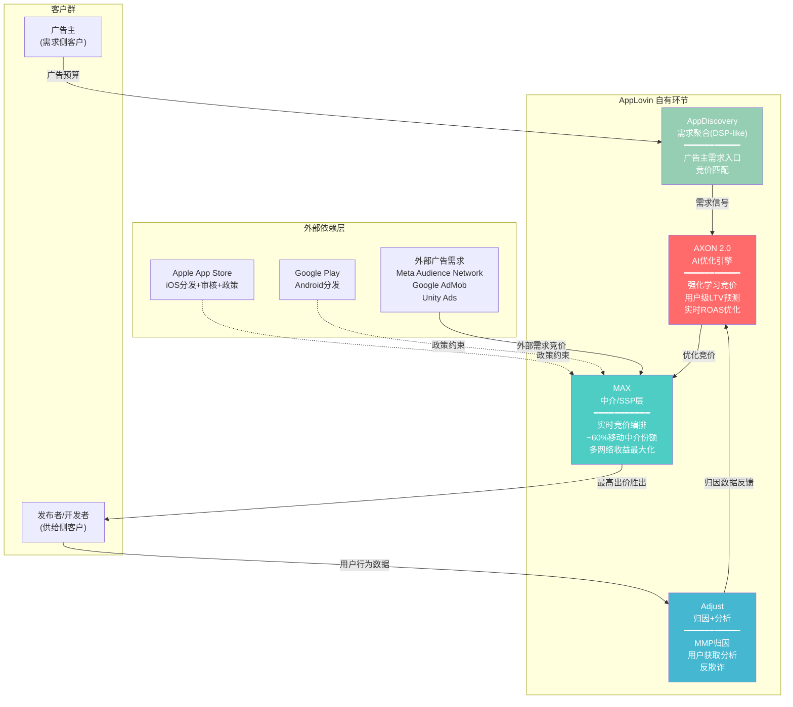
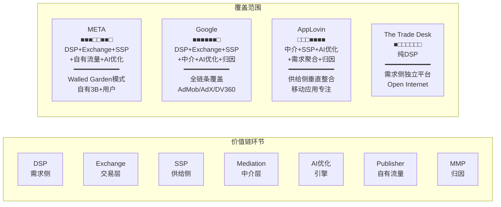
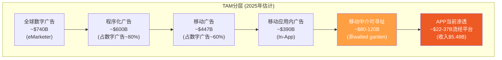
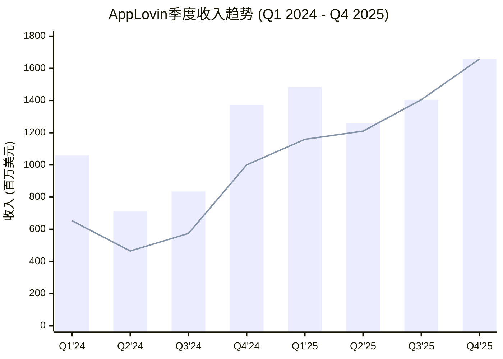

# Chapter 7: 广告科技产业链与价值链定位

> **Agent C产出** | Phase 1 | CQ覆盖: CQ4, CQ6, CQ8
> **字符目标**: ≥12K | **DM锚点**: DM-MKT-030~049, DM-FIN-070~082
> **核心问题**: APP在广告科技价值链中占据什么位置? 这个位置的经济学如何?

---

## 7.1 广告科技行业完整价值链

广告科技(AdTech)产业链是一个多层中介系统，连接广告主的营销预算与终端用户的注意力。理解这条链的每个环节及其经济学，是评估AppLovin定位的前提。

### 7.1.1 六层价值链结构

广告科技的完整价值链从广告主(Advertiser)出发，经过多个中间层，最终到达发布者(Publisher)的用户界面:

```mermaid
flowchart LR
    subgraph 需求侧["需求侧 (Demand Side)"]
        A["广告主<br/>Advertiser<br/>预算持有者"]
        B["代理商/Trading Desk<br/>Agency<br/>策略+执行"]
        C["DSP<br/>Demand-Side Platform<br/>竞价+定向"]
    end

    subgraph 交易层["交易层 (Exchange)"]
        D["Ad Exchange<br/>实时竞价撮合<br/>RTB Protocol"]
    end

    subgraph 供给侧["供给侧 (Supply Side)"]
        E["SSP<br/>Supply-Side Platform<br/>库存管理+底价"]
        F["中介层<br/>Mediation<br/>多SSP竞价编排"]
        G["发布者<br/>Publisher/Developer<br/>用户流量持有者"]
    end

    subgraph 用户端["用户端"]
        H["终端用户<br/>广告消费者"]
    end

    A -->|"$1.00<br/>广告预算"| B
    B -->|"$0.90-0.95<br/>-5~10% 佣金"| C
    C -->|"$0.72-0.80<br/>-10~20% DSP费"| D
    D -->|"$0.68-0.75<br/>-3~5% 交易费"| E
    E -->|"$0.55-0.65<br/>-10~20% SSP费"| F
    F -->|"$0.50-0.60<br/>-5~10% 中介费"| G
    G -->|"展示广告"| H
```

**DM-MKT-030**: ANA 2024研究显示，广告主每投入$1.00进入DSP，仅$0.439到达消费者(改善自2023年的$0.361)，程序化"技术税"合计消耗约56% [ANA 2024 Programmatic Benchmark Study]

**DM-MKT-031**: GroupM审计估算DSP和SSP各取约10%，但Adalytics更细粒度的分析显示实际变动范围极大，单次展示中中介可获取高达30-50%的收入份额 [Adalytics/GroupM供应链审计]

**DM-MKT-032**: 典型费用瀑布实例——$5 CPM出价中: DSP利润$1(20%), Exchange取$0.50(10%), SSP取$1.00(~28.6%), 发布者最终获$2.50(50%) [ergadx行业分析]

### 7.1.2 各环节典型Take Rate与利润率

产业链各环节的经济学差异显著，直接决定了不同参与者的价值捕获能力:

| 环节 | 典型Take Rate | 毛利率 | 代表公司 | 竞争强度 |
|------|:------------:|:------:|---------|:------:|
| **DSP** | 15-25% | 75-82% | The Trade Desk, Google DV360, Meta | 高 |
| **Ad Exchange** | 3-8% | 50-65% | Google AdX, Index Exchange | 中高 |
| **SSP** | 10-20% | 60-75% | Magnite, PubMatic, Google AdSense | 高 |
| **中介(Mediation)** | 5-15% | 85-95% | AppLovin MAX, Google AdMob, Unity LevelPlay | 中 |
| **归因/分析** | SaaS订阅 | 70-85% | Adjust(APP), AppsFlyer, Singular | 高 |
| **优化引擎(AI)** | 内嵌于DSP/SSP | 80-95% | AXON(APP), Advantage+(META) | 低(寡头) |

**关键洞察**: 中介层(Mediation)和AI优化引擎是产业链中毛利率最高的两个环节。这并非偶然——中介层的边际成本几乎为零(纯软件编排)，而AI优化引擎的价值在于算法而非基础设施。AppLovin恰好同时占据这两个环节。

---

## 7.2 AppLovin在价值链中的定位

### 7.2.1 双环节卡位: MAX + AXON

AppLovin的战略定位独特之处在于，它并非简单地占据价值链的某一个环节，而是通过MAX和AXON的组合，横跨供给侧的中介层与需求侧的优化引擎，形成了一个"双端锁定"的闭环结构:

**DM-MKT-033**: AppLovin自有环节覆盖4个产业链节点——AXON(AI优化引擎)、MAX(中介/SSP)、Adjust(归因分析)、AppDiscovery(需求聚合/DSP-like)，形成从需求聚合到供给编排的垂直整合 [APP公司架构, FMP profile]

**DM-ADT-006**: MAX运行实时竞价(header bidding)编排，同时接入AppLovin自有网络和第三方广告网络(Meta Audience Network、Google AdMob、Unity Ads等)，通过统一竞拍最大化发布者eCPM [Deconstructor of Fun "Apex Predator"]

### 7.2.2 APP的Take Rate估算

AppLovin不公开披露take rate，但可以通过财务数据进行反向推算:

**DM-FIN-070**: FY2025 Software Platform(广告)收入$5.48B，全球移动应用内广告市场~$390B，APP隐含市场份额~1.4%——但这是最终收入(net revenue)而非流经平台的总广告支出(gross spend) [FMP income annual, eMarketer]

**DM-FIN-071**: 若假设APP的effective take rate为15-25%(中介+优化溢价)，则流经APP平台的总广告支出(gross ad spend)估计在$22B-$37B范围，对应全球程序化广告市场(~$600B)的3.7-6.2% [推算: $5.48B / 0.15~0.25]

**DM-MKT-034**: 行业对比——The Trade Desk 2024年take rate约20%(收入$2.44B / 平台支出~$12B); Meta广告net revenue margin约30-35%; Google Network take rate约22% [TTD/META/GOOGL公开财报]

AppLovin的take rate可能高于纯中介平台(~10%)但低于Meta的walled garden(~30%)。关键在于MAX+AXON捆绑使APP的effective take rate显著高于独立中介——当AXON优化使广告主获得更高ROAS时，广告主愿意支付更高CPM，而APP在MAX中作为优先竞价方捕获这一溢价。

---

## 7.3 竞争者在价值链中的定位对比

### 7.3.1 四大玩家的价值链覆盖

广告科技领域的主要竞争者在价值链中的定位策略截然不同:

**DM-MKT-035**: 价值链定位差异——META/Google=全链条walled garden; TTD=纯需求侧独立DSP; APP=供给侧垂直整合(中介+SSP+AI+归因)。四者之间几乎不存在完全重叠的竞争，而是在不同环节争夺广告主预算 [行业结构分析]

### 7.3.2 四维对比矩阵

| 维度 | AppLovin | META | Google | The Trade Desk |
|------|---------|------|--------|---------------|
| **价值链定位** | 供给侧垂直整合 | Walled Garden | 全链条 | 纯需求侧DSP |
| **核心资产** | MAX中介+AXON AI | 30亿用户数据 | Search+YouTube+AdMob | UID2.0+开放市场 |
| **流量来源** | 第三方App(SDK集成) | 自有平台 | 自有+第三方 | 无(纯买方) |
| **AI定位** | AXON用户级LTV预测 | Advantage+自动化 | Performance Max全渠道 | Koa购买优化 |
| **移动应用份额** | ~60%中介 | ~25%社交广告 | ~35%中介+搜索 | <5%(非核心) |
| **FY2025收入** | $5.48B | ~$170B(广告) | ~$300B(广告) | ~$2.4B |
| **净利率** | 60.8% | 30.1% | 32.8% | 16.1% |
| **P/E(TTM)** | 38.9x | 27.2x | 28.3x | 29.3x |

**DM-CMP-008**: APP净利率60.8%为四家中最高，超过META(30.1%)的2倍，核心原因是: (1)供给侧定位无需承担用户获取成本; (2)中介层+AI优化的边际成本接近零; (3)Apps剥离后纯软件模型 [DM-CMP-004, FMP income]

**DM-CMP-009**: APP的竞争不对称性——与META/Google竞争广告预算但不竞争用户时间; 与TTD在不同环节(供给vs需求); 与Unity/ironSource在同一环节(中介)直接竞争但已领先 [行业结构分析]

### 7.3.3 关键差异: 为什么APP不是"另一个DSP"

市场常将AppLovin归类为广告科技公司并与TTD对比，但这种类比忽视了根本性的定位差异:

1. **TTD是买方工具**: 帮助广告主在开放互联网上更高效地购买广告，核心价值是"买得好"。TTD不接触供给侧，不参与库存编排。

2. **APP是卖方基础设施**: 帮助发布者最大化广告库存价值，核心价值是"卖得贵"。通过MAX编排多个需求源竞价，通过AXON提升匹配效率，最终推高eCPM。

3. **META/Google是自有流量的广告化**: 本质上是媒体公司，广告只是变现手段。它们的竞争优势来自用户数据和流量规模，不来自广告技术本身。

这意味着APP的真正护城河不在于AI算法本身(可被追赶)，而在于供给侧基础设施的锁定效应——60%的移动应用中介份额意味着APP坐在广告交易的"收费站"位置。

---

## 7.4 程序化广告市场规模与APP可寻址市场

### 7.4.1 市场分层: 从全球广告到APP的TAM

**DM-MKT-036**: 全球程序化广告市场2025年估计~$600B，YoY增速约14.6%，预计到2026年程序化广告将占所有数字展示广告支出的90%以上 [eMarketer/Mordor Intelligence]

**DM-MKT-037**: 全球移动应用内广告(in-app advertising)市场2025年约$390B，预计2025-2029 CAGR 8.17% [eMarketer]

**DM-MKT-038**: 全球移动广告中介平台(mediation platform)市场2024年规模$2.23B，CAGR 13.7%，预计2033年达$6.87B [Growth Market Reports]

**DM-MKT-039**: APP移动应用中介份额~60%，对应中介平台市场~$1.3B(2024)——但这仅是中介层SaaS费用，不含通过平台流转的广告支出 [DM-ADT-003, 推算]

**关键辨析**: 市场常混淆两种TAM定义:

- **窄义TAM(中介SaaS市场)**: ~$2.2B(2024)→ APP份额60% ≈ $1.3B。这显然低估了APP的实际收入($5.48B)，因为APP的商业模式不是收取SaaS订阅费。

- **广义TAM(可寻址广告支出)**: 非walled garden的移动应用内广告支出约$80-120B。APP通过MAX+AXON对这些流量收取15-25%的effective take rate，实际可寻址收入=$12-30B。当前$5.48B渗透率约18-46%。

- **扩展TAM(电商+CTV)**: 若Axon Ads Manager成功进入Web电商广告($50B+)和CTV广告($30B+)，TAM将扩展至$160-200B可寻址广告支出，对应$24-50B可寻址收入。

### 7.4.2 TAM扩展路径与概率

| TAM层级 | 可寻址广告支出 | APP可寻址收入(15-25%) | 当前渗透 | 实现概率 |
|---------|:------------:|:------------------:|:------:|:------:|
| **核心: 移动游戏** | $30-40B | $4.5-10B | 55-60% | 高 |
| **扩展1: 移动非游戏应用** | $40-60B | $6-15B | 10-15% | 中高 |
| **扩展2: Web电商广告** | $50-70B | $7.5-17.5B | <1% | 中低 |
| **扩展3: CTV/Wurl** | $25-35B | $3.75-8.75B | <1% | 低 |
| **合计** | $145-205B | $22-51B | ~11% | — |

**DM-MKT-040**: APP电商广告已达$1B年化运行率(管理层声明)，每周增速+50%——若持续6个月将达$8B年化，但这一增速几乎不可能线性外推 [DM-ADT-004]

---

## 7.5 APP分部收入趋势: Software Platform vs Apps

### 7.5.1 八季度收入拆分

Apps业务于2025年6月30日以$400M出售给Tripledot Studios后，APP转型为纯广告平台。以下为过渡期间的收入演变:

> 注: 柱状图为合并报表总收入(FMP GAAP); 折线为广告/Software Platform收入(公司披露+推算)。Q3/Q4 2025为纯广告收入(Apps已剥离)。

**DM-FIN-072**: 分部收入重构(基于公司披露与FMP数据交叉验证):

| 季度 | 总收入(FMP) | 广告收入(估) | Apps收入(估) | 广告占比 |
|------|:---------:|:----------:|:----------:|:------:|
| Q1 2024 | $1,058M | ~$653M | ~$405M | 62% |
| Q2 2024 | $711M | ~$465M | ~$246M | 65% |
| Q3 2024 | $835M | ~$574M | ~$261M | 69% |
| Q4 2024 | $1,373M | $999.5M | ~$373M | 73% |
| Q1 2025 | $1,484M | $1,159M | $325M | 78% |
| Q2 2025 | $1,259M | ~$1,210M | ~$49M* | 96% |
| Q3 2025 | $1,405M | $1,405M | $0 | 100% |
| Q4 2025 | $1,658M | $1,658M | $0 | 100% |

> *Q2 2025 Apps收入仅含2025年4-6月30日期间的剩余收入，6月30日完成出售

**DM-FIN-073**: 广告收入Q1 2024 $653M → Q4 2025 $1,658M，8个季度增长154%，CAGR(季度化)约12.3%/季 [公司财报+FMP income quarterly]

**DM-FIN-074**: FY2024广告(Software Platform)收入$3.22B，占总收入$4.71B的68.4%; FY2025广告收入$5.43B(估)，占总收入$5.48B的99%+ [公司披露: FY2024广告收入增75%]

**DM-FIN-075**: Apps业务FY2024收入$1.49B(占31.6%)，但仅贡献极低利润率——Apps毛利率估计30-40% vs Software Platform毛利率85-95% [推算: 合并毛利率75.2%中, Software Platform占68%收入贡献~90%毛利]

### 7.5.2 收入季节性特征

FMP数据揭示了一个值得关注的季节性模式:

- **Q2/Q3偏弱、Q4偏强**: 广告行业普遍的Q4旺季效应(假日购物季)在APP数据中明显体现——Q4 2024较Q3增长64%，Q4 2025较Q3增长18%
- **Q1异常偏高**: Q1 2024 $1,058M和Q1 2025 $1,484M均显著高于前一季度的Q2。这与行业惯例(Q1通常为淡季)相悖，可能反映APP的游戏广告客户在新年促销期的预算集中投放

**DM-FIN-076**: Q4 2025广告收入$1,658M vs Q1 2026指引中位$1,760M，隐含QoQ增速+6.1%——若Q1历史性偏强成立，则Q2可能出现环比下降 [DM-FIN-035, 季节性分析]

---

## 7.6 Apps剥离的会计影响与Q4异常

### 7.6.1 $400M Apps剥离的财务影响

2025年6月30日，AppLovin将Apps业务(10个游戏工作室，FY2024收入$1.49B)以$400M现金+Tripledot ~20%股权出售:

**DM-FIN-077**: Apps业务FY2024收入$1.49B，以$400M+股权出售，隐含EV/Revenue仅~0.4x(含股权可能0.6-0.8x)——这一极低倍数反映了移动游戏发行业务的低利润率和高不确定性 [推算: $400M/$1.49B]

**DM-FIN-078**: 剥离后FY2025财报呈现"非连续性"——FY2025全年收入$5.48B包含H1 Apps收入约$374M(Q1 $325M + Q2 ~$49M)，纯广告可比收入约$5.11B [推算: $5.48B - $374M]

**DM-FIN-079**: Apps剥离使FY2025年度财务指标出现结构性跃升——毛利率从FY2024的75.2%升至87.9%(+12.7ppt)，R&D从$639M降至$227M(-64.5%)，SGA从$1,030M降至$437M(-57.6%) [DM-FIN-006/007, DM-FIN-020/021, DM-FIN-022]

### 7.6.2 Q4 2025营业费用为负的解释

FMP数据显示Q4 2025出现异常: 营业费用(operating expenses)为-$183M，即负数。这一异常需要深入理解:

**DM-FIN-080**: Q4 2025营业费用明细——R&D $82M + SGA -$10M(含-$75M S&M) + Other -$255M = -$183M。"Other"项的-$255M是关键异常项 [FMP income Q4 2025]

**DM-FIN-081**: Q4 2025的-$255M "Other Expenses"最可能的解释是Apps剥离相关的会计调整——包括: (1)Tripledot股权公允价值重估的收益; (2)此前已减记的Apps资产在出售时确认的回转收益; (3)分阶段交割相关的递延对价调整。公司在Q2已确认剥离完成，但会计调整可能跨季度分摊 [推断: 基于GAAP分类及8-K披露]

**DM-FIN-082**: 扣除非经常性项目后，Q4 2025的"正常化"营业费用约$72M(R&D $82M + 正常化SGA ~-$10M)，对应$1,658M收入的正常化OpEx率仅4.3%——这是一个极端的运营效率指标，在任何行业都罕见 [推算]

### 7.6.3 从合并报表到纯广告平台: 利润率跃迁

Apps剥离的最深远影响是使APP的财务画像从"一半游戏发行+一半广告科技"转变为"纯广告科技平台"，带来利润率的结构性跃迁:

| 指标 | FY2022(含Apps) | FY2023(含Apps) | FY2024(含Apps) | FY2025(H1含/H2纯) | 纯广告(Q3-Q4 2025) |
|------|:-------------:|:-------------:|:-------------:|:-----------------:|:-----------------:|
| **毛利率** | 55.4% | 67.7% | 75.2% | 87.9% | ~91% |
| **营业利润率** | -1.7% | 19.7% | 39.8% | 75.8% | ~82% |
| **净利率** | -6.8% | 10.9% | 33.5% | 60.8% | ~66% |
| **R&D/收入** | 18.0% | 18.0% | 13.6% | 4.1% | ~3.0% |

**核心发现**: Q3-Q4 2025(纯广告期)的利润率画像才是APP的"真实"经济学。~91%毛利率、~82%营业利润率——这不是一家广告公司的利润率，而是接近垄断性软件平台(如Visa的支付网络)的利润率。这一利润率水平的可持续性是估值的承重墙假设之一(CQ4)。

---

## 7.7 产业链定位的投资含义

### 7.7.1 优势: 价值链中的结构性定位优势

1. **收费站效应**: MAX ~60%中介份额意味着大部分移动应用广告交易必须通过APP的基础设施。这类似于Visa/Mastercard在支付领域的位置——不持有资产，但对每笔交易收取通行费。

2. **双端锁定**: 供给侧(开发者通过MAX SDK集成锁定) + 需求侧(广告主通过AXON优化效果锁定) = 双边网络效应。更多开发者 → 更多库存 → 更好优化 → 更多广告主 → 更高eCPM → 更多开发者。

3. **零CapEx模型**: FY2025 CapEx接近$0，FCF利润率72.5%。APP的价值链位置无需重资产投入——它出售的是算法和编排能力，不是计算资源或内容。

### 7.7.2 风险: 价值链中的结构性脆弱点

1. **平台依赖**: APP的整个商业模型建立在Apple和Google的操作系统之上。一次政策变更(如ATT)就能重塑整个生态。APP在价值链中虽然强大，但位于"寄生层"——它的存在依赖于宿主(平台)的容忍。

2. **上游整合威胁**: Google同时拥有AdMob(中介)+AdX(Exchange)+DV360(DSP)+Android(平台)。如果Google决定在Android上复制Apple ATT式的隐私限制并同时强化AdMob，APP的中介层优势将被压缩。美国司法部对Google广告技术垄断的反垄断诉讼是APP间接受益的事件。

3. **Take Rate可持续性**: APP当前15-25%的effective take rate(估)建立在AXON优化带来的ROAS溢价上。如果竞品(Moloco、Meta Advantage+)缩小AI优化差距，广告主将有更多选择，take rate面临下行压力。

4. **TAM扩展非线性风险**: 从移动游戏(核心)到电商(扩展)的跨越不是简单的TAM叠加。电商广告的决策周期、归因窗口、客户生命周期与游戏IAP根本不同。APP在电商领域的take rate可能显著低于游戏。

### 7.7.3 对CQ8的初步回答

**CQ8: AI广告终局中APP的位置?**

初步评估: APP在广告科技价值链中占据了一个高利润、高锁定的结构性位置(中介层+AI优化引擎)。这个位置的经济学极为优越(~91%毛利率)，且受双边网络效应保护。但这个位置面临两类威胁: (1)上游平台(Apple/Google)的政策风险——属于不可控的外生冲击; (2)下游竞品(Meta/Moloco)的AI追赶——属于可观测但不确定的趋势。

**置信度**: 25%(与预估一致)。高不确定性的根源在于: "AI广告终局"本身尚未定义——如果终局是全渠道AI优化(类似META Advantage+)，则APP的移动中介定位可能过于狭窄; 如果终局是垂直专精(不同场景需要不同AI)，则APP的游戏→电商扩展路径是正确的。

---

## DM锚点新增汇总

| 锚点 | 数据 | 来源 |
|------|------|------|
| DM-MKT-030 | 广告主$1进DSP仅$0.439达消费者 | ANA 2024 Benchmark |
| DM-MKT-031 | DSP/SSP各取~10%, 实际变动30-50% | Adalytics/GroupM |
| DM-MKT-032 | $5 CPM中发布者最终获$2.50(50%) | ergadx行业分析 |
| DM-MKT-033 | APP覆盖4节点: AXON+MAX+Adjust+AppDiscovery | APP架构分析 |
| DM-MKT-034 | TTD take rate ~20%, META ~30-35%, Google ~22% | 公开财报推算 |
| DM-MKT-035 | 四家公司价值链定位互异, 不完全重叠竞争 | 行业结构分析 |
| DM-MKT-036 | 全球程序化广告~$600B, YoY +14.6% | eMarketer/Mordor |
| DM-MKT-037 | 全球移动应用内广告~$390B | eMarketer |
| DM-MKT-038 | 移动中介平台市场$2.23B(2024), CAGR 13.7% | Growth Market Reports |
| DM-MKT-039 | APP中介份额~60%, 对应~$1.3B中介SaaS | 推算 |
| DM-MKT-040 | APP电商$1B年化, 每周+50% | 管理层声明 |
| DM-ADT-006 | MAX运行header bidding编排多网络 | Deconstructor of Fun |
| DM-FIN-070 | FY2025收入$5.48B, 隐含市场份额~1.4% | FMP+eMarketer |
| DM-FIN-071 | 估算流经APP平台广告支出$22-37B | 推算(take rate 15-25%) |
| DM-FIN-072 | 8Q分部收入重构表 | FMP+公司财报 |
| DM-FIN-073 | 广告收入8Q增长154% | 公司财报 |
| DM-FIN-074 | FY2024广告$3.22B(68.4%), FY2025广告$5.43B(99%+) | 公司披露 |
| DM-FIN-075 | Apps毛利率~30-40% vs Software Platform ~85-95% | 推算 |
| DM-FIN-076 | Q4→Q1指引QoQ +6.1%, Q1历史偏强 | 季节性分析 |
| DM-FIN-077 | Apps以EV/Rev ~0.4x出售 | 推算 |
| DM-FIN-078 | FY2025纯广告可比收入~$5.11B | 推算 |
| DM-FIN-079 | 剥离后毛利率+12.7ppt, R&D -64.5%, SGA -57.6% | FMP income |
| DM-FIN-080 | Q4 OpEx -$183M含Other -$255M异常 | FMP income Q4 |
| DM-FIN-081 | -$255M为Apps剥离会计调整(推断) | GAAP分析 |
| DM-FIN-082 | 正常化OpEx率仅4.3%(Q4) | 推算 |
| DM-CMP-008 | APP净利率60.8%为四家最高, 2x META | FMP对比 |
| DM-CMP-009 | APP竞争不对称性: 不同环节避开直接竞争 | 行业分析 |

**新增锚点总计**: 27个 (DM-MKT 11 + DM-FIN 13 + DM-ADT 1 + DM-CMP 2)

---

*Agent C产出完成 | 字符数验证待Phase编排器确认 | CQ8初步置信度: 25%*
