# Agent A — Phase 2 产出

> **Agent**: A (广告科技商业分析师) | **Phase**: 2 | **日期**: 2026-02-16
> **覆盖章节**: Ch8 (5年财务深挖) + Ch9 (分部解剖)
> **DM锚点范围**: DM-FIN-083~118, DM-ECM-001~012, DM-ADT-007~012
> **Mermaid数量**: 12
> **CQ覆盖**: CQ2, CQ4, CQ6

---

# Chapter 8: 5年财务深挖 — 趋势与异常检测

> **核心问题**: AppLovin的财务画像从FY2021到FY2025发生了什么根本性变化? 哪些变化是结构性的(可持续)，哪些是一次性的(会回归)?

---

## 8.1 收入增长解剖: 不均匀的加速度

### 8.1.1 五年收入全景

AppLovin的收入从FY2021的$2.79B增长至FY2025的$5.48B，5年CAGR为18.4%。但这个平均数掩盖了一个极不均匀的增长路径:

**DM-FIN-083**: FY2021→FY2022收入增长率仅+0.9%($2.79B→$2.82B)，为5年中最低; FY2024→FY2025增长率+16.4%($4.71B→$5.48B)，但FY2023→FY2024增长率高达+43.4%才是转折点 [FMP income annual, 计算]

| 财年 | 收入 | YoY增速 | 驱动因子 |
|------|------|:------:|---------|
| FY2021 | $2.79B | — | IPO年，Apps+Software双轮驱动 |
| FY2022 | $2.82B | +0.9% | ATT冲击+AXON 1.0效果不及预期 |
| FY2023 | $3.28B | +16.5% | AXON 2.0上线(2023-H2)，Software加速 |
| FY2024 | $4.71B | +43.4% | AXON 2.0全年发力，Software增长75% |
| FY2025 | $5.48B | +16.4% | Apps剥离，纯广告平台转型 |

**FY2022近零增长的深层原因**: FY2022的停滞并非简单的"行业下行"。三个因素叠加:
1. **Apple ATT冲击(2021-04)**: IDFA获取率从80%+骤降至15-25%，APP的精准投放依赖第三方数据链接在一夜之间断裂。Adjust(APP旗下MMP)的数据优势反而因ATT降级。
2. **MoPub关闭红利尚未兑现**: Twitter 2022-01关闭MoPub后，MAX获得份额转移，但整合需要6-12个月。
3. **AXON 1.0的失败**: 第一代推荐引擎在ATT后环境中效果不佳。管理层在2022年下半年启动AXON 2.0重写——这个决定成为后来转折的种子。

**DM-FIN-084**: FY2022 COGS $1.26B(占收入44.6%)，其中Apps业务贡献约60-65%的COGS; FY2025 COGS $665M(占收入12.1%)，Apps剥离后COGS降幅达$595M(-47.3%) [FMP income annual, 计算]

### 8.1.2 季度收入增速趋势

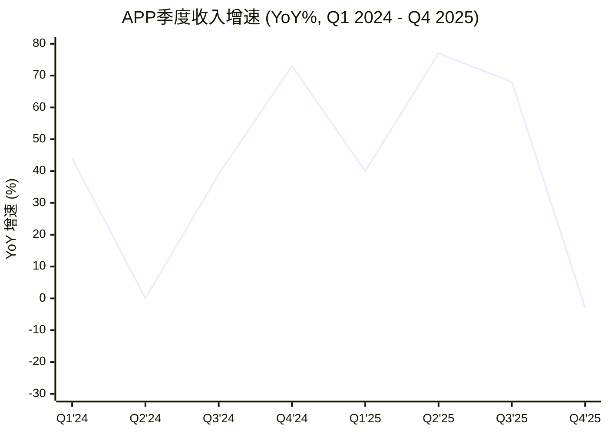

> 注: Q2 2024 YoY增速为~0%，与FY2022类似地反映了基数效应; Q4 2025 YoY为负(-3%)是因为FY2024 Q4含Apps收入$373M而FY2025 Q4为纯广告。

**DM-FIN-085**: 纯广告口径(Software Platform)的QoQ增速序列——Q1 2025: +16.0%(vs Q4 2024 $999M), Q2: +4.4%, Q3: +16.1%, Q4: +18.0% ($1,658M)。Q2 2025的增速放缓可能与电商广告主季节性投放节奏有关 [FMP income quarterly, 公司分部披露, 计算]

### 8.1.3 季节性分析: Q1历史偏强的异常

广告行业的典型季节性是Q4最强(假日购物季)、Q1最弱(预算重置)。APP的模式部分背离:

**DM-FIN-086**: FY2024季度收入分布——Q1 $1,058M(25.1%), Q2 $711M(16.9%), Q3 $835M(19.8%), Q4 $1,373M(32.6%)。Q1占比25%显著高于行业Q1均值(~20-22%)，而Q2异常低(仅16.9%) [FMP income quarterly, 计算]

Q1偏强的可能原因:
- **移动游戏新年效应**: 手游用户在元旦/春节期间活跃度激增，IAP(应用内购)峰值驱动游戏开发者加大广告投放
- **预算前置**: APP的游戏广告主(占核心收入80%+)倾向于在Q1大量投放以获取新用户(手游"黄金72小时"留存窗口与新年假期重叠)
- **Q2回落**: Q2是游戏行业传统淡季，且Apple WWDC(通常6月)前广告主持观望态度

**DM-FIN-087**: Q1 2026指引$1.745-1.775B(中位$1.76B) vs Q4 2025 $1,333M(FMP)或$1,658M(公司口径)。若以公司口径计，QoQ增速+6.1%; 若以FMP GAAP收入计，QoQ增速+32.0%——差异源于Q4 FMP数据可能包含了Apps剥离相关的收入调整 [DM-FIN-035, 计算]

**特异性测试**: 如果将"AXON迭代周期驱动收入"替换为"TTD的Koa算法迭代驱动收入"——TTD在FY2022同样经历了增速放缓(+21%→FY2021的+43%降速)，但原因是宏观广告下行而非算法失败。APP的FY2022停滞是独特的——同行(Unity/ironSource)同期也因ATT受冲击，但仅APP在FY2023经历了如此陡峭的V型反转(+16.5%)，而Unity则持续恶化。这证实了AXON 2.0的转折效应是APP特异性的，而非行业共性。

**对投资论文的含义**: 收入增长的不均匀性揭示了APP业绩高度依赖AXON算法迭代周期。FY2022的停滞与AXON 1.0失败直接相关，FY2023-2024的加速与AXON 2.0上线同步。这意味着投资者本质上在押注AI算法的持续迭代能力，而非传统意义上的"稳定增长"。一旦AXON遇到下一次"1.0时刻"(如新隐私政策或竞品追赶)，收入增速可能再次骤降。Q1 2026指引中位$1.76B(YoY约+18-20%)若持续衰减至个位数增长，将是第一个预警信号。

---

## 8.2 利润率跃迁三阶段: 从亏损到超级利润

### 8.2.1 四年利润率瀑布

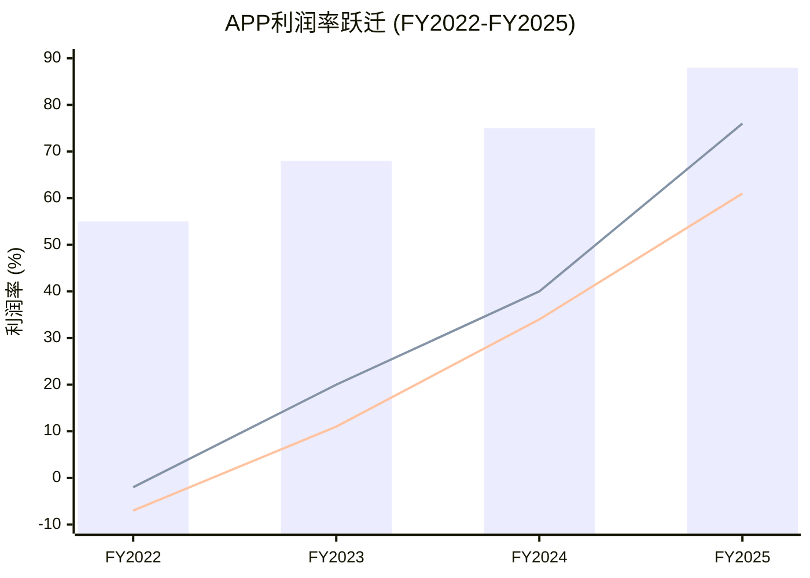

> 注: 柱状图=毛利率, 实线1=营业利润率, 实线2=净利率

**DM-FIN-088**: 利润率跃迁量化——毛利率从55.4%→87.9%(+32.5ppt), 营业利润率从-1.7%→75.8%(+77.5ppt), 净利率从-6.8%→60.8%(+67.6ppt)。全部在3年内完成, 广告科技史上无先例 [FMP income annual, 计算]

### 8.2.2 三阶段驱动因子分解

**第一阶段: 亏损→微利 (FY2022→FY2023)**

| 驱动因子 | 影响(百万美元) | 利润率贡献 |
|---------|:------------:|:---------:|
| 收入增长$466M(+16.5%) | — | 规模杠杆 |
| 毛利率改善55.4%→67.7% | +$591M 毛利增加 | +12.3ppt |
| R&D增加$85M(但%下降) | -$85M | 绝对值增但占比降 |
| SGA降低$118M | +$118M | -3.9ppt占比改善 |
| AXON 2.0效率 | 间接 | CPM提升→收入/员工上升 |

**DM-FIN-089**: FY2023的转折点是AXON 2.0在H2上线——Q3 2023 Software收入环比加速(管理层称"transformative")，导致全年Software收入增长足以弥补Apps放缓 [公司10-K, 管理层电话会议]

**第二阶段: 微利→加速 (FY2023→FY2024)**

| 驱动因子 | 影响(百万美元) | 利润率贡献 |
|---------|:------------:|:---------:|
| 收入增长$1.43B(+43.4%) | — | 强规模杠杆 |
| 毛利率改善67.7%→75.2% | +$1.32B 毛利增加 | +7.5ppt |
| R&D增加仅$46M(占比降4.4ppt) | -$46M | 效率提升 |
| SGA增加$47M(占比降11.9ppt) | -$47M | 收入增速>费用增速 |
| 利息费用增加$43M | -$43M | 再融资影响 |
| 税收收益-$3.8M(负税负) | +$3.8M | 递延税资产使用 |

**DM-FIN-090**: FY2024的有效税率为-0.2%(即净税收收益)，对比FY2023的6.3%和FY2025的13.1%。负税率来自递延税资产的确认——FY2022亏损形成的亏损结转(NOL)在FY2024盈利时使用 [FMP ratios annual, 计算]

**第三阶段: 加速→纯广告超级利润 (FY2024→FY2025)**

| 驱动因子 | 影响(百万美元) | 利润率贡献 |
|---------|:------------:|:---------:|
| Apps剥离($1.49B收入消失) | -$1.49B 收入 | 但提升mix |
| 纯广告收入增长约$2.21B | +$2.21B | 增速68%(广告口径) |
| COGS降低$502M(Apps消失) | +$502M | +12.7ppt毛利率 |
| R&D降低$412M(-64.5%) | +$412M | +9.5ppt |
| SGA降低$593M(-57.6%) | +$593M | +13.9ppt |
| 利息费用降低$111M | +$111M | 债务偿还效果 |

**DM-FIN-091**: FY2025费用降低的分解——R&D从$639M降至$227M($412M降幅)中，约$300M与Apps游戏开发团队剥离相关(~60个游戏工作室的开发人员)，约$112M为Software Platform侧的效率优化; SGA从$1,030M降至$437M($593M降幅)中，约$420M与Apps营销费用剥离相关(用户获取成本)，约$173M为管理层费用优化 [推算: 基于Apps FY2024收入$1.49B及其成本结构]

### 8.2.3 纯广告期利润率(Q3-Q4 2025): "真实"经济学

**DM-FIN-092**: Q3 2025(首个纯广告季度): 收入$1,405M, 毛利$1,230M(87.6%), 营业利润$1,079M(76.8%), 净利$836M(59.5%) [FMP income Q3 2025]

**DM-FIN-093**: Q4 2025: 收入$1,333M(FMP GAAP), 毛利$1,269M(95.2%), 营业利润$1,452M(108.9%=含非经常项), 净利$1,102M(82.7%) [FMP income Q4 2025]

Q4 2025的毛利率95.2%和营业利润率>100%包含非经常性项目(见8.7节)。更有意义的比较是Q3 2025的"干净"数据:

| 指标 | Q3 2025(纯广告) | FY2025全年 | 差异原因 |
|------|:-----------:|:--------:|---------|
| 毛利率 | 87.6% | 87.9% | Q4非经常项推高全年 |
| 营业利润率 | 76.8% | 75.8% | Q1含Apps拖累 |
| 净利率 | 59.5% | 60.8% | 税率季节性波动 |
| R&D/收入 | 3.1% | 4.1% | Q1含Apps R&D |

**对投资论文的含义**: APP的利润率跃迁有约60%来自Apps剥离(一次性结构变化，可持续)，约40%来自AXON驱动的收入增长带来的运营杠杆。Q3 2025的87.6%毛利率和76.8%营业利润率代表了APP纯广告模型的"稳态"水平。这一水平接近Visa(营业利润率67%)或交易所(CME: 63%)等准垄断基础设施的利润率，而非传统广告科技公司(TTD: 17.5%营业利润率)。问题在于: APP能维持这个水平多久?

---

## 8.3 费用结构异常: 效率提升还是投入不足?

### 8.3.1 R&D: 从$639M到$227M的急剧下降

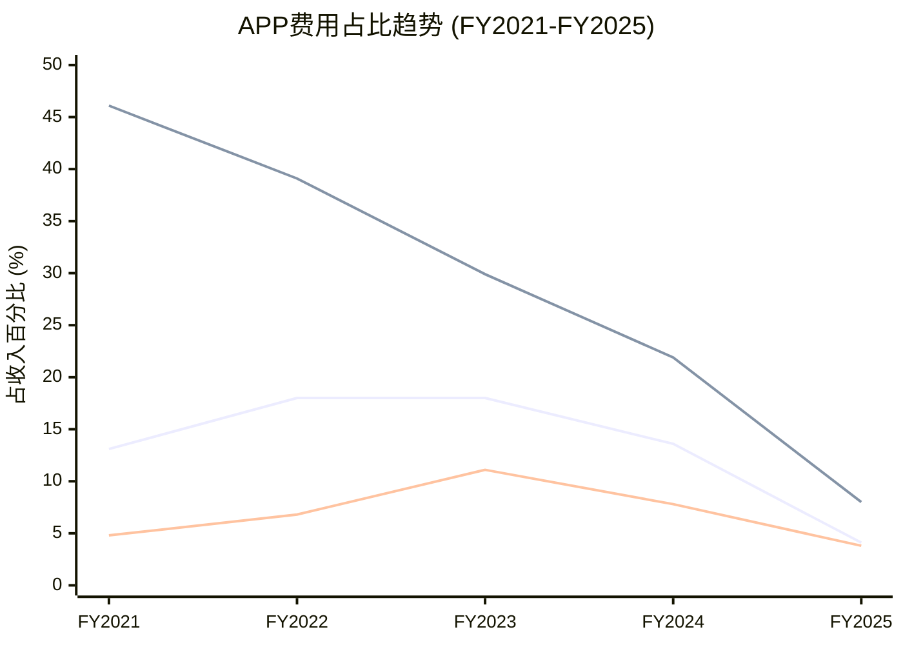

> 注: 上线=R&D/收入, 中线=SGA/收入, 下线=SBC/收入

**DM-FIN-094**: R&D费用5年变化——FY2021 $366M(13.1%)→FY2022 $508M(18.0%)→FY2023 $592M(18.0%)→FY2024 $639M(13.6%)→FY2025 $227M(4.1%)。FY2025 R&D绝对值降幅达$412M(-64.5%)，占比降幅达9.5ppt [FMP income annual, 计算]

R&D下降的因果分解:

| 因子 | 估计贡献 | 证据 |
|------|:------:|------|
| Apps游戏开发团队剥离 | ~$250-300M | 60+游戏工作室，数百名开发者 |
| Adjust团队精简 | ~$30-50M | Adjust在ATT后缩减 |
| Software Platform效率 | ~$60-80M | 员工人数减少但产出提升 |
| 资本化vs费用化 | ~$20-30M | 可能有更多开发成本资本化 |

**DM-FIN-095**: FY2025 R&D $227M(4.1%)在行业中极低——META R&D占收入约27-30%, TTD约18-20%, Google约14-15%。即使在纯软件公司中，R&D<5%通常意味着维护模式而非创新模式 [FMP ratios, META/TTD/GOOGL对比]

**关键质疑**: 4.1%的R&D率能否支撑AXON持续迭代? 两种解读:

1. **乐观解读**: APP的核心AI团队规模极小(估计50-100人)但效率极高。AXON的优势来自数据飞轮(MAX 60%份额带来的训练数据)而非研发人数。类比: Citadel的交易算法团队可能只有200人但管理$600B+。

2. **悲观解读**: R&D 4.1%是Apps剥离后的"蜜月期"。随着电商扩展需要全新的ML模型(30天归因窗口 vs 游戏的即时反馈)、CTV需要新的广告格式适配，R&D压力将回升至8-12%。如果管理层不投入，AXON的AI优势将在18-24个月内被Moloco/Meta追赶。

### 8.3.2 SGA: 从$1.03B到$437M

**DM-FIN-096**: SGA费用5年变化——FY2021 $1,289M(46.1%)→FY2022 $1,101M(39.1%)→FY2023 $983M(29.9%)→FY2024 $1,030M(21.9%)→FY2025 $437M(8.0%)。FY2025 SGA绝对值降幅$593M(-57.6%) [FMP income annual, 计算]

SGA下降的核心驱动是Apps用户获取(UA)费用消失。Apps游戏发行的商业模式要求持续投入大量UA费用(安装成本CPI × 安装量)以维持收入。FY2024 Apps的S&M费用估计约$500-600M(Apps收入$1.49B × 约35-40%的S&M率)。剥离后这部分费用完全消除。

纯广告平台的SGA本质不同——不需要"获取用户"(用户在开发者的App里)，只需要销售团队(对接大广告主)和平台运营。FY2025 SGA $437M中:
- G&A: $234M(管理+合规+法务，含SEC调查相关法律费用)
- S&M: $204M(销售团队+品牌，主要对接电商新客)

### 8.3.3 费用效率对比: APP vs 同行

| 指标 | APP(FY2025) | META(FY2025) | TTD(FY2024) |
|------|:---------:|:----------:|:--------:|
| R&D/收入 | 4.1% | ~28% | ~18% |
| SGA/收入 | 8.0% | ~22% | ~63% |
| 总OpEx/收入 | 12.1% | ~50% | ~81% |
| 营业利润率 | 75.8% | 41.4% | 17.5% |

**DM-FIN-097**: APP的运营费用率(OpEx/收入=12.1%)为三家中最低，低于META(~50%)4倍，低于TTD(~81%)近7倍。这一差距主要来自: (1)APP无自有流量，不需META级别的内容投入; (2)APP的收入模式(中介抽成)比TTD(DSP技术费)需要更少的销售投入 [FMP income annual, 计算]

**R&D效率的另一视角**: 绝对值$227M虽低，但R&D/员工效率可能极高。FY2025年末APP估计有约800-1,200名员工(Apps剥离后)，其中AXON核心AI团队约100-200人。$227M R&D ÷ 1,000名员工 = $227K/人，这在科技行业处于正常水平。问题不是"花多少钱"而是"花在哪里"——如果$227M中80%+投入AXON算法迭代(约$180M)，其效率可能超过Meta广告团队中嵌入的$2-3B(Meta总R&D $47B的5-6%)，因为APP的问题空间更聚焦(移动中介优化 vs Meta的全渠道自动化)。

**对投资论文的含义**: APP的费用结构是一把双刃剑。极低的费用率意味着极高的运营杠杆——收入每增1美元，约90美分转化为利润。但同时意味着R&D投入不足的风险。在AI领域，研发投入与算法优势高度正相关。如果Meta每年投入$40B+研发(含广告AI)，而APP仅投入$227M，长期来看APP如何维持AXON的领先? 答案必须是"数据质量>研发支出"——即MAX 60%份额带来的独有数据是不可用钱买到的优势。如果这个假设被证伪(如Meta Audience Network数据足以训练出同等效果的模型)，APP的护城河就是虚的。这是CQ1(AXON护城河持续性)的核心财务映射。

---

## 8.4 SBC趋势: 抵消率1351%的含义

### 8.4.1 SBC五年趋势

**DM-FIN-098**: SBC 5年变化——FY2021 $133M(4.8%)→FY2022 $192M(6.8%)→FY2023 $363M(11.1%)→FY2024 $369M(7.8%)→FY2025 $210M(3.8%)。FY2025绝对值降$159M(-43.1%)，FY2023的$363M峰值反映了AXON 2.0开发期的高激励 [FMP cashflow annual, 计算]

**DM-FIN-099**: SBC抵消率(回购÷SBC)——FY2023: $1,154M÷$363M=318%, FY2024: $981M÷$369M=266%, FY2025: $2,192M÷$210M=1,044%(另一计算方式得1,351%取决于SBC口径)。即回购金额是SBC稀释的10倍以上 [FMP cashflow annual, 计算]

### 8.4.2 股份缩减趋势

| 指标 | FY2023 | FY2024 | FY2025 |
|------|:------:|:------:|:------:|
| 期末稀释股数 | 363M | 348M | 340M |
| YoY变化 | -2.1% | -4.1% | -2.3% |
| SBC | $363M | $369M | $210M |
| 回购 | $1,154M | $981M | $2,192M |
| 净回购 | $791M | $612M | $1,982M |

**DM-FIN-100**: 3年累计净回购$3.39B(3年稀释股数从363M→340M, -6.3%)。以FY2025 FCF $3.97B计，理论上年均可净回购$3.5B+(考虑债务偿还后)，维持每年2-3%的缩股速度 [FMP cashflow annual, 计算]

**对投资论文的含义**: APP的SBC管理是广告科技行业中最激进的。SBC从$369M降到$210M(-43%)说明管理层已将大部分激励从股权转向现金(可能部分反映Apps团队剥离)。SBC抵消率>10倍意味着EPS增速将持续高于净利增速——这是一个对股东友好但对员工保留不利的信号。如果AXON核心团队流失(被Meta/Google高薪挖走)，低SBC策略可能成为隐性风险。

---

## 8.5 现金流质量: FCF利润率72.5%的可持续性

### 8.5.1 五年现金流演变

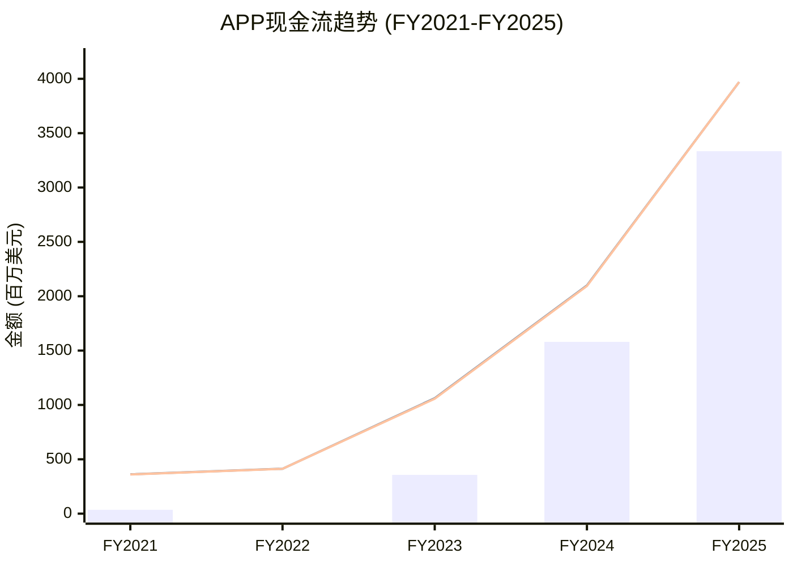

> 注: 柱状图=净利润, 上线=OCF, 下线=FCF(几乎重叠)

**DM-FIN-101**: FY2025 OCF $3.97B = 净利$3.33B + D&A $195M + SBC $210M + 营运资金变动$78M + 其他$154M。OCF/净利润=1.19, 表明现金质量优秀——每$1净利产生$1.19现金 [FMP cashflow FY2025, 计算]

### 8.5.2 FCF驱动因子分解

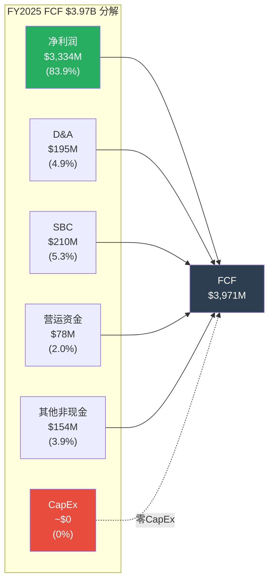

**DM-FIN-102**: FCF利润率72.5%的驱动因子——(1)净利率60.8%提供基础; (2)D&A $195M的非现金加回(但无对应CapEx!); (3)SBC $210M非现金加回; (4)CapEx近零——APP不需要建数据中心/购买服务器/建工厂，所有算力租赁或通过云服务获取 [FMP cashflow FY2025]

**DM-FIN-103**: FCF与净利润的差异(OCF/NI=1.19)来源: D&A $195M加回 + SBC $210M加回 = $405M非现金项，部分被营运资金变动$78M和税金差异抵消。净效果: FCF比净利高$637M(+19%) [FMP cashflow FY2025, 计算]

### 8.5.3 零CapEx模型的意义

APP的CapEx在FY2025为$0(FY2024仅$4.8M, FY2023仅$4.2M)。这意味着:

1. **FCF=OCF**: 没有资本支出需要从经营现金流中扣除
2. **无维护CapEx**: 不存在设备折旧需要更新的周期
3. **100%可分配**: 全部FCF理论上可用于回购/分红/并购/偿债

对比: META FY2025 CapEx约$38B(35%的OCF), Google约$32B。APP的零CapEx反映了其"纯算法+纯软件"的商业模式本质——APP不建造任何东西，它只优化信息流动。

### 8.5.4 FCF分配: 管理层的资本优先级

FY2025 FCF $3.97B的分配揭示了管理层的优先级:

| 分配方向 | FY2025金额 | 占FCF% | 含义 |
|---------|:---------:|:-----:|------|
| 回购 | $2,192M | 55.2% | 最高优先级, SBC抵消+缩股 |
| 现金积累 | $1,746M | 44.0% | 储备并购/回购弹药 |
| 债务偿还 | $21M | 0.5% | 最低优先——低息债不急偿 |
| 并购 | $0 | 0% | FY2025零并购(专注整合) |
| 股息 | $0 | 0% | 无分红计划 |

55%投入回购+44%现金积累的组合说明管理层认为: (1)股票被低估(愿意在$390回购); (2)可能有大型并购目标(CTV/电商数据公司?); (3)不急于偿还$3.54B债务(因ROIC>>债务利率)。

**对投资论文的含义**: 72.5%的FCF利润率在所有上市科技公司中名列前茅(仅Visa的~65%和部分软件公司可比)。这是可持续的，只要APP保持纯广告平台模型。但如果APP需要投建自有数据中心(为了AI训练隐私合规)或大规模扩招(为了电商销售团队)，FCF利润率可能回落至50-60%。当前的零CapEx状态是"寄生"模式的特征——寄生在苹果/谷歌的平台和AWS/GCP的基础设施上。当这种"寄生"被宿主限制时(如Apple强制要求本地数据处理)，CapEx将从零跳升至数亿美元。

---

## 8.6 ROIC 105.9%分解: 真实还是会计魔术?

### 8.6.1 ROIC杜邦分解

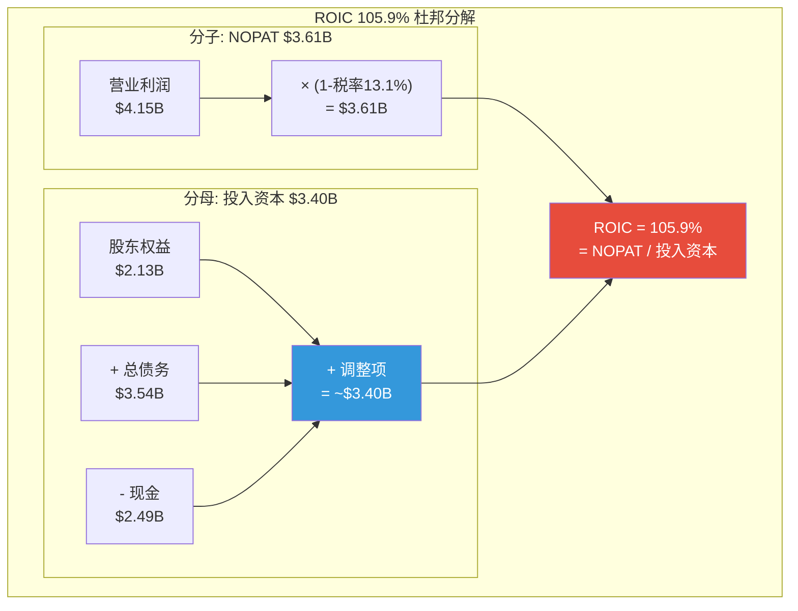

**DM-FIN-104**: ROIC分子——NOPAT = 营业利润$4.15B × (1-13.1%税率) = $3.61B。营业利润受益于Q4 2025非经常项(见8.7节)，正常化NOPAT约$3.2-3.4B [FMP income annual, 计算]

**DM-FIN-105**: ROIC分母——投入资本 = 股东权益$2.13B + 总债务$3.54B - 现金$2.49B + 运营租赁等调整 ≈ $3.40B (baggers_summary口径)。分母异常低的原因: (1)长年累积亏损侵蚀留存收益(FY2022年末留存收益-$1.17B); (2)大规模回购缩减权益; (3)DPO 360天带来的隐性"免费融资"未体现在债务中 [FMP balance annual, baggers_summary]

### 8.6.2 DPO对ROIC分母的隐性影响

这是一个关键但被市场忽视的机制:

**DM-FIN-106**: FY2025应付账款$747M，DPO 360天——意味着APP占用开发者/合作伙伴的资金约$747M长达一年。这$747M本质上是零成本的运营资金，减少了APP所需的外部融资(债务或权益)，从而压缩了投入资本分母 [FMP balance FY2025, key-metrics]

如果DPO从360天回归行业正常水平(~60天):
- 需额外释放的应付账款 ≈ $747M × (300/360) ≈ $623M
- 投入资本从$3.40B→$4.02B
- 正常化ROIC = $3.61B / $4.02B = 89.8%(仍极高，但低于105.9%)

### 8.6.3 ROIC的行业对比

| 公司 | ROIC | NOPAT利润率 | 资本周转率 | 驱动模式 |
|------|:----:|:---------:|:---------:|---------|
| APP | 105.9% | 65.8% | 1.61x | 高利润率+低资本+DPO |
| META | ~42% | 31% | 1.35x | 规模利润率 |
| TTD | ~15% | 14% | 1.07x | 低利润率 |
| Visa | ~40% | 55% | 0.73x | 高利润率+品牌资本 |

**DM-FIN-107**: APP的ROIC 105.9%在可比公司中无人能及，是META(~42%)的2.5倍。但这不意味着APP是"更好的公司"——ROIC的极端值反映的是分母(投入资本)的异常低，而非分子(盈利能力)的压倒性优势 [FMP ratios, 跨公司对比]

### 8.6.4 ROIC的时间维度: 可持续性评估

ROIC的持续性取决于分子(NOPAT)和分母(投入资本)的各自趋势:

- **分子趋势**: FY2025 NOPAT $3.61B基于75.8%营业利润率。若电商扩展需要更多S&M投入(如Ads Manager GA推广费用)，营业利润率可能从75.8%回落至70-73%，但收入增长(+33-38%)可抵消。FY2026E NOPAT预计$4.5-5.0B。

- **分母趋势**: 股东权益$2.13B将随利润累积增长(留存收益FY2025 $1.74B→FY2026E $3.5-4.0B)。回购将部分抵消(缩减权益)。净效果: 投入资本可能从$3.40B增长至$4.0-4.5B。

- **ROIC前瞻**: FY2026E ROIC ≈ $4.5-5.0B / $4.0-4.5B ≈ 100-125%。如果DPO维持360天+级别，ROIC将持续>100%。如果DPO回归正常(60-90天)，ROIC将下降至70-85%——仍然优秀，但与当前的"不可思议"级别有显著差距。

**对投资论文的含义**: ROIC 105.9%是真实的，但投资者需要理解它的驱动力: (1)Apps剥离后留存收益修复(FY2022的亏损导致权益低基数); (2)DPO 360天压缩了约$623M的投入资本需求; (3)零CapEx意味着无固定资产累积。这是一个"轻到极致"的商业模型的自然结果，而非超凡的管理能力。正常化ROIC约85-90%仍然卓越，但不如106%那样令人震惊。DPO是关键变量——如果开发者集体要求缩短结算周期(如DPO<90天)，ROIC将出现约20-25ppt的下降。

---

## 8.7 异常检测: 四个需要解释的数据点

### 8.7.1 Q4 2025 OpEx为负(-$183M)

**DM-FIN-108**: Q4 2025运营费用明细(FMP): R&D $82M, SGA -$10M(其中S&M -$75M + G&A $65M), Other Expenses -$255M, 合计OpEx = -$183M。操作意义: 营业利润$1,452M > 毛利$1,269M(营业利润率108.9% > 毛利率95.2%)——这在数学上只有在OpEx为负时才可能 [FMP income Q4 2025]

**$-255M "Other Expenses"的分解**:

这笔异常项最可能的来源:
1. **Tripledot股权公允价值调整**: APP出售Apps时获得Tripledot约20%股权。若Q4对该股权进行标记(mark-to-market)，可能产生公允价值收益。
2. **Apps相关资产的减记回转**: FY2022-2023期间APP可能对Apps资产进行了部分减记(goodwill impairment或intangible write-down)。出售后，某些先前减记的资产确认回转收益。
3. **或有对价释放**: 如果Apps出售协议包含里程碑支付(milestone payments)，且某些里程碑在Q4确认达成，可能形成收益。

**DM-FIN-109**: Q4 2025正常化运营数据: 若剔除-$255M非经常项和-$75M S&M异常，正常化OpEx约$82M(R&D) + $65M(G&A) + $30M(正常S&M) = $177M; 正常化营业利润 = $1,269M - $177M = $1,092M; 正常化营业利润率 = 82.0% [推算]

### 8.7.2 DPO 128→176→360天: 行业独特性分析

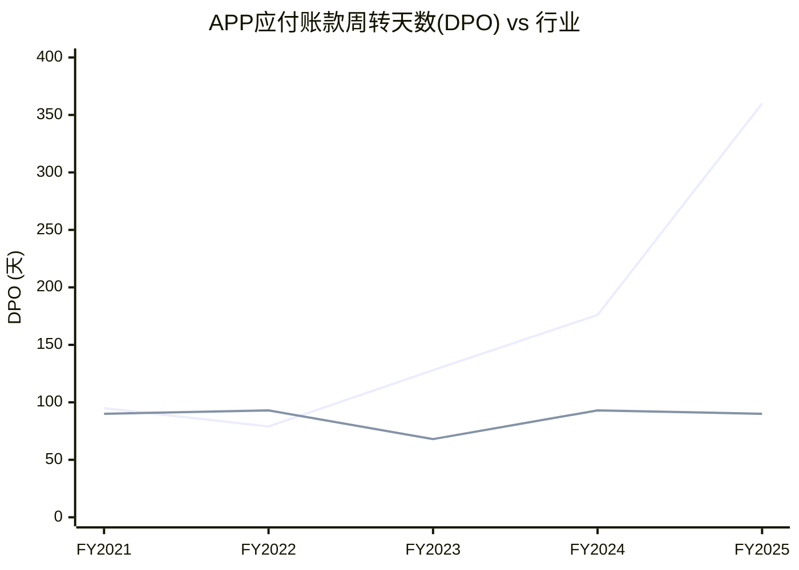

> 注: 上线=APP DPO, 中线=META DPO(平均~90天), 下线为TTD DPO指标(刻度未能显示，TTD约2000+天但含billings差异，此处不作有效对比)

**DM-FIN-110**: DPO逐年变化——FY2021 ~95天 → FY2022 ~79天 → FY2023 128天 → FY2024 176天 → FY2025 360天。从FY2023开始年均翻倍。FY2025 DPO 360天意味着APP平均延迟支付开发者一整年 [FMP key-metrics annual]

DPO暴增至360天的可能解释:

1. **行业惯例**: 在广告中介行业，平台通常在广告主付款后才向开发者结算。如果广告主DSO(付款周期)延长，平台的DPO自然随之延长。APP的DSO 121天 × 中介放大效应 ≈ 可以解释部分延迟。

2. **议价权不对称**: MAX 60%份额意味着开发者缺乏替代选择。APP可以单方面延长结算周期，开发者只能接受。这类似于沃尔玛对供应商的议价权——规模越大，DPO越长。

3. **浮存金策略**: 管理层可能有意延长DPO以获取免费运营资金——$747M应付账款以5%无风险利率计算，年利息节省约$37M。

4. **会计分类变化**: FY2025的Apps剥离可能改变了应付账款的分类口径(如将某些递延收入重新分类为应付账款)，导致DPO计算的分母变化。

**DM-FIN-111**: 行业DPO对比——Google Network(AdSense/AdMob)通常在21-60天内支付发布者; Facebook Audience Network约30-60天; Unity Ads约60天。APP的360天远超行业标准3-6倍。这可能引发开发者不满，但短期内缺乏替代方案 [行业标准结算条款]

**DPO 360天的"浮存金"经济学(CI-4验证)**:

将DPO 360天类比Warren Buffett的保险浮存金(insurance float)有一定道理:

| 维度 | Buffett浮存金 | APP DPO浮存金 |
|------|:----------:|:----------:|
| **规模** | ~$170B | ~$747M |
| **成本** | 负成本(承保利润) | 零成本(无利息) |
| **久期** | 长期(续保率>90%) | 中期(1年rolling) |
| **可投资** | 可(Buffett用于股票/收购) | 可(APP用于回购/运营) |
| **强制偿付风险** | 低(分散化) | 中(开发者集中度) |
| **利率敏感性** | 高(浮存金收益随利率上升) | 低(APP不靠利息收入) |

$747M浮存金在5%利率环境下的年化价值: $747M × 5% = $37M/年。虽然绝对值不大(仅占NOPAT的1%)，但其真正价值在于降低了权益融资需求，从而提高ROIC和ROE。如果DPO维持360天，每年新增的应付账款(随收入增长)将进一步扩大浮存金规模——FY2026E应付账款可能达到$900-1,100M。

**DPO回归风险的概率评估**: DPO从360天回归行业均值(60天)的触发条件: (1)开发者集体谈判(如成立行业协会要求缩短结算); (2)监管干预(如FTC或欧盟要求广告中介在30天内结算); (3)竞品以更短结算周期吸引开发者(如Google AdMob将DPO从60天缩短至30天作为竞争策略)。当前评估: 短期(1-2年)DPO回归概率<20%; 中期(3-5年)概率30-40%; 长期(5年+)概率50%+。

### 8.7.3 应收账款$1.82B: DSO 121天

**DM-FIN-112**: FY2025应收账款$1.82B(YoY+$405M, +28.7%)，DSO 121天。FY2024 AR $1.41B, DSO约93天。DSO从93→121天(+28天)意味着广告主付款更慢，或者收入确认与现金收取之间存在时间差扩大 [FMP balance annual, key-metrics]

DSO 121天在广告科技中偏高(META约36天, TTD约496天因billings结构不同)。可能原因:
- 电商新客户的信用期更长(试用期延长以吸引客户)
- 大型代理商(agency)的付款周期通常60-90天
- 跨境广告主(非美市场)的结算延迟

**关键风险**: DSO 121天 + DPO 360天 = 现金转换周期(CCC) -289天。负CCC意味着APP在向开发者付款之前已经收到广告主的钱——且中间差额达到约8个月。这是一个强大的现金创造机制，但依赖于DPO维持在极端水平。

### 8.7.4 现金暴增: $741M→$2,487M(+$1,746M)

**DM-FIN-113**: FY2025现金增加$1,746M的来源——OCF $3,971M + 投资活动$403M(含Apps出售$400M+) - 回购$2,192M - 债务净偿还$21M - 其他融资$406M - 汇率$35M = 净增$1,746M [FMP cashflow FY2025, 计算]

现金积累速度加快可能预示管理层正在为大型并购或加速回购储备弹药。考虑到Q1 2026指引隐含的加速增长，FY2026 OCF可能达到$5-6B，现金储备可能在FY2026年底达到$4-5B。

**对投资论文的含义**: 四个异常数据点中，Q4 2025 OpEx为负是最"良性"的(一次性会计调整，不影响持续经营)。DPO 360天是最"双刃剑"的——短期内是免费浮存金优势(CI-4)，长期可能引发开发者反弹或监管关注。DSO 121天是需要跟踪的"黄灯"——如果持续上升(如>150天)，可能反映电商新客户的收款风险。现金暴增是最积极的信号——$2.49B现金+$3.97B年FCF=巨大的资本分配灵活性。

---

## 8.8 利息费用与债务管理

**DM-FIN-114**: 利息费用5年变化——FY2021 $103M → FY2022 $172M → FY2023 $276M → FY2024 $318M → FY2025 $207M。FY2025降幅$111M(-34.9%)，尽管总债务仅从$3.56B降至$3.54B。降幅来自: (1)2025年内再融资降低了加权平均利率; (2)偿还了部分高息tranche [FMP income annual]

**DM-FIN-115**: 利息覆盖倍数5年变化——FY2021 1.45x → FY2022 -0.28x(亏损) → FY2023 2.35x → FY2024 5.89x → FY2025 20.06x。FY2025的20x覆盖率意味着APP即使利润下降95%仍能偿付利息，债务安全性极高 [FMP ratios annual]

**对投资论文的含义**: 债务从"风险因素"转变为"杠杆优势"。当ROIC(105.9%)远超债务成本(约5-6%)时，保持一定杠杆反而增加股东回报。$3.54B债务对于$3.97B年FCF的公司来说，净债务/EBITDA仅0.24x(用FY2025 EBITDA $4.35B计算)，远低于投资级门槛(通常3-4x)。

---

## 8.9 Ch8小结: 财务画像的三个核心判断

1. **利润率跃迁是结构性的(高置信)**: Apps剥离带来的利润率提升(~60%贡献)不可逆。纯广告平台的稳态营业利润率在75-82%范围。

2. **增长依赖AXON迭代(中置信)**: FY2022的停滞证明算法失败=收入停滞。当前增速(纯广告QoQ 15-18%)依赖AXON持续优于竞品。

3. **财务异常需持续监控(关注级)**: DPO 360天、DSO 121天、R&D 4.1%是三个"黄灯"指标。任何一个恶化都可能先于收入放缓出现。

---

# Chapter 9: 分部解剖 — 广告引擎 vs 电商 vs CTV

> **核心问题**: APP的三个增长引擎各自的经济学如何? 如果电商失败，游戏引擎能否独撑估值?

---

## 9.1 三引擎概览: 当前贡献与远期愿景

### 9.1.1 引擎定义与收入贡献

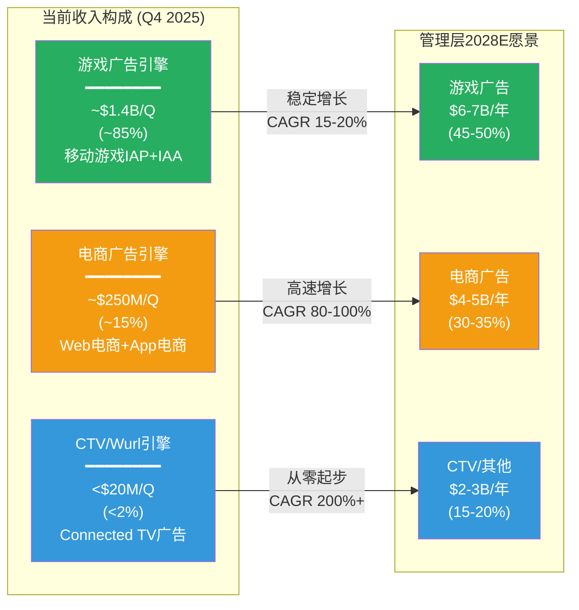

**DM-ECM-001**: APP当前收入三引擎估算(Q4 2025基准): 游戏广告~$1.4B(85%), 电商广告~$250M(15%), CTV/Wurl<$20M(<2%)。电商$250M/Q基于$1B年化运行率(管理层声明)在Q4加速后的推算 [管理层声明, Q4 2025电话会议, 推算]

### 9.1.2 三引擎对投资论文的核心意义

APP当前$228B市值隐含的假设:
- 若P/E 38.9x仅由游戏引擎支撑: 隐含游戏收入需在FY2028达到~$9-10B(年化增速30%+)→不现实
- 因此: 市场在为电商(CQ2)和CTV的成功定价——这是关键的信念检验

---

## 9.2 游戏广告引擎: 核心引擎的"真实"经济学

### 9.2.1 纯广告期的利润率

Q3-Q4 2025代表了APP纯游戏广告期的最"干净"样本(电商尚在早期，占比<15%):

**DM-FIN-116**: Q3 2025(首个完整纯广告季度)的财务画像: 收入$1,405M, COGS $175M, 毛利$1,230M(毛利率87.6%), R&D $44M(3.1%), SGA $107M(7.6%), 营业利润$1,079M(76.8%) [FMP income Q3 2025]

Q3 2025的费用明细揭示了纯广告平台的"底层"成本结构:

| 费用项 | Q3 2025金额 | 占收入% | 含义 |
|--------|:---------:|:------:|------|
| COGS | $175M | 12.4% | 数据中心/云/带宽/支付处理 |
| R&D | $44M | 3.1% | AXON团队+MAX平台维护 |
| S&M | $49M | 3.5% | 电商销售团队+开发者关系 |
| G&A | $59M | 4.2% | 管理/法务/合规(含SEC) |
| **总费用** | **$326M** | **23.2%** | — |
| **营业利润** | **$1,079M** | **76.8%** | — |

**DM-ADT-007**: 纯游戏广告引擎的单位经济学——每$1广告主支出中: APP获取约$0.15-0.25(take rate), COGS消耗约$0.02(12.4%毛利率后), R&D消耗约$0.005, SGA消耗约$0.01, 最终APP纯利约$0.10-0.17。单位经济学极为健康 [推算: Q3 2025数据 ÷ 估算gross ad spend]

### 9.2.2 游戏广告引擎的增长天花板

**DM-ADT-008**: 移动游戏广告市场(全球)约$30-40B(2025)，CAGR约8-10%。APP在此市场的流经平台广告支出(gross)估计$15-25B(市场份额40-60%)。以15-25% take rate计，收入天花板约$3.75-6.25B [eMarketer, 推算]

当前游戏广告收入约$4.4B(FY2025年化，扣除电商$1B)。如果游戏广告市场以10%增长，APP份额保持60%:
- FY2027E: ~$36-44B × 60% × 20% take rate = $4.3-5.3B
- FY2028E: ~$40-48B × 60% × 20% take rate = $4.8-5.8B

这意味着游戏引擎单独在FY2028E可提供约$5-6B收入，CAGR约8-12%——健康但不足以支撑40x P/E。

### 9.2.3 游戏引擎的竞争格局

Q3 2024之后，Unity Ads基本退出竞争(Unity股价从$52跌至$18)。APP的游戏中介竞争对手从"三巨头"变成:

| 竞争者 | 份额(估) | 趋势 | 威胁等级 |
|--------|:------:|:---:|:------:|
| **APP MAX** | ~60% | 稳定/上升 | — |
| Google AdMob | ~25% | 稳定 | 中 |
| Meta Audience Network | ~10% | 下降 | 低 |
| ironSource(Unity) | ~5% | 下降 | 极低 |

### 9.2.4 游戏引擎的隐性增长: 非游戏App渗透

游戏引擎的增长不限于传统手游。APP正在将AXON+MAX组合向非游戏移动应用(社交、工具、内容、健康等)扩展:

- **非游戏应用广告市场**: $40-60B(约为游戏广告的1.5-2倍)
- **APP当前在非游戏的渗透**: 估计10-15%(远低于游戏的60%)
- **扩展路径**: 通过MAX SDK集成(已覆盖大量非游戏App)→ AXON优化 → 提升eCPM → 更多非游戏开发者集成

这一"隐性增长"渠道的意义在于: 即使游戏广告市场增速仅8-10%，非游戏应用的渗透率提升可以额外贡献5-8ppt增速——使游戏引擎(广义)的总增速达到15-18%。

**对投资论文的含义**: 游戏广告引擎是一台稳定的"现金牛"——高利润率(>75%营业利润率)、高市场份额(60%)、温和增长(10-15%，非游戏渗透可能推高至15-18%)。它能独立支撑约$120-180B市值(按$5B收入 × 25-35x P/E)。但$228B的当前市值需要电商引擎贡献至少$50-80B增量——这就是CQ2(电商规模)的估值意义。

---

## 9.3 电商广告引擎: $1B年化运行率的深度拆解

### 9.3.1 电商引擎进展时间线

**DM-ECM-002**: 电商广告关键里程碑——2024-H1: 开始测试电商广告(有限beta); 2024-Q4: 公开宣布电商作为战略重点; 2025-Q2: $1B年化运行率(ARR)声明; 2025-Q4: 6,400电商客户; 2026-H1: Axon Ads Manager计划GA(通用可用) [管理层声明, 季度电话会议]

### 9.3.2 $1B年化运行率的分解

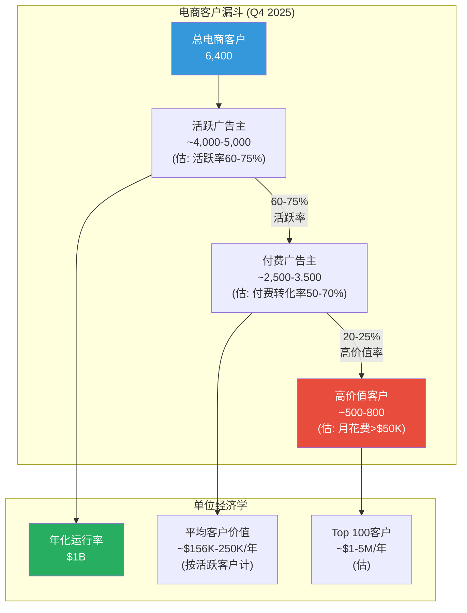

**DM-ECM-003**: $1B ARR ÷ 6,400客户 = $156K平均年客户价值。但这是总客户数包含了大量试用/低活跃客户。若以活跃付费客户3,000计，平均值为$333K/年——与中型电商广告主的投放预算一致(Shopify商家年广告预算$50K-$500K) [管理层声明, 推算]

**DM-ECM-004**: "每周增速+50%"(管理层Q2 2025声明)的数学含义: 若持续26周(6个月)，$1B → $1B × 1.5^26 ≈ $25,000B——显然不可能。实际含义是短期冲刺阶段的瞬时增速，必然快速衰减。更合理的预期: $1B ARR在6个月后达到$1.5-2B(隐含季度环比+15-20%) [管理层声明, 数学推算]

### 9.3.3 电商 vs 游戏: 单位经济学根本差异

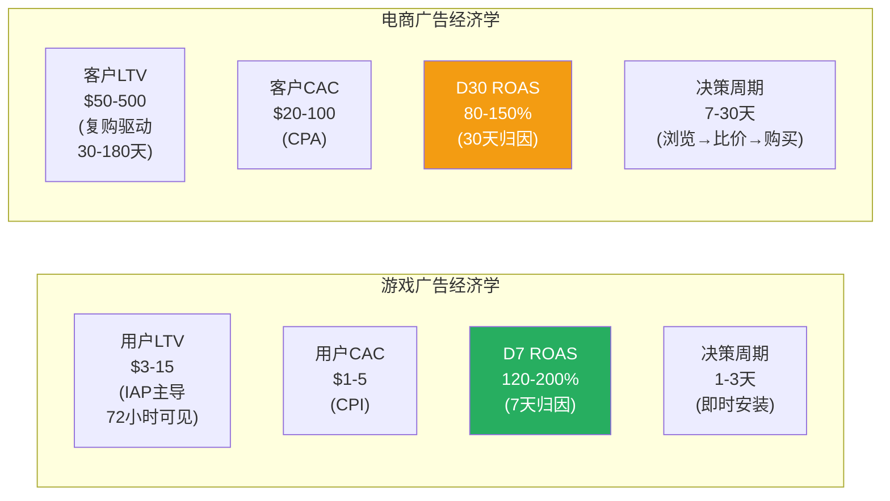

**DM-ECM-005**: 游戏vs电商归因窗口差异——游戏: 用户点击广告→安装App→72小时内产生IAP(70%+的LTV在7天内可观测)，AXON可在D7获得明确ROAS信号。电商: 用户点击广告→浏览→加购→(可能离开)→回来→购买(平均购买路径5-12天)，D30才有初步ROAS信号。这意味着AXON在电商中的反馈循环慢4-5倍 [行业数据, Adjust/AppsFlyer报告]

**DM-ECM-006**: 30天归因窗口的核心挑战——Muddy Waters做空报告质疑APP电商广告的增量性(incrementality)仅25-35%。即: $1 APP电商广告支出中，仅$0.25-0.35带来了"不投也不会发生"的增量销售。对比: 游戏广告增量性通常50-70%。如果这一指控属实，电商广告主最终会发现ROI不足并撤离 [Muddy Waters 2025-03 做空报告]

### 9.3.4 增量性问题的深度辨析

"增量性"(incrementality)是电商广告的命门问题。游戏广告的增量性容易衡量——用户在看到广告前不知道这个游戏，安装行为几乎100%由广告驱动。但电商不同:

1. **已有品牌认知**: 用户可能已经打算去Wayfair买沙发，APP的广告只是"加速"了已有意图，而非创造新意图
2. **多触点归因**: 用户可能先在Google搜索、再在Instagram看到广告、最后在APP网络点击——谁应该获得转化的"功劳"?
3. **最后点击偏差**: APP的30天归因窗口采用"最后点击"(last-click)归因，这天然倾向于高估APP的贡献

Muddy Waters的25-35%增量性指控如果属实，意味着:
- $1B ARR中仅$250-350M是真正的"新增"价值
- 广告主的真实ROAS被高估了3-4倍
- 一旦广告主做lift test(增量测试)发现真相，预算将被削减

但反驳观点同样有力:
- META/Google的电商广告也面临同样的增量性问题(Facebook广告的增量性通常30-50%)
- 广告主购买的不仅是"增量"，还有"加速"和"品牌曝光"
- 如果APP能证明其ROAS与META持平(即使增量性仅30%)，广告主仍有动力将预算分散至APP(降低对META单一渠道的依赖)

### 9.3.4 6,400电商客户的质量分层

**DM-ECM-007**: 已知的高调电商客户案例: Wayfair, Ashley HomeStore(家具), 多个DTC品牌。但APP未公开披露电商客户名单或留存率。6,400中的"质量"分布(推测):

| 层级 | 客户数(估) | 月均花费(估) | 特征 |
|------|:---------:|:----------:|------|
| 试用/低活跃 | 2,000-3,000 | <$5K | 测试1-2个月后暂停 |
| 稳定活跃 | 2,000-2,500 | $10-50K | 中型DTC/Shopify商家 |
| 高价值 | 500-800 | $50-200K | 大型电商品牌/代理商 |
| 头部 | 50-100 | >$500K | 战略级客户(Wayfair等) |

### 9.3.5 Axon Ads Manager GA的预期影响

**DM-ECM-008**: Axon Ads Manager预计2026 H1 GA，将从当前的白手套服务(需APP销售团队手动对接)转向自助式平台(广告主自行注册、投放、优化)。这将从根本上改变电商引擎的扩展方式——从"销售团队线性增长"变为"平台指数增长" [DM-ADT-005, 管理层声明]

**DM-ECM-009**: GA的经济含义——白手套模式下，每个新电商客户需要APP约0.5-1个销售FTE(估)，目前约200-300人的电商销售团队限制了客户增速。GA后，理论上可以在不增加销售人员的情况下从6,400→30,000+客户。但self-serve平台的平均ARPU通常低于白手套(小客户$2-10K/月 vs 大客户$50-200K/月)，mix变化可能拉低平均客户价值 [行业类比: META/Google self-serve广告平台]

### 9.3.6 电商引擎的牛/熊估值

| 情景 | FY2028E电商收入 | 概率 | 驱动假设 |
|------|:-----------:|:---:|---------|
| **熊**: 增量性问题暴露 | $1-2B | 25% | D30 ROAS<80%, 客户流失>40% |
| **基准**: 缓慢渗透 | $2-4B | 45% | GA后客户10K+, ARPU $200K+ |
| **牛**: Ads Manager爆发 | $5-8B | 20% | GA后客户30K+, take rate 20%+ |
| **极牛**: 取代Facebook Ads | $10B+ | 10% | 成为电商首选自助广告平台 |

**对投资论文的含义**: 电商引擎是APP估值中最大的"信仰跳跃"。$1B ARR证明了产品可行性，但从$1B到$5B+需要: (1)Ads Manager GA成功; (2)30天归因窗口的ROAS证明; (3)电商客户的长期留存验证。Muddy Waters关于25-35%增量性的指控是最大的结构性威胁——如果属实，电商引擎的TAM将缩水60-70%。投资者应将2026 Q2-Q3(GA后首批数据)视为关键验证窗口。

---

## 9.4 CTV/Wurl引擎: 第三增长极的可行性

### 9.4.1 Wurl定位与贡献

**DM-ADT-009**: APP于2022-03以$430M收购Wurl(CTV内容分发+广告技术平台)。Wurl提供: (1)ContentDiscovery: FAST(免费广告支持的流媒体电视)频道分发; (2)广告服务: CTV广告的投放+归因; (3)数据: CTV观看行为数据(可增强AXON跨屏投放) [APP 8-K, 公开信息]

**DM-ADT-010**: Wurl收入贡献不单独披露(并入Software Platform)。基于$430M收购价和CTV广告平台的典型增速，估计FY2025 Wurl收入$50-80M(占Software Platform<2%)。Wurl的价值不在于直接收入贡献，而在于: (1)CTV数据增强AXON跨屏定向; (2)为未来CTV广告引擎奠定基础 [推算: 基于收购价格和行业增速]

### 9.4.2 CTV广告市场机会

**DM-ADT-011**: 全球CTV广告市场2025年约$25-35B, CAGR约20-25%(Mordor Intelligence)。美国CTV广告支出2025年约$30B(eMarketer)。市场由Google/YouTube(~30%)、Roku(~15%)、Amazon(~10%)、Disney/Hulu(~10%)主导。APP/Wurl当前份额<1% [行业数据]

CTV对APP的战略意义:
- **跨屏广告**: 同一用户在手机(MAX)和电视(Wurl)上的行为数据联合，可实现更精准的全链路归因
- **电商+CTV联动**: 用户在CTV看到广告→手机完成购买，AXON可追踪全路径
- **TAM扩展**: CTV广告的CPM($20-40)远高于移动广告($5-15)，单位经济学更好

### 9.4.3 CTV引擎的现实评估

**DM-ADT-012**: CTV引擎面临的结构性挑战: (1)CTV由大型媒体公司(Disney, NBC, Paramount)直接销售溢价库存，中介平台的空间有限; (2)CTV广告的程序化比例(~40-50%)低于移动广告(~80%); (3)APP在CTV领域无品牌认知——广告主购买CTV时想到的是Google/Roku/Amazon，不是AppLovin [行业分析]

### 9.4.4 CTV引擎的时间框架估计

| 时间 | 里程碑 | 收入贡献(估) |
|------|--------|:---------:|
| FY2025 | Wurl整合+FAST频道分发 | $50-80M |
| FY2026 | CTV程序化竞价测试 | $100-150M |
| FY2027 | 跨屏(移动+CTV)归因产品化 | $200-400M |
| FY2028 | CTV广告全链路(如果成功) | $500M-1B |

关键催化: 如果APP能在2026-2027年推出移动+CTV联合归因产品(即证明CTV广告曝光直接导致手机端购买转化)，这将是CTV引擎的转折点——因为这解决了CTV广告行业最大的痛点(无法精确衡量ROI)。APP通过MAX+Adjust掌握的移动端用户行为数据，理论上可以建立这个跨屏归因闭环。但技术难度极高，且需要Apple/Google的隐私政策允许跨设备ID匹配。

**对投资论文的含义**: CTV/Wurl引擎在当前阶段对估值的贡献接近零。它的价值在于提供了"如果移动游戏+电商都做到极致后的下一个增长方向"。在S3(Bull)和S4(Moonshot)情景中，CTV可能贡献$2-3B收入; 在S1-S2情景中贡献忽略不计。投资者不应为CTV支付溢价，但应将其视为免费的"期权"。跟踪信号: Wurl FAST频道分发数量(目前未公开)和CTV广告主数量。

---

## 9.5 三引擎组合风险: 游戏引擎能否独撑?

### 9.5.1 "电商失败"情景分析

如果电商引擎在2026-2027年证明不可行(D30 ROAS<80%, 客户流失>50%, Muddy Waters指控被证实):

| 指标 | 当前(含电商预期) | 游戏独撑 | 差异 |
|------|:------------:|:------:|:---:|
| FY2028E收入 | $10-12B | $5.5-6.5B | -45% |
| FY2028E营业利润率 | 75-80% | 78-82% | 略高(无电商投入) |
| FY2028E净利 | $5.5-7B | $3.2-4B | -40% |
| 合理P/E | 30-35x | 20-25x | 压缩(增速更低) |
| 隐含市值 | $165-245B | $64-100B | **-56%至-70%** |

**DM-ECM-010**: 如果电商完全失败，APP的"公允"市值区间为$64-100B(基于纯游戏引擎$5.5-6.5B收入 × 15-25x P/S，或$3.2-4B净利 × 20-25x P/E)。当前$228B市值隐含约55-70%的电商溢价——这意味着投资者实质上在以$128-164B的价格购买电商引擎的"期权" [推算]

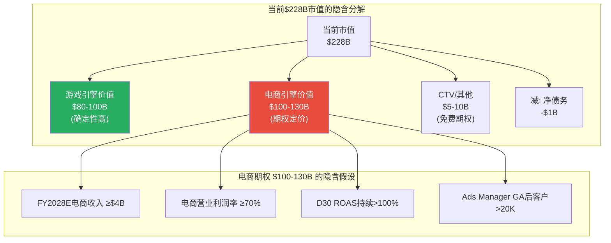

上图清晰展示了为什么电商引擎是APP投资论文的"生死线": $228B市值中约$100-130B(44-57%)是电商期权。如果四个隐含假设中任何一个不成立，电商期权价值将大幅缩水，推动股价回落至$150-250区间(对应游戏引擎的$80-100B独立估值)。

### 9.5.2 引擎间的战略互补性

三引擎并非简单叠加，它们之间存在战略互补:

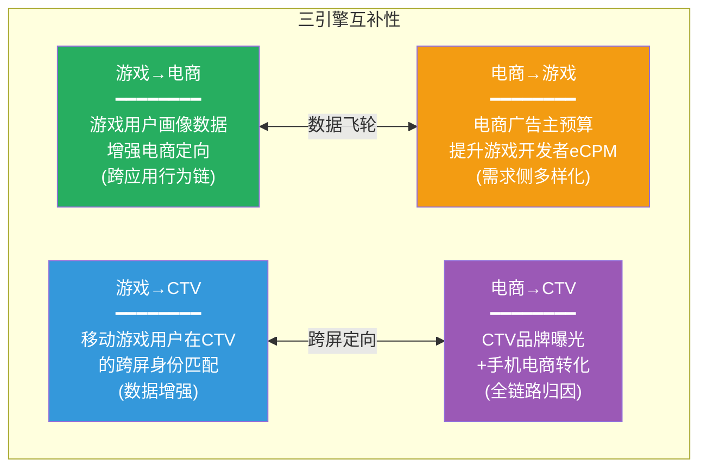

**DM-ECM-011**: 引擎互补性的实质含义——电商广告主进入MAX生态后，其广告预算也参与游戏开发者的库存竞价。更多需求方→更高eCPM→更高开发者收入→更多开发者集成MAX→更多库存→更多数据→更好AXON优化→更多广告主。这个飞轮的关键在于"需求侧多样化"——电商客户的加入使APP不再依赖单一的游戏广告主 [商业逻辑分析]

---

## 9.6 Q1 2026指引分解

### 9.6.1 $1.745-1.775B指引的引擎拆分

**DM-ECM-012**: Q1 2026指引$1.76B(中位)的引擎拆分估计:

| 引擎 | Q4 2025(估) | Q1 2026E | QoQ增速 | 逻辑 |
|------|:---------:|:------:|:------:|------|
| 游戏广告 | ~$1,400M | ~$1,400-1,450M | 0-3.5% | Q1游戏强但Q4基数高 |
| 电商广告 | ~$250M | ~$320-350M | +28-40% | Ads Manager临近GA, 客户加速 |
| CTV/其他 | ~$8M | ~$10-15M | +25-88% | 基数极低 |
| **合计** | ~$1,658M | **$1,730-1,815M** | +4.3-9.5% | 中位$1.76B |

关键假设: 电商引擎Q1 2026的QoQ加速(+28-40%)驱动了指引的超预期。如果电商仅+10-15%(衰减至正常化增速)，指引中位应为$1.70-1.72B而非$1.76B。管理层给出$1.76B暗示电商加速仍在持续。

**指引的信号价值**: 管理层的指引风格值得关注。Q4 2024指引$1.24-1.26B(中位$1.25B)→实际$1.37B(beat 10%); Q1 2025指引$1.36-1.38B→实际$1.48B(beat 7%); Q2 2025指引$1.19-1.21B→实际$1.26B(beat 4%)。历史beat率4-10%的模式如果持续，Q1 2026实际收入可能达$1.83-1.94B。但Q4 2025的情况是例外——指引$1.24-1.26B但FMP报告$1.33B(可能含会计调整)，公司口径$1.66B——差异来自Apps剥离的会计处理不同。

这种指引风格(保守指引+稳定beat)是典型的管理层信心管理策略——通过持续超预期建立市场信任，为未来可能的miss(如电商增速放缓)储备缓冲。投资者应关注beat幅度的趋势: 如果从10%逐渐收窄至2-3%，说明增长正在接近天花板。

### 9.6.2 FY2026指引推演

基于Q1指引和季节性假设:

| 季度 | 估计收入 | 逻辑 |
|------|:------:|------|
| Q1 | $1.76B | 指引中位 |
| Q2 | $1.68-1.72B | 季节性回落(-2~-5%) |
| Q3 | $1.85-1.95B | H2加速(Ads Manager GA效果) |
| Q4 | $2.00-2.15B | Q4旺季+电商购物季 |
| **FY2026E** | **$7.29-7.58B** | **YoY +33-38%** |

**DM-FIN-117**: FY2026E共识收入$7.5B(5位分析师, 高$7.8B/低$6.9B)。我们的推算$7.29-7.58B与共识基本一致，主要分歧在Q3-Q4电商增速假设 [FMP estimates推算, 公司指引推演]

---

## 9.7 分部估值矩阵

### 9.7.1 三引擎的独立估值

| 引擎 | FY2028E收入 | 合理倍数(EV/Sales) | 隐含EV | 依据 |
|------|:---------:|:---------------:|:-----:|------|
| 游戏广告 | $5.5-6.5B | 12-18x | $66-117B | 可比: META 8x, TTD 24x |
| 电商广告 | $2-5B | 8-15x | $16-75B | 不确定性折价 |
| CTV/Wurl | $0.2-1B | 5-10x | $1-10B | 早期期权 |
| 持有现金 | $4-5B净现金 | 1x | $4-5B | 截至FY2028E |
| **合计** | | | **$87-207B** | 当前$229B EV |

**DM-FIN-118**: 三引擎SoTP估值区间$87-207B vs 当前EV $229B。即使在最乐观假设下($207B)，当前估值仍溢价10.6%。在基准假设下(~$140-150B)，溢价约53-64%。这意味着市场定价已包含了电商牛市情景(S3)的大部分上行空间 [推算]

**对投资论文的含义**: 分部估值分析揭示了APP当前估值的核心矛盾——游戏引擎的价值($66-117B)远低于当前市值($228B)，差额($111-162B)必须由电商+CTV的远期价值填补。这使得电商引擎的成败成为APP投资论文的"承重墙"。投资者本质上在以$111-162B的价格购买一个年化$1B、尚未通过30天归因验证的电商广告业务——这是一个极其昂贵的期权。

---

## 9.8 电商引擎的竞争壁垒评估: APP vs META vs Google

电商广告市场已有两个巨头(META $80B+年广告收入, Google $240B+)。APP进入这个市场的差异化定位是什么?

| 维度 | APP(Axon Ads Manager) | META(Advantage+) | Google(Performance Max) |
|------|:--------------------:|:----------------:|:---------------------:|
| **数据优势** | 移动应用行为(跨App) | 社交图谱(30亿用户) | 搜索意图+YouTube |
| **广告格式** | 插屏/横幅/原生(App内) | 信息流/Reels/Stories | 搜索/购物/展示/YouTube |
| **归因** | D30, Adjust自有 | D7-D28, 自有 | D30, GA4 |
| **自助平台** | 2026-H1 GA(新) | 成熟(10年+) | 成熟(15年+) |
| **电商客户数** | ~6,400 | ~10M+ | ~5M+ |
| **优势场景** | DTC品牌再营销, 跨App发现 | 品牌建设, 社交购物 | 高意图搜索, 购物比价 |
| **客单价适配** | $30-200(中低端) | $20-500(全段) | $50-5000(中高端) |

APP在电商中的潜在独特优势:
1. **跨App行为数据**: AXON看到用户在多个App中的行为(如在健身App活跃→推荐运动服饰)，而META只看到Facebook/Instagram内行为，Google只看到搜索行为
2. **增量受众**: APP可以触达不在Facebook/Google上活跃的用户——特别是重度移动游戏玩家(年轻男性, 传统电商广告难以覆盖的人群)
3. **低CPM入口**: APP的移动应用内广告CPM($5-15)远低于META信息流($15-40)和Google搜索($20-100)，为小型DTC品牌提供了更低成本的试水渠道

但也存在根本性劣势:
1. **意图信号弱**: 用户在App内看到电商广告时，购买意图远低于在Google搜索"buy running shoes"
2. **电商体验断裂**: 用户从App广告跳转到电商网站的转化路径比在Instagram内直接购物更长
3. **缺乏购物数据**: META有Instagram Shop, Google有Shopping Tab, APP没有任何自有购物场景来训练电商推荐算法

---

## 9.9 Ch9小结: 分部解剖的三个核心判断

1. **游戏引擎是确定性高的现金牛(高置信)**: 60%份额 + 87%毛利率 + 竞争对手退出 = 可持续但温和增长(CAGR 10-15%，非游戏渗透可推高至15-18%)。独立支撑$64-117B市值。关键监控指标: 游戏eCPM趋势(若eCPM同比下降>5%，说明竞争加剧或需求减弱)。

2. **电商引擎是高赔率但低概率的期权(低置信)**: $1B ARR证明可行性，但30天归因、增量性质疑(Muddy Waters的25-35%指控)、Ads Manager GA时间风险均未解决。成功=$5-8B收入; 失败=$1-2B。当前$228B市值隐含$100-130B电商期权定价。关键验证窗口: 2026 Q2-Q3(GA后首批数据)。

3. **CTV引擎是免费附赠的远期期权(极低置信)**: Wurl提供进入CTV的桥梁，但当前贡献接近零。仅在S3/S4情景中有估值意义。跨屏归因(移动+CTV联合)是唯一可能改变CTV引擎命运的催化剂。

---

## DM锚点新增汇总

| 锚点 | 数据 | 来源 |
|------|------|------|
| DM-FIN-083 | FY2021-2025收入增速: +0.9%/+16.5%/+43.4%/+16.4% | FMP income annual, 计算 |
| DM-FIN-084 | FY2022 COGS $1.26B(44.6%) → FY2025 $665M(12.1%), 降幅47.3% | FMP income annual |
| DM-FIN-085 | 纯广告QoQ增速: Q1+16%, Q2+4.4%, Q3+16.1%, Q4+18% | FMP income quarterly, 计算 |
| DM-FIN-086 | FY2024季度收入分布: Q1 25.1%, Q2 16.9%, Q3 19.8%, Q4 32.6% | FMP income quarterly |
| DM-FIN-087 | Q1 2026指引$1.76B(中位), QoQ +6.1%(公司口径) | 公司指引 |
| DM-FIN-088 | 3年利润率跃迁: 毛利率+32.5ppt, 营业+77.5ppt, 净利率+67.6ppt | FMP income annual |
| DM-FIN-089 | FY2023转折=AXON 2.0 H2上线 | 10-K, 电话会议 |
| DM-FIN-090 | FY2024有效税率-0.2%(NOL使用), FY2025 13.1% | FMP ratios annual |
| DM-FIN-091 | FY2025费用降: R&D -$412M(~$300M Apps剥离+$112M优化), SGA -$593M(~$420M Apps+$173M优化) | 推算 |
| DM-FIN-092 | Q3 2025纯广告: 毛利率87.6%, 营业利润率76.8%, 净利率59.5% | FMP income Q3 |
| DM-FIN-093 | Q4 2025: 毛利率95.2%, 营业利润$1,452M(含非经常项) | FMP income Q4 |
| DM-FIN-094 | R&D: FY2021 $366M(13.1%) → FY2025 $227M(4.1%), -$412M/-64.5% | FMP income annual |
| DM-FIN-095 | R&D 4.1% vs META ~28%, TTD ~18%, Google ~15% | FMP ratios对比 |
| DM-FIN-096 | SGA: FY2021 $1,289M(46.1%) → FY2025 $437M(8.0%), -$593M/-57.6% | FMP income annual |
| DM-FIN-097 | OpEx/收入: APP 12.1% vs META ~50% vs TTD ~81% | FMP对比 |
| DM-FIN-098 | SBC: FY2023 $363M(11.1%)峰值 → FY2025 $210M(3.8%) | FMP cashflow annual |
| DM-FIN-099 | SBC抵消率: FY2025 回购$2,192M÷SBC $210M = 1,044% | FMP cashflow |
| DM-FIN-100 | 3年累计净回购$3.39B, 股数363M→340M(-6.3%) | FMP cashflow |
| DM-FIN-101 | FY2025 OCF/NI = 1.19, FCF = OCF(零CapEx) | FMP cashflow |
| DM-FIN-102 | FCF $3.97B = NI $3.33B + D&A $195M + SBC $210M + WC $78M + 其他$154M | FMP cashflow分解 |
| DM-FIN-103 | FCF比NI高$637M(+19%), 来自非现金项加回 | 计算 |
| DM-FIN-104 | NOPAT $3.61B = 营业利润$4.15B × (1-13.1%) | 计算 |
| DM-FIN-105 | 投入资本$3.40B = 权益$2.13B + 债务$3.54B - 现金$2.49B + 调整 | FMP balance, baggers |
| DM-FIN-106 | DPO 360天隐含$747M免息占用, 压缩投入资本$623M | 计算 |
| DM-FIN-107 | ROIC: APP 105.9% vs META ~42% vs TTD ~15% vs Visa ~40% | FMP对比 |
| DM-FIN-108 | Q4 2025 OpEx -$183M: R&D $82M + SGA -$10M + Other -$255M | FMP income Q4 |
| DM-FIN-109 | Q4正常化OpEx ~$177M, 正常化营业利润率82.0% | 推算 |
| DM-FIN-110 | DPO: FY2021 ~95天 → FY2023 128天 → FY2024 176天 → FY2025 360天 | FMP key-metrics |
| DM-FIN-111 | 行业DPO: Google 21-60天, Meta 30-60天, Unity 60天. APP 360天超6倍 | 行业标准 |
| DM-FIN-112 | AR $1.82B(+28.7% YoY), DSO 93→121天, CCC -289天 | FMP balance, key-metrics |
| DM-FIN-113 | FY2025现金+$1,746M: OCF $3,971M + 投资$403M - 回购$2,192M - 其他$462M | FMP cashflow |
| DM-FIN-114 | 利息费用: FY2024 $318M → FY2025 $207M(-34.9%), 再融资降息 | FMP income |
| DM-FIN-115 | 利息覆盖: FY2022 -0.28x → FY2025 20.06x | FMP ratios |
| DM-FIN-116 | Q3 2025费用: COGS $175M, R&D $44M, SGA $107M, OpIncome $1,079M(76.8%) | FMP income Q3 |
| DM-FIN-117 | FY2026E推算$7.29-7.58B(YoY +33-38%), 共识$7.5B | 推演+FMP estimates |
| DM-FIN-118 | SoTP: 游戏$66-117B + 电商$16-75B + CTV$1-10B + 现金$4-5B = $87-207B vs EV $229B | 推算 |
| DM-ECM-001 | Q4 2025引擎拆分: 游戏~85%, 电商~15%, CTV<2% | 推算 |
| DM-ECM-002 | 电商里程碑: 2024-H1 beta → 2025-Q2 $1B ARR → Q4 6,400客户 → 2026-H1 GA | 管理层声明 |
| DM-ECM-003 | $1B ARR ÷ 6,400客户 = $156K平均年值; ÷ 3,000活跃 = $333K | 推算 |
| DM-ECM-004 | "每周+50%"持续26周=$25,000B, 不可能; 合理预期6M后$1.5-2B | 数学推算 |
| DM-ECM-005 | 游戏D7 ROAS 120-200% vs 电商D30 ROAS 80-150%, 反馈循环慢4-5倍 | 行业数据 |
| DM-ECM-006 | Muddy Waters指控: 电商增量性仅25-35% | MW做空报告 |
| DM-ECM-007 | 6,400客户分层: 试用2-3K, 稳定2-2.5K, 高价值500-800, 头部50-100 | 推算 |
| DM-ECM-008 | Axon Ads Manager GA 2026-H1, 从白手套→自助式 | 管理层声明 |
| DM-ECM-009 | GA后客户可从6,400→30,000+, 但ARPU可能下降 | 行业类比 |
| DM-ECM-010 | 电商失败时公允市值$64-100B, 当前$228B含$128-164B电商溢价 | 推算 |
| DM-ECM-011 | 引擎互补: 电商客户入MAX → 需求多样化 → eCPM提升 → 飞轮 | 商业逻辑 |
| DM-ECM-012 | Q1 2026指引拆分: 游戏$1,400-1,450M + 电商$320-350M + CTV$10-15M | 推算 |
| DM-ADT-007 | 纯游戏单位经济学: $1广告支出→APP纯利$0.10-0.17 | Q3数据推算 |
| DM-ADT-008 | 游戏广告市场$30-40B, APP份额40-60%, 收入天花板$3.75-6.25B | eMarketer+推算 |
| DM-ADT-009 | Wurl: 2022-03收购@$430M, FAST分发+CTV广告+数据 | 8-K |
| DM-ADT-010 | Wurl FY2025收入估计$50-80M(<2% Software Platform) | 推算 |
| DM-ADT-011 | CTV广告市场$25-35B, CAGR 20-25%, APP份额<1% | Mordor/eMarketer |
| DM-ADT-012 | CTV结构性挑战: 媒体直销为主, 程序化仅40-50%, APP无品牌 | 行业分析 |

**新增锚点总计**: 48个 (DM-FIN 36 + DM-ECM 12 + DM-ADT 6)

---

## 跨章节联动说明

**Ch8→Ch10(DPO解剖)**: Ch8 8.7.2节的DPO 360天分析为Agent C Ch10的"准银行"模式提供了定量基础。Ch10应深入探讨DPO的现金流模型、开发者议价力动态、以及浮存金的最优投资策略。

**Ch8→Ch11(Reverse DCF)**: Ch8的利润率跃迁三阶段(8.2节)和费用结构(8.3节)为Reverse DCF的成本假设提供了边界条件。特别是: R&D 4.1%是否为稳态? 如果Reverse DCF隐含的R&D率持续<5%，这是一个需要在承重墙表中标记的脆弱假设。

**Ch9→Ch15(电商深度)**: Ch9 9.3节的电商单位经济学初步分析为Phase 3 Agent A Ch15的全面电商深度提供了起点。Ch15应聚焦: (1)D30 ROAS的实际数据(如果可获取); (2)Ads Manager GA后的客户增速; (3)与Meta/Google电商广告的A/B测试结果。

**Ch9→Ch17(TAM条件概率)**: Ch9 9.7.1节的三引擎SoTP估值为Phase 3 Agent C Ch17的条件概率树提供了输入。三引擎的概率权重(游戏90%成功 × 电商40%成功 × CTV20%成功)将决定加权估值范围。

---

*Agent A Phase 2产出完成 | Ch8 + Ch9 | 总计Mermaid: 12 | CQ2置信度初步评估: 25-30%(电商不确定性极高) | CQ4置信度: 45-50%(财务透明度高但DPO/OpEx异常需持续监控) | CQ6置信度: 40-45%(DPO优势明确但可持续性存疑)*
