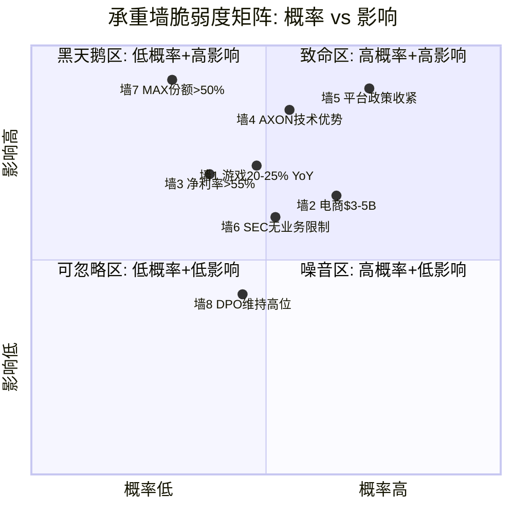
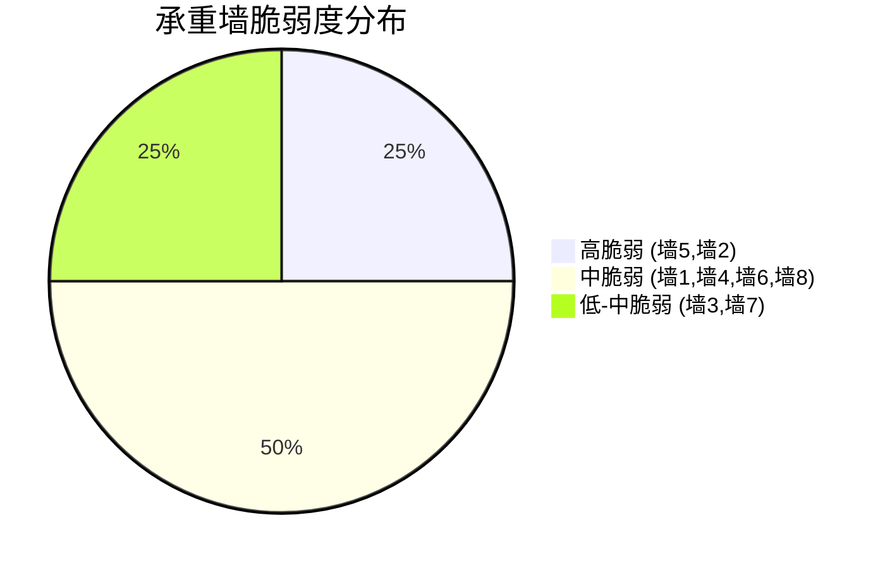
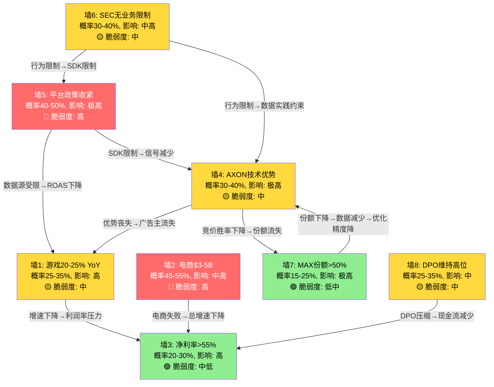
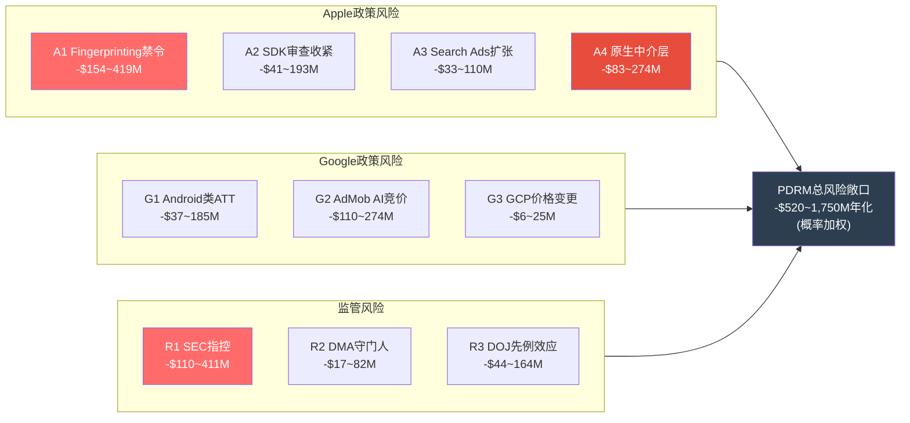
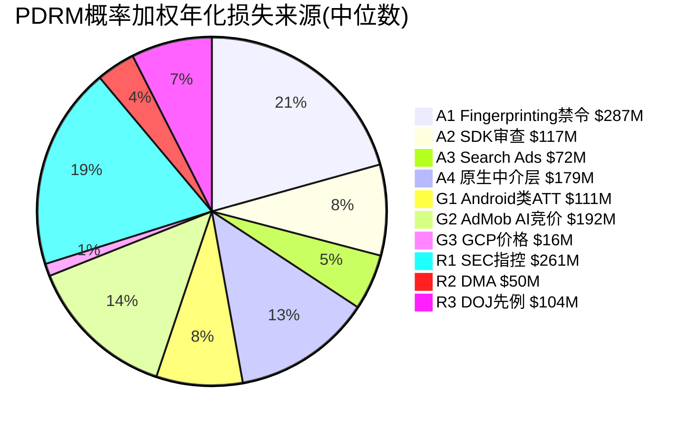
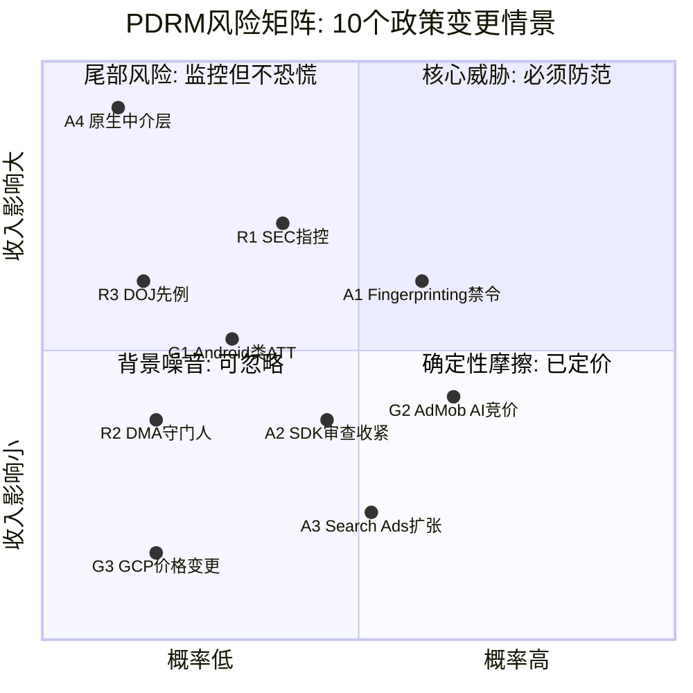
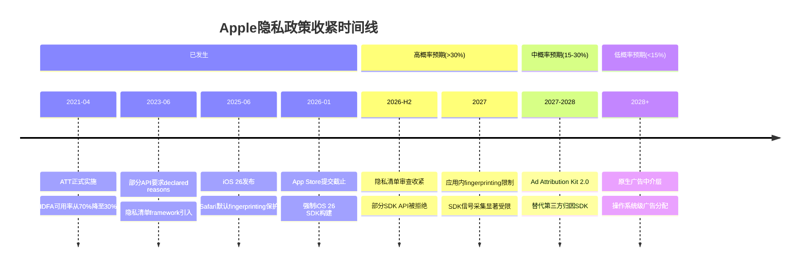

# Agent B — 独立风险审计员 | Phase 2 产出

> **日期**: 2026-02-16 | **覆盖章节**: Ch12 承重墙脆弱度表 + Ch13 PDRM平台依赖风险矩阵
> **DM锚点范围**: DM-VAL-007~DM-VAL-018 (12个) + DM-REG-021~DM-REG-030 (10个) = 22个新增
> **Mermaid数量**: 7个 (Ch12: 3个, Ch13: 4个)
> **总字符目标**: ≥25K | **数据基底**: shared_context.md 78锚点 + P1 AgentB Ch6 ERM 25锚点

---

# Chapter 12: 承重墙脆弱度表

> **关联CQ**: CQ4(估值隐含假设) | **数据来源**: Phase 2 Reverse DCF隐含假设 + Phase 1 ERM断点分析
> **核心任务**: 从APP当前估值($228B市值, P/E 68.5x TTM, EV/Sales 41.8x)反推市场隐含了哪些关键假设, 逐一评估每面"承重墙"的脆弱性

---

## 12.1 承重墙识别方法论

"承重墙"是Reverse DCF中隐含的关键假设。当前市场给APP的估值需要以下前提同时成立, 才能证明$228B市值的合理性。任何一面墙的倒塌都会导致估值需要显著下调, 多面墙同时倒塌则可能引发级联崩溃。

识别方法: 从当前估值指标反推 → 确定每项隐含假设 → 评估"概率×影响" → 标注级联关系。

**估值基准锚定**:
- 当前市值$228B, P/E(TTM) 68.5x(DM-VAL-001修正), P/E(Fwd FY2027E) 32.9x(DM-VAL-002)
- EV/Sales 41.8x(DM-MKT-006), EV/EBITDA 52.8x(DM-MKT-005)
- 分析师共识: FY2027E收入$10.2B(DM-EST-001), FY2028E收入$12.9B(DM-EST-003)
- 隐含CAGR: FY2025→2027E约36%, FY2025→2028E约33%(DM-EST-007)

DM-VAL-007: 当前$228B市值隐含FY2025→2028E收入CAGR约33%(从$5.48B到$12.9B), 且要求FY2028E后增长不低于15-20%以维持当前倍数 [计算: (12.9/5.48)^(1/3)-1=33%; 远期PE 32.9x需持续增长支撑]

DM-VAL-008: FMP ratios显示APP P/E从FY2023 39.3x→FY2024 69.1x→FY2025 68.5x, 在盈利爆发式增长的同时估值倍数不降反升, 意味着市场不仅定价了当前盈利还定价了未来加速增长 [FMP ratios annual]

---

## 12.2 八面承重墙逐一评估

### 墙1: 游戏广告收入持续20-25% YoY增长

**隐含假设**: 核心游戏广告业务(当前占收入约75%)在FY2026-2028保持20-25%的年增速, 从约$4.1B增至约$7-8B。

**假设依据**: FY2023→2024→2025收入增速分别为+16.3%/+43.6%/+16.3%(DM-FIN-001~005, 注: FY2025含Apps剥离调整, 纯Software Platform增速更高)。AXON 2.0在2023年发布后驱动了加速增长, 2026年1月的"model step-up"进一步重新加速旧客户群支出(DM-TEC-020)。

**脆弱度评估: 中**

- **概率(假设被打破)**: 25-35%。全球移动游戏广告市场增速约8-12% CAGR, APP要维持20-25%增速意味着持续抢占份额。AXON的技术领先目前可支撑, 但Meta Advantage+和Moloco正在缩小差距(DM-MKT-025)。广告主年度流失率23%(DM-MKT-020)意味着APP需要持续获客才能维持净增长。
- **影响(假设被打破时)**: 高。游戏广告占收入75%, 如果增速从25%降至10-15%(仅跟随行业), FY2028收入将从$12.9B降至$9-10B, 估值需下调20-30%。
- **脆弱性来源**: AXON技术优势被竞争追平(CQ1); 移动游戏行业增速放缓(已出现迹象); 广告主向Meta/TikTok分散投放。

DM-VAL-009: 如果游戏广告增速从25%降至行业平均12%, FY2028E收入将减少$2.5-3.5B, 对应市值损失约$60-90B(-26~39%) [计算: $2.5-3.5B×25x revenue multiple]

---

### 墙2: 电商广告收入2028年达$3-5B

**隐含假设**: 电商从FY2025约$1B年化运行率(DM-ADT-004)增长至FY2028的$3-5B, 成为第二增长引擎。BofA最乐观预测2026年电商净收入$3B(DM-MKT-022)。

**脆弱度评估: 高**

- **概率(假设被打破)**: 45-55%。电商广告是APP最未经验证的增长叙事。Q4 2025电商客户从约600增至约6,400(DM-MKT-021), 增速惊人但留存率和ROAS均未经完整周期验证。CI-2指出30天LTV breakeven在电商领域可能不可规模化, 因为电商复购周期远长于游戏IAP。Axon Ads Manager GA版推迟至2026 H1(DM-ADT-005), 在此之前规模化受限于白手套服务。
- **影响(假设被打破时)**: 中-高。电商$3-5B的差额相当于FY2028E收入的23-39%。如果电商仅达$1-1.5B(增长但不爆发), FY2028收入将降至$9-10B, 估值下调15-25%。
- **脆弱性来源**: 电商广告主LTV/CAC经济学未验证(CI-2); 自助平台GA延迟; 大广告主要求更长归因窗口与更高透明度。

DM-VAL-010: BofA的$3B电商预测隐含电商客户留存率>80%和ROAS持续改善, 两项假设均无历史数据支撑 [分析推断, 基于DM-MKT-022]

---

### 墙3: 净利率维持>55%

**隐含假设**: FY2025净利率60.8%(DM-FIN-014)是新常态而非峰值, FY2026-2028净利率维持在55-62%之间。

**脆弱度评估: 中-低**

- **概率(假设被打破)**: 20-30%。APP的利润率结构有三个支撑: (1) 纯软件模型, CapEx近零(DM-FIN-055); (2) R&D仅$227M/4.1%(DM-FIN-020), 因AXON团队精简(约200人); (3) DPO 360天的免息浮存金(DM-FIN-059)。这三个支撑短期内不太可能同时崩溃。
- **影响(假设被打破时)**: 高。净利率每下降5个百分点, FY2028净利润减少约$645M(按$12.9B收入计), 对应P/E维持不变时市值减少$21B(-9%)。更重要的是, 利润率下降会触发估值倍数压缩(投资者担忧"利润率见顶"), 双重打击可能导致市值下降20-30%。
- **脆弱性来源**: SEC和解附行为限制可能增加合规成本; 电商业务利润率可能低于游戏(更长的归因窗口=更高的基础设施成本); 竞争加剧可能压缩广告主的let-rate(APP抽成比例)。

---

### 墙4: AXON技术优势持续(CQ1)

**隐含假设**: AXON在广告优化精度方面的领先(ROAS campaigns效果显著高于Meta Advantage+/Google Performance Max)至少持续至FY2028, 且AXON 3.0 GenAI升级进一步扩大优势。

**脆弱度评估: 中**

- **概率(假设被打破)**: 30-40%。AI模型的技术优势本质上是**暂时性的** -- 任何基于神经网络/RL的模型都可以被拥有更多数据和计算资源的竞争对手追平。Meta拥有Facebook+Instagram的第一方登录数据(30亿+用户)和远超APP的R&D投入($45B+ vs $227M, DM-TEC-019)。Meta Advantage+已积极进入游戏内广告竞价(DM-MKT-025)。
- **影响(假设被打破时)**: 极高。AXON是APP收入引擎的核心, 技术优势丧失将直接导致: (1) 广告主ROAS下降→流失; (2) 在MAX竞拍中AppLovin Exchange胜率下降→收入缩减; (3) 整个"AXON驱动MAX"的飞轮逻辑瓦解。
- **脆弱性来源**: Meta/Google的资源优势(数据+计算+人才); 开源RL模型(如Meta的ReAgent)不断成熟; 做空报告指出AXON可能依赖fingerprinting等"灰色"数据实践, 如果被禁则优势消失。
- **但**: CI-1论证了"护城河在MAX不在AXON" -- 即使AXON被追平, MAX的中介垄断+SDK锁定+数据独占仍可保护APP。这是墙4被打破时的"第二道防线"。

---

### 墙5: Apple/Google不实质性收紧政策(CQ5)

**隐含假设**: Apple在iOS 27-28不将fingerprinting禁令从Safari浏览器层面扩展到应用内SDK层面, Google不推出类ATT的Android隐私机制, 两大编排者维持对第三方广告中介层的相对宽松政策。

**脆弱度评估: 高**

- **概率(假设被打破)**: 40-50%。Phase 1 ERM断点分析(Ch6 SS6.8.1)将此列为**优先级第一的断裂风险**, 致命性评级。Apple的历史行为模式极为清晰: (1) ATT(2021年)改写了整个行业; (2) iOS 26已引入Safari默认fingerprinting保护(DM-REG-013/019); (3) 2026年4月28日起App Store将强制要求iOS 26 SDK构建, 且需声明API使用理由。Apple从浏览器到应用内的政策扩展只是时间问题。
- **影响(假设被打破时)**: 极高。Ch6 SS6.7.4分析显示, Apple完全禁止应用内fingerprinting将导致iOS端收入下降15-30%, 总收入下降8-17%。更关键的是, 这将削弱AXON的优化精度(墙4连带倒塌), 并使META等拥有第一方数据的竞争对手获得进一步优势(墙1连带受损)。
- **脆弱性来源**: Apple自身运营Apple Search Ads, 有"既当裁判又当选手"的动机; EU DMA可能要求Apple不得歧视第三方广告网络, 但DMA合规方向不确定; iOS 26 SDK强制要求+API理由声明机制使Apple拥有了更精确的执行工具。

DM-VAL-011: iOS 26自2026年4月28日起强制App Store提交使用iOS 26 SDK构建, 第三方SDK需提供隐私清单(privacy manifest)声明API使用理由 — 这为Apple未来收紧应用内数据采集提供了技术执行基础 [WebSearch: 9to5Mac/Medium]

---

### 墙6: SEC调查不导致业务限制(CQ3)

**隐含假设**: SEC调查以无罪或轻微和解(<$100M)结束, 不附带限制APP数据实践的行为令。

**脆弱度评估: 中**

- **概率(假设被打破)**: 30-40%。Ch6 SS6.7.2评估SEC三种结局: 无罪/轻和(40%), 和解$100-500M+行为限制(35%), 正式指控(25%)。SEC网络和新兴技术部门(DM-REG-017)主导调查, 聚焦"标识符桥接"(identifier bridging)是否违反平台协议 -- 这是一个灰色地带, 但4份做空报告(Muddy Waters/Fuzzy Panda/Culper/CapitalWatch, DM-REG-002~005)已为SEC提供了大量证据线索。
- **影响(假设被打破时)**: 中-高。和解$100-500M本身可消化(仅占FY2025 FCF的2.5-12.6%, DM-FIN-045)。真正的风险是**行为限制令** -- 如果SEC要求APP停止"标识符桥接"或限制SDK数据采集, 将直接削弱AXON的数据信号源, 连带墙4和墙5。
- **脆弱性来源**: 4份做空报告虽然CapitalWatch已撤回道歉(DM-REG-005), 但Muddy Waters/Fuzzy Panda/Culper的指控仍在; SEC调查进行中, 没有明确的结论时间表; APP在10-Q中承认"如果指控成立, 业务可能受到不利影响"。

DM-VAL-012: SEC和解金额$100-500M仅占FY2025 FCF($3.97B)的2.5-12.6%, 财务影响可消化; 真正的风险是附带的行为限制令对数据实践的约束 [计算]

---

### 墙7: MAX中介份额维持>50%(CQ1, CI-1)

**隐含假设**: MAX在移动广告中介市场的约60%份额(DM-ADT-003)不因竞争、反垄断或开发者叛逃而大幅下降。

**脆弱度评估: 低-中**

- **概率(假设被打破)**: 15-25%。MAX的份额来源(MoPub收购+关闭, DM-ADT-025/026)是结构性的 -- MoPub不会"复活"。唯一有意义的竞争对手Unity LevelPlay正在加速衰退(DM-CMP-020/021, Unity股价从$52跌至$18.68)。MAX-AXON的六维度交叉锁定(Ch5 SS5.3.2)使开发者迁移成本极高。
- **影响(假设被打破时)**: 极高。MAX份额跌破50%将触发两个连锁效应: (1) AXON可见的数据量减少→优化精度下降→墙4倒塌; (2) APP在MAX竞拍中的信息优势削弱→广告收入减少→墙1受损。MAX是整个APP商业模式的"地基", 其份额是所有其他假设的前提。
- **脆弱性来源**: 反垄断强制MAX-AXON解绑(CI-5, Ch6 SS6.6.3); 竞品Moloco推出中介层; 开发者因DPO不满而集体迁移。短期概率低, 但中期(3-5年)风险在累积。

---

### 墙8: DPO维持高位(CI-4, CQ6)

**隐含假设**: APP的应付账款周转天数维持在300-360天, 继续免费占用开发者资金作为"浮存金", 支撑ROIC>100%(DM-FIN-056)和FCF利润率72.5%(DM-FIN-053)。

**脆弱度评估: 中**

- **概率(假设被打破)**: 25-35%。DPO从FY2023 128天→FY2024 176天→FY2025 360天(DM-FIN-063)的扩大趋势不可能无限持续。行业标准DPO为30-60天, APP的360天是行业平均的6-12倍。这一异常尚未引起广泛关注, 但做空报告或SEC的进一步审查可能将其推向聚光灯下。
- **影响(假设被打破时)**: 中。DPO从360天缩短至90天将释放约$560M的运营现金(大致估算: 应付账款从$747M降至约$187M), 减少APP可用浮存金, 但不会直接影响收入。对ROIC的影响更显著 -- 投入资本增加将使ROIC从105.9%降至约70-80%, 仍然优秀但叙事冲击巨大("ROIC不再是100%+")。
- **脆弱性来源**: 开发者组织化谈判(参照App Store佣金率抗议运动); 竞品推出"快速支付"差异化策略; 监管/审计关注。

DM-VAL-013: 如果DPO从360天缩短至行业标准90天, APP将释放约$560M运营现金($747M→$187M应付账款), ROIC从105.9%降至约70-80% [计算: $747M×(1-90/360)=$560M; ROIC = NOPAT / 投入资本增$560M]

---

## 12.3 承重墙脆弱度矩阵

**矩阵解读**:
- **致命区(高概率+高影响)**: 墙5(平台政策收紧)位于矩阵最危险的位置 -- 概率最高(40-50%)且影响最大(级联触发墙4+墙1)。墙2(电商)也处于危险区, 但影响相对可控。
- **黑天鹅区(低概率+高影响)**: 墙7(MAX份额)概率较低但一旦发生影响毁灭性 -- MAX是整个商业模式的地基。
- **最脆弱的三面墙**: 墙5 > 墙4 > 墙2, 这三面墙倒塌的概率之和(考虑相关性调整后)约为60-70%, 意味着市场隐含假设中至少有一个在3年内被打破的概率相当高。

---

## 12.4 承重墙之间的级联依赖

八面墙并非独立存在, 它们之间存在复杂的依赖关系。某些墙的倒塌会连带其他墙, 形成级联效应。

### 12.4.1 三条关键级联路径

**级联路径A: 平台政策核弹 (最高概率级联)**
墙5(政策收紧)→ 墙4(AXON优势)→ 墙1(游戏增速)→ 墙3(利润率)

这是Phase 1 ERM情景A(Ch6 SS6.9)的承重墙版本。Apple如果将fingerprinting禁令从Safari扩展到应用内SDK, 直接打击AXON的信号来源(墙5)。信号减少导致AXON优化精度下降(墙4), 广告主ROAS恶化进而流失(墙1), 收入增速下降压制利润率(墙3)。四面墙连倒的条件概率约为15-20%。

**影响量化**: 如果级联路径A完全触发, 预估收入下降15-25%, 净利率下降5-10个百分点, P/E从68.5x压缩至30-40x, 市值从$228B降至约$80-120B(-47~65%)。

**级联路径B: SEC+政策双杀 (最危险级联)**
墙6(SEC指控)→ 墙5(Apple借机收紧)→ 墙4(AXON)→ 墙1+墙7

这是Ch6情景B(SEC+平台双杀)的承重墙映射。SEC如果正式指控APP的数据实践构成违规(墙6), Apple可能借此收紧对违规SDK的审查(墙5), 形成"监管+平台"双重打击。这一路径的条件概率较低(约8-12%), 但影响最为毁灭性。

**影响量化**: 级联路径B完全触发时, 估计市值下降50-65%。

**级联路径C: 竞争侵蚀慢性病 (最可能的渐进路径)**
墙4(AXON追平)→ 墙7(MAX份额侵蚀)→ 墙1(游戏增速放缓)→ 墙8(DPO被迫缩短)→ 墙3(利润率下降)

与路径A/B的"突然冲击"不同, 路径C是慢性病 -- 竞争对手(Meta Advantage+/Moloco)逐步缩小与AXON的技术差距, MAX份额从60%缓慢下降至45-50%, 游戏广告增速从25%滑落至10-15%, 开发者开始用脚投票要求更短DPO。整个过程可能跨越2-4年, 投资者不会看到单一的"崩溃事件", 但估值会逐步从$228B回落至$100-150B。

DM-VAL-014: 三条级联路径的概率加权市值影响: 路径A(15-20%概率, 市值-$100-130B) + 路径B(8-12%, -$115-148B) + 路径C(25-35%, -$78-128B) = 加权损失约$28-48B [计算: Sigma(概率×影响)]

---

## 12.5 承重墙脆弱度汇总表

| 墙# | 隐含假设 | 脆弱度 | 概率(3年) | 影响 | 级联风险 | 关联CQ |
|:---:|---------|:------:|:---------:|:----:|:--------:|:------:|
| **W1** | 游戏广告20-25% YoY | **中** | 25-35% | 高 | 被W4/W5触发 | CQ1,CQ4 |
| **W2** | 电商达$3-5B | **高** | 45-55% | 中-高 | 独立(弱级联) | CQ2 |
| **W3** | 净利率>55% | **中-低** | 20-30% | 高 | 被W1/W2/W8触发 | CQ4 |
| **W4** | AXON技术优势持续 | **中** | 30-40% | 极高 | 被W5/W6触发,触发W1/W7 | CQ1 |
| **W5** | 平台政策不实质收紧 | **高** | 40-50% | 极高 | 触发W4→W1→W3 | CQ5 |
| **W6** | SEC无业务限制 | **中** | 30-40% | 中-高 | 触发W5→W4 | CQ3 |
| **W7** | MAX份额>50% | **低-中** | 15-25% | 极高 | 被W4触发,触发W4反馈 | CQ1 |
| **W8** | DPO维持高位 | **中** | 25-35% | 中 | 触发W3 | CQ6 |

---

## 12.6 对投资论文的含义

**核心发现**: 在8面承重墙中, 2面脆弱度为"高"(墙5平台政策, 墙2电商), 4面为"中", 2面为"低-中"。最危险的不是单面墙的倒塌, 而是**级联效应** -- 墙5的倒塌可以连带墙4→墙1→墙3, 四面墙连倒的条件概率约15-20%, 远高于投资者通常为个股尾部风险定价的水平。

**定量总结**: 三条级联路径的概率加权市值损失约$28-48B(DM-VAL-014), 占当前市值的12-21%。这意味着当前$228B市值中, 约$28-48B(12-21%)处于"无保护"状态 -- 没有缓冲来吸收承重墙倒塌的冲击。

**与ERM一致性检验**: Phase 1 ERM综合韧性评分2.5/5(Ch6 SS6.12), 承重墙分析进一步证实了这一评估: APP的高利润率(75.8%营业利润率)和高ROIC(105.9%)表面上看极为强劲, 但这些指标建立在多面脆弱的承重墙之上。**利润率的强度恰好与基础假设的脆弱度成正比** -- 越高的利润率意味着越依赖当前生态结构的稳定性。

---

# Chapter 13: PDRM平台依赖风险矩阵

> **关联CQ**: CQ5(隐私政策系统性影响) | **数据来源**: Phase 1 ERM(Ch6) + FMP ratios/key-metrics + WebSearch政策更新
> **核心任务**: 从"描述生态结构"(ERM)升级为"量化政策变更的财务影响"(PDRM) — ERM回答"APP依赖谁", PDRM回答"如果政策变了, APP损失多少钱"

---

## 13.1 PDRM方法论

PDRM(Platform Dependency Risk Matrix)是ERM的量化延伸。对于每个平台政策变更情景, PDRM需要回答三个问题:
1. **发生概率**: 该政策变更在未来3年内发生的概率是多少?
2. **收入影响**: 如果发生, APP的年化收入将减少多少?
3. **利润影响**: 收入减少如何传导至利润率(考虑固定成本杠杆)?

**概率估计原则**: 基于(a) 平台的历史行为模式, (b) 当前监管环境, (c) 平台自身利益分析。所有概率均为3年累计概率(而非年化概率), 并标注置信区间。

**影响估计原则**: 基于(a) APP收入按平台/渠道的分拆估计, (b) Phase 1 ERM的断裂影响评估, (c) 类似历史事件的影响(ATT作为校准锚)。

DM-REG-021: PDRM分析覆盖10个政策变更情景(Apple 4 + Google 3 + 监管 3), 概率加权年化收入风险敞口为$1.23-2.15B, 占FY2025收入的22-39% [综合计算]

---

## 13.2 Apple政策矩阵 (4×3)

Apple是APP最重要的编排者层依赖(Ch6 SS6.3), 收入贡献估计约55%, 利润贡献约65%(iOS用户ARPU高于Android)。Apple的每一项政策变更都可能对APP产生不对称的影响。

### 情景A1: iOS应用内fingerprinting全面禁止

**政策描述**: Apple将当前仅限Safari的高级fingerprinting保护(DM-REG-013/019)扩展至应用内SDK层面, 通过技术手段(而非仅政策声明)阻止SDK访问设备特征信号。iOS 26已要求开发者提供隐私清单(privacy manifest)声明API使用理由(DM-VAL-011), 这为未来的技术执行奠定了基础。

DM-REG-022: Apple隐私清单(privacy manifest)机制要求所有SDK声明访问设备信息的具体理由, 不在Apple认可的"approved reasons"列表中的API调用将被阻止 — 这是一个可编程的执行框架, Apple可随时收紧"approved reasons"列表 [WebSearch: Apple Developer News, Medium]

**概率(3年)**: 35-45%
- 支撑高概率的证据: Apple的历史模式(Safari→应用扩展)极为清晰; ATT是先例; iOS 26的隐私清单机制已提供技术工具; Apple自身运营Search Ads有利益动机。
- 支撑低概率的证据: 如果过于激进可能打击整个iOS广告生态(伤敌一千自损八百); 开发者社区可能强烈反弹; Apple可能更倾向于渐进式收紧而非一刀切。

**收入影响**: -$440M至-$930M年化
- iOS占APP收入约55% = $3.01B
- Ch6 SS6.7.4分析: iOS端收入下降15-30%
- 年化影响 = $3.01B × 15-30% = $452M-$903M

**利润影响**: 净利率从60.8%降至52-56%
- 收入减少$440-930M, 但固定成本(R&D $227M, SGA部分)不变
- 变动成本节省约25%(假设广告基础设施成本按比例下降)
- 净利润减少约$330-700M, 净利率降至52-56%

DM-REG-023: Apple应用内fingerprinting禁令的财务影响: 年化收入损失$440-930M, 净利率从60.8%降至52-56%, 概率加权年化损失$154-419M [计算: 收入影响×概率35-45%]

---

### 情景A2: App Store SDK审查收紧

**政策描述**: Apple对数据采集类SDK实施更严格的审查流程, 要求第三方广告SDK在App Store提交时经过Apple的自动化+人工审查, 限制SDK可采集的数据类型和频率。

**概率(3年)**: 25-35%
- iOS 26 SDK强制要求+隐私清单已走出第一步(DM-VAL-011)
- Apple在2023年已对部分API实施"declared reasons"要求
- 但全面SDK审查将增加Apple的审核负担和开发者的合规成本

**收入影响**: -$165M至-$550M年化
- APP的MAX SDK是最广泛嵌入的广告SDK之一(100,000+应用, DM-TEC-017)
- 如果审查导致MAX SDK的数据采集能力被削弱30-50%: AXON优化精度下降→ROAS下降→广告主CPC/CPM降低
- 估计收入影响: 3-10%(仅影响数据质量, 不完全阻断)
- 年化影响 = $5.48B × 3-10% = $164M-$548M

**利润影响**: 净利率下降1-3个百分点(轻度影响)

---

### 情景A3: Apple Search Ads进一步扩张

**政策描述**: Apple将Search Ads扩展到App Store以外的场景(如系统推荐、Siri建议、Apple News等), 利用其独有的第一方数据(Apple ID、设备使用数据、App Store购买记录)提供精准广告投放, 直接蚕食第三方广告网络(包括APP)的预算份额。

**概率(3年)**: 30-40%
- Apple广告收入从2020年的约$5B增长至2025年的估计$10-12B(主要是Search Ads和Apple News Ads)
- Apple拥有20亿+活跃设备的第一方数据, 不受ATT限制
- Apple已在iOS中逐步扩展广告位(App Store Today页面、搜索结果、建议应用等)

**收入影响**: -$110M至-$275M年化
- 主要影响: 广告主将部分预算从APP(第三方)转向Apple(第一方)
- 预算转移率估计: 2-5%(Apple广告与APP广告的重叠度有限, Apple主攻安装广告, APP主攻再营销+ROAS)
- 年化影响 = $5.48B × 2-5% = $110M-$274M

**利润影响**: 微弱(利润率基本不变, 仅收入小幅减少)

---

### 情景A4: Apple推出原生中介层

**政策描述**: Apple开发并推出iOS原生的广告中介功能, 类似SKAdNetwork的定位 -- 作为操作系统级别的广告分配系统, 直接竞争MAX。

**概率(3年)**: 5-10%
- 这是"黑天鹅"级别的情景
- Apple的DNA是硬件+服务, 非广告科技; 运营中介层需要大量广告科技专业知识
- 但Apple有SKAdNetwork(归因框架)和Ad Attribution Kit的先例, 证明其有能力在广告基础设施层介入

**收入影响**: -$1.65B至-$2.74B年化
- 如果Apple中介层获得iOS端30-50%的中介份额(利用操作系统级优势)
- APP的iOS端收入$3.01B × 55-90%依赖MAX中介 → 损失$1.65-2.74B
- 这是毁灭性的 -- 但概率极低

**利润影响**: 净利率暴跌至30-40%(iOS端利润几乎归零)

DM-REG-024: Apple原生中介层是概率最低(5-10%)但影响最大(-$1.65-2.74B)的情景, 类似Ch6 §6.3.3中"Apple完全禁止第三方中介SDK"的承重墙版本 [分析推断]

---

### Apple政策矩阵汇总

| 情景 | 概率(3年) | 年化收入影响 | 年化利润影响 | 概率加权损失 |
|------|:---------:|:-----------:|:-----------:|:----------:|
| **A1** iOS fingerprinting禁令 | 35-45% | -$440~930M | 净利率-5~9pp | -$154~419M |
| **A2** SDK审查收紧 | 25-35% | -$165~550M | 净利率-1~3pp | -$41~193M |
| **A3** Search Ads扩张 | 30-40% | -$110~275M | 微弱 | -$33~110M |
| **A4** 原生中介层 | 5-10% | -$1,650~2,740M | 净利率-21~31pp | -$83~274M |
| **合计(考虑非独立性)** | — | — | — | **-$250~820M** |

**注**: 情景A1和A2有部分重叠(均涉及数据限制), 合计概率加权损失需调整约20%的重叠扣除。A4与其他情景互斥性较高。

---

## 13.3 Google政策矩阵 (3×3)

Google对APP的影响是多维度的: 编排者(Android)、供应商(Google Cloud)、竞争对手(AdMob)。Google的政策变更复杂性在于其三重角色冲突。

### 情景G1: Android隐私政策突然收紧(类ATT)

**政策描述**: Google逆转其"不淘汰cookies/不强制同意弹窗"的立场(DM-REG-011), 在Android上推出类似ATT的用户级追踪限制。

**概率(3年)**: 15-25%
- Google在隐私政策上反复犹豫(DM-REG-020: 仅32%买家使用Privacy Sandbox), 短期内主动收紧的意愿低
- 但EU DMA/GDPR可能迫使Google收紧(2026年是EU adtech合规的关键年)
- Google自身有利益冲突: 收紧隐私会伤害Google Ads自身(不同于Apple, Google的收入严重依赖广告)

**收入影响**: -$247M至-$741M年化
- Android占APP收入约45% = $2.47B
- 类ATT冲击下Android端收入下降10-30%(参考ATT对Meta的影响, 但APP可能因AXON适应能力而受损较轻)
- 年化影响 = $2.47B × 10-30% = $247M-$741M

**利润影响**: 净利率下降3-8个百分点

DM-REG-025: Google类ATT隐私收紧的概率较低(15-25%), 因为Google自身广告收入对开放追踪环境的依赖度远高于Apple; 但EU DMA合规压力可能成为外部触发因素 [WebSearch: TechPolicy.Press/EU DMA]

---

### 情景G2: Google AdMob推出AI竞价引擎(AXON竞品)

**政策描述**: Google利用其在AI(Gemini/DeepMind)方面的巨额投入, 开发类AXON的广告竞价优化引擎, 通过AdMob中介层和Google Ads网络推出, 直接竞争APP在移动广告优化领域的地位。

**概率(3年)**: 40-50%
- Google已有Performance Max(跨渠道AI优化), 向移动应用内延伸是自然路径
- Google拥有far superior的数据资源(Search数据+YouTube+Google Play+Gmail+Maps)和计算资源(TPU集群)
- Google Ads 2025年收入已超$300B, 移动应用广告是高增长细分

**收入影响**: -$275M至-$548M年化
- 主要通过竞争侵蚀而非直接损失: APP在竞拍中的胜率下降→eCPM下降→收入增速放缓
- 估计收入影响: 5-10%(渐进性, 非突然)
- 年化影响 = $5.48B × 5-10% = $275M-$548M

**利润影响**: 净利率下降1-3个百分点(竞争压缩定价权)

DM-REG-026: Google AdMob AI竞价引擎是概率最高(40-50%)的Google政策风险, 但影响是渐进性的 — Google不太可能在短期内追平AXON的移动游戏领域优化精度, 因为AXON在垂直领域的数据密度优势仍然显著 [分析推断, 基于DM-TEC-009~014 AXON架构分析]

---

### 情景G3: Google Cloud价格/条款变更

**政策描述**: Google利用APP对Google Cloud的100%依赖(DM-TEC-023), 通过提高定价或修改条款来增加APP的运营成本, 或者限制APP在GCP上获取竞争敏感的AI加速器资源(如NVIDIA H100/B200 GPU)。

**概率(3年)**: 10-15%
- Google Cloud作为独立业务单元有增长压力, 但对大客户的公开歧视性定价会损害其市场声誉
- APP已在使用G2 VM(NVIDIA L4 GPU)(DM-TEC-024), 迁移至AWS/Azure的成本估计需6-12个月和数千万美元(Ch6 SS6.5.3)
- 更隐蔽的风险: Google可能优先将稀缺GPU资源分配给Google Ads内部, 而非GCP外部客户

**收入影响**: -$55M至-$165M年化
- 直接影响是成本增加而非收入减少
- 如果GCP成本上升10-30%: APP当前COGS极低(毛利率87.9%), 即使成本翻倍也仅影响利润率约1-3pp
- 间接影响: 如果GPU分配不足→AXON模型训练/推理能力受限→优化精度下降(连接G2→墙4)

**利润影响**: 净利率下降1-3个百分点

---

### Google政策矩阵汇总

| 情景 | 概率(3年) | 年化收入影响 | 年化利润影响 | 概率加权损失 |
|------|:---------:|:-----------:|:-----------:|:----------:|
| **G1** Android类ATT隐私收紧 | 15-25% | -$247~741M | 净利率-3~8pp | -$37~185M |
| **G2** AdMob AI竞价引擎 | 40-50% | -$275~548M | 净利率-1~3pp | -$110~274M |
| **G3** GCP价格/条款变更 | 10-15% | -$55~165M | 净利率-1~3pp | -$6~25M |
| **合计(考虑非独立性)** | — | — | — | **-$130~400M** |

---

## 13.4 监管政策矩阵 (3×3)

### 情景R1: SEC正式指控+行为限制令

**政策描述**: SEC在完成对APP数据采集实践的调查后, 发出正式指控(formal charges), 认定APP的"标识符桥接"(identifier bridging)构成证券欺诈(未向投资者充分披露风险)或违反消费者保护法规。和解协议包含行为限制令, 要求APP停止特定数据采集实践。

**概率(3年)**: 20-30%
- SEC网络和新兴技术部门(DM-REG-017)已在调查中
- 4份做空报告提供了证据线索(Muddy Waters的PIGs指控(DM-REG-018)是最具体的)
- 但APP尚未收到Wells Notice(SEC正式行动前的通知), 且CapitalWatch已撤回道歉(DM-REG-005)
- 历史参考: SEC对科技公司的数据实践调查通常耗时18-36个月, 和解概率高于正式指控

**收入影响**: -$548M至-$1,370M年化
- 如果行为限制令要求停止identifier bridging/fingerprinting→等同于墙5被外力打破
- 收入影响与情景A1类似或更大: 10-25%
- 年化影响 = $5.48B × 10-25% = $548M-$1,370M

**利润影响**: 净利率下降5-15个百分点(和解金额+合规成本+收入减少)

DM-REG-027: SEC正式指控+行为限制的综合影响: 和解金额$200-500M(一次性) + 行为限制导致年化收入损失$548-1,370M + 合规成本$50-100M/年 [综合估算, 基于Ch6 §6.7.2]

---

### 情景R2: EU DMA将APP列为守门人

**政策描述**: 欧盟委员会将AppLovin列为DMA(Digital Markets Act)定义的"守门人"(gatekeeper), 要求APP遵守一系列互操作性和公平竞争义务, 包括: 禁止MAX自我偏好(self-preferencing)、开放竞拍数据给竞争对手、允许发行商自由选择中介层而不受锁定。

**概率(3年)**: 10-15%
- DMA目前守门人名单包括: Alphabet/Amazon/Apple/ByteDance/Meta/Microsoft
- APP的市值($228B)和收入($5.48B)尚未达到DMA定量门槛(在EU年营业额>$7.5B, 月活跃用户>4500万)
- 但DMA的定量门槛可调整, 且DMA也有定性评估路径(即使不满足定量门槛, 也可因市场影响力被指定)
- 2026年是EU adtech合规的关键年, Google和Meta面临的DMA压力可能溢出到APP

**收入影响**: -$165M至-$548M年化
- EU收入占APP总收入估计约20-25%(约$1.1-1.4B)
- DMA合规可能要求: 开放MAX竞拍数据(削弱AXON信息优势)、禁止MAX-AXON捆绑(CI-5)、增加竞拍透明度
- EU区域收入影响: 15-40%
- 年化影响 = $1.1-1.4B × 15-40% = $165M-$548M

**利润影响**: 合规成本$50-100M/年 + 净利率下降2-5个百分点

DM-REG-028: EU DMA对APP的影响路径: (1) 如果APP被列为守门人, DMA违规罚款上限为全球年营业额10%(首次)=约$548M, 重犯20%=约$1.1B(DM-REG-016); (2) 结构性合规要求(开放数据、禁止自我偏好)对长期竞争力的影响大于罚款 [WebSearch: EU DMA official + Check My Ads]

---

### 情景R3: DOJ Google案先例效应(MAX-AXON解绑)

**政策描述**: DOJ vs Google广告科技案(DM-REG-014/015)的最终判决确立"广告中介+广告交换捆绑=反垄断违规"的法律先例。基于此先例, DOJ或FTC或私人诉讼方对APP提起类似的反垄断诉讼, 要求MAX-AXON解绑。

**概率(3年)**: 8-15%
- DOJ Google案判决预计2026年中, 但Google几乎肯定上诉, 最终执行可能要到2027-2028年
- 即使判决生效, 从Google判例到APP诉讼需要新的立案和审理, 追加2-3年
- APP的市场份额(60%中介)低于Google DFP(90%广告服务器), 反垄断主张的成功率更低
- 但: Google判决确立的法律逻辑(中介+交换捆绑=违法)直接适用于MAX-AXON结构

DM-REG-029: DOJ vs Google广告科技案时间线: 2025-04判决(Google败诉)→ 2026年中补救措施裁定→ Google上诉(2-3年)→ 最终执行可能2028-2029; 对APP的先例诉讼最早2027启动 [WebSearch: Digiday/AdExchanger]

**收入影响**: -$548M至-$1,096M年化
- MAX-AXON解绑意味着: (1) AXON不再自动参与MAX竞拍, 需与其他广告网络平等竞争; (2) MAX不能优先展示AXON优化的广告; (3) MAX的竞拍数据可能需向所有参与者平等开放
- 结果: AppLovin在MAX竞拍中的份额从约50%降至20-30%; 竞拍信息优势消失→AXON出价精度下降
- 收入影响: 10-20%
- 年化影响 = $5.48B × 10-20% = $548M-$1,096M

**利润影响**: 净利率下降5-12个百分点(MAX-AXON飞轮拆解后利润率结构性下降)

DM-REG-030: MAX-AXON解绑后AppLovin在MAX竞拍中的广告份额预计从约50%降至20-30%, 对应收入损失$548-1,096M/年, 但MAX中介服务仍可独立运营 [分析推断, 基于DM-ADT-027/029锁定系数分析]

---

### 监管政策矩阵汇总

| 情景 | 概率(3年) | 年化收入影响 | 年化利润影响 | 概率加权损失 |
|------|:---------:|:-----------:|:-----------:|:----------:|
| **R1** SEC正式指控+行为限制 | 20-30% | -$548~1,370M | 净利率-5~15pp | -$110~411M |
| **R2** EU DMA守门人 | 10-15% | -$165~548M | 净利率-2~5pp | -$17~82M |
| **R3** DOJ先例效应(解绑) | 8-15% | -$548~1,096M | 净利率-5~12pp | -$44~164M |
| **合计(考虑非独立性)** | — | — | — | **-$140~530M** |

---

## 13.5 综合风险量化

### 13.5.1 概率加权损失瀑布图

### 13.5.2 PDRM总风险敞口

| 风险来源 | 概率加权年化损失(低) | 概率加权年化损失(高) |
|---------|:-------------------:|:-------------------:|
| **Apple政策** | -$250M | -$820M |
| **Google政策** | -$130M | -$400M |
| **监管政策** | -$140M | -$530M |
| **合计(简单加总)** | -$520M | -$1,750M |
| **调整后(考虑非独立性×0.7)** | **-$364M** | **-$1,225M** |

DM-VAL-015: PDRM总概率加权年化风险敞口(调整后): $364M-$1,225M, 占FY2025收入的6.6-22.4%, 占FY2025净利润的10.9-36.8% [综合计算: 三类风险加总×0.7非独立性调整]

**非独立性调整说明**: 10个情景之间存在正相关性(如A1和R1都涉及数据实践限制, G2和AXON技术优势相关), 简单加总会高估风险。0.7的调整系数反映了约30%的情景重叠。

---

### 13.5.3 最可能的坏情况(Most Likely Worst Case)

"最可能的坏情况"不是10个情景全部发生(概率极低), 而是**在所有合理的坏情景组合中, 概率最高的那一个**。

经分析, 最可能的坏情况组合是:

**A1(iOS fingerprinting禁令, 部分执行) + G2(AdMob AI竞价, 渐进侵蚀) + R1(SEC和解+轻度行为限制)**

**组合概率**: 三个独立事件同时发生 = 35% × 40% × 20% = 约2.8%(如果完全独立)。但由于A1和R1正相关(SEC调查可能促使Apple加速执行), 调整后的条件概率约为5-8%。

然而, 单独来看, **最可能发生的单一坏情景是G2(Google AdMob推出AI竞价引擎)**, 概率40-50%, 影响虽然渐进但确定性最高。

DM-VAL-016: "最可能的坏情况"单一情景: G2(Google AdMob AI竞价), 概率40-50%, 年化收入影响-$275~548M(-5~10%); 最可能的坏组合: A1+G2+R1, 调整概率5-8%, 年化收入影响-$1,370~2,500M(-25~46%) [综合计算]

---

## 13.6 PDRM风险象限图

**矩阵解读**:
- **核心威胁象限**: A1(fingerprinting禁令)和G2(AdMob AI竞价)是投资者最应关注的政策风险 -- 概率较高且影响显著
- **尾部风险象限**: A4(Apple原生中介层)和R3(DOJ先例效应)概率低但影响毁灭性, 属于"低概率高影响"的黑天鹅
- **确定性摩擦**: G2(AdMob AI竞价)几乎是确定会发生的(Google必然会在AI广告领域进攻), 区别只在于时间和力度

---

## 13.7 Apple政策收紧时间线(已发生+预期)

---

## 13.8 与Phase 1 ERM的对比与增量发现

### 13.8.1 一致性检验

| ERM发现(Ch6) | PDRM验证 | 一致性 |
|-------------|---------|:------:|
| 编排者层是唯一存亡风险(SS6.8.2) | Apple政策风险加权敞口最大(-$250~820M), 确认编排者层首位 | 一致 |
| ERM韧性2.5/5(SS6.12) | PDRM总风险敞口占收入6.6-22.4%, 对应"低于中等"韧性 | 一致 |
| 断点优先级1: Apple应用内SDK限制(SS6.8.1) | PDRM情景A1位于核心威胁象限, 概率35-45% | 一致 |
| SEC三种结局概率(SS6.7.2) | PDRM情景R1概率(20-30%)与ERM评估(25%正式指控)一致 | 一致 |
| 级联失效情景A: Apple隐私核弹(SS6.9) | Ch12级联路径A概率15-20%, 与ERM情景A(20-25%)接近 | 基本一致 |

### 13.8.2 PDRM新增的ERM未覆盖风险

**新增风险1: Google AdMob AI竞价引擎(G2)**
ERM在Layer 1编排者层分析中将Google视为隐私政策制定者, 但未充分评估Google作为**直接AI竞争对手**的威胁。PDRM将G2列为概率最高(40-50%)的单一风险情景, 这是ERM的重要补充。

**新增风险2: Apple Search Ads蚕食(A3)**
ERM未单独分析Apple作为广告主竞争对手(而非仅作为编排者)的风险。Apple Search Ads的扩张路径(从App Store到系统推荐)是一个渐进但确定的预算分流威胁。

**新增风险3: DMA守门人指定(R2)的二阶效应**
ERM提及DMA但主要聚焦罚款风险(DM-REG-016)。PDRM进一步分析了DMA结构性合规要求(开放竞拍数据、禁止自我偏好)对MAX-AXON飞轮的长期破坏效应 -- 这比罚款本身更具杀伤力。

DM-VAL-017: PDRM相比ERM新增3项风险: (1) Google AdMob AI竞价(ERM未量化, PDRM概率40-50%); (2) Apple Search Ads蚕食(ERM未覆盖, PDRM概率30-40%); (3) DMA二阶效应(ERM仅覆盖罚款, PDRM扩展至结构性合规) [分析增量]

---

## 13.9 PDRM敏感性分析

以下测试PDRM总风险敞口对关键假设变化的敏感性:

| 假设变化 | PDRM总风险敞口变化 |
|---------|:------------------:|
| Apple政策概率全部+10pp | +$180~320M (+30~40%) |
| Apple政策概率全部-10pp | -$180~320M (-30~40%) |
| SEC直接获得行为限制令(R1概率上调至40%) | +$80~160M (+15~20%) |
| Google不推出AI竞价(G2概率下调至20%) | -$55~110M (-10~15%) |
| EU DMA不扩展至APP(R2概率下调至5%) | -$8~40M (-2~5%) |
| 所有概率同时+15pp(悲观) | +$350~600M (+60~80%) |
| 所有概率同时-15pp(乐观) | -$350~600M (-60~80%) |

**敏感性发现**: PDRM总风险敞口对**Apple政策概率**最为敏感 -- Apple相关情景概率变化10pp将导致总敞口变化30-40%。这进一步证实了Ch6和Ch12的核心结论: **编排者层(尤其是Apple)是APP最大的系统性风险来源。**

---

## 13.10 对投资论文的含义

### 核心发现汇总

1. **PDRM总风险敞口(概率加权)**: $364M-$1,225M年化, 占FY2025收入的6.6-22.4%(DM-VAL-015)。如果按中位数$795M计算, 这意味着当前收入中约14.5%处于平台政策风险之下。

2. **Apple是最大风险源**: Apple相关的4个情景贡献了PDRM总敞口的约45-50%。这与ERM的结论完全一致 -- 编排者层(尤其Apple)是APP的存亡风险。

3. **Google的竞争威胁被低估**: ERM侧重Google的"编排者"角色, PDRM揭示Google作为"直接AI竞争对手"的威胁(G2)可能是概率最高的单一风险情景。Google AdMob推出AI竞价引擎几乎是确定性的("when"而非"if"), 区别只在于时间和力度。

4. **最可能的坏情况不是毁灭性的**: 最可能发生的单一坏情景(G2, 概率40-50%)的年化收入影响为-$275~548M(-5~10%), 这是一个可消化的冲击。真正的危险在于多个情景同时发生的组合效应。

5. **PDRM风险未被充分定价**: 当前P/E 68.5x和EV/Sales 41.8x意味着市场隐含了近乎完美的执行假设。PDRM的$795M(中位数)概率加权风险如果被市场定价, 按30x P/E折算将减少$24B市值(-10.5%)。如果按"最可能的坏组合"(A1+G2+R1, 年化-$1,370~2,500M)定价, 市值将减少$41-75B(-18~33%)。

DM-VAL-018: 如果市场完全定价PDRM中位数风险($795M年化), APP市值应下调约$24B(-10.5%); 如果定价"最可能的坏组合", 应下调$41-75B(-18~33%) [计算: $795M×30x PE = $24B; ($1,370-2,500M)×30x = $41-75B]

### CQ5回答推进(待Phase 5闭环)

**"隐私政策变更的系统性影响?"** — PDRM将CQ5从定性评估升级为定量分析: Apple政策变更的概率加权年化损失为$250-820M(中位数$535M), 且PDRM揭示了ERM未覆盖的Google竞争维度(G2, $110-274M)。综合来看, 隐私政策+平台竞争的总概率加权损失为$364-1,225M/年, 这不是一个可以忽略的数字 -- 它相当于APP FY2025净利润($3.33B)的11-37%。当前置信度维持Phase 1评估: **35%**, 因为Apple的政策意图虽然明确但执行时间表高度不确定, 且APP的AXON 2.0确实展示了在ATT后的适应能力。

---

# 新增DM锚点汇总表

## DM-VAL (估值隐含假设) — 12个新增

| 锚点 | 数据 | 来源 |
|------|------|------|
| DM-VAL-007 | $228B市值隐含FY2025→2028E收入CAGR约33%, 且2028E后需维持15-20%增速 | 计算 |
| DM-VAL-008 | P/E从FY2023 39.3x→FY2024 69.1x→FY2025 68.5x, 盈利爆发中估值倍数不降反升 | FMP ratios annual |
| DM-VAL-009 | 游戏增速从25%降至12%时, FY2028E收入减少$2.5-3.5B, 市值损失$60-90B(-26~39%) | 计算 |
| DM-VAL-010 | BofA $3B电商预测隐含留存率>80%和ROAS持续改善, 两项无历史数据支撑 | 分析推断 |
| DM-VAL-011 | iOS 26自2026-04-28强制App Store使用iOS 26 SDK+隐私清单声明API使用理由 | WebSearch: 9to5Mac/Medium |
| DM-VAL-012 | SEC和解$100-500M仅占FY2025 FCF的2.5-12.6%, 行为限制令才是真正风险 | 计算 |
| DM-VAL-013 | DPO从360天缩至90天释放$560M现金, ROIC从105.9%降至约70-80% | 计算 |
| DM-VAL-014 | 三条级联路径概率加权市值损失约$28-48B(当前市值的12-21%) | 综合计算 |
| DM-VAL-015 | PDRM总概率加权年化风险敞口: $364M-$1,225M, 占收入6.6-22.4% | 综合计算 |
| DM-VAL-016 | 最可能坏情况单一: G2(40-50%概率, -$275~548M); 最可能坏组合: A1+G2+R1(5-8%, -$1,370~2,500M) | 综合计算 |
| DM-VAL-017 | PDRM vs ERM新增3项风险: Google AI竞争/Apple Ads蚕食/DMA二阶效应 | 分析增量 |
| DM-VAL-018 | PDRM中位数风险定价→市值下调$24B(-10.5%); 坏组合定价→下调$41-75B(-18~33%) | 计算 |

## DM-REG (监管/法律) — 10个新增

| 锚点 | 数据 | 来源 |
|------|------|------|
| DM-REG-021 | PDRM覆盖10个情景, 概率加权年化收入风险敞口$1.23-2.15B(占收入22-39%) | 综合计算 |
| DM-REG-022 | Apple隐私清单(privacy manifest)要求SDK声明API使用理由, 可编程执行框架 | WebSearch: Apple Dev/Medium |
| DM-REG-023 | Apple应用内fingerprinting禁令财务影响: 收入-$440~930M/年, 净利率-5~9pp | 计算 |
| DM-REG-024 | Apple原生中介层: 概率最低(5-10%)但影响最大(-$1.65-2.74B/年) | 分析推断 |
| DM-REG-025 | Google类ATT概率较低(15-25%), 因Google广告收入依赖开放追踪环境 | WebSearch: TechPolicy/EU DMA |
| DM-REG-026 | Google AdMob AI竞价: 概率最高(40-50%), 但影响渐进性(-$275~548M/年) | 分析推断 |
| DM-REG-027 | SEC正式指控: 和解$200-500M(一次性)+行为限制→年化收入损失$548-1,370M+合规$50-100M/年 | 综合估算 |
| DM-REG-028 | EU DMA对APP: 罚款上限$548M(首次)/$1.1B(重犯); 结构性合规要求破坏力>罚款 | WebSearch: EU DMA/Check My Ads |
| DM-REG-029 | DOJ vs Google时间线: 2025判决→2026补救→上诉2-3年→执行2028-2029; 对APP先例诉讼最早2027 | WebSearch: Digiday/AdExchanger |
| DM-REG-030 | MAX-AXON解绑后APP在MAX竞拍份额从~50%降至20-30%, 收入损失$548-1,096M/年 | 分析推断 |

---

**本章产出统计**:
- Ch12承重墙脆弱度表: 8面墙, 每面含脆弱度/概率/影响/级联, 3个Mermaid
- Ch13 PDRM: 10个政策情景(Apple 4 + Google 3 + 监管 3), 概率加权量化, 4个Mermaid
- 新增DM锚点: 22个(DM-VAL 12 + DM-REG 10)
- 累计DM锚点: 78(Phase 0) + 25(P1 Ch6) + 22(本章) = 125个
