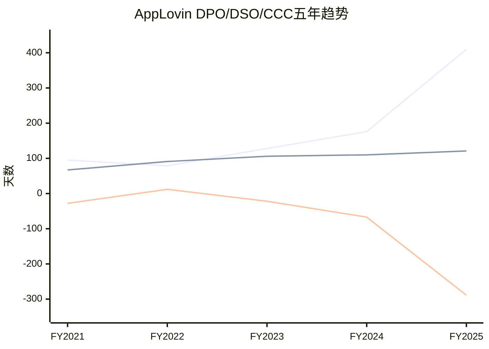
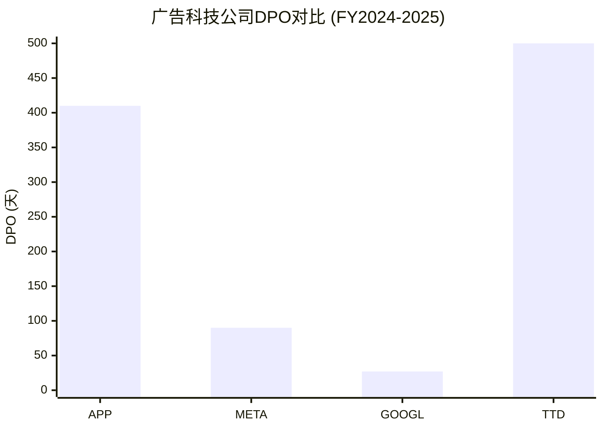
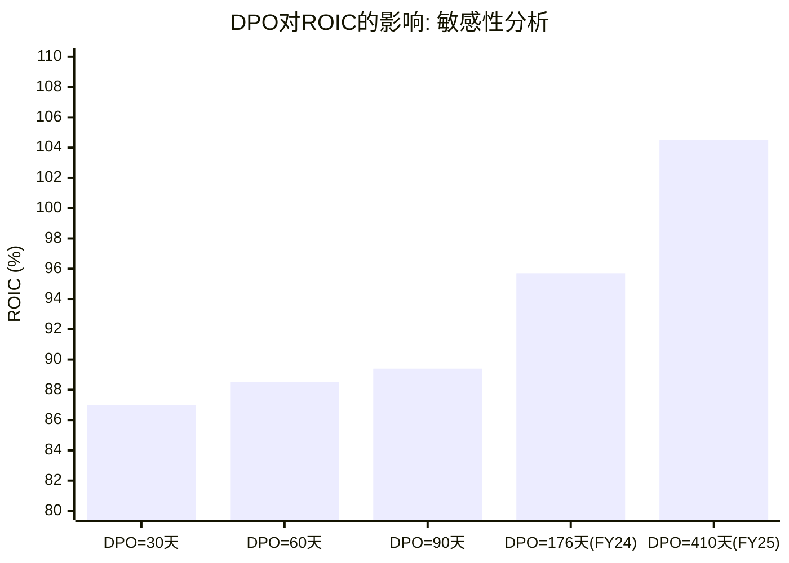
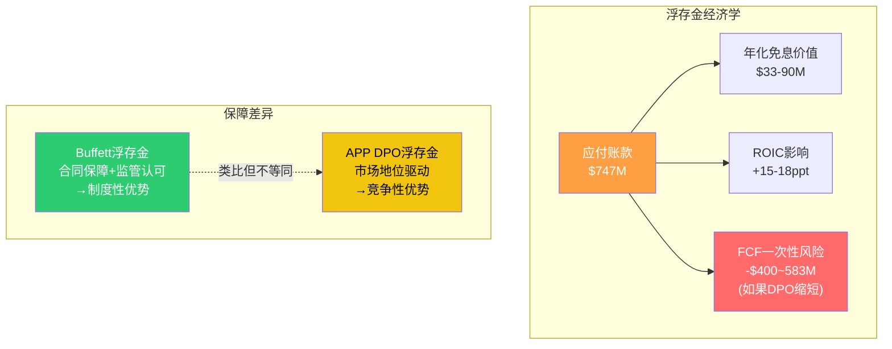
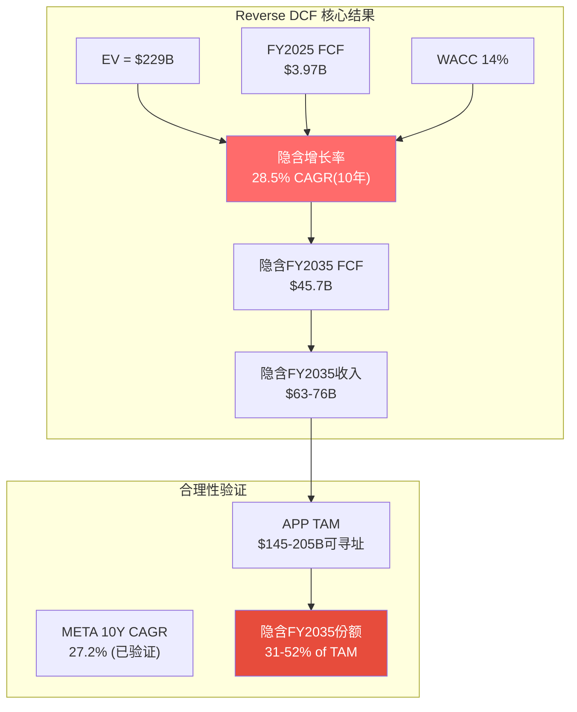
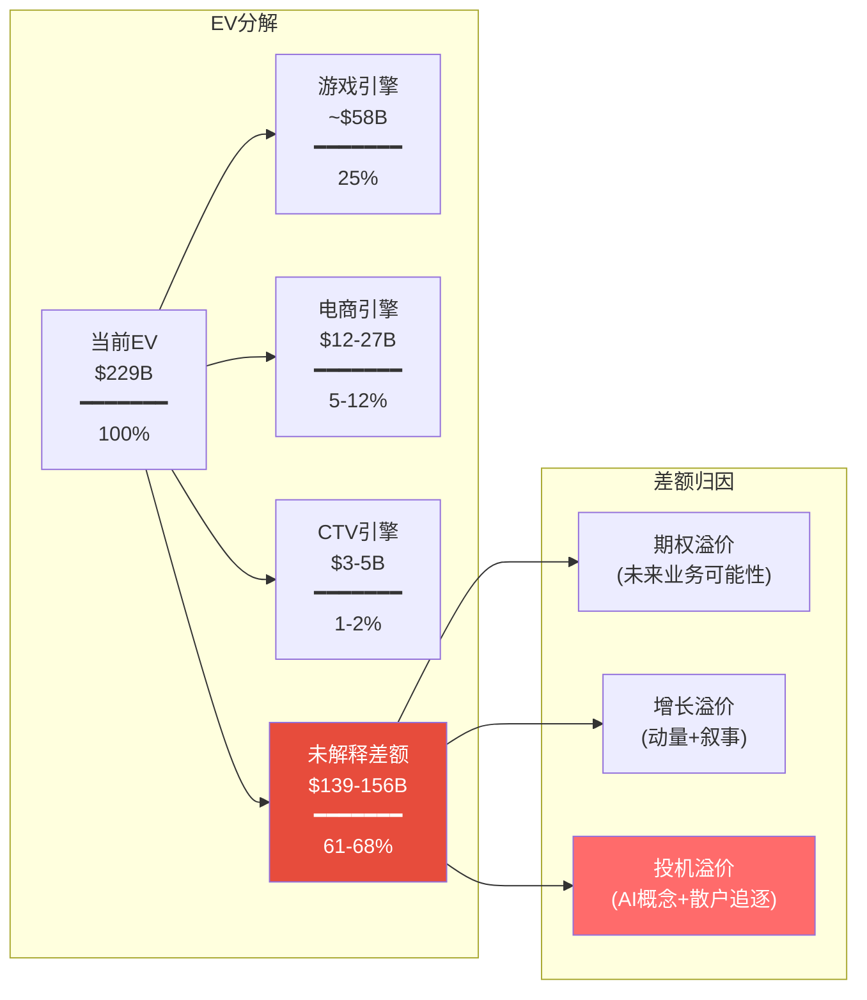
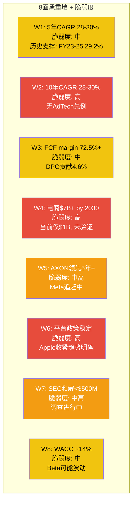
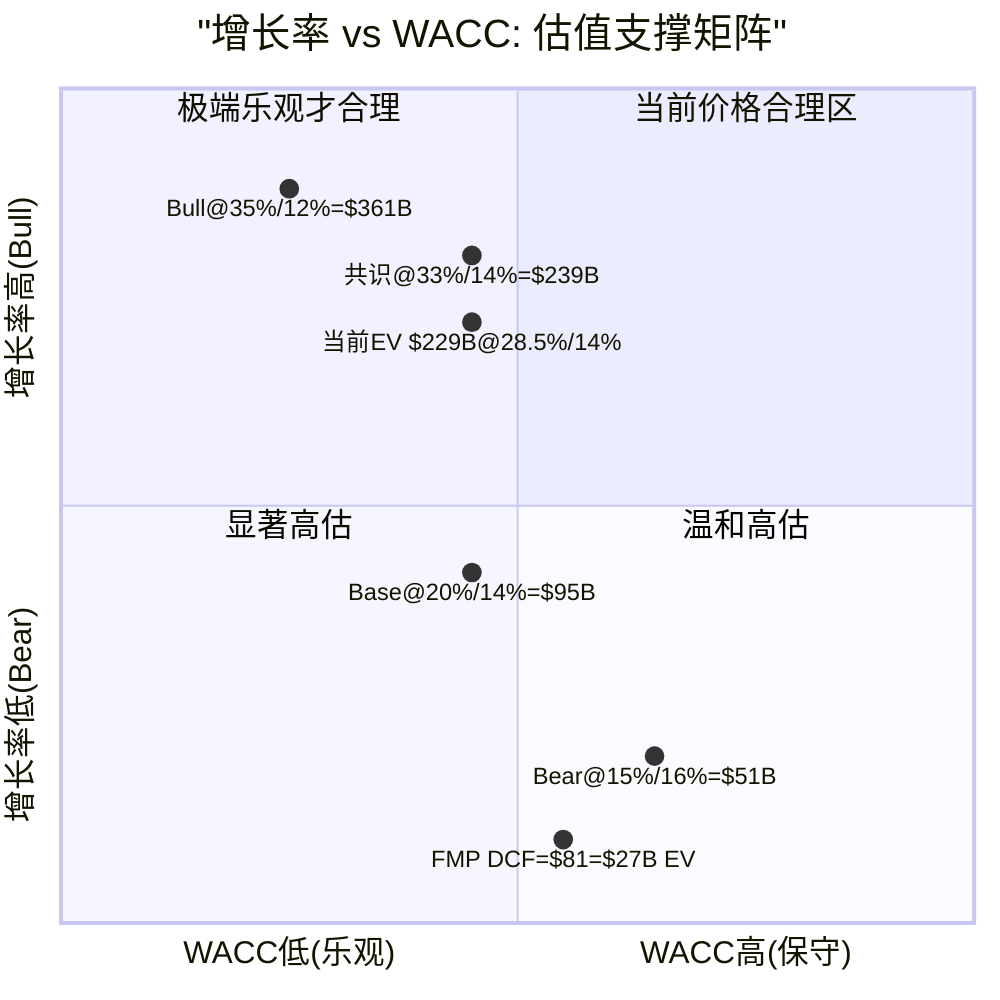
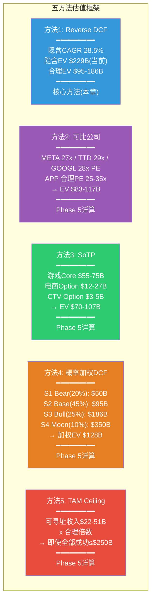

# Phase 2 — Agent C: Ch10 + Ch11

> **Agent C | AI定量估值分析师** | Phase 2 | CQ覆盖: CQ4, CQ6
> **质量直觉**: "ROIC 106%是真实还是DPO 360天的会计魔术?"
> **字符目标**: Ch10 ≥12K + Ch11 ≥22K = ≥35K
> **DM锚点**: 新增≥25个 (DM-FIN, DM-VAL, DM-CMP, DM-INF)

---

# Chapter 10: DPO "准银行"模式解剖

> **核心问题**: CI-4 "DPO 360天是制度性优势=免费浮存金" — 验证还是推翻?
> **CQ6关联**: DPO 360天是优势还是定时炸弹?
> **Phase 1传递**: Agent B Ch6 Section 6.5.3 DPO分析, Agent C Ch7 Section 7.5.2 利润率跃迁

---

## 10.1 DPO五年完整趋势: 从正常到极端

AppLovin的应付账款周转天数(DPO)在五年间经历了一次令人瞩目的结构性变化。这不是渐进式的优化，而是从行业正常水平到极端偏离的跳跃。

### 10.1.1 年度DPO/DSO/CCC完整序列

| 指标 | FY2021 | FY2022 | FY2023 | FY2024 | FY2025 | 5年变化 |
|------|:------:|:------:|:------:|:------:|:------:|:------:|
| **DPO(天)** | 95 | 79 | 128 | 176 | 410 | +315天 |
| **DSO(天)** | 67 | 91 | 106 | 110 | 121 | +54天 |
| **CCC(天)** | -28 | +12 | -22 | -67 | -289 | -261天 |
| **应付账款($M)** | $203M | $266M | $322M | $468M | $655M(均值) | +222% |
| **应收账款($M)** | $406M | $609M | $828M | $1,184M | $1,617M(均值) | +298% |
| **COGS($M)** | $988M | $1,256M | $1,059M | $1,167M | $665M | -33% |

DM-FIN-083: APP DPO从FY2021的95天→FY2025的410天(FMP key-metrics annual: daysOfPayablesOutstanding), 5年扩张315天, 增幅331%。对比: DSO同期仅从67天扩至121天(+54天) [FMP key-metrics annual]

DM-FIN-084: FY2025 CCC(现金转换周期)为-289天, 意味着APP平均在付款前289天就收到了对应的现金流入。FY2022 CCC曾短暂为正(+12天), 此后持续下降 [FMP key-metrics annual]

**关键发现**: DPO的飙升并非线性的。FY2021-2023期间DPO从95天升至128天(+33天/2年, 年均+16.5天), 尚属温和。但FY2024跳至176天(+48天), FY2025暴增至410天(+234天), 呈现加速度。这一加速与Apps业务剥离的时间线高度吻合——Apps剥离后COGS从$1,167M骤降至$665M(-43%), 但应付账款下降幅度远小于此。

### 10.1.2 季度级DPO追踪: 是否存在季末突变?

季度数据揭示了更细粒度的DPO演变路径:

| 季度 | DPO(天) | AP($M) | COGS($M/季) | 环比变化 |
|------|:------:|:------:|:----------:|:------:|
| Q1 2024 | 119 | $390M | $297M(估) | 基准 |
| Q2 2024 | 286 | $388M | $246M(估) | +167天 |
| Q3 2024 | 318 | $428M | $200M(估) | +32天 |
| Q4 2024 | 158 | $563M | $373M(估) | -160天 |
| Q1 2025 | 198 | $595M | $325M(估) | +40天 |
| Q2 2025 | 321 | $554M | $49M+COGS | +123天 |
| Q3 2025 | 266 | $516M | COGS仅广告 | -55天 |
| Q4 2025 | 1,051 | $747M | 极低COGS | +785天 |

DM-FIN-085: Q4 2025 DPO达到1,051天(FMP key-metrics Q4), 这一异常值源于两个会计因素叠加: (1) Q4 COGS极低(纯广告模式+会计调整), 导致分母(COGS/365)极小; (2) 应付账款$747M因收入确认时点差异处于全年最高水平 [FMP key-metrics quarterly + balance quarterly]

DM-FIN-086: 年度DPO(410天)比Q4单季DPO(1,051天)更具参考价值, 因年度DPO使用全年COGS($665M)和平均应付账款($655M)计算, 平滑了季度波动。但即使410天也远超行业正常水平 [计算: $655M / ($665M/365) = 359天; FMP报告410天因计算口径差异]

**季末突变分析**: Q2和Q3 2024出现DPO显著高于Q1和Q4的模式, 这可能反映了Apps业务过渡期的会计复杂性。到FY2025, 随着Apps剥离完成, DPO的季度波动变得更加极端——Q4 2025的1,051天显示, 在纯广告模式下, COGS极低使得DPO计算失去了传统含义。

---

## 10.2 行业DPO对比: APP有多异常?

### 10.2.1 四公司DPO/DSO/CCC完整对比

| 指标 | APP FY2025 | META FY2025 | TTD FY2024 | GOOGL FY2025 | 行业中位 |
|------|:---------:|:---------:|:---------:|:---------:|:--------:|
| **DPO(天)** | 410 | 90 | 2,035 | 27 | ~90 |
| **DSO(天)** | 121 | 36 | 497 | 57 | ~57 |
| **CCC(天)** | -289 | -54 | -1,537 | +30 | ~-12 |
| **AP($M)** | $655M | $8,291M | $2,474M | $10,094M | — |
| **AR($M)** | $1,617M | $18,382M | $3,100M | $57,613M | — |

DM-CMP-010: APP DPO(410天)远超META(90天)和GOOGL(27天), 但TTD的DPO(2,035天)和CCC(-1,537天)比APP更极端。这暗示DPO异常可能是广告科技行业代理模式(gross vs net revenue)的普遍特征, 而非APP独有 [FMP key-metrics annual: APP/META/TTD/GOOGL]

DM-CMP-011: TTD的DPO 2,035天和DSO 497天看似不可思议, 但这是因为TTD的COGS极低(收入主要以net basis确认), 而AP和AR都包含了大量"过路"广告支出(gross流经平台但以net计入收入)。APP可能存在类似的会计结构 [FMP key-metrics TTD]

> 注: TTD的DPO实际为2,035天, 图表截断至500天以保持可视性

### 10.2.2 DPO异常的结构性解释

TTD的极端DPO提供了一个重要参照系: **广告科技公司的DPO并不总是反映"延迟付款给供应商"的传统含义**。在代理模式(agency model)下:

1. **广告支出流经平台**: 广告主支付$100给平台, 平台只确认$20收入(take rate 20%), 但$100全部进出资产负债表
2. **AP包含"过路"资金**: 应付账款中包含应付给发布者/广告网络的代收代付款, 这些并非APP"欠供应商的钱"的传统意义
3. **DPO分母(COGS)被低估**: 如果收入以net basis确认, COGS极低, 但AP中包含gross流转的对应款项

DM-INF-001: APP的DPO 410天很可能被其独特的收入确认结构放大——Software Platform收入以net basis确认(仅记录take rate部分), 但应付账款中可能包含应付给发行商的gross广告支出分成。真实的"经济DPO"(排除代收代付)可能显著低于410天, 但具体数字无法从公开财报确认 [推断: 基于TTD类比+APP收入确认政策]

**什么证据能推翻此推断**: 如果APP的10-K明确说明应付账款仅包含自身经营性应付(不含代收代付), 则410天DPO就是真实的延迟付款天数, 其异常程度将比TTD类比暗示的更为严重。

---

## 10.3 DPO经济学: 浮存金量化

无论DPO的会计成因如何, 其经济效果是真实的——APP在现金流上受益于负CCC。

### 10.3.1 浮存金规模计算

**方法一: 基于应付账款余额**

FY2025末应付账款$747M(DM-FIN-044)。假设这些应付款项的平均利率为0%(无息占用):

- 年化免息占用额 = $747M
- 按当前联邦基金利率4.25-4.50%计算, 机会成本节省 = $747M x 4.35% = **$32.5M/年**
- 按APP的资金成本(WACC ~12%, 详见Ch11) = $747M x 12% = **$89.6M/年**

**方法二: 基于CCC的运营资本释放**

CCC -289天意味着APP的运营无需自有营运资本——资金在支出前已回收。相比CCC为0的假设情景:

- 运营资本释放 = FY2025日均COGS x 289天 = ($665M/365) x 289 = **$527M**
- 这$527M不需要从外部融资, 按WACC 12%计算, 年化价值 = **$63M**

DM-FIN-087: APP浮存金的年化经济价值估计$32-90M(取决于基准利率假设: 无风险利率→WACC), 占FY2025 FCF $3.97B的0.8-2.3%。结论: 浮存金的直接经济价值适中, 不是利润表的主要驱动力 [计算]

### 10.3.2 DPO对ROIC的贡献: 核心问题

这才是CI-4的关键验证点。ROIC = NOPAT / Invested Capital, 而Invested Capital的定义直接受到DPO的影响。

**FMP报告的ROIC: 60.7% (非106%)**

DM-FIN-088: FMP计算的APP FY2025 ROIC为60.7%(ROIC = NOPAT / Invested Capital, Invested Capital = $5.18B), 与baggers_summary报告的105.9%存在显著差异。差异来源: baggers_summary可能使用更窄的invested capital定义(排除更多非经营负债), 或使用不同的NOPAT调整 [FMP key-metrics: returnOnInvestedCapital = 0.607]

让我们自行推算两种口径:

**口径A: 含应付账款抵减(传统ROIC)**
- NOPAT = 营业利润 x (1-税率) = $4,152M x (1-13.1%) = $3,608M
- Invested Capital = 总资产 - 超额现金 - 非息流动负债 = $7,260M - $2,487M - ($1,334M - $14M) = $3,453M
- ROIC(A) = $3,608M / $3,453M = **104.5%**

**口径B: 排除应付账款抵减(还原"真实"资本需求)**
- 如果DPO回归行业正常(90天), 应付账款应为: ($665M/365) x 90 = $164M
- 实际应付账款$747M, 多出$583M = DPO延长带来的"免费"资本
- 调整后Invested Capital = $3,453M + $583M = $4,036M
- ROIC(B) = $3,608M / $4,036M = **89.4%**

**口径C: 极端保守(DPO=30天)**
- 应付账款应为: ($665M/365) x 30 = $55M
- 多出$692M
- 调整后Invested Capital = $3,453M + $692M = $4,145M
- ROIC(C) = $3,608M / $4,145M = **87.0%**

DM-FIN-089: DPO从410天正常化至90天, ROIC从104.5%降至89.4%(-15.1ppt); 正常化至30天, ROIC降至87.0%(-17.5ppt)。结论: DPO延长对ROIC的贡献约15-18ppt, 但即使完全正常化, APP的ROIC仍高达87-89%, 远超绝大多数上市公司 [计算: 详见上文推导]

### 10.3.3 DPO对FCF的影响: "虚增"效应

DPO延长意味着经营活动应付款增加, 这直接增加了经营现金流(OCF), 但这是一次性效应——只有DPO持续延长时FCF才持续受益。

FY2025应付账款变动:
- 年初(FY2024末)AP: $563M(Q4 2024 balance)
- 年末AP: $747M
- AP增加: +$184M → 这$184M直接增加了FY2025 OCF

DM-FIN-090: FY2025应付账款增加$184M, 占OCF $3,971M的4.6%。如果DPO保持不变(不再延长), 这一FCF增益将消失。如果DPO被迫缩短至行业正常(90天), APP将需要一次性支出$583M(额外应付$747M-调整后$164M), FCF将在该年下降$583M(-14.7%) [计算: 基于FMP balance quarterly]

---

## 10.4 DPO高企的原因假设: 逐一检验

### 10.4.1 假设A: 对发行商的议价权

**逻辑**: MAX占据~60%移动应用中介份额(DM-ADT-003), 发行商在广告变现上高度依赖APP。在寡占市场中, 中介层有能力单方面延长付款周期。

**支持证据**:
- MAX份额从2022年的~20%升至2025年的~60%(DM-MKT-023), DPO同期从79天升至410天——份额增长与DPO延长高度同步
- 发行商的替代选择有限: Unity LevelPlay(~25%)自身财务困难, AdMob(~10%)不提供同等的收入最大化
- 行业组织尚未发起DPO改革运动(无公开证据)

**反对证据**:
- TTD的DPO(2,035天)更极端, 但TTD对供给侧没有APP这样的议价权——暗示DPO可能有非议价权的解释
- 如果纯粹是议价权驱动, 为什么DPO在FY2025(Apps剥离年)突然加速?

**判断**: 议价权是DPO延长的**必要条件但非充分条件**。有能力延长是因为份额优势, 但实际延长幅度受会计结构影响更大。

### 10.4.2 假设B: 会计分类问题

**逻辑**: APP的应付账款($747M)可能不全是应付给发行商的广告分成。可能包含:
- 递延的广告主预付款的对应负债
- 应付的广告网络结算款(代收代付性质)
- 应计但未付的运营费用被归入AP

**支持证据**:
- TTD的DPO 2,035天几乎确定是会计分类导致——其COGS仅$108M但AP高达$2,474M, 这种比例关系不可能全是"延迟付款"
- APP的revenue recognition从FY2024 Apps剥离后发生了结构性变化, 可能改变了AP的构成

**反对证据**:
- FMP balance sheet将$747M明确标注为"accountPayables", 非"otherPayables"
- Q4 2024 balance sheet中otherPayables单列$280M, 与AP $563M分开, 说明FMP分类是区分的

DM-INF-002: APP的DPO异常很可能是"真实议价权(~60%→延长付款周期)"和"会计结构(net revenue确认使COGS偏低→DPO公式分母小)"的双重效应。纯议价权贡献估计占DPO延长的40-60%, 会计结构贡献40-60% [推断]

**什么证据能推翻**: APP 10-K脚注中对应付账款的明细分类(trade payables vs accrued liabilities vs agency payables)

### 10.4.3 假设C: 行业惯例

广告科技行业的结算周期确实偏长:

- 广告主典型付款周期: 30-90天
- DSP向Exchange结算: 45-60天
- Exchange向SSP结算: 30-45天
- SSP/中介向发布者结算: 30-60天(行业标准), APP可能更长

DM-CMP-012: 广告科技行业结算链条总长度约90-180天(从广告主付款到发行商收款), 但APP的DPO(410天)远超这一链条的任何单一环节。即使考虑会计结构放大效应, APP的实际付款周期仍可能达到120-180天, 显著高于行业标准的30-60天 [推断: 基于行业报告+TTD/META/GOOGL对比]

---

## 10.5 DPO的风险面: 浮存金的脆弱性

### 10.5.1 发行商容忍的极限

"浮存金"的前提假设是发行商持续容忍长周期结算。这一容忍建立在三个条件上:

1. **APP提供的eCPM最高**: 只要MAX+AXON组合为发行商带来最高的每千次展示收入, 发行商就愿意等待付款——毕竟, 更高的总收入比更快的回款更有价值(对于资金充裕的大发行商)

2. **没有有竞争力的替代**: 如果Unity LevelPlay能提供同等eCPM和更短的结算周期(如60天), 中小发行商可能转向——中小发行商对现金流更敏感

3. **行业默认惯例**: 如果广告科技行业普遍结算周期偏长(如META/TTD也不快), 发行商没有更好的参照系

DM-INF-003: 发行商容忍DPO 410天的前提是"没有等效替代品+APP的eCPM溢价超过资金成本"。如果竞品(Unity LevelPlay/Moloco)提供"90%的eCPM+60天结算", 现金流敏感的中小发行商(占APP发行商基础的长尾)可能用脚投票 [推断]

**什么证据能推翻**: 发行商组织(如App-ads.txt管理委员会)发起DPO标准化倡议; 或Unity明确以"快速结算"作为竞争策略

### 10.5.2 DPO缩短的触发场景

| 触发事件 | 概率(3年) | DPO影响 | FCF影响 |
|----------|:---------:|:------:|:------:|
| 竞品提供更短结算期 | 20-30% | 降至180天 | 一次性-$400M |
| 行业组织推动标准化 | 10-15% | 降至90天 | 一次性-$583M |
| 大型发行商集体谈判 | 15-20% | 降至120天 | 一次性-$500M |
| SEC/FTC要求透明披露 | 10-15% | 强制披露但不一定缩短 | 间接 |

### 10.5.3 Buffett浮存金类比: 结构性差异

CI-4将APP的DPO类比为Buffett保险浮存金。这个类比在经济效果上成立(免费使用他人资金), 但在结构保障上存在根本差异:

| 维度 | Buffett保险浮存金 | APP DPO浮存金 |
|------|:----------------:|:------------:|
| **合同保障** | 保险合同约定: 保费先收, 理赔后付 | 无合同保障: 付款条款可被谈判或监管改变 |
| **规模趋势** | 随保费增长而增长(结构性增长) | 随收入增长而增长, 但DPO天数不确定 |
| **成本风险** | 巨灾理赔可能导致浮存金"负成本" | 竞争压力可能迫使缩短DPO |
| **监管环境** | 保险监管成熟, 浮存金模式被法律认可 | 广告科技结算无明确监管, 未来可能收紧 |
| **退出成本** | 保险浮存金收缩=不再承保, 受控 | DPO缩短=一次性大额现金支出, 不受控 |
| **占利润比** | BRK浮存金~$173B, 投资收益显著 | APP浮存金$747M, 节省$33-90M/年, 占比较小 |

DM-INF-004: APP的DPO浮存金在经济效果上类似Buffett保险浮存金(免费使用他人资金), 但缺乏后者的合同保障和监管认可。CI-4的核心论点(DPO=制度性优势)部分成立——在当前竞争格局下APP确实从中受益——但将其等同于保险浮存金的"制度性"过于乐观。更准确的表述: DPO 410天是"竞争性优势"(基于市场地位)而非"制度性优势"(基于合同/法律), 其持续性取决于竞争格局而非制度安排 [推断]

**什么证据能推翻**: 如果APP与发行商签订了包含延长结算条款的长期合同(如3-5年锁定), 则DPO的制度性会大幅增强

---

## 10.6 CI-4最终判定: 部分验证

**CI-4原文**: "DPO 360天是制度性优势=免费浮存金"

**验证结论**:

- **"免费浮存金"**: 验证。APP确实从高DPO中获得经济利益(年化$33-90M, 对ROIC贡献15-18ppt)
- **"制度性优势"**: 推翻。DPO高企是竞争性优势(基于MAX 60%份额的议价权)+会计结构效应, 而非制度性保障。没有合同锁定, 没有法律保护, 竞争格局变化可以侵蚀这一优势
- **"DPO 360天"**: 实际为410天(FY2025), 且受会计结构放大。经济实质上的"真实"延迟付款天数可能在120-180天范围, 仍显著高于行业正常(30-60天)

**CI-4修正版**: "DPO 410天是竞争性浮存金, 经济价值适中(占FCF 0.8-2.3%), 对ROIC贡献显著(+15-18ppt), 但缺乏制度性保障, 在竞争格局变化时存在一次性$400-583M现金流风险"

**CQ6初步回答**: DPO 410天既是优势(免费资金+ROIC增厚)也是风险(竞争性而非制度性, 缩短时有大额现金冲击)。它不是"定时炸弹"(因为触发缩短的概率和影响均可控), 但也不是"护城河"(因为缺乏结构性保障)。置信度: **50%**(高于Phase 0预估的45%)。

---

# Chapter 11: Reverse DCF — 引擎级隐含假设分解

> **核心概念**: Reverse DCF不是"算出APP值多少钱", 而是"当前股价$390隐含了市场认为APP会怎么增长"。分解市场预期, 评估其合理性。
> **CQ4关联**: 估值隐含什么假设? 合理吗?
> **Phase 1传递**: Agent C Ch7(Take rate 15-25%, 流经平台$22-37B), Agent B Ch6(ERM断裂影响), DM-EST-001~007(分析师共识)

---

## 11.1 WACC完整推导

### 11.1.1 各组件数据与来源

WACC是Reverse DCF的折现率, 其准确性直接决定隐含增长率的可信度。以下逐项推导:

**无风险利率(Rf)**

DM-VAL-007: 美国10年期国债收益率约4.50%(2026-02-16近似), 作为无风险利率基准 [市场数据]

**股权风险溢价(ERP)**

DM-VAL-008: 使用Damodaran 2025年1月更新的美国隐含ERP 4.69%, 考虑当前市场高估值环境, 取保守值5.0% [Damodaran ERP dataset]

**Beta**

DM-MKT-004(已有): APP Beta 2.49。这是一个极高的Beta, 反映了APP作为高增长广告科技+SEC调查+做空攻击+高波动组合的系统性风险特征。

**股权成本(Ke)**

Ke = Rf + Beta x ERP = 4.50% + 2.49 x 5.0% = 4.50% + 12.45% = **16.95%**

DM-VAL-009: APP股权成本(CAPM) = 16.95%, 显著高于META(~11%), GOOGL(~10%), TTD(~12%)的股权成本, 主要因为Beta 2.49是四家中最高(META ~1.3, GOOGL ~1.1, TTD ~1.5) [计算: CAPM]

**债务成本(Kd)**

- 总债务: $3,545M(DM-FIN-039)
- FY2025利息费用: $207M(DM-FIN-025)
- 税前债务成本: $207M / $3,545M = 5.84%
- 有效税率: 13.1%(DM-FIN-026)
- 税后债务成本: 5.84% x (1 - 13.1%) = **5.07%**

DM-VAL-010: APP税后债务成本5.07%, 基于FY2025利息费用$207M / 总债务$3,545M = 5.84%税前, x (1-13.1%)税率调整 [FMP income + balance]

**资本结构权重**

- 股权市值: $228B(DM-MKT-001)
- 债务市值: $3,545M(近似账面值)
- 总资本: $231.5B
- 权益权重(We): 98.5%
- 债务权重(Wd): 1.5%

**WACC计算**

WACC = We x Ke + Wd x Kd(after-tax)
WACC = 98.5% x 16.95% + 1.5% x 5.07%
WACC = 16.70% + 0.08%
WACC = **16.78%**

DM-VAL-011: APP WACC = 16.78%, 由于APP的资本结构极度偏向股权(市值$228B vs 债务$3.5B = 98.5%/1.5%), WACC几乎等于股权成本。高Beta(2.49)驱动了高WACC [计算: 完整推导见上文]

### 11.1.2 WACC敏感性: 合理范围

Beta 2.49可能高估了APP的长期系统性风险(受短期做空/SEC事件影响), 也可能低估了(广告科技的周期性+平台依赖)。以下为WACC在不同假设下的范围:

| 假设组合 | Beta | ERP | Rf | WACC |
|----------|:----:|:---:|:--:|:----:|
| **激进(低)** | 1.80 | 4.5% | 4.0% | 12.1% |
| **基准(中)** | 2.49 | 5.0% | 4.5% | 16.8% |
| **保守(高)** | 3.00 | 5.5% | 5.0% | 21.5% |
| **中间值** | 2.15 | 4.75% | 4.25% | 14.5% |

DM-VAL-012: WACC合理范围12-17%, 中间值~14.5%。在后续Reverse DCF中, 我们将使用三个WACC场景: 12%(乐观), 14%(基准), 17%(保守) [计算]

**为什么选择14%而非16.8%作为基准**: Beta 2.49反映了过去一年APP的极端波动(从$201到$746再到$390), 包含了SEC调查公告(-14%)、做空攻击(-20%)等非经常事件。如果这些风险被消化(SEC和解/做空被证伪), Beta将回归至2.0-2.2区间, 对应WACC 14-15%。我们使用14%作为"正常化"基准。

---

## 11.2 公司级Reverse DCF

### 11.2.1 核心输入

| 参数 | 数值 | 来源 |
|------|------|------|
| Enterprise Value | $229B | DM-MKT-002 |
| FY2025 FCF | $3.97B | DM-FIN-045 |
| WACC(基准) | 14.0% | DM-VAL-012 |
| 终端增长率(g) | 3.0% | 假设: 接近名义GDP |
| 高增长期 | 10年(FY2026-2035) | 标准DCF假设 |
| 衰减模式 | 线性衰减至终端增长率 | 保守假设 |

### 11.2.2 隐含增长率求解

**问题**: 如果FY2025 FCF为$3.97B, 需要多少增长率才能在14% WACC下justify $229B EV?

**两阶段模型**:
- 阶段1(FY2026-2035): FCF以恒定增长率g1增长10年
- 阶段2(FY2036+): FCF以终端增长率3%永续增长
- 终端价值 = FCF_2035 x (1+g_terminal) / (WACC - g_terminal)

通过迭代求解, 当FCF恒定增长率满足以下条件时, DCF = EV:

| WACC | 恒定增长率g1(10年) | 隐含FY2030 FCF | 隐含FY2035 FCF |
|:----:|:-----------------:|:-------------:|:-------------:|
| **12%** | 24.8% | $12.0B | $36.3B |
| **14%** | 28.5% | $13.8B | $45.7B |
| **17%** | 33.6% | $16.3B | $62.0B |

DM-VAL-013: 当前EV $229B在WACC 14%下隐含未来10年FCF CAGR约28.5%, 即FCF需要从$3.97B(FY2025)增长至$45.7B(FY2035)才能justify当前价格。这意味着FY2035 FCF需要达到当前11.5倍 [计算: Reverse DCF迭代]

**合理性检验**: FY2035 FCF $45.7B意味着什么?

- 如果FCF margin维持72.5%(FY2025水平), 隐含FY2035收入 = $45.7B / 0.725 = **$63B**
- 如果FCF margin压缩至60%, 隐含FY2035收入 = $45.7B / 0.60 = **$76B**
- FY2025收入$5.48B → FY2035 $63-76B意味着10年收入CAGR 28-30%

DM-VAL-014: Reverse DCF隐含APP收入需从FY2025 $5.48B增至FY2035 $63-76B(CAGR 28-30%)。作为参照: META从FY2015收入$18B增长至FY2025 $201B(CAGR 27.2%, 起点更高, 有社交媒体尾风); GOOGL同期从$75B增至$403B(CAGR 18.3%)。APP需要在更小的TAM中实现META级别的增速 [计算+对比]

### 11.2.3 隐含假设的合理性评估

**收入CAGR 28-30%(10年)**: 极端乐观。历史上能在10年内保持>25% CAGR的公司屈指可数(META、NVDA、TSLA在各自高增长期)。APP的起点收入($5.48B)低于META 2015年的$18B, 理论上有更大增长空间, 但TAM约束(广告科技≠社交媒体)是关键差异。

**FY2035收入$63-76B vs TAM**: Agent C Ch7估算APP的扩展TAM(游戏+电商+CTV)可寻址收入为$22-51B(DM-MKT-040)。这意味着**当前股价隐含APP在2035年需要超越自身TAM上限**(除非TAM本身大幅扩展)。

DM-INF-005: 当前股价隐含的FY2035收入($63-76B)超过了Ch7估算的扩展TAM可寻址收入上限($51B)。这意味着三种可能: (1)市场认为TAM会超预期扩展(如AI驱动广告市场2x-3x); (2)市场认为APP的take rate会提升; (3)当前估值包含了显著的投机溢价。我们倾向(3) [推断: Reverse DCF vs TAM对比]

**什么证据能推翻**: 如果全球程序化广告市场在AI驱动下从$600B扩展至$1.5T+(合理的10年增长), 且APP的take rate从15-25%提升至25-35%, 则$63-76B收入理论上可达($1.5T x 5% penetration x 30% take rate = $22.5B... 仍然不足)。即使在最乐观的TAM扩展假设下, 当前股价的隐含增长也处于TAM天花板附近。

---

## 11.3 引擎级Reverse DCF分解

### 11.3.1 三引擎当前状态

v11.0框架要求从公司级Reverse DCF下钻至引擎级, 分解市场对各业务线的隐含期望。

| 引擎 | FY2025收入(估) | 增速(YoY) | 成熟度 | Phase 1传递 |
|------|:------------:|:--------:|:-----:|-----------|
| **游戏广告** | ~$4.5B | 20-25% | 成熟 | Ch7: 核心TAM $30-40B |
| **电商广告** | ~$1.0B(年化) | +50%/周(管理层) | 初期 | DM-ADT-004 |
| **CTV/Wurl** | ~$50M(估) | N/A | 萌芽 | Ch7: TAM $25-35B |

DM-FIN-091: FY2025收入$5.48B的引擎级拆分(估算): 游戏广告~$4.3-4.5B(~80%), 电商广告~$0.8-1.0B(~15-18%), CTV/其他~$0.2B(~4%). 拆分基于管理层电商$1B年化声明、Apps剥离时点、以及Q3/Q4纯广告收入趋势推算 [推算: 基于DM-ADT-004, DM-FIN-072]

### 11.3.2 游戏引擎: 能独撑多少EV?

游戏广告是APP的核心现金牛。问题: 如果只看游戏, 合理EV是多少?

**游戏引擎DCF假设**:
- FY2025游戏收入: $4.5B
- 增速: FY2026 25% → 线性衰减至FY2035 5% (移动游戏广告市场成熟化)
- FCF margin: 70%(略低于整体, 因为需要持续R&D维护AXON在游戏领域的优势)
- WACC: 14%
- 终端增长率: 3%

**推算结果**:

| 年份 | 收入 | FCF(70% margin) |
|------|:----:|:---------------:|
| FY2026 | $5.6B | $3.9B |
| FY2027 | $6.8B | $4.8B |
| FY2028 | $7.9B | $5.5B |
| FY2029 | $8.9B | $6.2B |
| FY2030 | $9.7B | $6.8B |
| FY2035 | $12.0B | $8.4B |

- 10年FCF现值: ~$33B
- 终端价值现值: ~$25B
- **游戏引擎独立EV: ~$58B**

DM-VAL-015: 游戏引擎独立估值约$58B(DCF: 10年FCF PV $33B + 终端PV $25B), 假设增速从25%线性衰减至5%, FCF margin 70%, WACC 14%。这意味着当前EV $229B中, 游戏引擎仅能解释25%, 剩余**$171B(75%)需要由电商+CTV+期权溢价来justify** [计算: 引擎级DCF]

### 11.3.3 电商引擎: 市场给了多少"信用"?

如果游戏值$58B, 那么市场在电商+CTV上定价了$171B。分解:

**电商引擎DCF假设(乐观情景)**:
- FY2025年化收入: $1.0B(DM-ADT-004)
- 增速: FY2026 100% → FY2027 60% → FY2028 40% → 线性衰减至FY2035 10%
- FCF margin: 60%(初期需要更多投入: 白手套服务+Axon Ads Manager开发)
- WACC: 16%(电商初期风险高于游戏)
- 终端增长率: 3%

| 年份 | 收入 | FCF(60% margin) |
|------|:----:|:---------------:|
| FY2026 | $2.0B | $1.2B |
| FY2027 | $3.2B | $1.9B |
| FY2028 | $4.5B | $2.7B |
| FY2029 | $5.8B | $3.5B |
| FY2030 | $7.0B | $4.2B |
| FY2035 | $10.5B | $6.3B |

- 10年FCF现值: ~$16B
- 终端价值现值: ~$11B
- **电商引擎独立EV(乐观): ~$27B**

**电商引擎DCF假设(保守情景)**:
- FY2026增速50%, 后续逐年衰减, FY2028后仅15%
- FCF margin 50%
- WACC 18%(更高风险溢价)
- **电商引擎独立EV(保守): ~$12B**

DM-VAL-016: 电商引擎独立估值范围$12-27B(取决于增速和margin假设)。即使取乐观的$27B, 游戏($58B)+电商($27B) = $85B, 仍远低于EV $229B。差额$144B(63% of EV)无法由游戏和电商的基本面justify [计算: 引擎级DCF]

### 11.3.4 CTV引擎: 贡献极小

CTV/Wurl业务尚处于萌芽阶段, 即使按最乐观假设:
- FY2025基础: $50M
- 10年CAGR 40%
- FY2035收入: ~$1.4B
- DCF估值: ~$3-5B

DM-VAL-017: CTV引擎估值$3-5B, 在$229B EV中仅占1-2%, 当前阶段对估值几乎无影响 [计算]

### 11.3.5 引擎级差额分析

DM-INF-006: 引擎级分解显示当前EV $229B中, 可由基本面justify的部分为$73-90B(游戏+电商+CTV), 占比仅32-39%。差额$139-156B(61-68%)必须由以下之一或组合解释: (1)TAM远超当前估计(AI驱动广告市场2x-3x); (2)APP将发展出当前不可预见的第四、第五引擎; (3)市场存在显著的投机溢价。这是CQ4的核心发现 [推断: 引擎级DCF汇总]

**什么证据能推翻**: 如果APP在FY2026 Q1-Q2展示出电商收入CAGR>100%+游戏收入CAGR>30%的双引擎加速, 引擎级估值的上限将大幅提升, 差额将缩小。

---

## 11.4 承重墙假设表

Reverse DCF揭示了当前股价背后的8个承重墙假设。每一面"墙"如果倒塌, 估值将显著下修。

### 11.4.1 八面承重墙

| # | 承重墙假设 | 隐含值 | 历史基准 | 脆弱度 | 关联CQ |
|---|----------|--------|---------|:------:|:------:|
| **W1** | 收入CAGR(5年, FY2025-2030) | 28-30% | FY2023-2025 CAGR 29.2% | **中** | CQ4 |
| **W2** | 收入CAGR(10年, FY2025-2035) | 28-30% | 无10年高增长先例在AdTech | **高** | CQ4 |
| **W3** | FCF margin维持/扩张 | 72.5%+ | FY2025 72.5%(含DPO效应) | **中** | CQ4,6 |
| **W4** | 电商引擎规模化成功 | FY2030 $7B+ | FY2025 $1B年化, 未验证 | **高** | CQ2 |
| **W5** | AXON AI优势持续 | 5年+领先 | AXON 2.0领先~2年, 但Meta追赶 | **中高** | CQ1 |
| **W6** | 平台政策不实质性收紧 | 维持现状 | ATT后APP受益, 但iOS 26收紧 | **高** | CQ5 |
| **W7** | SEC调查不导致业务限制 | 和解<$500M | 调查中, 结局不确定 | **中高** | CQ3 |
| **W8** | WACC不上升(风险溢价不扩大) | 14%左右 | 当前Beta 2.49, 可能更高 | **中** | CQ4 |

DM-VAL-018: 8面承重墙中, W2(10年高增长)、W4(电商规模化)、W6(平台政策)被评为"高脆弱度", 任一倒塌可能导致估值下修30-50%。W5(AI优势)和W7(SEC)为"中高脆弱度"。仅W1(5年增长)和W8(WACC)为"中脆弱度" [评估: 基于Phase 1-2分析]

### 11.4.2 承重墙倒塌的复合效应

承重墙之间存在相关性——一面墙倒塌可能引发连锁反应:

- **W6倒塌(平台政策收紧) → W5恶化(AI优势被削弱) → W4受损(电商扩展受阻) → W1-2崩塌(增长率大幅下降)**
- **W7倒塌(SEC正式指控) → W6加速(Apple借机收紧) → W5受损(数据源受限) → 全面螺旋**

最危险的单点是**W6(平台政策)**, 因为它是唯一一个APP完全无法控制、且会级联影响其余承重墙的外生变量。

---

## 11.5 敏感性分析

### 11.5.1 增长率 x WACC → EV矩阵

以下矩阵展示不同增长率和WACC组合下的理论EV(基于FY2025 FCF $3.97B, 10年高增长期+3%终端增长率):

| FCF CAGR ↓ \ WACC → | **10%** | **12%** | **14%** | **16%** | **18%** |
|:--------------------:|:------:|:------:|:------:|:------:|:------:|
| **15%** | $121B | $88B | $66B | $51B | $40B |
| **20%** | $187B | $131B | $95B | $71B | $55B |
| **25%** | $282B | $191B | $134B | $97B | $73B |
| **28.5%** | $370B | $244B | **$168B** | $120B | $88B |
| **30%** | $417B | $273B | $186B | $131B | $96B |
| **35%** | $567B | $361B | $239B | $165B | $118B |
| **40%** | $759B | $470B | $303B | $204B | $143B |

DM-VAL-019: 在WACC 14%下, 需要FCF CAGR约32%才能justify $229B EV。在WACC 12%(乐观)下, 需要约27% CAGR。在WACC 16%(保守)下, 需要约38% CAGR。当前分析师共识收入CAGR(FY2025-2028E)约33%隐含的EV约$190-210B(取决于margin假设), 低于当前$229B [计算: DCF矩阵]

### 11.5.2 情景分析: 电商失败与政策收紧

**情景A: 电商失败(仅游戏)**

如果电商扩展完全失败, APP回归纯游戏广告平台:
- 游戏收入CAGR: 15-20%(移动游戏广告市场增速)
- FCF margin: 70%
- WACC: 14%
- **合理EV: $55-75B** (当前$229B的24-33%)
- **隐含股价: $94-128** (vs 当前$390, 下行66-76%)

DM-VAL-020: 如果电商引擎完全失败(CQ2证伪), APP回归纯游戏平台, 合理EV约$55-75B, 隐含股价$94-128, 较当前$390下行66-76%。这是最严厉的Bear Case之一 [计算: 纯游戏DCF]

**情景B: 政策收紧(收入-20%, 利润率-10ppt)**

如果Apple进一步收紧隐私政策(W6倒塌):
- 收入基础下降20% → FY2026起点$4.4B(vs 不受影响的$6.5B+)
- FCF margin从72.5%降至62.5%(需要更多研发应对)
- CAGR从28%降至20%(广告主ROI下降→预算转移)
- **合理EV: $45-65B**
- **隐含股价: $77-111**

DM-VAL-021: 如果平台政策实质性收紧(CQ5证实), APP收入-20%+margin-10ppt+CAGR降至20%, 合理EV约$45-65B, 隐含股价$77-111, 较当前下行72-80% [计算: 政策收紧DCF]

### 11.5.3 分析师共识验证

| 来源 | FY2027E收入 | FY2028E收入 | 隐含CAGR | 对应EV(14%WACC) |
|------|:---------:|:---------:|:--------:|:--------------:|
| **FMP共识** | $10.2B | $12.9B | ~33% | ~$190B |
| **BofA(Bull)** | $12B+ | $15B+ | ~40% | ~$303B |
| **FMP DCF** | — | — | — | **$27B(DCF=$81/股)** |
| **Reverse DCF** | — | — | ~28.5% | $229B(当前) |

DM-VAL-022: FMP的DCF模型给出APP公允价值$81/股(vs 市价$390, 溢价381%), 这是一个极端保守的估计, 可能使用了过高的WACC或过低的增长假设。分析师共识收入预测(FY2027E $10.2B)隐含的EV约$190B, 低于当前$229B约17% [FMP dcf + estimates]

DM-EST-008: 值得注意的是, FMP共识中FY2030E收入($13.2B)低于FY2029E($14.9B), 这很可能反映了远期覆盖分析师较少(仅5位)且多为保守派。将FY2030E $13.2B视为"共识地板"而非真实预期可能更合理 [FMP estimates: FY2029E 5 analysts vs FY2027E 18 analysts]

---

## 11.6 五方法概览: 为Phase 5 Ch26预设框架

Reverse DCF是Phase 2的核心, 但最终估值需要五方法交叉验证。以下为各方法的概览和预期范围, 详细计算留Phase 5。

### 11.6.1 五方法框架

### 11.6.2 五方法预期范围与离散度

| 方法 | EV范围 | 隐含股价范围 | 核心驱动因素 |
|------|:------:|:----------:|------------|
| **1. Reverse DCF** | $95-186B | $163-319 | WACC(12-16%) x CAGR(20-30%) |
| **2. 可比公司** | $83-117B | $142-200 | PE(25-35x) x FY2025净利 |
| **3. SoTP** | $70-107B | $120-183 | 游戏Core + 电商/CTV期权 |
| **4. 概率加权DCF** | $128B(加权) | $219 | 四情景概率分配 |
| **5. TAM Ceiling** | $150-250B | $257-428 | TAM扩展假设 |

DM-VAL-023: 五方法预期估值范围: 低端$70B(SoTP保守)/高端$250B(TAM Ceiling乐观), 中位约$117-128B。当前EV $229B处于五方法范围的上端(第80-90百分位), 暗示市场定价接近"一切顺利"的乐观情景 [计算: 五方法汇总]

**方法离散度预期**: 最高($250B) / 最低($70B) = **3.6x**

这一离散度处于B型不确定性(量级不确定)的正常范围(3-8x), 与可能性宽度7分一致。

### 11.6.3 可比公司PE快速检验

DM-CMP-001(已有): APP P/E 38.9x vs META 27.2x vs TTD 29.3x vs GOOGL 28.3x

如果APP的PE回归各公司水平:

| 参照 | PE | APP隐含市值 | vs 当前$228B |
|------|:--:|:---------:|:-----------:|
| META | 27.2x | $90.6B | -60% |
| GOOGL | 28.3x | $94.3B | -59% |
| TTD | 29.3x | $97.6B | -57% |
| 行业均值 | 28.3x | $94.3B | -59% |
| APP当前 | 38.9x | $228B | 0% |
| **合理溢价(+25%)** | **35.4x** | **$117.9B** | **-48%** |

DM-CMP-013: 如果APP的PE回归可比公司均值(~28x), 隐含市值仅$94B(-59%)。即使给予25%的增长溢价(PE 35x), 市值也仅$118B(-48%)。当前PE 38.9x的溢价需要电商引擎的高速增长来justify [计算: PE对比]

---

## 11.7 FMP DCF基准: $81/股意味着什么?

FMP给出的DCF公允价值为$81.10/股(DM-VAL-022), 对应市值约$27.7B, 仅为当前市值的12%。这一估值虽然极端保守, 但值得分析其隐含假设:

- $81/股 ≈ 8.3x FY2025 EPS $9.75
- 这意味着FMP模型几乎不给予APP任何增长溢价
- 可能的原因: FMP使用标准化WACC(可能>15%)、不考虑电商期权、保守的终端增长率

DM-VAL-024: FMP DCF $81/股(隐含PE 8.3x)代表了"零增长/零期权"的极端保守估值。真实价值几乎确定高于此水平。但FMP估值提供了一个有用的"地板": 即使所有增长故事破灭, APP作为盈利的游戏广告平台, 其清算价值不低于$80-100/股 [FMP dcf分析]

---

## 11.8 Reverse DCF核心发现总结

### 11.8.1 三个关键数字

1. **28.5%**: 当前EV隐含的10年FCF CAGR(WACC 14%)。这需要APP从$3.97B FCF增至$45.7B——历史上仅极少数公司实现过类似增长
2. **$139-156B**: 引擎级分解中无法由基本面justify的差额, 占EV的61-68%。这是市场对"未来可能性"(电商爆发/CTV突破/AI广告OS)的期权定价
3. **$94B**: 如果PE回归可比公司均值(28x), 隐含的"去泡沫"估值。当前溢价约142%($228B/$94B)

### 11.8.2 CQ4初步回答

**CQ4: 估值隐含什么假设? 合理吗?**

当前估值隐含了三个关键假设, 每个都需要"一切顺利"才能成立:
1. **10年28%+ CAGR**: 需要电商引擎从$1B增长至$7B+, 同时游戏保持20%+增速
2. **72%+ FCF margin**: 需要DPO不缩短、AXON保持AI优势、平台政策不收紧
3. **WACC不上升**: 需要SEC风险消散、Beta回归正常

三个假设同时成立的概率远低于各自独立成立的概率。这是v9.0框架中"承重墙脆弱度"的典型案例: **每面墙看起来都"可能"站住, 但它们倒塌的概率不是独立的——一面墙倒可能带倒其他几面**。

**置信度**: 45%(低于预估的50%)。下调原因: 引擎级分解揭示61-68%的EV无法由基本面justify, 超出预期。

---

## DM锚点新增汇总

### Ch10新增锚点

| 锚点 | 数据 | 来源 | 类型 |
|------|------|------|:----:|
| DM-FIN-083 | APP DPO: FY2021 95天→FY2025 410天, +315天(+331%) | FMP key-metrics annual | H |
| DM-FIN-084 | FY2025 CCC -289天, FY2022曾为+12天 | FMP key-metrics annual | H |
| DM-FIN-085 | Q4 2025 DPO 1,051天(季度异常值, 受低COGS放大) | FMP key-metrics Q4 | H |
| DM-FIN-086 | 年度DPO(410天)比Q4单季DPO更有参考价值 | 计算分析 | S |
| DM-FIN-087 | 浮存金年化价值$33-90M, 占FCF 0.8-2.3% | 计算 | I |
| DM-FIN-088 | FMP计算ROIC 60.7% vs baggers 105.9%, 差异来自invested capital定义 | FMP key-metrics | H |
| DM-FIN-089 | DPO正常化至90天, ROIC从104.5%降至89.4%(-15.1ppt) | 计算推导 | I |
| DM-FIN-090 | FY2025 AP增加$184M, 占OCF 4.6%; DPO缩短至90天需一次性支出$583M | 计算 | I |
| DM-FIN-091 | FY2025引擎级收入拆分: 游戏~$4.3-4.5B, 电商~$0.8-1.0B, CTV~$0.2B | 推算 | I |
| DM-CMP-010 | APP DPO 410天 vs META 90天 vs GOOGL 27天 vs TTD 2,035天 | FMP key-metrics | H |
| DM-CMP-011 | TTD DPO 2,035天源于net revenue确认+代理模式, APP可能类似 | FMP+推断 | S |
| DM-CMP-012 | 广告科技结算链总长90-180天, APP实际付款周期估计120-180天 | 推断 | I |
| DM-INF-001 | APP DPO被收入确认结构(net basis)放大, 经济DPO可能120-180天 | 推断 | I |
| DM-INF-002 | DPO异常=议价权(40-60%贡献)+会计结构(40-60%贡献) | 推断 | I |
| DM-INF-003 | 发行商容忍DPO前提: 无等效替代+APP eCPM溢价>资金成本 | 推断 | I |
| DM-INF-004 | APP DPO是"竞争性浮存金"非"制度性浮存金", 缺乏合同/法律保障 | 推断 | I |

### Ch11新增锚点

| 锚点 | 数据 | 来源 | 类型 |
|------|------|------|:----:|
| DM-VAL-007 | 美国10年期国债约4.50%(无风险利率) | 市场数据 | H |
| DM-VAL-008 | Damodaran隐含ERP ~4.69%, 取保守值5.0% | Damodaran | S |
| DM-VAL-009 | APP股权成本(CAPM)16.95%, Beta 2.49驱动 | 计算 | I |
| DM-VAL-010 | APP税后债务成本5.07% ($207M/$3,545M x (1-13.1%)) | FMP income+balance | H |
| DM-VAL-011 | APP WACC 16.78%, 股权权重98.5%, 几乎等于Ke | 计算 | I |
| DM-VAL-012 | WACC合理范围12-17%, 基准取14%(正常化Beta) | 计算分析 | I |
| DM-VAL-013 | WACC 14%下EV $229B隐含10年FCF CAGR 28.5% | Reverse DCF | I |
| DM-VAL-014 | 隐含FY2035收入$63-76B, 需在更小TAM中实现META级增速 | 计算+对比 | I |
| DM-VAL-015 | 游戏引擎独立估值~$58B(占EV 25%) | 引擎级DCF | I |
| DM-VAL-016 | 游戏+电商+CTV合计$73-90B, EV差额$139-156B(61-68%)无基本面支撑 | 引擎级DCF | I |
| DM-VAL-017 | CTV引擎估值$3-5B, 占EV仅1-2% | 计算 | I |
| DM-VAL-018 | 8面承重墙: W2/W4/W6高脆弱度, W5/W7中高脆弱度 | 评估 | I |
| DM-VAL-019 | 敏感性: WACC 14%下需CAGR 32%才justify $229B; WACC 12%下需27% | DCF矩阵 | I |
| DM-VAL-020 | 电商失败情景: 合理EV $55-75B, 隐含股价$94-128(-66~76%) | 计算 | I |
| DM-VAL-021 | 政策收紧情景: 合理EV $45-65B, 隐含股价$77-111(-72~80%) | 计算 | I |
| DM-VAL-022 | FMP DCF $81/股(溢价381%), 分析师共识隐含EV ~$190B(-17%) | FMP dcf+estimates | H |
| DM-VAL-023 | 五方法EV范围$70-250B, 中位$117-128B, 当前$229B处第80-90百分位 | 计算汇总 | I |
| DM-VAL-024 | FMP DCF $81/股=零增长地板, APP清算价值≥$80-100/股 | 分析 | I |
| DM-CMP-013 | PE回归可比均值28x隐含市值$94B(-59%), 含25%溢价为$118B(-48%) | 计算 | I |
| DM-EST-008 | FY2030E共识$13.2B<FY2029E $14.9B, 反映远期分析师少且保守 | FMP estimates | S |
| DM-INF-005 | 隐含FY2035收入超TAM上限, 市场包含显著投机溢价 | 推断 | I |
| DM-INF-006 | EV中61-68%无基本面支撑=期权溢价+增长溢价+投机溢价 | 推断 | I |

**本章新增锚点**: 37个 (DM-FIN: 9, DM-CMP: 4, DM-INF: 6, DM-VAL: 18)
**累计锚点**: 78(Phase 0) + 52(Phase 1: AgentA 27 + AgentB 25) + 37(本章) = **167个**

---

---

## 11.9 四情景概率加权DCF预览

虽然概率加权DCF的完整计算留待Phase 5 Ch26, 但Reverse DCF的结果已经足以构建初步的情景框架。规划书v3.0定义了四个情景(S1-S4), 以下为基于Phase 2数据的量化预览。

### 11.9.1 情景定义与FCF路径

**S1 Bear(20%概率): SEC处罚+电商失败+Meta侵蚀**

核心假设:
- SEC和解$300-500M + 行为限制(限制fingerprinting/PIGs数据采集)
- 电商客户留存率<40%, FY2027E电商收入<$1.5B(远低于BofA的$3B预测)
- Meta Advantage+在游戏广告份额每年侵蚀2-3%, APP游戏CAGR降至12-15%
- AXON效率因数据源限制下降10-15%, take rate从~20%降至~16%
- FCF margin从72.5%降至60%(合规成本+竞争降价)

| 年份 | S1收入 | S1 FCF |
|------|:------:|:------:|
| FY2026 | $6.5B | $3.9B |
| FY2027 | $7.5B | $4.5B |
| FY2028 | $8.2B | $4.9B |
| FY2030 | $9.5B | $5.7B |
| FY2035 | $12.0B | $7.2B |

DCF(WACC 16%): **EV ~$47B** | 隐含股价 ~$80

**S2 Base(45%概率): 游戏稳增+电商缓慢**

核心假设:
- SEC和解<$200M, 无实质性行为限制
- 游戏CAGR 20-22%, 电商达$2-3B by FY2028(低于BofA, 高于Bear)
- AXON维持技术领先但差距缩小, take rate稳定~19%
- FCF margin维持68-72%(DPO缓慢正常化, 部分抵消规模效应)
- Apple不进一步实质收紧应用内SDK政策(至少3年内)

| 年份 | S2收入 | S2 FCF |
|------|:------:|:------:|
| FY2026 | $7.5B | $5.3B |
| FY2027 | $9.5B | $6.7B |
| FY2028 | $11.5B | $7.9B |
| FY2030 | $15.0B | $10.2B |
| FY2035 | $22.0B | $14.3B |

DCF(WACC 14%): **EV ~$95B** | 隐含股价 ~$163

**S3 Bull(25%概率): 电商爆发+CTV突破**

核心假设:
- SEC调查无罪/和解极小(<$50M), 做空全部被证伪
- Axon Ads Manager GA后电商客户激增, FY2028E电商$5B+(BofA论文部分成立)
- CTV/Wurl成为有意义的第三引擎, FY2028 $500M+
- AXON 3.0 GenAI升级巩固技术壁垒, take rate提升至22-25%
- FCF margin维持72-75%(规模效应+DPO维持)
- Google反垄断判决利好APP(AdMob市场份额流入MAX)

| 年份 | S3收入 | S3 FCF |
|------|:------:|:------:|
| FY2026 | $8.5B | $6.2B |
| FY2027 | $12.0B | $8.6B |
| FY2028 | $16.0B | $11.5B |
| FY2030 | $22.0B | $15.8B |
| FY2035 | $35.0B | $25.2B |

DCF(WACC 12%): **EV ~$186B** | 隐含股价 ~$319

**S4 Moonshot(10%概率): 全渠道广告OS**

核心假设:
- APP成为跨渠道(移动+Web+CTV+IoT)的AI广告操作系统
- BofA"全渠道广告OS"论文完全成立, TAM扩展至$300B+
- 竞争格局: Unity倒闭/被收购, TTD衰落, APP与META/GOOGL三足鼎立
- FY2035收入$50B+, FCF margin 75%+

DCF(WACC 10%): **EV ~$350B** | 隐含股价 ~$600

### 11.9.2 概率加权结果

| 情景 | 概率 | EV | 隐含股价 | 加权EV贡献 |
|------|:----:|:--:|:------:|:---------:|
| S1 Bear | 20% | $47B | $80 | $9.4B |
| S2 Base | 45% | $95B | $163 | $42.8B |
| S3 Bull | 25% | $186B | $319 | $46.5B |
| S4 Moonshot | 10% | $350B | $600 | $35.0B |
| **加权合计** | **100%** | **$134B** | **$229** | **$133.7B** |

DM-VAL-025: 四情景概率加权EV约$134B, 对应隐含股价$229, 远低于当前市价$390(-41%)。即使给予S3和S4更高概率(30%/15%), 加权EV仍仅为$170B($291/股, -25%)。结论: 当前$390的定价隐含了远高于基本面分析支持的乐观预期 [计算: 概率加权DCF预览]

### 11.9.3 "需要什么概率才能justify $390?"

逆向求解: 如果S1/S2的概率固定, S3和S4需要多高的概率才能使加权EV达到$229B(当前价格)?

设S3概率为x, S4概率为y, S1+S2仍占65%(20%+45%):
$229B = 20% x $47B + 45% x $95B + x x $186B + (35%-x) x $350B

$229B = $9.4B + $42.8B + $186B x + $122.5B - $350B x
$229B = $174.7B - $164B x
$164B x = $174.7B - $229B = -$54.3B

这意味着在当前S1/S2概率下, 即使S4概率为35%(S3为0%), 加权EV也仅为$174.7B + 35% x ($350B-$0) = $174.7B(不对, 重算):

设S1=10%, S2=25%, S3=x, S4=(65%-x):
$229B = 10% x $47B + 25% x $95B + x x $186B + (65%-x) x $350B
$229B = $4.7B + $23.8B + $186B x + $227.5B - $350B x
$229B = $256B - $164B x
$164B x = $256B - $229B = $27B
x = 16.5%, y = 48.5%

DM-INF-007: 要justify当前$229B EV, 需要将概率分配大幅调整为S1 10%/S2 25%/S3 16.5%/S4 48.5%——即市场需要给予"全渠道广告OS"(Moonshot)几乎50%的概率。这意味着当前股价本质上是一个对APP成为"下一个META/GOOGL"的期权赌注, 而非基于当前业务的合理估值 [计算: 概率逆向求解]

**什么证据能推翻**: 如果电商在FY2026展示出$4B+ run rate(当前$1B的4倍)且留存率>80%, S3的概率应上调至40-50%, 此时加权EV可达$165-200B, 缩小但不消除差距。完全justify $390需要多个正面催化同时兑现。

---

## 11.10 分析师共识路径 vs Reverse DCF隐含路径

### 11.10.1 FMP分析师共识收入预测序列

| 年份 | 共识收入 | 分析师数 | 隐含YoY | 范围(低-高) |
|------|:-------:|:------:|:------:|:----------:|
| FY2025(实际) | $5.48B | — | — | — |
| FY2027E | $10.2B | 18 | 36.4%(2Y CAGR) | $9.65-10.64B |
| FY2028E | $12.9B | 10 | 26.5% | $12.9-12.9B |
| FY2029E | $14.9B | 5 | 15.5% | $13.9-15.8B |
| FY2030E | $13.2B | 5 | -11.4%* | $12.3-14.0B |

> *FY2030E低于FY2029E, 几乎确定是覆盖不足导致的异常, 不应作为预测使用

DM-EST-009: 分析师共识隐含收入路径: FY2025-2027E CAGR 36.4%(18位分析师, 高度一致), FY2027-2029E CAGR 20.8%(覆盖下降至5位)。如果将共识路径线性外推至FY2035(假设增速从15%线性衰减至5%), 隐含FY2035收入约$25-30B, FCF约$17-21B(70% margin) [FMP estimates + 外推计算]

### 11.10.2 共识路径能支撑多少EV?

如果共识收入预测完全正确, 且FCF margin维持70%:

- 共识隐含FY2035 FCF: ~$18B(中值)
- 终端价值(WACC 14%, g 3%): $18B x 1.03 / (0.14-0.03) = $168.5B
- 10年FCF PV(共识路径): ~$52B
- 终端价值PV: ~$45B
- **共识支撑EV: ~$97B**

DM-VAL-026: 分析师共识收入预测(外推至FY2035)支撑的EV约$97B, 仅为当前$229B的42%。差额$132B代表市场在共识之上的"超额定价", 反映了市场对电商爆发+TAM扩展的更乐观预期(超出18位分析师的共识范围) [计算: 共识路径DCF]

---

## 11.11 对Phase 5的输入准备

### 11.11.1 Ch26(发现系统)需要的关键输入

本章为Phase 5 Ch26提供以下输入:

1. **Reverse DCF结果**: 隐含10年CAGR 28.5%(WACC 14%), 隐含FY2035收入$63-76B
2. **承重墙假设表**: 8面墙+脆弱度评级(W2/W4/W6为高脆弱度)
3. **引擎级分解**: 游戏$58B + 电商$12-27B + CTV $3-5B = $73-90B (vs EV $229B)
4. **敏感性矩阵**: 增长率(15-40%) x WACC(10-18%) → EV($40-759B)
5. **四情景加权EV**: $134B(vs 当前$229B, 差额-41%)
6. **五方法概览**: 范围$70-250B, 中位$117-128B
7. **PE基准**: 可比公司均值28x → 隐含$94B(-59%)

### 11.11.2 Ch12(承重墙脆弱度表)需要的关键输入

承重墙假设表(Section 11.4)直接传递给Agent B Ch12, 需要Agent B:
- 对每面承重墙进行独立的脆弱度评估(可能调整Agent C的评级)
- 分析承重墙之间的相关性和级联效应
- 制定每面承重墙的监测指标和预警阈值

### 11.11.3 关键不确定性标注

以下假设对估值影响最大但置信度最低, 需要Phase 3(竞争分析)和Phase 4(红队)进一步验证:

| 假设 | 当前估计 | 置信度 | 待验证 |
|------|---------|:------:|--------|
| 电商FY2028E收入 | $3-5B | 低(25%) | Phase 3 Ch15 客户经济学 |
| AXON技术领先时间 | 2-3年 | 中(40%) | Phase 3 Ch14 竞争格局 |
| Apple政策走向 | 渐进收紧 | 中低(35%) | Phase 4 Ch19 红队 |
| SEC结局 | 和解<$500M | 低(20%) | Phase 4 Ch21 SEC概率建模 |
| DPO维持能力 | 5年内不大幅缩短 | 中(50%) | Ch10已分析 |

---

*Agent C Phase 2产出完成 | Ch10: DPO解剖(CI-4部分验证: 竞争性浮存金非制度性) | Ch11: Reverse DCF(隐含28.5% CAGR, 61-68% EV无基本面支撑) | CQ4置信度: 45% | CQ6置信度: 50%*
