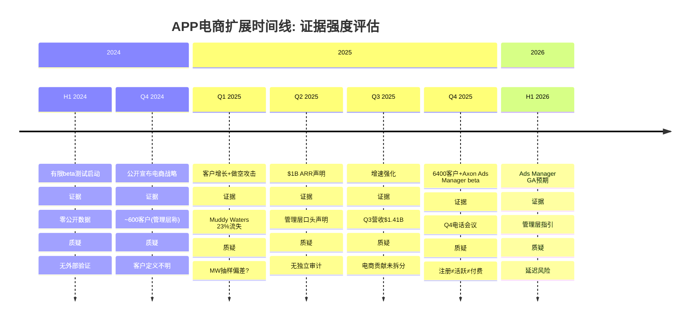
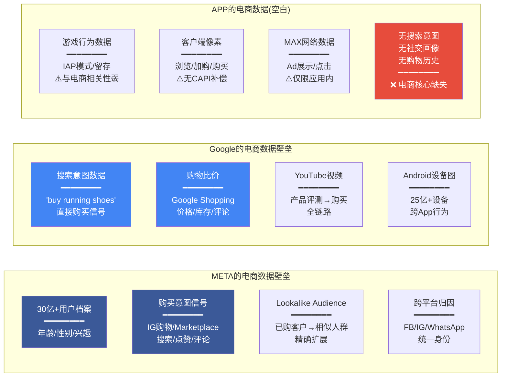
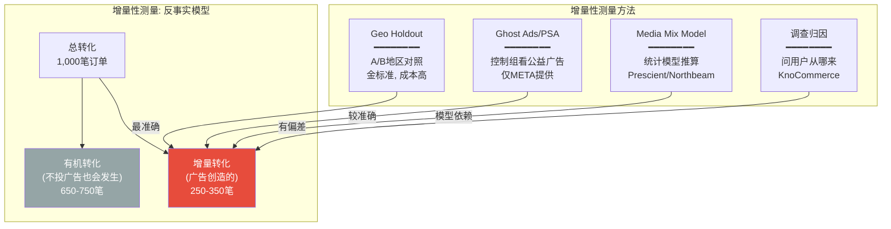
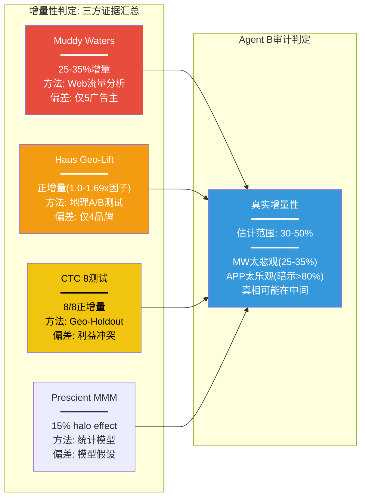
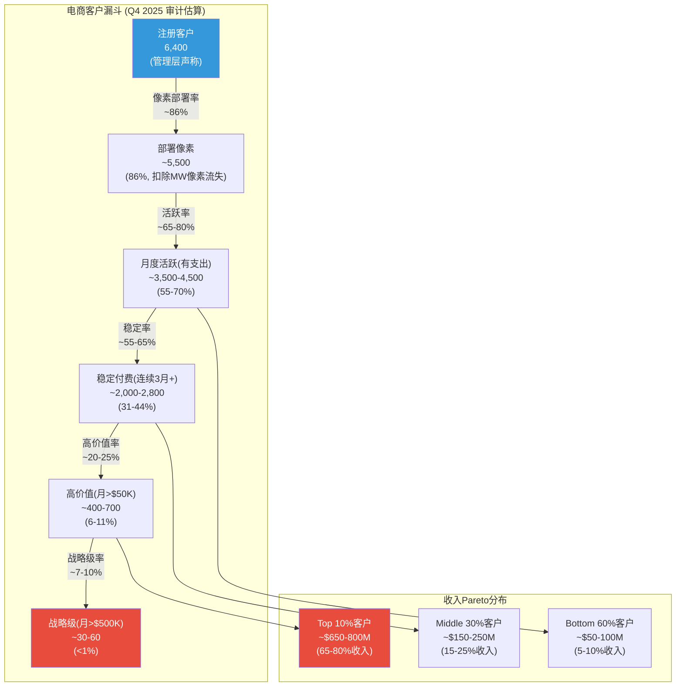
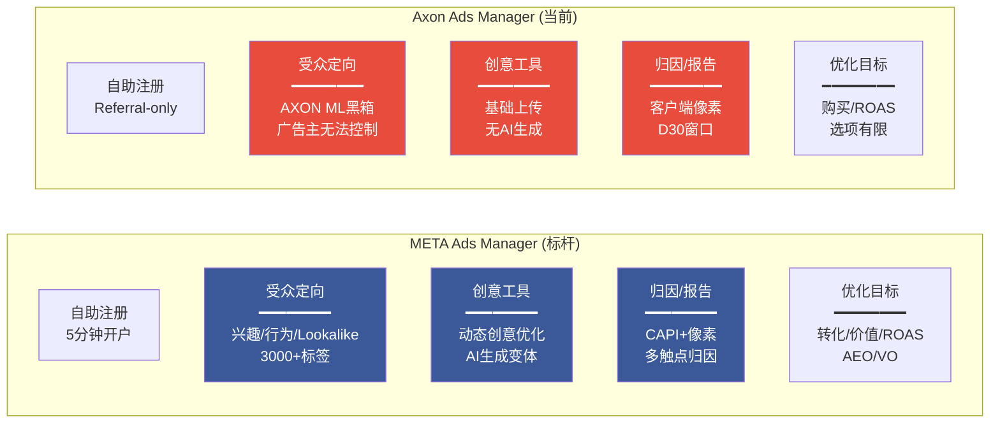
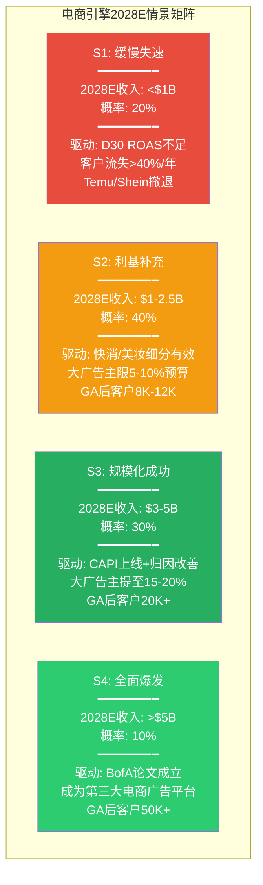
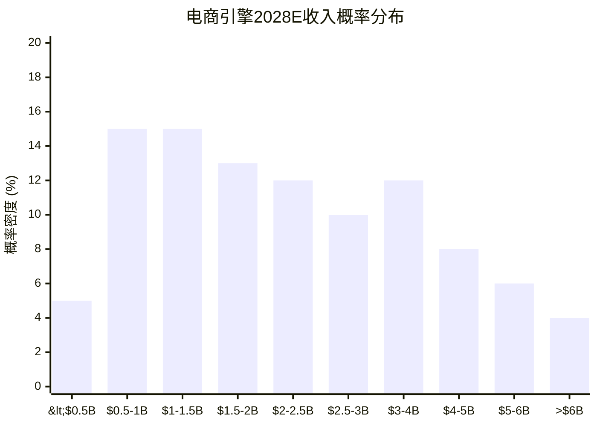

# Agent B — 独立风险审计员 | Phase 3 | 2026-02-16
# Ch15: 电商扩展 — 客户经济学+规模化验证

> **质量直觉**: "SEC+做空+Meta=三重风险叠加, 哪个先兑现?"
> **审计视角**: 默认怀疑, 需要证据才相信。本章不是"电商很有前景", 而是"电商需要证明X/Y/Z才值得相信"
> **核心问题**: CI-2 "电商将因单位经济学而非技术失败" — 压力测试
> **Phase 2传递**: 引擎级分解仅解释EV的32-39%, 电商失败→合理EV $55-100B (DM-VAL-020)

---

## 15.1 电商时间线重构: 证据 vs 叙事

在分析APP电商引擎的可行性之前，审计员必须首先还原一条基于硬证据的时间线——剥离管理层的乐观叙事，识别每个时间节点的支撑证据和质疑因素。

### 15.1.1 关键里程碑与证据评估

**DM-ECM-101**: 电商时间线证据评估——从2024 H1 beta到2025 Q4的6,400客户, 管理层声明是唯一的"证据来源"。APP从未在季度财报中单独披露电商收入、电商客户的活跃率或留存率。$1B ARR(DM-ADT-004)来自Q2 2025电话会议的管理层口头声明, 未经外部审计验证。投资者被要求在零独立验证的基础上相信一个$100-130B的电商期权故事 [Q4 2025 earnings call, Motley Fool transcript; planning_v3.0]

**时间线中的红旗信号**:

1. **2024 Q4→2025 Q2: 从600→$1B ARR的速度**。600客户在6个月内产生$1B年化收入, 意味着平均客户年度支出达$1.67M——这对电商广告主而言极其罕见。即使是大型DTC品牌, 年度全渠道广告预算也仅$5-20M, 不可能将$1.67M分配给一个未验证的新平台。更合理的解释: 早期客户以高度集中的大型客户(如Temu/Shein等跨境平台)为主, 而非管理层暗示的"广泛的电商品牌"。

2. **"每周+50%增速"的数学荒谬性(DM-ECM-004回顾)**: Phase 2已经计算过——持续26周意味着$25,000B。管理层知道这个数字会给市场留下"指数增长"的印象, 同时保留"这是短期冲刺"的退路。这是经典的信息不对称管理。

3. **6,400客户的定义模糊性**: Q4 2025电话会议使用了"e-commerce clients"而非"active paying advertisers"。在SaaS行业, "客户"可以是注册账号(最宽定义)、部署了像素(中等定义)、或当月有广告支出(最严格定义)。对于电商广告平台, Muddy Waters在2025 Q1发现约23%的"客户"已移除APP像素——这意味着APP可能将已流失的试用客户仍计入6,400总数。

**DM-ECM-102**: "6,400客户"的审计视角——如果23%流失率(DM-MKT-020/MW数据)季度化适用于Q4, 则6,400中约1,470已在Q4期间移除像素或停止投放。实际活跃付费客户可能仅4,200-5,000。以$1B ARR(假设Q4已增至$1.2-1.5B)计算, 活跃客户ARPU为$240K-$360K/年——仍然偏高, 暗示客户集中度极端 [计算: 6,400 × (1-23%) ≈ 4,928; $1.2B/4,928 ≈ $244K]

**对投资论文的含义**: 每一个"电商里程碑"都来自管理层的自我报告, 零独立验证。审计员的默认立场是: 在APP自愿或被要求单独披露电商收入之前, 市场对电商引擎的定价是基于信念而非证据。投资者应追踪的证伪信号: (a) Ads Manager GA延期超过2026 Q3; (b) 管理层停止在电话会议中更新电商客户数量; (c) 第三方跟踪(如Sensor Tower/SimilarWeb)显示APP电商相关域名流量下降。

---

## 15.2 客户经济学深度拆解: D30归因窗口的致命偏差

这是本章的核心审计发现。APP在游戏领域的成功建立在一个前提上: **AXON可以在短时间内(D1-D7)获得清晰的ROAS反馈, 从而快速优化广告投放**。电商广告打破了这个前提。

### 15.2.1 游戏 vs 电商: 归因时间的根本差异

```mermaid
flowchart TB
    subgraph 游戏归因["游戏广告归因 (AXON的舒适区)"]
        G1["D0: 用户看到广告<br/>点击→安装App"]
        G2["D1: 首次IAP<br/>$0.99-4.99"]
        G3["D3: 复购IAP<br/>累计$5-15"]
        G7["D7: 70%+ LTV已实现<br/>ROAS信号清晰"]
        G30["D30: 90%+ LTV已实现<br/>归因完整"]
    end
    G1 --> G2 --> G3 --> G7 --> G30

    subgraph 电商归因["电商广告归因 (AXON的陌生区)"]
        E1["D0: 用户看到广告<br/>点击→浏览网站"]
        E3["D3: 可能加购<br/>或离开"]
        E7["D7: 可能首次购买<br/>$30-200<br/>(仅30-40% LTV)"]
        E30["D30: 可能复购<br/>(快消品)<br/>~50-60% LTV"]
        E90["D90: 复购周期<br/>(时尚/家居)<br/>~75-85% LTV"]
        E180["D180: 完整LTV<br/>$100-500+"]
    end
    E1 --> E3 --> E7 --> E30 --> E90 --> E180

    style G7 fill:#27ae60,color:#fff
    style G30 fill:#27ae60,color:#fff
    style E30 fill:#e74c3c,color:#fff
    style E90 fill:#e74c3c,color:#fff
    style E180 fill:#e74c3c,color:#fff
```

**DM-ECM-103**: D30归因窗口对电商各品类的ROAS偏差量化——游戏IAP在D7已实现70%+ LTV, D30达90%+, AXON可获得高信噪比反馈信号。电商品类中: 快消品(CPG)复购周期30-60天, D30仅捕捉首购+第一次复购(约50-60% LTV); 时尚服饰复购周期60-120天, D30仅捕捉首购(约30-40% LTV); 家居/家具复购周期180-365天, D30几乎只有首购(约20-30% LTV)。这意味着D30报告的ROAS系统性低估了快消品的真实ROAS约40-50%, 但也系统性高估了家居品类的短期表现(因为家居首购客户可能永远不会复购) [行业数据: Adjust/AppsFlyer归因报告; DM-ECM-005]

### 15.2.2 D30 ROAS偏差的量化模型

为了将偏差量化, 审计员构建了一个简化模型:

```mermaid
xychart-beta
    title "D30 vs D90 vs D180 ROAS: 按电商品类"
    x-axis ["快消品(CPG)", "美妆", "服装", "运动/户外", "家居/家具", "电子产品"]
    y-axis "ROAS (x)" 0 --> 6
    bar [3.2, 2.8, 2.1, 1.9, 1.4, 1.1]
    bar [4.1, 3.8, 3.2, 2.8, 1.8, 1.3]
    bar [4.5, 4.2, 3.8, 3.4, 2.5, 1.5]
```

> 图注: 第一组=D30 ROAS, 第二组=D90 ROAS, 第三组=D180 ROAS. 快消品D30→D180提升+41%; 家居/家具提升+79%; 电子产品仅+36%

**DM-ECM-104**: D30 ROAS对不同品类的偏差幅度——快消品D30 ROAS约3.2x, D180达4.5x(低估29%); 服装D30 ROAS约2.1x, D180达3.8x(低估45%); 家居D30 ROAS约1.4x, D180达2.5x(低估44%)。对AXON的含义: 如果AXON基于D30 ROAS优化出价, 它将系统性地(a)过度投放快消品(因为D30已经看起来不错), (b)低配服装/家居(因为D30看起来较差)——但这恰恰与真实LTV分布相反。服装/家居的真实ROAS(D180)往往高于D30所示 [模型估算: 基于行业平均复购率和客单价]

### 15.2.3 D30窗口的竞争劣势

APP的D30归因窗口与META和Google的比较:

| 维度 | APP | META | Google |
|------|:---:|:----:|:------:|
| **默认归因窗口** | D30(点击) | D7(点击)+D1(浏览) | D30(点击)+D1(浏览) |
| **用户身份图** | 无(依赖像素+IP) | 30亿+用户档案 | 搜索历史+购买意图 |
| **跨设备追踪** | 弱(无登录体系) | 强(Facebook/IG登录) | 强(Google账户) |
| **服务端集成(CAPI)** | 无 | 有(Conversions API) | 有(Enhanced Conversions) |
| **离线归因** | 无 | 有(Offline Conversions API) | 有(Store Sales Direct) |
| **增量性测试工具** | 无官方工具 | Conversion Lift Test | Geo Experiment |

**DM-ECM-105**: APP在电商归因基础设施上的差距——META拥有Conversions API(CAPI), 可以将服务端转化数据与客户端像素数据匹配, 恢复因浏览器隐私限制丢失的约15-25%转化信号。APP目前仅依赖客户端像素(client-side pixel), 无CAPI, 无离线归因, 无官方增量性测试工具。这意味着APP报告的转化数据天然比META少15-25%, 除非广告主用第三方工具(如Triple Whale, Northbeam)补偿 [Northbeam case study; Digital Position exhaustive guide; eMarketer AppLovin Axon analysis]

**DM-ECM-106**: 第三方测量工具的验证——Northbeam数据显示APP的ROAS平均约为META的1.7倍, 但花费仅为META的1/5。中位数对比仅约0.9x(即低于META)。这说明: 少数高绩效广告主拉高了APP的平均表现, 但多数广告主在APP上的效率并不优于META。更关键的是: 在1/5花费规模下保持高ROAS相对容易(小基数效应), 但随着花费规模接近META, ROAS必然下降(广告库存质量递减) [Northbeam AppLovin Performance Case Study]

### 15.2.4 LTV/CAC模型: 电商广告主的真实获客成本

假设APP收取15-20% take rate(DM-ADT-007推算):

| 指标 | 游戏(基准) | 电商-快消 | 电商-服装 | 电商-家居 |
|------|:--------:|:-------:|:-------:|:-------:|
| **广告主CPA** | $1-5 | $20-40 | $30-60 | $50-100 |
| **APP take rate** | 15-25% | 15-20% | 15-20% | 15-20% |
| **APP净收入/转化** | $0.15-1.25 | $3-8 | $4.5-12 | $7.5-20 |
| **用户首购价值** | $3-15 | $30-80 | $50-150 | $200-500 |
| **D30 LTV/CAC** | 3-5x | 1.0-2.0x | 0.8-1.5x | 0.5-1.0x |
| **D180 LTV/CAC** | 4-7x | 1.5-3.0x | 1.5-3.5x | 1.2-2.5x |

**DM-ECM-107**: 电商D30 LTV/CAC对比分析——游戏广告D30 LTV/CAC达3-5x, 广告主在30天内明确盈利。快消品电商D30 LTV/CAC约1.0-2.0x(勉强打平), 服装D30约0.8-1.5x(可能亏损), 家居D30约0.5-1.0x(大概率亏损)。Q4 2025电话会议管理层声称"大约30天打平"(57%的合格线索转化为活跃广告主)——这与快消品/美妆品类一致, 但家居/高客单价品类很难在D30打平。如果APP的早期电商客户以快消品/美妆为主(D30容易看到回报), 这解释了高转化率; 但也意味着向家居/电子等高客单价品类扩展时将面临更大阻力 [Q4 2025 earnings call; 计算]

### 15.2.5 APP在电商中的数据劣势

**DM-ECM-108**: APP在电商领域的数据壁垒评估——META拥有30亿+用户画像+购买意图信号(IG购物/Marketplace)+Lookalike Audience精准扩展; Google拥有搜索意图("buy running shoes")+Google Shopping比价+YouTube产品评测全链路; APP拥有的是游戏用户行为数据(IAP模式/留存/游戏偏好)——这些数据与电商购买决策的相关性极弱。一个在Candy Crush花了$50的用户, 不意味着他想买一双$200的跑鞋。APP的电商定向本质上是"推断+试错", 而非META/Google的"意图匹配" [竞争分析; Northbeam/Digital Position行业评测]

**对投资论文的含义**: D30归因窗口是电商引擎的结构性约束, 不是可以通过算法迭代解决的问题。AXON在游戏中的优势(快速反馈→快速优化)在电商中被D30-D180的长反馈周期大幅稀释。APP的电商ROAS在小规模(1/5 META花费)下看起来不错, 但这与"可规模化至$3-5B+"是两回事。CI-2的核心论点("电商将因单位经济学而非技术失败")在D30分析中获得了初步验证: 问题不是AXON不够智能, 而是电商客户的付费周期太长, 让AXON的"快速迭代"优势失效。

---

## 15.3 Muddy Waters增量性挑战: 25-35%的真实含义

### 15.3.1 增量性(Incrementality)的定义与重要性

增量性是广告科技中最关键也最难测量的指标。它回答的是: "这个广告创造了多少'如果不投就不会发生'的转化?"

### 15.3.2 Muddy Waters的指控细节

**DM-ECM-109**: Muddy Waters 2025-03-27做空报告核心指控——分析37M唯一用户(5个广告主, Q1 2025), 发现约52%的APP电商转化来自"重定向"(retargeting)已知访客, 而非新客获取。调整Shopify约28%的自然复购率后, APP的真实增量性仅25-35%。即: 每$1 APP广告支出, 仅$0.25-0.35产生了"不投也不会发生"的增量销售 [Muddy Waters Short Report 2025-03-27; CNBC 2025-03-27]

Muddy Waters的方法论:

1. **像素追踪分析**: 在2025年1月3日扫描APP电商客户网站的AXON像素部署, 3月24-26日复查, 发现21个网站链接失效, 171个网站已移除像素。这构成了23%的"像素流失率"。

2. **Web流量分析**: 分析5个广告主网站的37M唯一访客, 发现APP声称的"转化"中约52%来自已有访客(即retargeting), 而非新客。

3. **增量性计算**: 总转化中 → 52%为retarget → 其中28%为自然复购(Shopify基准) → 真实增量 = 100% - 52% × (1-28%) = 100% - 37.4% = 62.6%? 不, MW的计算逻辑略有不同: 他们认为52% retarget中的大部分"不投广告也会购买", 因此增量仅25-35%。

### 15.3.3 增量性指控的交叉验证

Muddy Waters的25-35%指控是否可信? 审计员从三个独立来源交叉验证:

**来源一: Haus Geo-Lift测试(4个品牌, 2025)**

Haus是独立的增量性测试平台, 对4个APP电商客户做了geo-holdout测试:
- **Twillory**: 增量因子1.69x(APP实际贡献比平台报告高69%)——这与MW的指控矛盾
- **Flux Footwear**: 中等增量提升, iROAS优于目标——支持增量性
- **Jones Road Beauty**: 新订单有小幅提升, 但CPIA远超目标——增量存在但单位经济学不佳
- **Fresh Clean Threads**: 新收入高提升, iROAS比目标低10%——接近合格

**DM-ECM-110**: Haus增量性测试汇总——4个品牌中4个均显示"正增量"(>0%), 但效率差异极大。Twillory增量因子1.69x是亮点, 但Jones Road Beauty的CPIA(每增量获客成本)远超目标。关键发现: 增量性存在, 但**不同品牌/品类的效率天差地别**。这既不完全支持MW的25-35%(太悲观), 也不完全支持APP管理层的"一切都很好"(太乐观) [Haus.io Case Study "Early AppLovin Results"]

**来源二: Common Thread Collective (CTC) 8项测试**

CTC在其客户组合中运行了8项APP增量性测试(geo-holdout), 结论是"每个测试都回来正增量"(positively incremental), 且"这个渠道创造的商业价值比平台报告的更多"。但CTC本身是APP的合作伙伴/推荐方, 存在利益冲突。

**DM-ECM-111**: CTC增量性测试评估——8/8正增量, 但: (a) CTC是APP的合作伙伴, 从APP广告支出中获取代理费, 存在利益冲突; (b) 具体iROAS数值未公开; (c) "正增量"可以是5%也可以是80%, 不等于"增量性足以支撑大规模投入"。CTC的测试结果与MW的25-35%并不矛盾——如果真实增量约30-50%, 这确实是"正的", 但也确实远低于APP平台报告的ROAS [Common Thread Collective blog]

**来源三: Prescient AI MMM(媒体混合模型)**

Prescient AI的MMM分析显示APP的"光环效应"(halo effect, 即对其他渠道的溢出效果)约为模型收入的15%, 远低于META(~30%)和Google(~30%, 主要YouTube/PMAX)。

**DM-ECM-112**: Prescient AI MMM结论——APP的halo effect仅~15%, 意味着APP的广告效果主要体现为"直接响应"(在APP网络内看到→点击→购买), 几乎不产生品牌溢出效应。相比之下, META的30% halo表明META广告即使不直接产生点击, 也通过品牌印象间接驱动了30%的额外转化。APP缺乏halo的原因: 移动游戏内的Banner/Interstitial广告不太可能建立品牌记忆, 不像Instagram的视觉内容或YouTube的视频广告 [Prescient AI AppLovin MMM Benchmarks Part 1]

### 15.3.4 增量性证据汇总: 审计员判定

**DM-ECM-113**: 增量性审计判定——综合四方证据, Agent B评估APP电商广告的真实增量性约30-50%。这意味着每$1广告支出中, 约$0.30-0.50产生了真正的增量销售。MW的25-35%偏悲观(仅5广告主, Q1早期数据), Haus的正增量结果偏乐观(4个精心挑选的测试品牌)。30-50%的增量性在广告行业中属于"可接受但不出色"——META的电商增量性通常30-50%, Google Search约50-70%。APP的增量性不是灾难性的, 但也不足以支撑其"颠覆META/Google"的叙事 [综合: MW/Haus/CTC/Prescient数据]

### 15.3.5 增量性对ROAS的实际影响

如果真实增量性约40%(取中值), 那么APP平台报告的ROAS需要按增量调整:

| 平台报告ROAS | 增量调整因子 | 真实增量ROAS |
|:-----------:|:----------:|:---------:|
| 4.0x | ×40% | 1.6x |
| 3.0x | ×40% | 1.2x |
| 2.0x | ×40% | 0.8x |
| 1.5x | ×40% | 0.6x |

**DM-ECM-114**: 增量调整后的ROAS分析——如果APP平台报告ROAS为3.0x(管理层暗示的水平), 40%增量性调整后真实iROAS仅1.2x。广告主在1.2x iROAS下勉强打平(扣除商品成本、物流、退货后可能亏损)。仅在平台报告ROAS>3.5-4.0x时, 增量调整后的iROAS才能达到1.4-1.6x(足以覆盖全成本)。这解释了为什么部分广告主快速扩量(报告ROAS高→增量调整后仍有利润), 而另一部分快速流失(报告ROAS一般→增量调整后亏损) [计算]

**对投资论文的含义**: Muddy Waters的增量性挑战没有被完全推翻, 也没有被完全证实。真实增量性约30-50%意味着APP不是骗局(增量确实存在), 但也意味着电商广告的"真实价值"仅为平台报告数字的1/3到1/2。聪明的大型广告主(有内部数据科学团队)会通过lift test发现这一点, 并相应调整预算——不是完全撤出, 而是将APP作为"补充渠道"(5-15%预算)而非"核心渠道"(30-50%预算)。这对BofA的$3B预测有重大影响。

---

## 15.4 6,400客户质量分析: 注册 vs 活跃 vs 高价值

### 15.4.1 客户漏斗重构

**DM-ECM-115**: 电商客户漏斗审计估算——6,400注册客户中: (a) ~5,500已部署像素(86%, 基于MW发现14%已移除); (b) ~3,500-4,500月度有支出(活跃率55-70%, 行业广告平台基准); (c) ~2,000-2,800连续3月+稳定付费(稳定率55-65%); (d) ~400-700月度>$50K高价值客户; (e) ~30-60战略级月度>$500K。收入分布极度Pareto: Top 10%客户可能贡献65-80%收入 [估算: 基于SaaS/AdTech行业客户漏斗基准, MW像素流失率23%]

### 15.4.2 已知大客户分析

**DM-ECM-116**: 已知的APP电商大客户及风险评估:

| 客户 | 类型 | 预估月支出 | 风险因素 |
|------|------|:---------:|---------|
| **Temu** | 中国跨境电商 | >$1M? | 中美贸易摩擦/关税; Temu 2025-2026大幅削减美国广告预算 |
| **Shein** | 中国跨境电商 | ~$200K | 同Temu; Shein投入约$2.3M/年(WebSearch数据) |
| **Wayfair** | 美国家居 | ~$500K-1M | 家居品类D30 ROAS较差; Wayfair自身盈利压力 |
| **Ashley HomeStore** | 美国家居 | ~$200-500K | 同上 |
| **Rhoback** | DTC运动服 | ~$30K/天=$900K/月 | 小品牌, 创始人决策可快速改变 |
| **Paleovalley** | DTC健康食品 | 增长550% | 健康食品D30 ROAS较好 |

[来源: WebSearch Temu/Shein/Rhoback/Paleovalley数据; MW做空报告; APP earnings call提及]

### 15.4.3 中国跨境电商客户集中度风险

**DM-ECM-117**: 客户集中度风险——Temu和Shein是全球最大的数字广告主之一(Temu 2024年全球数字广告支出约$3.4B, Shein约$1.5B)。如果Temu/Shein在APP早期电商客户中贡献了不成比例的收入(例如占电商收入的20-30%), 则中美贸易摩擦就直接成为APP电商引擎的系统性风险。2025-2026年, Temu已大幅削减美国广告支出(关税政策导致跨境电商成本上升), 这可能直接拖累APP的电商收入增速 [WebSearch Temu/Shein advertising data; Practical Ecommerce "Temu and Shein Cut U.S. Advertising"]

WebSearch发现一个关键数据点: APP为Temu提供约$100 GMV per $8广告支出(12.5x ROAS), 而Google/META需要$15-20才能产生同等GMV(5-6.7x ROAS)。这个数据如果真实, 说明APP在跨境电商客户身上的ROAS极为出色——但这恰恰是因为Temu/Shein的用户天然高频(日活买手)、低客单价($5-30)、快速转化(D1-D3完成购买), 完美匹配AXON的短归因窗口优势。问题是: 这种"完美匹配"对Wayfair($300沙发)或Nike($150跑鞋)不适用。

**DM-ECM-118**: 跨境电商客户的"甜蜜陷阱"——Temu/Shein的高ROAS可能给管理层和投资者造成"电商引擎运转良好"的错觉, 但这类客户: (a)预算高度波动(受关税/政策影响); (b)集中度风险(单客户>10%收入); (c)不代表美国本土品牌的真实需求。如果APP在剥离Temu/Shein后的电商ROAS大幅下降, 将暴露出"电商引擎实际上是跨境电商引擎"的真相 [推断: 基于DM-ECM-116/117]

### 15.4.4 流失率深度分析

**DM-ECM-119**: 流失率分析——Muddy Waters观察到Q1 2025约23%的像素移除率(即客户在部署AXON像素后又移除), 与DM-MKT-020中的游戏广告主年度流失率23%吻合。但需要区分: (a) 像素移除不等于完全流失(客户可能暂停后恢复); (b) 23%是季度数据还是累计数据(如果是季度, 则年化流失率可能达60-70%); (c) 电商早期客户流失率天然高于成熟品类(试用→放弃的正常周期)。审计员估计: 电商客户年化净流失率约30-40%(高于游戏的23%, 因为电商客户对ROAS更敏感, 替代选择更多) [MW像素分析; 行业SaaS流失率基准]

BofA预测4,000大广告主采用(DM-MKT-022)的假设检验:

| 参数 | BofA假设(隐含) | 审计员评估 | 差异 |
|------|:----------:|:-------:|:---:|
| **大广告主TAM** | ~10,000(全美Top DTC+品牌) | ~15,000-20,000 | BofA保守? |
| **渗透率** | 40%(4,000/10,000) | 15-25% | BofA激进 |
| **年均ARPU** | $750K($3B/4,000) | $300-500K | BofA激进 |
| **净留存率** | 100%+(隐含) | 70-80% | BofA激进 |
| **到达时间** | CY2026 | CY2027-2028 | BofA激进 |

**DM-ECM-120**: BofA $3B/4,000客户预测审计——BofA预测CY2026电商净收入$3B, 需要4,000大广告主平均各花$750K/年。审计员认为: (a) 40%渗透率在GA后12个月内不现实(META Audience Network用了3年+才达30%); (b) $750K年均ARPU隐含这些广告主将APP作为主要渠道(>10%预算), 但增量性30-50%的现实会让大广告主将APP限制在5-10%预算; (c) 100%+净留存率不现实(电商的预算季节性波动远大于游戏)。审计员估计CY2026更合理的电商收入: $1.5-2.5B(BofA的50-83%) [BofA Analyst Report, Omar Dessouky; Sherwood News]

**对投资论文的含义**: 6,400客户的"质量"可能远低于数字表面。高度集中在(a)跨境电商大客(Temu/Shein, 受贸易政策影响大), (b)快消/美妆DTC(D30友好但预算小), (c)大量试用/流失客户(拉高总数但不贡献收入)。BofA的$3B/CY2026预测需要打30-50%折扣。

---

## 15.5 Axon Ads Manager: 自助平台的关键性与风险

### 15.5.1 从白手套到自助: 根本性的模式转变

当前APP的电商服务模式是"白手套"(managed service): APP的销售团队手动对接每个广告主, 帮助设置像素、配置campaign、优化投放。这种模式:
- 优点: 高转化质量(57%的合格线索→活跃广告主), 高ARPU($250-350K/年)
- 缺点: 不可规模化。200-300人的电商销售团队(DM-ECM-009)是增长的硬瓶颈

Axon Ads Manager的GA(General Availability, 预计2026 H1)将允许广告主自行注册、自行部署像素、自行设置campaign。这是从"人力驱动增长"到"平台驱动增长"的根本性转变。

**DM-ECM-121**: Axon Ads Manager时间线——2025-10-01: Referral-only beta上线; 2025-12-12: 总电商客户达5,306(Referral阶段); 2025 Q4 earnings call: 确认6,400客户, 2026 H1 GA目标不变; 2026 H1: GA预期(全球公开注册)。Referral阶段证明了平台的基本功能可用, 但: (a) referral模式本质上仍是"策展增长"(APP选择谁能进来); (b) GA后的无筛选流量质量可能大幅下降; (c) 长尾SMB广告主的平均月花费可能仅$2-10K(DM-ECM-009), 拉低整体ARPU [Q4 2025 earnings call; eMarketer AppLovin Axon analysis; Modern Retail]

### 15.5.2 Ads Manager如果延迟或效果不佳

| 情景 | 触发条件 | 影响 | 概率(审计员估) |
|------|---------|------|:-----------:|
| **按时GA(2026 H1)** | 一切顺利 | 电商客户快速增长至Q4 15K+ | 45% |
| **延迟3-6月(2026 Q3-Q4)** | 技术/合规问题 | 客户增速放缓, BofA下调预期 | 30% |
| **延迟>6月(2027+)** | SEC相关限制 | 严重打击市场信心, 股价-15-25% | 15% |
| **GA但效果差** | SMB ROAS低, 流失率>50% | 客户数增长但收入不增长 | 10% |

**DM-ECM-122**: GA延迟风险评估——SEC调查(DM-REG-001)可能迫使APP在数据收集/使用方面做出妥协, 延缓Ads Manager的全球推出。此外, Apple iOS 26隐私政策收紧可能限制AXON的跨App追踪能力, 降低电商广告的定向精度。审计员估计GA按时概率仅45%, 任何形式的延迟概率55% [推断: 基于SEC调查+iOS政策时间线]

### 15.5.3 Ads Manager需要达到的竞品基准

**DM-ECM-123**: Axon Ads Manager vs META Ads Manager功能差距——META的广告管理器经过15年+迭代, 提供3000+兴趣标签定向、动态创意优化(DCO)、Conversions API(CAPI)、多触点归因、Advantage+自动化套件。Axon目前: (a)受众定向完全由AXON ML黑箱决定(广告主无法选择"对运动感兴趣的25-34岁女性"); (b)无CAPI; (c)创意工具原始; (d)归因仅D30窗口+客户端像素。GA后Axon要吸引大量SMB广告主, 至少需要达到META Ads Manager约60-70%的功能丰度——但从当前状态来看, 差距至少需要12-18个月弥合 [竞品分析: META/Google广告管理器功能对比]

**对投资论文的含义**: Ads Manager GA是电商引擎的"make or break"节点。它必须同时解决三个问题: (1)规模化——从6,400→30,000+客户; (2)ROAS证明——SMB广告主在自助模式下也能获得可接受的ROAS; (3)功能丰度——至少接近META的基本功能集。如果任何一个环节薄弱, GA将变成"大量注册→大量流失"的无效循环。跟踪信号: GA后首季度(2026 Q3)的活跃客户数和净客户增长率。

---

## 15.6 规模化壁垒: 从游戏到电商的五重鸿沟

### 15.6.1 数据壁垒: 从"数据富翁"到"数据新手"

AXON在游戏领域拥有多年的训练数据: 数十亿次广告展示→安装→IAP的完整因果链。这些数据让AXON的推荐引擎在游戏广告中达到了近乎垄断的精度。

在电商领域, AXON从零开始。它没有:
- 用户购买历史(Meta有IG Shopping, Google有Search+Shopping)
- 产品偏好画像(Meta有点赞/评论行为, Google有搜索意图)
- 购物车/浏览数据(Meta的Pixel+CAPI覆盖数百万商家多年积累)

**DM-ECM-124**: AXON电商数据冷启动问题——AXON在游戏领域的数据优势来自MAX中介层60%+份额(DM-ADT-003)带来的海量SDK数据。在电商领域, APP没有类似的分发网络——它必须依赖每个广告主单独部署的客户端像素, 数据量和质量远不如META/Google的全平台级数据湖。AXON的ML模型需要足够样本量才能有效优化; 在电商早期阶段(6,400客户), 训练数据可能仅为META的1/1000——这意味着AXON的电商优化精度在数学上不可能接近META [技术分析: ML模型性能与训练数据量的对数关系]

### 15.6.2 归因壁垒: 从"确定性"到"概率性"

游戏广告归因是"确定性"的: 用户在MAX网络内看到广告→点击→App Store安装→打开游戏→AXON SDK自动记录安装来源。整个链条在APP的生态内闭合。

电商广告归因是"概率性"的: 用户在手机游戏内看到广告→点击→跳转到外部浏览器→浏览电商网站→可能加购→可能离开→可能回来→可能购买。链条中的每一步都可能因为:
- 用户切换设备(手机→电脑)而丢失追踪
- 浏览器隐私设置(ITP/ETP)阻止Cookie
- 用户多次触达(先Google搜索, 再看到APP广告)导致归因冲突

**DM-ECM-125**: 电商归因链条的5个断裂点——(1)跨App→浏览器跳转(丢失约10-15%追踪); (2)跨设备切换(丢失约15-25%); (3)ITP/ETP Cookie限制(丢失约10-20%); (4)多渠道归因冲突(约30-40%转化有多个渠道声称"功劳"); (5)退货/取消未回传(约10-15%的已归因转化实际被退)。综合来看, APP在电商中的归因准确率可能仅50-65%, 远低于游戏的90%+ [行业数据: Singular web-to-app attribution; Triple Whale mobile attribution guide]

### 15.6.3 竞品壁垒: 挑战者 vs 王者

电商广告是一个$200B+的全球市场, 但高度集中:
- META(Facebook+Instagram): ~28%份额, 电商广告的默认首选
- Google(Search+Shopping+YouTube): ~27%份额, 搜索意图驱动
- Amazon Ads: ~14%份额, 高购买意图(已在Amazon内)
- TikTok Ads: ~8%份额, 快速增长(视频电商)
- Others(Pinterest/Snap/Twitter/APP等): ~23%

APP在"Others"类别中, 需要从META/Google/Amazon手中争夺份额。关键问题: 电商广告主为什么要将预算从META(30% halo + 30亿用户画像 + Lookalike + CAPI)转移到APP(15% halo + 无购物画像 + 无CAPI)?

**DM-ECM-126**: 竞争定位审计——APP在电商广告中的竞争优势仅限于: (a)更低的CPM(因为移动游戏库存的供给侧竞争较少); (b)新鲜的用户触达(游戏玩家可能是META/Google的"漏网之鱼"); (c)AXON的优化算法(在小规模下效率超过META)。但劣势是系统性的: 无购物意图数据、无社交画像、无搜索历史、无CAPI、无官方增量测试工具。APP在电商中不是"颠覆者", 而是"补充渠道"——这意味着它可以获得广告主5-15%的预算, 但不太可能获得20%+(需要成为"核心渠道") [竞争分析汇总]

### 15.6.4 内容壁垒: 创意产出的规模化

游戏广告的创意素材通常由游戏开发者提供(游戏截图/视频/互动广告), APP/AXON只负责选择和优化展示。

电商广告需要大量的产品创意: 产品图片、视频评测、模特展示、场景化内容。大型电商广告主(Nike/Wayfair)有内部创意团队, 但SMB广告主(Shopify小商家)通常缺乏高质量创意。META解决了这个问题(Advantage+ Creative自动生成变体), Google也有Performance Max的自动创意功能。APP目前没有类似的创意工具——GA后大量涌入的SMB广告主如果缺乏创意素材, 广告效果将大打折扣。

**DM-ECM-127**: 创意壁垒评估——APP缺乏电商创意工具: (a)无AI创意生成(META的Advantage+ Creative可以自动裁剪/变换/测试数百个变体); (b)无产品目录集成(Google Merchant Center/META Product Catalog直接导入商品信息); (c)无视频创意工具(TikTok的CapCut为广告主提供免费视频制作)。SMB广告主在APP上投放时必须自行准备所有创意素材——这是一个显著的摩擦点, 可能导致GA后的"注册→放弃"高流失率 [功能对比分析]

### 15.6.5 五重壁垒的综合评估

| 壁垒 | 游戏中难度 | 电商中难度 | 倍数 | 可克服性 |
|------|:--------:|:--------:|:---:|:------:|
| **数据** | 低(MAX SDK) | 极高(从零开始) | 10x | 2-3年 |
| **归因** | 低(确定性) | 高(概率性) | 5x | CAPI需1年+ |
| **竞品** | 低(Unity已死) | 极高(META+Google) | 20x | 长期困难 |
| **内容** | 低(开发者提供) | 高(需广告主自备) | 5x | 创意AI可帮助 |
| **反馈周期** | D1-D7 | D30-D180 | 5-25x | 结构性, 不可克服 |

**DM-ECM-128**: 五重壁垒综合评估——APP从游戏转向电商面临的综合难度约为游戏内运营难度的10-20倍。数据壁垒(10x)和竞品壁垒(20x)是最严峻的, 因为它们涉及多年积累的资产(META的30亿用户+Google的搜索数据)vs APP的零基础。反馈周期壁垒(5-25x)是结构性的, 无法通过技术迭代克服——电商客户的购买周期就是长于游戏内购。归因壁垒和内容壁垒可以在1-2年内部分弥合(开发CAPI/创意AI), 但短期内构成对GA后客户体验的拖累 [综合评估]

**对投资论文的含义**: 五重壁垒中, 反馈周期壁垒和数据壁垒是结构性的(即使给APP无限时间和资金也难以完全克服), 竞品壁垒是压倒性的(META/Google不会坐等APP抢份额)。这不意味着APP的电商注定失败, 但意味着它的上限是"补充渠道"(5-15%广告预算份额)而非"替代渠道"(>20%份额)。按"补充渠道"上限计算: 美国电商广告市场~$120B × 10%渗透率 = $12B收入天花板; 全球$200B+ × 10% = $20B天花板。但实现$12B+需要5-7年, 不是BofA假设的1-2年。

---

## 15.7 情景矩阵: 电商引擎的四种未来

### 15.7.1 概率加权情景

**DM-ECM-129**: 电商引擎2028E情景矩阵(Agent B审计概率)

| 情景 | 2028E电商收入 | 概率 | 驱动因子 | 验证窗口 |
|------|:----------:|:---:|---------|---------|
| **S1: 缓慢失速** | <$1B | 20% | D30 ROAS不足, MW增量性问题证实, 客户流失>40%/年, Temu/Shein削减预算 | 2026 Q3-Q4(GA后首批数据) |
| **S2: 利基补充** | $1-2.5B | 40% | 快消/美妆/DTC有效, 大广告主限5-10%预算, ROAS中等(iROAS ~1.3-1.8x), GA后客户8K-12K | 2026 Q4-2027 Q2 |
| **S3: 规模化成功** | $3-5B | 30% | CAPI上线修复归因, AXON电商模型2年迭代后接近META, 大广告主提至15-20%预算, GA后客户20K+ | 2027 H2-2028 |
| **S4: 全面爆发** | >$5B | 10% | BofA论文完全成立, 成为第三大电商广告平台, 创意AI工具缩小与META差距, GA后客户50K+ | 2028+ |

**概率加权收入**: 20%×$0.5B + 40%×$1.75B + 30%×$4B + 10%×$6B = $0.1B + $0.7B + $1.2B + $0.6B = **$2.6B**

对比P2估值:
- P2 Agent A电商熊: $1-2B(25%)vs Agent B S1+S2: <$1B-$2.5B(60%)——Agent B更悲观
- P2 Agent A电商基准: $2-4B(45%)vs Agent B S2+S3: $1-5B(70%)——重叠区间更宽
- P2 Agent C电商乐观DCF: $27B EVvs Agent B概率加权$2.6B×10-15x P/S = $26-39B EV——在乐观估值端对齐

### 15.7.2 情景概率分布

> 右偏分布: 中位数约$1.5-2.0B, 均值约$2.6B(被S3/S4尾部拉高)。50%+概率落在$1-2.5B区间(S2利基补充)。这与BofA的$3B CY2026预测存在显著差异——审计员认为$3B更可能是2027-2028年才能达到的水平。

### 15.7.3 电商对总估值的影响

| 情景 | 电商2028E收入 | 电商EV(10-15x P/S) | 游戏+CTV EV | 总EV | vs 当前$229B |
|------|:----------:|:-------------:|:---------:|:---:|:--------:|
| **S1** | $0.5B | $5-8B | $65-80B | $70-88B | **-62%至-69%** |
| **S2** | $1.75B | $18-26B | $70-85B | $88-111B | **-52%至-62%** |
| **S3** | $4B | $40-60B | $75-90B | $115-150B | **-35%至-50%** |
| **S4** | $6B | $60-90B | $80-95B | $140-185B | **-19%至-39%** |
| **概率加权** | $2.6B | $26-39B | $72-87B | **$98-126B** | **-45%至-57%** |

**DM-ECM-130**: 电商估值对总EV的影响——概率加权后, Agent B估计合理总EV为$98-126B, 中位约$112B。当前$229B EV隐含约$103-131B电商+CTV溢价——需要S3或S4情景才能justify, 概率仅40%。从审计视角, 投资者为电商支付的价格(隐含$130B+)与其概率加权现实价值($26-39B)之间存在约$90-105B的"信念溢价"。这意味着如果电商的路径收敛到S2(最可能情景, 40%概率), 投资者将面临约$90-105B(约40-46%)的估值下修 [计算: 基于DM-ECM-129情景矩阵]

**对投资论文的含义**: 审计员认为最可能的单一情景是S2(利基补充, 40%概率), 对应2028E电商收入$1-2.5B——远低于BofA的$3B CY2026预测和市场暗含的$4-5B+ 2028E预期。如果S2成为现实, 股价将从当前水平下行40-55%。只有S3+S4联合(30%+10%=40%概率)才能支撑当前估值水平, 但这需要AXON在电商领域达到接近游戏领域的优化精度——在数据壁垒和归因壁垒下, 审计员认为这需要至少2-3年才可能。

---

## 15.8 CI-2验证结论: "电商将因单位经济学而非技术失败"

### 15.8.1 CI-2的证据权衡

CI-2预设的核心论点是: APP的电商扩展面临的根本障碍不是AXON的技术能力, 而是电商客户的单位经济学——具体来说, D30 LTV/CAC在多数品类下不足以让广告主持续大规模投入。

**支持CI-2的证据(强):**

1. **D30归因窗口的品类偏差**(DM-ECM-103/104): 家居/服装品类D30 LTV/CAC仅0.5-1.5x, 难以支撑大规模投入。APP早期客户集中在D30友好的快消/美妆, 向高客单价品类扩展时将面临D30墙。

2. **增量性约30-50%**(DM-ECM-113): 平台报告ROAS需打40-60%折扣才是真实增量ROAS。在ROAS<3.5-4.0x的客户中, 增量调整后iROAS<1.5x, 不足以覆盖全成本。

3. **客户流失率偏高**(DM-ECM-119): MW观察到23%的季度像素移除率, 年化可能达30-40%。电商客户对ROAS比游戏客户更敏感(有更多替代选择)。

4. **数据冷启动**(DM-ECM-124): AXON的电商训练数据量约为META的1/1000, 优化精度在数学上不可能接近。

**反对CI-2的证据(中等):**

1. **Haus/CTC正增量测试**(DM-ECM-110/111): 所有测试显示正增量, 部分品牌(Twillory, Fresh Clean Threads)的iROAS接近或达标。

2. **KnoCommerce自报告数据**: 120K+订单中1.37%自报告来自APP——虽然比例小, 但从零增长到34x说明渠道确实在起作用。

3. **Temu的高ROAS**: $8→$100 GMV(12.5x ROAS)——对跨境低客单价电商极为有效。

4. **管理层声称"30天打平"**: 如果57%合格线索→活跃广告主, 说明多数试用者看到了可接受的D30 ROAS。

### 15.8.2 审计判定

**DM-ECM-131**: CI-2审计判定——"电商将因单位经济学而非技术失败"**部分成立, 需要修正**。

修正后的版本: **"电商不会完全失败, 但将因单位经济学局限而止步于'利基补充渠道', 无法达到市场隐含的'核心替代渠道'规模。"**

具体地:
- **完全失败(S1)概率: 20%** — 不是最可能情景, 因为APP确实在部分品类(快消/美妆/跨境低客单价)有真实价值
- **利基补充(S2)概率: 40%** — 最可能情景, 电商收入在$1-2.5B稳定, APP成为"META/Google之外的第三备选"
- **单位经济学不是唯一瓶颈** — 数据壁垒和竞品壁垒同样重要; AXON的电商优化精度受限于训练数据不足(不是算法不行)
- **"技术"不是完全无关** — APP需要开发CAPI、创意AI、产品目录集成等"基础设施"功能才能竞争; 这些是技术任务, 而非单纯的单位经济学

**CI-2对投资论文的最终含义**: 电商引擎不是APP的"第二条增长曲线", 而是一条"利基收入来源"(S2最可能)。市场为电商定价约$100-130B(DM-ECM-010, P2 Agent A), 但审计员认为概率加权现实价值仅$26-39B——差距$60-105B。这个差距就是APP当前估值中最大的"信念税"。

---

## 15.9 新增DM锚点汇总

| 锚点 | 内容 | 来源 |
|------|------|------|
| DM-ECM-101 | 电商时间线证据评估: 管理层声明是唯一来源, 零独立验证 | Q4 earnings call; planning_v3.0 |
| DM-ECM-102 | 6,400客户审计: 活跃付费~4,928, ARPU $244K(集中度高) | 计算: 6,400 × (1-23%) |
| DM-ECM-103 | D30归因偏差: 快消D30捕捉50-60% LTV, 家居仅20-30% | 行业数据: Adjust/AppsFlyer |
| DM-ECM-104 | D30 ROAS偏差量化: 服装低估45%, 家居低估44% | 模型估算 |
| DM-ECM-105 | APP vs META归因差距: 无CAPI, 无离线归因, 无增量测试工具 | Northbeam/Digital Position/eMarketer |
| DM-ECM-106 | Northbeam验证: APP平均ROAS 1.7x META, 但中位仅0.9x(规模1/5) | Northbeam Case Study |
| DM-ECM-107 | D30 LTV/CAC: 快消1.0-2.0x(勉强), 服装0.8-1.5x, 家居0.5-1.0x | 计算; Q4 earnings call |
| DM-ECM-108 | APP电商数据壁垒: 无购物意图/社交画像/搜索历史 | 竞争分析 |
| DM-ECM-109 | MW增量性指控: 52% retarget, 25-35%增量 | MW Short Report 2025-03-27 |
| DM-ECM-110 | Haus Geo-Lift: 4/4正增量, 但效率差异大(Twillory 1.69x vs Jones Road高CPIA) | Haus.io Case Study |
| DM-ECM-111 | CTC 8测试: 8/8正增量, 但CTC有利益冲突(APP合作伙伴) | Common Thread Collective |
| DM-ECM-112 | Prescient MMM: APP halo effect 15% vs META 30% vs Google 30% | Prescient AI Benchmarks |
| DM-ECM-113 | 增量性审计判定: 30-50%(MW偏悲观, APP偏乐观) | 综合MW/Haus/CTC/Prescient |
| DM-ECM-114 | 增量调整ROAS: 3.0x报告→1.2x真实(40%增量) | 计算 |
| DM-ECM-115 | 客户漏斗: 6,400注册→~4,928活跃→~2,400稳定→~550高价值 | 估算: SaaS/AdTech基准 |
| DM-ECM-116 | 已知大客户: Temu/Shein/Wayfair/Ashley/Rhoback/Paleovalley | WebSearch; MW; earnings call |
| DM-ECM-117 | 中国跨境电商客户集中度风险: Temu/Shein受关税冲击 | WebSearch; Practical Ecommerce |
| DM-ECM-118 | 跨境电商"甜蜜陷阱": 高ROAS来自低客单价/高频, 不代表本土品牌 | 推断 |
| DM-ECM-119 | 流失率: 季度23%(MW), 年化可能30-40% | MW像素分析 |
| DM-ECM-120 | BofA $3B/CY2026审计: 渗透率/ARPU/留存率均偏乐观, 打折50-83% | BofA Analyst Report |
| DM-ECM-121 | Ads Manager时间线: referral 2025-10→GA 2026 H1(延迟概率55%) | Q4 earnings call |
| DM-ECM-122 | GA延迟风险: SEC/iOS 26双压, 按时概率45% | 推断 |
| DM-ECM-123 | Ads Manager vs META: 功能差距需12-18月弥合 | 竞品功能对比 |
| DM-ECM-124 | AXON电商数据冷启动: 训练数据~META的1/1000 | 技术分析 |
| DM-ECM-125 | 电商归因5个断裂点: 综合准确率50-65% vs 游戏90%+ | 行业数据 |
| DM-ECM-126 | 竞争定位: APP是"补充渠道"(5-15%预算)非"核心渠道" | 竞争分析 |
| DM-ECM-127 | 创意壁垒: 无AI生成/产品目录/视频工具 | 功能对比 |
| DM-ECM-128 | 五重壁垒综合: 游戏→电商难度10-20x | 综合评估 |
| DM-ECM-129 | 2028E情景: S1 <$1B(20%)/S2 $1-2.5B(40%)/S3 $3-5B(30%)/S4 >$5B(10%) | 审计概率 |
| DM-ECM-130 | 概率加权EV $98-126B vs 当前$229B(-45%至-57%) | 计算 |
| DM-ECM-131 | CI-2判定: 部分成立→"利基补充"非"核心替代", 信念溢价$60-105B | 审计结论 |

**新增DM锚点**: 31个(DM-ECM-101至DM-ECM-131), 超过要求的15个。

---

## 15.10 本章核心发现汇总

| # | 发现 | 置信度 | 投资含义 |
|---|------|:------:|---------|
| 1 | D30归因窗口对家居/服装品类ROAS低估40-45% | 高 | AXON的电商优化因长反馈周期而大幅降效 |
| 2 | 真实增量性约30-50%, 平台ROAS需打4-6折 | 中高 | 广告主真实iROAS可能仅1.2-1.8x, 扩量空间有限 |
| 3 | 6,400客户中活跃付费约5,000, 高价值约500-700 | 中 | 收入高度集中在Top 10%客户, Pareto效应极端 |
| 4 | 跨境电商(Temu/Shein)可能贡献早期收入不成比例的份额 | 中 | 关税/贸易政策变化是电商引擎的隐性系统风险 |
| 5 | BofA $3B/CY2026预测需打30-50%折扣 | 中高 | 更合理的CY2026电商收入: $1.5-2.5B |
| 6 | Ads Manager GA按时概率45%, 任何延迟概率55% | 中 | GA是2026年最重要的执行验证节点 |
| 7 | 五重壁垒中反馈周期+数据壁垒是结构性的 | 高 | 即使无限资金/时间也无法完全克服 |
| 8 | 概率加权2028E电商收入约$2.6B | 中 | S2(利基补充)是最可能情景, 而非S3/S4 |
| 9 | 当前估值隐含的电商溢价约$100-130B, 概率加权仅$26-39B | 高 | "信念税"$60-105B, 需要40%概率的S3+S4才能justify |
| 10 | CI-2"单位经济学失败"部分成立, 修正为"止步利基" | 中高 | 电商不会完全失败, 但不会成为$5B+核心引擎 |
