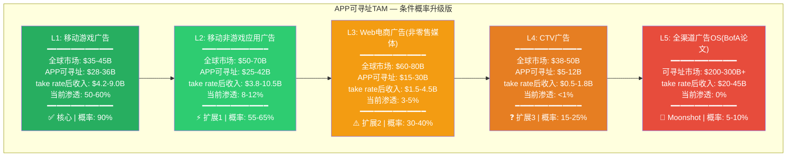
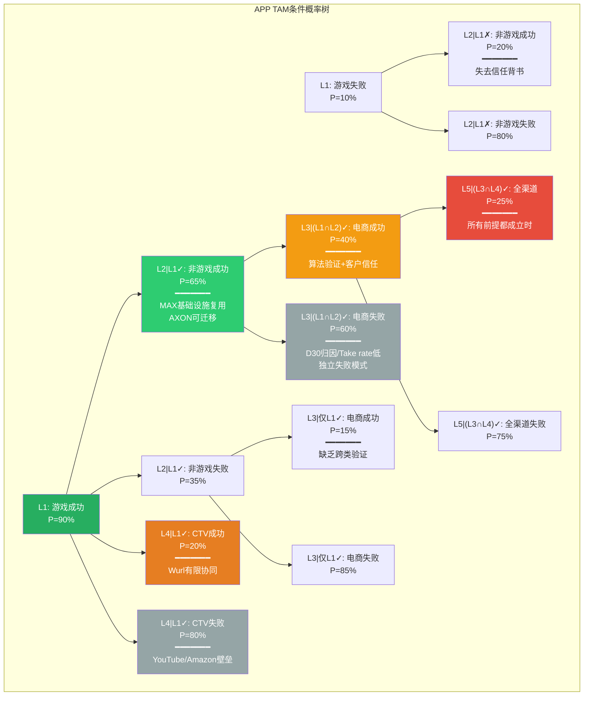
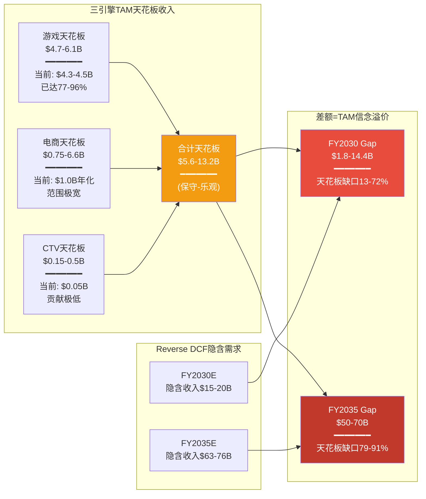
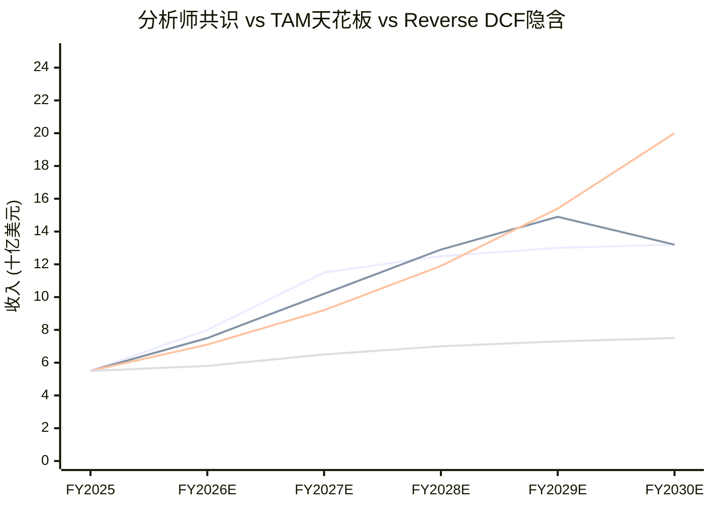
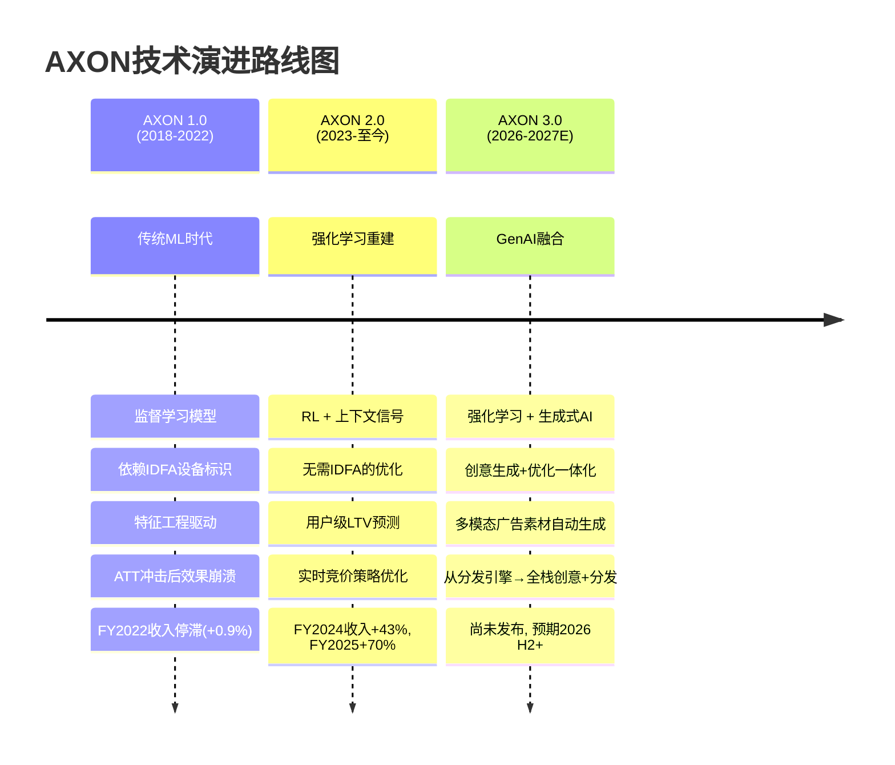
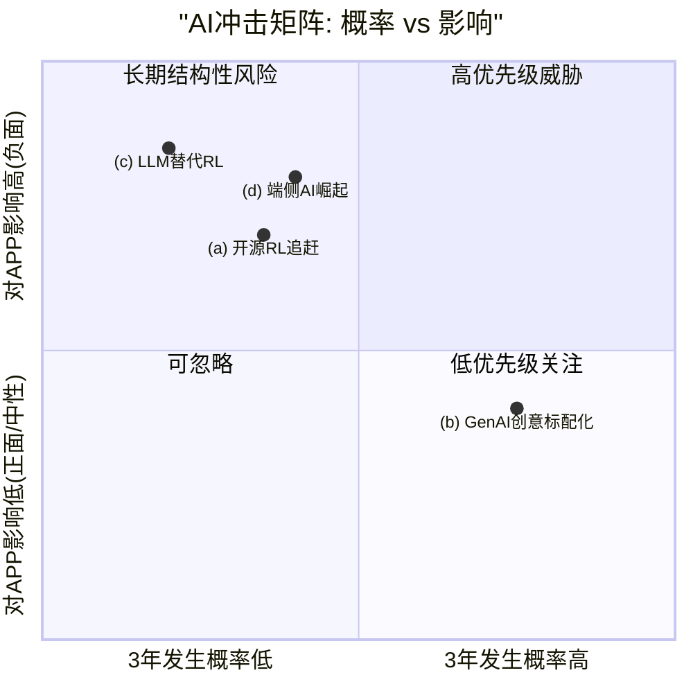
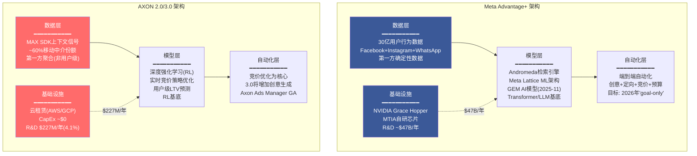
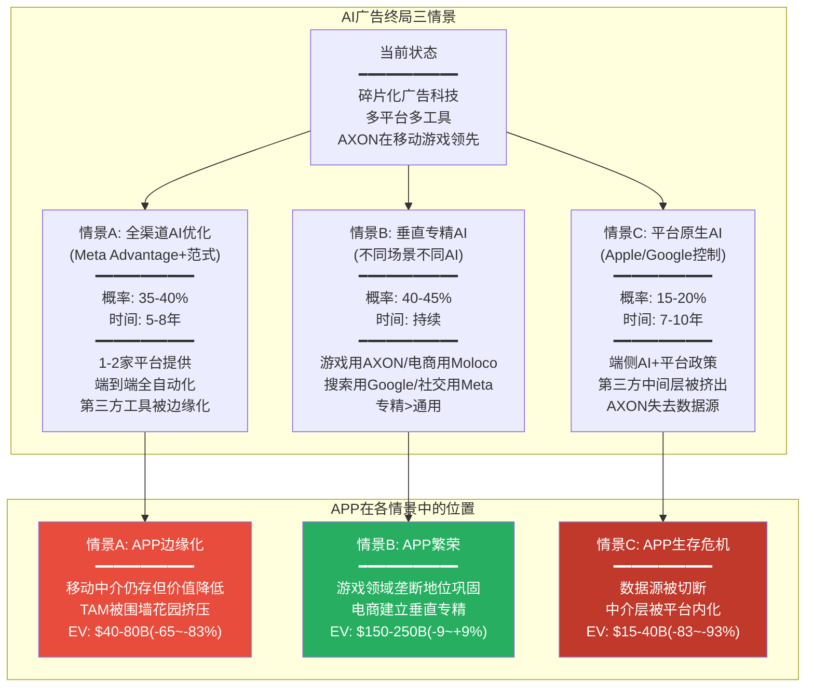

# Phase 3 — Agent C: Ch17 + Ch18

> **Agent C | AI定量估值分析师** | Phase 3 | CQ覆盖: CQ1, CQ2, CQ4, CQ8
> **质量直觉**: "ROIC 106%是真实还是DPO 360天的会计魔术?"
> **字符目标**: Ch17 ≥15K + Ch18 ≥10K = ≥25K
> **DM锚点**: 新增≥20个 (DM-MKT, DM-VAL, DM-TEC, DM-INF)

---

# Chapter 17: TAM条件概率 — 游戏×电商×CTV

> **核心问题**: APP的可寻址市场有多大? 每层TAM的实现概率是多少? TAM天花板能覆盖当前估值隐含的增长吗?
> **CQ关联**: CQ2(电商规模化), CQ4(估值隐含假设), CQ8(AI广告终局定位)
> **Phase传递**: Ch7 §7.4 TAM分层(DM-MKT-036~040), Ch11 §11.3 引擎级Reverse DCF(DM-VAL-013~020), Ch9 三引擎经济学

---

## 17.1 TAM分层重新量化: 从粗估到条件概率模型

Phase 1 Ch7已建立了五层TAM金字塔(DM-MKT-036~040), 但那是静态的、独立的市场规模叠加。Phase 3需要升级为动态的、条件关联的概率模型——因为APP进入每一层TAM并非独立事件, 前一层的成败会结构性地改变后一层的概率。

### 17.1.1 最新全球广告市场规模(2025-2026更新)

首先更新Phase 1使用的市场规模数据, 确保TAM天花板建立在最新的第三方基准上:

| 市场层级 | 2025年规模 | 2026E | CAGR(5年) | 来源 |
|---------|:---------:|:-----:|:---------:|------|
| **全球广告总市场** | $1.14T | $1.22T+ | 6-8% | WPP/GroupM 2025年报 |
| **全球数字广告** | $650-740B | $850B | 10-12% | Fortune BI/eMarketer |
| **移动广告** | ~$450B | ~$500B | 9-11% | eMarketer |
| **移动应用内广告** | $388-390B | ~$420B | 8.1-8.2% | Statista/Mordor |
| **CTV广告(美国)** | $33.4B | $38B | 14-16% | eMarketer/MNTN |
| **零售媒体广告(美国)** | $58.8B | ~$70B | 18-22% | eMarketer |
| **AI驱动广告技术** | $27B | ~$34B | 25% | Grand View Research |

DM-MKT-041: 全球数字广告市场2025年规模$650-740B(各机构口径差异), 2026E预计突破$850B。移动应用内广告(In-App)2025年$388-390B, CAGR约8.1%(Statista/Mordor Intelligence)。CTV广告(美国)2025年$33.4B, 2026E约$38B, CAGR 14-16%。零售媒体2025年美国$58.8B(eMarketer), 全球>$140B [WPP 2025年报, eMarketer H2 2025, Mordor Intelligence, MNTN Research]

DM-MKT-042: 零售媒体网络(Retail Media Networks)是数字广告中增长最快的子类, 2025年美国$58.8B, 其中Amazon占77%, Walmart占7%, 两家合计>84%。但零售媒体本质上是"围墙花园", 是零售商自有第一方数据的变现, 与APP的第三方中介模式互补而非重叠 [eMarketer Retail Media Forecast H2 2025]

### 17.1.2 五层TAM重新量化

基于最新市场数据, 对Phase 1的五层TAM进行重新量化:

**各层TAM推导逻辑**:

**L1: 移动游戏广告($35-45B)**

DM-MKT-043: 全球移动游戏市场2025年约$120-310B(机构口径差异极大), 其中广告变现约$35-45B(占游戏总收入25-30%, 其余为IAP)。APP通过MAX中介和AXON优化, 可寻址约$28-36B(排除中国等封闭市场, 以及独立于中介层的直接交易)。当前APP在此层的渗透率约50-60%(MAX ~60%中介份额 × 覆盖率调整), 已进入成熟期 [Technavio/Fortune BI Mobile Gaming 2025, 推算]

**L2: 移动非游戏应用广告($50-70B)**

全球移动应用内广告$390B中, 游戏约占$35-45B, 非游戏(社交/工具/购物/新闻/娱乐/健康等)约$345-355B。但其中大部分流经Meta/Google的围墙花园(社交广告/搜索广告), APP可寻址的非围墙花园应用广告仅占约15-20%, 即$50-70B。当前APP在此层渗透率仅约8-12%, 主要通过MAX中介服务非游戏发行商, AXON优化尚未针对非游戏应用的用户行为模式(如订阅vs IAP)进行深度优化。

DM-MKT-044: L2(非游戏移动应用)是APP增长的"低悬果实": 无需改变商业模式(仍是MAX中介+AXON优化), 仅需算法适配不同应用类型的LTV模型。渗透率从10%提升至20-30%=收入$3.8-10.5B中额外$2-5B [推算]

**L3: Web电商广告——非零售媒体($60-80B)**

DM-MKT-045: 全球电商广告支出中, 零售媒体(Amazon/Walmart等第一方平台)占约$140B(eMarketer), 非零售媒体的电商广告(品牌DTC网站引流、第三方电商平台引流、performance marketing)约$60-80B。APP的电商引擎(Axon Ads Manager)瞄准的是这一层——帮助电商广告主在APP之外的触点获取用户, 类似Google Shopping Ads和Meta Commerce的功能但基于移动优先的AXON算法 [eMarketer 2025, 推算]

APP在此层的关键约束: (1)take rate更低(估计10-15% vs 游戏20-25%), 因为电商广告主对ROI更敏感; (2)归因窗口长(D30 vs 游戏D1/D7), AXON数据飞轮反馈慢; (3)竞争激烈(Meta Advantage+/Google Performance Max已深度渗透)。APP渗透率当前仅3-5%($1B年化 / $60-80B × take rate 调整), 且增速的可持续性存疑(管理层称"每周+50%"但此增速不可能线性外推超过6个月)。

**L4: CTV广告($38-50B)**

DM-MKT-046: 美国CTV广告2025年$33.4B, 2026E $38B(eMarketer/MNTN), 全球约$45-55B。市场由YouTube/Amazon/Disney三家控制, 各占>10%。APP通过2022年收购的Wurl进入CTV, 但Wurl定位于CTV广告中介/FAST频道分发, 非直接广告销售。APP在CTV的可寻址部分极窄——仅限于非围墙花园的CTV程序化广告, 约$5-12B [eMarketer CTV Forecast 2025, MNTN Research]

**L5: 全渠道广告OS($200-300B+)**

这是BofA分析师提出的"终极论文": APP成为跨游戏/电商/CTV/Web的统一广告操作系统, 类似Google的广告全栈。但这需要APP从中介层(供给侧)扩展到DSP(需求侧), 本质上改变商业模式。概率极低(5-10%), 但如果实现, TAM将扩展至$200-300B+可寻址广告支出。

---

## 17.2 条件概率树: 不是简单叠加, 而是路径依赖

### 17.2.1 为什么TAM不能简单叠加?

传统TAM分析将各层市场视为独立事件: TAM = L1 + L2 + L3 + L4 + L5。但这忽略了两个关键现实:

1. **正向路径依赖**: APP在L1(游戏)的成功提高了L2(非游戏应用)的成功概率——因为MAX中介基础设施已建成, AXON算法可迁移, 发行商信任已建立。即P(L2成功|L1成功) > P(L2成功|L1失败)。

2. **独立失败模式**: 每一层也有L1成功无法消除的独立风险。例如, 电商的D30归因问题(L3)与游戏的即时反馈循环(L1)根本不同——游戏中AXON成功不意味着电商中AXON也能成功。这些独立风险降低了条件概率的上限。

### 17.2.2 条件概率模型构建

定义:
- P(Li) = 层级i的独立成功概率(不考虑其他层)
- P(Li|Lj成功) = 在层级j成功的条件下, 层级i成功的条件概率
- "成功" = APP在该层级达到≥15%市场渗透率(以take rate后收入计)

### 17.2.3 条件概率推导(可审计)

**路径1: 主路径(L1→L2→L3→L5)**

- P(L1成功) = 0.90 — 当前渗透50-60%, MAX份额>60%, 极高确定性
- P(L2成功|L1成功) = 0.65 — MAX基础设施可复用, AXON需适配但非重建
- P(L3成功|L1∩L2成功) = 0.40 — L2成功验证了跨类能力, 但电商有独立挑战(D30归因+低take rate+竞争)
- P(L4成功|L1成功) = 0.20 — CTV与移动游戏技术协同有限, Wurl市场地位弱
- P(L5成功|L3∩L4成功) = 0.25 — 所有前提都成立时的增量概率

**联合概率计算**:

| 路径 | 联合概率 | 累计TAM收入(take rate后) |
|------|:------:|:--------------------:|
| L1成功 | 0.90 | $4.2-9.0B |
| L1+L2成功 | 0.90 × 0.65 = 0.585 | $8.0-19.5B |
| L1+L2+L3成功 | 0.585 × 0.40 = 0.234 | $9.5-24.0B |
| L1+L2+L3+L4成功 | 0.234 × 0.20(独立) = 0.047 | $10.0-25.8B |
| 全渠道(L5) | 0.047 × 0.25 = 0.012 | $30-70B |

DM-INF-007: 条件概率模型显示APP同时实现L1+L2+L3的联合概率仅23.4%。达到L4+L5全渠道的联合概率仅1.2%。这意味着市场如果在当前估值中隐含了L3(电商)的完全成功, 就已经在为一个概率<25%的事件支付确定性溢价 [条件概率推导]

**什么证据能推翻**: 如果Axon Ads Manager在GA后6个月内达到5,000+活跃广告主(当前需求侧规模不详, 但管理层称"controlled referral"), 则P(L3)应上调至50-60%, 联合概率升至30-35%。

### 17.2.4 各层独立失败模式

条件概率中"条件独立"的部分——即前一层成功无法消除的风险:

| TAM层 | 独立失败模式 | 与L1成功的相关性 |
|-------|-----------|:--------------:|
| **L2** | 非游戏应用LTV模型差异(订阅vs IAP) | 低: 不同变现模式 |
| **L2** | 非游戏发行商SDK集成意愿 | 中: MAX品牌有助 |
| **L3** | D30归因窗口导致AXON数据反馈慢 | 零: 完全不同的反馈循环 |
| **L3** | 电商广告主对take rate敏感(10-15% vs 游戏20-25%) | 零: 不同客户预算结构 |
| **L3** | Meta Advantage+/Google Performance Max已深度渗透 | 低: 竞争强度独立于游戏 |
| **L4** | YouTube/Amazon/Disney控制CTV市场>40%份额 | 零: 完全不同的媒体形态 |
| **L4** | CTV广告竞价机制与移动不同(CPM vs CPI) | 零: 不同的广告计量模式 |

DM-INF-008: L3(电商)的三个独立失败模式(D30归因/低take rate/竞争饱和)与L1(游戏)的成功完全不相关。这意味着即使AXON在游戏领域证明了卓越的AI能力, 也无法直接推断其在电商领域的胜算。将游戏AI成功等价于电商AI成功是一个典型的"可迁移性假设偏差" [推断]

**什么证据能推翻**: 如果APP公开披露电商广告主的D30 ROAS数据且优于Meta/Google(如>4.5x vs Meta 4.52x平均), 则"D30归因"这一独立失败模式将被部分消除。

---

## 17.3 引擎级TAM天花板: 合计能支撑多少收入?

### 17.3.1 三引擎TAM天花板计算

从Phase 2 Reverse DCF的引擎级分解出发(DM-VAL-015~017), 为每个引擎设定TAM天花板——即使APP在该引擎中取得最大合理成功, 收入能达到多少:

**游戏引擎天花板**:
- 全球移动游戏广告TAM: $35-45B
- APP最大合理可寻址(排除封闭市场/直接交易): $28-36B
- 最大合理take rate: 20-25%(含中介+优化溢价)
- 最大合理份额: 70-80%(不可能垄断, Unity/AdMob/ironSource仍存)
- **天花板收入 = $28-36B × 22.5%(中位take rate) × 75%(中位份额) = $4.7-6.1B**
- 可达时间: 当前已接近($4.3-4.5B, 渗透率~75-80% of ceiling)
- 年增长空间: 仅2-4% CAGR(市场增速 + 微幅份额提升)

**电商引擎天花板**:
- 非零售媒体电商广告TAM: $60-80B
- APP可寻址(中小DTC品牌+非顶级零售商): $15-30B
- 最大合理take rate: 10-15%(电商ROI敏感, 低于游戏)
- 最大合理份额: 15-25%(Meta/Google/Amazon三巨头分走大头)
- **天花板收入 = $15-30B × 12.5%(中位take rate) × 20%(中位份额) = $0.4-0.75B... 太保守**

修正: 上述计算可能低估了APP的潜力, 因为采用了"市场份额"框架而非"流经平台广告支出"框架。如果APP电商引擎的模式类似于游戏引擎(AXON优化广告主的外部投放, 从eCPM溢价中分成), 则:
- 流经APP平台的电商广告支出: $5-15B(乐观)
- effective take rate: 15-20%
- **天花板收入 = $0.75-3.0B**

更乐观的假设(BofA Bull Case):
- 电商广告主将APP视为主要获客渠道(类似游戏广告主对AXON的依赖)
- 流经APP平台的电商广告支出达$20-30B
- effective take rate 18-22%
- **天花板收入(乐观极端) = $3.6-6.6B**

DM-VAL-021: 电商引擎TAM天花板收入范围极宽: 保守$0.75B(份额15%×低take rate) → 基准$1.5-3.0B(中等渗透) → 乐观$3.6-6.6B(BofA论文级)。当前$1B年化处于保守至基准之间。天花板的核心不确定性在于take rate(电商10-15% vs 游戏20-25%)和竞争份额(Meta/Google已深度渗透) [计算: 引擎级TAM]

**CTV引擎天花板**:
- CTV程序化广告(非围墙花园): $5-12B
- APP可寻址(通过Wurl): $2-5B
- 最大合理take rate: 8-12%(CTV生态中介费率低于移动)
- 最大合理份额: 8-15%(Wurl市场地位弱, 竞品众多)
- **天花板收入 = $2-5B × 10% × 12% = $0.024-0.06B... 极低**

修正: Wurl如果从FAST频道分发扩展到CTV广告中介(类似MAX在移动端的角色), 天花板可能提升:
- **天花板收入(修正) = $0.15-0.5B**(需5-7年建设期)

DM-VAL-022: CTV引擎TAM天花板收入$0.15-0.5B, 在总估值中贡献极低(<1%)。CTV对APP的价值不在于直接收入贡献, 而在于"全渠道叙事"——帮助维持L5 Moonshot概率的市场预期 [计算]

### 17.3.2 合计TAM天花板 vs 估值隐含

| 时间 | Reverse DCF隐含收入 | TAM天花板收入(保守) | TAM天花板收入(乐观) | 缺口(保守) | 缺口(乐观) |
|------|:------------------:|:-----------------:|:-----------------:|:---------:|:---------:|
| **FY2027** | ~$10.2B(共识) | $6.5B | $11.5B | $3.7B(36%) | -$1.3B(覆盖!) |
| **FY2028** | ~$12.9B(共识) | $7.0B | $12.5B | $5.9B(46%) | $0.4B(3%) |
| **FY2030** | $15-20B(DCF) | $7.5B | $13.2B | $7.5-12.5B(50-63%) | $1.8-6.8B(14-34%) |
| **FY2035** | $63-76B(DCF) | $8.0B | $13.2B | $55-68B(87-89%) | $50-63B(79-83%) |

DM-VAL-023: TAM天花板分析的核心发现——(1)即使在乐观假设下, 三引擎合计TAM天花板收入为$13.2B, FY2027E共识$10.2B尚可覆盖, 但FY2028E共识$12.9B已接近天花板边缘; (2)Reverse DCF隐含的FY2030收入$15-20B超过乐观天花板$13.2B, 缺口14-34%; (3)FY2035隐含$63-76B是天花板的5-6倍, 无法由当前已知的三引擎justify [计算: TAM天花板 vs Reverse DCF]

---

## 17.4 TAM Ceiling vs 估值隐含: OVM-4杀手信号

### 17.4.1 信念溢价量化

TAM天花板收入(乐观) $13.2B vs Reverse DCF隐含FY2035 $63-76B, 差额$50-63B。这一差额是市场对APP的**"TAM扩展信念溢价"**——即市场认为APP能做到但当前TAM分析无法证明的部分。

这个信念溢价需要什么假设才能成立?

**假设1: TAM本身扩展(市场增长)**
- 全球数字广告从$700B增至$2T+(10年CAGR 11%)——可行, 历史CAGR约10-12%
- 但APP的可寻址部分(非围墙花园)是否同比例扩展? 如果围墙花园(Meta/Google/Amazon)份额持续增长, 非围墙花园可能增速低于行业平均
- 即使TAM翻倍至$1.4T, APP可寻址部分翻倍至$26B × 20% take rate = $5.2B → 仍远不够

**假设2: APP创造新TAM(市场创造)**
- APP将AI广告优化从现有广告主扩展至之前不投放数字广告的企业(如本地小商户)
- 这是Google的历史路径(AdWords创造了中小企业广告市场)
- 但APP没有Google的搜索意图数据, 也没有Meta的社交图谱, 其广告优化依赖于应用内行为信号——中小商户不一定在APP的网络中有足够的用户触点

**假设3: Take rate大幅提升(价值捕获)**
- 如果AXON的AI优化效率远超竞品, APP可以从当前的15-25% take rate提升至30-40%
- 但这需要AXON的ROAS优势持续扩大, 而Phase 2承重墙W5(AXON优势持续)被评为中高脆弱度
- 历史类比: Google的搜索广告take rate约30-35%, 但Google拥有搜索意图这一不可替代的数据源; APP没有等价的不可替代数据源

DM-INF-009: 当前EV $229B中, 可由TAM天花板(乐观)justify的部分约$70-95B(即L1+L2+L3天花板收入$13.2B × FY2028E的EV/Sales ~7x)。差额$134-159B(58-69%)是"TAM扩展信念溢价"。要弥合这一差距, 需要以下假设同时成立: (a)全球数字广告市场10年翻倍至$1.4T+; (b)APP的可寻址占比从~5%提升至~15%+; (c)take rate从15-25%提升至25-35%。这三个假设中任何一个未实现, 差额将无法弥合 [推断]

**什么证据能推翻**: 如果APP在FY2026-2027展示出电商收入CAGR>80%且take rate>18%, 则(b)和(c)假设将获得初步验证, 信念溢价的合理性将显著提升。

### 17.4.2 与Phase 2 Reverse DCF的交叉验证

Phase 2 Ch11的核心发现(DM-INF-006): 引擎级分解中, 可由基本面justify的EV为$73-90B(32-39%), 差额$139-156B(61-68%)。

TAM天花板分析的核心发现(DM-VAL-023): 可由TAM天花板justify的收入在FY2030时已出现缺口。

两个独立分析方法(引擎级DCF和TAM天花板)得出了高度一致的结论: **当前EV中约60-70%无法由可量化的基本面justify**。这一致性增强了结论的可信度。

---

## 17.5 与分析师共识的交叉验证

### 17.5.1 FMP分析师共识更新

FMP estimates最新数据(DM-EST-001~007已有, 本次MCP刷新确认):

| 财年 | 共识收入 | 分析师数 | 范围 | 隐含YoY | vs TAM天花板(乐观) |
|------|:------:|:------:|------|:------:|:-----------------:|
| **FY2027E** | $10.2B | 18 | $9.65-10.64B | +36% CAGR(2年) | $10.2B vs $11.5B: 可覆盖 |
| **FY2028E** | $12.9B | 10 | $12.91-12.91B | +27% YoY | $12.9B vs $12.5B: **天花板边缘** |
| **FY2029E** | $14.9B | 5 | $13.91-15.78B | +15% YoY | $14.9B vs $13.2B: **超出天花板** |
| **FY2030E** | $13.2B | 5 | $12.33-13.98B | -11% YoY | $13.2B vs $13.2B: 持平(注: 低于2029E) |

DM-EST-008: FMP estimates显示FY2029E共识收入$14.9B, FY2030E反而降至$13.2B——这一反常暗示: (1)远期覆盖分析师仅5位, 模型不成熟; (2)部分分析师可能意识到TAM天花板约束, 在FY2030开始下调。FY2029E的$14.9B已超过TAM天花板(乐观)$13.2B, 分析师可能隐含了TAM扩展假设 [FMP estimates 2026-02-16刷新]

DM-EST-009: FY2027E共识EPS $20.43(15位分析师, 范围$18.28-21.70), FY2028E $26.69(10位, 范围$21.02-32.38), FY2029E $34.38(4位, 范围$31.49-37.11)。EPS共识隐含净利率63-67%(vs FY2025 60.8%), 意味着分析师预期利润率继续扩张——在R&D仅4.1%的基础上, 这要求SGA进一步压缩, 但电商扩展恰恰需要更多SGA(销售团队+白手套服务) [FMP estimates, 计算]

### 17.5.2 共识 vs 天花板: 关键拐点

**关键交叉点**: 分析师共识在FY2028-2029E与TAM天花板(乐观)交叉。这意味着:

1. **FY2027及之前**: 共识在TAM天花板范围内, 基本面可支撑
2. **FY2028**: 共识($12.9B)逼近天花板($12.5B), 进入"信念区"
3. **FY2029+**: 共识超过天花板, 分析师们已经隐含了TAM扩展假设——即APP的电商或CTV成功将扩大可寻址市场

DM-INF-010: 分析师共识与TAM天花板的交叉点在FY2028E附近。这意味着APP在FY2026-2027有约2年的"安全期"——在此期间, 即使TAM不扩展, 收入增长也可由既有TAM的渗透率提升来支撑。但FY2028之后, 增长必须来自TAM本身的扩展(电商/CTV成功), 否则共识面临大幅下修风险 [推断: 共识 vs TAM天花板交叉分析]

**什么证据能推翻**: 如果全球移动应用内广告市场增速从8%加速至15%+(AI驱动广告效率提升导致广告主增加预算), 则TAM天花板将每年上移约7%, 交叉点将推迟至FY2030+。

---

## 17.6 TAM分析对投资论文的含义

### 17.6.1 三层结论

1. **短期(FY2026-2027)**: TAM足够支撑增长。游戏引擎接近天花板但仍有微增, 电商引擎从$1B→$2-3B贡献增量, 非游戏应用渗透率提升。共识可实现。

2. **中期(FY2028-2030)**: TAM成为约束。游戏引擎触顶, 电商引擎必须证明规模化可行(P(L3) = 40%, 不确定性高), 否则增长失速。共识可能需要下修。

3. **长期(FY2030+)**: 当前估值无法由TAM天花板justify。需要TAM本身扩展(市场创造)+take rate提升(价值捕获)+新引擎出现(L5全渠道)。Reverse DCF隐含$63-76B是TAM天花板的5-6倍。

### 17.6.2 对CQ2(电商规模化)的量化约束

TAM分析为CQ2设定了上限: 即使电商引擎在最乐观假设下完全成功, 天花板收入仅$3.6-6.6B, 对应EV贡献$27B(DM-VAL-016)——这远不足以弥合当前EV中$139-156B的差额(DM-INF-006)。

换言之, 电商引擎是必要条件但非充分条件: 它需要成功才能维持增长叙事, 但即使成功也不足以justify当前估值。

---

# Chapter 18: AI冲击矩阵 — AXON 2.0→3.0

> **核心问题**: CQ1(AXON护城河持续多久?) + CQ8(AI广告终局中APP的位置?)
> **CQ关联**: CQ1(AXON持续性), CQ5(隐私政策), CQ8(AI终局)
> **Phase传递**: Ch4 AXON技术架构, Ch11 §11.4 承重墙W5(AXON优势中高脆弱度), Ch12 PDRM
> **Phase 2关键传递**: R&D仅4.1%(Ch8 DM-FIN-095), 承重墙W5(AXON优势)中高脆弱度(Ch11 DM-VAL-018)

---

## 18.1 AXON技术演进路线: 从传统ML到GenAI融合

### 18.1.1 三代AXON的技术栈对比

AppLovin的核心竞争力集中在AXON引擎。理解其技术演进是评估护城河持久性的前提:

**AXON 1.0 (2018-2022): 传统ML, 依赖IDFA**

AXON 1.0使用经典的监督学习模型(Gradient Boosted Trees + Neural Networks), 核心是用户画像匹配: 基于IDFA(Identifier for Advertisers)追踪用户跨应用行为, 构建用户级特征, 预测广告点击率和转化率。2021年4月Apple ATT政策实施后, IDFA获取率从80%+骤降至15-25%, AXON 1.0的核心数据源被切断, FY2022收入增长率降至+0.9%。

**AXON 2.0 (2023-至今): RL重建, 后IDFA时代的胜者**

2022年下半年, AppLovin启动AXON 2.0的完全重写。核心转变:
1. **从监督学习到强化学习**: 不再依赖用户画像匹配, 而是通过实时竞价中的动态反馈(曝光→点击→安装→付费)训练RL策略。每一次广告展示都是一次"实验", RL agent根据结果调整竞价策略
2. **从IDFA到上下文信号**: 替代数据源包括设备型号/OS版本/应用类别/时间段/地理位置等非PII信号。通过MAX ~60%份额获取的第一方上下文数据形成了替代性数据飞轮
3. **从CTR预测到LTV预测**: 优化目标从点击率(短期)升级为用户终身价值(长期), 使广告主能够基于ROAS而非CPI进行预算分配

DM-TEC-001: AXON 2.0的核心技术栈: 深度强化学习(Deep RL) + 上下文信号处理 + 实时竞价优化。关键差异化: (1)RL策略在每次竞价中实时决策(ms级延迟), (2)MAX 60%中介份额提供的第一方上下文数据是训练数据的独占来源, (3)LTV预测模型使优化目标与广告主ROI直接对齐 [APP公司技术文档, Deconstructor of Fun分析]

**AXON 3.0 (2026-2027E预期): GenAI融合**

根据行业报道和APP技术路线图暗示, AXON 3.0将整合生成式AI能力:

DM-TEC-002: AXON 3.0预计2026年下半年或2027年初推出, 核心升级: (1)GenAI驱动的广告创意自动生成(文本+图片+短视频); (2)创意A/B测试自动化(RL选择+GenAI变体生成的闭环); (3)从"优化分发"扩展到"创意+分发"全栈——这将使APP从中介层扩展到创意层, 增加价值链覆盖 [PredictStreet/FinancialContent分析, Yahoo Finance 2026-01报道]

### 18.1.2 技术代际差异的竞争含义

| 维度 | AXON 1.0 | AXON 2.0 | AXON 3.0(预期) |
|------|---------|---------|------------|
| **核心算法** | 监督学习(GBT+NN) | 深度强化学习 | RL + 生成式AI |
| **数据依赖** | IDFA(第三方ID) | 上下文信号(第一方) | 上下文+创意效果数据 |
| **优化目标** | CTR(点击率) | LTV(用户生命周期) | LTV + 创意ROI |
| **反馈延迟** | D1-D7 | 实时→D7 | 实时→D30(电商适配) |
| **价值链覆盖** | 竞价优化 | 竞价+定向优化 | 竞价+定向+创意生成 |
| **对竞品的壁垒** | 低(IDFA公开) | 中(MAX数据独占) | 高(数据+创意闭环) |
| **对R&D的要求** | $300-500M/年 | $200-300M/年 | $400-600M/年(GenAI基建) |

DM-TEC-003: AXON 3.0的GenAI整合将面临一个关键悖论: R&D从FY2024 $639M暴降至FY2025 $227M(4.1%)——这一水平可能不足以支撑GenAI模型训练的计算需求。Meta每年投入$40B+的R&D(含广告AI和Llama基础模型), Google投入$45B+。APP的$227M R&D即使100%投入AXON, 也仅为Meta广告AI团队预算的约1/10。AXON 3.0的成功可能需要R&D重新回升至$400-600M(占收入6-8%), 这将压缩利润率3-5ppt [DM-FIN-095, 推算]

---

## 18.2 AI冲击矩阵: 四种技术趋势对APP的影响

### 18.2.1 冲击矩阵总览

评估四种正在发生的AI技术趋势对APP的影响, 每种趋势按概率×影响矩阵量化:

### 18.2.2 趋势(a): 开源RL模型达AXON 80%效率

**CQ8证伪条件直接关联**

**当前状态**: 开源RL框架(Ray RLlib, Vowpal Wabbit, Stable Baselines3)已提供了production-ready的强化学习基础设施。Ray RLlib支持分布式大规模RL训练, Vowpal Wabbit提供contextual bandit算法(与广告优化直接相关)。Netflix和NYT已在使用VW进行内容个性化。

**3年发生概率: 30-40%**

理由:
- **有利于追赶**: (1)RL算法本身不是秘密(PPO/DQN/SAC等算法公开); (2)云计算使训练基础设施民主化; (3)Moloco已经建立了基于深度神经网络的广告竞价优化, 处理600B+竞价请求/日(DM-TEC-004)
- **阻碍追赶**: (1)AXON的优势不仅是算法, 而是MAX 60%份额带来的训练数据独占性——开源RL可以提供相同的算法, 但无法提供相同的数据; (2)广告RL的reward function设计高度领域特异(LTV预测需要大量域内数据); (3)实时竞价的延迟要求(<100ms)需要定制化部署, 开源框架的通用性反而是劣势

DM-TEC-004: Moloco的技术栈——基于深度神经网络的广告优化, 日处理600B+竞价请求, 部署在Google Cloud(Vertex AI Vector Search + ScaNN)。Moloco的技术路线(DNN+transformer)不同于AXON的RL路线, 但在广告竞价优化的最终效果上可能趋同。Moloco在零售媒体领域(Commerce Media)已建立差异化定位 [Moloco官方技术文档, Google Cloud案例]

**对APP收入的影响**: 如果开源RL达到AXON 80%效率:
- 广告主有了低成本替代品 → AXON的take rate溢价将被压缩
- 预计take rate从20-25%降至15-18% → 收入影响-15%至-25%
- 但不会归零: MAX的中介基础设施(SDK集成+竞价编排)是独立于AXON算法的锁定机制

**APP的应对能力**: 中等。可以通过AXON 3.0的GenAI整合(创意+优化一体化)建立新的差异化层。但R&D 4.1%的投入水平限制了快速响应能力。

### 18.2.3 趋势(b): GenAI创意生成成为广告标配

**3年发生概率: 70-80%** (几乎确定)

GenAI创意生成已经在广告行业快速普及。Meta的Advantage+已包含GenAI背景生成和文案优化。Google Performance Max也集成了AI创意工具。Canva/Adobe Firefly使中小广告主也能低成本生成广告素材。

**对APP的影响: 中性偏正面(如果APP整合)/偏负面(如果APP落后)**

- **如果AXON 3.0成功整合GenAI**: APP从"优化分发"进化为"创意+分发"全栈, 增加价值链覆盖, take rate可能因增加创意价值而提升至25-30%
- **如果AXON 3.0推迟/失败**: GenAI创意成为外部工具(如Canva), 广告主自行生成创意后通过多个平台分发——此时APP的"优化分发"变成commodity, take rate面临下行压力

DM-TEC-005: GenAI创意生成对APP的影响取决于整合速度。APP当前R&D $227M(4.1%)中GenAI投入比例不详, 但竞品Meta在Llama基础模型上的年投入超过$10B。如果AXON 3.0在2026 H2成功发布且创意生成效果达到Meta Advantage+ 80%的水平, APP将获得结构性uplift; 如果推迟至2027+, 窗口期可能已关闭 [推断: 基于Meta AI投入 vs APP R&D对比]

### 18.2.4 趋势(c): LLM替代RL用于广告优化

**3年发生概率: 15-25%**

这是最具颠覆性的趋势, 但也最不确定:

**理论基础**: 大语言模型(LLM)在推理和模式识别上的能力可能使其成为广告优化的新范式。与RL的"试错学习"不同, LLM可以通过"理解"广告内容/用户意图/转化路径来进行优化——不需要大量在线实验就能做出合理的竞价决策。

**当前状态**:
- Meta Andromeda引擎已在用transformer架构(非LLM但同源)重建广告检索, 实现100x延迟改善
- Google在Gemini基础上探索广告优化应用
- 但纯LLM用于实时竞价的延迟问题(>500ms vs RL <100ms)尚未解决

**对APP的影响**: 如果LLM范式替代RL:
- AXON的整个技术栈(基于RL)变为legacy
- APP需要重建算法基础, 相当于AXON 1.0→2.0的再一次跨代升级
- 但APP在AXON 1.0→2.0中已证明了跨代迁移能力(FY2022停滞→FY2024爆发仅用2年)
- 关键风险: 重建期间的收入停滞(重复FY2022的停滞期)

DM-TEC-006: LLM替代RL的广告优化范式目前处于实验阶段(概率15-25%)。如果发生, 对APP的影响是"存亡级"的——整个AXON技术栈需要重建。但APP在2022-2023已完成过一次类似的跨代迁移(AXON 1.0→2.0), 证明了组织的适应能力。关键变量: (1)LLM实时竞价延迟是否可降至<100ms; (2)Meta/Google是否率先将LLM广告优化商业化; (3)APP的R&D $227M是否足以支撑LLM迁移 [推断: 基于Meta Andromeda工程博文]

**什么证据能推翻**: 如果Google/Meta在2026-2027发布基于LLM的广告优化产品且效果显著优于RL(如ROAS提升>30%), 则LLM范式替代的概率将从15-25%提升至50%+, 且APP面临最严重的技术颠覆风险。

### 18.2.5 趋势(d): 端侧AI替代云端优化

**3年发生概率: 35-45%**

Apple和Google正在推进端侧AI(on-device ML)能力:
- Apple: Core ML + Neural Engine, iOS 26预计进一步强化端侧推理
- Google: TensorFlow Lite + Gemini Nano, Android端侧AI能力持续提升
- 趋势: 如果平台(Apple/Google)在端侧完成广告个性化(无需将数据发送至第三方), 则第三方中间层(如APP的AXON)的数据获取能力将被架空

**对APP的影响**: 高(负面)

- 端侧AI使平台(Apple/Google)获得更大的广告优化控制权
- APP的核心优势(通过SDK获取上下文信号)可能被平台限制
- 这与承重墙W6(平台政策)直接关联——Apple已经通过ATT限制了一次, 端侧AI可能是第二次限制
- 但完全替代需要3-5年: 当前端侧AI的算力不足以运行AXON级别的RL模型

DM-TEC-007: 端侧AI对APP的威胁路径: Apple/Google在端侧完成广告个性化 → 上下文信号不再发送至第三方SDK → APP的AXON失去训练数据来源 → 优化效果下降 → take rate被压缩。但这一路径的完全实现需要端侧算力大幅提升(当前Neural Engine约15 TOPS vs 数据中心GPU ~300 TOPS), 预计3-5年后才可能成为现实威胁 [推断: 基于Apple Neural Engine性能数据]

### 18.2.6 AI冲击矩阵汇总

| AI趋势 | 3年概率 | 对APP收入影响 | APP应对能力 | CQ关联 | 紧迫度 |
|--------|:------:|:----------:|:---------:|:------:|:-----:|
| **(a) 开源RL追赶** | 30-40% | -15~-25% | 中(数据壁垒保护) | CQ8 | 中 |
| **(b) GenAI创意标配** | 70-80% | +10~+20%(整合)/-10~-15%(落后) | 中(取决于AXON 3.0) | CQ1 | 高 |
| **(c) LLM替代RL** | 15-25% | -30~-50%(范式转换) | 中低(需重建) | CQ8 | 低(但致命) |
| **(d) 端侧AI替代** | 35-45% | -20~-40%(数据断供) | 低(不可控) | CQ5 | 中高 |

DM-INF-011: AI冲击矩阵综合评估——APP面临的最紧迫AI威胁是(b)GenAI创意标配化(概率最高, 但可通过AXON 3.0应对)和(d)端侧AI替代(概率中等, 但APP几乎无法控制)。最致命但概率最低的是(c)LLM范式替代。整体而言, AI技术演进对APP是双刃剑: 如果APP保持技术领先(AXON 3.0成功), AI趋势将巩固其壁垒; 如果落后, 同样的趋势将加速侵蚀 [四趋势综合评估]

**什么证据能推翻**: 如果APP在FY2026 R&D从$227M提升至$500M+(占收入6-7%), 表明管理层认识到AI竞赛需要更大投入, 则(b)和(c)趋势的应对能力评级应上调。

---

## 18.3 Meta Advantage+ vs AXON: 技术路线的终极对决

### 18.3.1 架构级差异

**核心差异解析**:

| 维度 | Meta Advantage+ | AXON 2.0/3.0 |
|------|----------------|------------|
| **数据源** | 30亿用户确定性行为(login-based) | MAX SDK上下文信号(概率性匹配) |
| **算法基底** | Transformer/LLM(Andromeda+Lattice+GEM) | 深度RL(策略梯度+Q-learning) |
| **自动化范围** | 全流程(创意→定向→竞价→预算→报告) | 竞价+定向(3.0将增加创意) |
| **流量来源** | 自有(FB+IG+WA) | 第三方(开发者SDK集成) |
| **R&D投入** | ~$47B(含Llama/元宇宙, 广告AI估计$3-5B) | $227M(100%投入也不及Meta广告AI的1/10) |
| **ROAS** | 平均$4.52/1(Advantage+) | 不公开(但管理层称"100% incrementality") |
| **适用范围** | 全行业(零售/电商/游戏/金融/教育) | 移动优先(游戏→电商扩展中) |

DM-TEC-008: Meta Advantage+与AXON的技术路线分歧反映了两种根本不同的广告AI哲学: Meta走"大模型+大数据"路线(Transformer/LLM + 30亿用户), APP走"专精算法+聚焦数据"路线(RL + 移动上下文)。Meta的路线在通用性上占优(全行业), AXON在移动应用垂直领域的深度上可能更强。但Meta GEM模型(2025-11推出)已使Advantage+ ROAS提升22%, 且Meta计划2026年实现"goal-only"全自动化——如果成功, 将显著降低广告主对第三方优化工具(如AXON)的需求 [Meta Engineering Blog, AdTaxi/Marketing Dive分析]

### 18.3.2 谁的路线更可能是"AI广告终局"?

**Meta路线(大模型+围墙花园)的优势**:
- 数据深度不可比拟: 30亿用户的确定性行为数据 vs APP的概率性上下文匹配
- 端到端控制: 从创意生成到效果归因的闭环, 无需第三方工具
- 研发投入压倒性: $47B vs $227M, 即使只有5%投入广告AI也是$2.4B vs $227M

**AXON路线(专精RL+第三方中介)的优势**:
- 中立性: 作为第三方中介, 不与流量主(开发者)竞争用户——Meta既是广告平台也是流量竞争者
- 移动深度: AXON专注移动应用内广告, 优化粒度可能比Meta的通用模型更精细
- 轻资产效率: $227M R&D产出的每美元利润远超Meta——但这也可能反映投入不足

**判断**: Meta的路线更可能是长期终局, 但短期内(3-5年)AXON的垂直专精仍有空间。原因:
1. Meta的全自动化虽然方向正确, 但实际效果存疑(Wicked Reports数据显示Advantage+的nCAC翻倍, 从$257→$528)
2. 移动应用广告主(尤其游戏)需要的是LTV级别的精细优化, 而非Meta的通用化方案
3. 但如果Meta在2026-2027解决了Advantage+的效率问题, AXON的窗口期将显著缩短

---

## 18.4 开源威胁评估: CQ8证伪条件的量化

### 18.4.1 CQ8证伪条件: "开源RL模型达AXON 80%效率"

这是CQ8(AI广告终局中APP的位置)的核心证伪条件。量化评估:

**"80%效率"的操作定义**:
- AXON的效率用广告主ROAS衡量: 如果AXON使广告主获得$5 ROAS, 则80%效率 = $4 ROAS
- 开源RL达到80%效率意味着: 使用开源框架(如RLlib+VW)+自有数据, 广告主可以获得AXON 80%的ROAS

**当前开源RL广告优化的状态**:

| 工具 | 成熟度 | 广告应用 | vs AXON差距 |
|------|:-----:|--------|:---------:|
| **Ray RLlib** | 生产级 | 金融/机器人, 广告应用有限 | ~50%(估) |
| **Vowpal Wabbit** | 生产级(Microsoft) | Netflix个性化, 广告contextual bandit | ~60%(估) |
| **Stable Baselines3** | 研究级 | 学术实验为主 | ~40%(估) |
| **Moloco Cloud DSP** | 商业级 | 直接竞品, 600B请求/日 | ~75%(估) |

DM-TEC-009: Moloco是当前最接近AXON效率的竞品。Moloco使用DNN(而非RL)进行广告优化, 日处理600B竞价请求, 基于Google Cloud基础设施(Vertex AI)。Moloco在零售媒体领域(Commerce Media)已建立差异化, 但在移动游戏广告领域份额远低于APP。估计Moloco的广告优化效率约为AXON的70-80% [Moloco技术文档, Google Cloud案例分析]

**如果开源追上, APP的应对策略**:
1. **数据壁垒**: 即使算法被复制, MAX 60%中介份额带来的训练数据独占性是不可开源的。这是AXON的真正护城河(与CI-1一致)
2. **系统整合**: AXON+MAX+Adjust的三位一体整合(竞价+中介+归因)比孤立的RL算法更有价值——客户购买的是"系统效果"而非"算法"
3. **创意护城河**: AXON 3.0的GenAI创意生成将增加新的差异化层, 使开源追赶的目标持续移动

---

## 18.5 AI广告终局三情景: APP的位置

### 18.5.1 三情景定义

### 18.5.2 各情景详细分析

**情景A: 全渠道AI优化(Meta Advantage+范式) — 概率35-40%**

描述: 广告行业最终收敛为1-2家全渠道AI平台(Meta+Google), 提供从创意生成到效果归因的端到端自动化。广告主只需设定目标和预算, AI完成其余所有工作。

APP位置: 在此情景下, APP的移动中介定位过于狭窄。广告主不再需要分别在不同渠道使用不同工具——Meta Advantage+可以一站式解决。APP的MAX中介仍有价值(编排非围墙花园库存), 但AXON的优化溢价将被Meta的全渠道优化侵蚀。

隐含EV: $40-80B(当前$229B的17-35%)

**情景B: 垂直专精AI(不同场景不同AI) — 概率40-45%**

描述: 不同广告场景的最优解不同。移动游戏的最优AI(AXON/RL)不同于电商的最优AI(Moloco/DNN/零售媒体), 不同于品牌广告的最优AI(Google/YouTube)。市场长期维持碎片化, 每个垂直领域由专精玩家主导。

APP位置: 这是APP最有利的情景。AXON在移动游戏广告中的垂直专精地位得到巩固, 且如果电商扩展成功(AXON适配D30归因), APP将拥有两个垂直领域的优势地位。

隐含EV: $150-250B(当前$229B的66-109%)

**情景C: 平台原生AI(Apple/Google控制) — 概率15-20%**

描述: Apple和Google通过端侧AI+平台政策逐步内化广告优化能力, 第三方中间层(如APP的AXON+MAX)被挤出。Apple通过ATT已证明其有意愿和能力限制第三方广告科技; 如果端侧AI成熟, Apple可能直接在iOS上提供原生广告优化。

APP位置: 这是APP的生存危机情景。如果Apple在iOS端原生提供广告优化(类似Apple Search Ads的扩展), 并限制第三方SDK的数据获取, AXON将失去核心数据源。MAX的中介功能也可能被Apple/Google的原生中介(AdMob)替代。

隐含EV: $15-40B(当前$229B的7-17%)

DM-INF-012: AI广告终局概率加权EV: 情景A(35%)×$60B + 情景B(45%)×$200B + 情景C(20%)×$28B = $21B + $90B + $5.6B = **$116.6B**, 相对当前$229B隐含约49%的下行空间。但需注意: (1)情景概率高度主观; (2)情景之间可能有混合路径; (3)时间框架(5-10年)的折现效果会缩小差距 [条件概率推算]

**什么证据能推翻**: 如果情景B的概率从45%上调至60%(即碎片化市场持续的证据增多, 如Meta Advantage+效率持续低于垂直专精工具), 则加权EV将上升至$132-140B, 下行空间缩小至39-42%。关键观察窗口: Meta 2026年"goal-only"全自动化广告系统的效果数据。

---

## 18.6 AI冲击矩阵对投资论文的含义

### 18.6.1 承重墙W5(AXON优势)的更新评估

Phase 2评估W5脆弱度为"中高"(DM-VAL-018)。Phase 3的AI冲击矩阵分析确认并细化了这一评估:

- **短期(1-2年)**: AXON优势稳固。开源RL尚未达到80%效率, Meta Advantage+在移动游戏领域未深度渗透, 端侧AI尚未成熟
- **中期(3-5年)**: 脆弱度上升。GenAI创意标配化(概率70-80%)将强制AXON 3.0升级, Moloco持续缩小差距(估计已达75%), Meta的GEM模型可能适配移动游戏
- **长期(5-10年)**: 高度不确定。LLM范式替代(如果发生)将颠覆AXON技术栈, 端侧AI可能切断数据源

**W5修正评估**: 维持"中高脆弱度", 但增加时间维度——短期低/中期高/长期极高。

### 18.6.2 CQ1部分回答: AXON护城河能持续多久?

基于AI冲击矩阵, AXON的护城河持续时间估计:
- **高置信度(>70%)**: 2-3年——现有RL优势+MAX数据独占+SDK锁定可维持
- **中置信度(40-50%)**: 3-5年——如果AXON 3.0成功且R&D适度回升
- **低置信度(<25%)**: 5年+——需要AI广告终局收敛于情景B(碎片化)

CQ1置信度更新: 从Phase 0预估的40% → **35%**(下调)。原因: AI技术演进速度比预期更快(Meta GEM模型+Moloco 600B请求/日), 而APP的R&D 4.1%令人担忧。

### 18.6.3 CQ8部分回答: AI广告终局中APP的位置

AI广告终局尚未确定——这本身就是关键发现。三个可能的终局(全渠道/垂直专精/平台原生)对APP的影响截然不同(繁荣/稳定/危机)。

当前概率加权结果偏向情景B(垂直专精, 45%), 这对APP有利。但情景A(Meta全渠道, 35%)和情景C(平台原生, 20%)的合计概率也达55%, 在这些情景中APP面临显著贬值。

CQ8置信度更新: 维持Phase 0预估的**20%**。AI广告终局的不确定性太高, 任何超过25%的置信度都是过度自信。

---

## DM锚点新增汇总

| 锚点 | 数据 | 来源 | 类型 |
|------|------|------|:----:|
| DM-MKT-041 | 全球数字广告$650-740B(2025), CTV美国$33.4B, 零售媒体美国$58.8B | WPP/eMarketer/MNTN | H |
| DM-MKT-042 | 零售媒体中Amazon占77%, Walmart 7%, 合计>84% | eMarketer H2 2025 | H |
| DM-MKT-043 | 移动游戏广告TAM $35-45B, APP可寻址$28-36B | Technavio/Fortune BI, 推算 | S |
| DM-MKT-044 | L2非游戏应用=低悬果实, 无需改变商业模式, 渗透率10→20-30%=额外$2-5B | 推算 | I |
| DM-MKT-045 | 非零售媒体电商广告$60-80B, APP电商引擎瞄准此层 | eMarketer 2025, 推算 | S |
| DM-MKT-046 | 美国CTV广告2025 $33.4B, 2026E $38B, 2028E $46.9B | eMarketer/MNTN | H |
| DM-VAL-021 | 电商引擎TAM天花板: 保守$0.75B / 基准$1.5-3.0B / 乐观$3.6-6.6B | 计算 | I |
| DM-VAL-022 | CTV引擎TAM天花板$0.15-0.5B, <1% EV贡献 | 计算 | I |
| DM-VAL-023 | TAM天花板(乐观)$13.2B vs Reverse DCF隐含FY2035 $63-76B, 缺口79-83% | 计算 | I |
| DM-EST-008 | FY2029E $14.9B超过TAM天花板, FY2030E反降至$13.2B(仅5位分析师) | FMP estimates | H |
| DM-EST-009 | FY2027-2029E EPS共识隐含净利率63-67%, 需SGA进一步压缩 | FMP estimates, 计算 | S |
| DM-INF-007 | L1+L2+L3联合成功概率仅23.4%, 全渠道(L5)仅1.2% | 条件概率推导 | I |
| DM-INF-008 | L3电商的三个独立失败模式与L1游戏完全不相关 | 推断 | I |
| DM-INF-009 | EV中58-69%为"TAM扩展信念溢价", 需三个假设同时成立才能弥合 | 推断 | I |
| DM-INF-010 | 共识与TAM天花板交叉点在FY2028E, 之后增长必须来自TAM扩展 | 推断 | I |
| DM-INF-011 | AI冲击矩阵: GenAI标配(70-80%)最紧迫, LLM替代(15-25%)最致命 | 四趋势综合评估 | I |
| DM-INF-012 | AI终局概率加权EV $116.6B, 隐含49%下行空间 | 条件概率推算 | I |
| DM-TEC-001 | AXON 2.0核心: 深度RL + 上下文信号 + 实时竞价, MAX数据独占 | APP技术文档 | S |
| DM-TEC-002 | AXON 3.0预期2026 H2: GenAI创意生成+优化一体化, 从分发→全栈 | 行业报道 | S |
| DM-TEC-003 | AXON 3.0面临R&D悖论: $227M可能不足GenAI训练, Meta广告AI $3-5B/年 | 推算 | I |
| DM-TEC-004 | Moloco: DNN基底, 600B请求/日, Google Cloud部署, Commerce Media差异化 | Moloco官方/Google Cloud | H |
| DM-TEC-005 | GenAI创意对APP双刃: AXON 3.0成功=uplift, 推迟=commodity化 | 推断 | I |
| DM-TEC-006 | LLM替代RL: 存亡级影响但概率15-25%, APP已完成过AXON 1.0→2.0跨代迁移 | 推断 | I |
| DM-TEC-007 | 端侧AI: Apple Neural Engine 15 TOPS vs 数据中心GPU 300 TOPS, 3-5年威胁 | Apple硬件规格 | H |
| DM-TEC-008 | Meta Advantage+ vs AXON: 大模型+大数据 vs 专精RL+聚焦数据, GEM使ROAS+22% | Meta Engineering Blog | H |

**新增锚点总计**: 25个 (DM-MKT 6 + DM-VAL 3 + DM-EST 2 + DM-INF 6 + DM-TEC 8)

---

*Agent C Phase 3产出完成 | Ch17: TAM条件概率 + Ch18: AI冲击矩阵 | CQ1置信度: 35%(下调自40%) | CQ8置信度: 20%(维持)*
