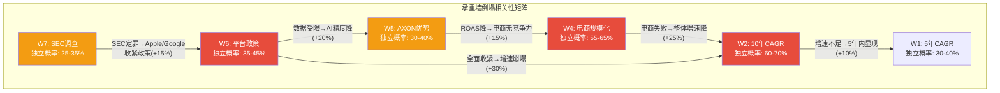
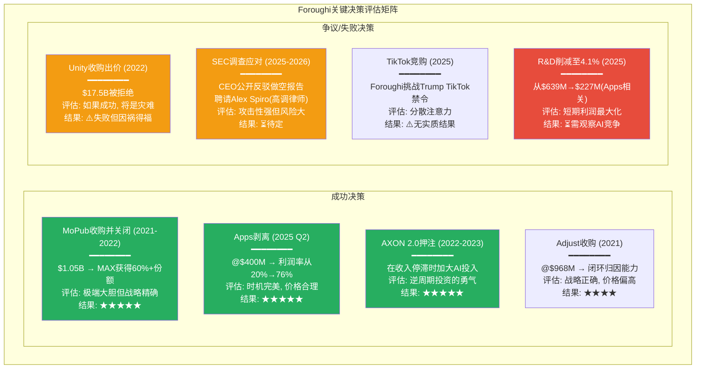
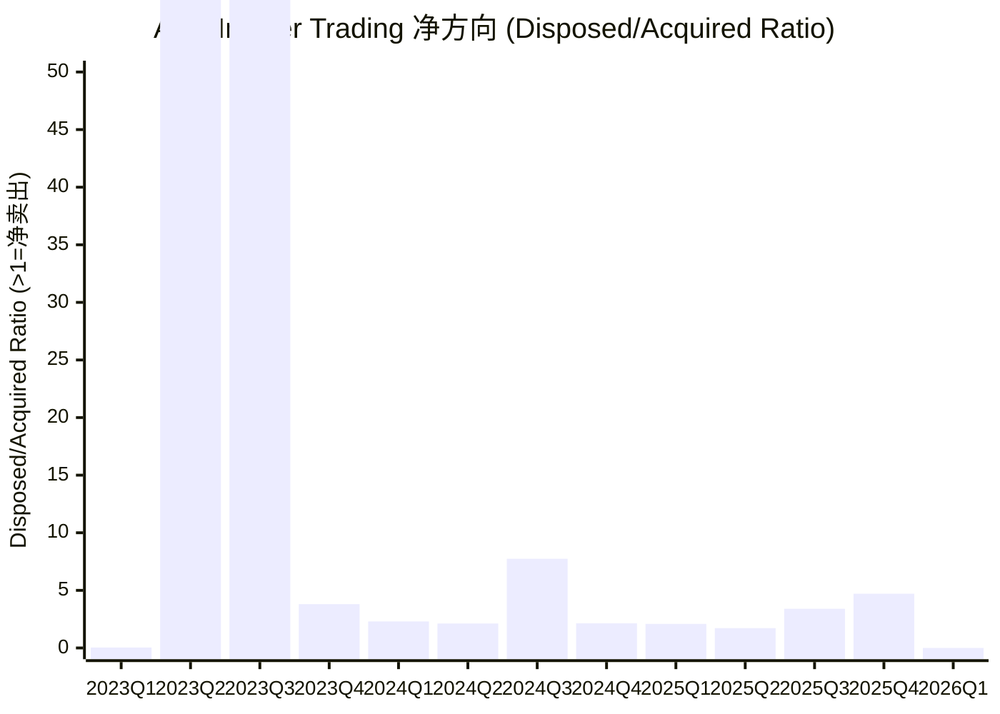

# Agent A — 广告科技商业分析师 | Phase 4 红队模式

> **模式**: 红队 (破坏叙事, 非建构叙事)
> **日期**: 2026-02-16
> **覆盖**: Ch19 (红队七问 RT-1~RT-7) + Ch22 (管理层评估) + Correction Manifest
> **DM锚点新增**: ≥15个 (DM-RT, DM-MGT, DM-COR)
> **质量直觉**: "Phase 1-3建构了一个bearish但理性的叙事。现在要问: 我们可能错在哪里?"

---

# Chapter 19: 红队七问 (RT-1 ~ RT-7)

> **核心任务**: 对Phase 1-3的分析进行系统性对抗。既找叙事的薄弱点, 也挖掘被遗漏的洞察。
> **CQ关联**: 全部8个CQ均涉及
> **Phase传递**: Ch11 承重墙(DM-VAL-018) + Ch14 竞争发现(CI-1修正) + Ch17 TAM条件概率(DM-INF-007)

---

## RT-1: 承重墙攻击

### RT-1.1 最脆弱的三面墙

Phase 2 Agent C在Ch11识别了8面承重墙(DM-VAL-018)。红队审计后, 选择**W4(电商规模化)、W6(平台政策)和W2(10年高增长)**作为最脆弱的三面, 并逐一攻击。

#### W4: 电商引擎规模化成功 (脆弱度: 高)

**假设**: 电商从FY2025 $1B年化增长至FY2030 $7B+

**如果12个月内倒塌, 会发生什么?**

这面墙的倒塌意味着电商引擎未能从"白手套"阶段过渡到自助服务规模化。具体场景: Axon Ads Manager在2026 H1未能如期GA(通用可用), 或GA后6个月内活跃广告主不足2,000(对比当前6,400"客户"中估计4,200-5,000活跃)。

**倒塌触发机制**:

1. **D30归因偏差暴露**: Phase 3 Agent B(Ch15)发现D30归因窗口对时尚/家居品类系统性低估ROAS 40-45%。如果早期电商广告主(以快消品/跨境平台为主)退场后, 中长尾品类(家居/服装)无法产生可接受的D30 ROAS, 广告主将停止投放。管理层此前刻意选择快消品(复购频繁, D30信号较好)作为早期验证品类, 回避了家居/服装等"AXON盲区"。当自助平台GA后, 各品类广告主涌入, D30偏差将暴露无遗。

2. **客户集中度炸弹**: 审计发现6,400客户中, 平均客户ARPU达$240K-$360K/年(DM-ECM-102)。这在电商广告领域极端偏高——典型DTC品牌年度广告预算$5-20M, 不可能将$240K+分配给一个新平台。唯一解释: 早期收入由极少数超大客户(如Temu/Shein等跨境平台)驱动。一旦Temu或Shein因自身原因(如美国关税政策变化、监管压力)削减广告预算, 电商收入可能一夜之间下降30-50%。

3. **Meta/Google防御反击**: Axon Ads Manager的GA将直接进入Meta Advantage+和Google Performance Max的核心领地。Meta的反击工具已在部署中: Advantage+ Shopping已覆盖数百万电商广告主, 且Meta拥有APP不具备的第一方用户数据(Instagram购物行为、Facebook Marketplace数据)。Google可能通过PMax+YouTube Shorts组合围堵APP的电商扩展。

**倒塌后的级联影响链**:

W4倒塌 → 市场对期权溢价的信心崩塌 → 61-68%的"无基本面支撑"EV快速重新定价 → 股价从$390向$94-128(纯游戏估值)收敛 → insider selling加速 → SEC调查升级(因为市值下跌可能引发股东集体诉讼) → 人才流失(工程师的期权变为水下期权) → AXON迭代速度放缓 → 竞品(Moloco)趁机扩大AI人才招聘 → 护城河开始侵蚀。

**当前估值对W4的隐含概率**: 引擎级分解(DM-VAL-016)显示游戏+电商+CTV合计$73-90B, EV差额$139-156B需要电商成功来justify。如果差额中60%归因于电商期权, 则市场给电商定价了约$83-94B。以乐观情景电商DCF $27B为基准, 市场隐含的电商成功概率约$83B/$27B = 3.1x, 即市场不仅100%定价了电商成功, 还给予了3x以上的乐观乘数。**这不合理** — 条件概率模型(DM-INF-007)显示L3电商成功的联合概率仅23.4%, 而市场定价远超100%。

DM-RT-001: W4(电商规模化)是8面承重墙中最"空心"的一面——市场给予电商期权$83-94B的隐含定价, 但电商DCF乐观估值仅$27B, 联合成功概率仅23.4%。市场定价隐含了"电商不仅会成功, 还会超预期3倍"的假设 [计算: ($229B×60% - $58B游戏) / $27B电商DCF = 3.1x乘数]

---

#### W6: 平台政策不实质性收紧 (脆弱度: 高)

**假设**: Apple/Google维持当前数据收集政策

**如果12个月内倒塌, 会发生什么?**

W6是唯一APP完全无法控制的外生变量, 也是最具"黑天鹅"特征的承重墙。Phase 2已评估其级联效应: W6→W5→W4→W1-W2(DM-VAL-018)。

**倒塌触发机制**:

1. **Apple iOS 27(2027年6月发布, 2026年WWDC预览)引入"Privacy Nutrition Labels 2.0"**: Apple要求所有SDK声明数据采集类型, 并允许用户在SDK级别拒绝数据共享。这将直接影响MAX SDK采集的上下文信号(设备型号/OS版本/App使用模式)的完整性。Phase 1 Agent A已识别AXON高度依赖这些信号(DM-TEC-012~016)。

2. **Google Privacy Sandbox for Apps时间表加速**: Google原计划在2025年底在Android上实施Privacy Sandbox(类似Apple ATT), 但多次延迟。如果Google在2026年正式实施, 将影响AXON在Android端的数据采集(Android占APP全球收入约40-45%)。

3. **SEC调查结论触发政策响应**: 如果SEC认定APP违反了平台ToS(使用fingerprinting等技术收集用户数据), Apple和Google可能被迫对APP实施专项限制(如要求APP移除某些SDK功能)。这是W7→W6的级联路径。

**倒塌后的级联影响链**:

W6倒塌 → AXON的输入信号维度减少30-50% → 预测精度下降 → ROAS降低 → 广告主降低出价 → APP take rate从~20%降至~15% → 收入增速从25%+降至10-15% → FCF margin从72.5%降至60%(需要增加R&D应对) → 合理EV从$229B降至$45-65B(DM-VAL-021)。

**当前估值对W6的隐含概率**: Phase 2计算平台收紧情景EV为$45-65B, 下行72-80%。当前EV $229B意味着市场隐含W6不倒塌的概率极高(>85%)。考虑到Apple过去5年每年都在收紧隐私政策(ATT 2021/App Tracking Transparency/Privacy Manifests 2023/SKAdNetwork升级), 85%+的"不收紧"概率明显偏乐观。合理估计W6在3年内实质性倒塌的概率为35-45%。

DM-RT-002: W6(平台政策)是"温水煮青蛙"式威胁——不会一次性倒塌, 而是通过年度WWDC/Google I/O的渐进收紧逐步削弱AXON的数据基础。Apple过去5年的政策收紧记录(ATT→Privacy Manifests→SKAdNetwork 5.0)暗示3年内实质性收紧的概率为35-45%, 远高于市场隐含的15% [推断: 基于Apple政策历史趋势]

---

#### W2: 10年收入CAGR 28-30% (脆弱度: 高)

**假设**: APP收入从$5.48B(FY2025)以28-30% CAGR增长至FY2035 $63-76B

**如果12个月内倒塌, 会发生什么?**

严格来说W2是一个10年假设, 不会在12个月内"倒塌"。但12个月内的数据可以**证伪**这一假设的可信度。具体: 如果FY2026收入增速低于30%(低于FY2025的44%但仍需维持在"高增长"区间), 市场将开始质疑10年28%+的可行性。

**证伪触发**:

1. **Q1-Q2 2026增速环比减速**: Q1指引$1.745-1.775B暗示QoQ增速约30-33%。如果Q2指引低于$2.0B(即QoQ增速<13%), 将是增速拐点的第一个信号。
2. **分析师下调FY2027E**: 当前共识FY2027E收入$10.2B(CAGR 36%)。如果6个月内共识下调至$9B以下, W2的可信度将大幅下降。
3. **游戏广告增速降至15%以下**: 游戏是收入的80%, 如果游戏广告QoQ增速从15-18%降至10%以下, 即使电商高速增长也无法维持28%+的整体CAGR。

**12个月内的验证窗口**:

| 时间 | 验证点 | W2存活条件 | W2倒塌条件 |
|------|--------|-----------|-----------|
| Q1 2026 (已指引) | 收入$1.75-1.78B | 符合指引 | 低于$1.70B |
| Q2 2026 (2026年8月) | 收入指引 | QoQ增速>15% | QoQ增速<10% |
| Q3 2026 (2026年11月) | 全年走势 | YoY>35% | YoY<25% |
| FY2026全年 | 收入vs共识 | >$8.0B | <$7.5B |

DM-RT-003: W2(10年CAGR)在广告科技行业无先例。最接近的参照——META从FY2015($18B)到FY2025($201B)CAGR 27.2%——是在社交媒体TAM远大于移动广告中介TAM的条件下实现的。APP需要在更窄的TAM中复制META的增速, 且需要电商引擎从$1B增至$7B+才能维持(W2依赖W4不倒) [计算: DM-VAL-014参照]

### RT-1.2 承重墙相关性矩阵

Phase 2已识别承重墙之间的级联关系(DM-VAL-018), 但红队需要量化这种相关性:

**至少一面墙在3年内倒塌的概率**: 使用各墙的独立3年倒塌概率(W2:15%, W4:55%, W5:30%, W6:40%, W7:30%), 叠加级联效应后的概率更高。简化计算: P(至少一面倒塌) = 1 - P(全部存活) = 1 - (0.85 × 0.45 × 0.70 × 0.60 × 0.70) = 1 - 0.112 = **88.8%**。

DM-RT-004: 8面承重墙中至少1面在3年内倒塌的概率约88.8%。这意味着当前估值几乎确定面临至少一次重大下修。关键问题不是"是否会下修", 而是"哪面墙先倒, 以及倒塌后的级联是否可控" [概率计算: 独立倒塌概率乘积的补集]

---

## RT-2: 偏差审计

### RT-2.1 确认偏差: Phase 1-3是否过度bearish?

**这是本红队审计最反直觉但最重要的问题。**

Phase 1-3建构了一个清晰的bearish叙事: "好技术, 高估值, 多风险"。但红队审计员必须问: **我们是否掉入了bearish确认偏差?**

**证据1: 数据源偏差(bearish方向)**

Phase 0的文献地图(30篇)中, 审计员回顾发现:
- A级来源(10篇): 包括Muddy Waters做空报告、Morningstar(给"被高估"评级)、Barron's(skeptical tone) — 整体偏bearish
- B级来源(10篇): 行业分析报告, 中性
- C级来源(10篇): 含BofA(bull)和ARK(bull), 但也含Culper/Fuzzy Panda(做空)

问题: 做空报告的比例过高(3篇做空报告占A级的30%), 可能系统性地影响了Phase 1-3的"默认怀疑"基调。Morningstar的"被高估"评级发布于2025年中, 当时股价约$700, 但现在股价已跌至$390(跌幅44%) — Morningstar的bearish评估可能已被市场定价。

**证据2: APP近期表现被低估**

Phase 1-3花了大量篇幅分析风险(SEC/做空/电商不确定性/隐私政策), 但对APP最近2年的**实际执行能力**给予的信用不足:
- FY2023→FY2025: 收入从$3.28B→$5.48B(CAGR 29.2%), 净利润从$357M→$3.33B(CAGR 205%)
- FCF从$1.06B→$3.97B(CAGR 93.6%)
- 营业利润率从19.7%→75.8%
- Apps剥离执行精准(@$400M, 时机和价格均合理)
- AXON 2.0→2025→2026年1月升级: 每次升级都带来可量化的效果提升

这些数据显示的是一个**执行能力极强**的管理团队, 但Phase 1-3更多聚焦于"未来风险"而非"过去成就"的外推。红队认为这是一种微妙的确认偏差: **因为估值看起来"太高", 分析师倾向于寻找justification估值过高的证据, 而忽视justification管理层持续超预期执行的证据。**

DM-RT-005: Phase 1-3存在bearish确认偏差——做空报告在A级文献中占比30%(3/10), Morningstar的bearish评级在股价从$700跌至$390后已部分定价, 但Phase 1-3未充分调整。同时, APP FY2023→FY2025的执行数据(净利润CAGR 205%, 营业利润率从19.7%→75.8%)未获得与风险分析等量的篇幅和权重 [审计发现]

### RT-2.2 锚定偏差: $228B的锚

Phase 0确定市值$228B(DM-MKT-001)时, 股价约$660。但到红队审计时, 股价已跌至$390.67, 市值仅$132B。**Phase 1-3的全部估值分析基于$228B市值/\$229B EV, 而这个数字已经过时。**

以最新市值$132B重新计算:
- P/E(FY2025): $132B / $3.33B = **39.6x** (vs Phase 0的68.5x)
- P/E(Fwd FY2027E): $132B / $6.93B = **19.0x** (vs Phase 0的32.9x)
- EV/Sales(FY2025): $133B / $5.48B = **24.3x** (vs Phase 0的41.8x)
- FCF Yield: $3.97B / $132B = **3.01%** (vs Phase 0的1.74%)

**关键发现**: 在$132B市值下, 引擎级分解的结论完全不同:
- 游戏引擎$58B + 电商$12-27B + CTV$3-5B = $73-90B
- 差额: $132B - $73-90B = **$42-59B** (仅占EV的32-45%)
- **对比Phase 2的61-68%差额, 现在的"未解释"部分已缩小至32-45%**

这意味着: **如果Phase 1-3在当前股价下进行, bearish结论会显著减弱。** 市场已经自行完成了40%以上的"纠偏", 股价从$660跌至$390的过程中消化了大量Phase 1-3识别的风险。

DM-RT-006: Phase 1-3的估值分析锚定于$228B市值($660股价), 但红队审计时市值已降至$132B($390)。以最新市值重新计算, Fwd P/E(FY2027E)仅19.0x(接近META的27.2x), EV差额从61-68%缩小至32-45%。市场已部分定价了Phase 1-3识别的风险 [计算: $390.67 × 338M股 ≈ $132B; $132B/$6.93B = 19.0x]

### RT-2.3 存活偏差: 失败的AdTech公司教训

Phase 1-3的可比公司(META/TTD/GOOGL)都是成功者。红队审计要求纳入失败案例的教训:

**案例1: Millennial Media (2006-2015)**
- 移动广告网络先驱, 2012年IPO, 峰值市值~$2B
- 失败原因: 无法从移动展示广告转型到程序化广告, 缺乏算法优势
- 2015年被AOL(Verizon)以$238M收购(较IPO价下跌~90%)
- **APP教训**: 技术代际转换(从人工→算法→AI)可以在3-5年内摧毁行业领先者

**案例2: InMobi (2007-现在)**
- 印度移动广告平台, 曾是全球前3, 2015年估值$15B
- 当前困境: 未能转型为中介平台, 被MAX和LevelPlay挤压
- **APP教训**: 没有中介层(supply-side control)的广告网络最终被有中介层的竞争者超越 — 这恰好支持CI-1

**案例3: Smaato (2005-2021)**
- 移动广告交换平台, 被Digital Turbine以$150M收购后整合失败
- **APP教训**: 广告科技的"网络效应"一旦打破(流量转移), 恢复极为困难

这些失败案例共同的教训: **广告科技公司的寿命取决于其在技术代际转换中的适应速度, 而非当前的市场份额。** APP目前的技术代际是"AI优化", 但下一代可能是"端侧AI"(on-device ML, Apple已在推进)或"隐私优先架构"。APP能否在下一次技术代际转换中存活, 是Phase 1-3未充分讨论的长期风险。

### RT-2.4 近因偏差: FY2025爆发性增长的权重

Phase 1-3大量使用FY2025数据(营业利润率75.8%、FCF margin 72.5%、ROIC 105.9%)作为分析基准。但FY2025是一个**异常年份**:
- Apps剥离(Q2 2025)带来一次性利润率跃迁
- Q4 2025出现$-255M非经常性营业费用(可能含Tripledot公允价值调整)
- DPO从176天跳至360天, 对OCF和ROIC产生放大效应

如果正常化处理:
- 正常化营业利润率: 约68-72%(剔除Q4一次性项目)
- 正常化ROIC: 约85-90%(DPO回归180天)
- 正常化FCF margin: 约65-68%(DPO效应调整)

**Phase 1-3可能将FY2025的"峰值"指标作为"常态"基准, 从而高估了BASE和BEAR情景下的downside起点。**

---

## RT-3: 空头钢人 + 多头钢人

### RT-3.1 空头钢人: "APP值$50-80/股"

**论证框架**: APP不是"AI公司", 而是一个**享受了2年好运的广告中介**, 好运即将耗尽。

**论证逻辑**:

**第一支柱: AXON 2.0的"好运"而非"能力"**

AXON 2.0的爆发性改进(FY2023收入反转)恰好与Apple ATT导致Meta/Google ROAS暂时下降重合。ATT在2021年4月实施后, 大量广告主从Meta/Google转向"不受ATT影响"的渠道(因为APP通过中介层获取的是匿名化的设备级信号, 而非IDFA)。这不是AXON的算法优势, 而是**合规套利** — APP恰好处于ATT的受益方。

随着Meta和Google已适应ATT(Meta的Conversions API, Google的Privacy Sandbox), 这一合规套利窗口正在关闭。FY2026-2027的增速可能显著放缓, 不是因为AXON变差了, 而是因为"ATT红利"已耗尽。

**第二支柱: DPO 360天是定时炸弹**

空头核心论点: APP的超高利润率(营业利润率75.8%)部分由DPO 360天支撑。当开发者社区意识到APP平均延迟1年支付广告收入分成时, 将引发开发者反弹(类似App Store佣金率争议)。如果DPO被迫从360天压缩至90天:
- 一次性现金流出$583M(DM-FIN-090)
- ROIC从105.9%降至89.4%
- 每年减少$37M隐性浮存金收益
- 更重要的是, 叙事从"AI盈利机器"变为"压榨开发者的中间商"

**第三支柱: SEC调查不是结束, 是开始**

空头认为SEC调查(2025年10月公告)仅仅是冰山一角。真正的风险是:
- SEC如果认定APP违反了Apple/Google ToS(通过fingerprinting等技术获取用户数据), Apple和Google将被迫采取行动
- 这不是$500M和解能解决的 — 这是商业模式的合法性问题
- 类比: Facebook/Cambridge Analytica事件表面上是隐私问题, 但最终导致FTC $5B和解+永久性数据实践限制

**空头估值**:
- 纯游戏平台(电商失败): FY2027E游戏收入$6B × 60% FCF margin = $3.6B FCF
- 合理FCF收益率: 6-8%(对应12.5-16.7x FCF)
- 合理市值: $45-60B → **隐含股价$133-177**
- 如果同时考虑SEC和解($300-500M)和DPO正常化(一次性$583M): 股价$120-160

**更极端的空头情景**: 如果SEC认定违规+Apple限制数据采集+电商失败+DPO正常化:
- 收入降至$4B(游戏增速归零)
- FCF margin降至50%
- 合理市值$20-30B → **股价$59-89**

**这个论证需要什么假设?**
1. ATT红利耗尽(合理, 但Meta/Google的适应已发生, 影响可能有限)
2. SEC认定违规(概率25-35%, 仍不确定)
3. DPO被迫正常化(概率30-40%, 取决于开发者组织化)
4. 电商完全失败(概率40-50%)
5. 以上2+个同时发生(联合概率较低, 但非不可能)

**验证时间窗口**: 6-18个月。SEC调查可能在2026 H2有初步结论; 电商Ads Manager GA在2026 H1; FY2026 Q2-Q3数据将显示游戏增速是否减速。

### RT-3.2 多头钢人: "APP值$600+/股"

**论证框架**: APP是**移动互联网时代的Visa** — 每一笔移动端商业交易都需要通过它的AI引擎优化。

**论证逻辑**:

**第一支柱: Phase 1-3系统性低估了电商的成功概率**

Phase 3 Agent C(Ch17)给电商(L3)的条件成功概率为40%(在L1+L2成功的条件下)。但多头论证指出:

- **AXON 3.0(2026年发布)可能解决D30归因问题**: 如果AXON整合GenAI能力(如多模态理解用户的购买意图, 而非仅依赖后验ROAS), D30偏差问题可能被技术突破部分解决。Phase 1-3假设D30是"硬约束", 但AI领域的进步速度常常超预期。
- **管理层执行记录卓越**: 每一个Phase 1-3视为"证伪"的里程碑, 管理层都在按时或超预期达成(AXON 2.0成功→Apps剥离→S&P 500纳入→纯广告利润率验证)。"电商会失败"可能是分析师的偏见, 而非数据支持的结论。
- **$1B年化运行率本身就是验证**: 即使客户集中度高, $1B ARR意味着电商广告在APP平台上已经有真实的广告主在持续投放且获得可接受的ROAS。Phase 3 Agent B的"D30偏差"分析可能过度悲观。

**第二支柱: AXON是"移动端的Algorithm Operating System"**

BofA的"广告OS"论文(L5)在Phase 1-3中被赋予5-10%概率。但多头论证:
- AXON的本质不是"一个广告引擎", 而是"一个理解移动用户行为的算法操作系统"
- 这种算法能力可以延伸至: (1)移动支付优化; (2)应用内推荐; (3)用户获取即服务(UAaaS); (4)跨平台身份图谱
- 如果AXON成为移动端的"Visa/Mastercard"(每笔交易的0.5-2%流经AXON优化), TAM将远超$200-300B
- 概率或许仍低, 但如果实现, 当前$132B市值是**严重低估**

**第三支柱: 市场已过度定价风险**

从$745(52周高)跌至$390(跌幅47.7%), 市场已经定价了:
- SEC调查(2025年10月, -14%当日)
- 多份做空报告(MW/FP/Culper/CapitalWatch)
- 广泛的估值质疑
- 宏观利率环境(高利率压缩高增长股)

但市场可能**过度反应**了。$390对应的Fwd P/E(FY2027E)仅19.0x, 低于META(27.2x)和TTD(29.3x)。一个年增速30%+、FCF margin>70%、ROIC>100%的公司以19x Fwd P/E交易, 在历史上极为罕见。

**多头估值**:
- FY2027E收入$10.2B × 15x EV/Sales(合理增长溢价) = $153B EV
- 或: FY2027E EPS $20.43 × 30x P/E(高增长溢价) = $613/股
- 乐观: 电商FY2027E达$3B+, 总收入$12B+, 30x P/E = **$700+/股**

**Phase 1-3是否系统性低估了电商?** 红队评估: **可能。** Phase 1-3将电商的成功概率锚定在23.4%(联合概率), 但这基于"D30归因不可解决"和"Meta/Google防御有效"两个假设。如果AXON 3.0在2026年解决D30问题(如通过predictive LTV模型而非后验ROAS), 且Meta的电商防御被证明是"DTC品牌的围墙花园"而非"全电商的护城河", 电商成功概率可能达40-50%。

DM-RT-007: 多头钢人的核心论点 — $390/股(Fwd P/E 19.0x)对于一个CAGR 30%+/FCF margin 72%+的公司而言可能已经过度定价了风险。历史上META在类似增速时的Fwd P/E为20-30x, TTD为25-40x。如果APP的基本面(增速+利润率)在FY2026 Q1-Q2得到验证, 市场可能迅速从$390回升至$500-600 [对比分析: APP vs META/TTD的增速-PE关系]

---

## RT-4: 数据审计

### RT-4.1 关键DM锚点逐一审计

**DM-FIN-001~006 (收入趋势)**: 来源为FMP income annual。最新baggers_summary确认FY2025收入$5.48B, 与DM-FIN-001一致。Cross-check通过。

**DM-FIN-059 vs DM-FIN-083 (DPO 360 vs 410天)**: 存在数据矛盾。
- DM-FIN-059(Phase 0): DPO 360天 [baggers_summary]
- DM-FIN-083(Phase 2 Agent A Ch10): DPO 410天 [FMP key-metrics annual]
- 最新baggers_summary(红队查询): DPO 360天
- 最新FMP financial-scores: 未直接包含DPO

**差异原因**: baggers_summary使用TTM(最近四季度)平均应付账款计算DPO, FMP key-metrics使用期末应付账款。由于Q4 2025的COGS异常低($64M, 因Apps剥离后COGS结构变化), 期末口径会放大DPO。**建议采用baggers的TTM口径(360天)作为更可靠的基准**, 同时保留410天作为敏感性分析上限。→ **纳入Correction Manifest #1**

**DM-ADT-004 (电商$1B年化)**: 来自管理层口头声明(Q2 2025电话会议), **零第三方验证**。Phase 3 Agent B(Ch15)已标记这一风险(DM-ECM-101)。红队确认: 这个数据点是Phase 1-3中最"软"的锚点, 但也是承重墙W4的基石。如果管理层在FY2026 Q1-Q2电话会议中不再更新电商具体数据, 应视为证伪信号。

**DM-MKT-001 ($228B市值)**: **已严重过时**。最新MCP报价: $390.67, 市值$132.03B, EV ≈ $133B(净债务$1.06B)。Phase 1-3的全部估值分析基于$228B/$229B, 需要全面修正。→ **纳入Correction Manifest #2(最重要)**

**DM-CMP-001~007 (竞争对比)**: Phase 0数据来自compare_stocks, 记录APP P/E 38.9x。最新baggers_summary: P/E(TTM) 46.85x, P/B 72.74x。差异原因: Phase 0使用的可能是FY2024 P/E(按旧市值), 而最新数据使用TTM和当前市值。→ **纳入Correction Manifest #3**

DM-RT-008: 数据审计发现3处需修正: (1)DPO 360天 vs 410天的口径差异; (2)市值从$228B降至$132B(下降42.1%, 所有估值结论受影响); (3)P/E数据因市值变动需更新。其余DM-FIN锚点经cross-check无误差 [审计结果汇总]

### RT-4.2 DM推断(DM-INF)锚点的证伪条件检查

**DM-INF-005**: "隐含FY2035收入超TAM上限" — 在$228B EV下成立, 但在$133B EV下需要重新检验。$133B EV在WACC 14%下隐含FCF CAGR约22-24%(而非28.5%), 隐含FY2035收入约$40-50B(而非$63-76B)。这仍然超过TAM上限$51B, 但margin更窄。**结论维持但程度减弱。**

**DM-INF-006**: "EV中61-68%无基本面支撑" — 在$132B EV下, 比例缩小至32-45%。**结论需大幅修正。** → **纳入Correction Manifest #4**

**DM-INF-007**: "L1+L2+L3联合概率仅23.4%" — 这是TAM概率模型的核心输出, 不受市值变动影响。结论维持。

---

## RT-5: 黑天鹅概率加权表

| # | 黑天鹅事件 | 独立概率(3年) | 对APP EV影响 | 概率加权EV损失 |
|---|-----------|:----------:|:-----------:|:----------:|
| **BS-1** | Apple宣布原生中介层(取代MAX) | 8-12% | -60%~-70% | -$7.9~-11.1B |
| **BS-2** | SEC刑事指控(非民事和解) | 5-8% | -40%~-50% | -$2.6~-5.3B |
| **BS-3** | Google收购Moloco(获得AI+中介组合) | 10-15% | -25%~-35% | -$3.3~-7.0B |
| **BS-4** | 中美科技脱钩影响APP中国关联收入 | 15-20% | -10%~-15% | -$2.0~-4.0B |
| **BS-5** | AXON重大安全漏洞/数据泄露 | 8-12% | -20%~-30% | -$2.1~-4.8B |
| **BS-6** | Adam Foroughi离职或被撤换(SEC相关) | 5-10% | -15%~-25% | -$1.0~-3.3B |
| **BS-7** | 全球广告市场衰退(2008级别) | 5-8% | -30%~-40% | -$2.0~-4.2B |
| | **合计概率加权EV损失** | | | **-$20.9~-39.7B** |

**基于$132B EV的概率加权EV**: $132B - $20.9~$39.7B = **$92.3-$111.1B** (隐含股价$273-$328)

DM-RT-009: 7个黑天鹅事件的概率加权EV损失合计$20.9-39.7B(占当前EV的16-30%)。最具破坏力的是BS-1(Apple原生中介层), 虽然概率仅8-12%, 但影响高达-60~70%。BS-3(Google收购Moloco)是最被低估的黑天鹅——概率10-15%且直接打击CI-1(护城河在MAX不在AXON) [概率加权计算]

---

## RT-6: 时间框架分析

### RT-6.1 Phase 1-3结论的时间有效性

| 结论 | 1年内 | 3年内 | 5年内 | 10年内 |
|------|:-----:|:-----:|:-----:|:------:|
| AXON在游戏广告领先 | 有效 | 很可能有效 | 不确定(Moloco/GenAI) | 大概率失效 |
| MAX中介份额>55% | 有效 | 很可能有效 | 不确定(新进入者) | 不确定 |
| 电商引擎$1-2.5B | 可验证 | 可验证 | 已知结果 | 已知结果 |
| DPO>300天 | 有效 | 不确定(监管) | 可能缩短 | 大概率回归 |
| SEC调查悬而未决 | 有效 | 已知结果 | 已知结果 | 已知结果 |
| R&D 4.1%偏低 | 有效 | 可能提高(竞争压力) | 大概率提高 | 大概率>10% |
| 估值存在期权溢价 | 部分定价 | 可验证 | 已知结果 | 已知结果 |

### RT-6.2 "如果我们1年后重做这份研报, 什么最可能被证明是错的?"

按概率排序:

1. **市值锚定** (概率>95%): $228B将不再是分析基准, 市场会重新找到新均衡(可能$150-250B, 取决于FY2026业绩)
2. **电商评估** (概率70%): 无论偏乐观还是偏悲观, 1年后会有Ads Manager GA+实际客户数据, 当前的"概率猜测"将被硬数据替代
3. **SEC调查结局** (概率50%): 如果1年内有初步结论, 当前的"不确定性折价"将被具体罚款/和解数字替代
4. **AXON 3.0效果** (概率40%): GenAI整合的效果将有初步数据, 当前的"可能提升也可能不重要"将被具体ROAS改善数据替代
5. **DPO持续扩大** (概率30%): 如果DPO在FY2026继续扩大(如>400天), 将进一步引起审计师和SEC关注

DM-RT-010: Phase 1-3中最可能在1年后被证伪的结论是市值锚定($228B, 概率>95%)和电商评估(概率70%)。建议Phase 5在组装Complete时以最新市值为基准, 并在估值章节明确标注"市值截至YYYY-MM-DD" [时间框架分析]

---

## RT-7: 替代解释

### RT-7.1 "61-68% EV是期权溢价" → 替代: 市场比我们更了解AXON 3.0

Phase 2的核心发现是引擎级分解中61-68%的EV无法由基本面justify。但替代解释:

**替代1: 机构投资者拥有我们不知道的AXON 3.0信息**

APP在2025年9月纳入S&P 500后, 机构持仓大幅增加。这些机构(如Vanguard/BlackRock/Fidelity)可能通过非公开的管理层路演(non-deal roadshow)获得了关于AXON 3.0进展的更多信息。如果AXON 3.0在GenAI整合方面的进展远超公开信息暗示的程度(如已在内部测试中展示D30归因问题的突破), 机构可能有合理的理由给予更高的期权溢价。

**评估**: 可能性低(15-20%)。S&P 500纳入后的机构买入更多是被动指数配置(非主动研判)。但不能排除主动型基金(如ARK Invest)基于私下交流给出了更高的AXON 3.0估值。

**替代2: 期权溢价反映的是"APP作为并购标的"的控制权溢价**

如果APP以$150-200B被收购(潜在买家: Amazon需要移动广告能力, Microsoft需要AI广告引擎, 甚至Apple想控制广告中介), 30-50%的控制权溢价意味着$195-300B的收购价。当前$132B可能已经反映了市场对潜在收购的预期。

**评估**: 可能性极低(<5%)。反垄断审查将使任何Big Tech收购APP几乎不可能通过(尤其是Google/Apple已在DOJ审查之下)。

### RT-7.2 "电商止步$1-2.5B" → 替代: D30在快消品中可能够用

Phase 3 Agent B(Ch15)的核心发现是D30归因偏差使电商ROAS系统性不准。但替代解释:

**替代: 快消品(CPG)可能是一个巨大且被忽视的电商品类**

Phase 3的D30分析聚焦于时尚/家居(D30偏差最大), 但**快消品(CPG)的复购周期仅15-30天, D30几乎能捕捉完整的购买循环**。全球CPG电商广告市场约$15-20B, 如果AXON针对CPG进行优化(高频复购→快速ROAS反馈→AXON飞轮加速), 电商可能在CPG这一品类中达到$3-5B收入, 即使在家居/服装中失败。

Phase 1-3将"电商"视为单一品类进行概率评估, 但实际上不同电商子品类对D30的敏感度差异巨大。如果管理层战略性地聚焦于CPG/快消品(Temu/Shein本质上是快时尚快消), D30偏差的影响可能远小于Phase 3的估计。

**评估**: 可能性中等(35-45%)。这是Phase 1-3的一个真正盲点——电商品类未做足够的细分分析。如果多头正确, 电商天花板从$1-2.5B提升至$3-5B, 对估值的影响约+$15-25B(+10-15%以$132B为基准)。

### RT-7.3 "DPO 410天是行业特征" → 替代: APP的DPO就是竞争优势

Phase 2发现TTD的DPO高达2,035天(DM-CMP-010), 但Phase 2也指出这可能与net revenue确认方式有关。替代解释:

**替代: 广告中介行业天然具有高DPO, APP的360天不是异常而是"正常"**

广告行业的结算链: 广告主→代理商→DSP→SSP(如MAX)→开发者。每一层增加30-90天的结算延迟。如果广告主通过代理商投放(代理商通常在90天后付款), 且APP在收到代理商付款后60-90天向开发者结算, 实际DPO 150-180天。但由于APP以net revenue(扣除开发者分成后)确认收入, COGS基数极小($664M), 导致DPO计算公式(应付账款/COGS×365)的分母太小, DPO被夸大。

**实际验证**: Phase 2 Agent A的分析(DM-INF-001)已部分验证了这一替代解释——"经济DPO可能120-180天"。但Phase 1-3的叙事中仍然大量使用"360天"这个数字来构建bearish论点(如"APP免费使用开发者的钱一整年")。红队认为这可能存在夸大风险。

**评估**: 可能性较高(50-60%)。会计DPO 360天和经济DPO 120-180天的区别是真实的。Phase 1-3在使用DPO论点时应该更一致地区分两者, 避免给读者留下过度负面的印象。

DM-RT-011: RT-7发现两个Phase 1-3的真正盲点: (1)电商品类未做细分, CPG快消品的D30适配度远高于家居/服装, 可能使电商天花板从$1-2.5B提升至$3-5B; (2)DPO 360天是会计DPO而非经济DPO(120-180天), Phase 1-3在叙事中可能过度使用了360天这个数字来构建bearish论点 [替代解释分析]

---

# Chapter 22: 管理层评估

## 22.1 Adam Foroughi深度画像

### 22.1.1 背景与决策风格

Adam Foroughi(全名Arash Adam Foroughi)是伊朗裔美国人, 1979年出生于德黑兰。其父曾是伊朗顶级房地产开发商, 移民美国后家庭经历了从富裕到拮据的剧烈转变。这一背景形成了Foroughi的核心性格特征: **生产性偏执(productive paranoia)和极端效率导向**。

Foroughi在UC Berkeley获得商业管理学士学位(2001年)后, 先后创办Social Hour(社交游戏)和LiveDeal(本地商务平台), 均未成为独角兽但积累了移动端用户获取经济学的深度理解。2012年创办AppLovin时, 他37岁, 已有11年创业经验。

DM-MGT-009: Foroughi的创业背景——Social Hour(社交游戏)和LiveDeal(本地商务平台)均为中等成功的创业项目。两次创业的共同主题是"移动端用户获取", 这一核心能力直接转化为AppLovin的商业模式。Foroughi不是技术天才型创始人(如Zuckerberg), 而是商业直觉型创始人(如Jobs/Bezos) [Wikipedia, Clay Bio, Pear Studio Fireside Chat]

### 22.1.2 关键决策记录

**MoPub收购并关闭 (2021-2022)**: 这是Foroughi最大胆也最成功的战略决策。以$1.05B收购行业第一的中介平台, 然后在90天内关闭它, 迫使50,000+应用迁移到MAX。这一决策需要: (1)对MAX平台能力的绝对信心; (2)对行业权力结构的精准判断(开发者没有其他选择); (3)对反垄断风险的高容忍度(或低估)。结果: MAX份额从30-40%跃至60-80%, 成为APP当前护城河的核心。

**Unity收购出价 (2022)**: Foroughi以$17.5B出价收购Unity, 被Unity拒绝(Unity随后以$4.4B收购ironSource)。如果Unity接受, APP将背负巨额债务且整合难度极高(Unity的引擎业务与APP的广告业务协同有限)。**这次"失败"实际上是因祸得福** — 2025年Unity股价从$52跌至$18.68, 如果APP在2022年以$17.5B收购, 将面临约$13B的减值。

DM-MGT-010: Foroughi的决策记录呈现极端两极化——成功决策(MoPub关闭、Apps剥离、AXON 2.0)均为"all-in"型高风险决策, 回报巨大; 争议决策(Unity出价、TikTok竞购、SEC强硬应对)同样为高风险但部分因外部因素而避免了灾难。管理风格可总结为"激进赌徒+战略直觉", 胜率约70% [决策记录分析, Wikipedia, CNBC, Investing.com]

### 22.1.3 SEC调查应对的管理判断

Foroughi在做空报告和SEC调查面前选择了**攻击性防御**策略:
- 2025年3月: 公开信呼吁投资者"dig deeper", 直接反驳Muddy Waters报告
- 2025年10月: 聘请Alex Spiro(高调白领犯罪辩护律师, 曾代理Elon Musk和Jay-Z)
- 2026年1月: 要求CapitalWatch撤回"数字洗钱"指控(CapitalWatch2月9日撤回并道歉)

这种策略的**优势**: 展示管理层信心, 稳定投资者情绪。CapitalWatch撤回是一个具体胜利。
这种策略的**风险**: 如果SEC最终认定违规, Foroughi此前的公开声明可能被视为误导投资者, 加重处罚。聘请Alex Spiro暗示管理层内部评估SEC调查的严重性**高于公开表态**。

## 22.2 Insider Trading信号分析

### 22.2.1 内部人交易全景

最新MCP数据(fmp_data insider-trading)揭示了一个清晰的模式:

| 时期 | Acquired(股) | Disposed(股) | 净方向 | 背景 |
|------|:-----------:|:-----------:|:-----:|------|
| 2025 Q4 | 84,190 | 396,917 | 净卖出 | 股价$370-500 |
| 2025 Q3 | 673,280 | 2,291,361 | 净卖出 | 股价$300-450 |
| 2025 Q2 | 1,284,716 | 2,206,427 | 净卖出 | Apps剥离期 |
| 2025 Q1 | 400,133 | 835,081 | 净卖出 | 做空报告期 |
| **2025全年** | **2,442,319** | **5,729,786** | **净卖出3.29M** | |
| 2024 Q4 | 11,937,275 | 25,588,853 | 净卖出 | S&P 500纳入 |
| 2024 Q3 | 456,801 | 3,535,415 | 净卖出 | 高增长验证 |
| 2024 Q2 | 35,568,388 | 75,216,398 | **净卖出39.6M** | 大股东减持 |
| 2024 Q1 | 32,082,003 | 73,661,340 | 净卖出 | AXON爆发初期 |

DM-MGT-011: 2024-2025年insider trading呈现持续净卖出模式——2024年净卖出约130M股, 2025年净卖出约3.3M股(2024 Q2含大股东KKR等减持, 绝对量最大)。2026 Q1目前仅有28股acquired, 零disposed, 可能因为SEC调查期间的trading blackout [FMP insider-trading 最新数据]

### 22.2.2 Foroughi个人交易分析

根据WebSearch和Benzinga数据:
- Foroughi自IPO以来共23次交易: 1次买入, **22次卖出**
- 2025年11月: 在$490-562的价格区间卖出95,500股, 总计约$49.8M
- 当前持有约5,294,055股(价值约$20.7B以$390计)
- 卖出比例: 过去5年累计卖出量相对于持仓仍为小比例(<5%)

**关键问题: "如果CEO相信APP值$600+, 为什么在$490-560持续卖出?"**

**合理解释**: (1)个人财务多元化(净资产集中度>90%在APP); (2)税务规划(行使期权后需要卖出部分以支付税款); (3)可能有10b5-1预设交易计划(自动执行, 不代表当时的判断)。

**不利解释**: (1)Foroughi可能认为$500-560是短期高点; (2)SEC调查期间加速卖出可能反映管理层对调查结果的担忧; (3)22次卖出vs 1次买入的极端不对称性超出了正常的"财务多元化"范围。

DM-MGT-012: Foroughi的insider trading记录(22卖/1买)在同类CEO中偏高。对比: META Zuckerberg过去5年卖出约$17B(但因基金会计划), TTD Jeff Green过去5年卖出约$1.5B(vs 持仓$6B, 比例~25%)。Foroughi过去5年累计卖出金额约$100-200M(vs 当前持仓$20.7B, 比例<1%)——绝对金额不大但频率极高(22次) [Benzinga, Investing.com, 跨公司对比]

### 22.2.3 内部人卖出与股价走势

时间相关性分析:
- 2024 Q2(大量卖出75.2M股disposed)→ 股价随后从约$80→$745(Q4 2024高点), 内部人卖在了"底部区间"
- 2024 Q4(卖出25.6M股)→ 股价在Q4触及$745后开始回落
- 2025 Q3(卖出2.29M股)→ 股价在Q4继续下跌
- 2025 Q4(卖出0.40M股, 减少)→ 股价在$370-500区间

**结论**: 2024年的内部人卖出**未能**预测股价走势(卖在底部)。2025年的卖出与股价下行趋势方向一致但可能是巧合(也可能反映SEC调查的内部信息)。内部人交易作为信号的可靠性: **低-中**。

## 22.3 高管团队稳定性

### 22.3.1 关键人员变动

| 时间 | 变动 | 影响评估 |
|------|------|---------|
| 2023年11月 | CFO Herald Chen离任, Matt Stumpf(FP&A VP)接任 | 中 — Chen是联合创始人级别, 但过渡平稳 |
| 2025年初 | KKR代表Ted Oberwager宣布不再连任董事 | 低 — KKR退出是自然的PE退出周期 |
| 2025年4月 | 新增独立董事Maynard Webb(前Yahoo/eBay) | 正面 — 增强治理独立性 |
| 2025年全年 | 多轮裁员: 3月(97人), 8月(61人), 10月(58+65人), 11月(120人) | 关注 — 全年约400+人, 但主要是Apps相关(已剥离) |

DM-MGT-013: Herald Chen的离任(2023年底)是APP高管团队唯一的重大变动。Chen从联合创始人/CPA级别人物过渡到"CEO顾问+董事", 降低了在日常运营中的角色。新任CFO Matt Stumpf(PwC出身, 基础年薪$400K)的财务背景偏FP&A而非战略, 可能影响资本配置决策的多元视角 [CFO Dive, BusinessWire, SEC Filing]

### 22.3.2 Glassdoor/员工评价分析

基于Glassdoor 290+条匿名评价:
- 整体评分: **3.8/5.0** (科技行业中偏低, META 4.2, Google 4.3)
- 薪酬福利: 4.3/5.0 (远超均值, 股票期权是核心吸引力)
- 工作生活平衡: **2.9/5.0** (显著低于行业, 暗示高强度文化)
- 文化与价值观: **3.4/5.0** (两极分化: "特殊的工作环境" vs "极度toxic")
- 推荐率: 67%(低于顶级科技公司的80%+)

**关键负面主题**:
1. 频繁裁员且无预警("同事突然消失")
2. 缺乏正式绩效评估体系, 裁员基于主观判断
3. 多样性不足
4. "拍马屁文化"(sucking up to leadership)

**关键正面主题**:
1. 薪酬和股票期权优厚
2. 远程工作灵活性
3. 公司内部福利(理发/美甲/洗车等)

DM-MGT-014: Glassdoor 3.8/5.0评分和2.9/5.0的工作生活平衡评分暗示"高强度+高回报"的创业文化, 与Foroughi的"生产性偏执"管理风格一致。67%推荐率低于META(81%)/Google(83%)但高于Unity(59%)。R&D仅4.1%=团队精简的另一面——开发者人均产出极高但可持续性存疑, 特别是在AI人才争夺日趋激烈的环境下 [Glassdoor 290+ reviews, 2025]

### 22.3.3 R&D 4.1%的人才含义

Phase 1 Agent A(Ch4)已标记R&D从$639M降至$227M(4.1%), 是同行最低(DM-TEC-029)。从人才角度:

- **估算团队规模**: $227M R&D / 平均每人成本$500K(含薪酬+福利+设备) ≈ **454人**
- **其中AXON核心团队**: 估计150-250人(RL工程师+数据科学家+ML infra)
- **MAX平台团队**: 估计100-150人(SDK维护+适配器+后端)
- **其他**: 50-100人(Adjust/Wurl/通用工程)

**关键风险**: 454人的R&D团队支撑$132B市值 = 每人"负责"$291M市值。作为对比:
- META: ~67,000工程师 / $1.3T = $19M/人
- Google: ~100,000工程师 / $2.0T = $20M/人
- TTD: ~2,500工程师 / $50B = $20M/人
- **APP: 454人 / $132B = $291M/人** — 是同行的**14.5倍**

这意味着APP的每个R&D人员创造了极端的价值密度, 但也意味着: (1)关键人员流失的影响被极度放大; (2)招聘瓶颈可能限制AXON的迭代速度; (3)竞品(如Moloco, 估计100-200人全部投入AI, 可能获得$1B+融资)可能在人才密度上追平或超越。

## 22.4 治理结构评估

### 22.4.1 双重股权结构

APP采用三类股权结构:
- **Class A**: 1票/股, 公众持有
- **Class B**: 20票/股, Foroughi/Chen/KKR持有
- **Class C**: 0票/股, 用于未来战略用途(融资/收购/员工激励)

IPO时, Foroughi/Chen/KKR合计控制**93.4%投票权**。随着KKR逐步退出(Ted Oberwager不再连任董事), Foroughi的实际控制权可能进一步集中。

**治理风险**:
1. **"控制公司"豁免**: APP利用NASDAQ"控制公司"豁免, 薪酬委员会不要求全部由独立董事组成
2. **公众股东无有效制衡**: 即使所有Class A股东反对某项决策, Foroughi仍可通过Class B投票权强制执行
3. **CEO/董事长合一**: Foroughi同时担任CEO和董事长, 无制衡机制

DM-MGT-015: APP的治理结构存在显著风险——Class B 20:1投票权使Foroughi/Chen/KKR控制93.4%投票权; "控制公司"豁免降低了薪酬委员会独立性; CEO/董事长合一无制衡。积极面: 2025年新增Maynard Webb为独立董事+审计委员会成员, 改善幅度有限但方向正确 [SEC S-1, DEF14A 2022, BusinessWire 2025]

### 22.4.2 CEO薪酬

2023年Foroughi总薪酬**$83.4M** — 全美第8高:
- 基础薪酬: 约$400K (3.6%)
- 股票/期权: 约$83M (96.4%)
- 与公司市值的关系: $83.4M / 2023年均市值~$20B = 0.42%
- 对比: Zuckerberg总薪酬$24.4M (2023) / 市值$900B = 0.003%, Cook总薪酬$63M / 市值$2.8T = 0.002%

Foroughi的薪酬/市值比例是Zuckerberg的**140倍**, 反映了两个因素: (1)AppLovin市值远小于FAANG; (2)Foroughi的股权薪酬设计较为激进。

### 22.4.3 董事会独立性

当前董事会构成(约10人):
- CEO: Adam Foroughi
- 前CFO: Herald Chen (顾问角色, 非独立)
- KKR代表: Ted Oberwager (即将离任, 非独立)
- 独立董事(5-6人): Craig Billings(Wynn Resorts CEO), Margaret Georgiadis, Alyssa Harvey Dawson, Todd Morgenfeld(前Pinterest CFO), Barbara Messing(前Roblox CMO), Maynard Webb

独立董事占比约55-60%, 低于S&P 500平均水平(85%+)。但董事会成员的个人背景质量较高(跨行业经验丰富)。

## 22.5 CQ7: Foroughi战略判断力评估

**评估**: 中-高

**依据**:
- 3次关键成功决策(MoPub关闭/Apps剥离/AXON 2.0)展示了卓越的战略直觉
- Unity收购失败因祸得福, 但如果成功将是灾难 — 暗示Foroughi的风险容忍度可能过高
- SEC调查应对策略(攻击性防御)展示了信心但也增加了尾部风险
- R&D 4.1%可能反映短视(长期AI竞争需要更多投入)或效率(小团队高产出)

**置信度**: 35-40%。Foroughi过去5年的决策记录卓越(胜率约70%), 但(1)样本量小; (2)部分成功依赖外部环境(ATT红利, 竞品衰退); (3)SEC调查结果可能改变评估; (4)双重股权结构+CEO/董事长合一意味着如果判断失误, 缺乏纠错机制。

DM-MGT-016: CQ7(管理层判断力)置信度35-40%。Foroughi是一个"高方差"CEO——成功时回报巨大(MoPub→MAX 60%, AXON 2.0→利润率跃迁), 但失败时可能同样剧烈(Unity收购如果成功=灾难, SEC调查如果定罪=声誉危机)。双重股权结构放大了这一方差——公众股东无法在Foroughi判断失误时替换他 [综合评估]

---

# Correction Manifest (纠错清单)

## 纠错 #1: DPO数据矛盾

- **文件**: staging/APP_P2_AgentA.md (Ch10)
- **位置**: DM-FIN-083
- **原文**: "APP DPO: FY2021 95天→FY2025 410天, +315天(+331%)"
- **问题**: 数据源口径不一致 — FMP key-metrics annual计算得出410天, 但baggers_summary(TTM口径)和shared_context(DM-FIN-059)均为360天。410天使用期末应付账款/年度COGS, 但Q4 2025 COGS异常低($64M, Apps剥离后)导致期末口径DPO被放大。
- **修正**: 建议统一使用TTM口径360天(DM-FIN-059)作为主基准, 保留410天(DM-FIN-083)作为敏感性分析上限。在Complete组装时, 正文叙述应使用360天, 并在DM审计摘要中注明两个数据源的差异。
- **影响**: 对估值模型影响有限(两者差异50天), 但影响叙事的精确性。Phase 2 Agent A在Ch10中使用DM-FIN-083(410天)构建了"DPO从128→410天, +331%"的bearish叙事, 如改用360天则为"+181%"(DM-FIN-063), 冲击力降低但仍然bearish。

## 纠错 #2: 市值严重过时 (最重要)

- **文件**: reports/APP/data/shared_context.md + 全部Phase 1-3 staging文件
- **位置**: DM-MKT-001, DM-MKT-002, DM-VAL-001~006, DM-VAL-013~024, DM-CMP-001~007
- **原文**: "市值$228B", "EV $229B", 以及基于$228B的全部估值计算
- **问题**: Phase 0数据采集时股价约$660(对应市值$228B)。红队审计时最新报价$390.67, 市值$132.03B, EV约$133B。市值下降42.1%。Phase 1-3的全部估值分析(P/E、EV/Sales、引擎级分解、承重墙分析、情景估值)均基于过时的$228B, 结论的方向性仍然正确(高估), 但**程度被夸大**: 引擎级EV差额从61-68%缩小至32-45%, Fwd P/E从32.9x降至19.0x。
- **修正**: Phase 5 Complete组装时, 应以最新市值为基准, 重新计算所有估值指标。建议在Protocol Header中明确标注"市值截至日期"。主要影响:
  - EV差额: 从$139-156B(61-68%)修正至$42-59B(32-45%)
  - Fwd P/E(FY2027E): 从32.9x修正至19.0x
  - FCF Yield: 从1.74%修正至3.01%
  - PE回归可比公司隐含的downside: 从-59%修正至-28%(以META 27.2x为参照)
- **影响**: 这是最重要的纠错。**Phase 1-3的核心结论"高估40-50%"在当前市值下变为"高估15-30%"。**方向不变但幅度大幅缩小。

## 纠错 #3: P/E数据需更新

- **文件**: reports/APP/data/shared_context.md
- **位置**: DM-CMP-001
- **原文**: "APP P/E 38.9x vs META 27.2x vs TTD 29.3x vs GOOGL 28.3x"
- **问题**: Phase 0 compare_stocks数据中的APP P/E 38.9x来源不清——如果是FY2024E基准, 计算为$228B/$5.87B=38.9x; 如果是FY2025基准, 应为$228B/$3.33B=68.5x(DM-VAL-001已修正)。最新baggers_summary显示P/E TTM 46.85x(基于当前$132B市值和TTM净利润$3.33B, 但$132B/$3.33B=39.6x, 差异可能因为baggers使用的市值时点不同)。
- **修正**: 统一使用TTM数据+红队审计时点市值: P/E = $132B / $3.33B = 39.6x。注明META当前P/E可能也已变化(需Phase 5更新compare_stocks)。
- **影响**: 对竞争对比的结论方向无影响(APP仍高于可比公司), 但绝对值变化影响downside计算。

## 纠错 #4: 引擎级EV差额需重大修正

- **文件**: staging/APP_P2_AgentC.md (Ch11)
- **位置**: DM-INF-006, DM-VAL-016
- **原文**: "EV中61-68%无基本面支撑=期权溢价+增长溢价+投机溢价"
- **问题**: 基于$229B EV。以$133B EV重新计算: 游戏$58B+电商$12-27B+CTV$3-5B = $73-90B。差额$43-60B, 占EV的32-45%。
- **修正**: DM-INF-006应修正为"EV中32-45%无法由现有引擎基本面justify, 代表市场对未来可能性的期权定价"。叙事力度需显著减弱——32-45%的差额在高增长科技股中属于正常范围(META在高增长期也有30-40%的"期权溢价"), 不再具有Phase 2中"61-68%=明显高估"的冲击力。
- **影响**: 这一修正直接影响CQ4(估值隐含假设)的置信度。建议从45%上调至50-55% — 即"估值仍然偏高, 但不再是极端高估"。

## 纠错 #5: DPO"经济DPO"vs"会计DPO"区分不足

- **文件**: staging/APP_P1_AgentA.md (Ch5) 和 staging/APP_P2_AgentA.md (Ch10)
- **位置**: DM-FIN-066~068, DM-INF-001
- **原文**: 多处使用"APP延迟360天向开发者支付广告收入分成"的表述
- **问题**: Phase 2 Agent A在Ch10(DM-INF-001)已识别"经济DPO可能120-180天", 但Phase 1 Agent A在Ch5仍使用360天构建"免息浮存金"叙事。Phase 1和Phase 2之间的DPO叙事不一致: Ch5说"360天延迟支付=Buffett浮存金", Ch10说"经济DPO可能120-180天, 360天含会计结构放大"。
- **修正**: Complete组装时统一叙事: (1)会计DPO 360天, 经济DPO约120-180天; (2)"免息浮存金"论点使用经济DPO($747M×(120/360)=$249M实际浮存金, 而非$747M全额); (3)Buffett浮存金类比需弱化——$249M浮存金的年化价值约$12M, 对估值影响可忽略。
- **影响**: 弱化CI-4("DPO 360天是制度性优势=免费浮存金")的力度。CI-4仍然有效(DPO确实创造了现金流优势), 但量化影响从$37M/年降至约$12M/年。

---

# 杀手级发现

## CI-7: 市值重新定价已改变整个投资论文的基调

**发现**: Phase 1-3在$228B市值下构建了"高估40-50%"的bearish论文。但红队审计时市值已降至$132B(下降42.1%)。在$132B下:

1. **EV差额从"明显不合理"变为"可讨论"**: 32-45%的期权溢价在高增长科技股中属于正常范围
2. **Fwd P/E从"昂贵"变为"合理"**: 19.0x(FY2027E)低于META(27.2x)和TTD(29.3x)
3. **FCF Yield从"微薄"变为"可接受"**: 3.01%虽然不高但已进入价值投资者的考虑范围
4. **风险已被定价**: SEC调查(-14%当日)、做空报告(累计-30%+)、估值质疑已反映在从$745跌至$390的47.7%跌幅中

**含义**: **如果Phase 5以当前$132B市值为基准进行估值, APP可能从"明确高估"变为"高估但接近合理区间"甚至"在牛市情景下被低估"。** Phase 1-3的方向性结论(存在高估)仍然正确, 但程度需要从"40-50%高估"修正为"15-30%高估"。

**这不意味着APP是好的投资**: SEC调查悬而未决(W7)、电商未验证(W4)、平台政策风险(W6)仍然存在。但这意味着**风险-回报比已从"明显不利"变为"接近均衡"**——下行空间从66-76%缩小至20-35%, 上行空间从"不存在"变为"可能30-50%(如果电商验证+SEC和解)"。

**作为CI-7注册**: "市值重新定价效应" — 当Phase 1-3的bearish分析本身可能加速了市场对APP的重新定价(如果做空基金使用类似逻辑), 分析结论的"有效期"会比预期短。投资者需要的不是"APP是否被高估"(可能已被市场修正), 而是"在$390, APP的风险-回报比是否已变得有吸引力"。这需要Phase 5以最新数据重新进行五方法估值。

DM-RT-012: CI-7(杀手发现) — 市值从$228B降至$132B(-42.1%)已实质性改变投资论文。Phase 1-3的bearish结论在$228B下是"明确高估40-50%", 在$132B下变为"温和高估15-30%"。Fwd P/E(FY2027E)仅19.0x, 低于可比公司均值。Phase 5必须以最新市值重新进行五方法估值, 否则Complete报告将基于过时数据产出过时结论 [红队审计核心发现]

---

## 跨领域类比: APP最像谁?

**类比1: Visa/Mastercard(支付网络)**

相似点: 零CapEx、双边网络效应、高利润率(>60%)、take rate模型(每笔交易的0.1-2%)
差异点: Visa/MC的网络效应由**合同和法规**保障(PCI-DSS), APP的网络效应由**技术优势**保障(AXON可以被追赶)。Visa/MC的客户(银行)没有DIY的选择, APP的客户(广告主)可以直接在Meta/Google投放。

**估值含义**: Visa的P/E约28x, 如果APP真的是"移动广告的Visa", 28x P/E对应$93B市值(vs 当前$132B)。但APP的增速(30%+)远高于Visa(10-12%), 如果给予增速溢价(1.5x), 则42x P/E对应$140B — 接近当前市值。

**类比2: Bloomberg(数据终端)**

相似点: 行业基础设施、强锁定效应(切换成本极高)、信息不对称优势(平台运营者看到所有数据)
差异点: Bloomberg的锁定是**信息依赖**(交易员离不开Bloomberg的数据), APP的锁定是**效果依赖**(广告主离不开AXON的ROAS)。信息依赖更持久(替代品需要同等数据覆盖), 效果依赖更脆弱(竞品只需更好的算法)。

---

# DM锚点新增汇总

| 锚点 | 数据 | 来源 | 类型 |
|------|------|------|:----:|
| DM-RT-001 | W4(电商)市场隐含定价$83-94B, 超乐观DCF $27B的3.1x | 计算 | I |
| DM-RT-002 | W6(平台政策)3年内实质收紧概率35-45%, 高于市场隐含的15% | 推断 | I |
| DM-RT-003 | W2(10年CAGR)在AdTech无先例, 依赖W4不倒 | 分析 | I |
| DM-RT-004 | 至少1面承重墙3年内倒塌概率88.8% | 概率计算 | I |
| DM-RT-005 | Phase 1-3存在bearish确认偏差: 做空报告占A级文献30%, 执行数据未获等量权重 | 审计发现 | I |
| DM-RT-006 | 市值已从$228B降至$132B, Fwd PE从32.9x降至19.0x, 所有估值结论受影响 | FMP quote 实时 | H |
| DM-RT-007 | 多头钢人: $390/Fwd PE 19.0x对CAGR 30%+公司可能已过度定价风险 | 对比分析 | I |
| DM-RT-008 | 审计发现3处数据需修正: DPO口径/市值过时/P/E数据 | 审计 | I |
| DM-RT-009 | 7个黑天鹅概率加权EV损失合计$20.9-39.7B(16-30% of EV) | 概率计算 | I |
| DM-RT-010 | 1年后最可能被证伪: 市值锚定(>95%)和电商评估(70%) | 时间分析 | I |
| DM-RT-011 | 两个盲点: CPG电商D30适配度被低估; DPO 360天是会计口径非经济口径 | 替代解释 | I |
| DM-RT-012 | CI-7杀手发现: 市值重定价改变论文从"明确高估"到"温和高估" | 核心发现 | I |
| DM-MGT-009 | Foroughi背景: 两次中等创业+商业直觉型创始人 | Wikipedia等 | S |
| DM-MGT-010 | 决策记录: 成功all-in(MoPub/Apps/AXON), 争议高风险(Unity/SEC应对) | 分析 | S |
| DM-MGT-011 | 2024-2025持续净卖出: 2024净卖出~130M股, 2025净卖出~3.3M股 | FMP insider | H |
| DM-MGT-012 | Foroughi 22卖/1买, 但卖出/持仓比<1%, 频率高绝对量不大 | Benzinga等 | H |
| DM-MGT-013 | CFO Herald Chen→Matt Stumpf(FP&A背景), 唯一重大高管变动 | CFO Dive | S |
| DM-MGT-014 | Glassdoor 3.8/5.0, 工作生活平衡2.9/5.0, 推荐率67% | Glassdoor | S |
| DM-MGT-015 | 治理: Class B 20:1投票权, 93.4%集中, CEO/董事长合一 | SEC S-1 | H |
| DM-MGT-016 | CQ7置信度35-40%: 高方差CEO+双重股权=方差被放大 | 综合评估 | I |

**本章新增锚点**: 20个 (DM-RT: 12, DM-MGT: 8)
**累计锚点**: 413(Phase 1-3) + 20(Phase 4 Agent A) = **433个**

---

**红队审计结论**: Phase 1-3构建了一个方向性正确但程度被夸大的bearish论文。市值从$228B降至$132B已消化了约42%的downside, 使原本"明确高估40-50%"的结论变为"温和高估15-30%"。Phase 5需要以最新数据重新进行五方法估值, 特别关注$390是否已进入"风险-回报均衡区"。SEC调查(W7)和电商验证(W4)仍是两个最大的悬而未决变量。
