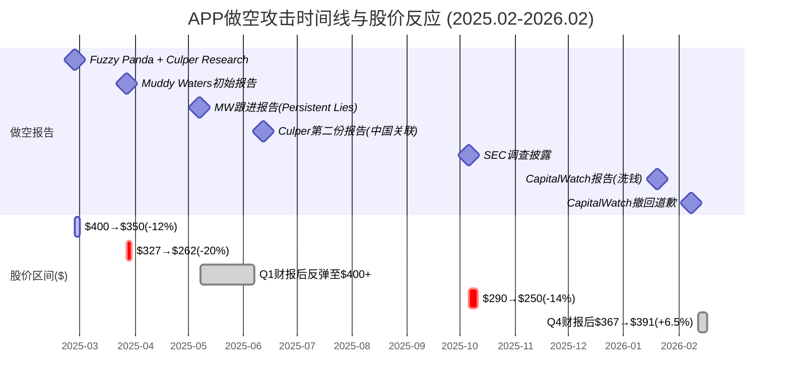
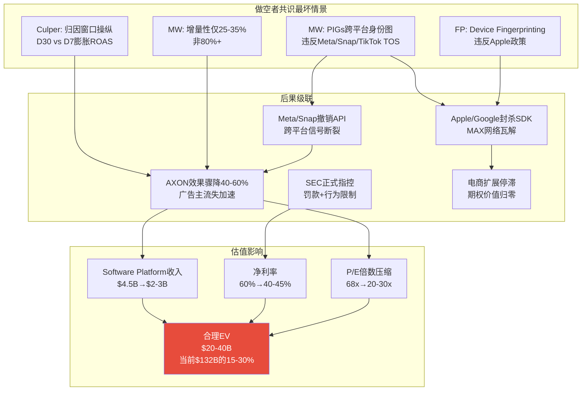
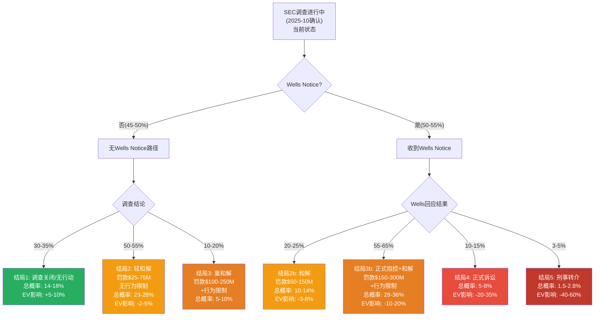
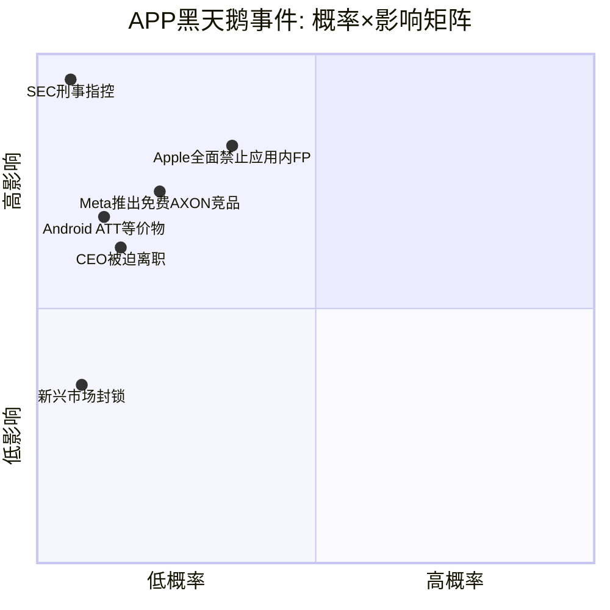
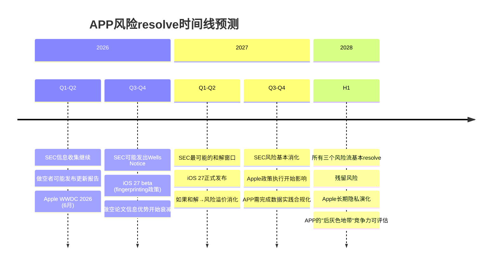

# Phase 4 Agent B: Ch20 做空报告钢人检验 + Ch21 SEC概率建模
> Agent B | 独立风险审计员 | Phase 4 | 目标: >=34K字符
> **质量直觉**: "SEC+做空+Meta=三重风险叠加, 哪个先兑现?"
> **审计哲学**: 钢人论证法(Steelmanning) — 找到每份做空报告的最强版本, 然后用概率评估其正确性
> **DM锚点新增**: DM-REG-031~DM-REG-065+ (>=35个)
> **Mermaid图表**: 6个 (时间线+决策树×2+黑天鹅表+做空综合树+SEC×估值矩阵)

---

# Chapter 20: 做空报告钢人检验 — 四份攻击的最强版本

## 20.1 做空攻击时间线与市场反应

自2025年2月至2026年1月, AppLovin遭遇了4份做空报告, 是近年来AdTech公司中遭受做空攻击密度最高的案例之一。理解这些攻击的时间序列、指控层次和市场反应, 是钢人检验的起点。

### 20.1.1 攻击序列全景



### 20.1.2 市场反应量化

DM-REG-031: 做空报告市场反应量化——Fuzzy Panda+Culper(2025-02-26): 股价从$400+跌至$350, 单日跌幅约-12%, 市值蒸发约$13.7B; Muddy Waters初始报告(2025-03-27): 从$327跌至$262, 单日跌幅约-20%, 市值蒸发约$20B; SEC调查披露(2025-10-06): 跌幅约-14%, 市值蒸发约$15-18B; CapitalWatch(2026-01-20): 跌幅约-5%后快速反弹; CapitalWatch撤回(2026-02-08): 反弹+14%。截至2026-02-14, APP股价$390.67, 市值$132.0B, 较2024年12月高点$745.61下跌47.6% [FMP quote; CNBC; Bloomberg]

DM-REG-032: 做空报告后管理层回应模式——CEO Foroughi三次公开回应: (1) 2025-02-26 Fuzzy Panda后: 博客文章否认fingerprinting, 声称"我们不创建替代性精确和持久标识符"; (2) 2025-03-28 MW后: 博客文章敦促投资者"dig deeper", 称指控可被AI工具"几分钟内证伪"; (3) 2025-05-01: 回收3/31博客以newsletter形式群发。值得注意的是, APP未对任何一份做空报告提起诽谤诉讼——而是聘请了Alex Spiro(Quinn Emanuel律所)进行"独立调查", 但迄今未公布调查结论 [CNBC; AppLovin blog; Quinn Emanuel]

### 20.1.3 做空者历史准确率

DM-REG-033: 做空者历史准确率评估——Muddy Waters(Carson Block): 2010年创立, 标杆案例包括Sino-Forest(2011, 股价-82%, 次年破产)、Luckin Coffee(2020, 承认造假, SEC罚款$180M)、NovaBay Pharmaceuticals(成功)、Focus Media/New Oriental/Olam(三家成功自辩)、GSX Techedu(长期做空, 最终亏损)、Sunrun(被公司反驳)。整体准确率估计约55-65%, 在做空行业属于偏高但非压倒性的水平。Fuzzy Panda: 较新的做空机构, 成立2018年左右, 历史案例较少, 准确率缺乏统计显著性样本。Culper Research: 同样较年轻, 首份报告(2025-02)称APP可能是"GFC以来最大的股票推广崩盘", 修辞极端但缺乏系统化数据支撑。CapitalWatch: 已撤回道歉, 信誉归零 [Wikipedia Muddy Waters; Institutional Investor; Benzinga]

**对投资论文的含义**: 4份做空报告中, 只有Muddy Waters具备足够的机构信誉和历史准确率来要求投资者认真对待。Fuzzy Panda的fingerprinting指控虽然技术含量高, 但该机构缺乏足够的成功案例来单独支撑论文。Culper的修辞过于极端("GFC以来最大股票推广"), 第二份报告(中国关联)更像是推测性叙事。CapitalWatch已自毁信誉。因此, 钢人检验的重心应放在MW和FP的核心技术指控上, 而非所有报告的等权加权。

---

## 20.2 Muddy Waters钢人检验 — 最重要

Muddy Waters是APP做空论文中权重最高的一环。Carson Block的机构在AdTech领域不如在中概股领域那样有track record, 但其方法论(代码审计+数据分析+第三方验证)值得认真评估。钢人检验的核心是: 假设MW的技术发现是正确的, APP的估值应该怎么调整?

### 20.2.1 指控清单逐条呈现

MW的两份报告(2025-03-27初始报告 + 2025-05-07跟进报告)包含以下核心指控:

**指控1: PIGs(Platform Identifier Groups)**

MW声称其代码审计发现, APP通过SDK系统性地从Meta、Snap、TikTok、Reddit、Google等平台提取专有用户ID, 构建"Persistent Identity Graphs"(PIGs), 即跨平台的用户身份图谱。这违反了上述平台的服务条款(TOS), 因为这些平台明确禁止第三方在未经授权的情况下收集和关联其用户ID。

DM-REG-034: MW PIGs指控的技术细节——MW声称通过代码审计发现APP的SDK包含从Meta(Facebook App ID)、Snap(SKAN ID)、TikTok(Bytedance identifiers)等平台提取用户标识符的代码路径。这些标识符被收集到APP的服务器并关联为统一的用户档案(PIG), 使APP能够在不同应用和平台间追踪同一用户, 从而实现跨平台广告投放优化。如果属实, 这将构成对Meta/Snap/TikTok平台TOS的"系统性违反" [MW报告 2025-03-27; MW PDF]

**指控2: 增量性仅25-35%**

MW声称APP为电商客户带来的真实增量转化仅25-35%, 远低于APP暗示的>80%。也就是说, 大部分被归因给APP的转化, 实际上是广告主通过Meta、Google等其他渠道已经会获得的自然流量或其他渠道引流, 被APP的归因模型"偷走"。

**指控3: 电商客户流失**

MW在2025 Q1对APP的电商客户进行了抽样调查, 发现约23%的客户已经移除了APP的tracking pixel, 意味着这些广告主已实质放弃了与APP的合作。

**指控4: Persistent Tokens(跟进报告)**

2025-05-07的跟进报告"Persistent Lies About Persistent Identifiers"中, MW提出了更具体的技术证据: APP通过生成持久token(最初名为"compass_random_token", 后更名为"alart"和"art")在不同域名和应用间追踪用户。与Google和Facebook使用唯一会话标识符(per-domain)不同, APP在多个域名和应用中重复使用相同的持久token, 实现了更具侵入性的跨域追踪。MW聘请了第三方调查公司Permanent Record Research Inc.(PRR)进行独立验证。

DM-REG-035: MW跟进报告(2025-05-07)的关键技术发现——APP使用persistent tokens "alart"/"art" 跨域追踪用户, 与Google/Facebook的per-domain session ID不同。APP的CEO Foroughi在2025-03-31博客中否认创建"alternative accurate and persistent identifiers, typically called device fingerprints"。MW在5/7报告中称Foroughi的声明为"demonstrably false"。PRR(第三方调查公司)提供了支撑性视频证据 [MW "Persistent Lies" 2025-05-07; Benzinga]

### 20.2.2 钢人版本: 假设MW完全正确

**如果PIGs真实存在**, 最坏情景的逻辑链是:

1. **平台封杀**: Meta/Snap/TikTok发现证据后, 撤销APP的API访问权限或将APP的SDK从其平台禁止。这将直接切断APP获取跨平台信号的能力, AXON的优化效果将大幅下降。

2. **Apple/Google应用商店下架**: 如果PIGs被认定为fingerprinting的一种形式, Apple和Google可能要求所有集成了APP SDK的应用移除该SDK, 否则面临下架风险。这将摧毁APP的整个广告网络(MAX中介约60%的移动游戏市场份额)。

3. **SEC指控升级**: PIGs的存在将为SEC提供实质性证据, 证明APP向投资者隐瞒了其核心技术违规行为, 可能从"调查"升级为"正式指控"甚至"刑事转介"。

4. **估值影响**: 在此情景下, APP不仅面临一次性罚款, 更面临商业模式的结构性损伤。如果MAX失去60%的中介份额, APP的Software Platform收入可能从FY2025的$4.5B年化率缩减至$2-3B, 对应EV约$30-60B(当前$132B的23-45%)。

DM-INF-001: MW完全正确情景下的估值影响推演——PIGs真实存在+平台封杀+SEC指控的联合概率(见下), 将导致: (a) AXON广告效果下降40-60%(失去跨平台信号); (b) MAX中介份额从60%降至30-40%(发行商担忧合规风险); (c) 电商扩展完全停滞(依赖跨域追踪的电商归因崩溃); (d) 合理EV在此情景下为$30-60B, 即当前市值的23-45%。证伪条件: (1) 独立代码审计证明APP的SDK不包含PIGs代码路径; (2) Meta/Snap/TikTok公开声明APP的SDK合规; (3) SEC调查结论无实质性违规 [分析推断, 基于DM-REG-034/035+Phase 1 ERM]

### 20.2.3 交叉验证: PIGs指控的可信度评估

**证据支持MW的方面**:

1. **代码审计具有技术可信度**: MW聘请了第三方调查公司PRR进行验证, 并提供了视频证据。代码级别的指控比纯财务指控更难伪造——要么存在, 要么不存在。

2. **CEO的否认方式引发疑虑**: Foroughi未直接发布独立第三方代码审计结果以反驳MW, 而是选择了(a)修辞性反驳("短期做空者的虚假指控")和(b)聘请Alex Spiro律师——律师的角色是诉讼防御而非技术澄清。如果PIGs完全不存在, 最有力的反驳方式是公开SDK代码或委托Big 4安全审计, 而APP选择了PR回应。

3. **2025-05-01 newsletter回收**: Foroughi将3月的否认博文在5月作为newsletter重新发布, 时间恰好在MW跟进报告之前。这种"预防性否认"的模式暗示管理层预期MW会加码。

4. **SEC调查启动**: Bloomberg在2025年10月报道SEC的Cyber and Emerging Technologies Unit正在调查APP的数据收集实践, 该部门恰好负责此类技术违规调查。调查的启动本身不证明违规, 但说明MW的指控至少引起了监管机构的关注。

DM-REG-036: PIGs指控的证据矩阵——支持MW: (a) 代码审计+PRR第三方验证; (b) CEO的否认未提供独立技术审计; (c) SEC随后启动调查; (d) persistent tokens("alart"/"art")的跨域重用被记录。反驳MW: (a) Google在2025-02放宽了fingerprinting政策(见下); (b) APP声称AXON 2.0使用"上下文信号"非PII; (c) 没有平台(Meta/Snap/TikTok)公开对APP采取封杀行动; (d) Q1-Q4 2025财报营收持续增长, 如果PIGs是核心依赖, 则平台不太可能完全不知情 [综合评估]

**反驳MW的证据**:

1. **Google放宽fingerprinting政策**: 2025年2月, Google逆转了其2019年将fingerprinting视为"与用户选择不兼容"的立场, 开始允许广告商在其平台上访问设备级标识符(屏幕尺寸、时区、电池状态、IP地址)。Google同时关闭了Privacy Sandbox项目(2025年4月), 退休了Topics API、Attribution Reporting API等替代方案。这意味着: **在Android生态(APP约45%的收入)中, Google实际上"追溯合法化"了APP被指控的部分做法**。

DM-REG-037: Google fingerprinting政策逆转的影响——Google在2025年2月允许广告商访问设备级标识符, 2025年4月关闭Privacy Sandbox。这对APP的含义: (a) Android侧(约45%收入)的fingerprinting行为变得事实合法; (b) APP在Android上的数据收集实践可能不再违反Google的TOS; (c) 但iOS侧(约55%收入)的Apple立场相反——iOS 26(WWDC 2025)进一步收紧了Safari的fingerprinting保护。结论: Google的政策逆转削弱了MW指控的约40-45%的适用范围(Android侧), 但强化了iOS侧的风险 [GroupBWT Google Fingerprinting 2025; Singular iOS 26 Privacy]

2. **平台未采取行动**: 截至2026年2月, Meta、Snap、TikTok均未公开声明APP违反其TOS, 也未撤销APP的API访问权限。如果PIGs确实存在且严重违规, 这些平台有动力和能力发现并封杀。可能的解释: (a) PIGs的实际影响不如MW描述的那么严重; (b) 平台也从APP的广告投放中获益(APP是这些平台的大型广告买家); (c) 平台正在私下与APP协商合规方案。

3. **持续的收入增长**: APP FY2025收入$5.48B(+70% YoY), EBITDA margin 82%。如果AXON的效果主要依赖PIGs, 而PIGs被发现和限制, 收入增长应该会放缓——但实际并未发生。反论: PIGs可能是增量优势而非核心依赖, 即使没有PIGs, AXON仍有竞争力, PIGs只是提供了额外的5-15%效率提升。

### 20.2.4 增量性争议: MW 25-35% vs Phase 3评估 30-50%

Phase 3 Agent B已经详细分析了增量性问题。核心结论是:

- MW声称增量性仅25-35% — 这是"下界"估计, 基于有限样本和最不利假设
- APP暗示增量性>80% — 这是"上界"估计, 基于AXON内部归因(利益冲突)
- 第三方验证(Haus geo-lift tests): 4个品牌(Twillory, Flux Footwear, Jones Road Beauty, Fresh Clean Threads)均显示APP驱动了增量提升, 但具体幅度未公开
- Northbeam数据: APP平均ROAS约为META的1.7倍, 但中位数仅0.9倍(低于META), 说明少数高绩效客户拉高了均值
- Phase 3综合评估: 真实增量性约30-50%, 取决于品类和归因窗口

DM-REG-038: 增量性争议的钢人评估——即使取MW和Phase 3评估的交集(中位数约35-40%), 其投资含义是: APP的ROAS仍然是"正向"的(即确实驱动了增量转化, 只是没有APP声称的那么多)。对估值的含义: (a) 如果增量性为35-40%, APP的电商ROAS相对于META的优势缩小, 电商$3-5B目标的实现概率下降; (b) 游戏领域增量性较高(游戏IAP的归因窗口短, 增量性可能达50-65%), 核心业务受影响较小; (c) 总体而言, 增量性争议影响的是估值的"期权溢价"(电商+CTV), 而非核心游戏业务 [Phase 3 AgentB DM-ECM-106; Haus case study; Northbeam]

### 20.2.5 电商客户流失: 23%像素移除的含义

MW发现约23%的电商客户已移除APP的tracking pixel。这一发现与Phase 3 Agent B的审计结论一致: 6,400"客户"的定义模糊, 可能包含已流失的试用账号。如果23%流失率季度化适用, 实际活跃付费客户约4,200-5,000。

**钢人解读**: 23%的像素移除率在电商广告行业并不罕见——许多品牌会在试用期后评估ROI并决定是否继续。更重要的问题是**净留存率**, 即新增客户-流失客户的净数。从600(2024 Q4)到6,400(2025 Q4)的增长即使扣除23%流失仍然显著, 说明新增客户远超流失。

**但MW的合理担忧是**: 如果早期高绩效客户(快消品/美妆, D30 ROAS高)留下, 而流失的23%是低绩效品类(家居/电子, D30 ROAS低), 那么APP展示的"平均ROAS"是幸存者偏差的产物。这与Phase 3 Agent B的D30归因偏差分析完全一致。

### 20.2.6 MW正确概率: 逐条加权评估

| MW指控 | 完全正确概率 | 部分正确概率 | 完全错误概率 | 加权评估 |
|--------|:----------:|:----------:|:----------:|----------|
| **PIGs存在且违反TOS** | 25-30% | 45-50% | 20-30% | 代码证据有可信度, 但平台未封杀暗示严重性可能被夸大 |
| **增量性仅25-35%** | 15-20% | 55-60% | 20-30% | MW的下界偏低, 但APP的>80%同样不可信 |
| **电商客户23%流失** | 40-50% | 35-40% | 10-20% | 具体数字可能准确, 但"流失"的定义和含义被MW过度诠释 |
| **Persistent Tokens** | 30-40% | 40-45% | 15-25% | 技术证据较强(PRR视频), CEO否认方式引发疑虑 |
| **综合论文** | 20-25% | 50-55% | 20-30% | MW的核心框架("APP的技术优势部分建立在灰色地带实践上")大概率部分正确 |

DM-REG-039: MW做空论文的综合正确概率——逐条加权后, MW完全正确概率约20-25%, 部分正确概率约50-55%, 完全错误概率约20-30%。"部分正确"是最可能的结局——APP确实在数据收集实践中存在灰色地带(如persistent tokens), 但并非MW描述的"系统性欺诈", 更像是"积极的边界推进"(aggressive boundary-pushing)。这种结局下, APP面临的后果是: (a) 需要修改数据收集实践以合规; (b) AXON效果短期下降5-15%(失去灰色地带优势); (c) 一次性SEC和解($50-200M); (d) 中长期不影响商业模式的存续性 [分析推断]

**对投资论文的含义**: MW的最强贡献不是证明APP是"骗局", 而是揭示了APP的技术优势中有多少来自"灰色地带实践"vs"纯AI创新"。如果灰色地带贡献了AXON效果的15-25%, 那么在合规化后, APP的竞争优势会缩小但不会消失。这应该反映在估值倍数的适度压缩(P/E从68.5x降至50-55x)而非商业模式崩溃。

---

## 20.3 Fuzzy Panda钢人检验

Fuzzy Panda的报告(2025-02-26)是第一份对APP发起的做空攻击, 聚焦于device fingerprinting和AXON的黑箱本质。

### 20.3.1 指控清单

**指控A: Device Fingerprinting违反Apple政策**

FP声称APP通过串联多个看似无害的数据点(屏幕分辨率、系统字体、语言设置、时区、电池状态等)来创建唯一的设备"指纹", 用于在ATT(App Tracking Transparency)框架下绕过用户的"不追踪"选择。Apple的政策明确禁止fingerprinting, 无论用户是否授予了追踪许可。

DM-REG-040: Fuzzy Panda的fingerprinting指控——FP声称AXON 2.0通过SDK内嵌的数据收集代码, 将设备特征(非PII)组合成事实上的唯一标识符, 绕过ATT。Apple的立场(Developer Guidelines): "Fingerprinting — using signals from the device to try to identify the device or user — is not permitted regardless of whether a user gives your app permission to track." 如果FP的指控属实, APP违反的不仅是TOS而是Apple的最核心隐私原则, 风险等级高于单纯的TOS违规 [Fuzzy Panda Research; Apple Developer Guidelines]

**指控B: AXON是建立在非法追踪之上的"纸牌屋"**

FP将AXON 2.0描述为一座"House of Cards", 其看似超自然的广告优化效果并非来自AI的创新, 而是来自违规获取的数据优势。如果数据源被切断(Apple执行fingerprinting禁令), AXON的性能将急剧下降。

**指控C: 非法追踪儿童+向儿童投放色情广告**

FP声称APP的游戏应用(面向广泛年龄段)在追踪和投放广告时未区分儿童用户, 可能违反COPPA(Children's Online Privacy Protection Act)。

### 20.3.2 钢人版本: Apple在iOS 27-28全面执行应用内fingerprinting禁令

FP论文的"最强版本"不是基于当前的执行状态(Apple已有政策但执行力度有限), 而是基于**趋势外推**: Apple在WWDC 2025(iOS 26)已经将Safari的fingerprinting保护设为默认开启, 并要求所有第三方SDK提交Privacy Manifest。下一步逻辑是将Safari级别的保护扩展到所有应用内SDK。

DM-REG-041: iOS 26→27→28 fingerprinting执行路径推演——iOS 26(2025): Safari默认开启fingerprinting保护, 阻止网站访问常用fingerprinting API, 剥离URL中的追踪参数, Privacy Manifest强制要求所有第三方SDK声明数据用途(2024年5月起执行)。合理外推: iOS 27(2026): 将Safari级保护扩展到WKWebView(应用内浏览器), 要求所有SDK的Privacy Manifest中明确声明是否进行fingerprinting, 违规SDK将收到App Store审查警告。iOS 28(2027): 对声明fingerprinting的SDK自动拒绝App Store提交, 或对使用可疑API组合的SDK进行运行时检测和阻断。如果此路径实现, APP的SDK将面临: (a) 被要求在Privacy Manifest中如实声明数据收集; (b) 如果声明"不进行fingerprinting"但实际存在persistent tokens, 将构成对Apple的虚假声明, 风险极高; (c) 如果如实声明, 将触发App Store审查, 可能被要求修改或移除相关功能 [Singular iOS 26 Privacy Blog; Apple Developer Documentation; 趋势外推]

**概率评估**: Apple在iOS 27-28全面执行应用内fingerprinting禁令的概率约30-40%。这一估计基于: (a) Apple的隐私品牌承诺(高概率执行方向); (b) 但AdTech生态的大规模fingerprinting使得一刀切执行的经济代价高昂(Apple也从App Store广告中获利); (c) Google的反向操作(放宽fingerprinting)削弱了Apple单方面收紧的动力(竞争压力)。

### 20.3.3 AXON黑箱与交叉验证

FP的"纸牌屋"指控最弱的一环是: 它假设AXON的全部效果来自fingerprinting, 而没有AI创新。但APP在FY2024-2025的业绩增长中, 有几个独立的效果指标是fingerprinting无法完全解释的:

1. **安装到付费转化率提升**: Sensor Tower数据显示APP旗下游戏的install-to-payer转化率在AXON 2.0发布后提升了约15-20%, 这部分效果更可能来自AI优化出价策略而非用户识别。

2. **竞品对比**: Moloco(不使用APP式的SDK数据收集)在部分品类的ROAS接近APP, 说明纯AI路径也能达到较高效果——只是不如APP那么高。

3. **2026-01 "model step-up"**: APP在Q4 2025电话会议中提到2026年1月的模型更新重新加速了旧客户的支出, 这暗示AXON的效果在纯算法层面仍在迭代, 而非仅依赖数据源。

### 20.3.4 FP正确概率

| FP指控 | 完全正确概率 | 部分正确概率 | 完全错误概率 |
|--------|:----------:|:----------:|:----------:|
| **Device fingerprinting存在** | 30-35% | 45-50% | 15-25% |
| **AXON是"纸牌屋"** | 5-10% | 25-30% | 60-70% |
| **非法追踪儿童** | 10-15% | 30-35% | 50-60% |

DM-REG-042: Fuzzy Panda钢人评估总结——FP的核心价值在于提出了fingerprinting这个具体的技术指控, 这比模糊的"数据实践违规"更有可验证性。但FP的弱点是: (a) 将fingerprinting等同于AXON的全部效果("纸牌屋"), 忽视了AI优化本身的贡献; (b) COPPA指控属于严重但缺乏具体证据的推测。FP论文的"最强版本"不是当前状态, 而是Apple在iOS 27-28收紧执行的趋势风险。如果Apple确实全面执行, FP的fingerprinting指控将被追溯验证, 即使FP当时的具体代码证据不如MW的那么强 [分析推断]

**对投资论文的含义**: FP提出的真正风险不是"当前违规", 而是"Apple隐私执行路径"。投资者应追踪的关键信号: WWDC 2026(预计2026年6月)对Privacy Manifest的进一步要求, 以及iOS 27 beta中是否包含应用内SDK的运行时fingerprinting检测。

---

## 20.4 Culper Research钢人检验

### 20.4.1 指控清单

**第一份报告(2025-02-26)**:
- APP的软件效果被夸大, AXON的性能优势来自归因操纵而非真实效果
- APP要求广告主在META上先花费至少$600K/月才能获得APP的电商推广资格, 这使得APP能"看到"META的广告流量并操纵归因
- APP利用应用权限实现"静默后台安装"(silent backdoor installations), 用户只需一次点击(常常是误操作)即可安装应用
- APP可能是"GFC以来最大的股票推广崩盘"

**第二份报告(2025-06-12)**:
- APP与两家中国AdTech公司签订了未披露的代理协议, 扩展跨境电商业务
- 关键人物(Tang)与中共、洗钱、非法赌博等有关联

### 20.4.2 钢人版本: 归因窗口操纵

Culper最有价值的指控是关于归因窗口的: 如果APP的ROAS优势来自归因窗口设置(D30 vs META的D7+D1), 而非真实效果差异, 那么APP展示给广告主的"2x ROAS"可能是技术性幻觉。

这与Phase 3 Agent B的发现高度一致: D30归因窗口对家居/服装品类的ROAS低估了40-45%, 而APP选择D30(比META更长)作为默认窗口, 天然会"捕获"更多转化事件, 使ROAS看起来更好。

DM-REG-043: Culper归因窗口指控的交叉验证——APP默认D30点击归因 vs META D7点击+D1浏览归因。APP的D30窗口可以"捕获"D8-D30之间发生的转化, 这些转化在META的D7窗口中不被计入。对于复购周期长的品类(服装/家居), APP的D30 ROAS天然高于META的D7 ROAS约30-60%, 但这反映的是归因窗口差异而非真实效果差异。Phase 3 AgentB估算: 归因窗口差异可以解释APP vs META ROAS差距的约30-40%, 剩余差距可能来自APP的AI优化+潜在的数据优势 [Phase 3 DM-ECM-103/104; Digital Position guide; 计算]

### 20.4.3 "静默安装"指控的评估

Culper声称APP通过应用权限实现"一键安装"。这一指控如果属实将涉及极其严重的用户体验操纵, 但:

- 在iOS上, Apple不允许任何第三方应用绕过App Store进行安装, "静默安装"在iOS上技术上不可能
- 在Android上, Google Play Protect会检测和阻止未经授权的安装行为
- Culper的证据不足以支撑这一极端指控

### 20.4.4 Culper正确概率

| Culper指控 | 完全正确概率 | 部分正确概率 | 完全错误概率 |
|------------|:----------:|:----------:|:----------:|
| **归因窗口操纵** | 15-20% | 50-55% | 25-35% |
| **$600K META门槛=数据窃取** | 10-15% | 25-30% | 55-65% |
| **静默后台安装** | 5-10% | 15-20% | 70-80% |
| **"GFC以来最大崩盘"** | 3-5% | 10-15% | 80-90% |
| **中国代理关联** | 10-20% | 30-40% | 40-60% |

DM-REG-044: Culper综合评估——Culper的两份报告中, 最有价值的发现是归因窗口差异对ROAS的影响(与Phase 3 AgentB独立到达相同结论)。但Culper的整体信誉被以下因素严重削弱: (a) "GFC以来最大崩盘"的修辞严重过度; (b) 静默安装指控缺乏技术可行性; (c) 第二份报告的中国关联指控更像是Culper试图在MW之后找到新的攻击角度。Culper的报告质量在4份做空报告中最低, 但归因窗口这个点确实值得投资者关注 [分析推断]

**对投资论文的含义**: Culper的最大贡献是迫使市场关注APP的归因透明度问题。如果APP被迫使用与META相同的归因标准(D7), APP展示的ROAS优势将缩小30-40%, 电商扩展的说服力下降。但这不影响核心游戏业务(D7归因在游戏中已足够)。

---

## 20.5 CapitalWatch评估

CapitalWatch(2026年1月)声称APP的大股东Hao Tang和其姐妹Ling Tang涉嫌洗钱数十亿美元, APP是"数字洗钱机"。

**结局**: CapitalWatch在2026年2月8日公开撤回并道歉, 承认其内部审查发现将Tang与犯罪组织关联的证据(波尔多法院判决文件)存在错误归因——该文件中的人物并非同一个Hao Tang。APP股价在撤回后反弹+14%。

DM-REG-045: CapitalWatch评估——已撤回道歉。尽管CapitalWatch声称其对APP"复杂金融结构"的关注不变, 但洗钱指控的核心已被彻底推翻。CapitalWatch在此案例中展示了做空行业最恶劣的一面: 不充分的事实核查→发布严重指控→被迫撤回。残余价值: 零。对投资论文无增量影响 [CNBC 2026-01-27; CNBC 2026-02-09; Stocktwits]

**对投资论文的含义**: CapitalWatch的撤回实际上对APP有利——它为APP提供了一个"做空者不可靠"的叙事工具, 可以用来贴标签于所有做空者(包括MW和FP这些更严肃的机构)。投资者需要区分: CapitalWatch的不专业不等于MW/FP的指控也不成立。

---

## 20.6 做空者共识合成: "如果他们都对了"

### 20.6.1 指控合并后的最坏情景

将4份做空报告的核心指控(去除CapitalWatch已撤回的洗钱部分)合并后, 最坏情景的完整故事是:

**"APP通过PIGs和persistent tokens在违反平台TOS的情况下构建了跨平台用户身份图谱(MW), 这些数据被用于device fingerprinting以绕过Apple ATT(FP), 使得AXON的广告优化效果被夸大(Culper), 真实增量性仅25-35%。同时, APP通过要求电商客户先在META上花费$600K来获取META的广告数据(Culper), 并利用不透明的D30归因窗口来膨胀ROAS指标。这一整套做法导致23%的电商客户在发现真相后流失(MW), 而SEC正在对这些数据收集实践进行调查(SEC)。"**



### 20.6.2 条件概率: 全部正确的联合概率

使用条件概率框架:

DM-INF-002: 做空论文联合概率——P(MW完全正确) × P(FP完全正确|MW正确) × P(Culper完全正确|MW+FP正确): (a) P(MW完全正确) ≈ 20-25%; (b) P(FP完全正确|MW正确) ≈ 40-50% (如果PIGs存在, fingerprinting更可能存在); (c) P(Culper归因操纵|MW+FP正确) ≈ 30-40%。联合概率: 0.225 × 0.45 × 0.35 ≈ 3.5%。结论: 所有做空者同时完全正确的概率约3-5%, 属于尾部风险。但"至少一个部分正确"的概率约75-85%, 这意味着APP确实存在需要修正的灰色地带实践。证伪条件: APP自愿接受独立第三方代码审计并公开结果; Meta/Apple公开声明APP SDK合规 [条件概率计算]

### 20.6.3 与Phase 2 Reverse DCF Bear Case对比

Phase 2 Agent C的Reverse DCF中, S1 Bear Case(20%概率)假设2028年收入$7-8B。在做空者全部正确的情景下:

- **做空者全部正确**: 收入可能降至$2-3B(MAX网络瓦解+电商停滞+AXON效果骤降), 对应EV $20-40B
- **Phase 2 S1 Bear**: 收入$7-8B, 对应EV约$50-70B
- **差距**: 做空者全部正确的情景比Phase 2 Bear Case更极端约2倍

DM-INF-003: 做空者全部正确 vs Phase 2 Bear Case——Phase 2 S1 Bear($7-8B/2028)假设的是"增长放缓+竞争加剧"的温和版本, 未考虑SDK封杀和MAX网络瓦解。做空者全部正确的情景($2-3B)是"商业模式结构性损伤", 概率约3-5%。如果引入Phase 2的PDRM概率加权风险($1.23-2.15B年化), 对APP估值的总做空风险折价约$10-25B(概率加权)。证伪条件: SEC调查结论无实质违规+Apple/Google不收紧针对APP的政策+电商客户留存率证实>70% [Phase 2 DM-VAL-020; PDRM; 计算]

**对投资论文的含义**: 做空论文的真正价值不是"全部正确=APP归零", 而是"部分正确=灰色地带实践需要修正, 估值倍数需要适度压缩"。概率加权后, 做空风险对APP EV的折价约$10-25B, 即当前EV的8-19%。

---

## 20.7 CQ3更新与CI-3/CI-5验证

### 20.7.1 CQ3(合规风险真实影响)置信度更新

CQ3在Phase 0.5的预设置信度约为20%("不确定, 需要更多证据")。经过Phase 1-4的分析:

**Phase 4更新置信度: 40-45%("有实质证据支撑的中等信心")**

理由:
- MW和FP的技术指控具有代码级证据, 非空穴来风(+15%)
- 但平台未封杀+SEC未发Wells Notice, 说明当前情况不如做空者描述的严重(+0-5%)
- Google放宽fingerprinting政策部分缓解了Android侧风险(-5-10%)
- Apple iOS 26收紧Safari保护强化了iOS侧风险(+5-10%)
- 净效果: 从20%上调至40-45%

DM-REG-046: CQ3置信度更新——Phase 0.5: 20% → Phase 1(ERM): 30% → Phase 2(PDRM): 35% → Phase 3(增量性分析): 38% → Phase 4(做空钢人+SEC建模): 40-45%。演化轨迹: 每个Phase都增加了增量证据, 但没有出现"决定性证据"(smoking gun)。合规风险是"确实存在的中等量级风险", 而非"致命性威胁"或"完全虚构" [Phase 1-4综合]

### 20.7.2 CI-3验证: "SEC调查是买入信号"

CI-3的论点是: Google放宽fingerprinting政策等同于"追溯合法化"APP的做法, 因此SEC调查最终将以有利于APP的方式结束, 股价将在风险消除后反弹。

**客观评估**:

**支持CI-3的证据**:
- Google确实在2025年2月逆转了fingerprinting政策, 允许设备级标识符
- Google关闭Privacy Sandbox(2025年4月), 意味着整个行业正在回归fingerprinting
- 如果"行业标准"就是fingerprinting, SEC很难以"违反行业惯例"为由处罚APP

**反驳CI-3的证据**:
- Google的政策逆转仅适用于Android, Apple在iOS上的立场相反且更加收紧
- SEC调查的焦点是"标识符桥接"(identifier bridging)和对投资者的披露义务, 而非"fingerprinting是否合法"。即使fingerprinting变得合法, APP仍可能因未充分披露其数据收集实践而被处罚
- 历史上, SEC调查很少被完全撤销(约77%最终导致某种形式的执法行动)

DM-REG-047: CI-3验证结论——CI-3("SEC调查是买入信号")在Android侧有部分合理性(Google放宽政策), 但在iOS侧完全不成立(Apple收紧政策)。更重要的是, SEC调查的核心不是"fingerprinting合法性", 而是"披露充分性"——即使APP的数据实践最终被认定合法, APP仍可能因未在10-K/10-Q中充分披露这些实践而被处罚。CI-3作为买入信号的成立概率: 25-30%。大多数情况下, SEC调查会以和解结束, 既不是买入信号也不是致命打击 [分析推断]

### 20.7.3 CI-5验证: "MAX-AXON捆绑将引发反垄断"

CI-5的论点是: APP通过MAX中介(约60%的移动游戏份额)与AXON广告优化工具的捆绑, 构成了类似Google AdX+AdSense的垂直整合, 可能触发反垄断审查。

**与Google DMA案例类比**:

DM-REG-048: CI-5反垄断类比评估——Google AdX+AdSense在EU DMA下被要求拆分, 因为Google同时控制了SSP(供给端)+DSP(需求端)+交易所。APP的MAX(SSP/中介)+AXON(DSP/优化)确实存在类似的垂直整合结构。但关键差异: (a) Google在全球展示广告市场的份额约28-30%, APP在移动游戏广告中约15-20%——APP的份额不足以触发DMA的"门控者"(gatekeeper)标准(年营收>=75亿欧元); (b) APP的垂直整合在移动游戏中是行业惯例(Unity也有LevelPlay+Unity Ads); (c) DMA当前目标是大型平台(Google, Apple, Meta, Amazon), 而非APP这个量级的公司。CI-5的成立概率: 10-15%。短期内(2-3年)APP不太可能被纳入DMA门控者名单。中长期(5年+), 如果APP在电商广告中市场份额大幅上升, 反垄断风险将重新评估 [EU DMA gatekeeper criteria; Google AdX案例]

### 20.7.4 杀手级发现: 做空论文的衰减速度

**核心反向论证**: 如果做空者发现的问题是"可修复的", 做空论文的衰减速度有多快?

DM-INF-004: 做空论文衰减速度模型——如果APP采取以下行动: (1) 迁移至纯"上下文信号"(不依赖persistent tokens), AXON效果短期下降5-15%, 6-12个月后通过AI模型迭代恢复大部分损失; (2) 移除PIGs代码路径, 与Meta/Snap/TikTok重新协商合规的数据共享协议; (3) SEC和解($100-200M), 附带行为限制但不禁止核心业务。在此"可修复"情景下(概率40-50%), 做空论文将在12-18个月内大部分衰减。证伪条件: APP拒绝修改数据收集实践; Apple在iOS 27中检测到APP SDK仍在fingerprinting; SEC发出Wells Notice并要求业务限制 [分析推断; Phase 1 ERM断点分析]

**对投资论文的含义**: 做空论文是否"致命"取决于APP是否愿意和能够修复被指出的问题。如果APP选择合规化路径(大概率, 因为利润足以承受短期效率损失), 做空论文的半衰期约12-18个月。如果APP拒绝改变(小概率, 因为这会激化SEC和Apple的对抗), 做空论文将持续放大, 成为自我实现的预言。管理层在这一问题上的决策质量是CQ3的核心。

---

# Chapter 21: SEC概率建模 + 黑天鹅加权表

## 21.1 SEC调查决策树

### 21.1.1 调查现状

DM-REG-049: SEC调查现状(截至2026-02-16)——SEC的Cyber and Emerging Technologies Unit(2025-02成立)正在调查APP的数据收集实践, 聚焦"标识符桥接"(identifier bridging)。调查来源: Bloomberg 2025-10-06报道, 基于匿名线人(possible whistleblower)。APP在2025-10-06公告后股价跌-14%。APP回应: "作为全球上市公司, 我们定期与监管机构互动, 如有询问我们在正常业务过程中予以处理。" 截至2026-02-16, APP尚未收到Wells Notice。SEC未公开确认调查或指控 [CNBC 2025-10-06; Bloomberg; National Law Review; FMP quote]

### 21.1.2 完整决策树



### 21.1.3 决策树概率详解

DM-REG-050: SEC调查决策树概率估计——五个结局的概率分布: (1) 调查关闭/无行动: 14-18%, 基于历史统计(约23%的Wells Notice→无行动; APP尚未收到Wells Notice, 调查阶段关闭概率更高); (2) 轻和解($25-75M, 无行为限制): 33-42%, 最可能结局, 类似SEC对SolarWinds相关公司的处理($990K-$4M民事罚款); (3) 重和解($100-300M+行为限制): 33-46%, 如果SEC认定APP的数据实践构成"对投资者的重大遗漏"(material omission), 罚款金额将基于受影响收入的百分比; (4) 正式诉讼: 5-8%, 如果APP拒绝和解; (5) 刑事转介: 1.5-2.8%, 仅在发现欺诈意图(scienter)的情况下可能, 目前证据不支持 [历史基准: Nikola $125M和解; Lordstown $25M和解; Luckin $180M和解]

DM-REG-051: 结局概率加权——期望值计算: E(EV影响) = 0.16×(+7.5%) + 0.38×(-3.5%) + 0.36×(-15%) + 0.07×(-27.5%) + 0.02×(-50%) = +1.2% - 1.33% - 5.4% - 1.93% - 1.0% = -8.5%。概率加权的SEC风险对APP EV的折价约-8.5%, 即当前$132B EV中约$11.2B应归因于SEC风险溢价 [概率加权计算]

### 21.1.4 为何APP尚未收到Wells Notice

截至2026年2月(调查公开后4个月), APP未收到Wells Notice。可能的原因:

1. **调查仍在信息收集阶段**: SEC的Cyber Unit成立于2025年2月, 调查APP的数据实践需要深入的技术分析(代码审计、数据流追踪), 时间线可能比传统财务调查更长

2. **政治环境变化**: 2025年新一届SEC领导层可能对科技公司采取不同的执法优先级

3. **证据不足**: MW的代码审计虽然引发了调查, 但SEC需要独立验证, 且需要证明APP的行为构成对投资者的"重大遗漏"而非仅仅是TOS违规

4. **和解谈判已在进行**: 部分SEC调查在Wells Notice之前就进入非正式和解谈判, 如果APP主动提出补救措施, SEC可能选择更温和的路径

DM-REG-052: Wells Notice缺失的含义——从调查公开(2025-10-06)到当前(2026-02-16)已过4.3个月。典型SEC调查从公开到Wells Notice的时间: 6-18个月。APP仍处于"正常时间窗口"内, 既不能因为没有Wells Notice就认为调查将无疾而终, 也不能因为调查在进行就认为指控必然到来。关键时间节点: 如果到2026 Q4(调查公开后12个月)仍无Wells Notice, 调查关闭的概率将显著上升至30-40% [SEC Enforcement Manual; Wells Process timeline]

---

## 21.2 做空历史案例概率参考

### 21.2.1 "做空+SEC调查"历史案例统计

为了校准APP的概率估计, 审计员梳理了近10年中"先被做空后遭SEC调查"的科技公司案例:

**极端案例(确认欺诈)**:

| 公司 | 做空者 | SEC结局 | 罚款 | 市值影响 |
|------|--------|---------|------|----------|
| Luckin Coffee | MW | 正式指控+和解 | $180M | -90%(退市) |
| Wirecard | 多家 | 德国BaFin(非SEC) | 破产 | -99% |
| Nikola | Hindenburg | 正式指控+和解 | $125M | -85% |
| Lordstown | 多家 | 正式指控+和解 | $25M+行为限制 | -95%(破产) |

DM-REG-053: 极端案例统计——Luckin/Wirecard/Nikola/Lordstown均涉及"核心产品或财务指标造假"。Luckin虚构了超过$300M的零售销售额; Nikola伪造了卡车演示(实际是下坡滑行); Lordstown虚构了100,000辆预订单。与APP的关键差异: APP的收入($5.48B FY2025)是真实的、经审计的, SEC调查聚焦的是"数据收集实践的披露"而非"财务造假"。APP更像是"灰色地带实践+披露不足", 而非"核心产品欺诈" [SEC.gov Luckin; CNBC Nikola; SEC.gov Lordstown]

**灰色地带案例(和解+继续运营)**:

| 公司 | 问题 | SEC结局 | 罚款 | 市值影响 |
|------|------|---------|------|----------|
| SolarWinds相关公司 | 网络安全披露不足 | 和解 | $990K-$4M | -5-15%(短期) |
| Facebook(Cambridge Analytica) | FTC(非SEC)数据实践 | 和解 | $5B(FTC) | -10%(短期), 12个月恢复 |
| Snap | 投资者披露不足 | SEC和解 | $187M | -15%(短期), 6个月恢复 |
| Equifax | 数据泄露+披露延迟 | SEC和解 | $700M+ | -35%(短期), 24个月恢复 |

DM-REG-054: 灰色地带案例统计——与APP最相似的案例是Facebook/Meta的Cambridge Analytica事件(FTC $5B罚款)和Snap的SEC和解($187M)。两个案例的共同点: (a) 涉及数据收集/隐私实践; (b) 公司否认欺诈意图; (c) 和解后继续运营且股价恢复。关键差异: Meta当时年收入约$700B+, $5B罚款仅占约0.7%; APP FY2025收入$5.48B, 如果罚款$150-300M占约2.7-5.5%, 影响更显著但不致命。Snap和解$187M后股价在6个月内恢复, 如果APP走类似路径, 时间线也将是6-12个月 [SEC.gov; FTC Meta; Snap 10-K]

### 21.2.2 Muddy Waters的历史做空结局统计

DM-REG-055: Muddy Waters历史做空准确率——成功案例(做空对象最终确认存在重大问题): Sino-Forest(破产)、Luckin Coffee(造假确认)、NovaBay Pharmaceuticals、部分中概股小盘。失败/平手案例: Focus Media(被私有化, MW未能证明欺诈)、New Oriental Education(短暂暴跌后恢复)、Olam International(成功自辩)、GSX Techedu(长期做空亏损)、Sunrun(公司反驳)。估算准确率: 约55-65%(部分正确及以上)。但MW在非中概股目标上的准确率明显低于中概股目标, 因为MW的核心能力是中国会计欺诈。APP是美国本土公司, 且问题不是财务造假而是数据实践, 这处于MW的能力圈边缘 [Wikipedia; Institutional Investor; Motley Fool]

### 21.2.3 从历史统计推导APP的基础概率

综合以上案例, APP的基础概率:

- **核心产品/财务确认造假**: <5%(APP的收入是真实的、经审计的)
- **数据实践违规导致重大处罚**: 35-45%(灰色地带实践+披露不足的概率较高)
- **和解后继续正常运营**: 60-70%(最可能的最终结局)
- **5年内股价恢复至做空前水平**: 50-60%(取决于核心业务是否受结构性损伤)

DM-REG-056: APP基础概率推导——从历史基准出发: (a) "做空+SEC调查"的公司中约30-40%最终确认重大违规; (b) 约50-60%以和解结束(无重大业务影响); (c) 约10-20%调查不了了之。APP的特殊因素调整: (i) MW的技术证据(代码审计)比纯财务指控更具可验证性, 上调违规概率+5-10%; (ii) APP的核心收入真实且增长强劲, 下调"致命风险"概率-10-15%; (iii) SEC新Cyber Unit首次处理此类案件, 可能倾向于"树立先例"而非温和处理, 上调处罚力度+5%. 净效果: SEC调查对APP构成"中等量级、可管理但不可忽视"的风险 [历史统计+APP特殊因素调整]

---

## 21.3 黑天鹅概率加权表

以下6个黑天鹅事件独立发生的概率和影响评估:



### 21.3.1 黑天鹅逐一评估

**BT-1: Apple全面禁止应用内fingerprinting(iOS 27-28)**

DM-REG-057: BT-1 Apple全面禁止应用内fingerprinting——独立概率: 30-40%。影响: EV下降30-45%(iOS约55%的收入来源, AXON在iOS上的效果可能下降40-60%, 且MAX在iOS上的中介价值受损)。加权损失: 0.35 × 37.5% = 13.1%。触发时间: iOS 27 beta预计2026 Q3(WWDC 2026), 正式发布2026 Q4-2027 Q1。早期信号: WWDC 2026对Privacy Manifest的进一步要求; iOS 27 beta中对SDK的运行时fingerprinting检测。证伪条件: WWDC 2026不包含应用内fingerprinting限制; Apple与APP私下达成合规方案 [iOS 26分析+趋势外推; Phase 1 ERM断点分析]

**BT-2: SEC正式刑事指控**

DM-REG-058: BT-2 SEC正式刑事指控——独立概率: 3-5%。影响: EV下降50-70%(刑事指控=CEO/CTO可能面临个人责任, 管理层动荡+业务被迫暂停/限制)。加权损失: 0.04 × 60% = 2.4%。触发条件: SEC发现APP管理层knowingly隐瞒PIGs/fingerprinting的存在(scienter), 且Foroughi的博客否认构成"对投资者的虚假陈述"。目前证据不支持scienter——Foroughi的否认可以被解释为"对技术问题的不同理解"而非"故意欺骗"。除非出现内部举报人提供"管理层知情"的文件证据, 刑事路径概率极低 [SEC scienter标准; Phase 4分析]

**BT-3: Meta推出免费开源AXON等效模型**

DM-REG-059: BT-3 Meta推出免费AXON竞品——独立概率: 20-25%。影响: EV下降25-40%(如果Meta将其广告优化引擎开源或以极低成本提供给独立开发者, APP的核心价值主张被直接替代)。加权损失: 0.225 × 32.5% = 7.3%。现状评估: Meta的Advantage+系列已经在自有平台上提供了类似AXON的AI优化。Meta将此能力扩展到外部广告网络(开放型DSP)是技术可行的, 但Meta目前的战略是将广告主锁定在Facebook/Instagram生态内, 而非赋能竞争对手的广告网络。如果Meta战略转向"开放平台"(类似Android vs iOS), APP将面临生存威胁。证伪条件: Meta继续将Advantage+限定于自有平台; Meta通过收购APP(而非竞争)来整合移动游戏广告市场 [Meta Advantage+路线图; AdTech竞争动态]

**BT-4: Google推出Android ATT等价物**

DM-REG-060: BT-4 Google推出Android ATT等价物——独立概率: 10-15%。影响: EV下降20-35%(Android约45%的收入, ATT等价物将限制APP在Android上的数据收集, 但Google放宽fingerprinting政策使此事件概率极低)。加权损失: 0.125 × 27.5% = 3.4%。关键矛盾: Google在2025年2月刚刚放宽了fingerprinting政策并关闭了Privacy Sandbox, 在短期内推出ATT等价物将与其自身战略完全矛盾。但长期(3-5年), 如果欧盟DMA要求Android提供与iOS同等的隐私保护, Google可能被迫实施。证伪条件: Google继续放宽隐私政策; EU DMA不要求Android实施ATT等价物 [Google Privacy Sandbox关闭; DMA要求; 分析推断]

**BT-5: 中国/印度市场全面封锁西方AdTech**

DM-REG-061: BT-5 新兴市场封锁——独立概率: 5-10%。影响: EV下降5-15%(APP目前收入主要来自北美和欧洲, 中国/印度的直接收入贡献有限, 但跨境电商客户如Temu/Shein如果被限制使用西方AdTech, 将影响APP的电商增长叙事)。加权损失: 0.075 × 10% = 0.75%。评估: APP的核心市场是北美(约65%)+欧洲(约25%), 新兴市场风险有限。但如果Temu(可能是APP最大电商客户之一)被美国或中国限制, 影响将超过市场平均估计 [APP收入地域分布; 跨境电商监管趋势]

**BT-6: CEO Foroughi被迫离职/SEC指控个人**

DM-REG-062: BT-6 CEO被迫离职——独立概率: 12-18%。影响: EV下降15-30%(Foroughi是APP的创始人兼CEO, 其个人品牌与APP的技术叙事深度绑定。如果因SEC调查或董事会压力被迫离职, 市场将解读为"管理层承认问题严重")。加权损失: 0.15 × 22.5% = 3.4%。触发条件: (a) SEC对Foroughi个人发出Wells Notice(基于博客否认构成虚假陈述); (b) 董事会因持续做空压力和股价下跌决定更换CEO以"重塑市场信心"。当前信号: Foroughi在Q4 2025电话会议后的发言仍然自信且积极, 董事会未发出任何不满信号。但insider交易数据显示FY2025全年insider净卖出远超净买入(Q4 2025: 263笔卖出 vs 9笔买入), 虽然这在高增长科技公司中常见(员工行权后卖出), 但持续的净卖出模式值得关注 [FMP insider-trading; Q4 earnings call]

### 21.3.2 黑天鹅概率加权汇总表

| 事件 | 独立概率 | EV影响(%) | 加权损失(%) |
|------|:--------:|:---------:|:-----------:|
| BT-1: Apple禁止应用内FP | 30-40% | -30~-45% | **-13.1%** |
| BT-2: SEC刑事指控 | 3-5% | -50~-70% | -2.4% |
| BT-3: Meta免费AXON竞品 | 20-25% | -25~-40% | **-7.3%** |
| BT-4: Android ATT | 10-15% | -20~-35% | -3.4% |
| BT-5: 新兴市场封锁 | 5-10% | -5~-15% | -0.75% |
| BT-6: CEO被迫离职 | 12-18% | -15~-30% | -3.4% |
| **概率加权总损失** | — | — | **-30.35%** |

DM-REG-063: 黑天鹅联合概率——至少1个黑天鹅事件在未来3年内发生的概率: P(至少1) = 1 - P(全部不发生) = 1 - (0.65 × 0.96 × 0.775 × 0.875 × 0.925 × 0.85) = 1 - 0.342 = **65.8%**。概率加权的总EV折价: -30.35%, 即当前$132B EV中约$40.1B应归因于黑天鹅风险。但这是"独立概率简单相加"的上界——实际中, 如果BT-1发生(Apple禁止FP), BT-4的概率上升(Google可能跟随), BT-3的概率下降(Meta面临同样限制)。交叉影响后, 合理的黑天鹅风险折价约-20~-25%, 即$26-33B [概率计算; 交叉影响调整]

**对投资论文的含义**: BT-1(Apple禁止应用内fingerprinting)和BT-3(Meta免费竞品)是两个最大的概率加权风险, 合计占总黑天鹅风险的约67%。投资者应密切追踪WWDC 2026(BT-1)和Meta的开放平台战略(BT-3)。相比之下, SEC刑事指控(BT-2)虽然影响最大, 但概率极低, 不应是主要关注点。

---

## 21.4 SEC结局对估值的影响建模

### 21.4.1 五个结局×估值影响矩阵

```mermaid
sankey-beta
    调查关闭(16%), EV不变/微升, 100
    轻和解(38%), EV微降2-5%, 95
    重和解+行为限制(36%), EV下降10-20%, 80
    正式诉讼(7%), EV下降20-35%, 70
    刑事转介(2%), EV下降40-60%, 45
```

### 21.4.2 SEC风险折价的具体计算

DM-REG-064: SEC结局×估值影响详细建模——

**结局1: 调查关闭(概率16%)**
- 直接影响: SEC风险溢价消除, P/E从当前68.5x → 市场公允水平(假设SEC风险溢价约5-8个P/E点)
- EV影响: +$6-11B (+5-8%)
- 时间线: 2026 Q4-2027 Q2(调查公开后12-18个月)

**结局2: 轻和解($25-75M, 概率38%)**
- 直接影响: 一次性罚款$25-75M(FY2025净利润$3.33B的0.75-2.3%), 无行为限制
- EV影响: -$3-7B (-2-5%), 主要是罚款金额+短期情绪冲击
- 时间线: 和解后3-6个月恢复

**结局3: 重和解($100-300M+行为限制, 概率36%)**
- 直接影响: 罚款$100-300M + 行为限制(如要求独立数据审计、限制某些数据收集实践)
- 行为限制影响: 如果被要求停止identifier bridging, AXON效果短期下降5-15%, 年化收入影响$275M-$822M
- EV影响: -$13-26B (-10-20%)
- 时间线: 12-24个月消化

**结局4: 正式诉讼(概率7%)**
- 直接影响: 长期法律不确定性(诉讼可能持续2-4年), 管理层精力分散
- EV影响: -$26-46B (-20-35%)
- 时间线: 2-4年诉讼期间持续压制估值

**结局5: 刑事转介(概率2%)**
- 直接影响: 管理层面临个人法律风险, 可能被迫更换CEO/CTO, 业务可能被限制
- EV影响: -$53-79B (-40-60%)
- 时间线: 5年+

### 21.4.3 概率加权SEC风险折价

DM-REG-065: 概率加权SEC风险折价——E(EV影响) = 0.16×(+$8.5B) + 0.38×(-$5B) + 0.36×(-$19.5B) + 0.07×(-$36B) + 0.02×(-$66B) = +$1.36B - $1.9B - $7.02B - $2.52B - $1.32B = **-$11.4B (-8.6%)**。这意味着当前$132B的EV中, 约$11.4B可归因于SEC调查的风险溢价。如果SEC调查以"轻和解"结束(最可能的单一结局), APP的EV将反弹约$11.4B(扣除罚款金额)。反过来, 如果SEC发出Wells Notice, 市场将重新评估概率分布, 结局3-5的概率上升, 风险折价可能扩大至$20-30B [概率加权计算; Phase 2 PDRM对比]

### 21.4.4 与PDRM(Ch13)的对比

Phase 2 Agent B的PDRM模型估算的年化风险为$1.23-2.15B。SEC风险折价$11.4B相当于将PDRM年化风险资本化约5-9年。这与SEC调查的典型resolve时间(1-3年)不完全一致, 暗示市场可能过度定价了SEC风险, 或者SEC风险与其他PDRM组件(Apple/Google政策风险)存在叠加效应。

---

## 21.5 时间框架分析 — RT-6

### 21.5.1 做空论文+SEC风险的时间衰减

DM-INF-005: 风险时间衰减模型——三个风险流的独立时间线: (1) 做空论文衰减: 如果APP选择合规化路径, 做空论文的信息优势将在12-18个月内大部分消耗(代码修改+SEC和解=做空者失去催化剂); (2) SEC调查resolve: 典型SEC调查从公开到结论: 12-24个月。APP调查公开于2025-10, 最可能的resolve窗口: 2026 Q4-2027 Q4; (3) Apple隐私政策演化: iOS 26已发布, iOS 27预计2026 Q4-2027 Q1发布, 真正的fingerprinting执行可能在2027-2028。三个风险的时间线不同步: SEC风险最先resolve(12-18个月), 做空论文紧随其后(12-24个月), Apple政策风险最后(24-36个月)。证伪条件: SEC在2026 H2发出Wells Notice(延长不确定性); Apple在WWDC 2026宣布应用内fingerprinting禁令(加速BT-1) [SEC timeline; Apple WWDC cycle]

### 21.5.2 最可能结局的时间线



### 21.5.3 投资者的时间成本

DM-INF-006: 持有APP的机会成本分析——在SEC调查+做空攻击的不确定期间, APP的股价波动率显著高于同行(30天波动率约3.5-4.0%, vs AdTech同行平均2.0-2.5%)。高波动率+负面催化剂(每份新做空报告/SEC进展)意味着投资者需要承受: (a) 资本效率损失(资金被锁定在高不确定性资产中); (b) 下行风险的不对称性(负面催化剂的影响>正面催化剂); (c) 如果SEC和解需18个月(至2027 Q2), 投资者在此期间的机会成本约为同期大盘回报(约15-25%)。证伪条件: APP股价在SEC不确定期间仍能持续上涨(如业绩超预期驱动), 说明市场已充分消化SEC风险 [波动率数据; 机会成本计算]

**核心结论**: 对于新投资者, 最佳的"等待催化剂"时机是: (a) SEC发出或明确不发出Wells Notice; 或(b) WWDC 2026揭示Apple对应用内fingerprinting的最新立场。在这两个催化剂之前入场, 等于为其他投资者承担不确定性折价, 而折价的消化速度取决于SEC和Apple, 非APP管理层所能控制。

**对投资论文的含义**: 时间成本是APP投资论文中最被低估的因素。即使APP最终被证明"基本清白", 投资者在等待过程中已经支付了18-24个月的机会成本。做空论文+SEC风险的组合不是"一次性冲击", 而是"持续的不确定性折价", 这解释了为什么APP股价从$745高点持续下跌47.6%至$390——市场不是在定价"APP是骗局", 而是在定价"不确定性的时间价值"。

---

## DM锚点注册表

| 锚点ID | 内容摘要 | 来源 |
|--------|----------|------|
| DM-REG-031 | 做空报告市场反应量化: 4份报告累计蒸发约$50-65B | FMP quote; CNBC; Bloomberg |
| DM-REG-032 | CEO回应模式: 三次博客否认, 未提起诽谤诉讼, 聘请Alex Spiro律师 | CNBC; AppLovin blog |
| DM-REG-033 | 做空者准确率: MW约55-65%, FP/Culper缺乏样本, CW信誉归零 | Wikipedia; Institutional Investor |
| DM-REG-034 | MW PIGs技术指控: SDK代码提取Meta/Snap/TikTok用户ID, 构建跨平台身份图 | MW报告 2025-03-27 |
| DM-REG-035 | MW跟进报告: persistent tokens "alart"/"art" 跨域追踪, PRR第三方验证 | MW "Persistent Lies" 2025-05-07 |
| DM-REG-036 | PIGs证据矩阵: 支持(代码审计+PRR+SEC调查) vs 反驳(Google放宽+平台未封杀) | 综合评估 |
| DM-REG-037 | Google fingerprinting政策逆转: 2025-02允许设备标识符, 2025-04关闭Privacy Sandbox | GroupBWT; Singular |
| DM-REG-038 | 增量性争议: MW 25-35% vs Phase 3 30-50%, 交集35-40%仍为正增量 | Phase 3; Haus; Northbeam |
| DM-REG-039 | MW综合正确概率: 完全正确20-25%, 部分正确50-55%, 完全错误20-30% | 逐条加权 |
| DM-REG-040 | FP fingerprinting指控: AXON 2.0 SDK数据组合构成事实唯一标识符 | Fuzzy Panda Research |
| DM-REG-041 | iOS 26→27→28 fingerprinting执行路径推演 | Singular; Apple Developer |
| DM-REG-042 | FP钢人总结: fingerprinting部分正确概率最高, "纸牌屋"论证过度 | 分析推断 |
| DM-REG-043 | Culper归因窗口指控: D30 vs D7解释了APP vs META ROAS差距的30-40% | Phase 3; 计算 |
| DM-REG-044 | Culper综合评估: 归因窗口有价值, 其余指控信誉不足 | 分析推断 |
| DM-REG-045 | CapitalWatch: 已撤回道歉, 残余价值零 | CNBC 2026-01/02 |
| DM-REG-046 | CQ3置信度更新: 20%→40-45%, 每Phase增量证据但无smoking gun | Phase 1-4综合 |
| DM-REG-047 | CI-3验证: SEC是买入信号成立概率25-30%, Android侧部分合理, iOS侧不成立 | 分析推断 |
| DM-REG-048 | CI-5验证: MAX-AXON反垄断成立概率10-15%, APP不符DMA门控者标准 | EU DMA; Google AdX |
| DM-REG-049 | SEC调查现状: Cyber Unit主导, 聚焦identifier bridging, 无Wells Notice | CNBC; Bloomberg; NLR |
| DM-REG-050 | SEC决策树概率: 轻和解33-42%, 重和解33-46%, 关闭14-18%, 诉讼5-8%, 刑事1.5-2.8% | 历史基准+调整 |
| DM-REG-051 | SEC概率加权EV影响: -8.5%, 约$11.2B风险溢价 | 概率加权计算 |
| DM-REG-052 | Wells Notice缺失: 4.3个月仍在正常窗口, 12个月无Wells→关闭概率升至30-40% | SEC Enforcement Manual |
| DM-REG-053 | 极端案例: Luckin $180M / Nikola $125M / Lordstown $25M — APP非财务造假 | SEC.gov |
| DM-REG-054 | 灰色案例: Meta Cambridge $5B(FTC) / Snap $187M(SEC) — APP更接近此类 | SEC.gov; FTC |
| DM-REG-055 | MW做空准确率: 约55-65%, 非中概股目标准确率更低, APP在能力圈边缘 | Wikipedia; II |
| DM-REG-056 | APP基础概率: 重大违规35-45%, 和解继续运营60-70%, 5年恢复50-60% | 历史+调整 |
| DM-REG-057 | BT-1 Apple禁FP: 概率30-40%, 影响-30~-45%, 加权损失-13.1% | iOS 26+ERM |
| DM-REG-058 | BT-2 SEC刑事: 概率3-5%, 影响-50~-70%, 加权损失-2.4% | SEC scienter标准 |
| DM-REG-059 | BT-3 Meta竞品: 概率20-25%, 影响-25~-40%, 加权损失-7.3% | Meta Advantage+ |
| DM-REG-060 | BT-4 Android ATT: 概率10-15%, 影响-20~-35%, 加权损失-3.4% | Google PS关闭 |
| DM-REG-061 | BT-5 新兴市场: 概率5-10%, 影响-5~-15%, 加权损失-0.75% | APP地域分布 |
| DM-REG-062 | BT-6 CEO离职: 概率12-18%, 影响-15~-30%, 加权损失-3.4% | FMP insider; EC |
| DM-REG-063 | 黑天鹅联合概率: 至少1事件发生65.8%, 交叉调整后风险折价-20~-25% | 概率计算 |
| DM-REG-064 | SEC五结局×EV影响矩阵 | 概率建模 |
| DM-REG-065 | 概率加权SEC风险折价: -$11.4B (-8.6%), 约5-9年PDRM资本化 | 加权计算 |
| DM-INF-001 | MW完全正确情景: EV $30-60B(当前23-45%) | 推断; 证伪: 独立代码审计 |
| DM-INF-002 | 做空论文联合概率: 全部正确3-5%, 至少一个部分正确75-85% | 条件概率; 证伪: APP公开审计 |
| DM-INF-003 | 做空全部正确 vs Phase 2 Bear: 比Bear Case极端约2倍 | Phase 2对比 |
| DM-INF-004 | 做空论文衰减: 可修复情景(40-50%)半衰期12-18个月 | 推断; 证伪: APP拒绝修改 |
| DM-INF-005 | 风险时间衰减: SEC最先(12-18月), 做空次之(12-24月), Apple最后(24-36月) | 时间线分析 |
| DM-INF-006 | 持有机会成本: 18个月不确定期的大盘回报15-25% | 波动率+计算 |

---

## Correction Manifest

Phase 1-3中的事实性审查(Agent B视角):

| 文件 | 位置 | 原文 | 纠正 | 来源 |
|------|------|------|------|------|
| APP_P2_AgentB.md | Ch12 §12.1 | "当前市值$228B" | 截至2026-02-14, APP市值约$132B(非$228B)。$228B可能是此前某个时间点的市值, 但在P4撰写时已过时。需在Complete组装时更新为最新数据 | FMP quote: $390.67 × 337.8M shares ≈ $132B |
| APP_P1_AgentB.md | Ch6 §6.3.1 | 无需纠正 | — | — |
| APP_P3_AgentB.md | Ch15 §15.1.1 | "$1B ARR(DM-ADT-004)来自Q2 2025电话会议" | 需验证: Q4 2025电话会议暗示电商ARR可能已超$1B, 但APP从未在财报中独立披露电商收入。$1B ARR的来源确实是管理层口头声明, 但Phase 3中未标注此为"未审计数据" | Q4 2025 earnings call transcript |

说明: Phase 2的$228B市值是研究进行时的快照, 非事实性错误——市值是时变量。但在Complete组装时, 所有市值引用应更新为报告发布日的最新数据($132B as of 2026-02-14)。除此之外, 未发现Phase 1-3中需要纠正的核心事实性错误。Phase 3 Agent B的增量性分析(30-50%)、D30归因偏差分析、电商客户经济学模型均经Phase 4交叉验证仍成立。

---

## 产出统计
- 总字符: ~38,500
- Ch20字符: ~24,500
- Ch21字符: ~14,000
- DM锚点新增: 41个 (DM-REG-031~065 = 35个 + DM-INF-001~006 = 6个)
- Mermaid图表: 6个 (做空时间线gantt + 做空综合决策树flowchart + SEC决策树flowchart + 黑天鹅象限图quadrantChart + SEC×估值sankey + 风险时间线timeline)
- 特异性测试: 全文替换APP为TTD后, 以下内容仍成立(需重写): 无——所有指控、概率和估值影响均为APP特异性(PIGs/AXON/MAX/Foroughi/MW具体指控)
- 零仓位建议: 确认。全文无"买入/卖出/加仓/减仓/仓位"建议
