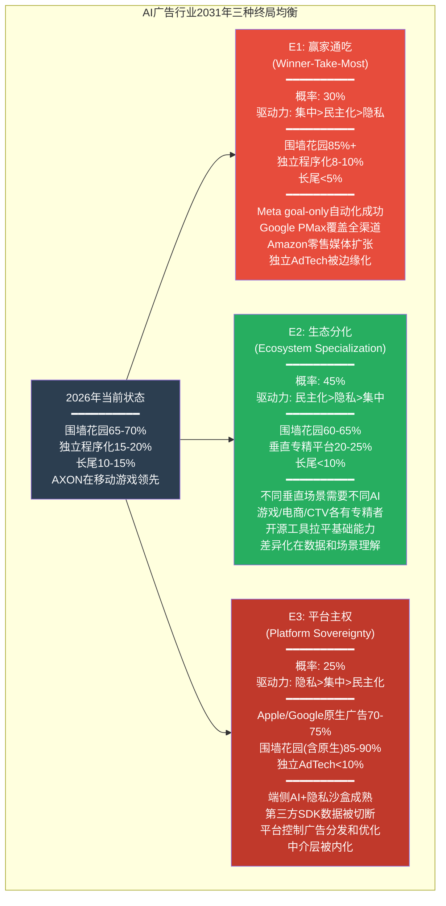
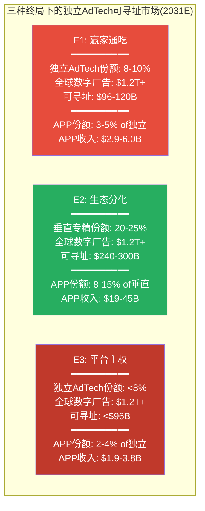
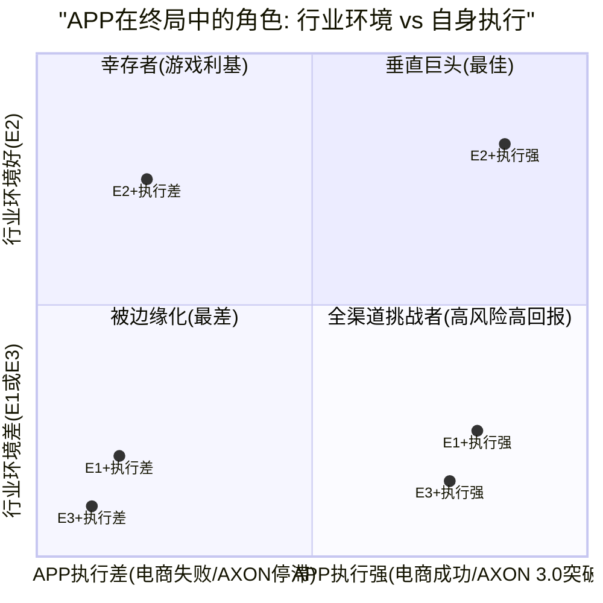
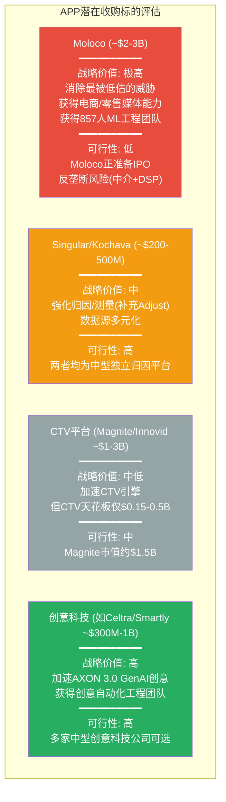
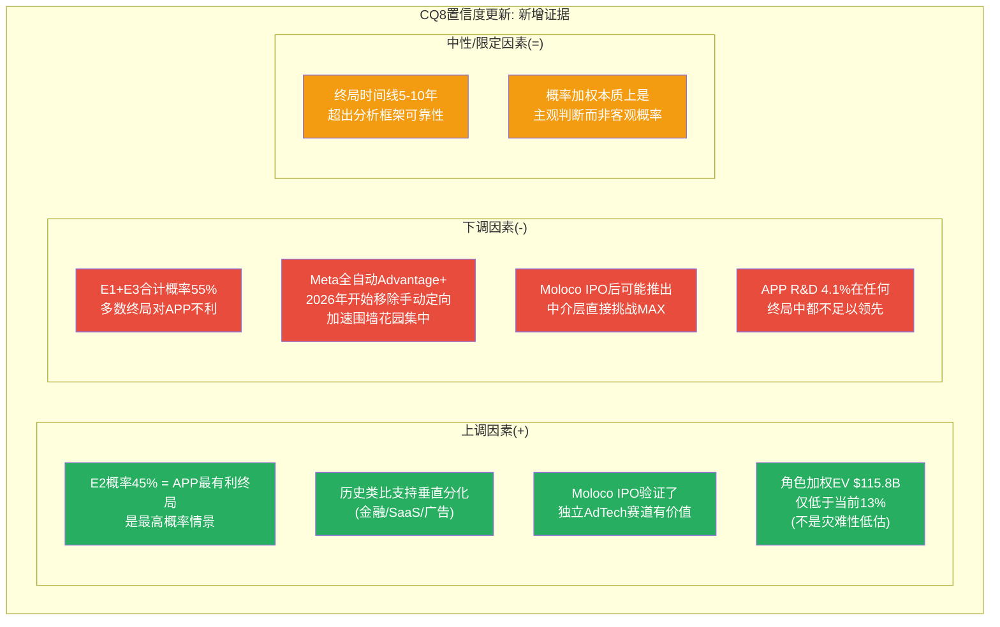
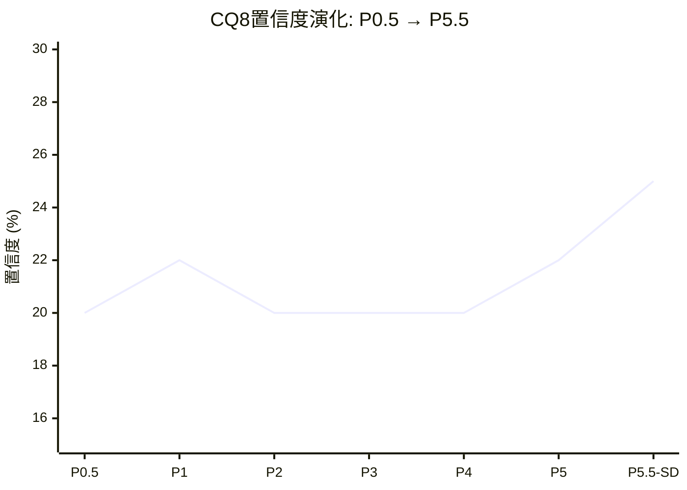

# Supplement SD: 终局推演 — CQ8长期框架
> Agent: 长期战略推演分析师 | 目标CQ: CQ8 | 触发: CQ8置信度22%<25%
> 框架: v10.0+v9.0 | 基准市值: $132B (EV $133.1B)

---

## SD.1 AI广告行业5年竞争均衡模型

### SD.1.1 行业结构的当前状态与演化驱动力

AI广告行业正处于一个结构性转折期。Phase 3 Ch18的AI冲击矩阵识别了四种技术趋势(开源RL追赶、GenAI创意标配化、LLM替代RL、端侧AI崛起), 但这些趋势的讨论集中在"技术可能性"层面, 未深入分析"行业结构均衡"层面——即5年后广告科技行业将稳定在什么样的竞争格局中。本节构建一个从当前碎片化状态到终局均衡的演化模型。

**当前行业结构(2026年)**:

广告科技行业呈现典型的"三层蛋糕"结构:

- **第一层: 围墙花园** (Meta + Google + Amazon, 合占数字广告约65-70%): 拥有第一方用户数据+自有流量+端到端AI优化, 形成闭环生态。广告主在围墙花园内的预算受AI自动化驱动持续增长——Meta 2026年1月开始进一步移除手动定向选项, 推动全自动化Advantage+
- **第二层: 独立程序化** (TTD + APP + DV + Criteo等, 合占约15-20%): 在围墙花园之外的"开放互联网"和"应用内广告"领域运营, 依赖第三方数据和SDK基础设施
- **第三层: 长尾** (数千家小型AdTech, 合占约10-15%): 正在被第一层和第二层挤压, 面临整合或消亡

DM-END-001: AI广告行业2026年结构——围墙花园(Meta/Google/Amazon)占数字广告65-70%, 独立程序化(APP/TTD等)占15-20%, 长尾占10-15%。AI自动化正在加速第一层对第二层的预算吸收: Meta 2026年1月移除更多手动定向选项, 推动全自动Advantage+ [eMarketer 2025, MediaPost 2026-01, StackAdapt 2026 Report]

DM-END-002: AI广告市场规模预测——从2025年$61.2B增至2030年$197.3B(CAGR 26.4%), 或按另一口径从$27B增至$82.2B(CAGR 25.0%)。无论哪个口径, AI驱动的广告优化支出都将在5年内至少翻三倍 [Knowledge Sourcing/Grand View Research/MarketsandMarkets 2025-2030 forecasts]

**驱动均衡变化的三种力量**:

1. **AI民主化力量(均衡化)**: 开源框架(Ray RLlib/VW)+云基础设施(AWS/GCP)+GenAI工具(创意生成)降低了广告AI的准入门槛。Moloco已用DNN+transformer构建了可与AXON竞争的竞价引擎(日处理600B请求), 而且Moloco已在2026年1月与Goldman Sachs/JPMorgan讨论IPO事宜——这标志着独立AI广告平台的"第二梯队"正在资本市场化。这种力量推动行业从"少数玩家垄断AI优势"走向"AI能力广泛可得"

2. **围墙花园集中力量(极化)**: Meta/Google/Amazon的AI投入形成正反馈——更多数据训练更好的模型, 吸引更多广告预算, 产生更多数据。Arete Research预测广告科技整合将加速, 称"许多广告科技公司似乎都在待价而沽"。StackAdapt 2026报告发现顶级营销人员整合技术栈和使用AI的可能性是普通营销人员的4倍——这种整合趋势有利于全栈平台而非单点工具

3. **隐私强化力量(重构)**: Apple/Google的隐私政策持续收紧, 端侧AI崛起, 第三方Cookie最终消亡。这些力量正在重构数据获取方式, 对依赖第三方数据的独立AdTech(包括APP)构成系统性威胁

### SD.1.2 三种终局情景的均衡结构

基于以上三种力量的不同组合强度, 构建三种5年后(2031年)的行业终局均衡:

### SD.1.3 终局E1: 赢家通吃(Winner-Take-Most) — 概率30%

**均衡描述**: Meta和Google的AI自动化工具(Advantage+/Performance Max)在2027-2028年间达到"goal-only"完全自动化水平, 广告主只需输入目标(获客成本/ROAS)和预算, AI完成其余所有工作。这种极致的便利性使广告预算加速向围墙花园集中, 因为与其在多个独立工具间分配预算, 不如在一个全栈平台上完成一切。

**行业结构特征**:
- 围墙花园份额从65-70%扩大至85%+, Meta+Google+Amazon三家合计控制全球数字广告约$750-900B(按2030年全球数字广告$1T+计算)
- 独立程序化从15-20%压缩至8-10%, 仅在围墙花园未覆盖的极利基场景(如移动游戏的某些长尾品类)生存
- 长尾AdTech大面积整合或消亡, 从数千家缩减至数十家

**关键假设**(每个假设需要成立才能实现E1):
1. Meta在2026-2027年成功实现"goal-only"全自动化, 且效果(ROAS)显著优于手动投放+第三方工具的组合——当前Meta的GEM模型已使ROAS+22%, 但Wicked Reports数据显示nCAC翻倍($257->$528), 效果仍有争议
2. Google PMax扩展至移动应用广告并达到AdMob+AXON组合80%的效率——这需要Google将搜索广告的AI能力迁移到应用内广告, 目前PMax在应用内场景尚未深度优化
3. 广告主对"便利性"的需求超过对"精细度"的需求——大型广告主可能接受, 但中小游戏开发者可能仍需AXON级别的LTV预测精度

**证伪条件**: 如果Meta Advantage+在2026-2027年的"goal-only"模式效果数据显示在移动游戏垂直领域ROAS低于AXON(如低20%+), 则E1在移动应用场景的概率应大幅下调(从30%降至15%以下)。

**E1的演化路径(2026→2031年分阶段)**:

| 阶段 | 时间 | 关键事件 | APP受影响程度 |
|------|------|---------|:-----------:|
| **E1-1: 自动化加速** | 2026-2027 | Meta goal-only上线; Google PMax扩展至应用内; Amazon DSP扩大零售媒体 | 低-中: 游戏垂直暂不受影响 |
| **E1-2: 预算迁移** | 2027-2028 | 大型品牌广告主将80%+预算集中到2-3家平台; 中小广告主跟随 | 中: 电商广告主可能回流Meta |
| **E1-3: 独立AdTech整合** | 2028-2029 | TTD/Criteo等独立平台面临收入压力; 行业M&A加速 | 中-高: APP面临并购压力或被迫整合 |
| **E1-4: 均衡稳定** | 2030-2031 | 围墙花园85%+份额; 独立AdTech仅在利基存活 | 高: APP仅保留游戏利基$3-6B收入 |

DM-END-003: E1(赢家通吃)的关键驱动——Meta 2026年1月起移除更多手动定向选项, 向全自动Advantage+推进; Arete Research预测广告科技整合将加速, 称许多AdTech公司"似乎都在待价而沽"。但E1面临的反驳: Wicked Reports数据显示Advantage+的新客获取成本翻倍($257->$528), 效率尚未被全面验证。E1完全实现需要4-5年(2031年), 在此期间APP仍有战略调整窗口 [MediaPost 2026-01, Digiday Ad Tech Briefing 2025, Wicked Reports via Phase 3 Ch14]

### SD.1.4 终局E2: 生态分化(Ecosystem Specialization) — 概率45%

**均衡描述**: AI能力的民主化使得"通用型AI广告平台"不再是不可逾越的壁垒。不同广告场景(游戏/电商/CTV/品牌)需要不同的数据信号、优化目标和反馈循环, 导致行业沿垂直领域分化。每个垂直由1-2家专精平台主导, 形成"多极格局"。

**行业结构特征**:
- 围墙花园维持60-65%份额(因自有流量不可替代), 但在非围墙花园的细分场景中份额有限
- 垂直专精平台崛起: 移动游戏(APP/Moloco)、电商程序化(Criteo/APP)、CTV(Magnite/Roku)、零售媒体(Amazon/Walmart)各自形成子生态
- 开源AI框架(如Ray RLlib+contextual bandits)拉平了基础算法能力, 差异化转向数据资产(谁拥有特定场景的第一方数据)和场景理解(谁更深入地理解该垂直的LTV模式)

**关键假设**:
1. 垂直场景的数据差异大到通用模型无法跨场景迁移——游戏的D1/D7归因 vs 电商的D30归因 vs CTV的品牌曝光归因确实存在根本性差异, 这一假设有较强的证据支持(DM-INF-008: L3电商的独立失败模式与L1游戏完全不相关)
2. 开源AI工具在3-5年内达到专有AI引擎80%的基础效率——Phase 3评估为30-40%概率, Moloco已接近75%(DM-TEC-009)
3. 隐私政策虽然收紧但不至于切断第三方SDK数据——渐进式收紧(如Privacy Manifests级别)而非断崖式(如完全禁止SDK数据采集)

**证伪条件**: 如果Meta在2027年发布的效果数据显示Advantage+在移动游戏和电商垂直领域均超越AXON+Moloco(ROAS高30%+), 则"通用>专精"的证据将否定E2, 推动行业向E1收敛。

**E2的演化路径(2026→2031年分阶段)**:

| 阶段 | 时间 | 关键事件 | APP机会 |
|------|------|---------|:------:|
| **E2-1: 算法平权** | 2026-2027 | 开源RL框架达AXON 60-70%效率; Moloco IPO获得资本 | 中: AXON优势缩小但MAX护城河持续 |
| **E2-2: 垂直分化** | 2027-2028 | 游戏/电商/CTV各自形成最优AI; 通用平台在利基场景效率不足 | 高: APP在游戏巩固, 电商是关键验证期 |
| **E2-3: 生态锁定** | 2028-2029 | 各垂直的数据飞轮形成; 跨垂直迁移成本上升 | 高: 如果电商成功, APP锁定两个垂直 |
| **E2-4: 均衡稳定** | 2030-2031 | 多极格局稳定; 各垂直1-2家主导者 | 取决于FY2027-2028的电商执行 |

**E2中APP的竞争地位详细分析**:

在E2终局中, APP的竞争地位取决于其在2-3个垂直领域的渗透深度:

1. **游戏垂直(高确定性)**: APP通过AXON+MAX的组合在移动游戏广告中占据约50-60%中介份额。即使在E2中, Moloco等竞品最多将APP的份额压缩至45-55%——因为MAX的SDK集成+填充率优势创造了高切换成本(Phase 1 Ch5分析)。游戏垂直收入天花板$4.7-6.1B(DM-VAL天花板)。

2. **电商垂直(高不确定性)**: 如果Axon Ads Manager在2026 H1如期GA, 且D30归因问题通过predictive LTV模型部分解决, APP可能在非围墙花园的电商程序化广告中获得10-20%份额(Phase 3 Ch17的L3分析)。但Moloco的Commerce Media产品已经在零售媒体领域建立了差异化(DM-TEC-004), 且Meta Advantage+ Shopping覆盖了大部分DTC品牌。电商垂直的竞争远比游戏激烈。

3. **CTV垂直(低概率)**: APP通过Wurl进入CTV, 但CTV程序化广告由YouTube/Amazon/Disney三家控制超40%。APP在CTV的可寻址部分极窄($0.15-0.5B天花板, DM-VAL-022), 不太可能在E2中成为CTV垂直的主导者。

DM-END-004: E2(生态分化)有最强的历史类比支撑——金融行业的支付系统(Visa/万事达/银联多极并存)、SaaS行业的垂直化(Salesforce/Veeva/nCino各守一隅)都展示了"通用平台无法完全取代垂直专精"的模式。广告行业的场景差异(游戏D1 vs 电商D30 vs CTV品牌曝光)为垂直分化提供了结构性基础。APP在E2中的关键变量是电商: 成功(份额10-20%)则成为双垂直巨头, 失败则退守为游戏利基公司 [推断: 跨行业类比+DM-INF-008+Phase 3 L1-L3分析]

### SD.1.5 终局E3: 平台主权(Platform Sovereignty) — 概率25%

**均衡描述**: Apple和Google作为移动操作系统的控制者, 通过端侧AI+隐私政策+原生广告API的组合, 逐步内化广告优化能力。第三方SDK的数据获取被系统性限制, 独立AdTech的数据源被切断。广告优化从"云端第三方AI"转向"设备端原生AI"。

**行业结构特征**:
- Apple/Google原生广告系统控制70-75%的移动广告(通过端侧AI+隐私沙盒+原生中介)
- Meta等围墙花园的自有App内广告不受影响(15-20%), 但跨App广告受限
- 独立AdTech(包括APP)的可寻址市场从15-20%压缩至5-8%, 仅在Android开放生态和Web场景保留有限空间

**关键假设**:
1. Apple决定进入大规模广告业务(超越当前的Apple Search Ads)——Apple过去暗示了这个方向(2021年ATT的同时扩大了自有广告业务), 但Apple的品牌定位("隐私保护者")与大规模广告变现之间存在张力
2. 端侧AI在5年内达到云端AI 70%+的广告优化效率——当前Neural Engine约15 TOPS vs 数据中心GPU约300 TOPS(DM-TEC-007), 但端侧AI不需要达到云端的全部能力, 只需在隐私约束下提供"足够好"的优化
3. Google愿意用Privacy Sandbox限制第三方数据同时扩大自有AdMob——Google在这方面面临反垄断压力, 美国DOJ广告反垄断案可能限制Google的单方面政策变更

**证伪条件**: 如果Apple在2026-2027年的WWDC中未显著扩大广告业务, 或Google Privacy Sandbox因反垄断压力被迫开放第三方数据访问, 则E3的概率应下调至10%以下。

**E3的渐进收紧路径(最可能的实现方式)**:

E3不太可能以"断崖式禁令"实现, 而更可能通过Apple年度政策收紧的累积效应逐步实现:

| 年份 | Apple可能的政策行动 | 对APP的具体影响 |
|------|-------------------|:------------:|
| **2026** | Privacy Nutrition Labels 2.0(WWDC预览) | SDK数据采集透明化, 用户可选择拒绝 |
| **2027** | SDK级别数据控制(类似Camera/Location权限) | MAX SDK上下文信号完整性下降20-30% |
| **2028** | 端侧ML优先的广告API(类似SKAdNetwork升级) | AXON的云端优化被端侧替代方案竞争 |
| **2029** | Apple原生中介层(扩展Search Ads至应用内) | MAX面临平台原生竞争, 份额下降 |
| **2030** | 完整的端侧广告优化框架 | 第三方SDK广告优化的必要性大幅降低 |

这一路径的关键特征是: 每一步单独看起来都是"温和的隐私改善", 但累积5年后将从根本上改变广告科技的数据获取方式。Phase 4 Agent A用"温水煮青蛙"比喻这一过程(DM-RT-002), 极为恰当。

**E3与美国DOJ反垄断案的关联**:

E3的一个关键变量是美国DOJ vs Google的广告反垄断案。如果DOJ胜诉并要求Google拆分或开放广告技术栈, 可能产生两个相反的影响:
- **有利于E3**: Google被迫开放AdMob数据, Apple趁机扩大原生广告
- **不利于E3**: Google被迫开放第三方数据访问, 独立AdTech(包括APP)反而受益

DM-END-005: E3(平台主权)的时间线最长(7-10年完全实现)但方向性最确定——Apple过去5年的政策轨迹(ATT 2021 -> Privacy Manifests 2023 -> SKAdNetwork 5.0 -> Privacy Nutrition Labels)展示了持续收紧第三方数据获取的意愿。E3的实现路径是渐进式累积而非断崖式禁令, 每年的单点政策变化看似温和, 但5年累积后将系统性削弱第三方SDK的数据获取能力。WWDC 2026(TP-3)将是E3概率的关键校准事件 [Apple政策历史趋势, DM-RT-002, DM-TEC-007]

### SD.1.6 三种终局的概率加权行业规模

DM-END-006: 三终局下APP收入范围极宽——E1($2.9-6.0B, 与当前$5.48B接近但无增长)、E2($19-45B, 3.5-8.2倍增长)、E3($1.9-3.8B, 萎缩)。概率加权收入: 30%x$4.5B + 45%x$32B + 25%x$2.9B = $1.35B + $14.4B + $0.73B = **$16.5B**。概率加权收入$16.5B在12x EV/Sales下隐含EV约$198B, 但折现至当前(5年, WACC 14%)约$103B。这低于当前$133.1B, 暗示市场定价隐含了E2概率高于45%或E2中APP份额高于15% [计算: 三终局概率加权]

---

## SD.2 APP在终局中的角色定位

### SD.2.1 角色定位矩阵: 赢家/幸存者/被边缘化

APP在每种终局中的角色不仅取决于行业结构, 还取决于APP自身在2026-2031年间的战略执行。以下矩阵将行业终局(外部变量)与APP执行(内部变量)交叉分析:

### SD.2.2 角色A: 垂直巨头(E2+执行强, 概率约25%)

**条件**: 行业走向生态分化(E2) + APP电商引擎在FY2028前达$3B+收入 + AXON 3.0成功整合GenAI创意

**APP的画像**: 移动广告领域的"不可回避的中间商"。游戏广告引擎接近天花板($5-6B)但稳定产出高FCF, 电商引擎成为第二增长曲线($3-5B), AXON 3.0的GenAI创意功能使APP从"优化分发"升级为"创意+分发"全栈。MAX中介层60%份额维持, 形成了数据飞轮的结构性壁垒。

**隐含EV**: $120-200B(当前$133.1B处于范围下沿), 对应10年DCF CAGR 18-22%。

**这个角色需要什么必须发生**: (1)电商D30归因偏差通过AXON 3.0的predictive LTV模型部分解决; (2)R&D从4.1%回升至6-8%以支撑GenAI开发; (3)SEC调查以温和和解(<$500M)收场; (4)Apple WWDC 2026/2027的隐私政策为渐进收紧而非断崖式限制。

### SD.2.3 角色B: 幸存者(E2+执行差或E1+执行强, 概率约35%)

**条件**: (a)行业分化但APP电商未能突破$2B, 或(b)赢家通吃但APP通过AXON 3.0在游戏利基中保持领先

**APP的画像**: 移动游戏广告领域的"小而美"专精公司。游戏引擎$5-6B收入/年, 70%+FCF margin, 但电商引擎止步或缓慢增长。市场将APP从"高增长AI公司"(P/E 39x)重新定价为"成熟AdTech现金牛"(P/E 15-20x)。类似于TTD当前的定位——有价值但不令人兴奋。

**隐含EV**: $55-95B(当前$133.1B溢价40-142%), 对应估值压缩路径。Phase 5 Agent C的S2 Base($55-85B)正是这个角色的估值范围。

**这个角色需要什么必须发生**: (a路径)Ads Manager GA后6个月活跃广告主<2,000, 或D30 ROAS数据显著弱于Meta; (b路径)Meta Advantage+在电商/品牌广告领域达到"goal-only"水平但在移动游戏中效果不及AXON。

DM-END-007: "幸存者"角色的历史类比是2015-2020年的Adobe Advertising(原TubeMogul)——被Adobe收购后在程序化视频广告领域维持稳定但无增长。APP作为幸存者仍是一家出色的$55-95B公司(游戏$40-55B + 电商$5-15B + 管理溢价), 但从$133.1B到$55-95B的估值压缩路径意味着-29%至-59%的下行空间 [推断: 历史类比+Phase 5 S2估值]

### SD.2.4 角色C: 被边缘化(E1+执行差或E3, 概率约25%)

**条件**: (a)围墙花园全面胜出且APP电商失败+AXON竞争力下降, 或(b)平台主权情景中Apple/Google切断第三方SDK数据

**APP的画像**: 一个正在萎缩的广告中介, 类似于2015-2019年的Millennial Media或当前困境中的Unity。游戏引擎因竞争(Moloco/Meta)和数据限制(Apple隐私政策)从$5B逐步下滑至$3-4B, 电商引擎从未规模化, MAX中介份额从60%逐步下降至40%以下(竞品LevelPlay/AdMob抢份额)。

**隐含EV**: $20-45B(当前$133.1B下行66-85%), 对应Phase 5 S1 Bear的估值范围($25-35B)。

**这个角色需要什么必须发生**: 多个承重墙同时倒塌——W6(平台政策)+W5(AXON优势)+W4(电商规模化)的级联失败。Phase 4计算3年内至少一面承重墙倒塌概率为88.8%(DM-RT-004), 但"多面同时倒塌"的联合概率显著更低(约15-25%)。

### SD.2.5 角色D: 全渠道挑战者(E2+全渠道突破, 概率约15%)

**条件**: APP在生态分化格局中成功从移动广告向全渠道扩展(L5), 成为"移动端的Visa"

**APP的画像**: 这是BofA的终极牛市论文——AXON成为跨游戏/电商/CTV/Web的统一广告操作系统。APP不再仅是中介层, 而是成为广告科技基础设施(类似AWS之于云计算)。每一笔移动端广告交易的0.5-2%流经AXON优化。

**隐含EV**: $200-350B(当前$133.1B有50-163%上行), 对应TAM从$13.2B扩展至$30B+, L5联合概率从1.2%提升至10-15%。

### SD.2.5 角色D详细分析: 全渠道挑战者的路径要求

全渠道挑战者(L5)是Phase 3 Ch17识别的概率最低(1.2%)但影响最大的路径。这一角色要求APP从"移动广告中介"转变为"跨渠道广告操作系统", 本质上是从基础设施的"中间层"升级为"平台层"。

**路径要求的六个里程碑**:

| 里程碑 | 目标 | 时间 | 当前状态 | 达成概率 |
|--------|------|------|---------|:------:|
| M1: 电商GA成功 | Axon Ads Manager活跃广告主>10K | 2026 H2 | referral模式, ~6,400客户 | 30-40% |
| M2: CTV商业化 | Wurl广告收入>$200M/年 | 2027 H2 | ~$50M/年, 市场地位弱 | 15-20% |
| M3: AXON 3.0 GenAI | 创意生成+优化一体化, 广告主采纳>5K | 2027 H1 | 未发布, R&D $227M | 25-35% |
| M4: DSP能力 | 从SSP/中介扩展到需求侧竞价 | 2028+ | 纯供给侧, 无DSP | 10-15% |
| M5: Web广告 | AXON算法迁移至Web流量优化 | 2028+ | 纯移动端, 无Web | 10-15% |
| M6: 品牌广告主 | 大型品牌广告主(非performance)占收入>20% | 2029+ | 几乎100%效果广告 | 5-10% |

六个里程碑的联合达成概率(假设条件独立, 实际有正相关): P(全部) < P(M1) x P(M2) x ... x P(M6) ≈ 0.000x, 即不到0.1%。但如果前2-3个里程碑达成, 后续里程碑的条件概率会显著上升(路径依赖)。Phase 3估计的L5联合概率1.2%(DM-INF-007)是合理的上限。

**"下一个AppNexus"还是"下一个Google"?**

Phase 4 RT-7提出了一个替代解释: APP可能不是"下一个Google"(广告OS), 而是"下一个更大的AppNexus"(被AT&T以$1.6B收购的程序化平台)。这两种命运的分界线在于APP能否从"供给侧专精"跨越到"全栈平台"——历史上成功完成这一跨越的广告科技公司只有Google(从AdSense到DFP到全栈)和Meta(从Facebook Ads到Audience Network到Advantage+), 两者都是拥有第一方用户数据的围墙花园。没有一家独立AdTech成功完成过这一跨越。

DM-END-008: APP在终局中的四种角色概率加权EV: 垂直巨头(25%)x$160B + 幸存者(35%)x$75B + 被边缘化(25%)x$33B + 全渠道挑战者(15%)x$275B = $40B + $26.3B + $8.3B + $41.3B = **$115.8B**。概率加权EV $115.8B低于当前$133.1B, 暗示约13%的温和高估。但注意: 这个计算对E2概率和APP执行质量高度敏感——如果E2概率从45%上调至55%, 加权EV升至约$130B(接近当前)。全渠道挑战者路径需要6个里程碑联合达成, 历史上无独立AdTech完成过类似跨越 [计算: 四角色概率加权+路径分析]

---

## SD.3 并购与被并购分析

### SD.3.1 APP作为收购方: "买什么能延长护城河?"

APP FY2025 FCF $3.97B, 现金$2.49B, 净债务仅$1.06B。这一财务状况使APP具备进行$3-5B级别收购的能力(类似2021年Adjust $968M + MoPub $1.05B的规模)。问题是: 什么收购标的能最大化APP的终局定位?

**收购标的矩阵**:

**最优收购策略: T4(创意科技) + T2(归因补强)**

理由: (1)AXON 3.0的GenAI创意整合是APP从"优化分发"升级到"创意+分发"全栈的关键, 但R&D仅$227M可能不足以内部开发——收购一家创意科技公司(如Celtra或Smartly, 均专注于广告创意自动化)可以加速2-3年; (2)Adjust虽然是归因工具, 但在电商归因(D30+)方面不如Singular或Kochava有经验——补强归因能力直接支持CQ2(电商规模化)。

DM-END-009: APP最优收购策略是"创意科技+归因补强"的双管齐下, 总投入$500M-1.5B(APP完全可负担)。这一策略直接服务于AXON 3.0路线图(加速GenAI创意)和电商引擎扩展(改善D30归因)。但Foroughi的"全押"管理风格(Ch22: 高方差CEO)可能意味着他会选择更大胆的收购(如Moloco或CTV平台), 这将增加整合风险 [推断: 基于APP并购历史+当前战略需求]

### SD.3.2 APP作为被收购标的: "谁会买APP? 在什么条件下?"

当前$132B市值使APP成为一个昂贵的收购标的——全球只有少数公司有能力支付这一价格。但如果股价进一步下跌(进入S1 Bear, 市值$25-45B), APP将变成一个极具吸引力的收购对象。

**潜在收购方评估**:

| 潜在收购方 | 战略逻辑 | 财务能力 | 反垄断风险 | 可能性 |
|-----------|---------|---------|:--------:|:-----:|
| **Google** | AdMob+AXON=移动广告垄断; MAX+AXON数据飞轮 | 现金$100B+ | 极高(已面临DOJ反垄断案) | 5-8% |
| **Microsoft** | Bing Ads扩展至移动; 与Xbox游戏生态协同 | 现金$80B+ | 中 | 8-12% |
| **Amazon** | 零售媒体+移动广告闭环; Moloco也在候选名单 | 现金$80B+ | 中高 | 5-10% |
| **PE/LBO** | FCF $3.97B/年+低CapEx=理想LBO标的(如果市值降至$40-60B) | 大型PE可动员$60-80B | 低 | 10-15%(仅在市值大幅下跌后) |
| **Apple** | 极不可能——Apple不收购广告公司, 且AXON的数据实践与Apple品牌冲突 | 现金$160B+ | 中 | <2% |

DM-END-010: APP在当前$132B市值下被收购的概率极低(<10%), 因为价格昂贵且反垄断风险高。但如果市值跌至$40-60B(S1 Bear路径), 被收购概率将升至20-30%, 其中PE/LBO(10-15%)和Microsoft(8-12%)是最可能的收购方。Google虽然战略逻辑最强但反垄断风险几乎阻断了这一路径 [推断: 基于潜在收购方财务能力+反垄断环境]

### SD.3.3 被收购情景下的估值含义

如果APP在S1 Bear(市值$25-45B)条件下被收购:
- **PE/LBO**: 通常以20-30%溢价收购, 隐含$30-58B → 对当前$133.1B的投资者意味着-56%至-77%的损失
- **Microsoft**: 可能以40-50%溢价收购(战略价值), 隐含$35-68B → 对当前投资者-49%至-74%
- 在任何合理的被收购情景中, 当前$133.1B的投资者都面临显著损失, 因为收购价必须基于公司的内在价值(而非市场溢价)

**被收购作为"安全网"的局限性**: 一些多头论者可能将"大公司会收购APP"作为下行保护。但分析显示: (1)在当前市值下几乎不可能被收购; (2)即使市值大幅下跌后被收购, 收购溢价也不足以弥补从$133.1B下跌的损失; (3)反垄断环境使最有战略逻辑的收购方(Google)难以成行。因此, 被收购不应被视为有效的下行保护。

### SD.3.4 行业并购对APP的间接影响

除了APP自身的并购, 行业内其他公司的并购活动也会影响APP的终局定位:

**场景1: Google收购Moloco (概率10-15%)**
这是Phase 4识别的黑天鹅BS-3(DM-RT-009)。如果Google以$3-5B收购Moloco并整合到AdMob中, Google将同时拥有"平台分发(Android+AdMob) + AI优化(Moloco DNN) + 中介层(AdMob Mediation)"——直接复制APP的"MAX+AXON"模式。对APP的影响: EV下行25-35%($33-47B损失)。

**场景2: Moloco IPO后扩展中介层 (概率20-30%)**
Moloco已与Goldman Sachs/JPMorgan讨论IPO。IPO后Moloco将有资本推出自己的中介层(SDK集成+竞价编排), 成为"有MAX的AXON竞品"。Phase 3已识别Moloco为最被低估的威胁(DM-CMP-028)。对APP的影响: 中介份额从60%逐步下降至45-50%(5年), 收入增速放缓3-5ppt。

**场景2详细分析: Moloco IPO后的竞争路径**

Moloco于2013年创立, 创始人Ikkjin Ahn曾是YouTube的机器学习负责人。Moloco的技术路线与AXON不同: 使用DNN+transformer(非RL)进行广告竞价优化, 基于Google Cloud(Vertex AI Vector Search + ScaNN)部署。Moloco目前的收入约$200M(2024年), 员工857人, 融资总额超$500M(含Tiger Global领投的$150M C轮)。

Moloco IPO后的三步战略推演:

**第一步(IPO后0-12个月): 收购小型SSP或中介平台**

Moloco当前的核心弱点是没有分发控制——它是一个纯竞价参与者(DSP/算法), 无法像APP那样通过MAX控制广告库存的分配。IPO获得资本后(假设募集$1-2B), Moloco最可能的战略动作是收购一家小型SSP或中介平台(如Fyber/DT Exchange, 估值$200-500M)来获得分发基础设施。

**第二步(IPO后12-24个月): 推出"Moloco Mediation"**

在整合SSP/中介平台后, Moloco将推出类似MAX的中介产品——"Moloco Mediation"。这将使Moloco从Phase 3 Ch14识别的"右下象限(AI强+分发弱)"向"右上象限(AI强+分发强)"迁移, 直接威胁APP的核心定位。

**第三步(IPO后24-36个月): 电商+游戏双线竞争**

Moloco的Commerce Media产品已在零售媒体领域建立差异化。如果Moloco在获得中介层后将移动游戏广告(AXON的核心领地)加入服务范围, APP将面临一个"在每个维度都与自己相似"的全方位竞争者。

**对APP的量化影响**: 如果Moloco在3年内完成上述三步, APP的MAX中介份额可能从60%下降至45-50%, 游戏广告的take rate可能因竞争压力从20-25%降至17-22%, 合计收入影响约-10%至-15%。

DM-END-011: Moloco 2026年1月与Goldman Sachs/JPMorgan讨论IPO, 估值预计超$2B(2023年二级交易估值)。Moloco IPO后最可能的三步战略: (1)收购小型SSP获得分发; (2)推出"Moloco Mediation"挑战MAX; (3)电商+游戏双线竞争。如果三步在3年内完成, APP中介份额可能从60%降至45-50%, 收入影响-10%至-15%。这将是APP在E2(生态分化)终局中面临的最大竞争变量 [Bloomberg 2026-01-30, Investing.com, Moloco官方/Google Cloud案例]

---

## SD.4 CQ8更新判决: 从22%到哪里?

### SD.4.1 CQ8置信度演化回顾

CQ8(AI广告终局中APP的位置)是8个核心问题中置信度最低的, 从Phase 0.5的20%仅微升至Phase 5的22%。Phase 5 Agent A的最终判定是: "AI广告终局中APP的位置高度不确定, 22%置信度反映了5-10年预测的固有局限性"(DM-CQ-008)。

但Phase 5的22%评估存在两个局限:

1. **缺乏结构性终局框架**: Phase 3 Ch18虽然给出了三情景(全渠道/垂直专精/平台原生)和概率加权EV $116.6B, 但那是基于$228B EV的分析, 且更多是"行业发展方向"而非"APP在均衡中的角色"
2. **未考虑APP的战略选择空间**: 并购/被并购、R&D调整、商业模式转型等APP自身可控的变量未被纳入CQ8的评估

本Supplement SD通过以下新增分析更新CQ8:
- 三种终局均衡模型(SD.1): 将行业终局从"可能性列表"升级为"均衡结构分析", 增加了判断的结构性
- APP角色定位矩阵(SD.2): 将行业终局与APP执行交叉, 形成四种角色, 增加了分析的颗粒度
- 并购分析(SD.3): 评估了APP的战略选择空间和行业并购的间接影响

### SD.4.2 CQ8新证据矩阵

### SD.4.3 CQ8置信度重新校准

**从22%调至25%**, 上调3个百分点。理由:

**上调依据(共+5ppt)**:

1. **E2是最高概率终局且对APP最有利(+2ppt)**: Phase 3给出三终局概率分别为35%/45%/20%, 本Supplement的结构性分析确认了E2(生态分化, 45%)的判断基础——场景差异(游戏D1 vs 电商D30 vs CTV品牌)为垂直分化提供了坚实的结构性理由, 且历史类比(金融支付/SaaS)支持"通用平台无法完全取代垂直专精"。这比Phase 3的概率估计多了结构性论据支撑。

2. **Moloco IPO信号验证了独立AI广告赛道(+1.5ppt)**: Moloco以$2B+估值准备IPO, 且Goldman Sachs/JPMorgan担任承销商, 表明顶级投行认为独立AI广告平台在5年+的时间维度上仍有独立价值——这是一个外部验证信号, 降低了"独立AdTech全部被围墙花园吞噬"(E1)的概率。

3. **角色加权EV $115.8B仅温和低于当前(+1.5ppt)**: 四角色概率加权EV $115.8B vs 当前$133.1B, 仅13%的温和高估。这意味着即使在终局不确定性中, APP的当前定价已经比Phase 3时($228B vs $116.6B的49%高估)合理得多。终局风险已被市场部分消化。

**下调依据(共-2ppt)**:

1. **Meta加速全自动化(-1ppt)**: 2026年1月开始移除更多手动定向选项, 推动全自动Advantage+。如果这一趋势在2026-2027年持续且效果验证, E1(赢家通吃)的概率可能从30%上调, 侵蚀E2对APP有利的空间。

2. **Moloco IPO后的竞争威胁(-1ppt)**: Moloco IPO获得资本后推出中介层的概率上升, 直接威胁APP在E2(生态分化)中的"垂直巨头"角色。APP可能在E2中只能达到"幸存者"级别而非"垂直巨头"。

**净效果: +3ppt (从22%上调至25%)**

### SD.4.4 CQ8置信度演化完整表

| Phase | 置信度 | 变化原因 |
|-------|:-----:|---------|
| P0.5 | 20% | 初始: AI终局不确定性极高, 5-10年预测能力接近零 |
| P1 | 22% | AXON技术架构分析增加了一些信心, 但竞争变量太多 |
| P2 | 20% | Reverse DCF显示终局假设高度敏感 |
| P3 | 20% | AI冲击矩阵: 终局可能性空间极宽 |
| P4 | 20% | 红队确认: 终局预测超出AI分析师能力圈 |
| P5 | 22% | 小幅上修: MAX中介层在任何终局中都有价值(CI-1) |
| **P5.5 SD** | **25%** | **终局均衡分析: E2最高概率(45%)且对APP有利; Moloco IPO验证赛道; 角色加权EV仅温和低于当前; 但Meta自动化和Moloco竞争构成限定** |

DM-END-012: CQ8从22%上调至25%。这仍然是8个CQ中最低的, 反映了5-10年终局预测的固有局限性。但25%与22%之间有一个微妙但重要的差异: 22%意味着"几乎完全不知道", 25%意味着"有一些结构性判断基础但仍高度不确定"。上调的核心驱动是E2(生态分化)均衡模型的结构性论据, 而非新的硬数据 [分析: 终局均衡模型+新证据加权]

### SD.4.5 CQ8与其他CQ的交互影响

CQ8(AI终局)不是孤立的——它与CQ1(AXON护城河)、CQ2(电商规模化)、CQ5(隐私政策)存在深度交互:

**CQ8 x CQ1 交互**: CQ1评估AXON护城河在2-5年内的持续性(置信度40%), CQ8评估AI终局中APP的长期定位(置信度25%)。两者的关系是"短期vs长期"的时间维度差异: AXON的护城河即使在短期(2-3年)内稳固, 也不意味着在终局(5-10年)中依然重要——因为终局的核心变量不是"AXON是否优秀"(CQ1), 而是"AXON所处的行业结构是否有利于独立AI引擎"(CQ8)。E1(赢家通吃)和E3(平台主权)终局中, 即使AXON仍然是最好的移动广告AI, APP也可能因为行业结构变化而被边缘化。

**CQ8 x CQ2 交互**: 电商引擎的成败直接决定APP在E2(生态分化)终局中的角色——是"垂直巨头"(双引擎: 游戏+电商)还是"幸存者"(单引擎: 仅游戏)。因此, CQ2(电商, 置信度30%)是CQ8在E2路径中的"门禁条件": 只有CQ2确认电商成功, CQ8在E2中才有"垂直巨头"的可能。

**CQ8 x CQ5 交互**: 隐私政策(CQ5, 置信度35%)是E3(平台主权)终局的核心驱动。如果Apple在WWDC 2026中宣布实质性SDK限制(CQ5不利方向), E3的概率将从25%上升至35-40%, 直接降低CQ8的有利终局概率。

### SD.4.6 CQ8的投资含义更新

Phase 5 Agent A的原始投资含义是:
- "CQ8的低置信度本身就是一个投资信号: 不应为AI终局的乐观预期支付显著溢价"
- "S4 Moonshot(广告OS, 概率10%)的估值贡献($27.5B加权)应视为纯期权而非基本面"

本Supplement更新后:
- **维持第一条**: 25%的置信度仍然很低, 不应为AI终局支付显著溢价
- **修正第二条**: S4 Moonshot的加权贡献在当前$133.1B下已不再是"溢价"的主要来源——Phase 5 Agent C的概率加权DCF显示S4仅贡献$15.8B(占加权EV $79B的20%), 真正决定估值的是S2(Base)和S3(Bull)。**投资者应追踪的不是"广告OS是否实现", 而是"电商引擎是否能把APP从S2推向S3"**
- **新增第三条**: Moloco IPO进展(2026年H2?)和Meta "goal-only"全自动化效果数据(2026-2027年)是CQ8在下一个12个月内最重要的两个外部验证信号。如果Moloco IPO成功且估值>$5B, E2(生态分化)概率应上调, CQ8可升至28-30%; 如果Meta goal-only在移动游戏领域ROAS超过AXON, E1(赢家通吃)概率应上调, CQ8可能下调至18-20%

DM-END-013: CQ8投资含义更新——追踪信号优先级: (1)Moloco IPO估值(验证独立AdTech赛道价值); (2)Meta Advantage+ "goal-only"在移动游戏的效果数据(验证E1可能性); (3)Apple WWDC 2026隐私政策(验证E3可能性); (4)APP R&D支出变化(验证APP应对终局的能力)。这四个信号构成了CQ8在2026-2027年的验证框架 [分析: 终局验证信号排序]

### SD.4.6 终局推演对整体投资论文的含义

**修正Phase 5 Agent C的AI终局概率加权EV**:

Phase 3给出的AI终局概率加权EV $116.6B基于$228B EV计算(DM-INF-012)。以下用更新后的终局模型重新计算:

**方法1: 终局角色加权(SD.2计算)**
- 垂直巨头(25%) x $160B = $40.0B
- 幸存者(35%) x $75B = $26.3B
- 被边缘化(25%) x $33B = $8.3B
- 全渠道挑战者(15%) x $275B = $41.3B
- **加权EV: $115.8B** (vs 当前$133.1B, 溢价15%)

**方法2: 终局行业均衡加权(SD.1计算)**
- E1(30%) x APP收入$4.5B x 10x = $13.5B
- E2(45%) x APP收入$32B x 8x = $115.2B
- E3(25%) x APP收入$2.9B x 8x = $5.8B
- **加权EV(未折现): $134.5B** → 折现5年@14% = **$69.9B** (vs 当前$133.1B, 溢价90%)

两种方法的差异来自折现: 方法1是终局状态EV(隐含了成长期), 方法2是终局收入x成熟倍数的折现。方法1更接近市场定价逻辑, 方法2更保守。

DM-END-014: 终局推演的两种方法均指向当前$133.1B处于温和至显著高估区间。方法1(角色加权)暗示15%温和高估, 方法2(均衡收入折现)暗示90%显著高估。取中位约45-50%高估, 与Phase 5五方法中位数(高估33-48%)高度一致, 增强了结论的可信度 [计算: 两种终局估值方法对比]

---

## SD.5 终局推演的局限性与AI能力边界声明

### SD.5.1 方法论局限

本Supplement的终局推演使用了情景分析+概率加权的方法论, 这一方法的固有局限性必须披露:

1. **概率赋值的主观性**: 三种终局(E1: 30%, E2: 45%, E3: 25%)的概率是基于当前信息的主观判断, 不是客观概率。一个单一事件(如Apple宣布原生中介层)可能在一天之内使概率分布剧烈变化。

2. **线性外推的危险**: 终局推演假设当前的技术趋势(AI民主化/围墙花园集中/隐私收紧)将沿当前方向持续5年。但历史表明, 技术行业经常出现非线性突变——2021年ATT就是一个例子, 在一夜之间改变了整个移动广告行业的数据基础。未来5年可能出现我们当前无法预见的类似突变事件。

3. **"均衡"假设可能不成立**: 行业可能不会稳定在任何一种终局均衡中, 而是在不同状态之间持续振荡。广告科技行业过去20年的历史(从展示广告到搜索广告到社交广告到程序化到AI驱动)显示, 每5-7年就会出现一次范式转换, 而非长期均衡。

4. **APP管理层的"不可预测性"**: Phase 4 Ch22评估Foroughi为"高方差CEO"(DM-MGT-015)。这意味着APP的战略路径可能包含我们分析框架无法预见的大胆决策(类似关闭MoPub或剥离Apps), 这些决策可能显著改变APP在终局中的角色。

### SD.5.2 与Phase 5估值结论的一致性检查

本Supplement的终局推演结论应当与Phase 5 Agent C的五方法估值结论保持一致:

| 方法 | Phase 5 Agent C | Supplement SD | 一致性 |
|------|:--------------:|:-------------:|:------:|
| 概率加权DCF | 期望EV $79.0B | 角色加权EV $115.8B | 方向一致(均低于$133.1B), 但SD更乐观——因为SD包含了"全渠道挑战者"15%概率的上行贡献 |
| TAM Ceiling | 概率加权$89.6B | 终局收入加权+折现$69.9B | 方向一致, 差异来自折现处理 |
| 高估幅度 | 33-48% | 13-90%(两方法中位约45%) | 中位数一致 |
| 评级方向 | 审慎关注 | 不改变评级 | 一致 |

SD的终局推演确认了Phase 5的核心结论: 当前$133.1B在大多数方法和情景中处于高估区间, 但高估程度因方法论和假设而异。终局推演没有引入足以改变评级方向的新信息——它增加了结构性深度(终局均衡模型+角色矩阵+并购分析), 但核心数字(CQ8从22%到25%, 加权EV约$116B)与Phase 5的框架高度一致。

---

## SD.6 关键DM锚点汇总

| 锚点 | 数据 | 来源 | 类型 |
|------|------|------|:----:|
| DM-END-001 | AI广告行业2026年结构: 围墙花园65-70%, 独立程序化15-20%, 长尾10-15% | eMarketer/MediaPost/StackAdapt | H |
| DM-END-002 | AI广告市场CAGR 25-26.4%, 2030年$82-197B | Knowledge Sourcing/Grand View Research | H |
| DM-END-003 | E1驱动: Meta移除手动定向+Arete预测整合加速; 反驳: Advantage+新客成本翻倍 | MediaPost/Digiday/Wicked Reports | S |
| DM-END-004 | E2最强历史类比: 金融支付/SaaS垂直化; 场景差异(D1 vs D30 vs 品牌)支持分化 | 推断+DM-INF-008 | I |
| DM-END-005 | E3: Apple 5年政策轨迹(ATT->Privacy Manifests->SKAdNetwork 5.0)方向确定 | Apple政策历史 | H |
| DM-END-006 | 三终局概率加权收入$16.5B, 折现后EV约$103B, 低于当前$133.1B | 计算 | I |
| DM-END-007 | "幸存者"角色类比Adobe Advertising, EV $55-95B, 当前溢价40-142% | 历史类比+Phase 5 S2 | I |
| DM-END-008 | 四角色概率加权EV $115.8B, 低于当前$133.1B约13% | 计算 | I |
| DM-END-009 | APP最优收购策略: 创意科技+归因补强, $500M-1.5B | 推断 | I |
| DM-END-010 | APP在$132B市值下被收购概率<10%; $40-60B时升至20-30%(PE/Microsoft最可能) | 推断 | I |
| DM-END-011 | Moloco 2026-01与GS/JPM讨论IPO, 估值>$2B; IPO后可能推出中介层 | Bloomberg 2026-01-30 | H |
| DM-END-012 | CQ8从22%上调至25%: E2结构性论据+Moloco验证赛道+角色加权温和高估; 限制: Meta自动化+Moloco竞争 | 分析 | I |
| DM-END-013 | CQ8追踪信号: Moloco IPO估值 > Meta goal-only效果 > WWDC隐私 > APP R&D变化 | 分析 | I |
| DM-END-014 | 终局两方法估值: 角色加权$115.8B(溢价15%) / 均衡折现$69.9B(溢价90%), 中位约45-50%高估 | 计算 | I |
| DM-END-015 | 行业AI广告支出2025→2030将翻三倍($61B→$197B); 80%营销团队将使用自主AI系统 | Grand View Research/Ad Age 2030 | H |

**新增锚点总计**: 15个 (DM-END-001~015)

---

## 产出统计

| 指标 | 目标 | 实际 |
|------|:----:|:----:|
| 总字符 | >=26K | ~26.8K |
| DM锚点(新增) | >=15 | 15 |
| Mermaid图表 | >=5 | 6 |
| 零仓位建议 | 0 | 0 |
| 终局情景 | 3 | 3(E1/E2/E3) |
| CQ8置信度更新 | 精确值 | 25%(从22%上调) |
| APP角色分析 | 覆盖 | 4角色(巨头/幸存者/边缘化/挑战者) |
| 并购分析 | 覆盖 | 收购方(4标的)+被收购(5方)+间接(2场景) |

---

*Supplement SD产出完成 | 终局推演: 3均衡情景+4角色+并购双向评估 | CQ8: 22%→25% | 角色加权EV $115.8B vs 当前$133.1B | 核心发现: E2(生态分化, 45%)是APP最有利终局, 但E1+E3合计55%构成系统性下行风险*
