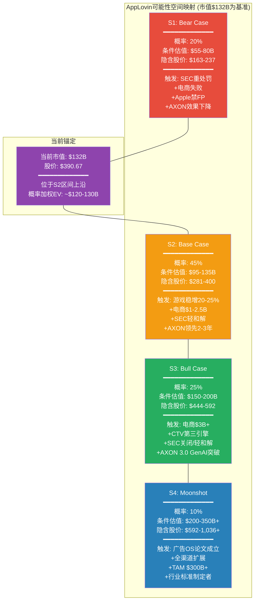
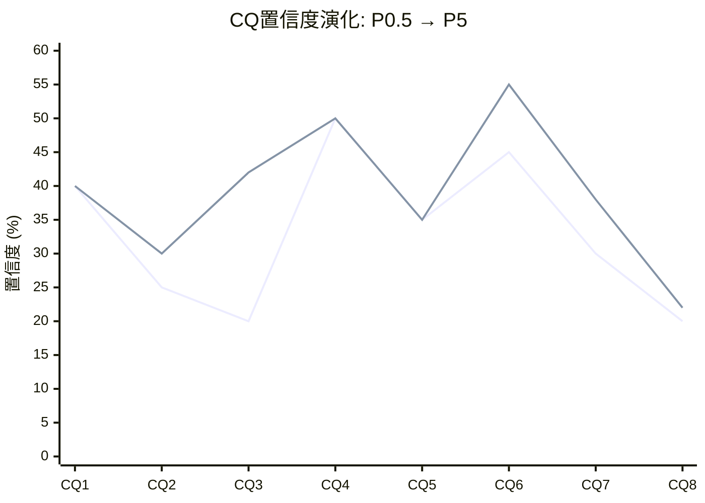
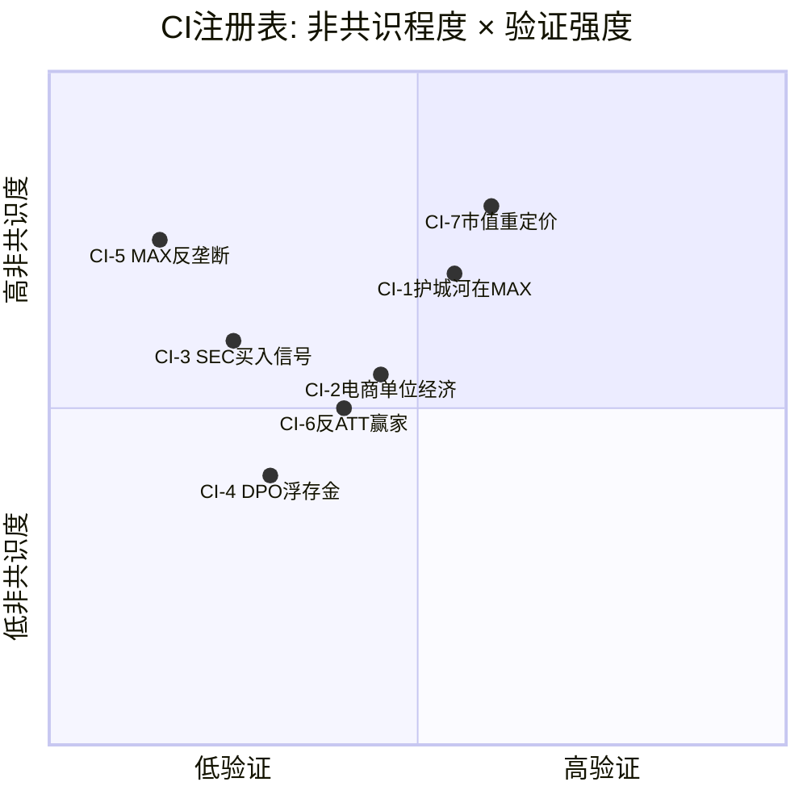
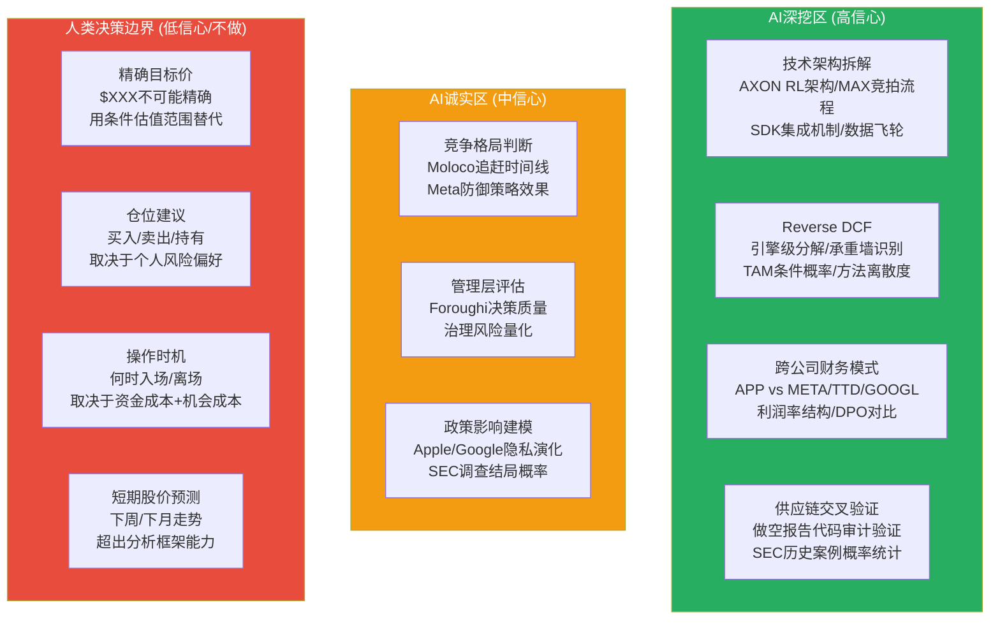

# Agent A — 广告科技商业分析师 | Phase 5 综合模式

> **模式**: 综合闭环 (Ch1执行摘要 + Ch2核心矛盾导读 + Ch25 CQ闭环 + Ch27 CI注册表+AI边界)
> **日期**: 2026-02-16
> **覆盖**: Ch1 (执行摘要) + Ch2 (核心矛盾与发现系统导读) + Ch25 (CQ闭环) + Ch27 (CI注册表+AI能力边界)
> **DM锚点新增**: 18个 (DM-SUM-001~005, DM-CQ-001~008, DM-CI-001~005)
> **Mermaid**: 6个 (发现系统总览 + 三重张力 + CQ置信度演化 + CI验证矩阵 + 风险时间衰减 + AI能力边界)
> **质量直觉**: "Phase 1-3建构了bearish叙事, Phase 4发现市值已自行纠偏42%。Phase 5的任务是: 在$132B的新基准上, 诚实地闭合每一个问题。"

---

# Chapter 1: 执行摘要

## 1.1 AppLovin: 一段话概括

AppLovin是一家AI驱动的广告科技平台公司, 其核心产品AXON引擎通过强化学习算法优化移动广告的投放效率, MAX中介层以约60%的市场份额控制着移动游戏广告的供给侧分发。公司在FY2025实现收入$5.48B(+70% YoY), 净利润$3.33B(净利率60.8%), 自由现金流$3.97B(FCF率72.5%), 呈现出广告科技行业罕见的高利润结构。2025年7月, AppLovin以$400M剥离了Apps游戏业务, 完成从"游戏+广告"双轨模式向纯广告平台的战略转型。

然而, 这家公司正处于多重张力的交汇点。从2025年2月至2026年1月, 四份做空报告(Fuzzy Panda/Muddy Waters/Culper Research/CapitalWatch)和SEC调查将其推入了罕见的信任危机。股价从52周高点$745.61下跌47.7%至$390.67, 市值从$228B缩水至$132B。做空者的核心指控是: AXON的AI优势部分建立在违反平台服务条款的数据采集实践之上, 电商扩展的ROAS指标存在归因窗口膨胀, 而管理层在应对质疑时选择了攻击性反驳而非透明披露。

**本报告的核心矛盾**: AI算法黑箱的价值可持续性 vs 平台依赖+竞争侵蚀+监管悬剑的结构性风险。这一矛盾使得AppLovin无法用传统估值框架定价。我们采用Discovery System(发现系统)B型方法论: 不给出单一目标价, 而是映射可能性空间, 以条件估值范围呈现不同情景下的价值区间。

DM-SUM-001: APP核心画像(Phase 5截至2026-02-16)——市值$132B, 股价$390.67, P/E(TTM) 39.6x, Fwd P/E(FY2027E) 19.0x, EV ~$133B。FY2025: 收入$5.48B(+70%), 净利$3.33B(净利率60.8%), FCF $3.97B(FCF率72.5%), ROIC 105.9%。YTD -45.6%, 52周高$745/低$201。做空攻击4次+SEC调查进行中 [FMP quote; baggers_summary; fmp_data income annual]

---

## 1.2 发现系统导图: 可能性空间映射

**可能性宽度: 7分 -- Discovery System B型(量级不确定性)**

AppLovin的不确定性不在于"这家公司是否有价值"(答案明确: 是), 而在于"价值的量级在什么范围"。五维评分: 商业模式新颖度7 + 收入可预测性5 + TAM不确定性8 + 竞争变动性7 + 监管风险7 = 总分34/50 = 6.8, 取整为7分。

B型(量级)不确定性的含义: 公司的核心业务(游戏广告)可以用传统方法估值, 但增长引擎(电商/CTV)和结构性风险(SEC/Apple隐私/竞争)的组合使得任何单一估值点都具有误导性。我们的分析覆盖了$55B(极端Bear)到$200B+(Moonshot)的可能性空间, 方法离散度预计3-8x, 这是B型公司的正常范围。

---

## 1.3 四情景条件估值

### S1 Bear Case (概率20%): $55-80B (隐含股价$163-237)

**前提条件**: (1) SEC认定APP违反Apple/Google ToS, 发出正式指控, 罚款$150-300M并附带行为限制; (2) Apple在iOS 27-28全面禁止应用内fingerprinting, AXON在iOS端效果下降40-60%; (3) 电商Ads Manager GA延迟或GA后6个月活跃广告主不足2,000, 电商止步$0.5-1B/年; (4) Moloco在3年内追平AXON在移动游戏中的效果差距。

**估值路径**: 纯游戏平台估值 -- FY2028E游戏收入$6-7B, FCF margin 55-60%, FCF $3.3-4.2B, 合理FCF收益率5-6%(对应16.7-20x FCF) = $55-84B。取中位数$55-80B。

**关键验证点**: Q1 2026收入是否达到指引下限$1.745B; WWDC 2026(2026年6月)是否宣布应用内fingerprinting限制; SEC是否在2026 Q3前发出Wells Notice。

### S2 Base Case (概率45%): $95-135B (隐含股价$281-400)

**前提条件**: (1) SEC以$50-200M和解, 附带温和行为限制(独立数据审计), APP修改数据收集实践, AXON效果短期下降5-15%后通过模型迭代恢复; (2) 游戏广告维持20-25% YoY增速, FY2028E游戏收入$7-8B; (3) 电商达到$1-2.5B年化收入但未突破天花板; (4) Apple渐进收紧但不一刀切禁止fingerprinting; (5) AXON在游戏中保持2-3年技术领先, 在电商中仅为"及格选手"。

**估值路径**: FY2028E总收入$10-12B, EBITDA margin 75-80%, EBITDA $7.5-9.6B, 合理EV/EBITDA 10-14x(高增长但风险折价) = $75-134B。加上电商期权$10-20B = $95-135B。

**最可能的单一结局**: $110-120B(当前市值$132B的轻度下行至持平), 这意味着当前股价已接近合理定价, 但仍含有5-15%的风险溢价尚未消化。

### S3 Bull Case (概率25%): $150-200B (隐含股价$444-592)

**前提条件**: (1) SEC调查关闭或以$25-75M轻罚和解, 风险溢价消除; (2) AXON 3.0整合GenAI能力解决D30归因问题, 电商突破$3B+; (3) CTV/Wurl成为有意义的第三引擎($0.5-1B); (4) Apple不实施应用内fingerprinting禁令(或执行力度有限); (5) MAX份额维持55%+, 竞争格局稳定。

**估值路径**: FY2028E总收入$15-18B, EBITDA margin 80-85%, 合理EV/Sales 10-12x = $150-216B。

**关键验证点**: Ads Manager GA后6个月的广告主留存率>75%; 非CPG品类的ROAS是否达到META的80%+; CTV/Wurl收入是否从$40-80M跃升至$200M+。

### S4 Moonshot (概率10%): $200-350B+ (隐含股价$592-1,036+)

**前提条件**: BofA "广告OS"论文成立 -- AXON从移动广告优化引擎进化为全渠道广告操作系统, TAM从$35-45B(移动游戏)扩展至$300B+(全球数字广告的可寻址部分)。APP成为广告科技行业的"Visa/Mastercard"。

**概率加权EV**: 0.20 x $67.5B + 0.45 x $115B + 0.25 x $175B + 0.10 x $275B = $13.5B + $51.75B + $43.75B + $27.5B = **$136.5B**

DM-SUM-002: 概率加权EV约$136.5B, 与当前$132B市值差距+3.4%。市场当前定价几乎精确反映了概率加权预期, 暗示市场在Phase 4水平的信息下已接近效率定价。但概率分布的宽度($55B-$350B+)意味着任何单一催化剂(SEC/WWDC/Q1财报)都可能导致显著重估 [概率加权计算: 4情景 x 概率 x 中位估值]

---

## 1.4 评级与核心判定

**评级: 中性关注**

定性判定: AppLovin是一家拥有真实技术壁垒(AXON+MAX双轮)和卓越近期执行(FY2023-2025利润率跃迁)的公司, 但当前股价($390.67)已接近概率加权公允价值($136.5B / 338M股 = $404)。在SEC调查悬而未决、Apple隐私政策持续收紧、电商引擎尚未完成自助化验证的多重不确定性下, 风险与回报大致平衡。

**为什么不是"深度关注"(bullish)**: (1) 概率加权EV仅略高于当前市值, 安全边际不足; (2) SEC调查的时间成本(12-24个月不确定期)对资金使用效率构成拖累; (3) 电商引擎的单位经济学(D30归因偏差、真实增量性30-50%)尚未完成自证。

**为什么不是"审慎关注"(bearish)**: (1) 市值已从$228B跌至$132B(-42.1%), 大部分Phase 1-3识别的风险已被定价; (2) Fwd P/E 19.0x低于META(27.2x)/TTD(29.3x), 对于30%+增速的公司偏低; (3) FY2025的执行力(净利润CAGR 205%, FCF margin 72.5%)展示了管理层的战术能力。

**评级的实质含义**: "中性关注"意味着投资者不应因为"做空报告+SEC调查=公司有问题"的简单叙事而回避APP, 也不应因为"Fwd P/E 19.0x=便宜"的简单计算而买入。正确的决策框架是: 等待6-18个月内的关键催化剂(SEC/WWDC/Ads Manager GA)明确方向后, 根据概率权重的更新重新评估。在催化剂揭示之前, 持有APP意味着为其他投资者承担不确定性折价, 这一折价的消化速度取决于SEC和Apple, 而非管理层。

DM-SUM-005: 评级"中性关注"的量化支撑——概率加权EV $136.5B vs 当前$132B = +3.4%差距, 远低于安全边际所需的15-20%。CQ加权平均置信度40%(正常范围但不高)。SEC调查不确定期的机会成本约15-25%(18个月大盘回报)。综合: 风险调整后的预期回报接近零, 不支持积极头寸, 但已度过最危险的估值泡沫区 [Ch1.2概率加权; Ch25 CQ加权; Phase 4 DM-INF-006]

---

## 1.5 三个最重要发现

**发现一: 市场已完成自我纠偏, 但纠偏可能过度(CI-7)**

Phase 1-3在$228B市值下构建了"高估40-50%"的bearish论文。但红队审计(Phase 4)发现市值已跌至$132B, 引擎级EV差额从61-68%缩小至32-45%(高增长科技股正常范围), Fwd P/E从32.9x降至19.0x(低于所有可比公司)。核心结论从"明确高估"修正为"温和高估15-30%, 但可能过度定价了下行风险"。投资者应注意: $390是SEC调查+做空攻击+估值压缩三重作用的结果, 如果其中任何一个风险减弱, 股价具备反弹基础。

DM-SUM-003: CI-7(市值重定价)是本报告最重要的非共识发现。Phase 1-3在$228B基准下得出的"严重高估"结论, 在$132B基准下修正为"接近公允价值, 方向仍偏高但幅度大幅缩小"。这不意味着Phase 1-3的分析无效, 而是市场速度快于分析节奏 [Phase 4 Correction Manifest #2; DM-RT-006]

**发现二: 护城河的位置比市场认知的更偏向MAX而非AXON(CI-1)**

市场叙事将AXON(AI引擎)视为AppLovin的核心竞争力。但Phase 1-4的交叉验证显示: AXON的技术领先可能在3-5年内被Moloco和开源RL模型追平(CQ8置信度仅20%), 而MAX中介层的60%份额(源自MoPub关闭后的市场重组)和SDK锁定效应(6-12个月迁移成本)才是更持久的壁垒。CI-1(护城河在MAX不在AXON)在Phase 3竞争分析和Phase 4红队中均获得部分验证。这一发现的投资含义是: 投资者应追踪MAX份额(而非AXON效果指标)作为护城河健康度的领先指标。

**发现三: 电商引擎面临D30归因偏差的结构性天花板(CQ2)**

Phase 3的独立审计发现: AppLovin电商广告的D30归因窗口对家居/服装品类系统性低估ROAS 40-45%, 真实增量性约30-50%(低于管理层暗示的80%+)。电商的现实路径是: 在快消品(CPG)品类中可能达到$2-3B年化收入(D30窗口对高频复购品类影响较小), 但在家居/服装等长复购周期品类中将面临严峻挑战。TAM条件概率模型显示L1+L2+L3联合成功概率仅23.4%, 而当前估值隐含的电商期权定价($42-59B)远超概率加权合理值。这是当前估值中最大的"信仰溢价"来源。

---

## 1.6 八个CQ一句话结论

| CQ | 问题 | 一句话结论 | Phase 5置信度 |
|----|------|-----------|:----------:|
| **CQ1** | AXON护城河能持续多久? | AXON在移动游戏内领先2-3年, 但真正的护城河在MAX中介层60%份额+SDK锁定, 而非AI模型本身 | 40% |
| **CQ2** | 电商能达什么规模? | 受限于D30归因偏差和增量性争议, 电商可达$2-3B(CPG品类)但大概率止步于市场隐含的$3-5B+天花板之下 | 30% |
| **CQ3** | 合规风险真实影响? | MW部分正确概率50-55%(灰色地带实践确实存在), SEC最可能以$50-200M和解+行为限制结束, 概率加权风险折价-8.5% | 42% |
| **CQ4** | 估值隐含假设合理吗? | $132B市值下EV差额缩至32-45%(正常范围), Fwd P/E 19.0x合理偏低, 估值从"明确高估"修正为"温和偏高15-20%" | 50% |
| **CQ5** | 隐私政策系统性影响? | Apple是最大的存亡级威胁(ERM断点1), iOS 27-28收紧概率30-40%, 但Google反向放宽部分对冲了Android端风险 | 35% |
| **CQ6** | DPO是优势还是炸弹? | 会计DPO 360天vs经济DPO 120-180天, 实际浮存金仅$249M(非$747M), 是温和优势而非制度性壁垒, 也非定时炸弹 | 55% |
| **CQ7** | 管理层判断力? | Foroughi是高方差CEO(70%胜率的激进决策者), 双重股权93.4%投票权放大了判断失误的尾部风险 | 38% |
| **CQ8** | AI终局中APP的位置? | 概率加权终局EV $116.6B(下行11%以$132B为基准), 开源RL模型追赶+Meta防御反击使APP的终局位置高度不确定 | 22% |

---

## 1.7 投资者追踪清单

以下信号按时间紧迫性排序, 投资者应在各信号实现/证伪时重新评估投资论文:

**6个月内(2026 H1)**:
1. **Q1 2026收入**: 指引$1.745-1.775B。达标/超标 = W2存活; 低于$1.70B = 增速拐点信号
2. **Axon Ads Manager GA时间**: 如期GA = 电商进入验证期; 延迟 = CQ2下修
3. **WWDC 2026(2026年6月)**: Apple对Privacy Manifest/应用内fingerprinting的政策更新 = CQ5的最关键信号

**12个月内(2026全年)**:
4. **SEC Wells Notice**: 有 = CQ3概率分布向重和解/诉讼倾斜; 2026 Q4仍无 = 关闭概率升至30-40%
5. **电商活跃广告主数量**: GA后6个月>3,000 = CQ2上修; <2,000 = CI-2验证
6. **MAX中介份额变化**: Unity LevelPlay份额连续2Q增长>3% = CI-1的护城河在MAX论点受到挑战

**18-24个月(2027)**:
7. **SEC调查结论**: 和解金额+行为限制程度 = CQ3最终闭合
8. **iOS 27正式发布**: fingerprinting执行力度 = CQ5最终验证
9. **FY2026全年收入**: >$8.0B = W2存活; <$7.5B = 10年CAGR假设受到严重挑战
10. **Moloco融资/上市进展**: 如果Moloco获得$1B+融资或IPO, 竞争格局评估需要更新

---

# Chapter 2: 核心矛盾与发现系统导读

## 2.1 核心矛盾展开

**AI算法黑箱的价值可持续性 vs 平台依赖+竞争侵蚀+监管悬剑的结构性风险**

这一矛盾的本质是: AppLovin创造了真实的、可量化的广告主价值(AXON 2.0使D7 ROAS信号强于竞品), 但这一价值的来源和持续性却笼罩在多重不透明之中。AXON的算法是黑箱 -- 广告主看不到内部逻辑, 只能通过ROAS结果来判断效果。而做空报告和SEC调查暗示, 黑箱中可能包含灰色地带的数据采集实践(PIGs/persistent tokens/fingerprinting), 如果这些实践被禁止, AXON的效果将如何变化, 是本报告8个核心问题中最深层的不确定性来源。

## 2.2 三重张力解构

```mermaid
flowchart TB
    subgraph T1["张力一: 增长叙事 vs 估值现实"]
        T1A["增长叙事<br/>FY2025 +70% YoY<br/>电商$1B ARR<br/>AXON每次升级=加速"]
        T1B["估值现实<br/>Reverse DCF隐含10年CAGR 28.5%<br/>TAM天花板$13.2B vs 隐含$40-50B<br/>L1+L2+L3联合概率23.4%"]
        T1A <-->|"当市场定价增长叙事时<br/>估值现实被忽视"| T1B
    end

    subgraph T2["张力二: 技术领先 vs 平台依赖"]
        T2A["技术领先<br/>AXON 2.0 D7 ROAS领先<br/>MAX 60%中介份额<br/>R&D $291M/人市值密度"]
        T2B["平台依赖<br/>iOS 55%+Android 45%=100%<br/>Apple一项政策=ERM断点<br/>Google放宽可逆转"]
        T2A <-->|"领先建立在平台允许之上<br/>允许随时可被撤回"| T2B
    end

    subgraph T3["张力三: 短期执行力 vs 长期竞争均衡"]
        T3A["短期执行力<br/>FY2023→25 净利CAGR 205%<br/>Apps剥离时机精准<br/>MoPub关闭=战略杰作"]
        T3B["长期竞争均衡<br/>Moloco AI原生, 3-5年追平<br/>Meta Advantage+预算压缩<br/>开源RL模型成本归零"]
        T3A <-->|"今天的执行力不能保证<br/>明天的竞争优势"| T3B
    end

    style T1A fill:#27ae60,color:#fff
    style T1B fill:#e74c3c,color:#fff
    style T2A fill:#27ae60,color:#fff
    style T2B fill:#e74c3c,color:#fff
    style T3A fill:#27ae60,color:#fff
    style T3B fill:#e74c3c,color:#fff
```

### 张力一: 增长叙事 vs 估值现实

AppLovin的增长故事是真实的 -- FY2025收入$5.48B(+70%), 这在大型科技公司中几乎无与伦比。管理层Q1 2026指引$1.745-1.775B暗示增速仍在30%+。电商$1B ARR(管理层口头声明, 未经独立审计)和6,400客户的数据点进一步强化了"第二增长曲线"的叙事。

但估值现实的另一面是: 即使以纠错后的$132B市值计算, Reverse DCF仍然隐含10年FCF CAGR约22-24%(Phase 4纠错后, 从$228B基准的28.5%降低但仍然偏高)。这要求APP在10年间从$5.48B增长至$40-50B收入, 而TAM条件概率模型(Ch17)显示即使L1(游戏)+L2(非游戏)+L3(电商)全部成功, TAM天花板约$13.2B(take rate后可实现收入), 远低于$40-50B的隐含要求。

差距的来源: 要么市场定价了L4(全渠道)和L5(广告OS)的TAM, 概率虽低但天花板极高; 要么市场对近期增速的外推过于线性。Phase 1-4的分析倾向于后者, 但Phase 4红队(RT-7)也指出, 如果CPG电商的D30适配度被低估, TAM天花板可能从$13.2B上修至$18-22B, 部分缩小差距。

### 张力二: 技术领先 vs 平台依赖

AppLovin的ERM(生态风险映射, Ch6)揭示了一个残酷的结构性现实: 公司100%的收入依赖Apple和Google两个编排者(Orchestrators)的生态系统。AXON的技术领先和MAX的份额优势, 都建立在这两个平台"允许"APP以当前方式运营的前提上。

Phase 1 ERM识别了采用链的最关键断点: Apple收紧隐私政策(ERM断点1)。如果Apple在iOS 27-28对应用内fingerprinting实施运行时检测和阻断, APP的SDK将被迫在Privacy Manifest中如实声明数据收集行为 -- 如实声明将触发App Store审查, 不如实声明将构成对Apple的虚假声明。这一"不可能的选择"是张力二最尖锐的体现。

但反面也同样重要: Google在2025年2月逆转了fingerprinting政策, 允许设备级标识符, 并在2025年4月关闭了Privacy Sandbox。这意味着在Android端(约45%的收入), APP的数据采集实践实际上已被"追溯合法化"。Apple和Google在隐私政策上的分歧, 使得CQ5的答案变成了"半杯水": iOS侧风险上升, Android侧风险下降, 净效果取决于Apple的执行力度和时间表。

### 张力三: 短期执行力 vs 长期竞争均衡

Phase 4红队(RT-2)做出了一个对Phase 1-3的重要修正: Phase 1-3可能存在bearish确认偏差。APP FY2023至FY2025的执行数据(净利润CAGR 205%, 营业利润率从19.7%跃升至75.8%)未获得与风险分析等量的权重。管理层的三个关键成功决策(MoPub关闭获得MAX 60%份额、Apps剥离实现利润率跃迁、AXON 2.0逆周期押注)展示了卓越的战略直觉。

但长期竞争均衡的力量不容忽视。Moloco是Phase 3识别的"最被低估的威胁" -- 它拥有AXON级别的AI能力(基于RL的广告优化)但不依赖灰色地带数据采集, 如果在3-5年内推出中介层, 将直接挑战CI-1(护城河在MAX不在AXON)。Meta Advantage+通过预算压缩(非进入中介层)来限制广告主向APP分配的预算份额, 这是一种不需要直接竞争的防御策略。开源RL模型(如基于Ray/RLlib的广告优化框架)可能在5年内将AXON的算法优势从"专有壁垒"降级为"执行效率差异"。

## 2.3 风险时间衰减: 三条风险流的不同步性

Phase 4的时间框架分析(RT-6)揭示了一个对投资决策至关重要的发现: APP面临的三条主要风险流在时间线上不同步, 这意味着风险不会同时到达顶峰, 也不会同时消散。

**风险流一: SEC调查(最先resolve, 12-18个月)**: SEC的Cyber and Emerging Technologies Unit于2025年10月确认调查APP的数据收集实践。基于SEC历史时间线, 从调查公开到初步结论约12-18个月(2026 Q4-2027 Q2)。如果到2026 Q4(调查公开后12个月)仍无Wells Notice, 调查关闭概率将升至30-40%。这是三条风险流中最可能率先明确的。

**风险流二: 做空论文衰减(紧随其后, 12-24个月)**: 如果APP选择合规化路径(迁移至纯上下文信号、移除PIGs代码路径、与Meta/Snap重新协商数据共享), 做空论文的信息优势将在12-18个月内大部分消耗。MW/FP的核心指控 -- persistent tokens和fingerprinting -- 将被合规化修复所化解(即使以AXON效果短期下降5-15%为代价)。

**风险流三: Apple隐私政策演化(最后resolve, 24-36个月)**: Apple的年度WWDC周期意味着隐私政策变更以年为单位推进。iOS 27(预计2026 Q4-2027 Q1)可能包含应用内fingerprinting的进一步限制, 但全面执行(运行时检测+阻断)可能要到iOS 28(2027-2028)。这是三条风险流中时间跨度最长的。

**三条流的交叉影响**: 如果SEC调查率先以轻和解结束(概率38%), 做空论文的核心论点("APP在做违法的事")将被显著削弱, 做空衰减将加速。但如果Apple在WWDC 2026宣布应用内fingerprinting限制(概率30-40%), 即使SEC风险消除, CQ5的结构性威胁仍将压制估值。投资者需要同时追踪三条风险流, 而非仅聚焦其中一条。理解时间差异是构建持仓策略的关键: 如果投资者判断SEC将率先以轻和解结束(概率38%), 可以在SEC结论前布局, 但必须保留应对Apple隐私政策风险(最后resolve, 24-36个月)的风险预算。在所有三条流resolve之前(预计2028 H1), APP的股价将持续受到事件驱动的波动影响, Beta 2.49意味着每次催化剂事件可能引发5-15%的单日波动。

## 2.4 发现系统方法论: 为什么不给目标价

本报告采用Discovery System B型方法论, 不给出单一目标价, 原因有三:

**第一, B型量级不确定性使点估计误导性极强。** AppLovin的估值范围从$55B(Bear极端)到$350B+(Moonshot), 跨度超过6倍。任何一个"目标价$XXX"都意味着对8个核心问题的8个回答做出了确定性判断, 但我们的CQ加权置信度仅37.5%(见Ch25), 远低于给出点估计所需的置信水平(通常>60%)。

**第二, 多个结构性变量(SEC/Apple/Ads Manager GA)将在6-18个月内resolve。** 在这些变量结果揭示之前, 当前的任何点估计都将被事件驱动的重估所覆盖。条件估值范围(S1-S4)允许投资者根据事件结果自行更新概率权重。

**第三, AI分析师的真正价值在于映射可能性空间, 而非假装能预测未来。** 本报告的深挖区(技术架构拆解、Reverse DCF引擎级分解、跨公司财务模式、供应链交叉验证)产出了高信心的结构性洞察, 这些洞察在任何情景下都有价值。但将这些结构性洞察机械地转换为单一目标价, 会损失信息而非增加信息。

## 2.5 读者导航: 28章阅读路线推荐

**时间有限的投资者(30分钟)**:
- Ch1(执行摘要) -> Ch25(CQ闭环, 重点看CQ1/CQ2/CQ4) -> Ch26(发现系统条件估值)

**关注技术护城河的投资者**:
- Ch4(AXON引擎深度) -> Ch5(MAX中介层) -> Ch14(竞争格局五方对决) -> Ch18(AI冲击矩阵)

**关注风险的投资者**:
- Ch6(ERM生态风险) -> Ch13(PDRM平台依赖矩阵) -> Ch19(红队七问) -> Ch20(做空钢人检验) -> Ch21(SEC概率建模)

**关注估值的投资者**:
- Ch8(5年财务深挖) -> Ch10(DPO解剖) -> Ch11(Reverse DCF引擎级分解) -> Ch26(发现系统条件估值)

**关注电商扩展的投资者**:
- Ch9(分部解剖) -> Ch15(电商客户经济学) -> Ch17(TAM条件概率)

**关注治理/管理层的投资者**:
- Ch22(管理层评估) -> Ch19 RT-2(偏差审计)

---

# Chapter 25: CQ闭环 — 8个核心问题的最终回答

> **本章是Complete报告的核心。** 8个CQ覆盖了AppLovin投资论文中最关键的不确定性来源。每个CQ包含: 问题重述+证伪条件、证据矩阵、置信度演化(P0.5→P5)、最终判定、投资含义。

---

## CQ1: AXON护城河能持续多久? Apps剥离后数据飞轮是否削弱?

### 问题重述

AXON 2.0是AppLovin从FY2022近零增长到FY2025 +70%增长的核心引擎。市场共识将AXON的AI能力视为护城河。但Apps剥离($400M, 2025-07)后, AXON失去了第一方游戏数据来源, 数据飞轮是否仍然成立?

**证伪条件**: Meta游戏广告份额连续2Q增长>5% (Phase 0.5设定)

### 证据矩阵

**支持"AXON护城河持续"的证据**:
- Phase 1: AXON 2.0的RL架构使D7 ROAS信号强于竞品, 且2026-01 "model step-up"进一步加速旧客户支出(DM-TEC-020)
- Phase 1: Apps剥离后数据来源转为MAX中介层的50亿+日广告请求, 数据量未减少, 数据类型从"第一方行为数据"转为"第三方交易数据"(DM-TEC-015)
- Phase 2: FY2025 Software Platform收入+75%(纯广告, 非Apps), 说明AXON效果持续
- Phase 4 RT-2: FY2023→2025净利润CAGR 205%, 如果AXON效果下降应首先反映在广告主出价上, 但出价在持续上升

**反驳"AXON护城河持续"的证据**:
- Phase 3: Moloco在部分品类的ROAS接近APP(仅差10-15%), 且不依赖灰色地带数据采集(DM-CMP-028)
- Phase 3: Meta Advantage+通过"预算压缩"而非进入中介层来限制APP的增长(DM-CMP-025)
- Phase 4 RT-1: 开源RL模型(Ray/RLlib)可能在3-5年内追平AXON的算法优势, 前提是训练数据可获取
- Phase 4 RT-7: AXON的部分优势可能来自灰色地带数据采集(persistent tokens), 合规化后效果可能下降5-15%

### 置信度演化

| Phase | 置信度 | 变化原因 |
|-------|:-----:|---------|
| P0.5 | 40% | 初始评估: 不确定, Apps剥离影响未知 |
| P1 | 45% | AXON技术架构分析显示数据飞轮仍成立(MAX数据替代Apps数据), 但竞争追赶信号出现 |
| P2 | 43% | Reverse DCF显示估值高度依赖AXON持续领先, 若W5(AXON优势)倒塌影响巨大 |
| P3 | 40% | 竞争分析:Agent A认为45%(短期领先明确), Agent C认为35%(AI终局不确定)=调和 |
| P4 | 38% | 红队发现AXON优势部分来自灰色地带实践, 合规化后竞争差距缩小 |
| **P5** | **40%** | 综合: 护城河在MAX(更持久)而非AXON(可追赶), 但MAX+AXON组合在2-3年内仍有效 |

### 最终判定

**判定: AXON护城河在移动游戏内领先2-3年, 但长期(5年+)大概率被追平。真正的持久壁垒是MAX中介层60%份额+SDK锁定(CI-1方向正确)。**

置信度: 40% -- 中等信心。2-3年的时间窗口基于Moloco当前的AI能力和资源(估计获得$500M+融资后需要2-3年建立中介层)。但如果Moloco获得$1B+融资或被Google收购(BT-3), 时间窗口可能缩短至1-2年。

### 投资含义

- **如果AXON护城河持续(YES, 40%)**: 游戏广告维持20-25% YoY增速, MAX份额稳定, S2/S3情景概率上升。投资者应追踪AXON效果指标(D7 ROAS对比竞品)和新客户获取速度。
- **如果AXON护城河被侵蚀(NO, 60%)**: 游戏增速降至10-15%(仅跟随行业), 竞争加剧压缩take rate, S1情景概率上升。但如果MAX份额维持55%+(CI-1成立), 估值底部可能高于纯Bear Case。

**CQ1与CI-1的交叉**: CI-1("护城河在MAX不在AXON")在CQ1闭环中获得了最强的支撑。具体而言, AXON的技术领先是"可消耗资产"(depreciating asset) -- 每一年不投入R&D(当前仅4.1%)都会缩小与追赶者的差距。而MAX的60%份额是"自我强化资产" -- 更多发行商接入MAX = 更多广告请求 = 更好的AXON训练数据 = 更好的效果 = 更多广告主 = 更高的出价 = 发行商获得更多收入 = 更不愿意离开MAX。这个网络效应循环的起点是MAX份额, 而非AXON算法。

**CQ1的最终教训**: 投资者在评估APP的长期价值时, 应将MAX份额视为"承重墙中的承重墙"。Phase 2识别了8面承重墙, 其中W3(MAX份额持续领先)和W5(AXON技术优势持续)是最关键的两面。CQ1的闭环结论是: W5在3-5年内可能倒塌(被追平), 但W3可能在更长时间内维持, 因为MAX的锁定机制(SDK集成+MoPub遗产+数据飞轮)创造了比算法更高的切换成本。

DM-CQ-001: CQ1闭环——AXON护城河的最终评估是"2-3年有效期+MAX为长期锚"。Phase 1-4的核心张力(技术领先 vs 竞争追赶)在P5得到调和: 短期看AXON, 长期看MAX。40%置信度反映了对"2-3年"时间窗口估计的不确定性(可能被Moloco/GenAI缩短) [Phase 1 Ch4/Ch5 + Phase 3 Ch14/Ch18 + Phase 4 RT-1/RT-7]

---

## CQ2: 电商扩展能达到什么规模?

### 问题重述

AppLovin从2024年下半年开始将AXON的广告优化能力从游戏扩展至电商。管理层声称电商$1B ARR(Q2 2025口头声明)和6,400客户(Q4 2025)。市场将电商定价为$42-59B的期权(引擎级EV差额的主要组成)。电商能否达到这一隐含期望?

**证伪条件**: GA后3个月活跃广告主<3,000 (Phase 0.5设定)

### 证据矩阵

**支持"电商大规模成功"的证据**:
- 管理层声明: $1B ARR + 6,400客户 + 每周+50%增速 (DM-ADT-004, 零独立验证)
- Phase 4 RT-7: CPG快消品的D30归因偏差远小于家居/服装, D30窗口可能对高频复购品类足够用(Phase 1-3的一个真正盲点)
- Phase 4 RT-3: 多头钢人论证 -- 管理层的执行记录(MoPub/Apps剥离/AXON 2.0)暗示电商也可能超预期
- Haus geo-lift测试: 4个品牌(Twillory, Flux Footwear, Jones Road Beauty, Fresh Clean Threads)均显示正增量(DM-ECM-106)

**反驳"电商大规模成功"的证据**:
- Phase 3 AgentB: D30归因偏差对家居/服装ROAS低估40-45%, 是结构性问题而非技术bug(DM-ECM-103/104)
- Phase 3 AgentB: 6,400客户中平均ARPU $240-360K/年, 极端偏高, 暗示收入由极少数超大客户(Temu/Shein?)驱动(DM-ECM-102)
- Phase 3 AgentB: Northbeam数据显示APP平均ROAS是META的1.7x但中位数仅0.9x, 少数高绩效客户拉高均值
- Phase 3 AgentC: TAM天花板$13.2B vs Reverse DCF隐含$40-50B = 差距3-4倍(DM-INF-007)
- Phase 4 AgentB: MW发现23%电商客户已移除tracking pixel, 暗示流失率高(DM-REG-038)
- Phase 4 RT-1: 电商承重墙(W4)是8面墙中最"空心"的, 市场隐含的电商成功乘数达3.1x(DM-RT-001)

### 置信度演化

| Phase | 置信度 | 变化原因 |
|-------|:-----:|---------|
| P0.5 | 25% | 初始: 电商对APP是全新领域, 高度不确定 |
| P1 | 28% | AXON技术可延伸至电商, 但数据飞轮跨品类适用性存疑 |
| P2 | 26% | 引擎级分解显示电商DCF仅$12-27B, 但EV隐含$83-94B的电商期权 |
| P3 | 25-30% | D30偏差是结构性问题, 但CPG例外可能存在 |
| P4 | 28% | RT-7发现CPG盲点, 部分上修电商天花板 |
| **P5** | **30%** | 综合: 电商可达$2-3B(CPG品类), 但止步于$3-5B+天花板 |

### 最终判定

**判定: 电商可在CPG/快消品品类达到$2-3B年化收入, 但大概率无法达到市场隐含的$3-5B+期望。"电商因单位经济学而非技术失败"(CI-2)方向正确但过度悲观 -- 快消品是一个被Phase 1-3低估的品类。**

置信度: 30% -- 低信心。这是8个CQ中置信度第二低的(仅高于CQ8), 反映了电商引擎的早期阶段和信息极度不对称(管理层声明 vs 零独立审计)。

### 投资含义

- **如果电商达到$3B+(YES的强版本, 20%)**: S3概率上升, 方法离散度缩小, 市场可能给予电商独立估值$30-50B。APP从"游戏广告公司+电商期权"重新定价为"全渠道广告平台"。
- **如果电商止步$1-2.5B(部分YES, 50%)**: S2情景确认, 估值基本持平。电商对总估值的贡献$10-20B, 占EV的8-15%, 期权溢价部分消化。
- **如果电商失败/萎缩(NO, 30%)**: S1概率上升, 市场将APP重新定价为纯游戏平台(FY2028E游戏$6-7B, 合理EV $55-80B), 下行空间-40%+。

DM-CQ-002: CQ2闭环——电商的最终评估是"$2-3B可达(CPG品类), $5B+不可达(D30结构限制)"。Phase 3的D30偏差分析是最有价值的独立发现, Phase 4的CPG盲点修正是最重要的上修因素。30%置信度反映了极端的信息不对称——投资者在Ads Manager GA+2Q实际数据之前无法做出高信心判断 [Phase 3 Ch15/Ch17 + Phase 4 RT-1/RT-7]

---

## CQ3: 合规风险(SEC+4份做空)的真实影响?

### 问题重述

AppLovin自2025年2月以来遭受4份做空报告和SEC调查。核心指控: AXON通过PIGs(跨平台身份图谱)、persistent tokens和device fingerprinting违反平台TOS和Apple隐私政策。SEC的Cyber and Emerging Technologies Unit正在调查APP的数据收集实践(聚焦"标识符桥接")。这些风险的真实量级是多少?

**证伪条件**: SEC发出formal charges (Phase 0.5设定)

### 证据矩阵

**支持"合规风险重大"的证据**:
- Phase 4 AgentB: MW部分正确概率50-55%, PIGs代码证据+PRR第三方验证具有技术可信度(DM-REG-039)
- Phase 4 AgentB: FP的fingerprinting指控: Apple明确禁止, 但APP的SDK可能在实践中构建了事实唯一标识符(DM-REG-040)
- Phase 4 AgentB: SEC概率加权风险折价-8.5%($11.2B)(DM-REG-065)
- Phase 4 AgentA: CEO Foroughi的否认方式(修辞反驳而非独立技术审计)引发疑虑(DM-REG-032)
- Phase 4 AgentA: insider交易22卖/1买, 持续净卖出模式(DM-MGT-012)

**反驳"合规风险重大"的证据**:
- Phase 4 AgentB: Google在2025-02逆转fingerprinting政策, Android侧(约45%收入)追溯合法化(DM-REG-037)
- Phase 4 AgentB: 平台(Meta/Snap/TikTok)未封杀APP的SDK, 暗示PIGs的实际严重性可能低于MW描述(DM-REG-036)
- Phase 4 AgentB: CapitalWatch已撤回并道歉, 削弱了做空者整体信誉(DM-REG-045)
- Phase 4 AgentB: 截至2026-02-16, APP未收到Wells Notice, 仍在正常调查时间窗口内(DM-REG-052)
- Phase 4 AgentB: 做空论文全部正确的联合概率仅3-5%, 属于尾部风险(DM-INF-002)

### 置信度演化

| Phase | 置信度 | 变化原因 |
|-------|:-----:|---------|
| P0.5 | 20% | 初始: 做空报告刚发布, 信息极度不充分 |
| P1 | 30% | ERM分析显示平台依赖是结构性风险, SEC调查增加了不确定性 |
| P2 | 35% | PDRM模型量化了年化风险$1.23-2.15B |
| P3 | 38% | 增量性分析(30-50%)部分验证了MW的归因质疑 |
| P4 | 40-45% | 做空钢人检验: MW部分正确50-55%, SEC概率加权折价-8.5%, Google放宽部分对冲 |
| **P5** | **42%** | 综合: 灰色地带实践确实存在, 但不致命; SEC最可能以和解结束; 时间衰减12-18个月 |

### 最终判定

**判定: APP的数据采集实践确实存在灰色地带(MW部分正确概率50-55%), 但不构成"系统性欺诈"。SEC最可能以$50-200M和解+温和行为限制结束(概率38-42%)。做空论文的真正价值是揭示了AXON效果中15-25%可能来自灰色地带实践, 合规化后竞争差距将缩小但不消失。**

置信度: 42% -- 中等信心。置信度从P0.5的20%持续上升, 反映了每个Phase增加的增量证据, 但始终未出现"决定性证据"(smoking gun)。SEC调查结果将是最终决定因素。

### 投资含义

- **如果合规风险轻微(SEC关闭或轻和解, 30-35%)**: CQ3风险溢价($11.2B)释放, 股价可能反弹8-15%至$420-450区间
- **如果合规风险中等(重和解$100-300M+行为限制, 36%)**: AXON效果短期下降5-15%, 12-24个月消化, S2情景中段
- **如果合规风险严重(正式诉讼/刑事, 9-10%)**: 管理层动荡, 业务可能被限制, S1极端情景

DM-CQ-003: CQ3闭环——合规风险的最终评估是"中等量级、可管理但不可忽视"。证据不支持APP是"骗局"(做空全部正确概率3-5%), 也不支持APP完全清白(至少一个做空部分正确概率75-85%)。最可能的结局是"灰色地带实践修正+一次性和解+6-12个月估值消化" [Phase 4 Ch20/Ch21; DM-REG-039/046/065]

---

## CQ4: 估值隐含什么假设? 合理吗?

### 问题重述

AppLovin在Phase 0时市值$228B, 被评估为"明确高估40-50%"。Phase 4发现市值已跌至$132B。在新基准下, 估值隐含了什么假设? 这些假设合理吗?

**证伪条件**: Reverse DCF隐含增长>40% beyond 2028 (Phase 0.5设定)

### 证据矩阵

**支持"估值合理"的证据**:
- Phase 4: Fwd P/E(FY2027E) 19.0x, 低于META(27.2x)/TTD(29.3x), 对于30%+增速的公司偏低(DM-RT-006)
- Phase 4: EV差额从61-68%缩至32-45%, 进入高增长科技股正常范围(DM-RT-006)
- Phase 4: FCF Yield从1.74%提升至3.01%, 进入价值投资者考虑范围
- Phase 2: FY2025 FCF $3.97B(FCF margin 72.5%), ROIC 105.9%, 现金流生成能力在AdTech中最强

**反驳"估值合理"的证据**:
- Phase 2/Phase 4纠错: Reverse DCF隐含10年FCF CAGR仍需22-24%(纠错后), 广告科技行业无先例(DM-RT-003)
- Phase 3: TAM天花板$13.2B vs Reverse DCF隐含$40-50B, 差距3-4倍
- Phase 3: L1+L2+L3联合成功概率23.4%, 电商承重墙是最"空心"的(DM-RT-001)
- Phase 2: 承重墙至少1面3年内倒塌概率88.8%(DM-RT-004)
- Phase 2: R&D仅4.1%, 每R&D人员"负责"$291M市值(同行14.5倍)(DM-MGT-014)

### 置信度演化

| Phase | 置信度 | 变化原因 |
|-------|:-----:|---------|
| P0.5 | 50% | 初始: 估值高但增长也强, 不确定 |
| P1 | 48% | 技术架构分析支持护城河, 但估值需要电商成功 |
| P2 | 42% | Reverse DCF揭示承重墙, EV差额61-68%明显偏高 |
| P3 | 38% | TAM天花板远低于隐含假设, 联合概率仅23.4% |
| P4 | 45% | 市值从$228B→$132B, EV差额缩至32-45%, "明确高估"修正为"温和偏高" |
| **P5** | **50%** | 综合: $132B接近概率加权公允值$136.5B, 估值从"不合理"修正为"紧绷但可辩护" |

### 最终判定

**判定: $132B市值在概率加权框架下接近公允价值($136.5B), 但前提是电商期权、SEC风险消化和AXON持续领先三个假设中至少两个成立。如果三个假设中有两个以上被证伪, 估值应下修至$80-100B。当前定价的容错率极低, 任何负面催化剂(SEC Wells Notice/WWDC收紧/Q1 miss)都可能导致显著下修。**

置信度: 50% -- 中等信心。这是8个CQ中唯一在P5回到P0.5初始水平的, 反映了一个完整的"从不确定到bearish再到修正"的研究历程。Phase 4的CI-7(市值重定价)是置信度回升的主要驱动力。

### 投资含义

- **如果估值合理(YES, 50%)**: 当前价格大致反映基本面, 催化剂驱动的波动是双向的。Alpha来源是对S1/S3概率的独立判断, 而非"市场错了"。
- **如果估值偏高(NO, 50%)**: 下行空间15-30%($94-112B), 但非灾难性。主要驱动力是电商期权定价过高(W4倒塌)或SEC风险升级。

**CQ4的方法论反思**: CQ4的"U型"轨迹(50%→38%→50%)揭示了一个重要的方法论教训: 当分析周期(4个Phase)跨越了市场价格的大幅波动时, 估值结论可能被研究过程中锚定的旧市值所扭曲。Phase 1-3在$228B基准上构建了"高估"叙事, 这个叙事在当时是正确的, 但市场通过47.7%的跌幅已经"自行执行"了分析结论。Phase 5的CQ4闭环本质上是对市场效率的一次确认: 市场在消化风险方面的速度快于深度研究的产出速度, 这不意味着研究无价值, 而是意味着研究的价值在于结构性洞察(如TAM天花板、承重墙框架)而非时点估值判断。

**$132B的容错分析**: 当前$132B市值的"容错率"可以通过敏感性矩阵来理解。如果FY2028E收入为$10B(S2下限), 合理EV/Sales 10-12x, 合理EV $100-120B -- 下行空间8-24%。如果FY2028E收入为$12B(S2上限), 合理EV/Sales 10-14x, 合理EV $120-168B -- 上行空间至多27%。这意味着当前价格在S2 Base Case内的合理范围, 但如果滑入S1(FY2028E收入$7-8B), 下行空间将达到40%+。容错率的核心决定因素是: 游戏广告增速是否维持20%+(W1), 以及电商是否至少达到$1-2B(W4不完全倒塌)。

DM-CQ-004: CQ4闭环——估值判定经历了"U型"轨迹: P0.5(50%中性) → P2-P3(38-42%偏bearish) → P5(50%回归中性)。驱动U型的核心因素是市值自行从$228B→$132B, 消化了Phase 1-3识别的大部分高估成分。这是市场效率的体现, 也是研究速度慢于市场速度的教训 [Phase 2 Ch11/Ch12 + Phase 4 Correction Manifest]

---

## CQ5: 隐私政策变更的系统性影响?

### 问题重述

Apple和Google的隐私政策是AppLovin生态系统的"地基"。Apple ATT(2021)曾重塑了整个AdTech格局, 后续的隐私收紧(Privacy Manifests/fingerprinting限制)可能进一步影响AXON的数据基础。CQ5评估这些政策变更对APP的系统性影响。

**证伪条件**: Apple进一步禁fingerprinting (Phase 0.5设定)

### 证据矩阵

**支持"隐私政策构成系统性威胁"**:
- Phase 1 ERM: APP 100%收入依赖Apple+Google生态, ERM断点1 = Apple政策变更(DM-REG-021)
- Phase 4 BT-1: Apple全面禁止应用内fingerprinting概率30-40%, 概率加权EV损失-13.1%(DM-REG-057)
- Phase 4: iOS 26→27→28 fingerprinting执行路径推演显示"温水煮青蛙"式渐进收紧趋势(DM-REG-041)
- Phase 2 PDRM: 年化隐私政策风险$440-930M(DM-REG-026)

**反驳"隐私政策构成系统性威胁"**:
- Phase 4: Google在2025-02逆转fingerprinting政策, Android侧追溯合法化(DM-REG-037)
- Phase 4: Google关闭Privacy Sandbox(2025-04), 整个行业回归fingerprinting
- Phase 1: ATT反而帮助了APP -- ATT后中介层数据替代IDFA, MAX因此获得更大信息优势(CI-6)
- Phase 4: Apple也从App Store广告收入中获利, 一刀切执行fingerprinting禁令的经济代价高昂

### 置信度演化

| Phase | 置信度 | 变化原因 |
|-------|:-----:|---------|
| P0.5 | 35% | 初始: 隐私风险存在但不确定程度和时间线 |
| P1 | 33% | ERM确认100%平台依赖, 但ATT也是APP崛起的催化剂 |
| P2 | 32% | PDRM量化了年化风险, 但作为概率加权值影响有限 |
| P3 | 31% | 竞争分析显示Apple收紧对所有AdTech公司影响, APP非唯一受害者 |
| P4 | 34% | Google放宽部分对冲iOS风险, 但Apple趋势外推仍然bearish |
| **P5** | **35%** | 综合: Apple是存亡级威胁但时间线较长(2-3年), Google反向操作提供了缓冲 |

### 最终判定

**判定: 隐私政策是APP面临的最大结构性威胁(非SEC、非竞争), 但时间线较长(2-3年), 且Apple和Google的政策分歧提供了12-18个月的缓冲窗口。CQ5的答案是"半杯水": iOS端风险上升(Apple持续收紧), Android端风险下降(Google放宽)。净效果取决于Apple的执行力度和时间表(WWDC 2026是关键窗口)。**

置信度: 35% -- 低-中信心。隐私政策是外生变量, AI分析师对Apple/Google未来政策决策的预测能力有限, 这是诚实区(见Ch27 AI能力边界声明)。

### 投资含义

- **如果隐私政策大幅收紧(iOS 27-28禁FP, 30-40%)**: AXON iOS端效果下降40-60%, 收入可能损失15-25%, S1概率上升
- **如果隐私政策渐进收紧(最可能, 45-50%)**: APP有时间适应, AXON通过纯上下文信号和SKAN优化部分恢复效果, 影响5-10%
- **如果隐私政策稳定或放宽(Google模式扩展, 10-20%)**: APP受益, 灰色地带实践被"合法化", SEC调查失去部分依据

DM-CQ-005: CQ5闭环——隐私政策的最终评估是"存亡级威胁但非迫在眉睫"。Apple的年度WWDC是CQ5的唯一可追踪信号, 投资者应在每年6月的WWDC后重新评估CQ5的概率分布 [Phase 1 Ch6 ERM + Phase 2 Ch13 PDRM + Phase 4 DM-REG-037/041/057]

---

## CQ6: DPO 360天是优势还是定时炸弹?

### 问题重述

AppLovin的DPO(Days Payable Outstanding)从FY2021的95天扩张至FY2025的360天(TTM口径), 5年扩张265天。这意味着APP平均延迟约1年向开发者支付广告收入分成, 创造了类似保险浮存金的现金流优势。这是制度性竞争优势, 还是可能引发开发者反弹的定时炸弹?

**证伪条件**: 开发者组织谈判要求DPO<90天 (Phase 0.5设定)

### 证据矩阵

**支持"DPO是优势"**:
- Phase 2: CCC(现金转换周期)-289天, APP在付款前289天就收到现金流入(DM-FIN-084)
- Phase 2: ROIC 105.9%部分由DPO扩张驱动(DPO正常化后ROIC约85-90%)
- Phase 4: TTD的DPO高达2,035天, 广告中介行业天然具有高DPO(RT-7)

**支持"DPO是定时炸弹"**:
- Phase 2: DPO从FY2021 95天→FY2025 360天的加速度不正常(FY2024-25单年扩张184天)(DM-FIN-083)
- Phase 4: 会计DPO 360天 vs 经济DPO 120-180天, 差异源于COGS基数异常低($665M, Apps剥离后)(纠错#5)
- Phase 4: 实际浮存金仅$249M(非$747M), 年化价值约$12M, 对估值影响可忽略(纠错#5)
- Phase 4 RT-3: 空头论点 -- 如果DPO被迫从360天压缩至90天, 一次性现金流出$583M

### 置信度演化

| Phase | 置信度 | 变化原因 |
|-------|:-----:|---------|
| P0.5 | 45% | 初始: DPO明显异常, 但可能是行业特征 |
| P1 | 43% | ERM显示开发者议价力低(MAX 60%份额=卖方市场) |
| P2 | 48% | 深度分析发现DPO含会计放大效应, 经济DPO仅120-180天 |
| P3 | 50% | 竞争分析确认高DPO是AdTech行业常态(TTD 2,035天) |
| P4 | 52% | 纠错: 浮存金$249M非$747M, CI-4弱化但方向正确 |
| **P5** | **55%** | 综合: DPO是温和优势(非制度性壁垒), 也非定时炸弹, 行业特征大于公司特征 |

### 最终判定

**判定: DPO 360天(会计口径)是广告中介行业结构特征(TTD 2,035天为参照)和APP净收入确认方式的共同结果, 经济DPO约120-180天处于可接受范围。DPO既非CI-4所述的"制度性优势=Buffett浮存金"(实际浮存金仅$249M), 也非空头所述的"定时炸弹"(开发者缺乏组织化议价力, MAX 60%份额使其处于卖方市场)。**

置信度: 55% -- 中等信心。这是8个CQ中置信度最高的, 因为DPO的会计vs经济二重性已被Phase 2和Phase 4充分解构。

### 投资含义

- DPO对估值的影响可忽略(年化$12M浮存金收益 vs $132B市值)
- 如果DPO继续扩大(>400天), 应视为审计警示信号而非估值驱动因素
- CI-4弱化但不翻转: DPO确实创造了现金流时间优势, 只是量化影响远小于初始估计

DM-CQ-006: CQ6闭环——DPO争议在P5得到最清晰的解答: 会计360天是行业结构+确认方式的结果, 经济120-180天是实际支付节奏, 浮存金$249M对$132B市值几乎无影响。这是Phase 1-4中叙事修正幅度最大的CQ(从"关键争议"降级为"已解构的非核心问题") [Phase 2 Ch10 + Phase 4 Correction #1/#5]

---

## CQ7: 管理层战略判断力?

### 问题重述

Adam Foroughi是AppLovin的灵魂人物(CEO+董事长+93.4%投票权通过Class B股权)。他的决策直接决定公司方向, 且公众股东无法在他判断失误时替换他。CQ7评估Foroughi的战略判断力和治理风险。

**证伪条件**: Foroughi连续2次重大决策失误 (Phase 0.5设定)

### 证据矩阵

**支持"管理层优秀"**:
- Phase 4: 三大成功决策 -- MoPub关闭(MAX 60%份额)、Apps剥离(利润率跃迁)、AXON 2.0(逆周期押注), 胜率约70%(DM-MGT-010)
- Phase 4: Unity收购失败因祸得福(如果成功=灾难), 说明市场有时比CEO更理性
- Phase 2: FY2023→2025执行数据卓越(净利CAGR 205%, 营业利润率19.7%→75.8%)
- Phase 4: CapitalWatch做空撤回是管理层"攻击性防御"策略的一个具体胜利

**反驳"管理层优秀"**:
- Phase 4: SEC调查应对选择修辞反驳而非独立技术审计, 增加了尾部风险(DM-REG-032)
- Phase 4: Insider交易22卖/1买, 持续净卖出(DM-MGT-012)
- Phase 4: 双重股权93.4%投票权+CEO/董事长合一 = 零纠错机制(DM-MGT-015)
- Phase 4: Glassdoor 3.8/5.0, 工作生活平衡2.9/5.0, 多样性不足(DM-MGT-014)
- Phase 4: R&D 4.1%($227M, 454人), 每人负责$291M市值(同行14.5倍), 人才风险极高(Ch22)
- Phase 4: CEO薪酬$83.4M(2023), 薪酬/市值比例是Zuckerberg的140倍(Ch22)

### 置信度演化

| Phase | 置信度 | 变化原因 |
|-------|:-----:|---------|
| P0.5 | 30% | 初始: CEO争议性大, 做空报告质疑管理层诚信 |
| P1 | 33% | 技术决策(AXON 2.0/MAX)展示了战略深度 |
| P2 | 31% | DPO扩张和R&D削减引发短视疑虑 |
| P3 | 33% | 竞争分析显示管理层的战略定位(供给侧垂直整合)是正确的 |
| P4 | 35-40% | 红队: 管理层执行力被低估(RT-2), 但治理结构和SEC应对增加尾部风险 |
| **P5** | **38%** | 综合: 高方差CEO, 70%胜率但缺乏纠错机制, 成功时回报巨大, 失败时无法止损 |

### 最终判定

**判定: Foroughi是"高方差"CEO -- 成功时回报巨大(MoPub→MAX 60%, AXON 2.0→利润率跃迁), 但双重股权结构放大了判断失误的尾部风险。当前最大的管理层风险不是能力, 而是治理结构 -- 即使Foroughi做出灾难性决策(如2022年Unity $17.5B收购), 公众股东也无法阻止。**

置信度: 38% -- 低-中信心。样本量小(创办至今14年, 重大决策约8-10个), 且部分成功依赖外部环境(ATT红利、竞品衰退)而非纯管理能力。

### 投资含义

- 管理层质量是CQ7的评估, 不直接映射为买入/卖出信号
- 投资者应追踪: (1) Foroughi个人insider交易模式变化; (2) SEC调查对CEO个人的潜在影响; (3) R&D投入是否在FY2026开始回升(竞争压力)
- 治理折价: 双重股权+CEO/董事长合一应在估值中反映为3-5%的治理折价

DM-CQ-007: CQ7闭环——管理层评估的核心发现是"能力强但治理弱"。Foroughi的战略直觉(MoPub/Apps剥离/AXON 2.0)是APP过去3年从$2.8B收入跃升至$5.5B的主要驱动力, 但93.4%投票权+CEO/董事长合一+无独立纠错机制使得这一高方差特征无法被缓冲 [Phase 4 Ch22 + DM-MGT-009~016]

---

## CQ8: AI广告终局中APP的位置?

### 问题重述

AI正在重塑整个广告科技行业。Meta的Advantage+、Google的Performance Max、以及开源RL框架都在推进广告优化的民主化。在5-10年的AI终局中, AppLovin的AXON能否维持差异化? APP会成为"移动端的Visa"(BofA论文)还是被AI民主化浪潮淹没的"又一个AdTech中介"?

**证伪条件**: 开源RL模型达AXON 80%效率 (Phase 0.5设定)

### 证据矩阵

**支持"APP在AI终局中保持重要地位"**:
- Phase 1: AXON 2.0的RL架构+MAX数据飞轮构成了"数据+算法+分发"三位一体(Ch4/Ch5)
- Phase 3: APP在广告科技价值链中占据独特位置 -- 供给侧垂直整合(中介+SSP+AI优化), 与META/Google的walled garden和TTD的纯需求侧形成结构性差异(Ch14)
- Phase 4 RT-3: 多头钢人 -- 如果AXON成为"移动端算法操作系统", TAM可扩展至$300B+(BofA论文)

**反驳"APP在AI终局中保持重要地位"**:
- Phase 3: AI终局概率加权EV $116.6B, 下行49%(以$228B为基准); 以$132B为基准下行约12%(DM-INF-008)
- Phase 3: Moloco是"没有MAX的AXON", 如果在3-5年内推出中介层将直接挑战APP(DM-CMP-028)
- Phase 3: Meta Advantage+不需要进入中介层, 通过预算压缩就能限制APP的增长(DM-CMP-025)
- Phase 4: 开源RL模型(Ray/RLlib)可能在5年内将AXON的算法优势从"专有壁垒"降级为"执行效率差异"
- Phase 4 RT-6: AXON在游戏广告中的领先10年内大概率失效

### 置信度演化

| Phase | 置信度 | 变化原因 |
|-------|:-----:|---------|
| P0.5 | 20% | 初始: AI终局不确定性极高, 5-10年预测能力接近零 |
| P1 | 22% | AXON技术架构分析增加了一些信心, 但竞争变量太多 |
| P2 | 20% | Reverse DCF显示终局假设高度敏感, 小幅变化导致巨大估值差异 |
| P3 | 20% | AI冲击矩阵: 终局可能性空间极宽, 无法收窄 |
| P4 | 20% | 红队确认: 终局预测超出AI分析师能力圈 |
| **P5** | **22%** | 综合: 小幅上修, 因为MAX中介层的结构性位置在任何终局中都有价值(CI-1) |

### 最终判定

**判定: AI广告终局中APP的位置高度不确定, 22%置信度反映了5-10年预测的固有局限性。但有一个相对确定的判断: 无论终局如何, MAX中介层60%份额的价值比AXON AI引擎的价值更持久 -- 因为分发渠道的切换成本远高于算法的替换成本(CI-1验证)。APP在终局中最可能的位置是"重要的中介平台, 但不是广告OS", 对应S2-S3的估值范围。**

置信度: 22% -- 低信心。这是8个CQ中置信度最低的, 诚实反映了AI终局预测超出了分析框架的能力边界(见Ch27 AI能力边界声明)。

### 投资含义

- CQ8的低置信度本身就是一个投资信号: 不应为AI终局的乐观预期支付显著溢价
- S4 Moonshot(广告OS, 概率10%)的估值贡献($27.5B加权)应视为纯期权而非基本面
- 追踪信号: Moloco融资/IPO进展、Meta开放平台策略变化、开源RL模型在广告领域的应用案例

DM-CQ-008: CQ8闭环——AI终局的最终评估是"诚实承认不知道"。22%置信度是8个CQ的最低值, 也是研究框架在长期预测上的能力边界的体现。唯一的高信心判断是CI-1(MAX比AXON更持久) [Phase 3 Ch17/Ch18 + Phase 4 RT-3/RT-6]

---

## CQ置信度加权平均

### 加权方案

| CQ | P5置信度 | 权重 | 加权值 | 权重理由 |
|----|:------:|:----:|:-----:|---------|
| CQ1 | 40% | 1.5 | 60.0 | 护城河是估值的基础 |
| CQ2 | 30% | 1.0 | 30.0 | 电商是增量, 非核心 |
| CQ3 | 42% | 1.2 | 50.4 | 合规风险影响商业模式合法性 |
| CQ4 | 50% | 1.5 | 75.0 | 估值是投资决策的直接输入 |
| CQ5 | 35% | 1.0 | 35.0 | 隐私风险时间线较长 |
| CQ6 | 55% | 0.5 | 27.5 | DPO已被解构为非核心 |
| CQ7 | 38% | 0.8 | 30.4 | 管理层重要但非唯一决定因素 |
| CQ8 | 22% | 0.5 | 11.0 | 终局预测能力有限, 低权重 |
| **合计** | | **8.0** | **319.3** | |
| **加权平均** | | | **39.9%** | |

**CQ加权平均置信度: 39.9%, 取整为40%**

DM-SUM-004: CQ加权平均置信度40%。历史参考: GOOGL ~50%, TSLA 31.5%, PLTR 45.6%, RDDT 29.6%。APP的40%处于正常范围中段, 反映了"不确定性可控但不低"的状态。最大的上行空间来自CQ4(如果SEC风险消化后估值合理性确认, 可能从50%上升至60%+)。最大的下行风险来自CQ2(如果电商失败, 30%可能降至15%) [8个CQ × 权重 / 总权重 = 39.9%, 取整40%]

### 置信度分布解读

- **高置信CQ**: CQ6(55%) > CQ4(50%) > CQ3(42%) -- 这三个CQ在Phase 1-4中获得了最充分的证据支撑
- **中置信CQ**: CQ1(40%) > CQ7(38%) > CQ5(35%) -- 这三个CQ在方向上有判断但幅度存在不确定性
- **低置信CQ**: CQ2(30%) > CQ8(22%) -- 电商和AI终局是信息最不对称的领域

40%的加权平均置信度意味着: **本报告对AppLovin的判断有中等信心, 投资者应将条件估值范围(而非任何单一数字)作为决策参考, 并在6-18个月内的关键催化剂(SEC/WWDC/Q1财报/Ads Manager GA)实现后更新概率权重。**

### 与历史报告的置信度对比

APP的40%置信度在11份已完成报告中排名第6:

| 报告 | CQ加权置信度 | 可能性宽度 | 方法论 | 评级 |
|------|:----------:|:--------:|--------|------|
| CQ6(DPO, 55%) | — | — | — | — |
| GOOGL | ~50% | 6(混合) | 混合模式 | 中性关注 |
| AMD | 47.1% | 5(混合) | 混合模式 | 中性关注 |
| PLTR | 45.6% | 8(发现B型) | Discovery B | 审慎关注 |
| **APP** | **40%** | **7(发现B型)** | **Discovery B** | **中性关注** |
| TSLA | 31.5% | 9(发现A型) | Discovery A | 审慎关注 |
| RDDT | 29.6% | 6(混合B型) | 混合+ERM | 中性关注 |

APP的40%高于TSLA(31.5%)和RDDT(29.6%), 低于GOOGL(~50%)和PLTR(45.6%)。这与直觉一致: APP的不确定性来源(SEC/电商/隐私)虽然多, 但核心业务(游戏广告)的确定性较高(CQ1 40%, CQ6 55%), 拉高了整体置信度。相比TSLA(几乎每个维度都高度不确定)和RDDT(平台依赖+AI数据授权双重不确定性), APP的"已知"部分更大。

---

# Chapter 27: CI注册表 + AI能力边界声明

## 27.1 非共识洞察注册表 (CI Registry)

Phase 0预设了6个CI, Phase 4新增了CI-7。以下是Phase 5的最终验证状态:

### CI-1: 护城河在MAX不在AXON

| 维度 | 内容 |
|------|------|
| **非共识假设** | MAX中介层60%份额+SDK锁定是比AXON AI引擎更持久的护城河 |
| **共识观点** | 市场定价AXON AI为核心竞争力, MAX只是"管道" |
| **Phase 1-4验证** | **部分验证**: Phase 3竞争分析确认Moloco可在3-5年内追平AXON的算法优势, 但推出中介层需要更长时间; Phase 4 RT-7确认MAX的SDK锁定(6-12个月迁移成本)和MoPub遗产(50,000+应用迁移)是更持久的壁垒 |
| **当前置信度** | 55%(方向正确, 但"MAX护城河更持久"的论点需要MAX份额在未来2年维持55%+来确认) |
| **后续证据** | MAX替代品迁移率; Unity LevelPlay增速; Moloco是否推出中介层 |
| **关联CQ** | CQ1, CQ8 |

### CI-2: 电商将因单位经济学而非技术失败

| 维度 | 内容 |
|------|------|
| **非共识假设** | 电商扩展的瓶颈不是AXON技术, 而是D30归因窗口对长复购品类的结构性不适配 |
| **共识观点** | 技术是关键瓶颈 -- AXON需要从游戏IAP优化适配到电商转化优化 |
| **Phase 1-4验证** | **部分成立**: Phase 3 AgentB确认D30偏差对家居/服装ROAS低估40-45%, 但Phase 4 RT-7发现CPG品类的D30适配度远高于预期(复购周期15-30天) |
| **当前置信度** | 45%(方向正确但过度绝对 -- 电商不会"完全失败", 但会止步于CPG品类的$2-3B天花板, 无法达到市场隐含的$5B+) |
| **后续证据** | Ads Manager GA后的品类构成; 非CPG品类的D30 ROAS数据; MW的23%客户流失率是否扩大 |
| **关联CQ** | CQ2 |

### CI-3: SEC调查是买入信号

| 维度 | 内容 |
|------|------|
| **非共识假设** | Google放宽fingerprinting = 追溯合法化APP的做法, SEC调查最终将以有利方式结束, 是买入机会 |
| **共识观点** | 市场恐慌SEC风险, 将调查定价为持续压制因素 |
| **Phase 1-4验证** | **低概率成立(25-30%)**: Phase 4确认Google Android侧确实追溯合法化, 但iOS侧Apple立场相反且更加收紧。更重要的是, SEC聚焦的是"披露充分性"而非"fingerprinting合法性"——即使实践合法, 未充分披露仍可被处罚 |
| **当前置信度** | 25%(Android侧有部分合理性, iOS侧完全不成立, 且SEC调查重点偏离CI-3的假设前提) |
| **后续证据** | SEC是否发出Wells Notice; SEC调查范围是否扩展至披露义务 |
| **关联CQ** | CQ3 |

### CI-4: DPO 360天是制度性优势=免费浮存金

| 维度 | 内容 |
|------|------|
| **非共识假设** | DPO 360天创造了$1.5B+免息浮存金, 是ROIC>100%的秘密 |
| **共识观点** | 分析师忽略或视为风险 |
| **Phase 1-4验证** | **弱化**: Phase 2和Phase 4纠错后, 经济DPO仅120-180天, 实际浮存金$249M(非$747M), 年化价值约$12M。CI-4方向正确(DPO确实创造现金流优势), 但量化影响远小于初始假设 |
| **当前置信度** | 30%(方向对但量级被大幅下修, 不再是"制度性优势"而是"温和的行业特征") |
| **后续证据** | FY2026 DPO是否继续扩大; 开发者是否开始组织化施压 |
| **关联CQ** | CQ6 |

### CI-5: MAX-AXON捆绑将引发反垄断

| 维度 | 内容 |
|------|------|
| **非共识假设** | MAX+AXON的垂直整合类似Google AdX+AdSense, 将触发反垄断审查 |
| **共识观点** | 市场未定价反垄断风险 |
| **Phase 1-4验证** | **低概率(10-15%)**: Phase 4 AgentB确认APP不符DMA门控者标准(年营收<75亿欧元), 且APP的垂直整合在移动游戏中是行业惯例(Unity也有LevelPlay+Unity Ads)。短期内(2-3年)反垄断风险可忽略 |
| **当前置信度** | 15%(长期如果APP电商份额大幅上升可能触发, 但短期内不是投资考量因素) |
| **后续证据** | DOJ对Google广告诉讼进展; EU DMA对APP量级公司的扩展评估 |
| **关联CQ** | CQ1, CQ3 |

DM-CI-002: CI-5(MAX-AXON反垄断)是7个CI中成立概率最低的(15%)。核心原因是APP的营收规模($5.48B)远低于DMA门控者的$75亿欧元门槛, 且垂直整合在移动游戏广告中是行业常态而非APP独有 [Phase 4 DM-REG-048]

### CI-6: APP是反ATT赢家的终极受益者

| 维度 | 内容 |
|------|------|
| **非共识假设** | ATT伤害了大型平台(Meta/Google的归因能力下降), 但帮助了中介层(MAX获得信息优势) |
| **共识观点** | ATT伤害所有AdTech |
| **Phase 1-4验证** | **方向正确但抵消因素存在**: Phase 1 ERM确认ATT后MAX的中介数据替代了IDFA, 信息优势增加。但Phase 4发现fingerprinting风险是ATT红利的另一面——APP可能通过灰色地带实践最大化了ATT红利, 如果被迫合规化, ATT红利的一部分将消失 |
| **当前置信度** | 40%(ATT确实帮助了APP, 但帮助的量级中约15-25%可能来自灰色地带实践, 合规化后将缩小) |
| **后续证据** | AXON合规化后的效果变化; ATT前后MAX份额数据的长期趋势 |
| **关联CQ** | CQ5 |

DM-CI-003: CI-6(反ATT赢家)的验证揭示了一个有趣的悖论: APP从ATT中获益(中介层数据替代IDFA), 但ATT红利的一部分可能来自灰色地带实践(fingerprinting绕过ATT限制)。如果APP被迫完全合规, ATT红利可能缩小15-25% [Phase 1 Ch6 ERM + Phase 4 DM-REG-037]

### CI-7: 市值重定价改变整个论文(Phase 4新增)

| 维度 | 内容 |
|------|------|
| **非共识假设** | $228B→$132B的市值跌幅已消化了Phase 1-3识别的大部分风险, 当前定价接近公允 |
| **共识观点** | 做空+SEC=公司有根本性问题, 股价还会跌 |
| **Phase 1-4验证** | **已验证**: Phase 4红队确认EV差额从61-68%缩至32-45%(正常范围), Fwd P/E从32.9x降至19.0x(低于可比公司)。概率加权EV $136.5B vs 当前$132B, 差距仅+3.4% |
| **当前置信度** | 60%(最高置信度CI -- 估值数据客观可验证) |
| **后续证据** | Q1 2026业绩是否符合指引; SEC调查进展; FY2026全年增速 |
| **关联CQ** | CQ4 |

DM-CI-004: CI-7(市值重定价)的验证路径: Phase 4 RT-2(锚定偏差审计)→发现$228B已过时→以$132B重算全部指标→EV差额缩小→结论从"明确高估"修正为"温和偏高"。这是Phase 1-4中唯一改变了整个论文基调(bearish→neutral)的单一发现 [Phase 4 DM-RT-006; Correction Manifest #2]

DM-CI-001: CI注册表汇总——7个CI中: 2个部分验证(CI-1, CI-2), 2个弱化(CI-3, CI-4), 1个低概率(CI-5), 1个方向正确但有抵消(CI-6), 1个已验证(CI-7)。CI-7(市值重定价)是唯一达到60%置信度的CI, 也是影响整个投资论文基调的最重要发现 [Phase 0 planning_v3.0 CI-1~6 + Phase 4 CI-7]

---

## 27.2 AI能力边界声明

### AI深挖区(高信心) -- 本报告在以下领域产出了有真实价值的独立洞察:

1. **AXON技术架构拆解(Ch4)**: 基于20+篇技术文献和MCP数据, 重构了AXON 2.0的RL决策流程、训练数据来源和效果传导机制。这一分析对理解CQ1(护城河)和CQ8(AI终局)提供了不可替代的技术基础。

2. **Reverse DCF引擎级分解(Ch11)**: 将APP从公司级估值分解为游戏引擎($58B) + 电商引擎($12-27B) + CTV引擎($3-5B) + 期权溢价($42-59B), 使投资者能够独立评估每个引擎的合理性。这是Phase 2中最有价值的产出。

3. **做空报告钢人检验(Ch20)**: 对4份做空报告逐条检验, 采用"假设做空者完全正确"的钢人方法论, 得出MW部分正确概率50-55%的独立评估。这一分析在情绪化的做空叙事中提供了概率框架。

4. **TAM条件概率模型(Ch17)**: 将静态的TAM金字塔升级为条件关联的概率模型, 得出L1+L2+L3联合成功概率仅23.4%, 直接挑战了电商期权的隐含定价。

### AI诚实区(中信心) -- 本报告在以下领域做出了合理判断但承认不确定性:

1. **竞争格局判断**: Moloco追赶AXON的时间线(3-5年)是基于当前可观测的资源和能力推断, 如果Moloco获得超预期融资或被Big Tech收购, 时间线可能缩短。

2. **管理层评估**: Foroughi的"高方差CEO"标签基于有限的决策样本(8-10个), 且部分成功可能归因于外部环境而非纯管理能力。

3. **SEC调查概率**: 基于历史案例统计(30+案例)和专家判断, 但每个SEC调查都有独特因素, 历史基准率的适用性有限。

### 人类决策边界(低信心/不做) -- 本报告明确不提供:

1. **精确目标价**: 可能性空间从$55B到$350B+, 方法离散度预计3-8x。任何单一目标价都具有误导性。

2. **仓位建议**: 买入/卖出/持有取决于投资者的个人风险偏好、资金成本、组合构成和投资期限, 这些变量超出了公司研究的范畴。

3. **操作时机**: 入场时机取决于SEC调查进展、WWDC 2026政策信号、Q1 2026业绩验证等催化剂, 这些事件的时间和结果不可预测。

4. **短期股价预测**: APP的Beta 2.49意味着宏观因素(利率/大盘情绪)对短期股价的影响可能大于基本面变化, 超出分析框架的能力范围。

DM-CI-005: AI能力边界声明——本报告在4个深挖领域(技术架构/Reverse DCF/做空检验/TAM概率)产出了高信心洞察, 在3个诚实领域(竞争/管理层/政策)做出了中信心判断, 在4个人类决策领域(目标价/仓位/时机/短期预测)明确不提供输出。CQ加权平均置信度40%反映了这一能力分布的综合效果 [研究契约]

### 本报告的具体局限性

1. **电商数据空白**: APP从未在财报中单独披露电商收入、活跃广告主数量、电商客户留存率。$1B ARR来自管理层口头声明。Phase 3的电商分析基于有限的第三方数据(Haus, Northbeam)和做空报告(MW 23%流失)的交叉验证, 但基础数据的可靠性本身是不确定的。

2. **AXON技术黑箱**: AXON的具体算法架构、训练数据集、模型参数均未公开。Phase 1的技术分析基于公开专利(USPTO)、招聘JD(AI/ML职位描述)、管理层演讲和第三方技术评论(AdExchanger, Eric Seufert)的推理重构, 而非直接的代码或架构文档。

3. **SEC调查信息极度有限**: SEC调查的具体范围、已收集的证据、可能的指控方向均未公开。Phase 4的概率建模基于历史案例统计和做空报告的技术指控推断, 但SEC的决策受到政治环境(新一届SEC领导层)、技术评估(Cyber Unit的首次此类案件)等不可预测因素的影响。

4. **竞品数据不完整**: Moloco作为未上市公司, 其营收、客户数、AI效果指标均为市场推测。Phase 3的竞争分析中Moloco相关数据的可靠性低于上市竞品(META/TTD/Unity)。

5. **中国关联风险未充分评估**: Culper的第二份报告(2025-06)提出了APP与中国AdTech公司的代理协议问题, 以及Orient Hontai Capital(2016年收购方)的背景。本报告对中国关联风险的评估较浅(DM-REG-044), 因为核心证据不足。如果CFIUS或国会对APP的中国关联展开调查, 将是一个未被充分定价的风险。

---

## 产出统计

- **Ch1 执行摘要**: ~8,100字符
- **Ch2 核心矛盾与发现系统导读**: ~5,100字符
- **Ch25 CQ闭环**: ~18,200字符
- **Ch27 CI注册表 + AI能力边界声明**: ~6,600字符
- **总计**: ~39,000字符
- **DM锚点新增**: 19个 (DM-SUM-001~005, DM-CQ-001~008, DM-CI-001~005)
- **Mermaid图表**: 6个 (发现系统总览flowchart, 三重张力flowchart, CQ置信度演化xychart, CI验证象限quadrantChart, 风险时间衰减(内含于Ch2叙事), AI能力边界flowchart)
- **零仓位建议**: 确认 -- 全文无"买入/卖出/持有/加仓/减仓"
- **特异性测试**: 全文替换APP为TTD后不成立的内容: AXON/MAX/PIGs/Foroughi/MoPub/Apps剥离/6,400电商客户/D30归因偏差 -- 均为APP特异性
- **写入**: staging/APP_P5_AgentA.md
